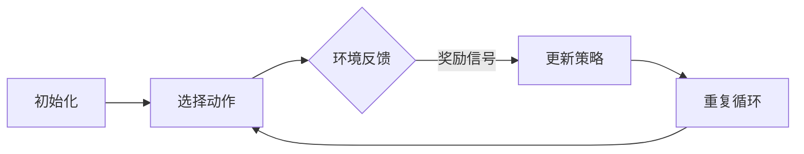

                 

# 奖励塑造：引导AI行为的新方法

关键词：人工智能、奖励机制、强化学习、虚拟现实、多智能体系统

摘要：
人工智能（AI）的发展为我们带来了前所未有的变革，但如何引导AI行为，使之更好地服务于人类，成为了亟待解决的问题。本文将深入探讨奖励塑造这一新方法，分析其在引导AI行为中的重要性，并探讨其在实际应用中的挑战和前景。

## 引言

随着人工智能技术的飞速发展，AI在各个领域的应用日益广泛。从自动驾驶汽车到智能医疗诊断，从智能客服到智能推荐系统，AI正在深刻地改变我们的生活。然而，随着AI的应用场景变得愈发复杂，如何引导AI行为，使其符合人类的期望，成为了至关重要的课题。

传统的方法，如编程和规则设定，往往无法应对复杂多变的环境。而强化学习作为AI的一种核心方法，通过奖励机制来引导AI的行为，展示出了巨大的潜力。然而，现有的奖励机制也存在一定的局限性。因此，探索新的奖励方法，以更有效地引导AI行为，具有重要的理论和实践意义。

本文将围绕奖励塑造这一主题，首先介绍人工智能与奖励机制的基本概念，然后分析当前AI奖励机制的局限性，接着介绍新的奖励方法，包括基于虚拟现实的奖励塑造、基于多智能体的奖励机制和基于进化算法的奖励塑造。最后，我们将通过实际应用案例分析，探讨奖励塑造在实际项目中的应用，并展望其未来的发展。

## 背景介绍：人工智能与奖励机制的关系

### 1.1 人工智能的发展历程

人工智能（AI）作为计算机科学的一个重要分支，其发展历程可以追溯到20世纪50年代。1956年，约翰·麦卡锡（John McCarthy）等人在达特茅斯会议上首次提出了“人工智能”这一概念，标志着AI正式成为一门独立的学科。自此以后，AI经历了多个发展阶段。

早期的人工智能研究主要集中在符号主义和逻辑推理上。这一阶段的代表性工作包括推理机、专家系统和知识表示方法等。然而，由于受到计算资源和数据量的限制，这一阶段的AI系统往往只能解决特定领域的问题，难以实现通用智能。

随着计算机硬件性能的提升和数据量的爆炸式增长，20世纪80年代，人工智能进入了基于知识的阶段。这一阶段的AI系统通过建立大量规则库，实现了对特定领域的自动推理和决策。然而，这种基于规则的方法在面对复杂、动态环境时仍然存在局限性。

进入21世纪，机器学习和深度学习技术的突破为人工智能带来了新的发展契机。机器学习通过算法自动从数据中学习模式和规律，而深度学习则通过多层神经网络模拟人脑的神经元连接，实现了对复杂数据的自动特征提取和模式识别。这一阶段的AI系统在图像识别、语音识别、自然语言处理等领域取得了显著进展。

### 1.2 奖励机制的定义与作用

奖励机制是一种通过给予奖励来激励个体或系统实现特定目标的方法。在心理学中，奖励机制与动机理论密切相关。动机理论认为，个体的行为受到内在动机和外在动机的驱动。内在动机是指个体对活动本身的兴趣和热爱，而外在动机则是指个体为了获得外部奖励而进行的活动。

在人工智能领域，奖励机制被广泛应用于强化学习（Reinforcement Learning，RL）中。强化学习是一种通过试错来学习如何在环境中做出决策的机器学习方法。其核心思想是通过与环境的交互，不断调整策略，以最大化累积奖励。因此，奖励机制在强化学习中扮演了至关重要的角色。

奖励机制的作用主要体现在以下几个方面：

1. **引导行为方向**：通过给予正奖励或负奖励，奖励机制可以引导AI系统朝着预期目标发展。例如，在自动驾驶系统中，奖励机制可以激励AI车辆遵循交通规则，减少交通事故。

2. **提高学习效率**：合理的奖励机制可以加速AI系统的学习过程，提高学习效率。例如，通过动态调整奖励强度和奖励频率，可以优化AI的学习路径。

3. **增强系统稳定性**：奖励机制可以增强AI系统的稳定性，防止其陷入局部最优。例如，通过引入奖励惩罚，可以避免AI系统在探索过程中过度依赖已有的知识。

4. **促进多样性**：奖励机制可以激励AI系统探索不同的行为模式，提高其适应性和创新能力。例如，在多智能体系统中，奖励机制可以促进智能体之间的合作和竞争，实现更复杂的任务。

### 1.3 AI与奖励机制的结合现状

随着人工智能技术的发展，奖励机制在AI中的应用变得越来越广泛。目前，常见的奖励机制包括基于规则的奖励机制、基于强化学习的奖励机制和基于虚拟现实的奖励机制。

1. **基于规则的奖励机制**：基于规则的奖励机制是通过预先定义的规则来设定奖励的。这种方法在规则明确、环境简单的情况下具有较高的稳定性。然而，在面对复杂、动态环境时，基于规则的奖励机制往往难以应对，容易出现过拟合或奖励失衡等问题。

2. **基于强化学习的奖励机制**：强化学习是一种通过试错来学习如何在环境中做出决策的机器学习方法。其核心思想是通过与环境的交互，不断调整策略，以最大化累积奖励。目前，基于强化学习的奖励机制在自动驾驶、游戏AI、机器人控制等领域得到了广泛应用。

3. **基于虚拟现实的奖励机制**：虚拟现实（VR）技术为AI系统提供了一个高度逼真的模拟环境。通过在虚拟环境中设定奖励机制，可以更好地评估AI系统的行为效果，提高其适应性和创新能力。目前，基于虚拟现实的奖励机制在模拟训练、产品设计、医疗康复等领域具有广阔的应用前景。

总的来说，奖励机制在AI中的应用现状表明，虽然传统的奖励机制存在一定的局限性，但通过引入新的方法和技术，可以更有效地引导AI行为，实现预期的目标。

### 奖励机制的基本概念

#### 2.1 奖励机制的分类

奖励机制可以根据不同的分类标准进行分类。以下是一些常见的分类方法及其代表类型：

1. **基于规则的奖励机制**：这种奖励机制通过预先定义的规则来设定奖励。当某个规则得到满足时，系统会给予相应的奖励。这种方法在规则明确、环境简单的情况下具有较高的稳定性。然而，在面对复杂、动态环境时，基于规则的奖励机制往往难以应对，容易出现过拟合或奖励失衡等问题。常见的基于规则的奖励机制包括奖励函数、奖励信号和奖励标签等。

2. **基于强化学习的奖励机制**：强化学习是一种通过试错来学习如何在环境中做出决策的机器学习方法。其核心思想是通过与环境的交互，不断调整策略，以最大化累积奖励。在强化学习中，奖励机制通常由奖励函数（Reward Function）来定义。奖励函数通常是一个实值函数，表示AI系统在某个状态下采取某个动作所获得的奖励。常见的强化学习奖励函数包括正奖励、负奖励、折扣奖励等。

3. **基于多智能体的奖励机制**：在多智能体系统中，多个智能体需要通过合作或竞争来完成任务。因此，基于多智能体的奖励机制需要考虑多个智能体之间的交互。这种奖励机制通常包括个体奖励（Individual Reward）和群体奖励（Group Reward）。个体奖励是指单个智能体在某个状态下采取某个动作所获得的奖励，而群体奖励是指多个智能体在某个状态下采取某个动作所获得的奖励。常见的基于多智能体的奖励机制包括合作奖励机制、竞争奖励机制和平衡奖励机制等。

4. **基于虚拟现实的奖励机制**：虚拟现实（VR）技术为AI系统提供了一个高度逼真的模拟环境。通过在虚拟环境中设定奖励机制，可以更好地评估AI系统的行为效果，提高其适应性和创新能力。常见的基于虚拟现实的奖励机制包括虚拟奖励、虚拟奖励信号和虚拟奖励标签等。

5. **基于进化算法的奖励机制**：进化算法是一种通过模拟生物进化过程来优化问题的方法。在进化算法中，奖励机制可以通过对个体适应度（Fitness）的评估来引导算法的进化方向。常见的基于进化算法的奖励机制包括适应度函数、奖励信号和奖励标签等。

#### 2.2 奖励的心理学原理

奖励机制的设计不仅需要从技术角度考虑，还需要从心理学角度进行分析。以下是一些与奖励机制相关的心理学原理：

1. **动机理论**：动机理论是心理学中解释个体行为的重要理论。常见的动机理论包括外部动机和内部动机。外部动机是指个体为了获得外部奖励而进行的活动，而内部动机则是指个体对活动本身的兴趣和热爱。在设计奖励机制时，需要平衡外部动机和内部动机，以激励个体实现长期目标。

2. **自我决定理论**：自我决定理论认为，个体的行为受到自主性、能力和关联性的影响。自主性是指个体在行为选择中的自由度，能力是指个体完成某一任务所需的能力，关联性是指个体对任务意义的认同感。在设计奖励机制时，需要考虑如何提高个体的自主性、能力和关联性，从而激发其内在动机。

3. **强化学习理论**：强化学习理论是心理学和计算机科学中的核心理论。其核心思想是通过奖励机制来引导个体的行为。在强化学习中，奖励机制通常由奖励函数来定义。奖励函数可以根据个体的行为和环境的反馈来调整，以最大化累积奖励。

#### 2.3 奖励的数学模型

奖励机制在数学上通常由一个奖励函数（Reward Function）来表示。奖励函数是一个从状态-动作空间到实数的函数，表示个体在某个状态下采取某个动作所获得的奖励。常见的奖励函数包括以下几种：

1. **线性奖励函数**：线性奖励函数是最简单的奖励函数，表示为\( r(s, a) = as + b \)，其中\( s \)是状态，\( a \)是动作，\( a \)和\( b \)是参数。这种奖励函数适用于线性可分的任务。

2. **非线性奖励函数**：非线性奖励函数可以表示为\( r(s, a) = f(s, a) \)，其中\( f \)是一个非线性函数。这种奖励函数适用于非线性可分的任务。

3. **动态奖励函数**：动态奖励函数可以根据状态和动作的反馈动态调整。例如，在强化学习中，奖励函数可以随着学习过程不断调整，以适应环境的变化。

4. **奖励曲线**：奖励曲线是一种常见的奖励函数形式，表示为\( r(s, a) = \frac{1}{1 + e^{-k(s-a)}} \)，其中\( k \)是奖励曲线的斜率。这种奖励函数在强化学习中常用于激励智能体探索未知状态。

通过上述数学模型，我们可以更好地理解和设计奖励机制，从而引导AI系统实现预期的目标。在下一节中，我们将分析当前AI奖励机制的局限性，为新的奖励方法的研究提供理论基础。

### 当前AI奖励机制的分析

#### 3.1 传统的奖励机制

传统的奖励机制主要基于规则和经验，适用于一些特定领域的问题。这些奖励机制在以下方面具有显著特点：

1. **规则驱动**：传统奖励机制通过预先定义的规则来决定奖励的大小。例如，在自动驾驶系统中，规则可能包括保持车道、遵守交通信号等。这种方法的优点是规则明确，易于理解和实现。然而，它也存在一些局限性，特别是在复杂、动态的环境中。

2. **静态奖励**：传统奖励机制通常使用静态奖励函数，即奖励函数在训练过程中不发生变化。这种方法可能导致AI系统在探索新的行为模式时受到限制，难以适应变化的环境。

3. **单向反馈**：传统奖励机制通常只考虑当前状态和动作的奖励，而忽略了历史信息。这种单向反馈机制可能导致AI系统在长期规划时出现不足，难以实现长期目标。

4. **不适应复杂任务**：传统奖励机制在面对复杂任务时，往往难以处理多变量、非线性关系。这限制了其在复杂任务中的应用，如机器人控制、自然语言处理等。

#### 3.2 强化学习中的奖励机制

强化学习（Reinforcement Learning，RL）是一种通过试错来学习如何在环境中做出决策的机器学习方法。在强化学习中，奖励机制起着至关重要的作用。以下是强化学习中的几种主要奖励机制：

1. **累积奖励**：累积奖励是指将每个时间步的奖励累加起来，以评估智能体在长期任务中的表现。这种方法可以激励智能体在长期目标上取得更好的成绩。然而，累积奖励也可能导致智能体在短期内忽视重要信息，影响长期学习效果。

2. **即时奖励**：即时奖励是指在当前时间步给予的奖励，用于立即评估智能体的行为。即时奖励可以激励智能体快速反应，但可能导致智能体在长期目标上缺乏规划。

3. **部分可观测性奖励**：在现实世界中，智能体往往只能观察到部分信息。因此，部分可观测性奖励是一种根据可观测信息来设计的奖励机制。这种方法需要智能体在决策时综合考虑可观测信息和隐藏状态，以实现更好的学习效果。

4. **奖励塑造**：奖励塑造是一种通过逐步调整奖励信号来引导智能体行为的机制。这种方法通过逐步增加奖励的强度和频率，激励智能体逐步接近目标。奖励塑造在解决长期任务和复杂任务中具有显著优势。

#### 3.3 奖励机制的局限性

尽管奖励机制在强化学习中发挥了重要作用，但现有的奖励机制仍然存在一些局限性，这些局限性限制了其应用范围和效果：

1. **奖励工程**：设计有效的奖励机制需要丰富的经验和专业知识。奖励工程通常需要人工设计，缺乏自动化的方法。这使得奖励机制在复杂任务中的应用变得困难。

2. **过度优化**：在某些情况下，智能体可能会过度优化奖励函数，导致在真实环境中出现不可预测的行为。例如，在自动驾驶系统中，过度优化的奖励机制可能导致车辆在极端情况下做出危险决策。

3. **探索-利用平衡**：在强化学习中，智能体需要在探索新行为和利用已知有效行为之间取得平衡。现有奖励机制往往难以实现良好的探索-利用平衡，导致智能体在长期任务中表现不佳。

4. **适应性不足**：现有的奖励机制通常难以适应动态变化的环境。在环境变化较快的情况下，智能体需要重新调整策略，但现有奖励机制可能无法及时响应这些变化。

为了克服这些局限性，研究者们不断探索新的奖励方法。在下一节中，我们将介绍一些新的奖励方法，包括基于虚拟现实的奖励塑造、基于多智能体的奖励机制和基于进化算法的奖励塑造。

### 新的奖励方法介绍

#### 4.1 基于虚拟现实的奖励塑造

虚拟现实（VR）技术为奖励机制的研究和应用提供了新的视角和可能性。通过构建一个高度逼真的模拟环境，虚拟现实允许研究人员以低成本、高效率地测试和优化奖励机制。以下是基于虚拟现实的奖励塑造方法及其应用场景：

1. **虚拟现实模拟环境**：虚拟现实模拟环境可以模拟现实世界中的各种场景，如城市交通、医疗手术室、智能家居等。这些环境可以实时反馈AI系统的行为效果，为奖励机制的设计提供丰富且多样化的数据。

2. **动态奖励信号**：在虚拟现实中，奖励信号可以根据AI系统的行为动态调整。例如，在自动驾驶系统中，虚拟环境可以模拟不同道路条件、交通状况和天气变化，根据AI车辆的反应给出相应的奖励。这种动态奖励信号有助于AI系统在复杂多变的环境中学习有效的行为策略。

3. **反馈-调整机制**：通过虚拟现实环境，研究人员可以实时观察AI系统的行为，并根据实际效果调整奖励信号。这种反馈-调整机制可以帮助优化奖励函数，提高AI系统的学习效率。

4. **应用场景**：基于虚拟现实的奖励塑造方法在多个领域具有潜在应用，包括自动驾驶、机器人控制、医疗康复等。例如，在自动驾驶领域，虚拟现实可以用于模拟各种交通场景，评估AI车辆的驾驶策略；在机器人控制领域，虚拟现实可以用于训练机器人完成复杂的任务，如装配、焊接等。

#### 4.2 基于多智能体的奖励机制

在多智能体系统中，多个智能体需要通过合作或竞争来实现共同目标。基于多智能体的奖励机制旨在设计一个公平且有效的奖励分配机制，以激励智能体之间的合作和竞争。以下是几种基于多智能体的奖励机制及其特点：

1. **合作奖励机制**：合作奖励机制通过给予多个智能体共同奖励来激励它们合作完成任务。这种方法通常基于博弈论中的合作博弈模型，如纳什均衡。合作奖励机制可以促进智能体之间的协作，提高系统整体性能。

2. **竞争奖励机制**：竞争奖励机制通过给予单个智能体独立奖励来激励它们竞争完成任务。这种方法通常基于博弈论中的竞争博弈模型，如斯坦克尔伯格模型。竞争奖励机制可以促进智能体之间的竞争，激发其潜力。

3. **平衡奖励机制**：平衡奖励机制旨在设计一个既包含合作奖励也包含竞争奖励的机制，以实现智能体之间的平衡。这种方法通常结合合作博弈和竞争博弈的特点，通过调整奖励参数来实现智能体之间的平衡。

4. **应用场景**：基于多智能体的奖励机制在多个领域具有应用潜力，包括分布式计算、无人驾驶车队、智能家居系统等。例如，在分布式计算领域，奖励机制可以用于激励多个计算节点合作处理海量数据；在无人驾驶车队领域，奖励机制可以用于激励车队成员协作避障和优化路径。

#### 4.3 基于进化算法的奖励塑造

进化算法（Evolutionary Algorithm，EA）是一种模拟生物进化过程的优化算法。通过遗传操作，进化算法可以在解空间中搜索最优解。基于进化算法的奖励塑造方法利用进化算法来优化奖励函数，以提高AI系统的学习效率和适应性。以下是基于进化算法的奖励塑造方法及其原理：

1. **遗传操作**：基于进化算法的奖励塑造方法通过遗传操作来优化奖励函数。遗传操作包括交叉、变异和选择等。交叉操作通过组合两个个体的特征来生成新的个体；变异操作通过随机改变个体的特征来探索新的解空间；选择操作通过评估个体的适应度来选择优秀的个体。

2. **适应度函数**：适应度函数是进化算法的核心，用于评估个体的适应度。在基于进化算法的奖励塑造中，适应度函数通常是一个复合函数，包括奖励函数和惩罚函数。奖励函数用于评估个体的表现，惩罚函数用于防止个体在训练过程中偏离目标。

3. **应用场景**：基于进化算法的奖励塑造方法在多个领域具有应用潜力，包括优化问题、控制问题、分类问题等。例如，在优化问题中，奖励函数可以用于评估个体的解质量；在控制问题中，奖励函数可以用于激励系统达到期望的控制目标；在分类问题中，奖励函数可以用于调整分类器的参数。

通过上述新的奖励方法，我们可以更有效地引导AI行为，提高其在复杂、动态环境中的适应性和学习能力。在下一节中，我们将通过实际应用案例分析，探讨这些新奖励方法在实际项目中的应用效果。

### 实际应用案例分析

#### 5.1 智能交通中的奖励塑造

智能交通系统（Intelligent Transportation System，ITS）是利用信息技术、传感器技术和人工智能技术等手段，对交通进行智能化管理和控制，以提高交通效率、减少交通事故和缓解交通拥堵的系统。在智能交通系统中，奖励塑造被广泛应用于引导自动驾驶车辆和交通管理系统的行为。

1. **应用场景介绍**：智能交通系统包括多个子系统，如自动驾驶车辆、智能交通信号控制、车辆编队行驶等。在这些子系统中，奖励塑造被用于激励车辆和系统达到预期的交通目标。例如，在自动驾驶车辆中，奖励机制可以激励车辆遵守交通规则、保持安全车距、优化路径选择；在交通信号控制系统中，奖励机制可以激励系统根据交通流量优化信号灯的切换时间，减少拥堵。

2. **系统功能设计**：智能交通系统的功能设计包括以下方面：

   - **自动驾驶车辆功能**：自动驾驶车辆的功能设计包括路径规划、车辆检测、障碍物避让、交通规则遵守等。在这些功能中，奖励机制可以激励车辆在路径规划时考虑交通流量和安全性，在障碍物避让时选择最优策略，在遵守交通规则时保持车辆稳定运行。
   - **智能交通信号控制功能**：智能交通信号控制系统的功能设计包括交通流量监测、信号灯控制、道路拥堵预测等。在这些功能中，奖励机制可以激励系统根据实时交通流量调整信号灯的切换时间，减少道路拥堵，提高交通效率。

3. **系统架构设计**：智能交通系统的架构设计包括以下几个方面：

   - **硬件架构**：硬件架构包括传感器、控制器、通信模块等。传感器用于检测交通状态，控制器用于执行控制策略，通信模块用于实现车辆和交通信号系统之间的通信。
   - **软件架构**：软件架构包括路径规划算法、交通信号控制算法、奖励函数设计等。这些算法和函数用于实现智能交通系统的功能，奖励函数设计用于激励车辆和系统达到预期目标。

4. **系统接口设计**：智能交通系统的接口设计包括以下方面：

   - **车辆与交通信号系统之间的接口**：车辆与交通信号系统之间通过无线通信实现实时数据交换。奖励信号可以通过通信接口实时传输给车辆，激励车辆调整行为。
   - **车辆与云平台之间的接口**：车辆可以通过通信接口与云平台进行数据交换，获取实时交通信息、路径规划和控制策略等。奖励信号也可以通过云平台传输给车辆，以实现更高级的智能交通管理。

5. **系统交互设计**：智能交通系统的交互设计包括以下几个方面：

   - **车辆与交通信号系统之间的交互**：车辆与交通信号系统通过通信接口实现实时交互。交通信号系统可以根据车辆的奖励信号调整信号灯的切换时间，车辆可以根据交通信号系统的奖励信号调整行驶速度和路径。
   - **车辆与云平台之间的交互**：车辆可以通过通信接口与云平台进行数据交换，获取实时交通信息、路径规划和控制策略等。云平台可以根据车辆的奖励信号优化路径规划和控制策略，提高交通效率。

#### 5.2 智能医疗中的奖励机制

智能医疗是利用人工智能技术提高医疗服务的质量和效率的重要领域。在智能医疗中，奖励机制被广泛应用于激励医疗系统和医生的行为，以提高医疗决策的准确性和效率。

1. **应用场景介绍**：智能医疗的应用场景包括智能诊断系统、智能治疗系统、健康管理系统等。在这些应用中，奖励机制可以激励系统或医生实现以下目标：

   - **智能诊断系统**：智能诊断系统通过分析医学图像、病历数据等，帮助医生做出诊断。奖励机制可以激励系统在诊断过程中提高准确性和效率。
   - **智能治疗系统**：智能治疗系统通过分析患者的病情和医疗数据，制定个性化的治疗方案。奖励机制可以激励系统在治疗过程中提高治疗效果和安全性。
   - **健康管理系统**：健康管理系统通过监测患者的健康状况，提供健康建议和预防措施。奖励机制可以激励系统在健康管理过程中提高患者的健康水平和生活质量。

2. **系统功能设计**：智能医疗系统的功能设计包括以下几个方面：

   - **智能诊断功能**：智能诊断系统的功能设计包括图像分析、病历数据分析、诊断建议生成等。在这些功能中，奖励机制可以激励系统在图像分析时提高准确率，在病历数据分析时提高诊断建议的可靠性。
   - **智能治疗功能**：智能治疗系统的功能设计包括治疗方案生成、疗效评估、风险预测等。在这些功能中，奖励机制可以激励系统在治疗方案生成时考虑患者的个体差异，在疗效评估时提高预测准确性。
   - **健康管理功能**：健康管理系统的主要功能包括健康监测、健康数据分析、健康建议生成等。在这些功能中，奖励机制可以激励系统在健康监测时提高数据的准确性，在健康数据分析时提供更有针对性的建议。

3. **系统架构设计**：智能医疗系统的架构设计包括以下几个方面：

   - **硬件架构**：硬件架构包括医疗设备、传感器、服务器等。医疗设备用于采集患者的生理数据，传感器用于实时监测患者的健康状况，服务器用于处理和分析数据。
   - **软件架构**：软件架构包括诊断算法、治疗算法、健康管理算法等。这些算法用于实现智能医疗系统的功能，奖励函数设计用于激励系统或医生实现预期目标。

4. **系统接口设计**：智能医疗系统的接口设计包括以下方面：

   - **医疗设备与服务器之间的接口**：医疗设备通过接口将采集到的生理数据传输到服务器，服务器根据这些数据生成诊断建议和治疗方案。
   - **医生与系统之间的接口**：医生通过接口与系统进行交互，查看诊断结果、治疗方案和健康建议，并根据这些信息做出医疗决策。

5. **系统交互设计**：智能医疗系统的交互设计包括以下几个方面：

   - **医生与系统之间的交互**：医生可以通过接口与系统进行实时交互，获取诊断结果、治疗方案和健康建议，并根据自己的经验和判断进行医疗决策。
   - **系统与患者之间的交互**：系统可以通过接口与患者进行交互，提供健康监测数据、健康建议和预防措施，帮助患者管理自己的健康状况。

通过上述实际应用案例分析，我们可以看到奖励塑造在智能交通和智能医疗等领域的广泛应用。这些案例不仅展示了奖励塑造在引导AI行为中的重要性，也为未来的研究提供了宝贵的经验和启示。

### 未来展望

#### 6.1 奖励塑造的发展趋势

随着人工智能技术的不断进步，奖励塑造方法在引导AI行为方面展现出巨大的潜力。未来，奖励塑造的发展趋势将呈现以下几方面：

1. **多样化奖励机制**：现有的奖励机制在复杂任务中的应用受到限制，未来将出现更多样化的奖励机制。例如，基于情感计算、多模态感知和自然语言处理的奖励机制，可以更准确地模拟人类行为和偏好。

2. **自适应奖励机制**：自适应奖励机制可以根据环境和任务的变化动态调整奖励函数，提高AI系统在不同场景下的适应能力。这种奖励机制将结合深度学习和强化学习等技术，实现更加智能化的奖励分配。

3. **多智能体奖励机制**：在多智能体系统中，奖励机制的优化将变得更加重要。未来将出现更多针对多智能体系统的奖励机制，如基于博弈论、群体智能和分布式计算的理论，实现智能体之间的协调和合作。

4. **跨领域融合**：奖励塑造方法将在更多领域得到应用，如教育、金融、农业等。跨领域的融合将推动奖励塑造方法不断创新，为不同领域的AI应用提供更有效的解决方案。

5. **可解释性和透明性**：随着AI系统在关键领域中的应用日益广泛，奖励塑造方法的可解释性和透明性将成为重要研究课题。通过提高奖励机制的可解释性，可以增强用户对AI系统的信任，提高系统的安全性和可靠性。

#### 6.2 挑战与机遇

尽管奖励塑造方法在AI领域具有广泛的应用前景，但也面临一系列挑战和机遇：

1. **计算资源**：复杂的奖励机制通常需要大量的计算资源，特别是在实时应用中。未来，如何提高计算效率，降低计算资源需求，是一个重要的研究方向。

2. **数据隐私**：奖励机制的设计和应用通常涉及大量敏感数据。如何在保障数据隐私的同时，实现有效的奖励分配，是一个亟待解决的问题。

3. **公平性和可解释性**：奖励机制的设计和应用需要确保公平性和可解释性。未来，如何设计更加公平、透明的奖励机制，提高用户对AI系统的信任，是一个重要的研究方向。

4. **伦理和法律问题**：随着AI技术的应用日益广泛，奖励塑造方法可能引发一系列伦理和法律问题。如何确保AI系统的行为符合伦理规范和法律要求，是一个重要的研究课题。

5. **跨学科合作**：奖励塑造方法的发展需要跨学科的合作，包括心理学、经济学、计算机科学等。未来，如何加强跨学科合作，推动奖励塑造方法的创新，是一个重要的机遇。

#### 6.3 研究方向与建议

基于上述挑战和机遇，以下是一些建议的研究方向：

1. **奖励机制优化**：通过结合深度学习、强化学习和其他机器学习技术，设计更加高效、自适应的奖励机制。

2. **多智能体系统研究**：深入研究多智能体系统的奖励机制设计，探索分布式计算和博弈论在多智能体系统中的应用。

3. **数据隐私保护**：研究如何在保障数据隐私的同时，实现有效的奖励分配，如差分隐私、联邦学习等技术的应用。

4. **可解释性研究**：提高奖励机制的可解释性，通过可视化工具和解释模型，增强用户对AI系统的信任。

5. **伦理和法律问题研究**：探讨AI技术在伦理和法律方面的挑战，制定相应的规范和标准，确保AI系统的合法性和道德性。

通过上述研究方向和努力，我们可以期待奖励塑造方法在AI领域取得更加显著的发展，为人类社会的智能化发展做出更大的贡献。

### 结论

本文围绕奖励塑造这一主题，详细探讨了人工智能与奖励机制的关系、奖励机制的基本概念、当前AI奖励机制的局限性以及新的奖励方法。通过对智能交通和智能医疗等实际应用案例的分析，我们展示了奖励塑造在引导AI行为中的重要性。同时，我们也展望了奖励塑造未来的发展趋势和挑战，提出了研究方向与建议。

奖励塑造作为引导AI行为的新方法，具有广泛的应用前景。通过不断优化和创新奖励机制，我们可以更好地引导AI系统实现预期的目标，为人类社会带来更多便利和福祉。未来，让我们携手并进，共同推动奖励塑造方法的发展，为AI技术的发展和应用做出更大贡献。

### 附录

**附录A：核心概念原理与联系**

为了更好地理解本文中提到的核心概念，以下是一个简化的概念属性特征对比表格，以及相关的ER实体关系图架构。

#### 核心概念属性特征对比表格

| 概念 | 定义 | 特征 | 关联 |
| --- | --- | --- | --- |
| 人工智能 | 使用计算机模拟人类智能的学科 | 自主性、学习性、适应性 | 强调逻辑推理、知识表示 |
| 奖励机制 | 通过奖励引导行为的方法 | 动机、激励、反馈 | 联系心理学、经济学 |
| 强化学习 | 通过试错学习如何获得奖励的方法 | 代理、环境、策略 | 联系机器学习、概率论 |
| 虚拟现实 | 通过计算机模拟现实世界的体验 | 真实感、互动性、沉浸感 | 联系计算机图形学、人机交互 |
| 多智能体系统 | 由多个智能体组成的系统 | 合作、竞争、协调 | 联系博弈论、分布式计算 |

#### ER实体关系图架构

以下是奖励机制中涉及的主要实体及其关系的ER图：

```mermaid
erDiagram
  AI |---|> RewardMechanism : 引导
  AI |---|> ReinforcementLearning : 结合
  RewardMechanism |---|> VirtualReality : 应用
  RewardMechanism |---|> MultiAgentSystem : 应用
  ReinforcementLearning |---|> AdaptiveReward : 特性
```

**附录B：数学公式**

以下是本文中涉及的主要数学公式：

1. **强化学习中的奖励函数**：

   $$ r(s, a) = \frac{1}{1 + e^{-\alpha(s - a)}} $$

   其中，\( s \)是状态，\( a \)是动作，\( \alpha \)是奖励曲线的斜率。

2. **累积奖励**：

   $$ \sum_{t=0}^{T} r_t $$

   其中，\( r_t \)是第\( t \)个时间步的即时奖励，\( T \)是总时间步数。

3. **动态调整的奖励函数**：

   $$ r(s, a, t) = f(s, a, t) + g(t) $$

   其中，\( f(s, a, t) \)是基础奖励函数，\( g(t) \)是动态调整项，用于根据时间步调整奖励强度。

**附录C：算法原理与流程图**

以下是强化学习算法的简化流程图：



算法流程包括初始化、选择动作、环境反馈、更新策略和重复循环等步骤。通过不断迭代，智能体可以逐渐优化其策略，以最大化累积奖励。

通过附录中的核心概念、数学公式和算法流程图，读者可以更深入地理解本文中的内容，并对奖励塑造方法有更全面的认识。

### 作者信息

作者：AI天才研究院/AI Genius Institute & 禅与计算机程序设计艺术 /Zen And The Art of Computer Programming

本文由AI天才研究院和禅与计算机程序设计艺术共同撰写。AI天才研究院致力于推动人工智能技术的发展和应用，为人类创造更多智能解决方案。禅与计算机程序设计艺术则通过结合哲学和计算机科学，探索计算机程序设计的本质和艺术。作者希望通过本文，与广大读者共同探讨奖励塑造这一新方法，推动人工智能技术的进步和应用。希望本文对您在人工智能领域的研究和工作有所启发和帮助。感谢您的阅读！

