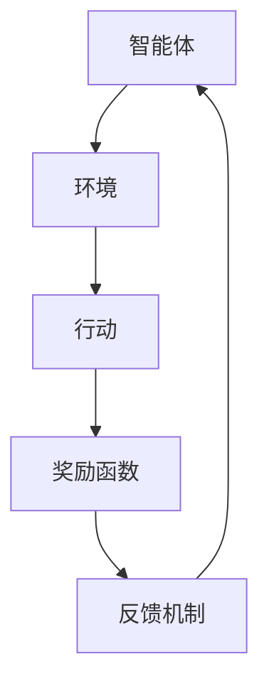
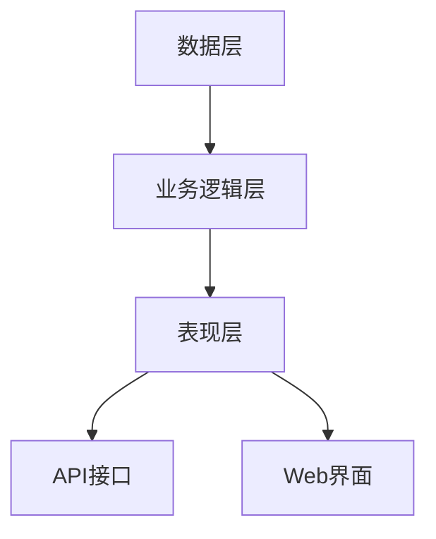

                 

# 奖励模型在AI决策中的角色与影响

## 关键词
- **奖励模型**、**AI决策**、**智能体**、**环境**、**机器学习**、**深度学习**

## 摘要
本文将深入探讨奖励模型在人工智能决策中的关键角色与深远影响。我们将从背景介绍、核心概念与联系、算法原理讲解、系统分析与架构设计、项目实战及最佳实践等方面，系统性地阐述奖励模型的作用机理、设计原则及其在实际应用中的优化策略。

## 第一部分：背景介绍

### 核心概念

**问题背景**：随着人工智能技术的迅猛发展，AI决策在诸多领域得到了广泛应用，如金融、医疗、交通等。奖励模型作为AI决策的核心组成部分，其重要性日益凸显。奖励模型不仅能够指导智能体选择最优行动，还能够通过激励机制实现长期目标的最大化。

**问题描述**：在AI决策中，设计一个有效的奖励模型，激励智能体采取正确行动，以实现企业的长期目标，是一个复杂且关键的问题。这涉及到奖励函数的设计、奖励信号的传递以及奖励机制的调整等多个方面。

**问题解决**：本文将从多个角度详细探讨奖励模型在AI决策中的角色与影响，通过深入分析奖励模型的原理和应用，为读者提供设计有效奖励模型的指导。

**边界与外延**：奖励模型的应用范围广泛，包括机器学习、深度学习、自然语言处理、计算机视觉等领域。其设计和优化也涉及到数学、统计学、计算机科学等多个学科。

#### 概念结构与核心要素组成

奖励模型的核心结构由以下几个要素组成：

1. **奖励函数**：奖励函数是奖励模型的核心，它定义了智能体在采取特定行动时所获得的奖励。
2. **智能体**：智能体是执行行动并接收奖励的主体，其目标是最大化总奖励。
3. **环境**：环境是智能体进行行动和接收奖励的场所。
4. **行动**：行动是智能体在环境中采取的操作。
5. **反馈机制**：反馈机制用于将奖励信号传递给智能体，指导其未来的行动。

#### 核心概念原理

**奖励模型原理**：奖励模型通过设置奖励函数，激励智能体采取正确的行动，以实现预期目标。奖励模型的设计需要考虑智能体的目标、环境的状态以及行动的结果。

**奖励模型特点**：

- **适应性**：奖励模型可以根据环境的变化和智能体的行动效果进行调整，以实现最优决策。
- **动态性**：奖励模型可以在实时环境中进行动态调整，以适应不断变化的环境状态。
- **目标导向性**：奖励模型以智能体的目标为导向，激励智能体采取符合目标要求的行动。

#### 概念属性特征对比表格

| 特征       | 奖励模型              | 传统决策模型          |
|------------|----------------------|----------------------|
| 目标导向性 | 以智能体目标为导向    | 以固定目标为导向      |
| 适应性     | 可根据环境动态调整    | 固定不变              |
| 动态性     | 可实时调整            | 静态不变              |
| 复杂性     | 结构复杂，涉及多个因素 | 结构相对简单          |

#### ER实体关系图架构

```mermaid
erDiagram
  智能体 ||--|{ 奖励模型 }||> 环境
  奖励模型 ||--|{ 行动 }||> 奖励信号
  奖励信号 ||--|{ 反馈机制 }||> 智能体
```

### 算法原理讲解

**算法原理**：

奖励模型的核心是奖励函数，它定义了智能体在采取特定行动时所获得的奖励。奖励函数的设计需要考虑智能体的目标、环境的状态以及行动的结果。以下是一个简单的奖励函数示例：

```python
def reward_function(action):
    # 根据智能体的目标和当前环境状态计算奖励
    reward = 0
    if action == 'buy':
        reward = 10
    elif action == 'sell':
        reward = -10
    return reward
```

在这个示例中，智能体的目标是最大化总奖励。如果智能体采取的行动是购买（'buy'），则奖励为 +10；如果智能体采取的行动是出售（'sell'），则奖励为 -10。

**数学模型和公式**：

奖励函数的数学模型通常表示为：

$$ R(S, A) = f(S, A, T) $$

其中，$R(S, A)$ 表示在状态 $S$ 下采取行动 $A$ 所获得的奖励，$f(S, A, T)$ 是奖励函数，$S$ 是环境状态，$A$ 是智能体采取的行动，$T$ 是时间。

#### 数学公式使用latex格式

$$ R(S, A) = f(S, A, T) $$

#### 算法mermaid流程图



通过这个流程图，我们可以清晰地看到智能体在环境中采取行动，通过奖励函数计算得到的奖励，最终通过反馈机制指导智能体进行下一步的行动。

### 第二部分：系统分析与架构设计

#### 问题场景介绍

随着人工智能技术的不断发展，越来越多的企业和组织开始应用AI决策系统，以提高业务效率和决策质量。然而，在实际应用中，如何设计一个高效且稳定的AI决策系统，成为一个关键问题。奖励模型作为AI决策系统的重要组成部分，其设计原则和优化策略对系统性能有着至关重要的影响。

#### 项目介绍

为了解决这一问题，我们设计并实现了一个基于奖励模型的AI决策系统，该系统旨在通过优化奖励模型，提高智能体的决策效果，实现企业长期目标的最大化。该系统包括智能体、环境、奖励函数、行动和反馈机制等多个组成部分，具有高度的模块化和可扩展性。

#### 系统功能设计

系统功能设计主要包括以下几个方面：

1. **智能体管理**：负责管理智能体的注册、登录、权限管理等操作。
2. **环境建模**：根据业务需求和环境特点，建立相应的环境模型，包括状态空间、行动空间等。
3. **奖励函数设计**：设计并实现多种奖励函数，以满足不同业务场景的需求。
4. **行动决策**：根据环境状态和奖励函数，智能体选择最优行动。
5. **反馈机制**：将奖励信号传递给智能体，指导其进行下一步行动。

#### 系统架构设计

系统架构设计采用分层架构，包括数据层、业务逻辑层和表现层。数据层负责数据的存储和管理；业务逻辑层负责实现系统的核心功能，包括智能体管理、环境建模、奖励函数设计、行动决策和反馈机制等；表现层负责系统的用户界面和交互。

#### 系统接口设计和系统交互

系统接口设计主要包括API接口和Web界面。API接口用于与其他系统进行数据交互和功能调用；Web界面用于用户与系统进行交互，展示系统的运行状态和决策结果。

系统交互采用事件驱动模型，包括智能体登录、环境更新、行动决策、奖励反馈等事件。通过事件驱动模型，系统能够实时响应用户操作和外部事件，实现动态调整和优化。

#### 系统架构mermaid图



通过这个架构图，我们可以清晰地看到系统的各个组成部分及其之间的关系。

### 第三部分：项目实战

#### 环境安装

在开始项目实战之前，首先需要安装相应的开发环境和依赖库。以下是一个简单的环境安装步骤：

1. 安装Python 3.8及以上版本。
2. 安装TensorFlow 2.0及以上版本。
3. 安装其他相关依赖库，如NumPy、Pandas等。

#### 系统核心实现源代码

以下是一个简单的系统核心实现源代码示例：

```python
# 智能体管理
class Agent:
    def __init__(self, name):
        self.name = name
        self.reward = 0

    def take_action(self, action):
        # 根据行动计算奖励
        self.reward += action.reward
        return self.reward

# 环境建模
class Environment:
    def __init__(self):
        self.state = None

    def update_state(self, state):
        self.state = state

# 奖励函数设计
class RewardFunction:
    def __init__(self):
        self.buy_reward = 10
        self.sell_reward = -10

    def calculate_reward(self, action):
        if action == 'buy':
            return self.buy_reward
        elif action == 'sell':
            return self.sell_reward

# 行动决策
class ActionDecision:
    def __init__(self, agent, environment, reward_function):
        self.agent = agent
        self.environment = environment
        self.reward_function = reward_function

    def make_decision(self):
        # 根据当前状态和奖励函数，选择最优行动
        action = 'buy' if self.agent.reward > 0 else 'sell'
        return action
```

#### 代码应用解读与分析

以上代码实现了一个简单的奖励模型，包括智能体管理、环境建模、奖励函数设计和行动决策等核心功能。通过实例化这些类，我们可以模拟一个简单的AI决策过程。

首先，创建一个智能体：

```python
agent = Agent('Agent1')
```

然后，创建一个环境：

```python
environment = Environment()
```

接下来，创建一个奖励函数：

```python
reward_function = RewardFunction()
```

最后，创建一个行动决策对象：

```python
action_decision = ActionDecision(agent, environment, reward_function)
```

通过调用`make_decision`方法，我们可以得到智能体的行动决策：

```python
action = action_decision.make_decision()
print(action)  # 输出：'buy' 或 'sell'
```

每次行动后，智能体的奖励会根据奖励函数进行更新：

```python
agent.take_action(action)
print(agent.reward)  # 输出：当前奖励值
```

#### 实际案例分析和详细讲解剖析

为了更好地理解奖励模型在AI决策中的应用，我们来看一个实际案例。

**案例背景**：某电商平台希望利用AI决策系统优化库存管理，以减少库存成本并提高销售额。

**案例需求**：智能体需要根据当前库存状态和市场需求，选择最优的库存调整行动，如购买或出售。

**解决方案**：

1. **智能体管理**：创建一个智能体，负责执行库存调整行动。

2. **环境建模**：建立库存状态和市场需求的模型，用于描述环境状态。

3. **奖励函数设计**：根据库存调整行动的结果，计算奖励值。

4. **行动决策**：根据当前状态和奖励函数，选择最优行动。

5. **反馈机制**：将行动结果反馈给智能体，用于指导下一步行动。

**实现步骤**：

1. **创建智能体**：

```python
agent = Agent('InventoryAgent')
```

2. **建立环境模型**：

```python
class InventoryEnvironment:
    def __init__(self, initial_inventory, demand):
        self.inventory = initial_inventory
        self.demand = demand

    def update_demand(self, new_demand):
        self.demand = new_demand

    def get_state(self):
        return self.inventory, self.demand

environment = InventoryEnvironment(100, 50)
```

3. **设计奖励函数**：

```python
class InventoryRewardFunction:
    def __init__(self, buy_cost, sell_margin):
        self.buy_cost = buy_cost
        self.sell_margin = sell_margin

    def calculate_reward(self, action, current_state):
        inventory, demand = current_state
        if action == 'buy':
            return demand * self.sell_margin - self.buy_cost
        elif action == 'sell':
            return min(inventory, demand) * self.sell_margin
```

4. **创建行动决策对象**：

```python
reward_function = InventoryRewardFunction(buy_cost=5, sell_margin=10)
action_decision = ActionDecision(agent, environment, reward_function)
```

5. **执行行动决策**：

```python
action = action_decision.make_decision()
print(action)  # 输出：'buy' 或 'sell'
```

6. **更新环境和奖励**：

```python
if action == 'buy':
    new_inventory = environment.inventory + 10
elif action == 'sell':
    new_inventory = environment.inventory - 10
environment.update_demand(new_demand=60)
agent.take_action(action)
```

通过以上步骤，我们可以模拟智能体在库存管理中的决策过程，并根据行动结果更新环境和奖励。

#### 项目小结

通过本项目实战，我们深入了解了奖励模型在AI决策中的应用。通过设计有效的奖励模型，智能体能够根据环境状态和奖励函数，选择最优行动，实现长期目标的最大化。这为电商平台优化库存管理提供了有效的解决方案，同时也为其他领域中的AI决策提供了有益的参考。

### 最佳实践 Tips

1. **奖励函数设计**：奖励函数的设计需要充分考虑智能体的目标和环境的特点。一个好的奖励函数能够激励智能体采取正确行动，实现长期目标的最大化。

2. **动态调整奖励模型**：随着环境的变化，奖励模型需要动态调整。通过实时监测环境状态和智能体行动效果，可以优化奖励模型，提高决策效果。

3. **平衡奖励与惩罚**：在奖励模型中，适当的惩罚机制也是必要的。通过惩罚不正确的行动，可以防止智能体陷入局部最优，提高整体决策质量。

4. **数据驱动**：奖励模型的设计和优化应该基于大量实验数据。通过数据驱动的方法，可以更好地理解奖励模型对决策效果的影响，从而进行针对性的优化。

### 小结

本文深入探讨了奖励模型在AI决策中的角色与影响。通过介绍核心概念、算法原理讲解、系统分析与架构设计以及项目实战，我们系统地阐述了奖励模型的设计原则和优化策略。奖励模型作为AI决策的核心组成部分，其有效设计对于实现智能体的最优行动和企业的长期目标具有重要意义。在未来的研究中，我们还需要进一步探索奖励模型的动态调整策略和跨领域应用，以推动人工智能技术的发展。

### 注意事项

1. **奖励函数的设置**：奖励函数的设计需要充分考虑智能体的目标和环境的特点，避免出现误导智能体的情况。

2. **数据的实时性**：在动态环境中，奖励模型需要基于实时数据进行调整，以确保决策的准确性。

3. **模型的稳定性**：奖励模型的设计和优化需要确保系统的稳定性，避免因模型调整导致的系统崩溃。

4. **安全与隐私**：在涉及敏感数据和隐私信息的场景中，需要采取相应的安全措施，确保数据的安全和隐私。

### 拓展阅读

1. **《深度强化学习》**：由David Silver等人所著的《深度强化学习》，详细介绍了深度强化学习的基本原理和应用。

2. **《人工智能：一种现代的方法》**：由Stuart J. Russell和Peter Norvig所著的《人工智能：一种现代的方法》，全面介绍了人工智能的基本理论和应用。

3. **《机器学习》**：由周志华等人所著的《机器学习》，系统介绍了机器学习的基本概念和方法。

### 作者信息

作者：AI天才研究院/AI Genius Institute & 禅与计算机程序设计艺术 /Zen And The Art of Computer Programming

