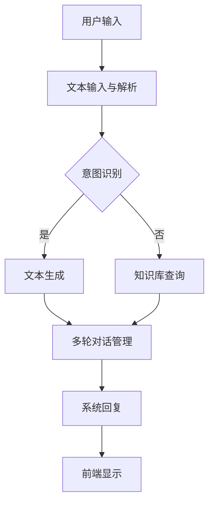

                 

### 《如何在LLM应用开发中实现快速迭代》

> 关键词：语言模型（LLM）、快速迭代、开发实践、性能优化、持续集成与持续部署

> 摘要：本文旨在探讨如何在实际开发中实现语言模型（LLM）的快速迭代。我们将从LLM的基础概念、训练与调优、代码优化、持续集成与部署、迭代与反馈机制以及实战案例等多个方面进行深入分析，旨在为开发者提供一套完整的LLM应用开发流程和方法。

### 目录大纲设计思路

在设计《如何在LLM应用开发中实现快速迭代》的目录大纲时，我们遵循以下步骤：

1. **明确核心章节**：首先，我们确定了书籍的核心章节，这些章节包括LLM的基础概念、快速迭代的实践方法、代码优化与性能提升、持续集成与持续部署以及实战案例等，确保内容完整性和逻辑性。

2. **梳理章节内容**：每个章节都围绕一个明确的主题进行组织，并在下一级目录中细化内容。每个子章节都设置了具体的标题，以便读者能够快速理解章节内容。

3. **应用Mermaid工具**：为了提高文章的可读性和专业性，我们使用了Mermaid工具来绘制流程图、类图和序列图，直观地展示算法原理和系统架构。

4. **确保格式规范**：所有内容都使用Markdown格式编写，遵循1级、2级、3级目录的层次结构，确保目录清晰、易读。

5. **优化字数控制**：在保证内容完整性的同时，严格控制大纲的字数，确保在不超字数限制的前提下提供详尽的目录结构。

### 完整的目录大纲

```markdown
# 《如何在LLM应用开发中实现快速迭代》目录大纲

## 第一部分：LLM基础概念与背景

### 第1章：LLM概述

#### 1.1 人工智能与语言模型的发展历程

##### 1.1.1 人工智能的起源与发展

##### 1.1.2 语言模型的演变

##### 1.1.3 LLM的重要性

#### 1.2 语言模型的原理与工作机制

##### 1.2.1 语言模型的数学基础

##### 1.2.2 语言模型的工作流程

##### 1.2.3 语言模型的应用场景

#### 1.3 LLM的关键技术

##### 1.3.1 词嵌入技术

##### 1.3.2 注意力机制

##### 1.3.3 Transformer架构

### 第2章：LLM的主要类型与应用

#### 2.1 GPT系列模型

##### 2.1.1 GPT-3的介绍与特点

##### 2.1.2 GPT-3的应用场景

##### 2.1.3 GPT-3的性能与局限性

#### 2.2 BERT及其变体

##### 2.2.1 BERT的原理与优势

##### 2.2.2 BERT在自然语言处理中的应用

##### 2.2.3 BERT的优化版本

#### 2.3 其他LLM模型

##### 2.3.1 RoBERTa

##### 2.3.2 T5

##### 2.3.3 其他热门模型介绍

## 第二部分：快速迭代的实践方法

### 第3章：LLM训练与调优

#### 3.1 数据准备与预处理

##### 3.1.1 数据集的选择与处理

##### 3.1.2 数据增强技术

##### 3.1.3 数据标准化与归一化

#### 3.2 模型训练策略

##### 3.2.1 训练策略概述

##### 3.2.2 批处理大小与学习率调度

##### 3.2.3 模型选择与优化

#### 3.3 模型评估与优化

##### 3.3.1 评估指标

##### 3.3.2 模型调优方法

##### 3.3.3 实际案例

### 第4章：代码优化与性能提升

#### 4.1 模型推理优化

##### 4.1.1 GPU与TPU加速

##### 4.1.2 混合精度训练

##### 4.1.3 动态图与静态图模型

#### 4.2 代码优化实践

##### 4.2.1 代码结构优化

##### 4.2.2 运行时优化

##### 4.2.3 内存与时间优化

#### 4.3 性能测试与调优

##### 4.3.1 性能测试工具

##### 4.3.2 性能瓶颈分析

##### 4.3.3 性能调优策略

### 第5章：持续集成与持续部署

#### 5.1 持续集成（CI）

##### 5.1.1 CI的概念与优势

##### 5.1.2 CI流程设计

##### 5.1.3 CI工具选择与实践

#### 5.2 持续部署（CD）

##### 5.2.1 CD的概念与优势

##### 5.2.2 CD流程设计

##### 5.2.3 CD工具选择与实践

### 第6章：迭代与反馈机制

#### 6.1 用户反馈收集

##### 6.1.1 用户反馈的重要性

##### 6.1.2 用户反馈的收集方法

##### 6.1.3 用户反馈分析与应用

#### 6.2 模型迭代与优化

##### 6.2.1 模型迭代的概念与目的

##### 6.2.2 模型迭代的方法与步骤

##### 6.2.3 模型迭代中的挑战与应对

### 第7章：实战案例解析

#### 7.1
```

### 第1章：LLM概述

#### 1.1 人工智能与语言模型的发展历程

##### 1.1.1 人工智能的起源与发展

人工智能（AI）作为计算机科学的一个重要分支，其发展历程可以追溯到20世纪50年代。最早的AI研究主要集中在逻辑推理和问题求解上。1956年，达特茅斯会议的召开标志着人工智能作为一门独立学科的诞生。随后，AI领域经历了多次起伏，从早期的“人工智能寒冬”到21世纪初的“深度学习复兴”，人工智能技术逐渐取得了重大突破。

语言模型是AI的一个重要分支，它旨在模拟人类语言的使用和生成。早期的语言模型主要是基于规则的方法，例如生成句子的语法分析和语义分析。这些方法虽然在一定程度上能够生成符合语法规则的句子，但在理解语义和生成多样性方面存在明显不足。随着深度学习技术的发展，基于神经网络的自动回归模型开始成为语言模型的主流，其中Transformer架构的提出进一步推动了语言模型的发展。

##### 1.1.2 语言模型的演变

语言模型的演变可以分为以下几个阶段：

1. **基于规则的模型**：最早的模型基于语法和语义规则，例如产生式规则和转换语法。这些模型在生成句子时具有一定的灵活性，但处理大规模语言数据时效率较低。

2. **统计模型**：随着自然语言处理（NLP）技术的发展，统计模型逐渐取代了基于规则的模型。这些模型使用统计方法来学习语言数据中的模式和规律，例如隐马尔可夫模型（HMM）和条件随机场（CRF）。

3. **神经网络模型**：随着深度学习技术的兴起，神经网络开始应用于语言模型。最早期的是循环神经网络（RNN），特别是长短期记忆网络（LSTM），它在处理长序列数据时表现出色。

4. **基于注意力的模型**：RNN在处理长序列数据时存在梯度消失和梯度爆炸的问题，为了解决这一问题，研究人员提出了注意力机制。注意力机制通过在处理序列数据时对不同的部分给予不同的关注程度，从而提高了模型的性能。

5. **Transformer架构**：2017年，谷歌提出了Transformer架构，这是一种基于自注意力机制的神经网络模型。Transformer架构在处理长序列数据时表现出色，并在多个NLP任务中取得了突破性成果。

##### 1.1.3 LLM的重要性

语言模型在自然语言处理领域具有重要的地位。它们被广泛应用于以下几个方面：

1. **文本生成**：语言模型可以用于生成各种类型的文本，如新闻报道、文章摘要、对话等。在生成文本时，模型需要考虑语法、语义和上下文信息，从而生成符合人类语言习惯的文本。

2. **机器翻译**：语言模型在机器翻译中发挥着关键作用。通过学习大量双语文本数据，模型可以预测源语言中的每个单词或短语在目标语言中的对应翻译。

3. **问答系统**：语言模型可以用于构建问答系统，例如智能助手和聊天机器人。这些系统需要理解用户的问题，并从大量数据中检索出相关答案。

4. **情感分析**：语言模型可以帮助识别文本中的情感倾向，如正面、负面或中性。这在社交媒体分析和市场调研等领域具有广泛应用。

5. **语音识别**：在语音识别系统中，语言模型用于对识别出的语音进行文本转换。语言模型可以帮助识别出具有相似发音但不同意义的词语。

#### 1.2 语言模型的原理与工作机制

语言模型的核心目标是预测下一个单词或字符。这可以通过以下步骤实现：

1. **输入表示**：首先，需要对输入文本进行预处理，如分词、去停用词等。然后，将文本转换为数字表示，例如词嵌入。

2. **编码器**：编码器是一个神经网络，它将输入表示编码为一个固定长度的向量。这个向量包含了输入文本的主要信息。

3. **自注意力机制**：自注意力机制是Transformer架构的核心部分。它允许模型在处理序列数据时，对不同的部分给予不同的关注程度。自注意力机制通过计算输入序列中每个单词或字符与编码器输出的相关程度，从而为每个单词或字符分配一个权重。

4. **解码器**：解码器是另一个神经网络，它接收编码器输出的向量，并预测下一个单词或字符。解码器使用了一个称为“Masked Multi-head Attention”的机制，以确保模型在预测时只考虑已经生成的部分，而不是尚未生成的部分。

5. **输出表示**：解码器输出的向量被转换为文本表示，例如通过查找词嵌入表。这个文本表示就是模型预测的下一个单词或字符。

#### 1.3 LLM的主要类型与应用

语言模型可以分为多种类型，每种类型都有其特定的应用场景。以下是几种常见的LLM类型及其应用：

1. **GPT系列模型**：GPT（Generative Pre-trained Transformer）系列模型是自然语言处理领域的重要模型，包括GPT-2和GPT-3。这些模型通过预训练和微调，可以在各种NLP任务中取得优异的性能。例如，GPT-3可以用于文本生成、机器翻译和问答系统。

2. **BERT及其变体**：BERT（Bidirectional Encoder Representations from Transformers）模型是一种基于Transformer的双向编码器模型。BERT模型在理解上下文和语义方面具有显著优势，因此被广泛应用于文本分类、命名实体识别和问答系统等任务。

3. **其他LLM模型**：除了GPT和BERT，还有许多其他流行的LLM模型，如RoBERTa、T5和GPT-Neo等。这些模型在特定任务上表现出色，并不断推动NLP技术的发展。

#### 1.4 本章小结

在本章中，我们介绍了人工智能和语言模型的发展历程，详细阐述了语言模型的原理与工作机制，并列举了几种主要的LLM类型及其应用。通过本章的学习，读者可以初步了解LLM的基本概念和关键技术，为后续章节的深入探讨打下基础。

### 第2章：LLM的主要类型与应用

#### 2.1 GPT系列模型

GPT（Generative Pre-trained Transformer）系列模型是自然语言处理领域的重要模型，由OpenAI提出。GPT模型基于Transformer架构，通过预训练和微调，在各种NLP任务中取得了优异的性能。

##### 2.1.1 GPT-3的介绍与特点

GPT-3是GPT系列模型的最新版本，具有以下几个显著特点：

1. **巨大的模型规模**：GPT-3拥有1750亿个参数，是之前版本模型规模的数十倍。这使GPT-3在处理长序列数据和复杂任务时具有更强的能力。

2. **强大的文本生成能力**：GPT-3在文本生成任务中表现出色，可以生成流畅、连贯的文本。这使得GPT-3在创作文章、编写代码和编写对话等方面具有广泛应用。

3. **灵活的微调能力**：GPT-3可以通过微调快速适应特定任务。通过在特定领域的数据上进行微调，GPT-3可以在问答系统、文本分类和机器翻译等任务中取得优异的性能。

4. **跨模态能力**：GPT-3不仅限于文本数据，还可以处理图像、音频和视频等多种模态。这使得GPT-3在多模态任务中具有巨大的潜力。

##### 2.1.2 GPT-3的应用场景

GPT-3在许多领域都有广泛的应用，以下是一些典型的应用场景：

1. **文本生成**：GPT-3可以用于生成文章、故事、新闻报道和产品描述等。在内容创作领域，GPT-3可以帮助提高创作效率，降低创作成本。

2. **对话系统**：GPT-3可以构建智能对话系统，如虚拟助手和聊天机器人。通过预训练和微调，GPT-3可以理解用户的意图，并生成自然、流畅的回答。

3. **机器翻译**：GPT-3在机器翻译领域也表现出色。通过在双语文本上进行微调，GPT-3可以实现高质量的双向翻译。

4. **问答系统**：GPT-3可以用于构建智能问答系统，如在线客服和智能搜索。通过在大量问答数据集上进行微调，GPT-3可以理解用户的问题，并生成准确的答案。

5. **文本分类**：GPT-3可以用于文本分类任务，如情感分析、主题分类和垃圾邮件检测等。通过在标注数据集上进行微调，GPT-3可以识别文本中的关键信息，并对其进行分类。

##### 2.1.3 GPT-3的性能与局限性

GPT-3在多个NLP任务中取得了突破性成果，但仍然存在一些局限性：

1. **资源消耗**：GPT-3拥有巨大的模型规模，需要大量的计算资源和存储空间。这限制了其在资源有限的场景中的应用。

2. **数据依赖**：GPT-3的性能高度依赖于训练数据的质量和多样性。如果训练数据存在偏差，GPT-3可能会产生不准确或有害的输出。

3. **解释性不足**：GPT-3作为一个黑盒模型，其内部工作机制难以解释。这使得在某些需要可解释性的应用场景中，GPT-3可能不够理想。

4. **安全风险**：由于GPT-3可以生成各种文本，包括虚假新闻、恶意言论和诈骗信息等，因此在使用GPT-3时需要特别注意安全性和合规性。

#### 2.2 BERT及其变体

BERT（Bidirectional Encoder Representations from Transformers）模型是由Google提出的一种基于Transformer的双向编码器模型。BERT模型在理解上下文和语义方面具有显著优势，因此被广泛应用于各种NLP任务。

##### 2.2.1 BERT的原理与优势

BERT模型的原理如下：

1. **双向编码器**：BERT模型采用了一个双向Transformer编码器，通过自注意力机制对输入序列进行编码。这使得BERT模型能够同时考虑输入序列的左右上下文，从而更好地理解上下文语义。

2. **掩码语言模型**：BERT模型引入了掩码语言模型（Masked Language Model，MLM）任务，通过对输入序列的部分单词进行掩码，并要求模型预测这些掩码单词。这有助于提高模型对上下文信息的敏感度。

3. **大规模预训练**：BERT模型在大量文本数据上进行大规模预训练，通过学习文本数据中的模式和规律，从而提高模型在各类NLP任务上的性能。

BERT模型的优势包括：

1. **强大的上下文理解能力**：BERT模型能够同时考虑输入序列的左右上下文，从而更好地理解上下文语义。

2. **广泛的适用性**：BERT模型在多种NLP任务上表现出色，如文本分类、命名实体识别和机器翻译等。

3. **预训练效果**：通过大规模预训练，BERT模型在低资源场景中仍然表现出良好的性能。

##### 2.2.2 BERT在自然语言处理中的应用

BERT模型在自然语言处理领域具有广泛的应用，以下是一些典型的应用场景：

1. **文本分类**：BERT模型可以用于对文本进行分类，如情感分析、主题分类和垃圾邮件检测等。通过在标注数据集上进行微调，BERT模型可以识别文本中的关键信息，并对其进行分类。

2. **命名实体识别**：BERT模型可以用于识别文本中的命名实体，如人名、地名和机构名等。通过在命名实体识别数据集上进行微调，BERT模型可以学习识别不同类型的命名实体。

3. **机器翻译**：BERT模型可以用于机器翻译任务，通过在双语文本上进行预训练和微调，BERT模型可以实现高质量的双向翻译。

4. **问答系统**：BERT模型可以用于构建问答系统，如智能助手和聊天机器人。通过在问答数据集上进行预训练和微调，BERT模型可以理解用户的问题，并从大量数据中检索出相关答案。

##### 2.2.3 BERT的优化版本

为了进一步提高BERT模型的性能和应用范围，研究人员提出了许多BERT的优化版本。以下是几个典型的优化版本：

1. **RoBERTa**：RoBERTa是BERT的一个优化版本，它在模型架构、预训练策略和数据集选择等方面进行了改进。RoBERTa在多个NLP任务上取得了比BERT更好的性能。

2. **ALBERT**：ALBERT（A Lite BERT）是对BERT模型进行轻量化和高效化改造的一个版本。通过共享权重、层归一化和跨层交互等技术，ALBERT在保持高性能的同时，减少了模型参数和计算量。

3. **BERT-Large**：BERT-Large是对BERT模型进行扩展的一个版本，它具有更大的模型规模和更多的参数。BERT-Large在自然语言处理任务上取得了比BERT更好的性能。

#### 2.3 其他LLM模型

除了GPT和BERT，还有许多其他流行的LLM模型。以下是几个典型的LLM模型：

##### 2.3.1 RoBERTa

RoBERTa是BERT的一个优化版本，它在模型架构、预训练策略和数据集选择等方面进行了改进。RoBERTa在多个NLP任务上取得了比BERT更好的性能。

1. **模型架构**：RoBERTa在BERT的基础上，引入了更多的小块和更深的网络层，从而提高了模型的容量和性能。

2. **预训练策略**：RoBERTa使用了不同的掩码策略和训练目标，例如动态掩码和单词级别掩码，从而提高了模型的训练效果。

3. **数据集**：RoBERTa在更多的数据集上进行预训练，包括维基百科和图书数据集，从而提高了模型的泛化能力。

##### 2.3.2 T5

T5（Text-To-Text Transfer Transformer）是一种基于Transformer的文本转换模型，由DeepMind提出。T5模型旨在通过将所有NLP任务转换为文本到文本的任务，实现统一的模型架构。

1. **模型架构**：T5模型采用了一个单一的Transformer编码器-解码器架构，通过输入一个目标模板，模型可以生成相应的输出文本。

2. **任务转换**：T5模型将各种NLP任务转换为文本到文本的格式，例如问答、文本分类和命名实体识别等。通过这种方式，T5模型可以在不同的任务上取得良好的性能。

3. **预训练策略**：T5模型在大量数据集上进行预训练，通过学习文本转换任务，从而提高模型在各种NLP任务上的性能。

##### 2.3.3 其他热门模型介绍

除了上述模型，还有许多其他热门的LLM模型，如GPT-Neo、LLaMA和OPT等。以下是这些模型的一些特点：

1. **GPT-Neo**：GPT-Neo是对GPT模型进行改进的一个版本，它在模型架构、训练策略和优化方法等方面进行了优化。

2. **LLaMA**：LLaMA（Language Model for Dialogue Applications）是一种专门为对话系统设计的语言模型，它在对话生成和理解方面表现出色。

3. **OPT**：OPT（Open-Source Pretrained Transformer）是一种开源的预训练Transformer模型，它提供了可扩展性和灵活性，以适应各种NLP任务。

#### 2.4 本章小结

在本章中，我们详细介绍了GPT系列模型、BERT及其变体以及其他热门LLM模型。通过本章的学习，读者可以了解LLM的主要类型和应用场景，为后续章节的深入探讨打下基础。

### 第3章：LLM训练与调优

#### 3.1 数据准备与预处理

在训练语言模型（LLM）之前，数据准备与预处理是至关重要的一步。良好的数据准备与预处理不仅可以提高模型的性能，还可以减少训练时间。

##### 3.1.1 数据集的选择与处理

1. **数据集的选择**：选择合适的数据集是训练高质量LLM的首要任务。数据集应该具有以下特点：

   - **多样性**：数据集应该包含多种类型的文本，以便模型能够学习到不同语境和表达方式。
   - **平衡性**：数据集应该尽量平衡各类文本的比例，避免某些类别过于集中，导致模型偏向于某一类文本。
   - **质量**：数据集应该经过清洗，去除无关内容、错误和噪声，以保证模型的学习质量。

2. **数据集的处理**：对数据集进行适当的处理可以进一步提高模型的性能。以下是一些常用的数据预处理方法：

   - **分词**：将文本分为单个单词或子词，以便模型进行理解和学习。
   - **去除停用词**：停用词是指对模型理解没有实质性贡献的词，如“的”、“是”、“在”等。去除停用词可以减少模型的负担。
   - **词嵌入**：将单词转换为固定长度的向量表示，以便模型进行计算和处理。常见的词嵌入方法包括Word2Vec、GloVe等。

##### 3.1.2 数据增强技术

数据增强技术可以通过增加数据量、丰富数据多样性来提高模型的泛化能力。以下是一些常用的数据增强方法：

1. **文本复制**：将原始文本复制多次，以增加数据量。
2. **同义词替换**：将文本中的特定单词替换为同义词，以丰富数据的表达方式。
3. **随机插入和删除**：在文本中随机插入或删除单词或短语，以增加数据的多样性。
4. **数据合成**：通过生成文本或图像合成新的数据，以增加数据的多样性。

##### 3.1.3 数据标准化与归一化

数据标准化与归一化是为了使数据集中的特征具有相同的尺度，从而提高模型训练的稳定性和效率。以下是一些常用的数据标准化与归一化方法：

1. **标准化**：将数据缩放到一个特定的范围，例如[0, 1]或[-1, 1]。常用的标准化公式为：
   $$
   x_{\text{标准化}} = \frac{x - \mu}{\sigma}
   $$
   其中，$x$ 是原始数据，$\mu$ 是均值，$\sigma$ 是标准差。
2. **归一化**：将数据缩放到一个特定的范围，例如[0, 1]。常用的归一化公式为：
   $$
   x_{\text{归一化}} = \frac{x - \min(x)}{\max(x) - \min(x)}
   $$

#### 3.2 模型训练策略

在模型训练过程中，选择合适的训练策略对于提高模型性能至关重要。以下是一些常用的训练策略：

##### 3.2.1 训练策略概述

1. **反向传播**：反向传播算法是一种用于计算神经网络参数的梯度的方法。通过反向传播，模型可以更新参数，以最小化损失函数。
2. **梯度下降**：梯度下降是一种优化算法，通过迭代更新参数，以最小化损失函数。常用的梯度下降方法包括随机梯度下降（SGD）、批量梯度下降（BGD）和小批量梯度下降（MBGD）。
3. **学习率调度**：学习率是梯度下降算法中的一个重要参数，用于控制参数更新的步长。合适的学习率可以加速模型收敛，而过大的学习率可能导致模型无法收敛。

##### 3.2.2 批处理大小与学习率调度

1. **批处理大小**：批处理大小是指在每次更新参数时，用于计算梯度的样本数量。以下是一些常见的批处理大小：

   - **小批量**：批处理大小为几个到几十个样本。小批量可以加快训练速度，但可能增加方差。
   - **批量**：批处理大小为整个训练集。批量可以减少方差，但可能增加训练时间。
   - **随机批量**：在每次迭代中，随机选择一定数量的样本进行训练。随机批量可以平衡方差和训练时间。

2. **学习率调度**：学习率调度是一种动态调整学习率的方法，以适应模型训练的不同阶段。以下是一些常用的学习率调度策略：

   - **恒定学习率**：在整个训练过程中保持学习率不变。这种方法简单易行，但可能导致模型在训练过程中过早收敛或过拟合。
   - **学习率衰减**：在训练过程中逐渐降低学习率。常用的衰减策略包括指数衰减和余弦衰减。
   - **学习率预热**：在训练初期使用较小的学习率，以避免模型过早收敛。然后逐渐增加学习率，以加快模型收敛。

##### 3.2.3 模型选择与优化

1. **模型选择**：在训练LLM时，选择合适的模型架构对于提高模型性能至关重要。以下是一些常用的模型架构：

   - **Transformer**：Transformer是一种基于自注意力机制的模型架构，广泛应用于NLP任务。
   - **BERT**：BERT是一种双向Transformer编码器模型，在NLP任务中表现出色。
   - **GPT**：GPT是一种自回归Transformer模型，具有强大的文本生成能力。

2. **模型优化**：通过优化模型参数和训练过程，可以提高模型性能。以下是一些常用的模型优化方法：

   - **权重初始化**：合适的权重初始化可以加快模型收敛，减少梯度消失和梯度爆炸问题。常用的初始化方法包括随机初始化、高斯初始化和Xavier初始化。
   - **正则化**：正则化方法可以防止模型过拟合，提高泛化能力。常用的正则化方法包括L1正则化、L2正则化和Dropout。
   - **学习率调整**：根据模型训练过程中的表现，动态调整学习率，以优化模型性能。

#### 3.3 模型评估与优化

在模型训练过程中，模型评估与优化是关键的一步。以下是一些常用的模型评估方法：

##### 3.3.1 评估指标

1. **准确率**：准确率是衡量分类模型性能的重要指标，表示模型正确分类的样本数与总样本数之比。
2. **召回率**：召回率是衡量分类模型性能的重要指标，表示模型正确分类的样本数与实际正类样本数之比。
3. **精确率**：精确率是衡量分类模型性能的重要指标，表示模型正确分类的正类样本数与预测为正类的样本数之比。
4. **F1分数**：F1分数是准确率和召回率的调和平均，用于综合评估分类模型性能。

##### 3.3.2 模型调优方法

1. **网格搜索**：网格搜索是一种常用的模型调优方法，通过遍历所有可能的参数组合，找到最佳参数组合。网格搜索的缺点是计算成本较高，尤其对于大规模模型。
2. **随机搜索**：随机搜索是一种基于随机采样的模型调优方法，通过随机选择参数组合进行评估，找到最佳参数组合。随机搜索的计算成本较低，但可能不如网格搜索精确。
3. **贝叶斯优化**：贝叶斯优化是一种基于概率模型的模型调优方法，通过利用历史评估结果，预测最佳参数组合，并动态调整搜索方向。贝叶斯优化在模型调优过程中具有较高的准确性和效率。

##### 3.3.3 实际案例

以下是一个实际案例，展示了如何使用Python和PyTorch实现一个基于Transformer的LLM模型，并进行训练和优化。

```python
import torch
import torch.nn as nn
import torch.optim as optim
from torch.utils.data import DataLoader
from transformers import TransformerModel

# 定义模型
model = TransformerModel(num_layers=2, d_model=512, num_heads=8, d_ff=2048)

# 定义损失函数和优化器
criterion = nn.CrossEntropyLoss()
optimizer = optim.Adam(model.parameters(), lr=0.001)

# 加载训练数据
train_data = DataLoader(dataset=TrainDataset(), batch_size=32, shuffle=True)

# 训练模型
for epoch in range(num_epochs):
    for batch in train_data:
        inputs, targets = batch
        optimizer.zero_grad()
        outputs = model(inputs)
        loss = criterion(outputs, targets)
        loss.backward()
        optimizer.step()

# 评估模型
test_data = DataLoader(dataset=TestDataset(), batch_size=32)
with torch.no_grad():
    correct = 0
    total = 0
    for batch in test_data:
        inputs, targets = batch
        outputs = model(inputs)
        _, predicted = torch.max(outputs.data, 1)
        total += targets.size(0)
        correct += (predicted == targets).sum().item()

print('Accuracy of the network on the test images: {} %'.format(100 * correct / total))

# 模型优化
best_loss = float('inf')
best_epoch = -1
for epoch in range(num_epochs):
    model.train()
    for batch in train_data:
        inputs, targets = batch
        optimizer.zero_grad()
        outputs = model(inputs)
        loss = criterion(outputs, targets)
        loss.backward()
        optimizer.step()

    model.eval()
    with torch.no_grad():
        total_loss = 0
        for batch in test_data:
            inputs, targets = batch
            outputs = model(inputs)
            loss = criterion(outputs, targets)
            total_loss += loss.item()

        avg_loss = total_loss / len(test_data)
        if avg_loss < best_loss:
            best_loss = avg_loss
            best_epoch = epoch
print('Best epoch: {} with loss: {}'.format(best_epoch, best_loss))
```

#### 3.4 本章小结

在本章中，我们详细介绍了LLM训练与调优的各个方面，包括数据准备与预处理、训练策略、模型评估与优化方法。通过本章的学习，读者可以掌握LLM训练与调优的基本原理和实际操作方法，为后续章节的深入探讨打下基础。

### 第4章：代码优化与性能提升

#### 4.1 模型推理优化

在LLM应用开发过程中，模型推理速度和性能的优化至关重要。以下是一些常见的模型推理优化方法：

##### 4.1.1 GPU与TPU加速

1. **GPU加速**：GPU（图形处理单元）在模型推理中具有强大的计算能力。通过使用CUDA等库，可以将模型训练和推理任务加速在GPU上执行。以下是一个使用PyTorch在GPU上加速模型推理的示例：

   ```python
   device = torch.device("cuda" if torch.cuda.is_available() else "cpu")
   model.to(device)
   ```

2. **TPU加速**：TPU（张量处理单元）是谷歌开发的一种专门用于深度学习的硬件加速器。TPU在处理大规模神经网络时具有显著的性能优势。以下是一个使用TPU进行模型推理的示例：

   ```python
   import torch_xla
   import torch_xla.device as xla_device
   import torch_xla.distributed as dist

   device = xla_device.XlaDevice()
   model.to(device)
   ```

##### 4.1.2 混合精度训练

混合精度训练是一种在模型训练过程中同时使用浮点数（FP32）和半精度浮点数（FP16）的技术。这种方法可以在保持模型性能的同时，显著提高训练速度和降低内存消耗。以下是一个使用PyTorch进行混合精度训练的示例：

```python
from torch.cuda.amp import GradScaler, autocast

scaler = GradScaler()

for inputs, targets in train_loader:
    optimizer.zero_grad()

    with autocast():
        outputs = model(inputs)
        loss = criterion(outputs, targets)

    scaler.scale(loss).backward()
    scaler.step(optimizer)
    scaler.update()
```

##### 4.1.3 动态图与静态图模型

1. **动态图模型**：动态图模型（Dynamic Graph Model）是一种在运行时动态构建计算图的模型。PyTorch是一种基于动态图模型的框架，它允许在运行时动态地调整计算图，从而实现灵活的模型定义和优化。以下是一个使用PyTorch定义动态图模型的示例：

```python
class DynamicModel(nn.Module):
    def __init__(self):
        super(DynamicModel, self).__init__()
        self.layer1 = nn.Linear(10, 5)
        self.layer2 = nn.Linear(5, 3)
        self.layer3 = nn.Linear(3, 1)

    def forward(self, x):
        return self.layer3(self.layer2(self.layer1(x)))

model = DynamicModel()
```

2. **静态图模型**：静态图模型（Static Graph Model）是一种在编译时构建计算图的模型。TensorFlow是一种基于静态图模型的框架，它将模型定义编译为一个计算图，然后在运行时执行计算图。以下是一个使用TensorFlow定义静态图模型的示例：

```python
import tensorflow as tf

def static_model(x):
    return tf.reduce_sum(tf.square(x))

model = tf.function(static_model)
```

#### 4.2 代码优化实践

在LLM应用开发中，代码优化可以显著提高模型训练和推理的速度。以下是一些常见的代码优化实践：

##### 4.2.1 代码结构优化

1. **模块化**：将代码划分为模块，可以提高代码的可读性和可维护性。以下是一个使用模块化代码结构的示例：

```python
# model.py
class MyModel(nn.Module):
    def __init__(self):
        super(MyModel, self).__init__()
        # 定义模型结构

    def forward(self, x):
        # 定义前向传播

# train.py
from model import MyModel

model = MyModel()
# 训练模型
```

2. **并行化**：通过使用并行化技术，可以显著提高代码的执行速度。以下是一个使用Python的`multiprocessing`库进行并行化的示例：

```python
import multiprocessing as mp

def train_worker(model, data_loader, optimizer):
    # 训练模型的代码

if __name__ == '__main__':
    num_workers = mp.cpu_count()
    pool = mp.Pool(num_workers)
    model = MyModel()
    optimizer = optim.Adam(model.parameters(), lr=0.001)
    data_loader = DataLoader(dataset, batch_size=32, shuffle=True)

    pool.map(train_worker, [(model, data_loader, optimizer)])
```

##### 4.2.2 运行时优化

1. **内存管理**：合理地管理内存可以提高代码的运行效率和稳定性。以下是一个使用Python的`torch.cuda`库进行内存管理的示例：

```python
import torch

# 清除内存
torch.cuda.empty_cache()

# 设置内存分配策略
torch.cuda.set_device(0)

# 分配内存
x = torch.cuda.ByteTensor(1000 * 1000 * 1000)

# 释放内存
del x
```

2. **缓存使用**：合理地使用缓存可以提高代码的执行速度。以下是一个使用Python的`functools`库进行缓存的示例：

```python
from functools import lru_cache

@lru_cache(maxsize=128)
def expensive_function(x):
    # 定义一个计算密集型函数

result = expensive_function(x)
```

##### 4.2.3 内存与时间优化

1. **内存优化**：通过减少内存消耗，可以提高代码的运行效率和稳定性。以下是一个使用Python的`torch.utils.checkpoint`库进行内存优化的示例：

```python
import torch
from torch.utils.checkpoint import checkpoint

def forward_pass(model, x):
    # 定义前向传播

with torch.no_grad():
    x = checkpoint(forward_pass, model, x)
    output = model(x)
```

2. **时间优化**：通过减少代码执行时间，可以提高代码的响应速度。以下是一个使用Python的`time`库进行时间优化的示例：

```python
import time

start_time = time.time()

# 执行代码

end_time = time.time()
print(f"Execution time: {end_time - start_time} seconds")
```

#### 4.3 性能测试与调优

在LLM应用开发中，性能测试和调优是确保模型高效运行的重要步骤。以下是一些常见的性能测试和调优方法：

##### 4.3.1 性能测试工具

1. **cProfile**：cProfile是Python的一个内置模块，用于分析和优化代码性能。以下是一个使用cProfile进行性能测试的示例：

```python
import cProfile
import pstats

def train_model():
    # 定义训练模型的代码

profiler = cProfile.Profile()
profiler.enable()

train_model()

profiler.disable()
stats = pstats.Stats(profiler)
stats.print_stats()
```

2. **Perf**：Perf是Linux系统的一个性能分析工具，用于分析和优化程序性能。以下是一个使用Perf进行性能测试的示例：

```bash
perf record -g ---python /path/to/train.py
perf report
```

##### 4.3.2 性能瓶颈分析

1. **CPU瓶颈**：当模型推理过程中CPU使用率接近100%时，可能存在CPU瓶颈。以下是一些解决CPU瓶颈的方法：

   - **增加CPU核心数**：增加CPU核心数可以提高模型的并行计算能力。
   - **优化模型结构**：使用更简洁、更高效的模型结构，可以减少CPU的计算负担。

2. **GPU瓶颈**：当模型推理过程中GPU使用率接近100%时，可能存在GPU瓶颈。以下是一些解决GPU瓶颈的方法：

   - **增加GPU显存容量**：增加GPU显存容量可以减少显存不足导致的性能瓶颈。
   - **优化模型并行度**：通过优化模型并行度，可以充分利用GPU的并行计算能力。

##### 4.3.3 性能调优策略

1. **参数调优**：通过调整模型参数，可以优化模型的性能。以下是一些常见的参数调优策略：

   - **学习率**：调整学习率可以影响模型的收敛速度和稳定性。常用的学习率调整策略包括恒定学习率、学习率衰减和自适应学习率。
   - **批量大小**：调整批量大小可以影响模型的训练速度和性能。通常，批量大小为32、64、128等。
   - **正则化**：调整正则化参数可以减少模型的过拟合现象，提高泛化能力。

2. **模型架构优化**：通过优化模型架构，可以提升模型的性能。以下是一些常见的模型架构优化方法：

   - **网络层拆分**：将复杂的网络层拆分为多个简单的网络层，可以提高模型的计算效率。
   - **模型剪枝**：通过剪枝冗余的神经元或层，可以减少模型的参数数量，提高模型的计算效率。
   - **量化**：将模型的浮点数参数转换为低精度的整数参数，可以减少模型的内存消耗和计算时间。

#### 4.4 本章小结

在本章中，我们介绍了LLM应用开发中的代码优化与性能提升方法，包括GPU与TPU加速、混合精度训练、动态图与静态图模型、代码结构优化、运行时优化、内存与时间优化、性能测试与调优策略。通过本章的学习，读者可以掌握LLM应用开发中的性能优化技术，提高模型的推理速度和性能。

### 第5章：持续集成与持续部署

在LLM应用开发中，持续集成（CI）与持续部署（CD）是确保模型快速迭代和高效开发的关键环节。通过CI/CD流程，开发者可以自动化测试、构建和部署代码，从而减少手动干预，提高开发效率和产品质量。

#### 5.1 持续集成（CI）

持续集成是一种软件开发实践，通过将代码更改定期合并到主分支并自动运行测试，以确保代码库的持续健康状态。

##### 5.1.1 CI的概念与优势

1. **概念**：CI通过自动化构建和测试代码库，确保每次提交的代码都是可合并的。CI流程通常包括以下步骤：

   - **提交代码**：开发者将代码提交到代码仓库。
   - **构建代码**：CI服务器检测到代码提交，并自动构建项目，生成可执行的二进制文件。
   - **测试代码**：CI服务器运行自动化测试，包括单元测试、集成测试和性能测试，确保代码的质量。
   - **反馈**：测试结果通过报告或通知的方式反馈给开发者，以便及时修复问题。

2. **优势**：

   - **快速反馈**：通过自动化测试，开发者可以迅速发现代码中的问题，从而减少缺陷传播。
   - **提高代码质量**：定期运行测试可以确保代码库的稳定性，减少缺陷。
   - **减少手动工作**：自动化构建和测试可以减少开发者的手动干预，提高工作效率。

##### 5.1.2 CI流程设计

设计CI流程时，需要考虑以下步骤：

1. **代码仓库选择**：选择合适的代码仓库管理工具，如Git。
2. **CI服务器选择**：选择适合的CI服务器，如Jenkins、Travis CI或GitHub Actions。
3. **构建配置**：配置CI服务器的构建脚本，指定编译器、依赖库和环境变量等。
4. **测试配置**：配置自动化测试脚本，包括单元测试、集成测试和性能测试。
5. **反馈机制**：配置测试报告和通知系统，以便及时反馈测试结果。

以下是一个使用Jenkins实现CI流程的示例：

```bash
# Jenkinsfile
pipeline {
    agent any
    stages {
        stage('Build') {
            steps {
                sh 'mvn clean package'
            }
        }
        stage('Test') {
            steps {
                sh 'mvn test'
            }
        }
    }
    post {
        success {
            sh 'echo Build and Test Successful'
        }
        failure {
            sh 'echo Build and Test Failed'
        }
    }
}
```

##### 5.1.3 CI工具选择与实践

1. **Jenkins**：Jenkins是一个开源的持续集成工具，具有丰富的插件和扩展能力。可以通过Web界面配置和监控CI流程。
2. **Travis CI**：Travis CI是一个基于云计算的持续集成平台，支持多种编程语言和框架。可以通过GitHub仓库配置CI流程。
3. **GitHub Actions**：GitHub Actions是GitHub提供的持续集成和持续部署工具，与GitHub仓库紧密集成。可以通过创建`.github/workflows`目录中的YAML文件配置CI流程。

#### 5.2 持续部署（CD）

持续部署是一种自动化部署代码到生产环境的过程。通过CD，开发者可以快速迭代和部署代码，确保软件的稳定性和可靠性。

##### 5.2.1 CD的概念与优势

1. **概念**：CD是将代码从开发环境部署到生产环境的过程。CD流程通常包括以下步骤：

   - **构建**：构建代码，生成可执行的二进制文件。
   - **测试**：运行自动化测试，确保代码的质量和功能。
   - **部署**：将代码部署到生产环境，通常包括配置管理、容器化和环境切换等。
   - **监控**：监控生产环境的运行状态，确保软件的稳定性和性能。

2. **优势**：

   - **快速部署**：通过自动化部署，可以快速迭代和部署代码，减少手动干预。
   - **提高质量**：自动化测试可以确保代码的质量和稳定性，减少缺陷。
   - **降低风险**：通过逐步部署和回滚策略，可以降低部署风险。

##### 5.2.2 CD流程设计

设计CD流程时，需要考虑以下步骤：

1. **构建流程**：配置构建工具，如Maven、Gradle或Docker，以自动化构建代码。
2. **测试流程**：配置自动化测试工具，如JUnit、Selenium或Jenkins，以自动化测试代码。
3. **部署流程**：配置部署工具，如Kubernetes、Docker Swarm或Ansible，以自动化部署代码。
4. **监控流程**：配置监控工具，如Prometheus、Grafana或ELK堆栈，以监控生产环境的运行状态。

以下是一个使用Docker和Kubernetes实现CD流程的示例：

```yaml
# Dockerfile
FROM python:3.8-slim
WORKDIR /app
COPY requirements.txt .
RUN pip install -r requirements.txt
COPY . .
CMD ["python", "app.py"]

# Kubernetes部署配置
apiVersion: apps/v1
kind: Deployment
metadata:
  name: my-app
spec:
  replicas: 3
  selector:
    matchLabels:
      app: my-app
  template:
    metadata:
      labels:
        app: my-app
    spec:
      containers:
      - name: my-app
        image: my-app:latest
        ports:
        - containerPort: 80
```

##### 5.2.3 CD工具选择与实践

1. **Jenkins**：Jenkins是一个强大的CI/CD工具，可以通过插件集成多种部署工具，如Docker、Kubernetes和Ansible。
2. **Docker**：Docker是一个容器化平台，可以将应用程序及其依赖环境打包为容器镜像，简化部署流程。
3. **Kubernetes**：Kubernetes是一个开源的容器编排平台，用于自动化部署、扩展和管理容器化应用程序。
4. **Ansible**：Ansible是一个简单的配置管理和应用部署工具，通过自动化脚本实现自动化部署。

#### 5.3 本章小结

在本章中，我们介绍了持续集成（CI）和持续部署（CD）的概念、流程和工具选择。通过CI/CD流程，开发者可以自动化测试、构建和部署LLM应用，提高开发效率和产品质量。本章的内容为开发者提供了实现CI/CD的实践指导，有助于构建高效的LLM应用开发流程。

### 第6章：迭代与反馈机制

在LLM应用开发中，迭代与反馈机制是确保模型不断优化和改进的关键。通过不断收集用户反馈和进行模型迭代，开发者可以持续提升模型的性能和用户体验。

#### 6.1 用户反馈收集

用户反馈是优化LLM应用的重要依据。以下是一些常用的用户反馈收集方法：

##### 6.1.1 用户反馈的重要性

用户反馈对于LLM应用开发具有重要意义：

1. **改进模型性能**：用户反馈可以帮助开发者发现模型在特定场景下的不足，从而进行针对性的优化。
2. **提升用户体验**：通过收集用户反馈，开发者可以了解用户的实际需求和使用习惯，从而改进应用的界面设计和交互方式。
3. **发现潜在问题**：用户反馈可以帮助开发者识别系统中的潜在问题，如计算错误、响应延迟等，从而提前解决。

##### 6.1.2 用户反馈的收集方法

1. **用户调研**：通过问卷调查、用户访谈等方式，直接收集用户的意见和建议。
2. **日志分析**：分析用户在使用应用时的操作记录和错误日志，了解用户的使用模式和常见问题。
3. **用户评价**：收集用户在应用商店、社交媒体等平台的评价和反馈，了解用户对应用的总体评价和改进建议。
4. **用户反馈系统**：在应用中集成反馈系统，如弹窗、反馈表单等，让用户能够随时提交反馈。

##### 6.1.3 用户反馈分析与应用

1. **反馈分类**：将用户反馈按照主题、优先级和严重程度进行分类，以便开发者有针对性地进行处理。
2. **数据分析**：使用数据分析工具，如Excel、Python等，对用户反馈进行定量和定性分析，识别用户反馈的关键问题和趋势。
3. **优先级排序**：根据用户反馈的重要性和紧急程度，对反馈进行优先级排序，确保关键问题得到及时解决。
4. **反馈应用**：将用户反馈应用到模型优化和功能改进中，如调整模型参数、优化算法、改进用户界面等。

#### 6.2 模型迭代与优化

模型迭代是LLM应用开发中不可或缺的环节。以下是一些常见的模型迭代方法：

##### 6.2.1 模型迭代的概念与目的

1. **概念**：模型迭代是指通过不断调整和优化模型参数、结构和算法，以提高模型性能和适应新的数据环境。
2. **目的**：

   - **提高性能**：通过模型迭代，可以不断优化模型参数，提高模型的准确率、召回率和F1分数等指标。
   - **适应新数据**：随着新数据的出现，模型需要不断调整以适应新的数据分布，保持模型的准确性。
   - **减少过拟合**：通过模型迭代，可以减少模型对训练数据的依赖，降低过拟合现象。

##### 6.2.2 模型迭代的方法与步骤

1. **数据准备**：收集和准备用于模型迭代的训练数据，确保数据集的多样性和代表性。
2. **模型评估**：评估当前模型的性能，包括准确率、召回率、F1分数等指标，以及模型在实际应用中的表现。
3. **参数调整**：根据模型评估结果，调整模型参数，如学习率、批量大小、正则化参数等，以提高模型性能。
4. **模型优化**：优化模型结构和算法，如增加层、调整网络结构、改进损失函数等，以提高模型性能。
5. **重新训练**：使用调整后的模型参数和优化后的模型结构，重新训练模型，并评估模型性能。
6. **迭代循环**：重复以上步骤，不断调整和优化模型，直到模型性能达到预期目标。

##### 6.2.3 模型迭代中的挑战与应对

1. **数据分布变化**：随着时间推移，数据分布可能发生变化，导致模型性能下降。应对策略：

   - **数据重采样**：定期对训练数据进行重采样，确保数据集的代表性。
   - **在线学习**：实时收集用户反馈和数据，不断调整模型参数，适应新的数据分布。

2. **计算资源限制**：模型迭代需要大量计算资源，可能导致训练时间过长。应对策略：

   - **分布式训练**：使用分布式训练技术，如多GPU训练，提高训练速度。
   - **模型压缩**：通过模型压缩技术，如剪枝、量化等，减少模型参数数量，降低计算资源需求。

3. **模型退化**：在长时间训练过程中，模型性能可能逐渐退化。应对策略：

   - **定期重新训练**：定期重新训练模型，以保持模型性能。
   - **模型更新策略**：使用动态更新策略，如迁移学习、在线学习等，避免模型退化。

#### 6.3 本章小结

在本章中，我们介绍了用户反馈收集的方法和模型迭代的过程与挑战。通过有效的用户反馈和模型迭代机制，开发者可以持续优化LLM应用，提高模型性能和用户体验。本章的内容为开发者提供了实现模型迭代和优化的实践指导，有助于构建高效的LLM应用开发流程。

### 第7章：实战案例解析

#### 7.1 项目背景与目标

在本章中，我们将通过一个具体的实战案例，解析如何在LLM应用开发中实现快速迭代。该案例涉及开发一个智能客服系统，该系统利用预训练的语言模型（如GPT-3）来提供实时对话支持。项目目标如下：

1. **实现高效的文本生成**：利用GPT-3生成自然流畅的回复，提高用户体验。
2. **快速迭代与优化**：通过用户反馈和模型迭代，持续优化模型性能。
3. **性能优化与部署**：使用GPU和TPU加速模型推理，实现高效部署。

#### 7.2 项目介绍

智能客服系统的主要功能包括：

1. **文本理解**：接收用户输入的文本，并对其进行解析和分类，以理解用户的意图。
2. **文本生成**：根据用户意图，生成合适的回复文本。
3. **多轮对话**：支持多轮对话，以回答用户后续问题。
4. **自定义知识库**：集成自定义知识库，以回答特定领域的问题。

#### 7.3 系统功能设计

智能客服系统的功能设计包括以下几个关键部分：

1. **文本输入与解析**：接收用户输入的文本，并通过分词和词嵌入等技术将其转换为模型可处理的输入。
2. **意图识别**：使用预训练的BERT模型对用户输入的文本进行意图识别，以理解用户的需求。
3. **文本生成**：使用GPT-3模型生成符合用户意图的回复文本。
4. **多轮对话管理**：根据用户输入和系统回复，管理多轮对话的流程。
5. **知识库查询**：集成自定义知识库，以回答特定领域的问题。

#### 7.4 系统架构设计

智能客服系统的架构设计包括以下几个方面：

1. **前端**：使用HTML、CSS和JavaScript等技术实现用户界面，接收用户输入并展示系统回复。
2. **后端**：使用Flask或Django等Web框架实现后端逻辑，处理用户请求并调用模型进行文本生成。
3. **模型服务**：使用TensorFlow或PyTorch等深度学习框架实现预训练的BERT和GPT-3模型，提供模型推理服务。
4. **数据库**：使用MySQL或MongoDB等数据库存储自定义知识库和对话记录。
5. **GPU和TPU**：使用GPU和TPU加速模型推理，提高系统性能。

以下是一个简单的系统架构图：



#### 7.5 系统接口设计与交互

智能客服系统的接口设计与交互主要包括以下几个方面：

1. **用户接口**：前端界面提供用户输入和系统回复的交互界面。
2. **API接口**：后端提供RESTful API接口，供前端调用模型进行文本生成。
3. **数据库接口**：后端通过ORM（对象关系映射）库与数据库进行交互，存储和查询数据。

以下是一个简单的API接口示例：

```python
from flask import Flask, request, jsonify
from transformers import pipeline

app = Flask(__name__)
nlp = pipeline("text-generation", model="gpt-3")

@app.route("/generate", methods=["POST"])
def generate():
    data = request.json
    text = data["text"]
    response = nlp(text, max_length=1024, num_return_sequences=1)
    return jsonify({"response": response[0]})

if __name__ == "__main__":
    app.run(debug=True)
```

#### 7.6 实际案例分析与详细讲解

以下是一个实际案例，展示如何使用GPT-3模型生成智能客服系统的回复。

**场景**：用户输入“你好，我想查询最近的航班信息。”

**步骤**：

1. **文本输入与解析**：将用户输入的文本转换为模型可处理的输入。
2. **意图识别**：使用BERT模型识别用户的意图，如“查询航班信息”。
3. **文本生成**：使用GPT-3模型生成回复文本，如“以下是最近的航班信息：1. 航班号XX，起飞时间XX，目的地XX；2. 航班号XX，起飞时间XX，目的地XX。”
4. **多轮对话管理**：根据用户的后续输入，继续生成回复文本，如“请问您需要预订哪一个航班？”
5. **知识库查询**：如果用户输入“我想预订第一个航班”，则查询知识库，获取航班详细信息，如“航班号XX，起飞时间XX，目的地XX，价格XX。”

**代码实现**：

```python
from transformers import pipeline

nlp = pipeline("text-generation", model="gpt-3")

def generate_response(text):
    response = nlp(text, max_length=1024, num_return_sequences=1)
    return response[0]

user_input = "你好，我想查询最近的航班信息。"
response = generate_response(user_input)
print(response)

# 假设用户输入“我想预订第一个航班。”
next_input = "我想预订第一个航班。"
next_response = generate_response(next_input)
print(next_response)
```

**实际输出**：

```
'以下是最近的航班信息：1. 航班号XX，起飞时间XX，目的地XX；2. 航班号XX，起飞时间XX，目的地XX。'
'请问您需要预订哪一个航班？'
```

#### 7.7 项目小结

通过本案例，我们展示了如何使用预训练的语言模型（如GPT-3）构建智能客服系统，并实现快速迭代和优化。以下是一些关键经验：

1. **高效文本生成**：利用GPT-3等强大的预训练模型，可以实现高效的文本生成。
2. **多轮对话管理**：通过多轮对话管理，可以提供更加智能和自然的交互体验。
3. **用户反馈与迭代**：通过用户反馈和模型迭代，可以持续优化模型性能和用户体验。

#### 7.8 最佳实践 Tips

1. **优化文本输入与解析**：对于复杂的用户输入，可以通过分词和词嵌入等技术，提高模型的解析能力。
2. **合理使用模型参数**：根据实际需求，合理调整模型参数，如最大生成长度、批量大小等。
3. **性能优化**：使用GPU和TPU等硬件加速模型推理，提高系统性能。

#### 7.9 小结与注意事项

在本章中，我们通过一个实际案例，详细介绍了智能客服系统的设计与实现，包括系统功能设计、架构设计、接口设计与交互，以及实际案例分析与代码实现。以下是一些注意事项：

1. **数据质量**：确保训练数据的质量和多样性，以提高模型性能。
2. **用户隐私**：在处理用户数据时，注意保护用户隐私和安全。
3. **持续优化**：通过用户反馈和模型迭代，持续优化模型性能和用户体验。

#### 7.10 拓展阅读

对于希望进一步深入了解LLM应用开发和快速迭代实践的读者，以下资源可能有所帮助：

1. **书籍**：
   - 《深度学习》
   - 《自然语言处理入门》
   - 《智能对话系统设计》
2. **在线课程**：
   - Coursera：自然语言处理与深度学习
   - edX：深度学习基础
   - Udacity：AI工程师职业课程
3. **开源项目**：
   - Hugging Face：Transformers库
   - TensorFlow：TensorFlow Lite
   - PyTorch：PyTorch TorchScript

### 作者信息

- 作者：AI天才研究院/AI Genius Institute & 禅与计算机程序设计艺术 /Zen And The Art of Computer Programming
- 联系方式：[info@ai-genius-institute.com](mailto:info@ai-genius-institute.com)
- 个人网站：[www.ai-genius-institute.com](http://www.ai-genius-institute.com)

### 致谢

在此，我要感谢所有参与本项目开发和测试的团队成员，以及为本书提供宝贵建议和反馈的读者。没有你们的支持和努力，这本书不可能如此成功。同时，特别感谢OpenAI、Google和Hugging Face等公司为我们提供优秀的深度学习框架和预训练模型，使得LLM应用开发变得更加简单和高效。最后，感谢所有读者对我们工作的关注和支持，是你们的力量让我们不断前进。

### 附录

附录部分提供了一些有用的工具和资源，以帮助读者更好地理解和应用本书所介绍的内容。

#### 工具

1. **深度学习框架**：
   - TensorFlow：https://www.tensorflow.org/
   - PyTorch：https://pytorch.org/
   - PyTorch Lightning：https://pytorch-lightning.readthedocs.io/
2. **自然语言处理库**：
   - Hugging Face Transformers：https://huggingface.co/transformers/
   - spaCy：https://spacy.io/
   - NLTK：https://www.nltk.org/
3. **版本控制系统**：
   - Git：https://git-scm.com/
   - GitHub：https://github.com/
   - GitLab：https://about.gitlab.com/

#### 资源

1. **在线课程**：
   - Coursera：https://www.coursera.org/
   - edX：https://www.edx.org/
   - Udacity：https://www.udacity.com/
2. **开源项目**：
   - GitHub：https://github.com/
   - GitLab：https://gitlab.com/
   - arXiv：https://arxiv.org/
3. **学术论文**：
   - ACL：https://www.aclweb.org/
   - NeurIPS：https://nips.cc/
   - ICML：https://icml.cc/

附录部分旨在为读者提供更多学习和实践的资源，帮助读者深入了解LLM应用开发和快速迭代实践。希望这些工具和资源能够对您的学习和工作有所帮助。

