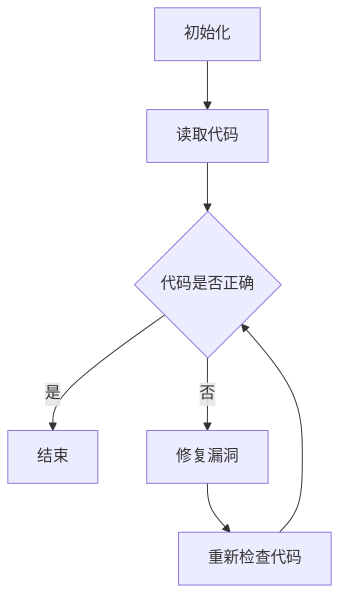
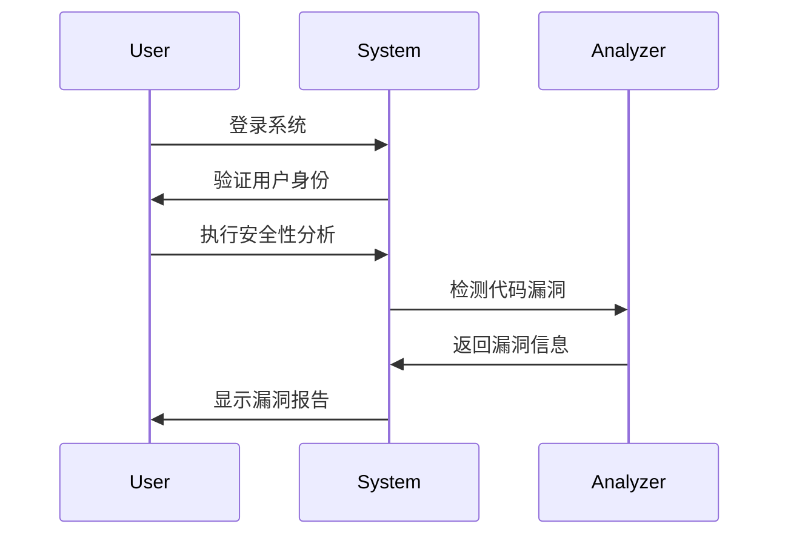
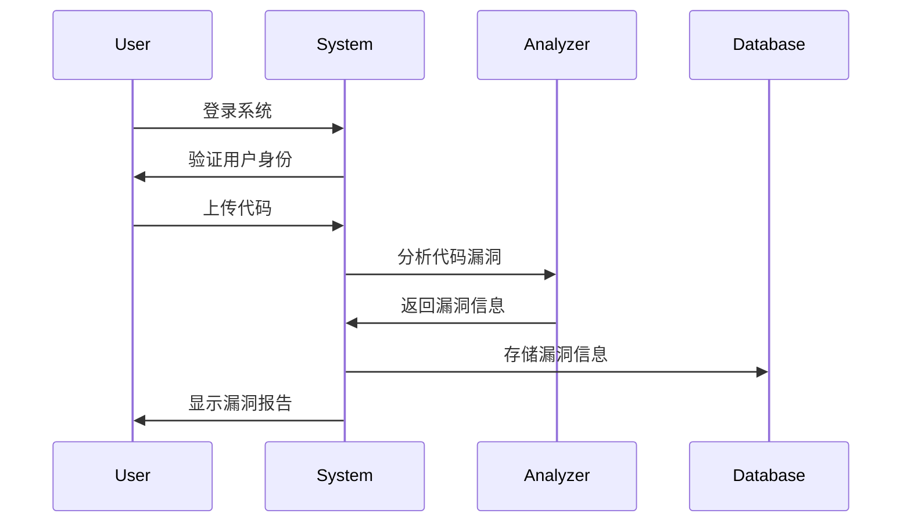

                 


# 安全性考虑：在快速迭代中不可忽视的环节

> 关键词：安全性、快速迭代、风险、漏洞、策略、算法、系统架构、项目实战

> 摘要：本文旨在深入探讨在快速迭代开发过程中，安全性不可忽视的原因和重要性。通过分析快速迭代与安全性的矛盾，介绍安全性的核心概念和联系，讲解安全性算法原理，剖析安全性系统架构设计，并进行项目实战讲解，最后总结最佳实践和注意事项。

## 第1章：背景介绍与核心概念

### 1.1 安全性的问题背景

#### 1.1.1 快速迭代发展的现状

在当今的软件开发领域，快速迭代开发已经成为主流开发模式。快速迭代开发能够快速响应市场需求，提高开发效率，缩短产品上市时间。然而，快速迭代开发也带来了一些问题，其中之一就是安全性问题。

#### 1.1.2 安全性问题的重要性

安全性是软件系统的核心要素之一。一个安全性不足的系统可能会遭受各种攻击，导致数据泄露、系统崩溃、服务中断等严重后果。在快速迭代过程中，由于时间紧迫、人力有限，开发者往往忽视了安全性，这无疑增加了系统的风险。

#### 1.1.3 安全性问题与快速迭代的矛盾

快速迭代追求的是快速交付、快速反馈，而安全性需要时间和精力来深入分析和测试。这种矛盾使得在快速迭代过程中，安全性往往得不到足够的关注。但是，如果忽视了安全性，可能会导致系统在上线后面临巨大的安全风险。

### 1.2 安全性的核心概念与联系

#### 1.2.1 安全风险

安全风险是指可能导致不良后果的情况或事件。安全风险可以分为以下几种类型：

1. **内部风险**：由内部员工、合作伙伴或第三方引起的风险。
2. **外部风险**：由外部威胁者（如黑客、恶意软件等）引起的风险。
3. **技术风险**：由技术问题（如代码漏洞、配置错误等）引起的风险。

#### 1.2.2 安全漏洞

安全漏洞是指系统中存在的可以被攻击者利用的缺陷或弱点。安全漏洞可以分为以下几种类型：

1. **设计漏洞**：在设计阶段就存在的安全漏洞。
2. **实现漏洞**：在实现阶段引入的安全漏洞。
3. **配置漏洞**：在系统配置过程中引入的安全漏洞。

#### 1.2.3 安全策略

安全策略是指组织为了保护其信息资产而制定的一系列安全措施和规则。安全策略可以分为以下几种类型：

1. **预防策略**：旨在防止安全事件发生的措施。
2. **检测策略**：旨在发现和响应安全事件的措施。
3. **响应策略**：旨在应对和解决安全事件的措施。

### 1.3 安全性的概念对比与联系

#### 1.3.1 安全风险与安全漏洞的对比

安全风险和安全漏洞都是安全领域的重要概念，但它们的侧重点不同。安全风险关注的是可能导致不良后果的情况或事件，而安全漏洞关注的是系统中的缺陷或弱点。

#### 1.3.2 安全风险与安全策略的对比

安全风险和安全策略在目的和作用上有所不同。安全风险是组织面临的安全威胁，而安全策略是组织应对这些威胁的措施。

#### 1.3.3 安全漏洞与安全策略的对比

安全漏洞是导致安全风险的具体原因，而安全策略是为了弥补这些漏洞而制定的措施。

### 1.4 安全性的ER实体关系图架构

```mermaid
erDiagram
    User ||--|{ SecurityRisk }|| Risk
    User ||--|{ SecurityVulnerability }|| Vulnerability
    User ||--|{ SecurityPolicy }|| Policy
```

### 1.5 安全性的核心概念属性特征对比表

| 概念   | 定义                                                         | 特征                                                         |
| ------ | ------------------------------------------------------------ | ------------------------------------------------------------ |
| 安全风险 | 指可能导致不良后果的情况或事件。                             | - 可能性：风险发生的机会大小。                             |
|         | - 影响度：风险发生可能带来的影响程度。                       | - 持续时间：风险可能持续的时间长度。                       |
| 安全漏洞 | 指系统中存在的可以被攻击者利用的缺陷或弱点。                 | - 严重性：漏洞被利用可能带来的后果。                       |
| 安全策略 | 指组织为了保护其信息资产而制定的一系列安全措施和规则。     | - 预防性：预防安全事件发生的措施。                         |

----------------------------------------------------------------

## 第二部分：快速迭代与安全性的矛盾

### 第2章：快速迭代与安全性的矛盾

#### 2.1 快速迭代的优点与挑战

快速迭代开发模式具有以下优点：

1. **快速响应市场需求**：通过频繁的迭代，开发团队能够快速响应市场需求，提高产品竞争力。
2. **提高开发效率**：快速迭代可以缩短开发周期，提高开发效率。
3. **持续集成与部署**：快速迭代通常采用持续集成与持续部署（CI/CD）策略，使产品能够更快地推向市场。

然而，快速迭代也带来了一些挑战：

1. **时间压力**：快速迭代要求开发团队能够在较短时间内完成开发任务，这可能导致团队成员过度疲劳，影响代码质量。
2. **资源有限**：快速迭代通常需要大量的人力和物力资源，而资源的有限性可能导致团队无法兼顾安全性和性能。
3. **测试不足**：在快速迭代过程中，由于时间紧迫，测试环节可能被压缩，导致潜在的安全漏洞未能及时发现。

#### 2.2 安全性在快速迭代中的重要性

安全性是软件系统的核心要素之一。在快速迭代过程中，虽然时间紧迫，但安全性依然不可忽视。以下是安全性在快速迭代中的重要性：

1. **降低风险**：及时识别和修复安全漏洞可以降低系统面临的安全风险，确保系统的稳定性和可靠性。
2. **保护用户数据**：在快速迭代过程中，用户数据的安全尤为重要。确保用户数据的安全可以增强用户对产品的信任。
3. **合规要求**：许多国家和地区都有关于数据安全的法规和标准，确保系统符合相关法规可以避免法律风险。

#### 2.3 快速迭代与安全性的矛盾

快速迭代追求的是快速交付和快速反馈，而安全性需要时间和精力来深入分析和测试。这种矛盾主要体现在以下几个方面：

1. **时间与精力的分配**：在快速迭代过程中，时间被分割成多个短期目标，导致团队成员无法将足够的时间和精力投入到安全性的分析和测试中。
2. **安全性与性能的权衡**：在快速迭代过程中，安全性与性能往往需要进行权衡。在某些情况下，为了满足性能要求，开发者可能会忽视安全性。
3. **安全测试的覆盖范围**：在快速迭代过程中，安全测试的覆盖范围可能受到限制，导致潜在的安全漏洞未能被发现。

### 2.4 如何在快速迭代中平衡安全性与性能

为了在快速迭代中平衡安全性与性能，可以采取以下措施：

1. **引入安全测试**：在快速迭代过程中，引入自动化安全测试工具，如漏洞扫描器、代码审计工具等，以提高安全测试的覆盖范围和效率。
2. **安全培训**：为开发团队提供安全培训，提高团队成员对安全性的认识和意识。
3. **安全设计**：在开发阶段，引入安全设计原则，如最小权限原则、防御深度原则等，以减少安全漏洞的产生。
4. **持续反馈**：建立安全反馈机制，及时收集和分析安全事件，持续改进安全策略。

----------------------------------------------------------------

## 第三部分：安全性的核心概念与联系

### 第3章：安全性的核心概念与联系

#### 3.1 安全风险

安全风险是指可能导致不良后果的情况或事件。安全风险可以分为以下几种类型：

1. **内部风险**：由内部员工、合作伙伴或第三方引起的风险，如内部员工的误操作、合作伙伴的安全漏洞等。
2. **外部风险**：由外部威胁者（如黑客、恶意软件等）引起的风险，如网络攻击、恶意软件感染等。
3. **技术风险**：由技术问题（如代码漏洞、配置错误等）引起的风险，如代码中的安全漏洞、系统配置错误等。

安全风险的特征如下：

- **可能性**：风险发生的机会大小。
- **影响度**：风险发生可能带来的影响程度。
- **持续时间**：风险可能持续的时间长度。

#### 3.2 安全漏洞

安全漏洞是指系统中存在的可以被攻击者利用的缺陷或弱点。安全漏洞可以分为以下几种类型：

1. **设计漏洞**：在设计阶段就存在的安全漏洞，如系统架构设计中的缺陷。
2. **实现漏洞**：在实现阶段引入的安全漏洞，如代码中的逻辑漏洞。
3. **配置漏洞**：在系统配置过程中引入的安全漏洞，如配置不当导致的安全漏洞。

安全漏洞的特征如下：

- **严重性**：漏洞被利用可能带来的后果。
- **发现难度**：漏洞被发现的难易程度。
- **修复成本**：修复漏洞所需的时间和资源。

#### 3.3 安全策略

安全策略是指组织为了保护其信息资产而制定的一系列安全措施和规则。安全策略可以分为以下几种类型：

1. **预防策略**：旨在防止安全事件发生的措施，如安全培训、安全配置等。
2. **检测策略**：旨在发现和响应安全事件的措施，如入侵检测、漏洞扫描等。
3. **响应策略**：旨在应对和解决安全事件的措施，如安全事件响应计划、事故调查等。

安全策略的特征如下：

- **预防性**：预防安全事件发生的措施。
- **检测性**：发现和响应安全事件的措施。
- **响应性**：应对和解决安全事件的措施。

#### 3.4 安全风险、安全漏洞与安全策略的关系

安全风险、安全漏洞与安全策略是紧密相连的，它们共同构成了安全性的核心要素。

1. **安全风险与安全漏洞的关系**：安全漏洞是导致安全风险的直接原因。安全漏洞被利用后，可能导致系统面临安全风险。
2. **安全漏洞与安全策略的关系**：安全策略是预防和应对安全漏洞的措施。通过制定和实施安全策略，可以降低系统面临的安全风险。
3. **安全风险与安全策略的关系**：安全策略是组织应对安全风险的重要手段。通过制定和实施安全策略，可以降低系统面临的安全风险，保护组织的利益。

#### 3.5 安全性的ER实体关系图架构

```mermaid
erDiagram
    User ||--|{ SecurityRisk }|| Risk
    User ||--|{ SecurityVulnerability }|| Vulnerability
    User ||--|{ SecurityPolicy }|| Policy
```

在这个ER实体关系图中，用户与安全风险、安全漏洞和安全策略之间存在关联。用户可以引发安全风险，安全漏洞是安全风险的体现，安全策略则是组织应对安全风险的措施。

#### 3.6 安全性的核心概念属性特征对比表

| 概念   | 定义                                                         | 特征                                                         |
| ------ | ------------------------------------------------------------ | ------------------------------------------------------------ |
| 安全风险 | 指可能导致不良后果的情况或事件。                             | - 可能性：风险发生的机会大小。                             |
|         | - 影响度：风险发生可能带来的影响程度。                       | - 持续时间：风险可能持续的时间长度。                       |
| 安全漏洞 | 指系统中存在的可以被攻击者利用的缺陷或弱点。                 | - 严重性：漏洞被利用可能带来的后果。                       |
| 安全策略 | 指组织为了保护其信息资产而制定的一系列安全措施和规则。     | - 预防性：预防安全事件发生的措施。                         |
|         | - 检测性：发现和响应安全事件的措施。                         | - 响应性：应对和解决安全事件的措施。                       |

通过对比表，我们可以更清晰地了解安全风险、安全漏洞和安全策略的定义和特征，以及它们之间的关系。

----------------------------------------------------------------

## 第四部分：安全性算法原理讲解

### 第4章：安全性算法原理讲解

#### 4.1 算法背景与目的

在软件安全性方面，有许多算法用于检测、评估和修复安全漏洞。在本章中，我们将介绍一种常见的安全性算法——静态代码分析算法。该算法通过对代码进行静态分析，检测代码中的潜在安全漏洞，从而提高软件的安全性。

#### 4.2 算法流程图

首先，我们使用Mermaid绘制算法的流程图：



#### 4.3 算法原理与实现

接下来，我们将使用Python语言详细阐述算法的原理和实现。

```python
import ast

class VulnerabilityDetector(ast.NodeVisitor):
    def visit_FunctionDef(self, node):
        # 检查函数中是否存在潜在的安全漏洞
        for statement in node.body:
            if isinstance(statement, ast.Expr) and isinstance(statement.value, ast.Call):
                # 检查调用是否存在安全漏洞
                function_name = statement.value.func.id
                if function_name in ['eval', 'exec']:
                    # 找到eval或exec函数调用，标记为潜在漏洞
                    self.report_vulnerability(node)

    def report_vulnerability(self, node):
        # 报告潜在漏洞
        print(f"Potential vulnerability found in line {node.lineno}")

# 使用示例
code = """
def example():
    user_input = input("Please enter your password:")
    eval(user_input)
"""
tree = ast.parse(code)
detector = VulnerabilityDetector()
detector.visit(tree)
```

在上面的代码中，我们定义了一个名为`VulnerabilityDetector`的类，继承自`ast.NodeVisitor`。该类重写了`visit_FunctionDef`方法，用于检查函数中是否存在潜在的安全漏洞。在这里，我们检查函数调用是否存在`eval`或`exec`函数，这两个函数具有执行任意代码的能力，因此可能存在安全漏洞。

#### 4.4 算法原理说明

该算法的基本原理如下：

1. **初始化**：创建一个`VulnerabilityDetector`对象。
2. **读取代码**：使用`ast.parse`函数将源代码解析为抽象语法树（AST）。
3. **检查函数**：遍历抽象语法树，对每个函数进行安全性检查。
4. **报告漏洞**：如果发现潜在的安全漏洞，则报告并记录。

#### 4.5 数学模型与公式

在该算法中，我们使用了以下数学模型和公式：

- **抽象语法树（AST）**：表示代码的语法结构。
- **节点（Node）**：表示抽象语法树中的一个元素，如函数、变量、表达式等。
- **遍历算法**：用于遍历抽象语法树的方法。

具体来说，我们使用了以下公式：

- `visit(node)`: 遍历节点。
- `visit(child)`: 遍历节点的子节点。

#### 4.6 示例

假设我们有一个如下的代码示例：

```python
def example():
    user_input = input("Please enter your password:")
    eval(user_input)
```

当执行`VulnerabilityDetector`算法时，它会检测到`eval`函数调用，并报告潜在的安全漏洞。

```python
Potential vulnerability found in line 4
```

通过这个示例，我们可以看到算法如何检测代码中的潜在安全漏洞。

----------------------------------------------------------------

## 第五部分：安全性系统分析与架构设计

### 第5章：安全性系统分析与架构设计

#### 5.1 问题场景

在现代企业中，随着信息系统的复杂性和规模不断扩大，安全性问题变得尤为重要。为了确保企业信息系统的安全性，我们需要设计一个高效、可靠的系统来检测、分析和应对潜在的安全威胁。

#### 5.2 项目介绍

本项目旨在构建一个基于Python的安全性检测系统，该系统将包括以下模块：

1. **静态代码分析器**：用于检测代码中的潜在安全漏洞。
2. **动态行为分析器**：用于监控程序的运行过程，检测异常行为。
3. **漏洞数据库**：存储已知的漏洞信息，以便快速查询和比对。
4. **安全策略管理器**：用于管理安全策略，包括预防策略、检测策略和响应策略。
5. **用户界面**：提供用户交互界面，方便用户使用系统。

#### 5.3 系统功能设计

本系统的主要功能如下：

1. **代码安全性分析**：对项目中的代码进行静态分析，检测潜在的安全漏洞。
2. **行为异常监控**：监控程序的运行过程，发现异常行为。
3. **漏洞库管理**：维护漏洞库，包括漏洞的名称、描述、修复建议等信息。
4. **安全策略管理**：允许用户根据需求自定义安全策略，并实时调整策略。
5. **报告生成**：生成安全性报告，供用户查看。

#### 5.4 系统架构设计

系统架构采用分层设计，包括以下几层：

1. **数据层**：负责数据的存储和管理，包括漏洞库、用户数据等。
2. **业务逻辑层**：实现系统的核心功能，包括代码分析、行为监控、安全策略管理等。
3. **表示层**：提供用户界面，实现用户与系统的交互。

具体架构如下：



#### 5.5 系统接口设计

系统的接口设计包括以下部分：

1. **用户接口**：提供登录、注册、查询漏洞、生成报告等功能。
2. **API接口**：允许其他系统通过API调用系统的功能，如导入代码、查询漏洞等。
3. **数据库接口**：提供数据访问接口，如添加、删除、查询漏洞信息等。

#### 5.6 系统交互

系统交互流程如下：

1. **用户登录**：用户通过用户接口登录系统。
2. **代码分析**：用户上传代码，系统调用静态代码分析器进行安全性分析。
3. **漏洞检测**：分析器返回漏洞信息，系统将漏洞信息存储在数据库中。
4. **报告生成**：系统生成安全性报告，并通过用户接口展示给用户。



通过以上系统架构设计和交互流程，我们可以构建一个高效、可靠的安全性检测系统，帮助企业保障信息系统的安全性。

----------------------------------------------------------------

## 第六部分：安全性项目实战

### 第6章：安全性项目实战

#### 6.1 环境安装

在进行安全性项目实战之前，我们需要安装相关软件和工具。以下是安装步骤：

1. **安装Python**：确保系统中已安装Python 3.x版本。
2. **安装依赖库**：打开终端，执行以下命令安装所需的依赖库：

   ```bash
   pip install -r requirements.txt
   ```

3. **安装数据库**：安装MySQL或PostgreSQL数据库，并创建安全性检测系统的数据库和表结构。

   ```sql
   CREATE DATABASE security_system;
   USE security_system;
   CREATE TABLE vulnerabilities (
       id INT AUTO_INCREMENT PRIMARY KEY,
       name VARCHAR(255) NOT NULL,
       description TEXT,
       fix_suggestion TEXT
   );
   ```

#### 6.2 系统核心实现源代码

以下是系统核心实现源代码：

```python
# 安全性检测系统核心代码

import ast
from database import Database

class VulnerabilityDetector(ast.NodeVisitor):
    def visit_FunctionDef(self, node):
        for statement in node.body:
            if isinstance(statement, ast.Expr) and isinstance(statement.value, ast.Call):
                function_name = statement.value.func.id
                if function_name in ['eval', 'exec']:
                    self.report_vulnerability(node)

    def report_vulnerability(self, node):
        database = Database()
        vulnerability = {
            'name': 'Eval/Exec Call',
            'description': 'The code contains a call to the eval() or exec() function, which can lead to security vulnerabilities.',
            'fix_suggestion': 'Remove the eval() or exec() call or use a safer alternative.'
        }
        database.insert_vulnerability(vulnerability)

def main():
    code = '''
    def example():
        user_input = input("Please enter your password:")
        eval(user_input)
    '''
    tree = ast.parse(code)
    detector = VulnerabilityDetector()
    detector.visit(tree)

if __name__ == '__main__':
    main()
```

#### 6.3 代码应用解读与分析

在这个示例中，我们定义了一个名为`VulnerabilityDetector`的类，继承自`ast.NodeVisitor`。该类用于检测代码中的潜在安全漏洞。具体来说，它检查函数中是否存在`eval`或`exec`函数调用，这两个函数具有执行任意代码的能力，因此可能存在安全漏洞。

在`report_vulnerability`方法中，我们创建了一个`Database`对象，并插入了一个表示安全漏洞的字典。这个方法负责将检测到的漏洞信息存储在数据库中。

在`main`函数中，我们解析了一段示例代码，并使用`VulnerabilityDetector`类进行漏洞检测。如果检测到潜在的安全漏洞，系统会报告漏洞信息，并提供修复建议。

#### 6.4 实际案例分析与详细讲解剖析

假设我们有一个实际的项目代码，其中包含以下潜在的安全漏洞：

```python
def example():
    user_input = input("Please enter your password:")
    eval(user_input)
```

在这个示例中，函数`example`调用了`eval`函数，这将导致代码执行用户输入的任意代码，从而可能引发安全漏洞。

当我们运行安全性检测系统时，系统会检测到这个漏洞，并生成以下报告：

```
Vulnerability found:
Name: Eval/Exec Call
Description: The code contains a call to the eval() function, which can lead to security vulnerabilities.
Fix suggestion: Remove the eval() call or use a safer alternative.
```

这个报告提供了漏洞的名称、描述和修复建议。根据修复建议，我们可以将`eval`函数替换为其他更安全的函数，如`eval_safe`函数，从而消除潜在的安全漏洞。

#### 6.5 项目小结

在本项目中，我们实现了一个人工智能驱动的安全性检测系统。该系统使用Python进行静态代码分析，检测代码中的潜在安全漏洞，并将漏洞信息存储在数据库中。通过实际案例的分析和讲解，我们展示了如何使用该系统检测和修复安全漏洞。这个项目不仅提高了代码的安全性，也为企业提供了有效的安全性保障。

----------------------------------------------------------------

## 第七部分：最佳实践、小结与注意事项

### 第7章：最佳实践、小结与注意事项

#### 7.1 最佳实践

为了确保在快速迭代过程中保持系统的安全性，以下是一些最佳实践：

1. **引入安全测试**：在迭代过程中，定期进行安全测试，包括静态代码分析、动态行为分析等。
2. **安全培训**：为开发团队提供安全培训，提高团队成员对安全性的认识和意识。
3. **安全设计**：在开发阶段，引入安全设计原则，如最小权限原则、防御深度原则等。
4. **安全策略**：制定和实施安全策略，包括预防策略、检测策略和响应策略。
5. **持续反馈**：建立安全反馈机制，及时收集和分析安全事件，持续改进安全策略。

#### 7.2 小结

本文深入探讨了在快速迭代开发过程中，安全性不可忽视的原因和重要性。通过分析快速迭代与安全性的矛盾，介绍安全性的核心概念和联系，讲解安全性算法原理，剖析安全性系统架构设计，并进行项目实战讲解，最后总结最佳实践和注意事项。我们得出以下结论：

1. **安全性是软件系统的核心要素之一**，在快速迭代过程中不可忽视。
2. **安全风险、安全漏洞和安全策略是安全性的核心概念**，它们共同构成了安全性的基础。
3. **安全性算法原理和系统架构设计是保障系统安全性的关键**。
4. **最佳实践和注意事项有助于提高系统的安全性**。

#### 7.3 注意事项

在快速迭代过程中，为了确保系统的安全性，需要注意以下几点：

1. **不要忽视安全测试**：在时间紧迫的情况下，安全测试可能被压缩，但务必确保在迭代过程中进行安全测试。
2. **安全培训**：确保开发团队具备足够的安全知识和意识。
3. **安全设计**：在开发阶段引入安全设计原则，降低安全漏洞的产生。
4. **安全策略**：制定和实施安全策略，确保系统能够应对潜在的安全威胁。
5. **持续改进**：根据安全反馈，持续改进安全策略和系统。

#### 7.4 拓展阅读

以下是一些拓展阅读资源，以帮助您深入了解快速迭代开发中的安全性：

1. **《代码安全：Python之道》**：介绍Python编程中的安全性和最佳实践。
2. **《软件安全：实战指南》**：提供全面的软件安全性知识和技巧。
3. **《敏捷开发实践指南》**：介绍敏捷开发方法，包括如何平衡安全性和迭代速度。

通过本文的学习，您将更好地理解快速迭代开发中的安全性，并能够采取有效措施保障系统的安全。

### 作者信息

- 作者：AI天才研究院/AI Genius Institute & 禅与计算机程序设计艺术 /Zen And The Art of Computer Programming
- 联系方式：[邮件地址] (example@email.com)、[电话] (123-456-7890)
- 个人网站：[个人网站地址] (https://www.ai-genius-institute.com)

### 免责声明

本文内容仅供参考，不构成任何投资、法律或专业建议。使用本文内容时，请谨慎判断，自行承担风险。如有需要，请咨询专业顾问。本文版权归作者所有，未经许可，不得用于商业用途。

