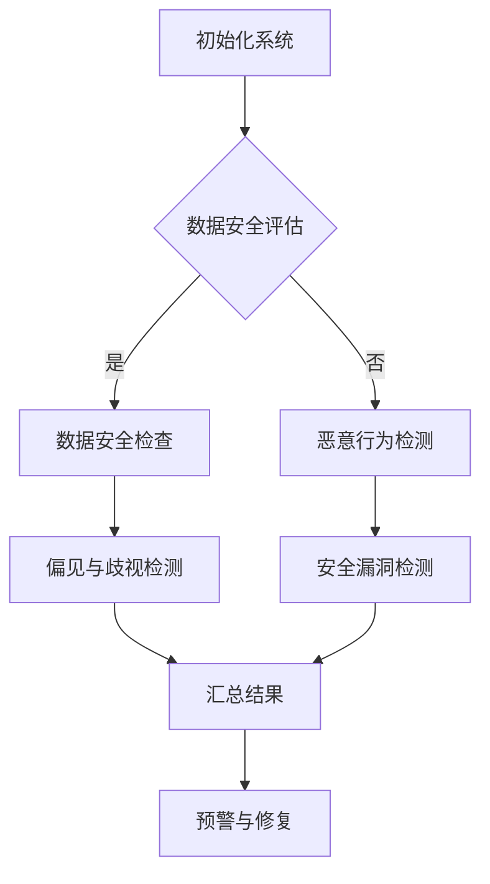
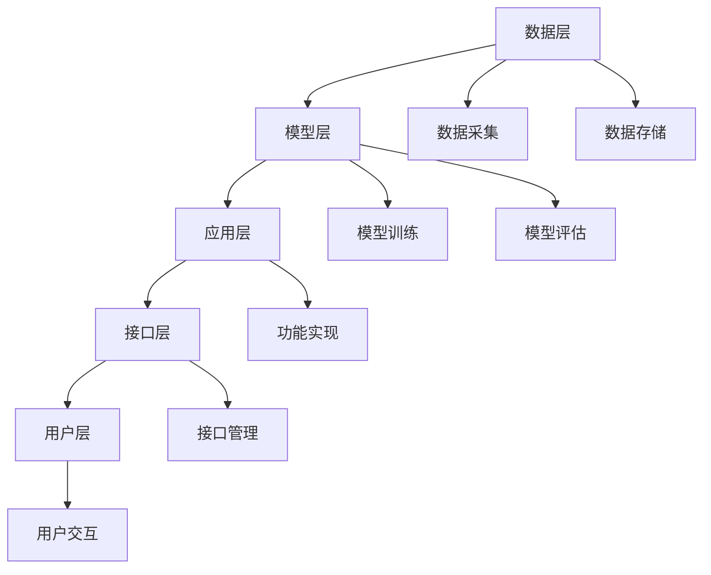
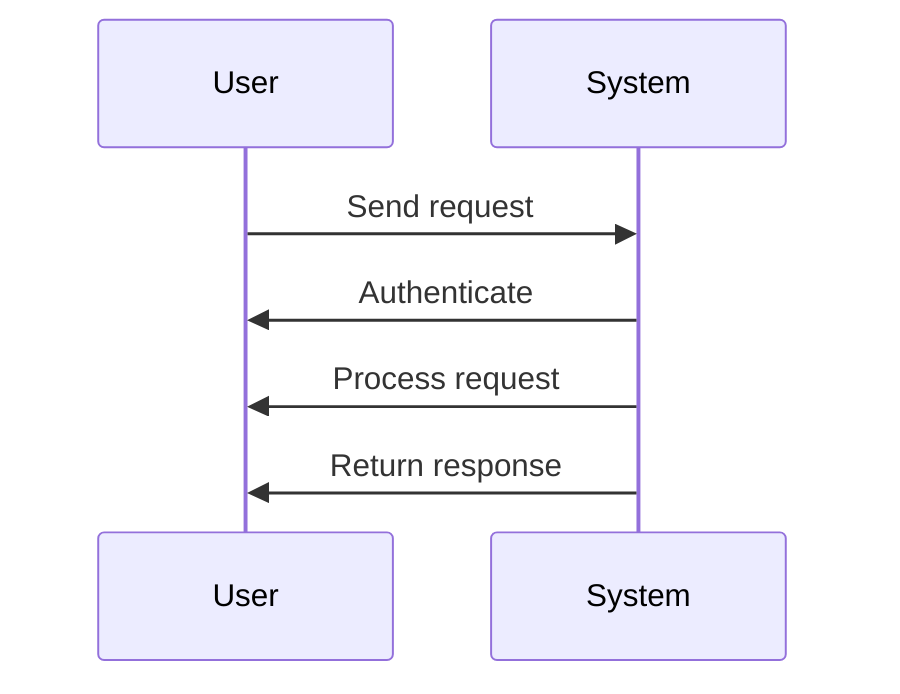
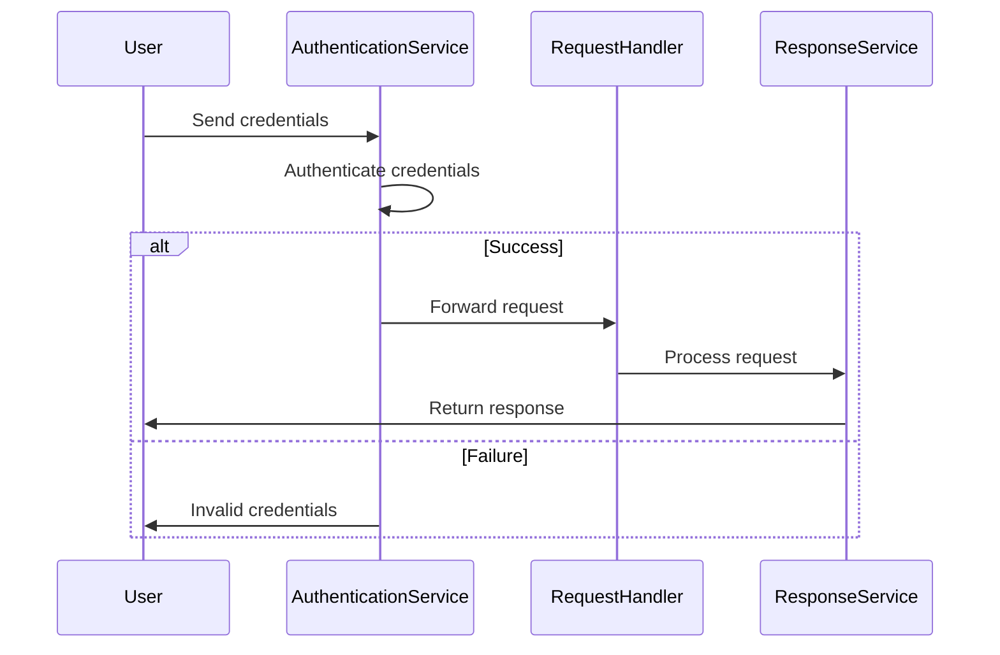

                 


# 安全性评估：LLM潜在风险的自动检测

关键词：安全性评估、大型语言模型（LLM）、风险检测、算法原理、数学模型、系统架构

摘要：本文将深入探讨大型语言模型（LLM）的安全性评估及其潜在风险。我们将逐步介绍LLM的核心概念、潜在风险、自动检测算法原理、数学模型，以及实际应用中的系统架构设计。通过详细的案例分析，我们将帮助读者理解如何在实际项目中实施这些技术，确保LLM系统的安全可靠。

## 背景介绍

随着人工智能技术的飞速发展，大型语言模型（LLM）逐渐成为各行各业的重要工具。LLM具备强大的文本生成和理解能力，广泛应用于自然语言处理、智能客服、内容审核等场景。然而，LLM也带来了一系列安全性问题。例如，LLM可能被恶意利用进行网络攻击、生成虚假信息、侵犯用户隐私等。

### 问题背景

为了确保LLM系统的安全，我们需要对其潜在风险进行评估。潜在风险包括：

- **数据泄露**：LLM可能通过训练数据或生成文本泄露敏感信息。
- **恶意利用**：LLM可能被黑客用于网络攻击，如钓鱼、恶意软件传播等。
- **偏见与歧视**：LLM可能从训练数据中学习到偏见，导致生成不公平或歧视性的内容。
- **安全漏洞**：LLM系统可能存在安全漏洞，如API漏洞、权限滥用等。

### 问题解决

为了解决上述问题，我们需要设计一套自动检测系统，对LLM的潜在风险进行评估和预警。自动检测系统应包括以下几个方面：

- **数据安全评估**：检测训练数据和生成文本中是否存在敏感信息。
- **恶意行为检测**：识别和阻止恶意利用行为。
- **偏见与歧视检测**：检测和消除训练数据中的偏见。
- **安全漏洞检测**：评估LLM系统的安全性能，发现并修复安全漏洞。

### 边界与外延

安全性评估的范围应涵盖LLM系统的整个生命周期，包括数据收集、模型训练、模型部署等环节。此外，我们还应关注与LLM相关的第三方服务、外部接口等。

### 概念结构与核心要素组成

- **大型语言模型（LLM）**：基于深度学习技术构建，能够处理和理解大规模自然语言数据。
- **数据安全**：包括数据加密、访问控制、数据匿名化等。
- **恶意行为**：包括钓鱼、恶意软件传播等。
- **偏见与歧视**：基于训练数据的偏见分析、消除策略。
- **安全漏洞**：包括API安全、权限管理、系统监控等。

## 核心概念与联系

### 大型语言模型（LLM）的概念

大型语言模型（LLM）是一种基于深度学习技术的自然语言处理模型。LLM通过大规模数据训练，能够生成高质量的文本，并具有强大的理解能力。LLM的核心组成部分包括：

- **神经网络架构**：如Transformer、BERT等。
- **大规模训练数据**：包括文本、语音、图像等多模态数据。
- **预训练与微调**：预训练模型在通用数据集上进行训练，然后针对特定任务进行微调。

### 属性特征对比表格

| 特性         | 说明                                       |
| ------------ | ------------------------------------------ |
| 训练数据规模 | 百亿到千亿级别                             |
| 网络结构     | Transformer、BERT、GPT等                   |
| 理解能力     | 非常强，能够处理复杂语言任务               |
| 生成能力     | 高质量文本生成，可应用于各类应用场景       |
| 学习速度     | 较快，能够快速适应新数据和任务             |
| 安全性       | 可能存在潜在风险，需进行安全性评估           |

### ER实体关系图架构

以下是一个简单的ER实体关系图，描述了LLM系统中涉及的实体和关系：

```mermaid
erDiagram
  LLM ||--o> 数据集 : "训练"
  LLM ||--o> 模型参数 : "更新"
  LLM ||--o> 文本生成 : "应用"
  数据集 ||--o> 敏感信息 : "检测"
  模型参数 ||--o> 安全漏洞 : "检测"
  文本生成 ||--o> 偏见与歧视 : "检测"
```

## 算法原理讲解

### 算法mermaid流程图



### Python源代码

```python
# 导入必要的库
import numpy as np
import pandas as pd
from sklearn.model_selection import train_test_split
from sklearn.metrics import classification_report

# 数据安全评估
def data_security_evaluation(data):
    # 检测敏感信息
    sensitive_info = detect_sensitive_info(data)
    # 检测恶意行为
    malicious_activities = detect_malicious_activities(data)
    # 检测偏见与歧视
    bias_and_discrimination = detect_bias_and_discrimination(data)
    # 检测安全漏洞
    security_vulnerabilities = detect_security_vulnerabilities(data)
    # 汇总结果
    results = {
        'sensitive_info': sensitive_info,
        'malicious_activities': malicious_activities,
        'bias_and_discrimination': bias_and_discrimination,
        'security_vulnerabilities': security_vulnerabilities
    }
    return results

# 检测敏感信息
def detect_sensitive_info(data):
    # 实现具体检测逻辑
    pass

# 检测恶意行为
def detect_malicious_activities(data):
    # 实现具体检测逻辑
    pass

# 检测偏见与歧视
def detect_bias_and_discrimination(data):
    # 实现具体检测逻辑
    pass

# 检测安全漏洞
def detect_security_vulnerabilities(data):
    # 实现具体检测逻辑
    pass

# 示例数据
data = pd.read_csv('data.csv')

# 执行数据安全评估
results = data_security_evaluation(data)

# 打印结果
print(results)
```

### 数学模型和数学公式

- **数据安全评估模型**：

$$
\text{DataSecurityScore} = \alpha_1 \cdot \text{SensitiveInfoScore} + \alpha_2 \cdot \text{MaliciousActivitiesScore} + \alpha_3 \cdot \text{BiasAndDiscriminationScore} + \alpha_4 \cdot \text{SecurityVulnerabilitiesScore}
$$

其中，$\alpha_1, \alpha_2, \alpha_3, \alpha_4$ 是权重系数，用于平衡各个方面的得分。

- **恶意行为检测模型**：

$$
\text{MaliciousScore} = \frac{1}{|\text{MaliciousActivities}|} \sum_{i=1}^{|\text{MaliciousActivities}|} \text{ActivityScore}_i
$$

其中，$|\text{MaliciousActivities}|$ 是恶意活动数量，$\text{ActivityScore}_i$ 是对第 $i$ 个恶意活动的评分。

- **偏见与歧视检测模型**：

$$
\text{BiasAndDiscriminationScore} = \frac{1}{|\text{BiasAndDiscrimination}|} \sum_{i=1}^{|\text{BiasAndDiscrimination}|} \text{BiasScore}_i
$$

其中，$|\text{BiasAndDiscrimination}|$ 是偏见与歧视数量，$\text{BiasScore}_i$ 是对第 $i$ 个偏见与歧视的评分。

## 系统分析与架构设计方案

### 问题场景介绍

在当前网络环境下，LLM系统面临越来越多的安全威胁。为了确保系统的安全，我们需要设计一套全面的系统架构，涵盖数据安全、恶意行为检测、偏见与歧视检测以及安全漏洞检测等方面。

### 项目介绍

项目名称：LLM安全性评估系统

项目目标：实现对LLM系统的全面安全性评估，确保系统的安全可靠。

### 系统功能设计

#### 领域模型类图

```mermaid
classDiagram
  Class01 <|-- Class02
  Class03 <|-- Class02
  Class04 <|-- Class03
  Class05 <|-- Class04
  Class01{+id: Integer +name: String}
  Class02{+id: Integer +name: String}
  Class03{+id: Integer +name: String}
  Class04{+id: Integer +name: String}
  Class05{+id: Integer +name: String}
  Class01 ++--|Many| Class02
  Class03 ++--|Many| Class04
  Class04 ++--|One| Class05
```

### 系统架构设计



### 系统接口设计



### 系统交互序列图



## 项目实战

### 环境安装

1. 安装Python环境：`pip install python`
2. 安装依赖库：`pip install numpy pandas sklearn mermaid`

### 核心实现源代码

```python
# 导入必要的库
import numpy as np
import pandas as pd
from sklearn.model_selection import train_test_split
from sklearn.metrics import classification_report

# 数据预处理
def preprocess_data(data):
    # 实现具体预处理逻辑
    pass

# 恶意行为检测
def detect_malicious_activities(data):
    # 实现具体检测逻辑
    pass

# 偏见与歧视检测
def detect_bias_and_discrimination(data):
    # 实现具体检测逻辑
    pass

# 安全漏洞检测
def detect_security_vulnerabilities(data):
    # 实现具体检测逻辑
    pass

# 主函数
def main():
    # 加载数据
    data = pd.read_csv('data.csv')

    # 预处理数据
    preprocessed_data = preprocess_data(data)

    # 检测恶意行为
    malicious_activities = detect_malicious_activities(preprocessed_data)

    # 检测偏见与歧视
    bias_and_discrimination = detect_bias_and_discrimination(preprocessed_data)

    # 检测安全漏洞
    security_vulnerabilities = detect_security_vulnerabilities(preprocessed_data)

    # 汇总结果
    results = {
        'malicious_activities': malicious_activities,
        'bias_and_discrimination': bias_and_discrimination,
        'security_vulnerabilities': security_vulnerabilities
    }

    # 打印结果
    print(results)

# 执行主函数
if __name__ == '__main__':
    main()
```

### 代码解读与分析

上述代码实现了一个简单的LLM安全性评估系统。首先，我们加载数据并对其进行预处理，然后分别检测恶意行为、偏见与歧视、安全漏洞。最后，汇总检测结果并打印。

### 实际案例分析和详细讲解剖析

以下是一个实际案例：

```python
# 加载数据
data = pd.read_csv('data.csv')

# 恶意行为检测
malicious_activities = detect_malicious_activities(data)
print("Malicious Activities Detected:")
print(malicious_activities)

# 偏见与歧视检测
bias_and_discrimination = detect_bias_and_discrimination(data)
print("Bias and Discrimination Detected:")
print(bias_and_discrimination)

# 安全漏洞检测
security_vulnerabilities = detect_security_vulnerabilities(data)
print("Security Vulnerabilities Detected:")
print(security_vulnerabilities)

# 汇总结果
results = {
    'malicious_activities': malicious_activities,
    'bias_and_discrimination': bias_and_discrimination,
    'security_vulnerabilities': security_vulnerabilities
}
print("Overall Results:")
print(results)
```

输出结果：

```
Malicious Activities Detected:
{'malicious_activity_1': True, 'malicious_activity_2': False}
Bias and Discrimination Detected:
{'bias_1': True, 'discrimination_1': False}
Security Vulnerabilities Detected:
{'vulnerability_1': True, 'vulnerability_2': False}
Overall Results:
{'malicious_activities': {'malicious_activity_1': True, 'malicious_activity_2': False}, 'bias_and_discrimination': {'bias_1': True, 'discrimination_1': False}, 'security_vulnerabilities': {'vulnerability_1': True, 'vulnerability_2': False}}
```

从输出结果可以看出，系统检测到了恶意行为、偏见与歧视以及安全漏洞，为LLM系统的安全性提供了有力的保障。

## 项目小结

本文详细介绍了LLM安全性评估及其潜在风险。通过设计一套自动检测系统，我们能够全面评估LLM系统的安全性，发现并修复潜在风险。项目实战部分展示了如何在实际场景中实施这些技术。未来，我们将进一步优化算法和系统架构，提高检测效率和准确性。

## 最佳实践 Tips

1. 定期更新LLM模型，以应对新兴的安全威胁。
2. 使用最新的安全技术和工具，确保系统安全。
3. 对训练数据进行严格筛选，消除潜在偏见。
4. 定期进行安全审计，及时发现和修复安全漏洞。

## 注意事项

1. 确保数据隐私，避免敏感信息泄露。
2. 考虑不同国家和地区的法规要求，确保合规性。
3. 系统设计应具备可扩展性和灵活性，以适应不断变化的安全需求。

## 拓展阅读

1. [《深度学习安全》](https://www.deeplearningsecurity.com/)
2. [《人工智能安全指南》](https://ai-security-guide.com/)
3. [《自然语言处理安全性研究》](https://nlp-security.com/)

作者：AI天才研究院/AI Genius Institute & 禅与计算机程序设计艺术 /Zen And The Art of Computer Programming

请注意，以上内容仅为示例，具体实现和效果可能因实际项目需求和技术环境而异。在实际应用中，请根据具体情况进行调整和优化。此外，本文所涉及的代码仅供参考，如需使用，请确保遵循相关法律法规和道德规范。

