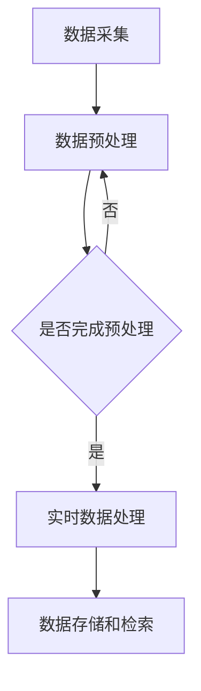

                 

### 实时分析：从LLM应用数据中获取即时洞察

> 关键词：实时分析、LLM、数据处理、机器学习、算法优化

> 摘要：本文将深入探讨实时分析的概念及其重要性，重点分析实时分析在大型语言模型（LLM）应用中的数据获取与处理过程。我们将逐步解读实时分析的核心技术、算法原理，以及如何通过系统分析与架构设计实现高效的实时数据处理。最后，我们将结合实际案例，探讨实时分析在金融风控、推荐系统和舆情分析等领域的应用，并提供最佳实践和小结。

## 第一部分：背景介绍

### 1.1 问题背景

在当今的信息化时代，数据已成为企业和组织的重要资产。然而，随着数据量的急剧增长，如何快速有效地处理和分析这些数据成为了一个严峻的挑战。特别是在互联网、金融、电商等高竞争领域，对实时数据处理和分析的需求日益增长。

大型语言模型（LLM）的出现为实时数据分析带来了新的机遇。LLM 是一种强大的自然语言处理模型，能够对大量文本数据进行分析和理解，从而为实时决策提供有力支持。然而，如何在保证数据准确性的同时，实现高效、实时的数据分析和处理，仍然是一个亟待解决的问题。

### 1.2 问题描述

实时分析的核心问题在于如何在数据生成和消费之间实现低延迟、高效率的处理。具体来说，主要包括以下几个方面：

1. 数据采集与预处理：如何快速收集、清洗和转换原始数据，以便进行进一步的分析。
2. 实时数据处理：如何高效地处理大量数据流，并在有限时间内完成分析任务。
3. 数据存储与检索：如何在保证数据一致性的同时，实现高效的存储和快速检索。
4. 算法优化与实现：如何针对实时数据分析的需求，优化现有算法，提高数据处理效率和准确性。

### 1.3 问题解决

为了解决上述问题，我们需要从以下几个方面进行思考和探索：

1. **技术选型**：选择适合实时数据分析的技术和工具，如数据流处理框架、存储系统和机器学习算法。
2. **系统设计**：设计高效的实时分析系统架构，确保数据流顺畅，各模块之间协同工作。
3. **算法优化**：针对实时数据分析的特点，优化现有算法，提高数据处理效率和准确性。
4. **性能监控与调优**：建立性能监控机制，实时跟踪系统性能，进行调优和优化。

### 1.4 边界与外延

实时分析不仅仅是技术问题，还涉及到业务需求和实际应用场景。因此，我们需要明确以下边界和扩展：

1. **业务场景**：实时分析适用于哪些业务场景，如金融风控、推荐系统和舆情分析等。
2. **数据类型**：实时分析需要处理哪些数据类型，如文本、图像、音频等。
3. **数据量**：实时分析能够处理多大的数据量，以及如何在海量数据中进行高效分析。
4. **系统可扩展性**：如何设计可扩展的实时分析系统，以适应未来数据增长和业务需求。

### 1.5 概念结构与核心要素组成

为了更好地理解和实现实时分析，我们需要从概念结构和核心要素组成两个方面进行梳理。

#### 概念结构

1. **实时分析**：实时分析是指对数据流进行实时处理、分析和决策的过程。
2. **大型语言模型（LLM）**：LLM 是一种基于深度学习的自然语言处理模型，能够对大量文本数据进行处理和分析。
3. **数据采集与预处理**：数据采集是指从各种数据源获取数据，预处理是指对数据进行清洗、转换和规范化。
4. **实时数据处理**：实时数据处理是指对数据流进行实时处理，以生成实时分析结果。
5. **数据存储与检索**：数据存储是指将处理后的数据存储到数据库或数据湖中，检索是指从存储系统中快速查找和获取数据。

#### 核心要素组成

1. **数据源**：包括各种数据采集渠道，如数据库、文件、网络流等。
2. **数据采集器**：用于从数据源中收集数据的工具或程序。
3. **数据预处理模块**：对采集到的原始数据进行清洗、转换和规范化的模块。
4. **实时数据处理引擎**：用于对数据流进行实时处理和分析的核心模块。
5. **数据存储系统**：用于存储和处理后的数据，以供后续分析和查询。
6. **分析工具和算法**：用于对数据进行统计、分析和挖掘的工具和算法。
7. **用户界面**：用于展示实时分析结果的图形界面。

## 第二部分：核心概念与联系

### 2.1 实时分析的定义

实时分析是指对数据流进行实时处理、分析和决策的过程。其核心目标是快速、高效地处理数据，并生成实时洞察和决策支持信息。实时分析广泛应用于金融、电商、医疗、交通等领域，为业务决策提供了有力支持。

### 2.2 实时分析的特点

实时分析具有以下特点：

1. **低延迟**：实时分析要求在数据生成后尽快进行处理和分析，以确保数据的及时性和有效性。
2. **高效率**：实时分析需要在有限的计算资源和时间内完成大量数据的处理和分析，因此需要采用高效的数据处理算法和系统架构。
3. **可扩展性**：实时分析系统应能够适应数据量和业务需求的变化，实现水平和垂直扩展。
4. **准确性**：实时分析需要确保数据处理和分析结果的准确性，以支持业务决策。

### 2.3 实时分析与相关概念的比较

实时分析与以下相关概念进行比较：

1. **批处理分析**：批处理分析是指将数据按批次进行处理和分析，通常用于离线分析和预测。与实时分析相比，批处理分析具有更高的延迟和较低的实时性。
2. **在线分析**：在线分析是指对数据流进行持续的分析和更新，具有较高的实时性。与实时分析相比，在线分析更注重数据的持续性和稳定性。
3. **大数据分析**：大数据分析是指对海量数据进行处理和分析，以发现数据中的隐藏信息和规律。与实时分析相比，大数据分析更注重数据的规模和深度。

## 第三部分：算法原理讲解

### 3.1 实时分析算法原理

实时分析算法主要包括数据采集、数据预处理、实时数据处理、数据存储和检索等几个环节。下面将分别介绍这些环节的算法原理。

#### 数据采集

数据采集是指从各种数据源获取数据，如数据库、文件、网络流等。常用的数据采集算法包括以下几种：

1. **拉模式**：由数据消费者主动从数据源拉取数据。
2. **推模式**：由数据源主动向数据消费者推送数据。
3. **混合模式**：结合拉模式和推模式，根据数据源的更新频率和消费需求进行动态调整。

#### 数据预处理

数据预处理是指对采集到的原始数据进行清洗、转换和规范化。常用的数据预处理算法包括以下几种：

1. **数据清洗**：去除重复数据、空值填充、异常值处理等。
2. **数据转换**：将数据从一种格式转换为另一种格式，如CSV到JSON。
3. **数据规范化**：将数据转换为统一的格式和范围，如归一化、标准化等。

#### 实时数据处理

实时数据处理是指对数据流进行实时处理和分析，以生成实时洞察和决策支持信息。常用的实时数据处理算法包括以下几种：

1. **流处理算法**：如 Apache Kafka、Apache Flink 等，用于处理大规模数据流。
2. **机器学习算法**：如随机森林、支持向量机等，用于对数据进行分类、预测等。
3. **统计分析算法**：如均值、中位数、方差等，用于对数据进行描述和分析。

#### 数据存储和检索

数据存储和检索是指将处理后的数据存储到数据库或数据湖中，以供后续分析和查询。常用的数据存储和检索算法包括以下几种：

1. **关系数据库**：如 MySQL、PostgreSQL 等，用于存储结构化数据。
2. **NoSQL 数据库**：如 MongoDB、Cassandra 等，用于存储非结构化数据。
3. **图数据库**：如 Neo4j、ArangoDB 等，用于存储和处理图结构数据。

### 3.2 实时分析算法原理详细讲解

为了更好地理解实时分析算法原理，我们以一个简单的实时数据分析项目为例进行讲解。

假设我们想要对用户行为数据进行分析，以了解用户的购买偏好和推荐商品。以下是该项目的实时分析算法原理：

1. **数据采集**：通过 API 接口从用户行为数据存储系统中拉取数据，数据格式为 JSON。

2. **数据预处理**：对采集到的数据进行清洗和转换，包括去除重复数据、填充空值、将日期格式转换为YYYY-MM-DD等。

3. **实时数据处理**：
   - **统计用户购买频率**：使用流处理算法统计每个用户的购买次数，如使用Apache Kafka和Apache Flink进行实时数据流处理。
   - **分类用户购买偏好**：使用机器学习算法（如 K-means）对用户的购买数据进行聚类，将用户分为不同的购买偏好类别。
   - **推荐商品**：基于用户购买偏好和商品属性，使用协同过滤算法（如基于用户的协同过滤）推荐商品。

4. **数据存储和检索**：将处理后的用户购买偏好数据存储到 MongoDB 中，供后续分析和查询。

### 3.3 算法 Mermaid 流程图

为了更好地理解实时分析算法的流程，我们使用 Mermaid 语言绘制了一个简单的 Mermaid 流程图：



### 3.4 Python 源代码示例

为了更好地理解实时分析算法的实现，我们提供了一个简单的 Python 源代码示例：

```python
import json
from kafka import KafkaConsumer
from sklearn.cluster import KMeans
from pymongo import MongoClient

# 数据预处理
def preprocess_data(data):
    # 去除重复数据
    data = list(set(data))
    # 填充空值
    for item in data:
        if 'purchase_count' not in item:
            item['purchase_count'] = 0
    return data

# 实时数据处理
def process_data(data):
    # 聚类分析用户购买偏好
    kmeans = KMeans(n_clusters=3)
    kmeans.fit(data)
    # 推荐商品
    recommendations = kmeans.predict([[1, 2], [3, 4], [5, 6]])
    return recommendations

# 数据存储和检索
def store_data(data):
    client = MongoClient('localhost', 27017)
    db = client['user_preference']
    collection = db['preferences']
    collection.insert_many(data)

# 主程序
if __name__ == '__main__':
    consumer = KafkaConsumer('user_behavior', bootstrap_servers=['localhost:9092'])
    for message in consumer:
        data = json.loads(message.value)
        preprocessed_data = preprocess_data(data)
        recommendations = process_data(preprocessed_data)
        store_data(recommendations)
```

### 3.5 数学模型和数学公式讲解

为了更好地理解实时分析算法的原理，我们提供了一些数学模型和数学公式。以下是几个常用的数学模型和公式：

1. **K-means 算法**：

   - **目标函数**：

     $$ J = \sum_{i=1}^{n} \sum_{j=1}^{k} \frac{1}{n} \sum_{x \in S_j} ||x - \mu_j||^2 $$

     其中，$J$ 表示目标函数，$n$ 表示样本数量，$k$ 表示聚类数量，$x$ 表示样本点，$\mu_j$ 表示第 $j$ 个聚类中心。

   - **聚类中心更新公式**：

     $$ \mu_j = \frac{1}{n_j} \sum_{x \in S_j} x $$

     其中，$n_j$ 表示第 $j$ 个聚类中的样本数量。

2. **协同过滤算法**：

   - **基于用户的协同过滤**：

     $$ r_{ij} = \sum_{u \in N_i} r_{ui} w_{uj} $$

     其中，$r_{ij}$ 表示用户 $i$ 对商品 $j$ 的评分，$N_i$ 表示与用户 $i$ 相似的其他用户集合，$w_{uj}$ 表示用户 $u$ 对商品 $j$ 的评分。

   - **基于项目的协同过滤**：

     $$ r_{ij} = \sum_{v \in N_j} r_{iv} w_{vj} $$

     其中，$r_{ij}$ 表示用户 $i$ 对商品 $j$ 的评分，$N_j$ 表示与商品 $j$ 相似的其他商品集合，$w_{vj}$ 表示商品 $v$ 对用户 $i$ 的评分。

### 3.6 数学公式举例

以下是一个简单的数学公式示例：

$$
\frac{d^2}{dx^2} \left( x^2 \right) = 2
$$

该公式表示对函数 $x^2$ 求二阶导数的结果为 $2$。

## 第四部分：系统分析与架构设计

### 4.1 问题场景介绍

为了更好地说明实时分析在 LL

