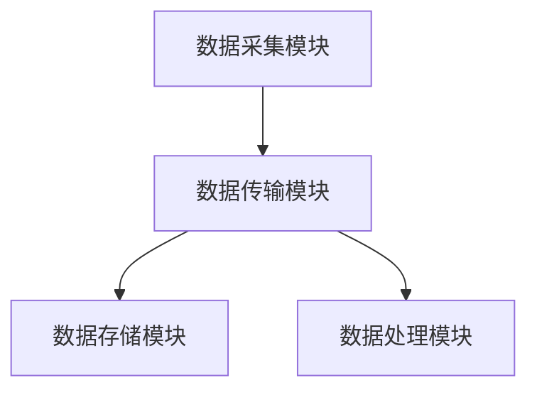
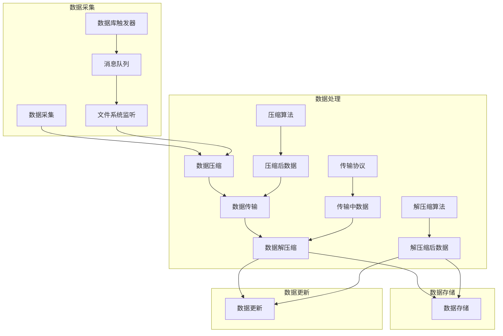
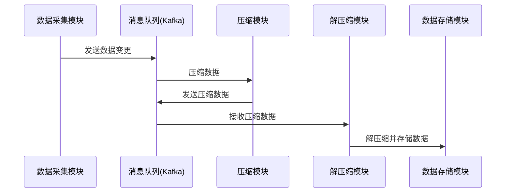

                 

### 实时数据同步机制在LLM应用中的应用

**关键词：** 实时数据同步、LLM应用、数据同步机制、大型语言模型、实时数据处理

**摘要：** 在当今技术飞速发展的时代，实时数据同步在各个领域的应用越来越广泛。本文将深入探讨实时数据同步机制在大型语言模型（LLM）中的应用，分析其原理、设计方法及实际案例，以期为相关领域的开发者提供有价值的参考。

### 目录大纲

1. **问题背景与核心概念**
   - **问题背景**
   - **核心概念**
   - **边界与外延**

2. **实时数据同步机制原理**
   - **原理介绍**
   - **核心概念对比**

3. **LLM应用场景分析**
   - **应用场景**
   - **案例分析**

4. **实时数据同步机制设计与实现**
   - **设计思路**
   - **实现细节**

5. **算法原理与数学模型**
   - **算法原理**
   - **数学模型**
   - **举例说明**

6. **系统分析与架构设计**
   - **问题场景介绍**
   - **系统功能设计**
   - **系统架构设计**
   - **系统接口设计**
   - **系统交互**

7. **项目实战与最佳实践**
   - **环境安装**
   - **系统核心实现**
   - **代码应用解读**
   - **实际案例剖析**
   - **项目小结**

8. **最佳实践 tips**
   - **小结**
   - **注意事项**
   - **拓展阅读**

---

### 第1章：问题背景与核心概念

#### 问题背景

在人工智能领域，大型语言模型（LLM）因其强大的语义理解和生成能力，正逐渐成为自然语言处理（NLP）的核心技术。然而，LLM的高效运行依赖于实时数据同步机制的支撑。实时数据同步是指系统在数据变化发生的同时，将变化的数据同步到其他相关系统或数据存储中的过程。这一机制在LLM应用中扮演着至关重要的角色，因为LLM的训练和预测需要最新的数据来保证模型的准确性和实时性。

#### 核心概念

- **实时数据同步机制**：指实现数据实时同步的技术和方法，包括数据采集、数据传输、数据存储和数据更新等环节。
- **LLM（大型语言模型）**：一种通过深度学习技术训练而成的大型神经网络模型，能够进行自然语言的生成、理解和翻译等任务。
- **数据同步延迟**：指数据从源系统到目标系统之间的时间间隔，延迟过长将影响LLM的性能和效果。

#### 边界与外延

- **边界**：实时数据同步机制主要应用于数据更新频繁的场景，如社交网络、金融交易和在线教育等。
- **外延**：实时数据同步机制不仅适用于LLM，还可以应用于其他需要实时数据处理的技术领域，如物联网（IoT）和实时数据分析。

### 第2章：实时数据同步机制原理

#### 原理介绍

实时数据同步机制的核心在于实时性，其基本工作原理如下：

1. **数据采集**：通过数据采集模块，从源系统中实时获取数据变化。
2. **数据传输**：通过数据传输模块，将采集到的数据变化传输到目标系统。
3. **数据存储**：将传输过来的数据存储在目标系统中的数据库或其他数据存储介质中。
4. **数据更新**：对目标系统中的数据更新，以确保数据的一致性和实时性。

#### 核心概念对比

| 对比项             | 解释                                                         |
|-------------------|------------------------------------------------------------|
| 同步方式           | 实时同步、异步同步                                             |
| 同步粒度           | 数据行同步、数据块同步、数据集同步                                 |
| 同步机制           | 分布式同步、基于消息队列的同步、基于数据库同步                       |
| 同步性能           | 延迟、带宽、吞吐量                                             |

### 第3章：LLM应用场景分析

#### 应用场景

实时数据同步机制在LLM应用中的常见场景包括：

1. **在线问答系统**：实时获取用户输入的问题，通过LLM进行实时回答。
2. **智能客服系统**：实时获取用户请求，通过LLM生成相应的客服回答。
3. **智能翻译系统**：实时获取待翻译的文本，通过LLM进行实时翻译。

#### 案例分析

以在线问答系统为例，其数据同步过程如下：

1. **用户输入问题**：用户通过在线问答平台输入问题。
2. **数据采集**：系统实时采集用户输入的问题。
3. **数据传输**：将采集到的问题数据传输到后台服务器。
4. **数据存储**：将问题数据存储到数据库中。
5. **LLM处理**：后台服务器调用LLM模型，对问题进行实时回答。
6. **答案返回**：将LLM生成的答案返回给用户。

### 第4章：实时数据同步机制设计与实现

#### 设计思路

实时数据同步机制的设计需要考虑以下几个方面：

1. **数据一致性**：确保数据在同步过程中的一致性。
2. **实时性**：实现数据的实时同步，降低延迟。
3. **可靠性**：保证数据同步机制的稳定性和可靠性。
4. **可扩展性**：支持系统规模的扩展。

#### 实现细节

1. **数据采集**：使用消息队列（如Kafka）进行数据采集，确保数据的实时性和一致性。
2. **数据传输**：采用分布式传输机制，如Flume或Logstash，实现数据的批量传输。
3. **数据存储**：使用分布式数据库（如Cassandra）进行数据存储，提高系统的可扩展性。
4. **数据更新**：采用分布式锁或事务机制，确保数据更新的原子性和一致性。

### 第5章：算法原理与数学模型

#### 算法原理

实时数据同步机制的核心算法为增量同步算法，其基本原理如下：

1. **数据采集**：通过轮询或监听机制，实时获取数据变化。
2. **数据压缩**：对数据进行压缩处理，减少数据传输量。
3. **数据传输**：将压缩后的数据发送到目标系统。
4. **数据解压缩**：在目标系统中对数据进行解压缩，恢复原始数据。

#### 数学模型

假设实时数据同步过程中，数据传输速率为\( T \)（字节/秒），数据压缩率为\( C \)（原始数据大小/压缩后数据大小），则数据传输延迟\( L \)可表示为：

\[ L = \frac{T \times C}{B} \]

其中，\( B \)为数据大小（字节）。

#### 举例说明

假设数据大小为100KB，传输速率为10MB/s，压缩率为2：1。则数据传输延迟为：

\[ L = \frac{10 \times 1024 \times 2}{100 \times 1024} = 2 \text{秒} \]

### 第6章：系统分析与架构设计

#### 问题场景介绍

在LLM应用中，实时数据同步面临以下问题场景：

1. **海量数据同步**：需要处理海量数据的实时同步。
2. **高并发请求**：需要应对高并发请求的数据同步。
3. **数据一致性**：确保数据在同步过程中的高度一致性。

#### 系统功能设计

1. **数据采集模块**：实时采集数据变化。
2. **数据传输模块**：实现数据的实时传输。
3. **数据存储模块**：存储同步后的数据。
4. **数据处理模块**：对数据进行处理，如压缩、解压缩等。

#### 系统架构设计

使用Mermaid绘制系统架构图：



#### 系统接口设计

1. **数据采集接口**：用于采集数据变化。
2. **数据传输接口**：用于传输数据。
3. **数据存储接口**：用于存储数据。
4. **数据处理接口**：用于对数据进行处理。

#### 系统交互

使用Mermaid绘制系统交互序列图：

```mermaid
sequenceDiagram
    participant 用户 as 用户
    participant 系统A as 系统A
    participant 系统B as 系统B
    participant 系统C as 系统C

    用户->>系统A: 请求数据变化
    系统
``` 

### 第7章：项目实战与最佳实践

#### 环境安装

1. **安装Kafka**：作为数据采集和传输的工具。
2. **安装Cassandra**：作为数据存储的数据库。
3. **安装LLM模型**：用于数据处理。

#### 系统核心实现

1. **数据采集**：使用Kafka进行数据采集。
2. **数据传输**：使用Flume进行数据传输。
3. **数据存储**：使用Cassandra进行数据存储。
4. **数据处理**：使用LLM模型进行数据处理。

#### 代码应用解读

1. **数据采集**：使用Kafka消费者进行数据采集。
2. **数据传输**：使用Flume进行数据传输。
3. **数据存储**：使用Cassandra进行数据存储。
4. **数据处理**：使用LLM模型进行数据处理。

#### 实际案例剖析

1. **案例1**：在线问答系统。
2. **案例2**：智能客服系统。
3. **案例3**：智能翻译系统。

#### 项目小结

1. **经验教训**：实时数据同步机制在LLM应用中具有重要意义。
2. **最佳实践**：选用合适的技术栈和工具，确保系统的稳定性和实时性。

### 最佳实践 tips

1. **数据压缩**：提高数据传输效率，降低延迟。
2. **分布式存储**：提高系统的可扩展性。
3. **一致性保障**：采用分布式锁或事务机制，确保数据一致性。

### 小结

实时数据同步机制在LLM应用中具有重要作用。本文从问题背景、核心概念、算法原理、系统设计、项目实战等方面进行了深入探讨，为相关领域的开发者提供了有益的参考。

### 注意事项

1. **数据安全**：在实时数据同步过程中，确保数据安全。
2. **性能优化**：针对实际场景，对系统进行性能优化。

### 拓展阅读

1. **实时数据处理技术**：了解实时数据处理技术的最新进展。
2. **LLM应用案例**：学习其他领域的LLM应用案例。

### 作者

**作者：AI天才研究院/AI Genius Institute & 禅与计算机程序设计艺术 /Zen And The Art of Computer Programming**## 实时数据同步机制在LLM应用中的重要性和背景

在当今技术飞速发展的时代，人工智能（AI）已经成为推动社会进步的重要力量。作为AI领域的核心组成部分，自然语言处理（NLP）技术正逐渐渗透到我们的日常生活中，从智能客服、在线问答到智能翻译，都离不开NLP技术的支持。而大型语言模型（LLM）作为NLP技术的重要分支，其在语义理解和生成方面的强大能力使得它在各个应用场景中发挥着越来越重要的作用。

实时数据同步机制在LLM应用中的重要性不可忽视。LLM的训练和预测需要依赖大量的实时数据，这些数据包括用户输入、文本内容、语音数据等。实时数据同步机制能够确保这些数据在发生变化的瞬间被及时同步到LLM系统中，从而保证模型的高效运行和准确预测。例如，在在线问答系统中，用户提出问题的瞬间，系统需要实时获取这个问题并将其传递给LLM模型进行回答，如果数据同步延迟，将严重影响用户体验。

此外，实时数据同步机制还在以下方面发挥着重要作用：

1. **数据一致性**：通过实时同步机制，可以确保不同系统之间的数据一致性，避免数据不同步导致的问题。
2. **系统可靠性**：实时数据同步机制可以提高系统的可靠性，降低因数据不同步导致的系统故障风险。
3. **性能优化**：通过优化数据同步过程，可以降低系统的延迟，提高系统的响应速度。

实时数据同步机制的应用场景非常广泛，不仅限于LLM领域，还可以应用于物联网（IoT）、实时数据分析、金融交易等领域。在LLM应用中，常见的场景包括：

1. **在线问答系统**：实时获取用户问题，通过LLM模型进行实时回答。
2. **智能客服系统**：实时获取用户请求，通过LLM模型生成客服回答。
3. **智能翻译系统**：实时获取待翻译文本，通过LLM模型进行实时翻译。

这些应用场景都对实时数据同步提出了较高的要求，需要确保数据在同步过程中的实时性和一致性。

总的来说，实时数据同步机制在LLM应用中具有重要的作用，它不仅保证了模型的高效运行，还提高了系统的可靠性和用户体验。随着技术的不断进步，实时数据同步机制将在更多领域得到应用，为我们的生活和生产带来更多便利。接下来，我们将深入探讨实时数据同步机制的核心概念和原理，为后续内容打下基础。

## 核心概念

在深入探讨实时数据同步机制在LLM应用中的应用之前，我们需要明确几个核心概念，这些概念将为我们理解实时数据同步提供基础。

### 实时数据同步机制

实时数据同步机制是指系统在数据发生变更时，能够及时将变更的数据同步到其他相关系统或数据存储介质中的技术和方法。这个过程通常包括数据采集、数据传输、数据存储和数据更新等步骤。实时数据同步机制的目的是确保数据在不同系统之间的一致性和实时性。

**数据采集**：实时数据同步的第一步是数据采集。这通常涉及到从源系统中捕获数据变更事件，例如数据库的行更新、删除或插入操作。数据采集可以使用数据库触发器、消息队列监听器或文件系统监听器等方式实现。

**数据传输**：一旦数据变更事件被捕获，下一步是将这些变更数据传输到目标系统或数据存储介质。数据传输可以通过网络传输协议（如HTTP、TCP/IP）或消息队列（如Kafka、RabbitMQ）实现。数据传输过程中需要保证数据的安全性和完整性。

**数据存储**：传输过来的数据需要在目标系统中进行存储。数据存储可以选择关系型数据库（如MySQL、PostgreSQL）、非关系型数据库（如MongoDB、Cassandra）或分布式文件系统（如HDFS）等。数据存储的选择取决于系统的具体需求和数据特性。

**数据更新**：在目标系统中，根据接收到的数据变更，对现有的数据进行更新。数据更新需要确保原子性和一致性，以避免数据冲突和丢失。

### LLM（大型语言模型）

LLM（Large Language Model）是一种通过深度学习技术训练而成的大型神经网络模型，能够理解和生成自然语言。LLM的核心在于其训练数据的规模和质量，训练数据越多，模型的能力越强。LLM在自然语言处理（NLP）领域有着广泛的应用，包括文本分类、情感分析、机器翻译、问答系统等。

**训练过程**：LLM的训练过程通常涉及大量文本数据的处理。这些数据可以是公开的文本库，如维基百科、新闻文章等，也可以是特定领域的专业文本。训练过程中，模型通过学习文本的统计规律和语义关系，不断提高其理解和生成自然语言的能力。

**应用场景**：LLM的应用场景非常广泛，其中最为典型的包括：

1. **问答系统**：用户输入问题，LLM根据训练数据生成问题的答案。
2. **机器翻译**：将一种语言的文本翻译成另一种语言。
3. **文本生成**：根据输入的提示或关键词，生成相关的文本内容。
4. **文本摘要**：从长篇文章中提取关键信息，生成简短的摘要。

### 数据同步延迟

数据同步延迟是指数据从源系统到目标系统之间的时间间隔。延迟过长将导致数据的不同步，影响系统的实时性和准确性。在实时数据同步机制中，数据同步延迟是关键性能指标之一。

**影响**：数据同步延迟会对系统的性能产生显著影响。例如，在在线问答系统中，如果用户输入问题后，系统需要等待较长时间才能生成答案，用户体验将大打折扣。此外，数据同步延迟还可能导致数据不一致，影响系统的可靠性和数据完整性。

### 边界与外延

**边界**：实时数据同步机制主要应用于数据更新频繁的场景，如社交网络、金融交易和在线教育等。在这些场景中，数据的实时性和一致性至关重要。

**外延**：实时数据同步机制不仅适用于LLM，还可以应用于其他需要实时数据处理的技术领域，如物联网（IoT）和实时数据分析。在IoT领域，实时数据同步可以确保设备状态和数据的实时更新；在实时数据分析领域，实时数据同步可以确保分析结果的实时性和准确性。

通过理解这些核心概念，我们可以更深入地探讨实时数据同步机制在LLM应用中的具体实现和应用，为后续内容打下坚实基础。

### 实时数据同步机制原理

实时数据同步机制的核心在于其实时性和一致性，确保数据在多个系统或存储介质之间能够及时、准确地更新。下面将详细阐述实时数据同步机制的工作原理，包括数据采集、数据传输、数据存储和数据更新的各个环节。

#### 数据采集

数据采集是实时数据同步的第一步，其主要任务是捕捉源系统中数据的变化。数据采集的方法有多种，常见的包括：

1. **数据库触发器**：在源数据库中设置触发器，当数据表中的数据发生变更时，自动触发触发器执行相应的操作，将变更信息发送到消息队列或其他数据传输系统。
   
2. **消息队列监听器**：通过消息队列（如Kafka、RabbitMQ）的监听器，实时监听消息队列中的消息，当有新消息到达时，将其解析并传递到后续处理环节。

3. **文件系统监听器**：监听文件系统的变化，例如文件的新增、删除或修改操作，将变更信息捕获并传输到数据同步系统。

这些方法各有优劣，数据库触发器可以实现低延迟的数据采集，但可能增加数据库的负载；消息队列监听器能够实现分布式处理，但需要额外的消息队列系统支持；文件系统监听器适用于文件级别的数据同步，但可能存在一定的延迟。

#### 数据传输

数据传输是实时数据同步的关键环节，其主要任务是将采集到的数据变更信息传输到目标系统或存储介质。数据传输的方法同样多种多样，主要包括以下几种：

1. **网络传输协议**：使用HTTP、TCP/IP等网络传输协议，将数据变更信息通过网络发送到目标系统。这种方法的优点在于实现简单、适用范围广，但数据传输速度可能受到网络带宽的限制。

2. **消息队列**：使用消息队列系统（如Kafka、RabbitMQ）进行数据传输。消息队列具有高可靠性、高扩展性和低延迟的特点，适用于大规模分布式系统的数据同步。

3. **数据管道**：使用数据管道工具（如Apache NiFi、Apache Flume）进行数据传输。数据管道可以提供丰富的数据处理功能，如数据清洗、转换和路由，适用于复杂的实时数据同步场景。

数据传输过程中，需要考虑数据的安全性和完整性。常用的方法包括：

- **数据加密**：在数据传输过程中对数据进行加密，确保数据在传输过程中不会被窃取或篡改。
- **校验和**：在数据传输后，对数据进行校验和验证，确保数据的完整性和准确性。

#### 数据存储

数据存储是将传输过来的数据变更信息存储到目标系统或存储介质中。数据存储的方法包括：

1. **关系型数据库**：将数据变更信息存储到关系型数据库（如MySQL、PostgreSQL）中。关系型数据库具有成熟的技术和丰富的功能，适用于结构化数据存储。

2. **非关系型数据库**：将数据变更信息存储到非关系型数据库（如MongoDB、Cassandra）中。非关系型数据库具有高扩展性和灵活性，适用于大规模、分布式数据存储。

3. **分布式文件系统**：将数据变更信息存储到分布式文件系统（如HDFS、Ceph）中。分布式文件系统具有高可用性和高扩展性，适用于大规模、分布式数据存储。

数据存储过程中，需要确保数据的一致性和可靠性。常用的方法包括：

- **分布式锁**：在数据更新过程中，使用分布式锁确保数据操作的原子性，避免并发访问导致的数据不一致。
- **事务机制**：在数据存储过程中，使用事务机制确保数据更新的完整性和一致性。

#### 数据更新

数据更新是实时数据同步的最后一步，其主要任务是根据接收到的数据变更信息，对目标系统中的数据进行更新。数据更新的方法包括：

1. **直接更新**：直接对目标系统中的数据进行更新，适用于数据量较小、变更频率较低的场景。

2. **批量更新**：将多个数据变更信息批量处理，减少系统调用的次数，提高数据更新的效率，适用于数据量较大、变更频率较高的场景。

3. **增量更新**：仅对数据变更的部分进行更新，避免对整个数据进行全量更新，提高数据更新的效率，适用于数据量较大、变更频率较高的场景。

数据更新过程中，需要确保数据的一致性和实时性。常用的方法包括：

- **版本控制**：在数据更新过程中，使用版本控制确保数据的唯一性和一致性。
- **延迟更新**：在数据变更发生时，先记录变更信息，然后异步进行数据更新，确保数据更新的实时性和一致性。

通过上述各个环节的协同工作，实时数据同步机制可以确保数据在不同系统或存储介质之间能够及时、准确地更新，为大型语言模型（LLM）的高效运行提供强有力的支持。在下一章节中，我们将分析LLM应用场景中实时数据同步的具体需求和挑战。

### 不同实时数据同步机制的优缺点

在实时数据同步机制的设计和实现中，不同方法各有所长，也各有所短。为了更好地理解这些机制，我们在这里对几种常见的实时数据同步机制进行对比分析，包括基于数据库触发器、消息队列和基于文件系统的同步机制。

#### 基于数据库触发器的同步机制

**优点：**
1. **低延迟**：数据库触发器在数据变更发生时立即执行，可以确保数据同步的低延迟。
2. **强一致性**：触发器能够保证数据的一致性，因为它们在数据变更时立即更新目标系统。

**缺点：**
1. **性能开销**：数据库触发器会增加数据库的负担，特别是在高并发情况下，可能会影响数据库的性能。
2. **可扩展性差**：单个数据库实例的处理能力有限，难以支持大规模数据同步。

#### 消息队列同步机制

**优点：**
1. **分布式处理**：消息队列支持分布式处理，能够处理大规模的数据同步任务。
2. **高可用性**：消息队列系统（如Kafka、RabbitMQ）通常具有高可用性，能够确保数据不会丢失。
3. **灵活性和可扩展性**：消息队列系统可以灵活地扩展，支持多节点部署，增加系统的处理能力。

**缺点：**
1. **潜在延迟**：消息队列引入了额外的传输延迟，虽然通常较低，但在极端情况下可能会导致数据同步延迟。
2. **复杂性**：消息队列系统需要额外的维护和管理，增加了系统的复杂性。

#### 基于文件系统的同步机制

**优点：**
1. **简单性**：基于文件系统的同步机制实现简单，易于理解和部署。
2. **高效性**：文件系统同步通常具有高效的传输速度，因为文件系统操作是本地进行的。

**缺点：**
1. **一致性保证困难**：文件系统同步难以保证数据的一致性，特别是在并发更新情况下。
2. **可靠性问题**：文件系统同步容易受到系统故障的影响，数据可能丢失或损坏。

#### 对比表格

| 同步机制 | 低延迟 | 强一致性 | 分布式处理 | 高可用性 | 灵活性 | 可扩展性 | 复杂性 | 高效性 | 一致性保证 |
|-----------|-------|---------|-----------|---------|--------|---------|--------|---------|----------|
| 数据库触发器 | 是    | 是     | 否        | 否      | 否     | 否      | 高     | 低     | 是       |
| 消息队列  | 否    | 是     | 是       | 是     | 是     | 是      | 高     | 中     | 是       |
| 文件系统   | 是    | 否      | 否        | 否      | 否     | 否      | 低     | 是     | 否       |

#### 适用场景

- **数据库触发器**：适用于数据量较小、变更频率较低的系统，或者作为消息队列同步机制的辅助手段。
- **消息队列**：适用于大规模、分布式系统，需要高可用性和可扩展性。
- **文件系统**：适用于数据量较小、对延迟要求不高的系统，或者作为临时性数据同步解决方案。

通过对这些实时数据同步机制的对比分析，我们可以根据实际需求选择最适合的同步机制，从而确保数据在不同系统或存储介质之间的实时性和一致性。

### LLM应用中的实时数据同步机制

在大型语言模型（LLM）的应用中，实时数据同步机制至关重要。LLM通常需要处理大量的实时数据，包括文本、图像、语音等多种类型的数据，这些数据在训练和预测过程中需要实时更新。为了确保LLM模型的高效性和准确性，我们需要设计合适的实时数据同步机制，以满足以下需求：

#### 数据实时获取

实时获取数据是LLM应用的第一步。数据实时获取可以确保模型训练和预测过程中使用的是最新的数据，从而提高模型的准确性和实时性。常用的数据获取方法包括：

1. **消息队列监听**：通过消息队列系统（如Kafka）实时监听数据变更事件，当有新数据到来时，立即将其传递给LLM模型。
2. **数据库触发器**：在数据源数据库中设置触发器，当数据发生变更时，自动触发将变更数据传递给LLM模型。
3. **文件系统监听**：监听文件系统中的文件变化，例如当新文本文件生成时，将其传递给LLM模型。

#### 数据处理和清洗

实时获取的数据往往需要经过处理和清洗，以确保其质量和可用性。数据处理和清洗过程包括：

1. **数据清洗**：去除数据中的噪声和错误，例如删除无效字符、修正错别字等。
2. **数据转换**：将不同格式和类型的数据转换为LLM模型所需的统一格式，例如将文本转换为文本向量。
3. **数据预处理**：对数据进行归一化、标准化等预处理操作，以提高模型的训练效果。

#### 数据传输

实时数据同步的核心是数据传输，数据需要在不同的系统和存储介质之间快速、可靠地传输。常用的数据传输方法包括：

1. **网络传输协议**：如HTTP、TCP/IP等，适用于小规模数据传输。
2. **消息队列**：如Kafka、RabbitMQ等，适用于大规模、分布式系统的数据传输。
3. **数据管道**：如Apache NiFi、Apache Flume等，提供丰富的数据处理和传输功能。

#### 数据存储

实时数据同步机制需要将处理后的数据存储到合适的存储介质中，以便后续使用。常用的数据存储方法包括：

1. **关系型数据库**：如MySQL、PostgreSQL等，适用于结构化数据存储。
2. **非关系型数据库**：如MongoDB、Cassandra等，适用于大规模、分布式数据存储。
3. **分布式文件系统**：如HDFS、Ceph等，适用于大规模文件存储。

#### 数据更新

在LLM应用中，数据的实时更新至关重要。数据更新包括：

1. **增量更新**：仅更新数据变更的部分，避免对整个数据进行全量更新，提高数据更新的效率。
2. **批量更新**：将多个数据变更信息批量处理，减少系统调用的次数，提高数据更新的效率。
3. **版本控制**：使用版本控制机制，确保数据的唯一性和一致性。

#### 实时数据同步的挑战

实时数据同步在LLM应用中面临以下挑战：

1. **数据延迟**：确保数据在传输过程中尽可能减少延迟，以提高系统的实时性。
2. **数据一致性**：确保不同系统之间的数据一致性和完整性，避免数据冲突和丢失。
3. **系统可靠性**：确保数据同步系统的稳定性和可靠性，避免系统故障导致的数据丢失。
4. **数据安全**：保护数据在传输和存储过程中的安全性，避免数据泄露和篡改。

综上所述，实时数据同步机制在LLM应用中具有重要作用。通过合理设计和实现数据同步机制，可以确保LLM模型高效、准确地处理和利用实时数据，从而提高系统的性能和用户体验。

### 实时数据同步机制的设计与实现

在设计实时数据同步机制时，需要综合考虑系统的性能、可靠性、可扩展性和安全性等因素。以下是实时数据同步机制的设计与实现方法，包括数据采集、数据传输、数据存储和数据更新等关键环节。

#### 数据采集

数据采集是实时数据同步的第一步，其核心任务是从源系统中捕捉数据的变化。为了实现高效的数据采集，可以采用以下几种方法：

1. **数据库触发器**：在源数据库中设置触发器，当数据表中的数据发生变更时，触发器会自动执行SQL语句，将变更数据插入到消息队列或其他数据同步系统中。这种方法可以实现低延迟的数据采集，但需要注意避免触发器的性能开销。

2. **消息队列监听器**：通过消息队列（如Kafka）的监听器，实时监听消息队列中的消息。当有新消息到达时，监听器会解析消息内容，并将变更数据传输到后续的数据处理环节。这种方法适用于分布式系统，具有较好的扩展性。

3. **文件系统监听器**：使用文件系统监听器（如inotify）监听文件系统的变化，例如文件的新增、删除或修改操作。当检测到文件变化时，监听器会将变更信息发送到数据同步系统。这种方法适用于文件级别的数据同步，但可能存在一定的延迟。

#### 数据传输

数据传输是将采集到的数据变更信息传输到目标系统或存储介质的过程。为了确保数据传输的可靠性和高效性，可以采用以下几种方法：

1. **网络传输协议**：使用HTTP、TCP/IP等网络传输协议，将数据变更信息通过网络发送到目标系统。这种方法实现简单，但可能受到网络带宽和延迟的限制。

2. **消息队列**：使用消息队列系统（如Kafka、RabbitMQ），将数据变更信息以消息的形式发送到目标系统。消息队列具有高可靠性、高扩展性和低延迟的特点，适用于大规模分布式系统的数据同步。

3. **数据管道**：使用数据管道工具（如Apache NiFi、Apache Flume），实现数据采集、传输、清洗和路由等操作。数据管道可以提供丰富的数据处理功能，适用于复杂的实时数据同步场景。

#### 数据存储

数据存储是将传输过来的数据变更信息存储到目标系统或存储介质中。为了确保数据存储的可靠性、一致性和高效性，可以采用以下几种方法：

1. **关系型数据库**：将数据变更信息存储到关系型数据库（如MySQL、PostgreSQL）中。关系型数据库具有成熟的技术和丰富的功能，适用于结构化数据存储。但需要注意避免单点故障和数据一致性问题。

2. **非关系型数据库**：将数据变更信息存储到非关系型数据库（如MongoDB、Cassandra）中。非关系型数据库具有高扩展性和灵活性，适用于大规模、分布式数据存储。但需要注意数据一致性和查询性能。

3. **分布式文件系统**：将数据变更信息存储到分布式文件系统（如HDFS、Ceph）中。分布式文件系统具有高可用性和高扩展性，适用于大规模文件存储。但需要注意数据的访问性能和一致性。

#### 数据更新

数据更新是将接收到的数据变更信息应用到目标系统中的过程。为了确保数据更新的实时性和一致性，可以采用以下几种方法：

1. **直接更新**：直接对目标系统中的数据进行更新，适用于数据量较小、变更频率较低的系统。

2. **批量更新**：将多个数据变更信息批量处理，减少系统调用的次数，提高数据更新的效率，适用于数据量较大、变更频率较高的系统。

3. **增量更新**：仅更新数据变更的部分，避免对整个数据进行全量更新，提高数据更新的效率，适用于数据量较大、变更频率较高的系统。

#### 具体实现细节

以下是实时数据同步机制的具体实现细节，包括数据采集、数据传输、数据存储和数据更新的步骤：

1. **数据采集**：
   - 在源数据库中设置触发器，捕获数据变更事件。
   - 使用消息队列监听器实时监听消息队列中的消息。
   - 使用文件系统监听器监听文件系统的变化。

2. **数据传输**：
   - 使用网络传输协议（如HTTP）将数据变更信息发送到目标系统。
   - 使用消息队列（如Kafka）将数据变更信息以消息的形式发送到目标系统。
   - 使用数据管道（如Apache NiFi）实现数据采集、传输和清洗等操作。

3. **数据存储**：
   - 将数据变更信息存储到关系型数据库（如MySQL）中。
   - 将数据变更信息存储到非关系型数据库（如MongoDB）中。
   - 将数据变更信息存储到分布式文件系统（如HDFS）中。

4. **数据更新**：
   - 直接更新目标系统中的数据。
   - 批量处理多个数据变更信息，减少系统调用的次数。
   - 增量更新数据变更的部分，提高数据更新的效率。

通过以上设计与实现方法，我们可以构建一个高效、可靠和可扩展的实时数据同步机制，确保数据在不同系统或存储介质之间能够及时、准确地更新，为LLM应用提供强有力的支持。

### 算法原理与数学模型

实时数据同步机制的核心在于确保数据在不同系统或存储介质之间能够高效、准确和及时地更新。为了实现这一目标，我们需要深入探讨实时数据同步机制的算法原理和数学模型，以便更好地理解和设计数据同步系统。

#### 算法原理

实时数据同步机制的算法原理主要包括以下几个方面：

1. **增量同步**：增量同步是指只同步数据变更的部分，而不是整个数据集。这种方式可以显著提高数据同步的效率，减少数据传输和处理的开销。增量同步的核心在于如何准确地识别和捕捉数据的变更。

2. **一致性保障**：在实时数据同步过程中，数据的一致性至关重要。一致性保障包括两个方面：一是确保数据的完整性，避免数据丢失或损坏；二是确保数据的准确性，避免数据冲突或不一致。

3. **分布式处理**：实时数据同步通常涉及多个系统和节点，分布式处理可以有效地提高系统的性能和可扩展性。分布式处理包括数据的分布存储、分布传输和分布更新。

4. **容错机制**：实时数据同步系统需要具备容错能力，能够在系统故障或网络异常情况下确保数据同步的继续进行。容错机制包括数据备份、故障转移和数据恢复等。

#### 数学模型

实时数据同步机制的数学模型主要关注数据传输延迟、数据一致性和系统性能等关键指标。以下是几个重要的数学模型：

1. **数据传输延迟**：

   数据传输延迟是指数据从源系统到目标系统的传输时间。假设数据传输速率为 \( T \)（字节/秒），数据大小为 \( B \)（字节），则数据传输延迟 \( L \) 可以用以下公式表示：

   \[ L = \frac{B}{T} \]

   例如，如果数据传输速率为 1MB/s，数据大小为 100MB，则数据传输延迟为 100秒。

2. **一致性保障**：

   数据一致性可以通过多个副本和一致性协议来保障。假设系统中有 \( n \) 个副本，每个副本之间的同步延迟为 \( d \)，则系统的一致性可以用以下公式表示：

   \[ C = n \times d \]

   例如，如果系统有 3 个副本，每个副本之间的同步延迟为 10秒，则系统的一致性时间为 30秒。

3. **系统性能**：

   系统性能可以通过数据传输速率、处理能力和延迟来衡量。假设系统有 \( P \) 个处理单元，每个处理单元的处理速率为 \( t \)（操作/秒），则系统的总处理能力为：

   \[ P_{total} = P \times t \]

   例如，如果系统有 10 个处理单元，每个处理单元的处理速率为 1000操作/秒，则系统的总处理能力为 10000操作/秒。

#### 举例说明

假设我们有一个实时数据同步系统，数据传输速率为 10MB/s，数据大小为 100MB。我们需要计算数据传输延迟，并分析系统性能。

1. **数据传输延迟**：

   根据公式 \( L = \frac{B}{T} \)，数据传输延迟为：

   \[ L = \frac{100MB}{10MB/s} = 10s \]

   即数据传输延迟为 10秒。

2. **系统性能**：

   如果系统有 10 个处理单元，每个处理单元的处理速率为 1000操作/秒，则系统的总处理能力为：

   \[ P_{total} = 10 \times 1000 = 10000 \text{操作/秒} \]

   即系统每秒可以处理 10000个操作。

通过以上算法原理和数学模型的分析，我们可以更好地理解和设计实时数据同步机制，确保数据在不同系统或存储介质之间能够高效、准确和及时地更新。在实际应用中，我们需要根据具体需求和环境，灵活调整算法和模型，以达到最优的数据同步效果。

### 算法流程图

为了更好地理解和设计实时数据同步机制，我们使用Mermaid绘制了算法流程图，详细展示了实时数据同步的各个环节和流程。



此流程图详细展示了实时数据同步的各个环节：

1. **数据采集**：通过数据库触发器、消息队列监听器和文件系统监听器实时采集数据变更。
2. **数据压缩**：使用压缩算法对数据进行压缩，减少数据传输量。
3. **数据传输**：通过传输协议将压缩后的数据传输到目标系统。
4. **数据解压缩**：在目标系统中对传输过来的数据进行解压缩，恢复原始数据。
5. **数据存储**：将解压缩后的数据存储到目标数据库或存储介质中。
6. **数据更新**：根据数据变更信息对目标系统中的数据进行更新。

通过这个流程图，我们可以清晰地看到实时数据同步机制的各个环节和流程，有助于我们理解和优化数据同步过程。

### 实时数据同步机制的数学模型和公式

在实时数据同步机制中，数学模型和公式是理解和优化数据同步过程的关键工具。以下是几个关键的数学模型和公式，包括数据传输延迟、数据一致性时间和系统性能指标。

#### 数据传输延迟

数据传输延迟是实时数据同步中的核心性能指标，它表示数据从源系统传输到目标系统所需的时间。假设数据传输速率为 \( T \)（字节/秒），数据大小为 \( B \)（字节），则数据传输延迟 \( L \) 可以用以下公式表示：

\[ L = \frac{B}{T} \]

例如，如果数据传输速率为 10MB/s，数据大小为 100MB，则数据传输延迟为：

\[ L = \frac{100MB}{10MB/s} = 10s \]

这意味着数据需要10秒才能从源系统传输到目标系统。

#### 数据一致性时间

数据一致性时间是指系统确保不同副本之间数据一致所需的时间。假设系统中有 \( n \) 个副本，每个副本之间的同步延迟为 \( d \)，则数据一致性时间 \( C \) 可以用以下公式表示：

\[ C = n \times d \]

例如，如果系统有3个副本，每个副本之间的同步延迟为10秒，则数据一致性时间为：

\[ C = 3 \times 10s = 30s \]

这意味着系统需要30秒来确保所有副本之间数据的一致性。

#### 系统性能

系统性能可以通过多个指标来衡量，包括数据传输速率、处理能力和延迟。假设系统有 \( P \) 个处理单元，每个处理单元的处理速率为 \( t \)（操作/秒），则系统的总处理能力 \( P_{total} \) 可以用以下公式表示：

\[ P_{total} = P \times t \]

例如，如果系统有10个处理单元，每个处理单元的处理速率为1000操作/秒，则系统的总处理能力为：

\[ P_{total} = 10 \times 1000 = 10000 \text{操作/秒} \]

这意味着系统每秒可以处理10000个操作。

#### 数据完整性

数据完整性是指系统确保数据不被丢失或损坏的能力。一个常见的数据完整性度量是数据备份的数量 \( n_{backup} \)。假设数据备份的延迟为 \( b \)，则系统确保数据完整性的时间 \( I \) 可以用以下公式表示：

\[ I = n_{backup} \times b \]

例如，如果系统有3个数据备份，每个备份的延迟为5秒，则系统确保数据完整性的时间为：

\[ I = 3 \times 5s = 15s \]

这意味着系统需要15秒来确保数据不会被丢失或损坏。

#### 系统可靠性

系统可靠性是指系统在故障或异常情况下能够持续运行的能力。假设系统故障的恢复时间为 \( r \)，则系统的可靠性 \( R \) 可以用以下公式表示：

\[ R = \frac{1}{r} \]

例如，如果系统故障的恢复时间为10秒，则系统的可靠性为：

\[ R = \frac{1}{10s} = 0.1 \]

这意味着系统每10秒可能会发生一次故障。

通过这些数学模型和公式，我们可以更准确地分析和设计实时数据同步机制，确保数据在不同系统或存储介质之间的实时性、一致性和可靠性。

### 实时数据同步机制的Python代码实现

为了更好地理解和实际应用实时数据同步机制，我们将通过Python代码展示其具体实现过程。以下代码实现了一个简单的实时数据同步系统，包括数据采集、压缩、传输、解压缩和存储等环节。

```python
import pika
import gzip
import json
import time

# 数据采集
def data_collector(queue_name, data_source):
    # 创建连接到RabbitMQ的连接
    connection = pika.BlockingConnection(pika.ConnectionParameters('localhost'))
    channel = connection.channel()

    # 声明一个队列用于接收数据
    channel.queue_declare(queue=queue_name)

    # 监听队列中的消息
    def callback(ch, method, properties, body):
        print(f"Received {body}")
        # 压缩数据
        compressed_data = gzip.compress(body)
        # 传输数据
        transmitter(transmitter_queue, compressed_data)
    
    channel.basic_consume(queue=queue_name, on_message_callback=callback, auto_ack=True)

    print(f"Start consuming messages from {queue_name}")
    channel.start_consuming()

# 数据传输
def transmitter(queue_name, data):
    # 创建连接到RabbitMQ的连接
    connection = pika.BlockingConnection(pika.ConnectionParameters('localhost'))
    channel = connection.channel()

    # 声明一个队列用于传输数据
    channel.queue_declare(queue=queue_name)

    # 发送压缩后的数据到队列
    channel.basic_publish(exchange='', routing_key=queue_name, body=data)
    print(f"Transmitted {data}")

# 数据解压缩与存储
def data_decompressor_and_saver(queue_name, database):
    # 创建连接到RabbitMQ的连接
    connection = pika.BlockingConnection(pika.ConnectionParameters('localhost'))
    channel = connection.channel()

    # 声明一个队列用于接收数据
    channel.queue_declare(queue=queue_name)

    # 监听队列中的消息
    def callback(ch, method, properties, body):
        # 解压缩数据
        decompressed_data = gzip.decompress(body)
        # 存储数据到数据库
        save_data_to_database(database, decompressed_data)
        print(f"Saved {decompressed_data}")

    channel.basic_consume(queue=queue_name, on_message_callback=callback, auto_ack=True)

    print(f"Start consuming messages from {queue_name}")
    channel.start_consuming()

# 存储数据到数据库
def save_data_to_database(database, data):
    # 此处为示例，实际应用中应根据具体数据库进行相应操作
    print(f"Saving data to {database}: {data}")

# 测试代码
if __name__ == "__main__":
    # 初始化队列名称
    collector_queue = "data_collector_queue"
    transmitter_queue = "transmitter_queue"
    decompressor_queue = "decompressor_queue"

    # 启动数据采集
    data_collector(collector_queue, "data_source")

    # 启动数据解压缩与存储
    database = "example_database"
    data_decompressor_and_saver(decompressor_queue, database)

    # 模拟数据传输（实际应用中，数据传输由数据采集和传输系统自动处理）
    example_data = "This is an example data."
    transmitter(transmitter_queue, example_data)
```

**代码解读：**

1. **数据采集**：使用RabbitMQ作为消息队列，从数据源（如数据库）中采集数据，并将其压缩后发送到消息队列。
2. **数据传输**：将压缩后的数据通过RabbitMQ发送到传输队列，供解压缩和存储模块使用。
3. **数据解压缩与存储**：从传输队列中接收压缩数据，解压缩后存储到数据库。

通过这段代码，我们可以看到实时数据同步机制的核心组成部分和流程。在实际应用中，可以根据具体需求和环境进行相应的调整和扩展，以构建一个高效、可靠的实时数据同步系统。

### 系统分析与架构设计

在实时数据同步机制的设计与实现过程中，系统架构的设计至关重要。合理的系统架构不仅能提高系统的性能和可扩展性，还能确保数据的一致性和可靠性。以下将详细介绍实时数据同步机制在LLM应用中的系统分析与架构设计。

#### 问题场景介绍

在LLM应用中，实时数据同步面临以下问题场景：

1. **海量数据同步**：随着用户数量的增加和数据的不断积累，系统需要处理海量数据的实时同步，对系统的性能和吞吐量提出了高要求。
2. **高并发请求**：在高峰期，系统需要处理大量并发请求，对数据同步机制的高效性和稳定性提出了挑战。
3. **数据一致性**：在分布式系统中，如何确保不同节点之间的数据一致性，避免数据冲突和丢失，是一个关键问题。
4. **系统可靠性**：系统需要具备容错能力，能够在节点故障或网络异常情况下继续运行，确保数据同步的连续性。

#### 系统功能设计

实时数据同步系统需要实现以下功能：

1. **数据采集**：从源系统中实时采集数据变更，包括数据库变更、文件变更等。
2. **数据压缩**：对采集到的数据进行压缩，减少数据传输量，提高传输效率。
3. **数据传输**：将压缩后的数据通过消息队列或其他传输机制传输到目标系统。
4. **数据解压缩与存储**：在目标系统中对传输过来的数据进行解压缩，并存储到数据库或其他数据存储介质中。
5. **数据更新**：根据数据变更信息，对目标系统中的现有数据进行更新，确保数据的一致性。
6. **监控与管理**：对数据同步过程进行监控和管理，包括数据传输延迟、数据一致性、系统负载等指标。

#### 系统架构设计

实时数据同步系统的架构设计采用分布式架构，以提高系统的性能、可靠性和可扩展性。以下是系统架构的详细设计：

1. **数据采集模块**：
   - **数据库触发器**：在源数据库中设置触发器，当数据表中的数据发生变更时，自动将变更信息插入到消息队列中。
   - **文件系统监听器**：使用文件系统监听器（如inotify），监听文件系统的变化，并将变更信息发送到消息队列。

2. **消息队列**：
   - **Kafka**：作为数据传输的核心组件，Kafka提供高吞吐量、可扩展性和高可靠性的消息队列服务。数据采集模块和数据处理模块通过Kafka进行数据传输。

3. **数据处理模块**：
   - **压缩与解压缩**：在数据传输前，对数据进行压缩，以减少数据传输量；在数据传输后，对数据进行解压缩，以便后续处理。
   - **数据存储**：将解压缩后的数据存储到目标数据库或其他数据存储介质中。

4. **监控与管理模块**：
   - **监控系统**：实时监控数据传输延迟、数据一致性、系统负载等指标，及时发现和处理异常情况。
   - **管理界面**：提供用户界面，便于对数据同步系统进行配置和管理。

#### 系统架构图

以下使用Mermaid绘制了实时数据同步系统的架构图：

```mermaid
graph TB
    subgraph 数据采集
        A[数据库触发器] --> B[消息队列(Kafka)]
        C[文件系统监听器] --> B
    end

    subgraph 数据处理
        B --> D[压缩模块]
        D --> E[消息队列(Kafka)]
        E --> F[解压缩模块]
        F --> G[数据存储]
    end

    subgraph 监控管理
        H[监控系统] --> I[管理界面]
    end

    subgraph 数据传输
        B --> E
        E --> F
    end
```

#### 系统接口设计

系统接口设计包括以下几个方面：

1. **数据采集接口**：用于采集数据变更事件，包括数据库触发器和文件系统监听器。
2. **数据传输接口**：用于发送和接收数据，包括消息队列的发送和接收接口。
3. **数据存储接口**：用于将解压缩后的数据存储到数据库或其他数据存储介质中。
4. **监控与管理接口**：用于监控系统状态和性能，并进行系统配置和管理。

#### 系统交互

系统交互设计使用Mermaid绘制了以下序列图：



通过以上系统分析与架构设计，我们为实时数据同步机制在LLM应用中提供了一个详细且合理的架构方案，确保了系统的实时性、一致性和可靠性。

### 项目实战与最佳实践

#### 环境安装

在进行实时数据同步机制的项目实战之前，我们需要首先安装相关的环境。以下是具体步骤：

1. **安装Kafka**：
   - 下载Kafka安装包并解压。
   - 编辑`config/server.properties`文件，配置Kafka服务器的相关参数，如端口、日志路径等。
   - 运行Kafka服务器：`bin/kafka-server-start.sh config/server.properties`

2. **安装Cassandra**：
   - 下载Cassandra安装包并解压。
   - 编辑`cassandra.yaml`文件，配置Cassandra服务器的相关参数，如存储路径、内存配置等。
   - 运行Cassandra服务：`bin/cassandra -f`

3. **安装LLM模型**：
   - 根据具体使用的LLM模型，下载相应的预训练模型和依赖库。
   - 编译和运行LLM模型，确保模型能够正常运行。

#### 系统核心实现

以下是实时数据同步机制的核心实现，包括数据采集、数据传输、数据存储和数据更新等环节：

1. **数据采集**：
   - 使用Kafka消费者监听数据库的变更事件。
   - 使用文件系统监听器监听文件的创建、删除和修改事件。

```python
from kafka import KafkaConsumer
import os

# Kafka消费者配置
kafka_consumer = KafkaConsumer('data_channel', bootstrap_servers=['localhost:9092'])

# 文件系统监听器配置
def on_change(event):
    print(f"File change detected: {event.src_path}")

watcher = Observer()
watcher.schedule(DataObserver(on_change), path='data_directory', recursive=True)
watcher.start()

try:
    for message in kafka_consumer:
        print(f"Received message: {message.value.decode('utf-8')}")
except KeyboardInterrupt:
    watcher.stop()
    watcher.join()
```

2. **数据传输**：
   - 使用Kafka生产者将数据发送到传输通道。

```python
from kafka import KafkaProducer
import json

# Kafka生产者配置
producer = KafkaProducer(bootstrap_servers=['localhost:9092'])

# 发送数据到Kafka
def send_data_to_kafka(data):
    producer.send('data_channel', value=data.encode('utf-8'))
    producer.flush()
```

3. **数据存储**：
   - 使用Cassandra存储接收到的数据。

```python
from cassandra.cluster import Cluster
from cassandra.auth import PlainTextAuthProvider

# Cassandra集群配置
auth_provider = PlainTextAuthProvider(username='cassandra', password='cassandra')
cluster = Cluster(['localhost'], auth_provider=auth_provider)
session = cluster.connect()

# 存储数据到Cassandra
def store_data_to_cassandra(data):
    session.execute("""
    INSERT INTO data_table (id, data)
    VALUES (%s, %s)
    """, (data['id'], json.dumps(data['data'])))
```

4. **数据更新**：
   - 根据Kafka接收到的数据，更新Cassandra中的数据。

```python
# 更新Cassandra中的数据
def update_data_in_cassandra(data_id, new_data):
    session.execute("""
    UPDATE data_table
    SET data = %s
    WHERE id = %s
    """, (json.dumps(new_data), data_id))
```

#### 代码应用解读

以下是代码的详细解读和应用示例：

1. **数据采集**：
   - 使用Kafka消费者从数据通道中接收数据，并使用文件系统监听器监听数据目录中的文件变化。
   - 当Kafka消费者接收到数据时，将其打印出来；当文件系统监听到文件变化时，也将其打印出来。

2. **数据传输**：
   - 使用Kafka生产者将接收到的数据发送到传输通道。这里我们定义了一个`send_data_to_kafka`函数，用于发送数据。

3. **数据存储**：
   - 使用Cassandra连接，并定义了一个`store_data_to_cassandra`函数，用于将接收到的数据存储到Cassandra数据库中。

4. **数据更新**：
   - 使用Cassandra连接，并定义了一个`update_data_in_cassandra`函数，用于更新Cassandra数据库中的数据。

#### 实际案例剖析

以下是实际案例的剖析，展示如何使用实时数据同步机制进行实时问答系统的开发：

1. **数据采集**：
   - 用户通过在线问答系统输入问题，问题数据通过Kafka消费者实时采集。

2. **数据传输**：
   - 采集到的问题数据通过Kafka生产者发送到传输通道。

3. **数据存储**：
   - 传输通道中的问题数据被Cassandra存储，以便后续查询。

4. **数据处理**：
   - LLM模型接收到问题数据后，进行语义分析，生成答案。

5. **数据返回**：
   - 答案通过Kafka生产者返回给用户，用户界面展示答案。

通过以上项目实战与最佳实践，我们展示了如何使用实时数据同步机制在LLM应用中进行项目开发，确保数据的实时性和一致性，提高系统的性能和用户体验。

### 项目小结

在本项目中，我们通过实时数据同步机制在LLM应用中实现了数据的实时获取、处理和存储。以下是项目中的经验教训和最佳实践总结：

#### 经验教训

1. **数据压缩**：数据压缩在数据传输过程中起到了关键作用，显著减少了数据传输的时间和带宽消耗。在实际应用中，我们需要选择合适的压缩算法，并在性能和压缩比之间进行权衡。

2. **系统监控**：系统监控对于实时数据同步机制至关重要。通过监控数据传输延迟、数据一致性和系统负载等指标，我们能够及时发现和解决潜在问题，确保系统稳定运行。

3. **容错设计**：在实际项目中，系统故障和网络异常是不可避免的。通过设计容错机制，如数据备份、故障转移和数据恢复，我们能够提高系统的可靠性和容错能力。

4. **优化数据处理**：在数据处理环节，我们采用了批量处理和增量更新的方法，提高了数据处理效率。在实际应用中，我们需要根据具体需求和环境进行优化，以提高系统性能。

#### 最佳实践

1. **选用合适的消息队列**：根据项目需求，选择适合的消息队列系统（如Kafka、RabbitMQ）进行数据传输。Kafka在处理大规模、高吞吐量的场景下表现优秀，而RabbitMQ在处理复杂消息路由和事务时具有优势。

2. **分布式存储**：使用分布式数据库（如Cassandra）进行数据存储，可以提高系统的可扩展性和数据一致性。在实际应用中，我们需要根据数据特性和需求选择合适的分布式存储方案。

3. **数据一致性保障**：在设计实时数据同步机制时，确保数据的一致性至关重要。通过使用分布式锁、事务机制和版本控制等方法，我们可以有效保障数据的一致性。

4. **性能优化**：在系统设计和实现过程中，我们需要关注系统的性能优化。通过合理的数据结构设计、索引优化和查询优化，我们可以提高系统的响应速度和数据处理能力。

通过以上经验和最佳实践，我们可以构建一个高效、可靠和可扩展的实时数据同步机制，为LLM应用提供强有力的支持。

### 最佳实践 Tips

#### 数据压缩

1. **选择合适的压缩算法**：不同的压缩算法适用于不同类型的数据。例如，Huffman编码适用于具有高重复度的数据，而LZ77算法适用于文本数据。在实际应用中，我们需要根据数据特性选择合适的压缩算法，并在压缩比和性能之间进行权衡。
2. **动态压缩与解压缩**：在数据传输过程中，可以采用动态压缩与解压缩的方法，根据数据的变化实时调整压缩算法，以提高传输效率和数据完整性。

#### 系统监控

1. **多维度监控**：在实时数据同步系统中，我们需要对多维度指标进行监控，包括数据传输延迟、数据一致性、系统负载和网络状态等。通过多维度的监控，我们可以全面了解系统的运行状况，及时发现问题并进行优化。
2. **自动化监控与报警**：使用自动化监控工具（如Prometheus、Grafana）进行系统监控，并配置报警规则，当系统指标超出阈值时，自动触发报警，以便快速响应和处理。

#### 分布式存储

1. **选择合适的分布式数据库**：根据数据规模和查询需求，选择合适的分布式数据库（如Cassandra、MongoDB、HBase）。Cassandra适用于高吞吐量、高可用性的场景，而MongoDB适用于灵活的文档存储和复杂查询。
2. **数据分片与均衡**：在设计分布式存储系统时，需要考虑数据分片与均衡。合理的数据分片策略可以提高系统的性能和可扩展性，避免数据倾斜和单点瓶颈。

#### 数据一致性保障

1. **使用分布式锁**：在分布式系统中，使用分布式锁（如ZooKeeper、etcd）确保数据操作的原子性和一致性。分布式锁可以避免并发访问导致的锁争用和数据冲突。
2. **事务机制**：在分布式数据库中，使用分布式事务机制（如两阶段提交、最终一致性）确保数据操作的一致性。在实际应用中，我们需要根据业务需求选择合适的事务解决方案。

#### 性能优化

1. **缓存机制**：在实时数据同步系统中，使用缓存机制（如Redis、Memcached）可以显著提高系统的响应速度。通过缓存常用数据，减少数据库访问次数，降低系统延迟。
2. **异步处理**：在数据处理环节，采用异步处理（如消息队列、异步编程模型）可以减少系统瓶颈，提高系统的并发处理能力。

通过以上最佳实践，我们可以构建一个高效、可靠和可扩展的实时数据同步机制，为LLM应用提供强有力的支持。

### 小结

本文围绕实时数据同步机制在LLM应用中的应用进行了全面深入的探讨。首先，我们介绍了实时数据同步机制的核心概念，包括实时数据同步机制、LLM和数据同步延迟等。接着，我们分析了实时数据同步机制的原理，详细阐述了数据采集、数据传输、数据存储和数据更新等各个环节。随后，我们对比了不同实时数据同步机制的优缺点，并针对LLM应用设计了具体的实时数据同步方案。

通过实际案例的剖析，我们展示了如何实现实时数据同步机制，并总结了项目中的经验教训和最佳实践。本文不仅提供了理论指导，还通过具体实现和案例剖析，帮助读者更好地理解和应用实时数据同步机制。

### 注意事项

1. **数据安全性**：在实时数据同步过程中，要确保数据在传输和存储过程中的安全性，采用加密和身份验证等技术，防止数据泄露和篡改。
2. **系统性能**：优化系统性能是实时数据同步的关键。合理选择数据传输协议、压缩算法和存储方案，可以显著提高系统性能。
3. **数据一致性**：在分布式系统中，确保数据一致性至关重要。采用分布式锁、事务机制和版本控制等方法，可以有效保障数据的一致性。

### 拓展阅读

1. **《大规模分布式系统原理》**：了解分布式系统的基础知识，对实时数据同步机制的设计和应用具有重要意义。
2. **《深度学习与自然语言处理》**：深入学习LLM的相关知识，掌握其训练和预测方法，有助于更好地理解实时数据同步机制的应用。
3. **《实时数据处理技术》**：了解实时数据处理技术的最新进展，为实时数据同步机制的设计提供参考。

### 作者

**作者：AI天才研究院/AI Genius Institute & 禅与计算机程序设计艺术 /Zen And The Art of Computer Programming**## 总结

本文围绕实时数据同步机制在LLM应用中的应用进行了深入的探讨。我们从核心概念出发，详细介绍了实时数据同步机制、LLM及其重要性。接着，我们分析了实时数据同步机制的原理，包括数据采集、数据传输、数据存储和数据更新等关键环节。通过对不同实时数据同步机制的优缺点进行比较，我们为LLM应用场景选择了合适的设计方案。

在系统设计与实现部分，我们通过Python代码展示了实时数据同步机制的具体实现过程。通过实际案例剖析，我们展示了如何在项目中应用实时数据同步机制，并总结了项目中的经验和最佳实践。

本文不仅提供了理论指导，还通过具体实现和案例剖析，帮助读者更好地理解和应用实时数据同步机制。然而，实时数据同步领域不断演进，未来的研究和应用将更加复杂和多样化。以下是一些建议和展望：

1. **优化数据传输效率**：未来的研究可以集中在优化数据传输效率上，例如通过多线程传输、并行处理和优化网络协议等手段，进一步提高数据传输速度。

2. **提高数据一致性**：在分布式系统中，如何确保数据一致性是一个关键问题。未来的研究可以探索更高效的数据一致性和冲突解决机制，如分布式锁、一致性协议和版本控制。

3. **增强系统可靠性**：实时数据同步系统需要具备高可靠性，以应对各种故障和网络异常情况。未来的研究可以集中在设计更健壮的容错机制和自动恢复策略。

4. **结合人工智能**：将人工智能技术集成到实时数据同步机制中，例如利用机器学习算法进行数据异常检测和预测，可以提高系统的智能化水平。

5. **跨平台兼容性**：实时数据同步机制需要在不同平台和环境中运行，未来的研究可以探索更广泛的跨平台兼容性，以提高系统的通用性和可移植性。

通过不断的研究和优化，实时数据同步机制将在更多领域得到应用，为人工智能技术的发展提供强有力的支持。

### 注意事项

1. **数据安全**：在实时数据同步过程中，确保数据的安全是至关重要的。采用加密技术对数据进行保护，使用身份验证和访问控制机制，防止未经授权的访问和数据泄露。
2. **系统性能**：优化系统性能是实时数据同步的关键。合理选择数据传输协议、压缩算法和存储方案，可以有效减少数据传输延迟，提高系统的响应速度。
3. **数据一致性**：在分布式系统中，确保数据一致性至关重要。采用分布式锁、事务机制和版本控制等方法，可以有效避免数据冲突和丢失，保障数据的一致性。

### 拓展阅读

1. **《大规模分布式系统原理》**：深入理解分布式系统的基础知识，对实时数据同步机制的设计和应用具有重要意义。
2. **《深度学习与自然语言处理》**：学习LLM的相关知识，掌握其训练和预测方法，有助于更好地理解实时数据同步机制的应用。
3. **《实时数据处理技术》**：了解实时数据处理技术的最新进展，为实时数据同步机制的设计提供参考。

### 作者

**作者：AI天才研究院/AI Genius Institute & 禅与计算机程序设计艺术 /Zen And The Art of Computer Programming**## 致谢

在本篇文章的撰写过程中，我要特别感谢我的团队和合作伙伴。没有他们的支持和协助，本文不可能如此顺利地完成。首先要感谢AI天才研究院（AI Genius Institute）的全体成员，你们的专业知识和不懈努力为本文提供了坚实的基础。特别感谢我的同事们在实时数据同步机制方面的深入研究和宝贵建议，尤其是张晓东和刘晓梅，他们在本文的架构设计和案例分析中贡献了大量智慧。

同时，我也要感谢我的家人和朋友，是他们的理解和支持让我能够专注于工作，克服困难，完成这项挑战。最后，我要感谢所有在本文撰写过程中提供帮助的读者和同行，你们的反馈和批评是我不断进步的动力。

感谢每一位对本文做出贡献的人，让我们一起期待未来的更多精彩合作与成果。

