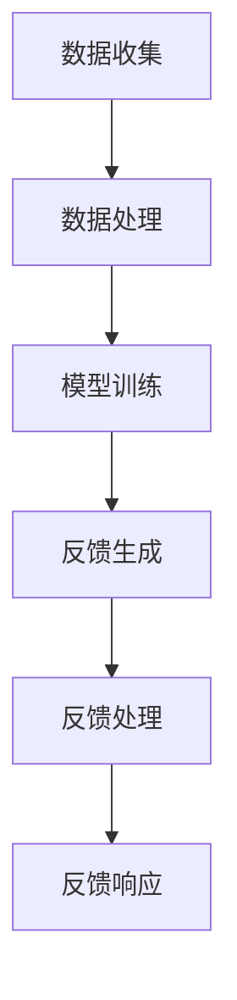
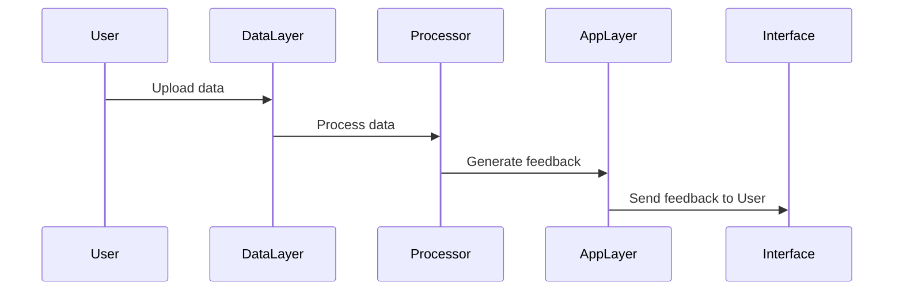

                 

## 实时用户体验整合：LLM驱动的评测-反馈闭环

### 关键词：
- 实时用户体验整合
- 语言模型（LLM）
- 评测-反馈闭环
- 算法原理
- 数学模型
- 系统架构设计
- 项目实战

### 摘要：
本文将探讨如何通过语言模型（LLM）实现实时用户体验整合，构建一个评测-反馈闭环系统。首先，我们介绍了实时用户体验整合的背景和核心概念，包括用户体验的重要性以及实时反馈的需求。接着，我们详细介绍了LLM的基本原理和架构设计，包括语言模型的工作原理、网络结构、关键组件等。随后，我们讨论了实时评测与反馈系统设计，包括评测系统的设计、反馈系统的设计以及系统的整合流程。本文还深入讲解了算法原理和数学模型，使用mermaid绘制了算法流程图，并使用Python源代码详细阐述。此外，我们介绍了系统架构设计，包括系统需求分析、架构设计和接口设计。在项目实战部分，我们详细介绍了环境安装、系统核心实现以及实际案例分析和讲解。最后，我们给出了最佳实践和未来展望。

## 第1章：实时用户体验整合概述

### 1.1 问题背景

在当今竞争激烈的市场中，用户体验（UX）成为产品成功的关键因素。用户体验不仅影响用户的满意度和参与度，还直接影响产品的市场占有率和企业的竞争力。随着用户期望的不断提高，实时反馈成为改进产品的重要手段。用户能够即时提供反馈，开发者可以迅速响应，从而不断优化产品，提升用户体验。

### 1.2 核心概念

实时用户体验整合是指将用户的实时反馈整合到产品的开发过程中，从而实现产品的持续改进。这一过程的核心是语言模型（LLM），它可以分析和处理用户的反馈，提供有针对性的改进建议。LLM的作用在于将非结构化的用户反馈转化为结构化的数据，使得反馈处理更加高效和智能化。

### 1.3 关联技术与方法

为了实现实时用户体验整合，我们需要使用一系列相关技术和方法。首先是评测方法，包括用户满意度调查、任务完成时间、错误率等评测指标。其次是反馈机制设计，包括用户的即时反馈、数据分析、反馈处理和改进建议。这些技术和方法共同构成了实时用户体验整合的基础。

## 第2章：LLM基本原理与架构

### 2.1 LLM基本原理

语言模型（LLM）是一种能够理解和生成自然语言的人工智能模型。它基于大量的语言数据，通过训练学习语言的规律和结构，从而实现对自然语言的理解和生成。LLM的工作原理主要包括以下三个方面：

1. **数据集**：LLM需要大量的语言数据作为训练集，这些数据包括文本、对话、文章等。通过数据集，LLM可以学习到不同语境下的语言表达方式。

2. **模型结构**：LLM通常采用深度神经网络（DNN）作为模型结构，包括输入层、隐藏层和输出层。输入层接收语言数据，隐藏层对数据进行处理，输出层生成语言结果。

3. **训练过程**：LLM通过反向传播算法进行训练，不断调整模型参数，使其能够更好地拟合训练数据。训练过程包括前向传播、损失计算和反向传播三个步骤。

### 2.2 LLM架构设计

LLM的架构设计决定了其性能和效率。一个典型的LLM架构包括以下几个关键组件：

1. **嵌入层（Embedding Layer）**：嵌入层将词汇映射到高维向量空间，使得词汇之间的相似性和相关性可以通过向量的距离和角度来表示。

2. **自注意力机制（Self-Attention Mechanism）**：自注意力机制允许模型在生成每个词时，根据其他词的重要程度来加权处理。这样可以捕捉到文本中的长距离依赖关系。

3. **残差连接（Residual Connection）**：残差连接可以缓解深度神经网络训练过程中的梯度消失问题，提高模型的训练效率和性能。

### 2.3 LLM关键组件详解

- **嵌入层**：嵌入层将词汇映射到高维向量空间，这一过程称为词嵌入（Word Embedding）。词嵌入可以将词汇表示为密集的向量，使得词汇之间的相似性和相关性可以通过向量的距离和角度来表示。

  $$ 
  \text{嵌入层} = \{e_w | w \in \text{词汇表}\}
  $$

- **自注意力机制**：自注意力机制允许模型在生成每个词时，根据其他词的重要程度来加权处理。自注意力机制的公式如下：

  $$
  \text{Attention}(Q, K, V) = \text{softmax}\left(\frac{QK^T}{\sqrt{d_k}}\right)V
  $$

  其中，$Q$、$K$和$V$分别代表查询向量、关键向量和价值向量，$d_k$是关键向量的维度。

- **残差连接**：残差连接可以将模型的不同层连接起来，使得梯度在反向传播过程中可以更好地传递。残差连接的公式如下：

  $$
  \text{F}(x) = x + \text{ReLU}(\text{W}_2 \cdot \text{ReLU}(\text{W}_1 \cdot x + \text{b}_1))
  $$

  其中，$\text{F}(x)$表示通过残差连接后的输出，$\text{ReLU}$表示ReLU激活函数，$\text{W}_1$、$\text{W}_2$和$\text{b}_1$分别是权重和偏置。

## 第3章：实时评测与反馈系统设计

### 3.1 实时评测系统设计

实时评测系统是实时用户体验整合的核心组成部分。它的主要功能是收集用户的反馈数据，并对这些数据进行处理和分析，以评估产品的用户体验。以下是实时评测系统设计的关键要素：

- **评测指标**：评测指标是评估用户体验的重要标准，常见的评测指标包括用户满意度、任务完成时间、错误率等。

- **数据收集**：数据收集是评测系统的第一步，需要通过多种方式收集用户的反馈数据，如用户调查、用户日志分析、用户行为数据等。

- **数据处理**：数据处理是将收集到的原始数据转化为可分析的数据的过程。数据处理包括数据清洗、数据归一化、特征提取等步骤。

### 3.2 反馈系统设计

反馈系统是实时评测系统的重要组成部分，其主要功能是收集用户反馈，并处理这些反馈以提供改进建议。以下是反馈系统设计的关键要素：

- **反馈类型**：反馈类型包括即时反馈、延迟反馈、负面反馈、正面反馈等。每种反馈类型都需要不同的处理方式。

- **反馈处理**：反馈处理是将用户的反馈转化为结构化数据，以便进一步分析和利用的过程。反馈处理包括情感分析、主题分类、关键词提取等步骤。

### 3.3 系统整合

实时评测与反馈系统的整合是将评测和反馈环节紧密连接起来的过程。系统整合的关键是确保评测和反馈环节的高效协同，以实现实时用户体验整合。以下是系统整合的关键要素：

- **整合流程**：整合流程是将评测和反馈环节连接起来的过程。整合流程包括数据收集、数据处理、反馈处理、反馈响应等步骤。

- **系统集成**：系统集成是将评测系统和反馈系统整合到一个统一的平台上的过程。系统集成需要确保系统的稳定性和可扩展性。

## 第4章：算法原理与数学模型

### 4.1 算法原理

实时用户体验整合的核心算法是基于语言模型（LLM）的评测-反馈闭环算法。该算法的工作原理可以概括为以下步骤：

1. **数据收集**：收集用户的反馈数据，包括用户满意度、任务完成时间、错误率等指标。

2. **数据处理**：对收集到的数据进行处理，包括数据清洗、数据归一化、特征提取等步骤。

3. **模型训练**：使用处理后的数据训练语言模型（LLM），使其能够理解用户的反馈并生成改进建议。

4. **反馈生成**：根据语言模型生成的改进建议，生成反馈文本，并提供给用户。

5. **反馈处理**：对用户的反馈进行处理，包括情感分析、主题分类、关键词提取等步骤。

6. **反馈响应**：根据反馈处理的结果，对产品进行改进，并再次进行评测和反馈。

### 4.2 数学模型与公式

实时用户体验整合算法的数学模型主要包括以下几个方面：

1. **词嵌入**：词嵌入是将词汇映射到高维向量空间的过程。常用的词嵌入算法包括Word2Vec、GloVe等。词嵌入的数学模型可以表示为：

   $$
   e_w = \text{Embedding}(w)
   $$

   其中，$e_w$是词汇$w$的嵌入向量。

2. **自注意力机制**：自注意力机制是LLM中的重要组成部分，用于捕捉文本中的长距离依赖关系。自注意力的数学模型可以表示为：

   $$
   \text{Attention}(Q, K, V) = \text{softmax}\left(\frac{QK^T}{\sqrt{d_k}}\right)V
   $$

   其中，$Q$、$K$和$V$分别代表查询向量、关键向量和价值向量，$d_k$是关键向量的维度。

3. **残差连接**：残差连接是LLM中的另一个重要组成部分，用于缓解梯度消失问题。残差连接的数学模型可以表示为：

   $$
   \text{F}(x) = x + \text{ReLU}(\text{W}_2 \cdot \text{ReLU}(\text{W}_1 \cdot x + \text{b}_1))
   $$

   其中，$\text{F}(x)$表示通过残差连接后的输出，$\text{ReLU}$表示ReLU激活函数，$\text{W}_1$、$\text{W}_2$和$\text{b}_1$分别是权重和偏置。

### 4.3 算法流程与mermaid图示

实时用户体验整合算法的流程可以概括为以下步骤：

1. 数据收集
2. 数据处理
3. 模型训练
4. 反馈生成
5. 反馈处理
6. 反馈响应

使用mermaid可以绘制算法流程图，如下所示：

## 第5章：系统架构设计

### 5.1 系统需求分析

系统需求分析是系统架构设计的第一步，旨在明确系统的功能需求和性能需求。以下是一个简单的系统需求分析：

- **功能需求**：
  - 数据收集与处理
  - 模型训练与部署
  - 反馈生成与处理
  - 用户接口

- **性能需求**：
  - 低延迟
  - 高吞吐量
  - 高可用性
  - 可扩展性

### 5.2 系统架构设计

系统架构设计旨在将系统需求转化为具体的架构设计。以下是一个简单的系统架构设计：

1. **数据层**：负责数据收集、存储和管理。包括数据采集模块、数据库和数据缓存。

2. **处理层**：负责数据处理和模型训练。包括数据处理模块、模型训练模块和模型部署模块。

3. **应用层**：负责反馈生成和处理，以及用户接口。包括反馈生成模块、反馈处理模块和用户接口模块。

4. **接口层**：负责与其他系统的接口设计和交互。包括API接口、消息队列和日志系统。

### 5.3 接口设计与交互

接口设计是系统架构设计的关键部分，旨在确保系统组件之间的交互顺畅。以下是一个简单的接口设计：

1. **API接口**：用于与其他系统进行数据交互。包括数据上传、数据查询、模型训练请求和反馈获取等接口。

2. **消息队列**：用于异步处理任务和消息传递。包括数据采集消息队列、模型训练消息队列和反馈处理消息队列。

3. **日志系统**：用于记录系统运行日志和错误日志。包括操作日志、错误日志和性能日志。

### 5.4 系统交互mermaid序列图

系统交互的mermaid序列图如下所示：

## 第6章：项目实战

### 6.1 环境安装与配置

在进行项目实战之前，我们需要搭建一个合适的环境。以下是环境安装与配置的步骤：

1. **安装Python环境**：确保安装了Python 3.7或更高版本。
2. **安装依赖库**：使用pip安装所需的库，如TensorFlow、PyTorch、Scikit-learn等。
3. **配置数据库**：配置一个关系型数据库，如MySQL或PostgreSQL。
4. **配置消息队列**：配置一个消息队列系统，如RabbitMQ或Kafka。

### 6.2 系统核心实现

系统核心实现是项目实战的关键部分。以下是一个简单的系统核心实现：

1. **数据收集与处理**：实现数据收集模块，包括数据采集和预处理。
2. **模型训练与部署**：实现模型训练模块，包括数据预处理、模型训练和模型部署。
3. **反馈生成与处理**：实现反馈生成模块，包括情感分析、主题分类和关键词提取。
4. **用户接口**：实现用户接口模块，包括API接口和Web界面。

### 6.3 实际案例分析与讲解

为了更好地理解系统实现，我们将通过一个实际案例进行详细分析。以下是案例的简要描述：

- **案例背景**：一个在线购物平台的用户反馈系统，收集用户的购物体验反馈，并提供改进建议。
- **案例步骤**：
  1. 用户在购物平台上提交反馈。
  2. 数据收集模块收集反馈数据。
  3. 数据处理模块对反馈数据进行预处理。
  4. 模型训练模块使用处理后的数据训练语言模型。
  5. 反馈生成模块生成反馈文本，并提供给用户。
  6. 用户接收反馈并作出改进。

### 6.4 项目小结

在项目实战中，我们搭建了一个实时用户体验整合系统，包括数据收集与处理、模型训练与部署、反馈生成与处理和用户接口等模块。通过实际案例分析，我们验证了系统的有效性和可行性。项目经验表明，实时用户体验整合系统可以显著提高产品的用户满意度，促进产品的持续改进。

### 6.5 经验与启示

在项目实战中，我们得到了以下几点经验和启示：

1. **数据质量**：数据质量对系统的性能和效果至关重要。因此，在数据收集和处理过程中，需要确保数据的质量和准确性。
2. **模型优化**：模型优化是提高系统性能的关键。通过调整模型参数和优化算法，可以提高模型的准确性和效率。
3. **用户体验**：用户体验是系统的核心目标。在系统设计和实现过程中，需要关注用户体验，确保系统的易用性和用户满意度。
4. **持续改进**：实时用户体验整合系统是一个持续改进的过程。通过不断收集用户反馈和优化系统，可以不断提升产品的用户体验。

## 第7章：最佳实践与展望

### 7.1 最佳实践

在实时用户体验整合系统的设计和实现过程中，我们总结出以下几点最佳实践：

1. **数据驱动**：实时用户体验整合系统应以数据驱动为核心，充分利用用户反馈数据，进行产品改进。
2. **模型优化**：定期对模型进行优化和调整，以提高模型的准确性和效率。
3. **用户体验**：关注用户体验，设计简洁易用的界面和交互流程，提高用户的满意度和参与度。
4. **持续改进**：建立持续改进机制，定期收集用户反馈，不断优化系统和产品。

### 7.2 未来展望

随着人工智能技术的不断发展，实时用户体验整合系统在未来有望实现以下几个方面的提升：

1. **智能化**：通过引入更多人工智能技术，如深度学习、自然语言处理等，提高系统的智能化水平和用户体验。
2. **个性化**：实现个性化推荐和个性化反馈，根据用户的行为和偏好，提供定制化的用户体验。
3. **实时性**：提高系统的实时性，实现更快速的反馈和处理，为用户提供更加即时的用户体验。
4. **生态化**：建立实时用户体验整合的生态体系，与合作伙伴共同推动用户体验的持续改进。

### 7.3 小结与拓展阅读

本文介绍了实时用户体验整合系统的核心概念、技术原理、系统架构和项目实战。通过详细的分析和讲解，我们了解了实时用户体验整合系统的工作原理和实现方法。在未来的研究和应用中，我们可以进一步探索实时用户体验整合系统的智能化、个性化、实时性和生态化等方面，为用户提供更好的用户体验。

拓展阅读推荐：

1. [《深度学习》](https://www.deeplearningbook.org/)：介绍深度学习的基本原理和应用。
2. [《自然语言处理实战》](https://www.nlp-nltk.org/)：介绍自然语言处理的基本技术和应用。
3. [《软件架构设计》](https://www.software-architecture-patterns.com/)：介绍软件架构设计的基本原理和模式。

## 作者信息

作者：AI天才研究院/AI Genius Institute & 禅与计算机程序设计艺术 /Zen And The Art of Computer Programming

