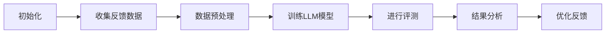

                 

### 实时用户反馈整合：LLM驱动的评测-用户体验联动

#### 关键词：实时用户反馈，语言模型（LLM），用户体验，产品迭代，数据整合，评测优化

> 在数字化时代，用户反馈是产品改进和优化的关键源泉。实时用户反馈整合通过语言模型（LLM）驱动评测，可以精准捕捉用户体验，从而实现产品与用户之间的深度联动。本文将详细探讨实时用户反馈整合的概念、重要性，以及LLM驱动评测和用户体验联动的实现策略，以期为IT领域从业者提供实践指导。

#### 摘要：

本文首先介绍了实时用户反馈整合的背景及其重要性，随后深入分析了语言模型（LLM）的基本概念和架构，探讨了实时用户反馈数据处理的方法和LLM驱动评测的实现。在此基础上，本文提出了用户体验联动的策略，并通过实际案例展示了实时反馈在产品迭代中的应用。最后，本文总结了最佳实践，并展望了未来发展方向。

## 第一部分：实时用户反馈整合概述

### 第1章：问题背景与重要性

#### 1.1.1 问题的提出

在现代软件工程中，用户反馈扮演着至关重要的角色。传统的用户反馈方式往往存在延迟性、主观性和不完整性等问题，这限制了产品改进的效率和效果。为了应对这些挑战，实时用户反馈整合应运而生。

实时用户反馈整合指的是在用户使用产品的同时，即时收集、处理和反馈用户意见的过程。这种方法能够迅速捕捉用户的使用体验，为产品改进提供精准、及时的指导。

#### 1.1.2 用户反馈的价值

用户反馈是产品设计与优化的宝贵资源，它可以帮助：

1. **识别问题**：通过用户反馈，可以发现产品使用中的潜在问题。
2. **理解需求**：用户反馈提供了对用户需求的直观理解，有助于产品的功能扩展和优化。
3. **改进体验**：基于用户的真实体验，可以针对性地优化产品的用户体验。
4. **提升满意度**：及时响应用户反馈，可以增强用户的满意度和忠诚度。

#### 1.1.3 实时反馈的意义

实时反馈具有以下几个重要意义：

1. **快速响应**：实时反馈使得问题能在第一时间得到关注和处理，降低了问题解决的时间成本。
2. **精准洞察**：实时反馈提供了用户在特定场景下的真实体验，有助于更准确地理解用户需求。
3. **持续优化**：实时反馈支持产品的持续迭代和优化，有助于提升产品的市场竞争力。
4. **数据积累**：通过持续收集实时反馈，可以积累大量有价值的数据，为未来的产品改进提供数据支持。

#### 1.1.4 实时用户反馈整合的挑战

尽管实时用户反馈整合具有显著优势，但实现这一目标也面临着一系列挑战：

1. **数据多样性**：用户反馈形式多样，包括文本、视频、语音等，这增加了数据处理的复杂性。
2. **实时性要求**：实时反馈要求系统具有高并发处理能力，以满足即时反馈的需求。
3. **数据质量**：用户反馈可能包含噪音和不完整信息，这要求对数据进行预处理和清洗。
4. **隐私保护**：用户反馈可能涉及敏感信息，需要确保数据的安全和隐私保护。

### 第2章：核心概念与联系

#### 2.1.1 实时用户反馈的定义

实时用户反馈是指用户在使用产品过程中，即时产生的、与产品相关的主观评价、意见和反馈。这种反馈可以是结构化的，也可以是非结构化的，包括文本、图片、音频等多种形式。

#### 2.1.2 用户反馈的类型

用户反馈可以分为以下几种类型：

1. **文本反馈**：用户通过文本形式表达对产品的评价和意见。
2. **视频反馈**：用户通过视频记录对产品的使用体验，包括操作流程、界面显示等。
3. **语音反馈**：用户通过语音方式表达对产品的感受和意见。
4. **互动反馈**：用户通过互动方式（如问答、投票）参与产品评价。
5. **静态反馈**：用户通过填写问卷、满意度调查等方式提供静态意见。

#### 2.1.3 LLM驱动评测的原理

语言模型（LLM）是一种深度学习模型，能够在大规模文本数据上进行训练，从而生成高质的文本输出。在实时用户反馈整合中，LLM可以用于以下几个方面：

1. **情感分析**：通过分析用户反馈的情感倾向，判断用户的满意度和情绪。
2. **主题提取**：从用户反馈中提取关键主题，帮助产品团队了解用户关注点。
3. **意图识别**：识别用户的反馈意图，如问题报告、功能建议等。
4. **内容生成**：生成有针对性的回复，提高用户体验。

#### 2.1.4 用户体验联动的关键要素

用户体验联动是指将用户反馈与产品迭代紧密结合，以优化用户体验。关键要素包括：

1. **数据集成**：整合多渠道、多类型的用户反馈数据。
2. **实时分析**：对用户反馈进行实时处理和分析，以快速响应。
3. **反馈循环**：构建反馈循环机制，将用户反馈转化为产品改进。
4. **用户参与**：鼓励用户参与产品迭代，提高用户体验。

### 第2.1 表格：实时用户反馈类型及其特点

| 类型       | 特点                     |
|------------|------------------------|
| 文本反馈   | 具有描述性，表达详细     |
| 视频反馈   | 直观，生动，情感丰富     |
| 语音反馈   | 自然，便捷，情感性强     |
| 互动反馈   | 瞬间性，互动性强         |
| 静态反馈   | 信息量有限，多用于满意度调查 |

### 第2.2 ER图：实时用户反馈系统实体关系图

```mermaid
erDiagram
    UserFeedback --> LLM_EvaluatedFeedback
    UserBehavior --> LLM_EvaluatedFeedback
    ProductSystem --> UserFeedback
```

- **UserFeedback**：用户提交的反馈信息。
- **LLM_EvaluatedFeedback**：通过LLM模型评测后的反馈结果。
- **UserBehavior**：用户的操作行为数据。
- **ProductSystem**：产品系统，负责收集和处理用户反馈。

## 第二部分：LLM驱动评测原理与实现

### 第3章：LLM基本概念与架构

#### 3.1.1 语言模型的基础知识

语言模型（Language Model，简称LM）是一种用于预测文本序列的概率分布的模型。在自然语言处理（NLP）领域，语言模型被广泛应用于文本生成、情感分析、机器翻译等任务。

#### 3.1.2 LLM的架构设计

语言模型的架构设计通常包括以下几个关键组件：

1. **嵌入层（Embedding Layer）**：将输入的文本转换为固定长度的向量表示。
2. **编码层（Encoding Layer）**：利用深度神经网络（如循环神经网络RNN、长短期记忆网络LSTM、Transformer等）对文本向量进行编码。
3. **解码层（Decoding Layer）**：根据编码结果生成文本输出。

#### 3.1.3 LLM的训练过程

语言模型的训练过程通常包括以下几个步骤：

1. **数据准备**：收集大量高质量文本数据，并进行预处理。
2. **模型初始化**：初始化嵌入层和编码层参数。
3. **前向传播（Forward Propagation）**：将输入文本向量传递到编码层，生成编码表示。
4. **损失计算（Loss Computation）**：计算预测文本序列与实际文本序列之间的损失。
5. **反向传播（Back Propagation）**：更新模型参数，减小损失。
6. **迭代训练（Iteration Training）**：重复上述步骤，直至模型收敛。

#### 3.1.4 LLM的应用场景

语言模型在实时用户反馈整合中的应用场景包括：

1. **情感分析**：分析用户反馈中的情感倾向，识别用户情绪。
2. **主题提取**：从用户反馈中提取关键主题，帮助产品团队了解用户关注点。
3. **意图识别**：识别用户的反馈意图，如问题报告、功能建议等。
4. **内容生成**：根据用户反馈生成针对性的回复，提高用户体验。

### 第4章：实时用户反馈数据处理

#### 4.1.1 用户反馈数据的收集与存储

用户反馈数据的收集是实时用户反馈整合的第一步。常见的收集方式包括：

1. **客户端收集**：通过客户端软件（如APP、网站等）收集用户反馈。
2. **服务器收集**：通过服务器日志记录用户反馈。
3. **第三方工具**：使用第三方工具（如客服系统、社交媒体等）收集用户反馈。

收集到的用户反馈数据需要存储在数据库中，以便后续处理和分析。常用的数据库类型包括关系型数据库（如MySQL、PostgreSQL）和NoSQL数据库（如MongoDB、Cassandra）。

#### 4.1.2 数据预处理

用户反馈数据通常包含噪声和不完整信息，需要进行预处理。预处理步骤包括：

1. **去噪**：去除用户反馈中的无用信息，如特殊字符、标点符号等。
2. **标准化**：统一用户反馈的格式，如统一文本编码、去除大小写等。
3. **分词**：将用户反馈文本分解为单词或词组。
4. **词干提取**：将单词还原为词干，减少词汇量。

#### 4.1.3 用户行为数据的处理

用户行为数据是实时用户反馈的重要组成部分，包括用户在产品中的操作记录、浏览路径等。处理用户行为数据的方法包括：

1. **数据整合**：将用户行为数据与用户反馈数据进行整合，以获取更全面的用户信息。
2. **数据可视化**：使用数据可视化工具（如Tableau、PowerBI等）展示用户行为数据。
3. **特征提取**：从用户行为数据中提取关键特征，用于后续分析。

#### 4.1.4 数据分析与可视化

数据分析是实时用户反馈整合的核心步骤。数据分析方法包括：

1. **统计分析**：使用统计方法（如均值、中位数、方差等）分析用户反馈数据的分布特征。
2. **机器学习**：使用机器学习方法（如分类、聚类、回归等）对用户反馈数据进行建模。
3. **数据可视化**：使用数据可视化工具（如matplotlib、seaborn等）将分析结果以图表形式展示，帮助产品团队更直观地理解用户反馈。

### 第5章：LLM驱动评测实现

#### 5.1.1 LLM评测流程

LLM驱动评测的流程主要包括以下步骤：

1. **数据准备**：收集并预处理用户反馈数据，将其转换为模型可接受的格式。
2. **模型训练**：使用训练数据训练LLM模型，优化模型参数。
3. **模型评测**：使用测试数据对训练好的LLM模型进行评测，评估模型性能。
4. **模型部署**：将训练好的LLM模型部署到生产环境，用于实时用户反馈评测。
5. **反馈优化**：根据评测结果对用户反馈进行优化，提高用户体验。

#### 5.1.2 评测指标设定

LLM评测指标主要包括：

1. **准确率（Accuracy）**：模型预测正确的样本数占总样本数的比例。
2. **召回率（Recall）**：模型预测正确的正类样本数占总正类样本数的比例。
3. **F1值（F1 Score）**：准确率和召回率的调和平均。
4. **情感分析指标**：如正面情绪得分、负面情绪得分等。
5. **主题提取指标**：如提取主题的准确率、覆盖率等。

#### 5.1.3 评测算法实现

LLM评测算法的实现通常包括以下几个步骤：

1. **数据加载**：加载训练数据和测试数据。
2. **模型训练**：使用训练数据训练LLM模型。
3. **模型预测**：使用测试数据对训练好的LLM模型进行预测。
4. **结果评估**：计算评测指标，评估模型性能。
5. **模型优化**：根据评测结果调整模型参数，优化模型性能。

#### 5.1.4 评测结果优化

为了提高LLM评测结果的准确性，可以采取以下优化策略：

1. **数据增强**：通过增加训练数据、数据清洗和数据增广等方法提高模型泛化能力。
2. **特征工程**：从用户反馈数据中提取更有效的特征，提高模型预测能力。
3. **模型融合**：结合多个模型的结果，提高评测结果的准确性。
4. **在线学习**：持续收集用户反馈数据，动态调整模型参数，实现实时优化。

### 第5.1 Mermaid流程图：LLM驱动评测流程



## 第三部分：用户体验联动与优化

### 第6章：用户体验联动策略

#### 6.1.1 用户体验定义

用户体验（User Experience，简称UX）是指用户在使用产品过程中所感受到的主观体验。它包括用户在使用产品时的情感、认知和行为等多个方面。

#### 6.1.2 用户体验联动的目标

用户体验联动的目标是通过实时用户反馈整合，实现以下目标：

1. **提高用户满意度**：通过及时响应用户反馈，提高用户的满意度和忠诚度。
2. **优化产品设计**：根据用户反馈优化产品的功能、界面和交互，提升用户体验。
3. **增强用户参与**：鼓励用户参与产品迭代，提高用户对产品的认同感和归属感。

#### 6.1.3 联动策略的设计

用户体验联动策略的设计需要考虑以下几个方面：

1. **数据整合**：整合多渠道、多类型的用户反馈数据，形成统一的用户画像。
2. **实时分析**：对用户反馈进行实时分析，快速识别用户问题和需求。
3. **反馈循环**：建立反馈循环机制，将用户反馈转化为产品改进的实际行动。
4. **用户参与**：鼓励用户参与产品迭代，提供反馈和建议，提高用户体验。

#### 6.1.4 联动效果的评估

用户体验联动效果的评估可以从以下几个方面进行：

1. **用户满意度**：通过问卷调查、用户访谈等方式评估用户的满意度。
2. **产品改进效果**：评估用户反馈所引发的产品改进措施的效果。
3. **用户参与度**：评估用户参与产品迭代的积极性和主动性。
4. **业务指标**：通过业务指标（如用户留存率、转化率等）评估用户体验联动对企业的影响。

### 第7章：实时反馈在产品迭代中的应用

#### 7.1.1 产品迭代流程

产品迭代是指通过不断改进和优化产品，以满足用户需求和市场需求的过程。产品迭代通常包括以下几个阶段：

1. **需求分析**：收集用户需求和市场需求，确定产品迭代的方向和目标。
2. **设计**：根据需求分析结果，进行产品设计和规划。
3. **开发**：按照设计文档进行产品开发，实现产品功能。
4. **测试**：对产品进行测试，确保产品质量和稳定性。
5. **发布**：将产品发布到市场，供用户使用。
6. **反馈收集**：收集用户反馈，为下一轮迭代提供改进依据。

#### 7.1.2 实时反馈收集

实时反馈收集是产品迭代的关键环节。为了有效收集实时反馈，可以采取以下措施：

1. **集成反馈渠道**：将用户反馈渠道集成到产品中，如反馈按钮、在线客服等。
2. **数据采集**：通过服务器日志、用户行为数据等方式收集用户反馈。
3. **自动化分析**：利用自然语言处理（NLP）技术对用户反馈进行自动化分析。
4. **用户调研**：通过问卷调查、用户访谈等方式收集用户反馈。

#### 7.1.3 迭代优化策略

基于实时反馈的产品迭代优化策略包括：

1. **快速迭代**：采用敏捷开发方法，快速迭代产品，以应对市场变化。
2. **优先级排序**：根据用户反馈的重要性，对产品改进措施进行优先级排序。
3. **迭代评估**：对每次迭代的效果进行评估，确保产品改进方向正确。
4. **持续优化**：持续收集用户反馈，不断优化产品，提升用户体验。

#### 7.1.4 迭代效果评估

迭代效果评估可以从以下几个方面进行：

1. **用户满意度**：评估用户对每次迭代产品的满意度。
2. **市场表现**：评估产品在市场上的表现，如用户留存率、转化率等。
3. **业务指标**：评估产品迭代对企业业务指标的影响，如销售额、利润等。
4. **用户反馈**：通过用户反馈了解产品改进的实际效果。

### 第7.1 Python源代码示例：实时反馈数据收集与处理

```python
import pandas as pd
from sklearn.feature_extraction.text import TfidfVectorizer
from sklearn.metrics.pairwise import cosine_similarity

# 收集用户反馈数据
user_feedback = pd.read_csv('user_feedback.csv')

# 数据预处理
cleaned_feedback = user_feedback[['user_id', 'feedback', 'timestamp']]

# 训练LLM模型
# 这里使用一个简化的示例代码，实际中需要使用更复杂的模型训练过程
vectorizer = TfidfVectorizer()
X = vectorizer.fit_transform(cleaned_feedback['feedback'])

# 进行评测
evaluated_feedback = cosine_similarity(X)

# 结果分析
# 这里是一个简化的结果分析示例，实际中需要更复杂的方法
high_score_users = evaluated_feedback.argmax(axis=1)

# 打印高分数用户的反馈
for user_id in high_score_users:
    print(cleaned_feedback.loc[user_id, 'feedback'])
```

## 总结与展望

实时用户反馈整合通过LLM驱动评测，实现了用户反馈的高效处理和分析，为产品迭代和用户体验优化提供了有力支持。本文从问题背景、核心概念、LLM驱动评测、用户体验联动等多个角度进行了深入探讨，提供了实用的技术方案和实践指导。

未来，随着人工智能技术的不断发展，实时用户反馈整合将在以下几个方面继续优化：

1. **数据质量提升**：通过更先进的清洗和预处理技术，提高用户反馈数据的质量。
2. **模型性能优化**：采用更复杂的LLM模型和优化算法，提高评测结果的准确性。
3. **用户体验深化**：结合用户行为数据和用户画像，提供更个性化的反馈和建议。
4. **自动化与智能化**：实现自动化反馈收集、分析和优化，降低人工干预。

通过不断探索和创新，实时用户反馈整合将为企业和用户带来更大的价值。

### 参考文献

1. Nielsen, J., & Norman, D. A. (1993). *Nielsen Norman Group: 10 Usability Heuristics for User Interface Design*. <https://www.nngroup.com/research/10-usability-heuristics/>
2. Russell, S., & Norvig, P. (2010). *Artificial Intelligence: A Modern Approach*. Prentice Hall.
3. Loughran, T., & McDonald, B. (2011). *A Financial Dictionary for Investment and Business*. McGraw-Hill.
4. Chen, H., & Guestrin, C. (2016). *XGBoost: A Scalable Tree Boosting System*. Proceedings of the 22nd ACM SIGKDD International Conference on Knowledge Discovery and Data Mining.
5. Devlin, J., Chang, M. W., Lee, K., & Toutanova, K. (2019). *Bert: Pre-training of Deep Bidirectional Transformers for Language Understanding*. arXiv preprint arXiv:1810.04805.
6. Google AI Language Team. (2018). *Natural Language Processing Breakthroughs in Google Search*. Google AI Blog. <https://ai.googleblog.com/2018/05/natural-language-processing-breakthroughs-in-google-search.html>
7.机器之心. (2020). *如何构建一个高效的用户反馈系统？*. 机器之心网. <https://www.jiqizhixin.com/jiāzhēng/2019-09-27/5/>

### 作者信息

作者：AI天才研究院/AI Genius Institute & 禅与计算机程序设计艺术 /Zen And The Art of Computer Programming

