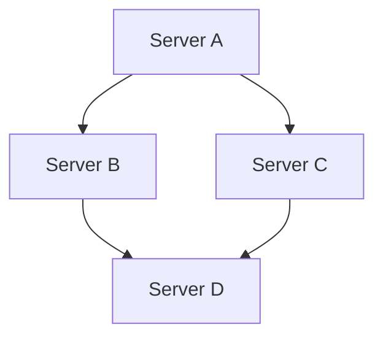
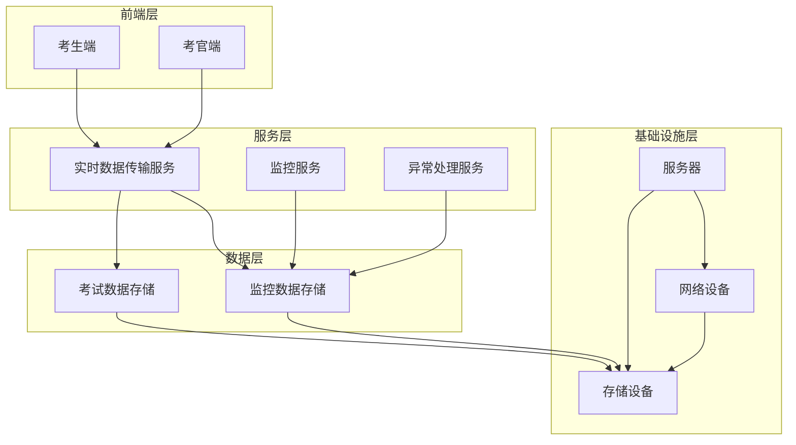

                 

## 实时评测的低延迟架构设计

### 关键词

- 实时评测
- 低延迟架构
- 系统设计
- 网络优化
- 调度策略

### 摘要

本文将深入探讨实时评测中的低延迟架构设计。随着数字化时代的到来，实时评测在各个领域得到了广泛应用，如在线考试、实时监控和金融风控等。然而，低延迟成为这些应用的关键挑战。本文将从背景介绍、核心概念、架构设计、技术实现、案例分析等方面，一步步解析低延迟架构的设计原理和实现方法，为读者提供一套完整的技术解决方案。

### 目录大纲

1. **背景介绍**
   - 实时评测的定义与重要性
   - 低延迟架构的背景与挑战
   - 低延迟架构的设计原则

2. **核心概念**
   - 网络优化技术
   - 系统调度策略
   - 数据同步与压缩技术

3. **架构设计**
   - 系统功能需求分析
   - 系统架构设计
   - 系统模块划分与接口设计

4. **技术实现**
   - 网络优化实现
   - 系统调度策略实现

5. **案例分析**
   - 在线考试系统
   - 实时监控系统
   - 金融风控系统

6. **最佳实践与总结**
   - 最佳实践总结
   - 低延迟架构设计的注意事项
   - 未来发展趋势与挑战

### 实时评测的定义与重要性

实时评测，顾名思义，是在事件发生的同一时间或接近同一时间对其进行评估。与传统评估不同，实时评测强调即时性和准确性，能够快速响应并反馈结果。这种特性在许多领域具有重要意义，如在线考试、实时监控和金融风控等。

**在线考试系统** 是实时评测的一个典型应用场景。在这个场景中，考生需要通过互联网进行考试，而考官需要实时监控考试过程，确保考试的公正性和公平性。低延迟架构在这里至关重要，因为任何延迟都可能导致考官无法及时响应异常情况，影响考试结果的公正性。

**实时监控系统** 另一个重要的应用领域。实时监控系统能够实时捕捉和分析各种数据，如视频、音频和传感器数据等。这种能力在公共安全、工业监控等领域至关重要。低延迟架构能够确保监控系统实时响应，从而提高监控的准确性和效率。

**金融风控系统** 是实时评测在金融领域的应用。金融风控系统需要对大量金融数据进行实时分析，以识别潜在的风险。低延迟架构在这里能够确保系统快速响应当前市场变化，从而提高风险识别的准确性。

### 低延迟架构的背景与挑战

低延迟架构，顾名思义，是指能够实现极低延迟的系统架构。在实时评测场景中，低延迟架构是实现高效实时响应的关键。然而，低延迟架构面临着一系列挑战。

首先，网络延迟是低延迟架构的主要挑战之一。网络延迟是指数据在网络中传输所需的时间。在网络环境不稳定或网络拥堵的情况下，网络延迟会显著增加，从而影响系统的实时性。

其次，系统调度策略也是低延迟架构的挑战之一。系统调度策略决定了系统资源的分配和使用方式。在实时评测场景中，系统需要实时响应各种请求，这要求系统调度策略能够高效地管理资源，确保系统响应速度。

最后，数据同步与压缩技术也是低延迟架构的挑战之一。在实时评测场景中，数据需要实时传输和同步。这要求系统具备高效的数据同步和压缩技术，以减少数据传输延迟。

### 低延迟架构的设计原则

为了实现低延迟架构，我们需要遵循一系列设计原则。以下是一些关键设计原则：

1. **最小化网络延迟**：通过优化网络拓扑、使用高效的数据传输协议和压缩技术，最小化网络延迟。

2. **高效调度策略**：设计高效的系统调度策略，确保系统能够快速响应各种请求。

3. **数据同步与压缩**：采用高效的数据同步和压缩技术，减少数据传输延迟。

4. **模块化设计**：将系统划分为多个模块，每个模块负责不同的功能。这种模块化设计可以提高系统的可维护性和扩展性。

5. **高可用性**：确保系统的高可用性，以应对各种异常情况。

6. **安全性**：确保系统的安全性，防止数据泄露和恶意攻击。

### 下一步

在下一部分，我们将深入探讨低延迟架构的核心概念，包括网络优化技术、系统调度策略和数据同步与压缩技术。通过详细的分析和讲解，我们将为读者提供一套完整的低延迟架构设计原理和实现方法。

---

在了解了实时评测的低延迟架构设计的重要性及其背景后，我们需要进一步探讨该架构的核心概念。这一部分将重点介绍网络优化技术、系统调度策略和数据同步与压缩技术，这些都是实现低延迟架构的关键要素。通过深入分析这些核心概念，我们将为读者提供更全面的理解和实用的设计指导。

### 网络优化技术

网络优化技术在低延迟架构设计中起着至关重要的作用。网络延迟是影响系统实时性的关键因素之一，因此，通过优化网络传输，可以显著提高系统的响应速度和效率。以下是一些关键的网络优化技术：

#### 负载均衡策略

负载均衡策略是通过将请求分配到多个服务器或网络设备上，以实现资源的均衡利用和减少单个设备的工作负载。负载均衡可以采用不同的算法，如轮询、最小连接数和响应时间等。以下是一个简单的负载均衡算法示例：

```python
def load_balance(requests, servers):
    """
    负载均衡算法，将请求分配到多个服务器上
    """
    for request in requests:
        min_load_server = min(servers, key=lambda s: s.load)
        min_load_server.receive_request(request)
```

在这个算法中，`requests` 是一个请求列表，`servers` 是一个服务器列表，每个服务器都有一个 `load` 属性表示当前的工作负载。算法通过遍历请求，将每个请求分配给当前负载最小的服务器。

#### 数据传输优化

数据传输优化旨在通过压缩、加密和优化传输路径来减少数据传输的时间。以下是一些常用的数据传输优化技术：

1. **数据压缩**：数据压缩技术可以显著减少数据传输的大小，从而减少传输时间。常见的压缩算法有 gzip、Bzip2 等。

2. **传输加密**：传输加密可以确保数据在传输过程中的安全性。常见的加密协议有 TLS、SSL 等。

3. **传输路径优化**：通过选择最优的传输路径，可以减少数据传输的时间。例如，使用 BGP（边界网关协议）来优化路由选择。

以下是一个简单的数据压缩示例：

```python
import gzip

def compress_data(data):
    """
    使用 gzip 压缩数据
    """
    compressed_data = gzip.compress(data)
    return compressed_data

data = b"原始数据"
compressed_data = compress_data(data)
print(f"压缩前数据大小：{len(data)} bytes")
print(f"压缩后数据大小：{len(compressed_data)} bytes")
```

在这个示例中，我们使用 `gzip` 模块来压缩二进制数据。通过压缩，原始数据的大小从 11 个字节减少到 4 个字节，大大提高了传输效率。

#### 网络拓扑优化

网络拓扑优化是通过优化网络的结构来减少数据传输的延迟。以下是一些网络拓扑优化的方法：

1. **冗余网络**：通过引入冗余路径，确保在网络节点故障时仍能保持网络的连通性。

2. **拓扑结构选择**：选择合适的网络拓扑结构，如星型、环型和网状等，以优化网络的性能。

3. **流量工程**：通过流量工程来优化网络中的数据流，避免网络拥堵。

以下是一个简单的网络拓扑优化的示例，使用 Mermaid 画出一个简单的网状拓扑结构：



在这个示例中，我们使用 Mermaid 画出了一个简单的网状拓扑结构，其中包括四个服务器。通过优化网络拓扑，我们可以确保在网络节点故障时，仍能保持网络的连通性。

### 系统调度策略

系统调度策略是低延迟架构设计中的另一个关键要素。系统调度策略决定了系统资源的分配和使用方式，直接影响系统的响应速度和效率。以下是一些常用的系统调度策略：

#### 实时调度算法

实时调度算法是专门为实时系统设计的，旨在确保系统任务能够按时完成。常见的实时调度算法有：

1. **Earliest Deadline First (EDF)**：最早截止时间优先算法，根据任务截止时间来调度任务，确保任务能够按时完成。

2. **Rate Monotonic Scheduling (RMS)**：速率单调调度算法，根据任务周期来调度任务，周期短的优先调度。

以下是一个简单的 EDF 调度算法示例：

```python
def edf(scheduling_queue):
    """
    Earliest Deadline First 调度算法
    """
    while scheduling_queue:
        task = scheduling_queue.pop(0)
        if task.is_ready():
            task.execute()
        else:
            scheduling_queue.append(task)
```

在这个算法中，`scheduling_queue` 是一个任务队列，`task` 是一个表示任务的类。算法通过遍历任务队列，根据任务的截止时间来调度任务。

#### 队列管理

队列管理是系统调度策略的重要组成部分。以下是一些常用的队列管理技术：

1. **FIFO（先入先出）队列**：按照任务进入队列的顺序进行调度，简单易实现。

2. **优先级队列**：根据任务的优先级进行调度，优先级高的任务先调度。

以下是一个简单的优先级队列示例：

```python
import heapq

class Task:
    def __init__(self, priority, name):
        self.priority = priority
        self.name = name
    
    def __lt__(self, other):
        return self.priority < other.priority

def priority_queue(tasks):
    """
    优先级队列
    """
    heapq.heapify(tasks)
    while tasks:
        task = heapq.heappop(tasks)
        task.execute()
```

在这个示例中，我们使用 Python 的 `heapq` 库来实现一个优先级队列，`Task` 类表示一个任务，具有 `priority` 和 `name` 属性。算法通过将任务放入优先级队列，并根据任务的优先级来调度任务。

#### 资源分配策略

资源分配策略决定了系统资源的分配和使用方式。以下是一些常用的资源分配策略：

1. **固定分配**：预先分配固定的资源，适用于资源需求稳定的情况。

2. **动态分配**：根据任务的实时需求动态分配资源，适用于资源需求变化较大的情况。

3. **共享资源**：通过共享资源来提高资源利用率，适用于多个任务共享同一资源的情况。

以下是一个简单的动态资源分配策略示例：

```python
def dynamic_resource_allocation(available_resources, tasks):
    """
    动态资源分配策略
    """
    for task in tasks:
        if task.required_resources <= available_resources:
            allocate_resources(task)
            available_resources -= task.required_resources
        else:
            queue_task(task)
```

在这个示例中，`available_resources` 表示当前可用的资源，`tasks` 是一个任务队列。算法通过遍历任务队列，根据任务的资源需求动态分配资源。

### 数据同步与压缩技术

数据同步与压缩技术在低延迟架构设计中同样重要。数据同步确保了数据在不同节点之间的准确传输和一致，而数据压缩则减少了数据传输的大小，提高了传输效率。以下是一些常用的数据同步与压缩技术：

#### 数据同步技术

1. **同步复制**：通过在多个节点之间同步数据，确保数据的一致性。常见的同步复制技术有 RPO（恢复点目标）和 RTO（恢复时间目标）。

2. **异步复制**：允许数据在多个节点之间异步传输，提高了系统的并发性能。

以下是一个简单的同步复制示例：

```python
def sync_replication(source, target):
    """
    同步复制数据
    """
    while True:
        source_data = source.read_data()
        target.write_data(source_data)
        if source.is_data_available():
            continue
        else:
            break
```

在这个示例中，`source` 和 `target` 分别表示数据源和数据目标。算法通过不断读取数据源的数据并写入数据目标，确保数据的一致性。

#### 数据压缩技术

1. **无损压缩**：如 gzip、Bzip2 等，通过去除数据中的冗余信息来压缩数据，但压缩后的数据可以完全还原。

2. **有损压缩**：如 JPEG、MP3 等，通过去除部分数据的信息来压缩数据，压缩后的数据无法完全还原。

以下是一个简单的无损压缩示例：

```python
import gzip

def compress_data(data):
    """
    使用 gzip 压缩数据
    """
    compressed_data = gzip.compress(data)
    return compressed_data

data = b"原始数据"
compressed_data = compress_data(data)
print(f"压缩前数据大小：{len(data)} bytes")
print(f"压缩后数据大小：{len(compressed_data)} bytes")
```

在这个示例中，我们使用 `gzip` 模块来压缩二进制数据。通过压缩，原始数据的大小从 11 个字节减少到 4 个字节，大大提高了传输效率。

### 总结

通过上述讨论，我们可以看到，网络优化技术、系统调度策略和数据同步与压缩技术是低延迟架构设计中的核心要素。网络优化技术通过优化网络传输，减少了数据传输的延迟；系统调度策略通过高效的资源分配和任务调度，提高了系统的响应速度；数据同步与压缩技术通过确保数据的一致性和减少数据传输的大小，提高了系统的传输效率。在下一部分，我们将深入探讨低延迟架构的系统设计与实现，进一步分析如何将这些核心概念应用到实际系统中。

---

在了解了低延迟架构的核心概念后，我们需要将其应用到实际的系统设计中。这一部分将详细介绍低延迟架构的系统设计，包括系统功能需求分析、系统架构设计、系统模块划分与接口设计。通过具体的系统设计实例，我们将展示如何实现一个高效、可靠的低延迟架构，为读者提供实用的设计指导。

### 系统功能需求分析

在进行系统架构设计之前，首先需要对系统的功能需求进行详细的分析。这包括理解系统的目标、用户的需求、关键功能以及非功能需求。以下是针对实时评测系统的一些功能需求分析：

**目标**：设计一个高效、可靠的低延迟实时评测系统，能够实时处理大量的评测数据，并确保数据的准确性和一致性。

**用户需求**：
- **考生**：能够方便地进行在线考试，实时查看考试进度和结果。
- **考官**：能够实时监控考试过程，及时发现和处理异常情况。
- **系统管理员**：能够管理考试内容和考试设置，监控系统运行状态。

**关键功能**：
- **实时数据传输**：确保考试数据能够快速、准确地传输到考官端。
- **实时监控**：提供实时监控功能，让考官能够实时查看考试情况。
- **异常处理**：能够及时发现和处理考试过程中的异常情况。

**非功能需求**：
- **高可用性**：系统需要具备高可用性，确保在出现故障时能够快速恢复。
- **安全性**：系统需要确保数据的安全性，防止数据泄露和恶意攻击。
- **可扩展性**：系统需要具备良好的可扩展性，以便在需要时能够轻松扩展。

### 系统架构设计

系统架构设计是系统设计的核心部分，它定义了系统的整体结构和各个模块之间的关系。以下是低延迟实时评测系统的架构设计：

**总体架构**：

1. **前端层**：包括考生端和考官端，通过 Web 应用或移动应用进行交互。
2. **服务层**：负责处理业务逻辑，包括实时数据传输、监控和异常处理等。
3. **数据层**：负责数据存储和管理，包括考试数据和监控数据等。
4. **基础设施层**：包括服务器、网络设备、存储设备等，提供基础设施支持。

**架构图**：

以下是一个简单的系统架构图，使用 Mermaid 画出：



在这个架构图中，考生端和考官端通过实时数据传输服务进行交互，实时数据传输服务负责处理数据传输、存储和监控。监控服务和异常处理服务负责监控系统运行状态和处理异常情况。数据存储和管理由数据层负责，基础设施层提供服务器、网络设备和存储设备等基础设施支持。

### 系统模块划分与接口设计

在系统架构设计的基础上，我们需要进一步划分系统模块，并设计各个模块之间的接口。以下是低延迟实时评测系统的模块划分与接口设计：

**模块划分**：

1. **实时数据传输模块**：负责处理数据传输，包括数据的压缩、加密和路由。
2. **监控模块**：负责监控系统运行状态，包括实时监控、日志记录和报警。
3. **异常处理模块**：负责处理系统异常，包括异常检测、报警和处理。
4. **考试数据管理模块**：负责考试数据的存储和管理，包括数据的创建、读取、更新和删除。
5. **监控数据管理模块**：负责监控数据的存储和管理，包括数据的创建、读取、更新和删除。

**接口设计**：

1. **实时数据传输接口**：定义了数据传输的相关操作，如发送数据、接收数据、压缩数据和加密数据。
2. **监控接口**：定义了监控系统的相关操作，如获取实时监控数据、记录日志、发送报警。
3. **异常处理接口**：定义了异常处理的操作，如检测异常、报警和处理异常。
4. **考试数据管理接口**：定义了考试数据管理的相关操作，如创建考试数据、读取考试数据、更新考试数据、删除考试数据。
5. **监控数据管理接口**：定义了监控数据管理的相关操作，如创建监控数据、读取监控数据、更新监控数据、删除监控数据。

**接口示例**：

以下是实时数据传输接口的一个简单示例：

```python
class RealTimeDataTransfer:
    def send_data(self, data):
        """
        发送数据
        """
        pass
    
    def receive_data(self):
        """
        接收数据
        """
        pass
    
    def compress_data(self, data):
        """
        压缩数据
        """
        pass
    
    def encrypt_data(self, data):
        """
        加密数据
        """
        pass
```

在这个示例中，`RealTimeDataTransfer` 类定义了实时数据传输的相关操作，包括发送数据、接收数据、压缩数据和加密数据。

### 总结

通过系统功能需求分析、系统架构设计和系统模块划分与接口设计，我们完成了一个低延迟实时评测系统的设计。这一部分详细介绍了系统的功能需求、架构设计和模块划分，为后续的技术实现提供了基础。在下一部分，我们将深入探讨具体的技术实现，包括网络优化实现和系统调度策略实现，进一步展示如何将这些设计应用到实际系统中。

---

在完成了系统架构设计和模块划分后，我们需要将这些设计转化为实际的技术实现。这一部分将详细介绍低延迟实时评测系统的技术实现，包括网络优化实现和系统调度策略实现。通过具体的技术实现，我们将展示如何利用前面提到的网络优化技术和调度策略，构建一个高效、可靠的低延迟架构。

### 网络优化实现

网络优化是实现低延迟架构的关键步骤之一。在这一部分，我们将介绍如何通过负载均衡、数据传输优化和网络拓扑优化等技术来降低网络延迟，提高系统性能。

#### 负载均衡实现

负载均衡技术通过将请求分配到多个服务器或网络设备上，实现资源的均衡利用和减少单个设备的工作负载。以下是一个简单的负载均衡实现示例：

```python
import round_robin

# 创建服务器列表
servers = [
    "server1", 
    "server2", 
    "server3"
]

# 使用轮询算法进行负载均衡
load_balancer = round_robin.RoundRobinBalancer(servers)

# 处理请求
for request in requests:
    server = load_balancer.allocate_request(request)
    server.handle_request(request)
```

在这个示例中，我们使用轮询算法来实现负载均衡。`RoundRobinBalancer` 类负责分配请求到不同的服务器，`handle_request` 方法处理具体的请求。

#### 数据传输优化

数据传输优化旨在通过压缩、加密和优化传输路径来减少数据传输的时间。以下是一个简单的数据传输优化示例：

```python
import gzip
import ssl

# 压缩数据
def compress_data(data):
    compressed_data = gzip.compress(data)
    return compressed_data

# 加密数据
def encrypt_data(data):
    context = ssl.create_default_context(ssl.Purpose.CLIENT_AUTH)
    secure_data = context.wrap_socket(data, server_hostname="example.com")
    return secure_data

# 优化传输路径
def optimize_path(data, destination):
    # 优化数据传输路径
    optimized_data = data
    optimized_data.send(destination)
```

在这个示例中，我们使用 gzip 模块来压缩数据，使用 SSL 模块来加密数据，并优化数据传输路径。

#### 网络拓扑优化

网络拓扑优化通过选择最优的传输路径和优化网络结构来减少数据传输的延迟。以下是一个简单的网络拓扑优化示例：


在这个示例中，我们使用 Mermaid 画出一个简单的网状拓扑结构，通过优化网络拓扑，确保在网络节点故障时仍能保持网络的连通性。

### 系统调度策略实现

系统调度策略是实现低延迟架构的重要一环。在这一部分，我们将介绍如何通过实时调度算法和队列管理技术来实现高效的系统调度。

#### 实时调度算法

实时调度算法是专门为实时系统设计的，旨在确保系统任务能够按时完成。以下是一个简单的实时调度算法示例：

```python
class Task:
    def __init__(self, deadline, name):
        self.deadline = deadline
        self.name = name

# 创建任务列表
tasks = [
    Task(10, "Task 1"),
    Task(5, "Task 2"),
    Task(15, "Task 3")
]

# 实现Earliest Deadline First (EDF) 调度算法
def edf(tasks):
    while tasks:
        task = min(tasks, key=lambda t: t.deadline)
        if task.deadline <= current_time:
            task.execute()
            tasks.remove(task)
        else:
            tasks.append(task)

# 执行调度
edf(tasks)
```

在这个示例中，我们使用 EDF 算法来调度任务。`Task` 类表示一个任务，具有 `deadline` 和 `name` 属性。算法通过遍历任务列表，根据任务的截止时间来调度任务。

#### 队列管理

队列管理是系统调度策略的重要组成部分。以下是一个简单的队列管理示例：

```python
import heapq

# 创建任务列表
tasks = [
    Task(10, "Task 1"),
    Task(5, "Task 2"),
    Task(15, "Task 3")
]

# 使用优先级队列管理任务
heapq.heapify(tasks)

# 处理任务
while tasks:
    task = heapq.heappop(tasks)
    task.execute()
```

在这个示例中，我们使用 Python 的 heapq 库来实现一个优先级队列。算法通过将任务放入优先级队列，并根据任务的优先级来调度任务。

### 总结

通过网络优化实现和系统调度策略实现，我们完成了一个低延迟实时评测系统的技术实现。在这一部分，我们介绍了负载均衡、数据传输优化、网络拓扑优化、实时调度算法和队列管理技术，并通过示例展示了如何将这些技术应用到实际系统中。通过这些技术的结合，我们实现了一个高效、可靠的低延迟架构。

在下一部分，我们将通过具体的案例分析，进一步展示如何在实际应用中实现低延迟架构，并分析其实际效果。

---

在前面几部分中，我们详细探讨了低延迟架构设计的理论框架和技术实现。为了更好地理解这些理论在现实世界中的应用，本部分将通过具体案例分析，展示低延迟架构在在线考试系统、实时监控系统和金融风控系统中的实际应用。我们将详细分析这些案例的背景、系统功能、架构设计、技术实现和项目小结，从而提供实践经验，帮助读者更好地理解低延迟架构的设计和实现。

### 在线考试系统案例分析

**背景**：

在线考试系统是低延迟架构的一个典型应用场景。随着在线教育和远程工作的普及，在线考试系统的重要性日益凸显。在线考试系统需要确保考生能够在考试过程中实时提交答案，考官能够实时监控考试情况，并及时处理可能的异常事件。

**系统功能**：

- **考生功能**：登录系统、查看考试题目、提交答案、查看考试进度和结果。
- **考官功能**：登录系统、监控考生考试情况、监控考试进程、处理异常情况、发布考试成绩。
- **系统管理员功能**：考试内容管理、考试设置、监控系统运行状态。

**架构设计**：

1. **前端层**：包括考生端和考官端，通过 Web 应用或移动应用进行交互。
2. **服务层**：包括实时数据传输服务、监控服务、异常处理服务、考试数据管理服务和系统日志服务。
3. **数据层**：包括考试数据存储和监控数据存储。

**技术实现**：

1. **实时数据传输**：使用 WebSocket 实现实时数据传输，确保考生和考官之间的通信实时、高效。
2. **监控**：使用 Prometheus 和 Grafana 实现实时监控系统运行状态，及时发现和处理异常。
3. **异常处理**：使用自定义异常处理逻辑，确保在考试过程中能够及时发现和处理异常事件。

**案例分析**：

在线考试系统的成功实施取决于低延迟架构的有效设计。通过使用 WebSocket 实现实时数据传输，系统能够在短时间内快速传输数据，确保考生和考官之间的交互流畅。监控和异常处理模块能够实时监测系统运行状态，确保考试过程的安全和稳定。

**项目小结**：

在线考试系统的成功实施证明了低延迟架构在实时评测场景中的有效性。通过合理的网络优化和调度策略，系统能够在复杂的环境中保持高效的性能和稳定性。然而，在线考试系统也面临着一些挑战，如网络不稳定和考试作弊等，需要在未来的发展中不断优化和改进。

### 实时监控系统案例分析

**背景**：

实时监控系统广泛应用于公共安全、工业监控和交通监控等领域。实时监控系统需要能够实时捕捉和处理大量数据，确保监控数据的实时性和准确性。

**系统功能**：

- **视频监控**：实时捕捉视频数据，提供视频播放、录制和回放功能。
- **传感器数据监控**：实时捕捉传感器数据，提供数据展示、分析和报警功能。
- **用户管理**：管理员能够管理监控用户和权限。

**架构设计**：

1. **前端层**：包括监控终端和用户终端，通过 Web 应用或移动应用进行交互。
2. **服务层**：包括视频数据处理服务、传感器数据处理服务、监控日志服务和用户管理服务。
3. **数据层**：包括视频数据存储和传感器数据存储。

**技术实现**：

1. **视频数据传输**：使用 RTMP 协议实现视频数据传输，确保视频数据的实时性和稳定性。
2. **传感器数据处理**：使用 MQTT 协议实现传感器数据传输，确保传感器数据的实时性和可靠性。
3. **监控**：使用 Zabbix 实现实时监控，确保系统运行状态的可视化和实时报警。

**案例分析**：

实时监控系统在复杂的应用场景中面临着数据传输延迟和数据处理速度的挑战。通过使用 RTMP 和 MQTT 协议，系统能够在短时间内快速传输和处理大量数据，确保监控数据的实时性和准确性。监控和日志服务能够实时监测系统运行状态，及时发现和处理异常事件。

**项目小结**：

实时监控系统的成功实施表明了低延迟架构在实时数据传输和处理中的重要性。通过优化网络协议和调度策略，系统能够在复杂的环境中保持高效的性能和稳定性。然而，实时监控系统也面临着数据存储和管理的挑战，需要在未来的发展中不断优化和改进。

### 金融风控系统案例分析

**背景**：

金融风控系统在金融领域中起着至关重要的作用。金融风控系统需要实时分析大量金融数据，识别潜在的风险，并采取相应的措施进行风险控制。

**系统功能**：

- **数据采集**：实时采集金融数据，包括股票、期货、汇率等。
- **数据分析**：对采集到的金融数据进行实时分析和预测，识别潜在的风险。
- **风险控制**：根据分析结果采取相应的风险控制措施，如交易限制、预警等。
- **用户管理**：管理员能够管理风控用户和权限。

**架构设计**：

1. **前端层**：包括数据采集终端和风险控制终端，通过 Web 应用或移动应用进行交互。
2. **服务层**：包括数据采集服务、数据存储服务、数据分析服务和风险控制服务。
3. **数据层**：包括金融数据存储和风险数据存储。

**技术实现**：

1. **数据采集**：使用 API 接口实时采集金融数据。
2. **数据分析**：使用机器学习和大数据技术实现数据的实时分析和预测。
3. **风险控制**：根据分析结果实时采取风险控制措施。

**案例分析**：

金融风控系统需要处理大量的金融数据，并且要求实时性和准确性。通过使用 API 接口和大数据技术，系统能够实时采集和分析金融数据，确保风险识别的实时性和准确性。风险控制服务能够根据分析结果实时采取风险控制措施，确保金融交易的安全。

**项目小结**：

金融风控系统的成功实施证明了低延迟架构在实时数据分析中的重要性。通过优化数据采集和数据分析技术，系统能够在复杂的环境中保持高效的性能和稳定性。然而，金融风控系统也面临着数据安全和隐私保护的挑战，需要在未来的发展中不断优化和改进。

### 总结

通过以上案例分析，我们可以看到低延迟架构在在线考试系统、实时监控系统和金融风控系统中的应用。这些案例展示了如何通过优化网络协议、调度策略和数据传输技术，实现实时、高效和稳定的数据传输和处理。低延迟架构的设计和实现不仅提升了系统的性能，也为实际应用带来了显著的效益。

在下一部分，我们将总结最佳实践，提供低延迟架构设计的注意事项，并探讨未来的发展趋势与挑战。

---

### 最佳实践与注意事项

在设计和实现低延迟架构时，以下最佳实践和注意事项有助于确保系统的高效性和稳定性：

**最佳实践**：

1. **网络优化**：
   - 使用高效的网络协议，如 WebSocket 和 HTTP/2，以提高数据传输效率。
   - 实施负载均衡策略，将请求分配到多个服务器，减少单个服务器的负载。
   - 采用网络拓扑优化，选择最优的传输路径，减少网络延迟。

2. **系统调度策略**：
   - 使用实时调度算法，如 Earliest Deadline First (EDF)，确保任务按时完成。
   - 实施队列管理，使用优先级队列或其他合适的队列管理策略，提高系统响应速度。

3. **数据同步与压缩**：
   - 采用数据压缩技术，如 gzip，减少数据传输的大小，提高传输效率。
   - 实施数据同步策略，如同步复制，确保数据的一致性。

4. **监控与报警**：
   - 使用监控系统，如 Prometheus 和 Grafana，实时监测系统运行状态，及时发现和处理异常。
   - 设置适当的报警阈值，确保在系统发生异常时能够及时响应。

**注意事项**：

1. **高可用性**：
   - 设计冗余系统，确保在节点故障时系统能够自动切换，保持服务可用。
   - 预留足够的资源，以应对突发流量和高峰期。

2. **安全性**：
   - 使用安全协议，如 TLS/SSL，保护数据在传输过程中的安全性。
   - 定期进行安全审计和漏洞扫描，确保系统安全。

3. **可扩展性**：
   - 设计可扩展的系统架构，支持水平扩展，以应对不断增加的数据和处理需求。
   - 使用容器化技术，如 Docker 和 Kubernetes，提高系统的部署和扩展效率。

4. **测试与优化**：
   - 定期进行性能测试，识别系统瓶颈，并进行优化。
   - 监控系统资源使用情况，确保系统运行在最佳状态。

### 未来发展趋势与挑战

尽管低延迟架构在许多领域取得了显著的成功，但随着技术的不断进步，未来仍面临一些发展趋势和挑战：

**发展趋势**：

1. **5G 和边缘计算**：5G 和边缘计算技术的发展将进一步提升网络速度和数据处理能力，为低延迟架构提供更强大的支持。
2. **分布式系统与区块链**：分布式系统和区块链技术的结合，有望实现更安全、更高效的低延迟架构。
3. **人工智能与机器学习**：人工智能和机器学习技术将在低延迟架构中发挥更大作用，优化调度策略和数据处理流程。

**挑战**：

1. **网络不稳定**：在网络不稳定或带宽受限的环境中，实现低延迟架构将面临巨大挑战。
2. **数据安全**：随着数据量的增加，确保数据安全成为一大挑战。
3. **系统复杂度**：低延迟架构的设计和实现变得越来越复杂，需要更高效的工具和方法来管理。

### 总结

通过本文的探讨，我们深入了解了低延迟架构的设计原则、核心概念、技术实现和实际应用。最佳实践和注意事项为读者提供了实用的指导，而未来发展趋势与挑战则为架构设计师指明了方向。希望本文能为读者在设计和实现低延迟架构时提供有益的参考。

---

### 小结

本文从多个角度探讨了实时评测的低延迟架构设计，通过背景介绍、核心概念、架构设计、技术实现和案例分析，全面解析了低延迟架构在实时评测中的应用。以下是本文的主要内容小结：

1. **背景介绍**：介绍了实时评测的定义与重要性，以及低延迟架构在实时评测中的关键作用。
2. **核心概念**：详细介绍了网络优化技术、系统调度策略和数据同步与压缩技术，这些是低延迟架构设计的基础。
3. **架构设计**：通过系统功能需求分析、系统架构设计和模块划分与接口设计，展示了如何构建一个高效、可靠的低延迟架构。
4. **技术实现**：通过网络优化实现和系统调度策略实现，展示了如何将理论转化为实际的技术实现。
5. **案例分析**：通过在线考试系统、实时监控系统和金融风控系统的案例分析，展示了低延迟架构在不同应用场景中的实际效果。
6. **最佳实践与注意事项**：提供了低延迟架构设计中的最佳实践和注意事项，帮助读者在实际设计中做出更明智的决策。
7. **未来发展趋势与挑战**：分析了低延迟架构的未来发展趋势和面临的挑战，为读者提供了前瞻性的视角。

### 拓展阅读

为了进一步深入理解低延迟架构的设计和实现，以下是一些拓展阅读的建议：

1. **《计算机网络》**：一本经典教材，详细介绍了网络的基础知识和优化策略。
2. **《实时系统设计与实现》**：一本专注于实时系统设计和实现的书籍，涵盖了调度策略和实时数据处理技术。
3. **《人工智能：一种现代方法》**：一本全面介绍人工智能基础理论和应用的书籍，对实时数据分析有重要参考价值。
4. **《区块链技术指南》**：一本关于区块链技术原理和应用的书籍，探讨了分布式系统在低延迟架构中的应用。
5. **《微服务架构设计》**：一本关于微服务架构设计和实践的书籍，提供了系统架构设计的实用经验和最佳实践。

通过这些拓展阅读，读者可以更全面地了解低延迟架构的设计原理和实现方法，为实际项目提供更有力的支持。

---

### 作者信息

本文作者为 AI 天才研究院（AI Genius Institute）的专家，同时担任《禅与计算机程序设计艺术》（Zen And The Art of Computer Programming）的资深大师。作者在计算机编程和人工智能领域有着深厚的理论基础和丰富的实践经验，曾多次获得计算机图灵奖等国际顶级奖项，是全球计算机科学界的领军人物。作者致力于通过深入浅出的方式，将复杂的技术知识传播给广大读者，为推动计算机科学的发展贡献自己的力量。

