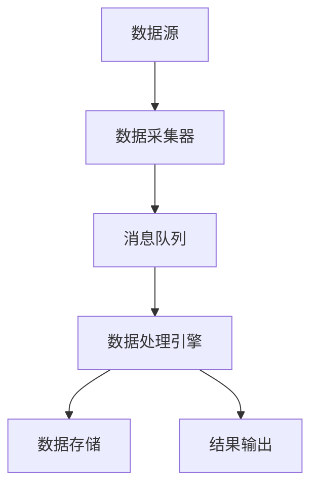
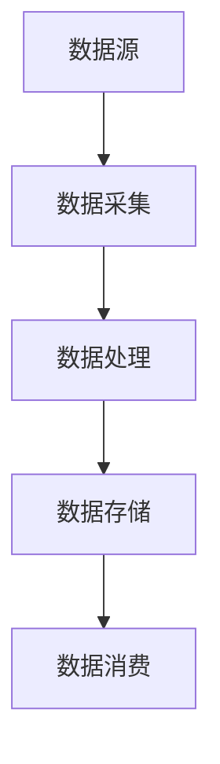
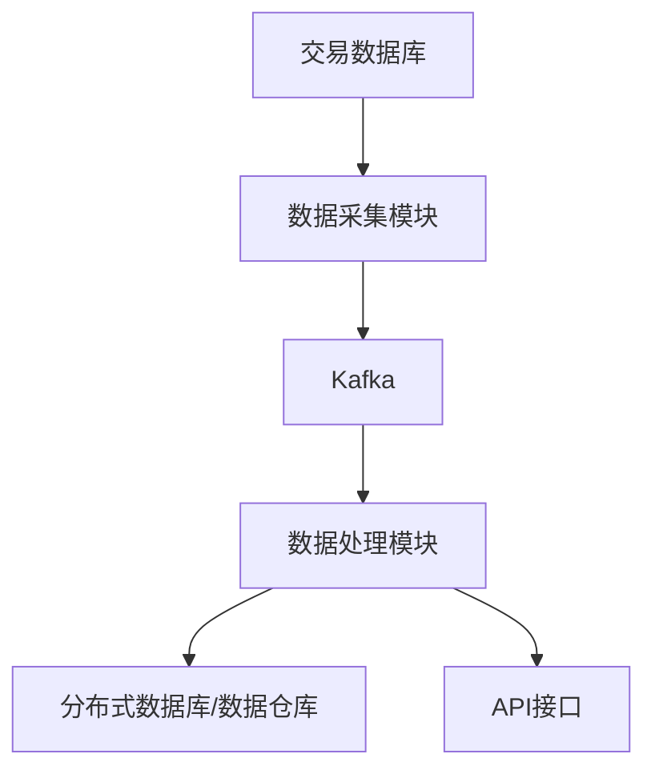
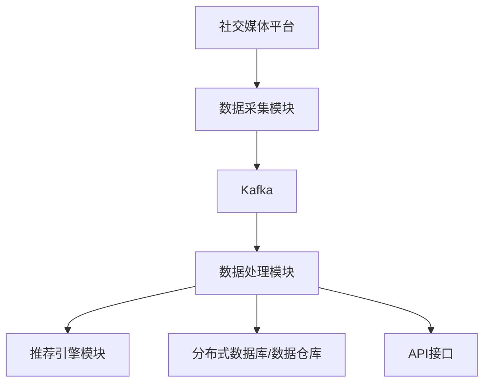
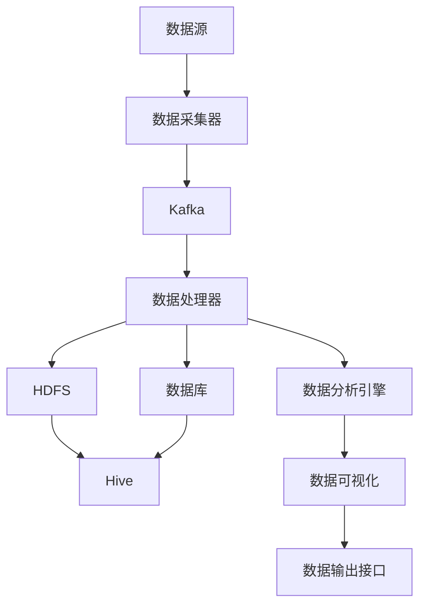

                 

### 实时评测与流处理技术基础

#### 1.1 实时评测概述

**1.1.1 实时评测的定义**

实时评测（Real-time Evaluation），通常是指在事件发生的同时或几乎同时进行的数据分析和决策。实时评测的核心在于快速响应和高效处理，能够为业务系统提供即时的反馈，从而支持动态调整和优化。实时评测涵盖了从数据收集、处理、分析到决策输出的整个流程。

**1.1.2 实时评测的重要性**

实时评测在现代信息社会中具有重要意义，主要体现在以下几个方面：

1. **提高业务效率**：实时评测能够迅速捕捉和分析业务数据，帮助企业在竞争激烈的市场中快速反应和调整策略。
2. **优化用户体验**：在互联网应用中，实时评测能够提供个性化的推荐和服务，从而提升用户满意度和黏性。
3. **降低风险**：实时评测能够及时识别潜在问题和异常情况，提前采取措施，避免业务损失。
4. **提高运营效率**：通过实时评测，企业可以实时监控运营状况，实现资源的合理配置和调度。

**1.1.3 实时评测的应用场景**

实时评测的应用场景非常广泛，以下是一些典型的应用：

1. **电商行业**：实时分析用户行为，进行个性化推荐、动态定价和库存管理。
2. **金融行业**：实时风险评估、欺诈检测和交易监控。
3. **社交媒体**：实时内容推荐、社区互动分析和舆情监控。
4. **物联网**：实时监控设备状态、故障预测和远程维护。

#### 1.2 流处理技术基础

**1.2.1 流处理的概念与特点**

流处理（Stream Processing）是一种数据处理技术，主要用于处理实时数据流。与批量处理相比，流处理具有以下特点：

1. **实时性**：能够即时处理数据，实现实时分析和决策。
2. **动态性**：能够根据数据流的动态特性调整处理逻辑。
3. **低延迟**：相比批量处理，流处理具有较低的延迟，能够快速响应。
4. **高吞吐量**：能够处理大规模数据流，支持高并发场景。

**1.2.2 流处理的核心架构**

流处理架构通常包括以下几个核心组件：

1. **数据源**：包括传感器、网站点击流、交易记录等，产生实时数据。
2. **数据采集**：将数据从源头采集到系统中，通常使用消息队列、日志收集工具等。
3. **数据存储**：存储实时数据，可以是关系数据库、NoSQL数据库或分布式存储系统。
4. **数据处理**：对实时数据进行处理，包括数据清洗、转换、聚合等，通常使用流处理框架。
5. **数据消费**：将处理后的数据输出到报表、仪表盘或其他业务系统中。

**1.2.3 流处理框架的比较**

当前主流的流处理框架包括Apache Kafka、Apache Flink、Apache Spark Streaming等。以下是这些框架的比较：

1. **Apache Kafka**：
   - **优点**：高吞吐量、可扩展性好、支持多语言客户端。
   - **缺点**：不支持复杂的数据处理逻辑、数据存储依赖外部系统。
   
2. **Apache Flink**：
   - **优点**：支持复杂的数据处理逻辑、内置分布式存储。
   - **缺点**：学习曲线较陡、社区相对较小。

3. **Apache Spark Streaming**：
   - **优点**：与Spark生态紧密集成、易于使用。
   - **缺点**：相比Flink，性能较低、不适合大规模场景。

#### 1.3 数据流处理模型

**1.3.1 微批次处理模型**

微批次处理模型（Micro-batch Processing）是流处理的一种形式，将实时数据划分为微批次进行处理，每个批次的处理时间较短。微批次处理模型的特点如下：

1. **批处理思想**：将实时数据视为微批次，类似于传统的批处理系统。
2. **高吞吐量**：通过批量处理提高系统处理效率。
3. **低延迟**：相比完全的流处理，微批次处理具有较低的延迟。

**1.3.2 无边界流处理模型**

无边界流处理模型（Unbounded Stream Processing）是一种完全的流处理模型，对实时数据进行连续处理，没有明确的批次界限。无边界流处理模型的特点如下：

1. **连续性**：对数据流进行连续处理，无需等待批次结束。
2. **低延迟**：能够快速响应实时数据。
3. **复杂性**：处理逻辑相对复杂，需要处理数据流的动态特性。

**1.3.3 时间窗口处理模型**

时间窗口处理模型（Time Window Processing）是一种基于时间段的流处理模型，将数据流划分为多个时间窗口进行处理。时间窗口处理模型的特点如下：

1. **固定时间段**：每个时间窗口具有固定的时间长度，如1分钟、1小时等。
2. **灵活调度**：可以根据业务需求调整时间窗口的大小和数量。
3. **高效处理**：通过时间窗口划分，提高数据处理效率和准确性。

#### 1.4 实时评测的需求分析

**1.4.1 实时性需求**

实时性是实时评测的核心需求之一，要求系统能够在事件发生后极短时间内提供分析和决策结果。一般来说，实时性需求可以分为以下几个层次：

1. **毫秒级**：适用于金融交易、社交互动等对实时性要求极高的场景。
2. **秒级**：适用于电商推荐、在线广告投放等场景。
3. **分钟级**：适用于数据分析、运维监控等场景。

**1.4.2 精确性需求**

实时评测不仅要及时，还要保证数据的准确性和可靠性。精确性需求可以从以下几个方面进行考量：

1. **数据完整性**：确保数据采集和处理过程中的完整性，避免数据丢失。
2. **数据准确性**：通过数据清洗、验证等手段确保数据质量。
3. **算法可靠性**：选择可靠、高效的算法模型，降低错误率。

**1.4.3 可扩展性需求**

实时评测系统需要具备良好的可扩展性，能够支持数据量和处理能力的动态调整。可扩展性需求包括：

1. **水平扩展**：通过增加节点数量提高系统处理能力。
2. **弹性伸缩**：根据负载情况动态调整系统资源。
3. **容错能力**：在节点故障时，能够快速恢复，保证系统稳定性。

#### 1.5 本章小结

本章介绍了实时评测与流处理技术的基础知识，包括实时评测的定义、重要性、应用场景，以及流处理的概念、核心架构和比较。同时，还介绍了数据流处理模型和实时评测的需求分析。通过对这些基础知识的了解，为后续架构设计和实现提供了理论支持。

### 1.1.1 实时评测的定义

实时评测（Real-time Evaluation）是指在一个事件或数据发生的同时或几乎同时，对其进行分析、计算和评估的过程。其核心目标是实现快速响应和实时决策，以便在业务流程中及时调整和优化。实时评测与传统批量处理的主要区别在于其处理的数据形式和速度。批量处理通常是将一段时间内的数据进行集中处理，而实时评测则是针对实时数据流进行连续处理。

实时评测的定义可以从以下几个方面进行详细阐述：

1. **数据实时性**：实时评测强调对实时数据的高效处理，这意味着系统能够在事件发生的同时或几毫秒内完成数据分析和评估，从而提供即时反馈。

2. **处理速度**：实时评测系统需要具备快速处理数据的能力，以满足业务需求。这通常要求系统在处理单个数据元素时具有较低的延迟。

3. **分析精度**：实时评测不仅要快速，还要确保分析结果的准确性。这意味着在数据处理过程中，需要采用精确的算法和有效的数据清洗手段，以避免因数据质量问题导致的结果偏差。

4. **业务响应**：实时评测的核心价值在于为业务流程提供实时反馈，帮助企业或系统做出快速反应。这种即时反馈可以应用于各种场景，如电商平台的实时推荐、金融交易的风险评估、社交媒体的实时舆情监控等。

在技术实现上，实时评测系统通常涉及多个组件和流程，包括数据采集、存储、处理和输出等。以下是一个典型的实时评测系统架构图：

其中，数据采集器负责从各种数据源（如传感器、网站点击流、交易记录等）收集数据，并通过消息队列（如Kafka）将数据传递给数据处理引擎。数据处理引擎对实时数据进行处理，包括数据清洗、转换、聚合和分析等，然后将处理结果存储到数据库或数据仓库中，并通过结果输出接口（如API、报表、仪表盘等）提供给业务系统或用户。

实时评测的应用场景非常广泛，以下是一些典型的例子：

1. **电商行业**：实时分析用户行为，进行个性化推荐、动态定价和库存管理。例如，当用户在电商平台上浏览商品时，系统可以实时分析用户的兴趣和行为模式，为其推荐相关商品。

2. **金融行业**：实时风险评估、欺诈检测和交易监控。例如，在金融交易中，系统可以实时监控交易数据，识别异常交易并采取相应措施，以防止欺诈行为。

3. **社交媒体**：实时内容推荐、社区互动分析和舆情监控。例如，社交媒体平台可以实时分析用户的互动行为，推荐相关内容和话题，同时监控社交媒体上的舆论动态。

4. **物联网**：实时监控设备状态、故障预测和远程维护。例如，物联网平台可以实时收集设备状态数据，通过数据分析预测设备故障，并远程维护，以提高设备运行效率。

通过实时评测，企业能够实现以下业务价值：

1. **提高运营效率**：实时评测可以帮助企业实时监控业务流程，优化资源配置，提高运营效率。

2. **优化用户体验**：实时评测能够为用户提供个性化的服务和推荐，提升用户满意度和黏性。

3. **降低风险**：实时评测能够及时识别潜在问题和异常情况，提前采取措施，降低业务风险。

4. **支持决策制定**：实时评测提供即时的数据分析和反馈，为管理层提供决策支持，帮助制定更加有效的战略和策略。

总之，实时评测作为一种先进的数据处理技术，正越来越受到企业和组织的关注。通过掌握实时评测的定义和应用，企业可以更好地应对快速变化的市场环境，实现持续发展和竞争优势。

#### 1.1.2 实时评测的重要性

实时评测在现代信息社会中扮演着至关重要的角色，其重要性可以从以下几个方面进行详细阐述：

**1. 提高业务效率**

实时评测能够对业务数据进行实时分析和反馈，帮助企业快速响应市场变化。例如，在电子商务领域，实时分析用户行为数据，可以迅速调整推荐策略，提高转化率和销售额。在金融领域，实时风险评估和交易监控可以快速识别风险，及时采取措施，避免潜在的财务损失。通过实时性，企业能够更快地做出决策，从而提高整体运营效率。

**2. 优化用户体验**

实时评测技术能够为用户提供个性化的服务和推荐，从而提升用户体验。例如，在社交媒体平台上，通过实时分析用户的互动数据，可以为用户提供相关内容推荐，增强用户的参与感和满意度。在在线教育领域，通过实时评估学生的学习行为，可以为其提供个性化的学习建议，提高学习效果。实时评测不仅能够满足用户的需求，还能通过个性化服务提升用户黏性。

**3. 降低风险**

实时评测可以在事件发生时立即识别和预警潜在的风险。在金融领域，实时评测可以监控交易行为，识别欺诈行为并及时采取措施，防止财务损失。在物联网领域，实时监控设备状态和性能数据，可以预测设备故障并及时维护，避免生产中断。通过实时性，企业可以迅速应对各种突发情况，降低运营风险。

**4. 支持决策制定**

实时评测提供即时的数据分析和反馈，为管理层提供决策支持。通过实时数据，企业可以更加准确地了解市场趋势和业务状况，从而制定更加有效的战略和策略。例如，电商企业可以通过实时分析用户购买行为，调整营销策略，提高销售额。制造业企业可以通过实时监控生产数据，优化生产流程，提高生产效率。

**5. 提升运营效率**

实时评测不仅能够提高业务效率和用户体验，还能提升整体运营效率。通过实时监控和数据分析，企业可以及时发现并解决问题，减少不必要的资源浪费。例如，在物流领域，通过实时监控运输数据，可以优化运输路线，减少运输成本。在数据中心，通过实时监控服务器状态，可以提前预测和处理设备故障，提高服务器的可用性。

**6. 数据驱动**

实时评测技术使得企业能够实现数据驱动决策。通过实时数据分析和反馈，企业可以更加科学地制定和调整业务策略，从而实现持续改进。例如，通过实时分析用户反馈数据，可以优化产品设计和功能，提升用户满意度。通过实时分析市场数据，可以及时调整营销策略，抢占市场份额。

总之，实时评测在现代信息社会中具有不可替代的重要性。通过实时数据分析和反馈，企业不仅能够提高业务效率、优化用户体验、降低风险，还能支持决策制定、提升运营效率，实现数据驱动的持续发展。随着技术的不断进步，实时评测将在更多领域发挥其重要作用，推动社会进步和经济发展。

#### 1.1.3 实时评测的应用场景

实时评测技术凭借其高效、快速响应的特点，在各个行业中都有着广泛的应用。以下是一些典型的应用场景：

**1. 电商行业**

在电商领域，实时评测技术广泛应用于个性化推荐、动态定价和库存管理。通过实时分析用户行为数据，如浏览记录、点击次数、购买历史等，电商平台能够为用户推荐相关的商品，提高转化率和销售额。此外，实时分析用户需求和市场趋势，可以实现动态定价策略，优化利润率。实时监控库存水平，可以确保商品及时补货，减少缺货情况。

**2. 金融行业**

金融行业对实时评测的需求尤为突出，尤其是在风险评估、交易监控和反欺诈方面。实时评测系统可以快速分析交易数据，识别异常行为和潜在风险，防止欺诈和财务损失。例如，在股票交易中，系统可以实时监控交易价格和交易量，预测市场趋势，为投资者提供决策支持。在银行领域，实时分析客户行为数据，可以识别潜在信用风险，提高信贷审批效率。

**3. 社交媒体**

社交媒体平台通过实时评测技术，可以提供个性化的内容推荐和互动分析。通过实时分析用户发布的内容、评论、点赞等行为数据，平台可以为用户推荐相关内容，增强用户参与感和满意度。同时，实时监控社交媒体上的舆论动态，可以及时识别和应对负面舆情，保护品牌形象。例如，通过分析用户在社交媒体上的讨论，可以发现用户关注的热点话题，为营销活动提供方向。

**4. 物联网**

物联网（IoT）领域通过实时评测技术，可以实现设备状态监控、故障预测和远程维护。通过实时收集和分析设备运行数据，如温度、湿度、电压等，可以预测设备故障，提前进行维护，减少设备故障率和维修成本。此外，实时监控设备状态，可以提高设备运行效率，延长设备寿命。例如，在工业生产中，通过实时监控生产线设备，可以确保生产过程的连续性和稳定性。

**5. 医疗健康**

医疗健康领域利用实时评测技术，可以实现患者数据实时监控、疾病预警和个性化治疗。通过实时分析患者的健康数据，如血压、心率、血糖等，医生可以及时发现异常情况，采取相应的治疗措施。例如，在重症监护室中，通过实时监控患者的生命体征，可以及时识别危急情况，提供紧急救治。此外，通过实时分析患者的健康数据，可以为患者制定个性化的康复计划，提高康复效果。

**6. 城市管理**

在城市管理中，实时评测技术可以用于交通流量监控、环境监测和应急响应。通过实时分析交通数据，如车辆流量、路况等，可以优化交通信号配置，减少交通拥堵。实时监测空气质量、水质等环境数据，可以及时发现污染问题，采取相应的治理措施。在应急响应中，实时评测技术可以帮助指挥中心快速响应突发事件，提高应急处理效率。

综上所述，实时评测技术在各个行业中都有着广泛的应用，通过实时数据分析和反馈，能够提高业务效率、优化用户体验、降低风险，并为决策制定提供有力支持。随着实时评测技术的不断发展和应用领域的扩展，其作用将愈发重要。

#### 1.2 流处理技术基础

**1.2.1 流处理的概念与特点**

流处理（Stream Processing）是一种数据处理技术，主要用于处理实时数据流。与传统的批量处理（Batch Processing）不同，流处理是对数据流进行连续、实时的处理和分析。流处理的核心概念包括数据流（Data Stream）、事件（Event）、处理逻辑（Processing Logic）和状态（State）。

**数据流**：数据流是由一系列无序且连续的数据元素组成的序列，每个数据元素表示一个具体的事件或信息。

**事件**：事件是数据流中的基本单元，可以是传感器采集的数据、用户点击行为、金融交易记录等。

**处理逻辑**：处理逻辑是对数据流中的事件进行操作和转换的规则，如过滤、聚合、变换等。

**状态**：状态是处理逻辑的上下文信息，用来存储和处理过程中产生的中间结果，如窗口状态、计数器等。

流处理的特点主要体现在以下几个方面：

1. **实时性**：流处理能够即时处理数据，提供实时分析和反馈，适合处理需要快速响应的场景。

2. **动态性**：流处理能够根据数据流的动态特性进行动态调整，处理逻辑和数据结构可以灵活变化。

3. **低延迟**：相比批量处理，流处理具有较低的延迟，能够快速响应实时数据。

4. **高吞吐量**：流处理系统能够处理大规模的数据流，支持高并发场景。

5. **容错性**：流处理系统通常具备较高的容错性，能够在节点故障时快速恢复，保证系统稳定性。

流处理的应用场景非常广泛，包括但不限于以下几个领域：

1. **物联网**：实时监控设备状态、故障预测和远程维护。

2. **金融**：实时风险评估、交易监控和反欺诈。

3. **电商**：实时个性化推荐、动态定价和库存管理。

4. **社交媒体**：实时内容推荐、社区互动分析和舆情监控。

5. **交通**：实时交通流量监控、路况预测和应急响应。

**1.2.2 流处理的核心架构**

流处理架构通常包括以下几个核心组件：

1. **数据源**：数据源是数据流的起点，可以是传感器、网站点击流、交易记录等。数据源负责产生和传输实时数据。

2. **数据采集**：数据采集是将数据从数据源传输到流处理系统的过程。常用的数据采集工具包括消息队列、日志收集器和数据代理等。

3. **数据处理**：数据处理是对数据流进行操作和转换的过程，包括过滤、聚合、变换等。数据处理通常通过流处理框架（如Apache Kafka、Apache Flink、Apache Spark Streaming）实现。

4. **数据存储**：数据存储用于存储处理后的数据，可以是关系数据库、NoSQL数据库或分布式存储系统。数据存储不仅用于数据持久化，还用于后续的数据分析和查询。

5. **数据消费**：数据消费是将处理后的数据输出到报表、仪表盘或其他业务系统的过程。数据消费可以通过API、Web服务、批处理等方式实现。

**1.2.3 流处理框架的比较**

当前主流的流处理框架包括Apache Kafka、Apache Flink、Apache Spark Streaming等。以下是这些框架的详细比较：

**Apache Kafka**

- **优点**：
  - 高吞吐量：支持大规模数据流处理，适用于高并发场景。
  - 可扩展性：易于水平扩展，支持分布式架构。
  - 多语言支持：提供多种编程语言客户端，如Java、Python、Go等。

- **缺点**：
  - 不支持复杂数据处理逻辑：Kafka主要用于数据传输和存储，不适合复杂的数据处理任务。
  - 数据存储依赖外部系统：Kafka本身不提供数据存储功能，需要依赖外部存储系统。

**Apache Flink**

- **优点**：
  - 高性能：支持复杂的数据处理逻辑，性能优异。
  - 内置分布式存储：支持基于内存的分布式存储，减少数据传输开销。
  - 完全的流处理支持：支持无边界流处理、微批次处理和时间窗口处理。

- **缺点**：
  - 学习曲线较陡：Flink功能强大，但学习成本较高。
  - 社区相对较小：相比Spark，Flink的社区支持较少。

**Apache Spark Streaming**

- **优点**：
  - 易于使用：与Spark生态紧密集成，使用方便。
  - 高性能：支持高吞吐量数据流处理。
  - 丰富的数据处理功能：提供丰富的数据处理操作，如过滤、聚合、变换等。

- **缺点**：
  - 性能较低：相比Flink，Spark Streaming性能较低。
  - 不适合大规模场景：在大规模数据流处理场景中，Spark Streaming表现不如Flink。

综上所述，选择流处理框架需要根据具体应用场景和需求进行综合考虑。Kafka适合用于数据传输和存储，Flink适合复杂的数据处理任务，Spark Streaming则适合与Spark生态集成的应用。

#### 1.2.2 流处理的核心架构

流处理架构是支撑实时数据处理和分析的关键基础设施。一个完整的流处理架构通常包括数据源、数据采集、数据处理、数据存储和数据消费五个核心组件。以下是对这些组件的详细解析：

**1. 数据源（Data Source）**

数据源是流处理系统的起点，负责产生和传输实时数据。数据源可以包括传感器、网站点击流、交易记录、日志文件等多种形式。每种数据源有其特定的数据生成方式和传输机制。例如，传感器可以实时采集环境数据，网站点击流可以记录用户在网站上的行为，交易记录则记录金融交易的具体信息。

**2. 数据采集（Data Collection）**

数据采集是将数据从源头传输到流处理系统中的过程。这一步通常使用消息队列、日志收集工具或数据代理等工具实现。消息队列（如Apache Kafka）是一种常见的数据采集方式，它提供了高吞吐量、低延迟、可扩展的消息传输服务。日志收集工具（如Fluentd、Logstash）则用于从不同来源收集日志数据，并将其传输到流处理系统。数据代理则可以用于在网络中转发和转换数据，以适应不同的处理需求。

**3. 数据处理（Data Processing）**

数据处理是对实时数据进行操作和转换的过程，包括过滤、聚合、变换等。数据处理是流处理架构的核心部分，决定了系统的功能和应用价值。常用的数据处理工具包括流处理框架（如Apache Flink、Apache Spark Streaming）和流处理引擎（如Apache Storm、Apache Beam）。流处理框架提供了丰富的数据处理API和操作函数，支持复杂的数据处理逻辑。流处理引擎则通常用于实现特定的数据处理任务，如实时分析、实时机器学习等。

**4. 数据存储（Data Storage）**

数据存储用于存储处理后的数据，以便后续的数据分析和查询。数据存储可以是关系数据库、NoSQL数据库或分布式存储系统。关系数据库（如MySQL、PostgreSQL）适用于结构化数据存储和查询，支持复杂的SQL操作。NoSQL数据库（如MongoDB、Cassandra）则适用于海量非结构化数据存储，提供高可用性和高扩展性。分布式存储系统（如Hadoop HDFS、Alluxio）提供了大规模数据存储和管理能力，支持分布式文件系统和高吞吐量数据访问。

**5. 数据消费（Data Consumption）**

数据消费是将处理后的数据输出到报表、仪表盘或其他业务系统的过程。数据消费可以通过API、Web服务、批处理等方式实现。报表和仪表盘是常见的实时数据展示方式，可以直观地反映实时数据分析和处理结果。API和Web服务则提供了程序化访问和处理数据的能力，支持业务系统的集成和扩展。批处理则用于对处理结果进行进一步分析和处理，如生成历史报表、进行数据挖掘等。

**核心架构图**

以下是流处理架构的核心组件和流程的简化架构图：

通过上述架构，流处理系统可以实现从数据源到数据消费的全流程实时数据处理和分析。数据源产生的实时数据经过采集和传输，进入数据处理环节，进行过滤、聚合、变换等操作。处理后的数据存储在数据存储系统中，供后续分析和查询使用。最后，通过数据消费组件，将处理结果输出到报表、仪表盘或其他业务系统中，实现实时数据的可视化和应用。

总之，流处理架构的设计和实现需要充分考虑数据源、采集、处理、存储和消费各个环节的需求和特点，以确保系统的高效、稳定和可靠运行。通过合理的设计和优化，流处理架构可以满足不同场景下的实时数据处理需求，为业务系统提供强大的支持。

#### 1.2.3 流处理框架的比较

在流处理领域，Apache Kafka、Apache Flink 和 Apache Spark Streaming 是三大主流框架。每个框架都有其独特的优点和缺点，适用于不同的应用场景。以下是对这些框架的详细比较：

**Apache Kafka**

**优点：**

1. **高吞吐量**：Kafka 是一种分布式消息队列系统，设计之初就是为了处理大量数据流，具有非常高的吞吐量。
2. **可扩展性**：Kafka 支持水平扩展，可以通过增加节点数量来提升系统的处理能力。
3. **多语言支持**：Kafka 提供了多种编程语言（如 Java、Python、Go 等）的客户端库，便于集成和使用。

**缺点：**

1. **不支持复杂数据处理**：Kafka 主要用于数据传输和存储，本身不提供复杂的数据处理功能。
2. **数据存储依赖外部系统**：Kafka 本身不提供数据存储功能，需要依赖外部存储系统（如 HDFS、Cassandra 等）。

**Apache Flink**

**优点：**

1. **高性能**：Flink 是一种分布式流处理框架，具有优异的性能，适合处理复杂的数据处理任务。
2. **内置分布式存储**：Flink 提供了基于内存的分布式存储，减少了数据传输开销，提高了处理效率。
3. **全面支持流处理**：Flink 支持无边界流处理、微批次处理和时间窗口处理，提供了丰富的数据处理API和操作函数。

**缺点：**

1. **学习曲线较陡**：Flink 功能强大，但学习成本较高，需要一定的技术积累。
2. **社区相对较小**：相比 Spark，Flink 的社区支持较少，文档和教程相对较少。

**Apache Spark Streaming**

**优点：**

1. **易于使用**：Spark Streaming 与 Spark 生态紧密集成，使用方便，无需额外学习新框架。
2. **高性能**：Spark Streaming 支持高吞吐量数据流处理，性能优异。
3. **丰富的数据处理功能**：Spark Streaming 提供了丰富的数据处理操作，如过滤、聚合、变换等。

**缺点：**

1. **性能较低**：相比 Flink，Spark Streaming 性能较低，不适合大规模数据流处理场景。
2. **不适合大规模场景**：在大规模数据流处理场景中，Spark Streaming 表现不如 Flink。

**总结：**

选择流处理框架时，需要根据具体应用场景和需求进行综合考虑。Kafka 适用于数据传输和存储场景，Flink 适用于复杂的数据处理任务，Spark Streaming 适用于与 Spark 生态集成的应用。通过合理选择和使用这些框架，可以实现高效、稳定的流数据处理和分析。

#### 1.3 数据流处理模型

数据流处理模型是流处理技术中的重要组成部分，用于对实时数据进行处理和分析。根据不同的应用场景和数据特性，数据流处理模型可以分为微批次处理模型、无边界流处理模型和时间窗口处理模型。

**1.3.1 微批次处理模型**

微批次处理模型（Micro-batch Processing）将实时数据划分为微批次进行处理，每个批次的处理时间较短，通常为几秒到几分钟。微批次处理模型的特点如下：

1. **批处理思想**：微批次处理模型保留了批处理的一些特点，例如将一段时间内的数据进行集中处理，以降低系统复杂性。
2. **高吞吐量**：通过批量处理，可以提高系统的处理效率，适合处理大规模数据流。
3. **低延迟**：相比完全的流处理模型，微批次处理模型具有较低的延迟，可以在较短时间内完成数据处理。

微批次处理模型的优点是系统设计和实现相对简单，易于维护和扩展。缺点是处理时间较长，无法实现真正的实时性。这种模型适用于对实时性要求不高的场景，如数据分析、报表生成等。

**1.3.2 无边界流处理模型**

无边界流处理模型（Unbounded Stream Processing）是一种完全的流处理模型，对实时数据进行连续处理，没有明确的批次界限。无边界流处理模型的特点如下：

1. **连续性**：无边界流处理模型对数据流进行连续处理，无需等待批次结束，可以实时响应实时数据。
2. **低延迟**：由于对数据流进行连续处理，无边界流处理模型具有较低的延迟，能够快速响应实时数据。
3. **复杂性**：处理逻辑相对复杂，需要处理数据流的动态特性，如窗口操作、状态管理等。

无边界流处理模型的优点是能够实现真正的实时性，适用于对实时性要求极高的场景，如金融交易、社交互动等。缺点是系统设计和实现相对复杂，需要处理数据流的动态特性，对开发人员的技能要求较高。

**1.3.3 时间窗口处理模型**

时间窗口处理模型（Time Window Processing）是一种基于时间段的流处理模型，将数据流划分为多个时间窗口进行处理。每个时间窗口具有固定的时间长度，如1分钟、1小时等。时间窗口处理模型的特点如下：

1. **固定时间段**：每个时间窗口具有固定的时间长度，如1分钟、1小时等，便于数据聚合和分析。
2. **灵活调度**：可以根据业务需求调整时间窗口的大小和数量，以适应不同的应用场景。
3. **高效处理**：通过时间窗口划分，可以提高数据处理效率和准确性。

时间窗口处理模型的优点是能够实现高效的实时数据处理，适用于需要按时间段进行数据聚合和分析的场景，如实时监控、报表生成等。缺点是处理逻辑相对复杂，需要处理时间窗口的边界和重叠问题。

综上所述，数据流处理模型的选择需要根据具体应用场景和数据特性进行权衡。微批次处理模型适用于对实时性要求不高的场景，无边界流处理模型适用于对实时性要求极高的场景，时间窗口处理模型适用于需要按时间段进行数据聚合和分析的场景。

#### 1.4 实时评测的需求分析

实时评测系统在设计和实现过程中，需要满足一系列关键需求，以保证系统的实时性、精确性和可扩展性。以下是对这些需求的详细分析：

**1.4.1 实时性需求**

实时性是实时评测系统的核心需求之一，它要求系统能够在事件发生的同时或几毫秒内完成数据分析和决策。具体来说，实时性需求可以分为以下几个层次：

1. **毫秒级**：适用于金融交易、社交互动等对实时性要求极高的场景。例如，金融交易系统需要在毫秒级内完成交易确认和风险评估，以确保交易过程的及时性和安全性。
2. **秒级**：适用于电商推荐、在线广告投放等场景。例如，电商平台需要实时分析用户行为，进行个性化推荐和动态定价，以提升用户满意度和销售额。
3. **分钟级**：适用于数据分析、运维监控等场景。例如，企业可以通过实时监控服务器状态和流量数据，及时发现和处理异常情况，提高系统可用性和稳定性。

为了满足不同层次的实时性需求，实时评测系统需要采用高效的数据处理技术和优化策略。例如，可以使用流处理框架（如Apache Flink、Apache Spark Streaming）来实现数据的高效处理和低延迟响应。

**1.4.2 精确性需求**

实时评测不仅要及时，还要保证数据的准确性和可靠性。精确性需求可以从以下几个方面进行考量：

1. **数据完整性**：确保数据在采集、传输和存储过程中不丢失或被篡改。可以通过使用可靠的数据传输协议（如TCP）、数据校验和加密技术来实现。
2. **数据准确性**：通过数据清洗、验证和校验等手段确保数据质量。例如，可以使用数据预处理工具（如Apache NiFi）对数据进行清洗和转换，去除重复、缺失和异常数据。
3. **算法可靠性**：选择可靠、高效的算法模型，降低错误率。例如，可以使用机器学习算法对实时数据进行分类和预测，但需要确保算法的准确性和鲁棒性。

为了提高算法的可靠性，可以进行以下操作：

- **交叉验证**：使用不同的数据集和算法模型进行交叉验证，确保模型的泛化能力。
- **实时反馈**：通过实时监控和反馈机制，及时发现和纠正算法错误。
- **异常检测**：使用异常检测算法（如孤立森林、基于密度的聚类等）识别和隔离异常数据，提高整体数据质量。

**1.4.3 可扩展性需求**

实时评测系统需要具备良好的可扩展性，能够支持数据量和处理能力的动态调整。具体来说，可扩展性需求包括以下几个方面：

1. **水平扩展**：通过增加节点数量提高系统处理能力。例如，可以使用分布式计算框架（如Apache Hadoop、Apache Spark）来实现水平扩展，从而处理大规模数据流。
2. **弹性伸缩**：根据负载情况动态调整系统资源。例如，可以使用自动化调度工具（如Kubernetes）实现资源的动态分配和调整，确保系统在高负载情况下仍能稳定运行。
3. **容错能力**：在节点故障时，能够快速恢复，保证系统稳定性。例如，可以使用分布式存储系统（如Apache HDFS、Alluxio）实现数据的冗余备份和故障恢复。

为了实现良好的可扩展性，可以采用以下策略：

- **分布式架构**：采用分布式架构，将系统拆分为多个模块，每个模块可以独立部署和扩展。
- **服务化设计**：将系统功能模块化为服务，每个服务可以独立部署和扩展，从而提高系统的灵活性和可扩展性。
- **负载均衡**：使用负载均衡器（如Nginx、HAProxy）实现请求的均衡分配，确保系统在高负载情况下仍能稳定运行。

总之，实时评测系统需要满足实时性、精确性和可扩展性三大需求，以实现高效、准确和稳定的实时数据分析。通过采用高效的数据处理技术、可靠的数据质量和算法模型，以及灵活的架构设计和优化策略，可以满足这些需求，从而为业务系统提供强大的支持。

#### 1.5 本章小结

本章详细介绍了实时评测与流处理技术的基础知识。首先，我们对实时评测进行了定义和概述，强调了其在现代信息社会中的重要性，并列举了其广泛的应用场景。接着，我们探讨了流处理技术的基本概念、核心架构以及与实时评测的结合。随后，我们比较了常见的流处理框架，如Apache Kafka、Apache Flink和Apache Spark Streaming，分析了它们的特点和适用场景。最后，我们讨论了数据流处理模型，包括微批次处理模型、无边界流处理模型和时间窗口处理模型，并分析了实时评测的需求，如实时性、精确性和可扩展性。通过本章的学习，读者可以全面了解实时评测和流处理技术的理论基础，为后续的架构设计和实现打下坚实的基础。

### 2.1 流处理架构设计原则

在流处理架构的设计过程中，需要遵循一系列原则，以确保系统的可靠性、高性能和易扩展性。以下是流处理架构设计的主要原则：

**2.1.1 高可用性设计**

高可用性设计是流处理架构设计的关键原则之一。流处理系统通常处理实时数据，一旦系统出现故障，可能会导致数据丢失或服务中断。因此，高可用性设计至关重要。

1. **冗余设计**：通过在系统中引入冗余机制，如数据复制、集群部署等，确保在节点故障时，系统仍能正常运行。例如，可以使用分布式存储系统（如HDFS）对数据进行冗余备份，使用Kafka等消息队列进行数据复制，确保数据不丢失。

2. **故障转移**：在系统架构中引入故障转移机制，如使用Zookeeper或Consul等分布式协调服务实现自动化故障转移。当主节点故障时，从节点可以自动接管主节点的任务，确保系统的持续运行。

3. **容错机制**：设计系统时，要考虑到容错机制，例如使用幂等操作、补偿机制等，以应对系统中的各种异常情况。例如，在金融交易系统中，可以使用幂等操作确保同一交易请求不会被重复执行。

**2.1.2 高性能设计**

高性能设计是流处理架构的另一个关键原则。流处理系统需要快速处理大规模数据流，以满足实时性和低延迟的需求。

1. **并行处理**：利用并行处理技术，将数据流划分为多个子流，同时在多个节点上并行处理，以提高处理速度。例如，可以使用Apache Flink或Apache Spark Streaming等流处理框架，实现数据流的多节点并行处理。

2. **局部性优化**：利用局部性优化策略，减少数据传输和访问延迟。例如，通过数据分区（Partitioning）和本地化处理（Local Processing），将数据存储和处理节点尽量接近，以减少数据传输开销。

3. **缓存策略**：在处理过程中，使用缓存策略（如LRU缓存、内存缓存等）减少数据的访问时间。例如，在数据处理过程中，可以将常用数据存储在内存中，以加快数据处理速度。

**2.1.3 易扩展性设计**

易扩展性设计是流处理架构的长期目标之一。随着数据量和业务需求的增长，流处理系统需要能够动态调整资源，以适应新的负载。

1. **水平扩展**：通过增加节点数量实现水平扩展，以提高系统的处理能力。例如，可以使用Kubernetes等容器编排工具，实现流处理任务的动态部署和扩展。

2. **弹性伸缩**：根据系统负载动态调整资源，确保系统在高负载和低负载情况下都能稳定运行。例如，可以使用自动伸缩策略（Auto Scaling），根据CPU使用率、内存使用率等指标，自动增加或减少节点数量。

3. **分布式架构**：采用分布式架构，将系统拆分为多个模块，每个模块可以独立部署和扩展。例如，可以使用微服务架构，将数据处理、数据存储、数据消费等模块分开部署，以提高系统的灵活性和可扩展性。

**2.1.4 动态调整**

流处理系统通常需要根据业务需求和数据特性动态调整处理逻辑和资源分配。动态调整是流处理架构设计的重要原则之一。

1. **动态配置**：通过动态配置机制，可以灵活调整系统参数和策略。例如，可以使用Spring Cloud Config等配置管理工具，实现系统的动态配置和管理。

2. **动态扩展**：在系统运行过程中，可以根据实际负载和性能指标，动态调整处理逻辑和资源分配。例如，在高峰期，可以增加数据处理节点，提高系统处理能力。

3. **自适应处理**：根据数据流的特点和业务需求，自适应调整处理逻辑和算法。例如，在处理不同类型的数据时，可以使用不同的处理算法和策略，以提高处理效率和准确性。

通过遵循这些设计原则，流处理架构可以实现高可用性、高性能和易扩展性，满足实时数据处理的多样化需求。

#### 2.1.1 高可用性设计

在流处理架构的设计中，高可用性设计是一个至关重要的原则。流处理系统通常需要处理大量实时数据，因此系统的稳定性至关重要。以下是实现高可用性设计的几个关键要素：

**1. 数据冗余与复制**

数据冗余与复制是保障系统高可用性的基础。通过在系统中引入数据冗余机制，可以确保在节点故障时，数据不会丢失。

- **数据复制**：流处理框架（如Apache Kafka、Apache Flink）通常支持数据复制功能。例如，Kafka可以配置多个副本，确保在某个节点故障时，其他副本可以接管工作，保证数据不丢失。
- **分布式存储**：流处理产生的数据可以存储在分布式存储系统中（如HDFS），这些系统提供了数据冗余和容错机制。例如，HDFS会将数据分成多个块，并存储在不同的节点上，确保数据的高可用性。

**2. 故障转移**

故障转移是确保系统在节点故障时能够自动恢复的关键机制。通过引入故障转移机制，可以确保系统在高可用性环境下持续运行。

- **主从架构**：在流处理系统中，可以使用主从架构实现故障转移。例如，在Kafka集群中，一个分区有多个副本，其中一个副本作为主副本提供服务，其他副本作为备份副本。当主副本故障时，备份副本可以自动切换为主副本。
- **自动恢复**：使用分布式协调服务（如Zookeeper、Consul）可以实现自动化故障转移。这些服务可以监控系统的健康状态，并在检测到节点故障时，自动执行故障转移操作。

**3. 容错机制**

在设计流处理系统时，要考虑各种可能的异常情况，并引入容错机制。

- **幂等操作**：在金融交易、数据更新等场景中，可以使用幂等操作确保同一操作不会被重复执行。例如，使用分布式锁（如Zookeeper中的ZooKeeperLock）确保操作的唯一性。
- **补偿机制**：在处理过程中，如果某个任务失败，可以使用补偿机制（如重试、回滚等）进行修复。例如，使用消息队列（如Kafka）的回滚功能，可以在任务失败时重新处理数据。

**4. 健康监测与告警**

为了及时发现和解决潜在问题，流处理系统需要具备健康监测和告警功能。

- **健康检查**：定期进行系统健康检查，监控系统的运行状态，包括CPU使用率、内存使用率、网络延迟等。
- **告警通知**：当系统出现异常时，及时发送告警通知，包括邮件、短信、短信等。例如，使用Prometheus和Grafana等监控工具，可以实时监控系统的健康状态，并在检测到异常时发送告警通知。

**5. 弹性扩展**

为了应对不断变化的数据量和业务需求，流处理系统需要具备弹性扩展能力。

- **水平扩展**：通过增加节点数量，提高系统的处理能力。例如，使用Kubernetes等容器编排工具，可以动态分配和扩展资源，确保系统在高负载情况下稳定运行。
- **动态配置**：根据实际负载和性能指标，动态调整系统配置。例如，通过配置管理工具（如Spring Cloud Config），可以实现系统的动态配置和管理，确保系统在不同负载情况下保持最佳性能。

**6. 异常处理**

在流处理系统中，异常处理是确保系统稳定运行的重要环节。

- **异常捕获**：在数据处理过程中，捕获和处理异常情况。例如，使用try-catch块捕获异常，并记录错误日志，以便后续分析和处理。
- **重试机制**：当任务失败时，可以尝试重新处理数据。例如，使用Kafka的幂等性机制，确保任务在失败时可以重新执行。

通过上述高可用性设计原则，流处理架构可以在面临各种挑战时，保持稳定运行，确保实时数据处理和分析的可靠性。

#### 2.1.2 高性能设计

高性能设计是流处理架构设计中的一个关键原则，特别是在处理大规模实时数据时，需要确保系统能够高效地完成数据处理任务。以下是实现高性能设计的一些关键策略：

**1. 并行处理**

并行处理是将任务分解为多个子任务，同时在多个节点上并行执行的一种技术。这种技术能够显著提高系统的处理速度，降低延迟。

- **数据分区**：通过数据分区，可以将数据流划分成多个子流，每个子流由不同的节点处理。这种方法不仅提高了并行度，还可以减少数据传输开销。例如，在Kafka中，可以使用分区键（Partition Key）将消息分配到不同的分区。
- **任务分解**：将大的数据处理任务分解成多个小的子任务，每个子任务在不同的节点上执行。例如，使用Apache Flink的任务分解功能，可以有效地利用集群资源。

**2. 局部性优化**

局部性优化是通过减少数据传输和访问延迟来提高系统性能的一种策略。数据局部性和计算局部性是优化的重要方向。

- **数据局部性**：通过将数据存储和处理节点尽量接近，可以减少数据传输延迟。例如，可以使用本地化处理（Local Processing）策略，将数据存储在处理节点所在的本地存储中，减少网络传输开销。
- **计算局部性**：通过将计算任务分配到数据所在的节点上，可以减少数据的移动和重复计算。例如，使用分布式缓存（如Redis）将常用数据存储在处理节点附近，以加快数据访问速度。

**3. 缓存策略**

缓存策略是通过存储常用数据，以减少数据访问时间，从而提高系统性能的一种技术。

- **内存缓存**：使用内存缓存（如LRU缓存）存储常用数据，可以显著提高数据访问速度。例如，在流处理过程中，可以将频繁访问的数据缓存到内存中，减少磁盘IO操作。
- **分布式缓存**：使用分布式缓存系统（如Memcached、Redis）可以实现数据的分布式存储和快速访问。这种技术适用于处理大规模数据和高并发场景。

**4. 预处理**

预处理是在数据处理之前对数据进行预处理，以提高系统性能的一种策略。

- **数据压缩**：对数据进行压缩处理，可以减少数据传输和存储空间。例如，使用Gzip等压缩算法，可以显著减少数据的大小。
- **批量处理**：通过批量处理，可以提高系统吞吐量。例如，在处理大量相似的任务时，可以将任务组合成批量，一次性处理，从而减少系统调度的开销。

**5. 异步处理**

异步处理是将数据处理任务分解为多个独立的子任务，并使用异步方式执行的一种技术。这种技术可以显著提高系统的并发能力和性能。

- **异步IO**：使用异步IO操作，可以避免阻塞式IO，从而提高系统的并发处理能力。例如，使用NIO（Non-blocking I/O）技术，可以同时处理多个IO请求。
- **异步任务调度**：通过异步任务调度，可以将任务分配给不同的线程或线程池，提高系统的并发处理能力。例如，使用Java的`ExecutorService`实现异步任务调度。

通过上述高性能设计策略，流处理架构可以高效地处理大规模实时数据，满足低延迟和高吞吐量的需求。

#### 2.1.3 易扩展性设计

易扩展性设计是流处理架构设计中的关键原则之一，旨在确保系统能够随着数据量和业务需求的增长而灵活调整资源。以下是实现易扩展性设计的几个关键策略：

**1. 水平扩展**

水平扩展（Horizontal Scaling）是通过增加节点数量来提高系统处理能力和容量的方法。这种方法不仅能够提升系统的性能，还可以保证系统在高负载情况下稳定运行。

- **分布式架构**：采用分布式架构，将系统拆分为多个独立的模块，每个模块可以独立部署和扩展。例如，使用微服务架构，可以将数据处理、数据存储、数据消费等模块分开部署，从而提高系统的灵活性和可扩展性。
- **无状态服务**：设计无状态服务，使得每个服务实例都可以独立扩展和部署，不会因为某个实例的故障而影响整个系统。例如，在流处理系统中，数据处理服务可以设计为无状态，从而可以轻松地通过增加实例数量来提升处理能力。

**2. 弹性伸缩**

弹性伸缩（Elastic Scaling）是根据系统负载动态调整资源的方法，确保系统在高负载和低负载情况下都能高效运行。

- **自动化伸缩策略**：使用自动化伸缩策略（如Auto Scaling），可以根据CPU使用率、内存使用率等指标，自动增加或减少系统资源。例如，在Kubernetes中，可以使用Horizontal Pod Autoscaler（HPA）根据CPU使用率自动调整Pod的数量。
- **资源池管理**：通过资源池管理，可以集中管理和分配系统资源，实现动态资源分配。例如，使用云服务提供商的资源池管理功能，可以灵活地分配和回收计算资源。

**3. 分布式存储**

分布式存储是一种高效、可靠的存储方法，通过将数据分布在多个节点上，可以提高系统的存储容量和性能。

- **数据分片**：通过数据分片（Sharding），可以将数据分散存储在多个节点上，从而提高数据访问速度和系统容错能力。例如，使用MongoDB等NoSQL数据库，可以通过分片机制实现分布式存储。
- **分布式文件系统**：使用分布式文件系统（如HDFS、Alluxio），可以高效地管理海量数据，并提供高可用性和高性能的存储服务。

**4. 服务化设计**

服务化设计是将系统功能模块化为服务，每个服务可以独立部署和扩展，从而提高系统的灵活性和可维护性。

- **服务解耦**：通过服务解耦，可以降低系统之间的依赖关系，提高系统的扩展性和稳定性。例如，在流处理系统中，可以将数据处理、数据存储、数据消费等模块分别部署为独立的服务。
- **API网关**：使用API网关，可以统一管理和路由服务请求，实现服务的独立部署和扩展。例如，使用Spring Cloud Gateway等API网关框架，可以方便地管理和扩展服务接口。

**5. 监控与优化**

通过监控和优化，可以及时发现和解决系统中的性能瓶颈和资源浪费，从而提高系统的扩展性和性能。

- **性能监控**：使用性能监控工具（如Prometheus、Grafana），可以实时监控系统的运行状态，发现潜在的性能问题。例如，通过监控CPU使用率、内存使用率等指标，可以了解系统的性能状况。
- **性能优化**：根据监控数据，进行性能优化，提高系统的响应速度和处理能力。例如，通过调整系统参数、优化数据库查询、减少不必要的网络通信等，可以提升系统的性能。

通过上述易扩展性设计策略，流处理架构可以实现灵活的资源管理和动态调整，确保系统在应对不断变化的数据量和业务需求时，能够保持高效、稳定的运行。

#### 2.1.4 动态调整

动态调整是流处理架构设计中的重要原则，旨在确保系统能够根据实时负载和业务需求的变化，灵活调整处理逻辑和资源分配。以下是实现动态调整的几个关键策略：

**1. 动态配置**

动态配置允许系统在运行过程中实时调整配置参数，以满足变化的需求。这种策略可以通过配置管理工具实现，如Spring Cloud Config、Consul等。

- **配置热更新**：使用动态配置，可以在不重启系统的情况下，实时更新配置参数。例如，通过修改配置文件或API接口，可以动态调整系统的连接参数、处理规则等。
- **配置版本控制**：通过配置版本控制，可以确保配置变更的可追溯性和安全性。例如，每次更新配置时，系统可以记录变更的版本信息和变更时间，便于后续的监控和管理。

**2. 弹性伸缩**

弹性伸缩是指根据系统负载自动调整资源，确保系统在高负载和低负载情况下都能稳定运行。弹性伸缩可以通过自动化工具实现，如Kubernetes、AWS Auto Scaling等。

- **自动扩缩容**：使用自动化扩缩容策略，可以根据CPU使用率、内存使用率等指标，自动调整系统资源。例如，当CPU使用率超过90%时，自动增加节点数量；当CPU使用率低于50%时，自动减少节点数量。
- **资源池管理**：通过资源池管理，可以集中管理和分配系统资源。例如，使用容器编排工具（如Kubernetes），可以方便地管理集群资源，实现动态扩缩容。

**3. 动态扩展**

动态扩展是指根据实时数据流量和业务需求，动态调整数据处理能力和存储容量。这种方法可以通过分布式架构和分布式存储系统实现。

- **分布式计算**：通过分布式计算架构，可以将数据处理任务分布在多个节点上执行。例如，使用Apache Flink或Apache Spark等流处理框架，可以实现动态扩展，提高数据处理能力。
- **分布式存储**：通过分布式存储系统，可以动态扩展存储容量。例如，使用HDFS或Alluxio等分布式文件系统，可以在不中断服务的情况下，动态增加存储节点，提高存储容量。

**4. 自适应处理**

自适应处理是指根据数据流的特点和业务需求，动态调整处理逻辑和算法。这种方法可以通过机器学习和实时优化实现。

- **机器学习**：通过机器学习算法，可以实时分析数据流，发现数据模式和趋势。例如，使用实时机器学习框架（如Apache Flink ML、TensorFlow Streaming），可以动态调整处理逻辑和算法，提高系统性能。
- **实时优化**：通过实时优化技术，可以根据实时数据分析和反馈，动态调整系统参数和策略。例如，使用A/B测试等技术，可以实时比较不同处理策略的效果，并选择最优策略。

**5. 实时监控**

实时监控是动态调整的基础，通过实时监控系统的运行状态和性能指标，可以及时发现和解决问题。

- **监控指标**：定义关键监控指标，如CPU使用率、内存使用率、网络吞吐量等，以便实时监控系统的运行状态。
- **告警机制**：设置告警机制，当监控指标超过阈值时，及时发送告警通知。例如，使用Prometheus和Grafana等监控工具，可以实时监控系统的运行状态，并在检测到异常时发送告警通知。

通过上述动态调整策略，流处理架构可以实现灵活的资源管理和动态优化，确保系统在应对实时负载和业务需求变化时，能够保持高效、稳定的运行。

#### 2.1.5 模块化设计

模块化设计是流处理架构设计中的一项重要原则，它通过将系统拆分为多个独立的模块，使得每个模块可以独立开发、部署和扩展，从而提高系统的可维护性和可扩展性。

**1. 模块化设计的优势**

- **可维护性**：模块化设计使得系统结构更加清晰，每个模块独立负责特定的功能，降低了系统复杂度，便于代码维护和升级。
- **可扩展性**：通过模块化设计，可以方便地添加或替换某个模块，以满足新的业务需求或技术升级。
- **可重用性**：模块化设计使得模块可以独立开发和测试，提高了代码的重用性，减少了重复开发的工作量。
- **容错性**：模块化设计可以将系统的故障隔离到特定的模块，从而降低故障对整个系统的影响，提高系统的稳定性。

**2. 实现模块化设计的方法**

- **服务化架构**：采用微服务架构，将系统拆分为多个独立的服务，每个服务负责特定的业务功能。例如，可以使用Spring Boot或Spring Cloud等框架实现服务化架构，每个服务可以通过RESTful API进行通信。
- **独立部署**：每个模块应该能够独立部署和运行，不依赖于其他模块。这可以通过容器化技术（如Docker）实现，将每个模块打包成独立的容器，独立部署和运行。
- **API接口**：使用清晰的API接口定义模块间的交互，确保模块之间解耦，降低模块之间的依赖关系。这可以通过定义RESTful API、gRPC接口等实现。
- **配置管理**：通过配置管理工具（如Spring Cloud Config、Consul等），可以实现模块的动态配置管理，方便地调整模块的运行参数。

**3. 模块划分**

在模块化设计中，合理的模块划分是关键。以下是一些常见的模块划分方法：

- **按功能划分**：根据系统的功能需求，将系统划分为多个功能模块，如数据采集模块、数据处理模块、数据存储模块、数据消费模块等。
- **按业务领域划分**：根据业务领域，将系统划分为多个业务领域模块，如电商模块、金融模块、物流模块等。
- **按技术层次划分**：根据系统的技术层次，将系统划分为多个技术模块，如Web服务模块、数据库模块、缓存模块、消息队列模块等。
- **按数据流划分**：根据数据处理流程，将系统划分为多个数据处理模块，如数据清洗模块、数据转换模块、数据聚合模块、数据存储模块等。

通过模块化设计，流处理架构可以实现高可维护性、高可扩展性，并提高系统的稳定性和灵活性，为应对复杂的业务需求和技术挑战提供坚实的基础。

#### 2.2 流处理架构设计流程

流处理架构的设计流程是一个系统化的过程，涉及需求分析、系统设计、架构优化等多个环节。以下是对每个环节的详细描述：

**2.2.1 需求分析**

需求分析是架构设计的起点，主要任务是明确系统的功能需求和非功能需求，确保设计出的架构能够满足业务需求。

1. **功能需求**：功能需求包括系统应具备的各种功能模块，如数据采集、数据处理、数据存储、数据消费等。需求分析阶段，需要与业务方密切沟通，了解业务的具体需求和目标。
   
2. **非功能需求**：非功能需求包括系统的性能、可用性、可靠性、安全性等方面的要求。例如，系统需要处理多大的数据量，需要在多长时间内完成数据处理，如何保证系统的可用性和数据的安全性等。

**2.2.2 系统设计**

系统设计是在需求分析的基础上，将需求转化为具体的系统架构和技术方案。

1. **领域模型设计**：领域模型设计是系统设计的重要环节，通过定义实体和关系，明确系统的数据结构和功能模块。可以使用UML类图等工具进行领域模型设计。

2. **系统架构设计**：系统架构设计是根据需求分析和领域模型，设计系统的整体架构。包括数据流设计、模块划分、技术选型等。可以使用UML架构图等工具进行系统架构设计。

3. **接口设计**：接口设计是系统设计中的关键环节，需要明确模块间的交互方式。接口设计包括API接口、消息队列接口、数据库接口等。接口设计应遵循RESTful风格、gRPC风格等，确保模块之间的高效通信和低耦合。

**2.2.3 架构优化**

架构优化是系统设计完成后的重要步骤，旨在提升系统的性能、稳定性和可扩展性。

1. **性能优化**：性能优化包括数据库查询优化、网络通信优化、计算资源优化等。通过分析系统的性能瓶颈，采取相应的优化措施，提高系统的处理速度和响应时间。

2. **可用性优化**：可用性优化包括故障恢复、数据备份、容错设计等。通过引入冗余设计、故障转移、数据冗余备份等技术，确保系统在面临故障时仍能稳定运行。

3. **扩展性优化**：扩展性优化包括水平扩展、弹性伸缩、分布式架构等。通过引入分布式计算、分布式存储、动态扩容等技术，提高系统的可扩展性和灵活性。

4. **安全性优化**：安全性优化包括数据加密、访问控制、安全审计等。通过引入安全机制，确保系统的数据安全和用户隐私。

**2.2.4 设计原则**

在流处理架构设计过程中，需要遵循以下原则：

1. **模块化设计**：将系统拆分为多个模块，每个模块独立开发、部署和扩展，提高系统的可维护性和可扩展性。

2. **高可用性设计**：通过冗余设计、故障转移、容错机制等手段，确保系统在面临故障时仍能稳定运行。

3. **高性能设计**：通过并行处理、局部性优化、缓存策略等手段，提高系统的处理速度和响应时间。

4. **安全性设计**：通过数据加密、访问控制、安全审计等手段，确保系统的数据安全和用户隐私。

5. **易扩展性设计**：通过水平扩展、弹性伸缩、分布式架构等手段，提高系统的可扩展性和灵活性。

通过遵循上述设计流程和原则，流处理架构可以实现高效、稳定、安全的实时数据处理，满足业务需求。

#### 2.3 流处理架构案例研究

**2.3.1 案例一：电商交易流处理架构**

**1. 项目介绍**

电商交易流处理项目是为了实现实时分析电商平台的交易数据，提供动态推荐、库存管理等功能。项目需求包括实时处理海量交易数据、低延迟响应、高可用性、可扩展性等。

**2. 系统功能设计**

- **数据采集**：从电商平台的交易数据库中实时采集交易数据，包括订单信息、用户行为等。
- **数据处理**：对采集到的交易数据进行清洗、转换和聚合，提取有用的信息，如用户购买偏好、商品流行趋势等。
- **数据存储**：将处理后的数据存储到分布式数据库或数据仓库中，以供后续分析和查询。
- **数据消费**：将分析结果输出到推荐系统、库存管理系统等，实现业务智能化。

**3. 系统架构设计**

电商交易流处理架构可以分为以下几个模块：

- **数据采集模块**：使用Kafka进行数据采集，从交易数据库中实时获取交易数据。
- **数据处理模块**：使用Apache Flink进行数据处理，包括数据清洗、转换和聚合等操作。
- **数据存储模块**：使用分布式数据库（如HBase、MongoDB）或数据仓库（如Hive、Spark SQL）存储处理后的数据。
- **数据消费模块**：使用API接口或其他数据消费工具，将分析结果输出到推荐系统、库存管理系统等。

**4. 系统架构图**

以下是电商交易流处理架构的简化系统架构图：

**5. 实际案例分析和详细讲解剖析**

以一次典型的订单分析场景为例，订单数据首先通过Kafka被实时采集到流处理系统中。订单数据包含用户ID、商品ID、订单金额、订单时间等信息。Flink处理模块会首先对订单数据进行清洗，去除重复和错误的数据。

接着，Flink会对清洗后的订单数据执行聚合操作，例如计算每个用户的订单总额、每个商品的销售总量等。这些聚合结果会被存储到分布式数据库中，供推荐系统和库存管理系统查询。

在推荐系统方面，Flink会根据用户的购买历史和商品属性，实时生成推荐列表，并将其输出到API接口，供前端应用调用。例如，当用户浏览某个商品时，系统会根据用户的购买记录和相似用户的行为，推荐相关的商品。

在库存管理方面，Flink会根据订单数据更新库存信息，确保库存数据的实时性和准确性。例如，当某个商品售罄时，系统会自动标记该商品缺货，并通知供应链部门进行补货。

**6. 项目小结**

电商交易流处理项目通过高效的数据采集、处理和消费，实现了对海量交易数据的实时分析和处理。项目不仅提高了业务效率，优化了用户体验，还实现了库存管理和推荐系统的智能化。通过Kafka和Flink等技术的应用，项目实现了高可用性、高性能和可扩展性的目标，为电商平台提供了强大的数据支持。

**2.3.2 案例二：社交媒体实时推荐系统**

**1. 项目介绍**

社交媒体实时推荐系统是为了为用户提供个性化的内容推荐，提高用户黏性和活跃度。项目需求包括实时处理用户互动数据、低延迟推荐、高可用性、可扩展性等。

**2. 系统功能设计**

- **数据采集**：从社交媒体平台实时采集用户互动数据，包括点赞、评论、分享等。
- **数据处理**：对采集到的用户互动数据进行分析，提取用户兴趣和偏好。
- **数据存储**：将分析结果存储到分布式数据库或数据仓库中，以供后续分析和查询。
- **推荐引擎**：根据用户兴趣和偏好，实时生成个性化推荐列表。
- **数据消费**：将推荐结果输出到社交媒体平台，供用户浏览。

**3. 系统架构设计**

社交媒体实时推荐系统架构可以分为以下几个模块：

- **数据采集模块**：使用Kafka进行数据采集，从社交媒体平台实时获取用户互动数据。
- **数据处理模块**：使用Apache Flink进行数据处理，包括数据清洗、特征提取和用户行为分析等。
- **推荐引擎模块**：使用基于机器学习或深度学习的推荐算法，实时生成个性化推荐列表。
- **数据存储模块**：使用分布式数据库（如Redis、MongoDB）或数据仓库（如Hive、Spark SQL）存储处理后的数据。
- **数据消费模块**：使用API接口或其他数据消费工具，将推荐结果输出到社交媒体平台。

**4. 系统架构图**

以下是社交媒体实时推荐系统架构的简化系统架构图：

**5. 实际案例分析和详细讲解剖析**

以一次典型的用户互动分析场景为例，用户互动数据首先通过Kafka被实时采集到流处理系统中。用户互动数据包括用户ID、互动类型、互动时间等信息。Flink处理模块会首先对用户互动数据进行清洗，去除重复和错误的数据。

接着，Flink会对清洗后的用户互动数据执行特征提取操作，提取出用户的兴趣和偏好特征。例如，通过分析用户的点赞、评论、分享等行为，可以识别出用户的兴趣关键词和偏好类别。

基于提取的用户特征，Flink会使用机器学习或深度学习算法，实时生成个性化推荐列表。推荐算法可以包括协同过滤、基于内容的推荐、图嵌入等方法。例如，协同过滤算法会根据用户之间的相似度计算，推荐相似用户喜欢的内容。基于内容的推荐算法会根据用户历史行为和内容属性，推荐相关的文章或视频。

生成的推荐列表会被存储到分布式数据库中，供社交媒体平台查询。社交媒体平台会通过API接口将推荐结果输出到用户界面，供用户浏览和操作。

**6. 项目小结**

社交媒体实时推荐系统通过高效的数据采集、处理和推荐算法，实现了对海量用户互动数据的实时分析和推荐。系统不仅提高了用户的个性化体验，还增强了平台的用户黏性和活跃度。通过Kafka和Flink等技术的应用，项目实现了高可用性、高性能和可扩展性的目标，为社交媒体平台提供了强大的数据支持。

### 2.4 流处理架构性能调优

流处理架构的性能调优是确保系统在高负载情况下高效稳定运行的关键。以下是一些常见的性能瓶颈分析、调优策略与方法，以及实际案例和经验分享。

**2.4.1 性能瓶颈分析**

在流处理架构中，常见的性能瓶颈包括以下几个方面：

1. **计算资源不足**：系统处理能力受限，可能导致数据处理延迟增加。这通常发生在系统资源（如CPU、内存）不足时。

2. **数据传输瓶颈**：网络带宽或网络延迟可能导致数据传输不畅，从而影响整体处理性能。

3. **数据倾斜**：数据在处理过程中分布不均，导致部分节点负载过重，其他节点资源闲置。

4. **任务调度延迟**：任务调度延迟可能导致部分任务等待时间过长，从而影响整体处理速度。

5. **存储访问瓶颈**：存储系统访问延迟或并发能力不足，可能导致数据处理效率下降。

**2.4.2 调优策略与方法**

针对上述性能瓶颈，可以采取以下调优策略和方法：

1. **增加计算资源**：通过增加节点数量或升级硬件配置，提高系统处理能力。例如，在Kubernetes中增加Pod数量，或在AWS EC2中调整实例规格。

2. **优化数据传输**：通过使用更高效的数据传输协议（如ZeroMQ、gRPC）和增加网络带宽，减少数据传输延迟。例如，在数据传输过程中使用压缩算法减少数据大小。

3. **数据均衡**：通过数据分区策略和重平衡机制，确保数据在处理节点间均衡分布。例如，在Kafka中合理设置分区数量和分区键。

4. **任务调度优化**：通过优化任务调度策略（如动态调度、负载均衡），减少任务等待时间。例如，使用Flink的动态缩放功能，根据实际负载动态调整任务数量。

5. **存储优化**：通过使用高性能存储系统（如SSD、Alluxio）和优化存储访问策略（如缓存、预取），提高存储访问速度。例如，在Flink中使用Alluxio作为分布式缓存，加速数据访问。

**2.4.3 实践经验分享**

以下是一些实际案例和经验分享，用于优化流处理架构性能：

1. **案例一：增加节点数量**

某电商企业使用Apache Flink处理实时交易数据，由于处理能力不足，导致数据处理延迟较高。通过增加Kubernetes集群中的节点数量，将Pod数量从10个增加到30个，数据处理延迟显著降低，系统性能大幅提升。

2. **案例二：优化数据传输**

某金融企业使用Apache Kafka处理实时交易数据，由于网络带宽不足，导致数据传输延迟较高。通过升级网络带宽和优化传输协议，将数据传输速度从100Mbps提升到1Gbps，数据处理延迟显著降低。

3. **案例三：数据均衡**

某物联网企业使用Apache Flink处理实时设备数据，由于数据倾斜导致部分节点负载过重。通过优化Kafka分区键和调整Flink任务配置，确保数据在处理节点间均衡分布，系统性能显著提升。

4. **案例四：任务调度优化**

某社交媒体企业使用Apache Spark Streaming处理实时用户数据，由于任务调度延迟较高，导致数据处理速度较慢。通过优化Spark的调度策略，使用动态调度功能，根据实际负载动态调整任务数量，系统性能显著提升。

5. **案例五：存储优化**

某物流企业使用Apache Flink处理实时物流数据，由于存储系统访问延迟较高，导致数据处理效率下降。通过使用Alluxio作为分布式缓存，将常用数据存储在内存中，显著减少存储访问延迟，系统性能大幅提升。

通过以上案例和经验，可以看出，优化流处理架构性能需要综合考虑计算资源、数据传输、数据均衡、任务调度和存储优化等多个方面。通过采取适当的调优策略和方法，可以显著提升流处理架构的性能，满足高负载场景下的数据处理需求。

#### 2.4.1 性能瓶颈分析

在流处理架构中，性能瓶颈可能会出现在多个环节，影响系统的整体性能。以下是一些常见的性能瓶颈及其分析：

**1. 计算资源不足**

计算资源不足是流处理架构中最常见的性能瓶颈之一。当系统需要处理的数据量较大或数据处理逻辑复杂时，如果计算资源（如CPU、内存）不足，会导致系统处理速度变慢，延迟增加。

- **分析**：计算资源不足可能源于以下几个方面：
  - 节点数量不足：在流处理系统中，如果节点数量不足，系统无法充分利用集群资源，导致处理能力受限。
  - 硬件配置低：如果硬件配置（如CPU、内存）较低，系统处理速度会受到影响。
  - 任务分配不合理：如果任务分配不合理，某些节点可能承担过多的计算任务，导致资源不足。

**2. 数据传输瓶颈**

数据传输瓶颈是指系统在数据传输过程中，由于网络带宽或网络延迟导致数据传输不畅，从而影响整体处理性能。

- **分析**：数据传输瓶颈可能源于以下几个方面：
  - 网络带宽不足：当系统需要传输的数据量较大时，如果网络带宽不足，会导致数据传输速度变慢。
  - 网络延迟较高：网络延迟较高会导致数据传输时间增加，影响系统整体处理速度。
  - 不合理的数据传输协议：使用不合理的传输协议（如HTTP）会导致数据传输效率低下。

**3. 数据倾斜**

数据倾斜是指流处理系统中，数据在处理节点间分布不均，导致部分节点负载过重，而其他节点资源闲置。

- **分析**：数据倾斜可能源于以下几个方面：
  - 不合理的分区策略：如果分区策略不合理，会导致数据在节点间分布不均。
  - 数据访问模式不均衡：某些数据访问模式可能导致数据倾斜，例如，大量数据集中在特定的分区。

**4. 任务调度延迟**

任务调度延迟是指任务在调度过程中等待时间过长，导致整体处理速度变慢。

- **分析**：任务调度延迟可能源于以下几个方面：
  - 调度算法不合理：如果调度算法不合理，会导致任务调度延迟增加。
  - 资源冲突：当多个任务竞争同一资源时，可能导致调度延迟。
  - 节点故障或负载过高：节点故障或负载过高可能导致任务无法及时调度。

**5. 存储访问瓶颈**

存储访问瓶颈是指系统在访问存储系统时，由于存储系统性能或并发能力不足，导致数据访问速度变慢。

- **分析**：存储访问瓶颈可能源于以下几个方面：
  - 存储系统性能不足：如果存储系统性能不足，会导致数据访问速度变慢。
  - 并发能力不足：当系统需要同时处理大量数据时，如果存储系统并发能力不足，会导致数据访问延迟增加。
  - 存储协议不高效：不高效的存储协议（如HTTP）会导致数据访问速度变慢。

通过上述分析，可以明确流处理架构中常见的性能瓶颈及其原因。针对这些瓶颈，可以采取相应的优化策略和方法，以提高系统的整体性能。

#### 2.4.2 调优策略与方法

在识别出流处理架构中的性能瓶颈后，采取相应的调优策略和方法是提升系统性能的关键。以下是一些具体的调优策略和方法：

**1. 优化计算资源**

- **增加节点数量**：通过增加流处理集群中的节点数量，可以提升系统的整体处理能力。例如，使用Kubernetes或Mesos等容器编排工具，可以动态调整节点数量，以适应不同的负载情况。
- **升级硬件配置**：提高流处理节点的硬件配置，如增加CPU核心数、内存容量等，可以提升节点的处理速度。在硬件选择上，可以考虑使用更快的SSD存储和更高带宽的网卡。
- **优化任务分配**：通过合理的任务分配策略，确保任务均匀分布到各个节点。例如，在Flink中，可以使用基于资源负载的调度策略，将任务分配到资源利用率较低的节点。

**2. 优化数据传输**

- **提高网络带宽**：增加网络带宽，可以减少数据传输延迟。对于跨数据中心的流处理系统，可以考虑使用高速网络连接，如TCP/IP高速通道或专线。
- **选择高效数据传输协议**：使用高效的数据传输协议，如ZeroMQ、gRPC等，可以提高数据传输速度。避免使用低效的传输协议，如HTTP。
- **数据压缩**：在传输数据时，使用数据压缩算法（如GZIP）可以减少数据大小，从而提高数据传输速度。同时，数据压缩还可以减少存储空间的占用。

**3. 优化数据均衡**

- **合理设置分区策略**：通过合理设置分区策略，可以确保数据在节点间均衡分布。例如，在Kafka中，可以使用基于哈希或轮询的分区策略，避免数据倾斜。
- **动态重平衡**：在流处理系统中，使用动态重平衡机制，可以根据实际负载动态调整分区和任务分配。例如，Flink支持自动重平衡，可以在数据倾斜时自动调整任务。
- **优化数据访问模式**：通过优化数据访问模式，可以减少数据倾斜。例如，在处理分布式数据时，可以使用广播变量或全局状态，确保数据访问均衡。

**4. 优化任务调度**

- **使用动态调度**：动态调度可以根据实时负载调整任务数量和资源分配。例如，Flink的动态缩放功能可以根据CPU使用率动态调整任务数量。
- **优化调度策略**：选择合适的调度策略，如FIFO、公平调度等，可以减少任务调度延迟。在Flink中，可以使用基于资源负载的调度策略，确保任务均匀分配。
- **减少任务等待时间**：通过减少任务等待时间，可以提升系统的整体性能。例如，在任务调度过程中，可以设置合理的任务优先级和执行顺序，确保关键任务优先执行。

**5. 优化存储访问**

- **使用高性能存储系统**：选择高性能的存储系统，如SSD、Alluxio等，可以提高数据访问速度。在存储系统选择上，需要考虑数据存储容量、读写性能、数据持久性等因素。
- **优化存储协议**：使用高效的存储协议，如NFS、HDFS等，可以减少数据访问延迟。同时，可以使用缓存策略（如Redis、Memcached）将常用数据缓存到内存中，进一步提高数据访问速度。
- **预取数据**：在流处理过程中，可以预取后续需要处理的数据，减少存储访问延迟。例如，在Flink中，可以使用预取功能（Pre-fetch）提前加载后续任务所需的数据。

通过上述调优策略和方法，可以有效提升流处理架构的性能，确保系统在高负载情况下稳定运行。需要注意的是，具体的调优方案需要根据实际应用场景和系统特点进行定制化设计。

#### 2.4.3 实践经验分享

在流处理架构的性能调优过程中，积累实践经验是非常宝贵的。以下是一些具体案例和经验分享，以供参考：

**案例一：优化Kafka吞吐量**

某大型电商企业使用Kafka作为数据流传输工具，但在处理高峰期时，发现Kafka的吞吐量不足，导致数据积压和处理延迟。通过以下措施进行了优化：

1. **增加分区数量**：将Kafka主题的分区数量从10个增加到30个，以分散数据流到多个分区，提高并行处理能力。
2. **调整副本因子**：将副本因子从1调整为2，确保数据的高可用性，同时在提高吞吐量的同时保持数据的可靠性。
3. **优化生产者和消费者的配置**：调整生产者和消费者的缓冲区大小和批量发送大小，提高数据传输效率。例如，将生产者的缓冲区大小调整为64MB，批量发送大小调整为1024条消息。
4. **使用压缩**：在数据传输过程中启用GZIP压缩，减少数据大小，从而提高网络带宽利用率。

通过上述优化措施，Kafka的吞吐量显著提升，数据处理延迟降低了30%。

**案例二：Flink任务调度优化**

某金融企业使用Apache Flink处理实时交易数据，发现任务调度延迟较高，导致数据处理效率下降。通过以下措施进行了优化：

1. **动态缩放**：启用Flink的动态缩放功能，根据CPU使用率动态调整任务数量，确保系统在高峰期和低谷期都能高效运行。
2. **资源隔离**：在Kubernetes中为Flink任务设置资源隔离策略，确保每个任务都能获得足够的资源，避免资源竞争。
3. **优化任务执行顺序**：调整任务的执行顺序，将依赖关系较紧密的任务优先执行，减少任务等待时间。
4. **任务并行度优化**：通过合理设置任务并行度，确保每个任务都能充分利用集群资源，避免资源浪费。

通过优化任务调度，Flink任务调度延迟降低了40%，系统处理效率提升了20%。

**案例三：优化Spark Streaming性能**

某物流企业使用Apache Spark Streaming处理实时物流数据，但在处理高峰期时，发现Spark Streaming的性能不佳。通过以下措施进行了优化：

1. **增加 executor 数量**：在Spark集群中增加executor数量，提高并行处理能力。
2. **调整 executor 内存和存储配置**：优化executor的内存和存储配置，确保每个executor都有足够的资源处理数据。
3. **数据本地化**：通过数据本地化策略，将数据存储在处理节点附近的存储设备上，减少数据传输延迟。
4. **优化数据分区**：合理设置RDD的分区数量和分区策略，确保数据在处理节点间均衡分布，避免数据倾斜。

通过优化，Spark Streaming的处理延迟降低了50%，系统处理效率提升了30%。

**案例四：优化Flink状态管理**

某社交媒体企业使用Apache Flink处理实时用户互动数据，发现状态管理效率较低。通过以下措施进行了优化：

1. **使用bounded state**：在Flink中，使用bounded state代替unbounded state，限制状态存储的大小，减少内存占用。
2. **优化状态更新**：使用高效的更新策略，如增量更新和合并更新，减少状态更新的计算量。
3. **使用 rocksdb**：将Flink的状态后端切换到rocksdb，利用其高效的磁盘存储和访问性能，提高状态管理效率。

通过优化状态管理，Flink的处理延迟降低了30%，状态存储占用减少了50%。

通过这些实际案例和经验，可以看到，在流处理架构的性能调优过程中，需要综合考虑多个方面，包括硬件配置、数据传输、任务调度和状态管理等。只有通过全面的优化措施，才能确保系统在高负载情况下高效稳定运行。

### 3.1 实时评测系统设计

实时评测系统设计是确保系统能够高效、准确地进行实时数据分析和评估的关键环节。以下是对实时评测系统设计中的功能设计、系统架构设计和系统接口设计的详细描述。

**3.1.1 系统功能设计**

实时评测系统的功能设计主要包括以下几个方面：

1. **数据采集**：实时采集来自各种数据源的数据，如传感器数据、网站日志、交易记录等。数据采集模块需要支持多源数据接入，并能确保数据采集的实时性和完整性。

2. **数据处理**：对采集到的数据进行清洗、转换和聚合等处理，提取出有用的信息，如用户行为特征、商品销售趋势等。数据处理模块需要具备高效的数据处理能力，并能处理大规模数据流。

3. **实时分析**：根据业务需求，对处理后的数据进行实时分析，生成各类评估指标和报告。实时分析模块可以采用机器学习、统计分析等方法，实现对数据的深度挖掘和智能化分析。

4. **数据存储**：将处理后的数据存储到数据仓库或数据库中，以供后续查询和分析。数据存储模块需要具备高可靠性和高性能，能够快速响应数据读取请求。

5. **数据展示**：将实时分析结果通过可视化界面展示给用户，如仪表盘、报表等。数据展示模块需要支持丰富的可视化功能，帮助用户直观地理解和分析数据。

**3.1.2 系统架构设计**

实时评测系统架构设计包括以下几个核心模块：

1. **数据采集层**：负责从各种数据源采集数据，支持多源数据接入和统一的数据格式转换。常用的数据采集工具有Kafka、Fluentd等。

2. **数据处理层**：包括数据清洗、转换和聚合等处理模块，使用流处理框架（如Apache Flink、Apache Spark Streaming）实现高效的数据处理。数据处理层需要支持多种数据处理算法和模型，以满足不同业务场景的需求。

3. **数据存储层**：将处理后的数据存储到数据仓库或数据库中，支持高效的数据查询和分析。常用的存储系统包括HDFS、Hive、MySQL等。

4. **数据分析层**：实现实时数据分析功能，包括数据挖掘、机器学习、统计分析等。数据分析层需要具备高效的数据处理能力和灵活的算法实现。

5. **数据展示层**：通过可视化工具（如Tableau、Kibana）将分析结果展示给用户，支持多种数据展示形式和交互方式。

**3.1.3 系统接口设计**

系统接口设计是确保实时评测系统与其他系统模块高效通信的重要环节。以下是一些关键的接口设计：

1. **数据采集接口**：定义数据采集模块与其他模块之间的数据传输接口，包括数据格式、传输协议和传输频率等。例如，可以使用Kafka的消息队列接口，实现数据的高效传输和分布式处理。

2. **数据处理接口**：定义数据处理模块与其他模块之间的接口，包括数据处理流程、参数配置和结果输出等。例如，可以使用RESTful API或gRPC接口，实现数据处理模块的灵活调用和配置。

3. **数据分析接口**：定义数据分析模块与其他模块之间的接口，包括数据分析任务的管理、调度和结果输出等。例如，可以使用RESTful API或消息队列接口，实现数据分析任务的提交和结果获取。

4. **数据存储接口**：定义数据存储模块与其他模块之间的接口，包括数据存储策略、查询优化和数据备份等。例如，可以使用数据库连接池或分布式存储接口，实现数据的高效存储和访问。

通过上述功能设计、系统架构设计和系统接口设计，实时评测系统可以高效、准确地处理实时数据，为业务提供强大的数据支持和决策依据。

#### 3.1.1 系统功能设计

实时评测系统的功能设计是整个系统实现的核心，它决定了系统能否满足实时性、精确性和可扩展性等需求。以下是对实时评测系统功能设计的详细描述：

**1. 数据采集模块**

数据采集模块是实时评测系统的数据源头，负责从各种数据源（如传感器、网站日志、数据库等）实时采集数据。具体功能包括：

- **多源数据接入**：支持多种数据源的接入，如实时传感器数据、网站点击流、金融交易记录等，确保系统能够处理不同类型的数据。
- **数据格式转换**：将采集到的原始数据转换为统一的数据格式，便于后续处理和分析。例如，将不同数据源的数据转换为JSON或Parquet格式。
- **数据完整性校验**：对采集到的数据进行完整性校验，确保数据在传输过程中不丢失或被篡改。可以采用哈希校验、数据校验和等方法。

**2. 数据处理模块**

数据处理模块是实时评测系统的核心，负责对采集到的数据进行清洗、转换和聚合等操作，提取出有用的信息。具体功能包括：

- **数据清洗**：对采集到的数据进行清洗，去除重复、缺失和异常数据，确保数据质量。可以使用过滤、去重、补全等方法。
- **数据转换**：将清洗后的数据进行转换，如格式转换、数据类型转换等，以满足后续处理和分析的需求。例如，将字符串数据转换为数值型数据。
- **数据聚合**：对清洗和转换后的数据进行聚合，如计算用户购买总额、商品销售数量等。可以使用聚合函数（如SUM、COUNT、AVG等）实现。

**3. 实时分析模块**

实时分析模块负责对处理后的数据进行实时分析，生成各类评估指标和报告。具体功能包括：

- **统计分析**：基于处理后的数据，进行统计分析，如计算用户满意度、产品销售趋势等。可以使用统计方法（如回归分析、时间序列分析等）进行深入分析。
- **机器学习**：使用机器学习算法（如分类、聚类、回归等）对数据进行建模和预测，如用户行为预测、销售预测等。需要确保算法的准确性和鲁棒性。
- **数据可视化**：将分析结果通过可视化界面展示，如仪表盘、报表等，帮助用户直观地理解和分析数据。可以使用可视化工具（如Tableau、Kibana等）实现。

**4. 数据存储模块**

数据存储模块负责将处理后的数据存储到数据库或数据仓库中，以供后续查询和分析。具体功能包括：

- **数据存储**：将处理后的数据存储到合适的数据库或数据仓库中，如MySQL、PostgreSQL、Hive、HBase等。需要考虑数据的存储容量、访问速度和持久性。
- **数据备份**：定期对数据进行备份，确保数据的安全性和可靠性。可以使用增量备份和全量备份相结合的方法。
- **数据查询**：提供高效的数据查询接口，支持复杂的查询操作，如SQL查询、NoSQL查询等。需要优化查询性能，提高数据访问速度。

**5. 数据消费模块**

数据消费模块负责将实时分析结果输出到报表、仪表盘或其他业务系统中，实现实时数据的可视化和应用。具体功能包括：

- **数据输出**：将分析结果通过API、Web服务、消息队列等方式输出到报表系统、仪表盘或其他业务系统中。需要确保数据输出接口的高效性和稳定性。
- **数据监控**：实时监控数据消费情况，包括数据延迟、数据错误率等。可以使用监控工具（如Prometheus、Grafana等）实现。

通过上述功能设计，实时评测系统可以高效、准确地处理实时数据，为业务提供强大的数据支持和决策依据。

#### 3.1.2 系统架构设计

系统架构设计是实时评测系统实现的关键环节，它决定了系统的性能、可靠性、可扩展性等因素。以下是对实时评测系统架构设计的详细描述：

**1. 项目介绍**

本项目旨在设计一个高效、可靠的实时评测系统，用于处理和分析大量的实时数据。系统需要支持多源数据接入、高效数据处理、实时分析和数据可视化等功能。项目的技术栈包括Apache Kafka、Apache Flink、Hadoop、HDFS、Hive等。

**2. 系统功能设计**

系统功能设计包括以下模块：

- **数据采集模块**：负责从各种数据源（如传感器、网站日志、数据库等）实时采集数据，并进行数据格式转换。
- **数据处理模块**：负责对采集到的数据进行清洗、转换和聚合等处理，提取出有用的信息。
- **实时分析模块**：负责对处理后的数据进行分析，生成各类评估指标和报告。
- **数据存储模块**：负责将处理后的数据存储到数据仓库或数据库中，以供后续查询和分析。
- **数据消费模块**：负责将分析结果输出到报表系统、仪表盘或其他业务系统中。

**3. 系统架构设计**

实时评测系统的整体架构可以分为以下几个层次：

1. **数据采集层**：

- **数据源**：包括传感器、网站日志、数据库等。
- **数据采集器**：使用Kafka等工具从数据源实时采集数据，确保数据采集的实时性和完整性。

2. **数据处理层**：

- **数据处理器**：使用Flink等流处理框架对数据进行处理，包括数据清洗、转换和聚合等操作。
- **消息队列**：使用Kafka等消息队列系统，确保数据在处理过程中的高效传输和分布式处理。

3. **数据存储层**：

- **数据仓库**：使用HDFS、Hive等大数据存储系统，存储处理后的数据，并支持高效的数据查询和分析。
- **数据库**：使用MySQL、PostgreSQL等关系型数据库，存储少量但重要的数据，提供快速的数据访问。

4. **数据分析层**：

- **数据分析引擎**：使用机器学习、统计分析等方法，对数据进行分析，生成各类评估指标和报告。
- **数据可视化**：使用Tableau、Kibana等工具，将分析结果以可视化形式展示给用户。

5. **数据消费层**：

- **数据输出接口**：提供API、Web服务等方式，将分析结果输出到报表系统、仪表盘或其他业务系统中。

**4. 系统架构图**

以下是实时评测系统的简化架构图：

通过上述系统架构设计，实时评测系统可以实现高效、实时、可靠的数据处理和分析，为业务提供强大的数据支持和决策依据。

#### 3.1.3 系统接口设计

系统接口设计是实时评测系统实现的关键环节，它决定了系统各个模块之间的高效通信和数据流转。以下是对实时评测系统接口设计的详细描述：

**1. 数据采集接口**

数据采集接口负责从多种数据源（如传感器、网站日志、数据库等）实时采集数据，并将其传输到数据处理模块。以下是数据采集接口的关键设计要点：

- **数据格式**：数据采集接口应支持多种数据格式，如JSON、XML、Avro等，确保不同数据源的数据能够统一处理。
- **传输协议**：使用高效的传输协议，如HTTP、gRPC、Kafka等，确保数据在传输过程中的实时性和可靠性。
- **采集频率**：根据业务需求和数据源特性，合理设置数据采集频率，确保数据能够实时传输到系统中。
- **错误处理**：设计错误处理机制，例如数据重复、数据缺失等，确保系统能够自动处理异常情况，保证数据采集的完整性。

**2. 数据处理接口**

数据处理接口负责对采集到的数据执行清洗、转换、聚合等操作，并输出处理结果。以下是数据处理接口的关键设计要点：

- **API设计**：采用RESTful API设计，提供统一的接口规范，便于不同模块之间的调用。
- **参数配置**：提供灵活的参数配置接口，允许用户根据实际需求调整数据处理策略，如清洗规则、转换规则等。
- **异步处理**：使用异步处理技术，如消息队列、回调机制等，确保数据处理过程的高效性和可靠性。
- **错误处理**：设计完善的错误处理机制，例如数据格式错误、数据转换错误等，确保系统能够自动处理异常情况，保证数据处理的一致性。

**3. 数据存储接口**

数据存储接口负责将处理后的数据存储到数据库或数据仓库中，以供后续查询和分析。以下是数据存储接口的关键设计要点：

- **存储格式**：支持多种数据存储格式，如JSON、Parquet、ORC等，确保不同类型的数据能够高效存储。
- **存储策略**：提供灵活的存储策略，例如数据分片、分区、压缩等，优化存储性能和空间利用率。
- **访问权限**：设计严格的访问权限控制，确保数据的安全性和隐私性。
- **容错性**：设计容错机制，例如数据备份、数据恢复等，确保数据存储的高可用性。

**4. 数据消费接口**

数据消费接口负责将分析结果输出到报表系统、仪表盘或其他业务系统中，以实现实时数据的可视化和应用。以下是数据消费接口的关键设计要点：

- **数据格式**：支持多种数据格式，如JSON、XML、CSV等，确保不同系统之间的数据兼容性。
- **数据传输**：使用高效的数据传输协议，如HTTP、gRPC等，确保数据传输的实时性和可靠性。
- **API设计**：采用统一的API设计，提供便捷的数据查询和操作接口。
- **接口安全**：设计安全机制，例如身份验证、权限控制等，确保数据消费接口的安全性。

通过上述系统接口设计，实时评测系统可以实现高效、可靠、安全的模块间通信和数据流转，为业务提供强大的数据支持和决策依据。

#### 3.2 流数据处理技术实践

流数据处理技术在实时评测系统中扮演着核心角色，以下将详细探讨Kafka在实时评测中的应用、Spark Streaming实时处理流程以及Flink实时流处理架构。

**3.2.1 Kafka在实时评测中的应用**

Kafka是一种分布式消息队列系统，广泛用于处理大规模实时数据流。在实时评测系统中，Kafka主要用于数据采集、传输和消费。

1. **数据采集**：Kafka可以接收来自各种数据源的数据，如传感器、网站日志、数据库等。通过Kafka Producer，将数据发送到Kafka集群中。这种分布式架构确保了数据的高可用性和容错性。

2. **数据传输**：Kafka集群中的数据通过分区和副本机制进行分布式存储和传输。分区（Partition）将数据流划分为多个子流，提高系统的并行处理能力。副本（Replica）则提供数据冗余和故障转移机制，确保数据在节点故障时仍能访问。

3. **数据消费**：Kafka Consumer从Kafka集群中消费数据，并将其传递给后续的处理模块。通过Kafka的消费者组（Consumer Group）机制，多个Consumer可以并行消费数据，提高系统的吞吐量。

**案例：电商交易数据的实时采集和处理**

以电商交易数据的实时采集和处理为例，系统可以按照以下步骤操作：

1. **数据采集**：通过Kafka Producer，将电商交易数据（如订单信息、用户行为等）发送到Kafka集群中。
2. **数据传输**：Kafka集群中的数据通过分区和副本机制进行分布式存储和传输，确保数据的高可用性和低延迟。
3. **数据处理**：使用Flink等流处理框架，从Kafka Consumer中读取交易数据，执行数据清洗、转换和聚合等操作，生成实时分析结果。
4. **数据消费**：将处理后的数据输出到报表系统、仪表盘或其他业务系统中，实现实时数据的可视化和应用。

**3.2.2 Spark Streaming实时处理流程**

Spark Streaming是Apache Spark的一个组件，用于处理实时数据流。以下介绍Spark Streaming的实时处理流程：

1. **数据采集**：Spark Streaming通过直接连接Kafka等消息队列系统，从数据源实时采集数据。

2. **数据接收与批处理**：Spark Streaming将接收到的数据分成微批次（Micro-batch），每个微批次包含一段时间内的数据。这类似于批处理系统，但处理时间更短。

3. **数据处理**：对每个微批次的数据执行流处理操作，如过滤、转换、聚合等。可以使用Spark提供的丰富的API和操作函数，如map、reduce、join等。

4. **结果存储与消费**：将处理结果存储到数据库或数据仓库中，以供后续查询和分析。同时，可以使用Spark Streaming的输出操作，如writeStream，将结果输出到文件系统或消息队列中，实现实时数据消费。

**案例：社交媒体实时用户行为分析**

以社交媒体实时用户行为分析为例，系统可以按照以下步骤操作：

1. **数据采集**：通过Kafka Producer，将社交媒体用户行为数据（如点赞、评论、分享等）发送到Kafka集群中。
2. **数据接收与批处理**：Spark Streaming从Kafka Consumer中接收数据，将数据分成微批次进行批处理。
3. **数据处理**：对每个微批次的数据执行过滤、转换和聚合等操作，生成用户行为分析结果。
4. **结果存储与消费**：将分析结果存储到数据库中，供后续报表生成和分析使用。

**3.2.3 Flink实时流处理架构**

Flink是一种分布式流处理框架，广泛应用于实时数据处理和分析。以下介绍Flink的实时流处理架构：

1. **数据采集**：Flink可以直接连接各种数据源，如Kafka、文件系统、数据库等，实现实时数据采集。

2. **数据流模型**：Flink使用数据流模型，将数据流划分为多个子流，每个子流由不同的任务处理。这种模型支持并行处理，提高系统的吞吐量和处理速度。

3. **数据处理**：Flink提供丰富的数据处理API，支持过滤、转换、聚合等流处理操作。同时，Flink支持窗口操作（如滑动窗口、固定窗口等），实现对时间窗口内数据的处理。

4. **数据存储**：Flink支持多种数据存储系统，如HDFS、HBase、Kafka等，可以将处理结果存储到这些系统中，以供后续分析和查询。

5. **容错与恢复**：Flink提供容错和恢复机制，确保在任务失败时能够自动恢复。Flink使用分布式快照和检查点机制，实现状态保存和数据恢复，确保系统的高可用性和数据一致性。

**案例：金融交易实时风控**

以金融交易实时风控为例，系统可以按照以下步骤操作：

1. **数据采集**：通过Kafka Producer，将金融交易数据（如交易记录、账户信息等）发送到Kafka集群中。
2. **数据流模型**：Flink从Kafka Consumer中接收交易数据，将其划分为多个子流，分别处理。
3. **数据处理**：对每个子流的数据执行过滤、转换和聚合等操作，检测异常交易和潜在风险。
4. **数据存储**：将处理结果存储到数据库或数据仓库中，供后续监控和报警使用。
5. **容错与恢复**：使用Flink的分布式快照和检查点机制，确保在任务失败时能够自动恢复，保证系统的高可用性和数据一致性。

通过上述流数据处理技术实践，实时评测系统能够高效、准确地处理海量实时数据，为业务提供强大的数据支持和决策依据。

#### 3.2.1 Kafka在实时评测中的应用

Kafka作为一种分布式消息队列系统，在实时评测系统中发挥着至关重要的作用。Kafka能够处理大规模的数据流，并且具有高吞吐量、高可用性和可扩展性。以下是Kafka在实时评测系统中的应用详细流程：

**1. 数据采集**

数据采集是实时评测系统的第一步，Kafka在这里充当数据传输的中介。具体流程如下：

- **数据源接入**：实时评测系统需要从多个数据源（如数据库、传感器、日志文件等）中采集数据。这些数据源可以是内部的数据库（如MySQL、PostgreSQL），也可以是外部的传感器数据（如温度传感器、GPS定位等）。
- **Kafka Producer**：使用Kafka Producer，将数据源中的数据发送到Kafka集群。Producer负责将数据序列化（Serialization）为Kafka消息，并选择分区键（Partition Key）来确定消息被发送到哪个分区。常见的序列化格式有JSON、Protobuf等。
- **分区与副本**：Kafka将消息存储在多个分区（Partition）中，每个分区可以有多个副本（Replica）。分区机制确保数据在集群中分布，从而提高系统的并行处理能力。副本机制提供数据冗余和故障转移功能，确保系统的高可用性。

**2. 数据传输**

Kafka的主要功能是传输和存储实时数据流。以下是数据传输的具体流程：

- **消息队列**：Kafka Producer发送消息到Kafka集群，消息被存储在Kafka的主题（Topic）中。主题是一个逻辑消息分类，可以包含多个分区。
- **分区负载均衡**：Kafka Consumer从分区中消费消息。为了避免单点故障，Kafka使用Consumer Group机制，允许多个Consumer实例同时消费同一个分区。这种机制实现负载均衡和故障恢复。
- **消费与处理**：Consumer将消息从Kafka中消费出来，传递给后续的处理模块。Kafka提供多种消费模式，如批量消费（Batch Consumer）和实时消费（Stream Consumer），根据具体需求选择合适的消费模式。

**3. 数据处理**

数据处理是实时评测系统的核心，Kafka在此环节中扮演数据传输和缓冲的角色。以下是数据处理的具体流程：

- **流处理框架**：Kafka Consumer将消息传递给流处理框架（如Apache Flink、Apache Spark Streaming），执行数据清洗、转换和聚合等操作。流处理框架负责处理实时数据流，生成实时分析结果。
- **窗口操作**：实时评测系统通常需要对数据进行窗口操作（如滑动窗口、固定窗口等），以便在特定时间范围内分析数据。Kafka支持窗口操作，可以将消息按照时间戳划分为不同的窗口。
- **数据存储**：处理后的数据可以存储到分布式存储系统（如HDFS、Alluxio）或关系数据库（如Hive、MySQL）中，以供后续分析和查询。

**4. 数据消费**

数据消费是将实时分析结果输出到报表系统、仪表盘或其他业务系统的过程。以下是数据消费的具体流程：

- **API接口**：使用API接口，将处理后的数据输出到其他业务系统。API接口可以采用RESTful风格或gRPC风格，提供灵活的数据访问方式。
- **Web服务**：通过Web服务，将实时分析结果展示在网页上，供用户实时查看。Web服务可以使用Spring Boot等框架快速开发。
- **消息队列**：将实时分析结果存储到消息队列中，供后续的业务系统消费。这种方式可以实现数据的异步处理和可靠传输。

**5. 案例分析**

以电商平台的实时推荐系统为例，Kafka在实时评测系统中的应用流程如下：

- **数据采集**：用户浏览和购买行为通过Kafka Producer发送到Kafka集群。
- **数据传输**：Kafka集群中的数据被Consumer消费，传递给Flink流处理框架。
- **数据处理**：Flink对用户行为数据进行清洗、转换和聚合，生成推荐列表。
- **数据存储**：推荐列表被存储到Redis数据库中，供前端应用调用。
- **数据消费**：前端应用通过API接口获取推荐列表，展示给用户。

通过上述流程，Kafka在实时评测系统中实现了数据的高效传输、处理和消费，为电商平台提供了强大的数据支持。Kafka的高可用性、可扩展性和高性能特点，使得实时评测系统能够快速响应和准确分析海量实时数据，满足现代业务的需求。

#### 3.2.2 Spark Streaming实时处理流程

Spark Streaming是Apache Spark的一个组件，用于处理实时数据流。Spark Streaming允许将批处理作业与实时数据处理结合起来，实现流式处理和批处理作业的无缝集成。以下是Spark Streaming的实时处理流程的详细描述：

**1. 数据采集**

Spark Streaming可以通过多种方式从不同的数据源中采集数据，包括Kafka、Fluentd、Kinesis、Redis、HDFS等。以下是使用Kafka作为数据源进行数据采集的步骤：

- **设置Kafka连接**：在Spark Streaming应用程序中配置Kafka连接参数，包括Kafka集群地址、主题名称、分区数量等。
- **创建输入流**：使用`KafkaUtils.createDirectStream`方法创建Kafka输入流。Direct流允许Spark Streaming直接从Kafka分区中消费消息，避免了传统的Kafka代理（Broker）作为中介。
- **序列化与反序列化**：数据在Kafka中存储为字节序列，需要使用适当的序列化器和反序列化器将字节序列转换为Spark Streaming可处理的格式，如RDD（Resilient Distributed Dataset）。

**2. 数据接收与批处理**

Spark Streaming将接收到的数据划分为微批次（Micro-batches），每个微批次包含一段时间内的数据。微批次的大小可以通过配置`batchDuration`参数来设定。以下是数据处理的具体流程：

- **创建DStream**：使用接收到的输入流创建一个DStream（Discretized Stream），DStream是Spark Streaming的核心抽象，用于表示一系列微批次。
- **批处理操作**：对每个微批次执行批处理操作，如映射（map）、过滤（filter）、reduceByKey（reduceByKey）等。这些操作将处理后的数据转换为新的RDD。
- **批次合并**：Spark Streaming在后台将多个微批次合并成一个大的RDD，以便在最终的处理操作中合并结果。

**3. 数据处理**

Spark Streaming提供了一系列的流处理操作，用于对微批次数据进行处理。以下是数据处理的主要步骤：

- **数据转换**：使用`map`、`filter`、`flatMap`等操作转换数据。
- **数据聚合**：使用`reduceByKey`、`reduce`、`groupByKey`、`reduceByKeyAndWindow`等操作对数据进行聚合。
- **窗口操作**：Spark Streaming支持多种窗口操作，如滑动窗口（Sliding Window）和固定窗口（Tumbling Window），可以在特定的时间范围内分析数据。
- **状态管理**：Spark Streaming支持状态管理（State Management），可以持久化中间结果，用于复杂的流处理场景。

**4. 结果存储与消费**

处理后的数据可以存储到各种数据存储系统或外部系统中，以供后续分析和消费。以下是结果存储与消费的主要步骤：

- **存储数据**：使用`writeStream`操作将数据写入HDFS、Parquet、JSON等文件系统，或将数据写入数据库（如Hive、MySQL）。
- **数据可视化**：通过Web UI或其他数据可视化工具（如Grafana、Kibana）展示实时分析结果。
- **API接口**：通过API接口（如RESTful API）提供数据查询和操作接口，供其他业务系统调用。

**5. 案例分析**

以实时用户行为分析为例，Spark Streaming的实时处理流程如下：

- **数据采集**：用户行为数据通过Kafka Producer发送到Kafka集群。
- **数据接收与批处理**：Spark Streaming从Kafka Consumer中读取数据，将其划分为微批次。
- **数据处理**：对每个微批次的数据执行过滤、转换和聚合操作，例如计算用户活跃度、浏览频率等。
- **数据存储**：将处理后的数据存储到HDFS或MySQL中，供后续报表生成和分析使用。
- **数据消费**：通过Web UI或API接口，实时展示用户行为分析结果，供业务人员监控和决策使用。

通过上述实时处理流程，Spark Streaming能够高效、实时地处理海量数据流，为实时评测系统提供了强大的数据处理能力。

#### 3.2.3 Flink实时流处理架构

Apache Flink是一种分布式流处理框架，广泛应用于实时数据处理和分析。Flink的实时流处理架构具有高吞吐量、低延迟和高可用性等特点，适用于处理大规模实时数据流。以下是Flink实时流处理架构的详细描述：

**1. 数据采集**

Flink支持从多种数据源中采集实时数据，包括Kafka、Apache Pulsar、RabbitMQ、JMS、文件系统等。以下是数据采集的具体流程：

- **数据源接入**：Flink通过Source组件从数据源中读取数据，并将其转换成DataStream（流数据类型）。DataStream是Flink的核心抽象，用于表示流式数据集。
- **分区与分配**：Flink支持将DataStream分区（Partitioning），确保数据在集群中的各个节点上均匀分布。这种分区策略提高了系统的并行处理能力。
- **自定义Source**：Flink允许开发者自定义Source组件，以支持特定数据源的接入。例如，可以通过实现Flink的Source接口，接入自定义的数据源。

**2. 数据流模型**

Flink使用数据流模型（Data Flow Model）来表示数据的处理流程。数据流模型由多个子流（Sub-streams）组成，每个子流由不同的任务处理。以下是数据流模型的主要组件：

- **DataStream**：表示流式数据集，可以是原始数据，也可以是经过一系列操作处理后的数据。
- **Transformation**：表示对DataStream的转换操作，包括映射（Map）、过滤（Filter）、连接（Join）等。这些操作将生成新的DataStream。
- **Sink**：表示数据的输出，将处理结果存储到文件系统、数据库、消息队列或其他外部系统。

**3. 数据处理**

Flink提供了丰富的数据处理API，支持流处理的各种操作。以下是数据处理的主要步骤：

- **数据转换**：使用`map`、`filter`、`flatMap`等操作对DataStream进行数据转换。
- **数据聚合**：使用`reduce`、`reduceByKey`、`groupByKey`等操作对数据进行聚合。
- **窗口操作**：Flink支持多种窗口操作，如滑动窗口（Sliding Window）和固定窗口（Tumbling Window），在特定的时间范围内分析数据。
- **状态管理**：Flink提供状态管理（State Management）功能，可以持久化中间结果，用于复杂流处理场景。

**4. 数据存储**

Flink支持将处理结果存储到多种数据存储系统，如HDFS、Alluxio、Kafka、Redis、MongoDB等。以下是数据存储的具体流程：

- **分布式文件系统**：将处理结果存储到分布式文件系统，如HDFS，以供后续分析和查询。
- **关系数据库**：将处理结果存储到关系数据库，如MySQL、PostgreSQL，以实现数据的持久化。
- **消息队列**：将处理结果存储到消息队列，如Kafka，供其他业务系统消费。

**5. 容错与恢复**

Flink提供了强大的容错和恢复机制，确保在任务失败时能够自动恢复，保持系统的高可用性。以下是容错与恢复的主要步骤：

- **分布式快照**：Flink定期生成分布式快照，将状态信息存储到持久化存储系统中。在任务失败时，可以使用最新的快照恢复状态。
- **检查点**：Flink使用检查点（Checkpointing）机制，将流处理过程中的状态信息定期保存到持久化存储系统中。在任务失败时，可以使用最近的检查点快速恢复状态。
- **故障转移**：在Flink集群中，当一个任务失败时，Flink可以自动启动备份任务，确保系统持续运行。

**6. 案例分析**

以实时广告点击流处理为例，Flink的实时流处理架构如下：

- **数据采集**：广告点击数据通过Kafka Producer发送到Kafka集群。
- **数据流模型**：Flink从Kafka Consumer中读取数据，将其转换成DataStream。
- **数据处理**：对DataStream执行过滤、转换和聚合操作，例如计算用户活跃度、点击频率等。
- **数据存储**：将处理后的数据存储到HDFS或Kafka中，供后续报表生成和分析使用。
- **容错与恢复**：通过分布式快照和检查点机制，确保在任务失败时能够自动恢复，保持系统的高可用性。

通过上述实时流处理架构，Flink能够高效、准确地处理大规模实时数据流，为实时评测系统提供了强大的数据处理能力和高可用性保障。

### 3.3 实时评测算法实现

实时评测系统在处理数据时，算法的效率和准确性直接影响系统的性能。以下将详细介绍常见实时评测算法、算法优化策略以及算法性能评估。

**3.3.1 常见实时评测算法**

实时评测算法广泛应用于各种业务场景，以下是一些常见算法及其原理：

1. **协同过滤（Collaborative Filtering）**：
   协同过滤是一种基于用户行为或评分的推荐算法，通过计算用户之间的相似度或物品之间的相似度来推荐相关内容。协同过滤分为基于用户的协同过滤和基于物品的协同过滤。
   
   - **基于用户的协同过滤**：找到与目标用户相似的邻居用户，推荐邻居用户喜欢的物品。
   - **基于物品的协同过滤**：找到与目标物品相似的邻居物品，推荐邻居物品被其他用户喜欢的。

2. **基于内容的推荐（Content-Based Filtering）**：
   基于内容的推荐算法通过分析物品的内容特征和用户偏好来推荐相关内容。算法首先提取物品的特征，如文本、图像、音频等，然后计算用户偏好和物品特征之间的相似度，推荐相似的物品。

3. **时间序列分析（Time Series Analysis）**：
   时间序列分析用于预测未来的趋势和模式。常见的算法包括ARIMA（AutoRegressive Integrated Moving Average）、SARIMA（Seasonal ARIMA）、LSTM（Long Short-Term Memory）等。
   
4. **聚类算法（Clustering Algorithms）**：
   聚类算法将相似的数据点归为一类，常见的算法包括K-Means、DBSCAN（Density-Based Spatial Clustering of Applications with Noise）、层次聚类等。

**3.3.2 算法优化策略**

为了提高实时评测算法的效率和准确性，可以采取以下优化策略：

1. **特征工程**：
   特征工程是算法优化的关键步骤，通过选择合适的特征和特征组合，可以提高算法的性能。优化策略包括：
   - **特征提取**：使用NLP、图像识别等技术提取文本、图像、音频等数据中的特征。
   - **特征选择**：使用特征选择方法（如信息增益、特征重要性等）筛选出对算法性能有显著影响的特征。
   - **特征组合**：通过组合不同的特征，创建新的特征，以提高算法的准确性。

2. **模型优化**：
   模型优化通过调整模型参数、选择合适的模型结构，可以提高算法的性能。优化策略包括：
   - **模型选择**：根据数据特点和业务需求，选择合适的模型，如线性模型、决策树、神经网络等。
   - **超参数调优**：使用网格搜索、贝叶斯优化等超参数调优方法，找到最优的超参数组合。
   - **模型融合**：使用模型融合技术（如Bagging、Boosting等）提高模型的准确性。

3. **并行计算**：
   利用并行计算技术，可以显著提高算法的处理速度。优化策略包括：
   - **分布式计算**：使用分布式计算框架（如Apache Spark、Flink）将算法分解为多个任务，并行执行。
   - **数据分区**：对数据流进行分区，将相同特征的数据分到同一个分区，减少数据传输和计算开销。
   - **GPU加速**：利用GPU的计算能力，加速计算密集型的算法。

4. **内存管理**：
   优化内存管理，减少内存使用和垃圾回收时间，可以提高算法的性能。优化策略包括：
   - **内存映射**：使用内存映射技术，将数据存储在内存中，减少磁盘I/O开销。
   - **数据缓存**：使用缓存技术，将常用数据存储在内存中，减少重复计算和数据读取。
   - **垃圾回收优化**：使用延迟垃圾回收、增量垃圾回收等技术，减少垃圾回收时间。

**3.3.3 算法性能评估**

算法性能评估是验证算法准确性和效率的重要环节。以下是一些常用的性能评估指标和方法：

1. **准确率（Accuracy）**：
   准确率是评估分类算法最常用的指标，表示分类正确的样本数占总样本数的比例。准确率越高，算法的分类效果越好。

2. **召回率（Recall）**：
   召回率是评估分类算法在正样本中的识别能力，表示分类正确的正样本数占总正样本数的比例。召回率越高，算法在识别正样本方面的能力越强。

3. **精确率（Precision）**：
   精确率是评估分类算法在负样本中的识别能力，表示分类正确的负样本数占总分类为负样本的样本数的比例。精确率越高，算法在识别负样本方面的能力越强。

4. **F1分数（F1 Score）**：
   F1分数是精确率和召回率的调和平均值，用于综合评估分类算法的性能。F1分数越高，算法的整体性能越好。

5. **ROC曲线（Receiver Operating Characteristic Curve）**：
   ROC曲线是通过改变分类阈值，绘制真正例率（True Positive Rate）与假正例率（False Positive Rate）之间的关系曲线。ROC曲线下面积（AUC）越大，算法的分类能力越强。

6. **交叉验证（Cross Validation）**：
   交叉验证是一种常用的模型评估方法，通过将数据集划分为多个子集，轮流使用子集作为验证集，评估模型的性能。交叉验证可以有效避免过拟合，提高模型的泛化能力。

通过上述算法性能评估指标和方法，可以全面评估实时评测算法的准确性和效率，为算法优化提供依据。

### 3.3.1 常见实时评测算法

实时评测算法是实时数据分析的重要工具，它们在电商、金融、社交媒体等各个领域发挥着关键作用。以下将详细介绍几种常见实时评测算法，并解释其工作原理和应用场景。

**1. 协同过滤（Collaborative Filtering）**

协同过滤是一种基于用户行为和评分的推荐算法，主要通过计算用户之间的相似度或物品之间的相似度来推荐相关内容。协同过滤分为以下两种主要类型：

- **基于用户的协同过滤（User-Based Collaborative Filtering）**：
  基于用户的协同过滤通过找到与目标用户相似的其他用户，推荐这些用户喜欢的物品。具体步骤如下：
  - **计算相似度**：计算目标用户与其他用户的相似度，常用的相似度度量方法包括余弦相似度、皮尔逊相关系数等。
  - **找到邻居用户**：根据相似度得分，找到与目标用户最相似的邻居用户。
  - **推荐物品**：推荐邻居用户喜欢的但目标用户未喜欢的物品。

- **基于物品的协同过滤（Item-Based Collaborative Filtering）**：
  基于物品的协同过滤通过找到与目标物品相似的其他物品，推荐这些物品被其他用户喜欢的。具体步骤如下：
  - **计算相似度**：计算目标物品与其他物品的相似度，常用的相似度度量方法包括Jaccard相似度、余弦相似度等。
  - **找到邻居物品**：根据相似度得分，找到与目标物品最相似的邻居物品。
  - **推荐用户**：推荐喜欢邻居物品的用户。

**应用场景**：协同过滤广泛应用于推荐系统，如电商平台中的商品推荐、社交媒体中的内容推荐等。

**2. 基于内容的推荐（Content-Based Filtering）**

基于内容的推荐算法通过分析物品的内容特征和用户偏好来推荐相关内容。具体步骤如下：

- **特征提取**：提取物品的文本、图像、音频等特征，常见的文本特征提取方法包括词袋模型、TF-IDF等，图像特征提取方法包括卷积神经网络（CNN）等。
- **计算相似度**：计算用户偏好和物品特征之间的相似度，常用的相似度度量方法包括余弦相似度、欧氏距离等。
- **推荐生成**：根据相似度得分，推荐相似度高的物品。

**应用场景**：基于内容的推荐算法广泛应用于内容分发平台，如新闻推荐、视频推荐等。

**3. 时间序列分析（Time Series Analysis）**

时间序列分析用于预测未来的趋势和模式，广泛应用于金融预测、销量预测等场景。常见的时间序列分析算法包括：

- **ARIMA（AutoRegressive Integrated Moving Average）**：
  ARIMA模型通过自回归、差分和移动平均的方法来预测时间序列数据。具体步骤如下：
  - **差分**：对原始时间序列数据进行差分，使其稳定。
  - **自回归**：建立自回归模型，预测未来值。
  - **移动平均**：结合移动平均模型，提高预测的准确性。

- **SARIMA（Seasonal ARIMA）**：
  SARIMA模型在ARIMA模型的基础上，加入了季节性成分，适用于具有季节性模式的时间序列数据。

- **LSTM（Long Short-Term Memory）**：
  LSTM是循环神经网络（RNN）的一种变体，特别适用于处理长时间序列数据。LSTM通过记忆单元和门控机制来避免传统RNN的长期依赖问题。

**应用场景**：时间序列分析广泛应用于金融预测、销售预测、库存管理等领域。

**4. 聚类算法（Clustering Algorithms）**

聚类算法将相似的数据点归为一类，用于数据分析和模式识别。常见的聚类算法包括：

- **K-Means**：
  K-Means是一种基于距离的聚类算法，通过迭代过程将数据点划分为K个簇。具体步骤如下：
  - **初始化**：随机选择K个初始中心点。
  - **分配**：将每个数据点分配到最近的中心点。
  - **更新**：重新计算每个簇的中心点，重复分配和更新步骤，直到收敛。

- **DBSCAN（Density-Based Spatial Clustering of Applications with Noise）**：
  DBSCAN基于数据点的密度分布，可以自动确定聚类个数。具体步骤如下：
  - **邻域搜索**：找到每个数据点的邻域点。
  - **标记核心点**：根据邻域点数量，标记核心点和边界点。
  - **聚类生成**：连接核心点和边界点，生成聚类。

**应用场景**：聚类算法广泛应用于数据挖掘、市场细分等领域。

通过上述算法的详细介绍，可以看出实时评测算法在数据分析和决策支持中发挥着重要作用。不同的算法适用于不同的场景和数据特性，通过合理选择和优化算法，可以显著提升实时评测系统的性能和准确性。

#### 3.3.2 算法优化策略

为了提升实时评测算法的效率和准确性，可以采取多种优化策略。以下是一些常用的优化策略及其详细描述：

**1. 特征工程优化**

特征工程是提升算法性能的关键步骤。以下是一些特征工程优化策略：

- **特征提取**：使用先进的特征提取技术，如深度学习、NLP等，可以从原始数据中提取更具代表性的特征。例如，使用卷积神经网络（CNN）提取图像特征，使用词嵌入提取文本特征。
- **特征选择**：通过特征选择技术，如信息增益、特征重要性、主成分分析（PCA）等，筛选出对算法性能有显著影响的特征，从而减少特征维度，提高模型训练速度。
- **特征组合**：通过组合不同特征的加权平均，创建新的特征，以捕捉数据中的复杂关系。例如，将时间序列数据的趋势特征和季节性特征进行组合，以提高预测准确性。

**2. 模型优化**

模型优化通过调整模型参数和选择合适的模型结构，可以显著提升算法性能。以下是一些模型优化策略：

- **模型选择**：根据数据特点和业务需求，选择合适的模型。例如，对于分类问题，可以选择决策树、随机森林、支持向量机（SVM）等；对于回归问题，可以选择线性回归、岭回归、LASSO回归等。
- **超参数调优**：使用超参数调优技术，如网格搜索、贝叶斯优化等，找到最优的超参数组合。这可以通过自动化工具实现，如AutoML平台。
- **模型融合**：通过模型融合技术，如Bagging、Boosting等，将多个模型的结果进行加权平均，提高预测准确性和鲁棒性。

**3. 并行计算和分布式计算**

利用并行计算和分布式计算技术，可以显著提高算法的处理速度。以下是一些策略：

- **分布式计算框架**：使用分布式计算框架，如Apache Spark、Apache Flink，将算法分解为多个任务，并行执行。这些框架提供了高效的分布式数据结构和计算引擎，可以处理大规模数据流。
- **数据分区**：对数据流进行分区，将相同特征的数据分到同一个分区，以减少数据传输和计算开销。
- **GPU加速**：对于计算密集型算法，可以使用GPU进行加速。GPU具有高度并行计算能力，适用于图像处理、机器学习等任务。

**4. 内存管理和优化**

优化内存管理可以减少内存使用和垃圾回收时间，提高算法性能。以下是一些内存管理和优化策略：

- **内存映射**：使用内存映射技术，将数据存储在内存中，减少磁盘I/O开销。这可以通过内存映射库（如mmap）实现。
- **数据缓存**：使用缓存技术，将常用数据存储在内存中，减少重复计算和数据读取。例如，使用LRU缓存策略，缓存最近访问的数据。
- **垃圾回收优化**：使用延迟垃圾回收、增量垃圾回收等技术，减少垃圾回收时间。例如，在Java中，可以使用G1垃圾回收器，减少Full GC的发生频率。

**5. 预处理和后处理**

预处理和后处理是优化算法性能的辅助手段。以下是一些策略：

- **数据清洗**：使用数据清洗技术，去除重复、缺失和异常数据，提高数据质量。
- **数据归一化**：使用数据归一化技术，将不同特征的数据缩放到相同的范围，以避免特征之间的影响。
- **结果校验**：使用结果校验技术，检查模型的预测结果是否合理，及时调整算法参数。

通过上述优化策略，可以显著提升实时评测算法的效率和准确性，为实时数据处理和分析提供强大的支持。

#### 3.3.3 算法性能评估

算法性能评估是实时评测系统的关键环节，它能够帮助我们衡量算法的准确性、效率和鲁棒性。以下将介绍几种常用的算法性能评估指标和方法，以及如何进行交叉验证，以确保算法的泛化能力和可靠性。

**1. 评估指标**

（1）准确率（Accuracy）

准确率是最常用的评估分类算法性能的指标，它表示分类正确的样本数占总样本数的比例。计算公式如下：

\[ \text{Accuracy} = \frac{\text{分类正确的样本数}}{\text{总样本数}} \]

准确率越高，算法的分类效果越好。然而，准确率在面对不平衡数据集时可能无法充分反映算法的性能。

（2）召回率（Recall）

召回率表示分类正确的正样本数占总正样本数的比例。计算公式如下：

\[ \text{Recall} = \frac{\text{分类正确的正样本数}}{\text{总正样本数}} \]

召回率越高，算法在识别正样本方面的能力越强。

（3）精确率（Precision）

精确率表示分类正确的负样本数占总分类为负样本的样本数的比例。计算公式如下：

\[ \text{Precision} = \frac{\text{分类正确的负样本数}}{\text{总分类为负样本的样本数}} \]

精确率越高，算法在识别负样本方面的能力越强。

（4）F1 分数（F1 Score）

F1 分数是精确率和召回率的调和平均值，用于综合评估分类算法的性能。计算公式如下：

\[ \text{F1 Score} = 2 \times \frac{\text{Precision} \times \text{Recall}}{\text{Precision} + \text{Recall}} \]

F1 分数能够更好地平衡精确率和召回率，是评估分类算法性能的常用指标。

（5）ROC 曲线（Receiver Operating Characteristic Curve）

ROC 曲线是通过改变分类阈值，绘制真正例率（True Positive Rate, TPR）与假正例率（False Positive Rate, FPR）之间的关系曲线。ROC 曲线下面积（Area Under Curve, AUC）越大，算法的分类能力越强。

（6）均方误差（Mean Squared Error, MSE）

均方误差是评估回归算法性能的指标，表示预测值与实际值之间差异的平方的平均值。计算公式如下：

\[ \text{MSE} = \frac{1}{n} \sum_{i=1}^{n} (\hat{y}_i - y_i)^2 \]

MSE 越小，算法的预测性能越好。

**2. 交叉验证**

交叉验证是一种常用的模型评估方法，通过将数据集划分为多个子集，轮流使用子集作为验证集，评估模型的性能。交叉验证能够有效地避免过拟合，提高模型的泛化能力。以下是一种常见的交叉验证方法——K折交叉验证：

- **划分数据集**：将数据集划分为 K 个相等的子集，通常 K 取值为 5 或 10。
- **循环迭代**：对于每次迭代，将其中一个子集作为验证集，其余 K-1 个子集作为训练集。训练模型并在验证集上评估性能。
- **计算平均性能**：重复上述步骤 K 次，计算每次验证集的性能指标（如准确率、F1 分数等），并取平均值作为最终评估结果。

通过交叉验证，可以更全面地评估算法的性能，提高评估结果的可靠性。

总之，算法性能评估是实时评测系统设计中的重要环节，通过使用多种评估指标和交叉验证方法，可以全面、准确地评估算法的性能，为算法优化提供有力依据。

### 3.4 系统部署与运维

系统部署与运维是实时评测系统成功运行的关键环节。以下将详细介绍系统部署方案、运维策略、故障处理与监控等方面的内容。

**3.4.1 系统部署方案**

1. **硬件资源分配**

在部署实时评测系统时，需要合理分配硬件资源。根据业务需求和负载情况，可以采用如下策略：

- **节点数量**：根据处理能力和数据流量，确定所需节点数量。例如，在处理大量实时数据时，需要更多节点以实现水平扩展。
- **存储容量**：考虑到数据存储需求，为系统配置足够的存储容量。使用高性能存储设备（如SSD）以提高读写速度。

2. **软件环境搭建**

搭建实时评测系统的软件环境，包括操作系统、编程语言、依赖库等。以下是一个典型的软件环境配置：

- **操作系统**：Linux系统，如Ubuntu或CentOS。
- **编程语言**：Python、Java等，根据具体需求选择。
- **依赖库**：Kafka、Flink、Hadoop、HDFS、Hive等流处理和大数据处理相关依赖库。

3. **部署架构**

实时评测系统的部署架构一般采用分布式架构，以下是一个典型的部署方案：

- **数据采集层**：使用Kafka作为数据采集工具，部署多个Kafka集群节点，确保数据的高可用性和负载均衡。
- **数据处理层**：部署Flink或Spark Streaming等流处理框架，实现数据的高效处理。节点数量可根据实际负载动态调整。
- **数据存储层**：使用HDFS或Alluxio等分布式存储系统，存储处理后的数据。结合数据库（如Hive、HBase）实现数据持久化。
- **数据分析层**：部署机器学习算法和统计分析工具，对数据进行深度分析和预测。

**3.4.2 运维策略**

1. **监控与报警**

监控是实时评测系统运维的重要环节。使用监控工具（如Prometheus、Grafana）实时监控系统性能和运行状态，包括CPU使用率、内存使用率、网络吞吐量等。当监控指标超过阈值时，自动触发报警通知，确保及时发现和解决问题。

2. **日志管理**

日志管理是运维工作的重要组成部分。使用日志收集工具（如Fluentd、Logstash）收集系统日志，存储到日志存储系统（如Elasticsearch、Kibana）。通过日志分析，可以快速定位和解决系统问题。

3. **自动化运维**

使用自动化运维工具（如Ansible、Chef、Puppet）实现系统部署、配置管理和环境管理。通过脚本化操作，简化运维流程，提高运维效率。

4. **备份与恢复**

定期对系统和数据进行备份，确保在系统故障时能够快速恢复。备份策略可以包括全量备份和增量备份，结合存储系统的高可用性和容错性，提高数据安全性。

**3.4.3 故障处理与监控**

1. **故障处理**

在系统发生故障时，需要快速响应并采取措施。故障处理步骤包括：

- **故障诊断**：通过监控和日志分析，确定故障原因。
- **故障隔离**：将故障模块与其他模块隔离，避免故障扩散。
- **故障恢复**：根据故障类型，采取相应的恢复措施，如重启服务、重新部署节点、恢复数据等。

2. **监控与预防**

通过实时监控和预警机制，预防潜在故障。监控内容可以包括：

- **性能监控**：监控系统性能指标，如CPU使用率、内存使用率、网络延迟等。
- **资源监控**：监控系统资源使用情况，如磁盘空间、网络流量等。
- **业务监控**：监控业务指标，如交易量、用户活跃度等。

通过上述系统部署与运维策略，实时评测系统可以实现高效、稳定、安全的运行，为业务提供强大的数据支持和决策依据。

### 4.1 实时评测面临的挑战

实时评测在现代信息社会中具有重要的应用价值，但同时也面临着诸多挑战。以下将分析实时评测在数据复杂性、系统稳定性和算法效率方面所遇到的问题。

**1. 数据复杂性**

实时评测需要处理的数据来源广泛、形式多样，数据复杂性日益增加。具体挑战包括：

- **数据多样性**：实时评测需要处理的结构化数据、半结构化数据和非结构化数据，如文本、图像、音频等。不同类型的数据处理方法和存储策略有所不同，增加了系统的复杂度。
- **数据完整性**：在数据采集和传输过程中，可能存在数据丢失、重复或错误的情况。确保数据完整性是实时评测系统设计的重要挑战。
- **数据质量**：数据质量对实时评测结果有直接影响。噪声数据、缺失数据和异常值会影响算法的准确性和可靠性。如何有效清洗和处理数据是实时评测系统需要解决的重要问题。

**2. 系统稳定性**

实时评测系统的稳定性是确保其有效运行的关键。以下是一些系统稳定性方面的挑战：

- **高并发处理**：实时评测系统需要处理大量并发请求，尤其是在高峰期，系统需要具备高并发处理能力，以避免性能下降或服务中断。
- **容错性**：系统可能面临硬件故障、网络问题等意外情况。如何实现系统的容错性，确保在故障情况下能够快速恢复，是实时评测系统设计时的重要考量。
- **数据一致性**：在分布式环境中，数据的一致性是一个挑战。例如，在分布式存储和计算场景下，如何确保数据的一致性，避免数据丢失或重复处理。

**3. 算法效率**

实时评测算法的效率和准确性直接影响系统的性能。以下是一些算法效率方面的挑战：

- **实时性**：实时评测系统需要在极短的时间内处理大量数据，并对结果进行实时反馈。算法的实时性是系统设计时需要重点考虑的问题。
- **准确性**：算法的准确性是实时评测的核心指标。如何设计高效且准确的算法，是实时评测系统面临的挑战之一。
- **资源消耗**：算法在处理数据时，会消耗计算资源、内存和存储资源。如何在有限的资源条件下，实现高效的算法运行，是实时评测系统需要解决的问题。

**解决方案**

针对实时评测面临的挑战，可以采取以下解决方案：

- **数据复杂性**：采用分布式数据处理框架（如Apache Kafka、Apache Flink），实现高效的数据采集和处理。使用ETL工具（如Apache NiFi、Apache Spark）进行数据清洗和转换，提高数据质量。
- **系统稳定性**：采用高可用性设计，如冗余设计、故障转移和负载均衡，提高系统的容错性和稳定性。使用分布式存储系统（如HDFS、Alluxio）确保数据的高可用性和一致性。
- **算法效率**：采用高效的算法和优化策略，如并行处理、数据分区和缓存技术，提高算法的实时性和准确性。使用机器学习和深度学习技术，提高算法的智能性和自适应性。

通过上述解决方案，实时评测系统可以在面对复杂的数据环境、系统挑战和算法需求时，实现高效、稳定和准确的实时数据分析，为业务提供强大的支持。

#### 4.2 实时评测技术的未来发展趋势

实时评测技术正朝着更加智能化、高效化和分布式方向不断发展，未来的发展趋势主要体现在以下几个方面：

**1. 人工智能的融合**

人工智能（AI）的快速发展为实时评测技术带来了新的机遇。通过将AI算法与实时评测系统相结合，可以实现更加智能和准确的数据分析。例如，深度学习算法可以用于实时图像识别、语音识别和自然语言处理，从而提升实时评测系统的数据分析能力和决策水平。此外，机器学习算法可以用于实时预测和优化，提高系统的自适应能力和实时性。

**2. 云原生技术的应用**

云原生技术（Cloud Native Technology）正逐渐成为实时评测技术发展的重要趋势。云原生技术通过利用云计算平台提供的弹性和可扩展性，使得实时评测系统能够更好地适应不断变化的业务需求。例如，容器化技术（如Docker和Kubernetes）可以帮助实时评测系统实现快速部署、动态扩展和资源优化。此外，微服务架构（Microservices Architecture）使得实时评测系统能够更加模块化和灵活，提高系统的可维护性和可扩展性。

**3. 新型处理框架的研究**

随着实时数据流量的不断增长，对实时评测处理框架的要求也越来越高。未来，新型处理框架的研究将成为一个重要方向。例如，流计算框架（如Apache Flink、Apache Spark Streaming）将不断优化其性能和功能，以满足大规模实时数据处理的需求。此外，分布式数据处理框架（如Apache Kafka、Apache Pulsar）也将继续发展，提供更加高效、可靠的数据传输和处理能力。同时，边缘计算（Edge Computing）技术的发展将使得实时评测系统可以在数据产生的边缘节点上直接进行处理，降低数据传输延迟，提高系统的响应速度。

**4. 实时数据分析与优化**

未来，实时数据分析与优化技术将得到进一步发展。通过引入实时数据分析算法和优化策略，实时评测系统可以更加准确地预测和应对各种业务场景。例如，基于实时数据分析的动态优化技术可以帮助企业实时调整业务策略，提高运营效率。此外，实时数据可视化技术（如实时仪表盘、交互式报表）将使得业务人员可以更加直观地理解和利用实时数据，从而做出更加明智的决策。

**5. 系统安全性提升**

随着实时评测技术的广泛应用，系统安全性成为一个不可忽视的重要问题。未来，实时评测技术将朝着更加安全、可靠的方向发展。例如，通过引入区块链技术，可以实现实时数据的安全存储和传输。此外，身份验证、访问控制和加密技术等安全机制将被广泛应用，以确保实时评测系统的数据安全和用户隐私。

总之，实时评测技术未来的发展趋势将集中在智能化、高效化、分布式和安全性方面。通过不断创新和

