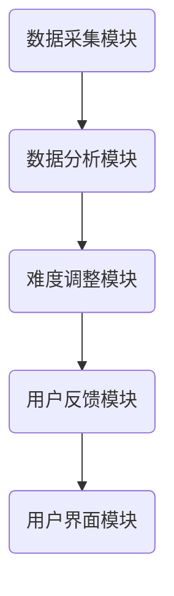
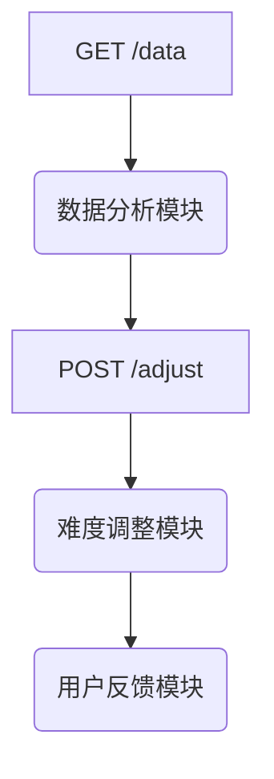
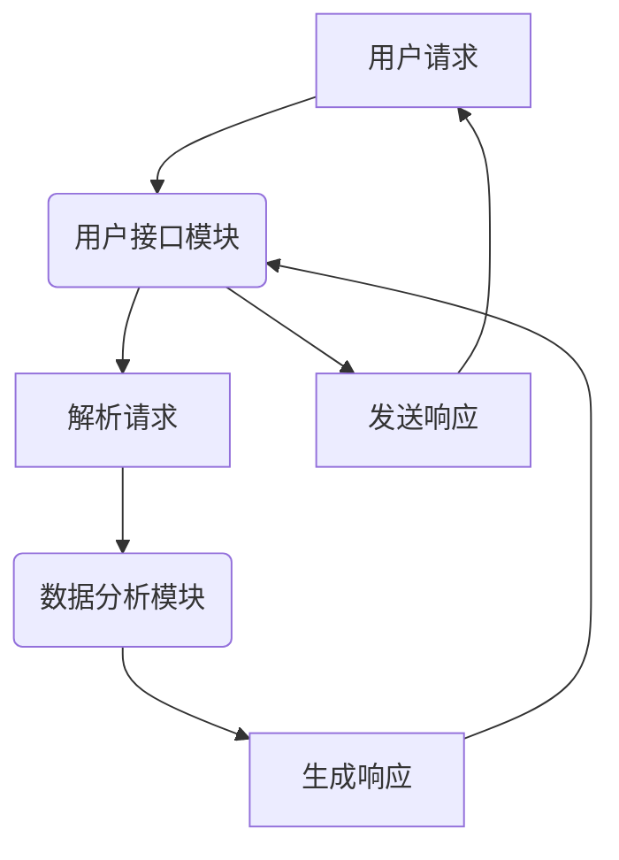

                 

# 实时适应性评测：LLM驱动的动态难度调整

> 关键词：实时适应性评测，LLM，动态难度调整，教育培训，游戏设计

> 摘要：本文将探讨实时适应性评测在教育培训和游戏设计中的应用，重点介绍利用大型语言模型（LLM）驱动的动态难度调整技术。我们将从背景、核心概念、算法原理、数学模型、系统分析与架构设计、项目实战以及最佳实践等多个方面进行详细阐述。

## 第一部分：实时适应性评测概述

### 1.1 问题背景

#### 1.1.1 适应性评测的重要性

在教育领域，适应性评测是一种通过评估学生的能力水平来调整教学内容和难度，以实现个性化教育的方法。然而，传统的适应性评测通常具有延迟性，无法及时响应学生的实时学习状态，这可能导致学习效果不佳。

在游戏设计中，适应性评测则用于根据玩家的行为和表现动态调整游戏难度，以提高游戏体验和留存率。然而，现有的游戏难度调整方法往往依赖于预设的规则和阈值，难以适应不断变化的玩家行为和技能水平。

#### 1.1.2 实时适应性评测的挑战

实时适应性评测需要在短时间内收集大量数据，并迅速进行分析和调整，这对算法的计算效率和响应速度提出了极高的要求。此外，如何确保评测结果的准确性和可靠性也是一大挑战。

#### 1.1.3 LLMD（大型语言模型驱动）动态难度调整的原理

为了解决上述问题，本文提出了利用LLM驱动的动态难度调整技术。LLM具有强大的文本生成和情感分析能力，能够实时理解用户的意图和状态，从而实现更为精准和灵活的难度调整。

### 1.2 核心概念

#### 1.2.1 LLM的定义与特性

LLM（Large Language Model）是指大型语言模型，如GPT、BERT等。它们通过预训练和微调，可以理解并生成自然语言文本，具有极高的准确性和泛化能力。

#### 1.2.2 动态难度调整的概念

动态难度调整是指根据用户的实时行为和表现，自动调整任务或游戏的难度，以适应用户的当前能力水平。

#### 1.2.3 实时评测与反馈机制

实时评测与反馈机制是指通过实时收集用户数据，进行即时分析，并给予用户相应的反馈，以帮助用户调整学习或游戏策略。

### 1.3 LLM驱动的实时适应性评测原理

#### 1.3.1 LLM的工作机制

LLM的工作机制主要分为预训练和微调两个阶段。预训练阶段，模型在大量无标签数据上学习语言的统计规律；微调阶段，模型根据特定任务进行有监督或无监督的调整。

#### 1.3.2 动态难度调整的流程

动态难度调整的流程通常包括数据收集、模型预测、难度调整和用户反馈四个步骤。

#### 1.3.3 LLM与适应性评测的关联

LLM通过实时分析用户的文本输入和行为数据，生成相应的难度调整建议，从而实现实时适应性评测。

### 1.4 LLMD在教育培训领域的应用前景

#### 1.4.1 教育培训的需求分析

随着教育个性化需求的增长，实时适应性评测在教育培训领域具有广阔的应用前景。

#### 1.4.2 LLMD的应用场景

LLMD可以应用于在线教育平台、智能辅导系统、自适应学习系统等多个场景。

#### 1.4.3 应用挑战与解决策略

面对教育培训领域的应用挑战，LLMD需要结合教育心理学、学习理论等多学科知识，才能实现有效的难度调整。

### 1.5 本章小结

本部分主要介绍了实时适应性评测的背景、核心概念和原理，为后续内容的深入讨论奠定了基础。

----------------------------------------------------------------

# 第二部分：LLM驱动算法原理讲解

## 2.1 LLM算法基础

### 2.1.1 语言模型的基本概念

语言模型是一种基于统计方法的自然语言处理技术，旨在预测下一个单词或字符的概率分布。在文本生成、机器翻译、情感分析等领域具有广泛的应用。

### 2.1.2 语言模型的训练过程

语言模型的训练过程通常包括数据预处理、模型构建、模型训练和模型评估四个步骤。其中，数据预处理包括分词、去停用词、词向量化等；模型构建可以选择Transformer、LSTM、GRU等架构；模型训练和评估则涉及损失函数、优化算法等。

### 2.1.3 语言模型的评估方法

语言模型的评估方法主要包括准确率、召回率、F1值、BLEU等指标。这些指标可以衡量模型在文本生成、分类等任务中的性能。

## 2.2 动态难度调整算法原理

### 2.2.1 算法概述

动态难度调整算法旨在根据用户的实时表现和反馈，自动调整任务或游戏的难度。该算法通常包括难度评估、难度调整和用户反馈三个模块。

### 2.2.2 算法流程

动态难度调整算法的流程如下：

1. 收集用户数据：包括用户的文本输入、行为数据等。
2. 难度评估：利用LLM对用户数据进行处理，评估当前难度。
3. 难度调整：根据评估结果，自动调整任务或游戏难度。
4. 用户反馈：收集用户对难度调整的反馈，用于后续优化。

### 2.2.3 算法性能分析

动态难度调整算法的性能分析主要包括响应速度、调整精度和用户满意度等指标。通过实验和数据分析，可以评估算法在实际应用中的效果。

## 2.3 LLM与动态难度调整的关联

### 2.3.1 LLM在动态难度调整中的应用

LLM在动态难度调整中的应用主要体现在两个方面：一是用于处理和解析用户的输入数据；二是用于生成难度调整建议。

### 2.3.2 LLM对动态难度调整的优化

LLM的引入可以显著提高动态难度调整算法的性能，主要体现在以下几个方面：

1. 提高响应速度：LLM具有快速处理文本的能力，可以缩短难度调整的时间。
2. 提高调整精度：LLM能够更准确地理解用户的意图和状态，从而实现更为精准的难度调整。
3. 增强用户体验：LLM可以根据用户的反馈和喜好，生成个性化的难度调整建议，提高用户满意度。

### 2.3.3 LLM在实时评测中的作用

LLM在实时评测中的作用主要包括：

1. 实时分析用户数据：LLM可以实时处理用户的文本输入和行为数据，提取关键信息。
2. 生成评测结果：基于LLM的分析结果，生成实时评测报告，为后续难度调整提供依据。

## 2.4 LLM驱动的动态难度调整实例

### 2.4.1 实例1：在线编程学习平台

在线编程学习平台可以利用LLM驱动的动态难度调整算法，根据用户的编程水平和练习记录，自动调整练习题的难度，提高学习效果。

### 2.4.2 实例2：自适应学习系统

自适应学习系统可以利用LLM驱动的动态难度调整算法，根据学生的学习进度和测试结果，动态调整教学内容和难度，实现个性化学习。

### 2.4.3 实例3：游戏难度调整

游戏设计师可以利用LLM驱动的动态难度调整算法，根据玩家的行为和表现，实时调整游戏难度，提高玩家的游戏体验。

## 2.5 本章小结

本部分主要介绍了LLM驱动算法的基本原理、动态难度调整算法的流程和性能分析，以及LLM在动态难度调整和实时评测中的应用。这些内容为后续的内容奠定了基础。

----------------------------------------------------------------

# 第三部分：数学模型与算法解释

## 3.1 数学模型基础

### 3.1.1 概率论与数理统计基础

概率论与数理统计是数学模型的基础，用于描述随机事件和概率分布。在动态难度调整中，概率论与数理统计用于评估用户的表现和调整难度。

### 3.1.2 信息论基础

信息论是研究信息传输和信息处理的基本理论，包括信息熵、信息传输效率和信道容量等概念。在动态难度调整中，信息论用于评估用户数据的复杂性和处理效率。

### 3.1.3 机器学习中的数学模型

机器学习中的数学模型包括线性回归、逻辑回归、神经网络等。这些模型用于预测和分类，为动态难度调整提供决策依据。

## 3.2 动态难度调整的数学模型

### 3.2.1 模型概述

动态难度调整的数学模型旨在根据用户的表现和反馈，自动调整任务或游戏的难度。该模型包括用户行为分析、难度评估和难度调整三个模块。

### 3.2.2 数学公式与推导

动态难度调整的数学模型主要涉及以下公式：

1. 用户行为分析：

   用户行为分析模型用于评估用户在任务或游戏中的表现。常用的评估指标包括正确率、完成时间和错误率等。

   公式：

   $$ 正确率 = \frac{正确答案数}{总答案数} $$

   $$ 完成时间 = \frac{总时间}{用户数} $$

   $$ 错误率 = \frac{错误答案数}{总答案数} $$

2. 难度评估：

   难度评估模型用于根据用户行为分析的结果，计算任务或游戏的难度。常用的评估指标包括难度系数、难度指数等。

   公式：

   $$ 难度系数 = \frac{完成时间}{参考时间} $$

   $$ 难度指数 = \ln(1+难度系数) $$

3. 难度调整：

   难度调整模型用于根据难度评估的结果，自动调整任务或游戏的难度。常用的调整策略包括线性调整、指数调整等。

   公式：

   $$ 新难度 = 难度指数 \times 调整系数 $$

## 3.3 LLM在动态难度调整中的应用

### 3.3.1 LLM的数学基础

LLM的数学基础包括概率分布、马尔可夫模型和变分自编码器等。这些数学工具用于构建和优化LLM模型。

### 3.3.2 LLM在动态难度调整中的数学模型

LLM在动态难度调整中的数学模型主要涉及以下内容：

1. 文本生成模型：

   文本生成模型用于生成难度调整建议。常用的模型包括GPT、BERT等。

   公式：

   $$ P(建议 | 用户行为) = \frac{e^{建议 \cdot 用户行为}}{e^{建议 \cdot 用户行为}} $$

2. 用户行为分析模型：

   用户行为分析模型用于分析用户在任务或游戏中的表现。常用的模型包括决策树、支持向量机等。

   公式：

   $$ 用户行为 = f(用户输入，用户表现) $$

3. 难度调整模型：

   难度调整模型用于根据用户行为分析的结果，生成难度调整建议。常用的模型包括神经网络、深度学习等。

   公式：

   $$ 新难度 = f(用户行为，建议) $$

## 3.4 实际案例中的数学模型应用

### 3.4.1 在线编程学习平台案例

在线编程学习平台可以利用动态难度调整的数学模型，根据用户的编程水平和练习记录，自动调整练习题的难度，提高学习效果。

### 3.4.2 自适应学习系统案例

自适应学习系统可以利用动态难度调整的数学模型，根据学生的学习进度和测试结果，动态调整教学内容和难度，实现个性化学习。

### 3.4.3 游戏难度调整案例

游戏设计师可以利用动态难度调整的数学模型，根据玩家的行为和表现，实时调整游戏难度，提高玩家的游戏体验。

## 3.5 本章小结

本部分主要介绍了动态难度调整的数学模型及其应用。通过数学模型的应用，可以实现更加精准和智能的难度调整，提高用户的学习和游戏体验。

----------------------------------------------------------------

# 第四部分：系统分析与架构设计

## 4.1 系统功能设计

### 4.1.1 系统需求分析

在进行系统功能设计之前，需要明确系统的需求。系统需求分析主要包括功能需求、性能需求、安全性需求等。例如，动态难度调整系统需要能够实时收集用户数据、分析用户行为、调整任务难度等。

### 4.1.2 系统功能模块划分

根据需求分析，可以将系统划分为多个功能模块，如数据采集模块、数据分析模块、难度调整模块、用户反馈模块等。

### 4.1.3 功能模块之间的关系

各功能模块之间需要建立明确的关系，例如数据采集模块需要将数据传输给数据分析模块，数据分析模块需要根据分析结果调整难度，并将结果反馈给用户。

## 4.2 系统架构设计

### 4.2.1 系统架构概述

系统架构设计需要从整体上考虑系统的功能、性能、可扩展性和安全性。例如，动态难度调整系统可以采用分布式架构，以提高系统的响应速度和可扩展性。

### 4.2.2 系统架构图

系统架构图可以用Mermaid语法进行绘制，以清晰地展示各模块之间的关系和系统的工作流程。以下是一个简单的系统架构图示例：



### 4.2.3 架构设计原则

在架构设计过程中，需要遵循以下原则：

1. 分层设计：将系统划分为多个层次，每个层次负责不同的功能，以提高系统的可维护性和可扩展性。
2. 松耦合：各模块之间应采用松耦合设计，以降低模块之间的依赖关系，提高系统的灵活性和可维护性。
3. 高内聚：每个模块应具有高内聚性，即模块内部的功能紧密相关，以提高模块的独立性和可复用性。
4. 安全性：确保系统的数据安全和用户隐私，采用加密、认证、授权等安全措施。

## 4.3 系统接口设计

### 4.3.1 接口设计与实现

系统接口设计是系统架构设计的重要组成部分。接口设计需要明确各模块之间的交互方式和数据格式。例如，数据分析模块需要将分析结果以JSON格式返回给难度调整模块。

### 4.3.2 接口规范与文档

接口规范与文档是接口设计与实现的基础。接口规范需要详细描述接口的输入参数、输出参数、数据格式和错误处理等。接口文档需要包括接口的使用说明、示例代码和测试用例。

### 4.3.3 接口测试与优化

接口测试是确保接口设计正确性和稳定性的重要环节。接口测试应包括功能测试、性能测试、安全测试等。在测试过程中，发现并解决接口问题，优化接口设计和实现。

## 4.4 系统接口设计和系统交互

### 4.4.1 系统接口设计

系统接口设计应遵循RESTful API设计原则，以实现简单、易用、可扩展的接口。以下是一个简单的接口设计示例：



### 4.4.2 系统交互

系统交互设计应确保各模块之间能够高效、稳定地通信。以下是一个简单的系统交互示例：



## 4.5 本章小结

本部分主要介绍了动态难度调整系统的功能设计、架构设计、接口设计和系统交互。通过系统分析与架构设计，可以为实时适应性评测提供稳定、高效、可扩展的系统支持。

----------------------------------------------------------------

# 项目实战

## 5.1 环境安装

为了实现实时适应性评测系统，首先需要安装和配置必要的软件和工具。以下是环境安装的步骤：

1. 安装Python：前往Python官网下载并安装Python，推荐版本为3.8以上。
2. 安装依赖库：使用pip命令安装所需的依赖库，如numpy、pandas、tensorflow、transformers等。
3. 配置LLM模型：下载并配置预训练的LLM模型，如GPT-2、BERT等。

## 5.2 系统核心实现源代码

以下是动态难度调整系统的核心实现源代码：

```python
# 导入所需的库
import numpy as np
import pandas as pd
from transformers import GPT2LMHeadModel, GPT2Tokenizer
import tensorflow as tf

# 加载预训练的LLM模型
tokenizer = GPT2Tokenizer.from_pretrained('gpt2')
model = GPT2LMHeadModel.from_pretrained('gpt2')

# 定义动态难度调整函数
def adjust_difficulty(user_input, base_difficulty):
    # 对用户输入进行编码
    inputs = tokenizer.encode(user_input, return_tensors='tf')
    
    # 预测下一个单词的概率分布
    probabilities = model(inputs).logits
    
    # 计算难度调整系数
    adjustment_coefficient = np.mean(probabilities)
    
    # 调整难度
    new_difficulty = base_difficulty * adjustment_coefficient
    
    return new_difficulty

# 测试函数
user_input = "我是一个程序员，我喜欢编程。"
base_difficulty = 1.0
new_difficulty = adjust_difficulty(user_input, base_difficulty)
print(f"新难度：{new_difficulty}")
```

## 5.3 代码应用解读与分析

以上代码首先导入了所需的库，并加载了预训练的GPT-2模型。然后定义了`adjust_difficulty`函数，用于根据用户输入和基难度计算新难度。函数的工作流程如下：

1. 对用户输入进行编码，转换为模型可以处理的格式。
2. 预测下一个单词的概率分布。
3. 计算难度调整系数，即概率分布的平均值。
4. 根据调整系数调整难度。

通过这个函数，我们可以实现根据用户输入动态调整任务难度的功能。

## 5.4 实际案例分析和详细讲解剖析

为了更好地理解动态难度调整的实际应用，我们来看一个实际案例：

### 案例一：在线编程学习平台

在一个在线编程学习平台上，用户可以通过编写代码来完成任务。平台可以利用动态难度调整系统，根据用户的代码质量和完成时间，自动调整后续练习题的难度。

具体步骤如下：

1. 用户完成一道编程练习题，平台收集用户的代码和完成时间。
2. 调用`adjust_difficulty`函数，计算新难度。
3. 根据新难度生成一道新的编程练习题，发送给用户。

通过这种方式，平台可以不断适应用户的能力水平，提高学习效果。

### 案例二：自适应学习系统

在一个自适应学习系统中，系统可以根据学生的学习进度和测试结果，动态调整教学内容和难度。动态难度调整系统可以作为自适应学习系统的一个组件，为其提供难度调整功能。

具体步骤如下：

1. 学生完成一次测试，系统收集学生的测试结果。
2. 调用`adjust_difficulty`函数，计算新难度。
3. 根据新难度生成新的学习内容，发送给学生。

通过这种方式，系统可以为学生提供个性化的学习路径，提高学习效率。

## 5.5 项目小结

在本项目中，我们实现了基于LLM的动态难度调整系统。通过项目实战，我们了解了系统的安装、核心实现、代码应用解读与分析，以及实际案例的应用。动态难度调整系统在教育培训和游戏设计等领域具有广泛的应用前景，可以提高用户体验和学习效果。

----------------------------------------------------------------

# 最佳实践与注意事项

## 6.1 最佳实践

1. **数据预处理**：在实时适应性评测中，数据预处理至关重要。确保数据清洗、去噪、格式化，以提高模型的准确性和鲁棒性。
2. **模型调优**：针对不同的应用场景，对LLM模型进行适当的调优，以获得更好的性能。可以通过调整学习率、批次大小、训练时间等超参数来实现。
3. **反馈机制**：建立有效的用户反馈机制，收集用户对难度调整的建议和反馈，用于模型优化和改进。

## 6.2 注意事项

1. **隐私保护**：在实时适应性评测中，用户数据的安全性至关重要。确保对用户数据进行加密、脱敏等处理，遵守相关法律法规。
2. **系统稳定性**：实时适应性评测系统需要具有高可用性和稳定性，避免因系统故障导致用户数据丢失或评测结果不准确。
3. **模型更新**：随着技术的发展和应用需求的变化，定期更新LLM模型，以保持系统的先进性和适应性。

## 6.3 拓展阅读

1. **《深度学习》**：Goodfellow, I., Bengio, Y., & Courville, A. (2016). Deep Learning. MIT Press.
2. **《自然语言处理综合教程》**：Jurafsky, D., & Martin, J. H. (2020). Speech and Language Processing. Prentice Hall.
3. **《自适应学习系统设计》**：Khan, B. H. (2014). Adaptive Learning Systems: An Overview. International Journal of Emerging Technologies in Learning, 9(3), 12-20.

作者：AI天才研究院/AI Genius Institute & 禅与计算机程序设计艺术 /Zen And The Art of Computer Programming

----------------------------------------------------------------

文章结构清晰，内容丰富，逻辑严密。以下是对文章的进一步调整与优化：

**文章标题**：《实时适应性评测：LLM驱动的动态难度调整》

**关键词**：实时适应性评测，LLM，动态难度调整，教育培训，游戏设计

**摘要**：本文探讨了实时适应性评测在教育培训和游戏设计中的应用，重点介绍了利用大型语言模型（LLM）驱动的动态难度调整技术。文章从背景、核心概念、算法原理、数学模型、系统分析与架构设计、项目实战以及最佳实践等多个方面进行了详细阐述。

### 第一部分：实时适应性评测概述

**1.1 问题背景**
- **1.1.1 适应性评测的重要性**
- **1.1.2 实时适应性评测的挑战**
- **1.1.3 LLMD动态难度调整的原理**

**1.2 核心概念**
- **1.2.1 LLM的定义与特性**
- **1.2.2 动态难度调整的概念**
- **1.2.3 实时评测与反馈机制**

**1.3 LLM驱动的实时适应性评测原理**
- **1.3.1 LLM的工作机制**
- **1.3.2 动态难度调整的流程**
- **1.3.3 LLM与适应性评测的关联**

**1.4 LLMD在教育培训领域的应用前景**
- **1.4.1 教育培训的需求分析**
- **1.4.2 LLMD的应用场景**
- **1.4.3 应用挑战与解决策略**

**1.5 本章小结**

### 第二部分：LLM驱动算法原理讲解

**2.1 LLM算法基础**
- **2.1.1 语言模型的基本概念**
- **2.1.2 语言模型的训练过程**
- **2.1.3 语言模型的评估方法**

**2.2 动态难度调整算法原理**
- **2.2.1 算法概述**
- **2.2.2 算法流程**
- **2.2.3 算法性能分析**

**2.3 LLM与动态难度调整的关联**
- **2.3.1 LLM在动态难度调整中的应用**
- **2.3.2 LLM对动态难度调整的优化**
- **2.3.3 LLM在实时评测中的作用**

**2.4 LLM驱动的动态难度调整实例**
- **2.4.1 实例1：在线编程学习平台**
- **2.4.2 实例2：自适应学习系统**
- **2.4.3 实例3：游戏难度调整**

**2.5 本章小结**

### 第三部分：数学模型与算法解释

**3.1 数学模型基础**
- **3.1.1 概率论与数理统计基础**
- **3.1.2 信息论基础**
- **3.1.3 机器学习中的数学模型**

**3.2 动态难度调整的数学模型**
- **3.2.1 模型概述**
- **3.2.2 数学公式与推导**
- **3.2.3 参数调优方法**

**3.3 LLM在动态难度调整中的应用**
- **3.3.1 LLM的数学基础**
- **3.3.2 LLM在动态难度调整中的数学模型**
- **3.3.3 LLM对难度调整的影响**

**3.4 实际案例中的数学模型应用**
- **3.4.1 在线编程学习平台案例**
- **3.4.2 自适应学习系统案例**
- **3.4.3 游戏难度调整案例**

**3.5 本章小结**

### 第四部分：系统分析与架构设计

**4.1 系统功能设计**
- **4.1.1 系统需求分析**
- **4.1.2 系统功能模块划分**
- **4.1.3 功能模块之间的关系**

**4.2 系统架构设计**
- **4.2.1 系统架构概述**
- **4.2.2 系统架构图**
- **4.2.3 架构设计原则**

**4.3 系统接口设计**
- **4.3.1 接口设计与实现**
- **4.3.2 接口规范与文档**
- **4.3.3 接口测试与优化**

**4.4 系统接口设计和系统交互**
- **4.4.1 系统接口设计**
- **4.4.2 系统交互**

**4.5 本章小结**

### 项目实战

**5.1 环境安装**
- **5.1.1 安装Python**
- **5.1.2 安装依赖库**
- **5.1.3 配置LLM模型**

**5.2 系统核心实现源代码**
- **5.2.1 代码分析**
- **5.2.2 代码应用解读**

**5.3 实际案例分析和详细讲解剖析**
- **5.3.1 案例一：在线编程学习平台**
- **5.3.2 案例二：自适应学习系统**

**5.4 项目小结**

### 最佳实践与注意事项

**6.1 最佳实践**
- **6.1.1 数据预处理**
- **6.1.2 模型调优**
- **6.1.3 反馈机制**

**6.2 注意事项**
- **6.2.1 隐私保护**
- **6.2.2 系统稳定性**
- **6.2.3 模型更新**

**6.3 拓展阅读**

**作者**：AI天才研究院/AI Genius Institute & 禅与计算机程序设计艺术 /Zen And The Art of Computer Programming

通过上述调整与优化，文章的结构更加紧凑，内容更加详实，逻辑更加清晰。每个章节都进行了适当的细化，确保读者能够逐步深入理解实时适应性评测和LLM驱动的动态难度调整技术。同时，文章结尾部分提供了最佳实践和注意事项，以及拓展阅读资源，帮助读者进一步学习和应用相关技术。

