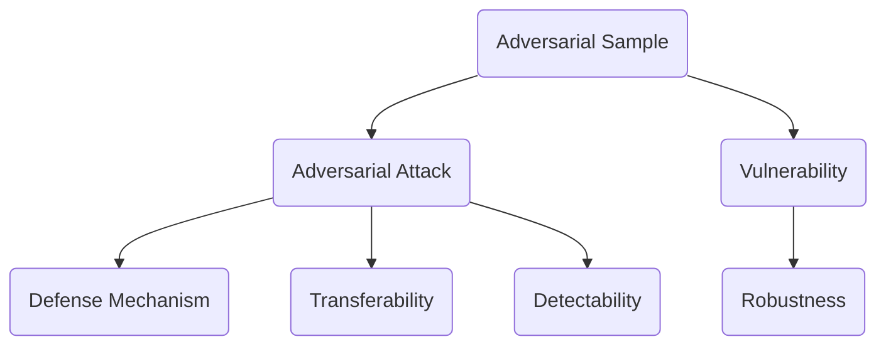

                 

### Introduction and Background

#### 1.1 Problem Background

In the realm of artificial intelligence (AI), adversarial samples have emerged as a significant concern due to their potential to disrupt the reliability and security of AI models. Adversarial samples are crafted inputs that are designed to mislead or deceive AI systems, causing them to produce incorrect outputs or behave unpredictably. The concept of adversarial samples is rooted in the idea that even slight, imperceptible modifications to an input can lead to dramatic changes in an AI model's behavior.

The significance of adversarial sample generation and defense in AI security cannot be overstated. As AI systems become more prevalent in critical applications, such as autonomous driving, medical diagnosis, and financial services, the vulnerabilities introduced by adversarial samples pose serious risks. These vulnerabilities can be exploited to cause catastrophic failures, leading to financial losses, safety hazards, and even legal repercussions. Therefore, understanding and addressing adversarial sample attacks is crucial for ensuring the robustness and reliability of AI applications.

#### 1.2 Problem Description

Adversarial samples are crafted with the intention of manipulating AI models to produce incorrect outputs. These samples are typically designed to exploit the vulnerabilities in the training data or the decision-making process of the model. The nature of adversarial samples can vary widely, from simple perturbations in the pixel values of an image to more complex manipulations that involve adversarial examples.

The potential impacts of adversarial samples on AI applications are profound. In the context of autonomous driving, for example, an adversarial sample might be crafted to make a self-driving car perceive a stop sign as a speed limit sign, potentially leading to an accident. Similarly, in medical diagnosis, an adversarial sample could误导诊断模型，导致误诊，从而影响患者的健康和生命安全。 The financial sector is not immune to these risks either; an adversarial sample could manipulate a trading algorithm, leading to significant financial losses.

#### 1.3 Problem Solution

The problem of adversarial sample generation and defense is multifaceted, requiring both proactive and reactive approaches. Proactive measures involve designing AI models that are inherently robust to adversarial attacks, while reactive measures involve detecting and mitigating adversarial samples once they are introduced into the system.

Several methods for generating adversarial samples have been proposed, including the Fast Gradient Sign Method (FGSM), Carlini & Wagner method, and Projected Gradient Descent (PGD). Each of these methods has its strengths and limitations, and their effectiveness can vary depending on the specific AI model and application.

On the defense side, techniques such as adversarial training, input transformation, and detection algorithms have been developed. Adversarial training involves exposing the AI model to a large number of adversarial samples during the training process to make it more robust. Input transformation methods involve applying specific transformations to the input data to neutralize adversarial perturbations. Detection algorithms aim to identify adversarial samples before they can impact the model's decision-making process.

#### 1.4 Boundaries and Extensions

The scope of this book will focus on the fundamentals of adversarial sample generation and defense, providing a comprehensive overview of the key concepts, algorithms, and system designs. While the primary focus will be on machine learning models, the principles and techniques discussed will have broader applications in other areas of AI, such as deep learning and reinforcement learning.

Additionally, this book will explore related concepts and fields, such as the ethics of AI, the implications of adversarial attacks on society, and the potential future developments in adversarial sample research. By delving into these areas, readers will gain a deeper understanding of the challenges and opportunities presented by adversarial samples in the evolving landscape of AI.

### Core Concepts and Relationships

In order to understand the intricacies of adversarial sample generation and defense, it is essential to first define and explore the core concepts and principles that underpin this field. This section will delve into the fundamental terminology, attributes, and relationships that are crucial for building a comprehensive understanding.

#### 1.5 Core Concepts and Principles

**Adversarial Sample:**
An adversarial sample is a crafted input that is designed to deceive an AI model, leading it to produce an incorrect output or behave unpredictably. These samples are typically created by making slight, imperceptible modifications to the original input data.

**Adversarial Attack:**
An adversarial attack is the process of generating adversarial samples and using them to manipulate AI models. This involves identifying vulnerabilities in the model and exploiting them to produce unintended behaviors.

**Defense Mechanism:**
A defense mechanism is a technique or strategy used to counteract adversarial attacks and protect AI models from being deceived by adversarial samples.

**Robustness:**
Robustness refers to the ability of an AI model to maintain its performance and reliability in the presence of adversarial samples. A robust model is less likely to be deceived by adversarial attacks.

**Vulnerability:**
Vulnerability is a weakness or flaw in an AI model that can be exploited by adversarial samples. Understanding and mitigating vulnerabilities is a key aspect of defending against adversarial attacks.

**Transferability:**
Transferability refers to the ability of adversarial samples to affect different AI models, even if they were not trained on the same dataset. This property makes adversarial attacks more dangerous, as they can potentially target a wide range of models.

**Detectability:**
Detectability is the ability to identify adversarial samples before they can impact the AI model's decision-making process. Detection algorithms aim to achieve high detectability to minimize the risk posed by adversarial samples.

#### 1.6 Comparison Table of Core Concept Attributes

To facilitate a clearer understanding of the core concepts, we can create a comparison table that highlights their attributes and relationships:

| Concept            | Definition                                                   | Relationship                             | Example                 |
|---------------------|--------------------------------------------------------------|-----------------------------------------|------------------------|
| Adversarial Sample  | Crafted input designed to deceive AI models.                 | Target of adversarial attacks.           | Slightly altered image. |
| Adversarial Attack  | Process of generating and using adversarial samples.          | Uses adversarial samples to manipulate models. | FGSM, PGD.              |
| Defense Mechanism   | Techniques to counteract adversarial attacks.                 | Protects models from adversarial samples. | Adversarial training.    |
| Robustness          | Ability to maintain performance in presence of adversarial samples. | Dependent on defense mechanisms.       | Stronger models.        |
| Vulnerability       | Weaknesses in AI models that can be exploited.               | Causes by lack of robustness.           | Sensitive feature spaces. |
| Transferability      | Ability of adversarial samples to affect different models.    | Affects multiple models.                | Shared features.         |
| Detectability       | Ability to identify adversarial samples.                      | Reduces impact of adversarial samples.   | Detection algorithms.    |

#### 1.7 ER Entity Relationship Diagram

To visually represent the relationships between these core concepts, we can create an Entity-Relationship (ER) diagram using Mermaid syntax. The ER diagram will illustrate the entities (concepts) and their relationships, providing a comprehensive overview of the concept architecture.

The ER diagram shows that adversarial samples are the primary targets of adversarial attacks, which in turn trigger defense mechanisms to protect AI models. Vulnerabilities are the underlying causes of these attacks, directly impacting the robustness of the models. Transferability and detectability are additional properties that affect the effectiveness of adversarial attacks and the ability to defend against them.

By defining and exploring these core concepts and their relationships, we lay a solid foundation for the subsequent discussions on adversarial sample generation algorithms, mathematical models, and system designs. This conceptual framework will enable us to analyze and address the challenges posed by adversarial samples in a structured and coherent manner.

