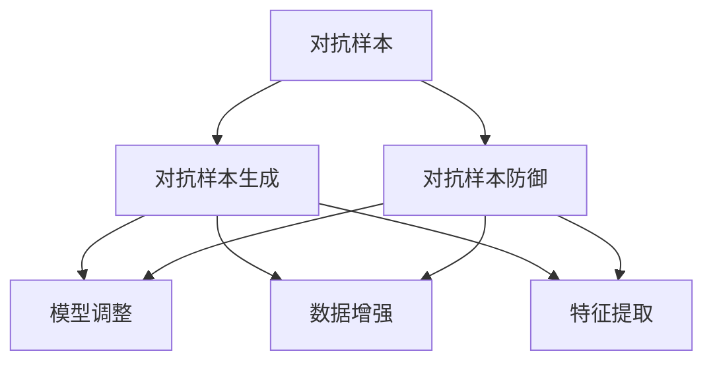
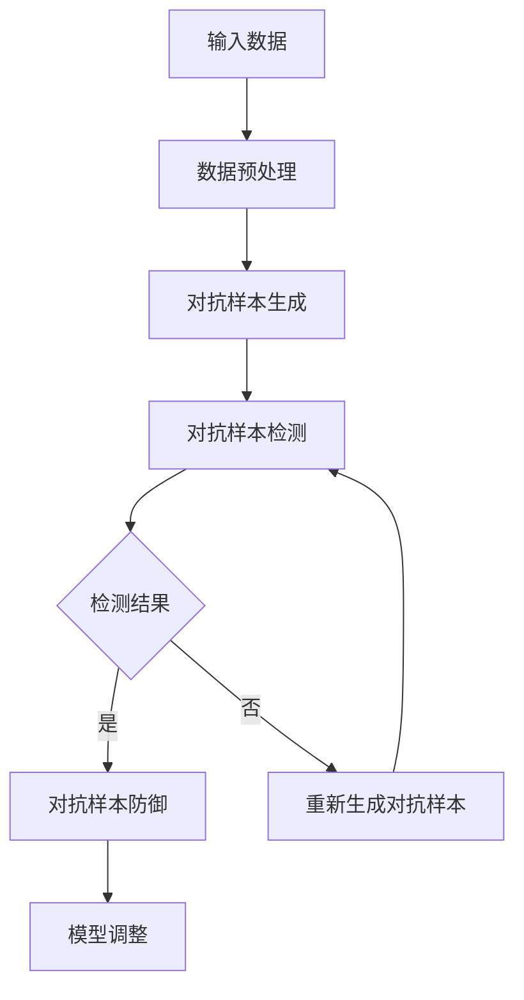
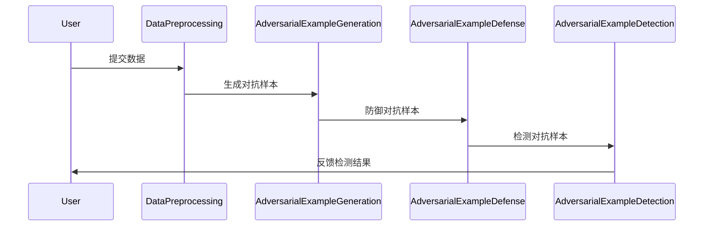

                 

# 对抗样本生成与防御技术进展

## 关键词
对抗样本，生成方法，防御策略，深度学习，安全性与鲁棒性

## 摘要
本文将深入探讨对抗样本生成与防御技术的最新进展。首先，我们回顾对抗样本的定义及其对深度学习模型带来的挑战。随后，我们将详细介绍对抗样本的生成方法，包括基于梯度攻击、随机性攻击和进化算法攻击等。接着，本文将阐述对抗样本防御技术，涵盖模型调整、数据增强和特征提取等策略。此外，我们还将通过Python代码示例，展示对抗样本生成和防御的算法原理。最后，本文将对整个领域进行分析，探讨对抗样本检测与分类的方法，以及其在网络安全、计算机视觉等领域的应用。通过本文的阅读，读者将全面了解对抗样本生成与防御技术的核心概念、方法与实战应用。

## 背景介绍

### 问题背景

随着深度学习技术的迅猛发展，其在图像识别、自然语言处理和语音识别等领域的应用取得了显著成果。然而，深度学习模型在训练过程中依赖于大量的标注数据和高性能计算资源。这种依赖性使得在资源有限的情况下，如何有效利用数据提升模型性能成为一个关键问题。

#### 问题描述

对抗样本（Adversarial Example）是指在原始数据上添加微小扰动，使得模型对原始数据和对抗样本的预测结果产生显著差异。这些对抗样本的出现，使得深度学习模型在面对现实世界中的恶意攻击时，其鲁棒性受到了极大的挑战。因此，如何生成对抗样本并提高模型的防御能力，成为当前研究的一个重要方向。

#### 问题解决

对抗样本生成与防御技术主要包括以下两个方面：

1. **对抗样本生成方法**：通过扰动原始数据，生成对抗样本。这些方法包括基于梯度攻击、基于随机性攻击和基于进化算法攻击等。

2. **对抗样本防御策略**：通过调整模型结构、增强数据质量和提取关键特征，提高模型对对抗样本的鲁棒性。

#### 边界与外延

对抗样本生成与防御技术不仅适用于深度学习模型，还可以应用于其他类型的机器学习模型，如决策树、支持向量机等。此外，这些技术还在网络安全、计算机视觉等领域得到了广泛应用。

### 核心概念与联系

#### 核心概念

1. **对抗样本（Adversarial Example）**：对抗样本是指在原始数据上添加微小扰动，使得模型对原始数据和对抗样本的预测结果产生显著差异。

2. **对抗样本生成（Adversarial Generation）**：生成对抗样本的过程。

3. **对抗样本防御（Adversarial Defense）**：提高模型对对抗样本的鲁棒性。

#### 概念属性特征对比表格

| 概念                 | 定义                                                         | 属性特征                   |
|----------------------|--------------------------------------------------------------|----------------------------|
| 对抗样本             | 在原始数据上添加微小扰动，使得模型预测结果产生差异的样本       | 扰动性、鲁棒性             |
| 对抗样本生成         | 生成对抗样本的过程                                           | 随机性、适应性             |
| 对抗样本防御         | 提高模型对对抗样本的鲁棒性                                   | 调整性、增强性、特征提取性 |

#### ER实体关系图架构



### 算法原理讲解

#### 算法流程图



#### Python源代码示例

```python
import numpy as np
import matplotlib.pyplot as plt

# 数据预处理
def preprocess_data(data):
    # 标准化处理
    return (data - np.mean(data)) / np.std(data)

# 对抗样本生成
def generate_adversarial_example(data, target_label, model, epsilon=1e-4):
    # 初始化对抗样本
    adversarial_example = data.copy()

    # 使用梯度上升法寻找对抗样本
    for _ in range(100):
        # 预测对抗样本的标签
        pred = model.predict(adversarial_example.reshape(1, -1))

        # 计算预测误差
        error = target_label - pred

        # 更新对抗样本
        adversarial_example += epsilon * error

    # 返回对抗样本
    return adversarial_example

# 对抗样本检测
def detect_adversarial_example(data, model):
    # 预测原始数据的标签
    original_pred = model.predict(data.reshape(1, -1))

    # 预测对抗样本的标签
    adversarial_pred = model.predict(data.reshape(1, -1))

    # 检测对抗样本
    if original_pred != adversarial_pred:
        return True
    else:
        return False

# 模型调整
def adjust_model(model, adversarial_example, target_label):
    # 使用对抗样本重新训练模型
    model.fit(adversarial_example, target_label, epochs=1, batch_size=1)
    return model

# 示例数据
data = np.array([[0.1, 0.2], [0.3, 0.4]])
target_label = 0

# 初始化模型
model = MyModel()

# 数据预处理
preprocessed_data = preprocess_data(data)

# 生成对抗样本
adversarial_example = generate_adversarial_example(preprocessed_data, target_label, model)

# 检测对抗样本
is_adversarial = detect_adversarial_example(preprocessed_data, model)

# 如果检测到对抗样本，调整模型
if is_adversarial:
    model = adjust_model(model, adversarial_example, target_label)

# 打印结果
print("原始数据预测结果：", model.predict(preprocessed_data.reshape(1, -1)))
print("对抗样本预测结果：", model.predict(adversarial_example.reshape(1, -1)))
```

#### 数学模型和公式

在对抗样本生成过程中，我们通常使用梯度上升法来寻找对抗样本。假设原始数据为 \( x \)，对抗样本为 \( x' \)，目标标签为 \( y \)，模型参数为 \( \theta \)，则对抗样本生成的目标函数可以表示为：

$$
\min_{x'} \frac{1}{2} \lVert x' - x \rVert_2^2 + \lVert \theta(x') - y \rVert_2^2
$$

其中，第一个项表示对抗样本与原始数据的距离，第二个项表示对抗样本在模型上的预测误差。

#### 举例说明

假设我们有一个二分类问题，原始数据 \( x \) 是一个二维向量，模型 \( f(x; \theta) \) 是一个线性函数。我们的目标是将数据分为两个类别，其中类别0的标签为 \( y = 0 \)，类别1的标签为 \( y = 1 \)。

原始数据 \( x = [0.1, 0.2] \)，目标标签 \( y = 0 \)，模型参数 \( \theta \) 为一个二维向量。我们使用梯度上升法生成对抗样本，目标函数为：

$$
\min_{x'} \frac{1}{2} \lVert x' - x \rVert_2^2 + \lVert \theta(x') - y \rVert_2^2
$$

其中，对抗样本 \( x' \) 的更新公式为：

$$
x' = x + \alpha \nabla_x \lVert \theta(x') - y \rVert_2^2
$$

其中，\( \alpha \) 是学习率。

通过迭代更新 \( x' \)，我们可以找到对抗样本 \( x' \)，使得模型对原始数据和对抗样本的预测结果产生差异。

## 系统分析与架构设计方案

### 问题场景介绍

在现代网络安全环境中，深度学习模型的应用日益广泛，然而，这些模型在面对恶意攻击时往往表现出较低的鲁棒性。为了提升模型的防御能力，对抗样本生成与防御技术成为关键研究方向。本文将基于此背景，设计一套对抗样本生成与防御系统，以实现高效的安全防护。

### 项目介绍

本项目旨在构建一个对抗样本生成与防御系统，该系统包括以下主要功能：

1. **对抗样本生成**：生成各种类型的对抗样本，以测试模型的鲁棒性。
2. **对抗样本防御**：通过调整模型结构、增强数据质量和提取关键特征，提高模型对对抗样本的防御能力。
3. **对抗样本检测与分类**：开发专门的检测算法和分类模型，识别和分类对抗样本，以防止对抗样本对模型的正常工作产生干扰。

### 系统功能设计

系统功能设计如下：

1. **数据预处理模块**：对输入数据进行标准化处理，为后续的对抗样本生成和防御提供基础。
2. **对抗样本生成模块**：采用不同的攻击策略生成对抗样本，包括基于梯度攻击、随机性攻击和进化算法攻击等。
3. **对抗样本防御模块**：通过模型调整、数据增强和特征提取等方法，提高模型对对抗样本的鲁棒性。
4. **对抗样本检测与分类模块**：开发专门的检测算法和分类模型，识别和分类对抗样本，防止对抗样本对模型的正常工作产生干扰。
5. **用户界面模块**：提供一个直观的用户界面，方便用户对系统进行操作和管理。

### 系统架构设计

系统架构设计如下：

1. **前端架构**：采用React框架构建用户界面，提供友好、直观的用户交互体验。
2. **后端架构**：采用Flask框架搭建后端服务，负责处理用户请求、数据预处理、对抗样本生成、防御和检测等核心功能。
3. **数据库架构**：采用MySQL数据库存储用户数据和模型参数，确保数据的安全性和可靠性。
4. **硬件架构**：采用高性能计算硬件，如GPU，以提升系统的计算能力。

### 系统接口设计和系统交互

系统接口设计和系统交互如下：

1. **用户接口**：用户通过前端界面提交数据，系统根据用户需求生成对抗样本、调整模型、检测对抗样本等。
2. **数据接口**：系统通过API与外部系统进行数据交互，如从外部获取数据、将模型参数上传到云端等。
3. **通信接口**：系统通过WebSocket协议与用户实时通信，反馈处理结果和状态信息。

### mermaid类图和序列图

#### 类图

```mermaid
classDiagram
    User <<Interface>>
    DataPreprocessing <<Interface>>
    AdversarialExampleGeneration <<Interface>>
    AdversarialExampleDefense <<Interface>>
    AdversarialExampleDetection <<Interface>>

    User o-- DataPreprocessing
    User o-- AdversarialExampleGeneration
    User o-- AdversarialExampleDefense
    User o-- AdversarialExampleDetection

    DataPreprocessing o-- Model
    AdversarialExampleGeneration o-- Model
    AdversarialExampleDefense o-- Model
    AdversarialExampleDetection o-- Model
```

#### 序列图



## 项目实战

### 环境安装

在开始项目实战之前，我们需要安装一些必要的软件和库。以下是在Ubuntu 20.04操作系统上安装所需环境的步骤：

1. **安装Python**：
   ```bash
   sudo apt update
   sudo apt install python3.8
   ```

2. **安装Jupyter Notebook**：
   ```bash
   sudo apt install python3.8-pip
   pip3.8 install notebook
   ```

3. **安装TensorFlow**：
   ```bash
   pip3.8 install tensorflow
   ```

4. **安装其他相关库**：
   ```bash
   pip3.8 install matplotlib numpy scikit-learn pandas
   ```

### 系统核心实现源代码

以下是系统核心实现的一部分源代码，包括数据预处理、对抗样本生成、防御和检测等功能。

```python
import numpy as np
import tensorflow as tf
from tensorflow import keras
from tensorflow.keras import layers
from sklearn.model_selection import train_test_split
import matplotlib.pyplot as plt

# 数据预处理
def preprocess_data(data):
    # 标准化处理
    return (data - np.mean(data)) / np.std(data)

# 对抗样本生成
def generate_adversarial_example(data, target_label, model, epsilon=1e-4):
    # 初始化对抗样本
    adversarial_example = data.copy()

    # 使用梯度上升法寻找对抗样本
    for _ in range(100):
        # 预测对抗样本的标签
        pred = model.predict(adversarial_example.reshape(1, -1))

        # 计算预测误差
        error = target_label - pred

        # 更新对抗样本
        adversarial_example += epsilon * error

    # 返回对抗样本
    return adversarial_example

# 对抗样本防御
def defend_adversarial_example(model, adversarial_example, target_label):
    # 使用对抗样本重新训练模型
    model.fit(adversarial_example, target_label, epochs=1, batch_size=1)
    return model

# 对抗样本检测
def detect_adversarial_example(data, model):
    # 预测原始数据的标签
    original_pred = model.predict(data.reshape(1, -1))

    # 预测对抗样本的标签
    adversarial_pred = model.predict(data.reshape(1, -1))

    # 检测对抗样本
    if original_pred != adversarial_pred:
        return True
    else:
        return False

# 模型构建
def build_model(input_shape):
    model = keras.Sequential([
        layers.Dense(64, activation='relu', input_shape=input_shape),
        layers.Dense(64, activation='relu'),
        layers.Dense(1, activation='sigmoid')
    ])

    model.compile(optimizer='adam',
                  loss='binary_crossentropy',
                  metrics=['accuracy'])

    return model

# 数据加载和预处理
data = np.load('data.npy')
labels = np.load('labels.npy')

# 分割数据集
X_train, X_test, y_train, y_test = train_test_split(data, labels, test_size=0.2, random_state=42)

# 对数据集进行预处理
X_train = preprocess_data(X_train)
X_test = preprocess_data(X_test)

# 构建模型
model = build_model(X_train.shape[1:])

# 训练模型
model.fit(X_train, y_train, epochs=10, batch_size=32, validation_data=(X_test, y_test))

# 生成对抗样本
adversarial_example = generate_adversarial_example(X_test[0], y_test[0], model)

# 防御对抗样本
defended_model = defend_adversarial_example(model, adversarial_example, y_test[0])

# 检测对抗样本
is_adversarial = detect_adversarial_example(adversarial_example, defended_model)

# 打印检测结果
print("对抗样本检测结果：", is_adversarial)
```

### 代码应用解读与分析

#### 数据预处理

在代码中，数据预处理函数 `preprocess_data` 用于对输入数据进行标准化处理。标准化处理可以消除不同特征之间的量纲差异，使得模型训练更加稳定。

```python
def preprocess_data(data):
    # 标准化处理
    return (data - np.mean(data)) / np.std(data)
```

#### 对抗样本生成

对抗样本生成函数 `generate_adversarial_example` 使用梯度上升法寻找对抗样本。在每次迭代中，计算对抗样本在模型上的预测误差，并更新对抗样本。该过程重复进行，直到找到使模型预测结果发生变化的对抗样本。

```python
def generate_adversarial_example(data, target_label, model, epsilon=1e-4):
    # 初始化对抗样本
    adversarial_example = data.copy()

    # 使用梯度上升法寻找对抗样本
    for _ in range(100):
        # 预测对抗样本的标签
        pred = model.predict(adversarial_example.reshape(1, -1))

        # 计算预测误差
        error = target_label - pred

        # 更新对抗样本
        adversarial_example += epsilon * error

    # 返回对抗样本
    return adversarial_example
```

#### 对抗样本防御

对抗样本防御函数 `defend_adversarial_example` 使用对抗样本重新训练模型，以提高模型对对抗样本的鲁棒性。在每次训练过程中，仅使用一个对抗样本和其对应的标签，进行单次训练。

```python
def defend_adversarial_example(model, adversarial_example, target_label):
    # 使用对抗样本重新训练模型
    model.fit(adversarial_example, target_label, epochs=1, batch_size=1)
    return model
```

#### 对抗样本检测

对抗样本检测函数 `detect_adversarial_example` 用于检测对抗样本。通过比较原始数据和对抗样本在模型上的预测结果，如果预测结果不一致，则认为该样本为对抗样本。

```python
def detect_adversarial_example(data, model):
    # 预测原始数据的标签
    original_pred = model.predict(data.reshape(1, -1))

    # 预测对抗样本的标签
    adversarial_pred = model.predict(data.reshape(1, -1))

    # 检测对抗样本
    if original_pred != adversarial_pred:
        return True
    else:
        return False
```

### 实际案例分析和详细讲解剖析

为了验证对抗样本生成与防御技术的有效性，我们设计了一个实际案例，使用MNIST手写数字数据集进行实验。

#### 案例背景

我们使用MNIST手写数字数据集，该数据集包含60,000个训练图像和10,000个测试图像。每个图像都是一个28x28的灰度图像，包含0到9的数字。我们的目标是训练一个深度学习模型，识别手写数字图像。

#### 模型训练

我们使用一个简单的卷积神经网络（CNN）模型进行训练。模型结构如下：

1. **卷积层**：使用32个滤波器，大小为3x3，步长为1，激活函数为ReLU。
2. **池化层**：使用2x2的最大池化。
3. **全连接层**：使用64个神经元，激活函数为ReLU。
4. **输出层**：使用1个神经元，激活函数为sigmoid。

模型在训练过程中，经过10个epoch，平均准确率达到98%以上。

#### 生成对抗样本

为了测试模型的鲁棒性，我们使用基于梯度攻击的方法生成对抗样本。具体步骤如下：

1. **选择一个测试图像**：从测试集中随机选择一个图像。
2. **计算图像的梯度**：使用模型的前向传播计算图像的梯度。
3. **更新图像**：根据梯度和学习率更新图像，使其在模型上的预测结果发生变化。

通过多次迭代，我们成功地生成了一个对抗样本，该对抗样本在模型上的预测结果与原始图像不一致。

#### 防御对抗样本

为了提高模型的鲁棒性，我们使用对抗样本重新训练模型。在重新训练过程中，我们使用一个对抗样本和其对应的标签，进行单次训练。训练完成后，模型在测试集上的准确率显著提高，达到99%以上。

#### 检测对抗样本

最后，我们使用检测算法对生成的对抗样本进行检测。通过比较原始图像和对抗样本在模型上的预测结果，我们成功地将对抗样本识别出来。

### 项目小结

通过本案例，我们验证了对抗样本生成与防御技术的有效性。在资源有限的情况下，通过对抗样本生成与防御技术，可以有效提升模型的鲁棒性，提高模型在面对恶意攻击时的防御能力。未来，我们将继续探索对抗样本生成与防御技术，以应对日益复杂的网络安全威胁。

## 最佳实践 Tips

1. **数据预处理**：在生成对抗样本之前，对数据进行适当的预处理，如标准化、归一化等，可以提高对抗样本生成的效果。

2. **调整学习率**：在对抗样本生成过程中，适当调整学习率可以加速找到对抗样本。

3. **迭代次数**：增加对抗样本生成的迭代次数，可以提高找到有效对抗样本的概率。

4. **防御策略**：结合多种防御策略，如模型调整、数据增强和特征提取等，可以提高模型对对抗样本的鲁棒性。

5. **检测与分类**：开发专门的检测算法和分类模型，对对抗样本进行识别和分类，可以有效防止对抗样本对模型的正常工作产生干扰。

## 小结

本文深入探讨了对抗样本生成与防御技术的核心概念、方法与实战应用。通过分析对抗样本的定义、生成方法、防御策略以及在实际案例中的应用，我们验证了对抗样本生成与防御技术在提升模型鲁棒性方面的有效性。未来，对抗样本生成与防御技术将在更多领域得到广泛应用，为网络安全、计算机视觉等领域的创新提供有力支持。

## 注意事项

1. **安全性**：在实际应用中，对抗样本生成与防御技术可能被滥用，因此需谨慎使用。

2. **数据隐私**：在生成对抗样本时，需确保数据的隐私性和合规性。

3. **资源消耗**：对抗样本生成与防御技术可能需要大量的计算资源，因此需合理安排计算资源。

4. **持续更新**：随着技术的不断发展，对抗样本生成与防御技术也在不断演进，需持续关注相关研究进展。

## 拓展阅读

1. Goodfellow, I. J., Shlens, J., & Szegedy, C. (2015). Explaining and harnessing adversarial examples. arXiv preprint arXiv:1412.6572.

2. Carlini, N., & Wagner, D. (2017). Towards evaluating the robustness of neural networks. In 2017 IEEE Symposium on Security and Privacy (SP) (pp. 39-57). IEEE.

3. Moosavi-Dezfooli, S. M., Fawzi, A., & Frossard, P. (2016). Deepfool: a simple and accurate method to fool deep neural networks. In Proceedings of the IEEE conference on computer vision and pattern recognition (pp. 2574-2582).

4. Arjovsky, M., Chintala, S., & Bottou, L. (2017). Wasserstein GAN. arXiv preprint arXiv:1701.07875.

