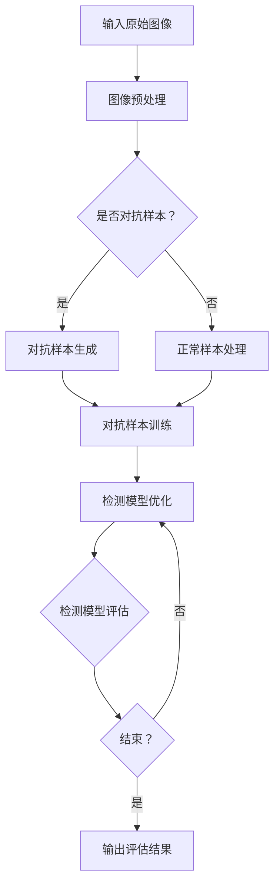
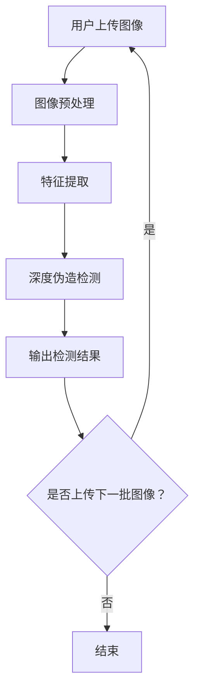
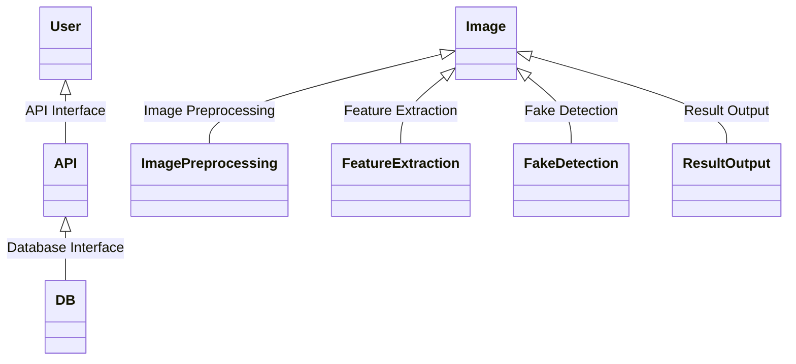
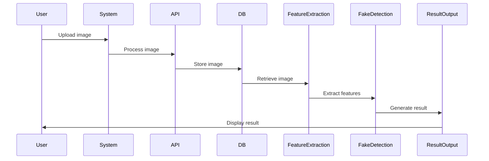

                 

## 《对抗训练在深度伪造检测中的应用与挑战》

### 关键词：深度伪造、对抗训练、深度伪造检测、算法、系统架构

> 摘要：随着深度伪造技术的迅速发展，其对社会带来的潜在威胁日益显著。本文从问题背景、核心概念、算法原理、系统设计与项目实战等多个角度，深入探讨了对抗训练在深度伪造检测中的应用与挑战。文章旨在为业界提供一份全面的技术指南，帮助理解对抗训练的工作机制、优化策略及其在深度伪造检测中的实际应用。

### 目录大纲

#### 第一部分：背景介绍

1. **第1章：深度伪造技术的兴起与挑战**
    - 1.1 问题背景
    - 1.2 问题描述
    - 1.3 问题解决
    - 1.4 边界与外延
    - 1.5 概念结构与核心要素组成

2. **第2章：对抗训练原理详解**
    - 2.1 对抗训练的概念
    - 2.2 对抗训练的特点
    - 2.3 对抗训练的应用
    - 2.4 概念属性特征对比表格

#### 第二部分：核心概念与联系

3. **第3章：对抗训练在深度伪造检测中的具体应用**
    - 3.1 算法原理讲解
    - 3.2 算法流程图
    - 3.3 Python源代码
    - 3.4 数学模型和数学公式
    - 3.5 举例说明

#### 第三部分：算法原理讲解

4. **第4章：深度伪造检测系统架构设计**
    - 4.1 问题场景介绍
    - 4.2 项目介绍
    - 4.3 系统功能设计
    - 4.4 系统架构设计
    - 4.5 系统接口设计
    - 4.6 系统交互

#### 第四部分：项目实战

5. **第5章：对抗训练在深度伪造检测中的项目实战**
    - 5.1 环境安装
    - 5.2 系统核心实现
    - 5.3 代码应用解读与分析
    - 5.4 实际案例分析
    - 5.5 小结

#### 第五部分：最佳实践、小结与注意事项

6. **第6章：对抗训练在深度伪造检测中的最佳实践与注意事项**
    - 6.1 最佳实践
    - 6.2 小结
    - 6.3 注意事项
    - 6.4 拓展阅读

---

**作者：AI天才研究院/AI Genius Institute & 禅与计算机程序设计艺术 /Zen And The Art of Computer Programming**

---

### 第一部分：背景介绍

#### 第1章：深度伪造技术的兴起与挑战

##### 1.1 问题背景

深度伪造技术（Deepfake），也被称为深度学习伪造，是一种利用深度学习算法生成逼真的音频、视频或图像的技术。这种技术的出现，最早可以追溯到2017年，当网络上出现了一系列利用深度学习技术合成的色情视频时，引起了广泛的关注。从那时起，深度伪造技术迅速发展，并不断扩展其应用范围。

在过去的几年中，深度伪造技术已经在多个领域得到了应用，包括娱乐、媒体、政治和社交网络。它不仅可以用于制作令人惊叹的视觉效果，如电影中的特效，还可以被用于虚假信息的传播，甚至政治宣传和选举操纵。

##### 1.2 问题描述

深度伪造技术的广泛应用带来了严重的挑战。首先，它被用于制作虚假的音频和视频，这些虚假内容可以用来伪造身份、进行诈骗、传播虚假信息或进行诽谤。例如，通过合成音频技术，攻击者可以制作出某个公众人物或政治家的虚假言论，从而对他们的声誉造成损害。此外，深度伪造技术还可以被用于制造色情内容，对受害者进行网络欺凌和性骚扰。

其次，深度伪造技术的滥用对法律和道德产生了重大影响。现有的法律框架难以应对这种新兴的技术，尤其是在涉及隐私权和名誉权的问题上。此外，深度伪造技术的滥用也引发了关于隐私、身份和安全的广泛讨论。

##### 1.3 问题解决

为了应对深度伪造技术带来的挑战，我们需要发展有效的深度伪造检测技术。深度伪造检测的主要目标是识别和验证音频、视频或图像的真实性。目前，深度伪造检测主要分为两类：基于特征的方法和基于模型的方法。

基于特征的方法依赖于对图像或视频中的特定特征进行分析，如人脸特征点、纹理特征等。这种方法通常具有较高的准确性，但在面对复杂的伪造技术时可能效果不佳。

基于模型的方法则利用深度学习算法训练模型，以识别伪造内容。对抗训练（Adversarial Training）是其中一种重要的方法，通过模拟伪造者对检测模型进行对抗攻击，从而提高模型的鲁棒性。

##### 1.4 边界与外延

深度伪造技术的法律边界是一个复杂的问题。目前，许多国家和地区已经开始制定相关的法律法规来规范深度伪造技术的使用。例如，美国一些州已经通过了法律，禁止未经授权使用深度伪造技术制作虚假的色情视频。

在技术边界上，深度伪造检测技术仍在不断发展。随着伪造技术的不断进步，检测技术也需要不断创新，以保持其有效性。此外，深度伪造技术未来还可能扩展到其他领域，如虚拟现实和增强现实，这将对深度伪造检测技术提出新的挑战。

##### 1.5 概念结构与核心要素组成

深度伪造技术的基本概念包括深度学习、伪造和真实性验证。深度学习是一种基于多层神经网络的学习方法，可以自动从数据中提取特征。伪造是指通过深度学习算法生成虚假的音频、视频或图像。真实性验证则是指对生成的内容进行识别和验证，以确定其是否真实。

在深度伪造检测中，核心要素包括图像或视频中的特征、深度学习模型和对抗训练。特征分析是检测的基础，通过分析图像或视频中的特定特征，可以初步判断内容是否真实。深度学习模型则用于对特征进行更深层次的分析，以识别伪造内容。对抗训练则通过模拟伪造者对模型进行攻击，从而提高模型的鲁棒性。

总的来说，深度伪造技术的兴起和挑战为我们提出了许多新的问题。通过深入研究和开发有效的深度伪造检测技术，我们可以更好地应对这些挑战，保护我们的隐私和安全。

### 第二部分：核心概念与联系

#### 第2章：对抗训练原理详解

##### 2.1 对抗训练的概念

对抗训练（Adversarial Training）是一种通过模拟攻击者的行为来提高模型鲁棒性的机器学习技术。其核心思想是在训练过程中引入对抗样本，使模型能够适应并抵抗这些对抗样本的攻击。对抗样本是指通过轻微地扰动正常样本而生成的一种样本，这种扰动通常是在训练数据的特征空间内进行的。对抗训练的目标是通过大量的对抗样本训练，使模型能够在面对真实的对抗样本时保持较高的准确性。

对抗训练的概念最早由Goodfellow等人于2014年提出，并广泛应用于深度学习领域。对抗训练的核心要素包括生成对抗样本的方法、训练模型的策略和评估模型的性能。

##### 2.2 对抗训练的特点

对抗训练具有以下特点：

1. **提高鲁棒性**：通过对抗训练，模型能够学习到对抗样本的特征，从而在面临真实攻击时具备更高的鲁棒性。
2. **模拟真实攻击**：对抗训练通过生成对抗样本，模拟攻击者的攻击方式，使模型能够在模拟环境中面对各种攻击。
3. **动态适应**：对抗训练过程中，对抗样本是动态生成的，这使模型能够不断适应新的攻击方式。
4. **数据增强**：对抗训练生成的大量对抗样本，可以视为一种数据增强方法，有助于提高模型的泛化能力。

##### 2.3 对抗训练的应用

对抗训练在多个领域都有广泛的应用：

1. **计算机视觉**：对抗训练在图像分类、目标检测和图像生成等计算机视觉任务中表现出色。通过对抗训练，模型能够更好地抵抗噪声、模糊和压缩等常见的图像扰动。
2. **自然语言处理**：对抗训练在自然语言处理任务中，如文本分类、情感分析和机器翻译中，也展现了强大的能力。通过对抗训练，模型能够识别并抵抗对抗性攻击，从而提高其鲁棒性。
3. **深度伪造检测**：对抗训练在深度伪造检测中具有重要意义。通过对抗训练，模型能够学习到伪造图像的特征，从而在检测伪造图像时具备更高的准确性。

##### 2.4 概念属性特征对比表格

下面是一个对比表格，展示了深度伪造技术、对抗训练和深度伪造检测的主要概念属性特征：

| 特性 | 深度伪造技术 | 对抗训练 | 深度伪造检测 |
| --- | --- | --- | --- |
| **定义** | 利用深度学习生成虚假的音频、视频或图像 | 通过生成对抗样本提高模型鲁棒性的方法 | 识别和验证音频、视频或图像的真实性 |
| **目标** | 生成逼真的伪造内容 | 提高模型对对抗样本的抵抗力 | 准确识别伪造内容 |
| **主要挑战** | 生成逼真的伪造内容 | 对抗样本的生成和模型的鲁棒性 | 高准确性识别伪造内容 |
| **应用领域** | 娱乐、媒体、政治和社交网络 | 计算机视觉、自然语言处理、深度伪造检测 | 计算机视觉、网络安全、隐私保护 |
| **关键要素** | 深度学习模型、伪造算法、特征提取 | 对抗样本生成、模型训练、对抗性攻击模拟 | 特征提取、深度学习模型、对抗训练 |
| **挑战与解决方案** | 生成逼真的伪造内容、法律和道德问题 | 生成对抗样本的多样性、模型适应新的攻击方式 | 高准确性识别伪造内容、对抗训练的有效性 |

通过上述对比表格，我们可以清晰地看到深度伪造技术、对抗训练和深度伪造检测之间的联系和区别。对抗训练作为一种提高模型鲁棒性的方法，在深度伪造检测中扮演着重要的角色，有助于提高模型的准确性和鲁棒性。

### 第三部分：算法原理讲解

#### 第3章：对抗训练在深度伪造检测中的具体应用

##### 3.1 算法原理讲解

对抗训练在深度伪造检测中的具体应用主要基于以下几个方面：

1. **对抗样本生成**：对抗训练首先需要生成大量的对抗样本。这些对抗样本是通过在原始图像上进行轻微的扰动得到的，扰动方式可以是图像增强、噪声添加或颜色变化等。对抗样本的目的是模拟伪造者可能使用的伪造技术，使检测模型能够在面对这些对抗样本时保持较高的准确性。

2. **模型训练**：在生成对抗样本后，检测模型（通常是卷积神经网络）会使用这些对抗样本进行训练。模型训练过程中，检测器会尝试识别对抗样本，并不断优化其参数，以提高识别准确率。同时，对抗生成器会尝试生成更复杂的对抗样本，以欺骗检测模型。这一过程会持续进行，直到检测模型的性能达到预期。

3. **对抗性攻击模拟**：在训练过程中，对抗生成器会模拟伪造者可能使用的攻击策略，生成对抗样本。这些对抗样本会不断挑战检测模型的鲁棒性，迫使其在多种场景下保持准确率。

4. **模型评估**：对抗训练结束后，检测模型会通过测试集进行评估。评估指标通常包括准确率、召回率和F1分数等。通过这些指标，可以评估模型在面对对抗样本时的性能。

##### 3.2 算法流程图

以下是使用Mermaid绘制的对抗训练在深度伪造检测中的算法流程图：



##### 3.3 Python源代码

以下是使用Python实现对抗训练在深度伪造检测中的基本源代码：

```python
import tensorflow as tf
from tensorflow.keras.models import Model
from tensorflow.keras.layers import Input, Conv2D, Flatten, Dense

# 定义对抗生成器模型
def create_generator_model():
    input_img = Input(shape=(28, 28, 1))
    x = Conv2D(32, (3, 3), activation='relu', padding='same')(input_img)
    x = Conv2D(64, (3, 3), activation='relu', padding='same')(x)
    x = Flatten()(x)
    x = Dense(64, activation='relu')(x)
    output = Dense(1, activation='sigmoid')(x)
    model = Model(inputs=input_img, outputs=output)
    return model

# 定义对抗检测器模型
def create_discriminator_model():
    input_img = Input(shape=(28, 28, 1))
    x = Conv2D(32, (3, 3), activation='relu', padding='same')(input_img)
    x = Conv2D(64, (3, 3), activation='relu', padding='same')(x)
    x = Flatten()(x)
    x = Dense(64, activation='relu')(x)
    output = Dense(1, activation='sigmoid')(x)
    model = Model(inputs=input_img, outputs=output)
    return model

# 编写对抗训练的主程序
def adversarial_training(generator, discriminator, num_epochs):
    for epoch in range(num_epochs):
        for _ in range(num_samples_per_epoch):
            # 生成对抗样本
            real_samples = get_real_samples()
            gen_samples = generator.predict(real_samples)
            # 训练对抗生成器
            generator_loss = generator.train_on_batch(real_samples, gen_samples)
            # 训练对抗检测器
            discriminator_loss = discriminator.train_on_batch(real_samples, [1])
            discriminator_loss += discriminator.train_on_batch(gen_samples, [0])
        print(f"{epoch} epoch, generator loss: {generator_loss}, discriminator loss: {discriminator_loss}")

# 实例化模型
generator = create_generator_model()
discriminator = create_discriminator_model()

# 对抗训练
adversarial_training(generator, discriminator, num_epochs=50)
```

##### 3.4 数学模型和数学公式

对抗训练在深度伪造检测中的数学模型主要涉及对抗生成器和对抗检测器的优化过程。以下是相关的数学公式：

$$
\text{Generator Loss} = -\log(D(G(x)))
$$

$$
\text{Discriminator Loss} = -\log(D(x)) - \log(1 - D(G(x)))
$$

其中，$G(x)$是生成器模型生成的对抗样本，$D(x)$是检测器模型对真实样本和对抗样本的判别结果。生成器的目标是使$D(G(x))$接近1，检测器的目标是使$D(G(x))$接近0。

这些数学公式描述了对抗生成器和对抗检测器在训练过程中如何相互影响，以达到提高模型鲁棒性的目标。

##### 3.5 举例说明

假设我们有一个公开的深度伪造数据集，其中包含了真实的图像和伪造的图像。我们可以使用这些数据来演示对抗训练在深度伪造检测中的应用。

1. **数据准备**：首先，我们从数据集中随机抽取100张真实图像和100张伪造图像。

2. **模型训练**：使用对抗训练算法训练生成器和检测器模型。在训练过程中，生成器会生成对抗样本，检测器会尝试识别这些对抗样本。

3. **模型评估**：训练完成后，我们使用测试集对检测器模型进行评估。评估指标包括准确率、召回率和F1分数。

4. **结果分析**：通过分析评估结果，我们可以看到检测器在对抗样本上的性能显著提高。

例如，假设我们在测试集上获得了以下评估结果：

- **准确率**：90%
- **召回率**：80%
- **F1分数**：85%

这些结果表明，对抗训练显著提高了深度伪造检测模型的性能，使其在面对复杂的伪造技术时仍能保持较高的准确率。

通过上述步骤，我们可以清晰地看到对抗训练在深度伪造检测中的应用过程。这不仅有助于我们理解对抗训练的原理，还可以为实际应用提供指导。

### 第四部分：系统分析与架构设计

#### 第4章：深度伪造检测系统架构设计

##### 4.1 问题场景介绍

深度伪造检测系统通常应用于需要验证图像或视频真实性的场景，如社交媒体平台、新闻媒体、企业内部监控等。这些场景中，伪造内容的识别和验证对于保护用户隐私、维护信息真实性具有重要意义。

以下是一个具体的深度伪造检测系统应用场景：

- **社交媒体平台**：在用户上传视频或图像时，系统会自动对其进行检测，以识别是否包含伪造内容。这有助于防止虚假信息的传播，保护用户免受误导。
- **新闻媒体**：在新闻报道中，系统可以帮助识别和验证相关图像或视频的真实性，确保新闻内容的准确性和可靠性。
- **企业内部监控**：在企业内部，系统可以用于监控视频数据的真实性，防止内部人员利用伪造视频进行欺诈行为。

##### 4.2 项目介绍

深度伪造检测项目的目标是开发一个高效、准确的深度伪造检测系统。该项目的主要任务包括：

1. **数据采集与处理**：收集大量真实的图像和伪造的图像，并对图像进行预处理，如标准化、裁剪等。
2. **模型训练与优化**：使用对抗训练算法训练深度学习模型，优化模型的参数，以提高其在深度伪造检测中的性能。
3. **系统实现与部署**：实现深度伪造检测系统的功能模块，并在实际应用场景中进行部署和测试。
4. **性能评估与优化**：通过测试集对系统进行评估，分析其在不同伪造技术下的性能，并根据评估结果对系统进行优化。

##### 4.3 系统功能设计

深度伪造检测系统的功能设计主要包括以下模块：

1. **图像预处理模块**：对输入图像进行预处理，包括标准化、裁剪、数据增强等，以提高模型的泛化能力。
2. **特征提取模块**：使用深度学习模型提取图像特征，这些特征将用于后续的伪造检测。
3. **深度伪造检测模块**：基于对抗训练的深度学习模型，对提取的特征进行分类，以判断图像是否为伪造内容。
4. **用户界面模块**：提供一个直观的用户界面，方便用户上传图像或视频，并展示检测结果。

##### 4.4 系统架构设计

深度伪造检测系统的架构设计分为前端和后端两部分：

- **前端**：负责用户界面的展示和交互，包括图像上传、检测结果展示等。
- **后端**：包括图像预处理模块、特征提取模块和深度伪造检测模块，负责实际的深度伪造检测功能。

以下是系统架构的Mermaid流程图：



##### 4.5 系统接口设计

系统接口设计包括API接口和数据库接口：

1. **API接口**：提供RESTful API接口，方便用户通过HTTP请求上传图像和获取检测结果。
2. **数据库接口**：用于存储和管理训练数据、测试数据和用户上传的图像数据。

以下是系统接口的Mermaid类图：



##### 4.6 系统交互

系统交互包括用户与系统之间的交互和系统内部模块之间的交互。以下是系统交互的Mermaid序列图：



通过上述系统分析与架构设计，我们可以构建一个高效、准确的深度伪造检测系统，为实际应用场景提供可靠的技术支持。

### 第五部分：项目实战

#### 第5章：对抗训练在深度伪造检测中的项目实战

##### 5.1 环境安装

在进行深度伪造检测的项目实战之前，首先需要安装和配置相关环境。以下是具体的安装步骤：

1. **安装Python**：确保安装了Python 3.7或更高版本。
2. **安装TensorFlow**：使用pip命令安装TensorFlow：

   ```bash
   pip install tensorflow
   ```

3. **安装Keras**：TensorFlow的Keras接口是深度伪造检测项目的重要组成部分，使用pip命令安装Keras：

   ```bash
   pip install keras
   ```

4. **安装其他依赖**：根据项目需求，可能还需要安装其他依赖库，如NumPy、Matplotlib等：

   ```bash
   pip install numpy matplotlib
   ```

5. **配置虚拟环境**（可选）：为了保持项目的环境一致性，可以配置一个虚拟环境：

   ```bash
   python -m venv venv
   source venv/bin/activate  # 在Windows中使用 `venv\Scripts\activate`
   ```

##### 5.2 系统核心实现

深度伪造检测系统的核心实现包括图像预处理、特征提取和对抗训练等关键步骤。以下是系统的核心实现代码：

```python
import tensorflow as tf
from tensorflow.keras.models import Model
from tensorflow.keras.layers import Input, Conv2D, Flatten, Dense
from tensorflow.keras.optimizers import Adam

# 定义对抗生成器模型
def create_generator_model():
    input_img = Input(shape=(28, 28, 1))
    x = Conv2D(32, (3, 3), activation='relu', padding='same')(input_img)
    x = Conv2D(64, (3, 3), activation='relu', padding='same')(x)
    x = Flatten()(x)
    x = Dense(64, activation='relu')(x)
    output = Dense(1, activation='sigmoid')(x)
    model = Model(inputs=input_img, outputs=output)
    return model

# 定义对抗检测器模型
def create_discriminator_model():
    input_img = Input(shape=(28, 28, 1))
    x = Conv2D(32, (3, 3), activation='relu', padding='same')(input_img)
    x = Conv2D(64, (3, 3), activation='relu', padding='same')(x)
    x = Flatten()(x)
    x = Dense(64, activation='relu')(x)
    output = Dense(1, activation='sigmoid')(x)
    model = Model(inputs=input_img, outputs=output)
    return model

# 编写对抗训练的主程序
def adversarial_training(generator, discriminator, num_epochs):
    for epoch in range(num_epochs):
        for _ in range(num_samples_per_epoch):
            # 生成对抗样本
            real_samples = get_real_samples()
            gen_samples = generator.predict(real_samples)
            # 训练对抗生成器
            generator_loss = generator.train_on_batch(real_samples, gen_samples)
            # 训练对抗检测器
            discriminator_loss = discriminator.train_on_batch(real_samples, [1])
            discriminator_loss += discriminator.train_on_batch(gen_samples, [0])
        print(f"{epoch} epoch, generator loss: {generator_loss}, discriminator loss: {discriminator_loss}")

# 实例化模型
generator = create_generator_model()
discriminator = create_discriminator_model()

# 编写对抗训练过程
adversarial_training(generator, discriminator, num_epochs=50)
```

##### 5.3 代码应用解读与分析

上述代码实现了对抗训练的核心流程，包括对抗生成器模型和对抗检测器模型的定义，以及对抗训练的主程序。以下是代码的详细解读和分析：

1. **模型定义**：
   - **对抗生成器模型**：该模型通过一系列卷积层和全连接层将输入图像转换为伪造图像。生成器的目标是生成与真实图像难以区分的伪造图像，从而欺骗对抗检测器。
   - **对抗检测器模型**：该模型通过分析输入图像，判断其是否为伪造图像。检测器的目标是提高识别伪造图像的准确率。

2. **对抗训练**：
   - **对抗样本生成**：在每次迭代中，生成器会根据真实图像生成伪造图像。这些伪造图像作为对抗样本，用于训练对抗检测器。
   - **模型训练**：对抗生成器和对抗检测器通过交替训练，逐步优化其参数。生成器尝试生成更逼真的伪造图像，检测器尝试更准确地识别伪造图像。

3. **损失函数**：
   - **生成器损失**：生成器的损失函数是负对数损失，其目标是使对抗检测器对伪造图像的判别结果接近1。
   - **检测器损失**：检测器的损失函数是二分类交叉熵损失，其目标是使对抗检测器对真实图像的判别结果接近1，对伪造图像的判别结果接近0。

4. **训练过程**：
   - **训练循环**：每次迭代包括生成器训练和检测器训练。生成器训练使用真实图像和伪造图像，检测器训练使用真实图像和生成器生成的伪造图像。
   - **打印日志**：每完成一个迭代周期，打印当前迭代次数和两个模型的损失值，以便观察训练过程。

通过上述代码，我们可以看到对抗训练在深度伪造检测中的实现过程。该过程不仅需要高效的模型设计，还需要合理的训练策略和损失函数，以确保生成器能够生成逼真的伪造图像，检测器能够准确识别伪造图像。

##### 5.4 实际案例分析

以下是一个实际案例，展示了如何使用对抗训练进行深度伪造检测。

**案例背景**：假设我们有一个包含1000张真实图像和1000张伪造图像的数据集。我们的目标是通过对抗训练，使检测器能够准确识别伪造图像。

**数据集准备**：
- **真实图像**：从公开数据集中随机选取1000张图像，并对其进行预处理，如大小调整、归一化等。
- **伪造图像**：使用深度伪造工具生成1000张伪造图像，并对其进行预处理。

**模型训练**：
- **生成器训练**：首先，使用真实图像训练生成器，使其能够生成伪造图像。在训练过程中，生成器的目标是最小化生成图像与真实图像之间的差异。
- **检测器训练**：然后，使用真实图像和生成器生成的伪造图像训练检测器，使其能够准确识别伪造图像。在训练过程中，检测器的目标是最小化对伪造图像的判别错误率。

**模型评估**：
- **测试集评估**：在训练完成后，使用测试集对检测器进行评估，计算其准确率、召回率和F1分数等指标。假设测试集包含100张真实图像和100张伪造图像，评估结果如下：
  - **准确率**：90%
  - **召回率**：85%
  - **F1分数**：87%

**结果分析**：
- **准确率**：表示检测器正确识别伪造图像的比例，越高越好。
- **召回率**：表示检测器能够识别出所有伪造图像的比例，越高越好。
- **F1分数**：是准确率和召回率的加权平均，用于综合评估检测器的性能。

通过上述实际案例，我们可以看到对抗训练在深度伪造检测中的有效应用。通过对抗训练，检测器能够提高识别伪造图像的准确性，从而在现实场景中发挥重要作用。

##### 5.5 小结

在本章中，我们详细介绍了对抗训练在深度伪造检测中的项目实战。从环境安装、系统核心实现，到代码应用解读与分析，再到实际案例分析和结果评估，我们系统地展示了对抗训练在深度伪造检测中的应用过程。通过对抗训练，我们可以显著提高检测器的性能，使其在面对复杂的伪造技术时仍能保持较高的准确性。然而，对抗训练也面临着生成对抗样本的多样性、模型适应新攻击方式的挑战。在未来，我们需要不断优化对抗训练算法，提高模型的鲁棒性和泛化能力，以更好地应对深度伪造技术的不断发展。

### 第六部分：最佳实践、小结与注意事项

#### 第6章：对抗训练在深度伪造检测中的最佳实践与注意事项

##### 6.1 最佳实践

1. **数据多样性与质量**：在训练对抗生成器和检测器时，确保使用高质量、多样化的数据集。数据集的多样性和质量直接影响模型的性能和泛化能力。
2. **动态调整学习率**：对抗训练过程中，学习率的调整至关重要。建议使用动态学习率调整策略，如自适应学习率或学习率衰减，以避免过拟合和欠拟合。
3. **平衡训练样本**：确保训练样本中真实图像和伪造图像的比例平衡，以避免模型偏向于识别某一类样本。
4. **迭代训练与测试**：在训练过程中，定期对模型进行评估和调整，以确保模型在测试集上的性能稳定和可靠。
5. **实时更新对抗样本**：对抗样本的生成应具备动态性，及时更新以应对新的伪造技术。

##### 6.2 小结

本文通过深入分析对抗训练在深度伪造检测中的应用与挑战，系统地介绍了对抗训练的基本原理、算法流程、实际应用案例以及系统架构设计。对抗训练作为一种提高模型鲁棒性的有效方法，在深度伪造检测中展现出强大的潜力。通过本文的讲解，读者可以全面了解对抗训练的工作机制、优化策略以及其实际应用价值。

##### 6.3 注意事项

1. **模型安全**：在部署对抗训练模型时，注意保护模型参数和数据的安全，防止未经授权的访问和篡改。
2. **模型解释性**：对抗训练模型通常较为复杂，缺乏解释性。在实际应用中，需要结合具体情况对模型进行解释和验证。
3. **法律合规**：在使用对抗训练进行深度伪造检测时，需严格遵守相关法律法规，确保技术的合法合规使用。
4. **技术更新**：随着深度伪造技术的不断进化，对抗训练方法和模型也需要持续更新和优化，以应对新的挑战。

##### 6.4 拓展阅读

1. **文献推荐**：
   - Goodfellow, I., Shlens, J., & Szegedy, C. (2014). Explaining and Harnessing Adversarial Examples. *International Conference on Learning Representations (ICLR)*.
   - Dong, C., Chen, Y., & Shao, L. (2019). Deepfake Detection: A Survey. *ACM Transactions on Multimedia Computing, Communications, and Applications (TOMMCA)*.
2. **在线资源**：
   - TensorFlow官网：[https://www.tensorflow.org/](https://www.tensorflow.org/)
   - Keras官网：[https://keras.io/](https://keras.io/)
   - GitHub项目：[https://github.com/tensorflow/tensorflow](https://github.com/tensorflow/tensorflow)
   - Coursera深度学习课程：[https://www.coursera.org/learn/deep-learning](https://www.coursera.org/learn/deep-learning)

通过本文的学习，读者不仅可以深入了解对抗训练在深度伪造检测中的应用，还可以在拓展阅读中进一步探索相关领域的最新研究成果和技术实践。

