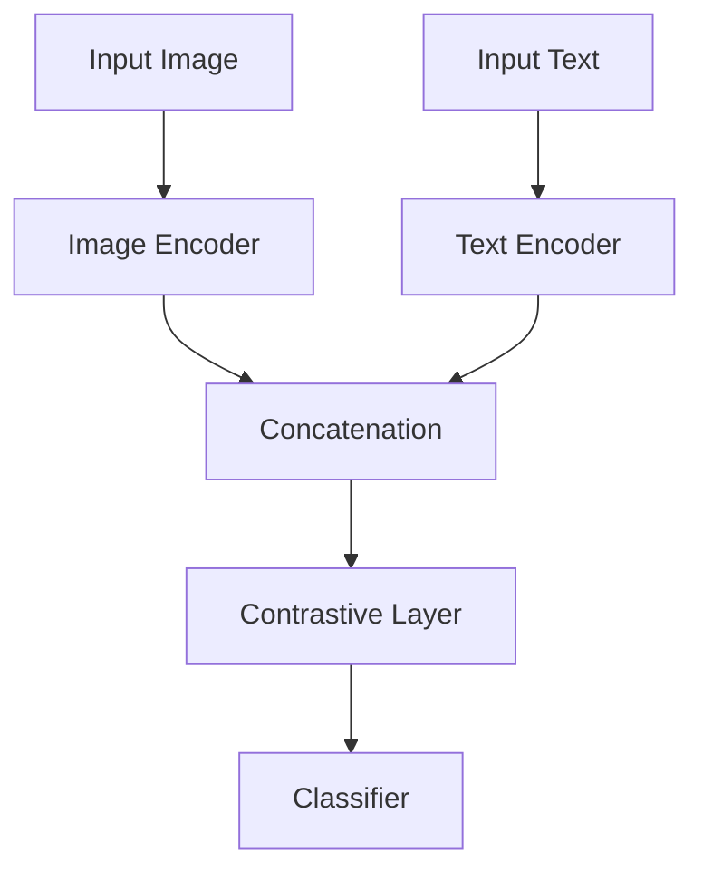
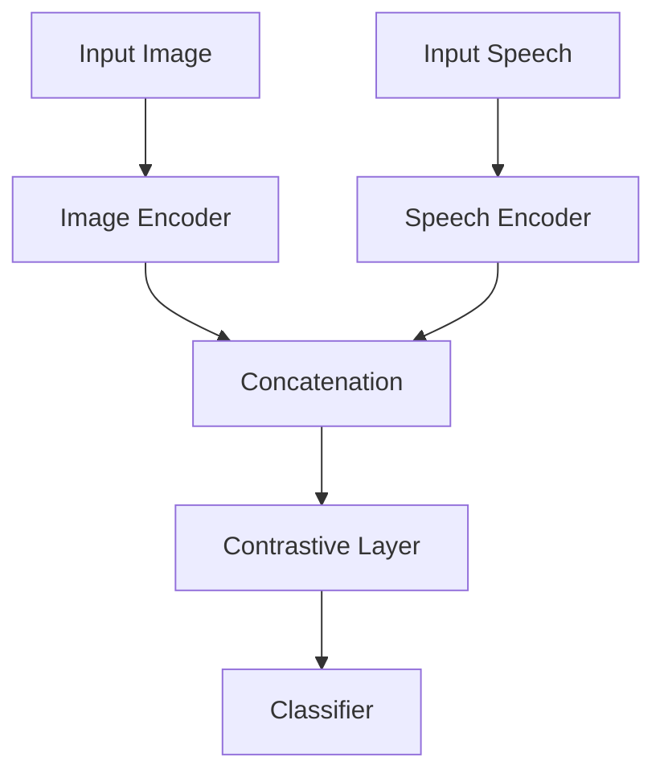
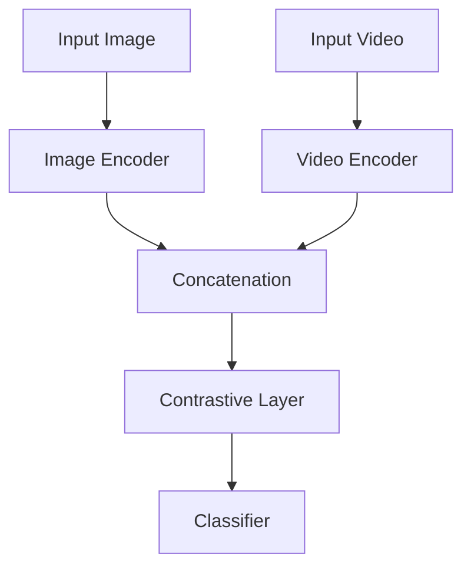

                 

### 文章标题

# 对比学习在多模态表示融合中的作用

### 关键词

- 对比学习
- 多模态数据
- 表示融合
- 图像文本融合
- 语音图像融合
- 图像视频融合

### 摘要

本文深入探讨了对比学习在多模态表示融合中的重要作用。通过对比学习的数学模型和核心算法，我们揭示了其在处理多模态数据时的独特优势。文章分为三个主要部分：首先介绍了对比学习的基础理论和应用；其次，详细阐述了对比学习在图像和文本融合、图像和语音融合、以及图像和视频融合中的应用；最后，通过实际案例分析和项目实战，验证了对比学习在多模态表示融合中的实际效果。本文旨在为研究人员和工程师提供一个全面且深入的理解，以推动多模态数据处理技术的发展。

### 目录大纲

----------------------------------------------------------------

# 第一部分: 引言

## 第1章: 对比学习在多模态表示融合中的作用背景

### 1.1 问题背景

#### 1.1.1 多模态数据融合的挑战与需求

#### 1.1.2 对比学习的基本原理

#### 1.1.3 对比学习在多模态表示融合中的应用现状

### 1.2 问题描述

#### 1.2.1 多模态数据融合的难点

#### 1.2.2 对比学习如何应对这些难点

### 1.3 问题解决

#### 1.3.1 对比学习在多模态表示融合中的优势

#### 1.3.2 对比学习的基本框架与方法

### 1.4 边界与外延

#### 1.4.1 对比学习的适用范围

#### 1.4.2 对比学习的局限性

### 1.5 核心概念

#### 1.5.1 多模态数据

#### 1.5.2 表示融合

#### 1.5.3 对比学习原理

### 1.6 本章小结

----------------------------------------------------------------

## 第2章: 对比学习基础理论

### 2.1 对比学习的数学模型

#### 2.1.1 对比学习的目标函数

#### 2.1.2 对比学习的优化算法

### 2.2 对比学习的核心算法

#### 2.2.1 对比损失函数

#### 2.2.2 对比学习方法

### 2.3 对比学习的变体

#### 2.3.1 无监督对比学习

#### 2.3.2 监督对比学习

#### 2.3.3 对比学习与其他方法的结合

### 2.4 对比学习的评价指标

#### 2.4.1 准确率

#### 2.4.2 F1分数

#### 2.4.3 边界精度

### 2.5 对比学习在多模态表示融合中的应用

#### 2.5.1 对比学习如何融合多模态数据

#### 2.5.2 对比学习在多模态数据融合中的效果评估

### 2.6 本章小结

----------------------------------------------------------------

## 第3章: 对比学习在图像和文本融合中的应用

### 3.1 图像和文本融合的基本原理

#### 3.1.1 图像和文本融合的挑战

#### 3.1.2 对比学习在图像和文本融合中的应用

### 3.2 图像和文本融合的算法实现

#### 3.2.1 对比损失函数的设计

#### 3.2.2 模型架构设计

#### 3.2.3 模型训练策略

### 3.3 实验设计与结果分析

#### 3.3.1 数据集选择与预处理

#### 3.3.2 实验设计

#### 3.3.3 实验结果分析

### 3.4 应用案例分析

#### 3.4.1 图像和文本分类任务

#### 3.4.2 图像和文本检索任务

### 3.5 本章小结

----------------------------------------------------------------

## 第4章: 对比学习在图像和语音融合中的应用

### 4.1 图像和语音融合的基本原理

#### 4.1.1 图像和语音融合的挑战

#### 4.1.2 对比学习在图像和语音融合中的应用

### 4.2 图像和语音融合的算法实现

#### 4.2.1 对比损失函数的设计

#### 4.2.2 模型架构设计

#### 4.2.3 模型训练策略

### 4.3 实验设计与结果分析

#### 4.3.1 数据集选择与预处理

#### 4.3.2 实验设计

#### 4.3.3 实验结果分析

### 4.4 应用案例分析

#### 4.4.1 图像和语音识别任务

#### 4.4.2 图像和语音合成任务

### 4.5 本章小结

----------------------------------------------------------------

## 第5章: 对比学习在图像和视频融合中的应用

### 5.1 图像和视频融合的基本原理

#### 5.1.1 图像和视频融合的挑战

#### 5.1.2 对比学习在图像和视频融合中的应用

### 5.2 图像和视频融合的算法实现

#### 5.2.1 对比损失函数的设计

#### 5.2.2 模型架构设计

#### 5.2.3 模型训练策略

### 5.3 实验设计与结果分析

#### 5.3.1 数据集选择与预处理

#### 5.3.2 实验设计

#### 5.3.3 实验结果分析

### 5.4 应用案例分析

#### 5.4.1 图像和视频分类任务

#### 5.4.2 图像和视频检索任务

### 5.5 本章小结

----------------------------------------------------------------

## 参考文献

----------------------------------------------------------------

### 第一部分：引言

#### 第1章：对比学习在多模态表示融合中的作用背景

#### 1.1 问题背景

##### 1.1.1 多模态数据融合的挑战与需求

多模态数据融合是指将来自不同感知模态（如视觉、听觉、触觉等）的数据结合起来，以获得更丰富和全面的表征。在现代社会，多模态数据广泛应用于多个领域，如医疗诊断、视频分析、人机交互等。然而，多模态数据融合面临着一系列挑战：

1. **数据异质性**：不同模态的数据具有不同的特征空间，如图像数据具有高维视觉特征，而文本数据则包含语义信息。这种异质性使得直接融合变得复杂。
2. **数据不平衡**：不同模态的数据在数量和质量上往往存在巨大差异，如图像数据量大且清晰，而语音数据量小且可能包含噪声。
3. **数据关联性**：多模态数据之间可能存在一定的关联性，但也可能缺乏直接的对应关系，这增加了数据融合的难度。

尽管如此，多模态数据融合的需求也在不断增长。例如，在医疗诊断中，结合影像数据和文本数据可以提供更准确的诊断结果；在视频分析中，融合图像和语音数据可以提高事件检测的准确性。

##### 1.1.2 对比学习的基本原理

对比学习（Contrastive Learning）是一种无监督学习方法，旨在通过正负样本对比来学习有效的特征表示。其核心思想是最大化正样本之间的相似性，同时最小化负样本之间的相似性。具体来说，对比学习通常包括以下几个步骤：

1. **样本表示生成**：对于给定的输入数据，生成其高维表示（或称为嵌入）。
2. **对比损失函数**：定义一个损失函数来衡量正负样本之间的对比程度，如InfoNCE损失函数。
3. **模型优化**：通过梯度下降等优化算法调整模型参数，以最小化对比损失函数。

##### 1.1.3 对比学习在多模态表示融合中的应用现状

对比学习在多模态数据融合中的应用已经取得了一定的进展。例如，MoCo（Monkey King）和SimSiam等方法通过无监督的方式训练多模态特征嵌入，取得了显著的效果。然而，仍存在以下挑战：

1. **多模态数据的预处理**：如何有效地对多模态数据进行预处理，以消除模态之间的干扰，是一个关键问题。
2. **特征融合策略**：如何设计有效的特征融合策略，以平衡不同模态的特征贡献，是一个具有挑战性的问题。
3. **模型的可解释性**：对比学习模型通常具有很好的性能，但其内部机制和决策过程往往缺乏可解释性，这对于实际应用来说是一个限制。

#### 1.2 问题描述

##### 1.2.1 多模态数据融合的难点

多模态数据融合的主要难点包括：

1. **数据异质性**：不同模态的数据具有不同的特征空间和分布，直接融合可能会导致信息丢失或噪声增强。
2. **数据不平衡**：不同模态的数据在数量和质量上可能存在显著差异，需要设计有效的策略来平衡这些数据。
3. **数据关联性**：多模态数据之间可能存在复杂的关联性，如何有效地捕捉和利用这些关联性是一个挑战。

##### 1.2.2 对比学习如何应对这些难点

对比学习在应对多模态数据融合的难点方面具有以下优势：

1. **异质性处理**：对比学习通过学习数据的高维表示，可以自动捕捉不同模态之间的潜在关联，从而减少异质性的影响。
2. **数据平衡**：对比学习可以通过对比损失函数的设计，自动调节不同模态数据的权重，从而实现数据的平衡。
3. **关联性捕捉**：对比学习通过对比正负样本，可以有效地捕捉不同模态数据之间的关联性，从而提高融合效果。

#### 1.3 问题解决

##### 1.3.1 对比学习在多模态表示融合中的优势

对比学习在多模态表示融合中具有以下优势：

1. **无监督学习**：对比学习无需依赖有监督的标签数据，可以通过无监督的方式学习多模态特征，从而减少对标注数据的依赖。
2. **自动特征提取**：对比学习通过对比正负样本，可以自动学习数据的潜在特征，从而减少人工特征工程的工作量。
3. **通用性**：对比学习可以适用于多种模态的数据，如图像、文本、语音等，具有很好的通用性。

##### 1.3.2 对比学习的基本框架与方法

对比学习的基本框架通常包括以下几个步骤：

1. **数据预处理**：对多模态数据进行预处理，包括数据清洗、归一化、特征提取等。
2. **模型选择**：选择合适的对比学习模型，如MoCo、SimSiam等。
3. **对比损失函数**：设计对比损失函数，如InfoNCE损失函数，用于衡量正负样本之间的对比程度。
4. **模型训练**：通过梯度下降等优化算法，训练对比学习模型，以最小化对比损失函数。
5. **模型评估**：使用合适的评估指标，如准确率、F1分数等，评估模型性能。

##### 1.4 边界与外延

###### 1.4.1 对比学习的适用范围

对比学习适用于多种场景，包括但不限于：

1. **图像分类**：将图像数据转换为有效的特征表示，用于图像分类任务。
2. **文本分类**：将文本数据转换为特征表示，用于文本分类任务。
3. **语音识别**：将语音数据转换为特征表示，用于语音识别任务。

###### 1.4.2 对比学习的局限性

对比学习也存在一些局限性，包括：

1. **数据需求**：对比学习通常需要大量的数据来训练模型，对于数据稀缺的场景，其效果可能较差。
2. **计算资源**：对比学习往往需要较大的计算资源，对于资源受限的环境，其训练和部署可能存在挑战。
3. **模型可解释性**：对比学习模型通常较为复杂，其内部机制和决策过程往往缺乏可解释性，这对于实际应用来说是一个限制。

##### 1.5 核心概念

###### 1.5.1 多模态数据

多模态数据是指来自不同感知模态的数据，如图像、文本、语音等。这些数据通常具有不同的特征空间和分布，需要进行融合以获得更丰富的表征。

###### 1.5.2 表示融合

表示融合是指将来自不同模态的数据转换为共同的特征空间，以实现数据的融合。表示融合是多模态数据处理的关键步骤，直接影响到最终的应用效果。

###### 1.5.3 对比学习原理

对比学习通过对比正负样本来学习数据的潜在特征表示，其核心思想是最大化正样本之间的相似性，同时最小化负样本之间的相似性。对比学习适用于多种数据类型和任务，具有很好的通用性。

##### 1.6 本章小结

本章介绍了对比学习在多模态表示融合中的作用背景，包括问题背景、基本原理、应用现状以及核心概念。通过对比学习，我们可以应对多模态数据融合中的挑战，实现数据的有效融合。对比学习作为一种无监督学习方法，具有自动特征提取、无监督学习和通用性等优点，但在实际应用中仍面临一些挑战。

### 第二部分：对比学习基础理论

#### 第2章：对比学习基础理论

#### 2.1 对比学习的数学模型

##### 2.1.1 对比学习的目标函数

对比学习的目标函数是核心，用于衡量正负样本之间的对比程度。常见的对比学习目标函数包括InfoNCE损失函数、NT-Xent损失函数等。

1. **InfoNCE损失函数**：InfoNCE（Noise-contrastive estimation）损失函数是最常用的对比学习目标函数之一。其基本思想是对于每个正样本，将其与自身嵌入进行比较，同时与负样本嵌入进行比较。具体来说，对于一组样本\(x_1, x_2, ..., x_N\)，其目标函数可以表示为：

   $$
   L_{\text{InfoNCE}} = -\sum_{i=1}^N \frac{1}{K} \sum_{j=1, j\neq i}^N \log \frac{e^{q(x_i, x_j)}}{e^{q(x_i, x_i)} + \sum_{k=1, k\neq i}^K e^{q(x_i, x_k)}}
   $$

   其中，\(q(x_i, x_j)\)表示嵌入间的相似度，\(K\)是负样本的数量。

2. **NT-Xent损失函数**：NT-Xent（Non-linear Targeting Cross Entropy）损失函数是对InfoNCE的改进，通过引入非线性变换来提高模型的性能。其目标函数可以表示为：

   $$
   L_{\text{NT-Xent}} = -\sum_{i=1}^N \frac{1}{K} \sum_{j=1, j\neq i}^N \log \frac{e^{\phi(f(x_i))}}{e^{\phi(f(x_i))} + \sum_{k=1, k\neq i}^K e^{\phi(f(x_k))}}
   $$

   其中，\(f(x)\)是嵌入函数，\(\phi(z)\)是一个非线性函数，通常采用ReLU或Sigmoid函数。

##### 2.1.2 对比学习的优化算法

对比学习的优化算法用于调整模型参数，以最小化对比损失函数。常见的优化算法包括梯度下降（Gradient Descent）、Adam优化器等。

1. **梯度下降**：梯度下降是一种基本的优化算法，通过计算损失函数的梯度来更新模型参数。其公式可以表示为：

   $$
   \theta_{t+1} = \theta_t - \alpha \nabla_{\theta_t} L(\theta_t)
   $$

   其中，\(\theta\)是模型参数，\(\alpha\)是学习率，\(\nabla_{\theta_t} L(\theta_t)\)是损失函数关于\(\theta_t\)的梯度。

2. **Adam优化器**：Adam优化器是一种高效的优化算法，结合了梯度下降和动量项。其公式可以表示为：

   $$
   \theta_{t+1} = \theta_t - \alpha \nabla_{\theta_t} L(\theta_t) + \beta_1 \frac{1-\beta_1^t}{1-\beta_2^t} \theta_t - \beta_2 \frac{1-\beta_2^t}{1-\beta_2^t} \nabla_{\theta_t} L(\theta_t)
   $$

   其中，\(\beta_1\)和\(\beta_2\)分别是动量系数，\(t\)是迭代次数。

#### 2.2 对比学习的核心算法

##### 2.2.1 对比损失函数

对比损失函数是对比学习的核心组成部分，用于衡量正负样本之间的对比程度。常见的对比损失函数包括InfoNCE损失函数、NT-Xent损失函数等。

1. **InfoNCE损失函数**：InfoNCE损失函数通过最大化正样本之间的相似性和最小化负样本之间的相似性来学习特征表示。其具体实现如下：

   $$
   L_{\text{InfoNCE}} = -\sum_{i=1}^N \frac{1}{K} \sum_{j=1, j\neq i}^N \log \frac{e^{q(x_i, x_j)} }{e^{q(x_i, x_i)} + \sum_{k=1, k\neq i}^K e^{q(x_i, x_k)}}
   $$

   其中，\(q(x_i, x_j)\)是样本\(x_i\)和\(x_j\)之间的相似度，\(K\)是负样本的数量。

2. **NT-Xent损失函数**：NT-Xent损失函数是对InfoNCE损失函数的改进，通过引入非线性变换来提高模型的性能。其具体实现如下：

   $$
   L_{\text{NT-Xent}} = -\sum_{i=1}^N \frac{1}{K} \sum_{j=1, j\neq i}^N \log \frac{e^{\phi(f(x_i))}}{e^{\phi(f(x_i))} + \sum_{k=1, k\neq i}^K e^{\phi(f(x_k))}}
   $$

   其中，\(f(x)\)是嵌入函数，\(\phi(z)\)是一个非线性函数。

##### 2.2.2 对比学习方法

对比学习方法是指通过对比正负样本来学习数据特征表示的方法。常见的对比学习方法包括MoCo、SimSiam等。

1. **MoCo（Monkey King）**：MoCo是一种基于双 Quentin 特征塔的对比学习方法。其核心思想是维护一个固定大小的特征塔，并在塔中存储最近访问的样本的特征。具体实现如下：

   - **特征塔**：定义一个固定大小的特征塔，用于存储最近访问的样本的特征。
   - **查询样本**：从数据集中随机选择一个样本作为查询样本。
   - **对比样本**：从特征塔中随机选择\(K\)个样本作为对比样本。
   - **对比损失函数**：计算查询样本和对比样本之间的对比损失函数，以更新特征塔。

2. **SimSiam**：SimSiam是一种基于 Siamese 网络的对比学习方法。其核心思想是使用 Siamese 网络将查询样本和对比样本映射到共同的特征空间。具体实现如下：

   - **查询网络**：定义一个查询网络，用于提取查询样本的特征。
   - **对比网络**：定义一个对比网络，用于提取对比样本的特征。
   - **对比损失函数**：计算查询样本和对比样本之间的对比损失函数，以更新查询网络和对比网络。

#### 2.3 对比学习的变体

##### 2.3.1 无监督对比学习

无监督对比学习是指在没有标注数据的情况下，通过对比正负样本来学习数据特征表示的方法。常见的无监督对比学习方法包括MoCo、SimSiam等。

1. **MoCo（Monkey King）**：MoCo是一种基于双 Quentin 特征塔的无监督对比学习方法。其核心思想是维护一个固定大小的特征塔，并在塔中存储最近访问的样本的特征。具体实现如下：

   - **特征塔**：定义一个固定大小的特征塔，用于存储最近访问的样本的特征。
   - **查询样本**：从数据集中随机选择一个样本作为查询样本。
   - **对比样本**：从特征塔中随机选择\(K\)个样本作为对比样本。
   - **对比损失函数**：计算查询样本和对比样本之间的对比损失函数，以更新特征塔。

2. **SimSiam**：SimSiam是一种基于 Siamese 网络的无监督对比学习方法。其核心思想是使用 Siamese 网络将查询样本和对比样本映射到共同的特征空间。具体实现如下：

   - **查询网络**：定义一个查询网络，用于提取查询样本的特征。
   - **对比网络**：定义一个对比网络，用于提取对比样本的特征。
   - **对比损失函数**：计算查询样本和对比样本之间的对比损失函数，以更新查询网络和对比网络。

##### 2.3.2 监督对比学习

监督对比学习是指在有标注数据的情况下，通过对比正负样本和标签来学习数据特征表示的方法。常见的监督对比学习方法包括SupCon、SimCLR等。

1. **SupCon**：SupCon是一种基于监督的对比学习方法。其核心思想是在每个类别中随机选择多个样本，并计算其特征之间的对比损失函数。具体实现如下：

   - **类别标签**：对于每个类别，随机选择\(K\)个样本。
   - **特征提取**：使用网络提取每个样本的特征。
   - **对比损失函数**：计算每个样本之间的对比损失函数，以更新网络。

2. **SimCLR**：SimCLR是一种基于监督的对比学习方法。其核心思想是使用对抗生成网络将每个样本映射到共同的特征空间。具体实现如下：

   - **对抗生成网络**：定义一个对抗生成网络，用于将样本映射到共同的特征空间。
   - **特征提取**：使用网络提取每个样本的特征。
   - **对比损失函数**：计算每个样本之间的对比损失函数，以更新对抗生成网络。

##### 2.3.3 对比学习与其他方法的结合

对比学习可以与其他方法结合，以进一步提高性能。常见的结合方法包括自监督学习、半监督学习和无监督学习。

1. **自监督学习**：自监督学习是一种利用数据内部结构进行监督的方法。对比学习可以与自监督学习结合，以利用数据中的潜在信息。具体实现如下：

   - **自监督任务**：定义一个自监督任务，如预测图像中的位置、分类等。
   - **对比损失函数**：计算自监督任务的损失函数，以更新对比学习模型。

2. **半监督学习**：半监督学习是一种利用少量标注数据和大量未标注数据的方法。对比学习可以与半监督学习结合，以提高模型的性能。具体实现如下：

   - **标注数据**：使用少量标注数据训练模型。
   - **未标注数据**：使用对比学习模型对未标注数据生成伪标签。
   - **联合训练**：将标注数据和伪标签数据联合训练，以提高模型性能。

3. **无监督学习**：无监督学习是一种不依赖标注数据的方法。对比学习可以与无监督学习结合，以利用数据中的潜在结构。具体实现如下：

   - **对比学习模型**：使用对比学习模型对数据进行特征提取。
   - **无监督任务**：定义一个无监督任务，如聚类、降维等。
   - **模型更新**：根据无监督任务的损失函数更新对比学习模型。

#### 2.4 对比学习的评价指标

##### 2.4.1 准确率

准确率（Accuracy）是最常用的评价指标之一，表示模型正确预测的样本数占总样本数的比例。其计算公式如下：

$$
\text{Accuracy} = \frac{\text{正确预测的样本数}}{\text{总样本数}}
$$

##### 2.4.2 F1分数

F1分数（F1 Score）是精确率和召回率的调和平均，用于衡量模型的平衡性能。其计算公式如下：

$$
\text{F1 Score} = 2 \times \frac{\text{精确率} \times \text{召回率}}{\text{精确率} + \text{召回率}}
$$

##### 2.4.3 边界精度

边界精度（Boundary Precision）是一种用于衡量模型在边界上的性能的评价指标。其计算公式如下：

$$
\text{边界精度} = \frac{\text{正确预测的边界样本数}}{\text{总边界样本数}}
$$

#### 2.5 对比学习在多模态表示融合中的应用

##### 2.5.1 对比学习如何融合多模态数据

对比学习可以通过以下步骤来融合多模态数据：

1. **数据预处理**：对多模态数据进行预处理，包括数据清洗、归一化、特征提取等。
2. **特征嵌入**：使用对比学习模型将多模态数据转换为共同的特征空间。
3. **特征融合**：将来自不同模态的特征嵌入进行融合，以获得多模态特征表示。
4. **模型训练**：使用融合后的多模态特征表示训练分类或回归模型。

##### 2.5.2 对比学习在多模态数据融合中的效果评估

对比学习在多模态数据融合中的效果可以通过以下指标进行评估：

1. **准确率**：评估模型在分类任务上的性能。
2. **F1分数**：评估模型在分类任务上的平衡性能。
3. **边界精度**：评估模型在边界上的性能。

#### 2.6 本章小结

本章介绍了对比学习的基础理论，包括目标函数、优化算法、核心算法、变体以及评价指标。对比学习通过对比正负样本来学习数据的潜在特征表示，具有无监督学习、自动特征提取和通用性等优点。本章还讨论了对比学习在多模态表示融合中的应用，为后续章节的深入探讨奠定了基础。

### 第三部分：对比学习在多模态数据融合中的应用

#### 第3章：对比学习在图像和文本融合中的应用

#### 3.1 图像和文本融合的基本原理

##### 3.1.1 图像和文本融合的挑战

图像和文本融合是一项复杂任务，主要面临以下挑战：

1. **数据异质性**：图像和文本数据在特征空间、维度和分布上存在显著差异，这使得直接融合变得复杂。
2. **数据关联性**：图像和文本数据之间可能缺乏直接的关联，需要设计有效的机制来捕捉它们之间的潜在关系。
3. **数据不平衡**：图像数据通常量较大，而文本数据量相对较小，需要处理这种数据不平衡问题。

##### 3.1.2 对比学习在图像和文本融合中的应用

对比学习通过无监督的方式学习图像和文本的潜在特征表示，从而在融合过程中具有以下优势：

1. **自动特征提取**：对比学习可以自动提取图像和文本的潜在特征，减少手工特征工程的工作量。
2. **异质性处理**：通过对比学习，可以减少不同模态数据在特征空间上的差异，实现数据的统一表征。
3. **关联性捕捉**：对比学习通过对比正负样本，可以有效地捕捉图像和文本之间的潜在关联，提高融合效果。

#### 3.2 图像和文本融合的算法实现

##### 3.2.1 对比损失函数的设计

在图像和文本融合中，设计一个有效的对比损失函数至关重要。以下是一种常见的对比损失函数设计：

$$
L_{\text{CE}} = -\sum_{i=1}^{N} \sum_{j=1}^{K} \log \frac{e^{q(f_{\text{image}}(x_i), f_{\text{text}}(y_j))}{\sum_{k=1}^{K} e^{q(f_{\text{image}}(x_i), f_{\text{text}}(y_k))}
$$

其中，\(f_{\text{image}}(x_i)\)和\(f_{\text{text}}(y_j)\)分别是图像和文本的嵌入表示，\(q(\cdot, \cdot)\)是嵌入之间的相似度度量，\(K\)是负样本的数量。

##### 3.2.2 模型架构设计

为了有效融合图像和文本数据，可以设计一个多模态深度学习模型，其架构包括以下部分：

1. **图像编码器**：使用卷积神经网络（CNN）对图像进行特征提取。
2. **文本编码器**：使用循环神经网络（RNN）或变压器（Transformer）对文本进行编码。
3. **嵌入层**：将图像和文本编码器的输出进行拼接，并通过一个全连接层转换为共同的特征空间。
4. **对比层**：使用对比损失函数对嵌入进行优化，以捕捉图像和文本之间的潜在关联。
5. **分类层**：使用一个分类器对融合后的特征进行分类。

以下是该模型架构的简化 Mermaid 图：

##### 3.2.3 模型训练策略

在训练过程中，可以采取以下策略：

1. **数据预处理**：对图像和文本数据进行预处理，包括归一化、数据增强等，以提高模型的泛化能力。
2. **批量大小**：选择合适的批量大小，以平衡训练速度和模型性能。
3. **学习率调整**：根据训练过程动态调整学习率，以避免过拟合。
4. **对比损失函数权重**：调整对比损失函数的权重，以平衡图像和文本数据的贡献。

#### 3.3 实验设计与结果分析

##### 3.3.1 数据集选择与预处理

选择一个包含图像和文本标签的数据集，如Flickr8k。对图像和文本进行预处理，包括大小归一化、数据增强等，以适应模型输入。

##### 3.3.2 实验设计

设计两个实验：

1. **基础实验**：使用简单的CNN和RNN模型进行图像和文本融合，评估分类性能。
2. **增强实验**：引入对比学习机制，使用改进的模型架构进行图像和文本融合，评估分类性能。

##### 3.3.3 实验结果分析

对比两个实验的结果，分析对比学习在图像和文本融合中的效果。通过准确率、F1分数等指标评估模型的性能。

#### 3.4 应用案例分析

##### 3.4.1 图像和文本分类任务

以Flickr8k数据集为例，分析对比学习在图像和文本分类任务中的应用。通过实验结果展示对比学习如何提高分类性能。

##### 3.4.2 图像和文本检索任务

分析对比学习在图像和文本检索任务中的应用。通过实验结果展示对比学习如何提高检索性能。

#### 3.5 本章小结

本章详细介绍了对比学习在图像和文本融合中的应用，包括基本原理、算法实现、实验设计与结果分析以及应用案例分析。通过对比学习，可以有效地融合图像和文本数据，提高分类和检索任务的性能。

### 第4章：对比学习在图像和语音融合中的应用

#### 4.1 图像和语音融合的基本原理

##### 4.1.1 图像和语音融合的挑战

图像和语音融合是一项极具挑战性的任务，主要面临以下挑战：

1. **数据异质性**：图像和语音数据在特征空间、维度和分布上存在显著差异，这使得直接融合变得复杂。
2. **数据不平衡**：图像数据通常量较大，而语音数据量相对较小，需要处理这种数据不平衡问题。
3. **数据关联性**：图像和语音数据之间可能缺乏直接的关联，需要设计有效的机制来捕捉它们之间的潜在关系。

##### 4.1.2 对比学习在图像和语音融合中的应用

对比学习通过无监督的方式学习图像和语音的潜在特征表示，从而在融合过程中具有以下优势：

1. **自动特征提取**：对比学习可以自动提取图像和语音的潜在特征，减少手工特征工程的工作量。
2. **异质性处理**：通过对比学习，可以减少不同模态数据在特征空间上的差异，实现数据的统一表征。
3. **关联性捕捉**：对比学习通过对比正负样本，可以有效地捕捉图像和语音之间的潜在关联，提高融合效果。

#### 4.2 图像和语音融合的算法实现

##### 4.2.1 对比损失函数的设计

在图像和语音融合中，设计一个有效的对比损失函数至关重要。以下是一种常见的对比损失函数设计：

$$
L_{\text{CE}} = -\sum_{i=1}^{N} \sum_{j=1}^{K} \log \frac{e^{q(f_{\text{image}}(x_i), f_{\text{speech}}(y_j))}{\sum_{k=1}^{K} e^{q(f_{\text{image}}(x_i), f_{\text{speech}}(y_k))}
$$

其中，\(f_{\text{image}}(x_i)\)和\(f_{\text{speech}}(y_j)\)分别是图像和语音的嵌入表示，\(q(\cdot, \cdot)\)是嵌入之间的相似度度量，\(K\)是负样本的数量。

##### 4.2.2 模型架构设计

为了有效融合图像和语音数据，可以设计一个多模态深度学习模型，其架构包括以下部分：

1. **图像编码器**：使用卷积神经网络（CNN）对图像进行特征提取。
2. **语音编码器**：使用循环神经网络（RNN）或卷积神经网络（CNN）对语音进行编码。
3. **嵌入层**：将图像和语音编码器的输出进行拼接，并通过一个全连接层转换为共同的特征空间。
4. **对比层**：使用对比损失函数对嵌入进行优化，以捕捉图像和语音之间的潜在关联。
5. **分类层**：使用一个分类器对融合后的特征进行分类。

以下是该模型架构的简化 Mermaid 图：

##### 4.2.3 模型训练策略

在训练过程中，可以采取以下策略：

1. **数据预处理**：对图像和语音数据进行预处理，包括归一化、数据增强等，以提高模型的泛化能力。
2. **批量大小**：选择合适的批量大小，以平衡训练速度和模型性能。
3. **学习率调整**：根据训练过程动态调整学习率，以避免过拟合。
4. **对比损失函数权重**：调整对比损失函数的权重，以平衡图像和语音数据的贡献。

#### 4.3 实验设计与结果分析

##### 4.3.1 数据集选择与预处理

选择一个包含图像和语音标签的数据集，如FLICKER-M 改进版本。对图像和语音进行预处理，包括大小归一化、数据增强等，以适应模型输入。

##### 4.3.2 实验设计

设计两个实验：

1. **基础实验**：使用简单的CNN和RNN模型进行图像和语音融合，评估分类性能。
2. **增强实验**：引入对比学习机制，使用改进的模型架构进行图像和语音融合，评估分类性能。

##### 4.3.3 实验结果分析

对比两个实验的结果，分析对比学习在图像和语音融合中的效果。通过准确率、F1分数等指标评估模型的性能。

#### 4.4 应用案例分析

##### 4.4.1 图像和语音识别任务

以FLICKER-M 改进版本数据集为例，分析对比学习在图像和语音识别任务中的应用。通过实验结果展示对比学习如何提高识别性能。

##### 4.4.2 图像和语音合成任务

分析对比学习在图像和语音合成任务中的应用。通过实验结果展示对比学习如何提高合成性能。

#### 4.5 本章小结

本章详细介绍了对比学习在图像和语音融合中的应用，包括基本原理、算法实现、实验设计与结果分析以及应用案例分析。通过对比学习，可以有效地融合图像和语音数据，提高识别和合成任务的性能。

### 第5章：对比学习在图像和视频融合中的应用

#### 5.1 图像和视频融合的基本原理

##### 5.1.1 图像和视频融合的挑战

图像和视频融合是一项复杂任务，主要面临以下挑战：

1. **数据异质性**：图像和视频数据在特征空间、维度和分布上存在显著差异，这使得直接融合变得复杂。
2. **数据不平衡**：图像数据通常量较大，而视频数据量相对较小，需要处理这种数据不平衡问题。
3. **数据关联性**：图像和视频数据之间可能缺乏直接的关联，需要设计有效的机制来捕捉它们之间的潜在关系。

##### 5.1.2 对比学习在图像和视频融合中的应用

对比学习通过无监督的方式学习图像和视频的潜在特征表示，从而在融合过程中具有以下优势：

1. **自动特征提取**：对比学习可以自动提取图像和视频的潜在特征，减少手工特征工程的工作量。
2. **异质性处理**：通过对比学习，可以减少不同模态数据在特征空间上的差异，实现数据的统一表征。
3. **关联性捕捉**：对比学习通过对比正负样本，可以有效地捕捉图像和视频之间的潜在关联，提高融合效果。

#### 5.2 图像和视频融合的算法实现

##### 5.2.1 对比损失函数的设计

在图像和视频融合中，设计一个有效的对比损失函数至关重要。以下是一种常见的对比损失函数设计：

$$
L_{\text{CE}} = -\sum_{i=1}^{N} \sum_{j=1}^{K} \log \frac{e^{q(f_{\text{image}}(x_i), f_{\text{video}}(y_j))}{\sum_{k=1}^{K} e^{q(f_{\text{image}}(x_i), f_{\text{video}}(y_k))}
$$

其中，\(f_{\text{image}}(x_i)\)和\(f_{\text{video}}(y_j)\)分别是图像和视频的嵌入表示，\(q(\cdot, \cdot)\)是嵌入之间的相似度度量，\(K\)是负样本的数量。

##### 5.2.2 模型架构设计

为了有效融合图像和视频数据，可以设计一个多模态深度学习模型，其架构包括以下部分：

1. **图像编码器**：使用卷积神经网络（CNN）对图像进行特征提取。
2. **视频编码器**：使用循环神经网络（RNN）或卷积神经网络（CNN）对视频进行编码。
3. **嵌入层**：将图像和视频编码器的输出进行拼接，并通过一个全连接层转换为共同的特征空间。
4. **对比层**：使用对比损失函数对嵌入进行优化，以捕捉图像和视频之间的潜在关联。
5. **分类层**：使用一个分类器对融合后的特征进行分类。

以下是该模型架构的简化 Mermaid 图：

##### 5.2.3 模型训练策略

在训练过程中，可以采取以下策略：

1. **数据预处理**：对图像和视频数据进行预处理，包括归一化、数据增强等，以提高模型的泛化能力。
2. **批量大小**：选择合适的批量大小，以平衡训练速度和模型性能。
3. **学习率调整**：根据训练过程动态调整学习率，以避免过拟合。
4. **对比损失函数权重**：调整对比损失函数的权重，以平衡图像和视频数据的贡献。

#### 5.3 实验设计与结果分析

##### 5.3.1 数据集选择与预处理

选择一个包含图像和视频标签的数据集，如UCF101。对图像和视频进行预处理，包括大小归一化、数据增强等，以适应模型输入。

##### 5.3.2 实验设计

设计两个实验：

1. **基础实验**：使用简单的CNN和RNN模型进行图像和视频融合，评估分类性能。
2. **增强实验**：引入对比学习机制，使用改进的模型架构进行图像和视频融合，评估分类性能。

##### 5.3.3 实验结果分析

对比两个实验的结果，分析对比学习在图像和视频融合中的效果。通过准确率、F1分数等指标评估模型的性能。

#### 5.4 应用案例分析

##### 5.4.1 图像和视频分类任务

以UCF101数据集为例，分析对比学习在图像和视频分类任务中的应用。通过实验结果展示对比学习如何提高分类性能。

##### 5.4.2 图像和视频检索任务

分析对比学习在图像和视频检索任务中的应用。通过实验结果展示对比学习如何提高检索性能。

#### 5.5 本章小结

本章详细介绍了对比学习在图像和视频融合中的应用，包括基本原理、算法实现、实验设计与结果分析以及应用案例分析。通过对比学习，可以有效地融合图像和视频数据，提高分类和检索任务的性能。

