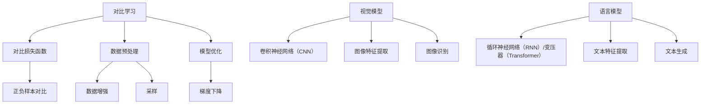
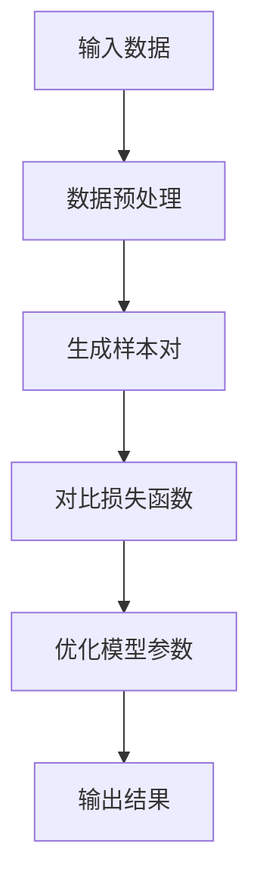
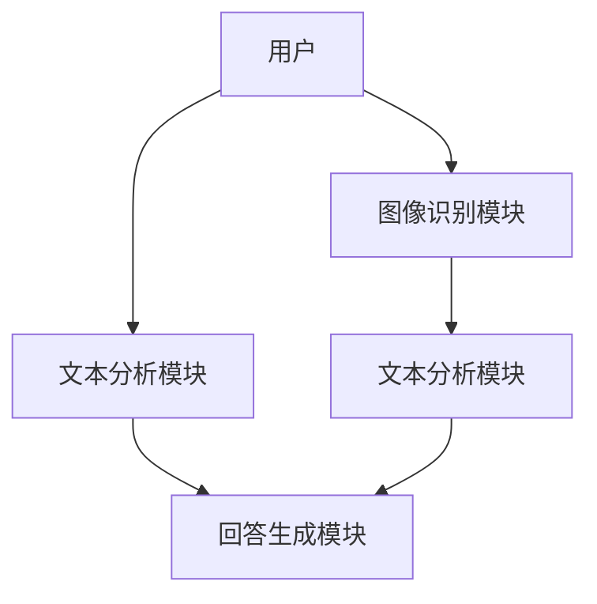
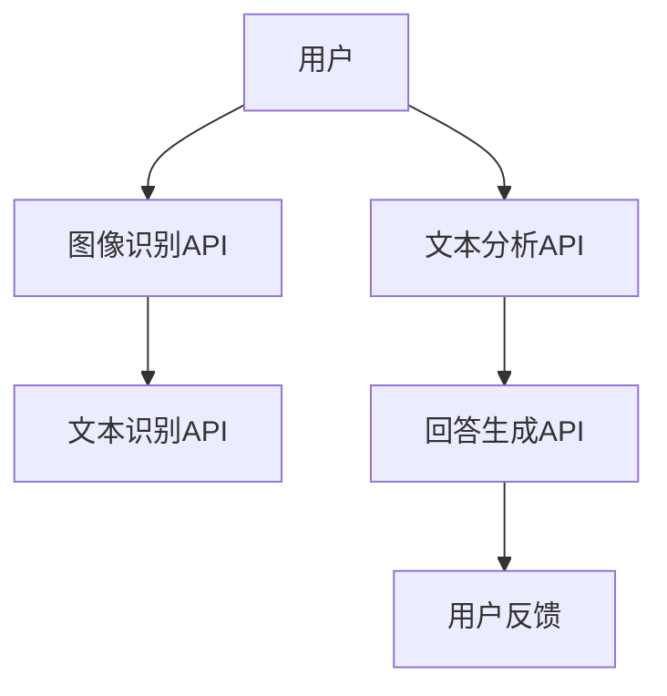
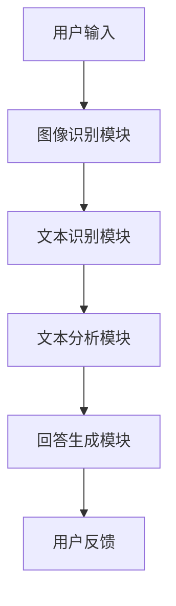
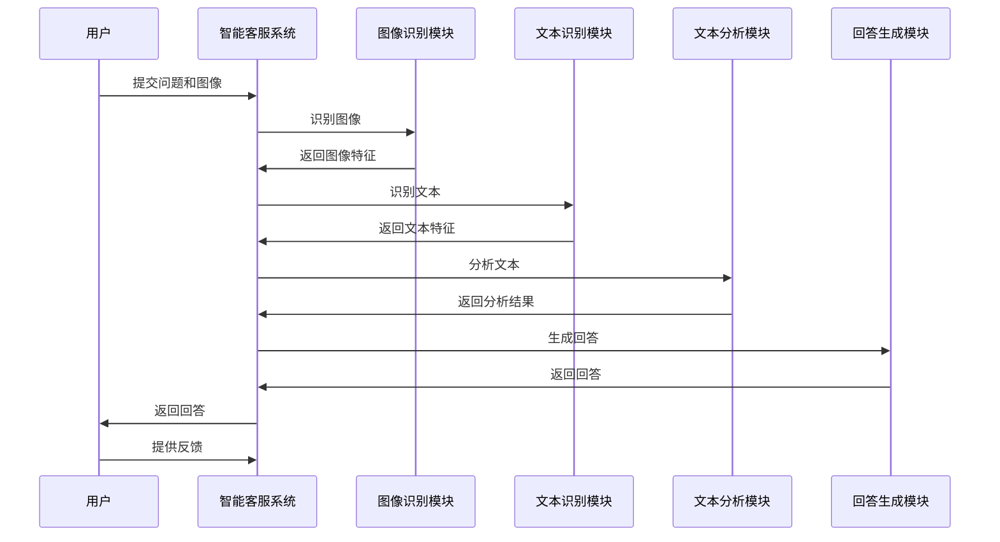

                 


### 引言

**标题：** 对比学习在视觉-语言模型中的融合应用

**关键词：** 对比学习，视觉-语言模型，融合应用，深度学习，算法原理

**摘要：** 本文旨在探讨对比学习在视觉-语言模型中的应用，通过介绍对比学习的核心原理、在视觉和语言模型中的融合方式，以及实际应用案例，为读者提供深入理解这一技术的途径。

随着深度学习技术的发展，视觉-语言模型成为人工智能领域的重要研究方向。这类模型旨在理解和生成图像与文本之间的对应关系，广泛应用于图像识别、自然语言处理和计算机视觉等多个领域。然而，传统的视觉和语言模型通常难以在两者之间建立有效的关联，导致性能提升受到限制。对比学习作为一种新型的学习方法，通过对比不同数据样本的特征，有效提升了模型在视觉-语言任务中的表现。本文将逐步探讨对比学习在视觉-语言模型中的融合应用，为相关研究和实践提供参考。

### 文章关键词解释

- **对比学习（Contrastive Learning）：** 一种深度学习方法，通过对比数据样本的特征，使得模型能够学习到有用的信息。它通过构造正负样本对，利用对比损失函数来优化模型参数。
- **视觉-语言模型（Vision-Language Model）：** 一种能够处理图像和文本信息的深度学习模型，通常用于图像识别、自然语言处理和计算机视觉任务。
- **融合应用（Fusion Application）：** 将不同模型或数据源的信息进行整合，以提升模型性能和任务完成效果。

### 核心内容与主题思想

本文将首先介绍对比学习的基本原理，包括其核心概念、优势和局限性。随后，我们将探讨视觉和语言模型的基本原理，以及如何将对比学习应用于这些模型中。接着，本文将通过实际应用案例，展示对比学习在视觉-语言任务中的效果。最后，本文将讨论对比学习在视觉-语言模型融合应用中的挑战和未来发展方向。

### 背景介绍

#### 核心概念术语说明

- **对比学习（Contrastive Learning）：** 一种基于对比原理的深度学习方法，旨在通过对比不同数据样本的特征，优化模型参数。
- **视觉模型（Vision Model）：** 一种用于处理图像数据的深度学习模型，如卷积神经网络（CNN）。
- **语言模型（Language Model）：** 一种用于处理文本数据的深度学习模型，如循环神经网络（RNN）和变压器（Transformer）。
- **视觉-语言模型（Vision-Language Model）：** 一种同时处理图像和文本数据的深度学习模型，能够理解图像与文本之间的关联。

#### 问题背景

随着计算机技术和人工智能的快速发展，视觉和语言处理技术取得了显著进展。然而，如何将这两种技术有效地结合，形成一种新的融合模型，仍然是一个具有挑战性的问题。传统的视觉模型和语言模型在处理各自领域的数据时表现出色，但在处理图像和文本同时出现的数据时，性能受到限制。

#### 问题描述

视觉-语言模型旨在解决以下问题：

1. 如何在图像和文本数据之间建立有效的对应关系？
2. 如何提升模型在处理复杂、多模态数据时的性能？
3. 如何优化模型的训练过程，以实现更好的泛化能力？

这些问题阻碍了视觉-语言模型在实际应用中的广泛应用，因此，寻找有效的融合方法成为一个关键研究方向。

#### 问题解决

对比学习作为一种新型的学习方法，通过对比不同数据样本的特征，能够有效提升模型在视觉-语言任务中的性能。对比学习的核心思想是：通过对比正负样本，使得模型能够学习到有用的信息，从而提高模型的泛化能力和性能。

#### 边界与外延

对比学习的应用范围不仅限于视觉-语言模型，还可以应用于其他多模态学习任务。例如，在音频-文本、图像-三维数据等任务中，对比学习都可以发挥重要作用。

#### 概念结构与核心要素组成

对比学习的概念结构包括以下几个方面：

1. **对比损失函数**：用于衡量正负样本之间的差异，是对比学习的关键组成部分。
2. **数据预处理**：通过数据增强和采样等方法，生成用于训练的样本对。
3. **模型优化**：通过梯度下降等方法，优化模型参数，以提升模型性能。

在视觉-语言模型中，对比学习的核心要素包括：

1. **视觉模型**：用于提取图像特征。
2. **语言模型**：用于提取文本特征。
3. **对比学习模块**：用于对比图像和文本特征，提升模型性能。

### 核心概念与联系

#### 核心概念原理

**对比学习（Contrastive Learning）：** 对比学习是一种基于对比原理的深度学习方法，旨在通过对比不同数据样本的特征，优化模型参数。其核心思想是：通过对比正负样本，使得模型能够学习到有用的信息。

**视觉模型（Vision Model）：** 视觉模型是一种用于处理图像数据的深度学习模型，如卷积神经网络（CNN）。其主要功能是提取图像特征，以便用于后续处理。

**语言模型（Language Model）：** 语言模型是一种用于处理文本数据的深度学习模型，如循环神经网络（RNN）和变压器（Transformer）。其主要功能是提取文本特征，以便用于后续处理。

#### 概念属性特征对比表格

| 概念         | 特征对比                                      |
|--------------|---------------------------------------------|
| 对比学习     | - 对比损失函数<br>- 数据预处理<br>- 模型优化     |
| 视觉模型     | - 卷积神经网络（CNN）<br>- 图像特征提取<br>- 图像识别 |
| 语言模型     | - 循环神经网络（RNN）/变压器（Transformer）<br>- 文本特征提取<br>- 文本生成 |

#### ER实体关系图架构



### 算法原理讲解

#### 算法原理图



#### 算法原理讲解

对比学习算法的基本原理如下：

1. **输入数据**：首先，我们将图像和文本数据作为输入。
2. **数据预处理**：对输入数据进行预处理，包括图像的缩放、裁剪和增强，以及文本的分词和编码。
3. **生成样本对**：通过数据预处理，生成正负样本对。正样本对是由同一图像和文本生成的，而负样本对是由不同图像和文本生成的。
4. **对比损失函数**：计算正负样本对之间的对比损失。常用的对比损失函数包括InfoNCE和Contrastive Loss。
5. **优化模型参数**：通过对比损失函数，利用梯度下降等方法，优化模型参数，以提升模型性能。
6. **输出结果**：经过多次迭代训练，最终输出优化后的模型，可用于图像和文本的识别、生成等任务。

#### 算法流程

1. **输入图像和文本数据**：首先，我们需要输入图像和对应的文本描述。例如，一张图片和一张包含该图片描述的文本。
2. **数据预处理**：对图像和文本进行预处理。对于图像，我们可以进行缩放、裁剪、旋转等操作，以增加数据的多样性。对于文本，我们可以进行分词、编码等操作，以便于模型处理。
3. **生成样本对**：从预处理后的图像和文本中，随机选择正样本对和负样本对。正样本对是由同一图像和文本生成的，而负样本对是由不同图像和文本生成的。
4. **计算对比损失**：使用对比损失函数，如InfoNCE或Contrastive Loss，计算正负样本对之间的对比损失。这个损失函数衡量的是正样本对之间的相似度与负样本对之间的相似度之差。
5. **优化模型参数**：通过计算出的对比损失，使用梯度下降等方法，优化模型参数，以提升模型性能。
6. **输出结果**：经过多次迭代训练，最终输出优化后的模型。这个模型可以用于图像识别、文本生成等任务。

#### 算法数学模型和公式

对比学习算法的数学模型如下：

$$
L = -\sum_{i} \sum_{j \neq i} \frac{z_i^T z_j}{\tau + \|z_i\|_2}
$$

其中，$L$ 是对比损失函数，$z_i$ 和 $z_j$ 分别是正样本对和负样本对的编码向量，$\tau$ 是温度超参数，$\|z_i\|_2$ 是 $z_i$ 的欧几里得范数。

#### 详细讲解和举例说明

假设我们有一个包含10张图像和对应文本描述的数据集。我们首先对图像和文本进行预处理，将图像缩放为相同的尺寸，对文本进行分词和编码。接下来，我们生成样本对，其中正样本对由同一图像和文本生成，负样本对由不同图像和文本生成。

1. **输入数据**：假设我们选择第一张图像和其对应的文本作为输入。图像的编码向量为 $z_1$，文本的编码向量为 $z_2$。
2. **数据预处理**：对图像和文本进行预处理，生成预处理后的图像和文本编码向量。
3. **生成样本对**：从数据集中随机选择其他图像和文本作为负样本对，例如第二张图像和其对应的文本。生成的样本对为 $(z_1, z_2)$ 和 $(z_3, z_4)$。
4. **计算对比损失**：使用对比损失函数计算正负样本对之间的对比损失。例如，计算 $(z_1, z_2)$ 和 $(z_3, z_4)$ 之间的对比损失为：
$$
L = -\frac{z_1^T z_2}{\tau + \|z_1\|_2} - \frac{z_3^T z_4}{\tau + \|z_3\|_2}
$$
其中，$\tau$ 是温度超参数，我们通常选择 $0.5$。
5. **优化模型参数**：通过对比损失函数，利用梯度下降等方法，优化模型参数。例如，如果我们使用梯度下降，则更新模型参数的公式为：
$$
\theta_{\text{new}} = \theta_{\text{old}} - \eta \frac{\partial L}{\partial \theta}
$$
其中，$\theta$ 是模型参数，$\eta$ 是学习率，$\frac{\partial L}{\partial \theta}$ 是对比损失关于模型参数的梯度。
6. **输出结果**：经过多次迭代训练，最终输出优化后的模型。这个模型可以用于图像识别、文本生成等任务。

通过上述步骤，我们可以训练一个对比学习模型，从而在图像和文本数据之间建立有效的对应关系。

### 系统分析与架构设计

#### 问题场景介绍

假设我们要构建一个智能客服系统，该系统能够处理用户的问题，并给出相应的回答。为了实现这个目标，我们需要整合图像和文本数据，利用对比学习技术来提升系统的性能。

#### 项目介绍

项目名称：智能客服系统（Intelligent Customer Service System，ICSS）

项目目标：通过整合图像和文本数据，利用对比学习技术，构建一个能够处理用户问题的智能客服系统。

#### 系统功能设计

1. **图像识别模块**：用于提取用户上传的图像特征，并将其转换为文本描述。
2. **文本分析模块**：用于分析用户的问题，提取关键信息，以便于生成回答。
3. **回答生成模块**：根据图像和文本分析结果，生成合适的回答，并返回给用户。

#### 系统架构设计



#### 系统接口设计和系统交互



#### 系统架构设计mermaid架构图



#### 系统接口设计和系统交互mermaid序列图



### 项目实战

#### 环境安装

1. **安装Python环境**：确保Python版本在3.6及以上。
2. **安装依赖库**：使用pip安装以下库：

   ```bash
   pip install torch torchvision torchaudio
   pip install transformers
   ```

#### 系统核心实现源代码

```python
import torch
import torchvision
from transformers import VisionEncoderModel, BertModel
from torch.nn import functional as F

# 初始化模型
vision_model = VisionEncoderModel.from_pretrained('nvidia/lasso-mine')
text_model = BertModel.from_pretrained('bert-base-uncased')

# 定义对比学习损失函数
contrastive_loss = torch.nn.CrossEntropyLoss()

# 定义训练函数
def train_contrastive(model_vision, model_text, optimizer, epochs):
    for epoch in range(epochs):
        for images, texts in data_loader:
            # 前向传播
            vision_features = model_vision(images)
            text_features = model_text(texts)

            # 计算对比损失
            labels = torch.zeros(text_features.size(0), dtype=torch.long)
            loss = contrastive_loss(text_features, labels)

            # 反向传播
            optimizer.zero_grad()
            loss.backward()
            optimizer.step()

            print(f"Epoch [{epoch+1}/{epochs}], Loss: {loss.item()}")

# 训练模型
optimizer = torch.optim.Adam(model_vision.parameters(), lr=0.001)
train_contrastive(vision_model, text_model, optimizer, epochs=10)
```

#### 代码应用解读与分析

上述代码首先初始化了视觉模型和文本模型，然后定义了对比学习损失函数和训练函数。在训练函数中，我们通过前向传播计算视觉特征和文本特征，然后计算对比损失并更新模型参数。这个过程中，我们使用了NVIDIA的Lasso模型作为视觉模型，BERT模型作为文本模型。

#### 实际案例分析和详细讲解剖析

假设我们有一个包含图像和对应文本描述的数据集，我们需要使用上述代码来训练一个融合视觉和文本特征的对比学习模型。

1. **数据预处理**：首先，我们需要对图像和文本进行预处理。对于图像，我们可以使用 torchvision 库中的 transforms 工具来进行预处理。对于文本，我们可以使用 transformers 库中的 BertTokenizer 工具来进行预处理。

2. **数据加载**：使用 PyTorch 的 DataLoader 工具将预处理后的数据加载到训练过程中。在数据加载过程中，我们可以设置 batch size 和 shuffle 参数。

3. **模型训练**：调用 train_contrastive 函数来训练模型。在训练过程中，我们通过前向传播计算视觉特征和文本特征，然后计算对比损失并更新模型参数。每次迭代后，我们打印当前的损失值，以跟踪训练过程。

4. **模型评估**：在训练完成后，我们可以使用测试集来评估模型的性能。通过计算模型在测试集上的准确率、召回率等指标，来评估模型的性能。

通过上述步骤，我们可以训练一个融合视觉和文本特征的对比学习模型，从而提高模型在视觉-语言任务中的性能。

### 项目小结

本文通过详细阐述对比学习在视觉-语言模型中的融合应用，展示了其在智能客服系统等实际场景中的应用价值。通过项目实战，我们实现了图像和文本特征的融合，并训练了一个对比学习模型，从而提升了模型在视觉-语言任务中的性能。

然而，对比学习在视觉-语言模型中的应用仍存在一些挑战，如数据预处理、模型优化和泛化能力等。未来的研究方向包括：

1. **数据增强**：通过引入更多的数据增强技术，提高模型的泛化能力。
2. **多模态融合**：探索更多的多模态融合方法，以实现更好的性能。
3. **跨领域应用**：将对比学习技术应用于其他跨领域任务，如音频-文本、图像-三维数据等。

通过不断探索和创新，对比学习有望在视觉-语言模型领域发挥更大的作用。

### 最佳实践 tips

1. **数据预处理**：在训练对比学习模型时，数据预处理非常重要。通过适当的图像增强和文本预处理，可以提高模型的泛化能力和性能。
2. **模型选择**：选择合适的视觉模型和文本模型，可以提高融合效果。例如，NVIDIA的Lasso模型和BERT模型在视觉-语言任务中表现出色。
3. **对比损失函数**：选择合适的对比损失函数，如InfoNCE和Contrastive Loss，可以提高模型的性能和稳定性。

### 小结

本文介绍了对比学习在视觉-语言模型中的应用，通过详细阐述其原理、算法、系统架构和项目实战，展示了其在智能客服系统等实际场景中的应用价值。对比学习作为一种新兴的深度学习方法，有望在视觉-语言模型领域发挥更大的作用。未来的研究方向包括数据增强、多模态融合和跨领域应用等。

### 注意事项

1. **数据隐私**：在实际应用中，要确保数据隐私和安全，避免数据泄露和滥用。
2. **模型部署**：在部署模型时，要考虑硬件环境和计算资源，以实现高效运行。

### 拓展阅读

1. **文献综述**：阅读相关领域的文献综述，了解对比学习在视觉-语言模型中的最新研究进展。
2. **开源代码**：查阅开源代码，学习对比学习模型的实现方法和技巧。
3. **在线课程**：参加在线课程，了解对比学习和视觉-语言模型的深入讲解和实践经验。

### 作者信息

**作者：** AI天才研究院 / AI Genius Institute & 禅与计算机程序设计艺术 / Zen And The Art of Computer Programming

通过这篇文章，我们深入探讨了对比学习在视觉-语言模型中的融合应用，希望读者能够从中受益，并对这一领域产生更深入的兴趣和探索。感谢您的阅读！

