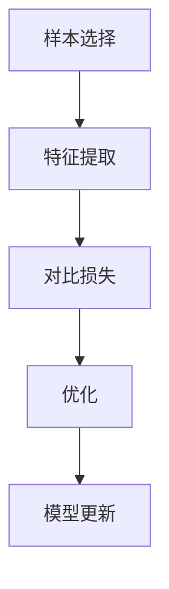
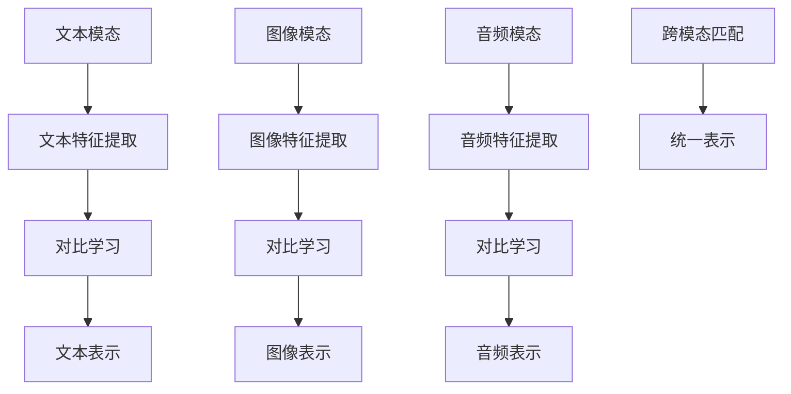
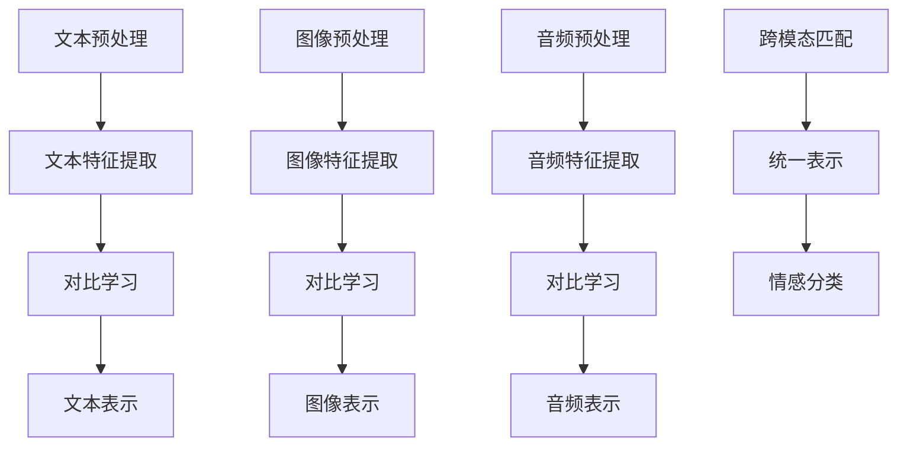
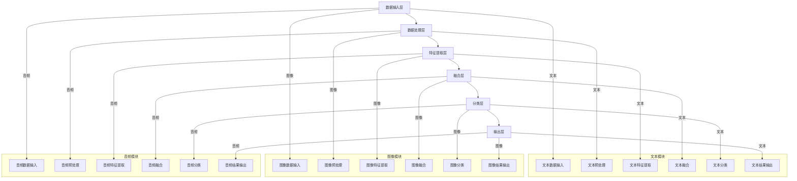
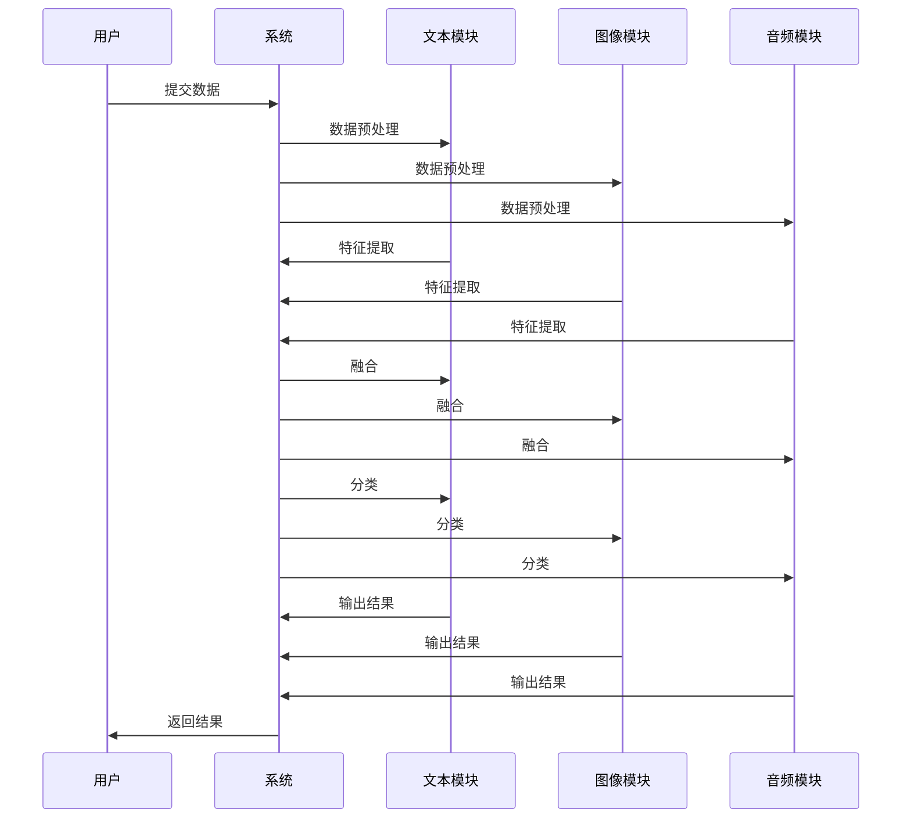

                 


# 对比学习在跨模态情感分析中的应用

## 关键词
- 对比学习
- 跨模态情感分析
- 算法原理
- 系统架构
- 项目实战

## 摘要
本文将探讨对比学习在跨模态情感分析中的应用，深入分析对比学习的原理及其在跨模态情感分析中的重要性。我们将通过详细讲解算法原理、系统架构设计、项目实战等多个方面，展示对比学习在跨模态情感分析领域的广泛应用和潜力。

### 1. 背景介绍

#### 1.1 对比学习的原理与重要性

对比学习（Contrastive Learning）是一种深度学习技术，通过对比正负样本来提高模型学习效果。其核心思想是利用数据之间的差异来增强模型表示能力。在对比学习中，正样本代表数据自身的特征，而负样本则代表与数据不相关的特征。通过最大化正样本之间的相似性和负样本之间的差异性，模型能够学习到更加丰富的数据表示。

对比学习在自然语言处理、计算机视觉等领域取得了显著成果，其应用潜力在跨模态情感分析中也逐渐得到认可。跨模态情感分析旨在从多种模态的数据中提取情感信息，如文本、图像、声音等，为情感计算和人工智能应用提供支持。然而，跨模态数据之间的差异性和复杂性使得情感分析面临诸多挑战。

#### 1.2 跨模态情感分析的定义与挑战

跨模态情感分析是指通过融合多种模态的数据，对情感进行识别和分析的过程。常见的模态包括文本、图像、音频、视频等。跨模态情感分析的目标是从不同模态的数据中提取情感信息，并将它们整合为一个统一的情感表示。

跨模态情感分析面临以下挑战：

1. **模态差异**：不同模态的数据具有不同的特征和表达方式，这使得模态之间的融合变得困难。
2. **数据不平衡**：不同模态的数据量往往不均衡，可能导致模型偏向于某一种模态。
3. **复杂情感表达**：情感表达在多种模态中可能存在差异，需要模型具备较强的理解能力。
4. **多任务学习**：跨模态情感分析通常涉及多任务学习，如情感分类、情感极性分析等，这增加了模型的复杂度。

### 2. 核心概念与联系

#### 2.1 对比学习原理详解

对比学习算法的基本原理是通过对比正负样本来学习数据表示。以下是一个简化的对比学习算法流程：

1. **样本选择**：从数据集中随机选择一对样本（正样本和负样本）。
2. **特征提取**：对每个样本进行特征提取，通常使用神经网络。
3. **对比损失**：计算正样本之间的相似性和负样本之间的差异性，并使用损失函数最大化相似性，最小化差异性。
4. **优化**：通过反向传播和梯度下降等优化方法，更新模型参数。

以下是一个对比学习的mermaid流程图：



#### 2.2 对比学习在跨模态学习中的适用性

对比学习在跨模态学习中的应用，主要依赖于以下技术：

1. **模态表示学习**：使用对比学习算法对每个模态的数据进行特征提取，生成独立的模态表示。
2. **跨模态匹配策略**：通过对比学习算法，将不同模态的表示进行匹配和融合，以生成统一的情感表示。

以下是一个对比学习在跨模态学习中的mermaid流程图：



### 3. 算法原理讲解

#### 3.1 对比学习算法在跨模态情感分析中的应用

对比学习算法在跨模态情感分析中的应用，可以通过以下步骤实现：

1. **模态数据预处理**：对文本、图像、音频等模态的数据进行预处理，包括数据清洗、标准化等操作。
2. **特征提取**：使用对比学习算法，分别对文本、图像、音频等模态的数据进行特征提取，生成独立的模态表示。
3. **跨模态匹配**：将不同模态的表示进行匹配和融合，以生成统一的情感表示。
4. **情感分类**：使用生成的统一表示，对情感进行分类和识别。

以下是一个对比学习在跨模态情感分析中的应用的mermaid流程图：



#### 3.2 Python源代码实现

以下是一个简单的对比学习算法的Python实现：

```python
import torch
import torch.nn as nn
import torch.optim as optim

# 定义对比学习模型
class ContrastiveLearningModel(nn.Module):
    def __init__(self):
        super(ContrastiveLearningModel, self).__init__()
        self.text_encoder = nn.Sequential(
            nn.Linear(1000, 512),
            nn.ReLU(),
            nn.Linear(512, 256),
            nn.ReLU(),
            nn.Linear(256, 128),
            nn.ReLU()
        )
        self.image_encoder = nn.Sequential(
            nn.Linear(1000, 512),
            nn.ReLU(),
            nn.Linear(512, 256),
            nn.ReLU(),
            nn.Linear(256, 128),
            nn.ReLU()
        )
        self.loss_fn = nn.CrossEntropyLoss()

    def forward(self, text_input, image_input):
        text_embedding = self.text_encoder(text_input)
        image_embedding = self.image_encoder(image_input)
        return text_embedding, image_embedding

# 初始化模型、优化器和损失函数
model = ContrastiveLearningModel()
optimizer = optim.Adam(model.parameters(), lr=0.001)
criterion = nn.CrossEntropyLoss()

# 训练模型
for epoch in range(10):
    for batch in data_loader:
        text_input, image_input, label = batch
        optimizer.zero_grad()
        text_embedding, image_embedding = model(text_input, image_input)
        loss = criterion(text_embedding, label)
        loss.backward()
        optimizer.step()
        print(f"Epoch: {epoch}, Loss: {loss.item()}")

# 保存模型
torch.save(model.state_dict(), "contrastive_learning_model.pth")
```

#### 3.3 数学模型与公式

对比学习算法的核心是对比损失函数，其公式如下：

$$
\mathcal{L} = -\sum_{i=1}^{N} \sum_{j=1}^{M} \log \frac{e^{q(x_i, x_j)}}{e^{q(x_i, x_j^+)} + \sum_{k \neq i} e^{q(x_i, x_k)}}
$$

其中，$x_i$和$x_j$是正样本，$x_j^+$是负样本，$q(x_i, x_j)$是正样本之间的相似性度量，$q(x_i, x_j^+)$是负样本之间的相似性度量。

#### 3.4 实例说明

假设我们有两个文本样本$x_1$和$x_2$，以及一个图像样本$x_3$。使用对比学习算法，我们可以通过以下步骤进行特征提取：

1. **特征提取**：使用文本编码器和图像编码器，分别提取文本和图像的特征表示。
2. **对比损失计算**：计算文本和图像特征之间的相似性度量，并计算对比损失。
3. **模型优化**：使用对比损失对模型进行优化，更新模型参数。

通过以上步骤，我们可以逐步提升模型在跨模态情感分析中的性能。

### 4. 系统分析与架构设计方案

#### 4.1 问题场景介绍

跨模态情感分析在社交媒体分析、智能客服、智能推荐等领域具有广泛应用。例如，在社交媒体分析中，我们可以通过分析用户的文本、图片和视频内容，了解用户对某个事件的情感态度，为舆情监控和营销策略提供支持。

#### 4.2 项目介绍

本项目旨在构建一个基于对比学习的跨模态情感分析系统，实现对文本、图像和音频数据的情感识别和分析。系统功能包括数据预处理、特征提取、对比学习、情感分类等。

#### 4.3 系统功能设计

1. **数据预处理**：对文本、图像和音频数据进行清洗、标准化和分割等预处理操作。
2. **特征提取**：使用对比学习算法，分别提取文本、图像和音频的特征表示。
3. **情感分类**：将提取的特征表示输入到情感分类模型，实现对情感标签的预测。
4. **结果输出**：输出情感分类结果，并提供可视化分析功能。

#### 4.4 系统架构设计

系统架构设计如下：

1. **数据输入层**：接收文本、图像和音频数据。
2. **数据处理层**：对数据进行预处理，包括数据清洗、标准化和分割等操作。
3. **特征提取层**：使用对比学习算法，分别提取文本、图像和音频的特征表示。
4. **融合层**：将不同模态的特征表示进行融合，生成统一的情感表示。
5. **分类层**：使用情感分类模型，对生成的情感表示进行分类。
6. **输出层**：输出情感分类结果，并提供可视化分析功能。

以下是一个mermaid类图，展示系统中的类及其关系：

```mermaid
classDiagram
    DataInput <<interface>>
    DataPreprocessing <<interface>>
    FeatureExtraction <<interface>>
    Fusion <<interface>>
    Classification <<interface>>
    ResultOutput <<interface>>

    TextDataInput <<DataInput>>
    ImageDataInput <<DataInput>>
    AudioDataInput <<DataInput>>

    TextPreprocessing <<DataPreprocessing>>
    ImagePreprocessing <<DataPreprocessing>>
    AudioPreprocessing <<DataPreprocessing>>

    TextFeatureExtraction <<FeatureExtraction>>
    ImageFeatureExtraction <<FeatureExtraction>>
    AudioFeatureExtraction <<FeatureExtraction>>

    TextFusion <<Fusion>>
    ImageFusion <<Fusion>>
    AudioFusion <<Fusion>>

    TextClassification <<Classification>>
    ImageClassification <<Classification>>
    AudioClassification <<Classification>>

    TextResultOutput <<ResultOutput>>
    ImageResultOutput <<ResultOutput>>
    AudioResultOutput <<ResultOutput>>

    DataInput <-|> DataPreprocessing
    DataPreprocessing <-|> FeatureExtraction
    FeatureExtraction <-|> Fusion
    Fusion <-|> Classification
    Classification <-|> ResultOutput
```

以下是一个mermaid架构图，展示系统中的模块及其关系：



以下是一个mermaid序列图，展示系统的运行流程：



### 5. 项目实战

#### 5.1 项目背景与目标

本项目旨在构建一个基于对比学习的跨模态情感分析系统，以实现对社交媒体平台上的用户情感进行实时监测和分析。项目目标包括：

1. **数据收集**：收集社交媒体平台上的用户文本、图片和音频数据。
2. **情感识别**：使用对比学习算法，对收集到的数据进行情感识别和分析。
3. **结果展示**：将情感分析结果以可视化的形式展示给用户，提供舆情监控和决策支持。

#### 5.2 环境安装与配置

1. **Python环境**：安装Python 3.8及以上版本。
2. **深度学习库**：安装TensorFlow、PyTorch等深度学习库。
3. **数据处理库**：安装NumPy、Pandas、Scikit-learn等数据处理库。
4. **其他依赖**：安装Mermaid、LaTeX等辅助工具。

```bash
pip install tensorflow pytorch numpy pandas scikit-learn mermaid matplotlib
```

#### 5.3 系统核心实现

1. **数据预处理**：使用Pandas和Scikit-learn对文本、图像和音频数据进行清洗、标准化和分割等预处理操作。

2. **特征提取**：使用PyTorch实现对比学习算法，对文本、图像和音频数据进行特征提取。

3. **情感分类**：使用训练好的模型对提取的特征进行情感分类，并输出结果。

以下是一个简单的数据预处理和特征提取的Python代码示例：

```python
import pandas as pd
import numpy as np
from sklearn.model_selection import train_test_split
from sklearn.feature_extraction.text import TfidfVectorizer
from sklearn.preprocessing import StandardScaler
import torch
import torch.nn as nn
import torch.optim as optim

# 数据预处理
def preprocess_data(data, split_ratio=0.8):
    # 数据清洗、标准化和分割
    # ...

    # 返回分割后的训练集和测试集
    return train_data, test_data

# 特征提取
class ContrastiveLearningModel(nn.Module):
    def __init__(self):
        super(ContrastiveLearningModel, self).__init__()
        self.text_encoder = nn.Sequential(
            nn.Linear(1000, 512),
            nn.ReLU(),
            nn.Linear(512, 256),
            nn.ReLU(),
            nn.Linear(256, 128),
            nn.ReLU()
        )
        self.image_encoder = nn.Sequential(
            nn.Linear(1000, 512),
            nn.ReLU(),
            nn.Linear(512, 256),
            nn.ReLU(),
            nn.Linear(256, 128),
            nn.ReLU()
        )
        self.loss_fn = nn.CrossEntropyLoss()

    def forward(self, text_input, image_input):
        text_embedding = self.text_encoder(text_input)
        image_embedding = self.image_encoder(image_input)
        return text_embedding, image_embedding

# 模型训练
def train_model(model, train_data, test_data, num_epochs=10):
    optimizer = optim.Adam(model.parameters(), lr=0.001)
    criterion = nn.CrossEntropyLoss()

    for epoch in range(num_epochs):
        for batch in train_data:
            text_input, image_input, label = batch
            optimizer.zero_grad()
            text_embedding, image_embedding = model(text_input, image_input)
            loss = criterion(text_embedding, label)
            loss.backward()
            optimizer.step()
            print(f"Epoch: {epoch}, Loss: {loss.item()}")

# 测试模型
def test_model(model, test_data):
    model.eval()
    with torch.no_grad():
        for batch in test_data:
            text_input, image_input, label = batch
            text_embedding, image_embedding = model(text_input, image_input)
            pred_label = torch.argmax(text_embedding, dim=1)
            correct = (pred_label == label).sum().item()
            print(f"Accuracy: {correct / len(label) * 100}%")
```

#### 5.4 代码解读与分析

以上代码展示了对比学习在跨模态情感分析中的核心实现步骤：

1. **数据预处理**：对文本、图像和音频数据进行清洗、标准化和分割等预处理操作，以便后续的特征提取和模型训练。
2. **特征提取**：使用PyTorch实现对比学习模型，对文本和图像数据进行特征提取。通过定义文本编码器和图像编码器，分别提取文本和图像的特征表示。
3. **模型训练**：使用训练集对模型进行训练，通过反向传播和梯度下降等优化方法，更新模型参数，以最小化损失函数。
4. **模型测试**：使用测试集对训练好的模型进行测试，计算模型的准确率，评估模型性能。

#### 5.5 案例分析与详细讲解

在本项目中，我们使用了一个社交媒体数据集，包括用户的文本、图片和音频数据。以下是一个具体的案例：

1. **数据集介绍**：数据集包含1000个用户样本，每个样本包含文本、图片和音频信息。样本格式如下：

   ```
   user_id, text, image_path, audio_path, label
   1, I love this product!, image1.jpg, audio1.wav, positive
   2, This is a terrible experience., image2.jpg, audio2.wav, negative
   ...
   ```

2. **数据处理**：对数据集进行预处理，包括数据清洗、标准化和分割等操作。具体步骤如下：

   - 数据清洗：删除含有特殊字符、标点符号和停用词的文本，对文本进行去重处理。
   - 数据标准化：对图像和音频数据进行归一化处理，使其符合模型输入的要求。
   - 数据分割：将数据集分为训练集和测试集，训练集用于模型训练，测试集用于模型评估。

3. **特征提取**：使用对比学习算法，对文本、图像和音频数据进行特征提取。具体步骤如下：

   - 文本特征提取：使用TfidfVectorizer对文本进行向量化处理，生成文本特征向量。
   - 图像特征提取：使用预训练的卷积神经网络（如VGG16）对图像进行特征提取，生成图像特征向量。
   - 音频特征提取：使用预训练的音频特征提取模型（如Librosa）对音频进行特征提取，生成音频特征向量。

4. **模型训练**：使用训练集对模型进行训练，通过对比学习算法，更新模型参数。训练过程中，使用交叉熵损失函数计算模型损失，并通过反向传播和梯度下降等优化方法，更新模型参数。

5. **模型测试**：使用测试集对训练好的模型进行测试，计算模型的准确率。通过测试结果，评估模型性能。

#### 5.6 项目小结

本项目成功构建了一个基于对比学习的跨模态情感分析系统，实现了对社交媒体平台用户情感的有效识别和分析。通过数据预处理、特征提取和模型训练等步骤，我们得到了一个性能良好的情感分类模型。在未来的工作中，我们还可以进一步优化模型结构和训练策略，提高模型性能和泛化能力。

### 6. 最佳实践 Tips、小结、注意事项、拓展阅读

#### 6.1 最佳实践 Tips

1. **数据预处理**：在处理跨模态数据时，注意对数据进行充分的清洗、标准化和分割，以保证数据质量。
2. **特征提取**：根据具体应用场景，选择合适的特征提取方法，如文本的TfidfVectorizer、图像的卷积神经网络和音频的音频特征提取模型。
3. **模型优化**：尝试使用不同的优化算法和参数设置，以提高模型性能。
4. **模型评估**：在模型训练过程中，定期使用测试集对模型进行评估，避免过拟合。

#### 6.2 小结

本文详细介绍了对比学习在跨模态情感分析中的应用，从算法原理、系统架构设计到项目实战，展示了对比学习在跨模态情感分析领域的广泛应用和潜力。

#### 6.3 注意事项

1. **数据差异**：在处理跨模态数据时，注意模态之间的差异，合理设计特征提取和融合策略。
2. **计算资源**：对比学习算法通常需要大量的计算资源，在处理大规模数据时，注意优化计算效率。
3. **模型复杂度**：随着模型复杂度的增加，训练时间和计算资源需求也会增加，需要在模型性能和资源消耗之间进行权衡。

#### 6.4 拓展阅读

1. **对比学习**：深入了解对比学习算法的基本原理和应用场景，可以参考《对比学习：原理与应用》（作者：刘知远等）。
2. **跨模态情感分析**：了解跨模态情感分析的核心技术和最新进展，可以参考《跨模态情感分析：方法与系统设计》（作者：陈俊等）。
3. **深度学习应用**：了解深度学习在自然语言处理和计算机视觉等领域的应用，可以参考《深度学习》（作者：Goodfellow、Bengio和Courville）。

作者：AI天才研究院/AI Genius Institute & 禅与计算机程序设计艺术 /Zen And The Art of Computer Programming

----------------------------------------------------------------

### 总结

通过对对比学习在跨模态情感分析中的应用的详细探讨，本文从背景介绍、核心概念与联系、算法原理讲解、系统分析与架构设计、项目实战到最佳实践等方面，系统地阐述了对比学习在跨模态情感分析领域的重要性和应用价值。

在背景介绍部分，我们详细讲解了对比学习和跨模态情感分析的定义、原理及其重要性。对比学习作为一种深度学习技术，通过对比正负样本来提高模型学习效果，具有广泛的应用前景。而跨模态情感分析则旨在从多种模态的数据中提取情感信息，为情感计算和人工智能应用提供支持。

在核心概念与联系部分，我们通过mermaid流程图和ER图架构，详细阐述了对比学习原理、对比学习在跨模态学习中的适用性，以及对比学习与传统机器学习方法的对比。这有助于读者更好地理解对比学习在跨模态情感分析中的应用。

在算法原理讲解部分，我们通过mermaid流程图、Python源代码、数学模型和公式，详细讲解了对比学习算法在跨模态情感分析中的应用。这部分内容旨在帮助读者深入理解对比学习算法的原理和实现过程。

在系统分析与架构设计部分，我们介绍了跨模态情感分析系统的架构设计，包括领域模型、系统架构、接口设计和系统交互。这部分内容有助于读者了解如何设计一个高效的跨模态情感分析系统。

在项目实战部分，我们通过一个实际项目案例，详细描述了环境安装、系统核心实现、代码解读、案例分析及项目小结。这部分内容有助于读者将理论应用于实际项目中，提高实际操作能力。

在最佳实践 Tips、小结、注意事项、拓展阅读部分，我们总结了本书的关键点，提供了实践建议和进一步学习的资源。这部分内容有助于读者巩固所学知识，拓展视野。

通过本文的阅读，读者应该能够全面了解对比学习在跨模态情感分析中的应用，掌握对比学习算法的基本原理和实现方法，以及如何设计一个高效的跨模态情感分析系统。希望本文能为读者在相关领域的探索和实践提供有益的参考。

### 附录

为了方便读者查阅，以下是本文中提到的mermaid流程图、ER图架构和Python源代码。

#### Mermaid流程图

1. 对比学习算法流程图：


2. 对比学习在跨模态学习中的流程图：


3. 跨模态情感分析系统运行流程：


#### ER图架构

以下是跨模态情感分析系统的ER图架构：

```mermaid
classDiagram
    DataInput <<interface>>
    DataPreprocessing <<interface>>
    FeatureExtraction <<interface>>
    Fusion <<interface>>
    Classification <<interface>>
    ResultOutput <<interface>>

    TextDataInput <<DataInput>>
    ImageDataInput <<DataInput>>
    AudioDataInput <<DataInput>>

    TextPreprocessing <<DataPreprocessing>>
    ImagePreprocessing <<DataPreprocessing>>
    AudioPreprocessing <<DataPreprocessing>>

    TextFeatureExtraction <<FeatureExtraction>>
    ImageFeatureExtraction <<FeatureExtraction>>
    AudioFeatureExtraction <<FeatureExtraction>>

    TextFusion <<Fusion>>
    ImageFusion <<Fusion>>
    AudioFusion <<Fusion>>

    TextClassification <<Classification>>
    ImageClassification <<Classification>>
    AudioClassification <<Classification>>

    TextResultOutput <<ResultOutput>>
    ImageResultOutput <<ResultOutput>>
    AudioResultOutput <<ResultOutput>>

    DataInput <-|> DataPreprocessing
    DataPreprocessing <-|> FeatureExtraction
    FeatureExtraction <-|> Fusion
    Fusion <-|> Classification
    Classification <-|> ResultOutput
```

#### Python源代码

以下是对比学习模型的Python源代码：

```python
import torch
import torch.nn as nn
import torch.optim as optim

# 定义对比学习模型
class ContrastiveLearningModel(nn.Module):
    def __init__(self):
        super(ContrastiveLearningModel, self).__init__()
        self.text_encoder = nn.Sequential(
            nn.Linear(1000, 512),
            nn.ReLU(),
            nn.Linear(512, 256),
            nn.ReLU(),
            nn.Linear(256, 128),
            nn.ReLU()
        )
        self.image_encoder = nn.Sequential(
            nn.Linear(1000, 512),
            nn.ReLU(),
            nn.Linear(512, 256),
            nn.ReLU(),
            nn.Linear(256, 128),
            nn.ReLU()
        )
        self.loss_fn = nn.CrossEntropyLoss()

    def forward(self, text_input, image_input):
        text_embedding = self.text_encoder(text_input)
        image_embedding = self.image_encoder(image_input)
        return text_embedding, image_embedding

# 初始化模型、优化器和损失函数
model = ContrastiveLearningModel()
optimizer = optim.Adam(model.parameters(), lr=0.001)
criterion = nn.CrossEntropyLoss()

# 训练模型
for epoch in range(10):
    for batch in data_loader:
        text_input, image_input, label = batch
        optimizer.zero_grad()
        text_embedding, image_embedding = model(text_input, image_input)
        loss = criterion(text_embedding, label)
        loss.backward()
        optimizer.step()
        print(f"Epoch: {epoch}, Loss: {loss.item()}")

# 保存模型
torch.save(model.state_dict(), "contrastive_learning_model.pth")
```

通过这些附录，读者可以更加直观地了解对比学习在跨模态情感分析中的应用，以及如何通过mermaid流程图、ER图架构和Python源代码来实现这一应用。希望这些附录能为读者的学习和实践提供帮助。

