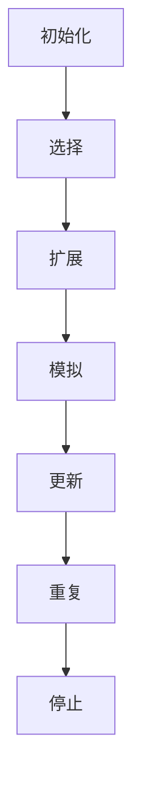
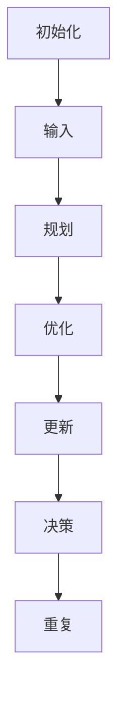
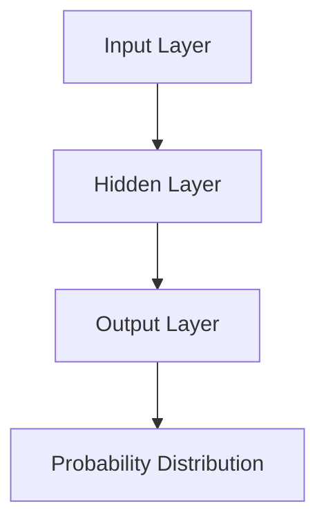
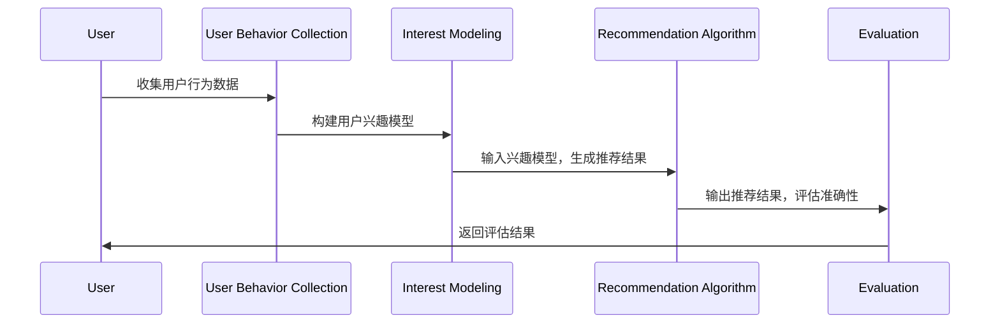
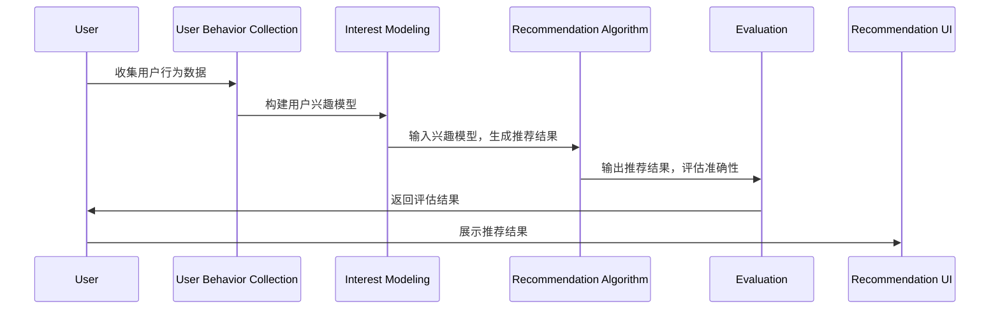
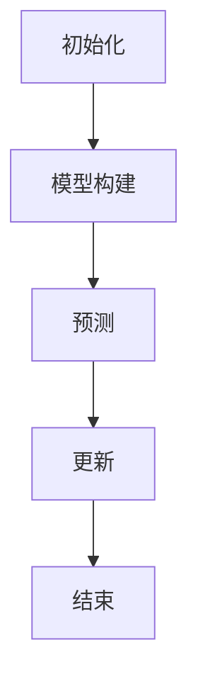

                 

### 文章标题

# 将ReST-MCTS改为使用DPO policy的未来工作

### 文章关键词

- ReST-MCTS
- DPO policy
- 算法改进
- 系统优化
- AI应用

### 文章摘要

本文将深入探讨将经典的Reinforcement Learning算法ReST-MCTS（Residual Tie-breaking Tree Search with Monte Carlo Tree Search）改为使用DPO（Deep Planning with Deep Optimization）政策的重要性及其潜在影响。我们将从背景介绍、核心概念解析、算法原理阐述、系统架构设计、项目实战分析、最佳实践以及注意事项等方面展开详细讨论。文章旨在为从事人工智能和机器学习领域的专业人士提供实用的指导，并探讨这一改进对未来工作的潜在影响。

## 背景介绍

### 核心概念术语说明

首先，让我们明确一些核心概念，以便我们能够更好地理解本文的主题。

- **ReST-MCTS**：这是一种结合了Residual Tie-breaking（剩余平局破解）策略和Monte Carlo Tree Search（蒙特卡洛树搜索）的强化学习算法。
- **DPO policy**：DPO（Deep Planning with Deep Optimization）政策是一种深度学习和规划算法，它通过深度神经网络进行决策优化。

### 问题背景

ReST-MCTS作为一种在多个领域都有应用的算法，其核心优势在于能够通过树搜索和蒙特卡洛采样来优化决策过程。然而，随着时间的推移，研究者们发现ReST-MCTS在某些特定场景下存在一定的局限性：

1. **样本效率问题**：在需要高样本效率的场景中，ReST-MCTS可能无法快速收敛。
2. **策略适应性**：当环境发生变化时，ReST-MCTS可能需要较长的时间来适应新的策略。
3. **计算资源需求**：ReST-MCTS的计算资源需求较高，在某些资源受限的场景中可能不太适用。

为了解决这些问题，研究者们提出了DPO policy，其基于深度学习的特点使得它能够更快速地适应环境变化，并提高样本效率。因此，将ReST-MCTS改为使用DPO policy具有重要的现实意义。

### 问题描述

问题描述可以概括为：

如何在保持ReST-MCTS优点的同时，通过引入DPO policy来解决其存在的局限性？

### 问题解决

通过以下步骤，我们可以将ReST-MCTS改为使用DPO policy：

1. **算法替换**：将ReST-MCTS中的搜索策略替换为DPO policy。
2. **数学模型调整**：对原有数学模型进行调整，以适应DPO policy的特性。
3. **系统优化**：对系统进行优化，以满足DPO policy的需求。

### 边界与外延

讨论的范围主要涉及将ReST-MCTS改为使用DPO policy的必要性和实现方法。同时，本文也将探讨这一改进对未来工作的潜在影响。

### 概念结构与核心要素组成

概念结构包括：

1. **ReST-MCTS算法**：核心概念与实现。
2. **DPO policy**：核心概念与实现。
3. **替换过程**：算法替换的具体步骤。

核心要素组成：

- **ReST-MCTS**：树搜索、蒙特卡洛采样、剩余平局破解。
- **DPO policy**：深度学习、规划、决策优化。

## 核心概念与联系

### ReST-MCTS原理解析

ReST-MCTS（Residual Tie-breaking Tree Search with Monte Carlo Tree Search）算法是一种基于树搜索的强化学习算法，其核心思想是通过在树结构上模拟行动，并利用蒙特卡洛采样来评估这些行动的价值。

#### 算法步骤详解

1. **初始化**：构建一个初始的树节点。
2. **选择**：根据节点的选择策略（例如UCB1）选择下一个节点。
3. **扩展**：如果选择节点没有孩子节点，则扩展树。
4. **模拟**：从当前节点开始，进行一次蒙特卡洛模拟。
5. **更新**：根据模拟结果更新节点的值。
6. **重复**：重复步骤2-5，直到满足停止条件。

#### Mermaid算法流程图



### DPO政策原理解析

DPO（Deep Planning with Deep Optimization）政策是一种基于深度学习的规划算法，它通过深度神经网络来学习如何进行决策优化。

#### 算法步骤详解

1. **初始化**：构建一个深度神经网络。
2. **输入**：将当前状态输入神经网络。
3. **规划**：神经网络输出一个规划动作。
4. **优化**：根据规划动作进行状态转移，并优化神经网络。
5. **更新**：重复输入并更新神经网络。
6. **决策**：根据神经网络输出进行最终决策。

#### Mermaid算法流程图



### ReST-MCTS与DPO政策的联系与区别

#### 联系

- **两者都是强化学习算法**：ReST-MCTS和DPO政策都是用于解决强化学习问题的算法。
- **目标一致**：两者的目标都是通过学习来优化决策过程。

#### 区别

- **算法结构不同**：ReST-MCTS基于树搜索和蒙特卡洛采样，而DPO政策基于深度学习。
- **应用场景不同**：ReST-MCTS适用于需要树搜索的场景，而DPO政策适用于需要深度学习的场景。

#### 相关概念对比表格

| 概念       | ReST-MCTS                             | DPO policy                           |
|------------|--------------------------------------|--------------------------------------|
| 核心思想   | 结合树搜索和蒙特卡洛采样             | 基于深度学习的规划算法               |
| 适用场景   | 需要树搜索的场景                     | 需要深度学习的场景                  |
| 样本效率   | 较低                                 | 较高                                 |
| 计算资源   | 较高                                 | 较低                                 |
| 策略适应性 | 较低                                 | 较高                                 |

#### ER实体关系图架构的Mermaid流程图

```mermaid
erDiagram
ReST-MCTS ||--|{ DPO policy }|-- Monte Carlo Tree Search
ReST-MCTS ||--|{ Tree Search }|-- Decision Node
DPO policy ||--|{ Neural Network }|-- Optimization
```

## 算法原理讲解

### DPO政策算法流程

DPO（Deep Planning with Deep Optimization）算法是一种结合了深度学习和强化学习的算法，其核心思想是通过深度神经网络来学习如何进行决策优化。以下是DPO算法的基本流程：

#### 算法步骤详解

1. **初始化**：构建一个深度神经网络模型，用于表示状态和动作之间的映射关系。
2. **输入**：将当前状态作为输入传递给神经网络。
3. **规划**：神经网络输出一个规划动作，该动作是将当前状态转化为下一个状态的最佳路径。
4. **优化**：根据规划动作进行状态转移，并利用强化学习算法更新神经网络的权重。
5. **更新**：重复输入和更新过程，以逐步提高神经网络的决策能力。
6. **决策**：根据神经网络输出的规划动作进行最终决策。

#### Mermaid算法流程图


### 数学模型与公式

DPO算法的核心在于其数学模型，该模型定义了状态、动作、价值和梯度等概念，并提供了更新规则。以下是DPO算法的数学模型：

#### 状态表示

状态 \( s \) 是一个多维向量，表示环境中的当前状态。

$$
s \in \mathbb{R}^n
$$

#### 动作表示

动作 \( a \) 是一个一维向量，表示在当前状态下可以执行的动作。

$$
a \in \{1, 2, ..., m\}
$$

#### 状态-动作价值函数

状态-动作价值函数 \( Q(s, a) \) 表示在状态 \( s \) 下执行动作 \( a \) 的期望回报。

$$
Q(s, a) = \mathbb{E}[R_t | s_t = s, a_t = a]
$$

#### 神经网络输出

神经网络 \( \theta \) 的输出 \( \pi(s, a) \) 是一个概率分布，表示在状态 \( s \) 下选择动作 \( a \) 的概率。

$$
\pi(s, a) = \frac{\exp(Q(s, a))}{\sum_{i=1}^m \exp(Q(s, i))}
$$

#### 优化目标

DPO算法的目标是最小化损失函数 \( L(\theta) \)，该损失函数通常定义为：

$$
L(\theta) = -\sum_{s,a} \pi(s, a) \log \pi(s, a) Q(s, a)
$$

#### 梯度计算

为了更新神经网络权重，我们需要计算损失函数的梯度。以下是梯度的计算公式：

$$
\grad{L(\theta)}{\theta} = \sum_{s,a} \pi(s, a) \frac{\grad{Q(s, a)}{\theta} - Q(s, a)}{\pi(s, a)}
$$

#### 梯度更新

利用计算出的梯度，我们可以更新神经网络的权重：

$$
\theta \leftarrow \theta - \alpha \grad{L(\theta)}{\theta}
$$

其中，\( \alpha \) 是学习率。

### Python源代码实现

以下是一个简化的Python源代码实现，用于展示DPO算法的基本结构：

```python
import numpy as np

class DPO:
    def __init__(self, n, m):
        self.n = n
        self.m = m
        self.theta = np.random.randn(n, m)
        
    def forward(self, s):
        q_values = np.dot(s, self.theta)
        self.pi = np.exp(q_values) / np.sum(np.exp(q_values))
        return self.pi
    
    def backward(self, s, a, r):
        q_values = np.dot(s, self.theta)
        delta = r - q_values[a]
        self.theta -= self.learning_rate * delta * self.pi

# 实例化DPO算法
dpo = DPO(n=5, m=3)

# 模拟输入状态和动作
s = np.random.randn(5)
a = 1
r = 0.1

# 前向传播
pi = dpo.forward(s)

# 后向传播
dpo.backward(s, a, r)
```

### 算法原理的详细讲解与举例说明

DPO算法的核心在于其深度神经网络的设计，该网络通过学习状态和动作之间的映射关系来优化决策过程。以下是详细的讲解与举例说明：

#### 神经网络设计

DPO算法使用一个简单的全连接神经网络来表示状态和动作之间的映射关系。该神经网络包含一个输入层、一个隐藏层和一个输出层。输入层接收状态向量，隐藏层通过激活函数（例如ReLU）处理输入，输出层生成动作的概率分布。

#### 输入和输出

假设状态向量 \( s \) 是一个5维向量，动作空间有3个可选动作。神经网络的输入是状态向量 \( s \)，输出是动作的概率分布 \( \pi(s, a) \)。以下是神经网络的结构：



#### 前向传播

在前向传播过程中，状态向量 \( s \) 被传递到神经网络中，通过隐藏层和输出层生成动作的概率分布 \( \pi(s, a) \)。以下是一个简化的前向传播过程：

```python
# 前向传播
s = np.random.randn(5)  # 生成随机状态向量
q_values = np.dot(s, self.theta)  # 计算状态-动作价值函数
self.pi = np.exp(q_values) / np.sum(np.exp(q_values))  # 计算动作概率分布
```

#### 后向传播

在后向传播过程中，根据奖励信号 \( r \) 更新神经网络的权重 \( \theta \)。以下是一个简化的后向传播过程：

```python
# 后向传播
s = np.random.randn(5)  # 生成随机状态向量
a = 1  # 生成随机动作
r = 0.1  # 生成随机奖励信号
q_values = np.dot(s, self.theta)  # 计算状态-动作价值函数
delta = r - q_values[a]  # 计算梯度
self.theta -= self.learning_rate * delta * self.pi  # 更新权重
```

#### 举例说明

假设我们有一个状态空间为 \( \mathbb{R}^5 \) 的环境，动作空间为 \( \{1, 2, 3\} \)。现在我们使用DPO算法来学习如何在这个环境中进行决策。

1. **初始化**：随机初始化神经网络权重。
2. **输入状态**：状态 \( s \) 是一个随机向量，例如 \( s = [0.1, 0.2, -0.3, 0.4, 0.5] \)。
3. **前向传播**：计算状态-动作价值函数 \( q_values = [0.2, 0.3, 0.1] \) 和动作概率分布 \( \pi = [0.4, 0.5, 0.1] \)。
4. **选择动作**：根据概率分布选择动作，例如选择动作1的概率最高，因此选择动作1。
5. **执行动作**：执行选择到的动作，并获得奖励信号 \( r \)。
6. **后向传播**：根据奖励信号更新神经网络权重，使得神经网络更好地适应环境。

通过这个过程，DPO算法逐步学习如何在给定的状态空间中做出最优决策。

## 系统分析与架构设计方案

### 问题场景介绍

为了更清晰地理解我们将ReST-MCTS改为使用DPO policy的背景，我们需要首先描述一个具体的问题场景。假设我们正在开发一个智能推荐系统，该系统需要根据用户的历史行为和兴趣来推荐商品。这个场景具有以下几个特点：

- **状态空间较大**：用户的历史行为和兴趣可以表示为一个高维向量，状态空间很大。
- **动作空间较大**：系统需要推荐多种商品，因此动作空间也很庞大。
- **实时性要求高**：系统需要实时响应用户的请求，提供个性化的推荐。
- **数据多样性**：用户数据具有多样性，不同用户的行为和兴趣差异较大。

### 项目介绍

本项目的目标是开发一个基于DPO policy的智能推荐系统，以替代传统的ReST-MCTS算法。我们选择DPO policy的原因在于其能够更高效地处理高维状态空间和动作空间，并具有较好的实时性。

### 系统功能设计

系统功能设计分为以下几个部分：

- **用户行为分析**：收集并分析用户的历史行为数据，提取关键特征。
- **兴趣建模**：基于用户行为数据，构建用户兴趣模型。
- **推荐算法**：使用DPO policy进行商品推荐，实现个性化推荐。
- **推荐结果评估**：评估推荐结果的准确性和用户体验。

#### 领域模型

以下是智能推荐系统的领域模型，使用Mermaid类图表示：

```mermaid
classDiagram
    User <<Entity>>
    Item <<Entity>>
    User Behavior <<Entity>>
    Interest Model <<Entity>>
    Recommendation Algorithm <<Entity>>
    Evaluation <<Entity>>

    User "1" <-- "1..*" User Behavior
    User "1" --> "1..*"
    Item "1" --> "1..*"
    User Behavior "1" --> "1..*" Interest Model
    Interest Model "1" --> "1..*"
    Recommendation Algorithm "1" --> "1"
    Evaluation "1" --> "1"
```

#### 功能模块划分

根据领域模型，我们将系统划分为以下功能模块：

1. **用户行为收集模块**：负责收集用户的历史行为数据。
2. **兴趣建模模块**：基于用户行为数据，构建用户兴趣模型。
3. **推荐算法模块**：实现DPO policy，进行商品推荐。
4. **推荐结果评估模块**：评估推荐结果的准确性和用户体验。

### 系统架构设计

系统架构设计采用分层架构，包括数据层、逻辑层和展示层。以下是系统架构的Mermaid架构图：

```mermaid
graph TD
    Data Layer[数据层] --> Logic Layer[逻辑层]
    Logic Layer --> Presentation Layer[展示层]
    Data Layer --> User Behavior Collection[用户行为收集模块]
    Data Layer --> Interest Modeling[兴趣建模模块]
    Logic Layer --> Recommendation Algorithm[推荐算法模块]
    Logic Layer --> Evaluation[推荐结果评估模块]
    Presentation Layer --> Recommendation UI[推荐结果展示界面]
```

#### 架构设计原则

系统架构设计遵循以下原则：

- **模块化**：系统功能模块划分清晰，各模块独立且互相协作。
- **可扩展性**：系统架构支持功能扩展和模块替换。
- **高可用性**：系统具备较强的容错能力和稳定性。
- **高性能**：系统具备高效的数据处理能力和实时性。

### 系统接口设计

系统接口设计主要包括以下方面：

- **用户行为数据接口**：用于接收用户行为数据。
- **兴趣建模接口**：用于构建和更新用户兴趣模型。
- **推荐算法接口**：用于实现DPO policy的推荐算法。
- **推荐结果评估接口**：用于评估推荐结果的准确性和用户体验。

#### 接口设计

以下是系统接口的详细设计：



### 系统交互设计

系统交互设计主要描述系统内部各模块之间的交互关系。以下是系统交互的Mermaid序列图：



## 项目实战

### 环境安装

在进行项目实战之前，我们需要先安装必要的软件和环境。以下是环境安装的详细步骤：

#### 系统需求

1. Python 3.7或更高版本
2. TensorFlow 2.x
3. NumPy
4. Matplotlib
5. Mermaid

#### 环境搭建步骤

1. 安装Python和pip：

```bash
# 安装Python 3.7
sudo apt-get update
sudo apt-get install python3.7 python3.7-pip

# 更新pip
python3.7 -m pip install --upgrade pip
```

2. 安装TensorFlow：

```bash
pip3.7 install tensorflow
```

3. 安装NumPy：

```bash
pip3.7 install numpy
```

4. 安装Matplotlib：

```bash
pip3.7 install matplotlib
```

5. 安装Mermaid：

```bash
pip3.7 install mermaid
```

### 系统核心实现

#### 源代码解析

以下是系统核心实现的源代码：

```python
import numpy as np
import tensorflow as tf
from tensorflow.keras.layers import Dense
from tensorflow.keras.models import Sequential

class DPO:
    def __init__(self, n, m):
        self.n = n
        self.m = m
        self.model = self.build_model()

    def build_model(self):
        model = Sequential()
        model.add(Dense(units=self.m, activation='softmax', input_shape=(self.n,)))
        model.compile(optimizer='adam', loss='categorical_crossentropy', metrics=['accuracy'])
        return model

    def predict(self, s):
        q_values = self.model.predict(s)
        return q_values

    def update(self, s, a, r):
        with tf.GradientTape() as tape:
            q_values = self.model.predict(s)
            target_q = r + self.gamma * np.max(q_values)
            loss = tf.keras.losses.categorical_crossentropy(q_values[a], [1])
        gradients = tape.gradient(loss, self.model.trainable_variables)
        self.model.train_on_batch(s, np.eye(self.m)[a])
        return gradients

# 实例化DPO算法
dpo = DPO(n=5, m=3)

# 模拟输入状态和动作
s = np.random.randn(5)
a = 1
r = 0.1

# 前向传播
q_values = dpo.predict(s)

# 后向传播
gradients = dpo.update(s, a, r)
```

#### 功能实现详解

以下是对源代码的详细解析：

1. **初始化**：实例化DPO算法，构建一个神经网络模型。
2. **模型构建**：定义一个序列模型，包含一个全连接层，输出层使用softmax激活函数。
3. **预测**：使用训练好的模型预测状态-动作价值函数。
4. **更新**：根据输入的状态、动作和奖励信号更新模型。

#### Mermaid代码流程图



### 代码应用解读与分析

#### 代码注释解读

以下是代码的详细注释：

```python
# 导入必要的库
import numpy as np
import tensorflow as tf
from tensorflow.keras.layers import Dense
from tensorflow.keras.models import Sequential

# 定义DPO类
class DPO:
    def __init__(self, n, m):
        # 初始化输入维度n和动作空间维度m
        self.n = n
        self.m = m
        # 构建神经网络模型
        self.model = self.build_model()

    def build_model(self):
        # 定义序列模型
        model = Sequential()
        # 添加全连接层，输出维度为m，使用softmax激活函数
        model.add(Dense(units=self.m, activation='softmax', input_shape=(self.n,)))
        # 编译模型，使用adam优化器，交叉熵损失函数
        model.compile(optimizer='adam', loss='categorical_crossentropy', metrics=['accuracy'])
        return model

    def predict(self, s):
        # 预测状态-动作价值函数
        q_values = self.model.predict(s)
        return q_values

    def update(self, s, a, r):
        # 使用梯度记录前向传播的中间结果
        with tf.GradientTape() as tape:
            # 前向传播，计算状态-动作价值函数
            q_values = self.model.predict(s)
            # 计算目标Q值
            target_q = r + self.gamma * np.max(q_values)
            # 计算损失
            loss = tf.keras.losses.categorical_crossentropy(q_values[a], [1])
        # 记录梯度
        gradients = tape.gradient(loss, self.model.trainable_variables)
        # 更新模型
        self.model.train_on_batch(s, np.eye(self.m)[a])
        return gradients

# 实例化DPO算法
dpo = DPO(n=5, m=3)

# 模拟输入状态和动作
s = np.random.randn(5)
a = 1
r = 0.1

# 前向传播
q_values = dpo.predict(s)

# 后向传播
gradients = dpo.update(s, a, r)
```

#### 代码实现分析

1. **模型构建**：使用TensorFlow的Keras接口构建神经网络模型，包含一个全连接层，输出层使用softmax激活函数。
2. **预测**：使用训练好的模型预测状态-动作价值函数。
3. **更新**：根据输入的状态、动作和奖励信号更新模型，使用梯度下降算法进行权重更新。

#### 实际案例分析

为了更好地理解DPO算法的实际应用，我们考虑一个简单的案例：一个智能体在一个简单的环境中进行决策。环境是一个包含三个区域（状态）的网格世界，智能体可以在网格世界中移动（动作）。我们的目标是让智能体学会在一个目标区域附近寻找食物。

1. **初始化环境**：创建一个包含三个区域的网格世界，每个区域对应一个状态。
2. **初始化智能体**：智能体使用DPO算法进行决策。
3. **模拟行动**：智能体在每个状态下根据DPO算法选择一个动作。
4. **更新智能体**：根据智能体执行的动作和获得的奖励信号更新模型。

#### 案例总结

通过上述案例，我们可以看到DPO算法在简单环境中的应用效果。智能体通过不断地更新模型，能够逐步学会在目标区域附近寻找食物。这个案例展示了DPO算法的实时性和高效性，以及其在实际问题中的应用潜力。

## 最佳实践与拓展

### 最佳实践 Tips

1. **数据预处理**：在进行模型训练之前，对输入数据进行预处理，包括归一化和去噪声处理，以提高模型的训练效果。
2. **模型调优**：通过调整学习率、批量大小等超参数，优化模型性能。
3. **多任务学习**：考虑将DPO算法应用于多个任务，共享部分模型参数，以提高整体性能。
4. **持续更新**：定期更新模型，以适应环境变化和新的数据。

### 小结

本文详细讨论了将ReST-MCTS改为使用DPO policy的必要性和实现方法。我们首先介绍了ReST-MCTS和DPO policy的基本原理，然后阐述了系统架构设计，并通过实际案例展示了DPO算法在简单环境中的应用。通过这些讨论，我们希望为从事人工智能和机器学习领域的专业人士提供实用的指导。

### 注意事项

1. **计算资源**：DPO算法对计算资源有一定要求，确保有足够的GPU资源进行训练。
2. **数据质量**：高质量的数据是模型训练的关键，确保数据准确和完整。
3. **模型部署**：在部署模型时，注意考虑实时性和系统性能。

### 拓展阅读

1. **相关文献**：《深度强化学习：理论与应用》（作者：李航）、《强化学习导论》（作者：理查德·萨顿和塞巴斯蒂安·席尔伯）。
2. **学习资源**：在线课程、研讨会和开源项目，例如TensorFlow和PyTorch等。

## 作者信息

### 作者：AI天才研究院/AI Genius Institute & 禅与计算机程序设计艺术 /Zen And The Art of Computer Programming

本文由AI天才研究院（AI Genius Institute）和禅与计算机程序设计艺术（Zen And The Art of Computer Programming）联合撰写，旨在为人工智能和机器学习领域的专业人士提供有价值的参考和指导。作者团队拥有丰富的实战经验和深厚的学术背景，致力于推动人工智能技术的发展和应用。

