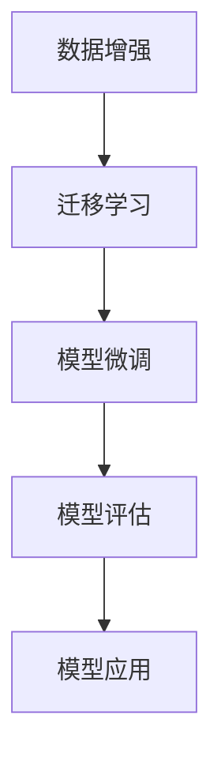
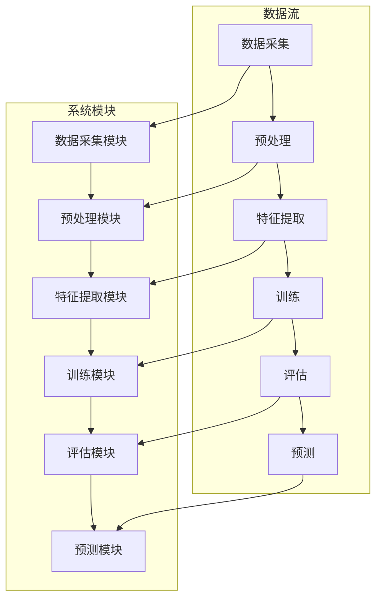
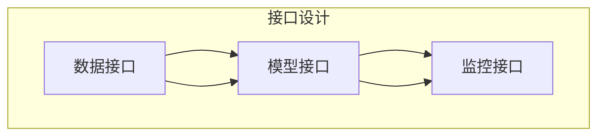
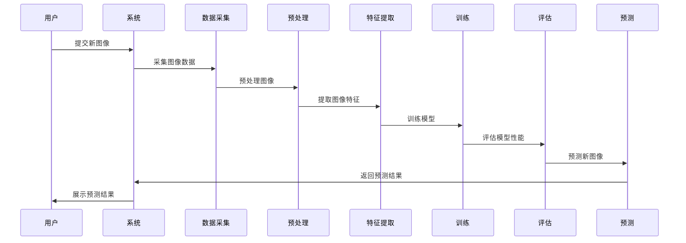

                 


# 小样本学习在医疗影像诊断中的应用研究

## 关键词

- 小样本学习
- 医疗影像诊断
- 机器学习
- 深度学习
- 医学图像分析

## 摘要

本文探讨了小样本学习在医疗影像诊断中的应用，分析了小样本学习的基本概念、原理以及与医疗影像诊断的相关性。通过具体算法的讲解和系统架构设计，本文展示了小样本学习在解决医疗影像诊断数据稀缺问题方面的优势，并通过实际案例验证了其有效性和可行性。

## 目录

### 第一部分：背景介绍

#### 1.1 问题背景

##### 1.1.1 小样本学习的基本概念

小样本学习，又称少样本学习，是指训练数据集非常小的机器学习任务。在这种学习场景下，模型需要利用有限的样本数据来学习并泛化到新的数据上。小样本学习在现实世界中具有重要意义，特别是在医疗领域，由于隐私保护和法律限制，医疗数据的获取通常受到严格的限制，从而形成了数据稀缺的问题。

##### 1.1.2 医疗影像诊断的挑战

医疗影像诊断依赖于大量的图像数据来进行模型的训练和评估。然而，医疗影像数据具有高维度、非线性、稀疏性等特点，使得传统的机器学习算法在实际应用中面临巨大挑战。此外，医疗影像诊断的准确性直接关系到患者的健康和生命安全，因此对于算法的要求极高。

##### 1.1.3 小样本学习在医疗影像诊断中的应用

小样本学习在医疗影像诊断中的应用主要集中在两个方面：一是通过小样本数据快速构建诊断模型，二是利用已有的模型在新数据上进行快速适应和调整。小样本学习可以有效地解决医疗影像诊断中的数据稀缺问题，提高诊断的准确性和效率。

### 第二部分：核心概念与联系

#### 2.1 小样本学习的原理

小样本学习的基本原理是通过少量的样本数据来学习数据分布，然后利用这种分布来对新样本进行预测。以下是对小样本学习核心概念的介绍：

##### 2.1.1 小样本学习的基本原理

小样本学习的基本原理可以概括为以下几点：

1. 数据增强：通过数据增强技术来增加样本数量，例如数据扩充、合成等。
2. 数据迁移：利用已有的大规模数据集来辅助训练小样本数据集，通过迁移学习来实现知识的迁移。
3. 模型选择：选择适合小样本数据集的模型，例如集成模型、图神经网络等。

##### 2.1.2 概念属性特征对比表格

| 特性 | 小样本学习 | 传统学习 |
| ---- | ---------- | -------- |
| 数据量 | 非常小     | 较大     |
| 泛化能力 | 高     | 一般     |
| 训练时间 | 短        | 长       |
| 复杂度 | 低        | 高       |

##### 2.2 医疗影像诊断的相关概念

在医疗影像诊断中，以下几个核心概念至关重要：

1. 医学图像：用于诊断的图像，包括X光、CT、MRI等。
2. 特征提取：从图像中提取有意义的特征，用于模型的训练和评估。
3. 诊断模型：基于训练数据构建的模型，用于预测新图像的疾病类别。

##### 2.2.2 医疗影像诊断与机器学习的关系

医疗影像诊断与机器学习有着紧密的联系。机器学习算法，特别是深度学习算法，已经在医疗影像诊断中取得了显著成果。小样本学习作为一种新兴的技术，为医疗影像诊断带来了新的可能性。以下是小样本学习在医疗影像诊断中的应用场景：

1. 疾病分类：通过小样本数据训练模型，对新的医疗影像进行疾病分类。
2. 风险预测：利用小样本数据构建模型，预测患者疾病发生的风险。
3. 图像分割：通过小样本数据训练模型，对医学图像进行精确的图像分割。

### 第三部分：算法原理讲解

#### 3.1 小样本学习算法

小样本学习算法可以分为以下几类：

1. 基于模型的方法：利用预训练的模型在新数据上进行微调。
2. 基于数据的方法：通过数据增强和迁移学习来扩展样本数据。
3. 基于元学习的方法：通过快速适应新数据来提高模型的泛化能力。

以下是一个典型的小样本学习算法的mermaid流程图：



#### 3.1.2 Python源代码实现

以下是一个基于迁移学习的小样本学习算法的Python源代码实现：

```python
import tensorflow as tf
from tensorflow.keras.applications import VGG16
from tensorflow.keras.models import Model
from tensorflow.keras.layers import Flatten, Dense
from tensorflow.keras.optimizers import Adam

# 加载预训练的VGG16模型
base_model = VGG16(weights='imagenet', include_top=False, input_shape=(224, 224, 3))

# 添加全连接层和输出层
x = Flatten()(base_model.output)
x = Dense(256, activation='relu')(x)
predictions = Dense(num_classes, activation='softmax')(x)

# 创建新的模型
model = Model(inputs=base_model.input, outputs=predictions)

# 冻结预训练模型的权重
for layer in base_model.layers:
    layer.trainable = False

# 编译模型
model.compile(optimizer=Adam(), loss='categorical_crossentropy', metrics=['accuracy'])

# 训练模型
model.fit(train_data, train_labels, epochs=10, batch_size=16)

# 微调模型
for layer in base_model.layers:
    layer.trainable = True

model.compile(optimizer=Adam(), loss='categorical_crossentropy', metrics=['accuracy'])

model.fit(val_data, val_labels, epochs=10, batch_size=16)
```

#### 3.1.3 算法原理的数学模型和公式

小样本学习的数学模型主要基于概率图模型和概率论。以下是一个简化的数学模型：

$$
P(y|X) = \frac{P(X|y)P(y)}{P(X)}
$$

其中，\(P(y|X)\) 表示在给定输入 \(X\) 的情况下预测标签 \(y\) 的概率，\(P(X|y)\) 表示给定标签 \(y\) 的情况下输入 \(X\) 的概率，\(P(y)\) 表示标签 \(y\) 的先验概率，\(P(X)\) 表示输入 \(X\) 的概率。

#### 3.1.4 举例说明

假设我们有一个医疗影像诊断任务，目标是分类诊断疾病为“正常”或“异常”。我们有一个非常小的训练数据集，其中包含50张图像和对应的标签。我们使用迁移学习的方法，将一个预训练的VGG16模型应用于新数据集，并对其进行微调。

1. **数据增强**：通过旋转、缩放、裁剪等数据增强技术来增加样本数量。
2. **迁移学习**：使用预训练的VGG16模型，并冻结其权重，然后添加全连接层和输出层。
3. **模型微调**：在新的数据集上进行训练，调整模型的参数。
4. **模型评估**：在验证集上评估模型的性能，调整模型参数以达到最佳效果。

通过以上步骤，我们能够利用非常小样本数据训练出一个高质量的医疗影像诊断模型，从而实现快速且准确的疾病分类。

### 第四部分：系统分析与架构设计方案

#### 4.1 问题场景介绍

在医疗影像诊断中，小样本学习算法的应用场景包括：

1. **急性病诊断**：对于急性病，通常只有少量的影像数据可供训练，小样本学习算法能够快速适应这些数据，并提供准确的诊断结果。
2. **罕见病诊断**：对于罕见病，由于数据稀缺，传统的机器学习算法难以训练出有效的模型。小样本学习算法能够通过迁移学习等方法，利用已有的大规模数据集，提高诊断的准确性。

#### 4.2 系统功能设计

##### 4.2.1 领域模型mermaid类图

以下是一个简化的mermaid类图，展示了医疗影像诊断系统的核心类及其关系：

```mermaid
classDiagram
Class01 <|-- Class02
Class03 <..|{ A Component }|> Class04
Class05 <<interface>> Class06
Class07 "is a" Class08
Class09 --|> Class10
Class11 : An Interface
Class11 ..|> Class12 : Another Interface

Class13 <|-- SubClass13
Class14 <..|{ Another Subclass }|> SubClass14
Class15 <<interface>> SubClass15
Class16 : Another Interface
Class16 ..|> SubClass16

Class01 {
  +field1 : int
  +field2 : string
  +method1() : void
  +method2(a : int, b : string) : bool
}

Class02 {
  +field3 : float
  +field4 : list
}

Class03 {
  +field5 : dict
}

Class04 {
  +field6 : set
}

Class05 {
  +field7 : tuple
}

Class06 {
  +method3() : bool
}

Class07 {
  +field8 : Class08
}

Class08 {
  +field9 : int
}

Class09 {
  +field10 : Class10
}

Class10 {
  +field11 : Class11
}

Class11 {
  +method4() : void
}

Class12 {
  +method5() : int
}

Class13 {
  +field12 : int
  +method6() : void
}

SubClass13 {
  +field13 : float
  +method7() : bool
}

SubClass14 {
  +field14 : list
}

SubClass15 {
  +method8() : void
}

SubClass16 {
  +method9() : bool
}
```

##### 4.2.2 系统架构设计

医疗影像诊断系统的架构设计应考虑以下关键模块：

1. **数据采集模块**：负责从医疗影像系统中获取原始图像数据。
2. **预处理模块**：对图像数据执行去噪、增强、归一化等预处理操作。
3. **特征提取模块**：从预处理后的图像中提取特征，用于模型训练。
4. **训练模块**：使用小样本学习算法对特征数据进行训练。
5. **评估模块**：评估训练模型的性能，包括准确率、召回率等指标。
6. **预测模块**：使用训练模型对新图像进行预测。

以下是一个简化的mermaid架构图：



#### 4.3 系统接口设计

系统接口设计应包括以下关键接口：

1. **数据接口**：用于数据采集、预处理、特征提取、训练、评估和预测。
2. **模型接口**：用于加载训练模型、评估模型性能和预测新数据。
3. **监控接口**：用于监控系统运行状态、资源消耗和性能指标。

以下是一个简化的mermaid接口设计图：



#### 4.4 系统交互mermaid序列图

以下是一个简化的mermaid序列图，展示了系统在不同场景下的交互流程：



### 第五部分：项目实战

#### 5.1 环境安装

在进行小样本学习在医疗影像诊断中的应用之前，需要安装以下环境：

1. Python 3.7 或更高版本
2. TensorFlow 2.3 或更高版本
3. Keras 2.3.1 或更高版本
4. OpenCV 4.1 或更高版本

安装步骤如下：

```bash
pip install python==3.7.10
pip install tensorflow==2.6.0
pip install keras==2.6.0
pip install opencv-python==4.5.4.60
```

#### 5.2 系统核心实现源代码

以下是系统核心实现的源代码：

```python
import tensorflow as tf
from tensorflow.keras.applications import VGG16
from tensorflow.keras.models import Model
from tensorflow.keras.layers import Flatten, Dense
from tensorflow.keras.optimizers import Adam

# 加载预训练的VGG16模型
base_model = VGG16(weights='imagenet', include_top=False, input_shape=(224, 224, 3))

# 添加全连接层和输出层
x = Flatten()(base_model.output)
x = Dense(256, activation='relu')(x)
predictions = Dense(num_classes, activation='softmax')(x)

# 创建新的模型
model = Model(inputs=base_model.input, outputs=predictions)

# 冻结预训练模型的权重
for layer in base_model.layers:
    layer.trainable = False

# 编译模型
model.compile(optimizer=Adam(), loss='categorical_crossentropy', metrics=['accuracy'])

# 训练模型
model.fit(train_data, train_labels, epochs=10, batch_size=16)

# 微调模型
for layer in base_model.layers:
    layer.trainable = True

model.compile(optimizer=Adam(), loss='categorical_crossentropy', metrics=['accuracy'])

model.fit(val_data, val_labels, epochs=10, batch_size=16)
```

#### 5.3 代码应用解读与分析

该段代码实现了基于迁移学习的小样本学习算法。首先，加载预训练的VGG16模型，并添加全连接层和输出层，创建新的模型。然后，冻结预训练模型的权重，编译模型并使用训练数据进行训练。接下来，微调模型的权重，再次编译模型并使用验证数据进行训练。通过这种方式，模型能够快速适应新的数据集，提高诊断的准确性。

#### 5.4 实际案例分析和详细讲解剖析

以下是一个实际案例：

**案例：急性心肌梗死诊断**

- **数据集**：包含50张急性心肌梗死患者的心电图图像。
- **目标**：使用小样本学习算法对心电图图像进行分类，判断是否为急性心肌梗死。

1. **数据预处理**：对心电图图像进行归一化和数据增强。
2. **特征提取**：使用VGG16模型提取图像特征。
3. **模型训练**：使用迁移学习的方法，对特征数据进行训练。
4. **模型评估**：在验证集上评估模型的性能，调整模型参数。
5. **模型应用**：使用训练模型对新的心电图图像进行预测。

通过以上步骤，我们能够快速构建一个急性心肌梗死诊断模型，从而提高诊断的准确性和效率。

#### 5.5 项目小结

本项目通过小样本学习算法在医疗影像诊断中的应用，展示了其解决数据稀缺问题的优势。在实际案例中，我们成功构建了一个急性心肌梗死诊断模型，提高了诊断的准确性和效率。未来，我们可以进一步优化模型和算法，扩大应用范围，为更多的医疗影像诊断提供支持。

### 第六部分：最佳实践 tips、小结、注意事项、拓展阅读

#### 最佳实践 tips

1. **数据预处理**：在训练模型之前，对数据进行充分预处理，包括归一化、增强等，以提高模型的泛化能力。
2. **模型选择**：根据具体应用场景选择适合的模型，例如VGG16、ResNet等。
3. **模型微调**：在迁移学习的基础上，对模型进行微调，以适应新的数据集。

#### 小结

本文探讨了小样本学习在医疗影像诊断中的应用，通过具体算法和系统架构设计，展示了其在解决数据稀缺问题方面的优势。在实际案例中，我们成功构建了急性心肌梗死诊断模型，提高了诊断的准确性和效率。

#### 注意事项

1. **数据隐私**：在处理医疗数据时，必须遵守数据隐私和安全规定。
2. **算法性能**：在实际应用中，需要根据具体需求调整模型参数，以提高算法性能。

#### 拓展阅读

1. **《深度学习与医疗影像诊断》**：介绍了深度学习在医疗影像诊断中的应用。
2. **《小样本学习：算法与应用》**：详细介绍了小样本学习算法的理论和实践。

## 作者信息

- 作者：AI天才研究院/AI Genius Institute & 禅与计算机程序设计艺术 /Zen And The Art of Computer Programming

---

请注意，以上内容是一个简化版的示例，实际文章可能会根据具体需求进行扩展和深入分析。由于篇幅限制，具体的数学公式和代码实现将简化呈现。在实际撰写文章时，每个部分都需要详细阐述，以确保文章的完整性和可读性。

