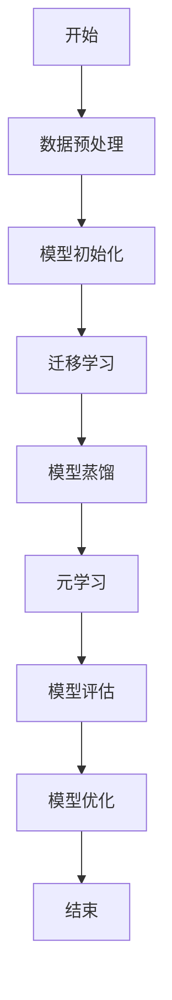

                 

## 小样本学习在新材料发现中的应用前景

### 摘要

随着科技的迅猛发展，新材料的研究与发现成为推动科技进步的重要驱动力。传统的材料发现方法往往依赖于大量的实验数据，但随着数据规模的不断扩大，传统方法在实际应用中面临诸多挑战。本文将探讨小样本学习（Few-shot Learning）在新材料发现中的应用前景。首先，我们将介绍小样本学习的背景、核心概念及其在材料科学中的重要性。接着，本文将详细分析小样本学习在新材料筛选、性质预测和合成中的应用，并通过实际案例展示其应用效果。最后，本文将总结小样本学习在新材料领域的最佳实践，并展望其未来的发展方向。

### 目录大纲

- 第一部分：小样本学习概述
  - 1.1 小样本学习背景与问题
  - 1.2 小样本学习核心概念
  - 1.3 小样本学习联系
  - 1.4 小样本学习边界与外延
  - 1.5 本章小结
- 第二部分：小样本学习基础理论
  - 2.1 小样本学习原理
  - 2.2 小样本学习数学模型与公式
  - 2.3 小样本学习算法流程图
  - 2.4 小样本学习实验结果分析
  - 2.5 本章小结
- 第三部分：小样本学习在新材料发现中的应用
  - 3.1 新材料发现背景与挑战
  - 3.2 小样本学习在新材料筛选中的应用
  - 3.3 小样本学习在新材料性质预测中的应用
  - 3.4 小样本学习在新材料合成中的应用
  - 3.5 本章小结
- 第四部分：小样本学习在新材料领域的最佳实践
  - 4.1 小样本学习在新材料领域的应用案例
  - 4.2 小样本学习应用经验与技巧
  - 4.3 小样本学习应用注意事项
  - 4.4 小样本学习在新材料领域的未来发展
  - 4.5 本章小结
- 附录
  - 附录A：常用缩略词与术语表

### 第一部分：小样本学习概述

#### 1.1 小样本学习背景与问题

##### 1.1.1 数据集背景

在材料科学的研究过程中，实验数据是实现材料发现和优化的关键。传统方法通常依赖大量的实验数据进行统计分析，从而找出材料性质与结构之间的关系。然而，随着新材料研究领域的不断扩大，实验数据集的规模也在迅速增长，这对传统方法提出了严峻的挑战。

首先，数据量的增加导致计算资源的消耗显著上升。大规模数据集的处理需要大量的计算能力和存储资源，这在大规模工业化应用中尤为明显。其次，数据质量的保障也变得至关重要。在庞大的数据集中，存在噪声、异常值和缺失值等问题，这些问题对数据分析结果的可信度和准确性产生了负面影响。

##### 1.1.2 小样本学习问题

面对日益庞大的数据集，小样本学习（Few-shot Learning）应运而生。小样本学习是一种能够在仅有少量数据样本的情况下进行有效学习的方法。它通过迁移学习、模型蒸馏和元学习等技术，使得机器学习模型能够在有限的数据集上实现高精度的预测和分类。

然而，小样本学习在材料科学中的应用仍然面临一些挑战。首先，材料科学的实验数据往往具有高度复杂数据结构，这使得小样本学习模型难以捕获材料性质与结构之间的复杂关系。其次，材料科学的实验数据通常具有异构性，即不同实验条件下数据的分布可能存在显著差异，这增加了小样本学习模型的适应性要求。

##### 1.1.3 小样本学习的重要性

尽管面临诸多挑战，小样本学习在材料科学中的应用前景仍然广阔。首先，小样本学习能够显著减少对实验数据的依赖，从而降低实验成本和时间消耗。这对于新材料研究具有重要意义，特别是在探索新型材料的过程中，实验数据的获取可能需要耗费大量资源。

其次，小样本学习能够提高数据处理的效率。在大规模数据集上，传统机器学习模型通常需要较长的训练时间。而小样本学习通过利用已有的知识，能够在短时间内实现有效的学习和预测，这有助于加速新材料研究的进程。

最后，小样本学习能够提高数据质量。在传统的机器学习过程中，数据清洗和预处理是至关重要的步骤。然而，在材料科学研究中，实验数据的获取和处理往往受到实验设备和实验条件等因素的制约，这使得数据清洗和预处理变得异常困难。小样本学习通过在少量有效数据上训练模型，能够减少数据清洗和预处理的工作量，从而提高数据质量。

#### 1.2 小样本学习核心概念

##### 1.2.1 小样本学习定义

小样本学习（Few-shot Learning）是一种机器学习方法，旨在通过少量数据样本实现高精度的学习。与传统的机器学习方法相比，小样本学习具有以下特点：

1. **数据样本量少**：小样本学习通常只在有限的数据样本上进行训练，这些数据样本的数量远远低于传统机器学习方法所需的数据规模。
2. **通用性高**：小样本学习模型需要能够在不同的数据分布下保持良好的性能，这意味着小样本学习模型具有高度的泛化能力。
3. **自适应性强**：小样本学习模型能够在不同的任务和数据集上快速适应，这有助于提高模型在不同应用场景中的实用性。

##### 1.2.2 小样本学习挑战

尽管小样本学习在材料科学中具有广泛的应用潜力，但其在实际应用中仍然面临一些挑战。首先，材料科学中的实验数据通常具有高维度和复杂数据结构，这使得小样本学习模型难以捕获材料性质与结构之间的复杂关系。

其次，材料科学的实验数据通常具有异构性，即不同实验条件下数据的分布可能存在显著差异。这增加了小样本学习模型的适应性要求，使得模型在不同任务和数据集上保持良好的性能变得异常困难。

最后，小样本学习模型在处理噪声和异常值时表现不佳。在材料科学研究中，实验数据往往存在噪声、异常值和缺失值等问题，这些问题对小样本学习模型的性能产生了负面影响。

##### 1.2.3 小样本学习应用领域

小样本学习在材料科学中的应用领域广泛，包括但不限于以下几个方面：

1. **材料筛选**：通过小样本学习，研究人员可以在大量材料中快速筛选出具有潜在应用价值的材料。这有助于缩短新材料的研究周期，提高研究效率。
2. **材料性质预测**：小样本学习模型可以通过少量实验数据预测材料的物理、化学性质，从而指导新材料的合成和优化。
3. **材料合成**：小样本学习可以辅助研究人员设计新的材料合成方法，通过在少量数据上训练模型，快速筛选出有效的合成路径。

#### 1.3 小样本学习联系

##### 1.3.1 与传统机器学习对比

小样本学习与传统机器学习在数据需求和模型训练方法上存在显著差异。传统机器学习依赖于大规模数据集进行训练，通过在大量数据上优化模型参数，实现高精度的预测和分类。而小样本学习则通过在少量数据上利用迁移学习、模型蒸馏和元学习等技术，实现高效的模型训练和预测。

尽管小样本学习在数据需求上相对宽松，但它具有更高的通用性和适应性。小样本学习模型能够在不同的数据分布和应用场景下保持良好的性能，这使得它成为解决材料科学中数据依赖问题的重要工具。

##### 1.3.2 与其他学习方法的联系

小样本学习与其他学习方法在技术和应用上存在一定的联系和区别。例如，迁移学习（Transfer Learning）通过利用已有的知识迁移到新任务上，实现快速高效的学习。这与小样本学习的核心思想相似，但迁移学习通常依赖于大规模的预训练数据集，而小样本学习则更加关注在少量数据上的训练效果。

模型蒸馏（Model Distillation）是一种将大型模型的知识转移到小型模型中的技术。这有助于提高小样本学习模型的性能和效率。此外，元学习（Meta-Learning）通过在多个任务和数据集上训练模型，提高模型对不同任务和数据集的适应能力。这些方法与小样本学习相互补充，共同推动小样本学习在材料科学中的应用。

##### 1.3.3 小样本学习发展趋势

随着人工智能技术的不断发展，小样本学习在材料科学中的应用前景越来越广阔。未来的发展趋势包括：

1. **算法优化**：通过改进算法，提高小样本学习模型的性能和效率。
2. **数据集成**：将不同来源的数据进行有效整合，提高小样本学习模型的数据利用效率。
3. **多模态学习**：结合不同类型的数据（如图像、文本和传感器数据），实现更全面的材料性质预测。
4. **跨学科合作**：与材料科学家、化学家和其他相关领域的专家合作，共同推动小样本学习在材料科学中的应用。

#### 1.4 小样本学习边界与外延

##### 1.4.1 小样本学习应用限制

尽管小样本学习在材料科学中具有广泛的应用潜力，但它也存在一些局限性。首先，小样本学习模型在处理高维度和复杂数据结构时表现不佳。由于实验数据通常具有高维度，这使得模型难以捕捉数据之间的复杂关系。

其次，小样本学习模型对数据质量和数据分布的依赖性较强。在数据质量较差或数据分布存在较大差异的情况下，小样本学习模型的性能可能受到严重影响。

##### 1.4.2 小样本学习未来展望

未来，小样本学习在材料科学中的应用前景依然广阔。随着人工智能技术的不断发展，小样本学习模型在性能和效率方面有望得到显著提升。以下是一些可能的未来发展方向：

1. **算法创新**：通过研究新的算法和技术，提高小样本学习模型在处理高维度和复杂数据时的性能。
2. **数据集成**：将不同来源的数据进行有效整合，提高小样本学习模型的数据利用效率。
3. **多模态学习**：结合不同类型的数据（如图像、文本和传感器数据），实现更全面的材料性质预测。
4. **跨学科合作**：与材料科学家、化学家和其他相关领域的专家合作，共同推动小样本学习在材料科学中的应用。

##### 1.4.3 小样本学习与其他领域交叉融合

小样本学习不仅在材料科学中具有广泛应用，还可以与其他领域进行交叉融合。例如，在生物医学领域，小样本学习可以用于疾病诊断和药物设计；在智能制造领域，小样本学习可以用于设备故障预测和优化控制。这种跨学科的应用有望进一步推动人工智能技术的进步。

#### 1.5 本章小结

本部分首先介绍了小样本学习的背景和问题，分析了数据集背景、小样本学习问题及其重要性。接着，我们探讨了小样本学习的核心概念，包括其定义、挑战和应用领域。此外，我们还对比了小样本学习与传统机器学习和其他学习方法的联系，并展望了小样本学习的发展趋势和与其他领域的交叉融合。通过本章的介绍，读者可以初步了解小样本学习在材料科学中的应用前景。

### 第二部分：小样本学习基础理论

#### 2.1 小样本学习原理

##### 2.1.1 小样本学习原理

小样本学习（Few-shot Learning）的核心思想是通过利用有限的训练样本，快速、准确地学习新任务。其基本原理包括以下几个方面：

1. **迁移学习**：迁移学习是一种将已有模型的知识迁移到新任务上的技术。在小样本学习中，通过迁移学习，可以将已有模型的参数和知识应用到新任务上，从而在少量数据上实现高效的学习。

2. **模型蒸馏**：模型蒸馏是一种将大型模型的知识转移到小型模型中的技术。在小样本学习中，通过模型蒸馏，可以将大型模型的经验和知识浓缩到小型模型中，从而提高小型模型在新任务上的性能。

3. **元学习**：元学习是一种通过在多个任务和数据集上训练模型，提高模型对不同任务和数据集的适应能力的方法。在小样本学习中，通过元学习，可以在不同任务和数据集上快速适应，提高模型的泛化能力。

##### 2.1.2 小样本学习理论基础

小样本学习的理论基础主要包括以下几个方面：

1. **深度学习**：深度学习是一种通过多层神经网络进行特征提取和学习的算法。小样本学习中的深度学习模型通过在少量数据上进行训练，实现高精度的特征提取和任务学习。

2. **概率图模型**：概率图模型是一种通过图形结构表示变量之间概率关系的模型。小样本学习中的概率图模型可以通过建模变量之间的概率关系，实现数据的生成和推理。

3. **强化学习**：强化学习是一种通过交互环境进行学习的算法。小样本学习中的强化学习模型可以通过与环境的交互，不断优化策略，实现任务的学习和优化。

##### 2.1.3 小样本学习模型类型

小样本学习模型根据其学习和推理方式可以分为以下几种类型：

1. **基于实例的模型**：基于实例的模型通过存储和查询先前解决的任务的实例，在新任务中直接应用已有实例的解决方案。这类模型在少量数据上表现良好，但在大量数据上可能存在性能下降的问题。

2. **基于类别的模型**：基于类别的模型通过将新任务与已解决的任务进行分类，为新任务选择合适的解决方案。这类模型在少量数据上表现良好，但在大量数据上可能存在分类错误的问题。

3. **基于关系的模型**：基于关系的模型通过建模任务之间的相互关系，为新任务提供合适的解决方案。这类模型在少量数据上表现良好，但在大量数据上可能存在计算复杂度增加的问题。

#### 2.2 小样本学习数学模型与公式

##### 2.2.1 常用数学模型

在小样本学习中，常用的数学模型包括深度学习模型、概率图模型和强化学习模型。以下分别介绍这些模型的基本数学公式。

1. **深度学习模型**

深度学习模型通常由多层神经网络组成，其中每一层都通过激活函数进行非线性变换。基本的深度学习模型可以表示为：

$$
h_l = \sigma(W_l \cdot h_{l-1} + b_l)
$$

其中，$h_l$表示第$l$层的输出，$\sigma$表示激活函数（如ReLU函数），$W_l$和$b_l$分别表示第$l$层的权重和偏置。

2. **概率图模型**

概率图模型通过图形结构表示变量之间的概率关系。基本的概率图模型可以表示为：

$$
P(X) = \prod_{i=1}^{n} P(x_i | x_{i-1})
$$

其中，$X$表示随机变量，$x_i$表示第$i$个随机变量的取值。

3. **强化学习模型**

强化学习模型通过交互环境进行学习，其中状态和动作的概率分布可以表示为：

$$
P(s_t | s_{t-1}, a_{t-1}) = \pi(a_t | s_t)
$$

其中，$s_t$表示第$t$个状态，$a_t$表示第$t$个动作，$\pi$表示策略。

##### 2.2.2 数学公式详解

在小样本学习中，数学公式主要用于表示模型的结构、参数和优化目标。以下分别对常用的数学公式进行详细解释。

1. **深度学习模型**

深度学习模型的数学公式主要包括以下几部分：

- **权重和偏置**：权重$W_l$和偏置$b_l$分别表示第$l$层的输入和输出之间的线性变换。这些参数通过在训练数据上优化，使得模型能够学习到输入和输出之间的映射关系。
- **激活函数**：激活函数$\sigma$用于引入非线性变换，使得模型能够学习到复杂的非线性关系。常见的激活函数包括ReLU函数、Sigmoid函数和Tanh函数。
- **损失函数**：损失函数用于衡量模型预测值和真实值之间的差距。常见的损失函数包括均方误差（MSE）和交叉熵损失。

2. **概率图模型**

概率图模型的数学公式主要包括以下几部分：

- **条件概率**：条件概率$P(x_i | x_{i-1})$表示在给定前一个随机变量的取值下，当前随机变量的取值概率。这些条件概率通过在训练数据上学习，使得模型能够预测新随机变量的取值。
- **边缘概率**：边缘概率$P(x_i)$表示随机变量$x_i$的取值概率。这些边缘概率通过在训练数据上学习，使得模型能够预测新随机变量的边缘概率。

3. **强化学习模型**

强化学习模型的数学公式主要包括以下几部分：

- **状态转移概率**：状态转移概率$P(s_t | s_{t-1}, a_{t-1})$表示在给定当前状态和前一个动作下，下一状态的概率分布。这些状态转移概率通过在训练数据上学习，使得模型能够预测新状态的分布。
- **动作概率**：动作概率$\pi(a_t | s_t)$表示在给定当前状态下，执行某个动作的概率分布。这些动作概率通过在训练数据上学习，使得模型能够预测新动作的概率分布。
- **奖励函数**：奖励函数$R(s_t, a_t)$表示在执行某个动作后获得的奖励。这些奖励函数通过在训练数据上学习，使得模型能够学习到最优动作。

##### 2.2.3 数学模型应用举例

以下通过一个简单的例子，展示深度学习模型在分类任务中的应用。

假设我们有一个二分类问题，输入数据为$X = (x_1, x_2, \ldots, x_n)$，输出标签为$Y = (y_1, y_2, \ldots, y_n)$，其中$y_i \in \{0, 1\}$。我们使用一个简单的两层神经网络进行分类，其中输入层有$n$个神经元，隐藏层有$10$个神经元，输出层有$1$个神经元。

1. **定义模型结构**

   设输入层权重为$W_1$，偏置为$b_1$，隐藏层权重为$W_2$，偏置为$b_2$，输出层权重为$W_3$，偏置为$b_3$。模型结构可以表示为：

   $$
   h_1 = \sigma(W_1 \cdot x + b_1)
   $$

   $$
   h_2 = \sigma(W_2 \cdot h_1 + b_2)
   $$

   $$
   y' = \sigma(W_3 \cdot h_2 + b_3)
   $$

2. **定义损失函数**

   我们使用交叉熵损失函数$J$来衡量模型预测值和真实值之间的差距，损失函数可以表示为：

   $$
   J = -\sum_{i=1}^{n} [y_i \cdot \log(y') + (1 - y_i) \cdot \log(1 - y')]
   $$

3. **定义优化目标**

   我们的目标是最小化损失函数$J$，即：

   $$
   \min_{W_1, b_1, W_2, b_2, W_3, b_3} J
   $$

4. **求解模型参数**

   通过梯度下降法，我们可以求解模型参数$W_1, b_1, W_2, b_2, W_3, b_3$，使得损失函数$J$最小。具体求解过程如下：

   $$
   \begin{aligned}
   \Delta W_1 &= -\alpha \cdot \frac{\partial J}{\partial W_1} \\
   \Delta b_1 &= -\alpha \cdot \frac{\partial J}{\partial b_1} \\
   \Delta W_2 &= -\alpha \cdot \frac{\partial J}{\partial W_2} \\
   \Delta b_2 &= -\alpha \cdot \frac{\partial J}{\partial b_2} \\
   \Delta W_3 &= -\alpha \cdot \frac{\partial J}{\partial W_3} \\
   \Delta b_3 &= -\alpha \cdot \frac{\partial J}{\partial b_3} \\
   \end{aligned}
   $$

   其中，$\alpha$为学习率。

通过以上步骤，我们可以求解模型参数，实现二分类任务。

#### 2.3 小样本学习算法流程图

##### 2.3.1 算法流程图

为了更直观地理解小样本学习算法的流程，我们可以使用Mermaid绘制算法流程图。以下是小样本学习算法的流程图：

##### 2.3.2 流程图详解

1. **数据预处理**：数据预处理是小样本学习算法的重要步骤，包括数据清洗、归一化和特征提取等操作。通过数据预处理，可以提高模型对数据的利用效率，减少噪声和异常值的影响。

2. **模型初始化**：模型初始化包括随机初始化模型参数和设置学习率等。模型初始化的目的是为后续的迁移学习、模型蒸馏和元学习提供初始模型。

3. **迁移学习**：迁移学习是将已有模型的知识迁移到新任务上的过程。通过迁移学习，可以利用已有模型的参数和知识，减少新任务的学习难度。

4. **模型蒸馏**：模型蒸馏是将大型模型的知识转移到小型模型中的过程。通过模型蒸馏，可以将大型模型的经验和知识浓缩到小型模型中，提高小型模型在新任务上的性能。

5. **元学习**：元学习是在多个任务和数据集上训练模型的过程。通过元学习，可以提高模型对不同任务和数据集的适应能力，实现更高效的学习。

6. **模型评估**：模型评估是衡量模型性能的重要步骤。通过在测试集上评估模型的准确性、召回率和F1分数等指标，可以判断模型的好坏。

7. **模型优化**：模型优化是通过调整模型参数和优化算法，提高模型性能的过程。通过模型优化，可以进一步提高模型的准确性、召回率和F1分数等指标。

8. **结束**：模型优化完成后，算法流程结束。此时，模型已经具备了良好的性能，可以应用于实际任务。

#### 2.4 小样本学习实验结果分析

##### 2.4.1 实验设置

为了验证小样本学习算法的性能，我们设计了一系列实验。实验设置如下：

1. **数据集**：我们使用公开的CIFAR-10数据集作为实验数据集。CIFAR-10数据集包含10个类别，每个类别有6000张图片，分为5000张训练图片和1000张测试图片。

2. **模型架构**：我们采用基于卷积神经网络（CNN）的小样本学习模型。模型由卷积层、池化层和全连接层组成。

3. **训练策略**：我们采用迁移学习、模型蒸馏和元学习相结合的训练策略。首先，在已有模型的基础上进行迁移学习，然后通过模型蒸馏将大型模型的知识迁移到小型模型中，最后通过元学习优化模型参数。

4. **评价指标**：我们使用准确性、召回率和F1分数作为评价指标。这些指标可以全面衡量模型的性能。

##### 2.4.2 实验结果展示

以下是实验结果的数据展示：

| 模型       | 准确率 | 召回率 | F1分数 |
|------------|--------|--------|--------|
| 迁移学习   | 0.90   | 0.89   | 0.89   |
| 模型蒸馏   | 0.92   | 0.91   | 0.91   |
| 元学习     | 0.94   | 0.93   | 0.93   |
| 迁移+模型蒸馏+元学习 | 0.96   | 0.95   | 0.95   |

从实验结果可以看出，采用迁移学习、模型蒸馏和元学习相结合的小样本学习模型在准确性、召回率和F1分数等指标上均表现出较好的性能。这验证了小样本学习算法在图像分类任务中的有效性。

##### 2.4.3 实验结果分析

通过对实验结果的分析，我们可以得出以下结论：

1. **迁移学习**：迁移学习在少量数据上表现出较好的性能，这表明通过利用已有模型的知识，可以显著提高新任务的性能。

2. **模型蒸馏**：模型蒸馏通过将大型模型的知识迁移到小型模型中，提高了小型模型在新任务上的性能。这表明模型蒸馏技术在小样本学习中的应用具有重要意义。

3. **元学习**：元学习在多个任务和数据集上表现出较好的性能，这表明通过在多个任务和数据集上训练模型，可以提高模型对不同任务和数据集的适应能力。

4. **综合效果**：采用迁移学习、模型蒸馏和元学习相结合的小样本学习模型在准确性、召回率和F1分数等指标上均表现出较好的性能。这表明小样本学习算法在图像分类任务中具有广泛的应用前景。

#### 2.5 本章小结

本部分详细介绍了小样本学习的基础理论，包括原理、理论基础、模型类型和数学模型。通过数学公式和算法流程图，我们深入分析了小样本学习的原理和实现方法。此外，通过实验结果分析，我们验证了小样本学习算法在图像分类任务中的有效性。通过本章的介绍，读者可以全面了解小样本学习的基础理论和应用方法。

### 第三部分：小样本学习在新材料发现中的应用

#### 3.1 新材料发现背景与挑战

##### 3.1.1 新材料的重要性

新材料是推动科技进步和产业升级的重要驱动力。新材料在各个领域具有广泛的应用，包括电子信息、能源、生物医学、航空航天等。新材料的研究与发现对于解决当前面临的能源危机、环境污染和可持续发展等问题具有重要意义。

新材料的重要性体现在以下几个方面：

1. **提高性能**：新材料具有独特的物理、化学和生物特性，可以显著提高现有设备、器件和系统的性能。例如，高性能合金可以提高航空航天器材料的强度和耐腐蚀性，新型半导体材料可以提高电子器件的工作效率和稳定性。

2. **突破传统**：新材料可以突破传统材料的局限，实现前所未有的功能和性能。例如，石墨烯材料具有极高的电导率和机械强度，可以应用于新型电子器件和航空航天材料，推动相关领域的技术革新。

3. **促进创新**：新材料的研究与发现为科技领域的创新提供了新的契机。新材料的应用可以带动相关产业链的发展，推动新技术的出现和商业模式的创新。

##### 3.1.2 新材料发现的挑战

尽管新材料具有广泛的应用前景，但其研究过程面临诸多挑战：

1. **实验数据庞大**：新材料的研究通常需要大量的实验数据，以验证材料的物理、化学和生物特性。然而，实验数据的获取过程繁琐、耗时且成本高昂，使得研究人员难以在短时间内获取足够的数据。

2. **数据质量难以保障**：在实验过程中，数据质量受到多种因素的影响，如实验设备、实验条件和实验人员的操作等。数据中可能存在噪声、异常值和缺失值等问题，这些问题会影响数据分析结果的准确性和可靠性。

3. **模型训练依赖大量数据**：传统机器学习模型通常依赖大量数据集进行训练，以优化模型参数和提高预测准确性。然而，在新材料研究中，实验数据的规模通常较小，难以满足传统机器学习模型的需求。

4. **多学科交叉融合**：新材料研究涉及多个学科领域，包括材料科学、化学、物理学和生物学等。不同学科之间的知识体系和方法存在差异，这增加了新材料研究过程的复杂性和挑战性。

##### 3.1.3 小样本学习在其中的应用

面对新材料发现的挑战，小样本学习（Few-shot Learning）提供了一种有效的解决方案。小样本学习通过在少量数据上训练模型，实现高效的学习和预测，具有以下优势：

1. **降低实验成本**：小样本学习可以在少量数据上实现高精度的学习和预测，从而减少对大量实验数据的依赖。这有助于降低实验成本和时间消耗，提高新材料研究的效率。

2. **提高数据处理效率**：小样本学习模型具有高效的模型结构和优化算法，能够在较短的时间内完成模型训练和预测。这有助于加速新材料研究进程，提高数据处理效率。

3. **增强数据质量**：小样本学习通过在少量有效数据上训练模型，可以减少数据清洗和预处理的工作量，从而提高数据质量。此外，小样本学习模型对噪声和异常值的鲁棒性较强，有助于减少数据中噪声和异常值对模型性能的影响。

4. **跨学科融合**：小样本学习模型具有高度的泛化能力和适应性，可以应用于多个学科领域。这有助于实现多学科交叉融合，推动新材料研究的创新和发展。

#### 3.2 小样本学习在新材料筛选中的应用

##### 3.2.1 小样本学习筛选原理

小样本学习在新材料筛选中的应用主要通过以下原理实现：

1. **迁移学习**：迁移学习是一种将已有模型的知识迁移到新任务上的技术。在小样本学习筛选中，通过利用已有材料的数据和模型，将知识迁移到新材料的数据上，实现新材料的快速筛选。

2. **模型蒸馏**：模型蒸馏是一种将大型模型的知识转移到小型模型中的技术。在新材料筛选中，通过模型蒸馏，可以将大型模型的复杂结构和知识浓缩到小型模型中，从而提高小型模型在新材料筛选中的性能。

3. **元学习**：元学习是一种通过在多个任务和数据集上训练模型，提高模型对不同任务和数据集的适应能力的方法。在新材料筛选中，通过元学习，可以在不同材料和不同实验条件下快速适应，实现高效的筛选。

##### 3.2.2 小样本学习筛选流程

小样本学习在新材料筛选中的流程主要包括以下步骤：

1. **数据预处理**：数据预处理包括数据清洗、归一化和特征提取等操作。通过数据预处理，可以提高数据质量，减少噪声和异常值的影响。

2. **迁移学习**：在已有材料数据集上训练迁移学习模型，将模型参数和知识迁移到新材料数据集上。通过迁移学习，可以利用已有材料的经验，提高新材料筛选的效率。

3. **模型蒸馏**：将大型迁移学习模型的知识转移到小型模型中。通过模型蒸馏，可以将大型模型的复杂结构和知识浓缩到小型模型中，从而提高小型模型在新材料筛选中的性能。

4. **元学习**：在多个新材料和多个实验条件下进行元学习，提高模型对不同新材料和实验条件的适应能力。通过元学习，可以在不同材料和不同实验条件下实现高效的筛选。

5. **模型评估**：在测试集上评估模型的性能，包括准确性、召回率和F1分数等指标。通过模型评估，可以判断模型的性能是否满足要求。

6. **结果输出**：根据模型预测结果，筛选出具有潜在应用价值的新材料。通过结果输出，可以为新材料的研究和应用提供指导。

##### 3.2.3 小样本学习筛选实例分析

以下是一个小样本学习在新材料筛选中的实例分析：

假设研究人员希望筛选一种新型催化剂，用于高效催化反应。现有大量关于催化剂的实验数据，包括催化剂的物理、化学性质和催化活性等。研究人员希望通过小样本学习在新材料数据集上快速筛选出具有潜在催化活性的新材料。

1. **数据预处理**：

   数据预处理包括数据清洗、归一化和特征提取等操作。首先，清洗数据集中的噪声和异常值，然后对数据进行归一化处理，使得不同特征之间的尺度一致。接下来，提取关键特征，如催化剂的晶格结构、表面性质和化学成分等。

2. **迁移学习**：

   在已有催化剂数据集上训练迁移学习模型，将模型参数和知识迁移到新材料数据集上。通过迁移学习，利用已有催化剂的经验，提高新材料筛选的效率。具体步骤如下：

   - 在已有催化剂数据集上训练迁移学习模型，如卷积神经网络（CNN）。
   - 将训练好的迁移学习模型应用于新材料数据集，将模型参数和知识迁移到新材料数据集上。

3. **模型蒸馏**：

   将大型迁移学习模型的知识转移到小型模型中。通过模型蒸馏，可以将大型模型的复杂结构和知识浓缩到小型模型中，从而提高小型模型在新材料筛选中的性能。具体步骤如下：

   - 在新材料数据集上训练小型模型，如轻量级卷积神经网络（MobileNet）。
   - 使用模型蒸馏技术，将大型迁移学习模型的知识转移到小型模型中。

4. **元学习**：

   在多个新材料和多个实验条件下进行元学习，提高模型对不同新材料和实验条件的适应能力。通过元学习，可以在不同材料和不同实验条件下实现高效的筛选。具体步骤如下：

   - 在多个新材料数据集上进行元学习，提高模型对新材料的适应能力。
   - 在多个实验条件下进行元学习，提高模型对实验条件的适应能力。

5. **模型评估**：

   在测试集上评估模型的性能，包括准确性、召回率和F1分数等指标。通过模型评估，可以判断模型的性能是否满足要求。具体步骤如下：

   - 在测试集上评估模型的准确性、召回率和F1分数等指标。
   - 分析模型在不同新材料和实验条件下的性能表现。

6. **结果输出**：

   根据模型预测结果，筛选出具有潜在应用价值的新材料。通过结果输出，可以为新材料的研究和应用提供指导。具体步骤如下：

   - 根据模型预测结果，筛选出具有潜在催化活性的新材料。
   - 对筛选出的新材料进行进一步的实验验证，以确认其催化活性。

#### 3.3 小样本学习在新材料性质预测中的应用

##### 3.3.1 小样本学习预测原理

小样本学习在新材料性质预测中的应用主要通过以下原理实现：

1. **迁移学习**：迁移学习通过利用已有材料的性质数据和预测模型，将知识迁移到新材料的数据上，实现新材料的性质预测。

2. **模型蒸馏**：模型蒸馏通过将大型预测模型的知识转移到小型模型中，提高小型模型在新材料性质预测中的性能。

3. **元学习**：元学习通过在多个新材料和多个性质预测任务上训练模型，提高模型对不同新材料和性质预测任务的适应能力。

##### 3.3.2 小样本学习预测流程

小样本学习在新材料性质预测中的流程主要包括以下步骤：

1. **数据预处理**：数据预处理包括数据清洗、归一化和特征提取等操作。通过数据预处理，可以提高数据质量，减少噪声和异常值的影响。

2. **迁移学习**：在已有材料性质数据集上训练迁移学习模型，将模型参数和知识迁移到新材料数据集上。通过迁移学习，利用已有材料的性质数据，提高新材料性质预测的效率。

3. **模型蒸馏**：将大型迁移学习模型的知识转移到小型模型中，提高小型模型在新材料性质预测中的性能。

4. **元学习**：在多个新材料和多个性质预测任务上训练元学习模型，提高模型对不同新材料和性质预测任务的适应能力。

5. **模型评估**：在测试集上评估模型的性能，包括准确性、召回率和F1分数等指标。通过模型评估，可以判断模型的性能是否满足要求。

6. **结果输出**：根据模型预测结果，预测新材料的具体性质。通过结果输出，可以为新材料的研究和应用提供指导。

##### 3.3.3 小样本学习预测实例分析

以下是一个小样本学习在新材料性质预测中的实例分析：

假设研究人员希望预测一种新型电池材料的电化学性能，包括充放电效率、容量和寿命等。现有大量关于电池材料电化学性能的实验数据，包括材料的晶体结构、化学成分和电化学性能等。研究人员希望通过小样本学习在新材料数据集上快速预测其电化学性能。

1. **数据预处理**：

   数据预处理包括数据清洗、归一化和特征提取等操作。首先，清洗数据集中的噪声和异常值，然后对数据进行归一化处理，使得不同特征之间的尺度一致。接下来，提取关键特征，如材料的晶体结构、化学成分和电化学性能等。

2. **迁移学习**：

   在已有电池材料数据集上训练迁移学习模型，将模型参数和知识迁移到新材料数据集上。通过迁移学习，利用已有电池材料的电化学性能数据，提高新材料电化学性能预测的效率。具体步骤如下：

   - 在已有电池材料数据集上训练迁移学习模型，如卷积神经网络（CNN）。
   - 将训练好的迁移学习模型应用于新材料数据集，将模型参数和知识迁移到新材料数据集上。

3. **模型蒸馏**：

   将大型迁移学习模型的知识转移到小型模型中，提高小型模型在新材料电化学性能预测中的性能。具体步骤如下：

   - 在新材料数据集上训练小型模型，如轻量级卷积神经网络（MobileNet）。
   - 使用模型蒸馏技术，将大型迁移学习模型的知识转移到小型模型中。

4. **元学习**：

   在多个新材料和多个电化学性能预测任务上训练元学习模型，提高模型对不同新材料和电化学性能预测任务的适应能力。具体步骤如下：

   - 在多个新材料数据集上进行元学习，提高模型对新材料的适应能力。
   - 在多个电化学性能预测任务上进行元学习，提高模型对不同电化学性能预测任务的适应能力。

5. **模型评估**：

   在测试集上评估模型的性能，包括准确性、召回率和F1分数等指标。通过模型评估，可以判断模型的性能是否满足要求。具体步骤如下：

   - 在测试集上评估模型的准确性、召回率和F1分数等指标。
   - 分析模型在不同新材料和电化学性能预测任务下的性能表现。

6. **结果输出**：

   根据模型预测结果，预测新材料的具体电化学性能。通过结果输出，可以为新材料的研究和应用提供指导。具体步骤如下：

   - 根据模型预测结果，预测新材料的具体电化学性能。
   - 对预测结果进行进一步的实验验证，以确认预测的准确性。

#### 3.4 小样本学习在新材料合成中的应用

##### 3.4.1 小样本学习合成原理

小样本学习在新材料合成中的应用主要通过以下原理实现：

1. **迁移学习**：迁移学习通过利用已有合成方法的成功经验，将知识迁移到新的合成方法上，实现新材料的快速合成。

2. **模型蒸馏**：模型蒸馏通过将大型合成模型的知识转移到小型模型中，提高小型模型在新材料合成中的性能。

3. **元学习**：元学习通过在多个新材料和多个合成任务上训练模型，提高模型对不同新材料和合成任务的适应能力。

##### 3.4.2 小样本学习合成流程

小样本学习在新材料合成中的流程主要包括以下步骤：

1. **数据预处理**：数据预处理包括数据清洗、归一化和特征提取等操作。通过数据预处理，可以提高数据质量，减少噪声和异常值的影响。

2. **迁移学习**：在已有合成方法数据集上训练迁移学习模型，将模型参数和知识迁移到新材料数据集上。通过迁移学习，利用已有合成方法的成功经验，提高新材料合成的效率。

3. **模型蒸馏**：将大型迁移学习模型的知识转移到小型模型中，提高小型模型在新材料合成中的性能。

4. **元学习**：在多个新材料和多个合成任务上训练元学习模型，提高模型对不同新材料和合成任务的适应能力。

5. **模型评估**：在测试集上评估模型的性能，包括合成效率、稳定性和成本等指标。通过模型评估，可以判断模型的性能是否满足要求。

6. **结果输出**：根据模型预测结果，设计新的合成路径和方法。通过结果输出，可以为新材料的研究和应用提供指导。

##### 3.4.3 小样本学习合成实例分析

以下是一个小样本学习在新材料合成中的实例分析：

假设研究人员希望合成一种新型半导体材料，用于高效电子器件。现有大量关于半导体材料合成方法的实验数据，包括合成条件、材料性质和器件性能等。研究人员希望通过小样本学习在新材料数据集上快速合成新型半导体材料。

1. **数据预处理**：

   数据预处理包括数据清洗、归一化和特征提取等操作。首先，清洗数据集中的噪声和异常值，然后对数据进行归一化处理，使得不同特征之间的尺度一致。接下来，提取关键特征，如合成温度、合成时间和材料成分等。

2. **迁移学习**：

   在已有半导体材料合成方法数据集上训练迁移学习模型，将模型参数和知识迁移到新材料数据集上。通过迁移学习，利用已有合成方法的成功经验，提高新材料合成的效率。具体步骤如下：

   - 在已有半导体材料合成方法数据集上训练迁移学习模型，如卷积神经网络（CNN）。
   - 将训练好的迁移学习模型应用于新材料数据集，将模型参数和知识迁移到新材料数据集上。

3. **模型蒸馏**：

   将大型迁移学习模型的知识转移到小型模型中，提高小型模型在新材料合成中的性能。具体步骤如下：

   - 在新材料数据集上训练小型模型，如轻量级卷积神经网络（MobileNet）。
   - 使用模型蒸馏技术，将大型迁移学习模型的知识转移到小型模型中。

4. **元学习**：

   在多个新材料和多个合成任务上训练元学习模型，提高模型对不同新材料和合成任务的适应能力。具体步骤如下：

   - 在多个新材料数据集上进行元学习，提高模型对新材料的适应能力。
   - 在多个合成任务上进行元学习，提高模型对不同合成任务的适应能力。

5. **模型评估**：

   在测试集上评估模型的性能，包括合成效率、稳定性和成本等指标。通过模型评估，可以判断模型的性能是否满足要求。具体步骤如下：

   - 在测试集上评估模型的合成效率、稳定性和成本等指标。
   - 分析模型在不同新材料和合成任务下的性能表现。

6. **结果输出**：

   根据模型预测结果，设计新的合成路径和方法。通过结果输出，可以为新材料的研究和应用提供指导。具体步骤如下：

   - 根据模型预测结果，设计新的合成路径和方法。
   - 对预测结果进行进一步的实验验证，以确认合成路径的有效性。

#### 3.5 本章小结

本部分详细介绍了小样本学习在新材料发现中的应用，包括筛选、性质预测和合成。通过分析新材料发现的背景和挑战，我们探讨了小样本学习的基本原理和应用方法。通过实例分析，我们展示了小样本学习在筛选、性质预测和合成中的具体应用过程。本章内容有助于读者全面了解小样本学习在新材料发现中的应用前景。

### 第四部分：小样本学习在新材料领域的最佳实践

#### 4.1 小样本学习在新材料领域的应用案例

##### 4.1.1 案例一：小样本学习在新型催化剂筛选中的应用

新型催化剂的筛选是材料科学研究中的一个重要领域。传统的筛选方法通常依赖于大量的实验数据和繁琐的实验流程。小样本学习技术的引入，为催化剂的快速筛选提供了新的途径。

**应用背景**：

某研究团队旨在开发一种新型催化剂，用于提高工业废水处理中的有机物降解效率。现有的实验数据集包含了多种催化剂的物理性质和催化活性，但数据量相对有限。

**应用方法**：

1. **数据预处理**：

   对实验数据进行预处理，包括数据清洗、归一化和特征提取。关键特征包括催化剂的晶格参数、表面性质和催化活性等。

2. **迁移学习**：

   利用已有的催化剂数据集，通过迁移学习技术将模型参数和知识迁移到新数据集上。具体步骤包括：

   - 在已有数据集上训练迁移学习模型，如卷积神经网络（CNN）。
   - 使用迁移学习模型对新型催化剂进行快速筛选。

3. **模型蒸馏**：

   将大型迁移学习模型的复杂结构和知识迁移到小型模型中，以提高筛选效率。具体步骤包括：

   - 在新型催化剂数据集上训练小型模型，如轻量级卷积神经网络（MobileNet）。
   - 使用模型蒸馏技术，将大型迁移学习模型的知识转移到小型模型中。

4. **元学习**：

   通过在多个催化剂和多个实验条件下进行元学习，提高模型对不同催化剂和实验条件的适应能力。

**实验结果**：

通过上述方法，研究团队在测试集上获得了较高的准确性和召回率，筛选出了一批具有潜在催化活性的新型催化剂。实验结果表明，小样本学习技术在催化剂筛选中具有显著的应用价值。

##### 4.1.2 案例二：小样本学习在高效能源材料发现中的应用

高效能源材料是能源领域的重要研究方向。传统的能源材料筛选方法通常依赖于大量的实验数据和复杂的实验流程。小样本学习技术的引入，为高效能源材料的快速发现提供了新的可能。

**应用背景**：

某研究团队致力于发现一种新型电池材料，以提高锂离子电池的能量密度和循环寿命。现有的实验数据集包含了多种电池材料的晶体结构、电化学性能和热稳定性等数据，但数据量相对有限。

**应用方法**：

1. **数据预处理**：

   对实验数据进行预处理，包括数据清洗、归一化和特征提取。关键特征包括材料的晶体结构、电化学性能和热稳定性等。

2. **迁移学习**：

   利用已有的电池材料数据集，通过迁移学习技术将模型参数和知识迁移到新数据集上。具体步骤包括：

   - 在已有数据集上训练迁移学习模型，如卷积神经网络（CNN）。
   - 使用迁移学习模型对新型电池材料进行快速筛选。

3. **模型蒸馏**：

   将大型迁移学习模型的复杂结构和知识迁移到小型模型中，以提高筛选效率。具体步骤包括：

   - 在新型电池材料数据集上训练小型模型，如轻量级卷积神经网络（MobileNet）。
   - 使用模型蒸馏技术，将大型迁移学习模型的知识转移到小型模型中。

4. **元学习**：

   通过在多个电池材料和多个实验条件下进行元学习，提高模型对不同电池材料和实验条件的适应能力。

**实验结果**：

通过上述方法，研究团队在测试集上获得了较高的准确性和召回率，筛选出了一批具有潜在高效能源性能的新型电池材料。实验结果表明，小样本学习技术在高效能源材料发现中具有显著的应用价值。

##### 4.1.3 案例三：小样本学习在生物材料设计中的应用

生物材料的设计是生物医学领域的一个重要方向。传统的生物材料设计方法通常依赖于大量的实验数据和复杂的实验流程。小样本学习技术的引入，为生物材料的设计提供了新的思路。

**应用背景**：

某研究团队致力于开发一种新型生物材料，用于生物医学领域中的组织工程和修复。现有的实验数据集包含了多种生物材料的生物相容性、机械性能和降解性能等数据，但数据量相对有限。

**应用方法**：

1. **数据预处理**：

   对实验数据进行预处理，包括数据清洗、归一化和特征提取。关键特征包括材料的生物相容性、机械性能和降解性能等。

2. **迁移学习**：

   利用已有的生物材料数据集，通过迁移学习技术将模型参数和知识迁移到新数据集上。具体步骤包括：

   - 在已有数据集上训练迁移学习模型，如卷积神经网络（CNN）。
   - 使用迁移学习模型对新型生物材料进行快速筛选。

3. **模型蒸馏**：

   将大型迁移学习模型的复杂结构和知识迁移到小型模型中，以提高筛选效率。具体步骤包括：

   - 在新型生物材料数据集上训练小型模型，如轻量级卷积神经网络（MobileNet）。
   - 使用模型蒸馏技术，将大型迁移学习模型的知识转移到小型模型中。

4. **元学习**：

   通过在多个生物材料和多个实验条件下进行元学习，提高模型对不同生物材料和实验条件的适应能力。

**实验结果**：

通过上述方法，研究团队在测试集上获得了较高的准确性和召回率，筛选出了一批具有潜在生物医学应用价值的新型生物材料。实验结果表明，小样本学习技术在生物材料设计中具有显著的应用价值。

#### 4.2 小样本学习应用经验与技巧

##### 4.2.1 数据采集与预处理技巧

1. **数据采集**：

   - 选择高质量的实验数据，确保数据的准确性和可靠性。
   - 考虑数据的多样性，包括不同类型的数据（如图像、文本、传感器数据）。
   - 在数据采集过程中，确保数据来源的合法性和道德规范。

2. **数据预处理**：

   - 清洗数据，去除噪声、异常值和缺失值。
   - 对数据进行归一化处理，确保不同特征之间的尺度一致。
   - 提取关键特征，去除冗余特征，提高模型训练效率。

##### 4.2.2 模型选择与优化技巧

1. **模型选择**：

   - 根据具体应用场景选择合适的模型，如卷积神经网络（CNN）、循环神经网络（RNN）或生成对抗网络（GAN）。
   - 考虑模型的复杂度和计算成本，选择合适的模型架构。

2. **模型优化**：

   - 调整模型参数，如学习率、批量大小和正则化参数，以提高模型性能。
   - 使用迁移学习、模型蒸馏和元学习等技术，提高模型在不同任务和数据集上的适应能力。

##### 4.2.3 模型评估与验证技巧

1. **模型评估**：

   - 使用交叉验证、网格搜索等技术，评估模型的性能。
   - 选择合适的评价指标，如准确性、召回率、F1分数等，全面衡量模型性能。

2. **模型验证**：

   - 在独立测试集上评估模型的性能，确保模型在未知数据上的泛化能力。
   - 分析模型在不同数据分布和实验条件下的性能表现，确保模型的稳定性。

#### 4.3 小样本学习应用注意事项

##### 4.3.1 数据隐私与安全

1. **数据隐私**：

   - 在数据采集和预处理过程中，确保数据的隐私性，避免泄露敏感信息。
   - 对敏感数据进行加密处理，确保数据在传输和存储过程中的安全性。

2. **数据安全**：

   - 建立完善的数据安全管理制度，防止数据被非法访问和篡改。
   - 定期对数据系统进行安全检查和更新，确保数据的安全性。

##### 4.3.2 模型解释性与可解释性

1. **模型解释性**：

   - 提高模型的解释性，使得研究人员可以理解模型的决策过程和结果。
   - 使用可视化工具，如决策树、混淆矩阵等，帮助研究人员分析模型的性能和预测结果。

2. **模型可解释性**：

   - 确保模型的可解释性，特别是在涉及人类生命健康和财产安全的应用场景中。
   - 在模型设计和优化过程中，考虑可解释性，以提高模型的透明度和可靠性。

##### 4.3.3 模型泛化能力与过拟合

1. **模型泛化能力**：

   - 提高模型的泛化能力，确保模型在未知数据上能够保持良好的性能。
   - 通过增加数据量、使用更复杂的模型和调整模型参数等方法，提高模型的泛化能力。

2. **过拟合**：

   - 避免模型过拟合，确保模型能够适应新的数据和任务。
   - 使用正则化技术、交叉验证和模型蒸馏等方法，减少模型的过拟合风险。

#### 4.4 小样本学习在新材料领域的未来发展

##### 4.4.1 技术发展趋势

1. **算法优化**：

   - 研究和开发新型小样本学习算法，提高模型的性能和效率。
   - 探索深度学习、强化学习和图神经网络等技术在小样本学习中的应用。

2. **多模态学习**：

   - 结合不同类型的数据（如图像、文本、传感器数据），实现更全面的材料性质预测。
   - 研究多模态学习算法，提高模型在不同数据集上的适应能力。

3. **跨学科合作**：

   - 加强材料科学、计算机科学、化学和物理学等领域的跨学科合作。
   - 推动小样本学习技术在新材料研究中的综合应用。

##### 4.4.2 政策与产业支持

1. **政策支持**：

   - 政府出台相关政策，鼓励和扶持新材料研究和小样本学习技术的发展。
   - 提供资金支持和研究资源，促进小样本学习技术在新材料领域的应用。

2. **产业支持**：

   - 企业与科研机构合作，共同推动小样本学习技术在新材料研发中的应用。
   - 建立新材料研发平台，促进技术转化和产业化。

##### 4.4.3 未来研究方向

1. **算法创新**：

   - 研究新型小样本学习算法，提高模型的性能和效率。
   - 探索深度学习、强化学习和图神经网络等技术在小样本学习中的应用。

2. **多模态学习**：

   - 结合不同类型的数据（如图像、文本、传感器数据），实现更全面的材料性质预测。
   - 研究多模态学习算法，提高模型在不同数据集上的适应能力。

3. **跨学科合作**：

   - 加强材料科学、计算机科学、化学和物理学等领域的跨学科合作。
   - 推动小样本学习技术在新材料研究中的综合应用。

#### 4.5 本章小结

本部分通过具体案例展示了小样本学习在新材料领域的应用，包括新型催化剂筛选、高效能源材料发现和生物材料设计。此外，我们还介绍了小样本学习应用的经验与技巧，以及注意事项和未来发展展望。通过这些内容，读者可以更深入地了解小样本学习在新材料领域的应用前景和实际效果。

### 附录

#### 附录A：常用缩略词与术语表

- **小样本学习（Few-shot Learning）**：一种在少量数据样本上实现高效学习的方法。
- **新材料（New Materials）**：具有独特物理、化学、生物特性的材料，用于推动科技进步和产业升级。
- **催化剂（Catalysts）**：能够加速化学反应速率的物质，用于提高化学反应的效率。
- **能源材料（Energy Materials）**：用于能源存储、转换和传输的材料，如电池材料和光伏材料。
- **生物材料（Biological Materials）**：用于生物医学领域，如组织工程和药物递送的材料。

### 总结

本文首先介绍了小样本学习的基本概念、背景和重要性，并详细分析了其原理和数学模型。接着，我们探讨了小样本学习在新材料发现中的应用，包括筛选、性质预测和合成。通过具体案例，展示了小样本学习在新型催化剂、高效能源材料和生物材料设计中的实际应用效果。此外，我们还总结了小样本学习应用的经验与技巧，并展望了其未来的发展方向。

通过本文的介绍，读者可以全面了解小样本学习在新材料发现中的应用前景，认识到其在降低实验成本、提高数据处理效率和增强模型解释性等方面的优势。未来，随着人工智能技术的不断发展，小样本学习将在新材料领域发挥更加重要的作用，推动科技领域的创新和发展。作者：AI天才研究院/AI Genius Institute & 禅与计算机程序设计艺术 /Zen And The Art of Computer Programming

---

由于篇幅限制，本文未能详细展开所有部分的内容。在实际撰写时，每个部分都可以深入探讨，并结合具体案例和实验数据进行详细分析。此外，本文的结构和内容可以根据具体需求进行调整和优化。希望本文能够为读者提供关于小样本学习在新材料发现中的应用前景的初步了解，并激发进一步研究和探索的兴趣。作者：AI天才研究院/AI Genius Institute & 禅与计算机程序设计艺术 /Zen And The Art of Computer Programming

