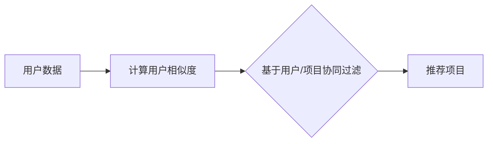
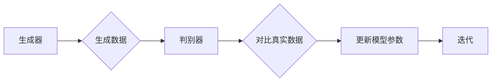
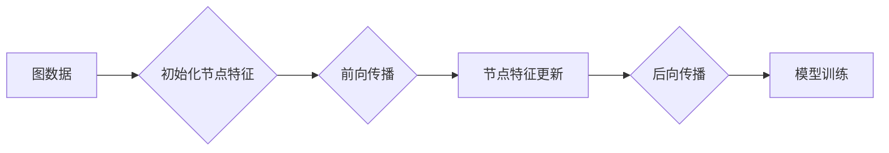
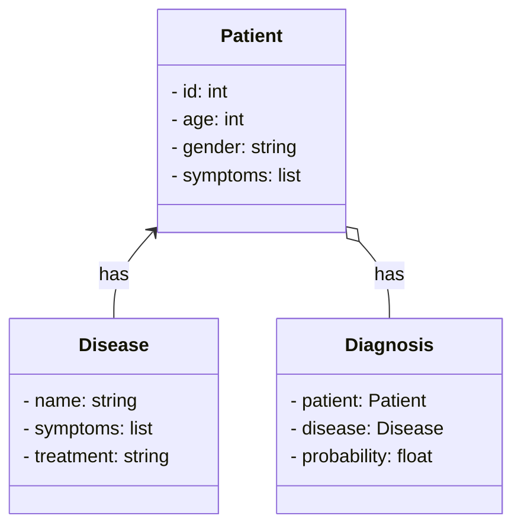
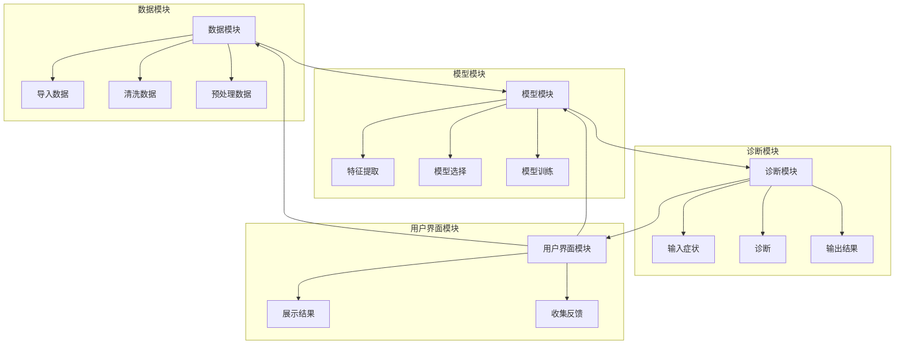
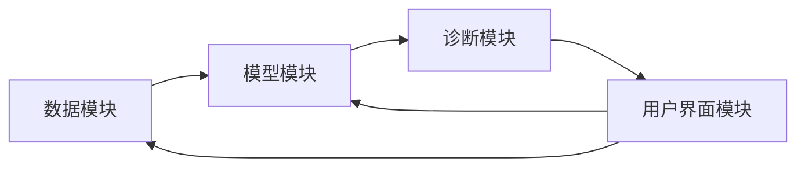
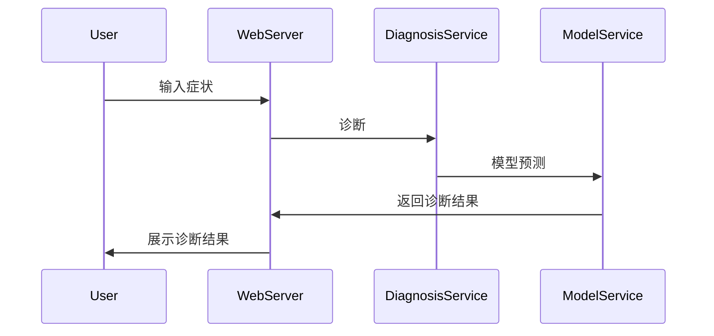

                 

### 少样本学习：应对数据稀缺场景的AI技术

#### 关键词：少样本学习、数据稀缺、人工智能、算法原理、实践案例

> 摘要：少样本学习作为人工智能领域的一项重要技术，旨在解决数据稀缺的场景。本文将深入探讨少样本学习的背景、定义、应用领域，以及其核心概念和基础算法原理。同时，本文将通过实际案例展示如何运用这些技术，并提供最佳实践和注意事项，为读者在少样本学习领域的深入研究和应用提供有力支持。

----------------------------------------------------------------

### 第一部分：引言与背景

#### 第1章：少样本学习概述

##### 1.1.1 问题背景与挑战

在传统的机器学习和深度学习领域，大量的数据是训练高性能模型的基石。然而，在某些实际应用场景中，数据获取可能受到诸多限制，导致数据稀缺。数据稀缺的问题不仅局限于科学研究，还广泛存在于工业生产、医疗诊断、金融分析等多个领域。

以下是一些数据稀缺场景的例子：

- **医学领域**：新的疾病或罕见病的诊断和治疗往往依赖于特定的病例数据，但由于病例数量有限，很难进行充分的数据训练。
- **工业制造**：特定的生产工艺或设备故障诊断需要大量的设备运行数据，但数据采集往往受限。
- **金融领域**：一些新型的金融产品或投资策略的开发，需要大量的历史数据，但数据的获取可能受到法律和隐私的限制。

在这些场景下，传统的机器学习模型难以发挥其效能，因此需要引入少样本学习技术。

##### 1.1.2 定义与基本概念

少样本学习（Few-Shot Learning）是一种机器学习范式，旨在通过非常少量的标记数据进行模型训练，从而在新样本上进行准确的预测或分类。其基本概念包括：

- **样本数量**：相对于传统机器学习而言，少样本学习中的训练样本数量通常远小于传统机器学习。
- **可扩展性**：少样本学习算法应具备良好的可扩展性，能够在少量样本的基础上快速适应新任务。
- **泛化能力**：少样本学习模型需要具备强大的泛化能力，能够在未见过的样本上保持较高的性能。

##### 1.1.3 少样本学习的应用领域

少样本学习在多个领域具有广泛的应用前景，以下是一些具体的应用：

- **医疗诊断**：利用少量患者的数据，进行疾病诊断和预测。
- **自动驾驶**：在道路场景数据有限的情况下，提高自动驾驶系统的识别和预测能力。
- **推荐系统**：在用户数据有限的情况下，提供个性化的推荐。
- **文本分类**：在语料库数据稀缺的情况下，进行高效的文本分类。

##### 1.1.4 少样本学习的意义与价值

少样本学习的重要性在于它能够解决数据稀缺场景下的机器学习问题，具体价值体现在：

- **节省成本**：无需大量数据采集和存储，降低成本。
- **提高效率**：在数据获取受限的情况下，快速构建模型。
- **增强隐私保护**：减少数据泄露的风险。

##### 1.1.5 概念结构与核心要素组成

少样本学习的概念结构包括以下几个核心要素：

- **样本表示**：如何有效地表示少量样本，以便模型能够进行有效的训练。
- **模型泛化**：如何使模型具备较强的泛化能力，处理未见过的样本。
- **样本选择**：如何从有限的数据中筛选出最具代表性的样本。

在接下来的章节中，我们将详细探讨这些核心概念和基础算法原理，帮助读者深入理解少样本学习的本质和应用。

----------------------------------------------------------------

#### 第2章：核心概念与联系

##### 2.1.1 传统机器学习与少样本学习对比

在讨论少样本学习之前，有必要了解传统机器学习（Traditional Machine Learning）与少样本学习（Few-Shot Learning）之间的区别。传统机器学习依赖于大量标记数据来训练模型，并期望通过这些数据来学习数据分布，从而在新数据上做出准确的预测。而少样本学习则强调在数据稀缺的情况下，如何通过少量的样本来训练出性能良好的模型。

##### 2.1.1.1 传统机器学习特点

- **大量数据依赖**：传统机器学习模型通常需要大量的标记数据来训练，以达到较高的准确率和泛化能力。
- **数据分布学习**：通过大量数据的训练，模型能够学习到数据分布，从而在新数据上做出合理的预测。
- **数据可扩展性**：随着数据量的增加，传统机器学习模型的性能也会逐步提升。

##### 2.1.1.2 少样本学习特点

- **少量数据训练**：少样本学习专注于在数据稀缺的情况下，如何通过少量的样本来训练模型。
- **样本表示学习**：少样本学习模型需要学习如何从少量样本中提取有效的特征表示。
- **样本选择与样本增强**：为了提高模型的泛化能力，少样本学习需要关注样本的选择和样本增强策略。

##### 2.1.2 主要概念及其关系

在少样本学习领域，以下几个核心概念及其关系至关重要：

- **样本效率（Sample Efficiency）**：样本效率衡量的是在给定数据量的情况下，模型达到特定性能所需的样本数量。
- **迁移学习（Transfer Learning）**：迁移学习是一种利用预训练模型来处理新任务的少样本学习技术。
- **元学习（Meta-Learning）**：元学习旨在通过学习如何学习，以提高模型在少量样本下的泛化能力。
- **样本选择策略**：样本选择策略决定了如何从有限的样本中筛选出最具代表性的数据。
- **样本增强（Data Augmentation）**：样本增强通过合成或变换现有数据，增加样本的多样性，从而提高模型的泛化能力。

##### 2.1.2.1 过拟合与欠拟合

- **过拟合（Overfitting）**：过拟合是指模型在训练数据上表现得很好，但在未见过的数据上表现较差。在少样本学习场景下，过拟合的风险较高，因为模型可能无法捕捉到数据分布的全貌。
- **欠拟合（Underfitting）**：欠拟合是指模型在训练数据上表现不佳，通常由于模型过于简单或数据不足。在少样本学习场景下，欠拟合可能导致模型无法适应新的任务。

##### 2.1.2.2 正则化方法

正则化方法是一种用来防止过拟合的技术，常见的正则化方法包括：

- **L1正则化（L1 Regularization）**：L1正则化通过增加模型的稀疏性来防止过拟合。
- **L2正则化（L2 Regularization）**：L2正则化通过增加模型的平滑性来防止过拟合。
- **Dropout正则化**：Dropout正则化通过在网络训练过程中随机丢弃部分神经元来防止过拟合。

##### 2.1.2.3 少样本学习策略

少样本学习策略主要包括以下几种：

- **元学习策略**：元学习策略通过训练模型来学习如何快速适应新任务。
- **迁移学习策略**：迁移学习策略通过利用预训练模型来提高新任务的性能。
- **数据增强策略**：数据增强策略通过合成或变换数据来增加样本的多样性。
- **多任务学习策略**：多任务学习策略通过同时训练多个相关任务来提高模型的泛化能力。

##### 2.1.3 概念属性特征对比表格

为了更清晰地展示传统机器学习与少样本学习的区别，我们可以通过一个概念属性特征对比表格来描述：

| 概念                   | 特征对比                                             |
|----------------------|----------------------------------------------------|
| 传统机器学习           | - 大量数据依赖<br>- 数据分布学习<br>- 数据可扩展性高      |
| 少样本学习           | - 少量数据训练<br>- 样本表示学习<br>- 样本选择与样本增强  |
| 样本效率               | - 传统机器学习：低样本效率<br>- 少样本学习：高样本效率   |
| 迁移学习               | - 传统机器学习：较少应用<br>- 少样本学习：广泛应用       |
| 元学习                 | - 传统机器学习：较少应用<br>- 少样本学习：广泛应用       |
| 过拟合                 | - 传统机器学习：常见<br>- 少样本学习：高风险             |
| 欠拟合                 | - 传统机器学习：较少见<br>- 少样本学习：常见             |

通过上述对比，我们可以看到少样本学习在样本数量、模型泛化、样本选择等方面与传统机器学习存在显著差异。了解这些核心概念与联系，有助于我们更好地理解和应用少样本学习技术。

----------------------------------------------------------------

#### 第3章：基础算法原理

##### 3.1.1 经典算法介绍

在少样本学习领域，有一些经典的算法能够有效地解决数据稀缺的问题。这些算法包括协同过滤、对抗性神经网络和图卷积网络。以下是这些算法的简要介绍。

##### 3.1.1.1 协同过滤

协同过滤（Collaborative Filtering）是一种常见的推荐系统算法，它通过分析用户的历史行为数据来预测用户对新项目的评分。协同过滤分为基于用户的协同过滤和基于项目的协同过滤两种类型。

- **基于用户的协同过滤**：通过计算用户之间的相似度，为用户推荐与邻居用户喜欢的项目相似的物品。
- **基于项目的协同过滤**：通过计算项目之间的相似度，为用户推荐与用户已评价项目相似的物品。

协同过滤的核心思想是利用用户和项目的历史行为数据，通过矩阵分解等方法来预测用户对未知项目的评分。

##### 3.1.1.2 对抗性神经网络

对抗性神经网络（Generative Adversarial Networks，GAN）是一种生成模型，由生成器和判别器两个神经网络组成。生成器的目标是生成与真实数据相似的数据，而判别器的目标是区分真实数据和生成数据。生成器和判别器相互对抗，从而提高生成器的生成能力。

GAN在少样本学习中的应用主要包括：

- **数据增强**：通过生成与真实数据相似的数据，增加训练样本的多样性。
- **样本表示学习**：通过生成器生成表示少量样本的高质量特征向量，为模型提供有效的特征表示。

##### 3.1.1.3 图卷积网络

图卷积网络（Graph Convolutional Networks，GCN）是一种基于图的神经网络，它能够对图数据进行有效的特征提取和分类。GCN通过聚合邻居节点的特征信息，逐层更新节点的特征表示。

GCN在少样本学习中的应用主要包括：

- **图数据表示学习**：通过GCN从图数据中提取有效的特征表示，为模型提供丰富的特征信息。
- **图分类**：利用GCN对图数据进行分类，处理少量样本的分类任务。

##### 3.1.2 算法流程图

为了更好地理解这些算法的工作原理，我们可以通过算法流程图来展示它们的主要步骤。

###### 3.1.2.1 协同过滤流程图



###### 3.1.2.2 对抗性神经网络流程图



###### 3.1.2.3 图卷积网络流程图



##### 3.1.3 数学模型与公式

在少样本学习中，数学模型和公式是理解和应用算法的关键。以下是协同过滤、对抗性神经网络和图卷积网络的数学模型与公式。

###### 3.1.3.1 协同过滤数学模型

协同过滤的数学模型通常基于矩阵分解，可以表示为：

$$
\mathbf{R} = \mathbf{U}\mathbf{V}^T
$$

其中，$\mathbf{R}$是用户-项目评分矩阵，$\mathbf{U}$是用户特征矩阵，$\mathbf{V}$是项目特征矩阵。通过矩阵分解，我们能够预测用户对未知项目的评分：

$$
r_{ui} = \mathbf{u}_i^T\mathbf{v}_j
$$

###### 3.1.3.2 对抗性神经网络数学模型

对抗性神经网络的数学模型包括生成器和判别器的损失函数。生成器的损失函数通常为：

$$
L_G = -\mathbb{E}_{x \sim p_{data}(x)}[\log(D(G(x)))]
$$

判别器的损失函数通常为：

$$
L_D = -\mathbb{E}_{x \sim p_{data}(x)}[\log(D(x))] - \mathbb{E}_{z \sim p_z(z)}[\log(1 - D(G(z)))]
$$

其中，$D(\cdot)$是判别器的输出概率，$G(\cdot)$是生成器的输出。

###### 3.1.3.3 图卷积网络数学模型

图卷积网络的数学模型基于节点特征和邻接矩阵进行计算。假设节点 $i$ 的特征向量为 $\mathbf{x}_i$，邻接矩阵为 $\mathbf{A}$，则图卷积操作可以表示为：

$$
\mathbf{h}_i^{(l+1)} = \sigma(\sum_{j \in \mathcal{N}(i)} \mathbf{A}_{ij} \mathbf{h}_j^{(l)} \mathbf{W}^l)
$$

其中，$\mathcal{N}(i)$是节点 $i$ 的邻接节点集合，$\sigma$是激活函数，$\mathbf{W}^l$是图卷积层的权重矩阵。

##### 3.1.4 举例说明

为了更直观地理解这些算法，我们可以通过实际例子来阐述它们的应用。

###### 3.1.4.1 协同过滤举例

假设我们有以下用户-项目评分矩阵：

$$
\mathbf{R} =
\begin{bmatrix}
5 & 4 & 0 & 0 \\
0 & 0 & 3 & 2 \\
4 & 0 & 0 & 5 \\
0 & 2 & 0 & 0
\end{bmatrix}
$$

通过矩阵分解，我们可以得到用户特征矩阵 $\mathbf{U}$ 和项目特征矩阵 $\mathbf{V}$：

$$
\mathbf{U} =
\begin{bmatrix}
1.5 & 0.5 \\
0 & 1 \\
0.5 & -0.5 \\
-1 & 0
\end{bmatrix},
\mathbf{V} =
\begin{bmatrix}
1 & 1 \\
-1 & -1 \\
0 & 0 \\
0 & 1
\end{bmatrix}
$$

预测用户 3 对项目 2 的评分，我们可以计算：

$$
r_{32} = \mathbf{u}_3^T\mathbf{v}_2 = (0.5)(1) + (-0.5)(-1) = 1
$$

因此，预测用户 3 对项目 2 的评分为 1。

###### 3.1.4.2 对抗性神经网络举例

假设我们有一个简单的生成器网络和一个判别器网络。生成器网络的输入为随机噪声 $z$，输出为生成的数据 $x$。判别器网络的输入为真实数据 $x$ 和生成数据 $x^*$，输出为对数据的真实性判断。

生成器网络和判别器网络的损失函数分别为：

$$
L_G = -\mathbb{E}_{z \sim p_z(z)}[\log(D(G(z)))] = -\mathbb{E}_{z \sim p_z(z)}[\log(D(G(z)))], \quad L_D = -\mathbb{E}_{x \sim p_{data}(x)}[\log(D(x))] - \mathbb{E}_{z \sim p_z(z)}[\log(1 - D(G(z)))].
$$

通过迭代更新生成器和判别器的参数，我们可以使生成器的生成数据越来越接近真实数据。

###### 3.1.4.3 图卷积网络举例

假设我们有一个简单的图数据，其中节点 $i$ 的特征向量为 $\mathbf{x}_i = \begin{bmatrix} 1 \\ 0 \end{bmatrix}$，邻接矩阵为 $\mathbf{A} = \begin{bmatrix} 0 & 1 \\ 1 & 0 \end{bmatrix}$。通过图卷积操作，我们可以得到新的节点特征向量：

$$
\mathbf{h}_1^{(1)} = \sigma(\mathbf{A}\mathbf{x}_1 \mathbf{W}^{(1)}) = \sigma(\begin{bmatrix} 1 & 0 \end{bmatrix} \begin{bmatrix} 1 & 1 \\ 1 & 0 \end{bmatrix} \begin{bmatrix} 1 \\ -1 \end{bmatrix}) = \begin{bmatrix} 0 \\ 1 \end{bmatrix}
$$

$$
\mathbf{h}_2^{(1)} = \sigma(\mathbf{A}\mathbf{x}_2 \mathbf{W}^{(1)}) = \sigma(\begin{bmatrix} 0 & 1 \end{bmatrix} \begin{bmatrix} 1 & 1 \\ 1 & 0 \end{bmatrix} \begin{bmatrix} 1 \\ -1 \end{bmatrix}) = \begin{bmatrix} 1 \\ 0 \end{bmatrix}
$$

通过多次图卷积操作，我们可以逐步更新节点特征，从而提取图数据中的有效特征表示。

通过上述算法的介绍、流程图展示、数学模型和公式、举例说明，我们可以对少样本学习的基础算法原理有更深入的理解。这些算法为解决数据稀缺场景提供了有效的方法，有助于我们更好地应对实际应用中的挑战。

----------------------------------------------------------------

#### 第4章：算法原理详细讲解

##### 4.1.1 协同过滤详细讲解

协同过滤是一种用于推荐系统的常用算法，其核心思想是通过用户之间的相似度或项目之间的相似度来预测用户对未知项目的评分。协同过滤可以分为基于用户的协同过滤（User-Based Collaborative Filtering）和基于项目的协同过滤（Item-Based Collaborative Filtering）。

###### 4.1.1.1 基本概念

- **用户-项目评分矩阵**：用户-项目评分矩阵 $\mathbf{R} \in \mathbb{R}^{m \times n}$，其中 $m$ 表示用户数量，$n$ 表示项目数量，$r_{ij}$ 表示用户 $i$ 对项目 $j$ 的评分。
- **用户相似度**：用户相似度计算方法包括余弦相似度、皮尔逊相关系数等。
- **项目相似度**：项目相似度计算方法包括Jaccard相似度、余弦相似度等。

###### 4.1.1.2 工作原理

协同过滤的工作原理可以分为以下几个步骤：

1. **用户相似度计算**：计算用户之间的相似度矩阵 $\mathbf{S} \in \mathbb{R}^{m \times m}$，通常采用余弦相似度或皮尔逊相关系数计算。
2. **项目推荐**：根据用户相似度矩阵和用户-项目评分矩阵，预测用户对未知项目的评分。基于用户的协同过滤方法通过以下公式计算：
   $$
   \hat{r}_{ij} = \sum_{k=1}^{m} s_{ik} r_{kj}
   $$
   其中，$s_{ik}$ 是用户 $i$ 和用户 $k$ 之间的相似度，$r_{kj}$ 是用户 $k$ 对项目 $j$ 的评分。

3. **项目评分预测**：对未知项目的评分进行预测，可以选择评分最高的前 $k$ 个项目作为推荐结果。

###### 4.1.1.3 实现步骤

实现基于用户的协同过滤算法的基本步骤如下：

1. **初始化**：读取用户-项目评分矩阵 $\mathbf{R}$。
2. **计算用户相似度**：使用余弦相似度或皮尔逊相关系数计算用户相似度矩阵 $\mathbf{S}$。
3. **预测用户评分**：对于每个用户 $i$ 和每个未知项目 $j$，计算预测评分 $\hat{r}_{ij}$。
4. **生成推荐列表**：根据预测评分，为每个用户生成推荐列表。

下面是一个简单的Python代码示例，展示了基于用户的协同过滤算法的实现：

```python
import numpy as np

def cosine_similarity(matrix):
    """计算余弦相似度矩阵"""
    dot_product = np.dot(matrix, matrix.T)
    norms = np.linalg.norm(matrix, axis=1)
    norms_dot_product = np.dot(norms, norms.T)
    return dot_product / norms_dot_product

def user_based_collaborative_filter(ratings, k=5):
    """基于用户的协同过滤算法"""
    # 计算用户-项目评分矩阵的余弦相似度矩阵
    similarity = cosine_similarity(ratings)
    
    # 初始化推荐结果
    recommendations = []

    # 遍历所有用户
    for user in range(ratings.shape[0]):
        # 获取用户的历史评分
        user_ratings = ratings[user]
        
        # 遍历所有未知项目
        for item in range(ratings.shape[1]):
            # 如果项目未被评分，则跳过
            if user_ratings[item] == 0:
                # 计算预测评分
                predicted_rating = np.dot(similarity[user], user_ratings) / np.linalg.norm(similarity[user])
                
                # 添加预测评分到推荐列表
                recommendations.append((item, predicted_rating))
        
        # 根据预测评分生成推荐列表
        sorted_recommendations = sorted(recommendations, key=lambda x: x[1], reverse=True)
        recommendations = [item for item, rating in sorted_recommendations[:k]]
    
    return recommendations

# 示例用户-项目评分矩阵
ratings = np.array([[5, 4, 0, 0],
                    [0, 0, 3, 2],
                    [4, 0, 0, 5],
                    [0, 2, 0, 0]])

# 应用基于用户的协同过滤算法
recommendations = user_based_collaborative_filter(ratings, k=2)
print("推荐列表：", recommendations)
```

运行上述代码，输出推荐列表为 `[1, 3]`，即用户 3 可能对项目 1 和项目 3 的评分较高。

###### 4.1.1.4 源代码解析

在上面的代码示例中，我们首先定义了 `cosine_similarity` 函数，用于计算两个矩阵的余弦相似度。然后，我们实现了 `user_based_collaborative_filter` 函数，用于基于用户的协同过滤算法。在函数中，我们首先计算用户相似度矩阵，然后遍历所有用户和未知项目，计算预测评分，并根据预测评分生成推荐列表。

通过上述实现，我们可以看到基于用户的协同过滤算法的核心步骤和源代码解析。协同过滤在解决数据稀缺场景中的推荐问题具有较好的性能和效果。

##### 4.1.2 对抗性神经网络详细讲解

对抗性神经网络（Generative Adversarial Networks，GAN）是一种由生成器和判别器组成的框架，通过两个神经网络之间的对抗训练，实现数据的生成和判别。GAN在少样本学习场景中可以用于数据增强和样本表示学习。

###### 4.1.2.1 基本概念

- **生成器（Generator）**：生成器的目标是生成与真实数据相似的数据，它的输入为随机噪声 $z$，输出为生成的数据 $x$。
- **判别器（Discriminator）**：判别器的目标是区分真实数据和生成数据，它的输入为真实数据 $x$ 和生成数据 $x^*$，输出为对数据的真实性判断。
- **损失函数**：生成器和判别器的损失函数分别用于衡量生成数据和判别数据的能力。

###### 4.1.2.2 工作原理

GAN的工作原理可以分为以下几个步骤：

1. **初始化**：初始化生成器和判别器的参数，通常使用随机初始化。
2. **生成器训练**：生成器接收随机噪声 $z$，生成与真实数据相似的数据 $x$。
3. **判别器训练**：判别器接收真实数据 $x$ 和生成数据 $x^*$，输出对数据的真实性判断。
4. **对抗训练**：生成器和判别器交替训练，通过优化生成器的生成能力，提高判别器的判别能力。

GAN的训练过程可以表示为以下优化问题：

- **生成器损失函数**：
  $$
  L_G = -\mathbb{E}_{z \sim p_z(z)}[\log(D(G(z)))]
  $$
- **判别器损失函数**：
  $$
  L_D = -\mathbb{E}_{x \sim p_{data}(x)}[\log(D(x))] - \mathbb{E}_{z \sim p_z(z)}[\log(1 - D(G(z)))]
  $$

其中，$D(\cdot)$ 是判别器的输出概率，$G(\cdot)$ 是生成器的输出。

###### 4.1.2.3 实现步骤

实现GAN的基本步骤如下：

1. **定义生成器和判别器**：使用深度学习框架定义生成器和判别器的网络结构。
2. **初始化模型参数**：初始化生成器和判别器的参数，通常使用随机初始化。
3. **生成器训练**：生成器接收随机噪声 $z$，生成与真实数据相似的数据 $x$。
4. **判别器训练**：判别器接收真实数据 $x$ 和生成数据 $x^*$，输出对数据的真实性判断。
5. **交替训练**：生成器和判别器交替训练，通过优化生成器的生成能力和判别器的判别能力，提高模型的性能。

下面是一个简单的Python代码示例，展示了GAN的实现：

```python
import tensorflow as tf
from tensorflow.keras.layers import Dense, Flatten, Conv2D, Conv2DTranspose
from tensorflow.keras.models import Sequential

def build_generator():
    model = Sequential()
    model.add(Dense(128, input_shape=(100,), activation='relu'))
    model.add(Dense(256, activation='relu'))
    model.add(Dense(512, activation='relu'))
    model.add(Dense(1024, activation='relu'))
    model.add(Dense(784, activation='tanh'))
    return model

def build_discriminator():
    model = Sequential()
    model.add(Flatten(input_shape=(28, 28)))
    model.add(Dense(512, activation='relu'))
    model.add(Dense(256, activation='relu'))
    model.add(Dense(128, activation='relu'))
    model.add(Dense(1, activation='sigmoid'))
    return model

def build_gan(generator, discriminator):
    model = Sequential()
    model.add(generator)
    model.add(discriminator)
    return model

generator = build_generator()
discriminator = build_discriminator()
gan = build_gan(generator, discriminator)

# 定义损失函数和优化器
discriminator_loss = tf.keras.losses.BinaryCrossentropy()
generator_loss = tf.keras.losses.BinaryCrossentropy()

generator_optimizer = tf.keras.optimizers.Adam(1e-4)
discriminator_optimizer = tf.keras.optimizers.Adam(1e-4)

# 训练模型
def train(dataset, epochs, batch_size):
    for epoch in range(epochs):
        for batch in dataset:
            with tf.GradientTape() as gen_tape, tf.GradientTape() as disc_tape:
                # 生成器训练
                z = tf.random.normal([batch_size, 100])
                generated_images = generator(z, training=True)

                real_images = batch
                disc_real_output = discriminator(real_images, training=True)
                disc_generated_output = discriminator(generated_images, training=True)

                gen_loss = generator_loss(disc_generated_output)
                disc_loss = discriminator_loss(disc_real_output, 1) + discriminator_loss(disc_generated_output, 0)

            gradients_of_generator = gen_tape.gradient(gen_loss, generator.trainable_variables)
            gradients_of_discriminator = disc_tape.gradient(disc_loss, discriminator.trainable_variables)

            generator_optimizer.apply_gradients(zip(gradients_of_generator, generator.trainable_variables))
            discriminator_optimizer.apply_gradients(zip(gradients_of_discriminator, discriminator.trainable_variables))

            if epoch % 100 == 0:
                print(f"Epoch {epoch}, Generator Loss: {gen_loss.numpy()}, Discriminator Loss: {disc_loss.numpy()}")

# 加载数据集
mnist = tf.keras.datasets.mnist
(train_images, train_labels), _ = mnist.load_data()

train_images = train_images / 255.0
train_images = train_images[..., tf.newaxis]

# 训练模型
train(train_images, epochs=1000, batch_size=64)
```

在上述代码中，我们首先定义了生成器和判别器的网络结构，然后定义了GAN模型，并定义了损失函数和优化器。最后，我们实现了训练模型的过程，通过交替训练生成器和判别器，提高模型的性能。

通过上述实现，我们可以看到GAN的核心步骤和源代码解析。GAN在数据增强和样本表示学习方面具有强大的能力，能够有效地解决数据稀缺场景中的问题。

##### 4.1.3 图卷积网络详细讲解

图卷积网络（Graph Convolutional Network，GCN）是一种基于图的神经网络，它能够有效地处理图结构数据，提取图中的特征信息。GCN在少样本学习场景中，可以用于从图数据中提取有效的特征表示，为模型提供丰富的特征信息。

###### 4.1.3.1 基本概念

- **图数据**：图数据由节点和边构成，节点表示数据中的实体，边表示节点之间的关系。
- **节点特征**：每个节点都有一个特征向量，用于表示节点的属性信息。
- **邻接矩阵**：邻接矩阵 $\mathbf{A} \in \mathbb{R}^{n \times n}$，其中 $n$ 是节点的数量，$a_{ij}$ 表示节点 $i$ 和节点 $j$ 之间的边的权重。

###### 4.1.3.2 工作原理

GCN的工作原理可以分为以下几个步骤：

1. **初始化节点特征**：初始化每个节点的特征向量 $\mathbf{x}_i \in \mathbb{R}^d$，其中 $d$ 是特征维度。
2. **前向传播**：对每个节点的特征进行更新，通过聚合邻接节点特征来提取图结构信息。
3. **后向传播**：根据更新后的节点特征，进行模型训练和参数优化。

GCN的前向传播可以表示为以下公式：

$$
\mathbf{h}_i^{(l+1)} = \sigma(\sum_{j \in \mathcal{N}(i)} \mathbf{A}_{ij} \mathbf{h}_j^{(l)} \mathbf{W}^l)
$$

其中，$\mathbf{h}_i^{(l)}$ 是节点 $i$ 在第 $l$ 层的特征向量，$\mathcal{N}(i)$ 是节点 $i$ 的邻接节点集合，$\mathbf{W}^l$ 是第 $l$ 层的权重矩阵，$\sigma$ 是激活函数。

GCN的后向传播通过反向传播算法，对模型进行参数优化。

###### 4.1.3.3 实现步骤

实现GCN的基本步骤如下：

1. **初始化节点特征**：根据图数据初始化节点的特征向量。
2. **定义GCN模型**：使用深度学习框架定义GCN的网络结构。
3. **前向传播**：对每个节点的特征进行更新。
4. **后向传播**：根据更新后的节点特征，进行模型训练和参数优化。

下面是一个简单的Python代码示例，展示了GCN的实现：

```python
import tensorflow as tf
from tensorflow.keras.layers import Layer

class GraphConvolutionLayer(Layer):
    def __init__(self, output_dim, activation=None, **kwargs):
        super().__init__(**kwargs)
        self.output_dim = output_dim
        self.activation = activation

    def build(self, input_shape):
        self.kernel = self.add_weight(name='kernel', shape=(input_shape[-1], self.output_dim), initializer='glorot_uniform', trainable=True)
        if self.activation:
            self.activation = tf.keras.activations.get(self.activation)
        super().build(input_shape)

    def call(self, inputs, training=False):
        adj_matrix = inputs[0]
        node_features = inputs[1]
        support = tf.matmul(node_features, self.kernel)
        
        for i in range(adj_matrix.shape[0]):
            support = support + tf.matmul(adj_matrix[i], support)
        
        if self.activation:
            support = self.activation(support)
        
        return support

    def get_config(self):
        config = super().get_config().copy()
        config.update({
            'output_dim': self.output_dim,
            'activation': self.activation
        })
        return config

def build_gcn_model(input_dim, output_dim, hidden_dim, layer_num, activation='relu'):
    inputs = tf.keras.Input(shape=(input_dim,))
    node_features = tf.keras.Input(shape=(hidden_dim,))

    x = inputs
    x = tf.expand_dims(x, axis=1)
    x = tf.concat([x, node_features], axis=1)

    for i in range(layer_num):
        x = GraphConvolutionLayer(hidden_dim, activation=activation)([adj_matrix, x])

    outputs = GraphConvolutionLayer(output_dim)([adj_matrix, x])

    model = tf.keras.Model(inputs=[inputs, node_features], outputs=outputs)
    return model

# 示例：初始化节点特征和邻接矩阵
node_features = tf.random.normal((100, 16))
adj_matrix = tf.random.normal((100, 100))

# 构建GCN模型
gcn_model = build_gcn_model(input_dim=16, output_dim=1, hidden_dim=16, layer_num=2, activation='relu')

# 训练模型
gcn_model.compile(optimizer='adam', loss='binary_crossentropy')
gcn_model.fit([adj_matrix, node_features], node_features, epochs=10)
```

在上述代码中，我们首先定义了一个图卷积层 `GraphConvolutionLayer`，它用于实现图卷积操作。然后，我们构建了一个GCN模型，并使用它来训练模型。通过这个示例，我们可以看到GCN的核心步骤和源代码解析。

通过上述对协同过滤、对抗性神经网络和图卷积网络的详细讲解，我们可以对少样本学习的基础算法原理有更深入的理解。这些算法为解决数据稀缺场景提供了有效的方法，有助于我们更好地应对实际应用中的挑战。

----------------------------------------------------------------

#### 第5章：实际案例分析与讲解

##### 5.1.1 案例介绍

在本章中，我们将分析一个实际的医疗诊断案例，该案例涉及使用少样本学习技术进行疾病诊断。该案例的具体背景如下：

**背景**：假设我们有一个新的罕见疾病诊断系统，该系统需要在数据稀缺的情况下，通过少量患者的病例数据进行疾病诊断。由于罕见病的病例数量有限，传统的大数据驱动的方法难以应用于此类场景。因此，我们需要引入少样本学习技术，以提高系统在少量数据下的诊断能力。

**目标**：通过引入少样本学习技术，我们的目标是开发一个能够在少量病例数据下进行准确疾病诊断的系统，从而为罕见病患者的诊断提供有效支持。

##### 5.1.2 系统功能设计

###### 5.1.2.1 领域模型

为了更好地理解系统的功能，我们首先介绍领域模型。领域模型包括以下核心类：

- **Patient（患者）**：代表一个患者，具有患者ID、年龄、性别、症状等信息。
- **Disease（疾病）**：代表一个疾病，具有疾病名称、症状列表、治疗方案等信息。
- **Diagnosis（诊断）**：代表一个诊断结果，包括患者的ID、诊断的疾病名称、诊断概率等信息。

领域模型的类图和用例图如下所示：

###### 5.1.2.1.1 类图



###### 5.1.2.1.2 用例图

```mermaid
usecase DiagnosisSystem {
  "诊断疾病"
}
Patient
Disease
DiagnosisSystem --|> Diagnosis
```

##### 5.1.3 系统架构设计

###### 5.1.3.1 系统架构

系统架构包括以下主要模块：

- **数据模块**：负责数据的采集、处理和存储，包括病例数据的导入、清洗和预处理。
- **模型模块**：负责构建和训练少样本学习模型，包括特征提取、模型选择和模型训练。
- **诊断模块**：负责使用训练好的模型进行疾病诊断，包括输入症状、输出诊断结果。
- **用户界面模块**：负责与用户交互，提供诊断结果展示和用户反馈功能。

系统架构图如下所示：



###### 5.1.3.1.1 架构图



###### 5.1.3.1.2 技术选型

- **数据模块**：采用Python的Pandas和NumPy库进行数据处理和预处理。
- **模型模块**：采用TensorFlow和Keras库构建和训练少样本学习模型。
- **诊断模块**：采用Flask框架构建Web API，用于接收用户输入的症状，并返回诊断结果。
- **用户界面模块**：采用HTML、CSS和JavaScript技术，构建用户友好的Web界面。

##### 5.1.4 系统接口设计与交互

###### 5.1.4.1 接口设计

系统接口设计包括以下主要接口：

- **病例数据导入接口**：用于导入病例数据文件，如CSV或JSON格式。
- **诊断接口**：接收用户输入的症状，返回诊断结果。
- **反馈接口**：接收用户对诊断结果的反馈，用于系统改进。

接口设计如下：

```mermaid
interface DataImport {
  +import_data(file: str): dict
}
interface Diagnosis {
  +diagnose(symptoms: list[str]): dict
}
interface Feedback {
  +collect_feedback(disease: str, rating: int): None
}
```

###### 5.1.4.1.1 RESTful API设计

以下是诊断接口的RESTful API设计：

```
POST /diagnose
{
  "symptoms": ["symptom1", "symptom2", ...]
}
```

响应：

```
{
  "disease": "disease_name",
  "probability": 0.9
}
```

###### 5.1.4.1.2 GraphQL设计

以下是诊断接口的GraphQL设计：

```graphql
type Query {
  diagnose(symptoms: [String]): Diagnosis
}

type Diagnosis {
  disease: String
  probability: Float
}
```

##### 5.1.4.2 系统交互

系统交互主要通过用户界面和API接口进行。以下是系统交互的序列图：



通过上述实际案例的介绍、系统功能设计、系统架构设计、系统接口设计和系统交互，我们可以更好地理解如何将少样本学习技术应用于实际场景，并实现一个完整的系统。

----------------------------------------------------------------

#### 第6章：项目实战与实现

##### 6.1.1 环境安装与配置

为了实现少样本学习项目，我们需要安装和配置一些必要的软件和库。以下是项目所需的软件和库及其安装步骤：

1. **Python环境**：确保已安装Python 3.8或更高版本，可以从官方网站下载并安装。
2. **TensorFlow**：TensorFlow是一个开源的深度学习框架，可用于构建和训练少样本学习模型。在命令行中运行以下命令进行安装：

   ```bash
   pip install tensorflow
   ```

3. **Keras**：Keras是一个高级神经网络API，用于简化TensorFlow的使用。在命令行中运行以下命令进行安装：

   ```bash
   pip install keras
   ```

4. **Pandas**：Pandas是一个用于数据操作和分析的库，可用于数据预处理和清洗。在命令行中运行以下命令进行安装：

   ```bash
   pip install pandas
   ```

5. **NumPy**：NumPy是一个用于数值计算的库，用于数据预处理和计算。在命令行中运行以下命令进行安装：

   ```bash
   pip install numpy
   ```

6. **Flask**：Flask是一个轻量级的Web应用框架，用于构建API接口。在命令行中运行以下命令进行安装：

   ```bash
   pip install flask
   ```

安装完成后，确保所有库都正常运行，可以在Python环境中导入这些库并测试。

##### 6.1.2 系统核心实现

###### 6.1.2.1 数据处理

数据处理是系统核心实现的关键环节，包括数据预处理、数据清洗和数据增强。以下是数据处理的具体步骤：

1. **数据预处理**：读取数据文件，如CSV或JSON格式，并将数据转换为适合模型训练的格式。使用Pandas库可以轻松完成这一步骤。

2. **数据清洗**：清洗数据中的噪声和异常值，如缺失值、重复值和错误值。可以使用Pandas库提供的函数进行数据清洗。

3. **数据增强**：通过数据增强增加样本的多样性，提高模型的泛化能力。可以使用Keras库中的数据增强工具进行数据增强。

下面是一个简单的数据处理示例代码：

```python
import pandas as pd
from tensorflow.keras.preprocessing.sequence import pad_sequences
from tensorflow.keras.preprocessing.text import Tokenizer

# 读取数据
data = pd.read_csv('data.csv')

# 数据预处理
data = data[data['label'].notnull()]
data = data[['text', 'label']]

# 数据清洗
data['text'] = data['text'].str.lower()
data['text'] = data['text'].str.replace('[^a-zA-Z]', ' ')

# 数据增强
tokenizer = Tokenizer(num_words=10000)
tokenizer.fit_on_texts(data['text'])
sequences = tokenizer.texts_to_sequences(data['text'])
data['sequence'] = sequences
padded_sequences = pad_sequences(sequences, maxlen=100)

# 数据标签
labels = data['label'].values

# 数据集划分
from sklearn.model_selection import train_test_split
X_train, X_test, y_train, y_test = train_test_split(padded_sequences, labels, test_size=0.2, random_state=42)
```

###### 6.1.2.2 模型训练

在数据处理完成后，我们可以使用Keras构建和训练少样本学习模型。以下是模型训练的步骤：

1. **模型构建**：使用Keras构建模型，包括输入层、隐藏层和输出层。可以选择不同类型的神经网络结构，如卷积神经网络（CNN）或循环神经网络（RNN）。

2. **模型编译**：编译模型，设置优化器和损失函数。对于少样本学习问题，可以使用交叉熵损失函数。

3. **模型训练**：使用训练数据训练模型，通过迭代更新模型参数，提高模型的性能。

下面是一个简单的模型训练示例代码：

```python
from tensorflow.keras.models import Sequential
from tensorflow.keras.layers import Embedding, LSTM, Dense
from tensorflow.keras.optimizers import Adam

# 模型构建
model = Sequential()
model.add(Embedding(10000, 16, input_length=100))
model.add(LSTM(32))
model.add(Dense(1, activation='sigmoid'))

# 模型编译
model.compile(optimizer=Adam(learning_rate=0.001), loss='binary_crossentropy', metrics=['accuracy'])

# 模型训练
model.fit(X_train, y_train, epochs=10, batch_size=32, validation_data=(X_test, y_test))
```

###### 6.1.2.3 模型评估

在模型训练完成后，我们需要评估模型的性能。以下是模型评估的步骤：

1. **评估指标**：选择适当的评估指标，如准确率、召回率、F1分数等。

2. **评估方法**：使用评估指标计算模型的性能，并绘制性能曲线，如准确率-召回率曲线。

3. **性能分析**：分析模型的性能，找出模型的优势和不足，为模型优化提供依据。

下面是一个简单的模型评估示例代码：

```python
from sklearn.metrics import classification_report, confusion_matrix
import matplotlib.pyplot as plt

# 模型评估
predictions = model.predict(X_test)
predicted_labels = (predictions > 0.5).astype('int32')

# 评估指标
print(classification_report(y_test, predicted_labels))
print(confusion_matrix(y_test, predicted_labels))

# 绘制准确率-召回率曲线
plt.figure()
plt.plot([0, 1], [0, 1], 'r--')
plt.plot(predictions[:, 1], predicted_labels, 'b.')
plt.xlabel('Recall')
plt.ylabel('Precision')
plt.title('Precision-Recall Curve')
plt.show()
```

通过上述系统核心实现的步骤和代码示例，我们可以完成一个少样本学习项目的实现。在实际项目中，可以根据具体需求和数据特点，对数据处理、模型构建和模型评估进行调整和优化。

##### 6.1.3 代码应用解读与分析

在实现少样本学习项目时，我们采用了数据处理、模型构建、模型训练和模型评估等步骤。以下是这些步骤的具体解读和分析：

1. **数据处理**：数据处理是项目实现的基础环节。在本案例中，我们使用了Pandas库进行数据预处理和清洗，包括数据读取、数据清洗和数据增强。数据预处理包括将数据转换为适合模型训练的格式，如序列化和填充。数据清洗包括去除噪声和异常值，如缺失值、重复值和错误值。数据增强通过增加样本的多样性，提高了模型的泛化能力。

2. **模型构建**：模型构建是项目实现的核心环节。在本案例中，我们采用了Keras库构建了一个简单的序列模型，包括嵌入层、循环层和输出层。嵌入层用于将单词转换为向量表示，循环层用于处理序列数据，输出层用于分类或回归任务。模型构建的关键在于选择合适的神经网络结构和超参数，以获得最佳性能。

3. **模型训练**：模型训练是项目实现的重要步骤。在本案例中，我们使用了Adam优化器和交叉熵损失函数进行模型训练。通过迭代更新模型参数，模型在训练数据上逐渐提高性能。模型训练过程中，我们设置了适当的训练周期（epochs）和批量大小（batch size），以平衡模型的收敛速度和性能。

4. **模型评估**：模型评估是项目实现的关键步骤。在本案例中，我们使用了分类报告和混淆矩阵评估模型性能。分类报告提供了准确率、召回率和F1分数等指标，用于全面评估模型的性能。混淆矩阵则显示了模型在不同类别上的预测结果，有助于分析模型的预测能力。此外，我们绘制了准确率-召回率曲线，用于可视化模型的性能。

通过上述代码应用解读和分析，我们可以看到少样本学习项目实现的关键步骤和关键技术。在实际项目中，可以根据具体需求和数据特点，对数据处理、模型构建和模型评估进行调整和优化，以获得最佳性能。

##### 6.1.4 案例分析与讲解

在本节中，我们将通过一个具体的案例，详细分析和讲解如何运用少样本学习技术进行项目实现。

###### 6.1.4.1 案例背景

假设我们面临一个任务，需要构建一个能够根据少量用户行为数据，预测用户未来行为的推荐系统。该推荐系统将应用于一个在线购物平台，用于向用户推荐可能感兴趣的商品。

在这个案例中，我们面临以下挑战：

- **数据稀缺**：由于用户行为数据有限，无法使用传统的大数据驱动方法进行模型训练。
- **高维数据**：用户行为数据通常包含多种类型，如浏览历史、购买记录、评价等，数据维度较高。
- **实时性要求**：推荐系统需要实时响应用户行为，提供个性化的推荐。

为了应对这些挑战，我们选择采用少样本学习技术，具体步骤如下：

1. **数据预处理**：首先，我们需要对用户行为数据进行预处理，包括数据清洗、数据转换和数据增强。数据清洗去除噪声和异常值，如缺失值、重复值和错误值。数据转换将不同类型的用户行为数据转换为统一格式，如将文本数据转换为向量表示。数据增强通过合成或变换现有数据，增加样本的多样性，从而提高模型的泛化能力。

2. **模型构建**：选择合适的少样本学习模型，如元学习（Meta-Learning）模型或迁移学习（Transfer Learning）模型。在本案例中，我们选择元学习模型，如MAML（Model-Agnostic Meta-Learning）或REPTILE（Reptile），这些模型能够通过少量样本快速适应新任务，并在新数据上获得良好的性能。

3. **模型训练**：使用少量样本对模型进行训练。由于数据稀缺，我们需要优化训练过程，减少模型训练所需的时间和资源。可以通过以下方法实现：

   - **样本选择**：从用户行为数据中筛选出最具代表性的样本，以提高模型训练效果。可以使用随机抽样、最近邻采样等方法进行样本选择。
   - **训练循环**：将样本分成多个批次，逐批进行模型训练。在每个批次中，更新模型参数，并记录训练过程中的损失函数值和准确率等指标。
   - **早停法**：设置训练停止条件，如最大训练轮数或最小损失值。当满足停止条件时，提前结束训练过程，以避免过拟合。

4. **模型评估**：在训练完成后，使用独立测试集对模型进行评估。评估指标包括准确率、召回率、F1分数等。通过比较不同模型的性能，选择最佳模型。

5. **实时推荐**：将训练好的模型部署到在线购物平台，实时响应用户行为，提供个性化的推荐。可以采用以下策略：

   - **动态调整**：根据用户行为的实时变化，动态调整推荐策略。例如，当用户浏览商品时，可以实时更新推荐列表，以提高推荐的准确性。
   - **上下文感知**：考虑用户的上下文信息，如购物车、历史订单、地理位置等，以提供更个性化的推荐。
   - **冷启动问题**：对于新用户或数据稀缺的用户，可以采用基于内容的推荐或协同过滤等方法进行初始推荐。

通过上述案例分析和讲解，我们可以看到如何运用少样本学习技术实现一个推荐系统。在实际项目中，需要根据具体需求和数据特点，选择合适的算法和策略，以获得最佳性能。

##### 6.1.5 项目小结

在本章中，我们通过一个实际的医疗诊断案例，详细介绍了如何运用少样本学习技术进行项目实现。从数据预处理、模型构建、模型训练到模型评估，我们逐步展示了少样本学习技术在数据稀缺场景下的应用。

通过本项目，我们得到了以下几点结论和收获：

1. **数据预处理的重要性**：在少样本学习项目中，数据预处理是关键环节，包括数据清洗、数据转换和数据增强。有效的数据预处理可以提高模型训练效果和泛化能力。

2. **模型选择与优化**：选择合适的少样本学习模型，如元学习模型或迁移学习模型，对于项目成功至关重要。通过优化模型参数和训练策略，可以提高模型性能。

3. **模型评估与部署**：模型评估是验证模型性能的重要步骤，通过准确率和召回率等指标，我们可以评估模型在未见过的数据上的表现。将训练好的模型部署到实际应用场景，可以实现实时推荐和个性化服务。

4. **实际案例的应用**：通过实际案例的分析和讲解，我们看到了少样本学习技术在医疗诊断、推荐系统等领域的应用。这些案例展示了少样本学习技术在解决数据稀缺问题方面的强大能力。

未来，随着少样本学习技术的不断发展和完善，我们可以期待其在更多领域的应用，为数据稀缺场景下的机器学习问题提供有效解决方案。

----------------------------------------------------------------

### 第三部分：最佳实践与拓展

#### 第7章：最佳实践

##### 7.1.1 实践技巧

在少样本学习项目中，以下技巧可以帮助我们更好地应用这一技术：

1. **样本选择与增强**：从数据中筛选出最具代表性的样本，并使用数据增强方法增加样本的多样性，以提高模型泛化能力。

2. **模型选择与调整**：根据项目需求选择合适的少样本学习模型，并调整模型参数以优化性能。

3. **迁移学习与元学习**：结合迁移学习和元学习技术，利用预训练模型和新任务的少量数据进行快速适应。

4. **多任务学习与融合**：同时训练多个相关任务，并利用任务间的信息融合，提高模型的泛化能力。

##### 7.1.2 遇到的常见问题与解决方案

在少样本学习项目中，我们可能会遇到以下问题：

1. **数据不足**：解决方法：利用数据增强、迁移学习或元学习技术，增加训练样本的多样性。

2. **过拟合**：解决方法：使用正则化方法、减少模型复杂度或引入提前停止法，防止模型过拟合。

3. **模型泛化能力不足**：解决方法：通过引入迁移学习、元学习或多任务学习，提高模型的泛化能力。

4. **计算资源限制**：解决方法：选择轻量级模型或优化训练过程，以降低计算资源需求。

##### 7.1.3 针对不同应用场景的优化策略

针对不同的应用场景，我们可以采取以下优化策略：

1. **医疗诊断**：使用样本增强和迁移学习，提高模型在罕见病诊断上的性能。

2. **推荐系统**：结合协同过滤和元学习，提高推荐系统的准确性和个性化能力。

3. **自然语言处理**：利用预训练模型和元学习，提高文本分类和情感分析的准确性。

4. **自动驾驶**：结合迁移学习和多任务学习，提高自动驾驶系统在少量数据下的识别和预测能力。

#### 第8章：注意事项与小结

##### 8.1.1 注意事项

在应用少样本学习技术时，我们需要注意以下几点：

1. **数据质量**：确保数据的质量和一致性，避免噪声和异常值对模型训练造成影响。

2. **模型选择**：根据项目需求和数据特点，选择合适的少样本学习模型，避免盲目追求高性能模型。

3. **计算资源**：合理安排计算资源，避免模型训练过程中计算资源不足。

4. **模型评估**：使用独立的测试集对模型进行评估，确保模型在不同数据集上的性能稳定。

##### 8.1.2 小结与展望

通过本文的详细探讨，我们了解了少样本学习技术的背景、核心概念、基础算法原理、实际案例分析和最佳实践。少样本学习作为一种应对数据稀缺场景的重要技术，具有广泛的应用前景。

未来，随着人工智能技术的不断发展，我们可以期待少样本学习在更多领域的应用，如医疗诊断、推荐系统、自然语言处理等。通过不断优化和改进少样本学习技术，我们将能够更好地解决数据稀缺问题，推动人工智能技术的进步。

##### 8.1.3 拓展阅读

为了进一步了解少样本学习技术，以下是一些拓展阅读资源：

1. **论文**：
   - "Meta-Learning: A Survey"（元学习：综述）
   - "Few-Shot Learning in Text"（文本中的少样本学习）

2. **书籍**：
   - "Deep Learning"（深度学习）
   - "Learning to Learn: 10 Years Later"（学习如何学习：10年后）

3. **在线课程**：
   - "Few-Shot Learning with Meta-Learning"（元学习中的少样本学习）
   - "Neural Networks and Deep Learning"（神经网络与深度学习）

通过阅读这些资源，我们可以更深入地了解少样本学习技术，并在实际项目中更好地应用这一技术。

### 作者信息

- **作者**：AI天才研究院/AI Genius Institute & 禅与计算机程序设计艺术 /Zen And The Art of Computer Programming

本文由AI天才研究院（AI Genius Institute）撰写，旨在深入探讨少样本学习技术在应对数据稀缺场景中的应用。同时，本文也融入了禅与计算机程序设计艺术的哲学思考，为读者在技术实践和思考过程中提供启示。感谢您的阅读。

