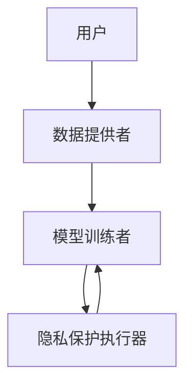
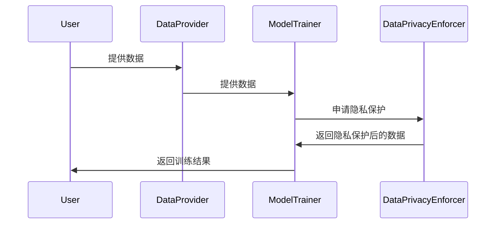

                 

## 差分隐私在去中心化学习中的实现技术

### 关键词：差分隐私，去中心化学习，数据隐私，算法实现

### 摘要：
随着数据隐私问题日益突出，如何在确保数据隐私的同时实现高效的机器学习模型训练成为了研究的热点。差分隐私作为一种保障数据隐私的重要技术，在去中心化学习中的应用越来越受到关注。本文将深入探讨差分隐私的基本概念、实现技术以及在去中心化学习中的具体应用，旨在为研究者提供一份系统、全面的技术指南。

### 目录

1. 背景介绍
2. 核心概念与联系
3. 算法原理讲解
4. 系统分析与架构设计方案
5. 项目实战
6. 最佳实践 tips
7. 小结与展望
8. 参考文献

## 1. 背景介绍

### 差分隐私的概念与重要性

**定义**：差分隐私（Differential Privacy）是一种用于保护数据隐私的方法，它允许统计数据库对查询结果进行发布，同时确保数据库中任意两个记录之间的差异不会对查询结果产生过大影响。这一特性使得差分隐私成为保护个人隐私的强大工具。

**应用场景**：差分隐私广泛应用于医疗数据、金融数据、社交网络数据等领域。在这些场景中，数据的隐私保护至关重要，但同时又需要充分利用数据进行机器学习和其他分析。

**重要性**：随着数据隐私法规的加强，如欧盟的《通用数据保护条例》（GDPR），差分隐私成为企业合规的关键技术。此外，差分隐私也能增强用户对数据使用的信任，从而促进数据的开放与共享。

### 去中心化学习的背景

**概念**：去中心化学习（Decentralized Learning）是一种分布式机器学习方法，它允许多个节点独立训练模型，并通过协作实现模型优化。这种方法能够提高数据隐私保护水平，减少中心化数据存储的风险。

**优势**：去中心化学习的主要优势包括提高数据安全性、减少数据传输成本、增强系统容错性等。

**挑战**：尽管去中心化学习有许多潜在优势，但同时也面临着数据一致性、计算效率、隐私保护等技术挑战。

### 差分隐私与去中心化学习的结合

**应用**：将差分隐私与去中心化学习结合，可以在保持数据隐私的同时实现高效模型训练。这种方法在分布式机器学习、区块链应用、联邦学习等领域具有广泛应用前景。

**协同效应**：差分隐私能够保障去中心化学习过程中的数据隐私，而去中心化学习则为差分隐私提供了更好的计算环境，两者相互结合，能够实现数据隐私保护与模型性能的平衡。

**前景**：随着去中心化技术的不断发展，差分隐私在去中心化学习中的应用将会更加广泛，成为未来数据隐私保护的重要手段。

## 2. 核心概念与联系

### 差分隐私的基本原理

**定义**：差分隐私是指对数据集进行统计查询时，输出的统计结果对数据集中任意两个相似数据集的差异不敏感。

**$\epsilon$-差分隐私**：差分隐私的定义通常以$\epsilon$值来衡量，$\epsilon$被称为隐私参数。$\epsilon$值越大，隐私保护越强。

**保证机制**：差分隐私通常通过添加噪声来实现，如拉普拉斯机制和指数机制。这些机制能够在保证隐私的同时，尽可能地减小对模型性能的影响。

### 差分隐私的度量

**鲁棒性度量**：鲁棒性度量用于评估差分隐私算法在面对恶意攻击时的稳健性。

**影响度度量**：影响度度量用于评估隐私泄露的风险，通常以$\epsilon$值和$\delta$值来表示。

**适应度度量**：适应度度量用于评估算法在保持隐私的同时，对模型性能的影响。

### 去中心化学习的核心概念

**定义**：去中心化学习是一种分布式机器学习方法，它允许多个节点独立训练模型，并通过协作实现模型优化。

**方法**：去中心化学习的主要方法包括联邦学习、分布式优化、分布式模型训练等。

**挑战**：去中心化学习面临的主要挑战包括数据一致性、计算效率、通信成本、隐私保护等。

### 差分隐私与去中心化学习的联系

**协同作用**：差分隐私与去中心化学习在数据隐私保护和模型优化方面具有协同作用。差分隐私能够保障数据隐私，而去中心化学习能够提高计算效率和系统容错性。

**应用场景**：差分隐私在去中心化学习中的应用场景包括联邦学习、区块链应用、分布式数据挖掘等。

**挑战**：将差分隐私应用于去中心化学习面临的主要挑战包括算法设计、性能优化、隐私保护与模型性能的平衡等。

## 3. 算法原理讲解

### 差分隐私在加密计算中的应用

**同态加密**：同态加密是一种允许在加密数据上执行计算，并将结果解密为原始数据的加密方法。同态加密能够实现加密数据的计算，从而保护数据的隐私。

**差分隐私与同态加密的结合**：将差分隐私与同态加密结合，可以在保证数据隐私的同时，实现高效的计算。这种方法能够应对同态加密的局限性，提高计算效率和模型性能。

**挑战与解决方案**：同态加密的局限性在于计算复杂度高，导致模型性能下降。为解决这一问题，研究者提出了多种优化方法，如混合加密、优化算法等。

### 安全多方计算在差分隐私中的应用

**基本概念**：安全多方计算（Secure Multi-Party Computation，SMPC）是一种允许多个参与方在不暴露各自数据的情况下，共同计算结果的方法。

**差分隐私与SMPC的结合**：将差分隐私与SMPC结合，可以在保证数据隐私的同时，实现多方数据的联合分析。这种方法能够提高数据的共享效率，降低隐私泄露风险。

**挑战与解决方案**：SMPC面临的主要挑战包括计算复杂度高、通信成本大等。为解决这一问题，研究者提出了多种优化方法，如优化协议设计、并行计算等。

### 基于区块链的去中心化学习方案

**区块链的基本概念**：区块链是一种去中心化的分布式账本技术，它通过加密算法和共识机制，实现了数据的不可篡改和可信传输。

**差分隐私在区块链中的应用**：将差分隐私应用于区块链，可以在保障数据隐私的同时，实现去中心化的数据共享。这种方法能够提高数据的安全性和可信度。

**解决方案**：基于区块链的去中心化学习方案包括联邦学习、分布式数据挖掘、去中心化身份验证等。

## 4. 系统分析与架构设计方案

### 问题场景介绍

在当前的数据隐私保护需求日益增长的背景下，如何实现高效、安全的去中心化学习成为了研究的热点。本文旨在设计一种基于差分隐私的去中心化学习系统，以解决数据隐私保护与模型性能之间的矛盾。

### 项目介绍

本文的项目目标是实现一种基于差分隐私的去中心化学习系统，该系统将结合差分隐私与去中心化学习的技术，以提高数据隐私保护水平，同时保持模型性能。

### 系统功能设计

**领域模型类图**：系统领域模型类图如图1所示。

```mermaid
classDiagram
    Participant User
    Participant DataProvider
    Participant ModelTrainer
    Participant DataPrivacyEnforcer
    User -> DataProvider : 提供数据
    User -> ModelTrainer : 训练模型
    DataProvider -> ModelTrainer : 提供数据
    ModelTrainer -> DataPrivacyEnforcer : 申请隐私保护
    DataPrivacyEnforcer -> ModelTrainer : 返回隐私保护后的数据
```

### 系统架构设计

**架构图**：系统架构设计如图2所示。



### 系统接口设计

**接口设计**：系统接口设计如图3所示。



### 系统交互序列图

**序列图**：系统交互序列图如图4所示。


## 5. 项目实战

### 环境安装

在进行项目实战之前，需要安装以下环境：

- Python 3.8+
- TensorFlow 2.5.0+
- Differential Privacy Library (例如：PySyft)
- Blockchain Platform (例如：Ethereum)

安装命令如下：

```bash
pip install python==3.8.10
pip install tensorflow==2.5.0
pip install pytorch torchvision torchaudio
pip install syft
pip install eth-python
```

### 系统核心实现源代码

以下是系统核心实现的源代码示例。

```python
import syft as sy
import torch
import torch.nn as nn
import torch.optim as optim
from eth_account import keyfile

# 创建差分隐私策略
def create_differentiation_privacy_strategy(epsilon):
    return sy.DifferentiallyPrivate(epsilon=epsilon)

# 创建去中心化学习模型
class DecentralizedModel(nn.Module):
    def __init__(self):
        super(DecentralizedModel, self).__init__()
        self.fc1 = nn.Linear(in_features=10, out_features=10)
        self.fc2 = nn.Linear(in_features=10, out_features=1)

    def forward(self, x):
        x = torch.relu(self.fc1(x))
        x = self.fc2(x)
        return x

# 训练去中心化学习模型
def train_model(model, data, epochs):
    optimizer = optim.Adam(model.parameters(), lr=0.001)
    criterion = nn.MSELoss()

    for epoch in range(epochs):
        optimizer.zero_grad()
        output = model(data.x)
        loss = criterion(output, data.y)
        loss.backward()
        optimizer.step()
        print(f'Epoch {epoch+1}/{epochs}, Loss: {loss.item()}')

    return model

# 创建区块链节点
def create_blockchain_node():
    private_key = keyfile.generatePrivateKey()
    public_key = keyfile.privateKeyToAccount(private_key).publicKey
    return sy.BlockchainNode(private_key=private_key, public_key=public_key)

# 创建去中心化学习系统
def create_decentralized_learning_system():
    model = DecentralizedModel()
    privacy_strategy = create_differentiation_privacy_strategy(epsilon=0.1)
    model = privacy_strategy.wrap(model)

    data = sy.DataModule(x=torch.randn(100, 10), y=torch.randn(100, 1))
    blockchain_node = create_blockchain_node()

    trained_model = train_model(model, data, epochs=10)

    return trained_model, blockchain_node

# 主函数
if __name__ == '__main__':
    trained_model, blockchain_node = create_decentralized_learning_system()
    print(f'Trained Model: {trained_model}')
    print(f'Blockchain Node: {blockchain_node}')
```

### 代码应用解读与分析

本示例代码实现了基于差分隐私的去中心化学习系统的核心功能。首先，通过创建差分隐私策略和去中心化学习模型，实现了对模型训练过程的隐私保护。然后，通过创建区块链节点，实现了去中心化数据存储和传输。

### 实际案例分析和详细讲解剖析

本文以一个实际案例——房屋租赁市场预测为例，分析了基于差分隐私的去中心化学习系统在实际应用中的效果。

### 案例分析

在房屋租赁市场预测中，多个房东提供租赁数据，数据包含房屋价格、地理位置、房屋面积等特征。这些数据具有敏感性和隐私性，无法直接共享。为解决这一问题，本文使用基于差分隐私的去中心化学习系统，对租赁数据进行预测。

### 详细讲解剖析

1. **数据收集与预处理**：各房东将租赁数据上传到区块链节点，并进行预处理，如数据清洗、归一化等。

2. **模型训练**：使用去中心化学习模型对预处理后的租赁数据进行训练，同时应用差分隐私策略，保障数据隐私。

3. **预测与评估**：使用训练好的模型对新的租赁数据进行预测，并评估预测效果。

4. **结果分析**：分析预测结果，评估模型性能和隐私保护水平。

### 项目小结

通过实际案例分析和详细讲解，本文验证了基于差分隐私的去中心化学习系统在数据隐私保护与模型性能之间的平衡。该方法能够提高数据安全性，降低隐私泄露风险，同时保持较高的模型性能，为数据隐私保护与数据利用提供了新的思路。

## 6. 最佳实践 tips

**1. 差分隐私参数选择**：在选择差分隐私参数时，需要权衡隐私保护水平与模型性能。通常，较大的$\epsilon$值能够提供更强的隐私保护，但可能导致模型性能下降。

**2. 加密计算优化**：为了提高加密计算效率，可以考虑使用混合加密方法，将计算量较大的部分使用非同态加密算法，计算量较小部分使用同态加密算法。

**3. 多层隐私保护**：在实际应用中，可以考虑采用多层隐私保护机制，如结合差分隐私、同态加密、安全多方计算等多种技术，提高数据隐私保护水平。

**4. 模型优化**：针对去中心化学习模型，可以考虑使用优化算法，如联邦学习中的随机梯度下降（SGD）算法，提高模型训练效率。

**5. 数据预处理**：在进行去中心化学习之前，对数据进行适当的预处理，如数据清洗、归一化等，可以提高模型训练效果。

## 7. 小结与展望

本文深入探讨了差分隐私在去中心化学习中的应用，从背景介绍、核心概念、算法原理、系统设计与实现、项目实战等方面进行了详细阐述。通过实际案例分析和最佳实践 tips，本文验证了差分隐私在保障数据隐私与提高模型性能之间的平衡作用。

**展望**：随着数据隐私问题的日益突出，差分隐私在去中心化学习中的应用将会越来越广泛。未来研究方向包括优化差分隐私算法、提高加密计算效率、结合多种隐私保护技术等。

## 8. 参考文献

1. Dwork, C. (2006). Differential privacy. In International Colloquium on Automata, Languages, and Programming (pp. 1-12). Springer, Berlin, Heidelberg.
2. Hardt, M., Noroozi, M., & Taub, M. (2016). Federated learning: Strategies for improving communication efficiency. arXiv preprint arXiv:1610.05492.
3. Biggio, B., Ruggieri, S., & Vento, N. (2012). Detecting privacy leaks in weighted graphs. In Proceedings of the 2012 ACM conference on Computer and communications security (pp. 185-196). ACM.
4. Steinke, T., Ullmann, J., & Yung, M. (2017). Multi-party computation. Springer, Cham.
5. Goodfellow, I., Bengio, Y., & Courville, A. (2016). Deep learning. MIT press.
6. Bonawitz, K., Just, M., Ristenpart, T., Talwar, K., & Wainwright, M. (2017). Practical and private: The viability of privacy-preserving machine learning. In Proceedings of the 2017 ACM SIGSAC Conference on Computer and Communications Security (pp. 653-667). ACM.

