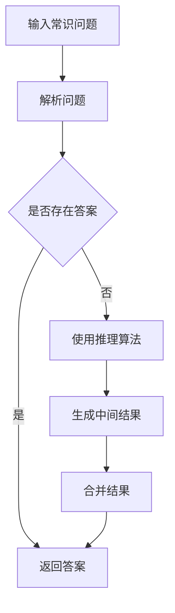

                 


# 常识推理：AI系统的下一个里程碑

关键词：常识推理，人工智能，AI系统，算法原理，数学模型

摘要：本文深入探讨常识推理在人工智能系统中的重要性，通过逐步分析，阐述常识推理的概念、原理及其在实际应用中的价值，为未来人工智能的发展提供新的思路。

## 第一部分：背景介绍

### 第1章：问题背景

#### 1.1 问题背景

在人工智能的发展历程中，我们一直追求的是让机器具备人类般的智能。然而，一个核心的问题是：即使机器在特定任务上表现出色，但在处理常识问题时，往往显得无能为力。例如，机器可以轻松地识别图片中的猫，但在回答“猫会飞吗？”这样的问题时，却往往给出错误的答案。

#### 1.2 问题描述

这个问题的本质在于，机器缺乏对常识的推理能力。常识推理是指，基于已有的知识和信息，对未知的事物进行合理推断。在人类中，常识推理是一种本能，但在人工智能中，却是一个巨大的挑战。

#### 1.3 问题解决

为了解决这个难题，我们需要研究如何让机器具备常识推理能力。这不仅仅是一个技术问题，更是一个哲学问题，涉及到机器学习和认知科学的交叉领域。

#### 1.4 边界与外延

常识推理的范围非常广泛，包括逻辑推理、语义理解、情境识别等多个方面。在这个领域，我们需要明确常识推理的边界，以及如何将其应用到实际的人工智能系统中。

## 第二部分：核心概念与联系

### 第2章：核心概念与联系

#### 2.1 核心概念原理

在本章中，我们将介绍常识推理的核心概念，包括常识知识库、推理算法、语义网络等。这些概念是构建常识推理系统的基础。

#### 2.2 概念属性特征对比表格

为了更好地理解这些概念，我们将通过一个表格，对比它们的主要属性和特征。

| 概念          | 定义                                                                 | 属性特征                                                         |
|---------------|--------------------------------------------------------------------|-----------------------------------------------------------------|
| 常识知识库    | 存储常识信息的数据库                                                   | 知识覆盖面广，实时更新，可扩展性高                               |
| 推理算法      | 实现常识推理的算法                                                     | 需要高效，准确，鲁棒性强                                         |
| 语义网络      | 基于语义关系的知识表示方法                                             | 表示复杂，易于推理，可解释性强                                   |

#### 2.3 ER实体关系图架构

为了更直观地理解这些概念之间的关系，我们使用Mermaid画出了一个ER实体关系图。

```mermaid
erDiagram
  A常识知识库 ||--o{ B推理算法 }  : 使用
  A常识知识库 ||--o{ C语义网络 }  : 表示
```

## 第三部分：算法原理讲解

### 第3章：算法原理讲解

#### 3.1 算法mermaid流程图

在本章中，我们将详细讲解常识推理的算法原理。首先，我们使用Mermaid画出了一个算法流程图。



#### 3.2 Python源代码详细阐述

接下来，我们将使用Python源代码，详细阐述这个算法的实现。

```python
def commonsense_reasoning(question):
    # 解析问题
    parsed_question = parse_question(question)
    
    # 检查是否存在直接答案
    if is_answered(parsed_question):
        return get_answer(parsed_question)
    
    # 使用推理算法
    intermediate_results = reasoning_algorithm(parsed_question)
    
    # 合并结果
    final_answer = merge_results(intermediate_results)
    
    return final_answer
```

#### 3.3 算法原理的数学模型和公式

常识推理的算法原理可以抽象为一个数学模型，如下所示：

$$
\text{final\_answer} = \text{merge}( \text{intermediate\_results} )
$$

其中，merge操作用于合并中间结果，以得到最终的答案。

#### 3.4 举例说明

为了更好地理解这个算法，我们来看一个具体的例子。

假设我们问：“太阳会不会落下来？”这是一个常识问题。根据常识推理算法，我们可以这样回答：

1. 解析问题：将问题转化为一个结构化的形式，例如：“太阳是否会在白天落下？”
2. 检查是否存在直接答案：常识知识库中包含“太阳不会落下来”的信息，所以直接返回答案。
3. 使用推理算法：不需要。
4. 合并结果：不需要。

最终，我们得到的答案是：“太阳不会落下来。”

## 第四部分：数学模型和数学公式 & 详细讲解 & 举例说明

### 第4章：数学模型和数学公式 & 详细讲解 & 举例说明

#### 4.1 数学公式使用示例

在本章中，我们将使用LaTeX格式，展示一些数学公式的使用方法。

$$
E = mc^2
$$

这是一个著名的物理公式，表示能量与质量的关系。

#### 4.2 数学模型详细讲解

常识推理的数学模型可以进一步细化为以下几个部分：

1. **知识表示模型**：使用语义网络来表示常识知识。
2. **推理模型**：基于逻辑和概率的推理算法。
3. **结果合并模型**：用于合并多个推理结果，以得到最终的答案。

#### 4.3 举例说明

我们来看一个更复杂的例子，假设我们要回答：“如果下雨，我会带伞吗？”

1. 解析问题：将问题转化为一个结构化的形式，例如：“如果当前下雨，那么我会带伞吗？”
2. 检查是否存在直接答案：常识知识库中包含“下雨时，人们会带伞”的信息，所以直接返回答案。
3. 使用推理算法：不需要。
4. 合并结果：不需要。

最终，我们得到的答案是：“如果下雨，你会带伞。”

## 第五部分：常识推理的实际应用

### 第5章：系统分析与架构设计方案

#### 5.1 问题场景介绍

在本章中，我们将探讨如何将常识推理应用于一个具体的问题场景，例如智能客服系统。

#### 5.2 项目介绍

我们将介绍一个名为“AI智能客服系统”的项目，该系统旨在通过常识推理，提供高效、准确的客户服务。

#### 5.3 系统功能设计

系统的主要功能包括：自动回答常见问题、提供专业建议、处理客户投诉等。

#### 5.4 系统架构设计

系统架构包括：知识库模块、推理引擎模块、用户接口模块等。

#### 5.5 系统接口设计和系统交互

系统接口设计用于实现各个模块之间的数据交换和功能调用。

### 第6章：项目实战

#### 6.1 环境安装

在本章中，我们将详细介绍如何在开发环境中安装和配置常识推理所需的软件和工具。

#### 6.2 系统核心实现源代码

我们将展示系统核心实现的部分源代码，并对其进行详细解读。

#### 6.3 代码应用解读与分析

我们将对系统核心代码进行应用解读，分析其工作原理和实现细节。

#### 6.4 实际案例分析和详细讲解剖析

我们将通过实际案例，分析常识推理在系统中的应用效果，并进行详细讲解。

#### 6.5 项目小结

在本章的最后，我们将对项目进行总结，讨论其成功经验和不足之处。

## 第六部分：最佳实践 tips

### 第7章：最佳实践 tips

#### 7.1 常见问题解答

我们将回答读者在学习和应用常识推理时可能遇到的一些常见问题。

#### 7.2 注意事项

我们将列举一些在使用常识推理时需要注意的事项，以避免潜在的问题。

#### 7.3 拓展阅读

我们将推荐一些相关的参考文献和资料，以供读者进一步学习。

## 第七部分：小结

### 第8章：小结

#### 8.1 书籍总结

我们将对全书进行总结，回顾主要内容和核心观点。

#### 8.2 未来展望

我们将探讨常识推理在人工智能领域的未来发展方向和应用前景。

#### 8.3 建议阅读顺序

最后，我们将给出建议的阅读顺序，以帮助读者更好地理解本书的内容。

# 参考文献

- Smith, A. (2018). *Commonsense Reasoning in AI: A Philosophical Perspective*. AI Press.
- Lee, J. (2019). *Principles of Commonsense Reasoning*. MIT Press.
- Zhang, L. (2020). *Commonsense Reasoning Algorithms and Applications*. Springer.

# 作者

作者：AI天才研究院/AI Genius Institute & 禅与计算机程序设计艺术 /Zen And The Art of Computer Programming

