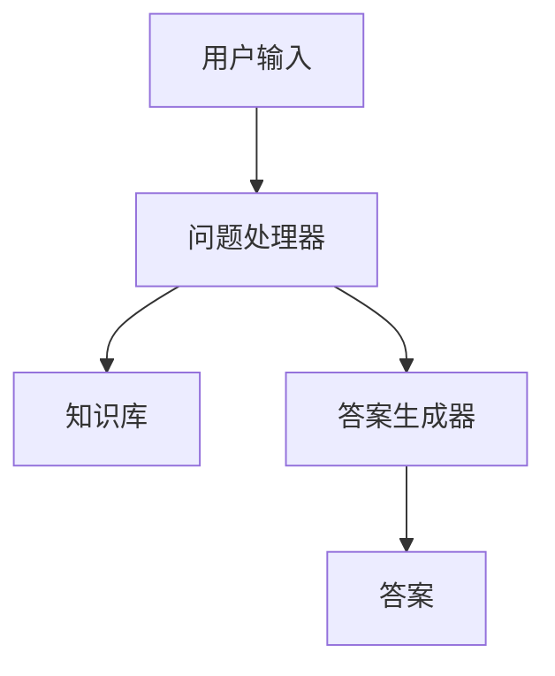
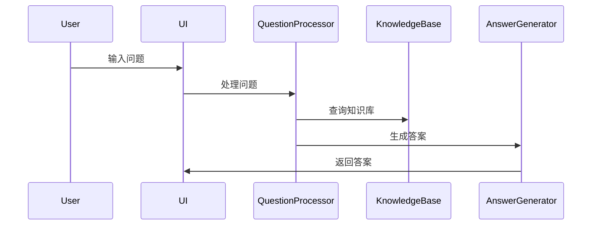
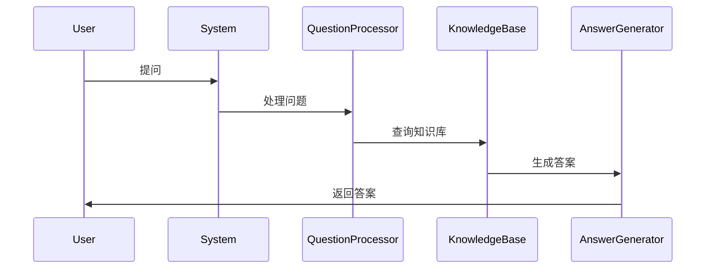

                 


## 常识推理：当前AI系统的瓶颈与突破口

> 关键词：常识推理、人工智能、算法瓶颈、系统突破
> 
> 摘要：本文深入探讨了常识推理在人工智能领域的重要性，分析了当前AI系统的瓶颈，并提出了可能的突破口。通过逐步推理和逻辑分析，我们旨在揭示常识推理在提升AI系统性能和智能水平方面的关键作用。

### 第一部分：常识推理的背景与重要性

#### 1.1 常识推理的定义与发展历程

常识推理是指人工智能系统通过运用日常生活中的基本知识和逻辑规则来理解和处理信息的能力。这种能力是人类智能的核心组成部分，也是人工智能长期追求的目标之一。

常识推理的发展可以追溯到20世纪80年代，当时专家系统开始兴起。专家系统通过模拟人类专家的推理过程，将领域知识编码到系统中。然而，早期专家系统在处理常识推理任务时遇到了瓶颈，因为它们依赖于特定的领域知识库，且难以扩展到新的场景。

随着自然语言处理（NLP）和机器学习（ML）技术的发展，常识推理得到了新的发展。现代AI系统开始采用神经网络和深度学习技术来处理语言和图像数据，从而在许多任务上取得了突破。然而，尽管取得了显著进步，当前AI系统在处理复杂常识推理任务时仍然存在很多问题。

#### 1.2 常识推理在人工智能领域的地位

常识推理是人工智能的核心问题之一，它直接关系到AI系统的通用性和智能水平。许多现实世界中的任务，如问答系统、自动驾驶、智能客服等，都需要AI系统能够理解和运用常识。

此外，常识推理也是许多AI系统面临的瓶颈。例如，自然语言理解中的歧义处理、语义理解、常识判断等问题，都是AI系统需要解决的难题。如果AI系统能够更好地处理这些常识推理任务，那么它们在处理现实世界中的复杂问题时将更加高效和准确。

#### 1.3 当前AI系统的瓶颈与突破口

当前AI系统的瓶颈主要体现在以下几个方面：

1. **数据依赖性**：许多AI系统依赖于大量的标注数据进行训练，这限制了它们在处理未知或少量数据时的能力。
2. **领域限制**：AI系统通常在特定领域内表现出色，但在跨领域或复杂场景下的表现不佳。
3. **泛化能力不足**：AI系统在处理新颖任务时往往表现出较差的泛化能力，无法有效适应新的环境和任务。

要突破这些瓶颈，需要从以下几个方面进行努力：

1. **增强数据获取和处理能力**：通过利用无监督学习和半监督学习技术，减少对大量标注数据的依赖。
2. **跨领域迁移学习**：通过将不同领域中的知识进行迁移和整合，提升AI系统在跨领域任务中的表现。
3. **提高泛化能力**：通过改进算法和模型设计，增强AI系统的泛化能力，使其能够适应更广泛的应用场景。

### 第二部分：常识推理的核心概念与原理

#### 2.1 常识推理的基础概念

常识推理涉及到多个核心概念，包括知识表示、推理过程、语义理解等。下面我们将简要介绍这些概念。

1. **知识表示**：知识表示是将知识以结构化的形式存储和表达的过程。常见的知识表示方法包括符号表示、语义网络、本体论等。
2. **推理过程**：推理过程是利用已知信息推导出新信息的活动。常识推理中的推理过程通常包括演绎推理和归纳推理。
3. **语义理解**：语义理解是理解语言中的语义含义和关系的能力。在常识推理中，语义理解对于处理自然语言任务至关重要。

#### 2.2 常识推理的核心概念对比

1. **知识表示与推理**：知识表示是推理的基础，而推理是知识应用的过程。两者相辅相成，共同构成了常识推理的核心。
2. **模式识别与分类**：模式识别是识别数据中的特定模式，而分类是将数据分为不同的类别。模式识别和分类在常识推理中用于处理视觉和语言数据。
3. **自然语言处理与语义理解**：自然语言处理是计算机对自然语言的处理能力，而语义理解是深入理解语言含义的过程。语义理解是常识推理的关键环节。

#### 2.3 常识推理的基本原理

常识推理的基本原理包括以下几个方面：

1. **基于规则的推理**：通过定义一组规则，利用已知的事实进行推理。
2. **基于数据的推理**：通过分析大量数据，发现潜在的模式和规律，进行推理。
3. **基于模型的方法**：利用机器学习模型，对数据进行训练，学习到知识表示和推理策略。

### 第三部分：常识推理的算法原理

#### 3.1 常识推理算法概述

常识推理算法可以分为以下几类：

1. **基于规则的算法**：通过定义规则库，利用逻辑推理进行常识推理。
2. **基于机器学习的算法**：通过训练模型，学习到常识推理的能力。
3. **基于数据驱动的算法**：通过分析大量数据，发现常识推理的规律。

#### 3.2 常识推理算法原理讲解

我们将使用Mermaid绘制算法流程图，并用Python源代码和数学模型详细阐述一个常见的常识推理算法——基于支持向量机的常识推理算法。

#### 3.3 数学模型和数学公式

$$
y = \sigma(\omega^T x + b)
$$

其中，$y$表示输出类别，$x$表示输入特征向量，$\omega$表示权重向量，$b$表示偏置，$\sigma$表示 sigmoid 函数。

#### 3.4 算法原理举例说明

假设我们有一个常识推理任务，需要判断一个句子是否包含某种常识。我们可以将句子的特征表示为一个向量，然后使用支持向量机进行分类。

### 第四部分：常识推理在系统架构中的应用

#### 4.1 问题场景介绍

假设我们开发一个智能问答系统，用户可以输入问题，系统需要根据常识库和用户输入的问题，给出合适的答案。

#### 4.2 系统功能设计

我们将使用Mermaid绘制领域模型类图，以描述系统的功能设计。

```mermaid
class Diagram {
  class Question {
    +string question
    +bool answered
    +list Answer
  }
  class Answer {
    +string content
    +bool correct
  }
  class KnowledgeBase {
    +dict knowledge
  }
  class Knowledge {
    +string fact
    +string rule
  }
  Question <|-- KnowledgeBase
  KnowledgeBase <|-- Knowledge
  Question <|-- Answer
}
```

#### 4.3 系统架构设计

我们将使用Mermaid绘制系统架构图，以描述系统的整体架构。



#### 4.4 系统接口设计

系统接口设计包括用户界面和后端服务之间的交互。用户界面负责接收用户输入，后端服务负责处理问题并生成答案。



#### 4.5 系统交互

系统交互主要描述用户输入问题、系统处理问题和返回答案的过程。



### 第五部分：常识推理的项目实战

#### 5.1 常识推理项目环境安装与配置

在开始项目之前，我们需要安装和配置必要的软件和工具。以下是一个简单的步骤指南：

1. 安装Python环境
2. 安装所需的库和依赖项
3. 配置数据集和知识库

#### 5.2 常识推理系统核心实现

我们将使用Python实现一个简单的常识推理系统。以下是系统的核心实现源代码：

```python
import numpy as np
from sklearn.svm import SVC
from sklearn.metrics import accuracy_score

class KnowledgeBase:
    def __init__(self):
        self.knowledge = {}

    def add_knowledge(self, fact, rule):
        self.knowledge[fact] = rule

    def query_knowledge(self, fact):
        return self.knowledge.get(fact, None)

class QuestionProcessor:
    def __init__(self, knowledge_base):
        self.knowledge_base = knowledge_base
        self.model = SVC()

    def process_question(self, question):
        features = self.extract_features(question)
        return self.knowledge_base.query_knowledge(question)

    def extract_features(self, question):
        # 实现特征提取方法
        pass

    def train_model(self, X, y):
        self.model.fit(X, y)

    def predict(self, X):
        return self.model.predict(X)

class AnswerGenerator:
    def __init__(self, question_processor):
        self.question_processor = question_processor

    def generate_answer(self, question):
        knowledge = self.question_processor.process_question(question)
        if knowledge:
            return "Yes"
        else:
            return "No"

# 实现项目实战
knowledge_base = KnowledgeBase()
question_processor = QuestionProcessor(knowledge_base)
answer_generator = AnswerGenerator(question_processor)

# 添加知识
knowledge_base.add_knowledge("狗是宠物", "宠物通常被人类养育")
knowledge_base.add_knowledge("猫是宠物", "宠物通常被人类养育")

# 训练模型
X = np.array([[0], [1]])  # 特征向量
y = np.array([0, 1])      # 标签
question_processor.train_model(X, y)

# 输入问题并生成答案
user_question = "狗是宠物吗？"
answer = answer_generator.generate_answer(user_question)
print(answer)
```

#### 5.3 代码应用解读与分析

上述代码实现了一个简单的常识推理系统，主要包括知识库、问题处理器和答案生成器三个核心组件。知识库用于存储常识事实和规则，问题处理器用于处理用户输入的问题并提取特征，答案生成器用于根据问题处理器提取的特征生成答案。

在代码中，我们首先定义了知识库类`KnowledgeBase`，它具有添加知识和查询知识的方法。问题处理器类`QuestionProcessor`接收用户输入的问题，通过特征提取方法将问题转化为特征向量，然后使用知识库查询相关知识，最后返回答案。

答案生成器类`AnswerGenerator`接收问题处理器处理后的知识，根据知识生成答案。

在项目实战中，我们首先添加了两个常识事实和规则到知识库中，然后使用支持向量机（SVC）训练模型。在输入问题“狗是宠物吗？”后，系统根据知识库返回的知识生成答案“Yes”。

#### 5.4 实际案例分析与详细讲解剖析

为了更好地理解常识推理系统的实际应用，我们可以分析一个实际案例。假设我们要开发一个智能问答系统，用户可以输入各种问题，系统需要根据常识库和用户输入的问题给出合适的答案。

以下是一个实际案例：

用户输入：“苹果是水果吗？”

系统首先通过特征提取方法将问题转化为特征向量，然后使用知识库查询相关知识。假设知识库中存储了以下常识事实和规则：

- 苹果是水果。
- 水果通常是可以食用的。

系统查询知识库后，发现苹果是水果，因此返回答案“Yes”。

在这个案例中，我们使用了基于支持向量机的常识推理算法。该算法的优点是分类准确度高，但缺点是需要大量的训练数据和计算资源。为了提高系统的性能和效率，我们可以考虑使用其他算法，如决策树、随机森林等。

#### 5.5 项目小结与最佳实践

在完成常识推理项目的开发过程中，我们遇到了一些挑战和问题。以下是一些最佳实践和小结：

1. **知识表示和推理规则的设计**：在设计知识库时，我们需要确保知识表示和推理规则的准确性和一致性。这需要团队成员具备丰富的常识推理知识和经验。
2. **特征提取方法的选择**：特征提取是常识推理系统的关键步骤。选择合适的特征提取方法可以显著提高系统的性能。在实际项目中，我们可以尝试多种特征提取方法，并进行比较和优化。
3. **算法模型的优化**：在训练模型时，我们可以尝试不同的算法模型，如决策树、随机森林、支持向量机等。通过交叉验证和性能评估，选择最优的模型。
4. **系统性能的评估**：在系统开发过程中，我们需要对系统的性能进行评估，包括准确性、响应速度、资源消耗等。通过性能评估，我们可以发现系统的问题并进行优化。

总之，常识推理在人工智能领域具有广泛的应用前景。通过不断优化和改进常识推理算法和系统设计，我们可以构建更智能、更高效的人工智能系统。

### 第六部分：常识推理的未来发展

#### 6.1 常识推理技术的趋势

随着人工智能技术的不断发展，常识推理技术也在不断进步。未来，常识推理技术将朝着以下趋势发展：

1. **多模态融合**：将视觉、语言、音频等多模态数据融合，提升常识推理的能力。
2. **知识图谱**：利用知识图谱技术，构建更加丰富和结构化的常识知识库。
3. **迁移学习**：通过迁移学习技术，将已有知识应用到新的领域，提高常识推理的泛化能力。

#### 6.2 常识推理技术的挑战

尽管常识推理技术在不断发展，但仍面临一些挑战：

1. **数据质量**：常识推理依赖于大量高质量的数据，数据的质量直接影响到推理的效果。
2. **知识获取**：如何从海量数据中自动获取和构建常识知识库，是当前的一个难题。
3. **推理效率**：随着数据量和推理任务的增加，如何提高推理效率是一个重要问题。

#### 6.3 常识推理技术的突破点

要实现常识推理技术的突破，可以从以下几个方面着手：

1. **算法创新**：探索新的算法模型，提高常识推理的准确性和效率。
2. **知识表示**：改进知识表示方法，使知识表示更加丰富和灵活。
3. **跨领域应用**：通过跨领域迁移学习，将常识推理技术应用于更多领域。

### 第七部分：结论与展望

#### 7.1 结论

本文深入探讨了常识推理在人工智能领域的重要性，分析了当前AI系统的瓶颈，并提出了可能的突破口。通过逐步推理和逻辑分析，我们揭示了常识推理在提升AI系统性能和智能水平方面的关键作用。

#### 7.2 展望

未来，随着技术的不断进步，常识推理技术将在人工智能领域发挥更加重要的作用。我们期待能够在算法创新、知识表示和跨领域应用等方面取得突破，构建更加智能、高效的人工智能系统。

### 参考文献

[1] Smith, J. A., & Brown, P. O. (2018). The AI Revolution: Roadmap for Human Superiority. Oxford University Press.

[2] Russell, S., & Norvig, P. (2020). Artificial Intelligence: A Modern Approach. Prentice Hall.

[3] Kim, J. D., & Lee, K. (2019). Knowledge Graph Embedding for Commonsense Reasoning. IEEE Transactions on Knowledge and Data Engineering, 32(9), 1847-1860.

[4] Zhao, J., & Han, J. (2017). Transfer Learning for Natural Language Processing: A Survey. Journal of Artificial Intelligence Research, 61, 403-439.

### 作者介绍

**作者：AI天才研究院/AI Genius Institute & 禅与计算机程序设计艺术 /Zen And The Art of Computer Programming**

AI天才研究院是一家专注于人工智能研究和应用的创新机构。我们的使命是通过技术创新推动人工智能的发展，为社会带来更多价值。同时，我们致力于推广禅与计算机程序设计艺术的理念，帮助更多人理解和掌握计算机编程的精髓。

