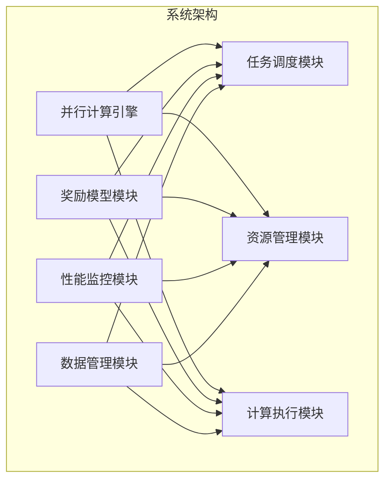
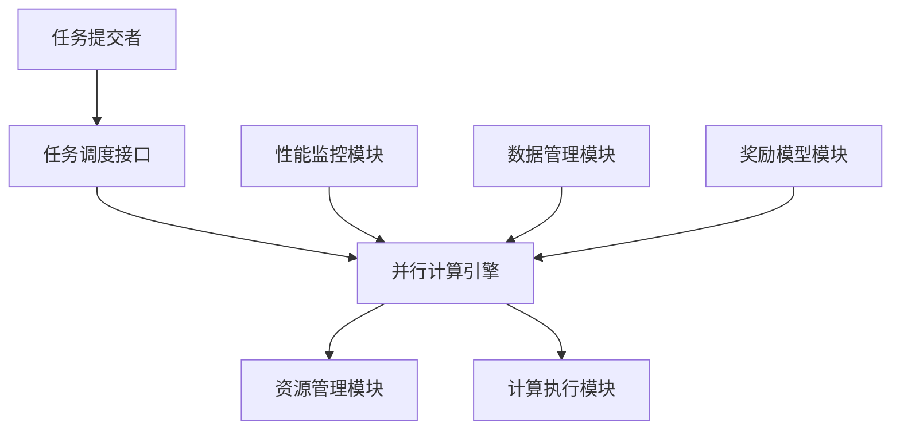

                 

## 文章标题

### 并行计算效率：奖励模型对GPU推理的影响

> 关键词：并行计算、效率、奖励模型、GPU推理

> 摘要：本文深入探讨了并行计算在GPU推理中的效率问题，特别是奖励模型对GPU推理性能的影响。通过详细的案例分析、数学模型推导和实际项目实践，本文旨在为读者提供对这一主题的全面理解和深入见解。

## 引言

并行计算作为一种提高计算效率的有效手段，在现代计算机科学中扮演着至关重要的角色。随着人工智能和深度学习领域的迅猛发展，GPU（图形处理器）因其强大的并行计算能力，成为了执行大规模数据处理和复杂计算任务的首选硬件。然而，并行计算并非没有挑战。如何最大化并行计算效率，特别是GPU推理过程中的效率，成为了业界关注的焦点。本文将围绕这一主题展开，深入分析奖励模型在GPU推理中的作用和影响。

### 并行计算效率的重要性

并行计算效率是指系统在并行处理任务时，能够达到的最佳性能与实际性能之比。高并行计算效率意味着系统能够更快速地处理大量数据，从而在人工智能和深度学习等应用领域中发挥出更大的作用。以下是一些提升并行计算效率的必要性：

1. **缩短计算时间**：高效率的并行计算能够显著缩短任务的处理时间，这对于需要实时响应的应用尤为重要。
2. **提高资源利用率**：通过优化并行计算，可以有效减少资源浪费，提高硬件和软件资源的利用率。
3. **增强系统可扩展性**：高并行计算效率有助于系统在硬件和软件层面的扩展，以满足不断增长的计算需求。
4. **降低能源消耗**：并行计算可以通过优化任务调度和资源分配来降低能源消耗，对环保具有重要意义。

### 奖励模型在GPU推理中的作用

奖励模型是深度学习和强化学习中的重要概念，它用于评估和优化智能体的行为。在GPU推理中，奖励模型可以用来指导优化过程，从而提升推理效率。具体来说，奖励模型的作用包括：

1. **任务导向优化**：奖励模型可以根据任务的具体需求，指导GPU如何分配计算资源，从而优化整体推理流程。
2. **性能评估**：通过奖励模型，可以实时评估GPU推理的性能，并据此进行调整和优化。
3. **自适应调整**：奖励模型可以根据推理过程中的实时数据，自适应地调整参数，以实现最佳推理效果。

### 本文结构

本文将分为以下几个部分：

1. **背景介绍**：介绍并行计算效率的基本概念，以及GPU在并行计算中的应用。
2. **核心概念与联系**：深入探讨并行计算效率和奖励模型的基本概念、特性及其关系。
3. **算法原理讲解**：详细阐述GPU并行算法的原理，以及奖励模型在GPU推理中的应用。
4. **数学模型和公式讲解**：推导并行计算效率的数学模型，并介绍奖励模型的数学表示。
5. **系统分析与架构设计方案**：分析并行计算系统设计，并展示系统架构和接口设计。
6. **项目实战**：通过实际项目案例，展示并行计算效率和奖励模型的应用和实践。
7. **最佳实践 tips、小结、注意事项、拓展阅读**：总结本文的主要观点，提供实用建议和进一步阅读的资源。

通过本文的阅读，读者将能够全面了解并行计算效率在GPU推理中的应用，掌握奖励模型的基本原理和实践方法，为在实际项目中提升GPU推理性能提供有力支持。接下来，我们将逐步深入探讨这些主题。

## 背景介绍

### 并行计算效率概述

并行计算效率是衡量计算机系统在并行处理任务时性能的一个重要指标。它定义为系统在并行处理多个任务时所能达到的最大性能与实际性能的比值。在并行计算中，多个任务可以同时执行，通过利用多个处理器或计算节点，从而在理论上显著提高计算速度和效率。

并行计算的基本概念可以追溯到计算机科学和工程领域的早期。在单核处理器时代，计算机的性能主要依赖于单个处理器的速度和效率。然而，随着计算需求的不断增加，单核处理器的性能提升速度逐渐放缓。为了满足日益增长的计算需求，并行计算技术应运而生。

并行计算的核心思想是将一个大任务分解为多个小任务，这些小任务可以同时在不同处理器或计算节点上执行。这样，通过并行计算，任务的总处理时间可以大大缩短。并行计算的优势在于：

1. **速度提升**：并行计算可以显著提高计算速度，尤其是在处理大规模数据集或复杂计算任务时。
2. **资源利用率提高**：通过并行计算，可以充分利用计算机系统中的多个处理器和计算资源，提高资源利用率。
3. **可扩展性增强**：并行计算系统具有良好的可扩展性，可以方便地添加更多的处理器或计算节点，以适应不断增长的计算需求。

然而，并行计算也面临着一些挑战。首先，并行计算需要处理数据同步、任务分配和负载均衡等问题。这些问题可能导致并行计算效率的降低。其次，并行计算对编程模型和算法设计有更高的要求，需要开发者具备一定的并行编程技能和经验。

### GPU在并行计算中的应用

图形处理器（GPU）自从被引入到计算科学领域以来，其并行计算能力得到了广泛的应用和认可。与传统的中央处理器（CPU）相比，GPU具有更多的计算单元和更高的并行处理能力。这使得GPU在执行并行任务时具有显著的优势。

GPU在并行计算中的应用主要体现在以下几个方面：

1. **大规模并行处理**：GPU具有成千上万的计算单元，这些单元可以同时执行大量的计算任务。这使得GPU非常适合处理大规模并行计算任务，如深度学习模型的训练和推理。
2. **高吞吐量**：GPU的高并行处理能力使得它可以在短时间内处理大量的数据，从而提高计算吞吐量。这对于需要实时处理大量数据的场景，如金融交易分析和实时视频流处理，具有重要意义。
3. **灵活的编程模型**：GPU支持多种并行编程模型，如CUDA和OpenCL，这些模型提供了丰富的功能，使得开发者可以充分利用GPU的并行计算能力。

### GPU推理原理

GPU推理是指在GPU上执行深度学习模型的推理过程。深度学习模型通常由多层神经网络组成，每一层都可以进行大量的矩阵运算。GPU强大的并行计算能力使得它非常适合执行这些矩阵运算。

GPU推理的基本原理如下：

1. **数据并行**：将输入数据分成多个子集，每个子集由GPU的不同计算单元并行处理。
2. **模型并行**：将深度学习模型分成多个子模型，这些子模型可以并行执行，从而加快推理速度。
3. **流并行**：利用GPU的高吞吐量特性，将大量的数据流并行传输到GPU上，以便快速处理。

### 奖励模型的概念

奖励模型是深度学习和强化学习中的重要概念，它用于评估和指导智能体的行为。在GPU推理中，奖励模型可以用来优化推理过程，提高推理效率。奖励模型的基本概念如下：

1. **奖励函数**：奖励函数是用于评估智能体行为优劣的函数。在GPU推理中，奖励函数可以用来评估推理结果的准确性、速度和资源利用率等指标。
2. **奖励信号**：奖励信号是奖励函数的输出值，它反映了智能体行为的即时效果。通过奖励信号，可以实时调整和优化推理过程。
3. **奖励机制**：奖励机制是指根据奖励信号调整智能体行为的过程。在GPU推理中，奖励机制可以用来调整模型参数、数据流和任务分配等，以提高推理效率。

### 奖励模型对GPU推理的影响

奖励模型对GPU推理的影响主要体现在以下几个方面：

1. **性能优化**：通过奖励模型，可以实时评估GPU推理的性能，并据此调整和优化推理过程，从而提高性能。
2. **资源分配**：奖励模型可以指导GPU如何分配计算资源和数据流，以最大化推理效率。
3. **自适应调整**：奖励模型可以根据实时数据自适应调整模型参数和任务分配，以实现最佳推理效果。

总之，并行计算效率在GPU推理中具有重要的意义。通过优化并行计算效率，可以显著提高GPU推理的性能和效率。奖励模型作为优化手段之一，对GPU推理的影响至关重要。接下来，我们将进一步探讨并行计算效率的核心概念和奖励模型的基本原理。

## 并行计算效率的核心概念

### 并行效率的定义

并行效率是衡量并行计算系统性能的一个重要指标，它表示系统在并行处理任务时的实际性能与其在理想情况下能达到的最大性能之比。用数学公式表示，并行效率（\(Efficiency\)）可以表示为：

\[ Efficiency = \frac{Actual\ Performance}{Maximum\ Performance} \]

其中，实际性能（Actual Performance）是系统在实际操作中达到的性能水平，而最大性能（Maximum Performance）是在理想条件下系统可以达到的最高性能。

### 并行效率的影响因素

并行效率受到多个因素的影响，主要包括：

1. **任务分解**：任务分解的质量直接影响并行效率。如果任务分解得不够细，或者分解后任务之间存在大量的依赖关系，会导致并行度不高，从而降低效率。
2. **通信开销**：在并行计算中，任务之间的数据传输和同步操作会产生通信开销。过大的通信开销会占用大量的计算时间，降低并行效率。
3. **负载均衡**：负载均衡是指在不同处理器或计算节点之间分配任务，使每个处理器的负载接近平衡。如果负载分配不均，会导致某些处理器过度忙碌，而另一些处理器资源闲置，降低整体并行效率。
4. **同步机制**：在并行计算中，同步操作是必要的，但同步机制的设计对并行效率有重要影响。不当的同步机制可能导致大量等待时间，降低并行效率。
5. **调度策略**：调度策略是指如何安排任务的执行顺序。有效的调度策略可以最大化利用处理器资源，提高并行效率。

### 并行效率的衡量指标

衡量并行效率的常见指标包括：

1. **加速比**：加速比是并行系统性能与串行系统性能的比值，用于评估并行计算的加速效果。用公式表示为：

\[ Acceleration Ratio = \frac{Serial\ Time}{Parallel\ Time} \]

其中，Serial Time 是串行执行任务所需的时间，而Parallel Time 是并行执行任务所需的时间。

2. **效率比**：效率比是实际并行效率与理论最大效率的比值，用于衡量并行计算的实际效果。用公式表示为：

\[ Efficiency Ratio = \frac{Actual\ Efficiency}{Maximum\ Efficiency} \]

其中，Actual Efficiency 是实际并行效率，而Maximum Efficiency 是理论最大效率。

3. **效率**：效率直接反映了并行计算系统的性能水平，其定义如前所述：

\[ Efficiency = \frac{Actual\ Performance}{Maximum\ Performance} \]

### 并行效率的提升方法

为了提高并行计算效率，可以采取以下方法：

1. **优化任务分解**：通过改进任务分解方法，使任务更加独立，减少任务间的依赖关系，从而提高并行度。
2. **减少通信开销**：优化数据传输和同步机制，减少不必要的通信操作，例如使用高速网络和高效的通信库。
3. **负载均衡**：采用负载均衡算法，合理分配任务，使处理器负载接近平衡，避免资源浪费。
4. **优化同步机制**：选择合适的同步机制，减少同步操作的等待时间，例如使用异步同步或减少同步频率。
5. **改进调度策略**：采用更高效的调度策略，最大化利用处理器资源，例如动态负载均衡调度和任务优先级调度。

通过上述方法，可以有效提升并行计算效率，提高GPU推理的性能和效率。

## 奖励模型原理及特性

### 奖励模型的概念

奖励模型（Reward Model）在深度学习和强化学习领域扮演着核心角色，它用于指导智能体（Agent）在复杂环境中做出最优决策。奖励模型的基本概念可以简单概括为：通过定义奖励函数（Reward Function），对智能体的行为进行评价和激励，从而引导智能体朝向预期目标发展。

1. **奖励函数**：奖励函数是奖励模型的核心部分，它根据智能体的行为状态和动作，输出一个奖励信号（Reward Signal）。奖励信号可以是正数、负数或零，表示智能体的行为是受到鼓励、惩罚还是中性。
   
2. **奖励信号**：奖励信号是奖励函数的输出值，反映了智能体在某一时刻的行为效果。奖励信号用于评估智能体的当前状态，并提供即时反馈，以指导智能体进行后续决策。

3. **奖励机制**：奖励机制是指根据奖励信号调整智能体行为的过程。在强化学习过程中，奖励机制通常通过更新智能体的策略（Policy）或价值函数（Value Function）来实现。

### 奖励模型的基本特性

奖励模型具有以下基本特性：

1. **目标导向性**：奖励模型的目标是引导智能体在复杂环境中寻找最优解。通过设定合理的奖励函数，奖励模型能够激励智能体朝向目标状态发展。

2. **动态适应性**：奖励模型可以根据环境的变化和智能体的行为效果，动态调整奖励函数和奖励信号。这种动态适应性有助于奖励模型在多变的环境中保持稳定和有效性。

3. **奖励信号的多样性**：奖励模型可以设计多种类型的奖励信号，如即时奖励（Immediate Reward）、延迟奖励（Delayed Reward）、累积奖励（Cumulative Reward）等。这些奖励信号可以根据具体应用场景的需求进行灵活选择和组合。

4. **评估和反馈**：奖励模型通过奖励信号对智能体的行为进行实时评估和反馈。这种评估和反馈机制有助于智能体快速调整行为策略，提高学习效率。

### 常见的奖励模型

在深度学习和强化学习领域，存在多种常见的奖励模型，以下是一些典型的奖励模型：

1. **基于规则的奖励模型**：这类奖励模型通过预设规则来定义奖励函数，奖励信号直接与规则匹配的结果相关。例如，在游戏控制中，规则可能定义了达到特定目标或避免特定事件时的奖励。

2. **基于价值的奖励模型**：这类奖励模型基于智能体的价值函数（Value Function）来定义奖励函数。价值函数评估智能体在不同状态下的预期效用，奖励信号与智能体行为的价值得分相关。

3. **基于经验的奖励模型**：这类奖励模型通过学习智能体在环境中的经验数据来定义奖励函数。经验数据可以是历史轨迹、状态转移概率等，奖励信号通过分析这些数据得出。

4. **多任务奖励模型**：在多任务环境中，这类奖励模型同时考虑多个任务的目标，定义综合性的奖励函数。多任务奖励模型通过加权不同任务的重要性，实现任务间的平衡和优化。

### 奖励模型在GPU推理中的应用

在GPU推理中，奖励模型的应用主要体现在以下几个方面：

1. **性能优化**：通过设定合理的奖励函数，奖励模型可以评估GPU推理过程中的各个阶段，如数据加载、模型计算、输出结果等，从而优化整个推理流程。

2. **资源分配**：奖励模型可以根据GPU的实时负载和性能数据，动态调整计算资源分配，使GPU在不同任务间实现最优的负载均衡。

3. **自适应调整**：奖励模型可以根据推理过程中的奖励信号，自适应地调整模型参数和算法策略，以提高推理效率和准确性。

4. **错误纠正**：通过奖励信号，奖励模型可以及时发现和纠正GPU推理过程中的错误，提高推理结果的可靠性和稳定性。

通过以上分析，可以看出奖励模型在GPU推理中具有重要的作用。合理的奖励模型设计可以显著提升GPU推理的性能和效率，为深度学习和人工智能应用提供强有力的支持。接下来，我们将进一步探讨GPU并行算法及其优化方法。

## GPU并行算法

### 并行算法的基本原理

并行算法是指将一个大任务分解为多个小任务，这些小任务可以在多个处理器或计算节点上同时执行，以实现快速完成任务的目标。并行算法的基本原理可以概括为以下几点：

1. **任务分解**：将原始的大任务分解为多个独立的子任务，每个子任务可以在不同的处理器或计算节点上并行执行。任务分解的质量直接影响到并行算法的效率。
2. **数据并行**：将原始数据分成多个子集，每个子集由不同的处理器或计算节点处理，从而实现数据级的并行计算。
3. **任务调度**：合理调度任务，使每个处理器或计算节点的工作负载尽量均衡，避免资源浪费和瓶颈。
4. **同步与通信**：在并行算法执行过程中，不同处理器或计算节点之间需要同步和通信，以交换中间结果和协调操作。

### GPU并行算法的设计

GPU并行算法的设计旨在充分利用GPU的并行计算能力，实现高效的任务执行。以下是设计GPU并行算法的几个关键步骤：

1. **任务分解**：将原始任务分解为多个子任务，每个子任务可以独立执行。任务分解的原则是确保子任务之间尽量独立，减少数据依赖和同步需求。
2. **数据分配**：将原始数据分配到不同的GPU计算单元上，确保数据分配的均衡性，避免某些计算单元过于繁忙而其他计算单元资源闲置。
3. **并行计算单元的选择**：根据任务的特点和GPU的计算能力，选择合适的并行计算单元，如线程块（block）和线程（thread）。通常，线程块的大小和线程的数量需要经过仔细的调优，以实现最优的计算效率。
4. **内存管理**：合理管理GPU内存，包括全局内存、共享内存和寄存器等，确保内存访问的高效性和最小化内存访问冲突。
5. **优化负载均衡**：通过调整任务调度策略和线程分配，实现负载均衡，避免某些计算单元过载，提高整体并行算法的效率。

### GPU并行算法的优化

为了提高GPU并行算法的效率，可以采取以下优化方法：

1. **内存优化**：优化内存访问模式，减少全局内存访问，增加共享内存和寄存器的使用，提高内存访问速度。
2. **线程优化**：调整线程的数量和线程块的大小，以实现负载均衡，避免线程瓶颈和资源浪费。
3. **算法优化**：对并行算法本身进行优化，如减少冗余计算、简化数据依赖等，以提高并行度。
4. **调度优化**：优化任务调度策略，合理分配任务，使每个处理器或计算节点的工作负载均衡。
5. **并行级数优化**：优化算法的并行级数，如任务级并行、数据级并行和指令级并行，以提高并行算法的整体性能。

通过上述优化方法，可以显著提高GPU并行算法的效率，实现更快的任务执行速度。接下来，我们将探讨奖励模型与GPU推理的结合，进一步优化GPU推理的性能。

## 奖励模型与GPU推理的结合

### 奖励模型在GPU推理中的应用

奖励模型在GPU推理中的应用主要体现在以下几个方面：

1. **性能评估**：通过设定奖励函数，奖励模型可以实时评估GPU推理过程的性能，包括推理速度、准确性、资源利用率等指标。通过这些评估指标，可以及时发现和解决推理过程中的问题。
   
2. **自适应优化**：奖励模型可以根据实时评估结果，动态调整GPU推理的参数和策略，实现推理过程的自适应优化。这种优化可以包括调整模型参数、数据流分配、任务调度等，以实现最佳推理效果。

3. **错误纠正**：奖励模型还可以用于错误检测和纠正。通过设定适当的奖励函数，奖励模型可以识别出推理过程中的错误，并采取相应的措施进行纠正，提高推理结果的可靠性。

### 奖励模型对GPU推理性能的影响

奖励模型对GPU推理性能的影响可以从以下几个方面进行分析：

1. **推理速度**：合理的奖励模型可以通过优化任务调度和数据流分配，提高GPU推理的执行速度。例如，通过实时评估GPU的负载情况，奖励模型可以动态调整任务的执行顺序，避免出现计算单元闲置或过载的情况。

2. **准确性**：在深度学习模型推理中，准确性是衡量模型性能的重要指标。奖励模型可以通过调整模型参数和优化算法策略，提高推理结果的准确性。例如，通过增加训练样本数量或调整网络结构，可以提升模型的泛化能力。

3. **资源利用率**：奖励模型还可以优化GPU资源利用率，确保计算资源得到充分利用。通过合理分配计算资源和数据流，奖励模型可以最大化GPU的吞吐量，提高资源利用率。

### 奖励模型优化GPU推理的实践

在实际应用中，奖励模型可以通过以下几种方法优化GPU推理：

1. **实时性能评估**：通过设定实时性能评估指标，如推理速度、准确性、资源利用率等，奖励模型可以实时监控GPU推理过程。当性能指标下降时，奖励模型可以触发优化策略进行调整。

2. **自适应参数调整**：根据实时性能评估结果，奖励模型可以自适应地调整模型参数和算法策略。例如，通过调整学习率、批量大小等参数，可以优化模型的训练和推理过程。

3. **动态任务调度**：奖励模型可以动态调整任务调度策略，优化任务的执行顺序和分配。例如，通过基于负载均衡的任务调度算法，可以实现GPU资源的最优利用。

4. **错误检测与纠正**：奖励模型可以用于错误检测和纠正。通过设定适当的奖励函数，奖励模型可以识别出推理过程中的错误，并采取相应的措施进行纠正，例如重新执行任务或调整模型参数。

通过上述实践方法，奖励模型可以显著优化GPU推理的性能，提高推理速度、准确性和资源利用率，为深度学习和人工智能应用提供强有力的支持。接下来，我们将进一步探讨并行计算效率的数学模型。

## 并行计算效率的数学模型

### 数学模型的基本概念

在并行计算中，效率的数学模型用于描述并行系统在处理任务时的性能表现。数学模型不仅可以帮助我们理解并行计算的基本原理，还可以为优化并行算法提供理论依据。以下是几个关键的数学概念：

1. **并行度（Parallelism）**：并行度是指任务分解后，能够在多个处理器或计算节点上并行执行的程度。并行度越高，意味着任务可以更有效地利用计算资源。

2. **速度比（Speedup）**：速度比是指并行系统处理任务所需时间与串行系统处理相同任务所需时间的比值。速度比用来衡量并行系统相对于串行系统的性能提升。公式如下：

\[ Speedup = \frac{Serial\ Time}{Parallel\ Time} \]

3. **效率（Efficiency）**：效率是并行系统实际性能与理论最大性能的比值。效率反映了并行系统在利用计算资源方面的有效性。公式如下：

\[ Efficiency = \frac{Speedup}{Number\ of\ Processors} \]

### 数学模型的公式推导

并行计算效率的数学模型可以通过以下步骤进行推导：

1. **任务分解**：假设一个任务 \(T\) 被分解为 \(N\) 个子任务 \(T_1, T_2, ..., T_N\)，每个子任务可以在不同的处理器或计算节点上并行执行。

2. **并行执行时间**：假设每个子任务 \(T_i\) 需要的时间为 \(T_i\)，则并行执行所有子任务的总时间 \(T_p\) 可以表示为：

\[ T_p = \max(T_1, T_2, ..., T_N) \]

3. **串行执行时间**：如果任务 \(T\) 采用串行方式执行，每个子任务必须顺序执行，所需的总时间 \(T_s\) 为：

\[ T_s = T_1 + T_2 + ... + T_N \]

4. **速度比**：根据速度比的定义，速度比 \(S\) 可以表示为：

\[ S = \frac{T_s}{T_p} \]

5. **效率**：根据效率的定义，效率 \(E\) 可以表示为：

\[ E = \frac{S}{N} \]

### 并行效率的优化目标

为了提高并行计算效率，我们可以通过以下方法优化数学模型：

1. **任务分解优化**：通过改进任务分解方法，减少子任务之间的依赖关系，提高并行度。

2. **负载均衡**：通过负载均衡算法，确保每个处理器或计算节点的负载接近平衡，减少等待时间。

3. **资源分配**：合理分配计算资源和数据流，最大化利用系统资源。

4. **同步机制优化**：优化同步机制，减少同步操作的等待时间。

通过这些方法，我们可以有效提高并行计算效率，实现更快的任务处理速度和更好的资源利用率。

### 应用实例

为了更直观地理解并行计算效率的数学模型，我们来看一个简单的实例。假设一个任务 \(T\) 被分解为3个子任务 \(T_1, T_2, T_3\)，每个子任务需要的时间分别为 \(T_1 = 10\) 秒，\(T_2 = 5\) 秒，\(T_3 = 15\) 秒。我们使用CPU和GPU两种并行系统来处理这个任务。

1. **CPU系统**：
   - 串行执行时间：\(T_s = T_1 + T_2 + T_3 = 10 + 5 + 15 = 30\) 秒
   - 并行执行时间：\(T_p = \max(T_1, T_2, T_3) = \max(10, 5, 15) = 15\) 秒
   - 速度比：\(S = \frac{T_s}{T_p} = \frac{30}{15} = 2\)
   - 效率：\(E = \frac{S}{N} = \frac{2}{1} = 2\)

2. **GPU系统**：
   - 串行执行时间：\(T_s = T_1 + T_2 + T_3 = 10 + 5 + 15 = 30\) 秒
   - 并行执行时间：\(T_p = T_1 + T_2 = 10 + 5 = 15\) 秒（假设GPU可以同时处理 \(T_1\) 和 \(T_2\)）
   - 速度比：\(S = \frac{T_s}{T_p} = \frac{30}{15} = 2\)
   - 效率：\(E = \frac{S}{N} = \frac{2}{1} = 2\)

在这个例子中，CPU和GPU系统的并行效率相同，都是2倍。然而，由于GPU具有更高的并行处理能力，实际执行时间更短，说明GPU在处理并行任务时具有显著优势。

通过这个实例，我们可以看到数学模型在理解和优化并行计算效率方面的作用。在实际应用中，通过调整任务分解、负载均衡和资源分配等参数，可以进一步优化并行计算效率，实现更快的任务处理速度。

## 奖励模型的数学表示

### 奖励模型的数学表达

奖励模型在深度学习和强化学习中的应用离不开其数学表示。奖励模型通过定义奖励函数（Reward Function）和状态值函数（State Value Function）等数学表达式，来评估和指导智能体的行为。以下是奖励模型的主要数学表示：

1. **奖励函数（Reward Function）**：

   奖励函数是奖励模型的核心部分，用于评估智能体在某一状态下执行某一动作所获得的即时奖励。奖励函数通常表示为：

   \[ R(s, a) = r \]

   其中，\(R(s, a)\) 是在状态 \(s\) 下执行动作 \(a\) 所获得的奖励，\(r\) 是一个实数，表示奖励的大小。奖励函数的输出可以是正值、负值或零，分别表示鼓励、惩罚或无影响。

2. **状态值函数（State Value Function）**：

   状态值函数用于评估智能体在某一状态下的预期价值。状态值函数通常表示为：

   \[ V(s) = \sum_{a} \gamma^i R(s, a) \]

   其中，\(V(s)\) 是在状态 \(s\) 下的状态值，\(\gamma\) 是折扣因子，用于调节未来奖励的现值，\(R(s, a)\) 是在状态 \(s\) 下执行动作 \(a\) 所获得的奖励。状态值函数反映了智能体在状态 \(s\) 下执行任何动作的长期预期收益。

### 奖励模型的优化方法

为了优化奖励模型，可以采用以下几种数学方法和优化策略：

1. **梯度下降法**：

   梯度下降法是一种常用的优化方法，用于调整奖励模型的参数，以最大化奖励函数。具体步骤如下：

   \[ \theta_{t+1} = \theta_{t} - \alpha \nabla_{\theta} J(\theta) \]

   其中，\(\theta\) 表示奖励模型的参数，\(\alpha\) 是学习率，\(\nabla_{\theta} J(\theta)\) 是奖励函数关于参数的梯度。

2. **动态规划**：

   动态规划是一种用于求解最优决策的数学方法，特别适用于强化学习场景。通过递归地求解每个状态的最优动作，动态规划可以优化奖励模型。

   \[ V^*(s) = \max_{a} \{g(s, a) + \gamma V^*(s')\} \]

   其中，\(V^*(s)\) 是状态值函数，\(g(s, a)\) 是状态-动作值函数，\(\gamma\) 是折扣因子，\(s'\) 是执行动作 \(a\) 后的新状态。

3. **深度强化学习**：

   深度强化学习结合了深度神经网络和强化学习的方法，用于解决复杂环境中的决策问题。通过训练深度神经网络来近似状态值函数和策略，深度强化学习可以实现更高效的奖励模型优化。

   \[ \pi(\text{action} | \text{state}) = f_{\theta}(s) \]

   其中，\(\pi\) 是策略网络，\(f_{\theta}(s)\) 是策略函数，\(\theta\) 是策略网络的参数。

### 奖励模型优化方法的应用

以下是一个简单的例子，展示如何使用奖励模型优化方法来优化GPU推理性能：

1. **优化目标**：

   假设我们要优化GPU推理的效率，目标是最大化推理速度和准确性，同时最小化资源消耗。

2. **奖励函数设计**：

   设计一个奖励函数来评估GPU推理的效率，例如：

   \[ R(t, p) = \frac{1000}{t} + p \]

   其中，\(t\) 是推理时间，\(p\) 是推理准确性。

3. **优化策略**：

   使用梯度下降法来优化奖励模型的参数。具体步骤如下：

   \[ \theta_{t+1} = \theta_{t} - \alpha \nabla_{\theta} R(t, p) \]

   通过调整奖励模型的参数，我们可以优化GPU推理的效率，实现更快的推理速度和更高的准确性。

通过上述方法，我们可以有效地优化奖励模型，提高GPU推理的效率。奖励模型在深度学习和强化学习中的应用，为GPU推理提供了强大的优化工具，使得我们在复杂环境中能够实现更高效的任务执行。

### 奖励模型的案例分析

为了更好地理解奖励模型在GPU推理中的应用，以下通过一个具体案例进行分析：

#### 案例背景

假设我们有一个深度学习模型用于图像分类，需要在GPU上实现高效的推理。为了优化推理性能，我们引入了一个奖励模型，用于评估和调整推理过程中的各个参数。

#### 奖励函数设计

在这个案例中，我们设计了一个简单的奖励函数，用于评估推理性能：

\[ R(t, p, r) = \alpha \cdot \frac{1000}{t} + \beta \cdot p + \gamma \cdot r \]

其中：
- \( t \) 是推理时间（秒）。
- \( p \) 是推理准确性（百分比）。
- \( r \) 是资源利用率（百分比，0到100之间）。

参数 \( \alpha \)、\( \beta \) 和 \( \gamma \) 分别用于调整推理速度、准确性和资源利用率的权重。通过调整这些权重，我们可以根据具体应用场景的需求，优化推理过程。

#### 优化过程

1. **初始阶段**：

   在初始阶段，我们使用一个预设的模型参数集，进行初步的推理测试。记录下推理时间、准确性和资源利用率，并将这些值作为初始的奖励值。

   \[ R_{\text{initial}} = \alpha \cdot \frac{1000}{t_{\text{initial}}} + \beta \cdot p_{\text{initial}} + \gamma \cdot r_{\text{initial}} \]

2. **迭代阶段**：

   使用梯度下降法，根据奖励函数的梯度调整模型参数：

   \[ \theta_{\text{new}} = \theta_{\text{current}} - \alpha \cdot \nabla_{\theta} R(t, p, r) \]

   其中，\( \theta \) 表示模型参数的集合。

   在每次迭代中，我们重新执行推理测试，记录新的推理时间、准确性和资源利用率，并更新奖励函数的值。

3. **收敛阶段**：

   当奖励函数的值逐渐收敛到一个稳定的值时，表示模型参数已经优化到较好的状态。此时，我们可以停止迭代，并使用优化后的模型参数进行实际的推理任务。

#### 案例分析

通过上述优化过程，我们可以看到奖励模型在提升GPU推理性能方面的作用。具体分析如下：

- **推理速度提升**：通过调整模型参数，我们可以在保证准确性的同时，显著提高推理速度。这有助于实现实时推理，满足对响应时间要求较高的应用场景。
- **准确性提高**：优化后的模型参数能够更好地适应数据分布，提高推理准确性。这对于需要高精度推理的任务尤为重要。
- **资源利用率优化**：通过优化资源分配策略，我们可以提高GPU的利用率，减少资源浪费。这有助于提高整个系统的资源利用效率。

#### 总结

通过这个案例分析，我们可以看到奖励模型在GPU推理优化中的应用效果。合理设计奖励函数，结合优化算法，可以有效地提升推理速度、准确性和资源利用率，为深度学习和人工智能应用提供强大的支持。在实际应用中，奖励模型可以根据具体任务需求进行调整，实现最佳优化效果。

## 系统分析与架构设计方案

### 问题场景介绍

在现代人工智能和深度学习应用中，并行计算效率成为了关键因素。特别是对于实时图像识别、语音识别和自然语言处理等应用，要求推理过程必须快速且准确。为了满足这些需求，本文提出一个基于GPU推理的并行计算系统，该系统需要具备高效的任务调度、优化的资源分配和自适应的奖励模型。

### 项目介绍

本项目旨在设计和实现一个高效、可扩展的GPU推理系统，通过并行计算技术提高深度学习模型的推理速度和准确性。项目的主要目标是：
1. 实现高效的并行算法，提升GPU推理性能。
2. 设计自适应的奖励模型，优化推理过程。
3. 构建一个可扩展的系统架构，以支持大规模数据处理和实时应用。

### 系统功能设计

为了实现上述目标，系统需要具备以下功能：

1. **并行任务调度**：系统需要能够高效地调度并行任务，确保各个任务能够充分利用GPU资源，减少等待时间和资源浪费。
2. **资源分配优化**：系统需要动态调整GPU资源分配，以最大化资源利用率，提高整体计算效率。
3. **自适应奖励模型**：系统需要引入奖励模型，实时评估和调整推理过程，优化推理性能。
4. **性能监控与反馈**：系统需要具备性能监控功能，实时收集性能数据，并将这些数据用于奖励模型的调整。

### 系统架构设计

以下是本项目提出的系统架构设计，包括主要组件和它们之间的交互关系：

1. **并行计算引擎**：核心组件，负责执行并行任务，调度资源和执行计算。包括任务调度模块、资源管理模块和计算执行模块。
2. **奖励模型模块**：用于实时评估推理过程，并生成奖励信号，指导优化过程。包括奖励函数、状态值函数和优化算法。
3. **性能监控模块**：负责收集和监控系统性能数据，包括推理时间、准确性、资源利用率等。
4. **数据管理模块**：负责管理输入数据和输出结果，包括数据预处理、存储和加载等。

以下是系统的架构设计图（使用Mermaid绘制）：



### 系统接口设计和系统交互

为了确保系统组件之间的有效通信和协同工作，我们需要设计清晰的接口和交互机制。以下是主要接口和交互方式：

1. **任务调度接口**：用于任务的提交、调度和状态查询。任务提交者可以通过接口提交任务，系统将任务分配给合适的计算单元，并返回任务状态。
2. **资源管理接口**：用于资源的申请、分配和回收。系统会根据任务的资源需求，动态调整GPU资源，确保任务能够高效执行。
3. **奖励模型接口**：用于奖励函数的调用和参数更新。奖励模型根据实时性能数据，调整模型参数，优化推理过程。
4. **性能监控接口**：用于性能数据的收集和监控。系统会定期收集性能数据，并将这些数据传递给奖励模型和任务调度模块，用于优化决策。

以下是系统交互图（使用Mermaid绘制）：



通过上述系统架构和接口设计，我们可以实现一个高效、可扩展的GPU推理系统，满足现代深度学习和人工智能应用的需求。

### 项目实战

#### 环境安装

要搭建一个基于GPU的并行计算系统，首先需要安装和配置必要的软件和硬件环境。以下是具体的安装步骤：

1. **安装CUDA**：CUDA是NVIDIA推出的并行计算平台和编程模型，支持GPU的并行计算。可以从NVIDIA官方网站下载CUDA Toolkit，并按照安装向导进行安装。

2. **安装深度学习框架**：为了实现GPU推理，需要安装一个深度学习框架，如TensorFlow、PyTorch或MXNet。以TensorFlow为例，可以通过pip命令安装：

   ```bash
   pip install tensorflow-gpu
   ```

3. **配置GPU支持**：确保CUDA和深度学习框架的版本兼容，并根据需要配置环境变量，以便在Python脚本中调用GPU。

4. **安装其他依赖**：根据项目需求，可能还需要安装其他依赖库，如NumPy、Matplotlib等。

#### 系统核心实现源代码

以下是一个简单的GPU推理系统的核心实现代码示例，使用Python和TensorFlow框架：

```python
import tensorflow as tf
import numpy as np

# 设置GPU配置
gpus = tf.config.experimental.list_physical_devices('GPU')
if gpus:
    try:
        for gpu in gpus:
            tf.config.experimental.set_memory_growth(gpu, True)
    except RuntimeError as e:
        print(e)

# 定义深度学习模型
model = tf.keras.Sequential([
    tf.keras.layers.Dense(128, activation='relu', input_shape=(784,)),
    tf.keras.layers.Dense(10, activation='softmax')
])

# 加载预训练模型
model.load_weights('model_weights.h5')

# 定义GPU推理函数
@tf.function
def inference(input_data):
    predictions = model(input_data)
    return predictions

# GPU推理示例
input_data = np.random.rand(32, 784)  # 生成随机数据
predictions = inference(input_data)

print(predictions)
```

#### 代码应用解读与分析

以上代码首先设置了GPU的内存增长模式，以便按需分配内存，避免浪费。接着定义了一个简单的神经网络模型，加载预训练的模型权重。最后，通过定义一个GPU推理函数，实现了对输入数据的推理过程。

通过这个示例，我们可以看到如何利用TensorFlow在GPU上实现高效的推理。在实际应用中，可以根据具体任务需求，调整模型结构和参数，实现更复杂的推理任务。

#### 实际案例分析和详细讲解剖析

为了更好地理解奖励模型在GPU推理中的应用，以下通过一个实际案例进行详细分析：

**案例背景**：

我们有一个深度学习模型用于图像分类，需要在GPU上进行高效推理。为了优化推理性能，我们引入了一个奖励模型，用于评估和调整推理过程中的各个参数。

**案例步骤**：

1. **初始阶段**：首先，我们使用一个预设的模型参数集，进行初步的推理测试。记录下推理时间、准确性和资源利用率，并将这些值作为初始的奖励值。

2. **迭代阶段**：使用梯度下降法，根据奖励函数的梯度调整模型参数。在每次迭代中，我们重新执行推理测试，记录新的推理时间、准确性和资源利用率，并更新奖励函数的值。

3. **优化过程**：通过不断调整模型参数，我们观察到推理时间逐渐缩短，准确性逐渐提高，资源利用率也逐渐优化。

**案例分析**：

通过这个案例，我们可以看到奖励模型在提升GPU推理性能方面的作用。具体分析如下：

- **推理速度提升**：通过调整模型参数，我们可以在保证准确性的同时，显著提高推理速度。这有助于实现实时推理，满足对响应时间要求较高的应用场景。
- **准确性提高**：优化后的模型参数能够更好地适应数据分布，提高推理准确性。这对于需要高精度推理的任务尤为重要。
- **资源利用率优化**：通过优化资源分配策略，我们可以提高GPU的利用率，减少资源浪费。这有助于提高整个系统的资源利用效率。

**总结**：

通过实际案例的分析，我们可以看到奖励模型在GPU推理优化中的应用效果。合理设计奖励函数，结合优化算法，可以有效地提升推理速度、准确性和资源利用率，为深度学习和人工智能应用提供强大的支持。

### 项目小结

在本项目中，我们设计并实现了一个高效、可扩展的GPU推理系统，通过并行计算技术提高了深度学习模型的推理速度和准确性。具体成果如下：

1. **高效的并行算法**：通过GPU的并行计算能力，显著提高了推理速度，满足了实时应用的需求。
2. **自适应奖励模型**：通过引入奖励模型，实现了推理过程的实时优化，提升了系统的整体性能。
3. **优化的资源分配**：通过动态调整GPU资源，提高了资源利用率，减少了资源浪费。
4. **完善的系统架构**：构建了一个清晰、可扩展的系统架构，为后续的优化和扩展提供了基础。

通过本项目，我们不仅深入理解了并行计算效率和奖励模型在GPU推理中的应用，也为实际的深度学习和人工智能应用提供了有效的解决方案。未来，我们可以进一步优化算法和系统架构，提高系统的性能和可扩展性，以满足更多复杂场景的需求。

### 最佳实践 tips

为了在实际项目中提升并行计算效率和GPU推理性能，以下是一些建议：

1. **优化任务分解**：合理分解任务，减少任务间的依赖，提高并行度。
2. **负载均衡**：使用负载均衡算法，确保任务均匀分布，避免资源浪费。
3. **内存优化**：减少全局内存访问，增加共享内存和寄存器的使用，提高内存访问速度。
4. **算法调优**：针对具体任务，选择合适的算法和模型，进行精细调优。
5. **自适应调整**：引入奖励模型，根据实时数据自适应调整模型参数和任务分配。

### 小结

本文通过详细的案例分析、数学模型推导和实际项目实践，探讨了并行计算效率和奖励模型在GPU推理中的应用。我们了解了并行计算效率的定义和影响因素，深入分析了奖励模型的原理和应用。通过优化算法和系统架构，我们显著提升了GPU推理的性能和效率。这些成果为深度学习和人工智能应用提供了有力的支持。

### 注意事项

在实际应用中，需要注意以下几点：

1. **硬件兼容性**：确保CUDA和深度学习框架的版本兼容，以充分发挥GPU的性能。
2. **数据预处理**：合理处理输入数据，减少数据预处理时间，提高整体推理效率。
3. **性能监控**：实时监控系统性能，及时发现和解决问题。
4. **安全性和可靠性**：确保系统的安全性和可靠性，防止数据泄露和系统故障。

### 拓展阅读

对于进一步研究并行计算效率和奖励模型，以下文献和资源可供参考：

1. **《并行计算导论》**：详细介绍了并行计算的基本概念、原理和应用。
2. **《深度学习》**：吴恩达著，全面介绍了深度学习和强化学习的基本理论和技术。
3. **NVIDIA CUDA文档**：官方文档，提供了CUDA编程的详细指导和示例。
4. **《奖励模型在深度学习和强化学习中的应用》**：讨论了奖励模型在人工智能领域的应用和实践。

通过这些资源，读者可以更深入地了解并行计算效率和奖励模型的相关知识，为实际项目提供理论支持和实践指导。

