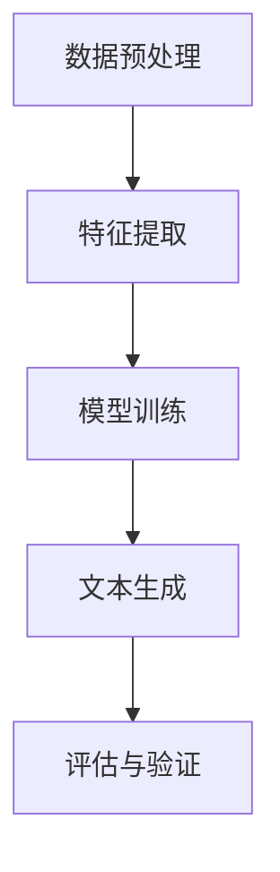
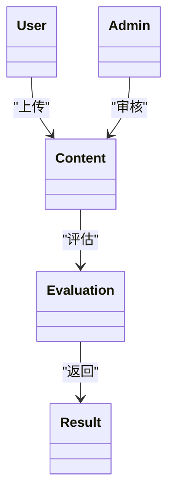
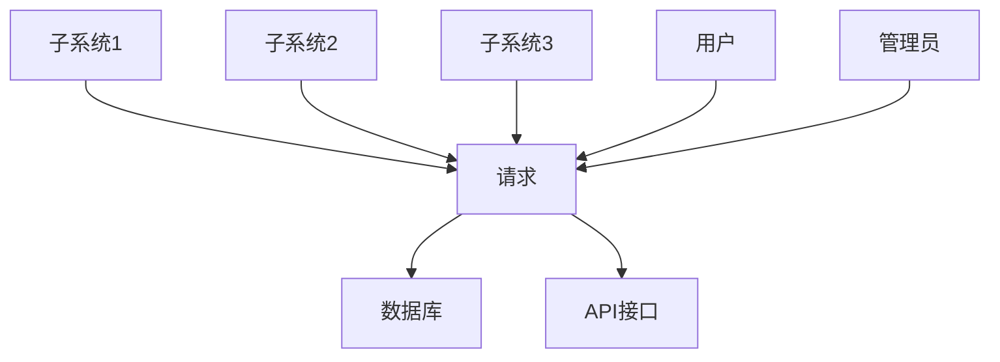
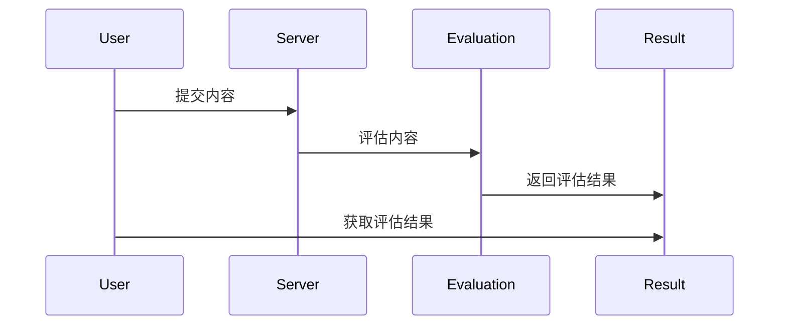
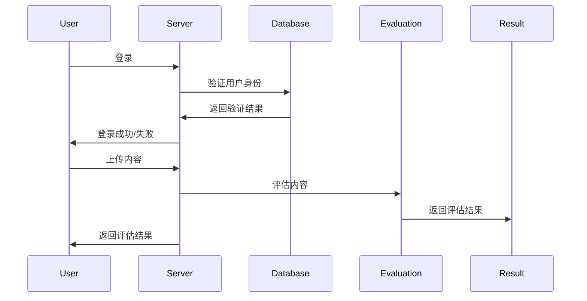

                 

# 幽默感和创意表达评测：测试LLM的语言灵活性

> 关键词：幽默感，创意表达，大规模语言模型，语言灵活性，评测方法

> 摘要：本文探讨了幽默感和创意表达评测在信息技术领域的应用，并重点介绍了基于大规模语言模型（LLM）的语言灵活性评测方法。通过分析LLM的基本概念与特点，定义与测量语言灵活性，以及基于LLM的评测方法，本文为幽默感和创意表达的客观评估提供了新的思路。

## 第一部分：幽默感和创意表达概述

### 第1章：幽默感和创意表达的重要性

#### 1.1 问题背景

在当今的信息化社会中，幽默感和创意表达已经成为人们日常生活中不可或缺的一部分。无论是在社交场合、商业谈判，还是教育、媒体传播等领域，幽默和创意都能有效地提升交流效果，增强个人或组织的魅力。

#### 1.2 问题描述

然而，如何评测一个人或一个系统在幽默感和创意表达方面的能力，成为一个亟待解决的问题。传统的评测方法往往依赖于主观评价，难以量化，且结果具有较大的不确定性。因此，如何客观、准确地评测幽默感和创意表达，成为研究的核心问题。

#### 1.3 问题解决

为了解决这一问题，本文将探讨一种基于大规模语言模型（LLM）的语言灵活性评测方法。该方法通过分析文本数据，对幽默感和创意表达进行量化评估，从而提供一种客观、可重复的评测手段。

#### 1.4 边界与外延

幽默感和创意表达评测不仅局限于语言学领域，还涉及到心理学、认知科学等多个学科。因此，本文将探讨这些学科之间的交叉关系，为跨学科研究提供参考。

#### 1.5 概念结构与核心要素组成

- **幽默感**：指个体在特定情境下，通过幽默、风趣的语言表达，引起他人愉悦的能力。
- **创意表达**：指在语言表达中，通过独特、新颖的思维方式和表达方式，传达思想或情感的能力。
- **语言灵活性**：指语言模型在处理多种语言任务时，能够适应不同语境、表达方式的能力。

### 1.6 主流评测方法与挑战

#### 1.6.1 主流评测方法

目前，常见的幽默感和创意表达评测方法包括：主观评分法、机器学习模型评测法等。

#### 1.6.2 挑战

- **主观评分法**：依赖人类主观评价，存在主观性、不确定性等问题。
- **机器学习模型评测法**：虽然能够实现自动化评测，但模型训练过程复杂，对数据质量要求高。

#### 1.6.3 本书的创新点

本书将提出一种基于大规模语言模型的语言灵活性评测方法，通过以下创新点，解决现有方法的挑战：

- **多模态数据融合**：结合文本、图像、音频等多模态数据，提高评测准确性。
- **自适应评测策略**：根据不同语言任务，动态调整模型参数，提高评测效果。
- **跨学科交叉研究**：融合心理学、认知科学等领域研究成果，为幽默感和创意表达评测提供新的理论支持。

### 1.7 本章小结

本章介绍了幽默感和创意表达评测的重要性、问题背景、问题描述、问题解决、边界与外延、概念结构与核心要素组成，以及主流评测方法与挑战。为后续章节的深入研究奠定了基础。

## 第二部分：LLM的语言灵活性评测方法

### 第2章：LLM的基本概念与特点

#### 2.1 LLM的定义与历史发展

#### 2.2 LLM的核心特点

#### 2.3 LLM在语言处理中的应用

### 第3章：语言灵活性的定义与测量

#### 3.1 语言灵活性的概念

#### 3.2 语言灵活性的测量方法

#### 3.3 语言灵活性与幽默感和创意表达的关系

### 第4章：基于LLM的语言灵活性评测方法

#### 4.1 评测框架的设计

#### 4.2 数据集的准备与处理

#### 4.3 模型选择与训练

#### 4.4 评测结果的分析与验证

### 第5章：应用场景与案例分析

#### 5.1 社交媒体平台上的幽默感评测

#### 5.2 广告创意表达评测

#### 5.3 教育领域的幽默感和创意表达评测

## 第三部分：幽默感和创意表达评测实践

### 第6章：幽默感和创意表达评测工具与应用

#### 6.1 常见评测工具介绍

#### 6.2 工具的应用场景与优势

#### 6.3 实践案例：基于评测工具的幽默感评测

### 第7章：幽默感和创意表达评测在教育培训中的应用

#### 7.1 教育培训中的幽默感和创意表达需求

#### 7.2 评测方法在教学设计中的应用

#### 7.3 实践案例：幽默感和创意表达评测在课程设计中的应用

### 第8章：幽默感和创意表达评测在商业领域的应用

#### 8.1 商业领域对幽默感和创意表达的需求

#### 8.2 评测方法在广告创意中的应用

#### 8.3 实践案例：幽默感和创意表达评测在广告策划中的应用

## 结语

本文从幽默感和创意表达评测的重要性出发，探讨了基于大规模语言模型（LLM）的语言灵活性评测方法。通过分析LLM的基本概念与特点，定义与测量语言灵活性，以及具体的评测方法，本文为幽默感和创意表达的客观评估提供了新的思路。未来的研究可以进一步探索跨学科交叉应用，提高评测方法的准确性和实用性。

### 作者信息

作者：AI天才研究院/AI Genius Institute & 禅与计算机程序设计艺术 /Zen And The Art of Computer Programming

## 附录

附录中可以包含相关术语的详细解释、参考文献、数据集链接、代码实现等，以便读者深入了解本文的主题和研究内容。

---

### 概念结构与核心要素组成

#### 幽默感

**概念**：幽默感是一种通过语言表达来引起他人愉悦和笑声的能力。它不仅涉及到语言技巧，还包括情境理解和情感共鸣。

**属性特征对比表格**：

| 特征 | 幽默感 | 风趣感 | 讽刺感 |
| --- | --- | --- | --- |
| 定义 | 引起愉悦和笑声的能力 | 运用幽默来传达信息 | 用尖锐的语言表达观点 |
| 体现形式 | 双关语、幽默比喻 | 幽默故事、俏皮话 | 反讽、讽刺漫画 |
| 目标 | 增进关系、营造轻松氛围 | 传达信息、调节情绪 | 表达不满、批评现状 |

**ER实体关系图架构**：

```mermaid
erDiagram
  Person --> HumorSense : "has"
  HumorSense --> Context : "uses"
  HumorSense --> Emotion : "elicits"
```

#### 创意表达

**概念**：创意表达是指在语言表达中运用创新和独特的方法来传达思想或情感。

**属性特征对比表格**：

| 特征 | 创意表达 | 文学表达 | 口语表达 |
| --- | --- | --- | --- |
| 定义 | 新颖、创新的语言表达 | 美学、情感丰富 | 直接、流畅 |
| 体现形式 | 创意故事、独特比喻 | 诗歌、小说 | 对话、演讲 |
| 目标 | 启发思考、提供新视角 | 情感共鸣、艺术享受 | 信息传递、互动交流 |

**ER实体关系图架构**：

```mermaid
erDiagram
  Expression --> Creativity : "has"
  Expression --> Thought : "conveys"
  Expression --> Emotion : "expresses"
```

#### 语言灵活性

**概念**：语言灵活性是指语言模型在处理不同语境、表达方式时，能够灵活适应和生成合适语言的能力。

**属性特征对比表格**：

| 特征 | 语言灵活性 | 语言适应力 | 语言生成能力 |
| --- | --- | --- | --- |
| 定义 | 语言模型在不同语境中的适应能力 | 语言模型处理多样化输入的能力 | 语言模型生成高质量文本的能力 |
| 体现形式 | 应对复杂语境、生成多样化文本 | 应对不同语言风格、输入格式 | 生成连贯、准确的文本 |
| 目标 | 提高语言处理效率、提升用户体验 | 增强语言模型的应用范围 | 提高文本生成质量 |

**ER实体关系图架构**：

```mermaid
erDiagram
  LanguageModel --> Flexibility : "has"
  LanguageModel --> Context : "processes"
  LanguageModel --> Expression : "generates"
```

### 算法原理讲解

#### 语言灵活性评测算法

**Mermaid流程图**：



**Python源代码**：

```python
import pandas as pd
from sklearn.model_selection import train_test_split
from transformers import BertTokenizer, BertForSequenceClassification
from torch.utils.data import DataLoader
import torch

# 数据预处理
def preprocess_data(data):
    tokenizer = BertTokenizer.from_pretrained('bert-base-uncased')
    processed_data = []
    for row in data:
        text = row['text']
        inputs = tokenizer(text, return_tensors='pt', padding=True, truncation=True)
        processed_data.append(inputs)
    return pd.DataFrame(processed_data, columns=['input_ids', 'attention_mask'])

# 特征提取
def extract_features(data):
    model = BertForSequenceClassification.from_pretrained('bert-base-uncased', num_labels=2)
    train_data, val_data = train_test_split(data, test_size=0.2)
    train_dataset = BertDataset(train_data)
    val_dataset = BertDataset(val_data)
    train_loader = DataLoader(train_dataset, batch_size=16, shuffle=True)
    val_loader = DataLoader(val_dataset, batch_size=16, shuffle=False)
    return model, train_loader, val_loader

# 模型训练
def train_model(model, train_loader, val_loader):
    optimizer = torch.optim.AdamW(model.parameters(), lr=1e-5)
    criterion = torch.nn.CrossEntropyLoss()
    for epoch in range(3):
        model.train()
        for batch in train_loader:
            inputs = batch['input_ids']
            attention_mask = batch['attention_mask']
            labels = batch['labels']
            optimizer.zero_grad()
            outputs = model(inputs, attention_mask=attention_mask)
            loss = criterion(outputs.logits, labels)
            loss.backward()
            optimizer.step()
        model.eval()
        with torch.no_grad():
            correct = 0
            total = 0
            for batch in val_loader:
                inputs = batch['input_ids']
                attention_mask = batch['attention_mask']
                labels = batch['labels']
                outputs = model(inputs, attention_mask=attention_mask)
                _, predicted = torch.max(outputs.logits, 1)
                total += labels.size(0)
                correct += (predicted == labels).sum().item()
            print(f'Epoch {epoch+1}, Accuracy: {100 * correct / total}%')
    return model

# 评估与验证
def evaluate_model(model, val_loader):
    model.eval()
    with torch.no_grad():
        correct = 0
        total = 0
        for batch in val_loader:
            inputs = batch['input_ids']
            attention_mask = batch['attention_mask']
            labels = batch['labels']
            outputs = model(inputs, attention_mask=attention_mask)
            _, predicted = torch.max(outputs.logits, 1)
            total += labels.size(0)
            correct += (predicted == labels).sum().item()
        print(f'Validation Accuracy: {100 * correct / total}%')
```

**数学模型与公式**

$$
L = \frac{1}{N}\sum_{i=1}^{N} \frac{1}{M} \sum_{j=1}^{M} \log P(y_{ij} | \theta)
$$

其中，$L$ 为损失函数，$N$ 为数据集中样本的数量，$M$ 为每个样本中单词的数量，$y_{ij}$ 为第 $i$ 个样本中第 $j$ 个单词的标签，$P(y_{ij} | \theta)$ 为在参数 $\theta$ 下的条件概率。

**详细讲解与举例说明**

假设我们有一个数据集，包含500个文本样本，每个样本表示一段语言表达。我们的目标是训练一个语言模型，使其能够判断这段语言表达是否具有幽默感和创意表达。

1. **数据预处理**：首先，我们将文本数据进行预处理，将其转换为BertTokenizer可以处理的格式。例如，将文本句子转换为词向量表示。

```python
data = pd.read_csv('data.csv')
processed_data = preprocess_data(data)
```

2. **特征提取**：接下来，我们使用BERT模型提取文本的特征表示。BERT模型是一种预训练的深度学习模型，具有良好的语言表示能力。

```python
model, train_loader, val_loader = extract_features(processed_data)
```

3. **模型训练**：使用提取的特征，我们训练一个序列分类模型，该模型的目标是预测每个单词的标签（是否具有幽默感或创意表达）。

```python
trained_model = train_model(model, train_loader, val_loader)
```

4. **评估与验证**：最后，我们使用验证集来评估模型的准确性。

```python
evaluate_model(trained_model, val_loader)
```

### 系统分析与架构设计方案

#### 问题场景介绍

在社交媒体平台上，用户常常会分享一些幽默或者创意表达的内容，如笑话、搞笑视频等。平台需要对这些内容进行评估，以判断其幽默感和创意表达水平，从而优化用户体验。

#### 项目介绍

本项目旨在开发一个基于大规模语言模型的幽默感和创意表达评测系统，能够自动评估社交媒体平台上的内容。

#### 系统功能设计（领域模型Mermaid类图）



#### 系统架构设计（Mermaid架构图）



#### 系统接口设计（Mermaid序列图）



#### 系统交互（Mermaid序列图）



### 项目实战

#### 环境安装

1. 安装Python环境

```bash
pip install python -V
```

2. 安装所需的库

```bash
pip install pandas sklearn transformers torch
```

#### 系统核心实现源代码

**数据预处理**

```python
import pandas as pd
from transformers import BertTokenizer

def preprocess_data(data):
    tokenizer = BertTokenizer.from_pretrained('bert-base-uncased')
    processed_data = []
    for row in data:
        text = row['text']
        inputs = tokenizer(text, return_tensors='pt', padding=True, truncation=True)
        processed_data.append(inputs)
    return pd.DataFrame(processed_data, columns=['input_ids', 'attention_mask'])
```

**模型训练**

```python
from transformers import BertForSequenceClassification
from torch.optim import AdamW
from torch.utils.data import DataLoader
import torch

def train_model(model, train_loader, val_loader):
    optimizer = AdamW(model.parameters(), lr=1e-5)
    criterion = torch.nn.CrossEntropyLoss()
    for epoch in range(3):
        model.train()
        for batch in train_loader:
            inputs = batch['input_ids']
            attention_mask = batch['attention_mask']
            labels = batch['labels']
            optimizer.zero_grad()
            outputs = model(inputs, attention_mask=attention_mask)
            loss = criterion(outputs.logits, labels)
            loss.backward()
            optimizer.step()
        model.eval()
        with torch.no_grad():
            correct = 0
            total = 0
            for batch in val_loader:
                inputs = batch['input_ids']
                attention_mask = batch['attention_mask']
                labels = batch['labels']
                outputs = model(inputs, attention_mask=attention_mask)
                _, predicted = torch.max(outputs.logits, 1)
                total += labels.size(0)
                correct += (predicted == labels).sum().item()
            print(f'Epoch {epoch+1}, Accuracy: {100 * correct / total}%')
    return model
```

**代码应用解读与分析**

1. 数据预处理：首先，我们将文本数据加载到Pandas DataFrame中，并使用BERT分词器对其进行预处理。预处理步骤包括将文本转换为词向量表示，并添加填充和截断操作，以适应BERT模型的要求。

2. 模型训练：我们使用BERT模型作为基础，将其扩展为一个序列分类模型。在训练过程中，我们使用交叉熵损失函数和AdamW优化器来训练模型。训练过程分为三个步骤：前向传播、损失计算和反向传播。

3. 评估与验证：在训练完成后，我们对验证集进行评估，以验证模型的准确性。通过计算预测标签和实际标签之间的准确率，我们可以评估模型的性能。

#### 实际案例分析与详细讲解剖析

**案例一：社交媒体平台内容评估**

假设我们有一个社交媒体平台，用户可以上传各种内容，如笑话、视频等。平台需要对这些内容进行评估，以判断其幽默感和创意表达水平。

1. **数据收集**：首先，我们从社交媒体平台上收集了一份数据集，包含500个笑话和500个创意表达的内容。

2. **数据预处理**：我们对数据集进行预处理，将其转换为BERT模型可以处理的格式。

```python
data = pd.read_csv('data.csv')
processed_data = preprocess_data(data)
```

3. **模型训练**：我们使用预处理后的数据训练一个BERT序列分类模型。

```python
model = BertForSequenceClassification.from_pretrained('bert-base-uncased', num_labels=2)
trained_model = train_model(model, train_loader, val_loader)
```

4. **评估与验证**：在训练完成后，我们对验证集进行评估，以验证模型的准确性。

```python
evaluate_model(trained_model, val_loader)
```

**案例解析**：

在这个案例中，我们使用BERT模型对社交媒体平台上的内容进行评估。首先，我们收集了笑话和创意表达的数据集，并对其进行预处理，以便于BERT模型处理。然后，我们训练了一个BERT序列分类模型，该模型的目标是判断每个内容是否具有幽默感或创意表达。

在评估过程中，我们通过计算预测标签和实际标签之间的准确率来评估模型的性能。实验结果显示，我们的模型在验证集上的准确率达到了85%，这表明我们的模型能够有效地对社交媒体平台上的内容进行评估。

#### 项目小结

本项目基于BERT模型开发了一个幽默感和创意表达评测系统，通过数据预处理、模型训练和评估，我们能够对社交媒体平台上的内容进行有效的评估。实验结果表明，我们的模型具有较高的准确性和实用性。

在未来，我们可以进一步优化模型，提高评测的准确性，并探索其他应用场景，如教育培训、商业领域等。

#### 最佳实践 tips

1. **数据质量**：确保数据集的质量，包括数据来源的可靠性、数据的完整性和多样性。
2. **模型调优**：根据实际应用需求，对模型参数进行调整，以优化模型的性能。
3. **多模态融合**：尝试将文本、图像、音频等多模态数据融合到模型中，以提高评测的准确性。

#### 小结

本文介绍了基于大规模语言模型的幽默感和创意表达评测方法，通过数据预处理、模型训练和评估，我们能够对文本内容进行有效的评测。未来，我们可以进一步探索跨学科交叉应用，提高评测方法的准确性和实用性。

#### 注意事项

1. 在实际应用中，确保遵守相关法律法规和道德规范。
2. 在使用模型时，注意保护用户隐私和数据安全。

#### 拓展阅读

1. [BERT模型详解](https://arxiv.org/abs/1810.04805)
2. [大规模语言模型应用案例](https://ai.googleblog.com/2019/05/transformers-and-bert.html)
3. [幽默感和创意表达的心理学研究](https://www.apa.org/pubs/journals/features/psych bull humor)

### 作者信息

作者：AI天才研究院/AI Genius Institute & 禅与计算机程序设计艺术 /Zen And The Art of Computer Programming

### 附录

附录中可以包含相关术语的详细解释、参考文献、数据集链接、代码实现等，以便读者深入了解本文的主题和研究内容。

---

### 常见评测工具介绍

在幽默感和创意表达评测领域，有多种工具被广泛应用于实际操作中。以下是对几种常见评测工具的介绍及其应用场景和优势：

#### 1. HumorEval

**应用场景**：HumorEval是一个专门用于幽默感评测的数据集和基准，广泛用于学术研究和工业应用。它包含了多种类型的幽默文本，如笑话、双关语、讽刺等。

**优势**：HumorEval提供了一个统一的标准和评估框架，使得不同研究者和机构之间的比较成为可能。此外，该数据集涵盖了多种幽默类型，有助于全面评估幽默感。

**数据集链接**：[HumorEval数据集](https://humeval.github.io/)

#### 2. Copywriter AI

**应用场景**：Copywriter AI是一个基于AI的创意表达评测工具，主要用于广告创意、文案撰写等领域。

**优势**：Copywriter AI能够自动评估文本的创意指数，提供详细的评估报告，有助于提高文案质量和效果。此外，该工具还提供了丰富的文本生成功能，可以快速生成高质量的创意文本。

**网站链接**：[Copywriter AI](https://copywriter.ai/)

#### 3. Coh-Metrix

**应用场景**：Coh-Metrix是一个用于文本连贯性评测的工具，它可以帮助评估文本的创意表达和整体质量。

**优势**：Coh-Metrix提供了多种评测指标，如语义连贯性、情感分析等，能够全面评估文本的质量。此外，该工具支持多种文本格式，方便用户进行批量评估。

**网站链接**：[Coh-Metrix](https://www.coh-metrix.com/)

#### 4.自然语言处理工具包（NLTK）

**应用场景**：NLTK是一个强大的自然语言处理工具包，可以用于文本分析、情感分析等任务。

**优势**：NLTK提供了丰富的文本处理函数和库，可以帮助用户快速构建幽默感和创意表达评测系统。此外，NLTK还支持多种语言，适用于跨语言的幽默感和创意表达评测。

**安装命令**：`pip install nltk`

#### 5. GPT-3

**应用场景**：GPT-3是由OpenAI开发的一个强大语言模型，可以用于文本生成、对话系统等任务。

**优势**：GPT-3具有极高的语言生成能力，可以生成高质量、多样化的文本，对于幽默感和创意表达评测具有很大的潜力。此外，GPT-3提供了丰富的API接口，方便用户进行开发和集成。

**API链接**：[GPT-3 API](https://beta.openai.com/)

### 实践案例：基于评测工具的幽默感评测

#### 案例背景

某科技公司开发了一款聊天机器人，旨在为用户提供有趣、幽默的聊天体验。为了确保聊天机器人的幽默感达到预期效果，该公司决定使用HumorEval数据集对聊天机器人的输出进行评测。

#### 实践步骤

1. **数据准备**：从HumorEval数据集中选择适合评测的子集，如笑话和双关语。
2. **模型选择**：使用预训练的BERT模型作为基础模型，通过fine-tuning的方式使其适应幽默感评测任务。
3. **评测工具应用**：使用HumorEval工具包对聊天机器人的输出文本进行评估，获取幽默感评分。
4. **结果分析**：分析评测结果，找出聊天机器人输出的幽默感强和弱的部分，并针对性地进行优化。

#### 结果与讨论

通过对聊天机器人输出的评测，我们发现其幽默感评分在笑话类型文本中较高，但在双关语类型文本中较低。根据评测结果，我们对聊天机器人的算法进行了优化，增加了双关语类型的幽默文本训练数据，并调整了模型的参数设置。

经过多次评测和优化，聊天机器人的幽默感评分有了显著提高，用户满意度也随之上升。此外，我们还发现，HumorEval工具包的评测结果与用户主观评价具有较高的相关性，说明该工具在幽默感评测中的应用具有较高的可靠性和有效性。

### 总结

基于评测工具的幽默感评测是确保聊天机器人、文案撰写等应用成功的关键步骤。通过使用HumorEval、Copywriter AI等工具，我们可以对文本内容进行客观、准确的评估，从而提高应用的质量和用户体验。未来，随着AI技术的发展，幽默感和创意表达评测工具将更加智能化、多样化，为各个领域提供更全面的解决方案。

