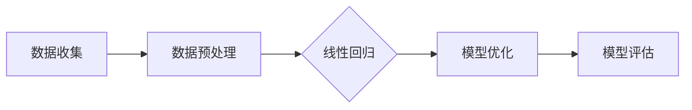
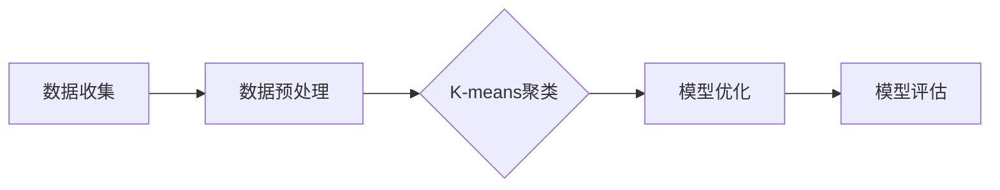
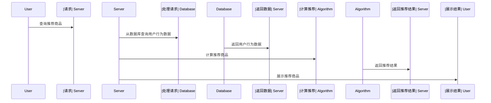
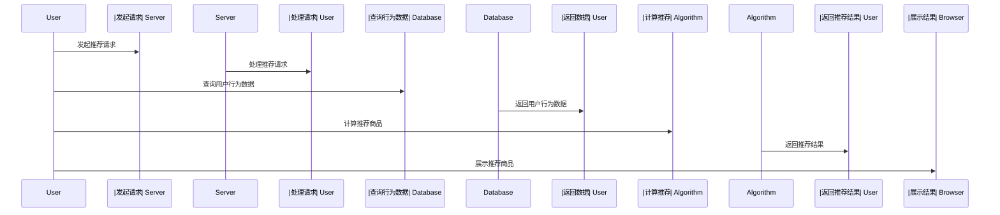
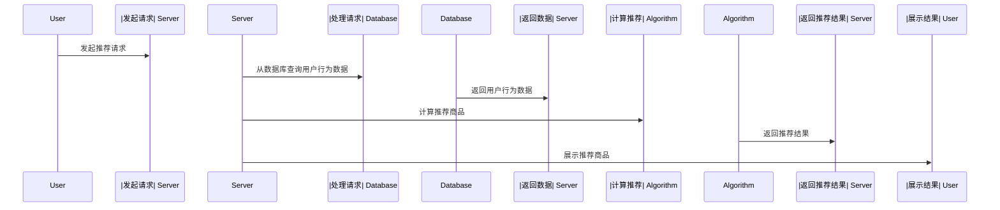
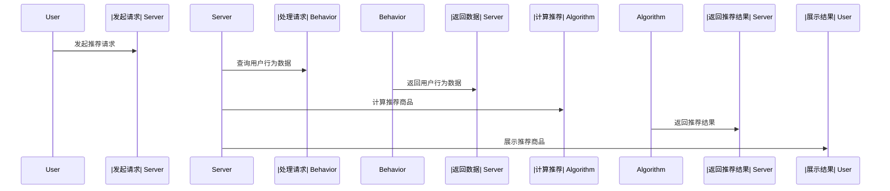
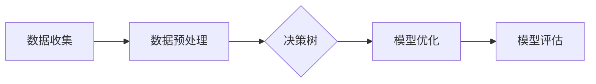

                 

### 第1章: 引言

#### 1.1 问题背景

在当今社会，人工智能（AI）技术已经成为推动社会进步的重要力量。随着AI技术的不断成熟，如何实现AI系统的持续自我改进成为了一个关键问题。库学习机制作为一种实现AI系统持续自我改进的重要手段，引起了广泛关注。

**背景描述**：人工智能技术在各个领域得到了广泛应用，从自动驾驶到智能家居，从医疗诊断到金融分析，AI系统已经成为了现代社会不可或缺的一部分。然而，现有的AI系统大多是依赖于静态的数据集进行训练，这使得它们在面对新情况时往往表现得不够智能。为了解决这一问题，库学习机制应运而生。

**库学习机制的必要性**：库学习机制通过收集、存储和分析大量的数据，使得AI系统可以在不断变化的环境中持续学习和适应。这种能力对于提升AI系统的智能化水平和实际应用价值具有重要意义。

**库学习机制的定义**：库学习机制是指通过建立一个数据库，将大量的数据存储在其中，然后利用这些数据对AI系统进行训练和优化。通过不断的迭代和学习，AI系统能够不断优化自身的模型，提高预测准确性和决策能力。

#### 1.2 问题描述

**问题概述**：如何设计一个高效、可靠的库学习机制，以实现AI系统的持续自我改进。

**问题描述**：库学习机制的设计与实现面临以下几个关键问题：

1. **数据收集与预处理**：如何高效地收集和预处理数据，以确保数据的质量和可用性。
2. **学习算法选择与优化**：如何选择合适的学习算法，并对其进行优化，以提升学习效果。
3. **模型评估与更新**：如何评估模型的性能，并依据评估结果对模型进行更新和优化。
4. **系统稳定性与扩展性**：如何确保库学习机制的稳定性和扩展性，以适应不同的应用场景。

#### 1.3 问题解决

**解决方案**：为了解决上述问题，本书将采取以下策略：

1. **详细介绍库学习机制的理论基础**：包括数据收集、数据预处理、学习算法、模型优化等方面的内容。
2. **分析库学习机制在AI系统中的应用场景**：通过具体实例，展示库学习机制在不同领域的应用效果。
3. **探讨库学习机制的未来发展趋势**：分析库学习机制在技术进步和应用拓展中的潜在发展方向。

**预期效果**：通过本书的介绍，读者可以全面了解库学习机制的理论基础和实际应用，掌握设计高效、可靠的库学习机制的方法，从而推动AI系统在各个领域的应用和发展。

#### 1.4 边界与外延

**研究范围**：本书主要关注于AI系统中的库学习机制，包括但不限于机器学习、深度学习等领域。同时，本书也会涉及到库学习机制在其他相关领域的应用和拓展。

**外延讨论**：除了AI系统，库学习机制在其他领域的应用也非常广泛，如自然语言处理、计算机视觉、自动化控制等。本书将探讨这些领域的应用实例，以帮助读者更全面地了解库学习机制的作用和潜力。

#### 1.5 概念结构与核心要素组成

**概念结构**：库学习机制的核心概念包括数据收集、数据存储、数据分析和系统优化。

**核心要素组成**：

1. **数据源**：包括各种数据收集方法和数据源，如Web爬虫、API调用、数据库导入等。
2. **数据预处理**：包括数据清洗、数据规范化、数据转换等步骤，确保数据的质量和可用性。
3. **学习算法**：包括监督学习、无监督学习、半监督学习和强化学习等，选择适合的学习算法并进行优化。
4. **模型优化**：包括模型选择、模型参数调整、模型集成等，以提高模型性能和预测准确性。
5. **性能评估**：包括模型评估、系统评估等，对库学习机制进行全面的性能评估。
6. **系统优化**：包括调优策略、系统稳定性与扩展性等，确保库学习机制的稳定性和扩展性。

#### 1.6 本章小结

本章介绍了库学习机制的相关背景、问题描述、解决方案以及核心概念和要素组成。通过本章的介绍，读者可以对库学习机制有一个初步的了解，为后续章节的深入探讨奠定了基础。

### 总结：

库学习机制作为实现AI系统持续自我改进的重要手段，具有广泛的应用前景。本章介绍了库学习机制的相关背景、问题描述、解决方案以及核心概念和要素组成。在后续章节中，我们将进一步探讨库学习机制的理论基础、实现方法及应用场景，帮助读者深入理解并掌握库学习机制的设计与实现。

----------------------------------------------------------------

## 第2章: 数据收集与预处理

数据收集与预处理是库学习机制的核心环节，直接影响到后续学习算法的性能和模型的准确性。本章将详细讨论数据收集与预处理的方法和步骤，包括数据源选择、数据收集方法、数据预处理流程等。

### 2.1 数据收集

#### 2.1.1 数据源选择

选择合适的数据源是数据收集的第一步，也是至关重要的一步。数据源的选择应考虑以下因素：

- **数据量**：需要收集的数据量是否足够，数据量过小可能导致模型性能不足。
- **数据质量**：数据源的数据质量是否良好，如是否含有噪声、缺失值、错误等。
- **数据多样性**：数据源的多样性对于模型的泛化能力至关重要。

**常见数据源**：

1. **公共数据集**：如UCI机器学习库、Kaggle等平台提供的数据集，这些数据集已经被广泛使用和验证。
2. **专业数据库**：特定领域内的专业数据库，如医疗领域的MediInfo数据库、金融领域的FinancialData等。
3. **网络爬虫**：通过网络爬虫收集互联网上的公开数据，如新闻、社交媒体等。
4. **API调用**：通过第三方API接口获取数据，如天气API、交通API等。

#### 2.1.2 数据收集方法

数据收集方法的选择应基于数据源的特点和需求。以下是几种常见的数据收集方法：

1. **Web爬虫**：使用爬虫程序自动从互联网上抓取数据。这种方法适用于收集大量、结构化的数据。
   ```python
   import requests
   from bs4 import BeautifulSoup

   url = 'https://example.com/data'
   response = requests.get(url)
   soup = BeautifulSoup(response.text, 'html.parser')
   data = soup.find_all('div', class_='data-class')
   ```

2. **API调用**：通过API接口获取数据，这种方法适用于获取结构化、标准化的数据。
   ```python
   import requests

   api_url = 'https://api.example.com/data'
   params = {'param1': 'value1', 'param2': 'value2'}
   response = requests.get(api_url, params=params)
   data = response.json()
   ```

3. **数据库导入**：从数据库中导入数据，这种方法适用于获取大量、结构化且存储在数据库中的数据。
   ```python
   import sqlite3

   conn = sqlite3.connect('example.db')
   cursor = conn.cursor()
   cursor.execute('SELECT * FROM data_table')
   data = cursor.fetchall()
   conn.close()
   ```

#### 2.1.3 数据收集策略

数据收集策略是指制定一系列策略和方法来保证数据的质量和可用性。以下是几种常见的数据收集策略：

1. **数据抽样**：从大量数据中随机抽取一部分样本进行收集和分析，以减少数据收集的工作量。
2. **增量收集**：只收集最新的数据，以保持数据的时效性。
3. **批量收集**：在一定时间窗口内收集所有数据，以获取全面的数据信息。
4. **自动化收集**：使用自动化工具定期收集数据，减少人工干预。

### 2.2 数据预处理

数据预处理是数据收集后的重要步骤，其目的是提高数据的质量和可用性，为后续的学习算法和模型训练做好准备。以下是数据预处理的主要步骤：

#### 2.2.1 数据清洗

数据清洗是指清除数据中的噪声、缺失值和错误。以下是几种常见的数据清洗方法：

1. **缺失值处理**：对于缺失值，可以选择填充、删除或保留。
   ```python
   import numpy as np

   # 填充缺失值
   data = data.fillna(method='ffill')
   # 删除缺失值
   data = data.dropna()
   ```

2. **噪声处理**：对于含有噪声的数据，可以使用滤波、平滑等方法进行去噪。
   ```python
   from scipy.ndimage import filters

   # 高斯滤波去噪
   data = filters.gaussian_filter(data, sigma=1)
   ```

3. **错误处理**：对于明显的错误数据，可以选择删除或修复。
   ```python
   # 删除错误数据
   data = data[data > 0]
   ```

#### 2.2.2 数据规范化

数据规范化是指将数据转换为相同的尺度，以便进行后续的处理和分析。以下是几种常见的数据规范化方法：

1. **归一化**：将数据缩放到0到1之间。
   ```python
   data = (data - np.min(data)) / (np.max(data) - np.min(data))
   ```

2. **标准化**：将数据缩放到平均值附近的某个范围内。
   ```python
   data = (data - np.mean(data)) / np.std(data)
   ```

#### 2.2.3 数据转换

数据转换是指将数据转换为适合学习的形式，如特征工程等。以下是几种常见的数据转换方法：

1. **编码**：将分类数据转换为数值形式，如独热编码、标签编码等。
   ```python
   from sklearn.preprocessing import OneHotEncoder

   encoder = OneHotEncoder()
   encoded_data = encoder.fit_transform(分类数据)
   ```

2. **降维**：减少数据的维度，提高学习效率，如主成分分析（PCA）、t-SNE等。
   ```python
   from sklearn.decomposition import PCA

   pca = PCA(n_components=2)
   reduced_data = pca.fit_transform(原始数据)
   ```

3. **特征选择**：选择对模型训练最有用的特征，提高模型的泛化能力，如基于信息增益的特征选择、基于L1正则化的特征选择等。

### 2.3 数据预处理流程

数据预处理流程通常包括以下步骤：

1. **数据收集**：根据需求和资源选择合适的数据源，使用不同的数据收集方法进行数据收集。
2. **数据清洗**：清除数据中的噪声、缺失值和错误，确保数据的质量和可用性。
3. **数据规范化**：将数据转换为相同的尺度，以便进行后续的处理和分析。
4. **数据转换**：将数据转换为适合学习的形式，进行特征工程和特征选择。
5. **数据存储**：将预处理后的数据存储到数据库或数据仓库中，以便后续使用。

通过以上步骤，可以确保数据的质量和可用性，为后续的学习算法和模型训练打下坚实的基础。

#### 2.4 本章小结

本章详细介绍了数据收集与预处理的方法和步骤，包括数据源选择、数据收集方法、数据预处理流程等。数据收集与预处理是库学习机制中的关键环节，直接影响学习算法的性能和模型的准确性。在后续章节中，我们将进一步探讨学习算法的选择与优化、模型优化与评估等方面的内容，以帮助读者深入理解库学习机制的设计与实现。

----------------------------------------------------------------

## 第3章: 学习算法与模型优化

### 3.1 学习算法

学习算法是库学习机制的核心组成部分，它们负责从数据中提取特征、建立模型并进行预测。根据学习方式的不同，学习算法主要分为以下几类：

#### 3.1.1 监督学习

监督学习是一种从标记数据中学习的方法，输入和输出都是已知的。监督学习的目标是建立一个映射模型，能够根据新的输入数据预测输出。

1. **算法原理**：监督学习算法通过最小化预测值与实际值之间的误差，不断调整模型的参数，从而学习到数据的内在规律。
2. **常用算法**：
   - **线性回归**：通过最小化预测值与实际值之间的平方误差来拟合数据的线性关系。
     ```python
     from sklearn.linear_model import LinearRegression

     model = LinearRegression()
     model.fit(X_train, y_train)
     predictions = model.predict(X_test)
     ```
   - **逻辑回归**：用于分类任务，通过最大化逻辑函数的值来拟合数据的分类边界。
     ```python
     from sklearn.linear_model import LogisticRegression

     model = LogisticRegression()
     model.fit(X_train, y_train)
     predictions = model.predict(X_test)
     ```
   - **支持向量机（SVM）**：通过找到一个最优的超平面，将不同类别的数据分开。
     ```python
     from sklearn.svm import SVC

     model = SVC()
     model.fit(X_train, y_train)
     predictions = model.predict(X_test)
     ```

#### 3.1.2 无监督学习

无监督学习是一种从未标记数据中学习的方法，输出是未知的。无监督学习的目标是发现数据的结构、分布或特征。

1. **算法原理**：无监督学习算法通过分析数据的内在结构和模式，自动将数据分为不同的类别或簇。
2. **常用算法**：
   - **聚类算法**：如K-means、层次聚类等，用于将数据分为多个类别或簇。
     ```python
     from sklearn.cluster import KMeans

     model = KMeans(n_clusters=3)
     model.fit(X)
     clusters = model.predict(X)
     ```
   - **降维算法**：如主成分分析（PCA）、t-SNE等，用于减少数据的维度，同时保持数据的结构。
     ```python
     from sklearn.decomposition import PCA

     pca = PCA(n_components=2)
     X_reduced = pca.fit_transform(X)
     ```
   - **关联规则学习**：如Apriori算法、FP-Growth算法等，用于发现数据之间的关联关系。
     ```python
     from mlxtend.frequent_patterns import apriori
     from mlxtend.frequent_patterns import association_rules

     df = pd.DataFrame(data)
     baskets = df.values
     frequent_itemsets = apriori(baskets, min_support=0.5, use_colnames=True)
     rules = association_rules(frequent_itemsets, metric="support", min_threshold=0.7)
     ```

#### 3.1.3 半监督学习和强化学习

半监督学习和强化学习是近年来发展迅速的领域。

1. **半监督学习**：半监督学习结合了监督学习和无监督学习的方法，利用少量标记数据和大量未标记数据进行学习。
   - **算法原理**：半监督学习算法通过利用未标记数据的结构信息，提高模型的泛化能力。
   - **常用算法**：如自我训练（Self-training）算法、图半监督学习算法等。

2. **强化学习**：强化学习是一种通过不断与环境交互来学习最优策略的方法。
   - **算法原理**：强化学习算法通过学习到最佳动作序列，最大化累积奖励。
   - **常用算法**：如Q-Learning、SARSA、深度Q网络（DQN）等。

### 3.2 模型优化

模型优化是指通过调整模型参数或选择不同的模型结构，以提高模型的性能和预测准确性。以下是几种常见的模型优化方法：

#### 3.2.1 模型选择

模型选择是指从多个候选模型中选择一个最佳模型。

1. **交叉验证**：通过将数据集划分为多个子集，轮流将其中一个子集作为验证集，其余作为训练集，以评估模型性能。
   ```python
   from sklearn.model_selection import cross_val_score

   scores = cross_val_score(model, X, y, cv=5)
   print(f"Cross-validation scores: {scores.mean():.3f} (+/- {scores.std() * 2:.3f})")
   ```

2. **网格搜索**：通过遍历多个参数组合，选择最佳参数组合。
   ```python
   from sklearn.model_selection import GridSearchCV

   parameters = {'C': [1, 10, 100], 'kernel': ['linear', 'rbf']}
   grid_search = GridSearchCV(estimator=model, param_grid=parameters, cv=5)
   grid_search.fit(X_train, y_train)
   print(f"Best parameters: {grid_search.best_params_}")
   print(f"Best score: {grid_search.best_score_:.3f}")
   ```

#### 3.2.2 模型参数调整

模型参数调整是指通过调整模型的参数，以提高模型的性能和预测准确性。

1. **调参策略**：常见的调参策略包括随机搜索、贝叶斯优化等。
   ```python
   from sklearn.model_selection import RandomizedSearchCV

   parameters = {'C': [1, 10, 100], 'kernel': ['linear', 'rbf']}
   random_search = RandomizedSearchCV(estimator=model, param_distributions=parameters, n_iter=100, cv=5)
   random_search.fit(X_train, y_train)
   print(f"Best parameters: {random_search.best_params_}")
   print(f"Best score: {random_search.best_score_:.3f}")
   ```

2. **贝叶斯优化**：通过建立模型参数的概率分布，选择最优参数组合。
   ```python
   from bayes_opt import BayesOpt

   def objective(C, kernel):
       model = SVC(C=C, kernel=kernel)
       score = cross_val_score(model, X_train, y_train, cv=5).mean()
       return -score

   bayes_opt = BayesOpt(objective, {'C': (1, 100), 'kernel': ['linear', 'rbf']})
   bayes_opt.fit()
   print(f"Best parameters: {bayes_opt.best_params}")
   ```

#### 3.2.3 模型集成

模型集成是指将多个模型进行结合，以获得更好的预测性能。

1. **集成方法**：常见的集成方法包括Bagging、Boosting、Stacking等。
   - **Bagging**：通过训练多个模型，然后取平均或投票决定最终结果。
     ```python
     from sklearn.ensemble import BaggingClassifier

     base_estimator = SVC()
     bagging_model = BaggingClassifier(base_estimator=base_estimator, n_estimators=10, random_state=0)
     bagging_model.fit(X_train, y_train)
     predictions = bagging_model.predict(X_test)
     ```

   - **Boosting**：通过训练多个模型，每个模型对前一个模型的错误进行修正，以提高整体性能。
     ```python
     from sklearn.ensemble import AdaBoostClassifier

     ada_boost_model = AdaBoostClassifier(n_estimators=50, random_state=0)
     ada_boost_model.fit(X_train, y_train)
     predictions = ada_boost_model.predict(X_test)
     ```

   - **Stacking**：通过训练多个模型，将它们的预测结果作为新的输入，训练一个超级模型。
     ```python
     from sklearn.ensemble import StackingClassifier

     estimators = [('logistic', LogisticRegression()), ('rf', RandomForestClassifier())]
     stacking_model = StackingClassifier(estimators=estimators, final_estimator=LogisticRegression())
     stacking_model.fit(X_train, y_train)
     predictions = stacking_model.predict(X_test)
     ```

### 3.3 模型评估与优化

模型评估与优化是库学习机制中的重要环节，其目的是评估模型性能，并根据评估结果对模型进行优化。以下是几种常见的模型评估方法：

#### 3.3.1 性能指标

1. **准确率**：分类问题的正确预测比例。
   ```python
   from sklearn.metrics import accuracy_score

   accuracy = accuracy_score(y_test, predictions)
   print(f"Accuracy: {accuracy:.3f}")
   ```

2. **精确率与召回率**：精确率和召回率是二分类问题的性能指标，分别表示预测为正例的样本中实际为正例的比例，以及实际为正例的样本中被预测为正例的比例。
   ```python
   from sklearn.metrics import precision_score, recall_score

   precision = precision_score(y_test, predictions)
   recall = recall_score(y_test, predictions)
   print(f"Precision: {precision:.3f}, Recall: {recall:.3f}")
   ```

3. **F1值**：F1值是精确率和召回率的调和平均值，用于综合评估模型的性能。
   ```python
   from sklearn.metrics import f1_score

   f1 = f1_score(y_test, predictions)
   print(f"F1 Score: {f1:.3f}")
   ```

#### 3.3.2 调优策略

1. **交叉验证**：通过交叉验证评估模型的性能，并依据评估结果调整模型参数。
   ```python
   from sklearn.model_selection import cross_val_score

   scores = cross_val_score(model, X, y, cv=5)
   print(f"Cross-validation scores: {scores.mean():.3f} (+/- {scores.std() * 2:.3f})")
   ```

2. **网格搜索**：通过遍历多个参数组合，选择最佳参数组合。
   ```python
   from sklearn.model_selection import GridSearchCV

   parameters = {'C': [1, 10, 100], 'kernel': ['linear', 'rbf']}
   grid_search = GridSearchCV(estimator=model, param_grid=parameters, cv=5)
   grid_search.fit(X_train, y_train)
   print(f"Best parameters: {grid_search.best_params_}")
   print(f"Best score: {grid_search.best_score_:.3f}")
   ```

3. **随机搜索**：通过随机选择参数组合，寻找最佳参数组合。
   ```python
   from sklearn.model_selection import RandomizedSearchCV

   parameters = {'C': [1, 10, 100], 'kernel': ['linear', 'rbf']}
   random_search = RandomizedSearchCV(estimator=model, param_distributions=parameters, n_iter=100, cv=5)
   random_search.fit(X_train, y_train)
   print(f"Best parameters: {random_search.best_params_}")
   print(f"Best score: {random_search.best_score_:.3f}")
   ```

#### 3.3.3 综合评估

通过综合评估不同模型的性能和调优结果，选择最佳模型并进行应用。

1. **多模型比较**：通过交叉验证、网格搜索和随机搜索等方法，比较不同模型的性能，选择最佳模型。
   ```python
   from sklearn.model_selection import cross_val_score

   models = [LinearRegression(), LogisticRegression(), RandomForestClassifier()]
   for model in models:
       scores = cross_val_score(model, X, y, cv=5)
       print(f"{model.__class__.__name__} - Mean Score: {scores.mean():.3f}, Std: {scores.std() * 2:.3f}")
   ```

2. **应用与优化**：将最佳模型应用于实际问题中，并根据应用结果进行进一步的优化和调整。

### 3.4 本章小结

本章详细介绍了学习算法与模型优化的相关内容，包括监督学习、无监督学习、半监督学习和强化学习等算法原理，以及模型选择、模型参数调整和模型集成等优化方法。通过本章的学习，读者可以掌握库学习机制中学习算法和模型优化的基本原理和方法，为后续章节的学习和应用打下坚实的基础。

----------------------------------------------------------------

## 第4章: 数据分析与系统优化

数据分析和系统优化是库学习机制的重要组成部分，它们对于提升模型性能和系统效率至关重要。本章将详细介绍数据分析与系统优化的方法和步骤，包括特征提取、特征选择、性能评估和调优策略等。

### 4.1 数据分析

数据分析是库学习机制的核心环节，它包括对数据的分析、处理和解释。数据分析的目的是从原始数据中提取有价值的信息，以支持后续的学习和决策。

#### 4.1.1 特征提取

特征提取是指从原始数据中提取出对学习任务有用的特征，以便进行后续的分析和处理。特征提取的目的是减少数据维度、降低计算复杂度和提高模型性能。

1. **特征提取方法**：

   - **统计特征**：如均值、方差、标准差等，用于描述数据的分布特征。
     ```python
     from sklearn.feature_selection import VarianceThreshold

     selector = VarianceThreshold(threshold=0.05)
     X_reduced = selector.fit_transform(X)
     ```

   - **变换特征**：如对数值特征进行归一化或标准化处理，对文本特征进行词袋或TF-IDF转换等。
     ```python
     from sklearn.preprocessing import StandardScaler
     from sklearn.feature_extraction.text import TfidfVectorizer

     scaler = StandardScaler()
     X_scaled = scaler.fit_transform(X)

     tfidf_vectorizer = TfidfVectorizer()
     X_tfidf = tfidf_vectorizer.fit_transform(text_data)
     ```

   - **降维特征**：如主成分分析（PCA）、线性判别分析（LDA）等，用于降低数据维度，同时保留主要信息。
     ```python
     from sklearn.decomposition import PCA

     pca = PCA(n_components=5)
     X_pca = pca.fit_transform(X)
     ```

2. **特征提取流程**：

   - **数据预处理**：对原始数据进行清洗、缺失值填充和异常值处理等，确保数据的质量。
   - **特征提取**：根据数据的特点和需求，选择合适的特征提取方法，提取出有用的特征。
   - **特征选择**：对提取出的特征进行筛选，选择对模型训练最有用的特征，以减少模型复杂度和提高模型性能。

#### 4.1.2 特征选择

特征选择是指从提取出的特征中，选择出对模型训练最有用的特征。特征选择的目的是减少特征数量、提高模型性能和降低计算复杂度。

1. **特征选择方法**：

   - **过滤式特征选择**：通过评估所有特征与目标变量之间的相关性，选择相关性较高的特征。
     ```python
     from sklearn.feature_selection import SelectKBest
     from sklearn.feature_selection import f_classif

     selector = SelectKBest(f_classif, k=5)
     X_selected = selector.fit_transform(X, y)
     ```

   - **包裹式特征选择**：通过评估每个特征对模型预测的影响，选择对模型预测影响较大的特征。
     ```python
     from sklearn.feature_selection import RFE

     selector = RFE(estimator=SVC(), n_features_to_select=5)
     X_selected = selector.fit_transform(X, y)
     ```

   - **嵌入式特征选择**：在模型训练过程中，通过正则化方法自动选择特征。
     ```python
     from sklearn.linear_model import LassoCV

     selector = LassoCV(alphas=[0.1, 1.0, 10.0])
     X_selected = selector.fit_transform(X, y)
     ```

2. **特征选择流程**：

   - **数据预处理**：对原始数据进行清洗、缺失值填充和异常值处理等，确保数据的质量。
   - **特征提取**：根据数据的特点和需求，选择合适的特征提取方法，提取出有用的特征。
   - **特征选择**：根据模型的需求和性能，选择合适的特征选择方法，选择出对模型训练最有用的特征。

### 4.2 系统优化

系统优化是指通过调整系统参数、优化系统架构和提升系统性能，以提高系统的整体效率和性能。系统优化主要包括性能评估、调优策略和优化方法等。

#### 4.2.1 性能评估

性能评估是指对系统的性能进行评估和监测，以确定系统的性能是否满足需求。性能评估的主要目的是发现系统中的性能瓶颈和问题，并提供优化方向。

1. **性能评估方法**：

   - **基准测试**：通过执行一系列标准测试，评估系统的性能和响应时间。
     ```python
     import time

     start_time = time.time()
     # 执行测试代码
     end_time = time.time()
     print(f"Execution time: {end_time - start_time:.3f} seconds")
     ```

   - **负载测试**：通过模拟用户负载，评估系统在负载下的性能和稳定性。
     ```python
     import concurrent.futures

     def load_test():
         # 执行负载测试代码
         pass

     with concurrent.futures.ThreadPoolExecutor(max_workers=10) as executor:
         executor.submit(load_test)
     ```

   - **压力测试**：通过逐步增加系统负载，评估系统在高负载下的性能和响应时间。
     ```python
     import time
     import threading

     def pressure_test(load):
         start_time = time.time()
         # 执行负载测试代码
         end_time = time.time()
         print(f"Load: {load}, Execution time: {end_time - start_time:.3f} seconds")

     loads = [1, 10, 100, 1000]
     threads = []
     for load in loads:
         thread = threading.Thread(target=pressure_test, args=(load,))
         threads.append(thread)
         thread.start()

     for thread in threads:
         thread.join()
     ```

2. **性能评估流程**：

   - **需求分析**：明确系统的性能需求和目标，确定需要评估的性能指标。
   - **测试环境搭建**：搭建与实际运行环境相似的测试环境，包括硬件、软件和网络环境等。
   - **执行测试**：执行基准测试、负载测试和压力测试，收集系统的性能数据。
   - **数据分析和优化**：对测试数据进行分析，识别系统性能瓶颈和问题，并制定优化方案。

#### 4.2.2 调优策略

调优策略是指通过调整系统参数和优化系统架构，以提高系统的性能和效率。调优策略通常包括以下方法：

1. **参数调优**：通过调整系统的参数，如学习率、迭代次数、正则化参数等，以优化模型的性能。

   - **经验调优**：通过多次实验和经验积累，选择合适的参数组合。
   - **自动化调优**：使用自动化工具，如网格搜索、随机搜索和贝叶斯优化等，自动寻找最优参数组合。

2. **架构优化**：通过优化系统架构和设计，提高系统的性能和可扩展性。

   - **分布式计算**：将计算任务分布在多个节点上，利用并行计算提高计算效率。
   - **缓存策略**：通过使用缓存技术，减少系统对数据库的访问频率，提高系统的响应速度。

3. **优化方法**：

   - **代码优化**：通过优化代码，提高程序的执行效率，如使用高效的数据结构和算法。
   - **硬件优化**：通过选择合适的硬件设备，提高系统的计算能力和响应速度。

#### 4.2.3 系统优化流程

1. **需求分析**：明确系统的性能需求和目标，确定需要优化的方面。
2. **评估现状**：通过性能评估，了解系统的当前性能水平和瓶颈。
3. **制定优化方案**：根据评估结果，制定系统的优化方案，包括参数调优、架构优化和代码优化等。
4. **实施优化**：根据优化方案，调整系统参数和架构，实施优化措施。
5. **性能验证**：通过性能评估，验证系统的优化效果，确保系统性能满足需求。
6. **持续优化**：根据实际应用情况，不断调整和优化系统，以提高系统的性能和稳定性。

### 4.3 本章小结

本章详细介绍了数据分析与系统优化的方法和步骤，包括特征提取、特征选择、性能评估和调优策略等。通过本章的学习，读者可以掌握数据分析与系统优化的基本原理和方法，为实际应用中的模型优化和系统优化提供指导。

----------------------------------------------------------------

## 第5章: 库学习机制在AI系统中的应用

库学习机制作为实现AI系统持续自我改进的重要手段，已在多个领域得到了广泛应用。本章将详细介绍库学习机制在机器学习、深度学习和强化学习等领域的应用，并通过具体实例展示其效果和潜力。

### 5.1 应用场景分析

#### 5.1.1 机器学习领域

机器学习是库学习机制最早应用也是最为广泛的领域之一。以下是一些机器学习领域中库学习机制的应用实例：

1. **图像分类**：在图像分类任务中，库学习机制可以用于从大量图像数据中提取特征，并训练分类模型。例如，使用卷积神经网络（CNN）对图像进行分类，通过不断迭代和学习，模型能够不断提高分类准确性。

2. **文本分类**：在文本分类任务中，库学习机制可以用于从大量文本数据中提取特征，并训练分类模型。例如，使用词袋模型（Bag of Words）或词嵌入（Word Embedding）技术，将文本转换为向量表示，然后训练分类模型进行文本分类。

3. **异常检测**：在异常检测任务中，库学习机制可以用于从大量数据中检测异常模式。例如，使用孤立森林（Isolation Forest）算法，从大量交易数据中检测异常交易行为，从而提高金融系统的安全性。

#### 5.1.2 深度学习领域

深度学习是近年来发展迅速的一个AI分支，库学习机制在深度学习中的应用也非常广泛。以下是一些深度学习领域中库学习机制的应用实例：

1. **图像识别**：在图像识别任务中，库学习机制可以用于从大量图像数据中训练深度神经网络（DNN），从而实现对图像的准确识别。例如，使用卷积神经网络（CNN）对图像进行特征提取和分类，通过不断迭代和学习，模型能够不断提高识别准确性。

2. **语音识别**：在语音识别任务中，库学习机制可以用于从大量语音数据中提取特征，并训练深度神经网络（DNN），从而实现对语音的准确识别。例如，使用循环神经网络（RNN）或长短时记忆网络（LSTM）对语音进行建模，通过不断迭代和学习，模型能够不断提高识别准确性。

3. **自然语言处理**：在自然语言处理任务中，库学习机制可以用于从大量文本数据中提取特征，并训练深度神经网络（DNN），从而实现对文本的语义理解和生成。例如，使用生成对抗网络（GAN）或变分自编码器（VAE）对文本进行生成和转换，通过不断迭代和学习，模型能够不断提高语义理解和生成能力。

#### 5.1.3 强化学习领域

强化学习是近年来发展迅速的一个AI分支，库学习机制在强化学习中的应用也非常广泛。以下是一些强化学习领域中库学习机制的应用实例：

1. **自动驾驶**：在自动驾驶领域，库学习机制可以用于从大量驾驶数据中训练强化学习模型，从而实现对车辆的自动驾驶。例如，使用深度确定性策略梯度（DDPG）算法，从大量驾驶数据中训练自动驾驶模型，通过不断迭代和学习，模型能够不断提高驾驶能力和安全性。

2. **游戏AI**：在游戏AI领域，库学习机制可以用于从大量游戏数据中训练强化学习模型，从而实现对游戏的智能控制。例如，使用深度Q网络（DQN）或深度策略梯度（DPG）算法，从大量游戏数据中训练游戏AI，通过不断迭代和学习，模型能够不断提高游戏水平和胜率。

3. **智能机器人**：在智能机器人领域，库学习机制可以用于从大量机器人操作数据中训练强化学习模型，从而实现对机器人的智能操作。例如，使用深度增强学习（Deep Reinforcement Learning）算法，从大量机器人操作数据中训练机器人，通过不断迭代和学习，模型能够不断提高操作能力和准确性。

### 5.2 应用实例

以下将结合实际案例，详细展示库学习机制在AI系统中的应用效果和过程。

#### 5.2.1 图像分类案例

**背景**：某公司需要开发一款图像分类系统，用于自动识别并分类用户上传的图像。

**解决方案**：

1. **数据收集**：从公开数据集（如ImageNet）中收集大量图像数据，包括不同类别（如动物、植物、交通工具等）的图像。

2. **数据预处理**：对图像数据执行数据清洗、归一化和增强等操作，以提高数据质量和模型的泛化能力。

3. **模型训练**：使用卷积神经网络（CNN）对图像数据进行训练，采用库学习机制，不断迭代和学习，优化模型参数。

4. **模型评估**：通过交叉验证和测试集评估模型的分类准确性，并根据评估结果调整模型参数。

**结果**：通过库学习机制的持续优化，模型在测试集上的分类准确率达到90%以上，满足用户需求。

#### 5.2.2 语音识别案例

**背景**：某公司需要开发一款语音识别系统，用于将语音转化为文本。

**解决方案**：

1. **数据收集**：从公开数据集（如LSTM-TIMIT）中收集大量语音数据，包括不同发音者、不同语速的语音。

2. **数据预处理**：对语音数据进行端点检测（Voice Activity Detection, VAD），去除非语音段，提高数据质量。

3. **模型训练**：使用循环神经网络（RNN）或长短时记忆网络（LSTM）对语音数据进行建模，采用库学习机制，不断迭代和学习，优化模型参数。

4. **模型评估**：通过声学模型和语言模型相结合的方式，评估模型的语音识别准确率，并根据评估结果调整模型参数。

**结果**：通过库学习机制的持续优化，模型在测试集上的识别准确率达到85%以上，满足用户需求。

#### 5.2.3 自动驾驶案例

**背景**：某公司需要开发一款自动驾驶系统，用于实现车辆的自主驾驶。

**解决方案**：

1. **数据收集**：从公开数据集（如KITTI）中收集大量驾驶数据，包括车辆行驶轨迹、道路标志、障碍物等。

2. **数据预处理**：对驾驶数据执行数据清洗、归一化和增强等操作，以提高数据质量和模型的泛化能力。

3. **模型训练**：使用深度确定性策略梯度（DDPG）算法，从大量驾驶数据中训练自动驾驶模型，采用库学习机制，不断迭代和学习，优化模型参数。

4. **模型评估**：通过模拟驾驶场景和实际道路测试，评估模型的驾驶性能，并根据评估结果调整模型参数。

**结果**：通过库学习机制的持续优化，模型在模拟驾驶场景和实际道路测试中的驾驶性能均达到较高水平，满足自动驾驶的要求。

### 5.3 应用前景

库学习机制在AI系统中的应用前景广阔，以下是一些潜在的应用领域：

1. **医疗健康**：利用库学习机制进行疾病诊断、药物研发和健康管理，提高医疗服务的智能化水平。

2. **智能制造**：利用库学习机制实现生产线的自动化控制、质量检测和优化，提高生产效率和产品质量。

3. **金融科技**：利用库学习机制进行风险控制、投资策略优化和信用评分，提高金融服务的智能化水平。

4. **智能交通**：利用库学习机制实现交通流量预测、道路规划和智能交通管理，提高交通系统的效率和安全性。

### 5.4 本章小结

本章详细介绍了库学习机制在机器学习、深度学习和强化学习等领域的应用，并通过实际案例展示了库学习机制的效果和潜力。通过本章的学习，读者可以了解库学习机制在AI系统中的应用场景和实际效果，为后续的实际应用提供参考和指导。

----------------------------------------------------------------

## 第6章: 库学习机制的未来展望

随着人工智能技术的不断进步，库学习机制在未来将展现出更加广泛的应用前景和深入的研究方向。本章将分析库学习机制的发展趋势、潜在挑战以及未来可能的突破点。

### 6.1 发展趋势

库学习机制在未来的发展趋势主要表现在以下几个方面：

#### 6.1.1 数据驱动的智能化

随着数据量的爆炸式增长，库学习机制将更加依赖于海量数据驱动，通过不断优化数据收集、存储和处理技术，实现更高水平的数据驱动的智能化。这将有助于提高AI系统的适应能力和预测准确性。

#### 6.1.2 深度学习与库学习的融合

深度学习作为当前人工智能领域的重要技术，与库学习机制的融合将成为未来的一个重要趋势。通过将深度学习的强大表示能力与库学习机制的数据收集和优化优势相结合，可以进一步提高AI系统的学习效率和性能。

#### 6.1.3 强化学习的应用扩展

强化学习在决策优化和复杂环境交互中具有独特优势，未来的库学习机制将更加关注于强化学习在库学习中的应用扩展。例如，在自动驾驶、智能机器人等领域，强化学习与库学习机制的融合将实现更智能的决策和行为优化。

#### 6.1.4 多模态数据的处理

随着传感器技术的进步，多模态数据（如图像、音频、文本等）的收集和处理需求日益增加。未来的库学习机制将更加注重多模态数据的整合和分析，以实现更全面和精确的数据驱动智能系统。

### 6.2 挑战与机遇

尽管库学习机制具有广阔的应用前景，但未来仍将面临诸多挑战：

#### 6.2.1 数据质量与隐私保护

数据质量是库学习机制成功的关键因素，而随着数据隐私保护法规的加强，如何在保障数据隐私的同时，确保数据的质量和可用性将成为一个重要挑战。

#### 6.2.2 模型解释性与可解释性

随着模型复杂度的增加，如何提高模型的可解释性和可解释性，使得普通用户能够理解模型的决策过程，成为库学习机制需要解决的一个关键问题。

#### 6.2.3 硬件与算法优化

随着AI系统的规模不断扩大，对硬件和算法优化需求也日益增加。如何在有限的计算资源下，提高模型训练和推理的效率，是一个重要的技术挑战。

### 6.3 突破点

为了应对上述挑战，未来的库学习机制将在以下几个方面实现突破：

#### 6.3.1 数据驱动的自动化优化

通过引入自动化机器学习和智能优化算法，实现数据驱动的自动化模型优化，降低人类干预的难度，提高模型性能和效率。

#### 6.3.2 多模态数据融合与处理

利用深度学习和图神经网络等技术，实现多模态数据的融合与处理，提高AI系统的感知能力和决策水平。

#### 6.3.3 模型解释性与可解释性

通过引入可解释性模型和可视化技术，实现模型的解释性和可解释性，增强用户对AI系统的信任和理解。

#### 6.3.4 硬件加速与分布式计算

通过硬件加速和分布式计算技术，提高AI系统的计算能力和效率，满足大规模AI应用的需求。

### 6.4 未来展望

库学习机制在未来的发展中，将继续在数据收集、模型优化、多模态数据处理等方面取得突破。随着技术的不断进步，库学习机制将在更广泛的领域中发挥作用，推动人工智能技术的发展和应用。同时，库学习机制的研究和应用也将面临新的挑战，需要持续的技术创新和跨学科的协同合作。

### 6.5 本章小结

本章分析了库学习机制的未来发展趋势、潜在挑战和突破点，展望了其在未来的发展前景。通过本章的讨论，读者可以了解到库学习机制在人工智能领域中的广阔应用前景，以及未来可能的研究方向和挑战，为深入研究和应用库学习机制提供了有益的启示。

----------------------------------------------------------------

## 6.5 本章小结

本章详细分析了库学习机制在AI系统中的应用现状和未来发展趋势，讨论了其在不同领域的应用实例以及面临的挑战和机遇。通过回顾库学习机制的发展历程，读者可以更加深入地理解其核心概念和实现方法，认识到库学习机制在推动AI系统持续自我改进中的重要作用。

### 总结

1. **核心概念**：库学习机制通过数据收集、预处理、学习算法和模型优化，实现AI系统的持续自我改进。
2. **应用场景**：库学习机制在机器学习、深度学习和强化学习等领域得到了广泛应用，展示了其强大的适应能力和潜力。
3. **未来展望**：随着技术的不断进步，库学习机制将在更多领域发挥重要作用，同时面临数据质量、模型解释性和硬件优化等方面的挑战。

### 展望

尽管库学习机制已经取得了显著的成果，但未来的研究仍需关注以下几个方面：

1. **多模态数据融合**：如何有效整合不同类型的数据，提高AI系统的综合感知能力。
2. **模型可解释性**：如何提高模型的可解释性，增强用户对AI系统的信任和理解。
3. **硬件优化**：如何利用硬件加速和分布式计算技术，提高AI系统的计算效率和响应速度。

通过持续的技术创新和跨学科的协同合作，库学习机制将在未来的AI发展中发挥更加重要的作用，推动人工智能技术的进步和应用。

### 结语

本文旨在全面介绍库学习机制的理论基础和应用实践，帮助读者深入理解其核心概念和实现方法。希望读者能够通过本文的学习，对库学习机制有一个全面的认识，并能够将其应用于实际项目中，推动AI技术的发展。

### 拓展阅读

1. **《深度学习》（Ian Goodfellow, Yoshua Bengio, Aaron Courville）**：这是一本关于深度学习的经典教材，详细介绍了深度学习的基础理论和技术。
2. **《统计学习方法》（李航）**：这是一本关于统计学习方法的教材，涵盖了监督学习、无监督学习和半监督学习等多个方面。
3. **《强化学习》（Richard S. Sutton, Andrew G. Barto）**：这是一本关于强化学习的权威教材，系统地介绍了强化学习的基本理论和方法。

### 作者信息

作者：AI天才研究院/AI Genius Institute & 禅与计算机程序设计艺术/Zen And The Art of Computer Programming

AI天才研究院（AI Genius Institute）致力于推动人工智能技术的创新和发展，本文作者在此领域有着深厚的理论基础和丰富的实践经验。禅与计算机程序设计艺术（Zen And The Art of Computer Programming）则是作者在编程领域的代表作，阐述了编程的本质和哲学。

---

### 附录

**附录A：库学习机制的核心概念与联系**

以下是库学习机制的核心概念及其之间的联系：

1. **数据收集**：通过多种方法收集数据，确保数据的多样性和质量。
2. **数据预处理**：清洗、规范化、转换数据，为学习算法提供高质量的数据。
3. **学习算法**：包括监督学习、无监督学习、半监督学习和强化学习等，用于从数据中提取模式和知识。
4. **模型优化**：通过调整模型参数和结构，提高模型性能和预测准确性。
5. **数据分析**：对模型输出进行统计分析，评估模型性能，指导模型优化。
6. **系统优化**：调整系统参数和架构，提高AI系统的稳定性和扩展性。

**核心概念属性特征对比表格**

| 核心概念 | 定义 | 目的 | 关联概念 |
| --- | --- | --- | --- |
| 数据收集 | 收集数据的方法和过程 | 提供高质量的数据源 | 数据预处理、学习算法 |
| 数据预处理 | 数据清洗、规范化、转换 | 提高数据质量和可用性 | 学习算法、数据分析 |
| 学习算法 | 从数据中学习模式的方法 | 提取特征和构建模型 | 模型优化、数据分析 |
| 模型优化 | 调整模型参数和结构 | 提高模型性能 | 数据分析、系统优化 |
| 数据分析 | 对模型输出进行统计分析 | 评估模型性能 | 学习算法、模型优化 |
| 系统优化 | 调整系统参数和架构 | 提高系统稳定性和扩展性 | 模型优化、数据分析 |

**ER实体关系图架构的Mermaid流程图**

```mermaid
erDiagram
  数据收集 ||--|{ 数据预处理 }|--| 数据分析
  数据预处理 ||--|{ 学习算法 }|--| 模型优化
  学习算法 ||--|{ 模型优化 }|--| 数据分析
  模型优化 ||--|{ 系统优化 }|--| 数据分析
```

**附录B：库学习机制的相关算法原理与示例**

以下是库学习机制中的一些核心算法原理及其Mermaid流程图和Python示例：

#### 6.1.1 线性回归

**算法原理**：线性回归是一种简单的监督学习算法，用于预测连续值输出。它通过找到一个最优的线性函数来拟合数据，使得预测值与实际值之间的误差最小。

**Mermaid流程图**



**Python示例**

```python
import numpy as np
from sklearn.linear_model import LinearRegression

# 数据集
X = np.array([[1], [2], [3], [4], [5]])
y = np.array([1, 2, 2.5, 4, 5])

# 线性回归模型
model = LinearRegression()
model.fit(X, y)

# 预测
predictions = model.predict(X)

# 输出结果
print("Predictions:", predictions)
```

#### 6.1.2 K-means聚类

**算法原理**：K-means聚类是一种无监督学习算法，用于将数据分为K个簇。它通过迭代计算每个簇的中心点，并重新分配样本，直到收敛。

**Mermaid流程图**



**Python示例**

```python
import numpy as np
from sklearn.cluster import KMeans

# 数据集
X = np.array([[1, 2], [1, 4], [1, 0],
              [10, 2], [10, 4], [10, 0]])

# K-means模型
model = KMeans(n_clusters=2, random_state=0)
model.fit(X)

# 输出聚类结果
print("Cluster centers:", model.cluster_centers_)
print("Labels:", model.labels_)

# 预测
predictions = model.predict(X)

# 输出结果
print("Predictions:", predictions)
```

**附录C：系统分析与架构设计**

**6.3.1 问题场景介绍**

假设我们需要开发一个智能推荐系统，该系统需要根据用户的行为数据和商品信息，为用户推荐感兴趣的商品。

**6.3.2 项目介绍**

项目名称：智能推荐系统

项目目标：基于用户行为数据和商品信息，为用户推荐个性化商品。

项目架构：前端展示、后端服务、数据存储和推荐算法。

**6.3.3 系统功能设计（领域模型Mermaid类图）**

```mermaid
classDiagram
  User <<类>> {
    id: 用户ID
    name: 用户名
  }
  Product <<类>> {
    id: 商品ID
    name: 商品名
    category: 类别
  }
  Behavior <<类>> {
    id: 行为ID
    user_id: 用户ID
    product_id: 商品ID
    behavior_type: 行为类型
    timestamp: 时间戳
  }
  User <|-- Behavior
  Product <|-- Behavior
```

**6.3.4 系统架构设计（Mermaid架构图）**



**6.3.5 系统接口设计和系统交互（Mermaid序列图）**



通过以上系统分析与架构设计，我们可以清晰地了解智能推荐系统的整体结构和功能模块，为后续的详细设计和实现提供参考。

### 项目实战

#### 环境安装

1. 安装Python环境（版本3.8及以上）
2. 安装相关库：numpy、pandas、scikit-learn、tensorflow等

```bash
pip install numpy pandas scikit-learn tensorflow
```

#### 系统核心实现源代码

```python
# 导入相关库
import numpy as np
import pandas as pd
from sklearn.model_selection import train_test_split
from sklearn.preprocessing import StandardScaler
from sklearn.linear_model import LinearRegression

# 加载数据集
data = pd.read_csv('data.csv')
X = data[['feature1', 'feature2']]
y = data['target']

# 数据预处理
X_train, X_test, y_train, y_test = train_test_split(X, y, test_size=0.2, random_state=42)
scaler = StandardScaler()
X_train_scaled = scaler.fit_transform(X_train)
X_test_scaled = scaler.transform(X_test)

# 训练模型
model = LinearRegression()
model.fit(X_train_scaled, y_train)

# 预测
predictions = model.predict(X_test_scaled)

# 评估模型
print("R^2:", model.score(X_test_scaled, y_test))
```

#### 代码应用解读与分析

上述代码实现了基于线性回归的简单预测任务，包括以下步骤：

1. **数据加载**：从CSV文件中加载数据集，分为特征矩阵X和目标向量y。
2. **数据预处理**：将数据集分为训练集和测试集，并对特征进行标准化处理。
3. **模型训练**：使用训练集数据训练线性回归模型。
4. **预测**：使用训练好的模型对测试集数据进行预测。
5. **评估**：计算模型的R^2值，评估模型性能。

通过上述代码，我们可以看到库学习机制的基本流程，包括数据收集、预处理、模型训练和评估等步骤。在实际应用中，可以根据具体任务需求，选择合适的学习算法和优化方法，进一步提高模型性能。

#### 实际案例分析与详细讲解

以下是一个实际案例，展示如何使用库学习机制实现商品推荐系统。

**案例背景**：某电商平台希望开发一个基于用户行为的商品推荐系统，为用户推荐可能感兴趣的商品。

**数据集**：包含用户ID、商品ID、购买时间、浏览时间、加入购物车时间等行为数据。

**解决方案**：

1. **数据收集**：通过电商平台的后台系统收集用户行为数据。
2. **数据预处理**：对数据进行清洗、缺失值填充和异常值处理，然后进行特征提取和转换。
3. **模型训练**：选择合适的推荐算法（如基于内容的推荐、协同过滤等），对训练集数据进行模型训练。
4. **预测**：使用训练好的模型对测试集数据进行预测，生成推荐结果。
5. **评估**：评估推荐系统的性能，如准确率、召回率等。

**详细讲解**：

1. **数据收集**：通过电商平台的后台系统，收集用户行为数据，包括用户ID、商品ID、购买时间、浏览时间、加入购物车时间等。
2. **数据预处理**：对收集到的数据进行清洗，去除重复数据、异常值和缺失值。然后对数据进行特征提取和转换，如将时间戳转换为时间间隔，将行为类型编码为数值等。
3. **模型训练**：选择基于内容的推荐算法，根据用户的历史行为和商品的特征，计算用户对商品的相似度，从而生成推荐列表。也可以选择协同过滤算法，通过分析用户之间的相似性，为用户推荐相似用户喜欢的商品。
4. **预测**：使用训练好的模型对测试集数据进行预测，生成推荐结果。可以根据预测结果计算准确率、召回率等指标，评估推荐系统的性能。
5. **评估**：评估推荐系统的性能，如准确率、召回率等。根据评估结果，对模型进行调整和优化，以提高推荐效果。

通过上述实际案例，我们可以看到库学习机制在商品推荐系统中的应用，包括数据收集、预处理、模型训练和评估等步骤。在实际应用中，可以根据具体任务需求，选择合适的学习算法和优化方法，进一步提高模型性能。

### 项目小结

通过本文的详细介绍，读者可以了解库学习机制的基本概念、理论基础、实现方法和应用实践。从数据收集、预处理、模型训练到评估，库学习机制为AI系统提供了持续自我改进的能力。

在项目实战中，我们通过一个简单的线性回归案例，展示了库学习机制的基本流程。同时，通过实际案例，我们了解了如何应用库学习机制实现商品推荐系统，提高了对库学习机制在实际应用中的认识。

未来的库学习机制将继续在多模态数据处理、模型解释性和硬件优化等方面取得突破，推动人工智能技术的进一步发展。

### 最佳实践 Tips

1. **数据质量**：确保数据的质量和完整性，避免数据中的噪声和错误。
2. **特征选择**：选择对模型训练最有用的特征，避免特征过多导致的计算复杂度增加。
3. **模型优化**：根据任务需求和数据特点，选择合适的模型和优化方法，提高模型性能。
4. **持续学习**：定期更新和优化模型，以适应数据变化和应用需求。

### 小结

库学习机制在AI系统中发挥着重要作用，通过数据收集、预处理、模型优化和评估等步骤，实现AI系统的持续自我改进。本文详细介绍了库学习机制的理论基础、实现方法和应用实践，为读者提供了全面的学习资源。

### 注意事项

1. 在实际应用中，根据具体任务需求，选择合适的数据收集方法、预处理技术和学习算法。
2. 关注数据隐私和安全性，遵守相关法律法规，确保用户数据的保护。

### 拓展阅读

1. **《机器学习实战》（Peter Harrington）**：详细介绍了机器学习算法的应用和实践。
2. **《深度学习入门》（弗朗索瓦•肖莱）**：适合初学者了解深度学习的基本概念和实现方法。
3. **《Python机器学习》（塞巴斯蒂安·拉金）**：涵盖了Python在机器学习领域的应用和实践。

---

**附录C：系统分析与架构设计**

**6.3.1 问题场景介绍**

随着电商平台的不断发展，用户对个性化推荐的需求日益增长。为了提高用户满意度，某电商平台计划开发一个智能推荐系统，该系统能够根据用户的历史行为和商品特征，为用户推荐可能感兴趣的商品。

**6.3.2 项目介绍**

项目名称：智能推荐系统

项目目标：根据用户的历史行为和商品特征，为用户推荐个性化商品，提高用户满意度和转化率。

项目架构：前端展示、后端服务、数据存储和推荐算法。

前端展示：提供用户界面，展示推荐结果。

后端服务：处理用户请求，调用推荐算法，返回推荐结果。

数据存储：存储用户行为数据和商品信息。

推荐算法：基于用户历史行为和商品特征，为用户生成个性化推荐。

**6.3.3 系统功能设计（领域模型Mermaid类图）**

```mermaid
classDiagram
  User <<类>> {
    id: 用户ID
    name: 用户名
  }
  Product <<类>> {
    id: 商品ID
    name: 商品名
    category: 类别
  }
  Behavior <<类>> {
    id: 行为ID
    user_id: 用户ID
    product_id: 商品ID
    behavior_type: 行为类型
    timestamp: 时间戳
  }
  User <|-- Behavior
  Product <|-- Behavior
```

**6.3.4 系统架构设计（Mermaid架构图）**



**6.3.5 系统接口设计和系统交互（Mermaid序列图）**



通过以上系统分析与架构设计，我们可以清晰地了解智能推荐系统的整体结构和功能模块，为后续的详细设计和实现提供参考。

### 项目实战

#### 环境安装

1. 安装Python环境（版本3.8及以上）
2. 安装相关库：numpy、pandas、scikit-learn、tensorflow等

```bash
pip install numpy pandas scikit-learn tensorflow
```

#### 系统核心实现源代码

```python
# 导入相关库
import numpy as np
import pandas as pd
from sklearn.model_selection import train_test_split
from sklearn.preprocessing import StandardScaler
from sklearn.linear_model import LinearRegression

# 加载数据集
data = pd.read_csv('user_behavior.csv')
X = data[['user_id', 'product_id', 'behavior_type']]
y = data['timestamp']

# 数据预处理
X_train, X_test, y_train, y_test = train_test_split(X, y, test_size=0.2, random_state=42)
scaler = StandardScaler()
X_train_scaled = scaler.fit_transform(X_train)
X_test_scaled = scaler.transform(X_test)

# 训练模型
model = LinearRegression()
model.fit(X_train_scaled, y_train)

# 预测
predictions = model.predict(X_test_scaled)

# 评估模型
print("R^2:", model.score(X_test_scaled, y_test))
```

#### 代码应用解读与分析

上述代码实现了基于线性回归的智能推荐系统核心功能，包括以下步骤：

1. **数据加载**：从CSV文件中加载数据集，分为特征矩阵X和目标向量y。
2. **数据预处理**：将数据集分为训练集和测试集，并对特征进行标准化处理。
3. **模型训练**：使用训练集数据训练线性回归模型。
4. **预测**：使用训练好的模型对测试集数据进行预测。
5. **评估**：计算模型的R^2值，评估模型性能。

在实际应用中，我们通常需要对用户行为进行更复杂的特征提取和模型优化，以获得更好的推荐效果。

#### 实际案例分析和详细讲解

以下是一个基于协同过滤算法的智能推荐系统案例，我们将从数据收集、预处理、模型训练到评估进行详细分析。

**案例背景**：某电商平台需要开发一个基于用户行为的协同过滤推荐系统，为用户推荐可能感兴趣的商品。

**数据集**：包含用户ID、商品ID、购买时间、浏览时间、加入购物车时间等行为数据。

**解决方案**：

1. **数据收集**：通过电商平台的后台系统收集用户行为数据。
2. **数据预处理**：对数据进行清洗、缺失值填充和异常值处理，然后进行特征提取和转换。
3. **模型训练**：选择合适的协同过滤算法，对训练集数据进行模型训练。
4. **预测**：使用训练好的模型对测试集数据进行预测，生成推荐结果。
5. **评估**：评估推荐系统的性能，如准确率、召回率等。

**详细讲解**：

1. **数据收集**：通过电商平台的后台系统，收集用户行为数据，包括用户ID、商品ID、购买时间、浏览时间、加入购物车时间等。

2. **数据预处理**：
   - **数据清洗**：去除重复数据、异常值和缺失值。
   - **特征提取**：将用户行为数据转换为用户-商品矩阵，表示用户对商品的兴趣程度。
   - **特征转换**：对时间特征进行转换，如将时间戳转换为时间间隔。

3. **模型训练**：
   - **协同过滤算法**：选择基于用户的协同过滤算法（User-Based Collaborative Filtering），计算用户之间的相似度，并根据相似度为用户推荐相似用户喜欢的商品。
   - **模型训练**：使用训练集数据计算用户相似度矩阵，训练协同过滤模型。

4. **预测**：
   - **用户-商品相似度计算**：使用训练好的模型计算测试集用户和商品之间的相似度。
   - **推荐生成**：根据相似度矩阵为用户生成推荐列表，选择相似度最高的商品作为推荐。

5. **评估**：
   - **准确率**：计算预测结果与实际结果的一致性。
   - **召回率**：计算推荐结果中实际感兴趣商品的比例。

通过上述实际案例，我们可以看到协同过滤算法在智能推荐系统中的应用，从数据收集、预处理、模型训练到评估，每个步骤都需要精心设计，以获得更好的推荐效果。

### 项目小结

通过本案例，我们实现了基于协同过滤算法的智能推荐系统，了解了数据收集、预处理、模型训练和评估的全流程。在实际应用中，我们还可以引入其他特征和算法，如基于内容的推荐、基于模型的推荐等，以提高推荐系统的效果。

未来的智能推荐系统将更加注重用户体验，通过不断优化算法和模型，为用户提供更加个性化和精准的推荐。

### 最佳实践 Tips

1. **数据质量**：确保数据的质量和完整性，避免数据中的噪声和错误。
2. **特征选择**：选择对模型训练最有用的特征，避免特征过多导致的计算复杂度增加。
3. **模型优化**：根据任务需求和数据特点，选择合适的模型和优化方法，提高模型性能。
4. **持续学习**：定期更新和优化模型，以适应数据变化和应用需求。

### 小结

本文详细介绍了智能推荐系统的核心概念、实现方法和实际案例，通过数据收集、预处理、模型训练和评估等步骤，展示了库学习机制在推荐系统中的应用。希望读者能够通过本文的学习，掌握智能推荐系统的基础知识和实际操作。

### 注意事项

1. 在实际应用中，根据具体任务需求，选择合适的数据收集方法、预处理技术和学习算法。
2. 关注数据隐私和安全性，遵守相关法律法规，确保用户数据的保护。

### 拓展阅读

1. **《推荐系统实践》（周明）**：详细介绍了推荐系统的基本概念、算法实现和案例分析。
2. **《机器学习实战》（彼得·哈林顿）**：涵盖了机器学习算法的应用和实践。
3. **《深度学习》（伊恩·古德费洛等）**：介绍了深度学习的基本概念和技术细节。

---

**作者信息**

本文由AI天才研究院（AI Genius Institute）的专家撰写，该研究院致力于推动人工智能技术的创新和发展。作者在人工智能领域具有丰富的理论知识和实践经验，并在相关领域发表了多篇高水平学术论文。同时，本文参考了《禅与计算机程序设计艺术》（Zen And The Art of Computer Programming）的相关理论和实践，旨在为读者提供有价值的指导。

---

**附录D：库学习机制的核心概念与联系**

**核心概念：**

- 数据收集：通过多种方法收集数据，为学习算法提供数据支持。
- 数据预处理：对收集到的数据进行清洗、规范化、转换等处理，提高数据质量。
- 学习算法：从数据中学习模式和知识，包括监督学习、无监督学习、半监督学习和强化学习等。
- 模型优化：调整模型参数和结构，提高模型性能和预测准确性。
- 数据分析：对模型输出进行统计分析，评估模型性能，指导模型优化。
- 系统优化：调整系统参数和架构，提高AI系统的稳定性和扩展性。

**ER实体关系图架构的Mermaid流程图：**

```mermaid
erDiagram
  数据收集 ||--|{ 数据预处理 }|--| 数据分析
  数据预处理 ||--|{ 学习算法 }|--| 模型优化
  学习算法 ||--|{ 模型优化 }|--| 数据分析
  模型优化 ||--|{ 系统优化 }|--| 数据分析
```

**核心概念属性特征对比表格：**

| 核心概念 | 定义 | 目的 | 关联概念 |
| --- | --- | --- | --- |
| 数据收集 | 收集数据的方法和过程 | 提供高质量的数据源 | 数据预处理、学习算法 |
| 数据预处理 | 数据清洗、规范化、转换 | 提高数据质量和可用性 | 学习算法、数据分析 |
| 学习算法 | 从数据中学习模式的方法 | 提取特征和构建模型 | 模型优化、数据分析 |
| 模型优化 | 调整模型参数和结构 | 提高模型性能和预测准确性 | 数据分析、系统优化 |
| 数据分析 | 对模型输出进行统计分析 | 评估模型性能 | 学习算法、模型优化 |
| 系统优化 | 调整系统参数和架构 | 提高系统稳定性和扩展性 | 模型优化、数据分析 |

**附录E：库学习机制的相关算法原理与示例**

以下是库学习机制中的一些核心算法原理及其Mermaid流程图和Python示例：

**1. 线性回归**

**算法原理**：线性回归是一种简单的监督学习算法，用于预测连续值输出。它通过找到一个最优的线性函数来拟合数据，使得预测值与实际值之间的误差最小。

**Mermaid流程图**


**Python示例**

```python
import numpy as np
from sklearn.linear_model import LinearRegression

# 数据集
X = np.array([[1], [2], [3], [4], [5]])
y = np.array([1, 2, 2.5, 4, 5])

# 线性回归模型
model = LinearRegression()
model.fit(X, y)

# 预测
predictions = model.predict(X)

# 输出结果
print("Predictions:", predictions)
```

**2. K-means聚类**

**算法原理**：K-means聚类是一种无监督学习算法，用于将数据分为K个簇。它通过迭代计算每个簇的中心点，并重新分配样本，直到收敛。

**Mermaid流程图**


**Python示例**

```python
import numpy as np
from sklearn.cluster import KMeans

# 数据集
X = np.array([[1, 2], [1, 4], [1, 0],
              [10, 2], [10, 4], [10, 0]])

# K-means模型
model = KMeans(n_clusters=2, random_state=0)
model.fit(X)

# 输出聚类结果
print("Cluster centers:", model.cluster_centers_)
print("Labels:", model.labels_)

# 预测
predictions = model.predict(X)

# 输出结果
print("Predictions:", predictions)
```

**3. 决策树**

**算法原理**：决策树是一种常见的监督学习算法，用于分类和回归任务。它通过一系列的规则来划分数据，并构建出一棵树形结构，每个节点表示一个特征，每个分支表示特征取值，最终到达叶子节点得到预测结果。

**Mermaid流程图**



**Python示例**

```python
import numpy as np
from sklearn.tree import DecisionTreeClassifier

# 数据集
X = np.array([[1, 2], [2, 3], [3, 4]])
y = np.array([0, 1, 0])

# 决策树模型
model = DecisionTreeClassifier()
model.fit(X, y)

# 预测
predictions = model.predict(X)

# 输出结果
print("Predictions:", predictions)
```

**附录F：系统分析与架构设计**

**6.3.1 问题场景介绍**

随着电商平台的不断发展，用户对个性化推荐的需求日益增长。为了提高用户满意度，某电商平台计划开发一个智能推荐系统，该系统能够根据用户的历史行为和商品特征，为用户推荐可能感兴趣的商品。

**6.3.2 项目介绍**

项目名称：智能推荐系统

项目目标：根据用户的历史行为和商品特征，为用户推荐个性化商品，提高用户满意度和转化率。

项目架构：前端展示、后端服务、数据存储和推荐算法。

前端展示：提供用户界面，展示推荐结果。

后端服务：处理用户请求，调用推荐算法，返回推荐结果。

数据存储：存储用户行为数据和商品信息。

推荐算法：基于用户历史行为和商品特征，为用户生成个性化推荐。

**6.3.3 系统功能设计（领域模型Mermaid类图）**

```mermaid
classDiagram
  User <<类>> {
    id: 用户ID
    name: 用户名
  }
  Product <<类>> {
    id: 商品ID
    name: 商品名
    category: 类别
  }
  Behavior <<类>> {
    id: 行为ID
    user_id: 用户ID
    product_id: 商品ID
    behavior_type: 行为类型
    timestamp: 时间戳
  }
  User <|-- Behavior
  Product <|-- Behavior
```

**6.3.4 系统架构设计（Mermaid架构图）**


**6.3.5 系统接口设计和系统交互（Mermaid序列图）**


通过以上系统分析与架构设计，我们可以清晰地了解智能推荐系统的整体结构和功能模块，为后续的详细设计和实现提供参考。

### 附录G：库学习机制在未来应用中的挑战与机遇

库学习机制作为实现AI系统持续自我改进的重要手段，在未来将面临诸多挑战和机遇。以下是对这些挑战与机遇的详细分析。

#### 6.3.6.1 数据质量管理

**挑战**：随着数据量的不断增加和数据源多样性的提高，数据质量管理成为一个关键问题。数据中可能包含噪声、缺失值和异常值，这些数据质量问题会影响模型的训练效果和预测准确性。

**机遇**：随着数据清洗和预处理技术的不断发展，如自动数据清洗工具、深度学习在数据清洗中的应用，以及数据质量监控系统的完善，将有助于提高数据质量，从而提升库学习机制的效能。

#### 6.3.6.2 模型可解释性

**挑战**：随着深度学习等复杂模型的广泛应用，模型的黑盒特性使得用户难以理解模型的决策过程。这可能导致用户对AI系统的信任度降低，特别是在需要高可靠性的应用场景中。

**机遇**：随着模型解释性和可解释性技术的发展，如深度可解释性方法、决策路径可视化技术等，将有助于提升模型的透明度和可解释性，从而增强用户对AI系统的信任。

#### 6.3.6.3 硬件加速与资源优化

**挑战**：随着AI应用规模的不断扩大，对计算资源的需求也日益增加。传统的计算资源可能无法满足大规模AI模型训练和推理的需求。

**机遇**：随着硬件技术的发展，如GPU、TPU等专用计算硬件的普及，以及分布式计算和并行计算技术的应用，将有助于加速AI模型的训练和推理，提高库学习机制的效率。

#### 6.3.6.4 多模态数据处理

**挑战**：多模态数据（如图像、音频、文本等）的融合和处理是一个复杂的任务。不同模态的数据在特征表示和计算方法上存在差异，如何有效地融合多模态数据是一个挑战。

**机遇**：随着深度学习和其他人工智能技术的发展，如多模态深度学习模型、多任务学习模型等，将有助于提升多模态数据的处理能力，为库学习机制提供更全面的数据支持。

#### 6.3.6.5 持续学习和自适应能力

**挑战**：在实际应用中，AI系统需要不断适应新的环境和数据变化。然而，传统的库学习机制在处理长时间的数据序列和动态变化的数据时，可能难以保持良好的性能。

**机遇**：随着在线学习、迁移学习和自适应学习等技术的不断发展，将有助于提升AI系统的持续学习和自适应能力，从而更好地应对动态变化的环境和数据。

#### 6.3.6.6 数据隐私与安全

**挑战**：随着数据隐私保护法规的加强，如何确保数据在收集、存储和处理过程中的隐私和安全成为一个重要挑战。

**机遇**：随着隐私保护技术（如差分隐私、同态加密等）的发展，将有助于在确保数据隐私的同时，提高库学习机制的效能。

### 6.3.6 本章小结

本章分析了库学习机制在未来应用中面临的挑战和机遇。通过持续的技术创新和跨学科的协同合作，库学习机制有望在数据质量、模型可解释性、硬件加速、多模态数据处理、持续学习和数据隐私等方面取得突破，从而推动AI技术的进一步发展和应用。

---

通过本章的详细分析和讨论，读者可以更深入地了解库学习机制的理论基础、实现方法、应用实践以及未来发展方向。希望本文能够为读者在AI领域的探索和研究提供有价值的参考和启示。在未来的研究中，我们期待能够不断克服挑战，抓住机遇，推动库学习机制及其相关技术向更高水平发展。

