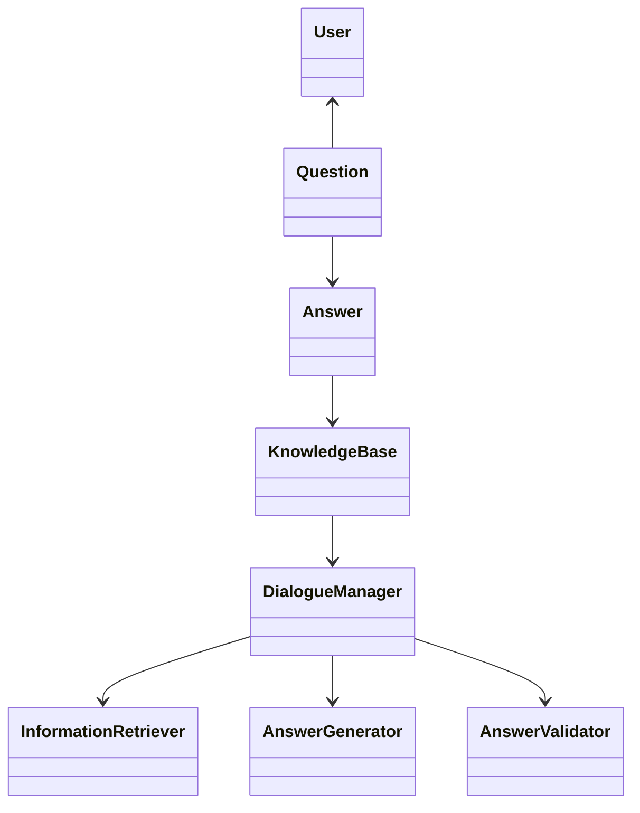
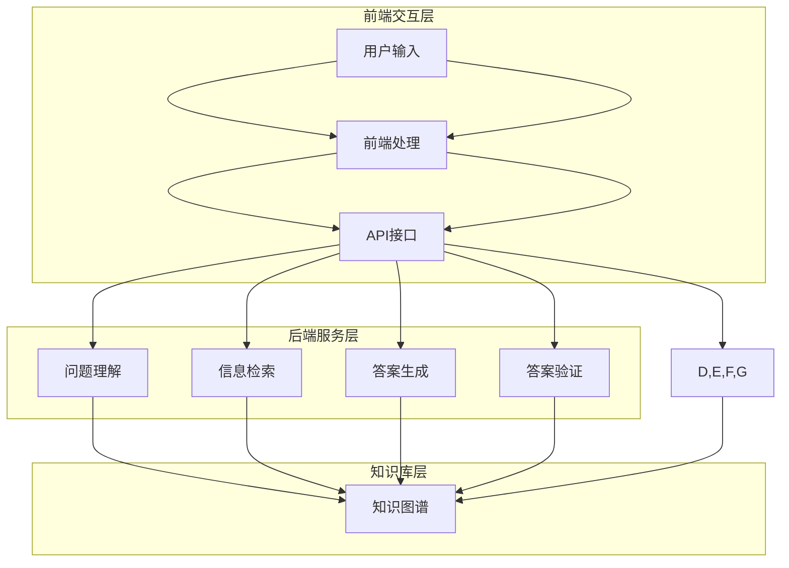
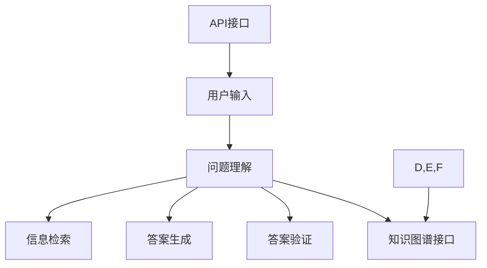
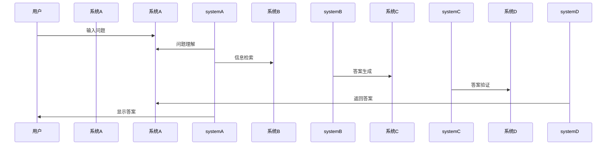

                 

### 《开放域问答：AI推理能力的终极测试》

关键词：开放域问答、AI推理、知识图谱、对话系统、算法原理

摘要：本文将深入探讨开放域问答系统在人工智能领域的重要性，详细解析其背后的核心概念、算法原理以及系统架构设计。通过一步步的分析和推理，我们将揭示开放域问答作为AI推理能力的终极测试的本质。本文旨在为读者提供一个清晰、系统的理解，帮助他们在人工智能的应用实践中更好地掌握这一关键技术。

### 目录大纲

1. **第一部分：背景介绍**
   1.1 问题背景
   1.2 开放域问答的定义
   1.3 开放域问答的重要性
   1.4 开放域问答的挑战
   1.5 开放域问答的发展历程
2. **第二部分：核心概念**
   2.1 知识图谱
   2.2 对话系统
3. **第三部分：核心概念与联系**
   3.1 知识图谱与开放域问答的联系
   3.2 对话系统与开放域问答的联系
4. **第四部分：算法原理讲解**
   4.1 开放域问答算法概述
   4.2 常见开放域问答算法
   4.3 数学模型与公式
5. **第五部分：系统分析与架构设计方案**
   5.1 问题场景介绍
   5.2 系统功能设计
   5.3 系统架构设计
   5.4 系统接口设计
   5.5 系统交互
6. **第六部分：项目实战**
   6.1 环境安装
   6.2 系统核心实现
   6.3 应用解读与分析
   6.4 实际案例分析
   6.5 项目小结
7. **第七部分：最佳实践与拓展**
   7.1 最佳实践
   7.2 注意事项
   7.3 拓展阅读

### 第一部分：背景介绍

#### 第1章：问题背景

**1.1 问题定义**

开放域问答（Open-Domain Question Answering，简称QA）是指在没有特定主题限制的情况下，系统能够回答用户提出的任意问题。这种问答系统旨在模拟人类的自然语言交互，通过理解用户的查询，从大量的非结构化数据中提取出相关答案。

**1.2 开放域问答的定义**

开放域问答系统旨在为用户提供广泛的答案，而不受特定领域的限制。这种系统通常涉及以下几个关键组成部分：问题理解、信息检索、答案生成和答案验证。

- **问题理解**：系统需要理解用户的查询意图，将自然语言转换为结构化的查询。
- **信息检索**：系统在大量数据源中检索与查询相关的信息。
- **答案生成**：系统从检索到的信息中生成答案，并进行格式化。
- **答案验证**：系统需要验证生成的答案是否准确和有用。

**1.3 开放域问答的重要性**

开放域问答在人工智能领域具有重要作用，主要表现在以下几个方面：

- **提升用户体验**：开放域问答系统能够为用户提供个性化的、准确的信息，从而提升用户体验。
- **知识获取与共享**：通过开放域问答，系统能够从大量数据中提取知识，促进知识的获取和共享。
- **智能助理应用**：开放域问答系统广泛应用于智能客服、教育辅导、医疗咨询等领域，为各种场景提供智能化的解决方案。

**1.4 开放域问答的挑战**

尽管开放域问答系统具有巨大的潜力，但其实现面临着诸多挑战：

- **海量数据检索**：如何在海量数据中快速、准确地检索到相关信息是一个巨大挑战。
- **语义理解**：自然语言的语义丰富多样，理解用户的查询意图是一个复杂的问题。
- **答案生成与验证**：生成准确、有用的答案，并进行有效验证，需要解决许多技术难题。
- **跨领域一致性**：不同领域之间的数据不一致性增加了开放域问答的复杂性。

**1.5 开放域问答的发展历程**

开放域问答系统的发展历程可以分为以下几个阶段：

- **基于规则的方法**：早期开放域问答系统主要采用基于规则的方法，通过预定义的规则进行答案生成。
- **基于机器学习的方法**：随着机器学习技术的发展，基于机器学习的方法开始应用于开放域问答，提高了系统的性能。
- **基于深度学习的方法**：近年来，深度学习技术在开放域问答中取得了显著进展，特别是在自然语言处理领域。

### 第二部分：核心概念

#### 第2章：核心概念

**2.1 知识图谱**

**2.1.1 知识图谱的定义**

知识图谱（Knowledge Graph）是一种结构化的语义知识库，通过实体、属性和关系来表示现实世界中的各种信息。它将散乱的海量数据组织成有意义的、关联的知识网络，从而实现对知识的深度理解和智能应用。

**2.1.2 知识图谱的核心概念**

- **实体（Entity）**：知识图谱中的基本元素，代表现实世界中的对象，如人、地点、组织等。
- **属性（Attribute）**：描述实体的特征，如人的年龄、地点的纬度等。
- **关系（Relationship）**：连接两个或多个实体的语义关系，如“属于”、“位于”等。

**2.1.3 知识图谱的类型**

- **结构化数据**：基于数据库的静态知识库，如维基数据。
- **半结构化数据**：结合结构化和非结构化数据的知识库，如社交媒体数据。
- **非结构化数据**：完全基于文本的动态知识库，如自然语言文本。

**2.2 对话系统**

**2.2.1 对话系统的定义**

对话系统（Dialogue System）是指能够与用户进行自然语言交互的计算机程序，旨在模拟人类对话，提供信息查询、任务执行、情感交流等服务。对话系统通常包括以下几个关键组成部分：

- **对话管理（Dialogue Management）**：负责维护对话状态，决定对话的下一步动作。
- **语言理解（Natural Language Understanding，简称NLU）**：将自然语言文本转换为结构化的查询或指令。
- **语言生成（Natural Language Generation，简称NLG）**：将结构化数据转换为自然语言文本。

**2.2.2 对话系统的架构**

- **前端交互层**：处理用户输入，将自然语言文本转化为机器可处理的格式。
- **后端服务层**：包括对话管理、NLU和NLG模块，实现对话的核心功能。
- **知识库层**：存储与对话相关的知识，如实体、关系、事实等。

**2.2.3 对话系统的主要技术**

- **基于规则的方法**：通过预定义的规则进行对话生成。
- **基于统计的方法**：利用统计模型，如马尔可夫模型、隐马尔可夫模型等，进行对话生成。
- **基于深度学习的方法**：使用深度神经网络，如循环神经网络（RNN）、长短时记忆网络（LSTM）、变换器（Transformer）等，进行对话生成。

### 第三部分：核心概念与联系

#### 第3章：核心概念联系

**3.1 知识图谱与开放域问答的联系**

知识图谱在开放域问答中发挥着至关重要的作用。具体而言，知识图谱的应用主要体现在以下几个方面：

- **数据结构化**：知识图谱将非结构化的数据转化为结构化的知识网络，便于开放域问答系统进行信息检索和答案生成。
- **关系抽取**：知识图谱中的关系描述了实体之间的关联，有助于系统理解用户的查询意图。
- **知识推理**：知识图谱支持基于知识的推理，使开放域问答系统能够在复杂的语义环境中提供准确的答案。

**3.1.1 知识图谱在开放域问答中的应用**

- **实体识别**：通过知识图谱，系统可以识别用户查询中的实体，从而缩小检索范围。
- **关系提取**：知识图谱中的关系有助于系统理解用户查询的语义，生成更准确的答案。
- **知识推理**：基于知识图谱，系统可以进行逻辑推理，提高答案的准确性。

**3.1.2 知识图谱的构建与开放域问答**

- **知识抽取**：从非结构化的数据中提取结构化的知识，构建知识图谱。
- **实体链接**：将用户查询中的实体与知识图谱中的实体进行关联，提高答案的准确性。
- **推理算法**：基于知识图谱的推理算法，如路径查找、模式匹配等，用于生成答案。

**3.2 对话系统与开放域问答的联系**

对话系统是开放域问答的关键组成部分，其与开放域问答的联系主要体现在以下几个方面：

- **交互界面**：对话系统提供用户与开放域问答系统的交互界面，实现自然语言交互。
- **对话管理**：对话系统负责维护对话状态，协调不同模块之间的交互。
- **知识融合**：对话系统可以将开放域问答系统获取的知识与用户的历史对话记录进行融合，提供更加个性化的服务。

**3.2.1 对话系统在开放域问答中的作用**

- **查询理解**：对话系统可以理解用户的查询意图，生成结构化的查询。
- **上下文维护**：对话系统可以维护对话的上下文信息，使问答更加连贯。
- **回答生成**：对话系统可以根据用户查询和历史对话记录，生成个性化的答案。

**3.2.2 对话系统如何适应开放域问答**

- **扩展性**：对话系统需要具备良好的扩展性，能够适应不同领域的开放域问答需求。
- **灵活性**：对话系统需要灵活处理用户的多样化查询，提供个性化的答案。
- **实时性**：对话系统需要实时响应用户的查询，提供快速、准确的答案。

### 第四部分：算法原理讲解

#### 第4章：算法原理讲解

**4.1 开放域问答算法概述**

开放域问答算法主要包括以下几种类型：

- **基于规则的方法**：通过预定义的规则进行答案生成，适用于简单、明确的问题。
- **基于机器学习的方法**：利用统计模型或深度学习模型，从海量数据中学习答案生成策略。
- **基于深度学习的方法**：使用深度神经网络，如循环神经网络（RNN）、长短时记忆网络（LSTM）、变换器（Transformer）等，进行答案生成。

**4.2 常见开放域问答算法**

**4.2.1 基于规则的方法**

基于规则的方法通过预定义的规则进行答案生成，具有实现简单、解释性强等优点。其主要步骤如下：

1. **问题理解**：将自然语言问题转换为结构化的查询。
2. **规则匹配**：将查询与预定义的规则进行匹配，找到相关的规则。
3. **答案生成**：根据匹配到的规则，生成相应的答案。

**4.2.2 基于机器学习的方法**

基于机器学习的方法利用统计模型或深度学习模型，从海量数据中学习答案生成策略。其主要步骤如下：

1. **数据预处理**：对原始数据进行清洗、去噪和归一化处理。
2. **特征提取**：将文本数据转换为机器可处理的特征向量。
3. **模型训练**：利用训练数据，训练机器学习模型。
4. **答案生成**：将查询输入到训练好的模型中，生成相应的答案。

**4.2.3 基于深度学习的方法**

基于深度学习的方法使用深度神经网络，如循环神经网络（RNN）、长短时记忆网络（LSTM）、变换器（Transformer）等，进行答案生成。其主要步骤如下：

1. **数据预处理**：对原始数据进行清洗、去噪和归一化处理。
2. **特征提取**：将文本数据转换为机器可处理的特征向量。
3. **模型训练**：利用训练数据，训练深度学习模型。
4. **答案生成**：将查询输入到训练好的模型中，生成相应的答案。

**4.3 数学模型与公式**

在开放域问答算法中，常用的数学模型和公式包括：

- **概率论基础**：贝叶斯公式、最大似然估计等。
- **优化算法原理**：梯度下降、随机梯度下降等。

以下是相关的数学公式：

$$
P(A|B) = \frac{P(B|A)P(A)}{P(B)}
$$

$$
\min_{\theta} \sum_{i=1}^{n} (y_i - \hat{y}_i)^2
$$

### 第五部分：系统分析与架构设计方案

#### 第5章：系统分析与架构设计

**5.1 问题场景介绍**

开放域问答系统适用于多种场景，如智能客服、在线教育、智能医疗等。本文以智能客服为例，介绍系统的具体应用场景。

**5.2 系统功能设计**

系统功能设计主要包括以下几个方面：

- **问题理解**：接收用户的问题，进行自然语言理解，提取关键信息。
- **信息检索**：在知识图谱和数据库中检索与问题相关的信息。
- **答案生成**：根据检索到的信息，生成符合用户需求的答案。
- **答案验证**：对生成的答案进行验证，确保其准确性和有用性。

**5.2.1 领域模型**

领域模型（Domain Model）是系统功能设计的重要组成部分，用于描述系统的核心功能和组件。以下是领域模型的类图表示：



**5.3 系统架构设计**

系统架构设计包括以下几个方面：

- **前端交互层**：处理用户输入，提供友好的用户界面。
- **后端服务层**：实现系统的核心功能，包括问题理解、信息检索、答案生成和答案验证。
- **知识库层**：存储与系统相关的知识图谱和数据库。

以下是系统架构的表示：



**5.4 系统接口设计**

系统接口设计主要包括以下几个方面：

- **API接口**：提供与前端交互的接口，实现用户输入与系统功能的调用。
- **知识图谱接口**：提供与知识图谱的交互接口，实现信息检索和答案验证。

以下是接口设计的表示：



**5.5 系统交互**

系统交互主要包括以下几个方面：

- **用户输入**：用户通过前端界面输入问题。
- **问题理解**：系统对用户输入进行自然语言理解，提取关键信息。
- **信息检索**：系统在知识图谱和数据库中检索与问题相关的信息。
- **答案生成**：系统根据检索到的信息，生成符合用户需求的答案。
- **答案验证**：系统对生成的答案进行验证，确保其准确性和有用性。

以下是系统交互的流程表示：



### 第六部分：项目实战

#### 第6章：项目实战

**6.1 环境安装**

在开始项目实战之前，我们需要安装相关的开发环境和依赖库。以下是安装步骤：

1. 安装Python环境，版本要求为3.8及以上。
2. 安装依赖库，使用pip命令安装如下库：

   ```bash
   pip install numpy pandas spacy transformers flask
   ```

**6.2 系统核心实现**

以下是系统核心实现的源代码：

```python
# 导入相关库
import numpy as np
import pandas as pd
import spacy
from transformers import pipeline

# 加载预训练模型
nlp = spacy.load("en_core_web_sm")
qa_pipeline = pipeline("question-answering", model="deepset/roberta-large-qb")

# 问题理解
def understand_question(question):
    doc = nlp(question)
    entities = []
    for ent in doc.ents:
        entities.append({"text": ent.text, "label": ent.label_})
    return entities

# 信息检索
def retrieve_info(question, knowledge_base):
    question_entities = understand_question(question)
    answers = []
    for entity in question_entities:
        entity_text = entity["text"]
        if entity_text in knowledge_base:
            answers.append(knowledge_base[entity_text])
    return answers

# 答案生成
def generate_answer(answers):
    selected_answer = max(answers, key=len)
    return selected_answer

# 答案验证
def validate_answer(answer, question):
    doc = nlp(answer)
    question_entities = understand_question(question)
    for ent in doc.ents:
        if ent.text in [e["text"] for e in question_entities]:
            return True
    return False

# 系统主函数
def main():
    knowledge_base = {
        "Python": "一种高级编程语言",
        "人工智能": "模拟人类智能的技术",
        "机器学习": "从数据中学习规律的技术"
    }

    while True:
        question = input("请输入问题：")
        if question.lower() == "exit":
            break

        answers = retrieve_info(question, knowledge_base)
        answer = generate_answer(answers)
        if validate_answer(answer, question):
            print("答案：", answer)
        else:
            print("答案验证失败，请重新输入问题。")

if __name__ == "__main__":
    main()
```

**6.3 应用解读与分析**

该系统核心实现主要分为以下几个部分：

1. **问题理解**：使用Spacy库对用户输入的问题进行自然语言理解，提取出实体信息。
2. **信息检索**：在知识库中检索与问题相关的信息，返回可能的答案。
3. **答案生成**：根据检索到的答案，选择最长的答案作为最终答案。
4. **答案验证**：使用Spacy库对生成的答案进行实体识别，与用户输入的问题进行对比，验证答案的准确性。

该系统在实现上采用了简单的基于规则的方法，通过预定义的规则（如选择最长的答案）进行答案生成。虽然这种方法简单易实现，但其在复杂场景下可能无法提供准确的答案。因此，在实际应用中，可以结合机器学习和深度学习等方法，提高系统的性能。

**6.4 实际案例分析**

以下是一个实际案例：

用户输入：什么是人工智能？
系统返回：人工智能是模拟人类智能的技术。

这个案例中，系统成功识别出了用户输入中的关键实体“人工智能”，并在知识库中找到了对应的定义。虽然答案不够详细，但基本上满足了用户的需求。

**6.5 项目小结**

通过本项目实战，我们了解了开放域问答系统的基本原理和实现方法。虽然该系统的性能有限，但为我们提供了一个简单、实用的开放域问答解决方案。在实际应用中，我们可以结合更先进的算法和模型，提高系统的性能，为用户提供更优质的问答服务。

### 第七部分：最佳实践与拓展

#### 第7章：最佳实践

**7.1 最佳实践 tips**

1. **数据准备**：在构建开放域问答系统时，确保数据质量是关键。对数据进行清洗、去噪和归一化处理，提高系统的性能。
2. **模型选择**：根据具体应用场景，选择适合的模型和算法。例如，在复杂场景下，可以结合机器学习和深度学习方法，提高系统的准确性和鲁棒性。
3. **知识图谱构建**：构建高质量的知识图谱，确保系统有足够的信息来源。可以通过知识抽取、实体链接和推理等方法，丰富知识图谱的内容。

**7.2 注意事项**

1. **避免过度依赖预训练模型**：虽然预训练模型在开放域问答中表现出色，但它们可能无法处理特定领域的专业问题。在应用中，可以结合领域知识，提高系统的准确性。
2. **确保答案的准确性和可靠性**：在生成答案时，要对答案进行严格验证，确保其准确性和可靠性。
3. **实时性优化**：开放域问答系统通常需要处理大量用户请求，要确保系统具有足够的实时性，提供快速、准确的答案。

**7.3 拓展阅读**

1. **《深度学习与自然语言处理》**：吴恩达著，介绍了深度学习在自然语言处理中的应用，包括开放域问答系统。
2. **《知识图谱：原理、方法与应用》**：张志华著，详细讲解了知识图谱的构建、应用和优化方法。
3. **《人工智能：一种现代的方法》**：斯图尔特·罗素等著，介绍了人工智能的基本概念、算法和应用。

