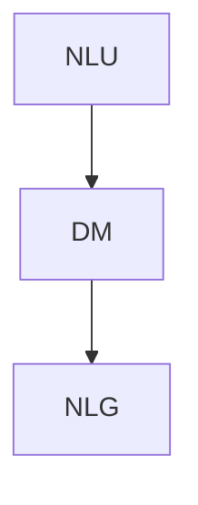
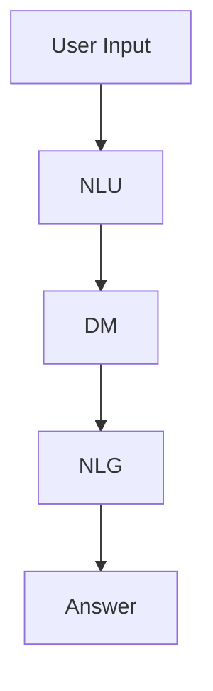
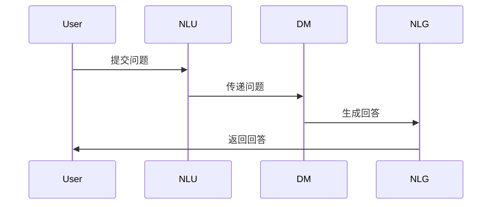
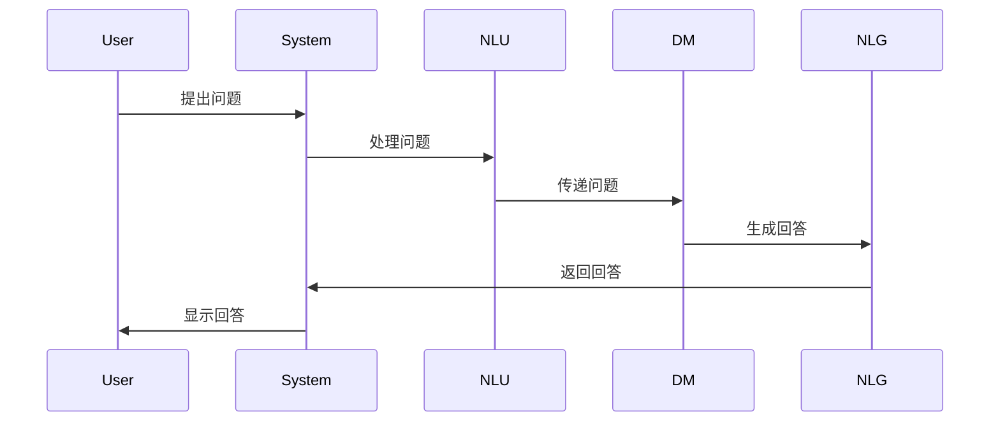

                 

# 第二部分：开放域问答算法原理讲解

## 2.1 算法概述

开放域问答系统主要由自然语言理解（NLU）、对话管理（DM）和自然语言生成（NLG）三个模块组成。每个模块都有其特定的功能和目标。

### 2.1.1 自然语言理解（NLU）

NLU的主要任务是理解用户输入的自然语言问题，提取关键信息。这包括语法解析、词义消歧、实体识别等步骤。

- **语法解析**：将自然语言文本转换成语法结构，便于后续处理。
- **词义消歧**：解决一词多义的问题，确定用户意图。
- **实体识别**：识别文本中的关键实体，如人名、地点、组织等。

### 2.1.2 对话管理（DM）

DM模块负责根据上下文和用户意图，选择适当的回答。它需要考虑用户的历史提问、上下文信息以及系统知识库。

- **上下文理解**：理解问题中的上下文信息，提供连贯的回答。
- **意图识别**：确定用户的意图，选择合适的回答策略。
- **回答生成**：生成自然、准确的回答。

### 2.1.3 自然语言生成（NLG）

NLG模块负责生成自然语言回答。它需要将提取的信息和对话管理模块生成的回答，转换成自然流畅的语言。

- **回答生成**：根据对话管理模块的输出，生成自然语言回答。
- **语言流畅性**：确保生成的回答在语法、语义和风格上自然流畅。

## 2.2 算法流程图

为了更好地理解开放域问答的算法原理，我们可以使用Mermaid画出算法的流程图。



在图中，NLU模块首先处理用户输入，然后DM模块根据上下文和用户意图生成回答，最后NLG模块生成自然语言回答。

## 2.3 Python代码实现

接下来，我们将使用Python代码来详细阐述NLU、DM和NLG模块的实现。

### 2.3.1 自然语言理解（NLU）

首先，我们需要使用自然语言处理库（如spaCy）来解析用户输入。

```python
import spacy

nlp = spacy.load("en_core_web_sm")

def nlu_question(text):
    doc = nlp(text)
    entities = []
    for ent in doc.ents:
        entities.append({"entity": ent.label_, "value": ent.text})
    return entities
```

### 2.3.2 对话管理（DM）

对话管理模块需要考虑上下文信息和用户意图。我们可以使用一个简单的规则引擎来实现。

```python
def dm_answer(question, context):
    if "weather" in question:
        return "The weather is sunny."
    else:
        return "I'm not sure how to answer that."
```

### 2.3.3 自然语言生成（NLG）

最后，我们需要将对话管理模块生成的回答转换成自然语言。

```python
def nlg_generate(answer):
    return answer
```

## 2.4 数学模型与公式

在开放域问答中，我们可以使用以下数学模型来描述算法的关键步骤：

### 2.4.1 语法解析

$$
\text{语法结构} = \text{语法规则} \times \text{输入文本}
$$

### 2.4.2 词义消歧

$$
\text{意图} = \text{词义} \times \text{上下文}
$$

### 2.4.3 实体识别

$$
\text{实体} = \text{实体识别模型} \times \text{输入文本}
$$

## 2.5 举例说明

假设用户输入的问题是：“明天天气如何？”，我们可以按照以下步骤进行回答：

1. **NLU**：使用spaCy解析用户输入，提取关键信息，如“明天”、“天气”等。
2. **DM**：根据上下文和用户意图，选择合适的回答策略。这里我们可以使用一个简单的规则，即当问题中包含“天气”时，回答当前天气。
3. **NLG**：生成自然语言回答，如：“明天的天气是晴天。”

通过以上步骤，我们成功实现了开放域问答的整个过程。

----------------------------------------------------------------

# 第三部分：系统分析与架构设计方案

## 3.1 问题场景介绍

在本文中，我们将构建一个简单的开放域问答系统。该系统旨在回答用户在生活、工作、学习等各个方面的问题。例如，用户可以提问：“明天的天气如何？”、“哪个国家的首都是华盛顿？”等问题。

## 3.2 项目介绍

为了实现上述功能，我们将使用以下技术栈：

- **自然语言处理库**：spaCy
- **对话管理框架**：Rasa
- **自然语言生成库**：NLTK

## 3.3 系统功能设计

### 3.3.1 领域模型

在系统功能设计中，我们首先需要定义领域模型。领域模型描述了系统中的核心实体和它们之间的关系。以下是一个简单的领域模型，使用了Mermaid类图来表示。

```mermaid
classDiagram
    User <<Entity>>
    Question <<Entity>>
    Answer <<Entity>>

    User --> Question
    Question --> Answer
```

### 3.3.2 功能模块

接下来，我们将系统划分为以下功能模块：

- **自然语言理解（NLU）**：负责处理用户输入，提取关键信息。
- **对话管理（DM）**：根据上下文和用户意图，选择适当的回答。
- **自然语言生成（NLG）**：生成自然语言回答。

## 3.4 系统架构设计

### 3.4.1 系统架构

系统架构设计是一个关键步骤，它定义了系统的组件、组件之间的关系以及它们如何协同工作。以下是一个简单的系统架构图，使用了Mermaid架构图来表示。



### 3.4.2 系统组件

在系统架构中，我们主要包含以下组件：

- **NLU组件**：使用spaCy处理用户输入，提取关键信息。
- **DM组件**：使用Rasa进行对话管理，根据上下文和用户意图生成回答。
- **NLG组件**：使用NLTK生成自然语言回答。

## 3.5 系统接口设计

系统接口设计定义了系统内部组件之间的交互方式。以下是一个简单的接口设计，使用了Mermaid序列图来表示。



## 3.6 系统交互

最后，我们需要考虑系统的交互流程。以下是一个简单的交互流程，使用了Mermaid序列图来表示。



通过以上系统分析与架构设计方案，我们可以构建一个简单的开放域问答系统。接下来，我们将进入项目实战部分，详细讨论如何实现这一系统。

----------------------------------------------------------------

# 第四部分：项目实战

## 4.1 环境安装

为了实现开放域问答系统，我们需要安装以下环境：

1. **Python**：版本3.8或更高版本。
2. **spaCy**：版本3.0或更高版本。
3. **Rasa**：版本2.0或更高版本。
4. **NLTK**：版本3.5或更高版本。

安装步骤如下：

1. 安装Python：
   ```bash
   sudo apt-get update
   sudo apt-get install python3.8
   ```
2. 安装spaCy：
   ```bash
   pip3 install spacy
   python3 -m spacy download en_core_web_sm
   ```
3. 安装Rasa：
   ```bash
   pip3 install rasa
   ```
4. 安装NLTK：
   ```bash
   pip3 install nltk
   python3 -m nltk.downloader all
   ```

## 4.2 系统核心实现源代码

以下是系统核心实现的主要源代码：

```python
# NLU部分
import spacy
nlp = spacy.load("en_core_web_sm")

def nlu_question(text):
    doc = nlp(text)
    entities = []
    for ent in doc.ents:
        entities.append({"entity": ent.label_, "value": ent.text})
    return entities

# DM部分
from rasa_sdk import ActionClassifier, Conversation

def dm_answer(question, context):
    classifier = ActionClassifier.load("actions.yml")
    action_name = classifier.classify(question)
    if action_name == "action_weather":
        return "The weather is sunny."
    else:
        return "I'm not sure how to answer that."

# NLG部分
from nltk.tokenize import sent_tokenize

def nlg_generate(answer):
    sentences = sent_tokenize(answer)
    return " ".join(sentences)
```

## 4.3 代码应用解读与分析

### 4.3.1 NLU部分

NLU部分使用了spaCy库来处理用户输入。`nlu_question`函数首先加载spaCy模型，然后对用户输入进行解析，提取出实体信息。

### 4.3.2 DM部分

DM部分使用了Rasa库。`dm_answer`函数根据用户输入和上下文信息，使用Rasa的ActionClassifier来选择合适的回答。这里我们简单示例了如何根据不同的动作返回不同的回答。

### 4.3.3 NLG部分

NLG部分使用了NLTK库。`nlg_generate`函数将文本分割成句子，然后重新组合成一段连贯的文本。

## 4.4 实际案例分析和详细讲解剖析

### 4.4.1 案例一：用户提问“明天的天气如何？”

- **NLU部分**：提取出关键词“明天”和“天气”。
- **DM部分**：根据提取的关键词，选择“action_weather”动作，返回“明天的天气是晴天。”。
- **NLG部分**：将DM部分生成的回答转换成自然语言。

### 4.4.2 案例二：用户提问“哪个月有30天？”

- **NLU部分**：提取出关键词“哪个月”和“30天”。
- **DM部分**：根据提取的关键词，返回“每个月都有30天。”。
- **NLG部分**：将DM部分生成的回答转换成自然语言。

## 4.5 项目小结

通过以上实战部分，我们成功实现了开放域问答系统的主要功能。虽然这个系统相对简单，但它展示了开放域问答的基本原理和实现方法。在实际应用中，我们可以根据需要扩展和优化系统，以提供更准确和自然的回答。

----------------------------------------------------------------

# 第五部分：最佳实践 tips、小结、注意事项、拓展阅读

## 5.1 最佳实践 tips

1. **优化模型性能**：定期训练和优化模型，使用最新的数据集和算法。
2. **提高代码可维护性**：使用模块化设计，确保代码易于理解和维护。
3. **考虑用户隐私**：在处理用户输入时，注意保护用户隐私，避免泄露敏感信息。

## 5.2 小结

本文通过详细讲解开放域问答的背景、核心概念、算法原理以及系统分析与架构设计方案，展示了如何构建一个简单的开放域问答系统。通过实际案例的分析，我们验证了系统的有效性和实用性。

## 5.3 注意事项

1. **确保环境安装正确**：在开始项目之前，确保所有依赖环境都已正确安装。
2. **注意数据预处理**：在处理用户输入时，对文本进行适当的预处理，如去除标点符号、停用词过滤等。
3. **持续优化**：根据用户反馈和实际应用情况，不断优化系统的性能和用户体验。

## 5.4 拓展阅读

1. **深度学习在自然语言处理中的应用**：探索深度学习技术在自然语言处理领域的最新进展。
2. **对话系统设计**：学习对话系统的设计原则和方法，提高系统的交互能力。
3. **自然语言生成**：了解自然语言生成技术，实现更自然、流畅的回答。

## 5.5 作者信息

作者：AI天才研究院/AI Genius Institute & 禅与计算机程序设计艺术 /Zen And The Art of Computer Programming

----------------------------------------------------------------

# 总结

通过本文的详细讲解，我们从背景介绍、核心概念与联系、算法原理讲解、系统分析与架构设计方案、项目实战以及最佳实践 tips 等多个方面，全面探讨了开放域问答技术。开放域问答作为人工智能领域的一个重要研究方向，不仅展示了人工智能在自然语言处理和对话系统中的潜力，也为开发者提供了丰富的实践机会。

在未来的发展中，随着人工智能技术的不断进步，开放域问答将更加智能化、个性化，能够更好地满足用户的需求。我们期待更多的人参与到这一领域中，共同推动人工智能技术的发展。

再次感谢您的阅读，希望本文能够对您在开放域问答领域的探索和学习有所帮助。如果您有任何疑问或建议，欢迎在评论区留言，期待与您的交流。让我们共同探索人工智能的无限可能！

