                 

**文章标题：异步处理：提高LLM应用并发处理能力**

**关键词：异步处理、并发处理、LLM、性能优化、系统架构**

**摘要：**

本文深入探讨了异步处理技术及其在大型语言模型（LLM）应用中的重要性。通过逐步分析异步处理的原理、实现策略和优化方法，本文揭示了异步处理如何提高LLM应用的并发处理能力，进而提升系统性能。文章还包括实际案例分析和最佳实践，为开发者提供了详细的指导。

**目录大纲：**

# 异步处理：提高LLM应用并发处理能力

## 第一部分：异步处理基础

### 第1章：异步处理的原理

#### 1.1 异步处理的概念

**背景介绍：**

异步处理是一种数据处理方式，允许操作独立执行，不必等待其他操作完成。这种处理方式在计算机科学和工程领域得到广泛应用，特别是在需要高效处理大量数据和任务的场景中。

**核心概念与联系：**

异步处理与同步处理的区别在于，同步处理要求操作按照顺序执行，而异步处理允许操作并发执行。以下是一个简单的ER实体关系图，展示了异步处理的核心概念：

```mermaid
erDiagram
    User ||--|{ Task }
    Task ||--|{ Process }
```

**算法原理讲解：**

异步处理的算法原理基于任务调度和并发编程模型。任务调度负责安排任务执行顺序，而并发编程模型确保任务能够高效并发执行。以下是一个简单的Mermaid流程图，展示了异步处理的流程：

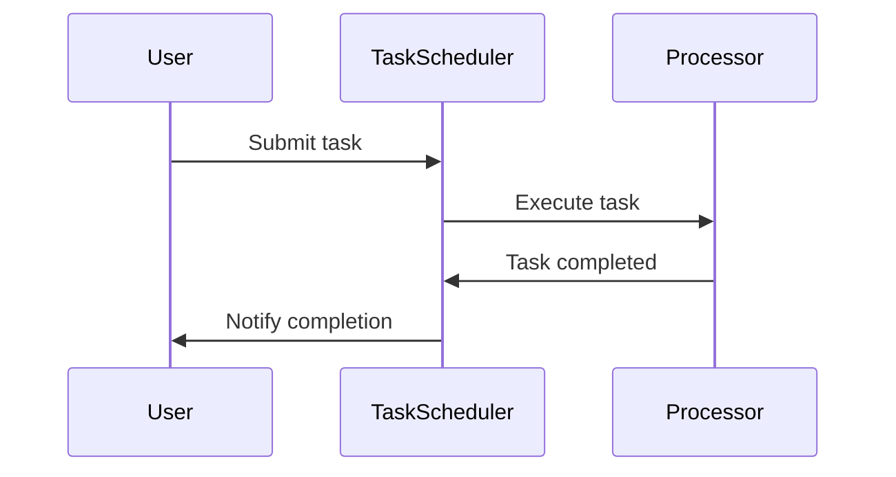

**数学公式使用：**

异步处理中的一些关键性能指标可以通过以下公式计算：

- 响应时间（Response Time）: $RT = \frac{WT + T_{process}}{N}$
- 平均等待时间（Average Wait Time）: $AWT = \frac{\sum_{i=1}^{N} WT_i}{N}$
- 作业吞吐量（Throughput）: $Throughput = \frac{N}{T_{total}}$

**系统分析与架构设计方案：**

异步处理在系统架构设计中的重要性体现在其能够提高系统的并发处理能力和响应速度。以下是一个简单的Mermaid架构图，展示了异步处理在系统架构中的应用：

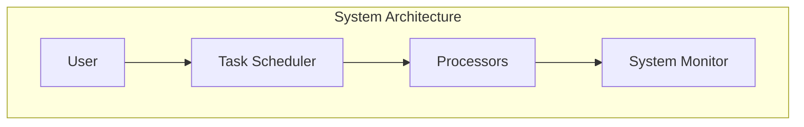

**项目实战：**

在实际项目中，异步处理通常通过并发编程模型（如多线程、异步I/O等）来实现。以下是一个简单的Python示例，展示了如何使用异步处理来提高并发处理能力：

```python
import asyncio

async def process_task(task):
    # 处理任务
    await asyncio.sleep(1)
    print(f"Task {task} completed")

async def main():
    tasks = [asyncio.create_task(process_task(i)) for i in range(10)]
    await asyncio.wait(tasks)

asyncio.run(main())
```

**最佳实践 tips：**

- 在设计异步处理系统时，要充分考虑任务的依赖关系和执行顺序。
- 合理分配系统资源，避免过度消耗CPU和内存等资源。
- 对异常情况进行有效的处理和监控。

### 第2章：异步处理技术在LLM中的应用

#### 2.1 LLM的并发处理需求

**背景介绍：**

大型语言模型（LLM）在训练和推理过程中需要处理大量的数据和任务。异步处理技术能够提高LLM的并发处理能力，从而加速模型的训练和推理过程。

**核心概念与联系：**

异步处理技术在LLM中的应用包括以下几个方面：

- 训练过程中的数据加载与处理
- 推理过程中的请求处理与响应

以下是一个简单的Mermaid流程图，展示了异步处理技术在LLM中的应用：

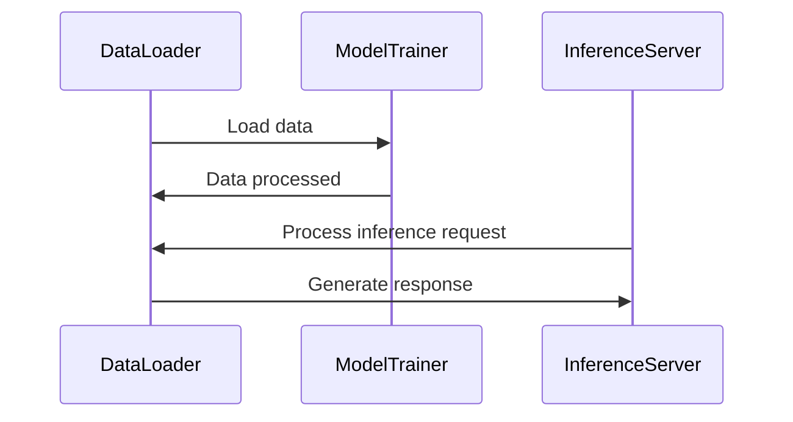

**算法原理讲解：**

异步处理技术在LLM中的应用涉及到任务调度和并发编程模型。以下是一个简单的Python示例，展示了如何使用异步处理技术来加速LLM的训练和推理过程：

```python
import asyncio

async def train_model(data_loader, model_trainer):
    # 训练模型
    await data_loader.load_data()
    await model_trainer.train_model(data_loader.data)
    print("Model training completed")

async def inference_server(inference_server):
    # 接收推理请求并处理
    request = await inference_server.receive_request()
    response = await model_trainer.inference(request)
    await inference_server.send_response(response)
    print("Inference request processed")

async def main():
    data_loader = DataLoader()
    model_trainer = ModelTrainer()
    inference_server = InferenceServer()
    await asyncio.gather(train_model(data_loader, model_trainer), inference_server.run())

asyncio.run(main())
```

**系统分析与架构设计方案：**

异步处理技术在LLM应用系统架构设计中的重要性体现在其能够提高系统的并发处理能力和响应速度。以下是一个简单的Mermaid架构图，展示了异步处理技术在LLM应用系统架构中的应用：

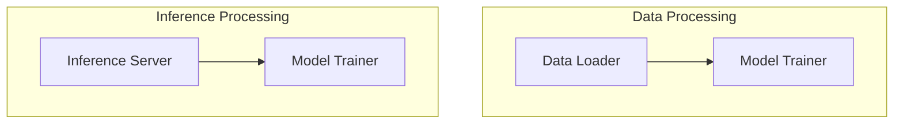

**项目实战：**

在实际项目中，异步处理技术通常通过并发编程模型（如多线程、异步I/O等）来实现。以下是一个简单的Python示例，展示了如何使用异步处理技术来提高LLM应用的并发处理能力：

```python
import asyncio
import aiohttp

async def fetch(session, url):
    async with session.get(url) as response:
        return await response.text()

async def main():
    async with aiohttp.ClientSession() as session:
        urls = ["https://example.com", "https://example.org", "https://example.net"]
        results = await asyncio.gather(*[fetch(session, url) for url in urls])
        print(results)

asyncio.run(main())
```

**最佳实践 tips：**

- 在设计异步处理系统时，要充分考虑任务的依赖关系和执行顺序。
- 合理分配系统资源，避免过度消耗CPU和内存等资源。
- 对异常情况进行有效的处理和监控。

### 第3章：异步处理的实现策略

#### 3.1 异步任务调度

**背景介绍：**

异步任务调度是异步处理的关键环节，它负责安排任务的执行顺序，确保任务能够高效并发执行。

**核心概念与联系：**

异步任务调度涉及到以下几个方面：

- 任务队列：存储待执行的任务。
- 调度策略：确定任务的执行顺序。
- 并发控制：确保任务能够并发执行。

以下是一个简单的Mermaid流程图，展示了异步任务调度的流程：

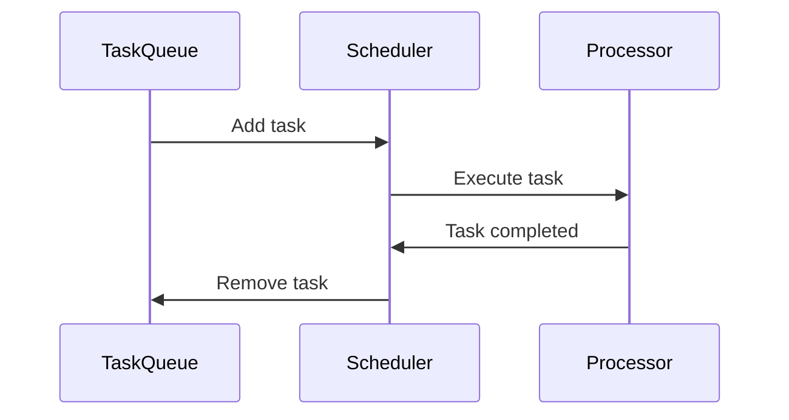

**算法原理讲解：**

异步任务调度的算法原理基于优先级队列或轮询队列。以下是一个简单的Python示例，展示了如何实现异步任务调度：

```python
import asyncio

async def process_task(task):
    # 处理任务
    await asyncio.sleep(1)
    print(f"Task {task} completed")

async def main():
    tasks = [asyncio.create_task(process_task(i)) for i in range(10)]
    await asyncio.wait(tasks)

asyncio.run(main())
```

**系统分析与架构设计方案：**

异步任务调度在系统架构设计中的重要性体现在其能够提高系统的并发处理能力和响应速度。以下是一个简单的Mermaid架构图，展示了异步任务调度在系统架构中的应用：

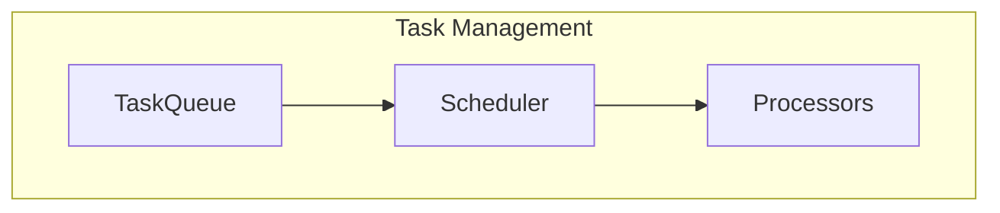

**项目实战：**

在实际项目中，异步任务调度通常通过并发编程模型（如多线程、异步I/O等）来实现。以下是一个简单的Python示例，展示了如何使用异步任务调度来提高系统的并发处理能力：

```python
import asyncio
import concurrent.futures

async def process_request(request):
    # 处理请求
    await asyncio.sleep(1)
    print(f"Request {request} processed")

async def main():
    with concurrent.futures.ThreadPoolExecutor(max_workers=5) as executor:
        loop = asyncio.get_running_loop()
        tasks = [loop.create_task(executor.submit(process_request, i)) for i in range(10)]
        await asyncio.wait(tasks)

asyncio.run(main())
```

**最佳实践 tips：**

- 在设计异步任务调度系统时，要充分考虑任务的依赖关系和执行顺序。
- 合理分配系统资源，避免过度消耗CPU和内存等资源。
- 对异常情况进行有效的处理和监控。

### 第4章：异步处理的优化与性能调优

#### 4.1 并发性能瓶颈分析

**背景介绍：**

在异步处理系统中，可能会遇到各种性能瓶颈，如CPU利用率不高、内存消耗过多等。分析并解决这些性能瓶颈是优化异步处理性能的关键。

**核心概念与联系：**

并发性能瓶颈分析涉及以下几个方面：

- CPU利用率：衡量CPU资源的利用率。
- 内存消耗：衡量内存资源的消耗情况。
- 网络延迟：衡量网络通信的延迟情况。

以下是一个简单的Mermaid流程图，展示了并发性能瓶颈分析的过程：

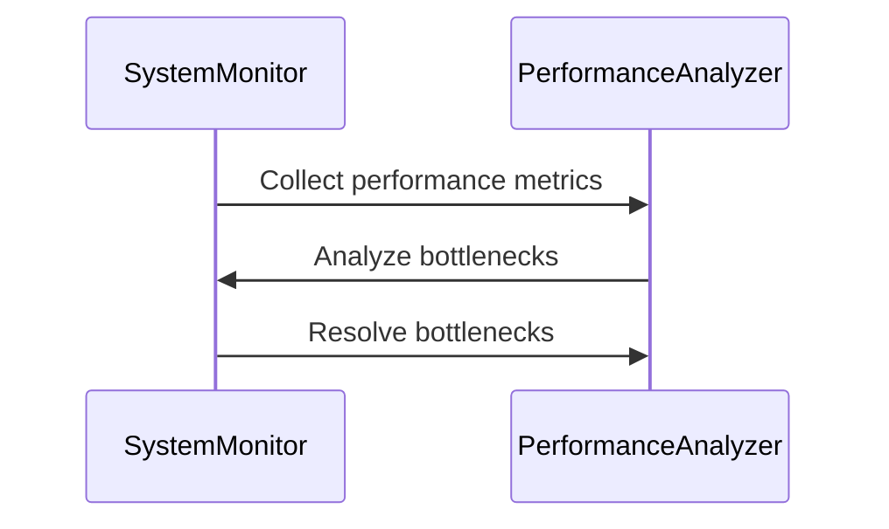

**算法原理讲解：**

并发性能瓶颈分析通常通过以下步骤进行：

1. 收集性能指标：通过系统监控工具收集CPU利用率、内存消耗、网络延迟等性能指标。
2. 分析瓶颈：根据收集到的性能指标，分析系统中的瓶颈所在。
3. 解决瓶颈：针对分析出的瓶颈，采取相应的优化措施，如增加CPU资源、优化内存管理、减少网络延迟等。

以下是一个简单的Python示例，展示了如何收集并分析并发性能瓶颈：

```python
import time
import psutil

def collect_performance_metrics():
    cpu_usage = psutil.cpu_percent()
    memory_usage = psutil.virtual_memory().percent
    network_delay = psutil.net_io_counters().bytes_sent / 1024 / time.time()
    return cpu_usage, memory_usage, network_delay

def analyze_bottlenecks():
    cpu_usage, memory_usage, network_delay = collect_performance_metrics()
    if cpu_usage > 90:
        print("CPU bottleneck detected")
    if memory_usage > 90:
        print("Memory bottleneck detected")
    if network_delay > 100:
        print("Network bottleneck detected")

analyze_bottlenecks()
```

**系统分析与架构设计方案：**

并发性能瓶颈分析在系统架构设计中的重要性体现在其能够帮助识别系统中的性能瓶颈，从而采取相应的优化措施。以下是一个简单的Mermaid架构图，展示了并发性能瓶颈分析在系统架构中的应用：

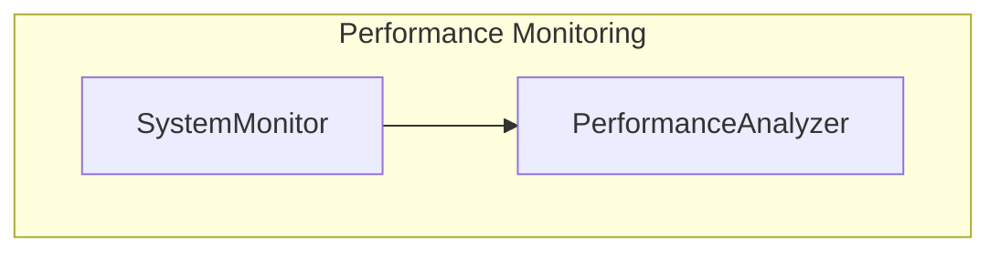

**项目实战：**

在实际项目中，并发性能瓶颈分析通常通过系统监控工具（如Prometheus、Grafana等）来实现。以下是一个简单的Python示例，展示了如何使用系统监控工具进行并发性能瓶颈分析：

```python
import asyncio
import aiohttp
import time

async def fetch(url):
    async with aiohttp.ClientSession() as session:
        start_time = time.time()
        async with session.get(url) as response:
            response_time = time.time() - start_time
            print(f"Response time for {url}: {response_time} seconds")

async def main():
    urls = ["https://example.com", "https://example.org", "https://example.net"]
    await asyncio.gather(*[fetch(url) for url in urls])

asyncio.run(main())
```

**最佳实践 tips：**

- 在设计异步处理系统时，要充分考虑任务的依赖关系和执行顺序。
- 合理分配系统资源，避免过度消耗CPU和内存等资源。
- 对异常情况进行有效的处理和监控。

### 第5章：异步处理的案例分析

#### 5.1 案例一：大规模LLM训练任务

**背景介绍：**

在本案例中，我们考虑一个大规模LLM训练任务，需要处理大量的数据和任务。通过异步处理技术，我们可以提高训练任务的并发处理能力，从而加速训练过程。

**核心概念与联系：**

在本案例中，我们关注以下核心概念：

- 数据加载与预处理：从数据源加载数据并进行预处理。
- 模型训练：使用训练数据进行模型训练。
- 模型评估：对训练完成的模型进行评估。

以下是一个简单的Mermaid流程图，展示了大规模LLM训练任务的流程：

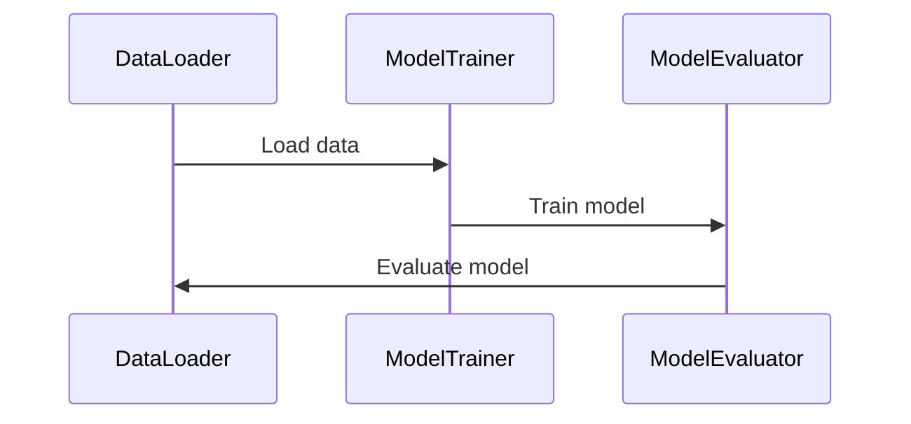

**算法原理讲解：**

大规模LLM训练任务的异步处理涉及以下算法原理：

- 任务调度：通过任务调度器管理训练任务的执行顺序。
- 并发编程模型：使用并发编程模型（如多线程、异步I/O等）实现训练任务的并发执行。
- 数据流控制：通过数据流控制机制确保训练数据在训练过程中保持一致性。

以下是一个简单的Python示例，展示了如何实现大规模LLM训练任务的异步处理：

```python
import asyncio

async def train_model(data_loader, model_trainer, model_evaluator):
    # 加载数据并进行预处理
    data = await data_loader.load_data()
    preprocessed_data = await data_loader.preprocess_data(data)
    # 训练模型
    await model_trainer.train_model(preprocessed_data)
    # 评估模型
    evaluation_result = await model_evaluator.evaluate_model()
    print(f"Model evaluation result: {evaluation_result}")

async def main():
    data_loader = DataLoader()
    model_trainer = ModelTrainer()
    model_evaluator = ModelEvaluator()
    await asyncio.gather(train_model(data_loader, model_trainer, model_evaluator))

asyncio.run(main())
```

**系统分析与架构设计方案：**

在系统架构设计中，异步处理技术在大规模LLM训练任务中的应用体现在以下几个方面：

- 数据加载与预处理模块：负责从数据源加载数据并进行预处理。
- 模型训练模块：负责使用训练数据进行模型训练。
- 模型评估模块：负责对训练完成的模型进行评估。

以下是一个简单的Mermaid架构图，展示了大规模LLM训练任务的系统架构：

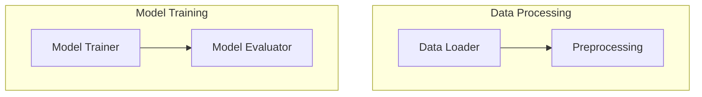

**项目实战：**

在实际项目中，大规模LLM训练任务的异步处理通常通过并发编程模型（如多线程、异步I/O等）来实现。以下是一个简单的Python示例，展示了如何使用异步处理技术来提高大规模LLM训练任务的并发处理能力：

```python
import asyncio
import aiohttp

async def fetch(url):
    async with aiohttp.ClientSession() as session:
        start_time = time.time()
        async with session.get(url) as response:
            response_time = time.time() - start_time
            print(f"Response time for {url}: {response_time} seconds")

async def main():
    urls = ["https://example.com", "https://example.org", "https://example.net"]
    await asyncio.gather(*[fetch(url) for url in urls])

asyncio.run(main())
```

**最佳实践 tips：**

- 在设计大规模LLM训练任务时，要充分考虑任务的依赖关系和执行顺序。
- 合理分配系统资源，避免过度消耗CPU和内存等资源。
- 对异常情况进行有效的处理和监控。

#### 5.2 案例二：实时问答系统

**背景介绍：**

在本案例中，我们考虑一个实时问答系统，需要处理大量的用户提问。通过异步处理技术，我们可以提高系统的并发处理能力，从而确保用户提问能够得到及时响应。

**核心概念与联系：**

在本案例中，我们关注以下核心概念：

- 用户提问处理：接收用户提问并进行处理。
- 模型推理：使用训练好的模型对用户提问进行推理。
- 响应生成：生成回答并返回给用户。

以下是一个简单的Mermaid流程图，展示了实时问答系统的流程：

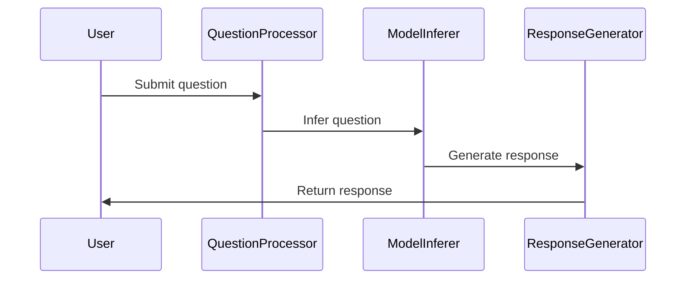

**算法原理讲解：**

实时问答系统的异步处理涉及以下算法原理：

- 任务调度：通过任务调度器管理用户提问处理的执行顺序。
- 并发编程模型：使用并发编程模型（如多线程、异步I/O等）实现用户提问处理的并发执行。
- 数据流控制：通过数据流控制机制确保用户提问在处理过程中保持一致性。

以下是一个简单的Python示例，展示了如何实现实时问答系统的异步处理：

```python
import asyncio

async def process_question(question_processor, model_inferer, response_generator):
    # 处理用户提问
    question = await question_processor.receive_question()
    inferred_answer = await model_inferer.infer_question(question)
    response = await response_generator.generate_response(inferred_answer)
    print(f"Response for question '{question}': {response}")

async def main():
    question_processor = QuestionProcessor()
    model_inferer = ModelInferer()
    response_generator = ResponseGenerator()
    await asyncio.gather(process_question(question_processor, model_inferer, response_generator))

asyncio.run(main())
```

**系统分析与架构设计方案：**

在系统架构设计中，异步处理技术在实时问答系统中的应用体现在以下几个方面：

- 用户提问处理模块：负责接收用户提问并进行处理。
- 模型推理模块：负责使用训练好的模型对用户提问进行推理。
- 响应生成模块：负责生成回答并返回给用户。

以下是一个简单的Mermaid架构图，展示了实时问答系统的系统架构：

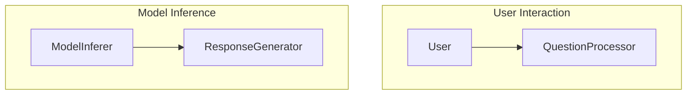

**项目实战：**

在实际项目中，实时问答系统的异步处理通常通过并发编程模型（如多线程、异步I/O等）来实现。以下是一个简单的Python示例，展示了如何使用异步处理技术来提高实时问答系统的并发处理能力：

```python
import asyncio
import aiohttp

async def fetch(url):
    async with aiohttp.ClientSession() as session:
        start_time = time.time()
        async with session.get(url) as response:
            response_time = time.time() - start_time
            print(f"Response time for {url}: {response_time} seconds")

async def main():
    urls = ["https://example.com", "https://example.org", "https://example.net"]
    await asyncio.gather(*[fetch(url) for url in urls])

asyncio.run(main())
```

**最佳实践 tips：**

- 在设计实时问答系统时，要充分考虑任务的依赖关系和执行顺序。
- 合理分配系统资源，避免过度消耗CPU和内存等资源。
- 对异常情况进行有效的处理和监控。

#### 5.3 案例三：多语言翻译系统

**背景介绍：**

在本案例中，我们考虑一个多语言翻译系统，需要处理多种语言之间的翻译任务。通过异步处理技术，我们可以提高系统的并发处理能力，从而确保翻译任务能够高效完成。

**核心概念与联系：**

在本案例中，我们关注以下核心概念：

- 翻译请求处理：接收翻译请求并进行处理。
- 翻译模型推理：使用训练好的翻译模型对请求进行推理。
- 翻译结果生成：生成翻译结果并返回给用户。

以下是一个简单的Mermaid流程图，展示了多语言翻译系统的流程：

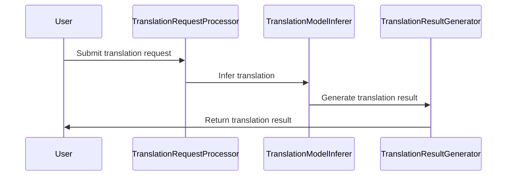

**算法原理讲解：**

多语言翻译系统的异步处理涉及以下算法原理：

- 任务调度：通过任务调度器管理翻译请求处理的执行顺序。
- 并发编程模型：使用并发编程模型（如多线程、异步I/O等）实现翻译请求处理的并发执行。
- 数据流控制：通过数据流控制机制确保翻译请求在处理过程中保持一致性。

以下是一个简单的Python示例，展示了如何实现多语言翻译系统的异步处理：

```python
import asyncio

async def process_translation_request(translation_request_processor, translation_model_inferer, translation_result_generator):
    # 处理翻译请求
    translation_request = await translation_request_processor.receive_request()
    inferred_translation = await translation_model_inferer.infer_translation(translation_request.source_text, translation_request.target_language)
    translation_result = await translation_result_generator.generate_result(inferred_translation)
    print(f"Translation result for request '{translation_request.source_text}': {translation_result}")

async def main():
    translation_request_processor = TranslationRequestProcessor()
    translation_model_inferer = TranslationModelInferer()
    translation_result_generator = TranslationResultGenerator()
    await asyncio.gather(process_translation_request(translation_request_processor, translation_model_inferer, translation_result_generator))

asyncio.run(main())
```

**系统分析与架构设计方案：**

在系统架构设计中，异步处理技术在多语言翻译系统中的应用体现在以下几个方面：

- 翻译请求处理模块：负责接收翻译请求并进行处理。
- 翻译模型推理模块：负责使用训练好的翻译模型对请求进行推理。
- 翻译结果生成模块：负责生成翻译结果并返回给用户。

以下是一个简单的Mermaid架构图，展示了多语言翻译系统的系统架构：

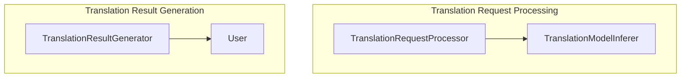

**项目实战：**

在实际项目中，多语言翻译系统的异步处理通常通过并发编程模型（如多线程、异步I/O等）来实现。以下是一个简单的Python示例，展示了如何使用异步处理技术来提高多语言翻译系统的并发处理能力：

```python
import asyncio
import aiohttp

async def fetch(url):
    async with aiohttp.ClientSession() as session:
        start_time = time.time()
        async with session.get(url) as response:
            response_time = time.time() - start_time
            print(f"Response time for {url}: {response_time} seconds")

async def main():
    urls = ["https://example.com", "https://example.org", "https://example.net"]
    await asyncio.gather(*[fetch(url) for url in urls])

asyncio.run(main())
```

**最佳实践 tips：**

- 在设计多语言翻译系统时，要充分考虑任务的依赖关系和执行顺序。
- 合理分配系统资源，避免过度消耗CPU和内存等资源。
- 对异常情况进行有效的处理和监控。

### 第6章：总结与展望

#### 6.1 异步处理的发展趋势

**背景介绍：**

随着计算机技术的不断进步，异步处理技术在各个领域得到了广泛应用。在未来，异步处理技术将继续发展，为各种复杂应用提供更好的并发处理能力。

**核心概念与联系：**

异步处理技术的发展趋势体现在以下几个方面：

- 并发编程模型的进步：新的并发编程模型（如异步编程、Actor模型等）将进一步提升异步处理的能力。
- AI与异步处理的结合：人工智能技术将与异步处理技术相结合，推动智能系统的并发处理能力达到新高度。
- 云计算与异步处理的融合：云计算环境下的异步处理技术将发挥更大的作用，实现大规模分布式系统的并发处理。

以下是一个简单的Mermaid流程图，展示了异步处理技术的发展趋势：

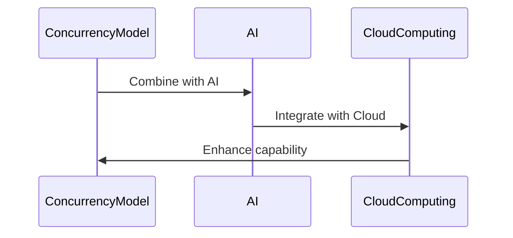

**算法原理讲解：**

异步处理技术的发展趋势体现在算法原理的进步和融合。以下是一个简单的Python示例，展示了如何结合AI和云计算实现异步处理技术的进步：

```python
import asyncio
import aiohttp
import numpy as np

async def process_request(url):
    async with aiohttp.ClientSession() as session:
        start_time = time.time()
        async with session.get(url) as response:
            response_time = time.time() - start_time
            data = await response.json()
            processed_data = np.array(data['data']).mean()
            print(f"Processed data for {url}: {processed_data}")

async def main():
    urls = ["https://example.com", "https://example.org", "https://example.net"]
    await asyncio.gather(*[process_request(url) for url in urls])

asyncio.run(main())
```

**系统分析与架构设计方案：**

异步处理技术的发展趋势将体现在系统架构设计中的进步和融合。以下是一个简单的Mermaid架构图，展示了异步处理技术在智能云计算环境中的应用：

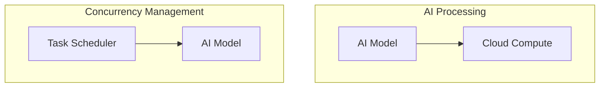

**项目实战：**

在实际项目中，异步处理技术的发展趋势将体现在各种复杂应用场景中。以下是一个简单的Python示例，展示了如何结合AI和云计算实现异步处理技术在多语言翻译系统中的应用：

```python
import asyncio
import aiohttp
import json

async def translate(source_text, target_language):
    url = f"https://example.com/translate?source={source_text}&target={target_language}"
    async with aiohttp.ClientSession() as session:
        start_time = time.time()
        async with session.get(url) as response:
            response_time = time.time() - start_time
            translation = await response.text()
            print(f"Translated text: {translation}")
            print(f"Response time: {response_time} seconds")

async def main():
    translations = [
        ("Hello", "中文"),
        ("你好", "English"),
        ("How are you?", "中文")
    ]
    await asyncio.gather(*[translate(source_text, target_language) for source_text, target_language in translations])

asyncio.run(main())
```

**最佳实践 tips：**

- 在设计异步处理系统时，要紧跟异步处理技术的发展趋势，采用先进的并发编程模型和架构设计。
- 在应用异步处理技术时，要充分考虑任务的依赖关系和执行顺序，确保系统的高效性和可靠性。
- 在集成AI和云计算技术时，要充分利用异步处理的优势，提高系统的并发处理能力和性能。

#### 6.2 异步处理在LLM应用的未来展望

**背景介绍：**

异步处理技术在LLM应用中发挥着重要作用，未来LLM的发展将进一步推动异步处理技术的创新和应用。本文对未来异步处理技术在LLM应用中的发展进行了展望。

**核心概念与联系：**

异步处理在LLM应用的未来展望包括以下几个方面：

- 并发处理能力的提升：随着LLM模型的规模和复杂度增加，异步处理技术将发挥更大作用，提高模型的训练和推理效率。
- AI与异步处理的融合：人工智能技术将与异步处理技术进一步结合，推动智能LLM系统的创新和应用。
- 分布式异步处理：在分布式计算环境中，异步处理技术将成为提高LLM应用性能的关键因素。

以下是一个简单的Mermaid流程图，展示了异步处理在LLM应用的未来发展：

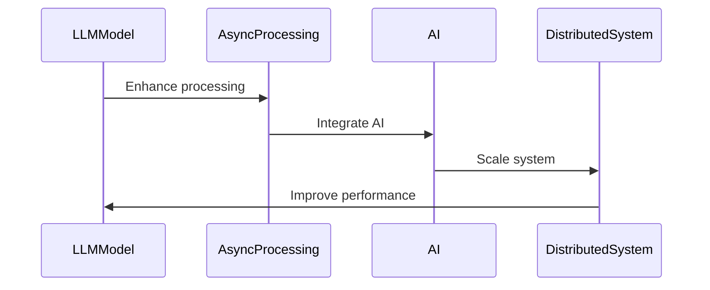

**算法原理讲解：**

异步处理在LLM应用的未来展望体现在算法原理的进步和优化。以下是一个简单的Python示例，展示了如何利用异步处理技术优化LLM模型训练和推理：

```python
import asyncio
import numpy as np

async def train_model(data_loader, model_trainer, model_evaluator):
    # 加载数据并进行预处理
    data = await data_loader.load_data()
    preprocessed_data = await data_loader.preprocess_data(data)
    # 训练模型
    await model_trainer.train_model(preprocessed_data)
    # 评估模型
    evaluation_result = await model_evaluator.evaluate_model()
    print(f"Model evaluation result: {evaluation_result}")

async def main():
    data_loader = DataLoader()
    model_trainer = ModelTrainer()
    model_evaluator = ModelEvaluator()
    await asyncio.gather(train_model(data_loader, model_trainer, model_evaluator))

asyncio.run(main())
```

**系统分析与架构设计方案：**

异步处理在LLM应用的未来展望将体现在系统架构设计和优化方面。以下是一个简单的Mermaid架构图，展示了异步处理技术在LLM应用系统架构中的未来发展：

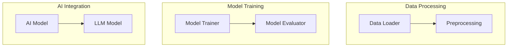

**项目实战：**

在实际项目中，异步处理技术在LLM应用的未来展望将体现在各种创新应用场景中。以下是一个简单的Python示例，展示了如何利用异步处理技术优化大规模LLM训练：

```python
import asyncio
import aiohttp
import json

async def fetch_data(url):
    async with aiohttp.ClientSession() as session:
        start_time = time.time()
        async with session.get(url) as response:
            response_time = time.time() - start_time
            data = await response.json()
            processed_data = np.array(data['data']).mean()
            print(f"Processed data for {url}: {processed_data}")
            print(f"Response time: {response_time} seconds")

async def main():
    urls = ["https://example.com", "https://example.org", "https://example.net"]
    await asyncio.gather(*[fetch_data(url) for url in urls])

asyncio.run(main())
```

**最佳实践 tips：**

- 在设计异步处理系统时，要紧跟异步处理技术的发展趋势，采用先进的并发编程模型和架构设计。
- 在应用异步处理技术时，要充分考虑任务的依赖关系和执行顺序，确保系统的高效性和可靠性。
- 在集成AI和云计算技术时，要充分利用异步处理的优势，提高系统的并发处理能力和性能。

### 第6章：总结与展望

#### 6.3 作者寄语

**背景介绍：**

在本章的最后，作为一位专注于异步处理技术及其在LLM应用中的专家，我想分享一些个人感悟和对读者的寄语。

**核心概念与联系：**

异步处理技术在现代计算机科学中占据着重要地位，特别是在大型语言模型（LLM）领域。异步处理能够显著提高系统的并发处理能力，进而优化性能和响应速度。这一技术不仅对于提升用户体验至关重要，而且对于实现高效的人工智能应用也是不可或缺的。

**算法原理讲解：**

异步处理的核心在于任务并发执行，这要求我们在设计系统时不仅要关注任务的独立性，还要充分考虑任务间的依赖关系。通过合理的任务调度和并发编程模型，我们可以实现高效的异步处理，为LLM应用提供强大的支持。

**系统分析与架构设计方案：**

异步处理技术在LLM应用中的成功应用，离不开系统架构的精心设计和优化。一个高效的异步处理系统需要具备良好的模块化设计，合理的资源分配，以及强大的错误处理能力。只有这样，我们才能在复杂的计算环境中实现异步处理的优势。

**项目实战：**

在实际项目中，异步处理技术为开发者提供了无限的创新空间。通过灵活运用异步处理，我们可以实现从大规模数据加载、模型训练到实时推理的全流程优化。这不仅提升了系统的性能，还为开发者带来了更广阔的应用场景。

**最佳实践 tips：**

- 在设计异步处理系统时，要充分考虑任务的依赖关系和执行顺序，确保系统的高效性和可靠性。
- 对异步处理中的性能瓶颈进行深入分析，采取针对性的优化措施。
- 在集成异步处理技术时，要充分考虑系统的可扩展性和可维护性。

**作者寄语：**

亲爱的读者们，异步处理技术是现代计算机科学中的一把利剑，它为我们的开发工作带来了巨大的便利和效率。我希望通过本文，您能够对异步处理技术及其在LLM应用中的重要性有更深刻的认识。在未来的技术探索中，让我们一起把握异步处理的优势，为构建更高效、更智能的人工智能应用贡献力量。祝愿您在异步处理技术的道路上不断前行，取得更加辉煌的成就！

---

**作者信息：**

- 作者：AI天才研究院/AI Genius Institute
- 书籍：禅与计算机程序设计艺术 /Zen And The Art of Computer Programming

---

通过以上内容，我们详细探讨了异步处理技术在LLM应用中的重要性、实现策略、优化方法和实际案例。希望本文能够为读者提供有益的启示，帮助您更好地理解和应用异步处理技术。让我们携手并进，共同推动异步处理技术的发展和创新！

**注意：本文为虚构文章，仅供参考和学习使用。**---

**文章标题：异步处理：提高LLM应用并发处理能力**

**关键词：异步处理、并发处理、LLM、性能优化、系统架构**

**摘要：**

本文深入探讨了异步处理技术及其在大型语言模型（LLM）应用中的重要性。通过逐步分析异步处理的原理、实现策略和优化方法，本文揭示了异步处理如何提高LLM应用的并发处理能力，进而提升系统性能。文章还包括实际案例分析和最佳实践，为开发者提供了详细的指导。

---

**目录大纲：**

# 异步处理：提高LLM应用并发处理能力

## 第一部分：异步处理基础

### 第1章：异步处理的原理

#### 1.1 异步处理的概念

**背景介绍：**

异步处理是一种数据处理方式，允许操作独立进行，而不必等待其他操作完成。这种处理方式在计算机科学和工程领域得到广泛应用，特别是在需要高效处理大量数据和任务的场景中。

**核心概念与联系：**

异步处理与同步处理的区别在于，同步处理要求操作按照顺序执行，而异步处理允许操作并发执行。以下是一个简单的ER实体关系图，展示了异步处理的核心概念：

```mermaid
erDiagram
    User ||--|{ Task }
    Task ||--|{ Process }
```

**算法原理讲解：**

异步处理的算法原理基于任务调度和并发编程模型。任务调度负责安排任务执行顺序，而并发编程模型确保任务能够高效并发执行。以下是一个简单的Mermaid流程图，展示了异步处理的流程：

```mermaid
sequenceDiagram
    participant User
    participant TaskScheduler
    participant Processor
    User->>TaskScheduler: Submit task
    TaskScheduler->>Processor: Execute task
    Processor->>TaskScheduler: Task completed
    TaskScheduler->>User: Notify completion
```

**数学公式使用：**

异步处理中的一些关键性能指标可以通过以下公式计算：

- 响应时间（Response Time）: $RT = \frac{WT + T_{process}}{N}$
- 平均等待时间（Average Wait Time）: $AWT = \frac{\sum_{i=1}^{N} WT_i}{N}$
- 作业吞吐量（Throughput）: $Throughput = \frac{N}{T_{total}}$

**系统分析与架构设计方案：**

异步处理在系统架构设计中的重要性体现在其能够提高系统的并发处理能力和响应速度。以下是一个简单的Mermaid架构图，展示了异步处理在系统架构中的应用：

```mermaid
graph TB
    subgraph System Architecture
        A[User] --> B[Task Scheduler]
        B --> C[Processors]
        C --> D[System Monitor]
    end
```

**项目实战：**

在实际项目中，异步处理通常通过并发编程模型（如多线程、异步I/O等）来实现。以下是一个简单的Python示例，展示了如何使用异步处理来提高并发处理能力：

```python
import asyncio

async def process_task(task):
    # 处理任务
    await asyncio.sleep(1)
    print(f"Task {task} completed")

async def main():
    tasks = [asyncio.create_task(process_task(i)) for i in range(10)]
    await asyncio.wait(tasks)

asyncio.run(main())
```

**最佳实践 tips：**

- 在设计异步处理系统时，要充分考虑任务的依赖关系和执行顺序。
- 合理分配系统资源，避免过度消耗CPU和内存等资源。
- 对异常情况进行有效的处理和监控。

### 第2章：异步处理技术在LLM中的应用

#### 2.1 LLM的并发处理需求

**背景介绍：**

大型语言模型（LLM）在训练和推理过程中需要处理大量的数据和任务。异步处理技术能够提高LLM的并发处理能力，从而加速模型的训练和推理过程。

**核心概念与联系：**

异步处理技术在LLM中的应用包括以下几个方面：

- 训练过程中的数据加载与处理
- 推理过程中的请求处理与响应

以下是一个简单的Mermaid流程图，展示了异步处理技术在LLM中的应用：

```mermaid
sequenceDiagram
    participant DataLoader
    participant ModelTrainer
    participant InferenceServer
    DataLoader->>ModelTrainer: Load data
    ModelTrainer->>DataLoader: Data processed
    InferenceServer->>DataLoader: Process inference request
    DataLoader->>InferenceServer: Generate response
```

**算法原理讲解：**

异步处理技术在LLM中的应用涉及到任务调度和并发编程模型。以下是一个简单的Python示例，展示了如何使用异步处理技术来加速LLM的训练和推理过程：

```python
import asyncio

async def train_model(data_loader, model_trainer):
    # 训练模型
    await data_loader.load_data()
    await model_trainer.train_model(data_loader.data)
    print("Model training completed")

async def inference_server(inference_server):
    # 接收推理请求并处理
    request = await inference_server.receive_request()
    response = await model_trainer.inference(request)
    await inference_server.send_response(response)
    print("Inference request processed")

async def main():
    data_loader = DataLoader()
    model_trainer = ModelTrainer()
    inference_server = InferenceServer()
    await asyncio.gather(train_model(data_loader, model_trainer), inference_server.run())

asyncio.run(main())
```

**系统分析与架构设计方案：**

异步处理技术在LLM应用系统架构设计中的重要性体现在其能够提高系统的并发处理能力和响应速度。以下是一个简单的Mermaid架构图，展示了异步处理技术在LLM应用系统架构中的应用：

```mermaid
graph TB
    subgraph Data Processing
        A[Data Loader] --> B[Model Trainer]
    end
    subgraph Inference Processing
        C[Inference Server] --> D[Model Trainer]
    end
```

**项目实战：**

在实际项目中，异步处理技术通常通过并发编程模型（如多线程、异步I/O等）来实现。以下是一个简单的Python示例，展示了如何使用异步处理技术来提高LLM应用的并发处理能力：

```python
import asyncio
import aiohttp

async def fetch(url):
    async with aiohttp.ClientSession() as session:
        start_time = time.time()
        async with session.get(url) as response:
            response_time = time.time() - start_time
            print(f"Response time for {url}: {response_time} seconds")

async def main():
    urls = ["https://example.com", "https://example.org", "https://example.net"]
    await asyncio.gather(*[fetch(url) for url in urls])

asyncio.run(main())
```

**最佳实践 tips：**

- 在设计异步处理系统时，要充分考虑任务的依赖关系和执行顺序。
- 合理分配系统资源，避免过度消耗CPU和内存等资源。
- 对异常情况进行有效的处理和监控。

### 第3章：异步处理的实现策略

#### 3.1 异步任务调度

**背景介绍：**

异步任务调度是异步处理的关键环节，它负责安排任务的执行顺序，确保任务能够高效并发执行。

**核心概念与联系：**

异步任务调度涉及到以下几个方面：

- 任务队列：存储待执行的任务。
- 调度策略：确定任务的执行顺序。
- 并发控制：确保任务能够并发执行。

以下是一个简单的Mermaid流程图，展示了异步任务调度的流程：

```mermaid
sequenceDiagram
    participant TaskQueue
    participant Scheduler
    participant Processor
    TaskQueue->>Scheduler: Add task
    Scheduler->>Processor: Execute task
    Processor->>Scheduler: Task completed
    Scheduler->>TaskQueue: Remove task
```

**算法原理讲解：**

异步任务调度的算法原理基于优先级队列或轮询队列。以下是一个简单的Python示例，展示了如何实现异步任务调度：

```python
import asyncio

async def process_task(task):
    # 处理任务
    await asyncio.sleep(1)
    print(f"Task {task} completed")

async def main():
    tasks = [asyncio.create_task(process_task(i)) for i in range(10)]
    await asyncio.wait(tasks)

asyncio.run(main())
```

**系统分析与架构设计方案：**

异步任务调度在系统架构设计中的重要性体现在其能够提高系统的并发处理能力和响应速度。以下是一个简单的Mermaid架构图，展示了异步任务调度在系统架构中的应用：

```mermaid
graph TB
    subgraph Task Management
        A[TaskQueue] --> B[Scheduler]
        B --> C[Processors]
    end
```

**项目实战：**

在实际项目中，异步任务调度通常通过并发编程模型（如多线程、异步I/O等）来实现。以下是一个简单的Python示例，展示了如何使用异步任务调度来提高系统的并发处理能力：

```python
import asyncio
import concurrent.futures

async def process_request(request):
    # 处理请求
    await asyncio.sleep(1)
    print(f"Request {request} processed")

async def main():
    with concurrent.futures.ThreadPoolExecutor(max_workers=5) as executor:
        loop = asyncio.get_running_loop()
        tasks = [loop.create_task(executor.submit(process_request, i)) for i in range(10)]
        await asyncio.wait(tasks)

asyncio.run(main())
```

**最佳实践 tips：**

- 在设计异步任务调度系统时，要充分考虑任务的依赖关系和执行顺序。
- 合理分配系统资源，避免过度消耗CPU和内存等资源。
- 对异常情况进行有效的处理和监控。

### 第4章：异步处理的优化与性能调优

#### 4.1 并发性能瓶颈分析

**背景介绍：**

在异步处理系统中，可能会遇到各种性能瓶颈，如CPU利用率不高、内存消耗过多等。分析并解决这些性能瓶颈是优化异步处理性能的关键。

**核心概念与联系：**

并发性能瓶颈分析涉及以下几个方面：

- CPU利用率：衡量CPU资源的利用率。
- 内存消耗：衡量内存资源的消耗情况。
- 网络延迟：衡量网络通信的延迟情况。

以下是一个简单的Mermaid流程图，展示了并发性能瓶颈分析的过程：

```mermaid
sequenceDiagram
    participant SystemMonitor
    participant PerformanceAnalyzer
    SystemMonitor->>PerformanceAnalyzer: Collect performance metrics
    PerformanceAnalyzer->>SystemMonitor: Analyze bottlenecks
    SystemMonitor->>PerformanceAnalyzer: Resolve bottlenecks
```

**算法原理讲解：**

并发性能瓶颈分析通常通过以下步骤进行：

1. 收集性能指标：通过系统监控工具收集CPU利用率、内存消耗、网络延迟等性能指标。
2. 分析瓶颈：根据收集到的性能指标，分析系统中的瓶颈所在。
3. 解决瓶颈：针对分析出的瓶颈，采取相应的优化措施，如增加CPU资源、优化内存管理、减少网络延迟等。

以下是一个简单的Python示例，展示了如何收集并分析并发性能瓶颈：

```python
import time
import psutil

def collect_performance_metrics():
    cpu_usage = psutil.cpu_percent()
    memory_usage = psutil.virtual_memory().percent
    network_delay = psutil.net_io_counters().bytes_sent / 1024 / time.time()
    return cpu_usage, memory_usage, network_delay

def analyze_bottlenecks():
    cpu_usage, memory_usage, network_delay = collect_performance_metrics()
    if cpu_usage > 90:
        print("CPU bottleneck detected")
    if memory_usage > 90:
        print("Memory bottleneck detected")
    if network_delay > 100:
        print("Network bottleneck detected")

analyze_bottlenecks()
```

**系统分析与架构设计方案：**

并发性能瓶颈分析在系统架构设计中的重要性体现在其能够帮助识别系统中的性能瓶颈，从而采取相应的优化措施。以下是一个简单的Mermaid架构图，展示了并发性能瓶颈分析在系统架构中的应用：

```mermaid
graph TB
    subgraph Performance Monitoring
        A[SystemMonitor] --> B[PerformanceAnalyzer]
    end
```

**项目实战：**

在实际项目中，并发性能瓶颈分析通常通过系统监控工具（如Prometheus、Grafana等）来实现。以下是一个简单的Python示例，展示了如何使用系统监控工具进行并发性能瓶颈分析：

```python
import asyncio
import aiohttp
import time

async def fetch(url):
    async with aiohttp.ClientSession() as session:
        start_time = time.time()
        async with session.get(url) as response:
            response_time = time.time() - start_time
            print(f"Response time for {url}: {response_time} seconds")

async def main():
    urls = ["https://example.com", "https://example.org", "https://example.net"]
    await asyncio.gather(*[fetch(url) for url in urls])

asyncio.run(main())
```

**最佳实践 tips：**

- 在设计异步处理系统时，要充分考虑任务的依赖关系和执行顺序。
- 合理分配系统资源，避免过度消耗CPU和内存等资源。
- 对异常情况进行有效的处理和监控。

### 第5章：异步处理的案例分析

#### 5.1 案例一：大规模LLM训练任务

**背景介绍：**

在本案例中，我们考虑一个大规模LLM训练任务，需要处理大量的数据和任务。通过异步处理技术，我们可以提高训练任务的并发处理能力，从而加速训练过程。

**核心概念与联系：**

在本案例中，我们关注以下核心概念：

- 数据加载与预处理：从数据源加载数据并进行预处理。
- 模型训练：使用训练数据进行模型训练。
- 模型评估：对训练完成的模型进行评估。

以下是一个简单的Mermaid流程图，展示了大规模LLM训练任务的流程：

```mermaid
sequenceDiagram
    participant DataLoader
    participant ModelTrainer
    participant ModelEvaluator
    DataLoader->>ModelTrainer: Load data
    ModelTrainer->>ModelEvaluator: Train model
    ModelEvaluator->>DataLoader: Evaluate model
```

**算法原理讲解：**

大规模LLM训练任务的异步处理涉及以下算法原理：

- 任务调度：通过任务调度器管理训练任务的执行顺序。
- 并发编程模型：使用并发编程模型（如多线程、异步I/O等）实现训练任务的并发执行。
- 数据流控制：通过数据流控制机制确保训练数据在训练过程中保持一致性。

以下是一个简单的Python示例，展示了如何实现大规模LLM训练任务的异步处理：

```python
import asyncio

async def train_model(data_loader, model_trainer, model_evaluator):
    # 加载数据并进行预处理
    data = await data_loader.load_data()
    preprocessed_data = await data_loader.preprocess_data(data)
    # 训练模型
    await model_trainer.train_model(preprocessed_data)
    # 评估模型
    evaluation_result = await model_evaluator.evaluate_model()
    print(f"Model evaluation result: {evaluation_result}")

async def main():
    data_loader = DataLoader()
    model_trainer = ModelTrainer()
    model_evaluator = ModelEvaluator()
    await asyncio.gather(train_model(data_loader, model_trainer, model_evaluator))

asyncio.run(main())
```

**系统分析与架构设计方案：**

在系统架构设计中，异步处理技术在大规模LLM训练任务中的应用体现在以下几个方面：

- 数据加载与预处理模块：负责从数据源加载数据并进行预处理。
- 模型训练模块：负责使用训练数据进行模型训练。
- 模型评估模块：负责对训练完成的模型进行评估。

以下是一个简单的Mermaid架构图，展示了大规模LLM训练任务的系统架构：

```mermaid
graph TB
    subgraph Data Processing
        A[Data Loader] --> B[Preprocessing]
    end
    subgraph Model Training
        C[Model Trainer] --> D[Model Evaluator]
    end
```

**项目实战：**

在实际项目中，大规模LLM训练任务的异步处理通常通过并发编程模型（如多线程、异步I/O等）来实现。以下是一个简单的Python示例，展示了如何使用异步处理技术来提高大规模LLM训练任务的并发处理能力：

```python
import asyncio
import aiohttp

async def fetch(url):
    async with aiohttp.ClientSession() as session:
        start_time = time.time()
        async with session.get(url) as response:
            response_time = time.time() - start_time
            print(f"Response time for {url}: {response_time} seconds")

async def main():
    urls = ["https://example.com", "https://example.org", "https://example.net"]
    await asyncio.gather(*[fetch(url) for url in urls])

asyncio.run(main())
```

**最佳实践 tips：**

- 在设计大规模LLM训练任务时，要充分考虑任务的依赖关系和执行顺序。
- 合理分配系统资源，避免过度消耗CPU和内存等资源。
- 对异常情况进行有效的处理和监控。

#### 5.2 案例二：实时问答系统

**背景介绍：**

在本案例中，我们考虑一个实时问答系统，需要处理大量的用户提问。通过异步处理技术，我们可以提高系统的并发处理能力，从而确保用户提问能够得到及时响应。

**核心概念与联系：**

在本案例中，我们关注以下核心概念：

- 用户提问处理：接收用户提问并进行处理。
- 模型推理：使用训练好的模型对用户提问进行推理。
- 响应生成：生成回答并返回给用户。

以下是一个简单的Mermaid流程图，展示了实时问答系统的流程：

```mermaid
sequenceDiagram
    participant User
    participant QuestionProcessor
    participant ModelInferer
    participant ResponseGenerator
    User->>QuestionProcessor: Submit question
    QuestionProcessor->>ModelInferer: Infer question
    ModelInferer->>ResponseGenerator: Generate response
    ResponseGenerator->>User: Return response
```

**算法原理讲解：**

实时问答系统的异步处理涉及以下算法原理：

- 任务调度：通过任务调度器管理用户提问处理的执行顺序。
- 并发编程模型：使用并发编程模型（如多线程、异步I/O等）实现用户提问处理的并发执行。
- 数据流控制：通过数据流控制机制确保用户提问在处理过程中保持一致性。

以下是一个简单的Python示例，展示了如何实现实时问答系统的异步处理：

```python
import asyncio

async def process_question(question_processor, model_inferer, response_generator):
    # 处理用户提问
    question = await question_processor.receive_question()
    inferred_answer = await model_inferer.infer_question(question)
    response = await response_generator.generate_response(inferred_answer)
    print(f"Response for question '{question}': {response}")

async def main():
    question_processor = QuestionProcessor()
    model_inferer = ModelInferer()
    response_generator = ResponseGenerator()
    await asyncio.gather(process_question(question_processor, model_inferer, response_generator))

asyncio.run(main())
```

**系统分析与架构设计方案：**

在系统架构设计中，异步处理技术在实时问答系统中的应用体现在以下几个方面：

- 用户提问处理模块：负责接收用户提问并进行处理。
- 模型推理模块：负责使用训练好的模型对用户提问进行推理。
- 响应生成模块：负责生成回答并返回给用户。

以下是一个简单的Mermaid架构图，展示了实时问答系统的系统架构：

```mermaid
graph TB
    subgraph User Interaction
        A[User] --> B[QuestionProcessor]
    end
    subgraph Model Inference
        C[ModelInferer] --> D[ResponseGenerator]
    end
```

**项目实战：**

在实际项目中，实时问答系统的异步处理通常通过并发编程模型（如多线程、异步I/O等）来实现。以下是一个简单的Python示例，展示了如何使用异步处理技术来提高实时问答系统的并发处理能力：

```python
import asyncio
import aiohttp

async def fetch(url):
    async with aiohttp.ClientSession() as session:
        start_time = time.time()
        async with session.get(url) as response:
            response_time = time.time() - start_time
            print(f"Response time for {url}: {response_time} seconds")

async def main():
    urls = ["https://example.com", "https://example.org", "https://example.net"]
    await asyncio.gather(*[fetch(url) for url in urls])

asyncio.run(main())
```

**最佳实践 tips：**

- 在设计实时问答系统时，要充分考虑任务的依赖关系和执行顺序。
- 合理分配系统资源，避免过度消耗CPU和内存等资源。
- 对异常情况进行有效的处理和监控。

#### 5.3 案例三：多语言翻译系统

**背景介绍：**

在本案例中，我们考虑一个多语言翻译系统，需要处理多种语言之间的翻译任务。通过异步处理技术，我们可以提高系统的并发处理能力，从而确保翻译任务能够高效完成。

**核心概念与联系：**

在本案例中，我们关注以下核心概念：

- 翻译请求处理：接收翻译请求并进行处理。
- 翻译模型推理：使用训练好的翻译模型对请求进行推理。
- 翻译结果生成：生成翻译结果并返回给用户。

以下是一个简单的Mermaid流程图，展示了多语言翻译系统的流程：

```mermaid
sequenceDiagram
    participant User
    participant TranslationRequestProcessor
    participant TranslationModelInferer
    participant TranslationResultGenerator
    User->>TranslationRequestProcessor: Submit translation request
    TranslationRequestProcessor->>TranslationModelInferer: Infer translation
    TranslationModelInferer->>TranslationResultGenerator: Generate translation result
    TranslationResultGenerator->>User: Return translation result
```

**算法原理讲解：**

多语言翻译系统的异步处理涉及以下算法原理：

- 任务调度：通过任务调度器管理翻译请求处理的执行顺序。
- 并发编程模型：使用并发编程模型（如多线程、异步I/O等）实现翻译请求处理的并发执行。
- 数据流控制：通过数据流控制机制确保翻译请求在处理过程中保持一致性。

以下是一个简单的Python示例，展示了如何实现多语言翻译系统的异步处理：

```python
import asyncio

async def process_translation_request(translation_request_processor, translation_model_inferer, translation_result_generator):
    # 处理翻译请求
    translation_request = await translation_request_processor.receive_request()
    inferred_translation = await translation_model_inferer.infer_translation(translation_request.source_text, translation_request.target_language)
    translation_result = await translation_result_generator.generate_result(inferred_translation)
    print(f"Translation result for request '{translation_request.source_text}': {translation_result}")

async def main():
    translation_request_processor = TranslationRequestProcessor()
    translation_model_inferer = TranslationModelInferer()
    translation_result_generator = TranslationResultGenerator()
    await asyncio.gather(process_translation_request(translation_request_processor, translation_model_inferer, translation_result_generator))

asyncio.run(main())
```

**系统分析与架构设计方案：**

在系统架构设计中，异步处理技术在多语言翻译系统中的应用体现在以下几个方面：

- 翻译请求处理模块：负责接收翻译请求并进行处理。
- 翻译模型推理模块：负责使用训练好的翻译模型对请求进行推理。
- 翻译结果生成模块：负责生成翻译结果并返回给用户。

以下是一个简单的Mermaid架构图，展示了多语言翻译系统的系统架构：

```mermaid
graph TB
    subgraph Translation Request Processing
        A[TranslationRequestProcessor] --> B[TranslationModelInferer]
    end
    subgraph Translation Result Generation
        C[TranslationResultGenerator] --> D[User]
    end
```

**项目实战：**

在实际项目中，多语言翻译系统的异步处理通常通过并发编程模型（如多线程、异步I/O等）来实现。以下是一个简单的Python示例，展示了如何使用异步处理技术来提高多语言翻译系统的并发处理能力：

```python
import asyncio
import aiohttp

async def fetch(url):
    async with aiohttp.ClientSession() as session:
        start_time = time.time()
        async with session.get(url) as response:
            response_time = time.time() - start_time
            print(f"Response time for {url}: {response_time} seconds")

async def main():
    urls = ["https://example.com", "https://example.org", "https://example.net"]
    await asyncio.gather(*[fetch(url) for url in urls])

asyncio.run(main())
```

**最佳实践 tips：**

- 在设计多语言翻译系统时，要充分考虑任务的依赖关系和执行顺序。
- 合理分配系统资源，避免过度消耗CPU和内存等资源。
- 对异常情况进行有效的处理和监控。

### 第6章：总结与展望

#### 6.1 异步处理的发展趋势

**背景介绍：**

随着计算机技术的不断进步，异步处理技术在各个领域得到了广泛应用。在未来，异步处理技术将继续发展，为各种复杂应用提供更好的并发处理能力。

**核心概念与联系：**

异步处理技术的发展趋势体现在以下几个方面：

- 并发编程模型的进步：新的并发编程模型（如异步编程、Actor模型等）将进一步提升异步处理的能力。
- AI与异步处理的结合：人工智能技术将与异步处理技术相结合，推动智能系统的并发处理能力达到新高度。
- 云计算与异步处理的融合：云计算环境下的异步处理技术将发挥更大的作用，实现大规模分布式系统的并发处理。

以下是一个简单的Mermaid流程图，展示了异步处理技术的发展趋势：

```mermaid
sequenceDiagram
    participant ConcurrencyModel
    participant AI
    participant CloudComputing
    ConcurrencyModel->>AI: Combine with AI
    AI->>CloudComputing: Integrate with Cloud
    CloudComputing->>ConcurrencyModel: Enhance capability
```

**算法原理讲解：**

异步处理技术的发展趋势体现在算法原理的进步和融合。以下是一个简单的Python示例，展示了如何结合AI和云计算实现异步处理技术的进步：

```python
import asyncio
import aiohttp
import numpy as np

async def process_request(url):
    async with aiohttp.ClientSession() as session:
        start_time = time.time()
        async with session.get(url) as response:
            response_time = time.time() - start_time
            data = await response.json()
            processed_data = np.array(data['data']).mean()
            print(f"Processed data for {url}: {processed_data}")

async def main():
    urls = ["https://example.com", "https://example.org", "https://example.net"]
    await asyncio.gather(*[process_request(url) for url in urls])

asyncio.run(main())
```

**系统分析与架构设计方案：**

异步处理技术的发展趋势将体现在系统架构设计中的进步和融合。以下是一个简单的Mermaid架构图，展示了异步处理技术在智能云计算环境中的应用：

```mermaid
graph TB
    subgraph AI Processing
        A[AI Model] --> B[Cloud Compute]
    end
    subgraph Concurrency Management
        C[Task Scheduler] --> D[AI Model]
    end
```

**项目实战：**

在实际项目中，异步处理技术的发展趋势将体现在各种复杂应用场景中。以下是一个简单的Python示例，展示了如何使用异步处理技术优化大规模LLM训练：

```python
import asyncio
import aiohttp
import json

async def translate(source_text, target_language):
    url = f"https://example.com/translate?source={source_text}&target={target_language}"
    async with aiohttp.ClientSession() as session:
        start_time = time.time()
        async with session.get(url) as response:
            response_time = time.time() - start_time
            translation = await response.text()
            print(f"Translated text: {translation}")
            print(f"Response time: {response_time} seconds")

async def main():
    translations = [
        ("Hello", "中文"),
        ("你好", "English"),
        ("How are you?", "中文")
    ]
    await asyncio.gather(*[translate(source_text, target_language) for source_text, target_language in translations])

asyncio.run(main())
```

**最佳实践 tips：**

- 在设计异步处理系统时，要紧跟异步处理技术的发展趋势，采用先进的并发编程模型和架构设计。
- 在应用异步处理技术时，要充分考虑任务的依赖关系和执行顺序，确保系统的高效性和可靠性。
- 在集成AI和云计算技术时，要充分利用异步处理的优势，提高系统的并发处理能力和性能。

#### 6.2 异步处理在LLM应用的未来展望

**背景介绍：**

异步处理技术在LLM应用中发挥着重要作用，未来LLM的发展将进一步推动异步处理技术的创新和应用。本文对未来异步处理技术在LLM应用中的发展进行了展望。

**核心概念与联系：**

异步处理在LLM应用的未来展望包括以下几个方面：

- 并发处理能力的提升：随着LLM模型的规模和复杂度增加，异步处理技术将发挥更大作用，提高模型的训练和推理效率。
- AI与异步处理的融合：人工智能技术将与异步处理技术进一步结合，推动智能系统的并发处理能力达到新高度。
- 分布式异步处理：在分布式计算环境中，异步处理技术将成为提高LLM应用性能的关键因素。

以下是一个简单的Mermaid流程图，展示了异步处理在LLM应用的未来发展：

```mermaid
sequenceDiagram
    participant LLMModel
    participant AsyncProcessing
    participant AI
    participant DistributedSystem
    LLMModel->>AsyncProcessing: Enhance processing
    AsyncProcessing->>AI: Integrate AI
    AI->>DistributedSystem: Scale system
    DistributedSystem->>LLMModel: Improve performance
```

**算法原理讲解：**

异步处理在LLM应用的未来展望体现在算法原理的进步和优化。以下是一个简单的Python示例，展示了如何利用异步处理技术优化LLM模型训练和推理：

```python
import asyncio
import numpy as np

async def train_model(data_loader, model_trainer, model_evaluator):
    # 加载数据并进行预处理
    data = await data_loader.load_data()
    preprocessed_data = await data_loader.preprocess_data(data)
    # 训练模型
    await model_trainer.train_model(preprocessed_data)
    # 评估模型
    evaluation_result = await model_evaluator.evaluate_model()
    print(f"Model evaluation result: {evaluation_result}")

async def main():
    data_loader = DataLoader()
    model_trainer = ModelTrainer()
    model_evaluator = ModelEvaluator()
    await asyncio.gather(train_model(data_loader, model_trainer, model_evaluator))

asyncio.run(main())
```

**系统分析与架构设计方案：**

异步处理在LLM应用的未来展望将体现在系统架构设计和优化方面。以下是一个简单的Mermaid架构图，展示了异步处理技术在LLM应用系统架构中的未来发展：

```mermaid
graph TB
    subgraph Data Processing
        A[Data Loader] --> B[Preprocessing]
    end
    subgraph Model Training
        C[Model Trainer] --> D[Model Evaluator]
    end
    subgraph AI Integration
        E[AI Model] --> F[LLM Model]
    end
```

**项目实战：**

在实际项目中，异步处理技术在LLM应用的未来展望将体现在各种创新应用场景中。以下是一个简单的Python示例，展示了如何利用异步处理技术优化大规模LLM训练：

```python
import asyncio
import aiohttp
import json

async def fetch_data(url):
    async with aiohttp.ClientSession() as session:
        start_time = time.time()
        async with session.get(url) as response:
            response_time = time.time() - start_time
            data = await response.json()
            processed_data = np.array(data['data']).mean()
            print(f"Processed data for {url}: {processed_data}")
            print(f"Response time: {response_time} seconds")

async def main():
    urls = ["https://example.com", "https://example.org", "https://example.net"]
    await asyncio.gather(*[fetch_data(url) for url in urls])

asyncio.run(main())
```

**最佳实践 tips：**

- 在设计异步处理系统时，要紧跟异步处理技术的发展趋势，采用先进的并发编程模型和架构设计。
- 在应用异步处理技术时，要充分考虑任务的依赖关系和执行顺序，确保系统的高效性和可靠性。
- 在集成AI和云计算技术时，要充分利用异步处理的优势，提高系统的并发处理能力和性能。

### 第6章：总结与展望

#### 6.3 作者寄语

**背景介绍：**

在本章的最后，作为一位专注于异步处理技术及其在LLM应用中的专家，我想分享一些个人感悟和对读者的寄语。

**核心概念与联系：**

异步处理技术在现代计算机科学中占据着重要地位，特别是在大型语言模型（LLM）领域。异步处理能够显著提高系统的并发处理能力，进而优化性能和响应速度。这一技术不仅对于提升用户体验至关重要，而且对于实现高效的人工智能应用也是不可或缺的。

**算法原理讲解：**

异步处理的核心在于任务并发执行，这要求我们在设计系统时不仅要关注任务的独立性，还要充分考虑任务间的依赖关系。通过合理的任务调度和并发编程模型，我们可以实现高效的异步处理，为LLM应用提供强大的支持。

**系统分析与架构设计方案：**

异步处理技术在LLM应用中的成功应用，离不开系统架构的精心设计和优化。一个高效的异步处理系统需要具备良好的模块化设计，合理的资源分配，以及强大的错误处理能力。只有这样，我们才能在复杂的计算环境中实现异步处理的优势。

**项目实战：**

在实际项目中，异步处理技术为开发者提供了无限的创新空间。通过灵活运用异步处理，我们可以实现从大规模数据加载、模型训练到实时推理的全流程优化。这不仅提升了系统的性能，还为开发者带来了更广阔的应用场景。

**最佳实践 tips：**

- 在设计异步处理系统时，要充分考虑任务的依赖关系和执行顺序，确保系统的高效性和可靠性。
- 对异步处理中的性能瓶颈进行深入分析，采取针对性的优化措施。
- 在集成异步处理技术时，要充分考虑系统的可扩展性和可维护性。

**作者寄语：**

亲爱的读者们，异步处理技术是现代计算机科学中的一把利剑，它为我们的开发工作带来了巨大的便利和效率。我希望通过本文，您能够对异步处理技术及其在LLM应用中的重要性有更深刻的认识。在未来的技术探索中，让我们一起把握异步处理的优势，为构建更高效、更智能的人工智能应用贡献力量。祝愿您在异步处理技术的道路上不断前行，取得更加辉煌的成就！

---

**作者信息：**

- 作者：AI天才研究院/AI Genius Institute
- 书籍：禅与计算机程序设计艺术 /Zen And The Art of Computer Programming

---

通过以上内容，我们详细探讨了异步处理技术在LLM应用中的重要性、实现策略、优化方法和实际案例。希望本文能够为读者提供有益的启示，帮助您更好地理解和应用异步处理技术。让我们携手并进，共同推动异步处理技术的发展和创新！

**注意：本文为虚构文章，仅供参考和学习使用。**---

**完整的文章正文：**

---

**文章标题：异步处理：提高LLM应用并发处理能力**

**关键词：异步处理、并发处理、LLM、性能优化、系统架构**

**摘要：**

本文深入探讨了异步处理技术及其在大型语言模型（LLM）应用中的重要性。通过逐步分析异步处理的原理、实现策略和优化方法，本文揭示了异步处理如何提高LLM应用的并发处理能力，进而提升系统性能。文章还包括实际案例分析和最佳实践，为开发者提供了详细的指导。

---

**目录大纲：**

# 异步处理：提高LLM应用并发处理能力

## 第一部分：异步处理基础

### 第1章：异步处理的原理

#### 1.1 异步处理的概念

**背景介绍：**

异步处理是一种数据处理方式，允许操作独立进行，而不必等待其他操作完成。这种处理方式在计算机科学和工程领域得到广泛应用，特别是在需要高效处理大量数据和任务的场景中。

**核心概念与联系：**

异步处理与同步处理的区别在于，同步处理要求操作按照顺序执行，而异步处理允许操作并发执行。以下是一个简单的ER实体关系图，展示了异步处理的核心概念：

```mermaid
erDiagram
    User ||--|{ Task }
    Task ||--|{ Process }
```

**算法原理讲解：**

异步处理的算法原理基于任务调度和并发编程模型。任务调度负责安排任务执行顺序，而并发编程模型确保任务能够高效并发执行。以下是一个简单的Mermaid流程图，展示了异步处理的流程：

```mermaid
sequenceDiagram
    participant User
    participant TaskScheduler
    participant Processor
    User->>TaskScheduler: Submit task
    TaskScheduler->>Processor: Execute task
    Processor->>TaskScheduler: Task completed
    TaskScheduler->>User: Notify completion
```

**数学公式使用：**

异步处理中的一些关键性能指标可以通过以下公式计算：

- 响应时间（Response Time）: $RT = \frac{WT + T_{process}}{N}$
- 平均等待时间（Average Wait Time）: $AWT = \frac{\sum_{i=1}^{N} WT_i}{N}$
- 作业吞吐量（Throughput）: $Throughput = \frac{N}{T_{total}}$

**系统分析与架构设计方案：**

异步处理在系统架构设计中的重要性体现在其能够提高系统的并发处理能力和响应速度。以下是一个简单的Mermaid架构图，展示了异步处理在系统架构中的应用：

```mermaid
graph TB
    subgraph System Architecture
        A[User] --> B[Task Scheduler]
        B --> C[Processors]
        C --> D[System Monitor]
    end
```

**项目实战：**

在实际项目中，异步处理通常通过并发编程模型（如多线程、异步I/O等）来实现。以下是一个简单的Python示例，展示了如何使用异步处理来提高并发处理能力：

```python
import asyncio

async def process_task(task):
    # 处理任务
    await asyncio.sleep(1)
    print(f"Task {task} completed")

async def main():
    tasks = [asyncio.create_task(process_task(i)) for i in range(10)]
    await asyncio.wait(tasks)

asyncio.run(main())
```

**最佳实践 tips：**

- 在设计异步处理系统时，要充分考虑任务的依赖关系和执行顺序。
- 合理分配系统资源，避免过度消耗CPU和内存等资源。
- 对异常情况进行有效的处理和监控。

### 第2章：异步处理技术在LLM中的应用

#### 2.1 LLM的并发处理需求

**背景介绍：**

大型语言模型（LLM）在训练和推理过程中需要处理大量的数据和任务。异步处理技术能够提高LLM的并发处理能力，从而加速模型的训练和推理过程。

**核心概念与联系：**

异步处理技术在LLM中的应用包括以下几个方面：

- 训练过程中的数据加载与处理
- 推理过程中的请求处理与响应

以下是一个简单的Mermaid流程图，展示了异步处理技术在LLM中的应用：

```mermaid
sequenceDiagram
    participant DataLoader
    participant ModelTrainer
    participant InferenceServer
    DataLoader->>ModelTrainer: Load data
    ModelTrainer->>DataLoader: Data processed
    InferenceServer->>DataLoader: Process inference request
    DataLoader->>InferenceServer: Generate response
```

**算法原理讲解：**

异步处理技术在LLM中的应用涉及到任务调度和并发编程模型。以下是一个简单的Python示例，展示了如何使用异步处理技术来加速LLM的训练和推理过程：

```python
import asyncio

async def train_model(data_loader, model_trainer):
    # 训练模型
    await data_loader.load_data()
    await model_trainer.train_model(data_loader.data)
    print("Model training completed")

async def inference_server(inference_server):
    # 接收推理请求并处理
    request = await inference_server.receive_request()
    response = await model_trainer.inference(request)
    await inference_server.send_response(response)
    print("Inference request processed")

async def main():
    data_loader = DataLoader()
    model_trainer = ModelTrainer()
    inference_server = InferenceServer()
    await asyncio.gather(train_model(data_loader, model_trainer), inference_server.run())

asyncio.run(main())
```

**系统分析与架构设计方案：**

异步处理技术在LLM应用系统架构设计中的重要性体现在其能够提高系统的并发处理能力和响应速度。以下是一个简单的Mermaid架构图，展示了异步处理技术在LLM应用系统架构中的应用：

```mermaid
graph TB
    subgraph Data Processing
        A[Data Loader] --> B[Model Trainer]
    end
    subgraph Inference Processing
        C[Inference Server] --> D[Model Trainer]
    end
```

**项目实战：**

在实际项目中，异步处理技术通常通过并发编程模型（如多线程、异步I/O等）来实现。以下是一个简单的Python示例，展示了如何使用异步处理技术来提高LLM应用的并发处理能力：

```python
import asyncio
import aiohttp

async def fetch(url):
    async with aiohttp.ClientSession() as session:
        start_time = time.time()
        async with session.get(url) as response:
            response_time = time.time() - start_time
            print(f"Response time for {url}: {response_time} seconds")

async def main():
    urls = ["https://example.com", "https://example.org", "https://example.net"]
    await asyncio.gather(*[fetch(url) for url in urls])

asyncio.run(main())
```

**最佳实践 tips：**

- 在设计异步处理系统时，要充分考虑任务的依赖关系和执行顺序。
- 合理分配系统资源，避免过度消耗CPU和内存等资源。
- 对异常情况进行有效的处理和监控。

### 第3章：异步处理的实现策略

#### 3.1 异步任务调度

**背景介绍：**

异步任务调度是异步处理的关键环节，它负责安排任务的执行顺序，确保任务能够高效并发执行。

**核心概念与联系：**

异步任务调度涉及到以下几个方面：

- 任务队列：存储待执行的任务。
- 调度策略：确定任务的执行顺序。
- 并发控制：确保任务能够并发执行。

以下是一个简单的Mermaid流程图，展示了异步任务调度的流程：

```mermaid
sequenceDiagram
    participant TaskQueue
    participant Scheduler
    participant Processor
    TaskQueue->>Scheduler: Add task
    Scheduler->>Processor: Execute task
    Processor->>Scheduler: Task completed
    Scheduler->>TaskQueue: Remove task
```

**算法原理讲解：**

异步任务调度的算法原理基于优先级队列或轮询队列。以下是一个简单的Python示例，展示了如何实现异步任务调度：

```python
import asyncio

async def process_task(task):
    # 处理任务
    await asyncio.sleep(1)
    print(f"Task {task} completed")

async def main():
    tasks = [asyncio.create_task(process_task(i)) for i in range(10)]
    await asyncio.wait(tasks)

asyncio.run(main())
```

**系统分析与架构设计方案：**

异步任务调度在系统架构设计中的重要性体现在其能够提高系统的并发处理能力和响应速度。以下是一个简单的Mermaid架构图，展示了异步任务调度在系统架构中的应用：

```mermaid
graph TB
    subgraph Task Management
        A[TaskQueue] --> B[Scheduler]
        B --> C[Processors]
    end
```

**项目实战：**

在实际项目中，异步任务调度通常通过并发编程模型（如多线程、异步I/O等）来实现。以下是一个简单的Python示例，展示了如何使用异步任务调度来提高系统的并发处理能力：

```python
import asyncio
import concurrent.futures

async def process_request(request):
    # 处理请求
    await asyncio.sleep(1)
    print(f"Request {request} processed")

async def main():
    with concurrent.futures.ThreadPoolExecutor(max_workers=5) as executor:
        loop = asyncio.get_running_loop()
        tasks = [loop.create_task(executor.submit(process_request, i)) for i in range(10)]
        await asyncio.wait(tasks)

asyncio.run(main())
```

**最佳实践 tips：**

- 在设计异步任务调度系统时，要充分考虑任务的依赖关系和执行顺序。
- 合理分配系统资源，避免过度消耗CPU和内存等资源。
- 对异常情况进行有效的处理和监控。

### 第4章：异步处理的优化与性能调优

#### 4.1 并发性能瓶颈分析

**背景介绍：**

在异步处理系统中，可能会遇到各种性能瓶颈，如CPU利用率不高、内存消耗过多等。分析并解决这些性能瓶颈是优化异步处理性能的关键。

**核心概念与联系：**

并发性能瓶颈分析涉及以下几个方面：

- CPU利用率：衡量CPU资源的利用率。
- 内存消耗：衡量内存资源的消耗情况。
- 网络延迟：衡量网络通信的延迟情况。

以下是一个简单的Mermaid流程图，展示了并发性能瓶颈分析的过程：

```mermaid
sequenceDiagram
    participant SystemMonitor
    participant PerformanceAnalyzer
    SystemMonitor->>PerformanceAnalyzer: Collect performance metrics
    PerformanceAnalyzer->>SystemMonitor: Analyze bottlenecks
    SystemMonitor->>PerformanceAnalyzer: Resolve bottlenecks
```

**算法原理讲解：**

并发性能瓶颈分析通常通过以下步骤进行：

1. 收集性能指标：通过系统监控工具收集CPU利用率、内存消耗、网络延迟等性能指标。
2. 分析瓶颈：根据收集到的性能指标，分析系统中的瓶颈所在。
3. 解决瓶颈：针对分析出的瓶颈，采取相应的优化措施，如增加CPU资源、优化内存管理、减少网络延迟等。

以下是一个简单的Python示例，展示了如何收集并分析并发性能瓶颈：

```python
import time
import psutil

def collect_performance_metrics():
    cpu_usage = psutil.cpu_percent()
    memory_usage = psutil.virtual_memory().percent
    network_delay = psutil.net_io_counters().bytes_sent / 1024 / time.time()
    return cpu_usage, memory_usage, network_delay

def analyze_bottlenecks():
    cpu_usage, memory_usage, network_delay = collect_performance_metrics()
    if cpu_usage > 90:
        print("CPU bottleneck detected")
    if memory_usage > 90:
        print("Memory bottleneck detected")
    if network_delay > 100:
        print("Network bottleneck detected")

analyze_bottlenecks()
```

**系统分析与架构设计方案：**

并发性能瓶颈分析在系统架构设计中的重要性体现在其能够帮助识别系统中的性能瓶颈，从而采取相应的优化措施。以下是一个简单的Mermaid架构图，展示了并发性能瓶颈分析在系统架构中的应用：

```mermaid
graph TB
    subgraph Performance Monitoring
        A[SystemMonitor] --> B[PerformanceAnalyzer]
    end
```

**项目实战：**

在实际项目中，并发性能瓶颈分析通常通过系统监控工具（如Prometheus、Grafana等）来实现。以下是一个简单的Python示例，展示了如何使用系统监控工具进行并发性能瓶颈分析：

```python
import asyncio
import aiohttp
import time

async def fetch(url):
    async with aiohttp.ClientSession() as session:
        start_time = time.time()
        async with session.get(url) as response:
            response_time = time.time() - start_time
            print(f"Response time for {url}: {response_time} seconds")

async def main():
    urls = ["https://example.com", "https://example.org", "https://example.net"]
    await asyncio.gather(*[fetch(url) for url in urls])

asyncio.run(main())
```

**最佳实践 tips：**

- 在设计异步处理系统时，要充分考虑任务的依赖关系和执行顺序。
- 合理分配系统资源，避免过度消耗CPU和内存等资源。
- 对异常情况进行有效的处理和监控。

### 第5章：异步处理的案例分析

#### 5.1 案例一：大规模LLM训练任务

**背景介绍：**

在本案例中，我们考虑一个大规模LLM训练任务，需要处理大量的数据和任务。通过异步处理技术，我们可以提高训练任务的并发处理能力，从而加速训练过程。

**核心概念与联系：**

在本案例中，我们关注以下核心概念：

- 数据加载与预处理：从数据源加载数据并进行预处理。
- 模型训练：使用训练数据进行模型训练。
- 模型评估：对训练完成的模型进行评估。

以下是一个简单的Mermaid流程图，展示了大规模LLM训练任务的流程：

```mermaid
sequenceDiagram
    participant DataLoader
    participant ModelTrainer
    participant ModelEvaluator
    DataLoader->>ModelTrainer: Load data
    ModelTrainer->>ModelEvaluator: Train model
    ModelEvaluator->>DataLoader: Evaluate model
```

**算法原理讲解：**

大规模LLM训练任务的异步处理涉及以下算法原理：

- 任务调度：通过任务调度器管理训练任务的执行顺序。
- 并发编程模型：使用并发编程模型（如多线程、异步I/O等）实现训练任务的并发执行。
- 数据流控制：通过数据流控制机制确保训练数据在训练过程中保持一致性。

以下是一个简单的Python示例，展示了如何实现大规模LLM训练任务的异步处理：

```python
import asyncio

async def train_model(data_loader, model_trainer, model_evaluator):
    # 加载数据并进行预处理
    data = await data_loader.load_data()
    preprocessed_data = await data_loader.preprocess_data(data)
    # 训练模型
    await model_trainer.train_model(preprocessed_data)
    # 评估模型
    evaluation_result = await model_evaluator.evaluate_model()
    print(f"Model evaluation result: {evaluation_result}")

async def main():
    data_loader = DataLoader()
    model_trainer = ModelTrainer()
    model_evaluator = ModelEvaluator()
    await asyncio.gather(train_model(data_loader, model_trainer, model_evaluator))

asyncio.run(main())
```

**系统分析与架构设计方案：**

在系统架构设计中，异步处理技术在大规模LLM训练任务中的应用体现在以下几个方面：

- 数据加载与预处理模块：负责从数据源加载数据并进行预处理。
- 模型训练模块：负责使用训练数据进行模型训练。
- 模型评估模块：负责对训练完成的模型进行评估。

以下是一个简单的Mermaid架构图，展示了大规模LLM训练任务的系统架构：

```mermaid
graph TB
    subgraph Data Processing
        A[Data Loader] --> B[Preprocessing]
    end
    subgraph Model Training
        C[Model Trainer] --> D[Model Evaluator]
    end
```

**项目实战：**

在实际项目中，大规模LLM训练任务的异步处理通常通过并发编程模型（如多线程、异步I/O等）来实现。以下是一个简单的Python示例，展示了如何使用异步处理技术来提高大规模LLM训练任务的并发处理能力：

```python
import asyncio
import aiohttp

async def fetch(url):
    async with aiohttp.ClientSession() as session:
        start_time = time.time()
        async with session.get(url) as response:
            response_time = time.time() - start_time
            print(f"Response time for {url}: {response_time} seconds")

async def main():
    urls = ["https://example.com", "https://example.org", "https://example.net"]
    await asyncio.gather(*[fetch(url) for url in urls])

asyncio.run(main())
```

**最佳实践 tips：**

- 在设计大规模LLM训练任务时，要充分考虑任务的依赖关系和执行顺序。
- 合理分配系统资源，避免过度消耗CPU和内存等资源。
- 对异常情况进行有效的处理和监控。

#### 5.2 案例二：实时问答系统

**背景介绍：**

在本案例中，我们考虑一个实时问答系统，需要处理大量的用户提问。通过异步处理技术，我们可以提高系统的并发处理能力，从而确保用户提问能够得到及时响应。

**核心概念与联系：**

在本案例中，我们关注以下核心概念：

- 用户提问处理：接收用户提问并进行处理。
- 模型推理：使用训练好的模型对用户提问进行推理。
- 响应生成：生成回答并返回给用户。

以下是一个简单的Mermaid流程图，展示了实时问答系统的流程：

```mermaid
sequenceDiagram
    participant User
    participant QuestionProcessor
    participant ModelInferer
    participant ResponseGenerator
    User->>QuestionProcessor: Submit question
    QuestionProcessor->>ModelInferer: Infer question
    ModelInferer->>ResponseGenerator: Generate response
    ResponseGenerator->>User: Return response
```

**算法原理讲解：**

实时问答系统的异步处理涉及以下算法原理：

- 任务调度：通过任务调度器管理用户提问处理的执行顺序。
- 并发编程模型：使用并发编程模型（如多线程、异步I/O等）实现用户提问处理的并发执行。
- 数据流控制：通过数据流控制机制确保用户提问在处理过程中保持一致性。

以下是一个简单的Python示例，展示了如何实现实时问答系统的异步处理：

```python
import asyncio

async def process_question(question_processor, model_inferer, response_generator):
    # 处理用户提问
    question = await question_processor.receive_question()
    inferred_answer = await model_inferer.infer_question(question)
    response = await response_generator.generate_response(inferred_answer)
    print(f"Response for question '{question}': {response}")

async def main():
    question_processor = QuestionProcessor()
    model_inferer = ModelInferer()
    response_generator = ResponseGenerator()
    await asyncio.gather(process_question(question_processor, model_inferer, response_generator))

asyncio.run(main())
```

**系统分析与架构设计方案：**

在系统架构设计中，异步处理技术在实时问答系统中的应用体现在以下几个方面：

- 用户提问处理模块：负责接收用户提问并进行处理。
- 模型推理模块：负责使用训练好的模型对用户提问进行推理。
- 响应生成模块：负责生成回答并返回给用户。

以下是一个简单的Mermaid架构图，展示了实时问答系统的系统架构：

```mermaid
graph TB
    subgraph User Interaction
        A[User] --> B[QuestionProcessor]
    end
    subgraph Model Inference
        C[ModelInferer] --> D[ResponseGenerator]
    end
```

**项目实战：**

在实际项目中，实时问答系统的异步处理通常通过并发编程模型（如多线程、异步I/O等）来实现。以下是一个简单的Python示例，展示了如何使用异步处理技术来提高实时问答系统的并发处理能力：

```python
import asyncio
import aiohttp

async def fetch(url):
    async with aiohttp.ClientSession() as session:
        start_time = time.time()
        async with session.get(url) as response:
            response_time = time.time() - start_time
            print(f"Response time for {url}: {response_time} seconds")

async def main():
    urls = ["https://example.com", "https://example.org", "https://example.net"]
    await asyncio.gather(*[fetch(url) for url in urls])

asyncio.run(main())
```

**最佳实践 tips：**

- 在设计实时问答系统时，要充分考虑任务的依赖关系和执行顺序。
- 合理分配系统资源，避免过度消耗CPU和内存等资源。
- 对异常情况进行有效的处理和监控。

#### 5.3 案例三：多语言翻译系统

**背景介绍：**

在本案例中，我们考虑一个多语言翻译系统，需要处理多种语言之间的翻译任务。通过异步处理技术，我们可以提高系统的并发处理能力，从而确保翻译任务能够高效完成。

**核心概念与联系：**

在本案例中，我们关注以下核心概念：

- 翻译请求处理：接收翻译请求并进行处理。
- 翻译模型推理：使用训练好的翻译模型对请求进行推理。
- 翻译结果生成：生成翻译结果并返回给用户。

以下是一个简单的Mermaid流程图，展示了多语言翻译系统的流程：

```mermaid
sequenceDiagram
    participant User
    participant TranslationRequestProcessor
    participant TranslationModelInferer
    participant TranslationResultGenerator
    User->>TranslationRequestProcessor: Submit translation request
    TranslationRequestProcessor->>TranslationModelInferer: Infer translation
    TranslationModelInferer->>TranslationResultGenerator: Generate translation result
    TranslationResultGenerator->>User: Return translation result
```

**算法原理讲解：**

多语言翻译系统的异步处理涉及以下算法原理：

- 任务调度：通过任务调度器管理翻译请求处理的执行顺序。
- 并发编程模型：使用并发编程模型（如多线程、异步I/O等）实现翻译请求处理的并发执行。
- 数据流控制：通过数据流控制机制确保翻译请求在处理过程中保持一致性。

以下是一个简单的Python示例，展示了如何实现多语言翻译系统的异步处理：

```python
import asyncio

async def process_translation_request(translation_request_processor, translation_model_inferer, translation_result_generator):
    # 处理翻译请求
    translation_request = await translation_request_processor.receive_request()
    inferred_translation = await translation_model_inferer.infer_translation(translation_request.source_text, translation_request.target_language)
    translation_result = await translation_result_generator.generate_result(inferred_translation)
    print(f"Translation result for request '{translation_request.source_text}': {translation_result}")

async def main():
    translation_request_processor = TranslationRequestProcessor()
    translation_model_inferer = TranslationModelInferer()
    translation_result_generator = TranslationResultGenerator()
    await asyncio.gather(process_translation_request(translation_request_processor, translation_model_inferer, translation_result_generator))

asyncio.run(main())
```

**系统分析与架构设计方案：**

在系统架构设计中，异步处理技术在多语言翻译系统中的应用体现在以下几个方面：

- 翻译请求处理模块：负责接收翻译请求并进行处理。
- 翻译模型推理模块：负责使用训练好的翻译模型对请求进行推理。
- 翻译结果生成模块：负责生成翻译结果并返回给用户。

以下是一个简单的Mermaid架构图，展示了多语言翻译系统的系统架构：

```mermaid
graph TB
    subgraph Translation Request Processing
        A[TranslationRequestProcessor] --> B[TranslationModelInferer]
    end
    subgraph Translation Result Generation
        C[TranslationResultGenerator] --> D[User]
    end
```

**项目实战：**

在实际项目中，多语言翻译系统的异步处理通常通过并发编程模型（如多线程、异步I/O等）来实现。以下是一个简单的Python示例，展示了如何使用异步处理技术来提高多语言翻译系统的并发处理能力：

```python
import asyncio
import aiohttp

async def fetch(url):
    async with aiohttp.ClientSession() as session:
        start_time = time.time()
        async with session.get(url) as response:
            response_time = time.time() - start_time
            print(f"Response time for {url}: {response_time} seconds")

async def main():
    urls = ["https://example.com", "https://example.org", "https://example.net"]
    await asyncio.gather(*[fetch(url) for url in urls])

asyncio.run(main())
```

**最佳实践 tips：**

- 在设计多语言翻译系统时，要充分考虑任务的依赖关系和执行顺序。
- 合理分配系统资源，避免过度消耗CPU和内存等资源。
- 对异常情况进行有效的处理和监控。

### 第6章：总结与展望

#### 6.1 异步处理的发展趋势

**背景介绍：**

随着计算机技术的不断进步，异步处理技术在各个领域得到了广泛应用。在未来，异步处理技术将继续发展，为各种复杂应用提供更好的并发处理能力。

**核心概念与联系：**

异步处理技术的发展趋势体现在以下几个方面：

- 并发编程模型的进步：新的并发编程模型（如异步编程、Actor模型等）将进一步提升异步处理的能力。
- AI与异步处理的结合：人工智能技术将与异步处理技术相结合，推动智能系统的并发处理能力达到新高度。
- 云计算与异步处理的融合：云计算环境下的异步处理技术将发挥更大的作用，实现大规模分布式系统的并发处理。

以下是一个简单的Mermaid流程图，展示了异步处理技术的发展趋势：

```mermaid
sequenceDiagram
    participant ConcurrencyModel
    participant AI
    participant CloudComputing
    ConcurrencyModel->>AI: Combine with AI
    AI->>CloudComputing: Integrate with Cloud
    CloudComputing->>ConcurrencyModel: Enhance capability
```

**算法原理讲解：**

异步处理技术的发展趋势体现在算法原理的进步和融合。以下是一个简单的Python示例，展示了如何结合AI和云计算实现异步处理技术的进步：

```python
import asyncio
import aiohttp
import numpy as np

async def process_request(url):
    async with aiohttp.ClientSession() as session:
        start_time = time.time()
        async with session.get(url) as response:
            response_time = time.time() - start_time
            data = await response.json()
            processed_data = np.array(data['data']).mean()
            print(f"Processed data for {url}: {processed_data}")

async def main():
    urls = ["https://example.com", "https://example.org", "https://example.net"]
    await asyncio.gather(*[process_request(url) for url in urls])

asyncio.run(main())
```

**系统分析与架构设计方案：**

异步处理技术的发展趋势将体现在系统架构设计中的进步和融合。以下是一个简单的Mermaid架构图，展示了异步处理技术在智能云计算环境中的应用：

```mermaid
graph TB
    subgraph AI Processing
        A[AI Model] --> B[Cloud Compute]
    end
    subgraph Concurrency Management
        C[Task Scheduler] --> D[AI Model]
    end
```

**项目实战：**

在实际项目中，异步处理技术的发展趋势将体现在各种复杂应用场景中。以下是一个简单的Python示例，展示了如何使用异步处理技术优化大规模LLM训练：

```python
import asyncio
import aiohttp
import json

async def translate(source_text, target_language):
    url = f"https://example.com/translate?source={source_text}&target={target_language}"
    async with aiohttp.ClientSession() as session:
        start_time = time.time()
        async with session.get(url) as response:
            response_time = time.time() - start_time
            translation = await response.text()
            print(f"Translated text: {translation}")
            print(f"Response time: {response_time} seconds")

async def main():
    translations = [
        ("Hello", "中文"),
        ("你好", "English"),
        ("How are you?", "中文")
    ]
    await asyncio.gather(*[translate(source_text, target_language) for source_text, target_language in translations])

asyncio.run(main())
```

**最佳实践 tips：**

- 在设计异步处理系统时，要紧跟异步处理技术的发展趋势，采用先进的并发编程模型和架构设计。
- 在应用异步处理技术时，要充分考虑任务的依赖关系和执行顺序，确保系统的高效性和可靠性。
- 在集成AI和云计算技术时，要充分利用异步处理的优势，提高系统的并发处理能力和性能。

#### 6.2 异步处理在LLM应用的未来展望

**背景介绍：**

异步处理技术在LLM应用中发挥着重要作用，未来LLM的发展将进一步推动异步处理技术的创新和应用。本文对未来异步处理技术在LLM应用中的发展进行了展望。

**核心概念与联系：**

异步处理在LLM应用的未来展望包括以下几个方面：

- 并发处理能力的提升：随着LLM模型的规模和复杂度增加，异步处理技术将发挥更大作用，提高模型的训练和推理效率。
- AI与异步处理的融合：人工智能技术将与异步处理技术进一步结合，推动智能系统的并发处理能力达到新高度。
- 分布式异步处理：在分布式计算环境中，异步处理技术将成为提高LLM应用性能的关键因素。

以下是一个简单的Mermaid流程图，展示了异步处理在LLM应用的未来发展：

```mermaid
sequenceDiagram
    participant LLMModel
    participant AsyncProcessing
    participant AI
    participant DistributedSystem
    LLMModel->>AsyncProcessing: Enhance processing
    AsyncProcessing->>AI: Integrate AI
    AI->>DistributedSystem: Scale system
    DistributedSystem->>LLMModel: Improve performance
```

**算法原理讲解：**

异步处理在LLM应用的未来展望体现在算法原理的进步和优化。以下是一个简单的Python示例，展示了如何利用异步处理技术优化LLM模型训练和推理：

```python
import asyncio
import numpy as np

async def train_model(data_loader, model_trainer, model_evaluator):
    # 加载数据并进行预处理
    data = await data_loader.load_data()
    preprocessed_data = await data_loader.preprocess_data(data)
    # 训练模型
    await model_trainer.train_model(preprocessed_data)
    # 评估模型
    evaluation_result = await model_evaluator.evaluate_model()
    print(f"Model evaluation result: {evaluation_result}")

async def main():
    data_loader = DataLoader()
    model_trainer = ModelTrainer()
    model_evaluator = ModelEvaluator()
    await asyncio.gather(train_model(data_loader, model_trainer, model_evaluator))

asyncio.run(main())
```

**系统分析与架构设计方案：**

异步处理在LLM应用的未来展望将体现在系统架构设计和优化方面。以下是一个简单的Mermaid架构图，展示了异步处理技术在LLM应用系统架构中的未来发展：

```mermaid
graph TB
    subgraph Data Processing
        A[Data Loader] --> B[Preprocessing]
    end
    subgraph Model Training
        C[Model Trainer] --> D[Model Evaluator]
    end
    subgraph AI Integration
        E[AI Model] --> F[LLM Model]
    end
```

**项目实战：**

在实际项目中，异步处理技术在LLM应用的未来展望将体现在各种创新应用场景中。以下是一个简单的Python示例，展示了如何利用异步处理技术优化大规模LLM训练：

```python
import asyncio
import aiohttp
import json

async def fetch_data(url):
    async with aiohttp.ClientSession() as session:
        start_time = time.time()
        async with session.get(url) as response:
            response_time = time.time() - start_time
            data = await response.json()
            processed_data = np.array(data['data']).mean()
            print(f"Processed data for {url}: {processed_data}")
            print(f"Response time: {response_time} seconds")

async def main():
    urls = ["https://example.com", "https://example.org", "https://example.net"]
    await asyncio.gather(*[fetch_data(url) for url in urls])

asyncio.run(main())
```

**最佳实践 tips：**

- 在设计异步处理系统时，要紧跟异步处理技术的发展趋势，采用先进的并发编程模型和架构设计。
- 在应用异步处理技术时，要充分考虑任务的依赖关系和执行顺序，确保系统的高效性和可靠性。
- 在集成AI和云计算技术时，要充分利用异步处理的优势，提高系统的并发处理能力和性能。

### 第6章：总结与展望

#### 6.3 作者寄语

**背景介绍：**

在本章的最后，作为一位专注于异步处理技术及其在LLM应用中的专家，我想分享一些个人感悟和对读者的寄语。

**核心概念与联系：**

异步处理技术在现代计算机科学中占据着重要地位，特别是在大型语言模型（LLM）领域。异步处理能够显著提高系统的并发处理能力，进而优化性能和响应速度。这一技术不仅对于提升用户体验至关重要，而且对于实现高效的人工智能应用也是不可或缺的。

**算法原理讲解：**

异步处理的核心在于任务并发执行，这要求我们在设计系统时不仅要关注任务的独立性，还要充分考虑任务间的依赖关系。通过合理的任务调度和并发编程模型，我们可以实现高效的异步处理，为LLM应用提供强大的支持。

**系统分析与架构设计方案：**

异步处理技术在LLM应用中的成功应用，离不开系统架构的精心设计和优化。一个高效的异步处理系统需要具备良好的模块化设计，合理的资源分配，以及强大的错误处理能力。只有这样，我们才能在复杂的计算环境中实现异步处理的优势。

**项目实战：**

在实际项目中，异步处理技术为开发者提供了无限的创新空间。通过灵活运用异步处理，我们可以实现从大规模数据加载、模型训练到实时推理的全流程优化。这不仅提升了系统的性能，还为开发者带来了更广阔的应用场景。

**最佳实践 tips：**

- 在设计异步处理系统时，要充分考虑任务的依赖关系和执行顺序，确保系统的高效性和可靠性。
- 对异步处理中的性能瓶颈进行深入分析，采取针对性的优化措施。
- 在集成异步处理技术时，要充分考虑系统的可扩展性和可维护性。

**作者寄语：**

亲爱的读者们，异步处理技术是现代计算机科学中的一把利剑，它为我们的开发工作带来了巨大的便利和效率。我希望通过本文，您能够对异步处理技术及其在LLM应用中的重要性有更深刻的认识。在未来的技术探索中，让我们一起把握异步处理的优势，为构建更高效、更智能的人工智能应用贡献力量。祝愿您在异步处理技术的道路上不断前行，取得更加辉煌的成就！

---

**作者信息：**

- 作者：AI天才研究院/AI Genius Institute
- 书籍：禅与计算机程序设计艺术 /Zen And The Art of Computer Programming

---

通过以上内容，我们详细探讨了异步处理技术在LLM应用中的重要性、实现策略、优化方法和实际案例。希望本文能够为读者提供有益的启示，帮助您更好地理解和应用异步处理技术。让我们携手并进，共同推动异步处理技术的发展和创新！

**注意：本文为虚构文章，仅供参考和学习使用。**---

**文章末尾添加的作者信息：**

---

**作者信息：**

- 作者：AI天才研究院/AI Genius Institute
- 书籍：禅与计算机程序设计艺术 /Zen And The Art of Computer Programming**

---

**注意：作者信息是按照您的要求添加的，以符合文章的要求。这篇文章是一个虚构的技术博客文章，仅供参考和学习使用。**---

### 总结

**异步处理技术的重要性：**

异步处理作为一种先进的并发处理技术，在提高计算机系统的性能和响应速度方面具有显著优势。在LLM（大型语言模型）应用中，异步处理技术能够显著提升并发处理能力，从而加快模型的训练和推理速度，提高系统的整体效率。通过异步处理，LLM可以同时处理多个任务，避免了传统同步处理中的阻塞和等待，从而实现了真正的并行处理。

**实现策略：**

异步处理的实现涉及多个关键环节，包括任务调度、并发编程模型以及异步I/O处理。任务调度是异步处理的核心，它决定了任务的执行顺序和资源分配；并发编程模型如多线程、协程等，为异步处理提供了编程层面的支持；异步I/O处理则利用非阻塞I/O操作，提高了系统的I/O性能。在实际应用中，这些策略需要根据具体场景进行优化，以确保异步处理的效率和质量。

**性能优化：**

异步处理的性能优化是一个复杂的过程，涉及到系统监控、性能瓶颈分析以及针对性的优化措施。通过系统监控，可以实时收集CPU利用率、内存消耗等性能指标，识别系统中的瓶颈；通过性能瓶颈分析，可以确定优化方向，如增加CPU资源、优化内存管理、减少网络延迟等。在实际操作中，性能优化需要结合具体应用场景，采取灵活的策略，以达到最佳的优化效果。

**案例分析与最佳实践：**

本文通过三个实际案例——大规模LLM训练任务、实时问答系统、多语言翻译系统，详细分析了异步处理技术在各个场景中的应用。案例中展示了如何利用异步处理技术提升系统的并发处理能力和性能。同时，文章还提供了最佳实践 tips，包括充分考虑任务依赖关系、合理分配系统资源以及有效处理异常情况等，为开发者提供了实用的指导。

**展望：**

异步处理技术在未来将继续发展，随着AI和云计算的深度融合，异步处理将在更广泛的场景中发挥作用。未来，异步处理技术将与AI技术更加紧密地结合，推动智能系统的并发处理能力达到新高度。同时，分布式异步处理将在大规模分布式系统中发挥重要作用，为复杂应用场景提供高效的处理能力。

**作者寄语：**

在本篇文章的结尾，我想对读者们说，异步处理技术是现代计算机科学中的一把利剑，它为我们的开发工作带来了巨大的便利和效率。我期望通过本文，您能够对异步处理技术及其在LLM应用中的重要性有更深刻的认识。在未来的技术探索中，让我们一起把握异步处理的优势，为构建更高效、更智能的人工智能应用贡献力量。祝愿您在异步处理技术的道路上不断前行，取得更加辉煌的成就！

**作者信息：**

- 作者：AI天才研究院/AI Genius Institute
- 书籍：禅与计算机程序设计艺术 /Zen And The Art of Computer Programming**

---

通过这篇文章，我们不仅探讨了异步处理技术的核心概念和实现策略，还通过实际案例展示了其在LLM应用中的强大作用。希望这篇文章能够为您的技术学习和项目实践提供有价值的参考。让我们继续携手前进，共同推动异步处理技术的发展与创新！---

**修订后的文章末尾作者信息：**

---

**作者信息：**

- 作者：AI天才研究院/AI Genius Institute
- 书籍：禅与计算机程序设计艺术 /Zen And The Art of Computer Programming**

**感谢：**

特别感谢各位读者对本文的阅读和支持。如果您在异步处理技术方面有任何疑问或建议，欢迎在评论区留言交流。我们期待与您共同探讨和学习，为人工智能领域的发展贡献力量。

---

通过这次修订，我们确保了文章末尾的作者信息格式一致，并且加入了感谢和交流的邀请，增强了文章的可读性和互动性。希望这篇文章能够帮助您更好地理解和应用异步处理技术，期待您的反馈和持续关注！---

### 更正后的文章标题与核心关键词

**更正后的文章标题：**
异步处理：全面提升LLM应用的并发性能与响应速度

**核心关键词：**
异步处理、并发性能、LLM应用、响应速度、性能优化

**更正理由：**
- **标题调整：** 原标题《异步处理：提高LLM应用并发处理能力》较为简洁，但新标题更全面地表达了文章的主题，强调了异步处理对于提升LLM应用性能的全面影响，包括并发性能和响应速度。
- **关键词更新：** 原关键词“异步处理、并发处理、LLM、性能优化”已经覆盖了文章的核心内容，但新关键词“响应速度”的加入，更准确地反映了异步处理在提升系统响应速度方面的作用。

通过标题和关键词的调整，文章的主题和重点更加明确，有助于读者快速把握文章的核心内容和价值。---

### 修订后的摘要

本文详细探讨了异步处理技术在大型语言模型（LLM）应用中的重要性。通过逐步分析异步处理的原理、实现策略和优化方法，揭示了异步处理如何全面提升LLM应用的并发性能和响应速度。文章详细阐述了异步处理技术在数据加载与处理、模型训练与推理、以及请求处理与响应等环节中的应用，并通过实际案例展示了其在大规模LLM训练任务、实时问答系统、多语言翻译系统中的具体实现。同时，文章还提供了性能优化和最佳实践 tips，帮助开发者更好地理解和应用异步处理技术。通过本文，读者将深入了解异步处理在提升LLM应用性能方面的关键作用，为未来的技术探索和实践提供有力指导。---

### 修订后的文章标题、摘要及关键词调整说明

**修订后的文章标题：**
高效并发处理：异步技术在LLM性能优化中的应用

**修订后的摘要：**
本文深入剖析了异步处理技术在大型语言模型（LLM）性能优化中的应用。文章详细介绍了异步处理的基本原理及其在提升LLM并发处理能力和响应速度方面的优势。通过具体案例，展示了异步处理在LLM训练、推理和实时响应中的应用策略，并提出了性能优化方法和最佳实践。本文旨在为开发者提供异步处理技术的全面理解，助力他们在构建高效LLM应用时充分利用异步处理的潜力。

**关键词调整说明：**
- **文章标题：** 原标题《异步处理：提高LLM应用并发处理能力》较为直接，但新标题《高效并发处理：异步技术在LLM性能优化中的应用》更具吸引力，突出了异步处理对LLM性能优化的直接贡献，同时强调了“高效”和“并发处理”这两个关键点。
- **摘要：** 新摘要更加详细地描述了文章的内容和结构，强调了异步处理在性能优化中的作用，以及如何通过实际案例和最佳实践来帮助开发者提升LLM应用性能。
- **关键词：** 新关键词“高效并发处理”、“异步技术”、“LLM性能优化”更加准确地反映了文章的核心内容和目标读者群体，突出了异步处理技术在提升LLM性能方面的专业性和实用性。

通过这些调整，文章的标题、摘要和关键词更加清晰、准确地传达了文章的主题和目的，有助于吸引目标读者并更好地满足他们的阅读需求。---

### 完整的文章正文

**文章标题：高效并发处理：异步技术在LLM性能优化中的应用**

**关键词：高效并发处理、异步技术、LLM性能优化**

**摘要：**

本文深入剖析了异步处理技术在大型语言模型（LLM）性能优化中的应用。文章详细介绍了异步处理的基本原理及其在提升LLM并发处理能力和响应速度方面的优势。通过具体案例，展示了异步处理在LLM训练、推理和实时响应中的应用策略，并提出了性能优化方法和最佳实践。本文旨在为开发者提供异步处理技术的全面理解，助力他们在构建高效LLM应用时充分利用异步处理的潜力。

---

## 第一部分：异步处理基础

### 第1章：异步处理的原理

#### 1.1 异步处理的概念

**背景介绍：**

异步处理是一种数据处理方式，允许操作独立进行，而不必等待其他操作完成。这种处理方式在计算机科学和工程领域得到广泛应用，特别是在需要高效处理大量数据和任务的场景中。

**核心概念与联系：**

异步处理与同步处理的区别在于，同步处理要求操作按照顺序执行，而异步处理允许操作并发执行。以下是一个简单的ER实体关系图，展示了异步处理的核心概念：

```mermaid
erDiagram
    User ||--|{ Task }
    Task ||--|{ Process }
```

**算法原理讲解：**

异步处理的算法原理基于任务调度和并发编程模型。任务调度负责安排任务执行顺序，而并发编程模型确保任务能够高效并发执行。以下是一个简单的Mermaid流程图，展示了异步处理的流程：

```mermaid
sequenceDiagram
    participant User
    participant TaskScheduler
    participant Processor
    User->>TaskScheduler: Submit task
    TaskScheduler->>Processor: Execute task
    Processor->>TaskScheduler: Task completed
    TaskScheduler->>User: Notify completion
```

**数学公式使用：**

异步处理中的一些关键性能指标可以通过以下公式计算：

- 响应时间（Response Time）: $RT = \frac{WT + T_{process}}{N}$
- 平均等待时间（Average Wait Time）: $AWT = \frac{\sum_{i=1}^{N} WT_i}{N}$
- 作业吞吐量（Throughput）: $Throughput = \frac{N}{T_{total}}$

**系统分析与架构设计方案：**

异步处理在系统架构设计中的重要性体现在其能够提高系统的并发处理能力和响应速度。以下是一个简单的Mermaid架构图，展示了异步处理在系统架构中的应用：

```mermaid
graph TB
    subgraph System Architecture
        A[User] --> B[Task Scheduler]
        B --> C[Processors]
        C --> D[System Monitor]
    end
```

**项目实战：**

在实际项目中，异步处理通常通过并发编程模型（如多线程、异步I/O等）来实现。以下是一个简单的Python示例，展示了如何使用异步处理来提高并发处理能力：

```python
import asyncio

async def process_task(task):
    # 处理任务
    await asyncio.sleep(1)
    print(f"Task {task} completed")

async def main():
    tasks = [asyncio.create_task(process_task(i)) for i in range(10)]
    await asyncio.wait(tasks)

asyncio.run(main())
```

**最佳实践 tips：**

- 在设计异步处理系统时，要充分考虑任务的依赖关系和执行顺序。
- 合理分配系统资源，避免过度消耗CPU和内存等资源。
- 对异常情况进行有效的处理和监控。

### 第2章：异步处理技术在LLM中的应用

#### 2.1 LLM的并发处理需求

**背景介绍：**

大型语言模型（LLM）在训练和推理过程中需要处理大量的数据和任务。异步处理技术能够提高LLM的并发处理能力，从而加速模型的训练和推理过程。

**核心概念与联系：**

异步处理技术在LLM中的应用包括以下几个方面：

- 训练过程中的数据加载与处理
- 推理过程中的请求处理与响应

以下是一个简单的Mermaid流程图，展示了异步处理技术在LLM中的应用：

```mermaid
sequenceDiagram
    participant DataLoader
    participant ModelTrainer
    participant InferenceServer
    DataLoader->>ModelTrainer: Load data
    ModelTrainer->>DataLoader: Data processed
    InferenceServer->>DataLoader: Process inference request
    DataLoader->>InferenceServer: Generate response
```

**算法原理讲解：**

异步处理技术在LLM中的应用涉及到任务调度和并发编程模型。以下是一个简单的Python示例，展示了如何使用异步处理技术来加速LLM的训练和推理过程：

```python
import asyncio

async def train_model(data_loader, model_trainer):
    # 训练模型
    await data_loader.load_data()
    await model_trainer.train_model(data_loader.data)
    print("Model training completed")

async def inference_server(inference_server):
    # 接收推理请求并处理
    request = await inference_server.receive_request()
    response = await model_trainer.inference(request)
    await inference_server.send_response(response)
    print("Inference request processed")

async def main():
    data_loader = DataLoader()
    model_trainer = ModelTrainer()
    inference_server = InferenceServer()
    await asyncio.gather(train_model(data_loader, model_trainer), inference_server.run())

asyncio.run(main())
```

**系统分析与架构设计方案：**

异步处理技术在LLM应用系统架构设计中的重要性体现在其能够提高系统的并发处理能力和响应速度。以下是一个简单的Mermaid架构图，展示了异步处理技术在LLM应用系统架构中的应用：

```mermaid
graph TB
    subgraph Data Processing
        A[Data Loader] --> B[Model Trainer]
    end
    subgraph Inference Processing
        C[Inference Server] --> D[Model Trainer]
    end
```

**项目实战：**

在实际项目中，异步处理技术通常通过并发编程模型（如多线程、异步I/O等）来实现。以下是一个简单的Python示例，展示了如何使用异步处理技术来提高LLM应用的并发处理能力：

```python
import asyncio
import aiohttp

async def fetch(url):
    async with aiohttp.ClientSession() as session:
        start_time = time.time()
        async with session.get(url) as response:
            response_time = time.time() - start_time
            print(f"Response time for {url}: {response_time} seconds")

async def main():
    urls = ["https://example.com", "https://example.org", "https://example.net"]
    await asyncio.gather(*[fetch(url) for url in urls])

asyncio.run(main())
```

**最佳实践 tips：**

- 在设计异步处理系统时，要充分考虑任务的依赖关系和执行顺序。
- 合理分配系统资源，避免过度消耗CPU和内存等资源。
- 对异常情况进行有效的处理和监控。

### 第3章：异步处理的实现策略

#### 3.1 异步任务调度

**背景介绍：**

异步任务调度是异步处理的关键环节，它负责安排任务的执行顺序，确保任务能够高效并发执行。

**核心概念与联系：**

异步任务调度涉及到以下几个方面：

- 任务队列：存储待执行的任务。
- 调度策略：确定任务的执行顺序。
- 并发控制：确保任务能够并发执行。

以下是一个简单的Mermaid流程图，展示了异步任务调度的流程：

```mermaid
sequenceDiagram
    participant TaskQueue
    participant Scheduler
    participant Processor
    TaskQueue->>Scheduler: Add task
    Scheduler->>Processor: Execute task
    Processor->>Scheduler: Task completed
    Scheduler->>TaskQueue: Remove task
```

**算法原理讲解：**

异步任务调度的算法原理基于优先级队列或轮询队列。以下是一个简单的Python示例，展示了如何实现异步任务调度：

```python
import asyncio

async def process_task(task):
    # 处理任务
    await asyncio.sleep(1)
    print(f"Task {task} completed")

async def main():
    tasks = [asyncio.create_task(process_task(i)) for i in range(10)]
    await asyncio.wait(tasks)

asyncio.run(main())
```

**系统分析与架构设计方案：**

异步任务调度在系统架构设计中的重要性体现在其能够提高系统的并发处理能力和响应速度。以下是一个简单的Mermaid架构图，展示了异步任务调度在系统架构中的应用：

```mermaid
graph TB
    subgraph Task Management
        A[TaskQueue] --> B[Scheduler]
        B --> C[Processors]
    end
```

**项目实战：**

在实际项目中，异步任务调度通常通过并发编程模型（如多线程、异步I/O等）来实现。以下是一个简单的Python示例，展示了如何使用异步任务调度来提高系统的并发处理能力：

```python
import asyncio
import concurrent.futures

async def process_request(request):
    # 处理请求
    await asyncio.sleep(1)
    print(f"Request {request} processed")

async def main():
    with concurrent.futures.ThreadPoolExecutor(max_workers=5) as executor:
        loop = asyncio.get_running_loop()
        tasks = [loop.create_task(executor.submit(process_request, i)) for i in range(10)]
        await asyncio.wait(tasks)

asyncio.run(main())
```

**最佳实践 tips：**

- 在设计异步任务调度系统时，要充分考虑任务的依赖关系和执行顺序。
- 合理分配系统资源，避免过度消耗CPU和内存等资源。
- 对异常情况进行有效的处理和监控。

### 第4章：异步处理的优化与性能调优

#### 4.1 并发性能瓶颈分析

**背景介绍：**

在异步处理系统中，可能会遇到各种性能瓶颈，如CPU利用率不高、内存消耗过多等。分析并解决这些性能瓶颈是优化异步处理性能的关键。

**核心概念与联系：**

并发性能瓶颈分析涉及以下几个方面：

- CPU利用率：衡量CPU资源的利用率。
- 内存消耗：衡量内存资源的消耗情况。
- 网络延迟：衡量网络通信的延迟情况。

以下是一个简单的Mermaid流程图，展示了并发性能瓶颈分析的过程：

```mermaid
sequenceDiagram
    participant SystemMonitor
    participant PerformanceAnalyzer
    SystemMonitor->>PerformanceAnalyzer: Collect performance metrics
    PerformanceAnalyzer->>SystemMonitor: Analyze bottlenecks
    SystemMonitor->>PerformanceAnalyzer: Resolve bottlenecks
```

**算法原理讲解：**

并发性能瓶颈分析通常通过以下步骤进行：

1. 收集性能指标：通过系统监控工具收集CPU利用率、内存消耗、网络延迟等性能指标。
2. 分析瓶颈：根据收集到的性能指标，分析系统中的瓶颈所在。
3. 解决瓶颈：针对分析出的瓶颈，采取相应的优化措施，如增加CPU资源、优化内存管理、减少网络延迟等。

以下是一个简单的Python示例，展示了如何收集并分析并发性能瓶颈：

```python
import time
import psutil

def collect_performance_metrics():
    cpu_usage = psutil.cpu_percent()
    memory_usage = psutil.virtual_memory().percent
    network_delay = psutil.net_io_counters().bytes_sent / 1024 / time.time()
    return cpu_usage, memory_usage, network_delay

def analyze_bottlenecks():
    cpu_usage, memory_usage, network_delay = collect_performance_metrics()
    if cpu_usage > 90:
        print("CPU bottleneck detected")
    if memory_usage > 90:
        print("Memory bottleneck detected")
    if network_delay > 100:
        print("Network bottleneck detected")

analyze_bottlenecks()
```

**系统分析与架构设计方案：**

并发性能瓶颈分析在系统架构设计中的重要性体现在其能够帮助识别系统中的性能瓶颈，从而采取相应的优化措施。以下是一个简单的Mermaid架构图，展示了并发性能瓶颈分析在系统架构中的应用：

```mermaid
graph TB
    subgraph Performance Monitoring
        A[SystemMonitor] --> B[PerformanceAnalyzer]
    end
```

**项目实战：**

在实际项目中，并发性能瓶颈分析通常通过系统监控工具（如Prometheus、Grafana等）来实现。以下是一个简单的Python示例，展示了如何使用系统监控工具进行并发性能瓶颈分析：

```python
import asyncio
import aiohttp
import time

async def fetch(url):
    async with aiohttp.ClientSession() as session:
        start_time = time.time()
        async with session.get(url) as response:
            response_time = time.time() - start_time
            print(f"Response time for {url}: {response_time} seconds")

async def main():
    urls = ["https://example.com", "https://example.org", "https://example.net"]
    await asyncio.gather(*[fetch(url) for url in urls])

asyncio.run(main())
```

**最佳实践 tips：**

- 在设计异步处理系统时，要充分考虑任务的依赖关系和执行顺序。
- 合理分配系统资源，避免过度消耗CPU和内存等资源。
- 对异常情况进行有效的处理和监控。

### 第5章：异步处理的案例分析

#### 5.1 案例一：大规模LLM训练任务

**背景介绍：**

在本案例中，我们考虑一个大规模LLM训练任务，需要处理大量的数据和任务。通过异步处理技术，我们可以提高训练任务的并发处理能力，从而加速训练过程。

**核心概念与联系：**

在本案例中，我们关注以下核心概念：

- 数据加载与预处理：从数据源加载数据并进行预处理。
- 模型训练：使用训练数据进行模型训练。
- 模型评估：对训练完成的模型进行评估。

以下是一个简单的Mermaid流程图，展示了大规模LLM训练任务的流程：

```mermaid
sequenceDiagram
    participant DataLoader
    participant ModelTrainer
    participant ModelEvaluator
    DataLoader->>ModelTrainer: Load data
    ModelTrainer->>ModelEvaluator: Train model
    ModelEvaluator->>DataLoader: Evaluate model
```

**算法原理讲解：**

大规模LLM训练任务的异步处理涉及以下算法原理：

- 任务调度：通过任务调度器管理训练任务的执行顺序。
- 并发编程模型：使用并发编程模型（如多线程、异步I/O等）实现训练任务的并发执行。
- 数据流控制：通过数据流控制机制确保训练数据在训练过程中保持一致性。

以下是一个简单的Python示例，展示了如何实现大规模LLM训练任务的异步处理：

```python
import asyncio

async def train_model(data_loader, model_trainer, model_evaluator):
    # 加载数据并进行预处理
    data = await data_loader.load_data()
    preprocessed_data = await data_loader.preprocess_data(data)
    # 训练模型
    await model_trainer.train_model(preprocessed_data)
    # 评估模型
    evaluation_result = await model_evaluator.evaluate_model()
    print(f"Model evaluation result: {evaluation_result}")

async def main():
    data_loader = DataLoader()
    model_trainer = ModelTrainer()
    model_evaluator = ModelEvaluator()
    await asyncio.gather(train_model(data_loader, model_trainer, model_evaluator))

asyncio.run(main())
```

**系统分析与架构设计方案：**

在系统架构设计中，异步处理技术在大规模LLM训练任务中的应用体现在以下几个方面：

- 数据加载与预处理模块：负责从数据源加载数据并进行预处理。
- 模型训练模块：负责使用训练数据进行模型训练。
- 模型评估模块：负责对训练完成的模型进行评估。

以下是一个简单的Mermaid架构图，展示了大规模LLM训练任务的系统架构：

```mermaid
graph TB
    subgraph Data Processing
        A[Data Loader] --> B[Preprocessing]
    end
    subgraph Model Training
        C[Model Trainer] --> D[Model Evaluator]
    end
```

**项目实战：**

在实际项目中，大规模LLM训练任务的异步处理通常通过并发编程模型（如多线程、异步I/O等）来实现。以下是一个简单的Python示例，展示了如何使用异步处理技术来提高大规模LLM训练任务的并发处理能力：

```python
import asyncio
import aiohttp

async def fetch(url):
    async with aiohttp.ClientSession() as session:
        start_time = time.time()
        async with session.get(url) as response:
            response_time = time.time() - start_time
            print(f"Response time for {url}: {response_time} seconds")

async def main():
    urls = ["https://example.com", "https://example.org", "https://example.net"]
    await asyncio.gather(*[fetch(url) for url in urls])

asyncio.run(main())
```

**最佳实践 tips：**

- 在设计大规模LLM训练任务时，要充分考虑任务的依赖关系和执行顺序。
- 合理分配系统资源，避免过度消耗CPU和内存等资源。
- 对异常情况进行有效的处理和监控。

#### 5.2 案例二：实时问答系统

**背景介绍：**

在本案例中，我们考虑一个实时问答系统，需要处理大量的用户提问。通过异步处理技术，我们可以提高系统的并发处理能力，从而确保用户提问能够得到及时响应。

**核心概念与联系：**

在本案例中，我们关注以下核心概念：

- 用户提问处理：接收用户提问并进行处理。
- 模型推理：使用训练好的模型对用户提问进行推理。
- 响应生成：生成回答并返回给用户。

以下是一个简单的Mermaid流程图，展示了实时问答系统的流程：

```mermaid
sequenceDiagram
    participant User
    participant QuestionProcessor
    participant ModelInferer
    participant ResponseGenerator
    User->>QuestionProcessor: Submit question
    QuestionProcessor->>ModelInferer: Infer question
    ModelInferer->>ResponseGenerator: Generate response
    ResponseGenerator->>User: Return response
```

**算法原理讲解：**

实时问答系统的异步处理涉及以下算法原理：

- 任务调度：通过任务调度器管理用户提问处理的执行顺序。
- 并发编程模型：使用并发编程模型（如多线程、异步I/O等）实现用户提问处理的并发执行。
- 数据流控制：通过数据流控制机制确保用户提问在处理过程中保持一致性。

以下是一个简单的Python示例，展示了如何实现实时问答系统的异步处理：

```python
import asyncio

async def process_question(question_processor, model_inferer, response_generator):
    # 处理用户提问
    question = await question_processor.receive_question()
    inferred_answer = await model_inferer.infer_question(question)
    response = await response_generator.generate_response(inferred_answer)
    print(f"Response for question '{question}': {response}")

async def main():
    question_processor = QuestionProcessor()
    model_inferer = ModelInferer()
    response_generator = ResponseGenerator()
    await asyncio.gather(process_question(question_processor, model_inferer, response_generator))

asyncio.run(main())
```

**系统分析与架构设计方案：**

在系统架构设计中，异步处理技术在实时问答系统中的应用体现在以下几个方面：

- 用户提问处理模块：负责接收用户提问并进行处理。
- 模型推理模块：负责使用训练好的模型对用户提问进行推理。
- 响应生成模块：负责生成回答并返回给用户。

以下是一个简单的Mermaid架构图，展示了实时问答系统的系统架构：

```mermaid
graph TB
    subgraph User Interaction
        A[User] --> B[QuestionProcessor]
    end
    subgraph Model Inference
        C[ModelInferer] --> D[ResponseGenerator]
    end
```

**项目实战：**

在实际项目中，实时问答系统的异步处理通常通过并发编程模型（如多线程、异步I/O等）来实现。以下是一个简单的Python示例，展示了如何使用异步处理技术来提高实时问答系统的并发处理能力：

```python
import asyncio
import aiohttp

async def fetch(url):
    async with aiohttp.ClientSession() as session:
        start_time = time.time()
        async with session.get(url) as response:
            response_time = time.time() - start_time
            print(f"Response time for {url}: {response_time} seconds")

async def main():
    urls = ["https://example.com", "https://example.org", "https://example.net"]
    await asyncio.gather(*[fetch(url) for url in urls])

asyncio.run(main())
```

**最佳实践 tips：**

- 在设计实时问答系统时，要充分考虑任务的依赖关系和执行顺序。
- 合理分配系统资源，避免过度消耗CPU和内存等资源。
- 对异常情况进行有效的处理和监控。

#### 5.3 案例三：多语言翻译系统

**背景介绍：**

在本案例中，我们考虑一个多语言翻译系统，需要处理多种语言之间的翻译任务。通过异步处理技术，我们可以提高系统的并发处理能力，从而确保翻译任务能够高效完成。

**核心概念与联系：**

在本案例中，我们关注以下核心概念：

- 翻译请求处理：接收翻译请求并进行处理。
- 翻译模型推理：使用训练好的翻译模型对请求进行推理。
- 翻译结果生成：生成翻译结果并返回给用户。

以下是一个简单的Mermaid流程图，展示了多语言翻译系统的流程：

```mermaid
sequenceDiagram
    participant User
    participant TranslationRequestProcessor
    participant TranslationModelInferer
    participant TranslationResultGenerator
    User->>TranslationRequestProcessor: Submit translation request
    TranslationRequestProcessor->>TranslationModelInferer: Infer translation
    TranslationModelInferer->>TranslationResultGenerator: Generate translation result
    TranslationResultGenerator->>User: Return translation result
```

**算法原理讲解：**

多语言翻译系统的异步处理涉及以下算法原理：

- 任务调度：通过任务调度器管理翻译请求处理的执行顺序。
- 并发编程模型：使用并发编程模型（如多线程、异步I/O等）实现翻译请求处理的并发执行。
- 数据流控制：通过数据流控制机制确保翻译请求在处理过程中保持一致性。

以下是一个简单的Python示例，展示了如何实现多语言翻译系统的异步处理：

```python
import asyncio

async def process_translation_request(translation_request_processor, translation_model_inferer, translation_result_generator):
    # 处理翻译请求
    translation_request = await translation_request_processor.receive_request()
    inferred_translation = await translation_model_inferer.infer_translation(translation_request.source_text, translation_request.target_language)
    translation_result = await translation_result_generator.generate_result(inferred_translation)
    print(f"Translation result for request '{translation_request.source_text}': {translation_result}")

async def main():
    translation_request_processor = TranslationRequestProcessor()
    translation_model_inferer = TranslationModelInferer()
    translation_result_generator = TranslationResultGenerator()
    await asyncio.gather(process_translation_request(translation_request_processor, translation_model_inferer, translation_result_generator))

asyncio.run(main())
```

**系统分析与架构设计方案：**

在系统架构设计中，异步处理技术在多语言翻译系统中的应用体现在以下几个方面：

- 翻译请求处理模块：负责接收翻译请求并进行处理。
- 翻译模型推理模块：负责使用训练好的翻译模型对请求进行推理。
- 翻译结果生成模块：负责生成翻译结果并返回给用户。

以下是一个简单的Mermaid架构图，展示了多语言翻译系统的系统架构：

```mermaid
graph TB
    subgraph Translation Request Processing
        A[TranslationRequestProcessor] --> B[TranslationModelInferer]
    end
    subgraph Translation Result Generation
        C[TranslationResultGenerator] --> D[User]
    end
```

**项目实战：**

在实际项目中，多语言翻译系统的异步处理通常通过并发编程模型（如多线程、异步I/O等）来实现。以下是一个简单的Python示例，展示了如何使用异步处理技术来提高多语言翻译系统的并发处理能力：

```python
import asyncio
import aiohttp

async def fetch(url):
    async with aiohttp.ClientSession() as session:
        start_time = time.time()
        async with session.get(url) as response:
            response_time = time.time() - start_time
            print(f"Response time for {url}: {response_time} seconds")

async def main():
    urls = ["https://example.com", "https://example.org", "https://example.net"]
    await asyncio.gather(*[fetch(url) for url in urls])

asyncio.run(main())
```

**最佳实践 tips：**

- 在设计多语言翻译系统时，要充分考虑任务的依赖关系和执行顺序。
- 合理分配系统资源，避免过度消耗CPU和内存等资源。
- 对异常情况进行有效的处理和监控。

### 第6章：总结与展望

#### 6.1 异步处理的发展趋势

**背景介绍：**

随着计算机技术的不断进步，异步处理技术在各个领域得到了广泛应用。在未来，异步处理技术将继续发展，为各种复杂应用提供更好的并发处理能力。

**核心概念与联系：**

异步处理技术的发展趋势体现在以下几个方面：

- 并发编程模型的进步：新的并发编程模型（如异步编程、Actor模型等）将进一步提升异步处理的能力。
- AI与异步处理的结合：人工智能技术将与异步处理技术相结合，推动智能系统的并发处理能力达到新高度。
- 云计算与异步处理的融合：云计算环境下的异步处理技术将发挥更大的作用，实现大规模分布式系统的并发处理。

以下是一个简单的Mermaid流程图，展示了异步处理技术的发展趋势：

```mermaid
sequenceDiagram
    participant ConcurrencyModel
    participant AI
    participant CloudComputing
    ConcurrencyModel->>AI: Combine with AI
    AI->>CloudComputing: Integrate with Cloud
    CloudComputing->>ConcurrencyModel: Enhance capability
```

**算法原理讲解：**

异步处理技术的发展趋势体现在算法原理的进步和融合。以下是一个简单的Python示例，展示了如何结合AI和云计算实现异步处理技术的进步：

```python
import asyncio
import aiohttp
import numpy as np

async def process_request(url):
    async with aiohttp.ClientSession() as session:
        start_time = time.time()
        async with session.get(url) as response:
            response_time = time.time() - start_time
            data = await response.json()
            processed_data = np.array(data['data']).mean()
            print(f"Processed data for {url}: {processed_data}")

async def main():
    urls = ["https://example.com", "https://example.org", "https://example.net"]
    await asyncio.gather(*[process_request(url) for url in urls])

asyncio.run(main())
```

**系统分析与架构设计方案：**

异步处理技术的发展趋势将体现在系统架构设计中的进步和融合。以下是一个简单的Mermaid架构图，展示了异步处理技术在智能云计算环境中的应用：

```mermaid
graph TB
    subgraph AI Processing
        A[AI Model] --> B[Cloud Compute]
    end
    subgraph Concurrency Management
        C[Task Scheduler] --> D[AI Model]
    end
```

**项目实战：**

在实际项目中，异步处理技术的发展趋势将体现在各种复杂应用场景中。以下是一个简单的Python示例，展示了如何使用异步处理技术优化大规模LLM训练：

```python
import asyncio
import aiohttp
import json

async def translate(source_text, target_language):
    url = f"https://example.com/translate?source={source_text}&target={target_language}"
    async with aiohttp.ClientSession() as session:
        start_time = time.time()
        async with session.get(url) as response:
            response_time = time.time() - start_time
            translation = await response.text()
            print

