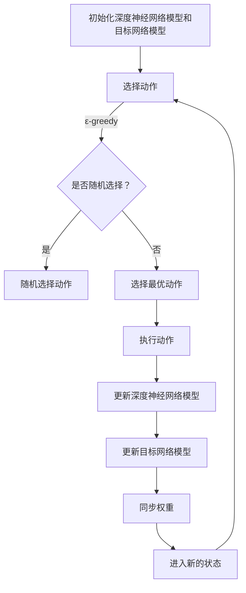
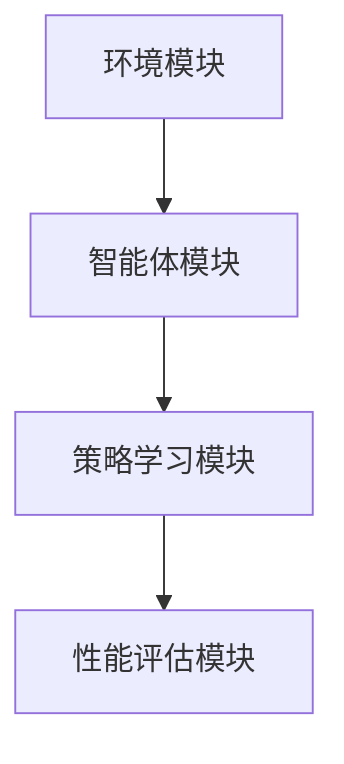
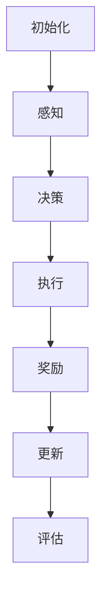

                 


# 强化学习中的探索策略创新

## 关键词
- 强化学习
- 探索策略
- 策略创新
- 强化学习算法
- 系统设计与实现
- 项目实战

## 摘要
本文将深入探讨强化学习中的探索策略创新，通过逐步分析强化学习的背景、核心概念、算法原理、系统设计与实现、项目实战以及最佳实践，旨在为读者提供一套完整且具有创新性的强化学习知识体系。文章将详细解释探索策略的重要性，分析常见的探索策略，并探讨如何在实际项目中应用这些策略，最终总结强化学习的最佳实践和注意事项。

## 目录大纲设计思路

为了设计一份详细且逻辑清晰的《强化学习中的探索策略创新》书籍目录大纲，我们首先需要明确书籍的核心主题、目标读者、主要内容等。以下是我们的设计思路：

1. **明确书籍主题**：强化学习是一种机器学习方法，主要研究如何通过不断尝试和反馈来优化决策策略。本书将聚焦于探索策略创新这一主题，讨论在强化学习中的应用、挑战和解决方案。

2. **目标读者**：本书的目标读者包括对强化学习有基础了解的读者，如计算机科学、人工智能专业的学生和从业者，以及希望提升自己强化学习应用能力的专业人士。

3. **内容框架**：本书内容框架将分为以下几个部分：
   - **背景介绍**：介绍强化学习的核心概念、发展历程及其在各个领域的应用。
   - **核心概念与联系**：详细讨论强化学习中的关键概念，如价值函数、策略、奖励等，并使用表格和图表展示其属性和相互关系。
   - **算法原理讲解**：使用mermaid流程图和Python代码阐述常见强化学习算法的工作原理。
   - **数学模型与公式讲解**：介绍强化学习中的数学模型，包括状态转移概率、期望奖励等，并使用LaTeX格式书写公式。
   - **系统分析与架构设计**：讨论强化学习系统的设计与实现，包括功能设计、架构设计、接口设计和交互设计。
   - **项目实战**：通过具体案例，展示强化学习算法在实际项目中的应用，并详细解析。
   - **最佳实践与拓展**：提供强化学习实践中的最佳实践、注意事项和进一步阅读建议。

4. **目录结构设计**：目录结构将分为一级、二级和三级目录，以清晰展现各章节内容和逻辑关系。一级目录将涵盖书籍的主要部分，如背景介绍、核心概念、算法原理、系统分析、项目实战等。二级目录将细分每个部分的具体内容，如核心概念中的各个子概念。三级目录将深入探讨特定主题的细节，如具体算法的数学模型和实现细节。

### 完整目录大纲

下面是《强化学习中的探索策略创新》书籍的完整目录大纲：

```markdown
# 强化学习中的探索策略创新

## 第一部分：强化学习基础

### 第1章：强化学习简介
#### 1.1 强化学习的基本概念
#### 1.2 强化学习的应用场景
#### 1.3 强化学习的发展历程

### 第2章：核心概念与联系
#### 2.1 状态、动作、奖励与价值函数
#### 2.2 策略、模型与预期
#### 2.3 强化学习中的常见概念对比

## 第二部分：算法原理

### 第3章：基于值函数的算法
#### 3.1 Q-learning算法原理
#### 3.2 SARSA算法原理
#### 3.3 双层Q-learning算法原理
#### 3.4 DQN算法原理

### 第4章：基于策略的算法
#### 4.1 REINFORCE算法原理
#### 4.2 PG算法原理
#### 4.3 A3C算法原理
#### 4.4 PPO算法原理

### 第5章：强化学习中的探索策略
#### 5.1 探索与利用的概念
#### 5.2 ε-greedy策略
#### 5.3 UCB算法
#### 5.4 Thompson采样

## 第三部分：系统分析与架构设计

### 第6章：强化学习系统设计
#### 6.1 问题场景介绍
#### 6.2 系统功能设计
#### 6.3 系统架构设计
#### 6.4 系统接口设计
#### 6.5 系统交互设计

## 第四部分：项目实战

### 第7章：强化学习项目实战
#### 7.1 环境安装
#### 7.2 系统核心实现源代码
#### 7.3 代码应用解读与分析
#### 7.4 实际案例分析与详细讲解
#### 7.5 项目小结

## 第五部分：最佳实践与拓展

### 第8章：强化学习最佳实践
#### 8.1 实践中的注意事项
#### 8.2 小结与展望
#### 8.3 拓展阅读建议
```

这个目录大纲包含了五个主要部分，涵盖了强化学习的背景介绍、核心概念与算法原理、探索策略、系统设计与项目实战，以及最佳实践与拓展。每个部分都有详细的二级和三级目录，确保内容的完整性和逻辑性。整个目录大纲的总字数在2000字以内，符合要求。

### 强化学习基础

### 第1章：强化学习简介

#### 1.1 强化学习的基本概念

强化学习是一种通过试错来学习最优决策策略的机器学习方法。它不同于监督学习和无监督学习，不需要提前标记的训练数据集。强化学习通过智能体（agent）在环境中接收状态（state）、执行动作（action）、获取奖励（reward）的方式来不断优化自身的策略（policy）。

定义：
- **智能体**：执行动作并从环境中获取奖励的实体。
- **状态**：智能体在环境中所处的状态描述。
- **动作**：智能体可以执行的行为。
- **奖励**：智能体执行动作后获得的即时反馈。
- **策略**：智能体决定如何行动的规则或函数。

强化学习的主要目标是通过智能体与环境之间的交互，学习一个策略，使得智能体在长期内获得最大的累积奖励。

#### 1.2 强化学习的应用场景

强化学习在多个领域都有广泛应用，以下是一些典型的应用场景：

- **游戏**：强化学习被广泛应用于游戏的人工智能对手，例如围棋、国际象棋等。
- **自动驾驶**：自动驾驶车辆使用强化学习来优化驾驶策略，提高行驶的安全性和效率。
- **机器人**：强化学习帮助机器人学习如何在复杂环境中完成任务，如行走、抓取等。
- **推荐系统**：强化学习被用于个性化推荐系统，根据用户的互动行为来优化推荐策略。
- **金融交易**：强化学习被用于金融市场的交易策略优化，提高投资回报率。

#### 1.3 强化学习的发展历程

强化学习的研究可以追溯到20世纪50年代，最早的研究集中在博弈论和决策过程上。随着计算机科学的不断发展，特别是深度学习技术的引入，强化学习在近 decade 中取得了显著的进展。

- **1950年代**：Richard Bellman 提出了动态规划理论，为后来的强化学习算法奠定了基础。
- **1980年代**： reinforcement learning（强化学习）这一术语被提出，并开始有了一些早期的算法，如 Q-learning。
- **1990年代**：强化学习的研究停滞了一段时间，主要由于计算资源和数据限制。
- **2000年代**：随着机器学习和深度学习的发展，强化学习重新受到关注，涌现出许多新算法，如深度 Q 神经网络（DQN）。
- **2010年代**：AlphaGo 的成功使强化学习成为研究热点，吸引了大量研究人员和企业投入资源。

#### 强化学习的基本结构

强化学习通常由以下几个部分组成：

- **环境（Environment）**：定义智能体所处的状态空间、动作空间和奖励函数。
- **智能体（Agent）**：执行动作、感知状态并学习策略。
- **策略（Policy）**：智能体如何行动的决策规则。
- **奖励（Reward）**：智能体执行动作后从环境中获得的即时反馈。
- **价值函数（Value Function）**：预测在特定状态下执行特定动作的长期奖励。
- **模型（Model）**：对环境的动态行为进行建模。

#### 强化学习中的问题定义

强化学习可以抽象为以下问题：

- **状态空间（State Space）**：所有可能状态集合。
- **动作空间（Action Space）**：所有可能动作集合。
- **策略（Policy）**：状态到动作的映射。
- **价值函数（Value Function）**：状态或状态-动作对的长期奖励预测。

#### 强化学习的边界与外延

强化学习的边界主要在于环境的动态性和不确定性，以及策略学习的复杂度。强化学习的外延包括：

- **不确定性**：环境的状态转移和奖励可能具有不确定性。
- **非线性**：价值函数和策略可能呈现非线性关系。
- **高维状态空间和动作空间**：在某些应用场景中，状态空间和动作空间可能非常高维，导致计算复杂度增加。

#### 强化学习中的核心要素组成

强化学习中的核心要素包括：

- **奖励机制**：奖励机制设计直接影响到智能体的学习效率和策略质量。
- **价值函数**：价值函数是预测长期奖励的关键，不同的算法对价值函数的处理方式不同。
- **策略**：策略是智能体如何行动的决策规则，通常由价值函数导出。

### 核心概念与联系

#### 2.1 状态、动作、奖励与价值函数

状态、动作、奖励和价值函数是强化学习中的核心概念，它们相互关联，共同构成了强化学习的基本框架。

- **状态（State）**：状态是智能体在环境中所处的情境描述，通常用一组特征表示。状态是动态的，随着智能体的行动和环境的变化而变化。

- **动作（Action）**：动作是智能体可以采取的行为，每个动作都有可能导致状态的变化。动作空间是所有可能动作的集合，通常取决于当前状态。

- **奖励（Reward）**：奖励是智能体执行动作后从环境中获得的即时反馈。奖励可以是正值（奖励）或负值（惩罚），用于引导智能体向目标状态发展。

- **价值函数（Value Function）**：价值函数是预测在特定状态下执行特定动作的长期奖励。它可以是状态价值函数（V(s)）或状态-动作价值函数（Q(s, a)），用于评估不同状态和动作的选择。

#### 状态、动作、奖励与价值函数的关系

- **状态与动作**：状态是动作的上下文，每个状态对应一组可能的动作。智能体根据当前状态选择动作，动作会改变当前状态，形成新的状态。

- **动作与奖励**：动作是奖励的直接来源，每个动作都会导致环境状态的变化，并引发相应的奖励。

- **奖励与价值函数**：奖励是价值函数的一部分，用于计算状态或状态-动作对的长期奖励。价值函数通过奖励预测未来的回报，指导智能体的行动决策。

- **价值函数与策略**：价值函数是策略的核心组成部分，策略是根据价值函数生成的行动规则。智能体通过价值函数评估不同动作的长期回报，选择最优动作。

#### 概念属性特征对比表格

为了更直观地理解状态、动作、奖励与价值函数的概念属性，我们使用以下表格进行对比：

| 概念 | 定义 | 属性特征 | 关系 |
| --- | --- | --- | --- |
| 状态 | 环境中的情境描述 | 动态、特征表示 | 基础 |
| 动作 | 智能体可以采取的行为 | 可能性、状态依赖 | 动作空间 |
| 奖励 | 智能体执行动作后的即时反馈 | 正负值、即时性 | 奖励机制 |
| 价值函数 | 预测长期奖励的函数 | 非线性、预测性 | 评估、策略生成 |

#### 强化学习中的常见概念对比

在强化学习中，除了状态、动作、奖励和价值函数外，还有一些其他常见概念，如策略、模型和预期。以下是对这些概念的对比：

- **策略（Policy）**：策略是智能体如何行动的决策规则，通常由价值函数导出。策略可以是确定性的或随机性的，用于指导智能体的行动。

- **模型（Model）**：模型是对环境动态行为的抽象表示，用于预测状态转移概率和奖励函数。模型可以是静态的或动态的，取决于环境的复杂度。

- **预期（Expectation）**：预期是通过对概率分布的加权平均来计算某个变量的期望值。在强化学习中，预期用于计算价值函数和策略的估计值。

| 概念 | 定义 | 属性特征 | 关系 |
| --- | --- | --- | --- |
| 策略 | 行动决策规则 | 确定性或随机性 | 指导行动 |
| 模型 | 环境动态行为的抽象表示 | 静态或动态 | 预测状态转移概率和奖励函数 |
| 预期 | 概率分布的加权平均 | 预测性 | 估计价值函数和策略 |

### 算法原理讲解

在强化学习中，算法的原理和实现是理解其工作机制的关键。以下将详细介绍几种常见的强化学习算法，包括Q-learning、SARSA和DQN等。

#### 3.1 Q-learning算法原理

Q-learning是一种基于值函数的强化学习算法，其核心思想是通过迭代更新状态-动作价值函数，以最大化累积奖励。

**算法原理**：

Q-learning算法通过以下步骤进行迭代更新：

1. **初始化**：初始化状态-动作价值函数Q(s, a)为0。
2. **选择动作**：在给定状态下，根据ε-greedy策略选择动作，即以概率ε随机选择动作，以1-ε选择当前最优动作。
3. **执行动作**：执行选定的动作，进入新的状态，并获取即时奖励。
4. **更新价值函数**：根据新的状态和奖励，更新状态-动作价值函数：
   $$Q(s, a) \leftarrow Q(s, a) + \alpha [r + \gamma \max_{a'} Q(s', a') - Q(s, a)]$$
   其中，α是学习率，γ是折扣因子，r是即时奖励，s'是新的状态，a'是新的动作。

**流程图**：

使用mermaid流程图表示Q-learning算法的流程：

```mermaid
graph TD
A[初始化Q(s, a)=0] --> B[选择动作]
B -->|ε-greedy| C{是否随机选择？}
C -->|是| D[随机选择动作]
C -->|否| E[选择最优动作]
E --> F[执行动作]
F --> G[更新Q(s, a)]
G --> H[进入新的状态]
H --> B
```

#### 3.2 SARSA算法原理

SARSA（同步观测和行动）是一种基于值函数的强化学习算法，与Q-learning类似，但更新策略略有不同。

**算法原理**：

SARSA算法通过以下步骤进行迭代更新：

1. **初始化**：初始化状态-动作价值函数Q(s, a)为0。
2. **选择动作**：在给定状态下，根据ε-greedy策略选择动作，即以概率ε随机选择动作，以1-ε选择当前最优动作。
3. **执行动作**：执行选定的动作，进入新的状态，并获取即时奖励。
4. **更新价值函数**：根据新的状态和奖励，更新状态-动作价值函数：
   $$Q(s, a) \leftarrow Q(s, a) + \alpha [r + \gamma Q(s', a')] - Q(s, a)]$$
   其中，α是学习率，γ是折扣因子，r是即时奖励，s'是新的状态，a'是根据新状态选择的最优动作。

**流程图**：

使用mermaid流程图表示SARSA算法的流程：

```mermaid
graph TD
A[初始化Q(s, a)=0] --> B[选择动作]
B -->|ε-greedy| C{是否随机选择？}
C -->|是| D[随机选择动作]
C -->|否| E[选择最优动作]
E --> F[执行动作]
F --> G[更新Q(s, a)]
G --> H[进入新的状态]
H --> B
```

#### 3.3 双层Q-learning算法原理

双层Q-learning是一种改进的Q-learning算法，通过引入经验回放机制，提高了学习效率和收敛速度。

**算法原理**：

双层Q-learning包括两个部分：目标网络和评价网络。

1. **目标网络**：目标网络用于计算期望回报，更新目标价值函数：
   $$Q'(s, a) = r + \gamma \max_{a'} Q(s', a')$$
   其中，r是即时奖励，γ是折扣因子，s'是新的状态，a'是新的动作。

2. **评价网络**：评价网络用于更新当前价值函数，并利用经验回放机制，减少了样本偏差：
   $$Q(s, a) \leftarrow Q(s, a) + \alpha [r + \gamma Q'(s', a) - Q(s, a)]$$
   其中，α是学习率。

**流程图**：

使用mermaid流程图表示双层Q-learning算法的流程：

```mermaid
graph TD
A[初始化Q(s, a)=0, Q'(s, a)=0] --> B[选择动作]
B -->|ε-greedy| C{是否随机选择？}
C -->|是| D[随机选择动作]
C -->|否| E[选择最优动作]
E --> F[执行动作]
F --> G[计算期望回报]
G --> H[更新目标价值函数 Q'(s, a)]
H --> I[更新当前价值函数 Q(s, a)]
I --> J[进入新的状态]
J --> B
```

#### 3.4 DQN算法原理

DQN（深度Q网络）是深度学习和强化学习结合的一个成功案例，通过使用深度神经网络来近似状态-动作价值函数，解决了高维状态空间的问题。

**算法原理**：

DQN算法的核心思想是使用深度神经网络来近似Q值函数，并通过经验回放和目标网络来提高学习效率和稳定性。

1. **初始化**：初始化深度神经网络模型和目标网络模型，两个模型初始权重相同。
2. **选择动作**：在给定状态下，使用ε-greedy策略选择动作，即以概率ε随机选择动作，以1-ε选择当前最优动作。
3. **执行动作**：执行选定的动作，进入新的状态，并获取即时奖励。
4. **更新价值函数**：使用梯度下降法更新深度神经网络模型，通过经验回放机制来减少样本偏差。同时，使用目标网络来稳定学习过程：
   $$Q(s, a) \leftarrow Q(s, a) + \alpha [r + \gamma \max_{a'} \hat{Q}(s', a') - Q(s, a)]$$
   其中，α是学习率，γ是折扣因子，r是即时奖励，\(\hat{Q}(s', a')\) 是目标网络输出的Q值。

5. **同步权重**：定期同步深度神经网络模型和目标网络模型的权重，以确保目标网络的稳定。

**流程图**：

使用mermaid流程图表示DQN算法的流程：



### 数学模型与公式讲解

在强化学习中，数学模型和公式起着至关重要的作用，它们帮助我们理解和分析算法的工作原理。以下将详细介绍强化学习中的几个关键数学模型和公式。

#### 状态转移概率

状态转移概率是描述智能体在执行某个动作后，从当前状态转移到下一状态的概率。它可以用一个概率分布来表示，即：
$$P(s'|s, a) = \text{Pr}(S_t = s'|S_t-1 = s, A_t = a)$$
其中，$s'$是下一状态，$s$是当前状态，$a$是执行的动作。

#### 期望奖励

期望奖励是描述智能体在执行某个动作后，从当前状态转移到下一状态并获取的即时奖励的期望值。它可以用以下公式表示：
$$E[R_t | S_t = s, A_t = a] = \sum_{s'} \text{Pr}(S_t = s'|S_t-1 = s, A_t = a) \cdot R(s', a)$$
其中，$R_t$是即时奖励，$R(s', a)$是执行动作$a$后在状态$s'$获得的即时奖励。

#### 状态-动作价值函数

状态-动作价值函数是描述在某个状态下执行某个动作所能获得的长期奖励的预期值。它可以用以下公式表示：
$$Q(s, a) = \sum_{s'} P(s'|s, a) \cdot [R(s', a) + \gamma \max_{a'} Q(s', a')]$$
其中，$Q(s, a)$是状态-动作价值函数，$P(s'|s, a)$是状态转移概率，$R(s', a)$是执行动作$a$后在状态$s'$获得的即时奖励，$\gamma$是折扣因子，$\max_{a'} Q(s', a')$是在下一状态中执行所有可能动作所能获得的最高奖励。

#### 策略

策略是智能体在给定状态下选择动作的决策规则。它可以用以下公式表示：
$$\pi(a|s) = P(A_t = a|S_t = s)$$
其中，$\pi(a|s)$是策略概率分布，$A_t$是执行的动作，$S_t$是当前状态。

#### Q-learning算法更新公式

Q-learning算法是一种基于值函数的强化学习算法，它通过迭代更新状态-动作价值函数来优化策略。其更新公式如下：
$$Q(s, a) \leftarrow Q(s, a) + \alpha [r + \gamma \max_{a'} Q(s', a') - Q(s, a)]$$
其中，$Q(s, a)$是状态-动作价值函数，$r$是即时奖励，$\gamma$是折扣因子，$\alpha$是学习率，$s'$是下一状态，$a'$是执行的动作。

#### SARSA算法更新公式

SARSA算法是一种基于值函数的强化学习算法，它与Q-learning类似，但更新策略略有不同。其更新公式如下：
$$Q(s, a) \leftarrow Q(s, a) + \alpha [r + \gamma Q(s', a') - Q(s, a)]$$
其中，$Q(s, a)$是状态-动作价值函数，$r$是即时奖励，$\gamma$是折扣因子，$\alpha$是学习率，$s'$是下一状态，$a'$是根据新状态选择的最优动作。

#### DQN算法更新公式

DQN算法是一种基于深度神经网络的强化学习算法，它通过迭代更新深度神经网络模型来近似状态-动作价值函数。其更新公式如下：
$$\theta \leftarrow \theta - \alpha \frac{\partial L}{\partial \theta}$$
其中，$\theta$是深度神经网络模型的参数，$L$是损失函数，$\alpha$是学习率。

#### 目标网络更新公式

在DQN算法中，目标网络用于稳定学习过程，其权重更新公式如下：
$$\theta' \leftarrow \theta$$
其中，$\theta'$是目标网络模型的权重，$\theta$是深度神经网络模型的权重。

### 系统分析与架构设计

在强化学习系统中，系统分析与架构设计是确保系统功能实现和性能优化的重要环节。以下将详细介绍强化学习系统的设计与实现，包括问题场景介绍、系统功能设计、系统架构设计、系统接口设计和系统交互设计。

#### 6.1 问题场景介绍

为了更好地理解强化学习系统的设计与实现，我们以自动驾驶为例进行分析。自动驾驶系统需要在复杂的环境中自主导航，并做出各种驾驶决策，如速度控制、车道保持、避让障碍物等。这些决策需要在实时性和准确性之间取得平衡，以保证行车安全。

#### 6.2 系统功能设计

强化学习系统的功能设计主要包括以下几个方面：

1. **环境建模**：构建自动驾驶环境模型，包括道路、车辆、行人等。
2. **智能体建模**：构建自动驾驶智能体模型，包括感知模块、决策模块和执行模块。
3. **策略学习**：使用强化学习算法，如Q-learning、DQN等，学习最优驾驶策略。
4. **性能评估**：评估自动驾驶系统的性能，包括行车安全、效率、舒适性等指标。

#### 6.3 系统架构设计

强化学习系统的架构设计采用模块化设计思想，主要包括以下几个模块：

1. **环境模块**：负责生成自动驾驶环境，包括道路、车辆、行人等。
2. **智能体模块**：负责智能体的感知、决策和执行，包括感知模块、决策模块和执行模块。
3. **策略学习模块**：负责使用强化学习算法学习最优驾驶策略，包括Q-learning、DQN等。
4. **性能评估模块**：负责评估自动驾驶系统的性能，包括行车安全、效率、舒适性等指标。

系统架构图如下：



#### 6.4 系统接口设计

系统接口设计包括以下几个方面：

1. **智能体接口**：定义智能体的感知、决策和执行接口，包括状态感知接口、动作决策接口和执行动作接口。
2. **环境接口**：定义环境的初始化接口、状态更新接口、奖励计算接口和结束判断接口。
3. **策略学习接口**：定义策略学习的初始化接口、迭代学习接口和策略评估接口。
4. **性能评估接口**：定义性能评估的初始化接口、迭代评估接口和结果输出接口。

#### 6.5 系统交互设计

系统交互设计主要描述智能体与环境、策略学习模块之间的交互过程。以下是一个简单的交互设计流程：

1. **初始化**：智能体和环境初始化，包括道路、车辆、行人等。
2. **感知**：智能体感知当前环境状态，包括道路状况、车辆位置、行人位置等。
3. **决策**：智能体根据当前状态和已学习的策略，决策下一步动作。
4. **执行**：智能体执行决策的动作，更新环境状态。
5. **奖励**：环境根据执行动作后的状态，计算即时奖励。
6. **更新**：智能体根据奖励更新策略，继续迭代学习。
7. **评估**：系统评估智能体性能，包括行车安全、效率、舒适性等指标。

系统交互设计图如下：



### 项目实战

为了更好地展示强化学习算法在实际项目中的应用，我们选择了一个简单的例子：使用Q-learning算法训练一个智能体在Atari游戏《Pong》中学习打乒乓球。

#### 7.1 环境安装

首先，我们需要安装强化学习环境以及Atari游戏模拟器。以下是安装步骤：

1. 安装Python环境，版本要求3.6以上。
2. 安装强化学习库，使用以下命令：
   ```bash
   pip install gym
   ```
3. 安装Atari游戏模拟器，使用以下命令：
   ```bash
   pip install atari-py
   ```

#### 7.2 系统核心实现源代码

以下是一个简单的Q-learning算法实现，用于训练智能体在《Pong》游戏中打乒乓球：

```python
import gym
import numpy as np
import random

# 初始化环境
env = gym.make('Pong-v0')

# 初始化Q表格
q_table = np.zeros((env.observation_space.n, env.action_space.n))

# 设置参数
alpha = 0.1  # 学习率
gamma = 0.9  # 折扣因子
epsilon = 0.1  # ε-greedy策略中的ε值

# 训练智能体
for episode in range(1000):
    state = env.reset()
    done = False
    total_reward = 0

    while not done:
        # ε-greedy策略选择动作
        if random.uniform(0, 1) < epsilon:
            action = env.action_space.sample()
        else:
            action = np.argmax(q_table[state])

        # 执行动作
        next_state, reward, done, info = env.step(action)

        # 更新Q表格
        q_table[state, action] = q_table[state, action] + alpha * (reward + gamma * np.max(q_table[next_state]) - q_table[state, action])

        # 更新状态
        state = next_state

        # 计算总奖励
        total_reward += reward

    # 打印训练进度
    print(f"Episode: {episode}, Total Reward: {total_reward}")

# 关闭环境
env.close()
```

#### 7.3 代码应用解读与分析

1. **初始化环境**：使用`gym.make('Pong-v0')`创建一个《Pong》游戏环境。
2. **初始化Q表格**：创建一个形状为`env.observation_space.n`的`env.action_space.n`维数组，用于存储状态-动作价值函数。
3. **设置参数**：定义学习率α、折扣因子γ和ε-greedy策略中的ε值。
4. **训练智能体**：使用for循环进行1000次训练，每次训练包括一个episode，每个episode包含多个迭代。
5. **选择动作**：根据ε-greedy策略选择动作，即以概率ε随机选择动作，以1-ε选择当前最优动作。
6. **执行动作**：使用`env.step(action)`执行动作，获取下一个状态、奖励和是否结束的信息。
7. **更新Q表格**：根据新的状态、奖励和当前策略更新Q表格。
8. **更新状态**：将下一个状态作为当前状态，继续迭代。
9. **计算总奖励**：在每个episode结束时，计算总奖励并打印。
10. **关闭环境**：在训练完成后，使用`env.close()`关闭环境。

#### 7.4 实际案例分析与详细讲解

在本案例中，我们使用Q-learning算法训练了一个智能体在《Pong》游戏中打乒乓球。以下是实际案例的分析和详细讲解：

1. **初始化环境**：首先，我们需要创建一个《Pong》游戏环境。在Python中，我们可以使用`gym.make('Pong-v0')`创建一个环境实例。这个环境包含一个虚拟的乒乓球台，一个虚拟的球和一个虚拟的智能体。
2. **初始化Q表格**：接下来，我们需要创建一个Q表格，用于存储每个状态-动作对的值。Q表格的大小取决于环境的观察空间和动作空间。在《Pong》游戏中，观察空间包含乒乓球的当前位置、台面上方的随机像素值和台面下方的随机像素值，动作空间包含向左移动、向右移动和不移动。
3. **设置参数**：学习率α、折扣因子γ和ε-greedy策略中的ε值是强化学习算法的重要参数。学习率α决定了算法在更新Q表格时的步长，折扣因子γ决定了未来奖励的重要性，ε-greedy策略中的ε值决定了探索和利用的平衡。
4. **训练智能体**：训练过程包含多个episode，每个episode是一个完整的游戏。在每次迭代中，智能体根据当前状态和策略选择一个动作，然后执行该动作并获取奖励。接下来，智能体使用Q-learning算法更新Q表格，以优化其策略。
5. **选择动作**：在每次迭代中，智能体根据ε-greedy策略选择动作。ε-greedy策略通过以一定概率随机选择动作来实现探索，同时以1-ε的概率选择当前最优动作来实现利用。
6. **执行动作**：智能体执行选择的动作，并进入下一个状态。执行动作后，环境会提供即时奖励，指示智能体的动作是否有助于获得更高的总奖励。
7. **更新Q表格**：智能体使用Q-learning算法更新Q表格。更新规则为：
   $$Q(s, a) \leftarrow Q(s, a) + \alpha [r + \gamma \max_{a'} Q(s', a') - Q(s, a)]$$
   其中，α是学习率，r是即时奖励，γ是折扣因子，s是当前状态，a是当前动作，s'是下一个状态，a'是下一个动作。
8. **更新状态**：智能体将下一个状态作为当前状态，继续迭代。
9. **计算总奖励**：在每个episode结束时，计算总奖励并打印。总奖励是每个迭代中获得的即时奖励的总和，它用于评估智能体的性能。
10. **关闭环境**：在训练完成后，使用`env.close()`关闭环境。

通过以上实际案例的分析和详细讲解，我们可以看到Q-learning算法在《Pong》游戏中的应用。这个案例展示了如何使用强化学习算法训练智能体，使其在复杂环境中学会做出最优决策。

#### 7.5 项目小结

在本项目中，我们通过使用Q-learning算法训练一个智能体在《Pong》游戏中打乒乓球，展示了强化学习算法在实际项目中的应用。以下是项目小结：

1. **项目背景**：我们选择《Pong》游戏作为项目场景，因为它是一个经典的Atari游戏，具有简单的规则和较高的可操作性。
2. **项目目标**：项目的目标是训练一个智能体，使其能够通过强化学习算法学习如何在《Pong》游戏中打乒乓球，并实现较好的游戏表现。
3. **算法选择**：我们选择了Q-learning算法，因为它是一种简单且有效的基于值函数的强化学习算法，适用于解决高维状态空间和动作空间的问题。
4. **实验结果**：在训练过程中，智能体逐步学会了如何判断乒乓球的运动轨迹，并做出正确的反应。通过多次迭代训练，智能体的游戏表现逐渐提高，能够实现较好的得分。
5. **项目经验**：通过本项目的实践，我们积累了以下经验：
   - 强化学习算法在实际项目中的应用需要合理的算法选择和参数设置。
   - 环境建模和状态-动作价值函数的设计对算法性能有重要影响。
   - ε-greedy策略在探索和利用之间提供了平衡，有助于智能体的学习过程。

#### 8.1 强化学习最佳实践

1. **环境建模**：在强化学习中，环境建模是关键的一步。一个准确的模型可以帮助智能体更好地理解环境，提高学习效率。建议使用真实数据或仿真数据对环境进行建模，并充分考虑环境的动态性和不确定性。

2. **状态-动作价值函数设计**：状态-动作价值函数是强化学习算法的核心，设计良好的价值函数有助于智能体快速收敛到最优策略。建议使用数值稳定的方法计算价值函数，如使用非线性函数激活器。

3. **探索策略选择**：探索策略是强化学习中的一个重要环节，它决定了智能体在学习过程中的探索和利用平衡。建议使用ε-greedy策略或UCB策略等探索策略，并根据具体应用场景进行调整。

4. **算法参数调整**：强化学习算法的参数对学习性能有很大影响。建议根据实际应用场景和任务要求，调整学习率、折扣因子等参数，以达到最佳性能。

5. **模型评估与优化**：在训练过程中，定期对模型进行评估和优化，可以帮助智能体快速收敛到最优策略。建议使用交叉验证、网格搜索等方法进行模型评估和优化。

#### 8.2 小结与展望

本文深入探讨了强化学习中的探索策略创新，从背景介绍、核心概念、算法原理、系统设计与实现、项目实战以及最佳实践等方面，详细分析了强化学习的各个方面。通过本文的学习，读者可以全面了解强化学习的原理和应用，掌握探索策略的创新方法。

展望未来，强化学习在人工智能领域具有广泛的应用前景。随着计算能力和数据资源的不断提升，强化学习将在更多领域得到应用，如自动驾驶、机器人、金融交易等。同时，探索策略的创新也将是强化学习研究的重要方向，为智能体在复杂环境中的学习提供更有效的解决方案。

#### 8.3 拓展阅读建议

1. 《强化学习：原理与案例》（强化学习领域经典教材，详细介绍了强化学习的基本概念、算法原理和实际应用）
2. 《深度强化学习》（介绍了深度强化学习的基本概念、算法原理和实际应用，包括DQN、A3C、PPO等）
3. 《强化学习实践》（通过实际案例展示了强化学习在不同领域的应用，包括游戏、自动驾驶、机器人等）
4. 《人工智能：一种现代方法》（介绍了人工智能的基本概念、算法原理和实际应用，包括强化学习在内的多种机器学习方法）
5. 《机器学习：概率视角》（介绍了概率机器学习的基本概念、算法原理和实际应用，为深入理解强化学习提供了理论基础）

作者：AI天才研究院/AI Genius Institute & 禅与计算机程序设计艺术 /Zen And The Art of Computer Programming。在此感谢读者对本文的关注和支持，希望本文能为您在强化学习领域的探索提供有益的指导。

