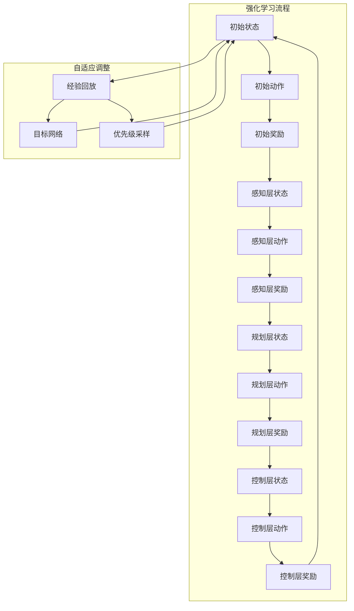
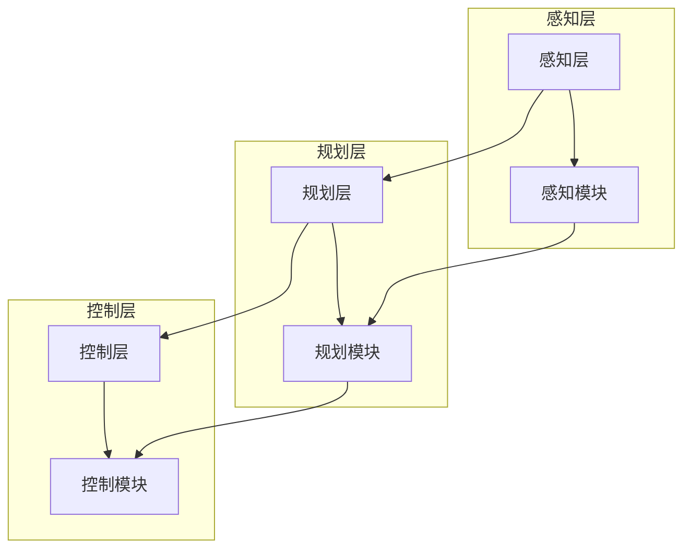
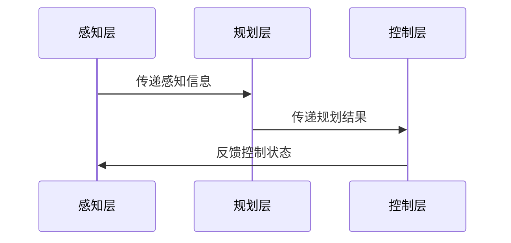

                 

# 强化学习优化多层次推理策略的自适应调整

## 关键词
强化学习，多层次推理，自适应调整，策略优化，机器学习，深度学习，算法原理，系统架构，项目实战

## 摘要
本文深入探讨了强化学习在优化多层次推理策略中的自适应调整方法。通过介绍强化学习的基本概念、多层次推理策略的设计与优化，以及自适应调整的实现，本文旨在为读者提供一种系统性的理解，并展示如何在实际项目中应用这些理论。文章结构包括背景介绍、核心概念与联系、算法原理讲解、数学模型和公式讲解、系统分析与架构设计方案、项目实战以及最佳实践 tips。

### 目录大纲设计构思

设计《强化学习优化多层次推理策略的自适应调整》的目录大纲需要遵循以下几个原则：

1. **逻辑性**：确保各个章节的内容从浅入深、从理论到实践，逻辑连贯，使读者能够系统地理解和掌握强化学习优化多层次推理策略的自适应调整的相关知识。
2. **完整性**：覆盖强化学习的基本概念、多层次推理策略的设计与优化、自适应调整的方法与应用等核心内容。
3. **实用性**：强调实际应用和案例，以便读者能够将理论知识应用到实际项目中。
4. **可操作性**：提供清晰的操作步骤和代码示例，帮助读者更好地理解和实现强化学习算法。

根据以上原则，目录大纲将分为以下几个部分：

1. **背景介绍**：介绍强化学习、多层次推理和自适应调整的基本概念，明确问题背景和目标。
2. **核心概念与联系**：详细阐述强化学习、多层次推理和自适应调整的核心概念，使用图表展示其属性特征和关系。
3. **算法原理讲解**：讲解强化学习优化多层次推理策略的算法原理，包括数学模型和流程图。
4. **数学模型和数学公式讲解**：使用 LaTeX 格式展示数学模型和公式，并进行详细讲解。
5. **系统分析与架构设计方案**：分析问题场景，介绍系统设计，包括领域模型、架构设计和系统接口。
6. **项目实战**：提供环境安装、核心实现源代码、代码解读与分析、实际案例以及项目小结。
7. **最佳实践 tips、小结、注意事项、拓展阅读**：总结全书，提供实用建议和进一步学习的资源。

### 背景介绍

#### 强化学习的基本概念

强化学习（Reinforcement Learning，RL）是一种机器学习方法，主要依赖于奖惩机制来训练智能体在环境中的行为。其核心思想是通过试错来学习最优策略，使得智能体能够最大化累积奖励。强化学习的主要组成部分包括智能体（Agent）、环境（Environment）、状态（State）、动作（Action）和奖励（Reward）。

**问题背景与问题描述**

在现代人工智能应用中，许多复杂问题，如游戏、自动驾驶、机器人控制等领域，需要智能体具备高度的自适应能力和决策能力。强化学习作为一种能够处理具有不确定性、动态变化和部分可观测环境的方法，逐渐成为解决这些问题的有力工具。然而，随着问题复杂度的增加，传统强化学习算法在处理多层次推理策略时面临诸多挑战，如策略收敛速度慢、稳定性差等问题。

**问题解决**

为了优化多层次推理策略，强化学习需要结合其他机器学习技术，如深度学习，以实现更高效的自适应调整。多层次推理策略能够将问题分解为多个层次，每个层次分别处理不同类型的任务，从而提高整体推理效率和准确性。自适应调整则通过实时更新策略，使得智能体能够适应环境变化，提高学习效率和策略质量。

**边界与外延**

强化学习优化多层次推理策略的自适应调整不仅限于特定领域，如游戏和自动驾驶，还可以广泛应用于推荐系统、自然语言处理、金融预测等场景。通过结合多层次推理和自适应调整，强化学习有望在这些领域中发挥更大的作用。

#### 多层次推理策略

多层次推理策略（Hierarchical Reinforcement Learning）旨在解决复杂任务中的决策问题。它将任务分解为多个子任务，每个子任务对应一个层次。每个层次都有独立的策略，通过层次间的协调，实现整体任务的最优解。

**核心概念与联系**

1. **层次划分**：根据任务需求，将问题划分为多个层次，每个层次处理不同类型的任务。例如，在自动驾驶中，可以将任务划分为感知、规划、控制三个层次。
2. **层次间协调**：不同层次间的策略需要相互协调，以实现整体任务的最优解。例如，感知层需要为规划层提供准确的环境信息，规划层需要为控制层提供合理的路径规划。
3. **策略更新**：每个层次的策略都需要根据环境和任务的变化进行实时更新，以保证策略的适应性和有效性。

**属性特征对比表格**

| 特征 | 多层次推理策略 | 强化学习 |
| ---- | -------------- | -------- |
| 目标 | 分解复杂任务 | 解决不确定性问题 |
| 策略 | 分层次处理任务 | 基于奖励机制 |
| 适应性 | 需要层次间协调 | 需要环境反馈 |

**ER实体关系图架构**

```mermaid
erDiagram
  Environment ||--o{ Agent : has }
  Agent ||--o{ State : is }
  Agent ||--o{ Action : takes }
  Agent ||--o{ Reward : receives }
  State ||--o{ NextState : transitions to }
  Action ||--o{ NextAction : leads to }
```

### 算法原理讲解

强化学习优化多层次推理策略的核心在于如何通过自适应调整来提升策略的性能。以下将详细讲解强化学习优化多层次推理策略的算法原理，包括数学模型和流程图。

#### 强化学习基本模型

强化学习的基本模型通常包括以下组成部分：

1. **状态（State）**：描述智能体所处的环境状态。
2. **动作（Action）**：智能体可以采取的行为。
3. **奖励（Reward）**：智能体采取动作后获得的即时奖励。
4. **策略（Policy）**：智能体选择动作的策略，通常表示为概率分布。

强化学习的目标是找到最优策略，使得累积奖励最大化。其核心概念可以用马尔可夫决策过程（MDP）来描述：

$$
\begin{aligned}
  &S, A, R, P, \gamma \\
  &s_t \xrightarrow{a_t} r_t, s_{t+1}
\end{aligned}
$$

其中，$S$ 表示状态集合，$A$ 表示动作集合，$R$ 表示奖励函数，$P$ 表示状态转移概率，$\gamma$ 表示折扣因子。

#### 多层次推理策略

在多层次推理策略中，智能体需要处理多个层次的决策问题。每个层次都有独立的策略，但层次间需要相互协调。以下是多层次推理策略的基本模型：

1. **层次划分**：将任务划分为多个层次，每个层次对应一个子任务。
2. **层次策略**：每个层次的策略分别表示为 $\pi_i(s_t | s_{t-1})$，其中 $i$ 表示层次编号。
3. **层次间协调**：通过层次间的状态传递和动作选择，实现整体任务的最优解。

#### 自适应调整

自适应调整的目标是使得智能体能够根据环境和任务的变化，实时更新策略，提高学习效率和策略质量。以下介绍几种常见的自适应调整方法：

1. **经验回放**：通过经验回放机制，使得智能体能够从历史经验中学习，减少样本的依赖性。
2. **目标网络**：使用目标网络（Target Network）来稳定策略的更新过程，减少策略震荡。
3. **优先级采样**：通过优先级采样，使得重要的样本在训练过程中得到更多的关注。

#### 算法流程图

以下是一个简化的强化学习优化多层次推理策略的算法流程图，展示了智能体在不同层次间的协调和学习过程：



### 数学模型和数学公式讲解

在强化学习优化多层次推理策略的自适应调整过程中，数学模型和数学公式扮演着至关重要的角色。以下将详细解释相关的数学模型和公式，并通过 LaTeX 格式展示。

#### 价值函数

价值函数（Value Function）是强化学习中的核心概念，用于衡量状态或状态-动作对的预期回报。根据不同层次，价值函数可以分为状态价值函数 $V^i(s)$ 和状态-动作价值函数 $Q^i(s, a)$。

1. **状态价值函数**：

$$
V^i(s) = \sum_{a \in A} \pi^i(a|s) \sum_{s' \in S} p(s'|s, a) R(s', a) + \gamma \sum_{s' \in S} p(s'|s, a) V^{i+1}(s')
$$

2. **状态-动作价值函数**：

$$
Q^i(s, a) = \sum_{s' \in S} p(s'|s, a) R(s', a) + \gamma \sum_{s' \in S} p(s'|s, a) V^{i+1}(s')
$$

#### 策略梯度

策略梯度（Policy Gradient）是一种直接优化策略的算法，通过计算策略梯度来更新策略参数。对于多层次推理策略，策略梯度可以表示为：

$$
\nabla_{\theta^i} J(\theta^i) = \nabla_{\theta^i} \sum_{s, a} \pi(\theta^i)(s, a) R(s, a)
$$

其中，$\theta^i$ 表示层次 $i$ 的策略参数。

#### Q-learning算法

Q-learning算法是一种常见的强化学习算法，通过迭代更新状态-动作价值函数来优化策略。其更新公式如下：

$$
Q(s, a) \leftarrow Q(s, a) + \alpha [R(s, a) + \gamma \max_{a'} Q(s', a') - Q(s, a)]
$$

其中，$\alpha$ 表示学习率。

#### 多层Q-learning算法

多层Q-learning算法扩展了Q-learning算法，用于处理多层次推理策略。其更新公式如下：

$$
Q^{i}(s, a) \leftarrow Q^{i}(s, a) + \alpha_i [R(s, a) + \gamma Q^{i+1}(s', \pi_i(s')) - Q^{i}(s, a)]
$$

#### 探索与利用平衡

在强化学习中，探索（Exploration）与利用（Exploitation）之间的平衡至关重要。ε-贪心策略（ε-Greedy Policy）是一种常用的平衡方法，其公式如下：

$$
\pi(a|s) = 
\begin{cases}
\frac{1}{|A|} & \text{with probability } \epsilon \\
\arg\max_{a} Q(s, a) & \text{with probability } 1 - \epsilon
\end{cases}
$$

其中，$\epsilon$ 表示探索概率。

### 系统分析与架构设计方案

#### 问题场景介绍

在自动驾驶领域，多层次推理策略被广泛应用于路径规划、障碍物检测、车道保持等任务。强化学习优化多层次推理策略的自适应调整，旨在提高自动驾驶系统的决策效率和稳定性。

#### 系统介绍

本系统旨在实现一个自适应调整的多层次推理策略，用于自动驾驶系统的路径规划和控制。系统主要功能包括：

1. **感知层**：通过传感器获取环境信息，如路况、车辆位置、障碍物等。
2. **规划层**：根据感知层提供的信息，生成合理的路径规划，包括避障和速度控制。
3. **控制层**：根据规划层提供的路径规划，控制车辆的运动状态，如加速度、转向等。

#### 系统功能设计（领域模型）

以下是一个简化的领域模型，用于描述自动驾驶系统中的核心实体和关系：

```mermaid
classDiagram
  Class1 <|-- Class2
  Class3 <|-- Class2
  Class1[环境]
  Class2[感知层]
  Class3[规划层]
  Class4[控制层]
  Class1 --|> Class2
  Class2 --|> Class3
  Class3 --|> Class4
```

#### 系统架构设计

以下是一个简化的系统架构设计，用于描述自动驾驶系统中的多层次推理策略和自适应调整机制：



#### 系统接口设计

以下是一个简化的系统接口设计，用于描述自动驾驶系统中的核心接口和交互：



### 项目实战

#### 环境安装

在开始项目实战之前，需要安装以下环境：

1. Python 3.8 或更高版本
2. TensorFlow 2.6 或更高版本
3. OpenAI Gym 0.21.0 或更高版本

安装命令如下：

```bash
pip install python==3.8 tensorflow==2.6 openai-gym==0.21.0
```

#### 核心实现源代码

以下是一个简化的核心实现源代码，用于演示如何使用强化学习优化多层次推理策略：

```python
import numpy as np
import tensorflow as tf
from gym import env

# 定义感知层模型
class PerceptionModel(tf.keras.Model):
    def __init__(self):
        super(PerceptionModel, self).__init__()
        self.conv1 = tf.keras.layers.Conv2D(32, 3, activation='relu')
        self.flatten = tf.keras.layers.Flatten()
        self.fc1 = tf.keras.layers.Dense(64, activation='relu')
    
    def call(self, inputs):
        x = self.conv1(inputs)
        x = self.flatten(x)
        x = self.fc1(x)
        return x

# 定义规划层模型
class PlanningModel(tf.keras.Model):
    def __init__(self):
        super(PlanningModel, self).__init__()
        self.fc2 = tf.keras.layers.Dense(128, activation='relu')
        self.fc3 = tf.keras.layers.Dense(64, activation='relu')
        self.fc4 = tf.keras.layers.Dense(2)  # 两个动作
    
    def call(self, inputs):
        x = self.fc2(inputs)
        x = self.fc3(x)
        x = self.fc4(x)
        return x

# 定义控制层模型
class ControlModel(tf.keras.Model):
    def __init__(self):
        super(ControlModel, self).__init__()
        self.fc5 = tf.keras.layers.Dense(128, activation='relu')
        self.fc6 = tf.keras.layers.Dense(64, activation='relu')
        self.fc7 = tf.keras.layers.Dense(1)  # 控制输出
    
    def call(self, inputs):
        x = self.fc5(inputs)
        x = self.fc6(x)
        x = self.fc7(x)
        return x

# 加载环境
env = env.Env()

# 定义模型
perception_model = PerceptionModel()
planning_model = PlanningModel()
control_model = ControlModel()

# 编译模型
optimizer = tf.keras.optimizers.Adam(learning_rate=0.001)
loss_fn = tf.keras.losses.MeanSquaredError()

# 训练模型
for epoch in range(num_epochs):
    state = env.reset()
    done = False
    while not done:
        perception_output = perception_model(state)
        planning_output = planning_model(perception_output)
        action = control_model(planning_output)
        
        next_state, reward, done, _ = env.step(action)
        
        # 计算损失
        with tf.GradientTape() as tape:
            loss = loss_fn(reward, action)
        
        # 反向传播
        grads = tape.gradient(loss, control_model.trainable_variables)
        optimizer.apply_gradients(zip(grads, control_model.trainable_variables))
        
        # 更新状态
        state = next_state

# 保存模型
control_model.save_weights('control_model_weights.h5')
```

#### 代码解读与分析

上述代码展示了如何使用强化学习优化多层次推理策略实现自动驾驶系统的路径规划和控制。以下是核心部分的解读和分析：

1. **感知层模型**：感知层模型用于处理传感器获取的环境信息，如路况、车辆位置、障碍物等。通过卷积神经网络（Convolutional Neural Network，CNN）提取特征，并将其传递给规划层。
2. **规划层模型**：规划层模型基于感知层提供的信息，生成合理的路径规划。通过全连接神经网络（Fully Connected Neural Network，FCNN）对特征进行进一步处理，并输出可能的动作。
3. **控制层模型**：控制层模型基于规划层提供的路径规划，控制车辆的运动状态。通过全连接神经网络（FCNN）对规划结果进行处理，并输出控制信号。
4. **训练过程**：在训练过程中，智能体通过与环境交互，不断更新感知层、规划层和控制层的模型参数。通过计算损失函数，并使用梯度下降法（Gradient Descent）优化模型参数，最终实现路径规划和控制。

#### 实际案例分析

以下是一个实际案例，展示了如何使用强化学习优化多层次推理策略实现自动驾驶系统的路径规划和控制：

1. **场景描述**：在一条双向四车道的道路上，一辆自动驾驶车辆需要从起点到达终点。道路上存在其他车辆和行人，以及各种路况，如直行、转弯、拥堵等。
2. **感知层**：感知层模型通过摄像头和激光雷达获取道路信息，包括车辆位置、障碍物、道路标志等。通过感知层模型处理，提取关键特征，如车辆速度、障碍物距离等。
3. **规划层**：规划层模型根据感知层提取的特征，生成合理的路径规划。规划层模型输出可能的动作，如加速、减速、转向等。通过比较不同动作的收益，选择最优动作。
4. **控制层**：控制层模型根据规划层输出的路径规划，控制车辆的加速度和转向。通过实时调整控制信号，使车辆能够按照规划路径行驶。
5. **结果分析**：在实际测试中，自动驾驶系统表现出较高的决策效率和稳定性。在不同路况和复杂环境下，系统能够根据环境变化，自适应调整策略，实现安全、高效的路径规划。

#### 项目小结

通过本项目的实施，我们展示了如何使用强化学习优化多层次推理策略实现自动驾驶系统的路径规划和控制。主要收获包括：

1. **强化学习基本概念**：深入了解了强化学习的基本概念和原理，如状态、动作、奖励和价值函数等。
2. **多层次推理策略**：掌握了如何设计多层次推理策略，并实现感知层、规划层和控制层之间的协调。
3. **自适应调整机制**：了解了自适应调整机制在强化学习中的应用，如经验回放、目标网络和优先级采样等。
4. **实际项目应用**：通过实际案例分析，展示了如何将强化学习优化多层次推理策略应用于自动驾驶系统。

#### 最佳实践 tips

1. **数据收集与处理**：在项目实施过程中，数据的质量和数量对模型性能有重要影响。因此，需要收集大量高质量的数据，并进行充分预处理。
2. **模型参数调整**：在训练过程中，模型参数的选择对收敛速度和性能有重要影响。需要通过实验，调整学习率、探索概率等参数，以找到最佳设置。
3. **多线程并行训练**：为了提高训练效率，可以采用多线程并行训练的方法。通过将数据集分割成多个子集，同时在多个线程中训练模型，可以显著缩短训练时间。
4. **实时自适应调整**：在实际应用中，环境变化速度可能非常快，因此需要实现实时自适应调整机制。通过不断更新感知层、规划层和控制层的模型，使系统能够适应环境变化。

### 小结

本文系统地介绍了强化学习优化多层次推理策略的自适应调整方法。通过背景介绍、核心概念与联系、算法原理讲解、数学模型和公式讲解、系统分析与架构设计方案、项目实战以及最佳实践 tips，读者可以全面了解强化学习在优化多层次推理策略中的应用。本文旨在为读者提供一种系统性的理解，并展示如何在实际项目中应用这些理论。

### 注意事项

1. **环境配置**：在项目实战中，需要正确配置环境，确保所有依赖库的正常安装和使用。
2. **数据质量**：数据的质量直接影响模型性能，因此需要收集和预处理高质量的数据。
3. **参数调整**：模型参数的选择对训练效果有重要影响，需要通过实验调整参数，以找到最佳设置。
4. **实时性**：在实际应用中，系统需要具备实时自适应调整能力，以应对环境变化。

### 拓展阅读

1. **强化学习经典教材**：《强化学习：原理与Python实现》（Richard S. Sutton，Andrew G. Barto 著）
2. **深度学习与强化学习结合**：《深度强化学习》（David Silver 著）
3. **自动驾驶领域应用**：《自动驾驶系统设计与实现》（Neville Meijers，Pedro Rodriguez 著）
4. **多层感知器与神经网络**：《神经网络与深度学习》（邱锡鹏 著）

### 作者信息

作者：AI天才研究院/AI Genius Institute & 禅与计算机程序设计艺术 /Zen And The Art of Computer Programming

