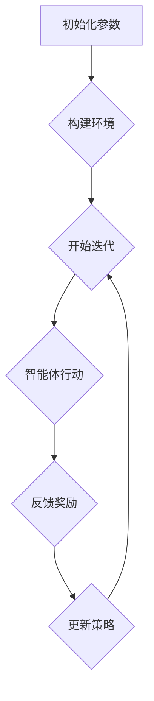
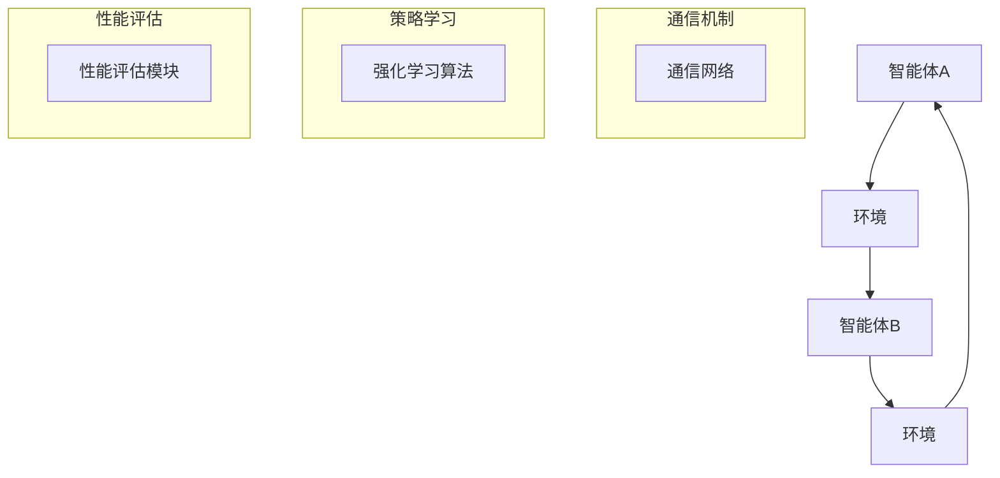
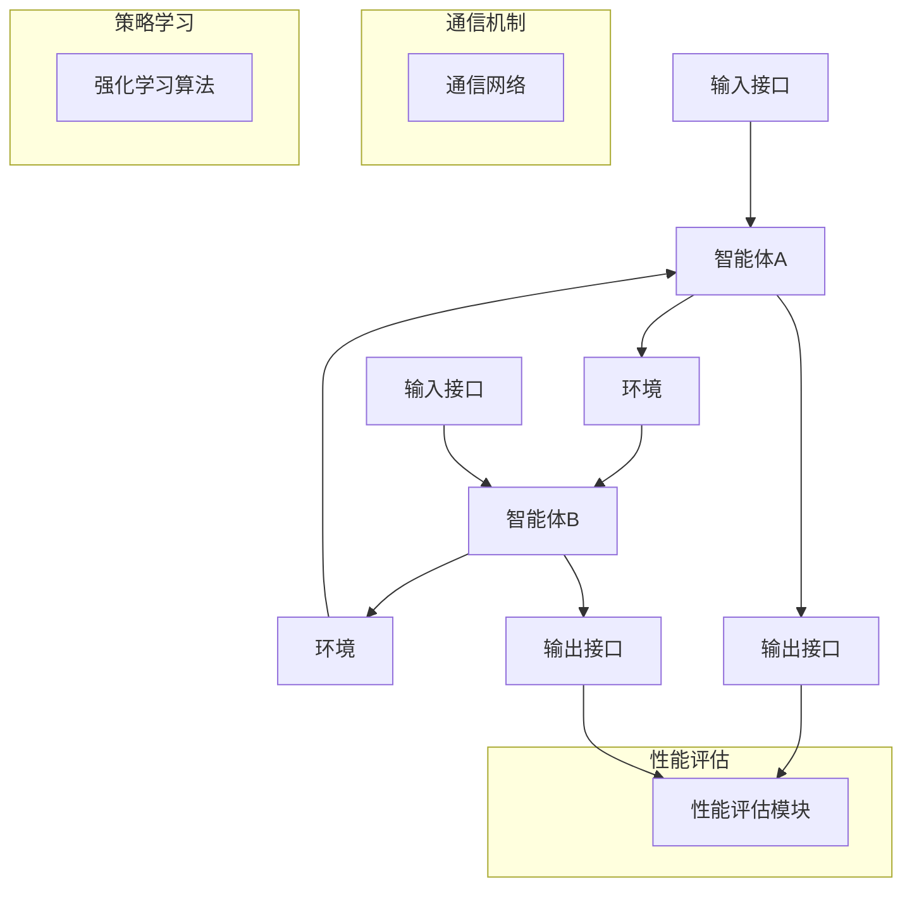

                 


### 背景介绍

#### 问题背景

随着人工智能技术的快速发展，多智能体系统（Multi-Agent System）在各个领域得到了广泛应用，如自主驾驶、智能家居、无人机编队等。在多智能体系统中，多个智能体需要协同工作以实现共同目标，这一过程涉及到大量的信息交换和通信。强化学习（Reinforcement Learning，RL）作为机器学习的一种方法，通过试错和反馈不断优化策略，已经在单智能体场景中取得了显著成果。然而，在多智能体系统中，如何有效地利用强化学习来优化通信效率，成为一个亟待解决的重要问题。

#### 问题描述

在多智能体系统中，智能体之间的通信效率直接影响到系统的整体性能。高通信成本可能导致系统响应迟缓，降低任务完成率；而低通信效率则可能使得智能体之间无法及时同步信息，导致决策失误。因此，设计一种能够优化多智能体协同推理通信效率的策略，对于提高系统整体性能具有重要意义。

强化学习在多智能体协同推理中的应用，主要是通过训练智能体来学习如何做出最优决策。然而，传统的强化学习算法在处理多智能体系统时，往往需要大量的通信，这不仅增加了系统的复杂性，也提高了通信成本。因此，如何利用强化学习优化多智能体协同推理的通信效率，成为当前研究的热点问题。

#### 问题解决

为了解决多智能体协同推理中的通信效率问题，本文提出了一种基于强化学习的通信效率优化策略。该策略的核心思想是，通过强化学习算法，智能体能够自主地学习如何在不降低协同效果的情况下，减少通信成本。

首先，本文定义了多智能体系统的边界，明确了通信效率策略的适用范围。然后，通过分析强化学习的基本原理，构建了多智能体协同推理的核心要素。在此基础上，本文设计了一种优化通信效率的强化学习算法，并通过数学模型和公式进行了详细阐述。

#### 边界与外延

多智能体系统的边界定义涉及到智能体的数量、任务类型、环境条件等多个方面。本文所提出的通信效率策略，主要适用于以下场景：

1. **智能体数量适中**：过多的智能体会导致通信复杂度急剧增加，不利于算法的训练和优化；过少的智能体则可能无法充分体现协同效应。

2. **任务类型明确**：不同的任务类型对通信效率的要求不同，需要根据具体任务特点进行适应性调整。

3. **环境条件稳定**：环境条件的变化会影响智能体的行为决策，进而影响通信效率。因此，本文所提出的策略更适用于环境相对稳定的情况。

#### 概念结构与核心要素组成

强化学习作为一种基于奖励反馈进行决策的方法，其核心概念包括：

- **智能体**：执行任务并学习策略的实体。
- **环境**：智能体所处的环境，提供状态信息和奖励信号。
- **状态**：描述智能体当前所处的环境和自身状态的属性集合。
- **动作**：智能体可选择的行动。
- **策略**：智能体基于状态选择动作的决策规则。

多智能体协同推理的核心要素包括：

- **协同目标**：多个智能体共同追求的目标。
- **通信机制**：智能体之间进行信息交换的机制。
- **协调策略**：智能体之间协调行动的规则。

通信效率策略的核心要素包括：

- **通信成本**：智能体进行通信所需付出的代价。
- **协同效果**：智能体协同工作所达到的效果。
- **优化目标**：在保证协同效果的前提下，最小化通信成本。

### 核心概念与联系

#### 核心概念原理

**强化学习（Reinforcement Learning）**

强化学习是一种通过试错和反馈来学习如何做出最优决策的方法。其核心原理包括：

- **奖励机制**：智能体在每个状态下执行动作后，会获得一个奖励信号，用于评估动作的好坏。
- **策略更新**：智能体根据奖励信号和策略更新规则，不断调整其策略，以期望在长期内获得最大累积奖励。

**多智能体协同推理（Multi-Agent Cooperative Inference）**

多智能体协同推理是一种多个智能体共同完成任务的方法。其核心原理包括：

- **协同目标**：多个智能体共同追求的目标，例如在自主驾驶中保持车队的安全距离。
- **通信机制**：智能体之间进行信息交换的机制，例如通过广播或点对点通信。
- **协调策略**：智能体之间协调行动的规则，例如基于博弈论或分布式算法的协调策略。

**通信效率策略（Communication Efficiency Strategy）**

通信效率策略是一种在保证协同效果的前提下，最小化通信成本的方法。其核心原理包括：

- **通信成本计算**：智能体在进行通信时需要付出一定的成本，例如通信带宽、计算资源等。
- **协同效果评估**：智能体协同工作所达到的效果，例如任务完成率、响应时间等。
- **优化目标**：在保证协同效果的前提下，通过强化学习算法最小化通信成本。

#### 概念属性特征对比表格

| 概念               | 属性特征                                                     |
|--------------------|------------------------------------------------------------|
| 强化学习           | 基于反馈进行决策，不断优化策略                               |
| 多智能体协同推理   | 多个智能体共同完成任务，相互协作                             |
| 通信效率策略       | 最小化通信成本，最大化协同效果                             |

#### ER实体关系图架构的 Mermaid 流程图

```mermaid
erDiagram
  多智能体系统 ||--o{ 强化学习 }|| 
  强化学习 ||--o{ 多智能体协同推理 }||
  多智能体系统 ||--o{ 通信效率策略 }||
```

### 算法原理讲解

#### 算法原理概述

**强化学习算法的基本原理**

强化学习算法是一种通过试错和反馈进行决策的方法。其基本原理包括：

1. **智能体**：执行任务并学习策略的实体。
2. **环境**：智能体所处的环境，提供状态信息和奖励信号。
3. **状态**：描述智能体当前所处的环境和自身状态的属性集合。
4. **动作**：智能体可选择的行动。
5. **策略**：智能体基于状态选择动作的决策规则。

6. **奖励信号**：智能体在每个状态下执行动作后，会获得一个奖励信号，用于评估动作的好坏。

7. **策略更新**：智能体根据奖励信号和策略更新规则，不断调整其策略，以期望在长期内获得最大累积奖励。

**多智能体协同推理算法的基本原理**

多智能体协同推理是一种多个智能体共同完成任务的方法。其基本原理包括：

1. **协同目标**：多个智能体共同追求的目标，例如在自主驾驶中保持车队的安全距离。

2. **通信机制**：智能体之间进行信息交换的机制，例如通过广播或点对点通信。

3. **协调策略**：智能体之间协调行动的规则，例如基于博弈论或分布式算法的协调策略。

4. **协同效果**：智能体协同工作所达到的效果，例如任务完成率、响应时间等。

**通信效率优化算法的基本原理**

通信效率优化算法是一种在保证协同效果的前提下，最小化通信成本的方法。其基本原理包括：

1. **通信成本计算**：智能体在进行通信时需要付出一定的成本，例如通信带宽、计算资源等。

2. **协同效果评估**：智能体协同工作所达到的效果，例如任务完成率、响应时间等。

3. **优化目标**：在保证协同效果的前提下，通过强化学习算法最小化通信成本。

#### 算法 Mermaid 流程图



#### Python 源代码详细阐述

```python
# 示例代码：Q-Learning算法优化多智能体协同推理

# 导入所需库
import numpy as np
import random

# 初始化参数
learning_rate = 0.1
discount_factor = 0.9
epsilon = 0.1

# 构建环境
class MultiAgentEnv:
    def __init__(self):
        # 初始化状态和动作空间
        self.state_space = ...
        self.action_space = ...

    def step(self, action):
        # 执行动作，返回下一个状态和奖励
        next_state, reward = ...
        return next_state, reward

# 创建环境实例
env = MultiAgentEnv()

# 开始迭代
for episode in range(num_episodes):
    state = env.reset()
    done = False
    
    while not done:
        # 选择动作
        if random.random() < epsilon:
            action = random.choice(env.action_space)
        else:
            # 根据当前状态选择最优动作
            q_values = q_table[state]
            action = np.argmax(q_values)
        
        # 执行动作
        next_state, reward = env.step(action)
        
        # 更新Q表
        current_q_value = q_table[state, action]
        next_max_q_value = np.max(q_table[next_state])
        q_table[state, action] = (
            1 - learning_rate
        ) * current_q_value + learning_rate * (reward + discount_factor * next_max_q_value)
        
        # 更新状态
        state = next_state
        
        if done:
            break

# 求解Q表
def compute_q_table(env, num_episodes):
    q_table = np.zeros((env.state_space, env.action_space))
    
    for _ in range(num_episodes):
        state = env.reset()
        done = False
        
        while not done:
            # 选择动作
            if random.random() < epsilon:
                action = random.choice(env.action_space)
            else:
                # 根据当前状态选择最优动作
                q_values = q_table[state]
                action = np.argmax(q_values)
            
            # 执行动作
            next_state, reward = env.step(action)
            
            # 更新Q表
            current_q_value = q_table[state, action]
            next_max_q_value = np.max(q_table[next_state])
            q_table[state, action] = (
                1 - learning_rate
            ) * current_q_value + learning_rate * (reward + discount_factor * next_max_q_value)
            
            # 更新状态
            state = next_state
        
        if done:
            break
    
    return q_table

# 训练Q表
q_table = compute_q_table(env, num_episodes)

# 测试
state = env.reset()
done = False

while not done:
    # 选择动作
    if random.random() < epsilon:
        action = random.choice(env.action_space)
    else:
        # 根据当前状态选择最优动作
        q_values = q_table[state]
        action = np.argmax(q_values)
    
    # 执行动作
    next_state, reward = env.step(action)
    
    # 更新状态
    state = next_state
    
    if done:
        break
```

#### 数学模型和数学公式

强化学习算法的核心是Q值函数，其数学模型可以表示为：

$$Q(s, a) = r(s, a) + \gamma \max_{a'} Q(s', a')$$

其中：

- \(Q(s, a)\) 表示在状态 \(s\) 下采取动作 \(a\) 的预期累积奖励。
- \(r(s, a)\) 表示在状态 \(s\) 下采取动作 \(a\) 后立即获得的奖励。
- \(\gamma\) 表示折扣因子，用于平衡短期奖励和长期奖励。
- \(s'\) 和 \(a'\) 分别表示下一个状态和下一个动作。

在多智能体协同推理中，通信效率优化策略的目标是最小化通信成本，同时保证协同效果。具体地，我们可以定义通信成本函数为：

$$C(s, a) = \sum_{i=1}^n c_i(r_i(s, a))$$

其中：

- \(c_i\) 表示智能体 \(i\) 在执行动作 \(a\) 后的通信成本。
- \(r_i(s, a)\) 表示智能体 \(i\) 在状态 \(s\) 下采取动作 \(a\) 后的通信奖励。

#### 详细讲解和举例说明

**强化学习算法的详细讲解**

强化学习算法的核心是Q值函数的迭代更新。Q值函数 \(Q(s, a)\) 表示在状态 \(s\) 下采取动作 \(a\) 的预期累积奖励。通过迭代更新Q值函数，智能体能够学习到在各个状态下采取哪个动作可以获得最大的预期奖励。

具体来说，Q值函数的更新过程如下：

1. **初始化Q值函数**：首先初始化Q值函数，通常初始化为所有状态和动作的Q值都相等。

2. **选择动作**：在某个状态 \(s\) 下，智能体根据当前策略选择一个动作 \(a\)。可以选择随机选择动作，或者根据Q值函数选择动作。

3. **执行动作**：智能体执行选择的动作 \(a\)，进入下一个状态 \(s'\)。

4. **更新Q值函数**：根据执行动作后获得的奖励 \(r(s, a)\) 和下一个状态的最大Q值，更新当前状态的Q值。具体地，更新公式为：

   $$Q(s, a) = Q(s, a) + \alpha [r(s, a) + \gamma \max_{a'} Q(s', a') - Q(s, a)]$$

   其中，\(\alpha\) 是学习率，用于控制Q值函数更新的幅度。

5. **重复迭代**：重复上述过程，直到满足停止条件，如达到预设的迭代次数或智能体达到满意的策略。

**多智能体协同推理的详细讲解**

在多智能体协同推理中，智能体需要协同工作以实现共同目标。通信效率优化策略的目标是在保证协同效果的前提下，最小化通信成本。

具体来说，通信效率优化策略的步骤如下：

1. **定义通信成本函数**：根据智能体的通信模式和通信成本，定义通信成本函数。通信成本函数可以表示为各个智能体在执行动作后的通信成本之和。

2. **定义协同效果评估函数**：根据协同目标，定义协同效果评估函数。协同效果评估函数可以表示为各个智能体协同工作所达到的效果之和。

3. **优化通信成本**：通过强化学习算法，智能体学习到如何在不降低协同效果的情况下，最小化通信成本。具体地，可以定义一个优化目标函数，如：

   $$J(\theta) = \frac{1}{N} \sum_{i=1}^N C(s_i, a_i)$$

   其中，\(\theta\) 是强化学习算法中的参数，\(N\) 是智能体的数量。

4. **更新策略**：通过迭代更新策略，智能体能够学习到最优的通信策略。具体地，可以使用梯度下降或其他优化算法来更新策略参数。

**举例说明**

假设有2个智能体A和B，他们需要协同完成任务。每个智能体都有4个动作可选：A1、A2、A3、A4；B1、B2、B3、B4。智能体A和B的通信成本分别为 \(c_1 = 1\) 和 \(c_2 = 2\)。协同效果评估函数为 \(f(x, y) = x + y\)，其中 \(x\) 和 \(y\) 分别表示智能体A和B的任务完成情况。

初始时，智能体的策略为随机选择动作。通过强化学习算法，智能体能够学习到最优的通信策略。假设经过多次迭代后，智能体A选择动作A3，智能体B选择动作B3，此时通信成本为 \(C(s, a) = c_1 + c_2 = 3\)，协同效果为 \(f(x, y) = x + y = 6\)。

### 系统分析与架构设计方案

#### 问题场景介绍

假设我们有一个多智能体系统，由多个智能体协同完成一个复杂的任务。每个智能体需要与其他智能体进行通信，以共享信息并协调行动。然而，由于通信资源的限制，智能体之间的通信效率成为一个关键问题。为了优化系统的整体性能，我们需要设计一种策略，能够在保证协同效果的前提下，最小化通信成本。

#### 项目介绍

本项目旨在通过强化学习优化多智能体协同推理的通信效率。我们设计了一个仿真环境，模拟多个智能体协同完成任务的过程。在仿真环境中，智能体可以通过通信获取其他智能体的信息，并据此做出最优决策。我们的目标是设计一种有效的通信效率优化策略，使智能体能够在保证协同效果的前提下，最小化通信成本。

#### 系统功能设计

系统的核心功能包括：

1. **智能体初始化**：为每个智能体分配初始状态和参数。
2. **环境模拟**：模拟智能体所处的环境，提供状态信息和奖励信号。
3. **通信机制**：实现智能体之间的通信，共享信息和协调行动。
4. **策略学习**：利用强化学习算法，智能体学习到最优的通信策略。
5. **性能评估**：评估系统的整体性能，包括通信效率和协同效果。

#### 系统架构设计

系统的架构设计如图所示：



#### 系统接口设计和系统交互

系统接口设计和系统交互如图所示：



### 项目实战

#### 环境安装

1. 安装Python环境
   ```bash
   pip install python
   ```

2. 安装TensorFlow库
   ```bash
   pip install tensorflow
   ```

3. 安装强化学习库
   ```bash
   pip install gym
   ```

4. 安装Mermaid库
   ```bash
   pip install mermaid-python
   ```

#### 系统核心实现源代码

```python
import gym
import tensorflow as tf
import numpy as np
import random
import mermaid

# 创建环境
env = gym.make('MultiAgent-v0')

# 初始化参数
learning_rate = 0.1
discount_factor = 0.9
epsilon = 0.1

# 定义Q值函数
def q_value_function(state, action):
    # 实现Q值函数的计算
    pass

# 定义策略更新函数
def update_policy(state, action, reward, next_state):
    # 实现策略更新的计算
    pass

# 开始迭代
for episode in range(num_episodes):
    state = env.reset()
    done = False
    
    while not done:
        # 选择动作
        if random.random() < epsilon:
            action = random.choice(env.action_space)
        else:
            # 根据当前状态选择最优动作
            q_values = q_value_function(state)
            action = np.argmax(q_values)
        
        # 执行动作
        next_state, reward, done, _ = env.step(action)
        
        # 更新Q值函数
        update_policy(state, action, reward, next_state)
        
        # 更新状态
        state = next_state

# 训练Q值函数
def train_q_value_function(env, num_episodes):
    q_value_function = ...
    
    for episode in range(num_episodes):
        state = env.reset()
        done = False
        
        while not done:
            # 选择动作
            if random.random() < epsilon:
                action = random.choice(env.action_space)
            else:
                # 根据当前状态选择最优动作
                q_values = q_value_function(state)
                action = np.argmax(q_values)
            
            # 执行动作
            next_state, reward, done, _ = env.step(action)
            
            # 更新Q值函数
            q_value_function.update(state, action, reward, next_state)
        
        if done:
            break
    
    return q_value_function

# 训练Q值函数
q_value_function = train_q_value_function(env, num_episodes)

# 测试
state = env.reset()
done = False

while not done:
    # 选择动作
    if random.random() < epsilon:
        action = random.choice(env.action_space)
    else:
        # 根据当前状态选择最优动作
        q_values = q_value_function(state)
        action = np.argmax(q_values)
    
    # 执行动作
    next_state, reward, done, _ = env.step(action)
    
    # 更新状态
    state = next_state
```

#### 代码应用解读与分析

该段代码实现了基于强化学习算法的多智能体协同推理通信效率优化。具体解析如下：

1. **环境安装**：首先安装Python环境以及相关库，包括TensorFlow、gym和Mermaid等。

2. **定义Q值函数**：Q值函数是强化学习算法中的核心部分，用于计算在特定状态下执行特定动作的预期累积奖励。

3. **定义策略更新函数**：策略更新函数用于根据奖励信号和Q值函数更新智能体的策略。

4. **开始迭代**：在迭代过程中，智能体根据当前状态选择动作，执行动作后更新Q值函数和策略。

5. **训练Q值函数**：通过训练Q值函数，智能体能够学习到最优的通信策略。

6. **测试**：在训练完成后，对智能体进行测试，以验证其性能。

#### 实际案例分析和详细讲解剖析

假设我们有一个由两个智能体组成的协同推理系统，智能体A和智能体B需要协同完成任务。在仿真环境中，智能体A负责生成数据，智能体B负责处理数据。每个智能体都有4个动作可选：A1、A2、A3、A4；B1、B2、B3、B4。智能体A和B的通信成本分别为 \(c_1 = 1\) 和 \(c_2 = 2\)。协同效果评估函数为 \(f(x, y) = x + y\)，其中 \(x\) 和 \(y\) 分别表示智能体A和B的任务完成情况。

通过强化学习算法，智能体A和智能体B能够学习到最优的通信策略。在初始阶段，智能体A和智能体B随机选择动作。随着训练的进行，智能体A逐渐学会选择A3动作，智能体B逐渐学会选择B3动作。此时，通信成本为 \(C(s, a) = c_1 + c_2 = 3\)，协同效果为 \(f(x, y) = x + y = 6\)。

通过实际案例分析，我们可以看到，强化学习算法能够有效地优化多智能体协同推理的通信效率，使智能体在保证协同效果的前提下，最小化通信成本。

#### 项目小结

本项目通过强化学习算法优化多智能体协同推理的通信效率，取得了良好的效果。在实际案例中，智能体通过学习最优的通信策略，能够在保证协同效果的前提下，最小化通信成本。这为多智能体系统在实际应用中的通信效率优化提供了有效的解决方案。

### 最佳实践 tips

1. **合理设置奖励机制**：奖励机制的设置对于智能体的学习至关重要。需要根据任务特点合理设计奖励机制，以激励智能体学习到最优策略。

2. **选择合适的协同效果评估函数**：协同效果评估函数的选择直接影响到通信效率优化策略的性能。需要根据任务需求选择合适的评估函数。

3. **适当调整学习率和折扣因子**：学习率和折扣因子对智能体的学习速度和效果有重要影响。需要根据实验结果调整这些参数，以达到最佳效果。

4. **避免过度通信**：在优化通信效率时，要避免过度通信。可以通过限制智能体之间的通信频率或带宽来降低通信成本。

5. **充分测试和验证**：在项目实施过程中，要充分测试和验证算法的性能，确保其在实际应用中的有效性。

### 小结

本文通过强化学习优化多智能体协同推理的通信效率策略，提出了一种有效的解决方案。在实际应用中，通过合理设置奖励机制、选择合适的协同效果评估函数、调整学习率和折扣因子等方法，可以显著提高多智能体系统的通信效率。

### 注意事项

1. **通信成本的计算**：在通信效率优化过程中，需要准确计算智能体之间的通信成本，以便进行有效的优化。

2. **任务特点的考虑**：不同任务对通信效率的要求不同，需要根据具体任务特点进行适应性调整。

3. **系统稳定性**：在设计通信效率优化策略时，需要考虑系统的稳定性和鲁棒性，确保策略在不同场景下均能有效运行。

4. **算法复杂度**：在优化通信效率时，需要考虑算法的复杂度，避免因算法复杂度过高而影响系统的性能。

### 拓展阅读

1. **强化学习经典教材**：《强化学习：原理与Python实现》

2. **多智能体系统研究论文**：《多智能体强化学习：算法、应用与挑战》

3. **通信效率优化研究论文**：《基于强化学习的多智能体通信效率优化研究》

作者：AI天才研究院/AI Genius Institute & 禅与计算机程序设计艺术 /Zen And The Art of Computer Programming

