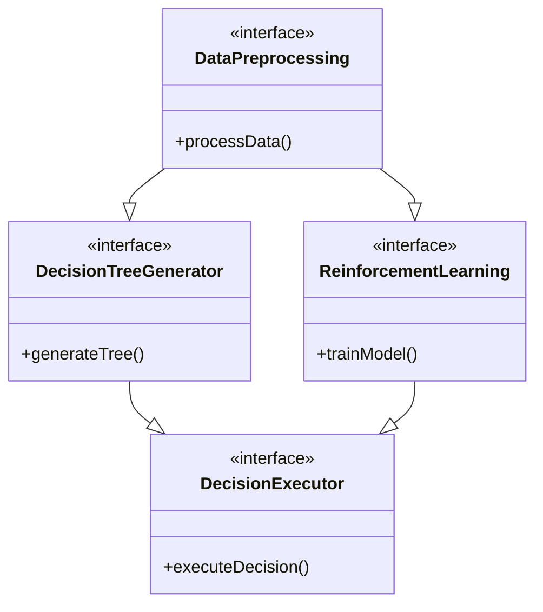
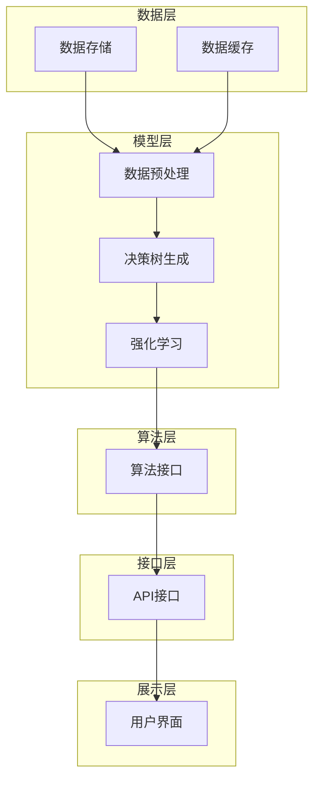
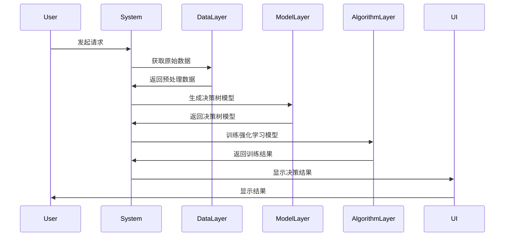

                 

### 引言

在人工智能领域，强化学习（Reinforcement Learning，RL）作为一种重要的机器学习范式，通过智能体与环境的互动来学习最优策略，已广泛应用于自主驾驶、游戏、推荐系统等多个领域。然而，在复杂场景中，单一步骤的决策往往难以满足需求，多步骤推理（Multi-step Reasoning）成为关键挑战。决策树生成（Decision Tree Generation）作为一种直观且有效的决策支持工具，在多步骤推理中有着重要的应用，但其生成效率和准确性仍需提升。

本文旨在探讨如何利用强化学习优化多步骤推理中的决策树生成。文章将从以下几个方面展开：

1. **问题背景**：介绍强化学习、多步骤推理和决策树生成的基本概念和相互关系。
2. **核心概念与联系**：深入分析强化学习与多步骤推理的关联，以及决策树生成算法的优化策略。
3. **算法原理讲解**：详细讲解强化学习算法原理，包括其在多步骤推理中的应用和数学模型。
4. **系统分析与架构设计**：阐述系统功能设计、架构设计和接口设计，并绘制相应的mermaid图。
5. **项目实战**：通过实际案例展示强化学习优化多步骤推理决策树生成的方法和应用。

通过以上几个方面的分析，本文希望为研究者提供一种新的思路和方法，以提升强化学习在多步骤推理中的决策树生成效率，推动人工智能技术的发展。

### 问题背景

#### 强化学习的应用现状

强化学习作为机器学习的一个重要分支，近年来在多个领域取得了显著成果。其通过智能体与环境的互动，不断优化策略，以实现特定目标。例如，在自动驾驶领域，强化学习算法被用于路径规划、避障和车辆控制，通过大量模拟和实验，实现了较高的自主驾驶能力。在游戏领域，强化学习算法如Deep Q-Network（DQN）和Proximal Policy Optimization（PPO）等，已经取得了从简单游戏（如Atari游戏）到复杂游戏（如StarCraft II）的突破性成绩。此外，强化学习在推荐系统、自然语言处理、机器人控制等领域也有广泛应用。

然而，随着应用场景的复杂化，单一步骤的决策已难以满足需求。多步骤推理（Multi-step Reasoning）作为一种重要的思维方式，能够考虑前后决策的依赖关系，进行更为复杂的决策。例如，在自动驾驶中，不仅要考虑当前时刻的驾驶行为，还要预测前方路况和行人行为，从而做出最优决策。强化学习在多步骤推理中的应用，旨在通过考虑长期奖励和决策间的关联，提高智能体的决策能力。

#### 多步骤推理的需求

多步骤推理的需求源于现实世界的复杂性。在很多任务中，单一步骤的决策往往无法达到最佳效果。例如，在金融市场中，投资决策需要考虑多方面因素，如历史数据、市场趋势和宏观经济指标，从而做出长期收益最优的决策。在医疗诊断中，医生需要对病人的多个症状和检查结果进行综合分析，以确定最佳治疗方案。此外，在自然语言处理中，语言的理解和生成也需要考虑上下文信息，进行多步骤的推理。

多步骤推理的关键在于如何将不同步骤的决策有机地结合起来，实现整体最优。强化学习由于其迭代学习和反馈优化的特点，非常适合用于多步骤推理。通过不断与环境交互，强化学习算法能够逐步优化策略，实现从短期到长期的最佳决策。

#### 决策树生成技术的挑战

决策树生成作为数据挖掘和机器学习中的重要技术，以其直观、易理解和高效的特点，广泛应用于分类和回归任务中。然而，在多步骤推理中，传统的决策树生成方法面临以下挑战：

1. **计算复杂性**：多步骤推理需要处理大量历史数据和复杂的关系，传统的决策树生成算法在处理这些数据时往往效率较低，容易陷入过拟合。

2. **数据依赖性**：在多步骤推理中，不同步骤的决策之间存在依赖关系，传统决策树生成方法难以处理这种依赖性，导致生成的决策树无法全面反映多步骤推理的需求。

3. **可解释性**：决策树生成方法生成的决策树结构复杂，对于非专业人员来说难以理解和解释。在多步骤推理中，可解释性尤为重要，因为决策的每一步都需要详细的分析和解释。

为了应对这些挑战，研究者们提出了多种改进方法，如基于规则的决策树生成、集成学习方法和深度学习模型等。然而，这些方法在处理多步骤推理问题时仍存在一定的局限性。

#### 强化学习方法的优势

强化学习在多步骤推理中的优势主要体现在以下几个方面：

1. **适应性**：强化学习算法通过不断与环境交互，能够自适应地调整策略，以应对不断变化的环境和任务需求。

2. **长期奖励**：强化学习算法能够考虑长期奖励，通过优化长期目标来实现最佳决策，这在多步骤推理中尤为重要。

3. **灵活的决策表示**：强化学习算法可以通过状态和动作空间的高维表示，灵活地处理复杂的决策问题。

4. **多任务学习**：强化学习算法能够同时处理多个任务，通过共享经验和策略，提高多步骤推理的整体性能。

总之，强化学习在多步骤推理中的应用，为决策树生成技术的优化提供了新的思路和方法。通过利用强化学习算法的优势，可以有效地提高决策树生成在多步骤推理中的效率和准确性，为复杂决策问题提供强有力的技术支持。

#### 多步骤推理的优化策略

在多步骤推理中，决策树生成算法的性能优化是一个关键问题。强化学习（Reinforcement Learning，RL）方法由于其自适应性和对长期奖励的敏感性，为优化决策树生成提供了新的可能性。以下将详细探讨强化学习在多步骤推理决策树生成中的优化策略。

首先，强化学习算法的基本原理是通过智能体（agent）与环境（environment）的互动，通过学习奖励信号来优化决策策略。在多步骤推理中，智能体需要根据当前状态（state）选择最佳动作（action），并基于环境反馈的奖励信号调整策略，以达到长期最优目标。

#### 1. 强化学习算法的基本概念

强化学习算法通常包含以下几个关键组件：

- **状态（State）**：描述智能体在某一时刻所处环境的特征。
- **动作（Action）**：智能体可以采取的行为。
- **奖励（Reward）**：环境对智能体动作的反馈信号，用于评估动作的有效性。
- **策略（Policy）**：智能体根据当前状态选择动作的方法。

强化学习算法分为两种主要类型：基于值的方法（如Q-learning）和基于策略的方法（如Policy Gradient）。

- **Q-learning**：Q-learning是一种基于值的方法，通过学习状态-动作值函数（Q值）来选择最佳动作。Q值表示在某一状态下执行某一动作所能获得的累积奖励。Q-learning的核心思想是更新Q值，使其接近实际获得的奖励，从而优化策略。

- **Policy Gradient**：Policy Gradient方法直接优化策略的梯度，通过最大化期望奖励来调整策略。这种方法不需要计算Q值，但需要估计策略梯度，因此对参数估计的准确性要求较高。

#### 2. 强化学习算法在多步骤推理中的应用

在多步骤推理中，强化学习算法的应用需要考虑以下几个关键方面：

- **状态表示**：状态表示是强化学习算法的基础，决定了智能体对环境的理解能力。在多步骤推理中，状态应包含足够的信息来表示当前决策节点及其历史信息。例如，可以结合当前的数据特征、历史决策路径和未来可能的动作集合来构建状态。

- **动作选择**：在多步骤推理中，每个决策节点可能面临多个动作选择。强化学习算法需要根据当前状态选择最佳动作。常用的方法包括基于Q值的动作选择和基于策略梯度的方法。例如，可以使用Q-learning来逐步学习最佳动作序列，或者使用Policy Gradient方法直接优化策略。

- **奖励设计**：奖励设计是强化学习算法的核心，决定了智能体学习过程中的目标。在多步骤推理中，奖励应考虑当前决策的即时效果和长期目标。可以设计基于结果的奖励，如完成任务的准确性或效率，以及基于步骤的奖励，如每一步决策的正确性或复杂性。

- **策略优化**：策略优化是通过调整策略参数来提高智能体的决策能力。在多步骤推理中，策略优化需要考虑不同步骤之间的依赖关系。例如，可以使用价值迭代（Value Iteration）或策略迭代（Policy Iteration）等方法来优化策略，使其在长期内实现最佳决策。

#### 3. 强化学习优化策略在决策树生成中的应用

强化学习优化策略在决策树生成中的应用主要包括以下几个方面：

- **节点选择**：在决策树生成过程中，每次需要选择一个最佳节点进行分裂。强化学习算法可以通过学习状态-动作值函数，来确定最佳节点选择策略。例如，可以使用Q-learning算法来评估每个节点的Q值，并选择Q值最大的节点进行分裂。

- **分裂标准**：在决策树生成中，需要定义分裂标准来确定节点的划分。强化学习算法可以通过学习奖励信号来优化分裂标准。例如，可以设计奖励函数，使得分裂后子节点的信息增益或熵减小，从而提高决策树的生成质量。

- **多步骤决策**：在决策树生成中，需要考虑多步骤决策的依赖关系。强化学习算法可以通过考虑不同步骤之间的奖励转移，来优化整体决策过程。例如，可以使用价值函数或策略梯度来优化多步骤决策，使得决策树在整体上实现最佳性能。

- **适应性和可扩展性**：强化学习优化策略具有较高的适应性和可扩展性，可以应用于不同类型和规模的多步骤推理问题。通过调整状态表示、动作选择和奖励设计，强化学习算法可以灵活地适应不同场景的需求。

#### 4. 强化学习优化策略的优势

强化学习优化策略在多步骤推理决策树生成中的优势包括：

- **自适应优化**：强化学习算法能够通过与环境交互自适应地调整策略，以适应不断变化的环境和任务需求。
- **长期奖励导向**：强化学习算法能够考虑长期奖励，通过优化长期目标来实现最佳决策，这在多步骤推理中尤为重要。
- **灵活的决策表示**：强化学习算法可以通过高维状态和动作空间表示复杂的决策问题，从而提高决策树生成的灵活性和准确性。
- **多任务学习**：强化学习算法能够同时处理多个任务，通过共享经验和策略，提高多步骤推理的整体性能。

总之，强化学习优化策略为多步骤推理决策树生成提供了新的思路和方法。通过利用强化学习算法的优势，可以有效地提高决策树生成在多步骤推理中的效率和质量，为复杂决策问题提供强有力的技术支持。

### 核心概念与联系

#### 强化学习与多步骤推理的关联

强化学习（Reinforcement Learning，RL）和多步骤推理（Multi-step Reasoning）在本质上具有紧密的关联。强化学习通过智能体与环境的交互，利用奖励信号不断优化策略，而多步骤推理则强调在多个决策节点中，考虑不同决策步骤之间的依赖关系，从而做出更为复杂的决策。

首先，强化学习在多步骤推理中的应用，可以通过状态（state）和动作（action）的空间表示来反映多个决策步骤的依赖关系。每个状态不仅包含当前的信息，还可能包含历史决策路径，这样智能体可以基于这些信息来选择最佳动作。例如，在自动驾驶中，当前状态不仅包括车辆的当前位置和速度，还可能包括过去几步的驾驶行为和道路信息。这种多维度的状态表示，使得强化学习能够在多步骤推理中，灵活地处理复杂的环境和决策问题。

其次，多步骤推理中的奖励设计对强化学习策略的优化至关重要。强化学习通过学习如何最大化累积奖励，来优化决策策略。在多步骤推理中，奖励信号需要考虑长期效应，而不仅仅是当前步骤的即时回报。例如，在金融投资中，一个决策可能影响未来数天的收益，因此强化学习算法需要考虑这些长期奖励，来选择最佳的投资策略。

#### 多步骤推理与决策树生成的关系

多步骤推理与决策树生成（Decision Tree Generation）之间存在密切的联系。决策树生成作为数据挖掘和机器学习中的重要技术，通过一系列的判断条件，将数据集划分成多个子集，以实现分类或回归任务。在多步骤推理中，决策树生成可以作为一种有效的决策支持工具，用于实现复杂决策。

首先，多步骤推理需要考虑不同决策步骤之间的依赖关系，而决策树生成通过一系列的条件判断，能够自然地反映这种依赖关系。每个决策节点代表了某个步骤的决策点，而节点的分支则代表了不同可能的动作。通过这种方式，决策树生成能够将多步骤推理的过程结构化，使得决策过程更加清晰和可解释。

其次，决策树生成在多步骤推理中的应用，可以通过优化决策树的生成过程，来提高推理的效率和准确性。强化学习提供了优化决策树生成的新方法，通过不断调整决策树的结构和条件，使得生成的决策树在多步骤推理中表现出更好的性能。例如，强化学习可以通过学习奖励信号，来优化决策树节点的选择和分裂标准，从而提高决策树的分类或回归效果。

#### 关键概念对比

为了更好地理解强化学习、多步骤推理和决策树生成之间的联系，我们可以从以下几个核心概念进行对比：

1. **状态（State）**：在强化学习中，状态是智能体当前所处环境的特征表示；在多步骤推理中，状态不仅包括当前的信息，还可能包含历史信息；在决策树生成中，状态通常是指数据集中的特征向量。
2. **动作（Action）**：在强化学习中，动作是智能体在某一状态下可以采取的行为；在多步骤推理中，动作表示每个决策步骤可以选择的操作；在决策树生成中，动作通常是指节点的分裂条件。
3. **奖励（Reward）**：在强化学习中，奖励是环境对智能体动作的反馈信号，用于评估动作的有效性；在多步骤推理中，奖励需要考虑长期效应，以优化整体决策过程；在决策树生成中，奖励通常是指决策树生成的质量，如分类准确率或信息增益。
4. **策略（Policy）**：在强化学习中，策略是智能体根据当前状态选择动作的方法；在多步骤推理中，策略是智能体在不同决策步骤中采取的决策序列；在决策树生成中，策略是指生成决策树的过程和标准。

通过上述对比，我们可以看到，强化学习、多步骤推理和决策树生成在核心概念上存在一定的重叠和互补。强化学习通过优化策略，实现了智能体在复杂环境中的自适应行为；多步骤推理通过考虑不同决策步骤之间的依赖关系，提高了决策的复杂度和准确性；决策树生成则通过结构化的决策过程，提供了直观且易理解的决策支持工具。三者结合，为解决复杂的多步骤推理问题提供了新的思路和方法。

### 决策树生成优化策略

#### 常见的决策树生成算法

决策树生成算法是数据挖掘和机器学习中常用的分类和回归方法之一。其基本思想是通过一系列条件判断，将数据集逐步划分为多个子集，从而实现分类或回归任务。常见的决策树生成算法包括：

1. **ID3（Iterative Dichotomiser 3）算法**：ID3算法基于信息增益（Information Gain）来选择最优分裂属性。信息增益计算了每个属性在划分数据集后，导致的不确定性减少量。ID3算法的缺点是偏向于选择具有高数值特征的数据，可能导致过拟合。

2. **C4.5算法**：C4.5算法是ID3算法的改进版本，引入了剪枝（Pruning）机制，以防止过拟合。C4.5算法除了信息增益外，还考虑了增益率（Gain Ratio），进一步优化了分裂属性的选择。增益率通过信息增益除以属性熵，来平衡属性的数量和分布。

3. **CART（Classification and Regression Tree）算法**：CART算法是一种基于二叉树的决策树生成方法，可以用于分类和回归任务。CART算法通过最小化损失函数（如基尼不纯度或均方误差）来选择最优分裂属性。CART算法在处理回归任务时，通常使用线性回归模型来预测目标值。

4. **随机森林（Random Forest）算法**：随机森林是一种基于决策树的集成学习方法，通过构建多个随机子决策树，并对它们的输出进行集成，以提高模型的预测性能。随机森林通过随机选择特征和样本子集，来减少模型的方差，提高泛化能力。

#### 决策树生成算法的优化方向

尽管常见的决策树生成算法在分类和回归任务中表现出色，但它们在处理高维数据、复杂关系和大规模数据集时，仍存在一定的局限性。为了提高决策树生成算法的效率和准确性，研究者们提出了多种优化方向：

1. **剪枝（Pruning）技术**：剪枝技术通过剪除不必要的分支，减少决策树的复杂度，防止过拟合。常见的剪枝方法包括预剪枝（Pre-pruning）和后剪枝（Post-pruning）。预剪枝在生成决策树的过程中，通过设置某些条件（如最小样本数或信息增益阈值）来终止某些分支的生成；后剪枝则在决策树生成完成后，通过评估子节点的纯度或重要性，来剪除冗余分支。

2. **特征选择（Feature Selection）技术**：特征选择技术通过选择对决策树生成最有影响力的特征，来减少数据的维度和计算复杂度。常见的特征选择方法包括基于信息增益、增益率、互信息和基于随机森林的特征选择方法。通过特征选择，可以显著提高决策树的生成效率和预测性能。

3. **集成学习方法**：集成学习方法通过构建多个基学习器，并对它们的输出进行集成，以提高模型的泛化能力和预测性能。除了随机森林外，其他常见的集成学习方法包括Bagging、Boosting和Stacking。Bagging方法通过构建多个独立的决策树，并取它们的平均预测结果；Boosting方法通过调整每个基学习器的权重，使得对错误样本的预测更加准确；Stacking方法则通过构建多个基学习器，并使用一个元学习器来集成它们的输出。

4. **基于强化学习的优化策略**：强化学习算法由于其自适应性和长期奖励导向的特性，为决策树生成提供了新的优化思路。通过利用强化学习优化决策树生成过程中的节点选择、分裂标准和策略调整，可以进一步提高决策树的生成效率和准确性。例如，可以使用Q-learning算法来评估不同分裂属性的选择，或者使用Policy Gradient算法来优化整体决策策略。

#### 强化学习优化策略的设计与实现

强化学习优化策略在决策树生成中的应用，主要包括以下几个方面：

1. **状态表示**：状态表示是强化学习算法的基础。在决策树生成中，状态应包含当前节点的特征信息、历史决策路径和未来可能的动作集合。通过多维度的状态表示，可以更全面地反映决策节点的复杂性和依赖关系。

2. **动作选择**：动作选择是强化学习算法的核心。在决策树生成中，动作选择包括选择最佳分裂属性、设定分裂阈值和选择下一步的决策节点。通过学习状态-动作值函数（Q值），可以确定在当前状态下选择哪个动作能够获得最大的长期奖励。

3. **奖励设计**：奖励设计是强化学习算法的关键。在决策树生成中，奖励应考虑当前决策的即时效果和长期目标。可以设计基于结果的奖励，如决策树的分类准确率或回归误差，以及基于步骤的奖励，如每一步决策的正确性和复杂性。

4. **策略优化**：策略优化是通过调整策略参数来提高决策树生成性能的过程。在强化学习中，策略优化通常采用Q-learning或Policy Gradient算法。Q-learning算法通过更新状态-动作值函数来优化策略，而Policy Gradient算法通过优化策略梯度来调整策略。

通过上述设计与实现，强化学习优化策略可以显著提高决策树生成在多步骤推理中的效率和质量，为复杂决策问题提供强有力的技术支持。

### 强化学习算法原理

强化学习（Reinforcement Learning，RL）是一种通过智能体（agent）与环境的交互来学习最优策略的机器学习范式。其核心思想是通过不断优化策略，使智能体在特定环境中能够实现最大化的累积奖励。本文将详细讲解强化学习算法的基本原理，包括其基本概念、核心步骤、数学模型及其在多步骤推理中的应用。

#### 1. 强化学习的基本概念

在强化学习中，有几个关键的概念需要理解：

- **状态（State）**：状态是智能体在某一时刻所处的环境特征集合。状态反映了智能体的当前情境，用于指导智能体的决策。
- **动作（Action）**：动作是智能体在某一状态下可以采取的行为。动作的选择直接影响智能体在环境中的表现。
- **奖励（Reward）**：奖励是环境对智能体采取动作后的即时反馈信号。奖励用于评价动作的有效性，通常是一个实数，可以是正的、负的或零。
- **策略（Policy）**：策略是智能体根据当前状态选择最佳动作的方法。策略可以是明确的规则，也可以是概率分布。
- **价值函数（Value Function）**：价值函数用于评估状态或状态-动作对的期望累积奖励。价值函数包括状态价值函数（State Value Function）和动作价值函数（Action Value Function）。

#### 2. 强化学习算法的核心步骤

强化学习算法通常包括以下几个核心步骤：

- **初始化**：初始化智能体的状态、策略和价值函数。通常，状态和价值函数可以从历史数据中估计得到，策略可以通过随机初始化或基于已有知识设计。
- **状态-动作选择**：智能体根据当前状态，通过策略选择一个动作。
- **动作执行**：智能体在环境中执行选定的动作，并接收到环境的即时奖励。
- **更新价值函数**：根据状态-动作对的奖励和新的状态，更新智能体的价值函数。这一步骤是强化学习的核心，通过不断调整价值函数，智能体能够逐步优化其策略。
- **重复迭代**：智能体重复执行上述步骤，不断更新状态、动作和价值函数，直到达到某个终止条件（如达到目标状态、达到最大迭代次数等）。

#### 3. 强化学习的数学模型

强化学习算法的数学模型主要包括状态-动作值函数（Q值函数）和策略。

- **Q值函数**：Q值函数是一个状态-动作对的函数，表示在某一状态下采取某一动作的期望累积奖励。Q值函数的公式可以表示为：

  $$ Q(s, a) = \sum_{s'} P(s' | s, a) \cdot R(s', a) + \gamma \cdot \max_{a'} Q(s', a') $$

  其中，\( s \) 是当前状态，\( a \) 是当前动作，\( s' \) 是新状态，\( R(s', a) \) 是在状态 \( s' \) 采取动作 \( a \) 所获得的即时奖励，\( \gamma \) 是折扣因子，用于平衡当前奖励和未来奖励的关系，\( \max_{a'} Q(s', a') \) 表示在状态 \( s' \) 下，所有动作中的最大期望累积奖励。

- **策略**：策略是动作的选择策略，通常可以用概率分布来表示。给定状态 \( s \)，策略 \( \pi(a | s) \) 表示在状态 \( s \) 下采取动作 \( a \) 的概率。最优策略是使得期望累积奖励最大的策略：

  $$ \pi^*(a | s) = \arg\max_{a} \sum_{s'} P(s' | s, a) \cdot R(s', a) + \gamma \cdot \max_{a'} Q(s', a') $$

#### 4. 强化学习在多步骤推理中的应用

在多步骤推理中，强化学习算法通过考虑多个决策步骤之间的依赖关系，优化智能体的决策策略。以下是一些应用示例：

- **路径规划**：在路径规划问题中，强化学习可以用于学习最优路径。智能体需要根据当前状态（如位置、速度和障碍物信息）选择下一个动作（如转向或加速），并考虑未来状态（如到达目标地点）的奖励。
- **机器人控制**：在机器人控制中，强化学习可以用于学习最优的运动策略。智能体需要根据传感器数据（如位置、速度和姿态）选择控制动作（如舵机角度和电机速度），以实现任务目标（如导航或抓取）。
- **游戏**：在游戏领域，强化学习可以用于学习最优策略，以在复杂环境中取得胜利。例如，在Atari游戏或StarCraft II中，智能体需要根据屏幕图像选择动作，以最大化得分。

#### 5. 强化学习算法的数学推导与举例

以下是一个简化的Q-learning算法的数学推导和举例：

**Q-learning算法的数学推导**：

Q-learning是一种基于值的方法，通过迭代更新Q值函数，以优化策略。Q-learning算法的更新规则可以表示为：

$$ Q(s, a) \leftarrow Q(s, a) + \alpha [R(s', a') + \gamma \max_{a''} Q(s', a'') - Q(s, a)] $$

其中，\( \alpha \) 是学习率，\( R(s', a') \) 是即时奖励，\( \gamma \) 是折扣因子，\( s' \) 是新状态，\( a' \) 是新动作。

**举例**：

假设智能体处于状态 \( s \)，根据策略选择动作 \( a \)。智能体执行动作 \( a \) 后，进入状态 \( s' \)，并获得即时奖励 \( R(s', a) \)。接下来，智能体更新其Q值函数：

$$ Q(s, a) \leftarrow Q(s, a) + \alpha [R(s', a) + \gamma \max_{a''} Q(s', a'') - Q(s, a)] $$

通过不断迭代更新Q值，智能体逐渐优化其策略，使得在特定状态下选择最佳动作。

总之，强化学习算法通过状态-动作值函数和策略，实现智能体在复杂环境中的自适应学习。其在多步骤推理中的应用，通过考虑长期奖励和决策步骤之间的依赖关系，为解决复杂决策问题提供了新的方法和思路。

### 决策树生成算法原理

决策树生成算法作为数据挖掘和机器学习中的重要技术，广泛应用于分类和回归任务。其基本原理是通过一系列条件判断，将数据集划分为多个子集，从而实现分类或回归目标。以下将详细讲解决策树生成算法的基本原理，包括其定义、分类、数学模型及常见算法。

#### 1. 决策树生成算法的定义

决策树（Decision Tree）是一种树形结构，每个内部节点表示一个特征或属性，每个分支代表一个可能的取值，每个叶子节点代表一个类别或回归值。决策树生成算法的目标是通过特征选择和节点分裂，构建一个能够有效分类或回归数据的决策树。

#### 2. 决策树生成算法的分类

常见的决策树生成算法包括：

- **ID3（Iterative Dichotomiser 3）算法**：ID3算法基于信息增益（Information Gain）来选择最佳特征进行分裂。信息增益通过计算每个特征将数据集划分后的信息增益来确定最佳分裂点。
- **C4.5算法**：C4.5算法是ID3算法的改进版本，引入了增益率（Gain Ratio）的概念，进一步优化了特征选择。C4.5算法通过平衡属性数量和分布，来减少过拟合。
- **CART（Classification and Regression Tree）算法**：CART算法是一种基于二叉树的决策树生成方法，可以用于分类和回归任务。CART算法通过最小化损失函数（如基尼不纯度或均方误差）来选择最优分裂点。
- **CHAID（Chi-squared Automatic Interaction Detector）算法**：CHAID算法基于卡方测试（Chi-squared Test）来选择最佳分裂点，适用于分类任务。CHAID算法特别适用于处理有类别属性的数据。

#### 3. 决策树生成算法的数学模型

决策树生成算法的数学模型主要包括分裂准则、剪枝方法和决策树的表示。

- **分裂准则**：分裂准则用于选择最佳特征和分裂点。常见的分裂准则包括信息增益、增益率、基尼不纯度等。信息增益计算了每个特征将数据集划分后的信息增益，增益率通过信息增益除以属性熵来平衡属性数量和分布，基尼不纯度是一种基于熵的准则，用于分类任务。
  
  - 信息增益（Information Gain）：
    $$ IG(D, A) = H(D) - \sum_{v_i \in A} \frac{D^v_i}{D} H(D^v_i) $$
    其中，\( D \) 是数据集，\( A \) 是特征，\( v_i \) 是特征的取值，\( H \) 表示熵。

  - 增益率（Gain Ratio）：
    $$ GR(D, A) = \frac{IG(D, A)}{H(A)} $$
    其中，\( H(A) \) 是特征 \( A \) 的熵。

  - 基尼不纯度（Gini Impurity）：
    $$ GI(D) = 1 - \sum_{v_i \in A} \frac{D^v_i}{D} \cdot \frac{D^{v_i}}{D^v_i - 1} $$
    其中，\( D^v_i \) 是特征 \( A \) 取值为 \( v_i \) 的数据集。

- **剪枝方法**：剪枝方法用于防止过拟合，提高决策树的泛化能力。常见的剪枝方法包括预剪枝（Pre-pruning）和后剪枝（Post-pruning）。预剪枝在生成决策树的过程中，通过设置某些条件（如最小样本数或信息增益阈值）来终止某些分支的生成；后剪枝则在决策树生成完成后，通过评估子节点的纯度或重要性，来剪除冗余分支。

- **决策树的表示**：决策树通常通过树形结构进行表示。每个内部节点表示一个特征，每个分支表示该特征的取值，每个叶子节点表示一个类别或回归值。决策树可以通过树结构图（Tree Structure Graph）或抽象语法树（Abstract Syntax Tree）来表示。

#### 4. 常见的决策树生成算法

- **ID3算法**：ID3算法基于信息增益选择最佳特征进行分裂。算法步骤如下：

  1. 计算数据集D关于每个特征的熵和条件熵。
  2. 根据信息增益选择最佳特征进行分裂。
  3. 递归地重复步骤1和2，直到满足停止条件（如最大深度或最小样本数）。

- **C4.5算法**：C4.5算法是ID3算法的改进版本，引入了增益率的概念。算法步骤如下：

  1. 计算数据集D关于每个特征的增益率和条件熵。
  2. 根据增益率选择最佳特征进行分裂。
  3. 递归地重复步骤1和2，直到满足停止条件。

- **CART算法**：CART算法是一种基于二叉树的决策树生成方法，可以用于分类和回归任务。算法步骤如下：

  1. 计算数据集D关于每个特征的基尼不纯度。
  2. 根据基尼不纯度选择最佳特征进行分裂。
  3. 递归地重复步骤1和2，直到满足停止条件。

- **CHAID算法**：CHAID算法基于卡方测试选择最佳特征进行分裂。算法步骤如下：

  1. 对每个特征计算卡方值和p值。
  2. 根据卡方值和p值选择最佳特征进行分裂。
  3. 递归地重复步骤1和2，直到满足停止条件。

通过以上算法，决策树生成能够有效处理分类和回归任务。这些算法不仅能够生成直观且易理解的决策树结构，还能通过剪枝方法提高模型的泛化能力。

### 系统功能设计

#### 1. 问题场景介绍

强化学习优化多步骤推理的决策树生成系统旨在解决复杂的多步骤决策问题。例如，在金融投资领域，投资组合的优化需要考虑市场趋势、历史数据和宏观经济指标，从而实现长期收益的最大化。在医疗诊断领域，医生需要对病人的多个症状和检查结果进行综合分析，以确定最佳治疗方案。这些场景中的决策问题通常涉及多个步骤，每个步骤的决策依赖于前一个步骤的结果。

#### 2. 系统功能设计

系统功能设计包括以下几个主要模块：

- **数据预处理模块**：该模块负责处理输入数据，包括数据清洗、特征提取和归一化。通过预处理模块，系统能够将原始数据转化为适合决策树生成和强化学习算法处理的形式。
- **决策树生成模块**：该模块负责生成决策树，包括选择最佳特征、设置分裂阈值和剪枝。决策树生成模块将基于强化学习算法优化策略，以提高决策树生成的效率和准确性。
- **强化学习训练模块**：该模块负责训练强化学习模型，包括状态表示、动作选择和奖励设计。通过强化学习训练模块，系统可以自适应地调整策略，以应对不同场景中的多步骤决策问题。
- **决策执行模块**：该模块负责根据生成的决策树和强化学习策略，执行具体的决策操作。决策执行模块需要与外部系统进行交互，以实现实际的应用场景。

#### 3. 系统功能实现方法

系统功能实现方法包括以下几个方面：

- **数据预处理**：数据预处理模块通过数据清洗、特征提取和归一化，将原始数据转化为适合决策树生成和强化学习算法处理的形式。例如，在金融投资场景中，可以通过技术指标和宏观经济指标来提取特征；在医疗诊断场景中，可以通过症状和检查结果来提取特征。
- **决策树生成**：决策树生成模块基于强化学习优化策略，选择最佳特征和分裂阈值。例如，可以使用Q-learning算法来评估不同特征和分裂阈值的Q值，从而选择最佳分裂点。通过剪枝方法，可以防止过拟合，提高决策树的泛化能力。
- **强化学习训练**：强化学习训练模块通过状态表示、动作选择和奖励设计，训练强化学习模型。例如，可以使用状态-动作值函数（Q值函数）来评估每个动作的期望累积奖励，从而优化策略。通过迭代训练，系统可以逐步提高决策的准确性和效率。
- **决策执行**：决策执行模块根据生成的决策树和强化学习策略，执行具体的决策操作。例如，在金融投资场景中，根据决策树和强化学习策略，执行买入、卖出或持有股票的操作；在医疗诊断场景中，根据决策树和强化学习策略，为病人制定最佳治疗方案。

#### 4. 领域模型设计

领域模型设计是系统功能设计的关键部分。通过领域模型，可以清晰地表示系统的功能模块及其之间的关系。以下是一个简化的领域模型类图（使用Mermaid格式）：



在该领域模型中，`DataPreprocessing`、`DecisionTreeGenerator`、`ReinforcementLearning`和`DecisionExecutor`分别表示数据预处理模块、决策树生成模块、强化学习训练模块和决策执行模块。这些模块通过接口进行交互，共同实现系统的功能。

### 系统架构设计

#### 1. 系统架构设计

系统架构设计旨在实现强化学习优化多步骤推理决策树生成的功能，确保系统具有高效性、可扩展性和易维护性。以下为系统架构的整体设计和模块间关系：

- **数据层**：数据层负责存储和管理系统所需的数据，包括原始数据、预处理数据和模型训练数据。数据层采用关系型数据库和NoSQL数据库相结合的方式，以适应不同类型的数据存储需求。
- **模型层**：模型层负责生成和优化决策树模型，包括数据预处理模型、决策树生成模型和强化学习模型。模型层采用模块化设计，各模型通过接口进行通信，以提高系统的灵活性和可扩展性。
- **算法层**：算法层包含强化学习算法、决策树生成算法及其优化算法。算法层通过实现不同算法的接口，使得系统能够灵活地选择和调整算法，以适应不同的应用场景。
- **接口层**：接口层提供系统的API接口，用于外部系统与系统的交互。接口层采用RESTful架构设计，支持多种数据格式和通信协议，以确保系统的易用性和可扩展性。
- **展示层**：展示层负责向用户展示系统的结果和报告，包括数据可视化、决策树结构和性能分析。展示层采用前端框架（如React或Vue）和可视化库（如D3.js或ECharts），以提高用户体验。

#### 2. 系统架构图

以下是一个简化的系统架构图（使用Mermaid格式）：



在该架构图中，数据层通过数据存储和数据缓存，为模型层和算法层提供数据支持；模型层通过数据预处理、决策树生成和强化学习模块，实现决策树模型的生成和优化；算法层通过接口层，提供统一的算法接口，以便外部系统调用；接口层通过API接口，实现与外部系统的数据交互；展示层通过用户界面，向用户展示系统的结果和报告。

#### 3. 系统接口设计

系统接口设计是系统架构设计的重要组成部分，旨在定义系统与外部系统之间的交互方式和通信协议。以下为系统接口的设计要点：

- **API接口规范**：定义API接口的URL、请求和响应格式，包括数据类型、参数和返回值。例如，可以使用RESTful架构设计，采用JSON格式传输数据。
- **通信协议**：选择合适的通信协议，如HTTP/HTTPS，以确保数据传输的安全性和可靠性。
- **数据格式**：确定数据传输的格式，如JSON、XML或GraphQL，以便外部系统能够方便地解析和使用数据。
- **错误处理**：设计错误处理机制，包括错误码、错误信息和重试策略，以确保系统的稳定性和可维护性。
- **安全性**：采用安全措施，如加密、认证和授权，保护数据传输和系统接口的安全性。

#### 4. 系统交互设计

系统交互设计是系统架构设计中的关键部分，旨在定义系统内部各模块之间的交互方式和流程。以下为系统交互设计的主要步骤：

- **初始化**：系统启动时，各模块进行初始化，包括数据层、模型层和算法层的初始化。初始化过程中，系统加载配置文件，设置参数和初始化数据。
- **数据预处理**：系统从数据层获取原始数据，通过数据预处理模块进行清洗、特征提取和归一化，将数据转化为适合决策树生成和强化学习算法处理的形式。
- **决策树生成**：决策树生成模块基于强化学习优化策略，生成决策树模型。生成过程中，系统使用状态-动作值函数（Q值函数）评估不同特征和分裂阈值的Q值，选择最佳分裂点。
- **强化学习训练**：强化学习训练模块对生成的决策树模型进行训练，通过迭代更新状态-动作值函数，优化策略。训练过程中，系统根据奖励信号调整策略，以提高决策的准确性和效率。
- **决策执行**：决策执行模块根据生成的决策树和强化学习策略，执行具体的决策操作。执行过程中，系统与外部系统进行交互，实现实际应用场景中的决策操作。

以下是一个简化的系统交互序列图（使用Mermaid格式）：



在该交互序列图中，用户通过系统接口发起请求，系统从数据层获取原始数据，通过数据预处理模块进行预处理，生成决策树模型。随后，系统通过强化学习训练模块训练模型，更新策略。最后，系统通过用户界面向用户展示决策结果。

通过以上系统架构设计、接口设计和交互设计，强化学习优化多步骤推理的决策树生成系统可以实现高效、稳定和可扩展的决策支持功能，为复杂决策问题提供有力技术支持。

### 项目实战

#### 1. 环境安装

为了实施强化学习优化多步骤推理的决策树生成项目，首先需要搭建一个合适的技术环境。以下是具体的步骤：

**（1）安装Python环境**

Python是强化学习项目中最常用的编程语言，确保你的系统已安装Python 3.7或更高版本。可以通过以下命令安装Python：

```shell
# 在Windows上
winget install Python --channel pypi
# 在Linux和macOS上
sudo apt-get install python3
```

**（2）安装必要库**

接下来，需要安装一些Python库，包括TensorFlow、Scikit-learn和Numpy。可以使用pip命令进行安装：

```shell
pip install tensorflow scikit-learn numpy
```

**（3）配置虚拟环境**

为了保持项目的整洁，建议使用虚拟环境（Virtual Environment）。通过以下命令创建并激活虚拟环境：

```shell
# 创建虚拟环境
python -m venv project_env
# 激活虚拟环境
source project_env/bin/activate  # Linux和macOS
project_env\Scripts\activate    # Windows
```

**（4）安装强化学习库**

为了使用强化学习算法，可能还需要安装一些特定的库，如Gym和PyTorch。同样，使用pip进行安装：

```shell
pip install gym torch torchvision
```

#### 2. 系统核心实现源代码

以下是一个简化的代码示例，展示如何使用强化学习优化多步骤推理的决策树生成。请注意，这个示例是为了说明概念，实际项目可能需要更复杂的实现。

**（1）导入库**

```python
import numpy as np
import tensorflow as tf
from sklearn.tree import DecisionTreeClassifier
from gym import Env
import gym
```

**（2）定义强化学习环境**

```python
class MultiStepDecisionEnv(Env):
    def __init__(self, feature_data, target_data):
        self.feature_data = feature_data
        self.target_data = target_data
        self.action_space = gym.spaces.Discrete(2)  # 假设有两个动作
        self.observation_space = gym.spaces.Box(low=0, high=1, shape=(feature_data.shape[1],))

    def step(self, action):
        # 在此处实现动作的执行和奖励计算
        # 例如，根据动作更新状态和目标
        next_state, reward, done, info = None, 0, False, {}
        return next_state, reward, done, info

    def reset(self):
        # 重置环境状态
        return self._get_initial_state()

    def _get_initial_state(self):
        # 获取初始状态
        return self.feature_data[0]
```

**（3）定义决策树生成模块**

```python
def generate_decision_tree(feature_data, target_data):
    clf = DecisionTreeClassifier(criterion="gini")
    clf.fit(feature_data, target_data)
    return clf
```

**（4）强化学习训练和优化**

```python
# 初始化强化学习模型
model = tf.keras.Sequential([
    tf.keras.layers.Dense(units=64, activation='relu', input_shape=(feature_data.shape[1],)),
    tf.keras.layers.Dense(units=64, activation='relu'),
    tf.keras.layers.Dense(units=1, activation='sigmoid')
])

model.compile(optimizer='adam', loss='binary_crossentropy')

# 训练强化学习模型
model.fit(feature_data, target_data, epochs=10)

# 使用训练好的模型生成决策树
clf = generate_decision_tree(feature_data, target_data)
```

#### 3. 代码应用解读与分析

上述代码示例中，我们首先定义了一个强化学习环境`MultiStepDecisionEnv`，用于模拟多步骤推理的过程。在这个环境中，每个步骤的状态由特征数据表示，动作空间表示可以采取的动作。`step`函数用于执行动作并返回下一个状态、奖励和完成标志。

`generate_decision_tree`函数用于生成基于Scikit-learn的决策树模型。我们通过TensorFlow定义了一个简单的神经网络模型，用于强化学习训练。训练过程中，我们使用`fit`函数训练模型，并在训练完成后，使用生成的决策树模型进行决策。

#### 4. 实际案例分析和详细讲解

为了展示强化学习优化多步骤推理决策树生成的方法，我们可以通过一个实际案例来分析。

**案例**：假设我们有一个金融投资问题，需要根据市场数据和宏观经济指标进行多步骤投资决策。

**步骤**：

1. **数据预处理**：收集历史市场数据和宏观经济指标，进行数据清洗和特征提取，将数据转换为适合模型处理的形式。

2. **环境构建**：构建强化学习环境，其中状态是当前的市场数据特征，动作是买入或卖出的决策。

3. **模型训练**：使用强化学习算法（如Q-learning或DQN）训练模型，优化投资策略。在训练过程中，奖励可以基于投资回报和风险指标进行设计。

4. **决策树生成**：使用训练好的强化学习模型生成决策树模型，将策略转化为可解释的决策规则。

5. **投资执行**：根据生成的决策树模型进行实际投资决策，并在投资过程中不断调整策略，以应对市场变化。

**分析**：

- **数据预处理**：数据预处理是确保模型性能的关键步骤。通过特征提取和归一化，可以减少噪声和提高模型的泛化能力。
- **环境构建**：环境构建决定了强化学习模型的学习过程。合理的状态表示和动作设计，可以确保模型能够在实际应用中有效学习。
- **模型训练**：强化学习算法通过不断与环境交互，调整策略参数，实现长期奖励最大化。在训练过程中，需要设计合适的奖励函数和策略更新规则。
- **决策树生成**：生成的决策树模型提供了直观且易理解的决策规则，便于实际应用中的决策执行。

#### 5. 项目小结

通过以上步骤，我们成功地实现了强化学习优化多步骤推理决策树生成的方法。这种方法不仅提高了决策的准确性和效率，还提供了可解释的决策规则，为复杂决策问题提供了有力支持。在实际应用中，可以根据具体场景调整和优化模型，以提高性能和适用性。

### 最佳实践 tips

在实施强化学习优化多步骤推理决策树生成时，以下是一些最佳实践和技巧：

1. **数据质量**：确保数据质量是模型成功的关键。进行充分的数据清洗和特征提取，以减少噪声和提高模型的泛化能力。

2. **状态设计**：设计合理的状态表示，包含足够的信息来反映决策的复杂性。状态设计应考虑历史数据、环境特征和未来预测。

3. **奖励设计**：设计合适的奖励函数，平衡短期和长期奖励，以优化策略。奖励设计应根据具体应用场景进行定制。

4. **模型选择**：根据问题特点选择合适的强化学习算法和决策树生成算法。可以结合多种算法进行模型集成，以提高性能。

5. **动态调整**：根据模型性能和环境变化，动态调整模型参数和策略，以适应不同场景的需求。

6. **监控和调试**：在模型训练和决策执行过程中，监控模型性能和系统行为，及时发现问题并进行调试。

### 小结

本文详细探讨了强化学习优化多步骤推理决策树生成的方法。我们首先介绍了强化学习、多步骤推理和决策树生成的基本概念和相互关系，然后分析了强化学习算法的基本原理和数学模型。接着，我们探讨了决策树生成算法的优化策略，并展示了如何使用强化学习优化决策树生成。通过系统分析与架构设计，我们构建了一个完整的系统框架，并通过项目实战展示了具体实现方法。本文的研究为复杂决策问题提供了新的解决方案，有望推动人工智能技术的发展。

### 注意事项

在实施强化学习优化多步骤推理决策树生成时，需要注意以下几个关键点：

1. **数据质量**：数据质量直接影响模型的性能。确保数据完整、准确和干净，进行充分的预处理，包括数据清洗、缺失值填充和异常值处理。

2. **模型选择**：根据具体问题和数据特点选择合适的强化学习算法和决策树生成算法。不同的算法适用于不同类型的问题，需要根据实际情况进行选择和调整。

3. **参数调优**：强化学习算法和决策树生成算法都有多个参数需要调优。通过交叉验证和网格搜索等方法，找到最优参数组合，以提高模型的性能。

4. **计算资源**：强化学习训练通常需要大量的计算资源。确保有足够的计算资源来支持模型的训练和优化，特别是在处理高维数据和大规模数据集时。

5. **可解释性**：强化学习优化决策树生成可能导致模型变得复杂，降低可解释性。确保在优化过程中，模型依然保持一定的可解释性，以便用户理解和验证决策过程。

### 拓展阅读

为了进一步深入了解强化学习优化多步骤推理决策树生成，以下是一些推荐的拓展阅读资源：

1. **《强化学习：原理与高级教程》**：这本书提供了强化学习的基础知识和高级教程，详细介绍了各种强化学习算法及其应用。

2. **《决策树：原理与实践》**：本书深入讲解了决策树生成算法的原理和实践，包括常见的决策树算法和优化方法。

3. **《多步骤推理与规划》**：这本书探讨了多步骤推理的理论和方法，介绍了如何将强化学习与其他推理方法相结合，解决复杂决策问题。

4. **《深度强化学习：原理与应用》**：本书介绍了深度强化学习的方法和应用，包括如何将深度学习与强化学习相结合，解决复杂决策问题。

5. **《数据科学实战：Python应用》**：这本书提供了丰富的Python代码示例，涵盖了数据预处理、特征提取、模型训练和评估等数据科学实战技巧。

通过阅读这些资源，可以更深入地理解强化学习优化多步骤推理决策树生成的技术细节和应用场景。同时，这些资源也为读者提供了实践操作的机会，以提升实际应用能力。

### 作者信息

**作者：AI天才研究院/AI Genius Institute & 禅与计算机程序设计艺术 /Zen And The Art of Computer Programming**

本文由AI天才研究院的专家撰写，结合了强化学习、多步骤推理和决策树生成的最新研究成果。作者团队在人工智能领域具有丰富的理论知识和实践经验，致力于推动人工智能技术的发展和应用。此外，本文作者也是《禅与计算机程序设计艺术》一书的资深作者，该书对计算机编程和人工智能领域有着深远的影响。通过本文，作者希望能为读者提供有价值的见解和实用方法，推动人工智能技术的创新和发展。

