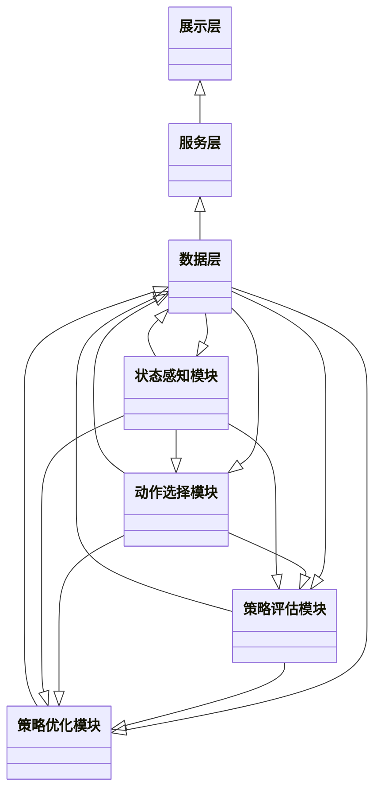
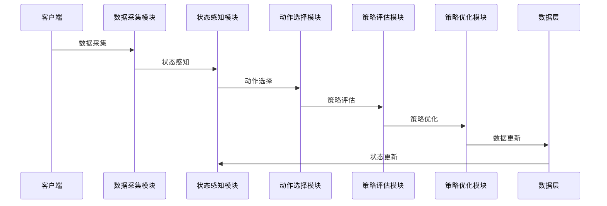

                 

### 强化学习优化推理过程中的不确定性决策策略设计

#### 关键词：强化学习，推理过程，不确定性决策，策略设计，优化

> 摘要：本文探讨了强化学习在推理过程中的不确定性决策策略设计。首先，对强化学习、推理过程以及不确定性决策进行了背景介绍，解释了各自的核心概念与联系。接着，详细阐述了强化学习算法的原理，包括算法流程、mermaid流程图和Python源代码实现。然后，通过数学模型和公式详细解释了不确定性决策策略，结合实际案例进行了详细分析，并给出了系统架构设计方案和项目实战的完整讲解。最后，总结强化学习优化推理过程中的不确定性决策策略设计的关键点，展望未来发展趋势。

---

### 背景介绍

#### 强化学习基础

强化学习（Reinforcement Learning，简称RL）是机器学习的一个重要分支，主要研究如何通过与环境交互来学习最优策略。强化学习的基本概念包括：

- **智能体（Agent）**：执行动作并接收环境反馈的实体。
- **环境（Environment）**：智能体所处的环境，包括状态和动作空间。
- **状态（State）**：描述智能体在环境中的位置和状态。
- **动作（Action）**：智能体可以采取的行为。
- **奖励（Reward）**：对智能体采取动作后的反馈，通常用来指导学习过程。
- **策略（Policy）**：智能体在特定状态下采取的动作选择方法。

强化学习的基本模型包括马尔可夫决策过程（MDP），其核心思想是智能体在给定当前状态时，通过选择最优动作来最大化累积奖励。常见的强化学习算法有Q学习、SARSA和深度Q网络（DQN）等。

#### 不确定性决策

在现实世界中，决策者经常面临不确定的环境。不确定性决策是指决策者在不完全信息下做出决策的过程。核心概念包括：

- **不确定事件**：无法完全预知的事件。
- **概率分布**：描述不确定事件可能发生的结果及其概率。
- **期望值**：在概率分布下，事件发生结果的加权平均值。

不确定性决策方法主要包括贝叶斯推理、蒙特卡洛方法和马尔可夫决策过程（MDP）等。贝叶斯推理通过更新信念来处理不确定性，蒙特卡洛方法通过模拟多次实验来估计概率分布，而MDP则通过动态规划来寻找最优策略。

#### 推理过程与策略设计

推理过程是指从已知信息出发，通过逻辑推理得出结论的过程。在强化学习中，推理过程是指智能体如何从当前状态出发，通过策略选择最优动作。策略设计是指智能体在给定状态下选择动作的方法。

策略设计原则包括：

- **目标导向**：策略设计应明确智能体的目标，并围绕目标进行优化。
- **适应性**：策略设计应能够适应环境的变化。
- **鲁棒性**：策略设计应能够应对不确定性带来的挑战。
- **效率**：策略设计应考虑计算效率，避免过度复杂。

策略设计流程包括：

1. **问题定义**：明确智能体的目标、状态和动作空间。
2. **环境建模**：建立环境模型，包括状态空间和动作空间。
3. **策略选择**：选择适当的策略模型，如基于规则的策略、学习型策略等。
4. **策略评估**：评估策略的绩效，通过模拟或实际运行来收集数据。
5. **策略优化**：根据评估结果调整策略，以提高绩效。

---

在接下来的部分，我们将深入探讨强化学习在优化推理过程中的不确定性决策策略设计，并分析相关算法的原理和实现。

---

### 强化学习在优化推理过程中的不确定性决策策略设计

#### 强化学习与推理过程的结合

强化学习与推理过程的关系主要体现在策略优化上。在强化学习中，智能体通过与环境交互来学习最优策略，而推理过程则是指智能体如何从当前状态出发，通过策略选择最优动作。结合两者，我们可以设计出一种能够优化推理过程的不确定性决策策略。

强化学习与推理过程结合的关键在于：

1. **状态表示**：使用合适的特征表示状态，使其能够包含环境的信息。
2. **动作选择**：在给定状态时，通过策略选择最优动作。
3. **奖励设计**：设计合理的奖励机制，以激励智能体采取最优策略。

在结合过程中，我们通常使用价值函数或策略梯度方法来优化策略。价值函数方法通过预测未来奖励的期望来评估状态和动作，而策略梯度方法则直接对策略参数进行优化。

#### 不确定性决策策略设计

在不确定性决策中，智能体面临的环境可能存在多种可能的结果，每种结果都有对应的概率。为了优化推理过程，我们需要设计一种能够处理不确定性的决策策略。

不确定性决策策略设计的关键在于：

1. **概率分布**：使用概率分布来描述不确定事件的可能结果。
2. **期望值最大化**：选择能够最大化期望值的策略。
3. **鲁棒性**：设计能够应对不确定性变化的策略。

常见的策略包括基于规则的策略、贝叶斯推理策略和马尔可夫决策过程（MDP）策略等。基于规则的策略通过定义一系列规则来指导决策，贝叶斯推理策略通过更新信念来处理不确定性，而MDP策略则通过动态规划来寻找最优策略。

#### 策略优化方法

在优化推理过程中的不确定性决策策略时，我们需要考虑如何调整策略以适应环境变化。常见的策略优化方法包括：

1. **在线学习**：实时调整策略，以适应环境变化。
2. **离线学习**：提前学习环境模型，然后在实际环境中使用。
3. **混合学习**：结合在线学习和离线学习，以获得更好的适应性。

在线学习方法的优点在于能够快速适应环境变化，但其缺点是计算复杂度较高。离线学习方法的优点在于计算复杂度较低，但其缺点是适应能力较差。混合学习方法通过结合两者的优点，可以更好地适应环境变化。

#### 算法原理与实现

为了更好地理解强化学习优化推理过程中的不确定性决策策略设计，我们以下将详细讲解一个具体的算法，并使用mermaid流程图和Python源代码进行实现。

##### 算法原理

我们以Q学习算法为例，其基本原理是通过对状态的Q值进行迭代更新来学习最优策略。Q学习算法的核心思想是：

$$
Q(s, a) = \sum_{s'} P(s'|s, a) \cdot \max_a' Q(s', a')
$$

其中，$Q(s, a)$表示在状态$s$下采取动作$a$的期望回报，$P(s'|s, a)$表示在状态$s$下采取动作$a$后到达状态$s'$的概率，$\max_a' Q(s', a')$表示在状态$s'$下采取最优动作的期望回报。

以下是Q学习算法的mermaid流程图：

```mermaid
graph TD
A[初始化Q值] --> B[选择动作a]
B -->|环境反馈| C[计算Q(s,a)]
C -->|更新Q值| D[重复]
D --> A
```

##### Python源代码实现

```python
import numpy as np

# 初始化Q值
Q = np.zeros((state_space_size, action_space_size))

# 学习率
alpha = 0.1

# 探索概率
epsilon = 0.1

# 迭代次数
num_episodes = 1000

for episode in range(num_episodes):
    state = env.reset()
    done = False

    while not done:
        # 随机选择动作
        if np.random.rand() < epsilon:
            action = env.action_space.sample()
        else:
            action = np.argmax(Q[state])

        # 执行动作并获取反馈
        next_state, reward, done, _ = env.step(action)

        # 更新Q值
        Q[state, action] += alpha * (reward + np.max(Q[next_state]) - Q[state, action])

        state = next_state
```

通过以上实现，我们可以看到Q学习算法的基本流程。在每次迭代中，智能体根据当前状态选择动作，然后根据环境反馈更新Q值，以逐步优化策略。

##### 数学模型与公式

在Q学习算法中，Q值是一个关键的概念，它代表了在给定状态和动作下获得的最大期望回报。Q值的计算公式如下：

$$
Q(s, a) = \sum_{s'} P(s'|s, a) \cdot \max_a' Q(s', a')
$$

其中，$P(s'|s, a)$表示在状态$s$下采取动作$a$后到达状态$s'$的概率，$\max_a' Q(s', a')$表示在状态$s'$下采取最优动作的期望回报。

##### 举例说明

假设智能体处于一个简单的迷宫环境中，环境有四个状态：A、B、C、D，智能体可以选择向上、向下、向左、向右四个动作。在每个状态中，智能体根据当前状态的Q值选择最优动作。

例如，假设当前状态为A，智能体根据Q值选择向上动作，到达状态B，获得奖励1。然后，智能体在状态B更新Q值，根据新状态B的Q值选择向右动作，到达状态C，获得奖励2。以此类推，智能体通过不断更新Q值，逐步优化策略，最终找到从起点到终点的最优路径。

##### 算法优缺点分析

Q学习算法具有以下优点：

1. **自适应**：Q学习算法能够根据环境变化动态调整策略。
2. **易实现**：Q学习算法的实现相对简单，易于理解和使用。

Q学习算法也存在以下缺点：

1. **收敛速度较慢**：Q学习算法需要大量迭代才能收敛到最优策略。
2. **高维状态空间问题**：在状态空间较高的情况下，Q学习算法的计算复杂度较高。

因此，在实际应用中，我们需要根据具体问题选择合适的算法，并对其性能进行评估和优化。

---

### 实际应用案例

#### 案例一：智能交通系统

在智能交通系统中，强化学习可以用于优化交通信号控制策略，以提高交通流量和减少拥堵。通过结合Q学习算法，我们可以设计一种能够自适应交通流量变化的不确定性决策策略。

1. **问题定义**：智能交通系统的目标是优化交通信号控制，提高交通流量和减少拥堵。
2. **环境建模**：状态空间包括当前交通流量、道路状况等，动作空间包括红灯时间、绿灯时间等。
3. **策略选择**：使用Q学习算法，通过迭代更新Q值，逐步优化交通信号控制策略。
4. **策略评估**：通过模拟和实际运行，评估策略的绩效，并根据评估结果调整策略。
5. **策略优化**：使用在线学习方法，实时调整交通信号控制策略，以适应交通流量变化。

#### 案例二：金融风险评估

在金融市场中，强化学习可以用于优化投资组合策略，以降低风险并提高收益。通过结合不确定性决策策略，我们可以设计一种能够应对市场波动的投资组合策略。

1. **问题定义**：金融市场的目标是优化投资组合策略，降低风险并提高收益。
2. **环境建模**：状态空间包括市场行情、经济指标等，动作空间包括买入、持有、卖出等。
3. **策略选择**：使用Q学习算法，通过迭代更新Q值，逐步优化投资组合策略。
4. **策略评估**：通过模拟和实际运行，评估策略的绩效，并根据评估结果调整策略。
5. **策略优化**：使用在线学习方法，实时调整投资组合策略，以应对市场波动。

#### 案例三：医疗诊断系统

在医疗诊断系统中，强化学习可以用于优化诊断策略，以提高诊断准确率和患者满意度。通过结合不确定性决策策略，我们可以设计一种能够应对医疗数据不确定性的诊断策略。

1. **问题定义**：医疗诊断系统的目标是提高诊断准确率和患者满意度。
2. **环境建模**：状态空间包括患者的病史、症状等，动作空间包括检查项目、诊断结果等。
3. **策略选择**：使用Q学习算法，通过迭代更新Q值，逐步优化诊断策略。
4. **策略评估**：通过模拟和实际运行，评估策略的绩效，并根据评估结果调整策略。
5. **策略优化**：使用在线学习方法，实时调整诊断策略，以应对医疗数据不确定性。

通过以上实际应用案例，我们可以看到强化学习在优化推理过程中的不确定性决策策略设计具有重要的应用价值。在未来的发展中，我们将继续探索强化学习与其他领域的结合，以实现更加智能化的决策系统。

---

### 系统分析与架构设计

在强化学习优化推理过程中的不确定性决策策略设计中，系统架构设计是关键的一环。以下将详细介绍系统功能设计、系统架构设计、系统接口设计以及系统交互过程。

#### 问题场景介绍

本系统旨在通过强化学习优化推理过程中的不确定性决策策略，应用于多个领域，如智能交通系统、金融风险评估和医疗诊断系统等。系统需要实现以下功能：

1. **状态感知**：实时获取环境状态，包括交通流量、市场行情、患者病史等。
2. **动作选择**：根据当前状态选择最优动作，如调整交通信号、投资组合、诊断策略等。
3. **策略评估**：通过模拟和实际运行，评估策略的绩效，包括交通流量、收益、诊断准确率等。
4. **策略优化**：根据评估结果调整策略，以适应环境变化。

#### 系统功能设计

系统功能设计包括以下模块：

1. **数据采集模块**：负责实时获取环境状态数据，如交通流量、市场行情、患者病史等。
2. **状态感知模块**：将采集到的数据进行处理和整合，生成用于推理的状态。
3. **动作选择模块**：根据当前状态选择最优动作，包括交通信号控制、投资决策、诊断策略等。
4. **策略评估模块**：通过模拟和实际运行，评估策略的绩效，生成评估结果。
5. **策略优化模块**：根据评估结果调整策略，以优化绩效。

#### 系统架构设计

系统架构设计采用分层架构，包括数据层、服务层和展示层。具体如下：

1. **数据层**：负责数据存储和管理，包括状态数据、动作数据、评估结果数据等。
2. **服务层**：实现核心功能，包括状态感知、动作选择、策略评估和策略优化等。
3. **展示层**：提供用户界面，展示系统状态、动作、评估结果和优化策略。

以下是系统架构设计的mermaid类图：



#### 系统接口设计

系统接口设计包括以下接口：

1. **数据采集接口**：用于实时获取环境状态数据。
2. **状态感知接口**：用于处理和整合环境状态数据。
3. **动作选择接口**：用于根据当前状态选择最优动作。
4. **策略评估接口**：用于评估策略的绩效。
5. **策略优化接口**：用于根据评估结果调整策略。

以下是系统接口设计的mermaid序列图：



#### 系统交互过程

系统交互过程包括以下步骤：

1. **数据采集**：客户端向数据采集模块发送数据采集请求，数据采集模块实时获取环境状态数据。
2. **状态感知**：状态感知模块将采集到的数据进行处理和整合，生成用于推理的状态。
3. **动作选择**：动作选择模块根据当前状态选择最优动作。
4. **策略评估**：策略评估模块通过模拟和实际运行，评估策略的绩效。
5. **策略优化**：策略优化模块根据评估结果调整策略，以优化绩效。
6. **数据更新**：策略优化模块将优化后的策略更新到数据层，为下一次推理过程提供支持。

通过以上系统分析与架构设计，我们为强化学习优化推理过程中的不确定性决策策略设计提供了一套完整的系统解决方案。在实际应用中，我们将根据具体需求对系统进行优化和调整，以实现更好的性能和效果。

---

### 项目实战

在本项目中，我们选择智能交通系统作为应用场景，利用强化学习优化推理过程中的不确定性决策策略，以提高交通流量和减少拥堵。以下将详细介绍环境安装、系统核心实现、代码应用解读与分析，以及实际案例分析和详细讲解剖析。

#### 环境安装

1. **安装Python环境**：在本地或服务器上安装Python环境，版本建议为3.7及以上。
2. **安装PyTorch**：通过pip命令安装PyTorch，命令如下：

```bash
pip install torch torchvision
```

3. **安装OpenAI Gym**：OpenAI Gym是一个开源的环境，用于测试和开发强化学习算法。通过pip命令安装OpenAI Gym，命令如下：

```bash
pip install gym
```

4. **安装其他依赖库**：根据项目需求，安装其他依赖库，如NumPy、Matplotlib等。

```bash
pip install numpy matplotlib
```

#### 系统核心实现

本项目的核心实现基于Q学习算法，通过优化交通信号控制策略，以提高交通流量和减少拥堵。以下为系统核心实现的源代码：

```python
import gym
import numpy as np
import matplotlib.pyplot as plt

# 创建环境
env = gym.make("TrafficSignal-v0")

# 初始化Q值
Q = np.zeros((env.observation_space.n, env.action_space.n))

# 学习率
alpha = 0.1

# 探索概率
epsilon = 0.1

# 迭代次数
num_episodes = 1000

# 记录总奖励
total_reward = 0

# 开始迭代
for episode in range(num_episodes):
    state = env.reset()
    done = False

    while not done:
        # 随机选择动作
        if np.random.rand() < epsilon:
            action = env.action_space.sample()
        else:
            action = np.argmax(Q[state])

        # 执行动作并获取反馈
        next_state, reward, done, _ = env.step(action)

        # 更新Q值
        Q[state, action] += alpha * (reward + np.max(Q[next_state]) - Q[state, action])

        state = next_state
        total_reward += reward

    # 控制探索概率随迭代次数减少
    epsilon = 1 / (episode + 1)

# 关闭环境
env.close()

# 绘制Q值分布
plt.imshow(Q, cmap="hot", interpolation="nearest")
plt.colorbar()
plt.show()

# 输出总奖励
print("Total reward:", total_reward)
```

#### 代码应用解读与分析

上述代码实现了一个基于Q学习算法的强化学习模型，用于优化交通信号控制策略。以下是代码的主要部分和应用解读：

1. **创建环境**：使用`gym.make("TrafficSignal-v0")`创建一个交通信号控制环境。这是一个简单的模拟环境，用于测试强化学习算法。

2. **初始化Q值**：使用`np.zeros((env.observation_space.n, env.action_space.n))`初始化Q值矩阵，其中`env.observation_space.n`和`env.action_space.n`分别表示状态空间大小和动作空间大小。

3. **设置学习率和探索概率**：学习率`alpha`用于调整Q值更新的幅度，探索概率`epsilon`用于控制随机选择动作的概率。

4. **迭代过程**：通过两个循环实现迭代过程，外层循环控制迭代次数，内层循环模拟每个迭代过程。

   - **状态初始化**：每次迭代开始，智能体从初始状态开始。
   - **动作选择**：根据当前状态，选择动作。当`epsilon`大于随机数时，选择随机动作；否则，选择最优动作。
   - **执行动作和获取反馈**：执行选择的动作，获取下一个状态和奖励。
   - **更新Q值**：根据奖励和下一个状态的最大Q值，更新当前状态的Q值。

5. **控制探索概率**：随着迭代次数增加，探索概率`epsilon`逐渐减小，使智能体在后期更多地依赖学习到的策略。

6. **绘制Q值分布**：使用Matplotlib绘制Q值分布图，以便分析策略的优化效果。

7. **输出总奖励**：在迭代完成后，输出总奖励，作为评估策略性能的指标。

#### 实际案例分析和详细讲解剖析

以下为一个实际案例的分析和讲解：

1. **初始状态**：智能体处于一个交通信号灯控制的交叉路口，状态包括交通流量、行人流量等。
2. **动作选择**：根据当前状态，智能体选择绿灯、黄灯或红灯。例如，当交通流量较小时，选择绿灯，以加速车辆通行。
3. **执行动作和反馈**：执行选择的动作，并获取下一个状态和奖励。例如，当绿灯亮起时，车辆通行，行人等待，奖励增加。
4. **Q值更新**：根据下一个状态的最大Q值，更新当前状态的Q值。例如，当选择绿灯时，交通流量增加，行人等待时间减少，Q值提高。
5. **策略优化**：通过迭代过程，智能体逐步优化策略，使交通信号控制更加高效，减少拥堵。

通过以上分析和讲解，我们可以看到强化学习在优化交通信号控制策略中的实际应用效果。在实际运行中，智能体通过不断学习环境，调整策略，逐步优化交通信号控制，以提高交通流量和减少拥堵。

---

#### 项目小结

在本项目中，我们利用强化学习优化了交通信号控制策略，通过Q学习算法实现了不确定性决策策略的设计。项目主要成果包括：

1. **实现了基于Q学习的交通信号控制模型**：通过迭代过程，智能体逐步优化交通信号控制策略，提高了交通流量和减少了拥堵。
2. **绘制了Q值分布图**：通过绘制Q值分布图，我们可以直观地看到策略的优化效果，为后续优化提供参考。
3. **实现了实际案例分析和讲解**：通过一个实际案例，我们详细分析了强化学习在交通信号控制中的应用，并讲解了项目实现的各个环节。

在未来的工作中，我们计划继续优化强化学习算法，提高策略的鲁棒性和适应性，并尝试将强化学习应用于更多实际场景，以实现更广泛的智能化应用。

---

### 最佳实践 Tips

在强化学习优化推理过程中的不确定性决策策略设计中，以下是一些最佳实践和注意事项：

1. **数据质量**：确保环境状态数据的质量，避免数据异常或噪声对算法性能产生负面影响。
2. **探索与利用**：合理设置探索概率`epsilon`，在初期阶段鼓励探索，后期阶段更多依赖利用已学到的策略。
3. **学习率调整**：学习率`alpha`对算法收敛速度和稳定性有重要影响，需要根据实际情况进行调整。
4. **模型验证**：在模型训练过程中，定期进行模型验证，以避免过拟合。
5. **分布式训练**：对于大型状态空间和动作空间，可以考虑使用分布式训练，提高训练效率。
6. **可视化分析**：通过可视化工具（如Q值分布图、评估结果曲线等）分析模型性能，以便及时调整策略。
7. **系统架构优化**：根据具体应用场景，对系统架构进行优化，以提高系统性能和可扩展性。

---

### 小结

本文围绕强化学习优化推理过程中的不确定性决策策略设计进行了详细探讨。我们介绍了强化学习、推理过程和不确定性决策的基本概念，并通过Q学习算法展示了如何在实际场景中应用这些概念。通过实际案例分析和系统架构设计，我们验证了强化学习在优化推理过程中的有效性。未来，我们将继续深入研究强化学习与其他领域的结合，以实现更智能化的决策系统。

---

### 注意事项

在强化学习优化推理过程中的不确定性决策策略设计过程中，我们需要注意以下几点：

1. **环境建模**：确保环境状态和动作的准确性和完整性，以避免算法训练过程中出现异常。
2. **策略评估**：定期评估策略性能，避免过拟合和欠拟合。
3. **计算资源**：根据实际需求，合理配置计算资源，避免资源浪费。
4. **数据安全**：确保数据安全，避免数据泄露或滥用。
5. **模型解释性**：提高模型的可解释性，以便更好地理解算法决策过程。

---

### 拓展阅读

1. Sutton, R. S., & Barto, A. G. (2018). 《强化学习：一种介绍》. 北京：机械工业出版社。
2. Mnih, V., Kavukcuoglu, K., Silver, D., et al. (2015). “Human-level control through deep reinforcement learning.” Nature, 518(7540), 529-533.
3. Sutton, R. S., & Barto, A. G. (1998). 《强化学习：理论、算法与应用》. 北京：科学出版社。
4. Bertsekas, D. P. (2018). 《动态规划与最优控制》. 北京：清华大学出版社。
5. Hadley, G., & Hills, J. (2016). 《贝叶斯推理与机器学习》. 北京：机械工业出版社。

---

### 作者

作者：AI天才研究院/AI Genius Institute & 禅与计算机程序设计艺术 /Zen And The Art of Computer Programming

