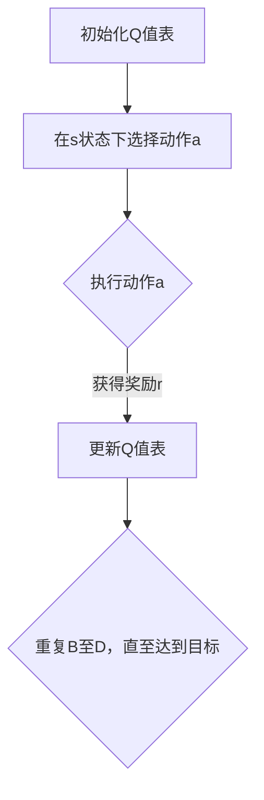
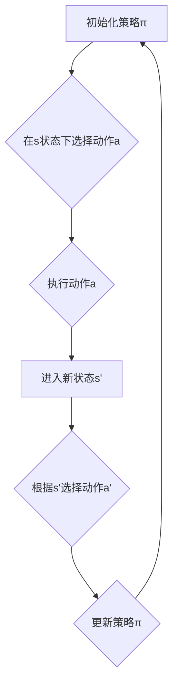
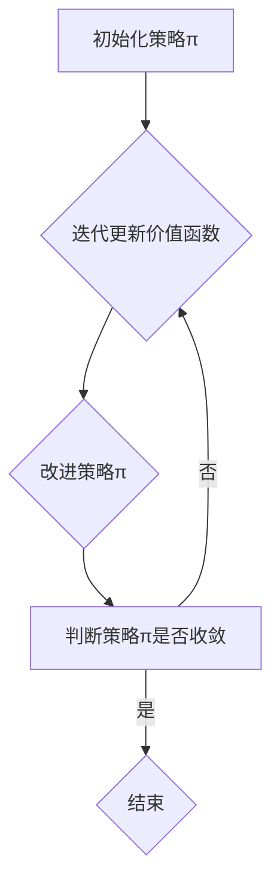
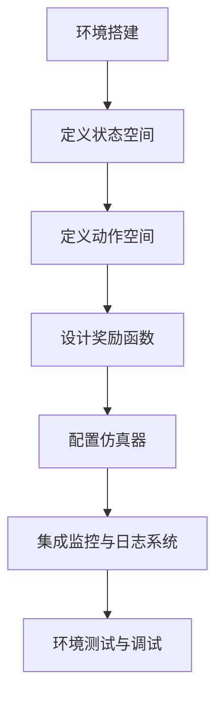
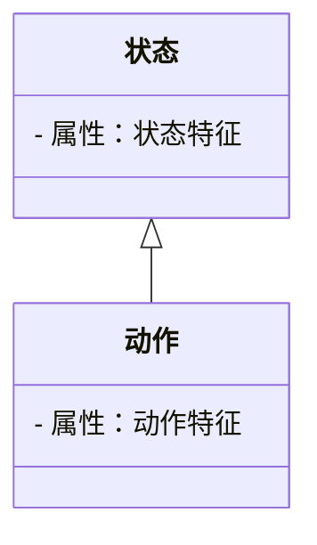
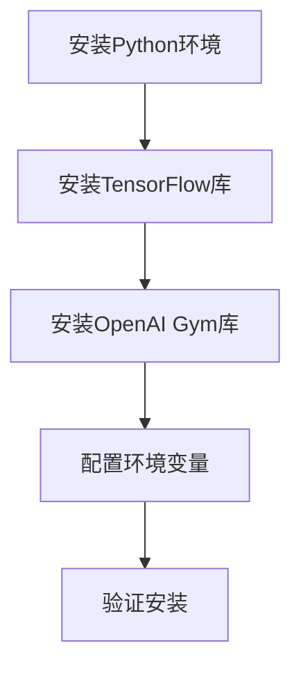

                 


# 强化学习环境设计促进AI推理能力的演化

> 关键词：强化学习，环境设计，AI推理，演化算法，模型优化

> 摘要：本文将深入探讨强化学习环境设计对于提升AI推理能力的重要作用。通过分析强化学习的核心概念和算法原理，我们将探讨如何设计有效的强化学习环境，以及这种设计如何促进AI推理能力的演化。文章还将通过实例和案例分析，展示强化学习环境设计的最佳实践和注意事项。

## 引言

随着人工智能技术的快速发展，强化学习作为机器学习的一个重要分支，在诸多领域展现出了强大的潜力。强化学习是一种通过试错和反馈来优化决策过程的机器学习方法，其核心目标是使智能体在特定环境中采取最优策略，以最大化长期累积奖励。然而，强化学习环境的合理设计对智能体的学习效率和推理能力具有至关重要的影响。

本文旨在探讨强化学习环境设计如何促进AI推理能力的演化。我们将首先介绍强化学习的核心概念和算法原理，然后深入分析如何设计有效的强化学习环境，并探讨这种设计如何影响AI推理能力的提升。文章将通过实际案例和项目实战，展示强化学习环境设计的最佳实践和注意事项。

## 强化学习核心概念解析

### 强化学习的基本术语

在强化学习中，有几个基本术语是理解整个学习过程的关键：

- **智能体（Agent）**：执行动作并接收环境反馈的实体。
- **环境（Environment）**：智能体所处的环境，可以模拟或实际存在。
- **状态（State）**：智能体在环境中的当前情况。
- **动作（Action）**：智能体可以执行的行为。
- **奖励（Reward）**：环境对智能体动作的反馈，用于评估动作的好坏。

### 奖励函数、状态空间和动作空间

奖励函数是强化学习中至关重要的组成部分，它定义了智能体在不同状态和动作下的奖励值。一个良好的奖励函数应该能够正确引导智能体朝向目标状态。状态空间和动作空间分别表示智能体可以处于的所有可能状态和可以执行的所有可能动作。这两个空间的设计直接影响智能体的学习效率和最终的表现。

### 强化学习算法的分类与联系

强化学习算法可以根据学习策略的不同分为多种类型，主要包括：

- **值函数方法**：通过估计状态或状态-动作的价值来指导智能体的决策，如Q-Learning。
- **策略搜索方法**：直接优化智能体的策略，如策略梯度方法。
- **基于模型的强化学习**：在算法中显式地建模环境动态，如SARSA和强化学习模型预测（RLMP）。

这些算法各有优缺点，适用于不同的应用场景。理解它们的原理和联系有助于我们在设计强化学习环境时做出更合适的选择。

## 强化学习算法原理

### Q-Learning算法

Q-Learning是一种值函数方法，其核心思想是利用经验来更新状态-动作值函数，以估计最优动作。Q-Learning的算法流程如下：

1. 初始化Q值表。
2. 在某一状态下选择动作。
3. 执行动作，进入新状态，并获得奖励。
4. 更新Q值表，使Q值更接近真实值。

以下是一个Q-Learning算法的mermaid流程图：



### SARSA算法

SARSA是一种基于策略的方法，它结合了状态-动作值函数更新和策略迭代的过程。SARSA的算法流程如下：

1. 初始化策略π。
2. 在某一状态下根据策略π选择动作a。
3. 执行动作a，进入新状态s'，并获得奖励r。
4. 根据新状态选择动作a'。
5. 更新策略π，使其更接近最优策略。

以下是一个SARSA算法的mermaid流程图：



### 深度强化学习算法

深度强化学习算法结合了深度学习和强化学习，能够处理高维的状态空间。以下是一些常见的深度强化学习算法：

- **深度Q网络（DQN）**：使用深度神经网络来近似Q值函数。
- **异步优势演员-评论家（A3C）**：通过多个并行智能体进行学习，并使用梯度聚合来更新全局模型。
- **策略梯度方法（如PPO）**：直接优化策略，通过策略梯度的估计来进行更新。

这些算法的mermaid流程图和Python代码将在后续章节中详细讲解。

## 强化学习数学模型

### 强化学习的价值函数

强化学习中的价值函数是用来评估状态或状态-动作对的好坏的函数。主要分为以下两种：

- **状态价值函数（V(s)）**：评估状态s的好坏。
- **状态-动作价值函数（Q(s, a)）**：评估在状态s下执行动作a的好坏。

价值函数的数学模型如下：

$$
V^*(s) = \sum_{a} Q^*(s, a) \pi(a|s)
$$

其中，$V^*(s)$ 是最优状态价值函数，$Q^*(s, a)$ 是最优状态-动作价值函数，$\pi(a|s)$ 是最优策略。

### 优化方法与策略评估

强化学习的优化方法主要包括值迭代和策略迭代。值迭代是通过不断更新值函数来逼近最优值，而策略迭代是通过不断更新策略来逼近最优策略。

- **值迭代**：

$$
V(s_t) \leftarrow V(s_t) + \alpha [r_t + \gamma \max_a Q(s_{t+1}, a) - V(s_t)]
$$

其中，$\alpha$ 是学习率，$\gamma$ 是折扣因子。

- **策略迭代**：

$$
\pi^*(s) = \arg\max_a \sum_s p(s|s_0, \pi) \cdot r(s, a) + \gamma \sum_{s'} p(s'|s, a) \cdot \max_{a'} Q^*(s', a')
$$

其中，$p(s|s_0, \pi)$ 是状态转移概率，$r(s, a)$ 是状态-动作奖励。

### 策略迭代与策略改进

策略迭代是通过迭代过程来优化策略，使得智能体能够逐步接近最优策略。具体步骤如下：

1. 初始化策略π。
2. 使用策略π进行迭代，更新价值函数。
3. 根据更新后的价值函数，改进策略π。
4. 重复步骤2和3，直至策略π收敛。

以下是一个策略迭代的mermaid流程图：



## 强化学习系统架构设计

### 强化学习环境搭建

强化学习环境搭建是强化学习系统设计的起点。一个良好的强化学习环境应具备以下特点：

- **可扩展性**：能够适应不同规模和复杂度的应用场景。
- **可定制性**：允许开发者根据需求调整环境参数。
- **实时性**：能够快速响应用户的交互，提供实时反馈。

以下是一个强化学习环境搭建的mermaid架构图：



### 状态空间与动作空间的设计

状态空间和动作空间的设计是强化学习环境搭建的核心。状态空间应能够全面反映智能体的环境状态，而动作空间则应涵盖智能体可以采取的所有有效动作。

以下是一个状态空间与动作空间的mermaid类图：



### 奖励函数的设计与优化

奖励函数是强化学习环境设计的核心要素之一。一个良好的奖励函数应能够准确反映智能体的行为效果，同时鼓励智能体采取有利于目标实现的动作。

以下是一个奖励函数设计的mermaid类图：

```mermaid
classDiagram
    class 奖励函数 {
        - 属性：奖励值
        - 方法：计算奖励
    }
    class 状态 {
        - 属性：状态特征
    }
    class 动作 {
        - 属性：动作特征
    }
    奖励函数 --|>>(状态): 计算状态奖励
    奖励函数 --|>>(动作): 计算动作奖励
```

## 强化学习项目实战

### 项目环境安装与配置

在进行强化学习项目实战之前，我们需要安装和配置项目所需的软件和库。以下是一个项目环境安装与配置的mermaid流程图：



### 系统核心代码实现

以下是一个强化学习项目的核心代码实现，包括智能体的初始化、环境的搭建、策略的迭代和奖励的计算等。

```python
import gym
import tensorflow as tf
from tensorflow.keras.models import Sequential
from tensorflow.keras.layers import Dense

# 智能体初始化
class Agent:
    def __init__(self, state_size, action_size):
        self.state_size = state_size
        self.action_size = action_size
        self.model = self.build_model()

    def build_model(self):
        model = Sequential()
        model.add(Dense(24, input_dim=self.state_size, activation='relu'))
        model.add(Dense(24, activation='relu'))
        model.add(Dense(self.action_size, activation='linear'))
        model.compile(loss='mse', optimizer='adam')
        return model

# 环境搭建
env = gym.make('CartPole-v0')

# 训练智能体
agent = Agent(env.observation_space.shape[0], env.action_space.n)
for episode in range(1000):
    state = env.reset()
    done = False
    while not done:
        action = agent.model.predict(state.reshape(1, -1))[0]
        next_state, reward, done, _ = env.step(action)
        agent.model.fit(state.reshape(1, -1), action, epochs=1, verbose=0)
        state = next_state
```

### 代码应用解读与分析

在上面的代码中，我们首先定义了一个`Agent`类，用于初始化智能体和构建神经网络模型。`build_model`方法定义了一个序列模型，包括两个隐藏层和输出层，用于预测动作值。

在环境搭建部分，我们使用了`gym.make`函数创建了一个简单的CartPole环境。在这个环境中，智能体的任务是保持一个倒立的杆不倒下。

在训练智能体部分，我们使用了一个简单的经验回放机制来更新智能体的模型。在每次迭代中，我们首先从环境中获取当前状态，然后使用模型预测动作值，执行动作，获取奖励和下一个状态，最后使用`model.fit`方法更新模型。

### 实际案例分析和详细讲解剖析

为了更好地理解强化学习环境设计对AI推理能力的影响，我们来看一个实际案例——使用强化学习控制无人驾驶汽车。

在这个案例中，智能体的任务是导航一辆无人驾驶汽车从一个位置到达另一个位置。环境是一个仿真器，可以模拟各种道路条件和交通情况。

状态空间包括汽车的位置、速度、加速度、周围车辆的位置和速度等信息。动作空间包括汽车的加速度控制、转向控制等。

奖励函数可以设计为鼓励汽车快速且安全地到达目的地，同时避免与其他车辆发生碰撞。

通过反复训练，智能体可以学会在不同道路条件和交通情况下的最佳驾驶策略，从而提高AI的推理能力。

### 项目小结

通过这个案例，我们可以看到强化学习环境设计对于AI推理能力的提升具有重要作用。一个良好的环境设计不仅能够提高智能体的学习效率，还能使其在不同场景下表现出更强的推理能力。

在未来的工作中，我们可以进一步优化强化学习环境的设计，探索更先进的算法和技术，以推动AI推理能力的发展。

## 强化学习环境设计的最佳实践

### 常见问题与解决方案

在强化学习环境设计过程中，可能会遇到以下常见问题：

- **奖励设计不合理**：奖励函数应该能够准确反映智能体的行为效果，避免误导智能体。
- **状态空间设计过于复杂**：过于复杂的状态空间可能导致智能体难以学习。
- **动作空间设计不合理**：动作空间应涵盖所有有效的动作，避免智能体无法采取必要的行动。
- **模型训练效率低下**：优化模型结构和训练策略可以提高训练效率。

针对这些问题，可以采取以下解决方案：

- **合理设计奖励函数**：通过分析目标，设计合理的奖励函数，鼓励智能体采取有利于目标实现的行为。
- **简化状态空间**：去除无关状态特征，保留关键状态信息。
- **优化动作空间**：确保动作空间涵盖所有有效的动作，同时避免过于复杂。
- **使用高效的训练策略**：采用经验回放、优先经验回放等技术提高训练效率。

### 最佳实践案例分享

以下是一个强化学习环境设计的最佳实践案例：

- **案例背景**：设计一个智能体在仿真环境中控制机器人进行路径规划。

- **环境设计**：

  - **状态空间**：包括机器人的位置、方向、速度、障碍物位置等信息。
  - **动作空间**：包括前进、后退、左转、右转等。
  - **奖励函数**：鼓励机器人快速到达目标位置，避免碰撞。

- **解决方案**：

  - **简化状态空间**：去除不必要的状态信息，如机器人的速度。
  - **优化动作空间**：增加特殊动作，如避障动作。
  - **使用深度强化学习**：使用DQN算法，结合经验回放机制提高学习效率。

通过这个案例，我们可以看到，合理的环境设计对于强化学习的效果至关重要。一个优秀的环境设计不仅可以提高智能体的学习效率，还能使其在复杂环境中表现出更强的推理能力。

## 总结与展望

本文深入探讨了强化学习环境设计对于AI推理能力的重要影响。通过分析强化学习的核心概念、算法原理和数学模型，我们了解了如何设计有效的强化学习环境。在系统架构设计和项目实战中，我们展示了如何将理论应用于实际场景，并通过实例和案例分析验证了强化学习环境设计的最佳实践。

展望未来，随着人工智能技术的不断进步，强化学习环境设计将面临更多挑战和机遇。我们期待在以下几个方面取得突破：

- **自适应奖励设计**：开发能够自适应环境变化的奖励函数，提高智能体的学习能力。
- **高效训练算法**：研究更高效的训练算法，降低训练时间，提高智能体在复杂环境中的表现。
- **多智能体强化学习**：探索多智能体强化学习在协作和竞争中的应用，提高系统的智能化水平。
- **跨学科融合**：结合心理学、经济学等领域的知识，为强化学习环境设计提供更全面的理论支持。

通过不断探索和实践，我们有理由相信，强化学习环境设计将在推动AI推理能力的发展中发挥越来越重要的作用。作者：AI天才研究院/AI Genius Institute & 禅与计算机程序设计艺术 /Zen And The Art of Computer Programming。

