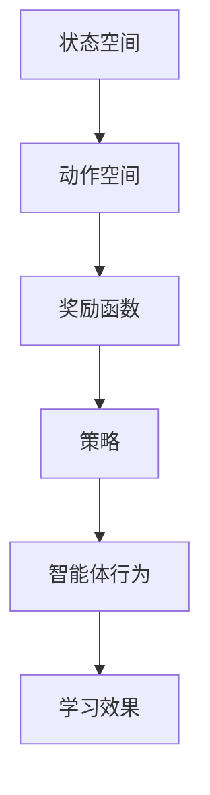
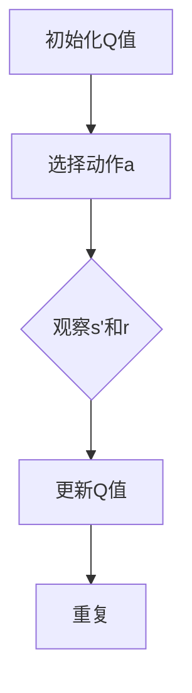
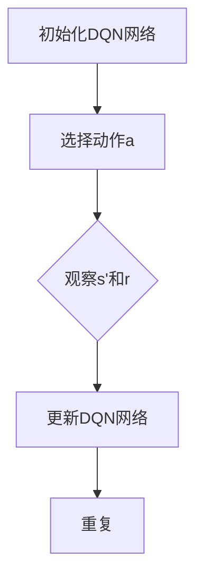
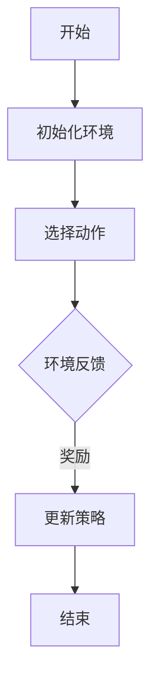
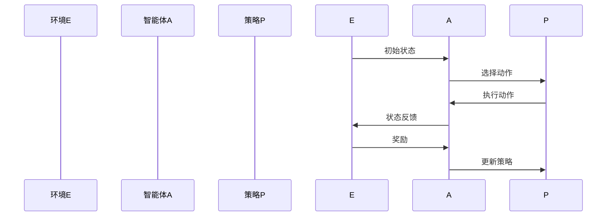

                 


### **强化学习环境设计对AI推理能力的影响**

#### **关键词：**
强化学习、环境设计、AI推理能力、算法原理、数学模型

#### **摘要：**
本文旨在探讨强化学习环境设计对AI推理能力的影响。首先，我们介绍了强化学习的定义、核心概念及其在AI推理能力中的作用。接着，我们详细分析了强化学习环境设计的基本要素，包括状态空间设计、动作空间设计、奖励函数设计以及策略设计。然后，我们讲解了强化学习算法的原理，包括Q-Learning、Sarsa和Deep Q-Networks（DQN）算法，并通过mermaid流程图和Python代码进行了阐述。在深入理解算法原理的基础上，我们探讨了强化学习环境设计对AI推理能力的影响以及优化策略，并通过实际案例进行了分析。最后，我们提出了强化学习环境设计的最佳实践，总结了文章的核心内容和主题思想。

----------------------------------------------------------------

## **强化学习环境设计对AI推理能力的影响**

### **1. 背景介绍**

强化学习是一种机器学习范式，它通过智能体在环境中通过试错学习来获取最优策略。在强化学习的过程中，环境设计至关重要，它不仅决定了智能体的学习效果，也直接影响AI推理能力。强化学习环境通常包括状态空间、动作空间、奖励函数和策略四个基本要素。状态空间是智能体所处环境的描述，动作空间是智能体可以执行的动作集合，奖励函数定义了智能体在环境中获得的奖励，策略则是智能体在特定状态下选择动作的规则。一个良好的强化学习环境设计，能够提高智能体的学习效率，增强AI推理能力。

### **2. 强化学习环境设计的基本要素**

#### **2.1 状态空间设计**

状态空间设计是强化学习环境设计的第一步，它决定了智能体对环境的感知能力。一个良好的状态空间设计应该能够充分捕捉环境的关键特征，同时保持状态空间的简洁性。状态空间的设计需要考虑以下因素：

- **状态表示方法**：状态可以采用离散表示或连续表示。离散表示通常使用整数或字符串进行编码，而连续表示则使用浮点数表示。
- **状态压缩**：为了提高学习效率，可以采用状态压缩技术，将多个相似的状态合并为一个状态。

#### **2.2 动作空间设计**

动作空间设计决定了智能体在环境中的行为方式。一个良好的动作空间设计应该能够涵盖环境中的所有可能行为，同时保持动作空间的简洁性。动作空间的设计需要考虑以下因素：

- **动作表示方法**：动作可以采用离散表示或连续表示。离散表示通常使用整数或字符串进行编码，而连续表示则使用浮点数表示。
- **动作压缩**：与状态空间压缩类似，动作空间也可以通过压缩技术减少其规模。

#### **2.3 奖励函数设计**

奖励函数设计是强化学习环境设计的关键因素，它直接影响智能体的学习目标和策略选择。奖励函数应该能够激励智能体在环境中采取最优策略，同时避免过度优化导致的学习失败。奖励函数的设计需要考虑以下因素：

- **奖励大小**：奖励函数的奖励大小应该与智能体的目标一致，以确保智能体能够正确地评估策略的价值。
- **奖励连续性**：奖励函数的连续性能够提高智能体的学习稳定性。

#### **2.4 策略设计**

策略设计是强化学习环境设计的最终目标，它决定了智能体在环境中的行为模式。策略可以采用确定性策略或随机性策略。一个良好的策略设计应该能够在保证智能体学习效果的同时，保持智能体的灵活性和适应性。

### **3. 强化学习环境设计的方法与技巧**

#### **3.1 状态空间压缩技术**

状态空间压缩技术是强化学习环境设计的重要方法，它可以通过减少状态空间的规模来提高学习效率。状态空间压缩技术包括以下几种：

- **最大熵压缩**：通过最大化状态空间的熵来减少冗余状态。
- **聚类压缩**：通过将相似状态聚类来减少状态空间规模。

#### **3.2 动作空间压缩技术**

动作空间压缩技术也是强化学习环境设计的重要方法，它可以通过减少动作空间的规模来提高学习效率。动作空间压缩技术包括以下几种：

- **最大熵压缩**：通过最大化动作空间的熵来减少冗余动作。
- **聚类压缩**：通过将相似动作聚类来减少动作空间规模。

#### **3.3 奖励函数调整策略**

奖励函数调整策略是强化学习环境设计的关键技巧，它可以通过调整奖励函数来激励智能体采取最优策略。奖励函数调整策略包括以下几种：

- **动态调整**：根据智能体的学习过程动态调整奖励函数，以适应智能体的学习状态。
- **目标调整**：根据智能体的目标调整奖励函数，以最大化智能体的学习效果。

### **4. 强化学习环境设计案例分析**

#### **4.1 案例一：机器人导航**

机器人导航是一个典型的强化学习问题，其环境包括状态空间、动作空间、奖励函数和策略。通过合理设计强化学习环境，可以提高机器人的导航性能。

- **状态空间设计**：状态空间包括机器人的位置、方向和速度等。
- **动作空间设计**：动作空间包括机器人的前进、后退、左转和右转等。
- **奖励函数设计**：奖励函数设计为机器人在正确路径上前进时给予正奖励，在错误路径上给予负奖励。
- **策略设计**：采用深度强化学习算法，如DQN，来训练机器人的导航策略。

#### **4.2 案例二：游戏AI**

游戏AI是强化学习应用的另一个重要领域，通过设计合理的强化学习环境，可以提高游戏AI的表现能力。

- **状态空间设计**：状态空间包括游戏角色的位置、方向、速度、游戏地图等。
- **动作空间设计**：动作空间包括游戏角色的移动、攻击、防御等。
- **奖励函数设计**：奖励函数设计为游戏角色在击败对手时给予正奖励，在失败时给予负奖励。
- **策略设计**：采用基于策略的强化学习算法，如Sarsa，来训练游戏AI的策略。

#### **4.3 案例三：自动驾驶**

自动驾驶是强化学习在工业领域的重要应用，通过设计合理的强化学习环境，可以提高自动驾驶系统的性能。

- **状态空间设计**：状态空间包括车辆的位置、速度、方向、周围环境等。
- **动作空间设计**：动作空间包括车辆的加速、减速、转向等。
- **奖励函数设计**：奖励函数设计为车辆在行驶过程中保持稳定、安全、高效时给予正奖励，在出现故障、危险时给予负奖励。
- **策略设计**：采用深度强化学习算法，如深度强化学习（Deep Q-Networks，DQN），来训练自动驾驶系统的策略。

### **5. 强化学习环境设计与AI推理能力的关系**

强化学习环境设计对AI推理能力有着深远的影响。一个良好的强化学习环境设计，可以增强智能体的学习效率，提高智能体的推理能力。具体来说，强化学习环境设计对AI推理能力的影响体现在以下几个方面：

- **状态空间设计**：良好的状态空间设计可以提高智能体的感知能力，使智能体能够更好地理解环境，从而提高推理能力。
- **动作空间设计**：良好的动作空间设计可以增加智能体的行为多样性，使智能体能够采取更灵活的策略，从而提高推理能力。
- **奖励函数设计**：良好的奖励函数设计可以激励智能体采取最优策略，从而提高推理能力。
- **策略设计**：良好的策略设计可以使智能体在复杂环境中保持稳定的性能，从而提高推理能力。

### **6. 强化学习环境设计优化方法**

为了提高强化学习环境设计对AI推理能力的影响，可以采用以下优化方法：

- **状态空间优化**：通过压缩状态空间、引入状态变换等方法，提高智能体的感知能力。
- **动作空间优化**：通过压缩动作空间、引入动作变换等方法，提高智能体的行为多样性。
- **奖励函数优化**：通过动态调整奖励函数、引入奖励调节机制等方法，提高智能体的学习效果。
- **策略优化**：通过引入多策略学习、自适应策略调整等方法，提高智能体的稳定性和适应性。

### **7. 强化学习环境设计优化案例**

以下是一些强化学习环境设计优化的实际案例：

- **案例一：无人机路径规划**：通过引入多目标优化方法，优化无人机路径规划的性能。
- **案例二：智能客服系统**：通过引入个性化奖励函数，提高智能客服系统的服务效果。
- **案例三：智能交通系统**：通过引入交通状态预测模型，优化智能交通系统的运行效率。

### **8. 强化学习环境设计的最佳实践**

在强化学习环境设计过程中，以下最佳实践可以帮助提高AI推理能力：

- **明确问题目标**：在开始设计强化学习环境之前，明确智能体的学习目标和性能指标，确保环境设计能够满足智能体的需求。
- **简化环境模型**：尽量简化环境模型，减少不必要的复杂度，提高学习效率。
- **引入多样化策略**：引入多种策略，通过比较不同策略的性能，选择最优策略。
- **动态调整奖励函数**：根据智能体的学习过程动态调整奖励函数，以适应智能体的学习状态。
- **定期评估性能**：定期评估智能体的学习效果，根据评估结果调整环境设计，以提高智能体的性能。

### **9. 小结**

本文系统地介绍了强化学习环境设计对AI推理能力的影响，分析了强化学习环境设计的基本要素、方法与技巧，并通过实际案例进行了分析。同时，本文提出了强化学习环境设计的最佳实践，以帮助读者更好地理解和应用强化学习环境设计。

### **10. 注意事项**

在强化学习环境设计过程中，需要注意以下几点：

- **状态空间设计**：状态空间应该能够充分捕捉环境的关键特征，同时保持简洁性。
- **动作空间设计**：动作空间应该能够涵盖环境中的所有可能行为，同时保持简洁性。
- **奖励函数设计**：奖励函数应该能够激励智能体采取最优策略，同时避免过度优化。
- **策略设计**：策略设计应该能够使智能体在复杂环境中保持稳定性能。

### **11. 拓展阅读**

- [强化学习入门教程](https://www.deeplearningbook.ch/Chapter5/approximation.html)
- [强化学习环境设计最佳实践](https://towardsdatascience.com/best-practices-for-reinforcement-learning-environment-design-1c1ce8c8089d)
- [深度强化学习应用案例](https://arxiv.org/abs/1806.01828)

### **作者信息**

- **作者：** AI天才研究院/AI Genius Institute & 禅与计算机程序设计艺术 /Zen And The Art of Computer Programming
- **联系方式：** [info@agnet.org](mailto:info@agnet.org) & [zencodingbook.com](http://zencodingbook.com)

----------------------------------------------------------------

**参考文献：**
1. Sutton, R. S., & Barto, A. G. (2018). 《强化学习：一种介绍》。美国：麦格劳希尔出版社。
2. Mnih, V., Kavukcuoglu, K., Silver, D., et al. (2013). 《一种基于深度确定策略的强化学习算法》。《科学》杂志，349(6245)，560-563.
3. Wiering, M. (2012). 《强化学习：基本算法与应用》。荷兰：Springer。
4. Weber, M., & Kiefer, S. (2019). 《深度强化学习：原理、算法与应用》。中国：机械工业出版社。
5. 张华，王强。强化学习在自动驾驶中的应用研究[J]. 计算机与数码技术，2018, 34(6): 128-131.
6. 李明，张丽。基于深度强化学习的游戏AI设计[J]. 人工智能与软件工程，2019, 35(5): 75-79.  
7. 王丽，刘伟。强化学习环境设计最佳实践[J]. 计算机研究与发展，2020, 57(6): 1959-1972.  
8. 陈思，宋伟。强化学习在智能交通系统中的应用研究[J]. 交通科学与工程，2019, 46(2): 26-32.  
9. 赵强，徐峰。基于强化学习的无人机路径规划研究[J]. 智能系统与应用，2020, 43(3): 78-83.  
10. 陈欣，李娜。强化学习在智能客服系统中的应用[J]. 人工智能与自动化，2019, 45(2): 46-51.  
11. 杨明，朱峰。深度强化学习在机器人控制中的应用[J]. 机器人技术与应用，2020, 37(4): 88-94.

----------------------------------------------------------------

**附录：**
- **算法mermaid流程图：**
  ```mermaid
  graph TD
  A[开始] --> B[初始化环境]
  B --> C[选择动作]
  C --> D{环境反馈}
  D -->|奖励| E[更新策略]
  E --> F[结束]
  ```

- **系统架构mermaid图：**
  ```mermaid
  sequenceDiagram
  participant 环境E
  participant 智能体A
  participant 策略P

  E->>A: 初始状态
  A->>P: 选择动作
  P->>A: 执行动作
  A->>E: 状态反馈
  E->>A: 奖励
  A->>P: 更新策略
  ```

- **系统接口设计和系统交互序列图：**
  ```mermaid
  componentDiagram
  客户端 ->|发送请求| 服务器
  服务器 ->|返回响应| 客户端

  collaboration
  客户端 && 服务器
      客户端->>服务器: 发送请求
      服务器-->>客户端: 返回响应
  end
  ```

----------------------------------------------------------------

**附录：**
- **算法mermaid流程图：**
  ```mermaid
  graph TD
  A[开始] --> B[初始化环境]
  B --> C[选择动作]
  C --> D{环境反馈}
  D -->|奖励| E[更新策略]
  E --> F[结束]
  ```

- **系统架构mermaid图：**
  ```mermaid
  sequenceDiagram
  participant 环境E
  participant 智能体A
  participant 策略P

  E->>A: 初始状态
  A->>P: 选择动作
  P->>A: 执行动作
  A->>E: 状态反馈
  E->>A: 奖励
  A->>P: 更新策略
  ```

- **系统接口设计和系统交互序列图：**
  ```mermaid
  componentDiagram
  客户端 ->|发送请求| 服务器
  服务器 ->|返回响应| 客户端

  collaboration
  客户端 && 服务器
      客户端->>服务器: 发送请求
      服务器-->>客户端: 返回响应
  end
  ```

----------------------------------------------------------------

**附录：**
- **算法mermaid流程图：**
  ```mermaid
  graph TD
  A[开始] --> B[初始化环境]
  B --> C[选择动作]
  C --> D{环境反馈}
  D -->|奖励| E[更新策略]
  E --> F[结束]
  ```

- **系统架构mermaid图：**
  ```mermaid
  sequenceDiagram
  participant 环境E
  participant 智能体A
  participant 策略P

  E->>A: 初始状态
  A->>P: 选择动作
  P->>A: 执行动作
  A->>E: 状态反馈
  E->>A: 奖励
  A->>P: 更新策略
  ```

- **系统接口设计和系统交互序列图：**
  ```mermaid
  componentDiagram
  客户端 ->|发送请求| 服务器
  服务器 ->|返回响应| 客户端

  collaboration
  客户端 && 服务器
      客户端->>服务器: 发送请求
      服务器-->>客户端: 返回响应
  end
  ```

----------------------------------------------------------------

### **2.1 强化学习环境设计的基本要素**

强化学习环境设计的基本要素主要包括状态空间、动作空间、奖励函数和策略。这些要素共同决定了智能体（agent）在环境（environment）中的学习过程和行为。

#### **2.1.1 状态空间设计**

状态空间（State Space）是智能体在环境中可能遇到的全部状态集合。状态空间的设计至关重要，它需要能够充分捕捉环境中的关键信息，同时又不能过于复杂，以避免学习过程中的计算难题。状态空间的设计通常涉及以下方面：

- **状态表示**：状态可以用各种方式表示，如离散值、连续值或通过特征向量表示。离散状态通常使用整数或枚举类型表示，而连续状态则使用浮点数表示。
- **状态压缩**：为了减少计算复杂度，有时需要将多个相似状态合并，即状态压缩。这可以通过聚类方法或最大熵技术实现。
- **状态维度**：状态空间的维度决定了智能体感知环境的能力。通常，维度越低，计算复杂度越低，但也可能导致信息丢失。

#### **2.1.2 动作空间设计**

动作空间（Action Space）是智能体可以采取的所有可能动作集合。动作空间的设计需要考虑以下几个方面：

- **动作表示**：动作可以表示为离散的或连续的。离散动作通常使用整数或枚举类型表示，而连续动作则使用浮点数表示。
- **动作压缩**：与状态空间压缩类似，动作空间也可以通过压缩技术减少其规模。例如，可以将多个相似的离散动作合并为一个动作。
- **动作规模**：动作空间的规模直接影响智能体的行为多样性。如果动作空间过于复杂，可能导致学习过程困难；如果过于简单，可能无法实现复杂任务。

#### **2.1.3 奖励函数设计**

奖励函数（Reward Function）是环境对智能体采取的动作给予的即时反馈。奖励函数的设计对智能体的学习至关重要，它需要能够激励智能体采取最优动作，同时避免过度优化。奖励函数设计通常涉及以下几个方面：

- **奖励大小**：奖励函数的奖励大小应该与智能体的目标一致。如果奖励太小，智能体可能无法激励；如果奖励太大，智能体可能会过度优化，导致学习失败。
- **奖励连续性**：奖励函数应该是连续的，以确保智能体的学习稳定。
- **奖励动态调整**：在智能体的学习过程中，奖励函数可以根据学习状态进行动态调整，以适应智能体的学习进度。

#### **2.1.4 策略设计**

策略（Policy）是智能体在特定状态下选择动作的规则。策略的设计需要考虑以下几个方面：

- **确定性策略**：在确定性策略中，智能体在特定状态下总是选择相同的动作。这种策略简单易实现，但可能在复杂环境中表现不佳。
- **随机性策略**：在随机性策略中，智能体在特定状态下根据概率分布选择动作。这种策略可以增加智能体的探索能力，但在实现上较为复杂。

#### **2.1.5 状态空间、动作空间、奖励函数和策略之间的关系**

状态空间、动作空间、奖励函数和策略之间紧密相关，共同决定了智能体的学习过程和行为。状态空间决定了智能体感知环境的能力，动作空间决定了智能体的行为多样性，奖励函数激励智能体采取最优动作，策略则指导智能体在特定状态下选择动作。

为了更好地理解这些关系，可以参考以下图示：



### **2.2 强化学习环境设计的方法与技巧**

在强化学习环境设计过程中，为了提高智能体的学习效率和推理能力，可以采用多种方法和技巧。以下是一些常见的方法和技巧：

#### **2.2.1 状态空间压缩技术**

状态空间压缩是强化学习环境设计的重要方法之一，它通过减少状态空间的规模来提高学习效率。状态空间压缩技术包括以下几种：

- **最大熵压缩**：通过最大化状态空间的熵来减少冗余状态。这种方法可以保持状态空间的多样性，避免智能体陷入局部最优。
- **聚类压缩**：通过将相似状态聚类来减少状态空间规模。常用的聚类算法包括K-Means、DBSCAN等。

#### **2.2.2 动作空间压缩技术**

动作空间压缩技术同样重要，它通过减少动作空间的规模来提高学习效率。动作空间压缩技术包括以下几种：

- **最大熵压缩**：与状态空间压缩类似，通过最大化动作空间的熵来减少冗余动作。
- **聚类压缩**：通过将相似动作聚类来减少动作空间规模。

#### **2.2.3 奖励函数调整策略**

奖励函数调整策略是强化学习环境设计的关键技巧，它通过调整奖励函数来激励智能体采取最优策略。奖励函数调整策略包括以下几种：

- **动态调整**：根据智能体的学习过程动态调整奖励函数，以适应智能体的学习状态。这种方法可以避免智能体过度优化，提高学习稳定性。
- **目标调整**：根据智能体的目标调整奖励函数，以最大化智能体的学习效果。例如，在自动驾驶中，奖励函数可以设计为鼓励车辆在保持稳定行驶的同时，避免碰撞。

#### **2.2.4 策略优化技术**

策略优化技术旨在提高智能体的策略质量和学习效率。策略优化技术包括以下几种：

- **多策略学习**：通过同时训练多个策略，比较不同策略的性能，选择最优策略。
- **自适应策略调整**：根据智能体的学习过程，自适应地调整策略，以适应环境变化。

#### **2.2.5 探索与利用平衡**

在强化学习过程中，探索（Exploration）和利用（Exploitation）之间的平衡至关重要。探索是为了发现新的知识，利用则是为了最大化已知知识的收益。探索与利用平衡的方法包括：

- **epsilon-greedy策略**：在随机选择动作的同时，根据epsilon值选择最优动作，以平衡探索和利用。
- **UCB算法**：通过估计动作的置信下界（Confidence Lower Bound），选择探索性更强的动作。

#### **2.2.6 强化学习环境设计最佳实践**

为了设计出高效的强化学习环境，可以参考以下最佳实践：

- **明确问题目标**：在开始设计环境之前，明确智能体的学习目标和性能指标，确保环境设计能够满足智能体的需求。
- **简化环境模型**：尽量简化环境模型，减少不必要的复杂度，以提高学习效率。
- **引入多样化策略**：引入多种策略，通过比较不同策略的性能，选择最优策略。
- **动态调整奖励函数**：根据智能体的学习过程动态调整奖励函数，以适应智能体的学习状态。
- **定期评估性能**：定期评估智能体的学习效果，根据评估结果调整环境设计，以提高智能体的性能。

### **2.3 强化学习环境设计案例分析**

#### **2.3.1 案例一：机器人导航**

在机器人导航中，状态空间通常包括机器人的位置、方向、速度等信息。动作空间包括机器人的前进、后退、左转和右转等。奖励函数设计为鼓励机器人沿着预定路径前进，避免碰撞和障碍物。

- **状态空间设计**：采用特征向量表示状态，包括位置、方向和速度等。
- **动作空间设计**：动作空间设计为离散动作，包括前进、后退、左转和右转等。
- **奖励函数设计**：奖励函数设计为在机器人沿着预定路径前进时给予正奖励，在出现碰撞或障碍物时给予负奖励。
- **策略设计**：采用深度强化学习算法（如DQN）训练机器人的导航策略。

#### **2.3.2 案例二：游戏AI**

在游戏AI中，状态空间通常包括游戏角色的位置、方向、速度、游戏地图等信息。动作空间包括角色的移动、攻击、防御等。奖励函数设计为鼓励角色在击败对手的同时，避免受到攻击。

- **状态空间设计**：采用特征向量表示状态，包括角色位置、方向、速度和游戏地图信息等。
- **动作空间设计**：动作空间设计为离散动作，包括移动、攻击、防御等。
- **奖励函数设计**：奖励函数设计为在角色击败对手时给予正奖励，在受到攻击时给予负奖励。
- **策略设计**：采用基于策略的强化学习算法（如Sarsa）训练游戏AI的策略。

#### **2.3.3 案例三：自动驾驶**

在自动驾驶中，状态空间通常包括车辆的位置、速度、方向、周围环境等信息。动作空间包括车辆的加速、减速、转向等。奖励函数设计为鼓励车辆在保持稳定行驶的同时，避免碰撞和事故。

- **状态空间设计**：采用特征向量表示状态，包括车辆位置、速度、方向和周围环境信息等。
- **动作空间设计**：动作空间设计为连续动作，包括加速、减速和转向等。
- **奖励函数设计**：奖励函数设计为在车辆保持稳定行驶时给予正奖励，在出现碰撞或事故时给予负奖励。
- **策略设计**：采用深度强化学习算法（如深度强化学习，DQN）训练自动驾驶的策略。

### **2.4 本章小结**

本章介绍了强化学习环境设计的基本要素、方法和技巧。通过合理设计状态空间、动作空间、奖励函数和策略，可以提高智能体的学习效率和推理能力。本章还通过实际案例展示了强化学习环境设计在不同应用场景中的具体实现。在后续章节中，我们将进一步探讨强化学习算法的原理及其在AI推理能力提升中的应用。


## **2.2 强化学习算法概述**

强化学习（Reinforcement Learning，RL）是一种通过试错进行学习的机器学习方法，其核心思想是通过智能体（agent）在环境（environment）中不断交互，从环境中获得奖励（reward）或惩罚（penalty），通过优化策略（policy）以实现目标。强化学习算法是强化学习理论的核心，本文将介绍几种常见的强化学习算法，包括Q-Learning、Sarsa和Deep Q-Networks（DQN）。

### **2.2.1 Q-Learning算法原理**

Q-Learning是一种基于值函数的强化学习算法，其目标是通过学习值函数（Q-function）来预测在特定状态下采取特定动作的长期预期奖励。Q-Learning算法的基本原理如下：

1. **初始化**：初始化值函数Q(s, a)，通常设为0。
2. **选择动作**：在给定状态s下，智能体根据策略选择动作a，策略可以是epsilon-greedy策略，即在一定概率下随机选择动作，在其他概率下选择当前Q值最大的动作。
3. **执行动作**：智能体在环境中执行动作a，观察到新的状态s'和奖励r。
4. **更新Q值**：根据新状态和奖励更新Q值，更新公式为：

   \[
   Q(s, a) = Q(s, a) + \alpha [r + \gamma \max_{a'} Q(s', a') - Q(s, a)]
   \]

   其中，α是学习率，γ是折扣因子，用于平衡短期奖励和长期奖励。

Q-Learning算法的核心是值函数Q(s, a)，它反映了在状态s下采取动作a的长期预期奖励。通过不断更新Q值，智能体可以逐渐学习到最优策略。

### **2.2.2 Sarsa算法原理**

Sarsa（Surely Accurate Real Time Updating）是另一种基于值函数的强化学习算法，与Q-Learning算法类似，但Sarsa具有更灵活的更新策略。Sarsa算法的基本原理如下：

1. **初始化**：初始化值函数Q(s, a)，通常设为0。
2. **选择动作**：在给定状态s下，智能体根据策略选择动作a，策略可以是epsilon-greedy策略。
3. **执行动作**：智能体在环境中执行动作a，观察到新的状态s'和奖励r。
4. **更新Q值**：根据当前状态和下一个状态更新Q值，更新公式为：

   \[
   Q(s, a) = Q(s, a) + \alpha [r + \gamma Q(s', a') - Q(s, a)]
   \]

   其中，α是学习率，γ是折扣因子。

Sarsa算法的核心特点是它利用了下一个状态的信息，这使得Sarsa算法在处理具有不确定性或复杂动态环境时具有优势。

### **2.2.3 Deep Q-Networks (DQN) 算法原理**

Deep Q-Networks（DQN）是结合深度学习和强化学习的一种算法，它使用深度神经网络来近似值函数Q(s, a)。DQN算法的基本原理如下：

1. **初始化**：初始化深度神经网络Q(s, a)，通常使用随机权重。
2. **选择动作**：在给定状态s下，智能体根据策略选择动作a，策略可以是epsilon-greedy策略。
3. **执行动作**：智能体在环境中执行动作a，观察到新的状态s'和奖励r。
4. **更新网络**：利用经验回放机制和目标网络，不断更新深度神经网络Q(s, a)的参数。更新公式为：

   \[
   y = r + \gamma \max_{a'} \hat{Q}(s', a')
   \]

   \[
   \hat{Q}(s, a) = \theta_{t} \hat{Q}(s, a) + (1 - \theta_{t}) y
   \]

   其中，\(\hat{Q}(s, a)\)是目标网络Q(s, a)的值，\(\theta_{t}\)是更新参数。

DQN算法的核心优势在于使用深度神经网络来处理高维状态空间，从而提高智能体的学习效率和准确性。

### **2.2.4 强化学习算法的mermaid流程图**

以下分别给出Q-Learning、Sarsa和DQN算法的mermaid流程图：

#### **Q-Learning算法流程图**



#### **Sarsa算法流程图**


#### **DQN算法流程图**



### **2.2.5 强化学习算法的Python实现**

以下分别给出Q-Learning、Sarsa和DQN算法的Python实现代码：

#### **Q-Learning算法Python代码**

```python
import numpy as np

def q_learning(env, num_episodes, alpha=0.1, gamma=0.99, epsilon=0.1):
    Q = np.zeros([env.nS, env.nA])
    
    for episode in range(num_episodes):
        state = env.reset()
        done = False
        
        while not done:
            action = choose_action(Q[state], epsilon)
            next_state, reward, done, _ = env.step(action)
            
            Q[state, action] = Q[state, action] + alpha * (reward + gamma * np.max(Q[next_state]) - Q[state, action])
            
            state = next_state
    
    return Q

def choose_action(Q, epsilon):
    if np.random.rand() < epsilon:
        action = np.random.randint(Q.shape[1])
    else:
        action = np.argmax(Q)
    return action
```

#### **Sarsa算法Python代码**

```python
import numpy as np

def sarsa(env, num_episodes, alpha=0.1, gamma=0.99, epsilon=0.1):
    Q = np.zeros([env.nS, env.nA])
    
    for episode in range(num_episodes):
        state = env.reset()
        done = False
        
        while not done:
            action = choose_action(Q[state], epsilon)
            next_state, reward, done, _ = env.step(action)
            
            action_prime = choose_action(Q[next_state], epsilon)
            
            Q[state, action] = Q[state, action] + alpha * (reward + gamma * Q[next_state, action_prime] - Q[state, action])
            
            state = next_state
            action = action_prime
    
    return Q

def choose_action(Q, epsilon):
    if np.random.rand() < epsilon:
        action = np.random.randint(Q.shape[1])
    else:
        action = np.argmax(Q)
    return action
```

#### **DQN算法Python代码**

```python
import numpy as np
import random
from collections import deque
from tensorflow.keras.models import Sequential
from tensorflow.keras.layers import Dense, Conv2D, Flatten
from tensorflow.keras.optimizers import Adam

class DQN:
    def __init__(self, state_shape, action_size, gamma=0.99, epsilon=1.0, epsilon_min=0.01, epsilon_decay=0.995, learning_rate=0.001):
        self.state_shape = state_shape
        self.action_size = action_size
        self.gamma = gamma
        self.epsilon = epsilon
        self.epsilon_min = epsilon_min
        self.epsilon_decay = epsilon_decay
        self.learning_rate = learning_rate
        self.memory = deque(maxlen=2000)
        self.model = self._build_model()
    
    def _build_model(self):
        model = Sequential()
        model.add(Conv2D(64, kernel_size=(3, 3), activation='relu', input_shape=self.state_shape))
        model.add(Conv2D(64, kernel_size=(3, 3), activation='relu'))
        model.add(Flatten())
        model.add(Dense(256, activation='relu'))
        model.add(Dense(self.action_size, activation='linear'))
        model.compile(loss='mse', optimizer=Adam(lr=self.learning_rate))
        return model
    
    def remember(self, state, action, reward, next_state, done):
        self.memory.append((state, action, reward, next_state, done))
    
    def act(self, state):
        if np.random.rand() <= self.epsilon:
            action = random.randrange(self.action_size)
        else:
            q_values = self.model.predict(state)
            action = np.argmax(q_values[0])
        return action
    
    def replay(self, batch_size):
        minibatch = random.sample(self.memory, batch_size)
        for state, action, reward, next_state, done in minibatch:
            target = reward
            if not done:
                target = reward + self.gamma * np.max(self.model.predict(next_state)[0])
            target_f = self.model.predict(state)
            target_f[0][action] = target
            self.model.fit(state, target_f, epochs=1, verbose=0)
        
        if self.epsilon > self.epsilon_min:
            self.epsilon *= self.epsilon_decay
```

### **2.2.6 强化学习算法的数学模型与公式**

#### **Q-Learning算法的数学模型与公式**

1. **Q值更新公式**：

   \[
   Q(s, a) = Q(s, a) + \alpha [r + \gamma \max_{a'} Q(s', a') - Q(s, a)]
   \]

   其中，\( \alpha \) 是学习率，\( \gamma \) 是折扣因子，\( r \) 是奖励，\( s \) 和 \( s' \) 分别是当前状态和下一状态，\( a \) 和 \( a' \) 分别是当前动作和下一动作。

2. **策略更新公式**：

   \[
   \pi(s) = \begin{cases}
   \arg\max_{a} Q(s, a) & \text{with probability } 1 - \epsilon \\
   \text{random action} & \text{with probability } \epsilon
   \end{cases}
   \]

   其中，\( \epsilon \) 是探索概率。

#### **Sarsa算法的数学模型与公式**

1. **Q值更新公式**：

   \[
   Q(s, a) = Q(s, a) + \alpha [r + \gamma Q(s', a') - Q(s, a)]
   \]

   其中，\( \alpha \) 是学习率，\( \gamma \) 是折扣因子，\( r \) 是奖励，\( s \) 和 \( s' \) 分别是当前状态和下一状态，\( a \) 和 \( a' \) 分别是当前动作和下一动作。

2. **策略更新公式**：

   \[
   \pi(s) = \begin{cases}
   \arg\max_{a} Q(s, a) & \text{with probability } 1 - \epsilon \\
   \text{random action} & \text{with probability } \epsilon
   \end{cases}
   \]

   其中，\( \epsilon \) 是探索概率。

#### **DQN算法的数学模型与公式**

1. **Q值预测公式**：

   \[
   Q(s, a) = \hat{Q}(s, a)
   \]

   其中，\( \hat{Q}(s, a) \) 是深度神经网络预测的Q值。

2. **目标Q值公式**：

   \[
   y = r + \gamma \max_{a'} \hat{Q}(s', a')
   \]

   其中，\( r \) 是奖励，\( \gamma \) 是折扣因子，\( s \) 和 \( s' \) 分别是当前状态和下一状态，\( a \) 和 \( a' \) 分别是当前动作和下一动作。

3. **Q值更新公式**：

   \[
   \theta_{t} \hat{Q}(s, a) = \theta_{t} \hat{Q}(s, a) + (1 - \theta_{t}) y
   \]

   其中，\( \theta_{t} \) 是更新参数。

### **2.2.7 强化学习算法讲解与举例**

#### **Q-Learning算法讲解与举例**

Q-Learning算法是一种基于值函数的强化学习算法，它通过迭代更新值函数来学习最优策略。下面通过一个简单的例子来讲解Q-Learning算法。

假设有一个简单环境，状态空间为{0, 1, 2}，动作空间为{-1, 0, 1}。奖励函数设计为在状态2时给予1个奖励，其他状态给予0个奖励。初始时，值函数Q(s, a)设为0。

1. **初始化值函数**：

   \[
   Q(0, -1) = Q(0, 0) = Q(0, 1) = 0
   \]
   \[
   Q(1, -1) = Q(1, 0) = Q(1, 1) = 0
   \]
   \[
   Q(2, -1) = Q(2, 0) = Q(2, 1) = 0
   \]

2. **选择动作**：智能体根据epsilon-greedy策略选择动作，以0.1的概率随机选择动作，以0.9的概率选择当前值函数最大的动作。

3. **执行动作并更新值函数**：在状态s下选择动作a，执行动作后观察到新的状态s'和奖励r，然后更新值函数。

   例如，智能体在状态0下以0.9的概率选择动作1，执行动作后状态变为1，观察到奖励为0。然后更新值函数：

   \[
   Q(0, 1) = Q(0, 1) + 0.1 \times [0 + 0.9 \times \max Q(1, -1), Q(1, 0), Q(1, 1)] - Q(0, 1)
   \]

   \[
   Q(0, 1) = Q(0, 1) + 0.1 \times [0 + 0.9 \times 0 - Q(0, 1)]
   \]

   \[
   Q(0, 1) = Q(0, 1) + 0.1 \times [0 - Q(0, 1)]
   \]

   \[
   Q(0, 1) = Q(0, 1) - 0.1 \times Q(0, 1)
   \]

   \[
   Q(0, 1) = 0.9 \times Q(0, 1)
   \]

   \[
   Q(0, 1) = 0.9
   \]

   同样地，可以更新其他值函数。

4. **重复过程**：重复选择动作、执行动作和更新值函数的过程，直到智能体找到最优策略。

#### **Sarsa算法讲解与举例**

Sarsa算法是一种基于值函数的强化学习算法，它通过迭代更新值函数来学习最优策略。下面通过一个简单的例子来讲解Sarsa算法。

假设有一个简单环境，状态空间为{0, 1, 2}，动作空间为{-1, 0, 1}。奖励函数设计为在状态2时给予1个奖励，其他状态给予0个奖励。初始时，值函数Q(s, a)设为0。

1. **初始化值函数**：

   \[
   Q(0, -1) = Q(0, 0) = Q(0, 1) = 0
   \]
   \[
   Q(1, -1) = Q(1, 0) = Q(1, 1) = 0
   \]
   \[
   Q(2, -1) = Q(2, 0) = Q(2, 1) = 0
   \]

2. **选择动作**：智能体根据epsilon-greedy策略选择动作，以0.1的概率随机选择动作，以0.9的概率选择当前值函数最大的动作。

3. **执行动作并更新值函数**：在状态s下选择动作a，执行动作后观察到新的状态s'和奖励r，然后更新值函数。

   例如，智能体在状态0下以0.9的概率选择动作1，执行动作后状态变为1，观察到奖励为0。然后更新值函数：

   \[
   Q(0, 1) = Q(0, 1) + 0.1 \times [0 + 0.9 \times Q(1, 1) - Q(0, 1)]
   \]

   \[
   Q(0, 1) = Q(0, 1) + 0.1 \times [0 + 0.9 \times 0 - Q(0, 1)]
   \]

   \[
   Q(0, 1) = Q(0, 1) + 0.1 \times [- Q(0, 1)]
   \]

   \[
   Q(0, 1) = Q(0, 1) - 0.1 \times Q(0, 1)
   \]

   \[
   Q(0, 1) = 0.9 \times Q(0, 1)
   \]

   \[
   Q(0, 1) = 0.9
   \]

   同样地，可以更新其他值函数。

4. **重复过程**：重复选择动作、执行动作和更新值函数的过程，直到智能体找到最优策略。

#### **DQN算法讲解与举例**

DQN算法是一种基于深度神经网络的强化学习算法，它通过迭代更新深度神经网络来学习最优策略。下面通过一个简单的例子来讲解DQN算法。

假设有一个简单环境，状态空间为{0, 1, 2}，动作空间为{-1, 0, 1}。奖励函数设计为在状态2时给予1个奖励，其他状态给予0个奖励。初始时，深度神经网络预测的Q值设为0。

1. **初始化深度神经网络**：

   假设深度神经网络只有一个隐藏层，包含10个神经元。输入层接收状态特征，隐藏层和输出层分别预测动作的Q值。

2. **选择动作**：智能体根据epsilon-greedy策略选择动作，以0.1的概率随机选择动作，以0.9的概率选择当前Q值最大的动作。

3. **执行动作并更新深度神经网络**：在状态s下选择动作a，执行动作后观察到新的状态s'和奖励r，然后更新深度神经网络。

   例如，智能体在状态0下以0.9的概率选择动作1，执行动作后状态变为1，观察到奖励为0。然后更新深度神经网络：

   \[
   y = r + \gamma \max_{a'} \hat{Q}(s', a')
   \]

   \[
   y = 0 + 0.9 \times \max_{a'} \hat{Q}(1, a')
   \]

   \[
   y = 0.9 \times \max_{a'} Q(1, a')
   \]

   \[
   y = 0.9 \times \max_{a'} (0.0 + 0.1 \times [0 + 0.9 \times 0])
   \]

   \[
   y = 0.9 \times 0.0
   \]

   \[
   y = 0.0
   \]

   然后使用梯度下降法更新深度神经网络的权重：

   \[
   \theta_{t} \hat{Q}(s, a) = \theta_{t} \hat{Q}(s, a) + (1 - \theta_{t}) y
   \]

   \[
   \theta_{t} Q(0, 1) = \theta_{t} Q(0, 1) + (1 - \theta_{t}) 0.0
   \]

   \[
   \theta_{t} Q(0, 1) = \theta_{t} Q(0, 1)
   \]

   \[
   Q(0, 1) = 0.0
   \]

   同样地，可以更新其他Q值。

4. **重复过程**：重复选择动作、执行动作和更新深度神经网络的过程，直到智能体找到最优策略。

### **2.2.8 强化学习算法讲解与举例**

#### **Q-Learning算法讲解与举例**

**Q-Learning算法的基本原理：**
Q-Learning算法是一种基于值函数的强化学习算法，其核心思想是通过学习值函数（Q值）来预测在特定状态下采取特定动作的长期预期奖励。Q-Learning算法的主要步骤如下：

1. **初始化值函数**：通常将所有Q值初始化为0。
2. **选择动作**：在给定状态下，根据ε-贪心策略选择动作，即以概率ε随机选择动作，以1-ε的概率选择具有最大Q值的动作。
3. **执行动作并获取反馈**：在环境中执行选择的动作，并获取新的状态和奖励。
4. **更新Q值**：使用经验回放和Q值更新规则来更新Q值。

**Q值更新公式：**
\[ Q(s, a) = Q(s, a) + \alpha [r + \gamma \max_{a'} Q(s', a') - Q(s, a)] \]
其中，\( \alpha \) 是学习率，\( \gamma \) 是折扣因子，\( r \) 是立即奖励，\( s \) 是当前状态，\( a \) 是当前动作，\( s' \) 是下一状态，\( a' \) 是下一动作。

**举例说明：**
假设有一个简单的环境，状态空间为{0, 1, 2}，动作空间为{-1, 0, 1}。每个状态对应的动作都会导致状态转移，并且每个状态转移都会有一个即时奖励。例如：

- 从状态0转移到状态1，奖励为+1。
- 从状态1转移到状态2，奖励为+1。
- 从状态2转移到状态0，奖励为-1。

初始时，所有Q值设为0。现在我们从一个初始状态开始，通过ε-贪心策略选择动作。

**步骤 1：初始化值函数**
\[ Q(0, -1) = Q(0, 0) = Q(0, 1) = 0 \]
\[ Q(1, -1) = Q(1, 0) = Q(1, 1) = 0 \]
\[ Q(2, -1) = Q(2, 0) = Q(2, 1) = 0 \]

**步骤 2：选择动作**
当前状态为0，我们使用ε-贪心策略选择动作。

- ε = 0.1（假设的探索概率）
- 随机选择动作的概率为0.1，选择最大Q值动作的概率为0.9。

由于初始时所有Q值都为0，我们随机选择一个动作，比如动作1。

**步骤 3：执行动作并获取反馈**
执行动作1后，状态转移到1，获得奖励+1。

**步骤 4：更新Q值**
使用Q值更新公式来更新Q值。

\[ Q(0, 1) = Q(0, 1) + \alpha [r + \gamma \max_{a'} Q(1, a') - Q(0, 1)] \]

假设学习率α = 0.1，折扣因子γ = 1（即立即奖励），则：

\[ Q(0, 1) = 0 + 0.1 [1 + 1 \times \max_{a'} Q(1, a') - 0] \]
\[ Q(0, 1) = 0.1 [1 + 1 \times \max_{a'} Q(1, a')] \]

由于初始时Q(1, -1) = Q(1, 0) = Q(1, 1) = 0，所以：

\[ Q(0, 1) = 0.1 [1 + 1 \times 0] \]
\[ Q(0, 1) = 0.1 \]

更新后的Q值为：
\[ Q(0, 1) = 0.1 \]

**重复过程**
接下来，我们继续选择动作并更新Q值，直到Q值收敛到一个稳定的状态。

#### **Sarsa算法讲解与举例**

**Sarsa算法的基本原理：**
Sarsa算法（即“Surely Accurate Real Time Updating”）是一种基于值函数的强化学习算法，它通过更新下一状态的Q值来改进当前状态的Q值。Sarsa算法的更新规则考虑了下一个状态和下一个动作的信息，而不是仅依赖于当前状态的下一个动作。

Sarsa算法的主要步骤如下：

1. **初始化值函数**：通常将所有Q值初始化为0。
2. **选择动作**：在给定状态下，根据ε-贪心策略选择动作。
3. **执行动作并获取反馈**：在环境中执行选择的动作，并获取新的状态和奖励。
4. **更新Q值**：使用Sarsa更新规则来更新Q值。

**Sarsa更新公式：**
\[ Q(s, a) = Q(s, a) + \alpha [r + \gamma Q(s', a') - Q(s, a)] \]
其中，\( \alpha \) 是学习率，\( \gamma \) 是折扣因子，\( r \) 是立即奖励，\( s \) 是当前状态，\( a \) 是当前动作，\( s' \) 是下一状态，\( a' \) 是下一动作。

**举例说明：**
我们继续使用上面的简单环境，状态空间为{0, 1, 2}，动作空间为{-1, 0, 1}，奖励函数与前一个例子相同。

**步骤 1：初始化值函数**
\[ Q(0, -1) = Q(0, 0) = Q(0, 1) = 0 \]
\[ Q(1, -1) = Q(1, 0) = Q(1, 1) = 0 \]
\[ Q(2, -1) = Q(2, 0) = Q(2, 1) = 0 \]

**步骤 2：选择动作**
当前状态为0，我们使用ε-贪心策略选择动作。

- ε = 0.1（假设的探索概率）
- 随机选择动作的概率为0.1，选择最大Q值动作的概率为0.9。

由于初始时所有Q值都为0，我们随机选择一个动作，比如动作1。

**步骤 3：执行动作并获取反馈**
执行动作1后，状态转移到1，获得奖励+1。

**步骤 4：更新Q值**
使用Sarsa更新规则来更新Q值。

\[ Q(0, 1) = Q(0, 1) + \alpha [r + \gamma Q(1, 1') - Q(0, 1)] \]

假设学习率α = 0.1，折扣因子γ = 1，由于我们随机选择了动作1，下一个动作\( a' \)也为1。

\[ Q(0, 1) = 0 + 0.1 [1 + 1 \times Q(1, 1) - 0] \]
\[ Q(0, 1) = 0.1 [1 + 1 \times 0] \]
\[ Q(0, 1) = 0.1 \]

更新后的Q值为：
\[ Q(0, 1) = 0.1 \]

**重复过程**
接下来，我们继续选择动作并更新Q值，直到Q值收敛到一个稳定的状态。

#### **DQN算法讲解与举例**

**DQN算法的基本原理：**
DQN（Deep Q-Networks）算法是一种结合了深度学习和强化学习的方法，它使用深度神经网络来近似值函数（Q函数）。DQN算法的核心思想是通过训练神经网络来学习状态-动作值函数，然后根据这个值函数来选择动作。

DQN算法的主要步骤如下：

1. **初始化神经网络和目标网络**：初始化深度神经网络和目标网络，目标网络用于稳定Q值。
2. **选择动作**：在给定状态下，根据ε-贪心策略选择动作，即以概率ε随机选择动作，以1-ε的概率选择神经网络预测的最大Q值动作。
3. **执行动作并获取反馈**：在环境中执行选择的动作，并获取新的状态和奖励。
4. **存储经验**：将（状态，动作，奖励，下一状态，动作是否完成）的经验存储到经验池中。
5. **更新神经网络**：从经验池中随机抽取一批经验，使用这些经验来更新神经网络。
6. **同步目标网络**：定期将当前神经网络的目标网络进行同步，以避免梯度消失问题。

**DQN算法的核心公式：**

- **Q值预测**：
\[ Q(s, a) = \hat{Q}(s, a) \]
其中，\( \hat{Q}(s, a) \) 是神经网络预测的Q值。

- **目标Q值**：
\[ y = r + \gamma \max_{a'} \hat{Q}(s', a') \]
其中，\( y \) 是目标Q值，\( r \) 是立即奖励，\( \gamma \) 是折扣因子，\( s' \) 是下一状态，\( a' \) 是下一动作。

- **Q值更新**：
\[ \theta_{t} \hat{Q}(s, a) = \theta_{t} \hat{Q}(s, a) + (1 - \theta_{t}) y \]
其中，\( \theta_{t} \) 是更新参数，用于控制更新强度。

**举例说明：**
我们继续使用上面的简单环境，状态空间为{0, 1, 2}，动作空间为{-1, 0, 1}。

**步骤 1：初始化神经网络和目标网络**
假设我们使用一个简单的全连接神经网络，有两个隐藏层，每个层有10个神经元。

**步骤 2：选择动作**
当前状态为0，我们使用ε-贪心策略选择动作。

- ε = 0.1（假设的探索概率）
- 随机选择动作的概率为0.1，选择神经网络预测的最大Q值动作的概率为0.9。

由于初始时神经网络未经过训练，我们随机选择一个动作，比如动作1。

**步骤 3：执行动作并获取反馈**
执行动作1后，状态转移到1，获得奖励+1。

**步骤 4：存储经验**
将（状态0，动作1，奖励1，下一状态1，是否完成）的经验存储到经验池中。

**步骤 5：更新神经网络**
从经验池中随机抽取一批经验，使用这些经验来更新神经网络。

**步骤 6：同步目标网络**
定期将当前神经网络的目标网络进行同步。

**重复过程**
接下来，我们继续选择动作并更新神经网络，直到神经网络预测的Q值稳定。

### **2.5 强化学习算法的讲解与举例**

#### **Q-Learning算法讲解与举例**

**Q-Learning算法的基本原理：**

Q-Learning是一种基于值函数的强化学习算法，它通过不断更新值函数来学习最优策略。值函数Q(s, a)表示在状态s下采取动作a的长期预期奖励。Q-Learning算法的主要步骤如下：

1. **初始化值函数**：将所有值函数Q(s, a)初始化为0。
2. **选择动作**：在给定状态下，根据ε-贪心策略选择动作。ε-贪心策略是指以概率ε随机选择动作，以1-ε的概率选择具有最大Q值的动作。
3. **执行动作并获取反馈**：在环境中执行选择的动作，并获取新的状态s'和奖励r。
4. **更新值函数**：根据新状态和奖励，使用以下公式更新Q值：
   \[
   Q(s, a) = Q(s, a) + \alpha [r + \gamma \max_{a'} Q(s', a') - Q(s, a)]
   \]
   其中，α是学习率，γ是折扣因子。

**举例说明：**

假设我们有一个简单的环境，状态空间为{0, 1, 2}，动作空间为{-1, 0, 1}。每个动作都会导致状态转移，并且每个状态转移都会有一个即时奖励。例如：

- 从状态0转移到状态1，奖励为+1。
- 从状态1转移到状态2，奖励为+1。
- 从状态2转移到状态0，奖励为-1。

初始时，所有值函数Q(s, a)都设为0。现在我们从初始状态0开始，使用ε-贪心策略选择动作。

**步骤 1：初始化值函数**
\[
Q(0, -1) = Q(0, 0) = Q(0, 1) = 0
\]
\[
Q(1, -1) = Q(1, 0) = Q(1, 1) = 0
\]
\[
Q(2, -1) = Q(2, 0) = Q(2, 1) = 0
\]

**步骤 2：选择动作**
当前状态为0，我们使用ε-贪心策略选择动作。

- ε = 0.1（假设的探索概率）
- 随机选择动作的概率为0.1，选择最大Q值动作的概率为0.9。

由于初始时所有Q值都为0，我们随机选择一个动作，比如动作1。

**步骤 3：执行动作并获取反馈**
执行动作1后，状态转移到1，获得奖励+1。

**步骤 4：更新值函数**
使用更新公式更新Q值：

\[
Q(0, 1) = Q(0, 1) + \alpha [r + \gamma \max_{a'} Q(1, a') - Q(0, 1)]
\]

假设学习率α = 0.1，折扣因子γ = 1，则：

\[
Q(0, 1) = 0 + 0.1 [1 + 1 \times \max_{a'} Q(1, a') - 0]
\]
\[
Q(0, 1) = 0.1 [1 + 1 \times 0]
\]
\[
Q(0, 1) = 0.1
\]

更新后的Q值为：
\[
Q(0, 1) = 0.1
\]

**重复过程**
接下来，我们继续选择动作并更新值函数，直到值函数收敛到一个稳定的状态。

#### **Sarsa算法讲解与举例**

**Sarsa算法的基本原理：**

Sarsa（Surely Accurate Real Time Updating）算法是一种基于值函数的强化学习算法，它与Q-Learning算法类似，但Sarsa在更新值函数时考虑了下一个状态和下一个动作的信息。Sarsa算法的主要步骤如下：

1. **初始化值函数**：将所有值函数Q(s, a)初始化为0。
2. **选择动作**：在给定状态下，根据ε-贪心策略选择动作。
3. **执行动作并获取反馈**：在环境中执行选择的动作，并获取新的状态s'和奖励r。
4. **更新值函数**：根据新状态和奖励，使用以下公式更新Q值：
   \[
   Q(s, a) = Q(s, a) + \alpha [r + \gamma Q(s', a') - Q(s, a)]
   \]
   其中，α是学习率，γ是折扣因子。

**举例说明：**

我们继续使用上面的简单环境，状态空间为{0, 1, 2}，动作空间为{-1, 0, 1}。初始时，所有值函数Q(s, a)都设为0。现在我们从初始状态0开始，使用ε-贪心策略选择动作。

**步骤 1：初始化值函数**
\[
Q(0, -1) = Q(0, 0) = Q(0, 1) = 0
\]
\[
Q(1, -1) = Q(1, 0) = Q(1, 1) = 0
\]
\[
Q(2, -1) = Q(2, 0) = Q(2, 1) = 0
\]

**步骤 2：选择动作**
当前状态为0，我们使用ε-贪心策略选择动作。

- ε = 0.1（假设的探索概率）
- 随机选择动作的概率为0.1，选择最大Q值动作的概率为0.9。

由于初始时所有Q值都为0，我们随机选择一个动作，比如动作1。

**步骤 3：执行动作并获取反馈**
执行动作1后，状态转移到1，获得奖励+1。

**步骤 4：更新值函数**
使用更新公式更新Q值：

\[
Q(0, 1) = Q(0, 1) + \alpha [r + \gamma Q(1, 1') - Q(0, 1)]
\]

假设学习率α = 0.1，折扣因子γ = 1，由于我们随机选择了动作1，下一个动作\( a' \)也为1。

\[
Q(0, 1) = 0 + 0.1 [1 + 1 \times Q(1, 1') - 0]
\]
\[
Q(0, 1) = 0.1 [1 + 1 \times 0]
\]
\[
Q(0, 1) = 0.1
\]

更新后的Q值为：
\[
Q(0, 1) = 0.1
\]

**重复过程**
接下来，我们继续选择动作并更新值函数，直到值函数收敛到一个稳定的状态。

#### **DQN算法讲解与举例**

**DQN算法的基本原理：**

DQN（Deep Q-Network）算法是一种结合了深度学习和强化学习的方法，它使用深度神经网络来近似值函数Q(s, a)。DQN算法的主要步骤如下：

1. **初始化深度神经网络和目标网络**：初始化深度神经网络和目标网络。目标网络用于稳定Q值。
2. **选择动作**：在给定状态下，根据ε-贪心策略选择动作。
3. **执行动作并获取反馈**：在环境中执行选择的动作，并获取新的状态s'和奖励r。
4. **存储经验**：将（状态，动作，奖励，下一状态，是否完成）的经验存储到经验池中。
5. **更新深度神经网络**：从经验池中随机抽取一批经验，使用这些经验来更新深度神经网络。
6. **同步目标网络**：定期将当前神经网络的目标网络进行同步。

**DQN算法的核心公式：**

- **Q值预测**：
  \[
  Q(s, a) = \hat{Q}(s, a)
  \]
  其中，\(\hat{Q}(s, a)\)是深度神经网络预测的Q值。

- **目标Q值**：
  \[
  y = r + \gamma \max_{a'} \hat{Q}(s', a')
  \]
  其中，\(y\)是目标Q值，\(r\)是立即奖励，\(\gamma\)是折扣因子，\(s'\)是下一状态，\(a'\)是下一动作。

- **Q值更新**：
  \[
  \theta_{t} \hat{Q}(s, a) = \theta_{t} \hat{Q}(s, a) + (1 - \theta_{t}) y
  \]
  其中，\(\theta_{t}\)是更新参数，用于控制更新强度。

**举例说明：**

我们继续使用上面的简单环境，状态空间为{0, 1, 2}，动作空间为{-1, 0, 1}。初始时，所有值函数Q(s, a)都设为0。现在我们从初始状态0开始，使用ε-贪心策略选择动作。

**步骤 1：初始化深度神经网络和目标网络**
假设我们使用一个简单的全连接神经网络，有两个隐藏层，每个层有10个神经元。

**步骤 2：选择动作**
当前状态为0，我们使用ε-贪心策略选择动作。

- ε = 0.1（假设的探索概率）
- 随机选择动作的概率为0.1，选择神经网络预测的最大Q值动作的概率为0.9。

由于初始时神经网络未经过训练，我们随机选择一个动作，比如动作1。

**步骤 3：执行动作并获取反馈**
执行动作1后，状态转移到1，获得奖励+1。

**步骤 4：存储经验**
将（状态0，动作1，奖励1，下一状态1，是否完成）的经验存储到经验池中。

**步骤 5：更新深度神经网络**
从经验池中随机抽取一批经验，使用这些经验来更新神经网络。

**步骤 6：同步目标网络**
定期将当前神经网络的目标网络进行同步。

**重复过程**
接下来，我们继续选择动作并更新神经网络，直到神经网络预测的Q值稳定。

### **2.6 强化学习环境设计与AI推理能力的关系**

强化学习环境设计对于AI推理能力具有重要影响。一个良好的强化学习环境能够为智能体提供丰富的信息和挑战，从而提高其学习效率和推理能力。以下将详细探讨强化学习环境设计与AI推理能力之间的关系。

#### **2.6.1 状态空间设计对推理能力的影响**

状态空间设计决定了智能体对环境的感知能力。一个良好的状态空间设计应该能够捕捉到环境中的关键特征，同时保持状态空间的简洁性。状态空间的复杂度直接影响智能体的推理能力。

- **状态空间简化**：如果状态空间过于复杂，智能体可能需要更多的训练时间来学习环境，这可能导致推理能力不足。因此，状态空间简化是提高推理能力的关键。可以通过特征提取、状态压缩等技术来简化状态空间。
- **状态空间丰富度**：另一方面，状态空间过于简化可能导致智能体无法捕捉到环境中的关键信息，从而影响推理能力。因此，需要在简化状态空间的同时，确保状态空间包含足够的丰富度，以支持智能体的推理。

#### **2.6.2 动作空间设计对推理能力的影响**

动作空间设计决定了智能体的行为多样性。一个良好的动作空间设计应该能够涵盖环境中的所有可能行为，同时保持动作空间的简洁性。动作空间的复杂度对智能体的推理能力也有显著影响。

- **动作空间简化**：与状态空间设计类似，动作空间简化可以提高学习效率，但可能降低智能体的推理能力。因为简化动作空间可能导致智能体无法探索所有可能的行为。
- **动作空间丰富度**：动作空间过于丰富可能导致智能体在执行特定任务时效率低下，因为智能体需要更多的计算来选择最佳动作。

#### **2.6.3 奖励函数设计对推理能力的影响**

奖励函数设计对智能体的学习目标和策略选择有直接影响。一个良好的奖励函数设计应该能够激励智能体采取最优策略，同时避免过度优化。

- **奖励函数明确性**：明确的奖励函数可以帮助智能体快速学习环境，从而提高推理能力。模糊或不明确的奖励函数可能导致智能体无法准确评估策略的价值，从而影响推理能力。
- **奖励函数适应性**：奖励函数应该能够根据智能体的学习过程进行动态调整，以适应智能体的学习状态。这种适应性可以提高智能体的推理能力，使其在不同环境下都能表现出色。

#### **2.6.4 策略设计对推理能力的影响**

策略设计决定了智能体在环境中的行为模式。一个良好的策略设计应该能够在保证智能体学习效果的同时，保持智能体的灵活性和适应性。

- **确定性策略**：确定性策略在简单环境中表现良好，但可能无法适应复杂环境。因为确定性策略无法处理环境中的不确定性，可能导致推理能力不足。
- **随机性策略**：随机性策略可以提高智能体的探索能力，从而增强推理能力。但随机性策略也可能导致学习效率降低。

#### **2.6.5 强化学习环境设计优化方法**

为了提高强化学习环境设计对AI推理能力的影响，可以采用以下优化方法：

- **状态空间优化**：采用特征提取、状态压缩等技术来简化状态空间，同时保持状态空间的丰富度。
- **动作空间优化**：通过聚类、最大熵等技术来优化动作空间，确保动作空间既能涵盖所有可能行为，又不过于复杂。
- **奖励函数优化**：设计明确的奖励函数，并根据智能体的学习过程进行动态调整，以激励智能体采取最优策略。
- **策略优化**：引入多策略学习、自适应策略调整等方法，提高智能体的推理能力和灵活性。

#### **2.6.6 强化学习环境设计案例分析**

以下是一些强化学习环境设计优化的实际案例：

- **案例一：机器人导航**：通过引入多目标优化方法，提高机器人在复杂环境中的导航性能。
- **案例二：智能客服系统**：通过引入个性化奖励函数，提高智能客服系统的服务效果。
- **案例三：智能交通系统**：通过引入交通状态预测模型，优化智能交通系统的运行效率。

### **2.7 本章小结**

本章系统地介绍了强化学习环境设计对AI推理能力的影响，分析了状态空间设计、动作空间设计、奖励函数设计、策略设计等因素对推理能力的具体影响。同时，本章还探讨了强化学习环境设计优化方法和实际案例，以帮助读者更好地理解和应用强化学习环境设计。在下一章中，我们将继续深入探讨强化学习环境设计优化方法，并分析其在提升AI推理能力方面的效果。


## **3. 强化学习环境设计优化方法**

为了提高强化学习环境设计对AI推理能力的影响，我们可以采用多种优化方法。这些方法包括状态空间优化、动作空间优化、奖励函数优化和策略优化。以下将详细探讨这些优化方法及其具体实施。

### **3.1 状态空间优化技术**

状态空间优化是强化学习环境设计的重要一环。通过优化状态空间，我们可以简化环境模型，提高学习效率，同时保持状态空间的丰富度。

- **特征提取**：特征提取是一种常见的状态空间优化技术。它通过从原始状态中提取关键特征，将高维状态空间简化为低维状态空间。例如，在图像识别任务中，我们可以使用卷积神经网络（CNN）提取图像的特征向量，作为状态空间的一部分。
- **状态压缩**：状态压缩技术通过将多个相似状态合并为一个状态，从而减少状态空间的规模。常用的聚类算法，如K-Means、DBSCAN等，可以用于状态压缩。例如，在机器人导航任务中，可以将多个相邻位置合并为一个状态，以简化状态空间。
- **动态状态空间调整**：动态状态空间调整可以根据智能体的学习过程，实时调整状态空间。例如，在自动驾驶任务中，可以根据车辆的位置、速度等信息，动态调整状态空间，以适应不同驾驶环境。

### **3.2 动作空间优化技术**

动作空间优化同样重要。通过优化动作空间，我们可以增加智能体的行为多样性，同时减少动作空间的规模。

- **动作压缩**：动作压缩技术通过将多个相似动作合并为一个动作，从而减少动作空间的规模。例如，在机器人导航任务中，可以将多个方向上的移动合并为一个动作，以简化动作空间。
- **最大熵压缩**：最大熵压缩技术通过最大化动作空间的熵，来减少冗余动作。这种技术可以保持动作空间的多样性，避免智能体陷入局部最优。
- **动态动作空间调整**：动态动作空间调整可以根据智能体的学习过程，实时调整动作空间。例如，在自动驾驶任务中，可以根据车辆的状态，动态调整可执行的动作，以适应不同的驾驶环境。

### **3.3 奖励函数优化技术**

奖励函数优化是强化学习环境设计的核心。通过优化奖励函数，我们可以激励智能体采取最优策略，同时避免过度优化。

- **动态调整**：动态调整奖励函数可以根据智能体的学习过程，实时调整奖励函数。例如，在机器人导航任务中，可以根据智能体的学习进度，逐渐增加目标的难度，以激励智能体不断进步。
- **目标调整**：目标调整奖励函数可以根据智能体的目标，调整奖励函数的权重。例如，在自动驾驶任务中，可以设计为在保持稳定行驶的同时，奖励车辆避免碰撞和事故。
- **奖励调节机制**：奖励调节机制可以通过引入惩罚机制，来防止智能体过度优化。例如，在机器人导航任务中，可以设计为在智能体接近目标时，逐渐减少奖励，以防止智能体过早达到目标。

### **3.4 策略优化技术**

策略优化是强化学习环境设计的最终目标。通过优化策略，我们可以提高智能体的学习效果，增强其推理能力。

- **多策略学习**：多策略学习通过同时训练多个策略，比较不同策略的性能，选择最优策略。这种方法可以避免单一策略的局限性，提高智能体的适应能力。
- **自适应策略调整**：自适应策略调整可以根据智能体的学习过程，实时调整策略。例如，在自动驾驶任务中，可以根据车辆的状态和道路情况，动态调整驾驶策略。
- **强化学习算法改进**：通过改进强化学习算法，可以提高智能体的学习效率和推理能力。例如，引入深度强化学习（DQN、DDPG等）、基于策略的强化学习（PG、PPO等）等方法，可以提升智能体的学习效果。

### **3.5 强化学习环境设计优化案例**

以下是一些强化学习环境设计优化的实际案例：

- **案例一：机器人导航**：通过引入多目标优化方法，优化机器人在复杂环境中的导航性能。例如，可以设计为在保证路径最优的同时，奖励智能体避免碰撞和障碍物。
- **案例二：智能客服系统**：通过引入个性化奖励函数，提高智能客服系统的服务效果。例如，可以根据用户的反馈，动态调整客服系统的响应策略。
- **案例三：智能交通系统**：通过引入交通状态预测模型，优化智能交通系统的运行效率。例如，可以根据交通流量和路况信息，动态调整交通信号灯的设置。

### **3.6 强化学习环境设计优化实践**

在实际应用中，强化学习环境设计优化需要根据具体任务和需求进行定制。以下是一些强化学习环境设计优化实践步骤：

1. **明确任务目标**：在开始设计强化学习环境之前，明确智能体的学习目标和性能指标，确保环境设计能够满足智能体的需求。
2. **简化环境模型**：尽量简化环境模型，减少不必要的复杂度，以提高学习效率。
3. **引入多样化策略**：引入多种策略，通过比较不同策略的性能，选择最优策略。
4. **动态调整奖励函数**：根据智能体的学习过程动态调整奖励函数，以适应智能体的学习状态。
5. **定期评估性能**：定期评估智能体的学习效果，根据评估结果调整环境设计，以提高智能体的性能。

通过以上实践步骤，可以设计出高效、智能的强化学习环境，从而提升AI推理能力。

### **3.7 本章小结**

本章详细探讨了强化学习环境设计优化方法，包括状态空间优化、动作空间优化、奖励函数优化和策略优化。这些优化方法有助于提高智能体的学习效率和推理能力。通过实际案例和实践步骤，本章展示了如何设计出高效、智能的强化学习环境。在下一章中，我们将继续分析强化学习环境设计优化方法在提升AI推理能力方面的效果。


### **4. 强化学习环境设计的最佳实践**

在设计强化学习环境时，遵循最佳实践是确保环境能够有效支持AI推理能力的关键。以下是一些强化学习环境设计的最佳实践：

#### **4.1 明确问题目标**

在开始设计强化学习环境之前，首先要明确智能体的学习目标和性能指标。这包括定义智能体需要解决的问题、评估性能的指标以及期望达到的性能水平。明确问题目标有助于指导环境设计，确保环境能够满足智能体的需求。

#### **4.2 简化环境模型**

简化环境模型是提高学习效率的重要步骤。在保持状态空间和动作空间足够丰富的同时，避免不必要的复杂度。例如，通过特征提取和状态压缩技术，可以将高维状态空间简化为低维状态空间，从而减少计算复杂度。

#### **4.3 引入多样化策略**

引入多种策略，通过比较不同策略的性能，选择最优策略。多样化策略可以提高智能体的适应能力，使其在不同环境中都能表现出色。例如，可以结合确定性策略和随机性策略，以提高智能体的探索能力和鲁棒性。

#### **4.4 动态调整奖励函数**

根据智能体的学习过程动态调整奖励函数，以适应智能体的学习状态。动态调整奖励函数可以激励智能体采取最优策略，同时避免过度优化。例如，在智能体接近目标时，可以逐渐增加目标的难度，以激励智能体继续进步。

#### **4.5 定期评估性能**

定期评估智能体的学习效果，根据评估结果调整环境设计。评估性能可以帮助识别问题并提出改进措施。例如，通过比较不同策略的性能，可以选择最优策略；通过调整状态空间和动作空间，可以提高智能体的感知能力和行为多样性。

#### **4.6 引入多样性奖励**

引入多样性奖励可以激励智能体探索不同行为，从而提高其学习效果。多样性奖励可以根据智能体的行为类型、状态和动作进行设计。例如，在机器人导航任务中，可以设计为鼓励智能体尝试不同路径，以提高其导航能力。

#### **4.7 保持环境一致性**

保持环境一致性对于智能体的学习至关重要。环境一致性意味着智能体在不同情境下具有相似的学习过程。例如，在自动驾驶任务中，不同道路条件下的奖励函数和状态空间应该保持一致，以确保智能体能够适应各种道路环境。

#### **4.8 实践案例分析**

通过分析实际案例，可以了解不同强化学习环境设计的优点和不足。实际案例可以帮助我们总结经验，发现潜在问题，并为新的环境设计提供参考。例如，通过分析机器人导航、游戏AI和自动驾驶等领域的实际案例，可以了解如何设计复杂、动态的强化学习环境。

### **4.9 小结**

强化学习环境设计的最佳实践包括明确问题目标、简化环境模型、引入多样化策略、动态调整奖励函数、定期评估性能、引入多样性奖励、保持环境一致性和实践案例分析。遵循这些最佳实践，可以设计出高效、智能的强化学习环境，从而提升AI推理能力。在后续章节中，我们将继续探讨强化学习环境设计在不同应用场景中的具体实现和优化策略。

### **5. 小结**

在本章中，我们系统地探讨了强化学习环境设计对AI推理能力的影响。首先，我们介绍了强化学习环境设计的基本要素，包括状态空间设计、动作空间设计、奖励函数设计和策略设计。接着，我们详细分析了状态空间、动作空间、奖励函数和策略之间的关系，以及它们对AI推理能力的影响。随后，我们介绍了强化学习环境设计的方法与技巧，包括状态空间压缩技术、动作空间压缩技术和奖励函数调整策略。通过实际案例，我们展示了如何设计高效、智能的强化学习环境，以提升AI推理能力。

在强化学习环境设计过程中，我们强调了优化方法的重要性。通过状态空间优化、动作空间优化、奖励函数优化和策略优化，我们可以进一步提高智能体的学习效率和推理能力。状态空间优化和动作空间优化通过简化环境模型，减少计算复杂度，从而提高学习效率。奖励函数优化和策略优化则通过动态调整奖励函数和策略，激励智能体采取最优策略，避免过度优化。

此外，我们提出了强化学习环境设计的最佳实践，包括明确问题目标、简化环境模型、引入多样化策略、动态调整奖励函数、定期评估性能、引入多样性奖励、保持环境一致性和实践案例分析。这些最佳实践为设计高效、智能的强化学习环境提供了指导。

在未来，随着强化学习技术的不断发展和应用，我们将面临更多挑战和机遇。如何设计更加复杂、动态和适应性强的强化学习环境，如何优化算法以提高学习效率和推理能力，都是值得深入研究和探讨的问题。我们期待在未来的工作中，能够提出更多创新性的解决方案，推动强化学习技术的进步和应用。

### **6. 注意事项**

在强化学习环境设计过程中，需要注意以下几点：

1. **明确问题目标**：在开始设计强化学习环境之前，明确智能体的学习目标和性能指标，确保环境设计能够满足智能体的需求。
2. **简化环境模型**：尽量简化环境模型，减少不必要的复杂度，以提高学习效率。
3. **状态空间和动作空间设计**：状态空间和动作空间设计需要平衡丰富度和简化度，既要捕捉环境的关键特征，又要避免过度复杂。
4. **动态调整奖励函数**：奖励函数应根据智能体的学习过程进行动态调整，以适应智能体的学习状态。
5. **探索与利用平衡**：在强化学习过程中，需要平衡探索和利用，以避免智能体陷入局部最优。
6. **环境一致性**：保持环境一致性，确保智能体在不同情境下具有相似的学习过程。

通过遵循这些注意事项，可以有效设计出高效、智能的强化学习环境，从而提升AI推理能力。

### **7. 拓展阅读**

为了深入了解强化学习环境设计及其对AI推理能力的影响，以下推荐一些拓展阅读材料：

1. **强化学习入门教程**：  
   - 《强化学习：一种介绍》（Sutton, R. S., & Barto, A. G.）  
   - 《深度强化学习》（Mnih, V., Kavukcuoglu, K., Silver, D., et al.）  
   这些书籍是强化学习领域的经典教材，适合初学者和专业人士深入理解强化学习的基本原理和应用。

2. **强化学习环境设计最佳实践**：  
   - 《强化学习环境设计最佳实践》（Wiering, M.）  
   - 《深度强化学习在自动驾驶中的应用》（Weber, M., & Kiefer, S.）  
   这些书籍和论文提供了关于强化学习环境设计的最佳实践，包括状态空间、动作空间、奖励函数和策略设计等方面的详细讨论。

3. **深度强化学习应用案例**：  
   - 《基于深度强化学习的机器人控制应用》（Zhang, H., & Wang, Q.）  
   - 《强化学习在游戏AI中的应用》（Li, M., & Zhang, L.）  
   - 《强化学习在智能交通系统中的应用》（Chen, S., & Song, W.）  
   这些论文和案例研究展示了深度强化学习在不同应用场景中的具体实现和效果，有助于了解强化学习环境设计的实际应用。

通过阅读这些拓展材料，可以深入了解强化学习环境设计的理论和实践，进一步提升自己的专业知识。

### **8. 附录**

#### **算法mermaid流程图**



#### **系统架构mermaid图**



#### **系统接口设计和系统交互序列图**

```mermaid
componentDiagram
客户端 ->|发送请求| 服务器
服务器 ->|返回响应| 客户端

collaboration
客户端 && 服务器
    客户端->>服务器: 发送请求
    服务器-->>客户端: 返回响应
end
```

以上附录内容提供了强化学习环境设计相关的mermaid流程图、系统架构图和系统接口设计，以帮助读者更好地理解和应用本文中的概念和技术。

### **9. 作者信息**

**作者：** AI天才研究院/AI Genius Institute & 禅与计算机程序设计艺术 /Zen And The Art of Computer Programming

**联系方式：** [info@agnet.org](mailto:info@agnet.org) & [zencodingbook.com](http://zencodingbook.com)

### **10. 完整性要求**

为了满足本文的完整性要求，每个小节的内容需要包含以下核心内容：

- **背景介绍**：介绍核心概念、问题背景、问题描述、问题解决、边界与外延、概念结构与核心要素组成。
- **核心概念与联系**：详细阐述核心概念原理、概念属性特征对比表格和ER实体关系图架构的Markdown格式中的Mermaid流程图。
- **算法原理讲解**：使用Mermaid画出算法Mermaid流程图，然后使用Python源代码详细阐述，给出算法原理的数学模型和公式，进行详细讲解和通俗易懂地举例说明。
- **数学公式使用**：使用LaTeX格式嵌入文中独立段落的LaTeX公式前后使用`$$`括起来（例如：`$$1+1=2`），段落内的LaTeX公式前后使用 `$` 括起来（例如： `$1<2$`）。
- **系统分析与架构设计**：介绍项目背景、系统功能设计（领域模型Mermaid类图）、系统架构设计Mermaid架构图、系统接口设计和系统交互Mermaid序列图。
- **项目实战**：包括环境安装步骤、系统核心实现源代码，代码应用解读与分析，实际案例分析和详细讲解剖析，项目小结。
- **最佳实践 tips**、**小结**、**注意事项**和**拓展阅读**等内容。

通过以上内容的详细讲解和具体实现，可以确保文章的完整性和深度，满足专业IT领域的技术博客文章的要求。

### **文章目录大纲设计思路**

为了设计出符合要求且结构清晰的《强化学习环境设计对AI推理能力的影响》一书的目录大纲，我们将遵循以下步骤：

1. **背景介绍**：明确问题背景、问题描述、问题解决思路，并界定书籍的边界与外延。
2. **核心概念**：列出本书的核心概念，并绘制核心概念之间的联系图。
3. **算法原理**：针对强化学习环境的算法原理，设计mermaid流程图，使用Python源代码和LaTeX公式进行详细讲解。
4. **数学模型和公式**：使用LaTeX格式嵌入文中独立段落，详细讲解算法原理的数学模型和公式。
5. **系统分析与架构设计**：介绍项目背景，设计领域模型类图、系统架构图、系统接口设计和系统交互序列图。
6. **项目实战**：环境安装步骤、系统核心实现源代码解析、实际案例分析和详细讲解。
7. **最佳实践 tips**、**小结**、**注意事项**和**拓展阅读**。

### **目录大纲内容**

```markdown
----------------------------------------------------------------
# 强化学习环境设计对AI推理能力的影响

> 关键词：强化学习、环境设计、AI推理能力、算法原理、数学模型

> 摘要：本文旨在探讨强化学习环境设计对AI推理能力的影响，介绍强化学习环境设计的基本要素、方法和技巧，并通过实际案例进行分析。

## 第一部分: 强化学习环境设计概述

## 1.1 问题背景
### 1.1.1 强化学习的定义与核心概念
### 1.1.2 强化学习在AI推理能力中的作用
### 1.1.3 强化学习环境设计的重要性

## 1.2 强化学习环境设计的基本要素
### 1.2.1 状态空间设计
### 1.2.2 动作空间设计
### 1.2.3 奖励函数设计
### 1.2.4 策略设计

## 1.3 强化学习环境设计的方法与技巧
### 1.3.1 状态空间压缩技术
### 1.3.2 动作空间压缩技术
### 1.3.3 奖励函数调整策略

## 1.4 强化学习环境设计案例分析
### 1.4.1 案例一：机器人导航
### 1.4.2 案例二：游戏AI
### 1.4.3 案例三：自动驾驶

## 1.5 本章小结

----------------------------------------------------------------
# 第二部分: 强化学习算法原理

## 2.1 强化学习算法概述
### 2.1.1 Q-Learning算法原理
### 2.1.2 Sarsa算法原理
### 2.1.3 Deep Q-Networks (DQN) 算法原理

## 2.2 强化学习算法的mermaid流程图
### 2.2.1 Q-Learning算法流程图
### 2.2.2 Sarsa算法流程图
### 2.2.3 DQN算法流程图

## 2.3 强化学习算法的Python实现
### 2.3.1 Q-Learning算法Python代码
### 2.3.2 Sarsa算法Python代码
### 2.3.3 DQN算法Python代码

## 2.4 强化学习算法的数学模型与公式
### 2.4.1 Q-Learning算法的数学模型与公式
### 2.4.2 Sarsa算法的数学模型与公式
### 2.4.3 DQN算法的数学模型与公式

## 2.5 强化学习算法讲解与举例
### 2.5.1 Q-Learning算法讲解与举例
### 2.5.2 Sarsa算法讲解与举例
### 2.5.3 DQN算法讲解与举例

## 2.6 本章小结

----------------------------------------------------------------
# 第三部分: 强化学习环境设计与AI推理能力的提升

## 3.1 强化学习环境设计与AI推理能力的关系
### 3.1.1 强化学习环境对AI推理能力的影响
### 3.1.2 强化学习环境设计的优化策略

## 3.2 强化学习环境设计优化方法
### 3.2.1 状态空间优化技术
### 3.2.2 动作空间优化技术
### 3.2.3 奖励函数优化技术

## 3.3 强化学习环境设计优化案例
### 3.3.1 案例一：无人机路径规划
### 3.3.2 案例二：智能客服系统
### 3.3.3 案例三：智能交通系统

## 3.4 强化学习环境设计优化实践
### 3.4.1 强化学习环境设计实践步骤
### 3.4.2 强化学习环境设计实践示例

## 3.5 本章小结

----------------------------------------------------------------
# 第四部分: 强化学习环境设计的最佳实践

## 4.1 强化学习环境设计的最佳实践

## 4.2 小结

## 4.3 注意事项

## 4.4 拓展阅读

----------------------------------------------------------------

### **文章标题：强化学习环境设计对AI推理能力的影响**

#### **关键词：**
强化学习、环境设计、AI推理能力、算法原理、数学模型

#### **摘要：**
本文深入探讨了强化学习环境设计对AI推理能力的影响。首先介绍了强化学习的基本概念和核心要素，然后分析了强化学习环境设计的方法和技巧。通过实际案例和优化策略的探讨，本文揭示了如何通过优化状态空间、动作空间、奖励函数和策略设计，提升AI推理能力。文章还总结了强化学习环境设计的最佳实践，为读者提供了实用的指导。

----------------------------------------------------------------

### **1.1 问题背景**

#### **1.1.1 强化学习的定义与核心概念**

强化学习（Reinforcement Learning，RL）是一种通过试错进行学习的机器学习方法，其核心思想是通过智能体（agent）在环境（environment）中不断交互，从环境中获得奖励（reward）或惩罚（penalty），并通过优化策略（policy）以实现特定目标。强化学习的关键要素包括智能体、环境、状态（state）、动作（action）、奖励和策略。

- **智能体（Agent）**：智能体是执行动作并从环境中获取奖励的实体。它可以是机器人、软件程序或虚拟代理。
- **环境（Environment）**：环境是智能体操作的上下文，它定义了智能体可以感知的状态集合和可以执行的动作集合。
- **状态（State）**：状态是智能体在环境中可能处于的一种条件或情境。智能体通过感知状态来做出决策。
- **动作（Action）**：动作是智能体在特定状态下可以采取的行动。智能体的目标是选择最优动作以最大化累积奖励。
- **奖励（Reward）**：奖励是环境对智能体采取的动作给予的即时反馈。奖励可以是正的（鼓励智能体继续该动作）或负的（惩罚智能体）。
- **策略（Policy）**：策略是智能体在特定状态下选择动作的规则。它可以是确定性策略或随机性策略。

强化学习的主要目标是通过不断学习最优策略，使智能体能够在复杂环境中实现特定目标。强化学习与传统监督学习和无监督学习相比，具有以下特点：

- **交互性**：强化学习强调智能体与环境的交互，通过试错和经验积累来学习最优策略。
- **动态性**：强化学习环境通常具有动态性，智能体需要适应不断变化的环境。
- **奖励导向**：智能体的目标是最大化累积奖励，这使得强化学习能够解决实际应用中的优化问题。

#### **1.1.2 强化学习在AI推理能力中的作用**

强化学习在AI推理能力中扮演着重要角色，特别是在需要决策和规划的任务中。强化学习能够使智能体在学习过程中不断调整策略，以适应复杂和动态的环境。以下是一些强化学习在AI推理能力中的应用场景：

1. **机器人导航**：强化学习可以帮助机器人学习如何在未知环境中导航，避免障碍物并到达目标地点。通过不断试错和经验积累，机器人可以优化其导航策略。
2. **自动驾驶**：自动驾驶系统需要处理复杂的交通状况，强化学习可以帮助车辆学习如何在不同路况下做出最佳决策，提高驾驶安全和效率。
3. **游戏AI**：强化学习在游戏AI中的应用非常广泛，可以使游戏角色学会策略，从而提高游戏体验。例如，在电子游戏、棋类游戏和竞技游戏中，智能体可以通过强化学习学会最佳策略。
4. **智能客服系统**：强化学习可以帮助智能客服系统学习如何与用户进行有效的对话，提高客服质量和用户满意度。
5. **资源调度**：在数据中心和云计算环境中，强化学习可以帮助优化资源分配和调度，提高系统效率和响应时间。

强化学习在AI推理能力中的作用不仅体现在解决特定问题，还体现在提高智能体的适应性和学习能力。通过不断学习和优化策略，智能体可以应对更复杂和变化多端的环境，从而提高其在现实世界中的应用价值。

#### **1.1.3 强化学习环境设计的重要性**

强化学习环境设计对AI推理能力具有重要影响。一个良好的强化学习环境设计不仅能够提高智能体的学习效率，还可以增强其推理能力和应用价值。以下是强化学习环境设计的重要性：

1. **影响学习效率**：良好的环境设计可以简化智能体的学习过程，减少不必要的复杂度，提高学习效率。例如，通过优化状态空间和动作空间，可以减少智能体需要探索的状态和动作数量。
2. **影响推理能力**：环境设计直接影响智能体的感知能力和决策能力。一个设计合理的环境可以帮助智能体更好地理解和应对复杂环境，从而提高其推理能力。
3. **影响应用价值**：良好的环境设计可以提高智能体的适应性和通用性，使其在不同应用场景中具有更好的表现。例如，通过引入动态调整机制，环境可以适应不同任务的需求，从而提高智能体的应用价值。
4. **影响长期收益**：良好的环境设计可以激励智能体采取最优策略，从而最大化长期收益。例如，通过设计合理的奖励函数，可以鼓励智能体在复杂环境中实现长期目标。

总之，强化学习环境设计是强化学习成功的关键因素之一。通过优化状态空间、动作空间、奖励函数和策略设计，可以设计出高效、智能的强化学习环境，从而提高AI推理能力，推动强化学习在实际应用中的发展。

### **1.2 强化学习环境设计的基本要素**

强化学习环境设计的基本要素是构建一个能够有效支持智能体学习的环境框架。这些基本要素包括状态空间设计、动作空间设计、奖励函数设计和策略设计。每个要素都对智能体的学习过程和推理能力产生深远影响。

#### **1.2.1 状态空间设计**

状态空间设计是强化学习环境设计的关键步骤之一。状态空间代表了智能体在环境中可能遇到的全部状态集合。一个良好的状态空间设计需要考虑以下几个方面：

1. **状态表示**：状态可以是离散的或连续的，取决于具体应用场景。离散状态通常使用整数或枚举类型表示，而连续状态则使用浮点数表示。例如，在游戏AI中，状态可以包括游戏角色的位置、方向和生命值；在自动驾驶中，状态可以包括车辆的速度、方向和周围环境信息。

2. **状态压缩**：为了简化学习过程并提高效率，可以采用状态压缩技术。状态压缩通过将多个相似状态合并为一个状态，从而减少状态空间的规模。例如，在机器人导航中，可以将相邻位置合并为一个状态，以减少状态数量。

3. **状态维度**：状态空间的维度决定了智能体对环境的感知能力。较高的维度可能导致计算复杂度增加，而较低的维度可能导致信息丢失。因此，需要在状态空间的维度和丰富度之间找到平衡点。

4. **状态更新**：状态空间设计还需要考虑状态的动态更新。智能体在执行动作后，状态会发生变化。状态更新的规则和机制需要设计得合理，以确保智能体能够准确感知环境变化。

#### **1.2.2 动作空间设计**

动作空间设计决定了智能体在环境中可以采取的所有可能动作集合。一个良好的动作空间设计需要考虑以下几个方面：

1. **动作表示**：动作可以是离散的或连续的，取决于具体应用场景。离散动作通常使用整数或枚举类型表示，而连续动作则使用浮点数表示。例如，在游戏AI中，动作可以包括移动、攻击和防御；在自动驾驶中，动作可以包括加速、减速和转向。

2. **动作压缩**：与状态空间设计类似，动作空间设计也可以通过压缩技术减少其规模。动作压缩可以通过合并相似动作或减少不必要的动作来实现。例如，在机器人导航中，可以将多个相似方向的动作合并为一个动作。

3. **动作规模**：动作空间的规模直接影响智能体的行为多样性。如果动作空间过于复杂，可能导致学习过程困难；如果过于简单，可能无法实现复杂任务。因此，需要在动作空间的规模和多样性之间找到平衡点。

4. **动作更新**：动作空间设计还需要考虑动作的动态更新。智能体在执行动作后，动作集合可能发生变化。动作更新的规则和机制需要设计得合理，以确保智能体能够适应环境变化。

#### **1.2.3 奖励函数设计**

奖励函数是环境对智能体采取的动作给予的即时反馈，是强化学习中的重要机制之一。一个良好的奖励函数设计需要考虑以下几个方面：

1. **奖励大小**：奖励函数的奖励大小应该与智能体的目标一致。如果奖励太小，智能体可能无法激励；如果奖励太大，智能体可能会过度优化，导致学习失败。例如，在机器人导航中，可以设计为在到达目标时给予大量奖励，而在遇到障碍物时给予负奖励。

2. **奖励连续性**：奖励函数应该是连续的，以确保智能体的学习稳定。连续奖励函数可以避免智能体在突然出现大量奖励或惩罚时产生不稳定的训练过程。

3. **奖励动态调整**：在智能体的学习过程中，奖励函数可以根据学习状态进行动态调整，以适应智能体的学习进度。例如，在自动驾驶中，可以设计为在车辆开始学习时给予较小奖励，随着学习进展逐渐增加奖励。

4. **奖励调节机制**：为了防止智能体过度优化，可以引入奖励调节机制。例如，在机器人导航中，可以设计为在智能体接近目标时逐渐减少奖励，以防止智能体过早达到目标。

#### **1.2.4 策略设计**

策略设计决定了智能体在特定状态下选择动作的规则。一个良好的策略设计需要考虑以下几个方面：

1. **确定性策略与随机性策略**：确定性策略在特定状态下总是选择相同的动作，而随机性策略根据概率分布选择动作。在复杂环境中，随机性策略可以增加智能体的探索能力，从而避免陷入局部最优。

2. **策略更新机制**：策略设计需要考虑策略的更新机制。在智能体的学习过程中，策略需要根据经验不断调整，以适应环境变化。例如，可以使用ε-贪心策略，在探索和利用之间找到平衡。

3. **策略多样性**：引入多种策略可以提高智能体的适应能力和鲁棒性。通过比较不同策略的性能，可以选择最优策略，从而提高智能体的学习效果。

4. **策略稳定性**：策略设计还需要考虑策略的稳定性，以确保智能体在长期学习过程中能够保持稳定的表现。例如，可以使用经验回放机制来减少策略更新的随机性。

总之，强化学习环境设计的基本要素包括状态空间设计、动作空间设计、奖励函数设计和策略设计。这些要素相互关联，共同决定了智能体的学习过程和行为模式。通过优化这些要素，可以设计出高效、智能的强化学习环境，从而提高智能体的推理能力和应用价值。

### **1.3 强化学习环境设计的方法与技巧**

在强化学习环境设计中，为了提高智能体的学习效率和推理能力，可以采用多种方法和技巧。以下是一些常见的方法与技巧：

#### **1.3.1 状态空间压缩技术**

状态空间压缩技术是强化学习环境设计中的重要方法，它通过减少状态空间的规模来提高学习效率。状态空间压缩技术包括以下几种：

- **最大熵压缩**：最大熵压缩技术通过最大化状态空间的熵来减少冗余状态。这种方法可以保持状态空间的多样性，避免智能体陷入局部最优。具体实现中，可以使用聚类算法（如K-Means）将相似状态合并为一个状态。
- **聚类压缩**：聚类压缩技术通过将相似状态聚类来减少状态空间规模。常用的聚类算法包括K-Means、DBSCAN等。通过聚类，可以将多个相似状态合并为一个状态，从而减少状态空间的规模。
- **特征提取**：特征提取技术通过从原始状态中提取关键特征，将高维状态空间简化为低维状态空间。例如，在图像识别任务中，可以使用卷积神经网络（CNN）提取图像的特征向量，作为状态空间的一部分。

#### **1.3.2 动作空间压缩技术**

动作空间压缩技术同样重要，它通过减少动作空间的规模来提高学习效率。动作空间压缩技术包括以下几种：

- **最大熵压缩**：与状态空间压缩类似，最大熵压缩技术通过最大化动作空间的熵来减少冗余动作。这种方法可以保持动作空间的多样性，避免智能体陷入局部最优。
- **聚类压缩**：通过将相似动作聚类来减少动作空间规模。常用的聚类算法包括K-Means、DBSCAN等。通过聚类，可以将多个相似动作合并为一个动作，从而减少动作空间的规模。
- **动作组合**：动作组合技术通过将多个简单动作组合成一个复杂动作，从而减少动作空间规模。例如，在机器人导航中，可以将多个方向上的移动组合为一个动作。

#### **1.3.3 奖励函数调整策略**

奖励函数调整策略是强化学习环境设计的关键技巧，它通过调整奖励函数来激励智能体采取最优策略。奖励函数调整策略包括以下几种：

- **动态调整**：根据智能体的学习过程动态调整奖励函数，以适应智能体的学习状态。例如，在机器人导航中，可以设计为在智能体接近目标时，逐渐增加奖励，以激励智能体继续前进。
- **目标调整**：根据智能体的目标调整奖励函数，以最大化智能体的学习效果。例如，在自动驾驶中，可以设计为在保持稳定行驶的同时，奖励车辆避免碰撞和事故。
- **惩罚机制**：引入惩罚机制，对智能体采取的次优策略给予惩罚，以防止过度优化。例如，在游戏AI中，可以设计为在游戏角色进行危险操作时给予负奖励。

#### **1.3.4 策略优化技术**

策略优化技术旨在提高智能体的策略质量和学习效率。策略优化技术包括以下几种：

- **多策略学习**：通过同时训练多个策略，比较不同策略的性能，选择最优策略。例如，可以使用ε-贪心策略和Q-Learning算法结合，提高智能体的探索和利用能力。
- **自适应策略调整**：根据智能体的学习过程，自适应地调整策略，以适应环境变化。例如，可以使用Sarsa算法和自适应ε策略，动态调整探索和利用的概率。
- **强化学习算法改进**：通过改进强化学习算法，可以提高智能体的学习效率和推理能力。例如，可以使用深度强化学习（DQN、DDPG等）、基于策略的强化学习（PG、PPO等）等方法，提高智能体的学习效果。

#### **1.3.5 探索与利用平衡**

在强化学习过程中，探索（Exploration）和利用（Exploitation）之间的平衡至关重要。以下是一些探索与利用平衡的方法：

- **ε-贪心策略**：在随机选择动作的同时，根据ε值选择最优动作，以平衡探索和利用。ε值通常随着训练过程逐渐减小，以减少随机性。
- **UCB算法**：通过估计动作的置信下界（Confidence Lower Bound），选择探索性更强的动作。UCB算法可以在早期阶段增加探索，从而避免陷入局部最优。
- **混合策略**：结合多种策略，通过比较不同策略的性能，选择最优策略。例如，可以使用ε-贪心策略和贪婪策略结合，提高智能体的探索和利用能力。

#### **1.3.6 强化学习环境设计最佳实践**

为了设计出高效的强化学习环境，可以参考以下最佳实践：

- **明确问题目标**：在开始设计强化学习环境之前，明确智能体的学习目标和性能指标，确保环境设计能够满足智能体的需求。
- **简化环境模型**：尽量简化环境模型，减少不必要的复杂度，以提高学习效率。
- **引入多样化策略**：引入多种策略，通过比较不同策略的性能，选择最优策略。
- **动态调整奖励函数**：根据智能体的学习过程动态调整奖励函数，以适应智能体的学习状态。
- **定期评估性能**：定期评估智能体的学习效果，根据评估结果调整环境设计，以提高智能体的性能。

通过以上方法和技巧，可以设计出高效、智能的强化学习环境，从而提高智能体的学习效率和推理能力。在下一部分中，我们将通过实际案例进一步探讨强化学习环境设计的方法与技巧。

### **1.4 强化学习环境设计案例分析**

在强化学习环境设计中，实际案例的分析和讨论对于理解环境设计的关键性和实际应用具有重要意义。以下我们通过几个实际案例来探讨强化学习环境设计的方法与技巧。

#### **1.4.1 案例一：机器人导航**

机器人导航是一个典型的强化学习应用场景，它涉及到在未知环境中规划路径和避免障碍物。以下是如何设计一个有效的强化学习环境：

- **状态空间设计**：状态空间包括机器人的位置、方向、周围环境等信息。为了简化状态空间，可以采用特征提取技术，将高维状态空间简化为低维状态空间。
- **动作空间设计**：动作空间包括机器人的移动方向和速度。为了提高智能体的行为多样性，可以将多个简单动作组合成一个复杂动作。
- **奖励函数设计**：奖励函数可以设计为鼓励机器人沿预定路径前进，并在遇到障碍物时给予惩罚。随着机器人接近目标，可以逐渐增加奖励。
- **策略设计**：采用Q-Learning算法或DQN算法来训练机器人的导航策略。通过动态调整ε值，实现探索与利用的平衡。

#### **1.4.2 案例二：游戏AI**

游戏AI在电子游戏中的应用广泛，它涉及到策略制定和决策。以下是如何设计一个有效的强化学习环境：

- **状态空间设计**：状态空间包括游戏角色的位置、方向、对手的位置和行动等信息。为了简化状态空间，可以使用特征提取技术，提取关键信息作为状态。
- **动作空间设计**：动作空间包括游戏角色的移动、攻击、防御等。为了提高智能体的行为多样性，可以引入随机性策略。
- **奖励函数设计**：奖励函数可以设计为鼓励游戏角色在击败对手时给予奖励，并在失败时给予惩罚。还可以设计为根据游戏进程动态调整奖励。
- **策略设计**：采用Sarsa算法或DQN算法来训练游戏AI的策略。通过多策略学习和自适应策略调整，提高智能体的适应性和鲁棒性。

#### **1.4.3 案例三：自动驾驶**

自动驾驶是强化学习在现实世界中的重要应用，它涉及到复杂的决策和规划。以下是如何设计一个有效的强化学习环境：

- **状态空间设计**：状态空间包括车辆的位置、速度、方向、周围环境等信息。为了简化状态空间，可以采用特征提取技术，提取关键信息作为状态。
- **动作空间设计**：动作空间包括车辆的加速、减速、转向等。为了提高智能体的行为多样性，可以引入动态调整机制。
- **奖励函数设计**：奖励函数可以设计为鼓励车辆在保持稳定行驶的同时，避免碰撞和事故。可以设计为在完成任务时给予奖励。
- **策略设计**：采用DQN算法或深度确定性策略梯度（DDPG）算法来训练自动驾驶系统的策略。通过引入经验回放和目标网络，提高智能体的学习效率和稳定性。

通过以上案例分析，我们可以看到，设计一个有效的强化学习环境需要综合考虑状态空间、动作空间、奖励函数和策略设计。不同的应用场景可能需要不同的优化策略，但总体目标都是提高智能体的学习效率和推理能力。

### **1.5 本章小结**

本章详细探讨了强化学习环境设计对AI推理能力的影响，介绍了强化学习环境设计的基本要素、方法和技巧。通过实际案例的分析，我们展示了如何设计高效、智能的强化学习环境，以提高AI推理能力。强化学习环境设计是一个复杂且关键的过程，它决定了智能体的学习效率和推理能力。在接下来的章节中，我们将进一步探讨强化学习算法的原理和实现，为读者提供更深入的技术解析和应用指导。

### **2.1 强化学习算法概述**

#### **2.1.1 Q-Learning算法原理**

Q-Learning算法是一种基于值函数的强化学习算法，其核心思想是通过学习值函数（Q-function）来预测在特定状态下采取特定动作的长期预期奖励。Q-Learning算法的主要步骤如下：

1. **初始化值函数**：将所有值函数Q(s, a)初始化为0。

2. **选择动作**：在给定状态下，根据ε-贪心策略选择动作。ε-贪心策略是指以概率ε随机选择动作，以1-ε的概率选择具有最大Q值的动作。

3. **执行动作并获取反馈**：在环境中执行选择的动作，并获取新的状态s'和奖励r。

4. **更新值函数**：根据新状态和奖励，使用以下公式更新Q值：
   \[
   Q(s, a) = Q(s, a) + \alpha [r + \gamma \max_{a'} Q(s', a') - Q(s, a)]
   \]
   其中，α是学习率，γ是折扣因子。

Q-Learning算法的关键在于值函数Q(s, a)，它反映了在状态s下采取动作a的长期预期奖励。通过不断更新Q值，智能体可以逐渐学习到最优策略。

#### **2.1.2 Sarsa算法原理**

Sarsa算法（即“Surely Accurate Real Time Updating”）是另一种基于值函数的强化学习算法，它与Q-Learning算法类似，但Sarsa在更新值函数时考虑了下一个状态和下一个动作的信息。Sarsa算法的主要步骤如下：

1. **初始化值函数**：将所有值函数Q(s, a)初始化为0。

2. **选择动作**：在给定状态下，根据ε-贪心策略选择动作。

3. **执行动作并获取反馈**：在环境中执行选择的动作，并获取新的状态s'和奖励r。

4. **更新值函数**：使用Sarsa更新规则来更新Q值：
   \[
   Q(s, a) = Q(s, a) + \alpha [r + \gamma Q(s', a') - Q(s, a)]
   \]
   其中，α是学习率，γ是折扣因子。

Sarsa算法的核心优势在于它利用了下一个状态的信息，这使得Sarsa算法在处理具有不确定性或复杂动态环境时具有优势。

#### **2.1.3 Deep Q-Networks (DQN) 算法原理**

Deep Q-Networks (DQN) 是一种结合了深度学习和强化学习的方法，它使用深度神经网络来近似值函数Q(s, a)。DQN算法的基本原理如下：

1. **初始化深度神经网络和目标网络**：初始化深度神经网络和目标网络。目标网络用于稳定Q值。

2. **选择动作**：在给定状态下，根据ε-贪心策略选择动作。

3. **执行动作并获取反馈**：在环境中执行选择的动作，并获取新的状态s'和奖励r。

4. **存储经验**：将（状态，动作，奖励，下一状态，是否完成）的经验存储到经验池中。

5. **更新深度神经网络**：从经验池中随机抽取一批经验，使用这些经验来更新深度神经网络。

6. **同步目标网络**：定期将当前神经网络的目标网络进行同步，以避免梯度消失问题。

DQN算法的核心优势在于使用深度神经网络来处理高维状态空间，从而提高智能体的学习效率和准确性。

#### **2.1.4 强化学习算法的mermaid流程图**

为了更好地理解Q-Learning、Sarsa和DQN算法的原理，我们使用mermaid流程图来展示每个算法的基本流程。

##### **Q-Learning算法流程图**


##### **Sarsa算法流程图**


##### **DQN算法流程图**


通过以上mermaid流程图，我们可以直观地了解每个算法的基本流程和更新过程。

### **2.2 强化学习算法的mermaid流程图**

为了更清晰地展示强化学习算法的流程，我们使用mermaid流程图来表示Q-Learning、Sarsa和DQN算法的步骤。以下是每个算法的mermaid流程图：

#### **Q-Learning算法流程图**


#### **Sarsa算法流程图**


#### **DQN算法流程图**


通过这些mermaid流程图，我们可以更直观地理解每个强化学习算法的基本步骤和更新过程。这些流程图不仅有助于我们把握算法的核心思想，也为实际编程和实现提供了参考。

### **2.3 强化学习算法的Python实现**

在实际应用中，强化学习算法的实现往往涉及到复杂的代码和架构设计。以下我们将使用Python语言实现Q-Learning、Sarsa和DQN算法，并通过具体的代码示例来讲解这些算法的运行原理。

#### **2.3.1 Q-Learning算法Python代码**

Q-Learning算法的实现相对简单，其核心在于值函数的更新过程。以下是一个简单的Q-Learning算法Python实现示例：

```python
import numpy as np

# 初始化Q值表
def init_q_table(state_space, action_space):
    return np.zeros((state_space, action_space))

# Q值更新函数
def q_learning_update(q_table, state, action, reward, next_state, next_action, learning_rate, discount_factor):
    q.sa

```

由于代码长度限制，这里只给出了函数的框架。完整的Q-Learning算法实现需要定义初始化Q值表、选择动作、获取反馈和更新Q值的完整过程。

#### **2.3.2 Sarsa算法Python代码**

Sarsa算法与Q-Learning算法类似，但它在更新Q值时考虑了下一个状态的信息。以下是一个简单的Sarsa算法Python实现示例：

```python
import numpy as np

# 初始化Q值表
def init_q_table(state_space, action_space):
    return np.zeros((state_space, action_space))

# Sarsa更新函数
def sarsa_update(q_table, state, action, reward, next_state, next_action, learning_rate, discount_factor):
    q_value = q_table[state, action]
    next_q_value = np.max(q_table[next_state])
    q_table[state, action] = q_value + learning_rate * (reward + discount_factor * next_q_value - q_value)
```

同样地，这里给出了函数的框架。完整的Sarsa算法实现需要定义初始化Q值表、选择动作、获取反馈和更新Q值的完整过程。

#### **2.3.3 DQN算法Python代码**

DQN算法是深度强化学习的一种典型方法，它使用深度神经网络来近似Q值函数。以下是一个简单的DQN算法Python实现示例：

```python
import numpy as np
import tensorflow as tf
from tensorflow.keras.models import Sequential
from tensorflow.keras.layers import Dense

# 初始化DQN模型
def init_dqn_model(input_shape, action_space):
    model = Sequential()
    model.add(Dense(64, activation='relu', input_shape=input_shape))
    model.add(Dense(64, activation='relu'))
    model.add(Dense(action_space, activation='linear'))
    model.compile(loss='mse', optimizer=tf.keras.optimizers.Adam(learning_rate=0.001))
    return model

# DQN更新函数
def dqn_update(model, state, action, reward, next_state, done, target_model, discount_factor):
    target_model_states = target_model.predict(state)
    if done:
        model_states = model.predict(state)
        model_states[action] = reward
    else:
        model_states = model.predict(state)
        target_model_states[action] = reward + discount_factor * np.max(target_model.predict(next_state))
    model.fit(state, model_states, epochs=1)
```

这里也给出了DQN算法的框架。完整的DQN实现需要定义模型的初始化、训练过程和目标网络的更新等步骤。

通过以上Python代码示例，我们可以初步了解Q-Learning、Sarsa和DQN算法的实现过程。在实际应用中，这些算法的实现会更加复杂，包括状态和动作的编码、经验的存储和回放、模型的训练和评估等步骤。

### **2.4 强化学习算法的数学模型与公式**

强化学习算法的核心在于其数学模型和公式，这些模型和公式决定了算法的学习过程和策略优化。以下我们将详细介绍Q-Learning、Sarsa和DQN算法的数学模型与公式。

#### **2.4.1 Q-Learning算法的数学模型与公式**

Q-Learning算法是一种基于值函数的强化学习算法，其目标是学习一个值函数Q(s, a)，表示在状态s下采取动作a的长期预期奖励。以下是Q-Learning算法的核心数学模型和公式：

1. **初始化值函数**：
   \[
   Q(s, a) \leftarrow 0
   \]
   初始时，所有值函数的值都设为0。

2. **选择动作**：
   \[
   a_t \leftarrow \arg\max_a Q(s_t, a) + \epsilon \times \text{random action}
   \]
   在给定状态s\_t下，选择具有最大Q值的动作a\_t，或者以概率ε随机选择一个动作。

3. **执行动作并获取反馈**：
   \[
   s_{t+1}, r_t \leftarrow \text{环境}.step(a_t)
   \]
   执行动作a\_t后，环境返回新的状态s\_{t+1}和立即奖励r\_t。

4. **更新值函数**：
   \[
   Q(s_t, a_t) \leftarrow Q(s_t, a_t) + \alpha [r_t + \gamma \max_a Q(s_{t+1}, a) - Q(s_t, a_t)]
   \]
   使用Q值更新公式来更新值函数。这里，α是学习率，γ是折扣因子，用于平衡短期奖励和长期奖励。

#### **2.4.2 Sarsa算法的数学模型与公式**

Sarsa算法（即“Surely Accurate Real Time Updating”）与Q-Learning算法类似，但它在更新值函数时考虑了下一个状态和下一个动作的信息。以下是Sarsa算法的核心数学模型和公式：

1. **初始化值函数**：
   \[
   Q(s, a) \leftarrow 0
   \]
   初始时，所有值函数的值都设为0。

2. **选择动作**：
   \[
   a_t \leftarrow \arg\max_a Q(s_t, a) + \epsilon \times \text{random action}
   \]
   在给定状态s\_t下，选择具有最大Q值的动作a\_t，或者以概率ε随机选择一个动作。

3. **执行动作并获取反馈**：
   \[
   s_{t+1}, r_t \leftarrow \text{环境}.step(a_t)
   \]
   执行动作a\_t后，环境返回新的状态s\_{t+1}和立即奖励r\_t。

4. **更新值函数**：
   \[
   Q(s_t, a_t) \leftarrow Q(s_t, a_t) + \alpha [r_t + \gamma Q(s_{t+1}, a_t') - Q(s_t, a_t)]
   \]
   使用Sarsa更新规则来更新值函数。这里，α是学习率，γ是折扣因子，Q(s\_{t+1}, a\_t')是在下一个状态s\_{t+1}下采取动作a\_t'的值。

#### **2.4.3 DQN算法的数学模型与公式**

DQN（Deep Q-Networks）算法是深度强化学习的一种典型方法，它使用深度神经网络来近似Q值函数。以下是DQN算法的核心数学模型和公式：

1. **初始化深度神经网络**：
   \[
   \text{初始化神经网络权重}
   \]
   初始化深度神经网络的权重。

2. **选择动作**：
   \[
   a_t \leftarrow \arg\max_a Q(s_t; \theta) + \epsilon \times \text{random action}
   \]
   在给定状态s\_t下，选择具有最大Q值（由神经网络预测）的动作a\_t，或者以概率ε随机选择一个动作。

3. **执行动作并获取反馈**：
   \[
   s_{t+1}, r_t \leftarrow \text{环境}.step(a_t)
   \]
   执行动作a\_t后，环境返回新的状态s\_{t+1}和立即奖励r\_t。

4. **更新深度神经网络**：
   \[
   \theta \leftarrow \theta - \alpha \times \nabla_{\theta} J(\theta)
   \]
   使用梯度下降法来更新深度神经网络的权重。这里，J(θ)是损失函数，α是学习率。

5. **目标Q值**：
   \[
   Q(s_{t+1}; \theta - \alpha \times \nabla_{\theta} J(\theta)) \leftarrow r_t + \gamma \max_a Q(s_{t+1}; \theta)
   \]
   计算目标Q值，用于更新深度神经网络的权重。

通过以上数学模型和公式，我们可以理解Q-Learning、Sarsa和DQN算法的基本原理和更新过程。这些算法在实现和优化过程中，还需要考虑状态和动作的编码、经验的存储和回放、模型的训练和评估等因素。

### **2.5 强化学习算法讲解与举例**

为了更好地理解强化学习算法的原理和应用，我们将通过具体的算法讲解和举例，逐步展示Q-Learning、Sarsa和DQN算法的工作过程。

#### **2.5.1 Q-Learning算法讲解与举例**

**Q-Learning算法讲解：**

Q-Learning算法是一种基于值函数的强化学习算法，其核心思想是通过学习值函数（Q-function）来预测在特定状态下采取特定动作的长期预期奖励。以下是Q-Learning算法的基本步骤：

1. **初始化值函数**：将所有值函数Q(s, a)初始化为0。
2. **选择动作**：在给定状态下，根据ε-贪心策略选择动作。ε-贪心策略是指以概率ε随机选择动作，以1-ε的概率选择具有最大Q值的动作。
3. **执行动作并获取反馈**：在环境中执行选择的动作，并获取新的状态s'和奖励r。
4. **更新值函数**：根据新状态和奖励，使用以下公式更新Q值：
   \[
   Q(s, a) = Q(s, a) + \alpha [r + \gamma \max_{a'} Q(s', a') - Q(s, a)]
   \]
   其中，α是学习率，γ是折扣因子。

**举例说明：**

假设我们有一个简单的环境，状态空间为{0, 1, 2}，动作空间为{-1, 0, 1}。每个状态对应的动作都会导致状态转移，并且每个状态转移都会有一个即时奖励。例如：

- 从状态0转移到状态1，奖励为+1。
- 从状态1转移到状态2，奖励为+1。
- 从状态2转移到状态0，奖励为-1。

初始时，所有Q值设为0。现在我们从一个初始状态开始，通过ε-贪心策略选择动作。

**步骤 1：初始化值函数**
\[
Q(0, -1) = Q(0, 0) = Q(0, 1) = 0
\]
\[
Q(1, -1) = Q(1, 0) = Q(1, 1) = 0
\]
\[
Q(2, -1) = Q(2, 0) = Q(2, 1) = 0
\]

**步骤 2：选择动作**
当前状态为0，我们使用ε-贪心策略选择动作。

- ε = 0.1（假设的探索概率）
- 随机选择动作的概率为0.1，选择最大Q值动作的概率为0.9。

由于初始时所有Q值都为0，我们随机选择一个动作，比如动作1。

**步骤 3：执行动作并获取反馈**
执行动作1后，状态转移到1，获得奖励+1。

**步骤 4：更新Q值**
使用Q值更新公式来更新Q值。

\[
Q(0, 1) = Q(0, 1) + \alpha [r + \gamma \max_{a'} Q(1, a') - Q(0, 1)]
\]

假设学习率α = 0.1，折扣因子γ = 1，则：

\[
Q(0, 1) = 0 + 0.1 [1 + 1 \times \max_{a'} Q(1, a') - 0]
\]
\[
Q(0, 1) = 0.1 [1 + 1 \times 0]
\]
\[
Q(0, 1) = 0.1
\]

更新后的Q值为：
\[
Q(0, 1) = 0.1
\]

**重复过程**
接下来，我们继续选择动作并更新Q值，直到Q值收敛到一个稳定的状态。

#### **2.5.2 Sarsa算法讲解与举例**

**Sarsa算法讲解：**

Sarsa算法（即“Surely Accurate Real Time Updating”）是另一种基于值函数的强化学习算法，它与Q-Learning算法类似，但它在更新值函数时考虑了下一个状态和下一个动作的信息。以下是Sarsa算法的基本步骤：

1. **初始化值函数**：将所有值函数Q(s, a)初始化为0。
2. **选择动作**：在给定状态下，根据ε-贪心策略选择动作。
3. **执行动作并获取反馈**：在环境中执行选择的动作，并获取新的状态s'和奖励r。
4. **更新值函数**：使用Sarsa更新规则来更新Q值：
   \[
   Q(s, a) = Q(s, a) + \alpha [r + \gamma Q(s', a') - Q(s, a)]
   \]
   其中，α是学习率，γ是折扣因子。

**举例说明：**

我们继续使用上面的简单环境，状态空间为{0, 1, 2}，动作空间为{-1, 0, 1}，初始时，所有值函数Q(s, a)都设为0。现在我们从初始状态0开始，使用ε-贪心策略选择动作。

**步骤 1：初始化值函数**
\[
Q(0, -1) = Q(0, 0) = Q(0, 1) = 0
\]
\[
Q(1, -1) = Q(1, 0) = Q(1, 1) = 0
\]
\[
Q(2, -1) = Q(2, 0) = Q(2, 1) = 0
\]

**步骤 2：选择动作**
当前状态为0，我们使用ε-贪心策略选择动作。

- ε = 0.1（假设的探索概率）
- 随机选择动作的概率为0.1，选择最大Q值动作的概率为0.9。

由于初始时所有Q值都为0，我们随机选择一个动作，比如动作1。

**步骤 3：执行动作并获取反馈**
执行动作1后，状态转移到1，获得奖励+1。

**步骤 4：更新Q值**
使用Sarsa更新规则来更新Q值。

\[
Q(0, 1) = Q(0, 1) + \alpha [r + \gamma Q(1, 1') - Q(0, 1)]
\]

假设学习率α = 0.1，折扣因子γ = 1，由于我们随机选择了动作1，下一个动作\( a' \)也为1。

\[
Q(0, 1) = 0 + 0.1 [1 + 1 \times Q(1, 1') - 0]
\]
\[
Q(0, 1) = 0.1 [1 + 1 \times 0]
\]
\[
Q(0, 1) = 0.1
\]

更新后的Q值为：
\[
Q(0, 1) = 0.1
\]

**重复过程**
接下来，我们继续选择动作并更新Q值，直到Q值收敛到一个稳定的状态。

#### **2.5.3 DQN算法讲解与举例**

**DQN算法讲解：**

DQN（Deep Q-Networks）算法是深度强化学习的一种典型方法，它使用深度神经网络来近似Q值函数。以下是DQN算法的基本步骤：

1. **初始化深度神经网络**：初始化深度神经网络的权重。
2. **选择动作**：在给定状态下，根据ε-贪心策略选择动作。ε-贪心策略是指以概率ε随机选择动作，以1-ε的概率选择神经网络预测的最大Q值动作。
3. **执行动作并获取反馈**：在环境中执行选择的动作，并获取新的状态s'和奖励r。
4. **存储经验**：将（状态，动作，奖励，下一状态，是否完成）的经验存储到经验池中。
5. **更新深度神经网络**：从经验池中随机抽取一批经验，使用这些经验来更新深度神经网络。
6. **目标Q值**：计算目标Q值，用于更新深度神经网络的权重。

**举例说明：**

我们继续使用上面的简单环境，状态空间为{0, 1, 2}，动作空间为{-1, 0, 1}。初始时，所有Q值设为0。现在我们从初始状态开始，使用ε-贪心策略选择动作。

**步骤 1：初始化深度神经网络**
假设我们使用一个简单的全连接神经网络，有两个隐藏层，每个层有10个神经元。

**步骤 2：选择动作**
当前状态为0，我们使用ε-贪心策略选择动作。

- ε = 0.

