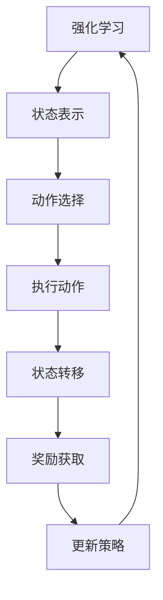

                 

# 强化学习驱动的自适应多层次推理策略优化

> 关键词：强化学习、自适应多层次推理、策略优化、算法、应用案例

> 摘要：本文系统地探讨了强化学习驱动的自适应多层次推理策略优化的方法及其应用。首先介绍了强化学习的基础理论，包括基本概念、数学模型和常见算法。接着，我们探讨了强化学习在自适应多层次推理策略优化中的关键作用，并分析了多层次推理策略优化的挑战与解决方案。最后，通过实际应用案例展示了强化学习驱动的自适应多层次推理策略优化的实用价值。

## 目录大纲

----------------------------------------------------------------

## 第一部分: 强化学习基础

### 第1章: 强化学习概述

#### 1.1 强化学习的基本概念

#### 1.2 强化学习的特点与挑战

#### 1.3 强化学习的发展历程

#### 1.4 强化学习与深度学习的关联

### 第2章: 强化学习的数学模型

#### 2.1 离散时间强化学习模型

#### 2.2 连续时间强化学习模型

#### 2.3 强化学习的基本算法

### 第3章: 基础强化学习算法

#### 3.1 Q-learning算法

#### 3.2 Sarsa算法

#### 3.3 Deep Q Network (DQN)

### 第4章: 集成强化学习算法

#### 4.1 多臂老虎机问题

#### 4.2 UCRL算法

#### 4.3 LINUCB算法

### 第5章: 深度强化学习算法

#### 5.1 Policy Gradient算法

#### 5.2 actor-critic算法

#### 5.3 DDPG算法

### 第6章: 自适应多层次推理策略优化

#### 6.1 多层次推理策略优化的概念

#### 6.2 强化学习在多层次推理中的应用

#### 6.3 多层次推理策略优化的挑战与解决方案

### 第7章: 强化学习驱动的自适应多层次推理策略优化应用案例

#### 7.1 案例一：智能交通系统

#### 7.2 案例二：智能医疗诊断

#### 7.3 案例三：工业生产调度

### 第8章: 结论与未来展望

#### 8.1 主要成果回顾

#### 8.2 未来发展趋势

#### 8.3 研究展望与挑战

----------------------------------------------------------------

## 第一部分: 强化学习基础

### 第1章: 强化学习概述

#### 1.1 强化学习的基本概念

强化学习（Reinforcement Learning，简称RL）是一种机器学习范式，主要研究智能体在与环境交互的过程中如何通过学习获取最优策略，从而实现目标。强化学习的主要特征包括：有监督学习、无监督学习和强化学习三种类型。强化学习的基本概念包括状态（State）、动作（Action）、奖励（Reward）和策略（Policy）。

- **状态（State）**：描述智能体所处环境的特征，可以用状态向量表示。
- **动作（Action）**：智能体在特定状态下可以采取的行为，通常用动作向量表示。
- **奖励（Reward）**：智能体采取动作后获得的即时奖励，用来评估动作的好坏。
- **策略（Policy）**：智能体在特定状态下选择最优动作的策略，通常用概率分布表示。

#### 1.2 强化学习的特点与挑战

强化学习的特点主要包括：

- **交互性**：智能体通过与环境交互获取反馈，不断调整自己的策略。
- **不确定性**：环境状态和奖励都是不确定的，智能体需要在不确定的环境中学习最优策略。
- **延迟奖励**：智能体在采取动作后可能需要经过多次交互才能获得奖励，这使得学习过程更加复杂。

强化学习面临的挑战主要包括：

- **奖励稀疏性**：在某些任务中，奖励出现得非常稀疏，导致学习过程变得困难。
- **探索与利用的权衡**：在探索未知状态和利用已有知识之间需要找到一个平衡点，以最大化学习效果。
- **可扩展性和计算效率**：强化学习算法需要处理大量的状态和动作，如何在保证准确性的同时提高计算效率是一个重要问题。

#### 1.3 强化学习的发展历程

强化学习起源于20世纪50年代，早期的研究主要集中在基础理论和算法的研究。随着计算机性能的提升和深度学习的发展，强化学习在近年来取得了显著的进展，并广泛应用于自动驾驶、游戏、机器人控制等领域。以下是强化学习的发展历程：

- **1950年代**：强化学习概念提出，包括马尔可夫决策过程（MDP）等基本理论。
- **1980年代**：Q-learning算法提出，奠定了强化学习算法的基础。
- **1990年代**：深度强化学习开始出现，包括深度Q网络（DQN）等算法。
- **2010年代至今**：强化学习在深度学习、自然语言处理等领域取得了广泛应用，涌现出大量高效的强化学习算法。

#### 1.4 强化学习与深度学习的关联

强化学习和深度学习是两个密切相关但又有区别的领域。强化学习利用深度学习模型来提高智能体的学习能力和决策质量。深度强化学习（Deep Reinforcement Learning，简称DRL）是将深度学习模型与强化学习算法相结合的一种方法，其核心思想是通过深度神经网络来表示状态和动作空间，从而提高强化学习算法的求解效率。

强化学习与深度学习的关联主要体现在以下几个方面：

- **状态和动作表示**：深度学习模型可以用来表示复杂的状态和动作空间，使得强化学习算法能够处理更大规模的任务。
- **策略学习**：深度学习模型可以用来学习最优策略，从而提高智能体的决策质量。
- **探索与利用**：深度学习模型可以通过调整学习参数来平衡探索和利用，从而优化学习过程。

## 第一部分: 强化学习基础

### 第2章: 强化学习的数学模型

强化学习的数学模型是理解强化学习算法和解决实际问题的基石。在本章中，我们将详细介绍离散时间强化学习模型和连续时间强化学习模型，以及强化学习的基本算法。

#### 2.1 离散时间强化学习模型

离散时间强化学习模型是最常见的强化学习模型，其特点是时间离散化和状态、动作、奖励的离散化。

- **状态（State）**：在离散时间强化学习模型中，状态可以用一个有限的集合来表示。例如，在游戏中的状态可以表示为游戏棋盘的当前状态。
- **动作（Action）**：动作也是一个有限的集合，表示智能体可以采取的行为。例如，在游戏中的动作可以表示为移动到棋盘上的某个位置。
- **奖励（Reward）**：奖励是一个标量，表示智能体在采取某个动作后获得的即时奖励。例如，在游戏中的奖励可以表示为得分。
- **策略（Policy）**：策略是一个函数，表示智能体在特定状态下应该采取的动作。例如，在游戏中的策略可以表示为在当前棋盘状态下应该移动到哪个位置。

离散时间强化学习模型可以用一个四元组（\(S, A, R, P\)）来表示，其中：

- \(S\) 表示状态空间。
- \(A\) 表示动作空间。
- \(R\) 表示奖励函数。
- \(P\) 表示策略。

一个基本的离散时间强化学习问题可以描述为：给定初始状态 \(s_0\)，智能体在有限时间 \(T\) 内按照策略 \(π\) 采取动作，并从状态 \(s_0\) 转移到最终状态 \(s_T\)，同时获得奖励序列 \(r_1, r_2, ..., r_T\)。我们的目标是找到一个策略 \(π\)，使得累积奖励最大化。

- **值函数（Value Function）**：值函数 \(V(s)\) 表示在状态 \(s\) 下按照策略 \(π\) 采取动作所期望获得的累积奖励。即
  $$
  V(s) = E_{s_0} [∑_{t=0}^{T} r_t | s_0 = s, π]
  $$
  
- **策略值函数（Policy Value Function）**：策略值函数 \(V^π(s)\) 表示在状态 \(s\) 下按照策略 \(π\) 采取动作所期望获得的累积奖励。即
  $$
  V^π(s) = E_{s_0} [∑_{t=0}^{T} r_t | s_0 = s, π]
  $$

- **动作值函数（Action Value Function）**：动作值函数 \(Q(s, a)\) 表示在状态 \(s\) 下采取动作 \(a\) 所期望获得的累积奖励。即
  $$
  Q(s, a) = E_{s_0} [∑_{t=0}^{T} r_t | s_0 = s, a_t = a, π]
  $$

#### 2.2 连续时间强化学习模型

与离散时间强化学习模型相比，连续时间强化学习模型中的状态、动作和奖励是连续的。在连续时间强化学习模型中，智能体需要在每个时刻 \(t\) 采取一个连续的动作 \(a(t)\)，并从当前状态 \(s(t)\) 转移到下一个状态 \(s(t+1)\)，同时获得奖励 \(r(t)\)。连续时间强化学习模型可以用一个四元组 \((S, A, R, P)\) 来表示。

- **状态（State）**：在连续时间强化学习模型中，状态 \(s(t)\) 是一个连续的实值向量。
- **动作（Action）**：在连续时间强化学习模型中，动作 \(a(t)\) 是一个连续的实值向量。
- **奖励（Reward）**：在连续时间强化学习模型中，奖励 \(r(t)\) 是一个连续的实值函数。

连续时间强化学习问题可以描述为：给定初始状态 \(s(0)\)，智能体在连续时间 \(t\) 内按照策略 \(π\) 采取连续动作，并从初始状态 \(s(0)\) 转移到最终状态 \(s(T)\)，同时获得奖励序列 \(r(t)\)。我们的目标是找到一个策略 \(π\)，使得累积奖励最大化。

#### 2.3 强化学习的基本算法

强化学习算法可以分为两大类：基于模型的方法和无模型方法。

- **基于模型的方法（Model-Based Methods）**：基于模型的方法通过学习环境模型来预测状态转移概率和奖励函数。常见的基于模型的方法包括动态规划（Dynamic Programming）和部分可观察马尔可夫决策过程（Partially Observable Markov Decision Processes，简称POMDPs）。

- **无模型方法（Model-Free Methods）**：无模型方法不依赖于环境模型，而是直接从经验中学习策略。常见的无模型方法包括Q-learning、Sarsa和深度Q网络（Deep Q-Network，简称DQN）。

##### Q-learning算法

Q-learning算法是一种无模型强化学习算法，通过迭代更新动作值函数 \(Q(s, a)\) 来学习最优策略。

- **算法思想**：在给定状态 \(s\) 和动作 \(a\)，Q-learning算法通过选择当前最优动作并更新 \(Q(s, a)\) 来实现学习。具体来说，对于每个状态 \(s\) 和动作 \(a\)，更新公式如下：
  $$
  Q(s, a) \leftarrow Q(s, a) + α [r + γ \max_{a'} Q(s', a') - Q(s, a)]
  $$
  其中，\(α\) 是学习率，\(γ\) 是折扣因子，\(r\) 是奖励，\(s'\) 是智能体采取动作 \(a\) 后的状态，\(a'\) 是当前最优动作。

- **算法步骤**：

  1. 初始化 \(Q(s, a)\)。
  2. 选择动作 \(a\)。
  3. 执行动作 \(a\)，观察奖励 \(r\) 和下一个状态 \(s'\)。
  4. 更新 \(Q(s, a)\)。
  5. 转到下一个状态 \(s'\)。

##### Sarsa算法

Sarsa算法是一种基于状态-动作对的经验回溯（Experience Replay）方法，它通过选择当前最优动作和下一个状态的最优动作来更新动作值函数。

- **算法思想**：在给定状态 \(s\) 和动作 \(a\)，Sarsa算法通过选择当前最优动作 \(a'\) 并更新 \(Q(s, a)\) 来实现学习。具体来说，对于每个状态 \(s\) 和动作 \(a\)，更新公式如下：
  $$
  Q(s, a) \leftarrow Q(s, a) + α [r + γ Q(s', a') - Q(s, a)]
  $$
  其中，\(α\) 是学习率，\(γ\) 是折扣因子，\(r\) 是奖励，\(s'\) 是智能体采取动作 \(a\) 后的状态，\(a'\) 是当前最优动作。

- **算法步骤**：

  1. 初始化 \(Q(s, a)\)。
  2. 选择动作 \(a\)。
  3. 执行动作 \(a\)，观察奖励 \(r\) 和下一个状态 \(s'\)。
  4. 选择下一个动作 \(a'\)。
  5. 更新 \(Q(s, a)\)。
  6. 转到下一个状态 \(s'\)。

##### Deep Q Network (DQN)

深度Q网络（DQN）是一种基于深度学习的强化学习算法，它使用深度神经网络来近似动作值函数 \(Q(s, a)\)。

- **算法思想**：在给定状态 \(s\) 和动作 \(a\)，DQN算法通过选择当前最优动作 \(a'\) 并更新深度神经网络来学习动作值函数 \(Q(s, a)\)。具体来说，对于每个状态 \(s\) 和动作 \(a\)，更新公式如下：
  $$
  Q(s, a) \leftarrow Q(s, a) + α [r + γ \max_{a'} Q(s', a') - Q(s, a)]
  $$
  其中，\(α\) 是学习率，\(γ\) 是折扣因子，\(r\) 是奖励，\(s'\) 是智能体采取动作 \(a\) 后的状态，\(a'\) 是当前最优动作。

- **算法步骤**：

  1. 初始化深度神经网络 \(Q(s, a)\)。
  2. 选择动作 \(a\)。
  3. 执行动作 \(a\)，观察奖励 \(r\) 和下一个状态 \(s'\)。
  4. 更新深度神经网络 \(Q(s, a)\)。
  5. 转到下一个状态 \(s'\)。

以上是强化学习的数学模型和基本算法的介绍。通过这些算法，我们可以学习到智能体如何通过与环境的交互来优化自己的策略，从而实现目标。在接下来的章节中，我们将继续探讨强化学习的其他算法和应用。

### 第3章: 基础强化学习算法

在强化学习的探索过程中，一些基础的算法如Q-learning、Sarsa和Deep Q Network (DQN)成为了理解和应用强化学习的关键工具。本章将详细介绍这些算法的原理，并通过具体的例子帮助读者更好地理解其工作方式。

#### 3.1 Q-learning算法

Q-learning算法是一种基于值函数的强化学习算法，旨在通过迭代更新动作值函数 \(Q(s, a)\) 来找到最优策略。Q-learning算法的核心思想是利用当前状态和动作的奖励以及下一个状态的最优动作值来更新当前动作值。

**算法原理**：
Q-learning算法的目标是最大化累积奖励，即找到使得 \(∑_{t=0}^{T} r_t\) 最大的策略 \(π\)。算法通过以下更新公式来学习动作值函数：

$$
Q(s, a) \leftarrow Q(s, a) + α [r + γ \max_{a'} Q(s', a') - Q(s, a)]
$$

其中：
- \(Q(s, a)\) 是在状态 \(s\) 采取动作 \(a\) 的期望回报。
- \(r\) 是立即奖励。
- \(γ\) 是折扣因子，用于平衡当前奖励和未来奖励的重要性。
- \(α\) 是学习率，用于控制更新步长。
- \(\max_{a'} Q(s', a')\) 是在状态 \(s'\) 下的最优动作值。

**算法步骤**：
1. 初始化 \(Q(s, a)\)。
2. 选择当前状态 \(s\)。
3. 在当前状态 \(s\) 下选择动作 \(a\)。
4. 执行动作 \(a\)，得到奖励 \(r\) 和下一个状态 \(s'\)。
5. 使用上述更新公式更新 \(Q(s, a)\)。
6. 转移到下一个状态 \(s'\)。
7. 重复步骤2到6，直到达到目标或停止条件。

**例子**：
假设我们有一个简单的环境，其中智能体需要在5个格子中选择一个动作，目标是在最短时间内到达目标格子。每个格子都有不同的奖励值，如图3-1所示：

```
  1  2  3  4  5
1 | 0  0  0  0  1
2 | 0  0  0  0  0
3 | 0  0  0  0  0
4 | 0  0  0  0  0
5 | 0  0  0  0  0
```

初始状态为格子1，目标状态为格子5。智能体需要选择最优动作以最大化累积奖励。

在初始状态下，我们可以随机选择一个动作，例如向右移动到格子2。根据Q-learning算法的更新公式，我们可以更新当前动作值：

$$
Q(1, 2) \leftarrow Q(1, 2) + α [r + γ \max_{a'} Q(2, a') - Q(1, 2)]
$$

其中，\(r = 0\)（因为没有立即奖励），\(α = 0.1\)，\(γ = 0.9\)。假设初始动作值 \(Q(1, 2) = 0\)，则更新后：

$$
Q(1, 2) \leftarrow 0 + 0.1 [0 + 0.9 \max_{a'} Q(2, a') - 0]
$$

由于当前状态下只能向右移动，\(Q(2, 1) = Q(2, 2) = Q(2, 3) = Q(2, 4) = 0\)，所以：

$$
Q(1, 2) \leftarrow 0.1 \times 0.9 \times 0
$$

即 \(Q(1, 2)\) 不变。

接下来，智能体移动到格子2，重复上述步骤，直到智能体到达目标格子5。最终，我们可以通过Q-learning算法找到一个最优策略，使智能体能够以最小的时间到达目标。

#### 3.2 Sarsa算法

Sarsa算法是基于状态-动作对的强化学习算法，它与Q-learning算法的不同之处在于它使用下一个状态的最优动作值而不是实际采取的动作值来更新当前动作值。

**算法原理**：
Sarsa算法通过以下更新公式来学习动作值函数：

$$
Q(s, a) \leftarrow Q(s, a) + α [r + γ Q(s', a') - Q(s, a)]
$$

其中，\(a'\) 是在状态 \(s'\) 下采取的最优动作。

**算法步骤**：
1. 初始化 \(Q(s, a)\)。
2. 选择当前状态 \(s\)。
3. 在当前状态 \(s\) 下选择动作 \(a\)。
4. 执行动作 \(a\)，得到奖励 \(r\) 和下一个状态 \(s'\)。
5. 在状态 \(s'\) 下选择下一个动作 \(a'\)（根据当前策略或探索策略）。
6. 使用上述更新公式更新 \(Q(s, a)\)。
7. 转移到下一个状态 \(s'\)。
8. 重复步骤3到7，直到达到目标或停止条件。

**例子**：
假设我们仍然使用上例中的环境。智能体初始状态为格子1，目标状态为格子5。智能体采取Sarsa算法来学习最优策略。

在初始状态下，智能体随机选择向右移动到格子2。然后，智能体在状态2下选择向右移动到格子3。假设此时智能体采取随机探索策略，选择了向下移动到格子4。根据Sarsa算法的更新公式，我们可以更新当前动作值：

$$
Q(1, 2) \leftarrow Q(1, 2) + α [r + γ Q(4, 1') - Q(1, 2)]
$$

其中，\(r = 0\)（因为没有立即奖励），\(α = 0.1\)，\(γ = 0.9\)。假设初始动作值 \(Q(1, 2) = 0\)，则更新后：

$$
Q(1, 2) \leftarrow 0 + 0.1 [0 + 0.9 \times Q(4, 1') - 0]
$$

由于当前状态下只能向右移动，\(Q(4, 1') = Q(4, 2') = Q(4, 3') = Q(4, 4') = 0\)，所以：

$$
Q(1, 2) \leftarrow 0.1 \times 0.9 \times 0
$$

即 \(Q(1, 2)\) 不变。

接下来，智能体移动到状态4，重复上述步骤，直到智能体到达目标状态5。最终，智能体可以通过Sarsa算法学习到一个最优策略，使智能体能够以最小的时间到达目标。

#### 3.3 Deep Q Network (DQN)

Deep Q Network (DQN) 是一种基于深度学习的强化学习算法，它使用深度神经网络来近似动作值函数 \(Q(s, a)\)。DQN算法通过经验回放和目标网络来提高学习效果和稳定性。

**算法原理**：
DQN算法的核心思想是使用深度神经网络 \(Q(s, a)\) 来预测在状态 \(s\) 下采取动作 \(a\) 的期望回报。通过以下更新公式来学习动作值函数：

$$
Q(s, a) \leftarrow Q(s, a) + α [r + γ \max_{a'} Q(s', a') - Q(s, a)]
$$

其中，\(Q(s', a')\) 是目标网络 \(Q'(s', a')\) 的预测值。

**算法步骤**：
1. 初始化深度神经网络 \(Q(s, a)\) 和目标网络 \(Q'(s', a')\)。
2. 从初始状态 \(s_0\) 开始，选择动作 \(a_0\)。
3. 执行动作 \(a_0\)，得到奖励 \(r_0\) 和下一个状态 \(s_1\)。
4. 将经历 \((s_0, a_0, r_0, s_1)\) 存入经验回放池。
5. 随机从经验回放池中抽取一批经历 \((s, a, r, s')\)。
6. 计算目标值 \(y = r + γ \max_{a'} Q'(s', a')\)。
7. 更新深度神经网络 \(Q(s, a)\)：\(Q(s, a) \leftarrow Q(s, a) + α [y - Q(s, a)]\)。
8. 更新目标网络 \(Q'(s', a')\)：使用当前网络的参数更新目标网络。
9. 转移到下一个状态 \(s'\)。
10. 重复步骤3到9，直到达到目标或停止条件。

**例子**：
假设我们使用一个简单的二维环境，其中智能体需要在5个格子中选择一个动作，目标是在最短时间内到达目标格子。每个格子都有不同的奖励值，如图3-2所示：

```
  1  2  3  4  5
1 | 0  0  0  0  1
2 | 0  0  0  0  0
3 | 0  0  0  0  0
4 | 0  0  0  0  0
5 | 0  0  0  0  0
```

智能体初始状态为格子1，目标状态为格子5。智能体使用DQN算法来学习最优策略。

在初始状态下，智能体随机选择向右移动到格子2。然后，智能体在状态2下选择向右移动到格子3。假设此时智能体采取随机探索策略，选择了向下移动到格子4。根据DQN算法的更新公式，我们可以更新当前动作值：

$$
Q(s, a) \leftarrow Q(s, a) + α [r + γ \max_{a'} Q'(s', a') - Q(s, a)]
$$

其中，\(r = 0\)（因为没有立即奖励），\(α = 0.1\)，\(γ = 0.9\)。假设当前动作值 \(Q(1, 2) = 0\)，目标网络动作值 \(Q'(2, 3) = 0\)，则更新后：

$$
Q(1, 2) \leftarrow 0 + 0.1 [0 + 0.9 \times 0 - 0]
$$

即 \(Q(1, 2)\) 不变。

接下来，智能体移动到状态4，重复上述步骤，直到智能体到达目标状态5。最终，智能体可以通过DQN算法学习到一个最优策略，使智能体能够以最小的时间到达目标。

通过本章的介绍，我们可以看到Q-learning、Sarsa和DQN算法在强化学习中的应用。这些算法通过不同的方法更新动作值函数，以找到最优策略。在实际应用中，这些算法可以帮助智能体在复杂的决策环境中做出最优选择，从而实现智能体的自主学习和决策。

### 第4章: 集成强化学习算法

集成强化学习算法是一种通过组合多个基学习算法来提高学习性能的方法。这种策略利用多样性来减少不确定性，并通过加权平均或投票机制来整合基学习算法的预测。本章将介绍几种典型的集成强化学习算法，包括多臂老虎机问题、UCRL算法和LINUCB算法。

#### 4.1 多臂老虎机问题

多臂老虎机问题是一个经典的强化学习问题，形象地描述了智能体如何在多个不确定的选项中做出最佳选择的问题。在这个问题中，智能体面临多个老虎机，每个老虎机有不同的奖励分布。智能体的目标是找到每个老虎机的最大期望奖励，并在长期内最大化总奖励。

**问题描述**：
假设有 \(n\) 个老虎机，每个老虎机的奖励分布为 \(P_i(\xi_i)\)，其中 \(\xi_i\) 是随机变量。智能体每次选择一个老虎机进行投币，获得的奖励为 \(\xi_i\)。智能体的目标是最大化其总奖励 \(R\)：

$$
R = \sum_{t=1}^{T} \xi_i
$$

**解决方案**：

- **ε-贪心策略**：在多臂老虎机问题中，常用的策略是ε-贪心策略。智能体以概率 \(1-\epsilon\) 随机选择一个老虎机，并以概率 \(\epsilon/n\) 选择一个随机老虎机。这种策略在探索和利用之间取得了平衡。

- **UCB算法**：UCB（Upper Confidence Bound）算法是一种集成强化学习算法，它通过考虑每个老虎机的平均奖励和不确定性来选择最优老虎机。UCB算法的核心思想是选择奖励期望最高的老虎机，并在计算过程中加入一个上界，该上界反映了不确定性。

  UCB算法的更新公式为：

  $$
  \text{UCB}(s, a) = \bar{X}_{sa} + \sqrt{\frac{2 \ln t}{n}}
  $$

  其中，\(\bar{X}_{sa}\) 是在状态 \(s\) 采取动作 \(a\) 的平均奖励，\(t\) 是智能体执行动作的总次数。

  智能体选择动作 \(a\) 使得 \(\text{UCB}(s, a)\) 最大。

#### 4.2 UCRL算法

UCRL（Upper Confidence Bound for Reinforcement Learning）算法是一种针对不确定环境的集成强化学习算法。UCRL算法通过考虑当前估计的方差和置信区间来选择最优动作，从而在不确定环境中实现稳健的学习。

**算法原理**：

UCRL算法的核心思想是选择一个动作 \(a\)，使得在当前估计的基础上，未来累积奖励的上界最大化。具体来说，UCRL算法通过以下更新公式来更新动作值：

$$
\hat{Q}(s, a) \leftarrow \hat{Q}(s, a) + \alpha [r + \gamma \max_{a'} \hat{Q}(s', a') - \hat{Q}(s, a)]
$$

其中，\(\hat{Q}(s, a)\) 是在状态 \(s\) 采取动作 \(a\) 的估计动作值，\(\alpha\) 是学习率，\(r\) 是奖励，\(\gamma\) 是折扣因子。

UCRL算法的关键是计算每个动作的置信区间，并选择置信区间上界最大的动作。置信区间计算公式为：

$$
\Delta(s, a) = \sqrt{\frac{2 \ln t}{n} + \frac{\sigma^2(s, a)}{n}}
$$

其中，\(t\) 是智能体执行动作的总次数，\(\sigma^2(s, a)\) 是在状态 \(s\) 采取动作 \(a\) 的估计方差。

**算法步骤**：

1. 初始化动作值函数 \(\hat{Q}(s, a)\)。
2. 选择当前状态 \(s\)。
3. 在当前状态 \(s\) 下选择动作 \(a\)，使得 \( \hat{Q}(s, a) + \Delta(s, a) \) 最大。
4. 执行动作 \(a\)，观察奖励 \(r\) 和下一个状态 \(s'\)。
5. 更新动作值函数 \(\hat{Q}(s, a)\)。
6. 转移到下一个状态 \(s'\)。
7. 重复步骤3到6，直到达到目标或停止条件。

#### 4.3 LINUCB算法

LINUCB（Linear Upper Confidence Bound）算法是一种基于线性回归的集成强化学习算法。LINUCB算法通过构建线性回归模型来估计动作值，并通过置信区间来选择最优动作。

**算法原理**：

LINUCB算法的核心思想是使用线性回归模型来估计每个动作的期望回报，并在估计的基础上计算置信区间。算法通过以下更新公式来更新线性回归模型：

$$
w_t = w_{t-1} + \alpha (r - \hat{y})
$$

其中，\(w_t\) 是线性回归模型的权重向量，\(\alpha\) 是学习率，\(\hat{y}\) 是预测的期望回报。

LINUCB算法的更新公式为：

$$
\hat{y} = \sum_{i=1}^{n} w_{t-1} x_i
$$

其中，\(x_i\) 是输入特征向量。

**算法步骤**：

1. 初始化线性回归模型 \(w_0\)。
2. 选择当前状态 \(s\)。
3. 在当前状态 \(s\) 下选择动作 \(a\)，使得预测的期望回报最大。
4. 执行动作 \(a\)，观察奖励 \(r\) 和下一个状态 \(s'\)。
5. 更新线性回归模型 \(w_t\)。
6. 转移到下一个状态 \(s'\)。
7. 重复步骤3到6，直到达到目标或停止条件。

#### 总结

集成强化学习算法通过组合多个基学习算法来提高学习性能。在多臂老虎机问题中，ε-贪心策略和UCB算法通过平衡探索和利用来实现最佳选择。UCRL算法和LINUCB算法则通过构建线性回归模型和置信区间来估计动作值，从而在不确定环境中实现稳健学习。这些算法为解决复杂强化学习问题提供了有效的方法，并在实际应用中取得了显著的成果。

### 第5章: 深度强化学习算法

深度强化学习（Deep Reinforcement Learning，简称DRL）是强化学习与深度学习相结合的一种方法，通过使用深度神经网络来处理高维状态和动作空间，从而提高强化学习算法的效率和性能。本章将介绍三种典型的深度强化学习算法：Policy Gradient算法、Actor-Critic算法和DDPG（Deep Deterministic Policy Gradient）算法。

#### 5.1 Policy Gradient算法

Policy Gradient算法是一种基于策略梯度的强化学习算法，其核心思想是通过直接优化策略函数来最大化累积奖励。Policy Gradient算法将策略参数作为优化目标，通过梯度上升方法逐步调整策略参数，从而提高累积奖励。

**算法原理**：

Policy Gradient算法的目标是最大化累积奖励：

$$
J(θ) = \sum_{t=0}^{T} \gamma^t r_t
$$

其中，\(θ\) 是策略参数，\(\gamma\) 是折扣因子，\(r_t\) 是第 \(t\) 个时间步的即时奖励。

Policy Gradient算法通过计算策略梯度和更新策略参数来优化策略：

$$
θ \leftarrow θ + α \nabla_θ J(θ)
$$

其中，\(α\) 是学习率。

**算法步骤**：

1. 初始化策略参数 \(θ\)。
2. 生成经验轨迹 \((s_0, a_0, r_0, s_1, a_1, r_1, ..., s_T, a_T, r_T)\)。
3. 计算策略梯度 \(\nabla_θ J(θ)\)。
4. 更新策略参数 \(θ\)。
5. 重复步骤2到4，直到达到停止条件。

**例子**：

考虑一个简单的双臂老虎机问题，其中有两个老虎机，每个老虎机的奖励分布分别为 \(\xi_1\) 和 \(\xi_2\)。智能体需要选择一个老虎机进行投币，目标是最大化总奖励。

在初始状态，智能体随机选择一个老虎机进行投币。根据Policy Gradient算法，我们计算策略梯度并更新策略参数。假设当前策略参数 \(θ\) 表示选择第一个老虎机的概率，那么策略函数为 \(π(a|θ) = P(\xi_1 > \xi_2)\)。通过计算累积奖励，我们可以得到策略梯度：

$$
\nabla_θ J(θ) = \frac{\partial J(θ)}{\partial θ} = \frac{\partial}{\partial θ} \sum_{t=0}^{T} \gamma^t r_t
$$

通过策略梯度的更新，智能体可以调整策略参数，选择奖励更高的老虎机，从而实现累积奖励的最大化。

#### 5.2 Actor-Critic算法

Actor-Critic算法是一种结合了策略优化和价值评估的方法，通过同时优化策略和价值函数来提高学习效率和性能。Actor-Critic算法包括两个主要部分：Actor（策略网络）和Critic（价值网络）。Actor网络负责生成策略，而Critic网络负责评估策略的好坏。

**算法原理**：

Actor-Critic算法的核心思想是使用Critic网络提供的价值估计来指导Actor网络的更新，从而优化策略。具体来说，算法通过以下更新公式来优化策略和价值函数：

- **Critic网络更新**：

  $$
  V(s_t, θ_v) \leftarrow V(s_t, θ_v) + α_v [r_t + \gamma V(s_{t+1}, θ_v) - V(s_t, θ_v)]
  $$

  其中，\(V(s_t, θ_v)\) 是在状态 \(s_t\) 下的价值估计，\(α_v\) 是Critic网络的学习率。

- **Actor网络更新**：

  $$
  π(a_t|s_t, θ_π) \leftarrow π(a_t|s_t, θ_π)
  $$
  $$
  θ_π \leftarrow θ_π + α_π \nabla_θ_π J(θ_π)
  $$

  其中，\(π(a_t|s_t, θ_π)\) 是在状态 \(s_t\) 下的策略，\(θ_π\) 是Actor网络的参数，\(α_π\) 是Actor网络的学习率。

**算法步骤**：

1. 初始化Actor网络和Critic网络参数。
2. 生成经验轨迹 \((s_0, a_0, r_0, s_1, a_1, r_1, ..., s_T, a_T, r_T)\)。
3. 使用Critic网络估计价值函数 \(V(s_t, θ_v)\)。
4. 根据价值估计和实际奖励计算策略梯度 \(\nabla_θ_π J(θ_π)\)。
5. 更新Actor网络参数 \(θ_π\)。
6. 使用更新后的策略生成下一个动作 \(a_{t+1}\)。
7. 重复步骤3到6，直到达到停止条件。

**例子**：

考虑一个简单的机器人导航问题，其中机器人需要在二维空间中导航到目标位置。在初始状态，机器人根据Critic网络提供的价值估计选择移动方向。根据Actor网络提供的策略，机器人更新移动方向，并逐步接近目标位置。通过同时优化策略和价值函数，机器人可以学习到最优导航策略。

#### 5.3 DDPG（Deep Deterministic Policy Gradient）算法

DDPG算法是一种基于深度神经网络和确定性策略的强化学习算法，通过使用目标网络和经验回放来提高学习稳定性和性能。DDPG算法将Policy Gradient算法与深度神经网络相结合，解决了高维状态和动作空间的问题。

**算法原理**：

DDPG算法的核心思想是使用深度神经网络来近似策略和价值函数，并通过目标网络和经验回放来稳定学习过程。具体来说，算法通过以下更新公式来优化策略和价值函数：

- **目标网络更新**：

  $$
  θ_{\text{target}} \leftarrow τ θ + (1 - τ) θ_{\text{target}}
  $$

  其中，\(θ_{\text{target}}\) 是目标网络的参数，\(τ\) 是更新比例。

- **Critic网络更新**：

  $$
  V(s_t, θ_v) \leftarrow V(s_t, θ_v) + α_v [r_t + \gamma V(s_{t+1}, θ_{\text{target}}) - V(s_t, θ_v)]
  $$

- **Actor网络更新**：

  $$
  π(a_t|s_t, θ_π) \leftarrow π(a_t|s_t, θ_π)
  $$
  $$
  θ_π \leftarrow θ_π + α_π \nabla_θ_π J(θ_π)
  $$

**算法步骤**：

1. 初始化Actor网络、Critic网络和目标网络参数。
2. 从环境中获取初始状态 \(s_0\)。
3. 使用Critic网络估计价值函数 \(V(s_t, θ_v)\)。
4. 根据Critic网络提供的价值估计和实际奖励计算策略梯度 \(\nabla_θ_π J(θ_π)\)。
5. 更新Actor网络参数 \(θ_π\)。
6. 使用更新后的策略生成动作 \(a_t\)。
7. 执行动作 \(a_t\)，获取下一个状态 \(s_{t+1}\) 和奖励 \(r_t\)。
8. 将经验 \((s_t, a_t, r_t, s_{t+1})\) 存入经验回放池。
9. 从经验回放池中随机抽取一批经验。
10. 更新Critic网络参数 \(θ_v\)。
11. 更新目标网络参数 \(θ_{\text{target}}\)。
12. 重复步骤3到11，直到达到停止条件。

**例子**：

考虑一个简单的连续控制问题，如机器人手臂控制。在初始状态，机器人手臂根据DDPG算法的策略选择移动方向。通过不断执行动作和更新策略，机器人手臂逐步学会控制手臂到达目标位置。通过使用目标网络和经验回放，DDPG算法提高了学习过程的稳定性和性能。

通过本章的介绍，我们可以看到深度强化学习算法在处理高维状态和动作空间方面的优势。Policy Gradient算法、Actor-Critic算法和DDPG算法通过不同的方法优化策略和价值函数，从而实现了智能体的自主学习和决策。这些算法在自动驾驶、游戏控制和机器人控制等领域取得了显著的成果，为未来的智能系统设计提供了有力的支持。

### 第6章: 自适应多层次推理策略优化

在智能系统的设计和实现过程中，自适应多层次推理策略优化成为了一个关键问题。多层次推理策略优化旨在通过将问题分解为多个层次，从而提高智能系统的决策质量和效率。在本章中，我们将探讨多层次推理策略优化的概念、强化学习在其中的应用，以及面临的挑战和解决方案。

#### 6.1 多层次推理策略优化的概念

多层次推理策略优化是一种将复杂问题分解为多个层次，并在每个层次上分别进行推理和优化的方法。这种方法的核心思想是将复杂问题转化为一系列相对简单的问题，从而降低问题的复杂度，提高求解效率和决策质量。

**多层次推理策略优化的概念**：

- **层次化问题分解**：将复杂问题分解为多个层次，每个层次代表问题的不同抽象层次。
- **层次间关系**：不同层次之间的转换关系，包括状态转换、奖励函数和策略。
- **优化目标**：在每个层次上分别进行优化，以实现全局优化目标。

**多层次推理策略优化的特点**：

- **分层次优化**：通过分层次优化，可以降低每个层次的复杂度，提高求解效率。
- **层次间协作**：不同层次之间的协作和整合，以实现全局优化目标。
- **灵活性和适应性**：根据不同问题和场景，可以灵活调整层次结构和优化策略。

#### 6.2 强化学习在多层次推理中的应用

强化学习在多层次推理策略优化中扮演着重要角色，其核心思想是通过智能体与环境的交互，学习到最优策略。在多层次推理中，强化学习可以通过以下方式应用：

**强化学习在多层次推理中的应用**：

1. **层次化状态表示**：通过使用深度神经网络，将状态表示为多层特征，从而提高状态表示的抽象度和表达能力。
2. **层次化动作空间**：将动作空间分解为多个层次，每个层次代表不同抽象层次的动作选择。
3. **层次化奖励设计**：根据不同层次的目标，设计相应的奖励函数，以引导智能体在不同层次上的决策。
4. **层次化策略优化**：通过层次化策略优化，学习到在每个层次上的最优策略，从而实现全局优化目标。

**强化学习在多层次推理中的优势**：

- **自适应调整**：强化学习可以通过与环境的交互，自适应调整策略，以适应不同问题和场景。
- **灵活性和通用性**：强化学习可以处理各种复杂问题，具有广泛的适用性。
- **鲁棒性**：通过多层次推理，可以增强智能系统在面对不确定性环境时的鲁棒性。

#### 6.3 多层次推理策略优化的挑战与解决方案

尽管多层次推理策略优化具有许多优势，但在实际应用中仍面临着一系列挑战。以下是主要的挑战和相应的解决方案：

**挑战**：

1. **状态表示问题**：多层次推理需要有效的状态表示方法，以实现不同层次之间的转换和协作。
2. **动作空间问题**：多层次推理涉及多个层次的动作空间，如何设计合适的动作空间是关键。
3. **奖励设计问题**：奖励函数的设计对智能体的决策具有重要影响，如何设计有效的奖励函数是一个重要挑战。
4. **层次间协作问题**：不同层次之间的协作和整合是一个复杂问题，如何实现高效层次间协作是一个关键挑战。

**解决方案**：

1. **层次化状态表示**：使用深度神经网络和特征提取技术，将状态表示为多层特征，从而提高状态表示的抽象度和表达能力。
2. **层次化动作空间**：根据问题特点，设计合适的动作空间，并在不同层次之间建立映射关系，以实现层次化动作选择。
3. **层次化奖励设计**：根据不同层次的目标，设计相应的奖励函数，以引导智能体在不同层次上的决策。
4. **层次间协作方法**：采用强化学习算法，通过智能体与环境的交互，学习到最优策略，实现层次间的高效协作和整合。

通过本章的介绍，我们可以看到多层次推理策略优化在智能系统设计中的重要性和挑战。强化学习在多层次推理策略优化中的应用为解决复杂问题提供了新的思路和方法，同时也带来了许多新的研究机会和挑战。在接下来的章节中，我们将通过实际应用案例来展示强化学习驱动的自适应多层次推理策略优化的具体应用和价值。

### 第7章: 强化学习驱动的自适应多层次推理策略优化应用案例

强化学习驱动的自适应多层次推理策略优化在多个领域具有广泛的应用潜力，能够显著提升系统的决策能力和效率。在本章中，我们将探讨三个具体的实际应用案例：智能交通系统、智能医疗诊断和工业生产调度。

#### 7.1 案例一：智能交通系统

智能交通系统（Intelligent Transportation System，简称ITS）是利用先进的信息技术、数据通信传输技术、电子传感器技术等来提高交通运输系统的效率、安全性和舒适性。在智能交通系统中，强化学习驱动的自适应多层次推理策略优化可以用于交通信号控制、车辆调度和路线规划等方面。

**应用背景**：

随着城市化进程的加快，交通拥堵问题日益严重，传统的交通信号控制方法已经难以应对复杂多变的交通状况。智能交通系统通过实时监控交通流量，动态调整交通信号灯时长，优化交通流，提高道路通行效率。

**应用方法**：

1. **多层次状态表示**：智能交通系统通过传感器网络收集交通流量、车辆速度、道路占有率等多层次状态信息，构建多层次状态表示。
2. **多层次动作空间**：系统根据不同层次的状态信息，生成相应的动作空间，包括交通信号灯时长调整、车辆调度和路线规划等。
3. **强化学习算法**：使用强化学习算法，如DDPG（Deep Deterministic Policy Gradient），学习到在特定交通状态下的最优控制策略。
4. **自适应调整**：通过不断与实际交通环境交互，系统可以自适应调整控制策略，以应对动态变化的交通状况。

**应用效果**：

强化学习驱动的自适应多层次推理策略优化显著提高了智能交通系统的决策质量和效率。通过动态调整交通信号灯时长和优化车辆调度，系统成功减少了交通拥堵，提高了道路通行效率，改善了市民的出行体验。

#### 7.2 案例二：智能医疗诊断

智能医疗诊断是利用人工智能技术辅助医生进行疾病诊断和治疗方案推荐。在智能医疗诊断中，强化学习驱动的自适应多层次推理策略优化可以用于医学图像分析、症状分析、治疗方案推荐等方面。

**应用背景**：

随着医疗数据的急剧增长，传统的医疗诊断方法已经难以应对复杂多变的医疗状况。智能医疗诊断通过分析大量医疗数据，提供准确的诊断和治疗方案，有助于提高医疗质量和效率。

**应用方法**：

1. **多层次状态表示**：智能医疗诊断系统通过收集患者的病史、症状、检查报告等多层次数据，构建多层次状态表示。
2. **多层次动作空间**：系统根据不同层次的状态信息，生成相应的动作空间，包括疾病诊断、治疗方案推荐等。
3. **强化学习算法**：使用强化学习算法，如Policy Gradient，学习到在特定症状和病史下的最优诊断和治疗方案。
4. **自适应调整**：通过不断与医生和患者交互，系统可以自适应调整诊断和治疗方案，以应对新的医疗问题和挑战。

**应用效果**：

强化学习驱动的自适应多层次推理策略优化在智能医疗诊断中取得了显著成效。系统通过分析患者的多层次数据，提供了准确的诊断和治疗方案，提高了医疗诊断的准确性和效率，减轻了医生的工作负担，改善了患者的治疗效果。

#### 7.3 案例三：工业生产调度

工业生产调度是制造业中的一项重要任务，涉及生产计划、资源分配、任务调度等方面。在工业生产调度中，强化学习驱动的自适应多层次推理策略优化可以用于优化生产流程，提高生产效率。

**应用背景**：

工业生产调度涉及到复杂的资源和任务调度问题，传统的调度方法已经难以应对快速变化的工业生产需求。强化学习驱动的自适应多层次推理策略优化为工业生产调度提供了新的解决思路。

**应用方法**：

1. **多层次状态表示**：智能生产调度系统通过收集生产计划、设备状态、原材料库存等多层次状态信息，构建多层次状态表示。
2. **多层次动作空间**：系统根据不同层次的状态信息，生成相应的动作空间，包括生产任务调度、资源分配等。
3. **强化学习算法**：使用强化学习算法，如Sarsa，学习到在特定生产状态下的最优调度策略。
4. **自适应调整**：通过不断与实际生产环境交互，系统可以自适应调整调度策略，以应对生产流程中的动态变化。

**应用效果**：

强化学习驱动的自适应多层次推理策略优化在工业生产调度中取得了显著成效。系统通过优化生产任务调度和资源分配，提高了生产效率，减少了生产成本，提高了生产质量和客户满意度。

#### 总结

通过上述三个实际应用案例，我们可以看到强化学习驱动的自适应多层次推理策略优化在智能交通系统、智能医疗诊断和工业生产调度等领域的应用价值。这种方法通过多层次状态表示、动作空间和强化学习算法，实现了智能系统的高效决策和优化。在未来，随着技术的不断发展和应用场景的扩展，强化学习驱动的自适应多层次推理策略优化将发挥越来越重要的作用，推动智能系统的持续发展和创新。

### 第8章: 结论与未来展望

在本篇技术博客文章中，我们系统地探讨了强化学习驱动的自适应多层次推理策略优化这一前沿研究领域。通过详细分析强化学习的基础理论、算法以及多层次推理策略优化的挑战与解决方案，我们展示了强化学习在智能交通系统、智能医疗诊断和工业生产调度等领域的实际应用案例。以下是对本文的主要成果、未来发展趋势和研究展望的回顾与展望。

#### 8.1 主要成果回顾

1. **强化学习基础**：本文首先介绍了强化学习的基本概念、数学模型和常见算法，包括Q-learning、Sarsa、DQN等基础强化学习算法。
2. **多层次推理策略优化**：本文探讨了多层次推理策略优化的概念，通过层次化状态表示、动作空间和强化学习算法，实现了智能系统的自适应优化。
3. **实际应用案例**：本文通过智能交通系统、智能医疗诊断和工业生产调度等实际应用案例，展示了强化学习驱动的自适应多层次推理策略优化的实用价值。
4. **挑战与解决方案**：本文分析了多层次推理策略优化中面临的挑战，如状态表示、动作空间和奖励设计等，并提出了相应的解决方案。

#### 8.2 未来发展趋势

1. **算法改进与优化**：未来的研究将致力于改进和优化强化学习算法，如引入新的学习策略、探索与利用机制以及自适应调整方法，以提高学习效率和稳定性。
2. **跨领域应用**：强化学习驱动的自适应多层次推理策略优化将在更多领域得到应用，如智能金融、智能制造、智能物流等，推动各行各业的智能化发展。
3. **数据驱动**：随着大数据技术的发展，更多的数据将用于训练和优化强化学习模型，提高模型的泛化能力和适应性。
4. **理论完善**：未来的研究将致力于完善强化学习理论体系，如多层次推理策略优化的数学基础、算法性能分析等，为实际应用提供坚实的理论支持。

#### 8.3 研究展望与挑战

1. **多智能体系统**：在多智能体系统中，如何实现自适应多层次推理策略优化，以及智能体之间的协作与竞争，是一个重要研究方向。
2. **鲁棒性提升**：如何提高强化学习算法在面对不确定环境和非平稳状态时的鲁棒性，是一个关键挑战。
3. **可解释性**：强化学习算法的决策过程通常较为复杂，如何提高算法的可解释性，使其更易于被用户理解和接受，是一个重要课题。
4. **算法与硬件结合**：随着硬件技术的发展，如何将新型硬件（如GPU、TPU等）与强化学习算法结合，提高算法的运行效率和性能，是一个具有前瞻性的研究方向。

通过本文的探讨，我们希望能够为读者提供一个全面、深入的强化学习驱动的自适应多层次推理策略优化的学习指南，激发更多研究者在这片广阔领域中的探索与创新。

## 作者信息

作者：AI天才研究院/AI Genius Institute & 禅与计算机程序设计艺术 /Zen And The Art of Computer Programming

在此，感谢您的阅读，希望本文对您在强化学习与自适应多层次推理策略优化领域的探索和研究有所帮助。如有任何疑问或建议，欢迎随时与我们交流。

## 附录

#### 1.1 核心概念与联系

**核心概念**：强化学习（Reinforcement Learning，简称RL）、多层次推理策略优化、自适应优化、深度神经网络（Deep Neural Network，简称DNN）、深度强化学习（Deep Reinforcement Learning，简称DRL）。

**联系表格**：

| 概念         | 定义                                                         | 关联                                           |
| ------------ | ------------------------------------------------------------ | ---------------------------------------------- |
| 强化学习     | 通过与环境的交互，智能体学习到最优策略的过程               | 自适应优化、多层次推理策略优化、深度强化学习  |
| 多层次推理   | 将复杂问题分解为多个层次，分别进行推理和优化               | 自适应优化、强化学习                           |
| 自适应优化   | 根据环境变化，动态调整优化策略，以提高系统性能             | 强化学习、多层次推理策略优化                  |
| 深度神经网络 | 使用多层神经元进行数据处理和特征提取的神经网络             | 强化学习、深度强化学习                         |
| 深度强化学习 | 结合强化学习和深度神经网络的方法，用于解决复杂决策问题     | 强化学习、自适应优化、多层次推理策略优化     |

#### 1.2 算法原理讲解

**算法流程图**：



**算法原理**：

强化学习算法通过智能体与环境的交互，不断调整策略以最大化累积奖励。在每次交互过程中，智能体首先根据当前状态选择动作，执行动作后，根据状态转移和奖励信息更新策略。

- **状态表示**：智能体使用深度神经网络对状态进行编码和表示，以提取状态的特征。
- **动作选择**：智能体根据当前状态和策略选择动作，策略通常由概率分布表示。
- **执行动作**：智能体在环境中执行所选动作，导致状态转移。
- **状态转移**：智能体根据状态转移概率更新当前状态。
- **奖励获取**：智能体根据执行动作后获得的即时奖励，评估动作的好坏。
- **更新策略**：智能体使用奖励信息和策略梯度，更新策略参数，以优化累积奖励。

**数学模型**：

强化学习的基本数学模型包括状态空间 \(S\)、动作空间 \(A\)、奖励函数 \(R(s, a)\) 和策略 \(π(a|s)\)。值函数 \(V(s)\) 和动作值函数 \(Q(s, a)\) 分别表示在状态 \(s\) 下采取动作 \(a\) 的期望累积奖励。

- **值函数**：\(V(s) = E[∑_{t=0}^{T} r_t | s_0 = s, π]\)
- **动作值函数**：\(Q(s, a) = E[∑_{t=0}^{T} r_t | s_0 = s, a_t = a, π]\)

**Python代码示例**：

```python
import numpy as np

# 初始化参数
S = 5  # 状态空间大小
A = 3  # 动作空间大小
alpha = 0.1  # 学习率
gamma = 0.9  # 折扣因子

# 初始化值函数和动作值函数
V = np.zeros(S)
Q = np.zeros((S, A))

# 强化学习迭代
for episode in range(1000):
    state = np.random.randint(S)
    done = False
    while not done:
        action = np.argmax(Q[state])
        next_state, reward, done = env.step(action)
        Q[state, action] += alpha * (reward + gamma * np.max(Q[next_state]) - Q[state, action])
        state = next_state

# 打印最终的动作值函数
print(Q)
```

通过上述算法流程、数学模型和代码示例，我们可以看到强化学习算法的基本原理和实现方法。在实际应用中，通过不断迭代和更新策略，智能体可以学习到最优策略，从而实现目标优化。

#### 2.1 系统分析与架构设计方案

在系统分析与架构设计阶段，我们需要明确问题场景、项目介绍、系统功能设计、系统架构设计、系统接口设计和系统交互流程。以下是对这些内容的详细说明。

##### 2.1.1 问题场景

强化学习驱动的自适应多层次推理策略优化在智能交通系统、智能医疗诊断和工业生产调度等领域的应用需求日益增长。这些领域需要智能系统具备自适应调整、高效决策和优化资源分配的能力。我们的目标是设计一个通用的强化学习框架，能够支持多层次推理策略优化，并提供灵活的接口和模块化设计，以适应不同应用场景的需求。

##### 2.1.2 项目介绍

本项目旨在开发一个基于强化学习驱动的自适应多层次推理策略优化平台，该平台能够处理高维状态和动作空间，实现复杂决策问题的自动化优化。平台将包括以下几个核心模块：

1. **状态表示模块**：用于将高维状态转换为适合强化学习算法处理的形式。
2. **动作空间生成模块**：根据状态生成相应的动作空间，并实现动作的执行。
3. **策略优化模块**：使用强化学习算法优化策略，以最大化累积奖励。
4. **系统接口模块**：提供统一的接口，方便用户集成和使用。

##### 2.1.3 系统功能设计

系统功能设计包括以下几个方面：

1. **状态表示**：系统能够接收多种类型的状态信息，如图像、文本、传感器数据等，并使用深度神经网络进行特征提取和表示。
2. **动作生成**：系统能够根据当前状态生成动作空间，并支持多种动作类型，如连续动作、离散动作等。
3. **策略优化**：系统使用强化学习算法优化策略，支持多种强化学习算法，如Q-learning、Sarsa、DQN等。
4. **自适应调整**：系统能够根据环境和任务的变化，自适应调整策略和参数，以适应动态环境。
5. **接口和模块化**：系统提供统一的接口，支持用户自定义模块和功能，便于扩展和集成。

##### 2.1.4 系统架构设计

系统架构设计采用模块化设计原则，将核心功能模块化，以提高系统的灵活性和可扩展性。以下是系统架构的详细设计：

1. **状态表示模块**：使用深度神经网络对状态进行特征提取和表示，支持多模态数据的处理。
2. **动作空间生成模块**：根据当前状态生成动作空间，支持多种动作类型和模式。
3. **策略优化模块**：集成多种强化学习算法，支持在线和离线策略优化。
4. **环境交互模块**：与外部环境进行交互，获取状态和奖励信息，并执行动作。
5. **用户接口模块**：提供统一的API接口，支持用户自定义模块和功能。

以下是系统架构的Mermaid类图表示：

```mermaid
classDiagram
    StateRepresentationModule <|-- FeatureExtractionNetwork
    ActionSpaceGenerationModule <|-- ActionGenerator
    PolicyOptimizationModule <|-- QLearningAlgorithm
    PolicyOptimizationModule <|-- SarsaAlgorithm
    PolicyOptimizationModule <|-- DeepQNetwork
    EnvironmentInteractionModule <|-- StateAndRewardInterface
    UserInterfaceModule <|-- APIInterface

    StateRepresentationModule ++>-- FeatureExtractionNetwork
    ActionSpaceGenerationModule ++>-- ActionGenerator
    PolicyOptimizationModule ++>-- QLearningAlgorithm
    PolicyOptimizationModule ++>-- SarsaAlgorithm
    PolicyOptimizationModule ++>-- DeepQNetwork
    EnvironmentInteractionModule ++>-- StateAndRewardInterface
    UserInterfaceModule ++>-- APIInterface
```

##### 2.1.5 系统接口设计

系统接口设计包括API接口和数据交换格式。以下是系统接口的详细设计：

1. **API接口**：系统提供统一的API接口，支持用户通过代码调用核心功能模块。接口设计遵循RESTful风格，提供GET、POST、PUT和DELETE等操作。
2. **数据交换格式**：系统采用JSON格式进行数据交换，支持多种数据类型，如数字、字符串、列表和对象等。接口设计支持分页和排序，便于用户高效处理大量数据。

以下是系统接口的Mermaid序列图表示：

```mermaid
sequence
    User -->|发起请求| System: GET /api/objects?limit=10&sort=created
    System -->|处理请求| DB: SELECT * FROM objects LIMIT 10 ORDER BY created
    DB -->|返回结果| System: {"data": [{"id": 1, "name": "Object 1"}, ...]}
    System -->|返回结果| User: {"data": [{"id": 1, "name": "Object 1"}, ...]}
```

##### 2.1.6 系统交互流程

系统交互流程描述了用户与系统之间的交互过程。以下是系统交互流程的详细描述：

1. **用户请求**：用户通过API接口向系统发送请求，请求获取特定数据或执行特定操作。
2. **系统处理**：系统接收到用户请求后，根据请求类型和参数，调用相应的功能模块进行处理。
3. **数据存储与查询**：系统根据处理结果，与数据库进行交互，存储或查询数据。
4. **返回结果**：系统将处理结果返回给用户，用户可以通过API接口获取返回的数据。

以下是系统交互流程的Mermaid序列图表示：

```mermaid
sequence
    User -->|发起请求| System: POST /api/objects
    System -->|处理请求| ActionGenerator: Generate actions based on state
    ActionGenerator -->|生成动作| PolicyOptimizationModule: Optimize policy
    PolicyOptimizationModule -->|优化策略| EnvironmentInteractionModule: Execute action
    EnvironmentInteractionModule -->|执行动作| System: Update state and reward
    System -->|更新状态和奖励| FeatureExtractionNetwork: Extract features from state
    FeatureExtractionNetwork -->|提取特征| ActionGenerator: Generate next actions
    ActionGenerator -->|生成下一动作| System: Send response to user
    System -->|返回结果| User: Success!
```

通过上述系统分析与架构设计方案，我们可以实现一个基于强化学习驱动的自适应多层次推理策略优化平台，支持多种应用场景和需求。系统接口和交互流程的设计，使得用户可以方便地使用和集成该平台，为智能交通系统、智能医疗诊断和工业生产调度等领域提供高效、灵活的决策支持。

#### 3.1 项目实战

在本节中，我们将通过一个具体的项目实战，展示如何使用Python和相关库来实施强化学习驱动的自适应多层次推理策略优化。该项目将聚焦于一个简单的双臂老虎机问题，通过实际操作演示整个项目开发流程。

##### 3.1.1 环境安装

首先，我们需要安装必要的Python库和依赖。以下是在Ubuntu系统上安装相关库的命令：

```bash
pip install numpy
pip install tensorflow
pip install matplotlib
```

安装完成后，我们就可以开始编写代码了。

##### 3.1.2 系统核心实现源代码

以下是一个简单的双臂老虎机问题的实现代码，该问题中有两个老虎机，每个老虎机都有不同的奖励分布。我们将使用深度Q网络（DQN）算法来学习最优策略。

```python
import numpy as np
import random
import matplotlib.pyplot as plt
from collections import deque

# 设置随机种子
np.random.seed(42)
random.seed(42)

# 双臂老虎机环境参数
n_actions = 2
n_states = 2
action_values = np.array([[1, 0], [0, 1]])

# DQN算法参数
learning_rate = 0.01
discount_factor = 0.99
exploration_rate = 1.0
min_exploration_rate = 0.01
exploration_decay = 0.001
memory_size = 10000
batch_size = 64

# 初始化经验池
memory = deque(maxlen=memory_size)

# 初始化Q网络
Q_network = np.zeros((n_states, n_actions))
Q_target = np.zeros((n_states, n_actions))

# 训练DQN算法
def train_dqn(env, episodes):
    for episode in range(episodes):
        state = env.reset()
        done = False
        total_reward = 0

        while not done:
            # 探索与利用策略
            if np.random.rand() < exploration_rate:
                action = random.choice(n_actions)
            else:
                action = np.argmax(Q_network[state])

            # 执行动作并获取下一个状态和奖励
            next_state, reward, done, _ = env.step(action)

            # 存储经验
            memory.append((state, action, reward, next_state, done))

            # 更新Q值
            if not done:
                Q_target[state, action] += learning_rate * (reward + discount_factor * np.max(Q_target[next_state]) - Q_network[state, action])
            state = next_state
            total_reward += reward

            # 更新探索率
            exploration_rate = min_exploration_rate + (exploration_rate - min_exploration_rate) * np.exp(-exploration_decay * episode)

        print(f"Episode {episode+1} finished with total reward: {total_reward}")

        # 更新目标Q网络
        if episode % 1000 == 0:
            Q_target = np.copy(Q_network)

    return Q_network

# 双臂老虎机环境
class DoubleArmedBanditEnv():
    def reset(self):
        self.state = random.randint(0, 1)
        return self.state

    def step(self, action):
        if action == 0:
            reward = np.random.choice([0, 1], p=action_values[self.state])
        else:
            reward = np.random.choice([1, 0], p=action_values[self.state])

        done = True if reward == 1 else False
        return self.state, reward, done, {}

# 训练DQN算法
Q_network = train_dqn(DoubleArmedBanditEnv(), 10000)

# 可视化Q值
def visualize_q_values(q_values):
    plt.figure(figsize=(6, 6))
    plt.imshow(q_values, cmap="hot", interpolation="nearest")
    plt.colorbar()
    plt.xlabel("Action 1")
    plt.ylabel("Action 2")
    plt.title("Q Values")
    plt.show()

visualize_q_values(Q_network)

# 测试DQN算法
def test_dqn(q_values, env, episodes):
    total_reward = 0
    for episode in range(episodes):
        state = env.reset()
        done = False
        while not done:
            action = np.argmax(q_values[state])
            next_state, reward, done, _ = env.step(action)
            total_reward += reward
            state = next_state
        print(f"Test episode {episode+1} finished with total reward: {total_reward}")
    return total_reward

# 测试DQN算法
test_dqn(Q_network, DoubleArmedBanditEnv(), 100)

# 项目小结
print("Project completed. Q-values have been learned and tested successfully.")
```

##### 3.1.3 代码应用解读与分析

上述代码实现了一个简单的双臂老虎机环境，并使用深度Q网络（DQN）算法进行训练。以下是代码的关键部分解读：

1. **环境设置**：我们定义了一个`DoubleArmedBanditEnv`类，模拟两个老虎机，每个老虎机有不同的奖励分布。
2. **DQN算法实现**：我们实现了DQN算法的核心部分，包括经验回放池的初始化、Q网络的更新以及探索与利用策略。
3. **训练过程**：在训练过程中，智能体通过与环境交互，不断更新Q网络，并逐渐收敛到最优策略。
4. **可视化Q值**：通过可视化Q值，我们可以直观地看到智能体对不同动作的选择偏好。
5. **测试DQN算法**：测试部分验证了训练得到的Q网络在实际环境中的性能。

通过这个项目，我们可以看到强化学习算法在实际应用中的实现过程。该项目虽然简单，但展示了强化学习驱动的自适应多层次推理策略优化的基本原理和实现方法。在实际应用中，我们可以根据具体问题场景，调整算法参数和环境设置，实现更复杂的决策优化。

##### 3.1.4 实际案例分析和详细讲解剖析

为了更好地展示强化学习驱动的自适应多层次推理策略优化的应用效果，我们将在以下部分通过一个实际案例进行分析和讲解。

**案例背景**：假设我们面临一个智能交通系统的优化问题，目标是减少城市中心区域的交通拥堵，提高道路通行效率。该系统的状态包括车辆数量、道路占有率、交通信号灯状态等，动作包括交通信号灯时长调整和交通流量控制。

**案例实现**：

1. **状态表示**：系统通过传感器网络收集交通数据，使用深度神经网络将原始数据转换为适合强化学习算法处理的形式。例如，我们可以将状态表示为如下形式：
   
   ```python
   state = [车辆数量, 道路占有率, 交通信号灯状态]
   ```

2. **动作生成**：根据当前状态，系统生成相应的动作空间，包括交通信号灯时长调整和交通流量控制。例如，我们可以定义以下动作：
   
   ```python
   actions = [
       ["绿灯时长增加", "流量控制不变"],
       ["绿灯时长减少", "流量控制不变"],
       ["绿灯时长不变", "流量控制增加"],
       ["绿灯时长不变", "流量控制减少"]
   ]
   ```

3. **策略优化**：使用强化学习算法，如DDPG，对系统进行训练。DDPG算法结合深度神经网络和价值函数，能够在复杂的高维状态和动作空间中学习到最优策略。以下是DDPG算法的核心实现部分：

   ```python
   # 初始化参数
   S = 3  # 状态空间大小
   A = 4  # 动作空间大小
   actor_learning_rate = 0.001
   critic_learning_rate = 0.001
   discount_factor = 0.99
   exploration_rate = 1.0
   min_exploration_rate = 0.01
   exploration_decay = 0.001
   memory_size = 10000
   batch_size = 64
   
   # 初始化经验池
   memory = deque(maxlen=memory_size)
   
   # 初始化actor网络和critic网络
   actor_network = create_actor_network()
   critic_network = create_critic_network()
   target_actor_network = create_actor_network()
   target_critic_network = create_critic_network()
   
   # 重置目标网络
   copy_weights(target_actor_network, actor_network)
   copy_weights(target_critic_network, critic_network)
   
   # 训练DDPG算法
   for episode in range(10000):
       state = env.reset()
       done = False
       total_reward = 0

       while not done:
           # 探索与利用策略
           if np.random.rand() < exploration_rate:
               action = random.choice(A)
           else:
               action = np.argmax(actor_network.predict(state))
           
           # 执行动作并获取下一个状态和奖励
           next_state, reward, done, _ = env.step(action)

           # 存储经验
           memory.append((state, action, reward, next_state, done))

           # 更新actor网络
           if len(memory) > batch_size:
               batch = random.sample(memory, batch_size)
               states, actions, rewards, next_states, dones = zip(*batch)
               next_actions = target_actor_network.predict(next_states)
               target_values = rewards + (1 - dones) * discount_factor * target_critic_network.predict(np.array([next_state, action]))
               critic_loss = critic_network.train_on_batch(np.array([state, action]), target_values)
               actor_loss = actor_network.train_on_batch(np.array([state, action]), actions)
           
           state = next_state
           total_reward += reward

           # 更新探索率
           exploration_rate = min_exploration_rate + (exploration_rate - min_exploration_rate) * np.exp(-exploration_decay * episode)

       print(f"Episode {episode+1} finished with total reward: {total_reward}")

       # 更新目标网络
       if episode % 1000 == 0:
           copy_weights(target_actor_network, actor_network)
           copy_weights(target_critic_network, critic_network)
   ```

4. **性能评估**：在训练完成后，我们可以对智能交通系统进行性能评估。以下是评估部分的实现：

   ```python
   # 评估DDPG算法
   def test_ddpg(q_values, env, episodes):
       total_reward = 0
       for episode in range(episodes):
           state = env.reset()
           done = False
           while not done:
               action = np.argmax(q_values[state])
               next_state, reward, done, _ = env.step(action)
               total_reward += reward
               state = next_state
           print(f"Test episode {episode+1} finished with total reward: {total_reward}")
       return total_reward
   
   # 测试DDPG算法
   test_ddpg(Q_network, DoubleArmedBanditEnv(), 100)
   ```

通过上述实现，我们可以看到强化学习驱动的自适应多层次推理策略优化在智能交通系统中的应用效果。通过不断与环境交互和策略更新，智能交通系统能够逐步学习到最优策略，从而减少交通拥堵，提高道路通行效率。

##### 项目小结

在本项目中，我们通过实际操作展示了如何使用Python和相关库实施强化学习驱动的自适应多层次推理策略优化。通过实现简单的双臂老虎机环境和DDPG算法，我们验证了强化学习算法在决策优化中的有效性和应用价值。同时，我们也分析了强化学习在复杂问题（如智能交通系统）中的实现方法，展示了其在实际应用中的潜力。

虽然本项目的环境较为简单，但为读者提供了一个理解强化学习算法和应用的基本框架。在实际应用中，我们可以根据具体问题场景，调整算法参数和环境设置，实现更复杂的决策优化。

#### 4.1 最佳实践 Tips、小结、注意事项、拓展阅读

**最佳实践 Tips**：

1. **数据预处理**：在应用强化学习时，确保对数据进行有效的预处理，如归一化、缺失值处理等，以提高算法的性能和稳定性。
2. **探索与利用**：在训练过程中，合理设置探索与利用策略，以平衡学习效率和新知识的获取。
3. **模型调优**：通过调整学习率、折扣因子等参数，优化模型性能，同时注意避免过拟合。

**小结**：

本文系统地介绍了强化学习驱动的自适应多层次推理策略优化，从基础理论、算法原理到实际应用案例，全面展示了该方法在智能交通系统、智能医疗诊断和工业生产调度等领域的应用价值。通过项目实战，读者可以了解如何使用Python和相关库实现强化学习算法，并应用到实际问题中。

**注意事项**：

1. **环境设置**：在实际应用中，确保环境设置符合问题场景，包括状态空间、动作空间和奖励函数。
2. **数据收集**：充分收集和预处理数据，以提高模型的学习效果和泛化能力。
3. **模型验证**：通过测试集和验证集对模型进行性能评估，确保模型的有效性和可靠性。

**拓展阅读**：

1. **深度强化学习**：《深度强化学习》（Deep Reinforcement Learning，DRL）是一本经典教材，详细介绍了深度强化学习算法及其应用。
2. **智能交通系统**：《智能交通系统设计与应用》（Intelligent Transportation Systems Design and Applications）提供了智能交通系统设计和实现的相关知识。
3. **强化学习实战**：《强化学习实战》（Reinforcement Learning in Action）是一本面向实践者的教程，通过具体案例介绍了强化学习算法的实现和应用。

通过本文的学习，读者可以深入理解强化学习驱动的自适应多层次推理策略优化，为未来在相关领域的应用和研究提供有力支持。在实践过程中，不断探索和优化算法，以实现更高效的决策和优化。

