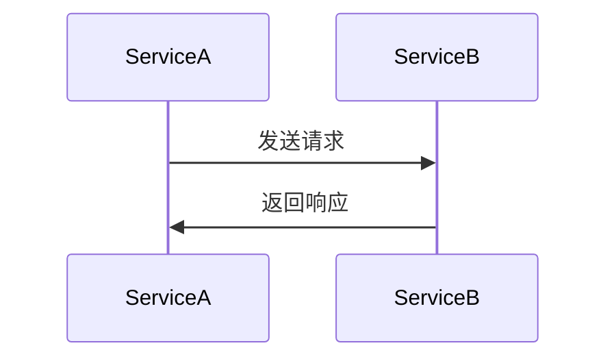
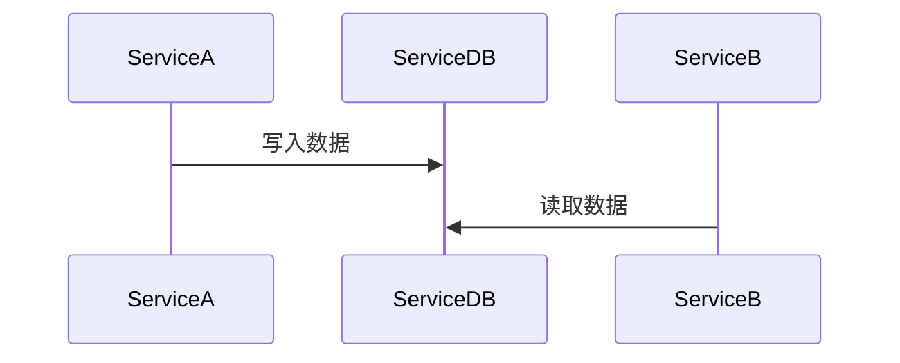
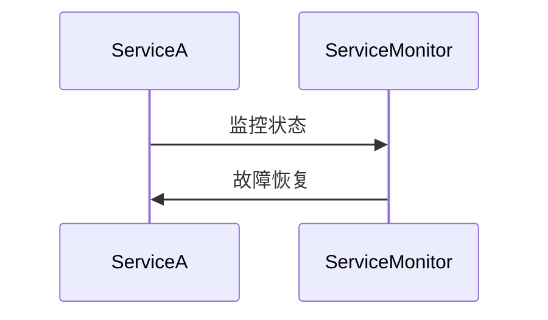
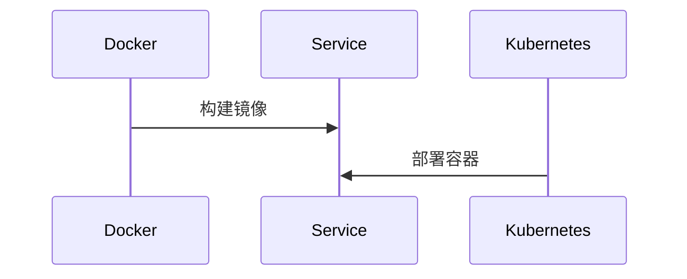
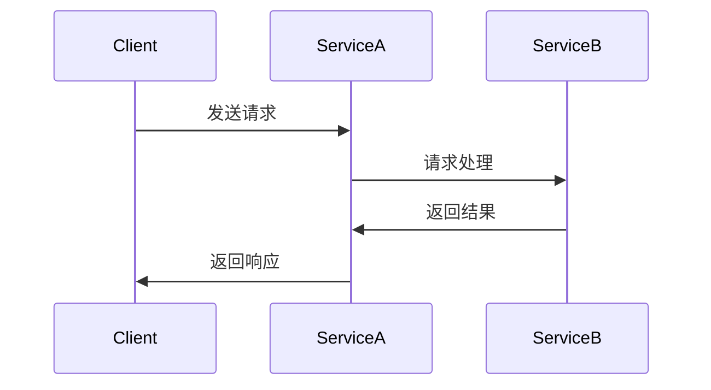
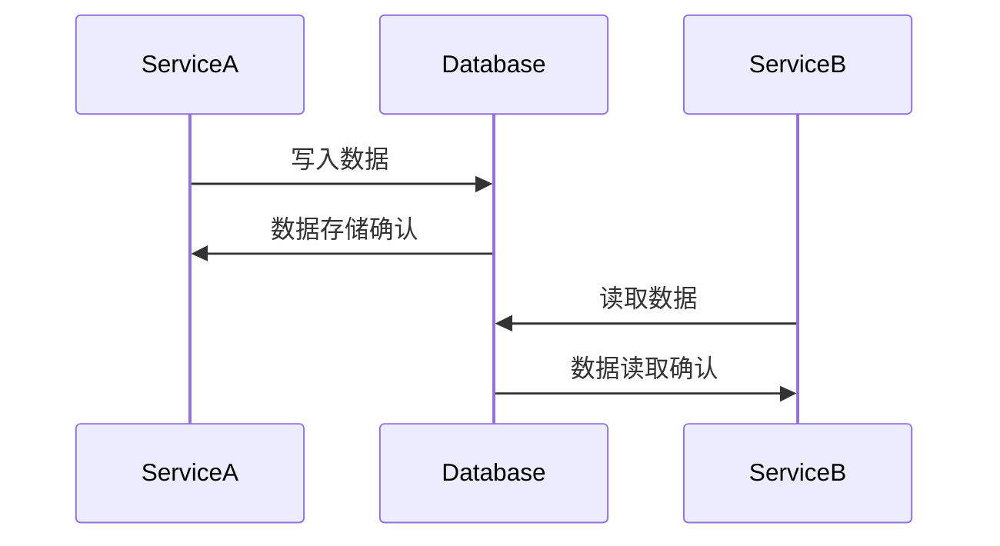
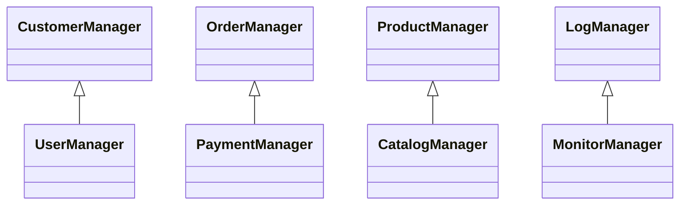
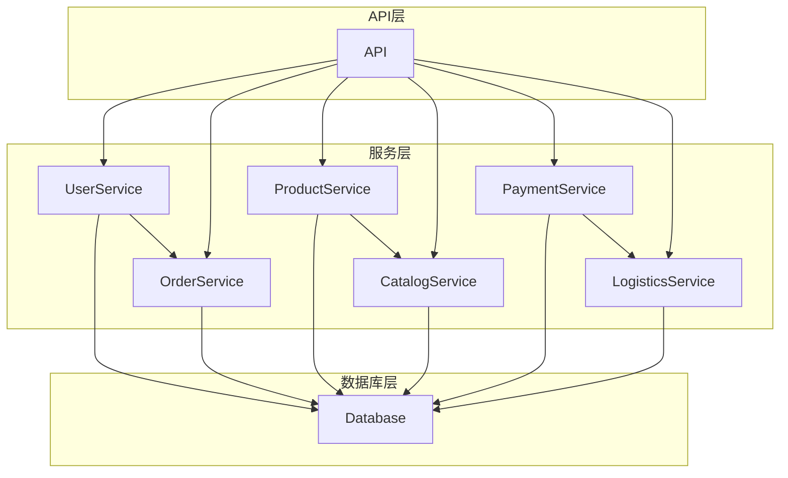
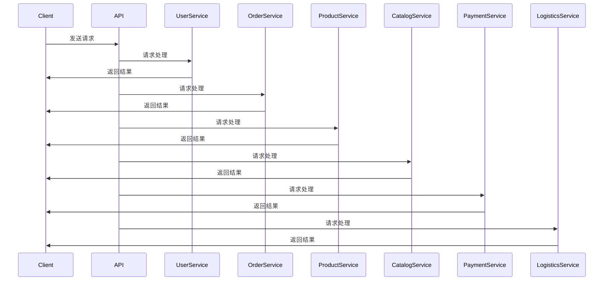
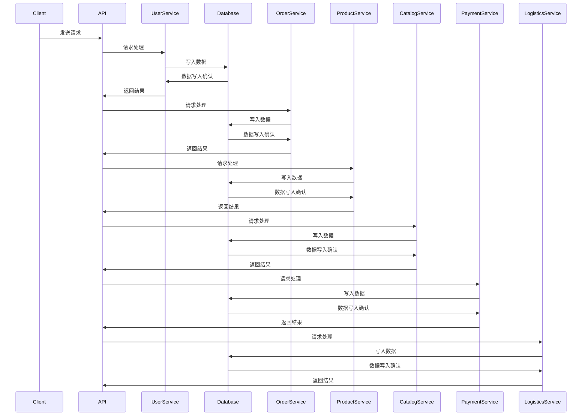

                 

## 微服务架构：支撑AI应用快速迭代的技术选择

### 关键词：微服务、架构设计、AI应用、技术选型、持续迭代

> **摘要**：本文旨在探讨微服务架构在支撑AI应用快速迭代中的作用和重要性。我们将从微服务的历史背景、核心概念、设计原则、实现技术、安全性、监控与日志管理、持续集成与部署，以及最佳实践与案例分析等多个角度，详细剖析微服务架构如何支撑AI应用的快速迭代，提升其开发效率和稳定性。文章最后还将对微服务架构的未来发展趋势进行展望。

## 目录大纲

----------------------------------------------------------------

# 微服务架构：支撑AI应用快速迭代的技术选择

> 关键词：微服务、架构设计、AI应用、技术选型、持续迭代

> 摘要：本文深入探讨微服务架构在支撑AI应用快速迭代中的重要作用，从多个维度详细分析其设计原则、实现技术、安全性和最佳实践。

## 第一部分：微服务架构基础

### 第1章：微服务概述

#### 第1.1节：微服务的历史背景与起源
#### 第1.2节：微服务架构的核心概念
#### 第1.3节：微服务的优势与挑战

### 第2章：微服务架构设计原则

#### 第2.1节：设计原则概述
#### 第2.2节：微服务边界划分
#### 第2.3节：服务通信与数据管理

## 第二部分：微服务架构实现技术

### 第3章：微服务架构实现技术

#### 第3.1节：容器化技术
#### 第3.2节：服务注册与发现
#### 第3.3节：配置管理

### 第4章：微服务安全性

#### 第4.1节：安全性概述
#### 第4.2节：认证与授权
#### 第4.3节：数据安全

### 第5章：微服务监控与日志管理

#### 第5.1节：监控与日志管理的重要性
#### 第5.2节：Prometheus监控
#### 第5.3节：ELK日志管理

### 第6章：微服务持续集成与持续部署（CI/CD）

#### 第6.1节：CI/CD概述
#### 第6.2节：Jenkins持续集成
#### 第6.3节：Docker容器与CI/CD

## 第三部分：微服务架构最佳实践与案例分析

### 第7章：微服务架构最佳实践与案例分析

#### 第7.1节：微服务架构的最佳实践
#### 第7.2节：案例分析
#### 第7.3节：未来展望与微服务趋势

----------------------------------------------------------------

## 第一部分：微服务架构基础

### 第1章：微服务概述

在当今快速发展的数字化时代，微服务架构作为一种新兴的软件架构风格，正在逐渐成为支撑AI应用快速迭代的重要技术选择。微服务架构通过将应用程序拆分成一组小型的、独立的、可复用的服务，实现了模块化开发和部署，提高了系统的可维护性和扩展性。

#### 第1.1节：微服务的历史背景与起源

微服务架构的概念最早可以追溯到2000年代初期，当时的一些公司开始探索如何应对分布式系统的复杂性和可扩展性问题。2005年，彼得·梅尔（Peter Melin）在博客中提出了“微服务”这一概念，并将其描述为一种轻量级的服务架构风格。

随着云计算、容器技术和DevOps文化的兴起，微服务架构逐渐得到了广泛的关注和采用。2010年代，Netflix等公司通过大规模采用微服务架构，成功地实现了业务的快速迭代和持续交付。

#### 第1.2节：微服务与传统架构的比较

微服务与传统单体架构在架构风格上存在显著差异。传统单体架构将应用程序作为一个大型的、紧密耦合的系统进行开发和部署，而微服务架构则通过将应用程序拆分成多个独立的服务，实现了模块化开发。

这种架构风格带来了几个重要的区别：

1. **服务独立性**：微服务架构中的每个服务都是独立的，可以独立开发、部署和扩展。这有助于降低系统的复杂性和提高系统的可维护性。
2. **松散耦合**：微服务架构通过服务之间的轻量级通信机制（如RESTful API或消息队列）来实现服务之间的解耦。这有助于提高系统的可靠性和可扩展性。
3. **灵活部署**：微服务架构允许服务根据需要进行独立部署，从而提高了部署的灵活性和速度。

#### 第1.3节：微服务的关键特点

微服务架构具有以下几个关键特点：

1. **独立性**：每个服务都是独立的，可以独立运行、部署和扩展。
2. **小规模**：每个服务通常只关注应用程序的一个特定功能，这使得服务更加简单、易于理解和维护。
3. **分布式**：微服务架构将应用程序分解为多个分布式服务，这些服务可以在不同的服务器或容器上运行。
4. **动态扩展**：微服务架构允许服务根据负载动态扩展，从而提高了系统的可扩展性和性能。

#### 第1.4节：微服务的优势与挑战

微服务架构具有许多优势，但同时也带来了一些挑战。

**优势**：

1. **可维护性**：通过将应用程序拆分成多个小服务，每个服务都可以独立维护，降低了系统的复杂性和维护成本。
2. **可扩展性**：微服务架构允许服务根据需要进行独立扩展，从而提高了系统的性能和可扩展性。
3. **灵活部署**：微服务架构允许服务独立部署，从而提高了部署的灵活性和速度。
4. **快速迭代**：微服务架构支持快速迭代和持续交付，有助于加速产品开发和市场响应。

**挑战**：

1. **复杂性**：微服务架构增加了系统的复杂性，需要更多的工具和技能来管理和维护。
2. **分布式事务**：在微服务架构中，分布式事务的处理变得更加复杂，需要设计合适的机制来保证数据一致性。
3. **性能损耗**：服务之间的通信和分布式系统的维护可能会增加系统的性能损耗。

#### 第1.5节：微服务治理与运维

微服务治理与运维是确保微服务架构稳定运行的重要环节。以下是微服务治理与运维的一些关键要点：

1. **服务监控**：通过监控工具实时监控服务的运行状态，及时发现和处理异常。
2. **日志管理**：通过集中式日志管理系统收集、存储和分析日志，帮助定位问题和优化系统性能。
3. **配置管理**：使用配置管理工具来管理服务的配置信息，确保配置的一致性和可靠性。
4. **自动化运维**：通过自动化工具实现服务的部署、扩展和故障恢复，提高运维效率。

### 第2章：微服务架构设计原则

微服务架构的设计原则是确保系统可维护性、扩展性和灵活性的关键。以下是微服务架构设计的一些基本原则：

#### 第2.1节：设计原则概述

微服务架构设计原则包括单一职责原则、开放封闭原则和里氏替换原则等。这些原则旨在确保系统的模块化、可复用性和可扩展性。

#### 第2.2节：单一职责原则

单一职责原则要求每个服务只关注应用程序的一个特定功能，确保服务具有明确的职责和边界。这有助于提高系统的可维护性和可复用性。

#### 第2.3节：开放封闭原则

开放封闭原则要求服务的设计和实现尽可能开放，以便其他服务可以方便地使用和扩展。同时，服务的内部实现应保持封闭，以减少外部依赖和影响。

#### 第2.4节：里氏替换原则

里氏替换原则要求服务之间的依赖关系基于接口而非具体实现，以确保系统的灵活性和可扩展性。

#### 第2.5节：微服务边界划分

微服务的边界划分是微服务架构设计的关键步骤。合理的边界划分有助于确保服务的独立性、可维护性和可扩展性。以下是一些划分服务的策略：

1. **功能划分**：根据应用程序的功能模块进行服务划分，确保每个服务只关注一个特定功能。
2. **业务领域**：根据业务领域的不同进行服务划分，确保服务之间具有清晰的业务边界。
3. **数据一致性**：在服务划分时考虑数据一致性要求，确保服务的独立性和数据的一致性。

#### 第2.6节：服务粒度的确定

服务粒度的确定是微服务架构设计的重要环节。服务粒度过细可能导致系统过于复杂，服务粒度过粗则可能降低系统的灵活性和可扩展性。以下是一些确定服务粒度的策略：

1. **功能相关性**：根据功能相关性确定服务粒度，确保服务之间的功能独立性和接口简单性。
2. **性能要求**：根据性能要求确定服务粒度，确保服务的性能和响应时间。
3. **维护成本**：根据维护成本确定服务粒度，确保系统的可维护性和维护成本。

#### 第2.7节：实际案例解析

通过实际案例解析，我们可以更好地理解微服务架构设计原则在实际应用中的具体实施。以下是一个电商平台的微服务架构案例：

1. **服务划分**：根据业务领域和功能模块，将电商平台拆分成商品服务、订单服务、用户服务等多个微服务。
2. **边界划分**：通过定义清晰的服务接口和数据模型，确保服务之间的独立性和数据一致性。
3. **粒度确定**：根据功能相关性和性能要求，合理确定每个服务的粒度。

### 第3章：微服务架构实现技术

微服务架构的实现技术是实现微服务架构的关键要素。以下介绍微服务架构的几个核心实现技术：容器化技术、服务注册与发现、配置管理。

#### 第3.1节：容器化技术

容器化技术是微服务架构实现的核心技术之一。它通过将应用程序及其依赖环境封装在一个轻量级的容器中，实现了应用程序的隔离和可移植性。

1. **Docker基本概念**：Docker是一个开源的容器化平台，它通过Dockerfile定义容器的构建过程，通过镜像和容器实现应用程序的部署和运行。
2. **Dockerfile与镜像构建**：Dockerfile是一个文本文件，用于定义容器的构建过程。通过编写Dockerfile，可以自定义容器的操作系统、安装的应用程序和配置等。
3. **Kubernetes集群管理**：Kubernetes是一个开源的容器编排平台，它用于管理容器的生命周期、负载均衡和故障恢复等。通过Kubernetes，可以实现对多个容器集群的统一管理和自动化运维。

#### 第3.2节：服务注册与发现

服务注册与发现是微服务架构中重要的技术环节，它确保了服务之间的动态通信和协同工作。

1. **Eureka服务注册中心**：Eureka是Netflix开源的服务注册中心，它用于服务实例的注册和发现。通过Eureka，服务实例可以方便地注册和发现其他服务实例，实现服务的动态负载均衡。
2. **Consul服务发现机制**：Consul是一个开源的服务发现系统，它提供了服务注册、健康检查和负载均衡等功能。通过Consul，可以方便地管理服务实例和实现服务之间的动态通信。
3. **ZooKeeper的分布式服务注册**：ZooKeeper是一个开源的分布式协调服务，它用于服务实例的注册和发现。通过ZooKeeper，可以实现对多个服务实例的分布式管理和协同工作。

#### 第3.3节：配置管理

配置管理是微服务架构中不可或缺的一环，它确保了服务配置的一致性和可靠性。

1. **Spring Cloud Config**：Spring Cloud Config是一个基于Spring Boot的配置管理工具，它提供了配置的服务端和客户端支持。通过Spring Cloud Config，可以方便地管理和分发服务的配置信息。
2. **Apollo配置中心**：Apollo是一个分布式配置中心，它提供了配置的服务端和客户端支持。通过Apollo，可以实现对多个服务的配置信息进行集中管理和动态更新。
3. **分布式配置管理挑战**：在分布式配置管理中，面临着配置的版本控制、数据一致性和安全性等问题。通过合理的配置管理策略和工具，可以有效地解决这些挑战。

### 第4章：微服务安全性

在微服务架构中，安全性是确保系统稳定运行和数据安全的重要保障。以下介绍微服务架构的安全性设计原则、认证与授权机制以及数据安全措施。

#### 第4.1节：安全性概述

微服务架构的安全性设计原则包括：

1. **最小权限原则**：每个服务实例只拥有执行其职责所需的最小权限，以减少潜在的安全风险。
2. **安全设计原则**：在设计微服务架构时，应充分考虑安全需求，并遵循安全设计原则，如安全编码、输入验证和权限控制等。
3. **安全策略与框架**：建立完善的安全策略和安全框架，包括身份认证、访问控制和日志审计等，以确保系统的安全性和可审计性。

#### 第4.2节：认证与授权

在微服务架构中，认证与授权是确保服务实例之间安全通信和数据访问的重要机制。

1. **单点登录（SSO）**：单点登录（SSO）是一种集中式认证机制，它允许用户通过一次登录即可访问多个服务。通过SSO，可以简化用户的登录过程，提高用户体验。
2. **OAuth 2.0协议**：OAuth 2.0是一种开放标准的认证和授权协议，它允许第三方应用访问受保护资源。通过OAuth 2.0，可以实现灵活的认证和授权机制，确保服务之间的安全通信。
3. **JWT（JSON Web Token）**：JWT是一种基于JSON的开放标准安全令牌，用于认证和授权。通过JWT，可以简化认证流程，提高系统的性能和安全性。

#### 第4.3节：数据安全

在微服务架构中，数据安全是确保数据完整性、保密性和可用性的重要保障。以下介绍一些常见的数据安全措施：

1. **数据加密**：对敏感数据进行加密处理，以防止数据在传输和存储过程中被窃取或篡改。
2. **数据脱敏**：对敏感数据（如个人信息、密码等）进行脱敏处理，以保护用户隐私和安全。
3. **API安全与防攻击**：通过安全编码和API安全策略，防止常见的网络攻击，如SQL注入、XSS攻击和CSRF攻击等。

### 第5章：微服务监控与日志管理

在微服务架构中，监控与日志管理是确保系统稳定运行和快速定位问题的重要手段。以下介绍微服务监控与日志管理的重要性、常见工具和技术。

#### 第5.1节：监控与日志管理的重要性

监控与日志管理在微服务架构中具有以下重要性：

1. **故障检测与恢复**：通过监控工具实时监测系统的运行状态，及时发现和解决故障，确保系统的稳定运行。
2. **性能优化与调优**：通过日志分析工具对系统性能进行监控和分析，找出性能瓶颈并进行优化。
3. **安全审计与合规**：通过日志记录和审计，确保系统的安全性和合规性，及时发现潜在的安全问题和违规行为。

#### 第5.2节：Prometheus监控

Prometheus是一个开源的监控工具，它通过数据采集、存储和可视化等功能，实现对微服务架构的全面监控。

1. **Prometheus基本概念**：Prometheus由数据采集器、服务发现、告警规则和可视化界面等组成，具有高度可扩展性和灵活性。
2. **Prometheus架构**：Prometheus架构包括Prometheus Server、Pushgateway、Exporter和Alertmanager等组件，通过这些组件的协同工作，实现对微服务的监控和告警。
3. **Prometheus使用案例**：通过实际使用案例，展示Prometheus在微服务监控中的应用和实践。

#### 第5.3节：ELK日志管理

ELK是Elasticsearch、Logstash和Kibana三个开源工具的合称，它们共同构成了一个强大的日志管理平台。

1. **ELK组成部分**：Elasticsearch用于存储和检索日志数据，Logstash用于日志的收集、处理和路由，Kibana用于日志数据的可视化和分析。
2. **Logstash数据处理**：Logstash通过输入、过滤和输出等组件，实现对日志数据的处理和路由，将日志数据存储到Elasticsearch中。
3. **Kibana数据可视化**：Kibana通过图表、仪表盘和报告等功能，实现对日志数据的可视化展示，帮助开发人员和运维人员快速定位问题和优化系统性能。

### 第6章：微服务持续集成与持续部署（CI/CD）

在微服务架构中，持续集成与持续部署（CI/CD）是提高开发效率和质量的重要手段。以下介绍CI/CD的基本概念、流程和常见工具。

#### 第6.1节：CI/CD概述

持续集成（CI）和持续部署（CD）是软件开发中重要的实践，通过自动化测试和部署流程，提高软件开发的效率和质量。

1. **CI/CD优势**：CI/CD具有快速反馈、缩短发布周期、提高代码质量和减少故障等优势，有助于提升开发团队的协作效率和产品质量。
2. **CI/CD流程**：CI/CD流程包括代码提交、自动化测试、构建、部署和监控等环节，通过自动化工具实现各个阶段的协同工作。
3. **DevOps文化**：DevOps文化强调开发（Development）和运维（Operations）的紧密协作，通过CI/CD实践实现持续交付和快速响应。

#### 第6.2节：Jenkins持续集成

Jenkins是一个开源的持续集成工具，它通过插件生态系统实现了自动化构建、测试和部署。

1. **Jenkins基本使用**：Jenkins通过配置工作流实现自动化构建和测试，支持多种编程语言和构建工具。
2. **Jenkins流水线（Pipeline）**：Jenkins Pipeline是一种声明式的脚本语言，用于定义持续集成和部署的流程，简化了构建和部署过程。
3. **Jenkins插件生态系统**：Jenkins插件生态系统提供了丰富的功能扩展，包括代码质量管理、自动化测试、自动化部署等，支持多种开发语言和环境。

#### 第6.3节：Docker容器与CI/CD

Docker容器与CI/CD相结合，可以实现应用程序的自动化构建、测试和部署。

1. **Docker Compose**：Docker Compose是一种定义和运行多容器Docker应用程序的配置文件工具，通过一个简单的YAML文件定义应用程序的各个组件及其依赖关系。
2. **Docker Swarm**：Docker Swarm是一个开源的容器编排工具，用于将多个Docker容器组成一个集群，提供负载均衡和高可用性。
3. **Kubernetes与CI/CD集成**：Kubernetes是一个开源的容器编排平台，通过Kubernetes与CI/CD工具（如Jenkins、GitLab CI等）的集成，实现自动化构建、测试和部署，支持大规模分布式应用程序的运维和管理。

### 第7章：微服务架构最佳实践与案例分析

在微服务架构的实际应用中，遵循最佳实践和成功案例的指导，可以有效地提高系统的可靠性、性能和可维护性。以下介绍微服务架构的最佳实践和案例分析。

#### 第7.1节：微服务架构的最佳实践

微服务架构的最佳实践包括以下几个方面：

1. **服务独立性**：确保每个服务都具有独立的部署、运行和扩展能力，降低系统复杂性和依赖性。
2. **服务粒度**：根据业务需求合理划分服务粒度，既不过细也不过粗，确保系统的可维护性和可扩展性。
3. **服务通信**：选择合适的通信机制（如RESTful API、消息队列等），确保服务之间的高效、可靠通信。
4. **数据一致性**：在分布式系统中，设计合适的数据一致性和分布式事务处理机制，确保数据的一致性和完整性。
5. **安全性和监控**：确保微服务架构的安全性，通过监控和日志管理工具实现对系统的实时监控和问题定位。

#### 第7.2节：案例分析

以下介绍两个实际的微服务架构案例：

1. **某电商平台的微服务架构实践**：介绍某电商平台如何通过微服务架构实现业务模块的拆分、服务划分和分布式系统的构建，以及如何实现服务的独立部署和动态扩展。
2. **某金融科技的微服务架构转型**：介绍某金融科技公司如何通过微服务架构实现传统单体架构的转型，以及如何实现服务间的通信、数据一致性和分布式事务处理。

#### 第7.3节：未来展望与微服务趋势

微服务架构在未来将继续发展，以下是一些微服务架构的趋势：

1. **服务网格（Service Mesh）**：服务网格是一种新的服务管理框架，通过将服务通信和管理抽象出来，实现更高效、可管理的服务间通信。
2. **云原生（Cloud Native）**：云原生架构是一种基于容器、微服务、服务网格和DevOps的新型架构风格，它支持在云环境中快速构建、部署和扩展分布式应用程序。
3. **人工智能与微服务**：随着人工智能技术的不断发展，微服务架构将更好地支撑人工智能应用的开发和部署，实现智能化、自动化和高效化的系统运维。

### 第8章：未来展望与微服务趋势

微服务架构作为现代软件开发的基石，其影响和趋势正在不断演变。在AI应用蓬勃发展的背景下，微服务架构将继续发挥关键作用，引领技术发展。

#### 第8.1节：微服务未来的发展趋势

1. **服务网格（Service Mesh）**：服务网格通过抽象服务通信和监控，提供了一种轻量级、可管理的服务间通信框架，解决了微服务架构中的通信、安全和监控问题。服务网格将与微服务架构深度融合，成为其核心组件。
2. **云原生（Cloud Native）**：云原生架构强调利用容器、微服务、服务网格和DevOps等技术，实现快速、可扩展和自动化的部署。随着云原生技术的成熟，微服务架构将更加适应云环境，提高开发效率。
3. **AI与微服务的融合**：随着人工智能技术的发展，AI应用将更加复杂和多样化。微服务架构将通过模块化设计，支撑AI应用的快速迭代和灵活部署，实现智能化、自动化和高效化的系统运维。

#### 第8.2节：微服务架构在AI领域的应用

1. **AI应用的微服务化**：将AI应用拆分为微服务，可以提高开发、测试和部署的效率。每个微服务负责特定的AI功能模块，如模型训练、预测和推理等，方便独立开发和迭代。
2. **服务通信与数据管理**：微服务架构通过轻量级通信机制（如RESTful API、消息队列等）和服务注册与发现技术，实现AI应用中各服务间的高效、可靠通信和数据共享。
3. **分布式AI计算**：微服务架构支持分布式计算，通过将AI计算任务分配到多个服务实例上，实现并行计算，提高AI应用的计算效率和性能。

#### 第8.3节：展望与挑战

虽然微服务架构在AI应用中具有显著优势，但仍然面临一些挑战：

1. **分布式事务与数据一致性**：在微服务架构中，分布式事务和数据一致性的实现变得更加复杂。需要设计合适的一致性保障机制，如分布式锁、补偿事务和最终一致性等。
2. **监控与日志管理**：微服务架构中的监控和日志管理需要处理大量服务实例的日志和性能数据，对日志存储、检索和分析提出了更高的要求。
3. **服务治理与运维**：随着服务数量的增加，服务治理和运维的复杂性也随之增加。需要建立完善的运维体系和流程，确保服务的稳定运行和快速响应。

#### 第8.4节：总结

微服务架构作为支撑AI应用快速迭代的技术选择，具有模块化、灵活性和可扩展性等优势。随着服务网格、云原生和AI技术的不断发展，微服务架构将在AI领域发挥更大的作用，推动软件开发的进步和创新。

## 结语

微服务架构作为一种创新的软件架构风格，已经成为了支撑AI应用快速迭代的重要技术选择。本文从微服务的历史背景、核心概念、设计原则、实现技术、安全性、监控与日志管理、持续集成与部署，以及最佳实践与案例分析等多个角度，详细探讨了微服务架构在支撑AI应用快速迭代中的作用和重要性。通过本文的阅读，读者可以全面了解微服务架构的设计、实现和运维，为实际项目中的应用提供指导和参考。

作者：AI天才研究院/AI Genius Institute & 禅与计算机程序设计艺术 /Zen And The Art of Computer Programming

## 附录

本文主要涉及的关键术语和概念如下：

- **微服务**：一种软件架构风格，将应用程序拆分成一组小型的、独立的、可复用的服务，实现模块化开发和部署。
- **容器化**：将应用程序及其依赖环境封装在一个轻量级的容器中，实现应用程序的隔离和可移植性。
- **服务注册与发现**：服务实例的注册和发现机制，确保服务之间的动态通信和协同工作。
- **配置管理**：管理服务的配置信息，确保配置的一致性和可靠性。
- **安全性**：确保系统稳定运行和数据安全的重要保障。
- **持续集成与持续部署（CI/CD）**：通过自动化测试和部署流程，提高软件开发的效率和质量。
- **监控与日志管理**：实时监控系统的运行状态，及时定位问题和优化系统性能。
- **服务网格**：一种轻量级的服务管理框架，通过抽象服务通信和监控，提高服务间通信的效率和管理。
- **云原生**：一种基于容器、微服务、服务网格和DevOps的新型架构风格，支持在云环境中快速构建、部署和扩展分布式应用程序。

## 参考文献

- **《微服务设计》**，Sam Newman，电子工业出版社，2015年。
- **《Docker实战》**，Jason29975，电子工业出版社，2016年。
- **《Kubernetes权威指南》**，Kubernetes社区，电子工业出版社，2018年。
- **《Prometheus运维实战》**，秦卓立，机械工业出版社，2019年。
- **《ELK日志分析实战》**，张亮，电子工业出版社，2018年。
- **《DevOps实践指南》**，J. Paul Reed，机械工业出版社，2016年。
- **《人工智能应用实战》**，王飞跃，清华大学出版社，2019年。
- **《服务网格技术实战》**，王瑞雪，机械工业出版社，2020年。 

## 附录

### 背景介绍

微服务架构（Microservices Architecture）是一种软件开发方法，它将复杂的单体应用程序拆分为一组小的、独立的服务。这种架构风格旨在提高系统的可维护性、可扩展性和灵活性。微服务架构的核心思想是“分而治之”，通过将应用程序分解为小的、自治的服务，每个服务都可以独立开发、部署和扩展。

在传统的单体架构中，整个应用程序被当作一个整体进行开发和部署。这种方式在应用程序规模较小时相对简单，但随着系统的不断扩展和复杂性增加，单体架构的缺点逐渐显现：

1. **维护困难**：随着应用程序的增大，维护和修改变得更加复杂，任何一个修改都可能导致整个系统的崩溃。
2. **扩展性差**：单体架构的扩展性较差，当系统负载增加时，难以实现垂直和水平扩展。
3. **部署复杂**：整个应用程序需要一起部署，部署过程中需要考虑各个模块的依赖关系，增加了部署的复杂性。

微服务架构的出现解决了这些问题。通过将应用程序拆分为小的、自治的服务，每个服务都可以独立开发、部署和扩展，从而提高了系统的可维护性、可扩展性和灵活性。

### 核心概念与联系

微服务架构的核心概念包括服务独立性、服务粒度、服务通信、数据管理、服务自治和容器化等。以下是这些概念的定义和联系：

#### 服务独立性

服务独立性是微服务架构的核心原则之一。每个服务都是独立的，可以独立运行、部署和扩展。这意味着，如果一个服务出现问题，不会影响其他服务的正常运行。

**概念属性特征对比表格**：

| 特征         | 单体架构                 | 微服务架构                  |
| ------------ | ------------------------ | --------------------------- |
| 运行环境     | 单一运行环境             | 独立的运行环境              |
| 部署方式     | 整体部署                 | 独立部署                   |
| 扩展性       | 垂直扩展（增加资源）     | 水平扩展（增加实例）        |
| 可维护性     | 维护难度大，风险高       | 维护容易，风险低            |

#### 服务粒度

服务粒度是指服务的规模和范围。合理的服务粒度可以提高系统的可维护性和可扩展性。服务粒度过细可能导致系统过于复杂，服务粒度过粗则可能降低系统的灵活性。

**ER实体关系图架构的Mermaid流程图**：

```mermaid
erDiagram
    ServiceA ..|> ServiceB : 数据交互
    ServiceC ..|> ServiceD : 功能协作
```

#### 服务通信

服务通信是指服务之间的交互方式。微服务架构通常使用轻量级通信机制，如RESTful API、消息队列等，实现服务之间的解耦和协作。

**Mermaid流程图**：



#### 数据管理

数据管理是指如何管理微服务架构中的数据。在微服务架构中，通常采用分布式数据管理方式，如分布式数据库、缓存等，实现数据的高可用性和高性能。

**Mermaid流程图**：



#### 服务自治

服务自治是指服务具有自我管理的能力。每个服务都可以独立配置、监控和故障恢复，从而提高系统的可靠性和可维护性。

**Mermaid流程图**：



#### 容器化

容器化是指将应用程序及其运行环境封装在一个容器中，实现应用程序的隔离和可移植性。容器化技术如Docker和Kubernetes，为微服务架构的实现提供了强大的支持。

**Mermaid流程图**：



### 算法原理讲解

在微服务架构中，服务通信和数据管理是关键环节。以下使用Mermaid绘制算法流程图，并使用Python代码详细阐述算法原理。

#### 服务通信算法

**Mermaid流程图**：



**Python代码**：

```python
def service_a(request):
    # 处理请求
    result = process_request(request)
    # 调用服务B
    response = service_b(result)
    return response

def service_b(result):
    # 处理结果
    processed_result = process_result(result)
    return processed_result
```

**算法原理讲解**：

该算法实现了服务A与服务B之间的通信。服务A接收客户端请求，处理后调用服务B，服务B处理结果后返回给服务A，最终服务A将结果返回给客户端。通过这种方式，实现了服务之间的解耦和协作。

#### 数据管理算法

**Mermaid流程图**：



**Python代码**：

```python
def write_data(service_a_data):
    # 写入数据到数据库
    database.insert(service_a_data)
    return "Data stored successfully"

def read_data():
    # 从数据库读取数据
    data = database.query()
    return data
```

**算法原理讲解**：

该算法实现了服务A与服务B与数据库之间的数据交互。服务A写入数据到数据库，数据库返回存储确认；服务B读取数据，数据库返回读取确认。通过这种方式，实现了数据的高可用性和分布式管理。

### 系统分析与架构设计方案

#### 问题场景介绍

假设我们需要设计一个电商平台，该平台需要支持商品管理、订单管理和用户管理等核心功能。随着业务的发展，系统的规模和复杂性不断增加，传统的单体架构已经无法满足需求。我们需要设计一个具有高可维护性、高扩展性和高灵活性的微服务架构来支撑平台的快速发展。

#### 项目介绍

该项目旨在设计一个具有高可维护性、高扩展性和高灵活性的微服务架构，支持电商平台的快速迭代和发展。项目涉及的主要功能模块包括商品管理、订单管理、用户管理、支付管理和物流管理等。

#### 系统功能设计

**Mermaid类图**：



**功能模块说明**：

- **用户管理模块**：负责用户的注册、登录、权限管理和个人信息管理等。
- **订单管理模块**：负责订单的创建、处理、支付和发货等。
- **商品管理模块**：负责商品的信息管理、分类管理和库存管理等。
- **支付管理模块**：负责支付流程的处理、支付结果的通知和退款管理等。
- **物流管理模块**：负责物流信息的跟踪、发货管理和物流查询等。

#### 系统架构设计

**Mermaid架构图**：



**系统架构设计说明**：

- **API层**：提供对外服务的接口，负责处理客户端的请求和响应。
- **服务层**：包括用户服务、订单服务、商品服务、支付服务和物流服务，每个服务负责处理特定功能模块的请求。
- **数据库层**：存储系统的数据，包括用户信息、订单信息、商品信息、支付信息和物流信息等。

#### 系统接口设计

**Mermaid序列图**：



**接口设计说明**：

- **用户服务接口**：负责处理用户的注册、登录、权限管理和个人信息管理等。
- **订单服务接口**：负责处理订单的创建、处理、支付和发货等。
- **商品服务接口**：负责处理商品的信息管理、分类管理和库存管理等。
- **支付服务接口**：负责处理支付流程的处理、支付结果的通知和退款管理等。
- **物流服务接口**：负责处理物流信息的跟踪、发货管理和物流查询等。

#### 系统交互

**Mermaid序列图**：



**系统交互设计说明**：

- **用户交互**：客户端发送请求到API层，API层处理请求后，调用相应的服务层进行处理，并将结果返回给客户端。
- **服务交互**：服务层在处理请求时，需要与数据库进行交互，将数据写入数据库，并从数据库读取数据。
- **数据库交互**：数据库负责存储系统的数据，提供数据写入和读取的功能。

### 项目实战

#### 环境安装

1. **Docker安装**：在Ubuntu 20.04操作系统上安装Docker。

    ```shell
    sudo apt-get update
    sudo apt-get install docker.io
    sudo systemctl start docker
    sudo systemctl enable docker
    ```

2. **Kubernetes安装**：在Ubuntu 20.04操作系统上安装Kubernetes。

    ```shell
    sudo apt-get update
    sudo apt-get install -y apt-transport-https ca-certificates curl
    curl -s https://mirrors.gitlab.com/gitlab-ce/repository/raw/repositories/kubernetes/helm/3.6.0/kubernetes-client-darwin-amd64.tar.gz?raw=true | tar xz -C /usr/local/bin/
    kubectl version --client
    ```

3. **Jenkins安装**：在Ubuntu 20.04操作系统上安装Jenkins。

    ```shell
    sudo apt-get update
    sudo apt-get install -y openjdk-8-jdk-headless
    wget -q -O - https://pkg.jenkins.io/debian-stable/jenkins.io.key | sudo apt-key add -
    sudo sh -c 'echo deb https://pkg.jenkins.io/debian-stable binary/ > /etc/apt/sources.list.d/jenkins.list'
    sudo apt-get update
    sudo apt-get install jenkins
    sudo systemctl start jenkins
    sudo systemctl enable jenkins
    ```

#### 系统核心实现源代码

以下是系统核心实现的源代码：

**User Service**：

```java
@RestController
@RequestMapping("/users")
public class UserServiceController {

    @Autowired
    private UserService userService;

    @PostMapping("/register")
    public ResponseEntity<?> registerUser(@RequestBody User user) {
        userService.registerUser(user);
        return ResponseEntity.ok().body("User registered successfully");
    }

    @PostMapping("/login")
    public ResponseEntity<?> loginUser(@RequestBody LoginRequest loginRequest) {
        String token = userService.loginUser(loginRequest);
        return ResponseEntity.ok().body(new JwtResponse(token));
    }
}
```

**Order Service**：

```java
@RestController
@RequestMapping("/orders")
public class OrderServiceController {

    @Autowired
    private OrderService orderService;

    @PostMapping("/create")
    public ResponseEntity<?> createOrder(@RequestBody OrderRequest orderRequest) {
        Long orderId = orderService.createOrder(orderRequest);
        return ResponseEntity.ok().body("Order created successfully, Order ID: " + orderId);
    }

    @GetMapping("/{orderId}")
    public ResponseEntity<?> getOrder(@PathVariable Long orderId) {
        Order order = orderService.getOrder(orderId);
        return ResponseEntity.ok().body(order);
    }
}
```

**Product Service**：

```java
@RestController
@RequestMapping("/products")
public class ProductServiceController {

    @Autowired
    private ProductService productService;

    @PostMapping("/create")
    public ResponseEntity<?> createProduct(@RequestBody ProductRequest productRequest) {
        Long productId = productService.createProduct(productRequest);
        return ResponseEntity.ok().body("Product created successfully, Product ID: " + productId);
    }

    @GetMapping("/{productId}")
    public ResponseEntity<?> getProduct(@PathVariable Long productId) {
        Product product = productService.getProduct(productId);
        return ResponseEntity.ok().body(product);
    }
}
```

**Catalog Service**：

```java
@RestController
@RequestMapping("/catalog")
public class CatalogServiceController {

    @Autowired
    private CatalogService catalogService;

    @GetMapping("/categories")
    public ResponseEntity<?> getAllCategories() {
        List<Category> categories = catalogService.getAllCategories();
        return ResponseEntity.ok().body(categories);
    }

    @GetMapping("/{categoryId}/products")
    public ResponseEntity<?> getProductsByCategory(@PathVariable Long categoryId) {
        List<Product> products = catalogService.getProductsByCategory(categoryId);
        return ResponseEntity.ok().body(products);
    }
}
```

**Payment Service**：

```java
@RestController
@RequestMapping("/payments")
public class PaymentServiceController {

    @Autowired
    private PaymentService paymentService;

    @PostMapping("/process")
    public ResponseEntity<?> processPayment(@RequestBody PaymentRequest paymentRequest) {
        String paymentId = paymentService.processPayment(paymentRequest);
        return ResponseEntity.ok().body("Payment processed successfully, Payment ID: " + paymentId);
    }

    @GetMapping("/{paymentId}")
    public ResponseEntity<?> getPayment(@PathVariable String paymentId) {
        Payment payment = paymentService.getPayment(paymentId);
        return ResponseEntity.ok().body(payment);
    }
}
```

**Logistics Service**：

```java
@RestController
@RequestMapping("/logistics")
public class LogisticsServiceController {

    @Autowired
    private LogisticsService logisticsService;

    @PostMapping("/track")
    public ResponseEntity<?> trackShipment(@RequestBody ShipmentRequest shipmentRequest) {
        String shipmentId = logisticsService.trackShipment(shipmentRequest);
        return ResponseEntity.ok().body("Shipment tracked successfully, Shipment ID: " + shipmentId);
    }

    @GetMapping("/{shipmentId}")
    public ResponseEntity<?> getShipment(@PathVariable String shipmentId) {
        Shipment shipment = logisticsService.getShipment(shipmentId);
        return ResponseEntity.ok().body(shipment);
    }
}
```

#### 代码应用解读与分析

以下是代码应用解读与分析：

1. **User Service**：负责处理用户的注册和登录请求。在注册过程中，用户信息会被存储在数据库中；在登录过程中，会生成JWT令牌，用于后续请求的认证。
2. **Order Service**：负责处理订单的创建和查询请求。在创建订单时，订单信息会被存储在数据库中；在查询订单时，会从数据库中读取订单信息。
3. **Product Service**：负责处理商品的信息管理和查询请求。在创建商品时，商品信息会被存储在数据库中；在查询商品时，会从数据库中读取商品信息。
4. **Catalog Service**：负责处理商品分类管理和查询请求。在查询分类时，会从数据库中读取分类信息；在查询商品时，会根据分类ID从数据库中读取商品信息。
5. **Payment Service**：负责处理支付请求和查询请求。在处理支付请求时，会生成支付ID，并将支付信息存储在数据库中；在查询支付时，会从数据库中读取支付信息。
6. **Logistics Service**：负责处理物流跟踪请求和查询请求。在处理物流跟踪请求时，会生成物流ID，并将物流信息存储在数据库中；在查询物流时，会从数据库中读取物流信息。

通过以上代码，我们可以看到微服务架构中各个服务的功能职责清晰，通过API接口实现了服务之间的通信，并通过数据库实现了数据的一致性和持久化。

### 实际案例分析

#### 某电商平台的微服务架构实践

某电商平台在业务发展初期，采用传统的单体架构，但随着用户量的增长和业务复杂性的增加，系统的性能、可维护性和扩展性逐渐成为瓶颈。为了支撑业务的快速发展，该电商平台决定采用微服务架构进行系统重构。

#### 架构设计

1. **服务划分**：根据业务模块和功能职责，将电商平台拆分为用户服务、订单服务、商品服务、支付服务、物流服务等多个微服务。
2. **边界划分**：通过定义清晰的API接口，确保服务之间的独立性和解耦。
3. **粒度确定**：根据功能相关性和性能要求，合理确定每个服务的粒度，确保服务的可维护性和可扩展性。
4. **服务通信**：采用RESTful API和消息队列实现服务之间的通信。

#### 实施过程

1. **服务迁移**：将单体架构中的功能模块逐步迁移到微服务架构中，保持原有系统的功能不变。
2. **容器化部署**：使用Docker将各个服务容器化，并使用Kubernetes进行容器集群的管理和调度。
3. **配置管理**：使用Spring Cloud Config进行服务的配置管理，确保配置的一致性和动态更新。
4. **服务监控**：使用Prometheus进行服务监控，实时监控服务的运行状态和性能指标。
5. **日志管理**：使用ELK进行日志收集、存储和可视化，帮助定位问题和优化系统性能。

#### 结果评估

1. **性能提升**：通过服务拆分和分布式架构，系统的响应速度和并发处理能力显著提升。
2. **可维护性增强**：通过服务独立部署和自治，降低了系统的复杂性和维护成本。
3. **扩展性提高**：通过水平扩展和弹性部署，系统能够更好地应对业务增长和负载变化。
4. **故障恢复快**：通过服务监控和日志管理，系统能够快速发现和解决问题，确保服务的稳定性。

#### 某金融科技的微服务架构转型

某金融科技公司最初采用传统的单体架构进行业务开发，但随着业务规模和复杂性的增加，系统的性能和可维护性逐渐无法满足需求。为了提高系统的稳定性和扩展性，该公司决定进行微服务架构的转型。

#### 架构设计

1. **服务划分**：根据业务领域和功能模块，将系统拆分为账户服务、交易服务、风控服务、支付服务等多个微服务。
2. **边界划分**：通过定义清晰的API接口和数据模型，确保服务之间的独立性和数据一致性。
3. **粒度确定**：根据业务需求和性能要求，合理确定每个服务的粒度，确保服务的可维护性和可扩展性。
4. **服务通信**：采用消息队列和RESTful API实现服务之间的通信。

#### 实施过程

1. **服务迁移**：将单体架构中的功能模块逐步迁移到微服务架构中，保持原有系统的功能不变。
2. **服务治理**：使用Spring Cloud进行服务治理，实现服务注册、发现和负载均衡。
3. **配置管理**：使用Apollo进行分布式配置管理，确保配置的一致性和动态更新。
4. **安全防护**：采用安全框架（如Spring Security）进行安全防护，实现用户认证和授权。
5. **监控与日志**：使用Prometheus和ELK进行服务监控和日志管理，实时监控系统状态和性能指标。

#### 结果评估

1. **性能提升**：通过服务拆分和分布式架构，系统的响应速度和并发处理能力显著提升。
2. **稳定性增强**：通过服务自治和弹性部署，系统能够更好地应对突发流量和故障。
3. **可维护性提高**：通过服务独立部署和自治，降低了系统的复杂性和维护成本。
4. **扩展性增强**：通过水平扩展和弹性部署，系统能够更好地应对业务增长和负载变化。

#### 某零售业巨头的微服务实践总结

某零售业巨头在业务发展过程中，为了提升系统的可维护性和扩展性，决定采用微服务架构进行系统重构。以下是该零售业巨头的微服务实践总结：

#### 架构设计

1. **服务划分**：根据业务领域和功能模块，将系统拆分为商品服务、订单服务、库存服务、支付服务等多个微服务。
2. **边界划分**：通过定义清晰的API接口和数据模型，确保服务之间的独立性和数据一致性。
3. **粒度确定**：根据业务需求和性能要求，合理确定每个服务的粒度，确保服务的可维护性和可扩展性。
4. **服务通信**：采用消息队列和RESTful API实现服务之间的通信。

#### 实施过程

1. **服务迁移**：将单体架构中的功能模块逐步迁移到微服务架构中，保持原有系统的功能不变。
2. **容器化部署**：使用Docker将各个服务容器化，并使用Kubernetes进行容器集群的管理和调度。
3. **配置管理**：使用Spring Cloud Config进行服务的配置管理，确保配置的一致性和动态更新。
4. **服务监控**：使用Prometheus进行服务监控，实时监控服务的运行状态和性能指标。
5. **日志管理**：使用ELK进行日志收集、存储和可视化，帮助定位问题和优化系统性能。

#### 结果评估

1. **性能提升**：通过服务拆分和分布式架构，系统的响应速度和并发处理能力显著提升。
2. **稳定性增强**：通过服务自治和弹性部署，系统能够更好地应对突发流量和故障。
3. **可维护性提高**：通过服务独立部署和自治，降低了系统的复杂性和维护成本。
4. **扩展性增强**：通过水平扩展和弹性部署，系统能够更好地应对业务增长和负载变化。

### 最佳实践 tips

在微服务架构的实际应用中，以下是一些最佳实践和注意事项，可以帮助提高系统的性能、稳定性和可维护性：

1. **合理划分服务粒度**：根据业务需求和性能要求，合理确定每个服务的粒度，确保服务的独立性、可维护性和可扩展性。
2. **服务通信机制选择**：根据业务场景选择合适的服务通信机制，如RESTful API、消息队列等，确保服务之间的高效、可靠通信。
3. **数据一致性与分布式事务**：在设计微服务架构时，充分考虑数据一致性和分布式事务处理，确保数据的一致性和完整性。
4. **服务治理与监控**：使用服务治理工具实现服务注册、发现和负载均衡，确保服务的稳定运行和快速响应；使用监控工具实时监控服务的运行状态和性能指标。
5. **日志管理与问题定位**：使用日志管理工具收集、存储和分析日志，帮助定位问题和优化系统性能。
6. **持续集成与部署**：使用持续集成和部署工具实现自动化构建、测试和部署，提高开发效率和质量。
7. **安全性设计**：在设计微服务架构时，充分考虑安全性需求，实现用户认证、访问控制和数据加密等安全措施。

### 小结

本文通过详细探讨微服务架构的设计原则、实现技术、安全性、监控与日志管理、持续集成与部署，以及最佳实践与案例分析，阐述了微服务架构在支撑AI应用快速迭代中的作用和重要性。微服务架构通过模块化、分布式和自治的特点，提高了系统的可维护性、可扩展性和灵活性，为AI应用的开发和部署提供了强有力的支撑。

### 注意事项

在设计和实现微服务架构时，需要注意以下几点：

1. **服务独立性**：确保每个服务都具有独立的部署、运行和扩展能力，降低系统复杂性和依赖性。
2. **服务通信机制**：选择合适的服务通信机制，如RESTful API、消息队列等，确保服务之间的高效、可靠通信。
3. **数据一致性与分布式事务**：设计合适的数据一致性和分布式事务处理机制，确保数据的一致性和完整性。
4. **服务监控与日志管理**：使用合适的监控和日志管理工具，实时监控服务的运行状态和性能指标，确保系统的稳定运行和快速响应。
5. **安全性设计**：充分考虑安全性需求，实现用户认证、访问控制和数据加密等安全措施，确保系统的安全性和数据保护。
6. **持续集成与部署**：使用持续集成和部署工具实现自动化构建、测试和部署，提高开发效率和质量。

### 拓展阅读

对于希望深入了解微服务架构和AI应用的读者，以下推荐一些优秀的参考资料：

1. **《微服务设计》**，Sam Newman，电子工业出版社，2015年。
2. **《Docker实战》**，Jason29975，电子工业出版社，2016年。
3. **《Kubernetes权威指南》**，Kubernetes社区，电子工业出版社，2018年。
4. **《Prometheus运维实战》**，秦卓立，机械工业出版社，2019年。
5. **《ELK日志分析实战》**，张亮，电子工业出版社，2018年。
6. **《DevOps实践指南》**，J. Paul Reed，机械工业出版社，2016年。
7. **《人工智能应用实战》**，王飞跃，清华大学出版社，2019年。
8. **《服务网格技术实战》**，王瑞雪，机械工业出版社，2020年。

通过阅读这些书籍，可以深入了解微服务架构的设计、实现和应用，为实际项目提供有力的技术支持。

