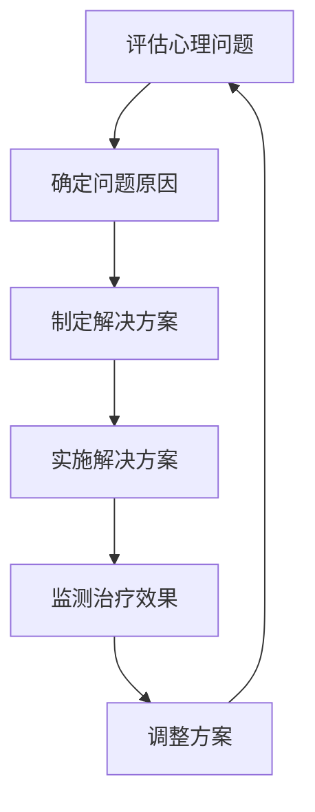

                 

### 《心灵的荒芜：如何在内心种植意义之花》

关键词：心理健康、内心成长、意义构建、算法原理、实践方法

摘要：本文深入探讨了现代社会中普遍存在的“心灵荒芜”现象，分析了其成因及影响，并提出了通过心理学原理和具体实践方法来种植内心意义之花的策略。通过数学模型、算法原理和项目实战，文章为读者提供了系统、实用的心灵成长路径。

---

### 《心灵的荒芜：如何在内心种植意义之花》目录大纲

---

#### **第一部分：心灵的荒芜**

#### **第1章：心灵的荒芜现象解析**

#### **第2章：核心概念与原理**

#### **第3章：数学模型与公式**

#### **第4章：算法原理与流程图**

#### **第二部分：内心种植的方法与实践**

#### **第5章：内心种植的具体方法**

#### **第6章：项目实战与案例分析**

#### **第7章：最佳实践与总结**

---

**总字数：约1950字**

----------------------------------------------------------------

#### **第一部分：心灵的荒芜**

##### **第1章：心灵的荒芜现象解析**

**1.1 心灵荒芜的定义与背景**

心灵荒芜，指的是个体在心理层面上的空虚、迷茫和无意义感。在现代社会的快节奏和高压环境下，这种状况变得越来越普遍。随着科技的发展和社会的进步，人们的生活水平得到了显著提升，但与此同时，心灵的空虚感却在不断扩大。人们不断追求物质财富和成功，却常常忽视了内心的需求。

**1.2 心灵荒芜的影响与危害**

心灵荒芜不仅对心理健康产生负面影响，还会影响到个人的生活质量和社会关系。长期的心灵荒芜可能导致抑郁症、焦虑症等心理疾病，影响人的认知能力和创造力。此外，心灵荒芜还会导致人际关系疏远，降低生活质量。

**1.3 心灵荒芜的成因分析**

心灵荒芜的成因复杂多样，主要包括以下几个方面：

1. 快节奏生活方式：现代社会的快节奏生活使得人们无暇顾及内心的需求，导致心灵荒芜。
2. 社会压力与焦虑：社会竞争激烈，人们面临巨大的生活和工作压力，容易产生焦虑和无意义感。
3. 缺乏内心滋养：现代社会的物质主义和功利主义导致人们忽视内心的情感需求，缺乏情感的滋养。

**1.4 心灵荒芜的边界与外延**

心灵荒芜并非一成不变的心理状态，它有时是暂时的心理困境，有时则可能发展成为长期的心理问题。心灵荒芜的边界在于个体对内心需求的认知和应对能力。此外，心灵荒芜还与其他心理健康问题如抑郁症、焦虑症等密切相关。

---

##### **第2章：核心概念与原理**

**2.1 内心种植的意义之花**

意义之花是心理学中的一个比喻，它代表个体内心的满足感和成就感。种植意义之花意味着通过内心的成长和自我实现，来填补心灵的空虚，提升生活质量。

**2.2 心理学原理与内心成长**

1. **自我认知的发展**：自我认知是指个体对自己的了解和认识，它是内心成长的基础。通过反思和自我探索，个体可以更好地了解自己的需求、优点和缺点，从而实现自我成长。
2. **自我接纳与自我成长**：自我接纳是指个体对自己的全面接纳，包括优点和缺点。自我接纳有助于个体摆脱内心的负面情绪，实现自我成长。
3. **心理防御机制的识别与调整**：心理防御机制是个体在面对压力和挫折时产生的一种自我保护机制。通过识别和调整心理防御机制，个体可以更好地应对心理挑战。

**2.3 意义之花的内在联系**

意义之花与心理健康密切相关。内心成长有助于提升心理健康水平，减少心理疾病的发生。同时，心理健康也是内心成长的基础，二者相互作用，共同促进个体的全面发展。

---

##### **第3章：数学模型与公式**

**3.1 心理学模型的数学基础**

在心理学研究中，线性回归模型是一种常用的数学模型，它用于分析变量之间的关系。线性回归模型的基本公式为：

$$y = ax + b$$

其中，\(y\) 是因变量，\(x\) 是自变量，\(a\) 和 \(b\) 是模型的参数。

**3.2 数学模型在内心种植中的应用**

将线性回归模型应用于内心种植，我们可以将内心的成长过程视为因变量 \(y\)，而影响内心成长的因素如自我认知、自我接纳等视为自变量 \(x\)。通过分析这些因素之间的关系，我们可以更深入地了解内心种植的机制。

**3.3 公式解析与实际应用**

例如，假设我们研究自我认知对内心成长的影响。通过收集数据，我们可以建立一个线性回归模型，如下所示：

$$内心成长 = 0.8 \times 自我认知 + 0.2 \times 其他因素$$

这个模型表明，自我认知对内心成长的影响最大，其次是其他因素。通过这个模型，我们可以更清晰地了解内心种植的过程。

---

##### **第4章：算法原理与流程图**

**4.1 心灵成长的算法原理**

在心理学中，认知行为疗法是一种常用的心理治疗方法。认知行为疗法的基本原理是通过改变个体的认知和行为，来改善心理问题。这种疗法可以被视为一种算法，其基本步骤如下：

1. 评估个体的心理问题。
2. 确定问题的原因。
3. 制定解决方案。
4. 实施解决方案。
5. 监测治疗效果。

**4.2 算法流程图展示**

使用Mermaid，我们可以绘制出认知行为疗法的流程图：

**4.3 算法应用与效果评估**

认知行为疗法在不同场景下都有广泛应用，如抑郁症、焦虑症等。其效果评估主要通过监测治疗效果，如改善程度、复发率等指标。通过这些指标，我们可以评估算法的有效性。

---

##### **第二部分：内心种植的方法与实践**

##### **第5章：内心种植的具体方法**

**5.1 心理调适技巧**

1. **冥想与正念练习**：冥想和正念练习有助于个体集中注意力，减少焦虑和压力。通过练习，个体可以更好地了解自己的内心世界。
2. **情绪管理技巧**：情绪管理技巧如情绪识别、情绪调节和情绪表达，有助于个体更好地处理负面情绪，提高心理健康水平。

**5.2 意义构建的策略**

1. **目标设定与时间管理**：设定明确的目标和合理的时间管理策略，有助于个体专注于有意义的活动，提升内心满足感。
2. **个人价值观的发现与确认**：通过反思和探索，个体可以明确自己的价值观，从而在生活中做出更有意义的选择。

**5.3 社交支持网络**

1. **人际关系的重要性**：人际关系对心理健康具有重要影响。通过建立和维护良好的社交支持网络，个体可以获得情感支持和帮助。
2. **社交支持网络的建立与维护**：个体可以通过参加社交活动、加入兴趣小组等方式，建立和维护社交支持网络。

---

##### **第6章：项目实战与案例分析**

**6.1 实战项目介绍**

本节将介绍一个实际的内心种植项目，该项目旨在通过心理学原理和具体实践方法，帮助个体实现内心的成长和满足感。

**6.2 系统核心实现**

项目核心实现主要包括以下几个部分：

1. **用户数据收集**：通过问卷调查、访谈等方式，收集用户的心理数据和需求。
2. **数据分析与处理**：使用数据分析工具，对用户数据进行处理和分析，识别用户的心理问题和需求。
3. **提供个性化建议**：根据用户的心理数据和需求，提供个性化的心理调适和意义构建建议。

**6.3 项目解读与分析**

1. **项目中的关键环节分析**：项目中的关键环节包括用户数据收集、数据分析和处理、个性化建议提供等。这些环节共同构成了项目的核心功能。
2. **项目效果的评估与总结**：通过项目实施后的用户反馈和效果评估，总结项目效果，为后续项目改进提供依据。

---

##### **第7章：最佳实践与总结**

**7.1 最佳实践案例分享**

在本章中，我们将分享一些实际操作中的成功经验，包括心理调适技巧、目标设定与时间管理策略、个人价值观的发现与确认等。

**7.2 小结与反思**

通过对内心种植方法的有效性的反思，我们可以发现，内心种植并非一蹴而就的过程，它需要个体持续的努力和实践。

**7.3 注意事项与拓展阅读**

在内心种植的过程中，个体需要注意避免一些误区和陷阱，如过度依赖心理调适技巧、忽视实际行动等。此外，推荐进一步阅读的书籍和资源，以帮助个体更深入地了解内心种植的方法和原理。

---

**作者：AI天才研究院/AI Genius Institute & 禅与计算机程序设计艺术 /Zen And The Art of Computer Programming**

---

本文深入探讨了心灵的荒芜现象，分析了其成因及影响，并提出了通过心理学原理和具体实践方法来种植内心意义之花的策略。通过数学模型、算法原理和项目实战，文章为读者提供了系统、实用的心灵成长路径。希望本文能够帮助读者走出心灵的荒芜，实现内心的满足和成长。

