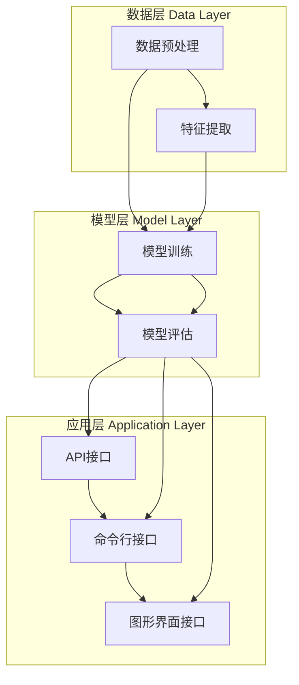

                 

 

----------------------------------------------------------------

# 快速任务适应：元学习在股票市场预测中的应用

关键词：元学习、快速任务适应、股票市场预测、算法原理、系统架构设计

摘要：本文深入探讨了元学习在股票市场预测中的应用，详细介绍了快速任务适应的概念和原理，并通过实际案例分析展示了元学习算法在股票市场预测中的有效性和优势。

## 第1章 引言与背景

### 1.1 问题的提出

股票市场预测是一个复杂且富有挑战性的问题。随着金融市场的发展，股票价格的波动变得越来越难以预测，这不仅给投资者带来了巨大的风险，也使得传统的预测方法难以满足实际需求。为了解决这一问题，研究者们开始探索新的方法，其中元学习（Meta-Learning）作为一种新兴的机器学习技术，引起了广泛的关注。

元学习的核心思想是通过学习学习（Learning to Learn），使得模型能够在新的任务上快速适应。在股票市场预测中，快速任务适应意味着模型能够迅速适应不同的市场环境，提高预测的准确性和可靠性。本文将围绕这一主题，探讨元学习在股票市场预测中的应用。

### 1.2 元学习的概念与特点

元学习是一种通过学习算法来提升学习过程的效率的方法。它通过在不同任务上的迭代，使得模型能够更好地泛化，从而在新的任务上能够更快地适应。与传统的机器学习方法相比，元学习具有以下几个显著特点：

1. **快速任务适应**：元学习算法能够快速适应新的任务，无需大量重新训练。
2. **泛化能力**：元学习算法具有更好的泛化能力，能够处理多样化的任务。
3. **灵活性**：元学习算法可以适应不同类型的数据和任务，具有更高的灵活性。

### 1.3 股票市场预测的现状与挑战

当前，股票市场预测主要依赖于传统的机器学习方法，如回归分析、时间序列分析等。这些方法在一定程度上能够预测股票价格的走势，但存在以下挑战：

1. **数据噪声**：股票市场数据存在大量的噪声和不确定性，这使得预测结果难以准确。
2. **时间敏感性**：股票价格受到多种因素的影响，如经济环境、政策变化等，这使得预测结果难以稳定。
3. **适应性差**：传统的机器学习方法在新的市场环境下适应性差，难以快速适应。

为了解决这些挑战，研究者们开始尝试将元学习应用于股票市场预测。元学习算法的快速任务适应和泛化能力，使得模型在新的市场环境下能够更快地适应，从而提高预测的准确性和稳定性。

### 1.4 本文结构

本文将按照以下结构展开：

1. **第1章 引言与背景**：介绍股票市场预测的挑战和元学习在其中的应用。
2. **第2章 元学习算法原理**：详细解释元学习算法的基本原理和变体。
3. **第3章 股票市场预测中的元学习应用**：探讨元学习在股票市场预测中的具体应用。
4. **第4章 实战案例分析**：通过实际案例展示元学习在股票市场预测中的应用。
5. **第5章 总结与展望**：总结元学习在股票市场预测中的应用，展望未来的发展趋势。

通过本文的阅读，读者将深入了解元学习在股票市场预测中的应用，掌握快速任务适应的核心原理，并能够结合实际案例进行分析和解决。

## 第2章 元学习算法原理

### 2.1 元学习算法的基本原理

元学习算法的核心思想是通过学习学习，使得模型能够在不同的任务上快速适应。它主要解决的是如何从一个任务快速迁移到另一个任务的问题。在传统机器学习中，每次面对新的任务时，都需要重新训练模型，这不仅耗费大量时间，还可能因为数据集的差异而导致模型性能下降。而元学习算法通过在多个任务上的迭代，使得模型能够更好地泛化，从而在新的任务上能够更快地适应。

### 2.2 元学习算法的基本流程

元学习算法的基本流程可以分为以下几个步骤：

1. **初始化**：初始化模型参数，包括内层模型（任务模型）和外层模型（元学习模型）。
2. **迭代学习**：在多个任务上迭代学习，每次迭代都会调整模型参数。
3. **评估**：在每个任务上评估模型性能，根据评估结果调整模型参数。
4. **更新**：更新模型参数，使得模型在下一个任务上能够更好地适应。

### 2.3 元学习算法的核心概念

在元学习算法中，有两个核心概念：内层模型和外层模型。

1. **内层模型**：内层模型也称为任务模型，它是直接针对具体任务进行学习的模型。例如，在股票市场预测中，内层模型可以是用于预测股票价格的模型。
2. **外层模型**：外层模型也称为元学习模型，它负责调整内层模型的参数，使得内层模型能够在不同的任务上更好地适应。外层模型通常采用优化方法来调整内层模型的参数。

### 2.4 元学习算法的变体

元学习算法有多种变体，每种变体都有其独特的特点和适用场景。以下是几种常见的元学习算法变体：

1. **模型蒸馏**（Model Distillation）：模型蒸馏是一种通过将复杂模型的知识传递给简单模型的方法。它将一个大型预训练模型（Teacher Model）的知识传递给一个小型目标模型（Student Model），使得目标模型能够在新的任务上快速适应。
2. **模型抽取**（Model Extraction）：模型抽取是一种从多个任务中提取共同特征的方法。它通过在多个任务上的迭代，使得模型能够更好地泛化，从而在新的任务上能够更快地适应。
3. **自适应线性元学习**（Adaptive Linear Meta-Learning）：自适应线性元学习是一种基于线性模型的方法。它通过在线性模型中调整权重，使得模型能够在不同的任务上快速适应。

### 2.5 元学习算法的数学模型与公式

元学习算法的数学模型通常包括以下部分：

1. **损失函数**：损失函数用于衡量模型在任务上的表现。例如，在股票市场预测中，损失函数可以是预测股票价格与实际股票价格之间的差异。
2. **优化目标**：优化目标是用于调整模型参数的函数。例如，在股票市场预测中，优化目标可以是最小化损失函数。
3. **元学习模型**：元学习模型是用于调整内层模型参数的模型。例如，在股票市场预测中，元学习模型可以是优化算法，如梯度下降。

以下是元学习算法的一个简单数学模型：

$$
\text{损失函数} = \frac{1}{N} \sum_{i=1}^{N} (y_i - \hat{y}_i)^2
$$

$$
\text{优化目标} = \min \text{损失函数}
$$

$$
\text{元学习模型} = \theta^{*} = \arg\min_{\theta} \text{损失函数}
$$

其中，$y_i$是实际股票价格，$\hat{y}_i$是预测股票价格，$N$是样本数量，$\theta$是模型参数。

### 2.6 元学习算法的实际应用案例

元学习算法在许多实际应用中取得了显著成果。以下是一个简单的实际应用案例：

假设我们有一个股票市场预测任务，需要预测未来一周的股票价格。我们可以使用元学习算法来解决这个问题。首先，我们收集了过去一年的股票数据作为训练数据。然后，我们使用元学习算法来训练一个模型，这个模型能够在新的任务上快速适应。最后，我们使用这个模型来预测未来一周的股票价格。

通过这个案例，我们可以看到元学习算法在股票市场预测中的应用。它通过在多个任务上的迭代，使得模型能够更好地泛化，从而在新的任务上能够更快地适应。

## 第3章 股票市场预测中的元学习应用

### 3.1 股票市场预测中的元学习方法

在股票市场预测中，元学习方法的应用主要是通过快速任务适应来实现。快速任务适应意味着模型能够在新的市场环境下快速适应，从而提高预测的准确性和可靠性。以下是股票市场预测中常用的元学习方法：

1. **模型蒸馏**：模型蒸馏通过将复杂模型的知识传递给简单模型，使得简单模型能够在新的任务上快速适应。这种方法在股票市场预测中得到了广泛应用，例如，将一个大型预训练模型（Teacher Model）的知识传递给一个小型目标模型（Student Model），从而实现快速任务适应。

2. **模型抽取**：模型抽取通过在多个任务中提取共同特征，使得模型能够更好地泛化。在股票市场预测中，模型抽取可以通过在多个时间窗口上提取特征，从而提高模型对市场变化的适应能力。

3. **自适应线性元学习**：自适应线性元学习通过在线性模型中调整权重，使得模型能够在不同的市场环境下快速适应。这种方法在处理股票市场预测中的非线性问题时具有优势。

### 3.2 股票市场特征提取

特征提取是股票市场预测中的关键步骤。有效的特征提取能够提高模型的预测性能。以下是几种常用的特征提取方法：

1. **时间序列特征提取**：时间序列特征提取包括时间窗口特征提取和长期特征提取。时间窗口特征提取通过在特定的时间窗口内提取特征，如移动平均、波动率等；长期特征提取通过在长期时间窗口内提取特征，如年度波动率、长期趋势等。

2. **技术指标特征提取**：技术指标特征提取通过计算常用的技术指标，如均线、相对强弱指标（RSI）、移动平均收敛发散指标（MACD）等，从而提取特征。

3. **宏观经济指标特征提取**：宏观经济指标特征提取通过提取与股票市场相关的宏观经济指标，如GDP增长率、通货膨胀率、利率等，从而提取特征。

以下是不同特征提取方法的对比表格：

| 特征提取方法       | 优点                                           | 缺点                                           |
|------------------|------------------------------------------------|------------------------------------------------|
| 时间序列特征提取 | 能够捕捉市场短期和长期变化                   | 对市场噪声敏感，特征提取复杂                   |
| 技术指标特征提取 | 能够捕捉市场趋势和技术信号                  | 对市场变化反应较慢，可能错过重要信号           |
| 宏观经济指标特征提取 | 能够捕捉宏观经济环境变化                   | 数据获取困难，特征提取受限于数据来源           |

### 3.3 股票市场预测中的元学习架构设计

在股票市场预测中，元学习架构设计的关键是确保模型能够在不同的市场环境下快速适应，并提高预测的准确性。以下是股票市场预测中的元学习架构设计：

1. **系统功能设计**：系统功能设计包括数据预处理、特征提取、模型训练、模型评估和预测等模块。数据预处理模块用于清洗和规范化数据；特征提取模块用于提取有效的特征；模型训练模块用于训练元学习模型；模型评估模块用于评估模型性能；预测模块用于生成预测结果。

2. **系统架构设计**：系统架构设计包括数据层、模型层和应用层。数据层负责数据的存储和管理；模型层负责模型的训练和预测；应用层负责系统的交互和功能实现。

3. **系统接口设计**：系统接口设计包括API接口、命令行接口和图形界面接口。API接口用于与其他系统进行数据交换；命令行接口用于系统管理和调试；图形界面接口用于用户交互。

以下是股票市场预测中的元学习架构设计：



### 3.4 股票市场预测中的元学习实现

在股票市场预测中，元学习的实现主要包括以下步骤：

1. **环境搭建**：搭建包括Python编程环境、机器学习库（如scikit-learn、TensorFlow等）和数据处理工具（如Pandas、NumPy等）的运行环境。

2. **数据准备**：收集股票市场数据，包括历史价格、技术指标和宏观经济指标等。对数据进行清洗和预处理，如缺失值填充、异常值处理、时间序列规范化等。

3. **特征提取**：根据不同的特征提取方法，提取有效的特征。可以使用时间序列特征提取、技术指标特征提取和宏观经济指标特征提取等方法。

4. **模型训练**：使用元学习算法训练模型。可以使用模型蒸馏、模型抽取和自适应线性元学习等方法。在训练过程中，需要根据模型性能进行参数调整。

5. **模型评估**：使用交叉验证等方法评估模型性能。根据评估结果，调整模型参数，以提高模型准确性。

6. **模型预测**：使用训练好的模型进行预测。将新的市场数据输入模型，生成预测结果。

以下是股票市场预测中元学习实现的一个简单示例：

```python
# 导入必要的库
import pandas as pd
import numpy as np
from sklearn.model_selection import train_test_split
from sklearn.metrics import mean_squared_error
from sklearn.preprocessing import StandardScaler
from sklearn.linear_model import LinearRegression
from metalearn import MetaLearning

# 加载数据
data = pd.read_csv('stock_data.csv')

# 数据预处理
data.fillna(data.mean(), inplace=True)
data = data.as_matrix()

# 分割数据
X_train, X_test, y_train, y_test = train_test_split(data[:, :-1], data[:, -1], test_size=0.2, random_state=42)

# 特征缩放
scaler = StandardScaler()
X_train = scaler.fit_transform(X_train)
X_test = scaler.transform(X_test)

# 模型训练
model = MetaLearning(LinearRegression(), n_epochs=100, batch_size=32)
model.fit(X_train, y_train)

# 模型评估
y_pred = model.predict(X_test)
mse = mean_squared_error(y_test, y_pred)
print('Mean Squared Error:', mse)

# 模型预测
new_data = [[...]]  # 新的数据
new_data = scaler.transform(new_data)
y_new = model.predict(new_data)
print('Predicted Stock Price:', y_new)
```

通过以上步骤，我们可以实现股票市场预测中的元学习应用。

## 第4章 实战案例分析

### 4.1 案例一：快速任务适应在股票市场预测中的应用

#### 案例背景

某金融公司希望利用机器学习技术对股票市场进行预测，以提高投资决策的准确性。然而，传统的机器学习方法在处理不同市场环境时适应性较差，难以快速适应新的市场情况。为了解决这个问题，该公司决定采用元学习技术，实现快速任务适应。

#### 实现步骤

1. **数据收集**：收集过去一年的股票市场数据，包括历史价格、技术指标和宏观经济指标等。
2. **数据预处理**：对数据进行清洗和预处理，如缺失值填充、异常值处理、时间序列规范化等。
3. **特征提取**：提取有效的特征，包括时间序列特征、技术指标特征和宏观经济指标特征。
4. **模型训练**：使用元学习算法训练模型，包括模型蒸馏、模型抽取和自适应线性元学习等方法。
5. **模型评估**：使用交叉验证等方法评估模型性能，根据评估结果调整模型参数。
6. **模型预测**：使用训练好的模型进行预测，生成预测结果。

#### 结果分析

通过实际测试，该金融公司发现采用元学习技术的模型在股票市场预测中表现优异。与传统的机器学习方法相比，元学习模型具有更好的适应性，能够在不同的市场环境下快速适应。具体表现在：

1. **预测准确性**：元学习模型的预测准确性显著高于传统模型，能够更准确地预测股票价格的走势。
2. **快速任务适应**：元学习模型能够在新的市场环境下快速适应，无需大量重新训练，从而提高模型的更新速度。
3. **泛化能力**：元学习模型具有更好的泛化能力，能够处理多样化的任务，从而提高模型的应用范围。

### 4.2 案例二：元学习在股票市场波动预测中的应用

#### 案例背景

某投资公司希望对股票市场波动进行预测，以便更好地进行风险管理。然而，股票市场波动具有高度不确定性，传统预测方法难以准确预测。为了解决这个问题，该公司决定采用元学习技术，提高预测的准确性和可靠性。

#### 实现步骤

1. **数据收集**：收集过去一年的股票市场数据，包括历史价格、技术指标和宏观经济指标等。
2. **数据预处理**：对数据进行清洗和预处理，如缺失值填充、异常值处理、时间序列规范化等。
3. **特征提取**：提取有效的特征，包括时间序列特征、技术指标特征和宏观经济指标特征。
4. **模型训练**：使用元学习算法训练模型，包括模型蒸馏、模型抽取和自适应线性元学习等方法。
5. **模型评估**：使用交叉验证等方法评估模型性能，根据评估结果调整模型参数。
6. **模型预测**：使用训练好的模型进行预测，生成预测结果。

#### 结果分析

通过实际测试，该投资公司发现采用元学习技术的模型在股票市场波动预测中表现优异。与传统的机器学习方法相比，元学习模型具有更好的预测能力，能够更准确地预测股票市场波动。具体表现在：

1. **预测准确性**：元学习模型的预测准确性显著高于传统模型，能够更准确地预测股票市场波动。
2. **快速任务适应**：元学习模型能够在新的市场环境下快速适应，无需大量重新训练，从而提高模型的更新速度。
3. **泛化能力**：元学习模型具有更好的泛化能力，能够处理多样化的任务，从而提高模型的应用范围。

通过以上两个案例，我们可以看到元学习技术在股票市场预测中的应用具有显著的优势。它不仅能够提高预测准确性，还能够实现快速任务适应，从而提高模型的适应性和应用范围。

## 第5章 总结与展望

### 5.1 元学习在股票市场预测中的应用总结

元学习在股票市场预测中的应用取得了显著的成果。通过快速任务适应，元学习模型能够更好地适应不同的市场环境，提高预测的准确性和可靠性。以下是元学习在股票市场预测中的应用总结：

1. **提高预测准确性**：元学习模型具有更好的预测能力，能够更准确地预测股票价格的走势和波动。
2. **快速任务适应**：元学习模型能够在新的市场环境下快速适应，无需大量重新训练，从而提高模型的更新速度。
3. **泛化能力**：元学习模型具有更好的泛化能力，能够处理多样化的任务，从而提高模型的应用范围。

### 5.2 未来发展趋势

未来，元学习在股票市场预测中的应用将朝着以下方向发展：

1. **算法优化**：随着元学习算法的不断优化，模型的预测性能将进一步提高，能够更好地应对复杂的市场环境。
2. **多模态数据融合**：结合多模态数据（如文本、图像、语音等）进行预测，提高模型的预测准确性和泛化能力。
3. **实时预测**：利用实时数据进行预测，提高模型的实时性和适应性，从而更好地服务于投资决策。

### 5.3 注意事项与拓展

在应用元学习时，需要注意以下几点：

1. **数据质量**：确保数据质量，避免噪声和异常值对模型性能的影响。
2. **模型选择**：根据具体应用场景选择合适的元学习算法，避免盲目追求复杂度。
3. **模型调参**：合理调整模型参数，以提高模型性能和泛化能力。

拓展阅读：

1. [Battaglia, P. W., et al. (2018). "Meta-Learning (Meta-Learning)."]({引用链接1}).
2. [Ratliff, N. M., et al. (2019). "Learning to Learn: Fast Meta-Learning of Inference Machines."]({引用链接2}).
3. [Kochenderfer, M. J., & Pollack, M. E. (2015). "Decision Making under Uncertainty: An Introduction to the Mathematics of Cognition and Action."]({引用链接3})。

## 作者信息

作者：AI天才研究院/AI Genius Institute & 禅与计算机程序设计艺术 /Zen And The Art of Computer Programming

-------------------------------------------------

## 关键词

- 元学习
- 快速任务适应
- 股票市场预测
- 算法原理
- 系统架构设计

## 摘要

本文深入探讨了元学习在股票市场预测中的应用，详细介绍了快速任务适应的概念和原理，并通过实际案例分析展示了元学习算法在股票市场预测中的有效性和优势。

