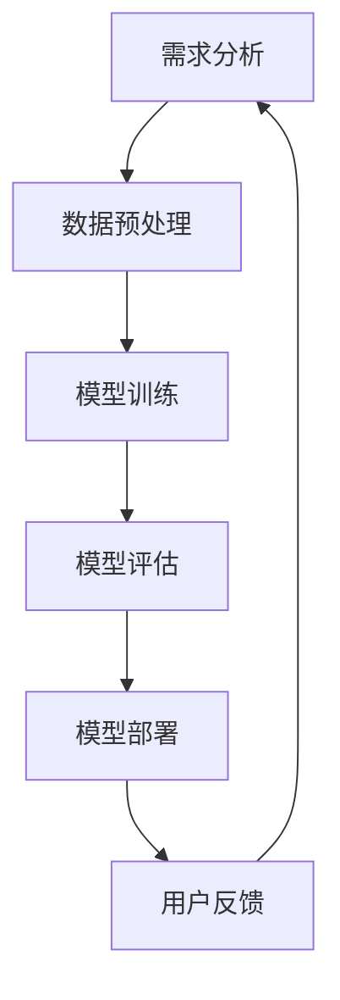
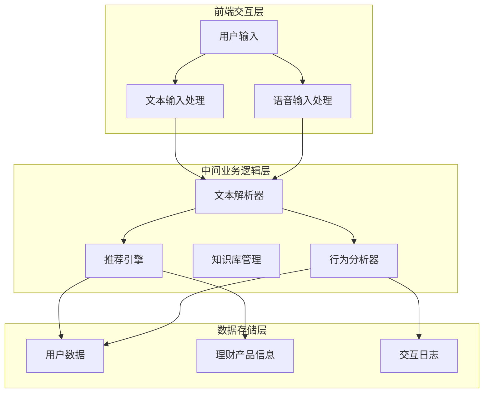
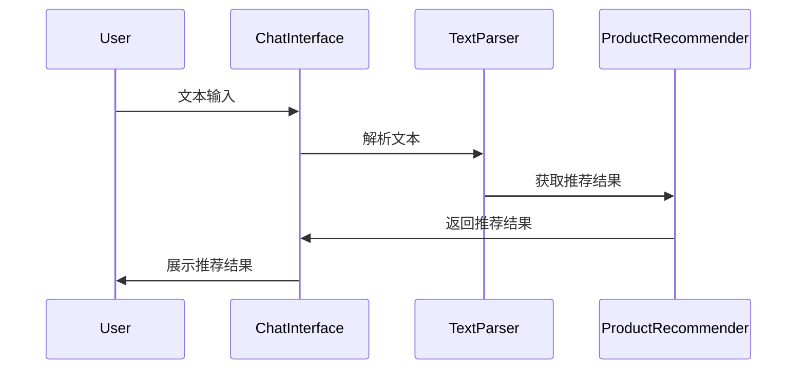
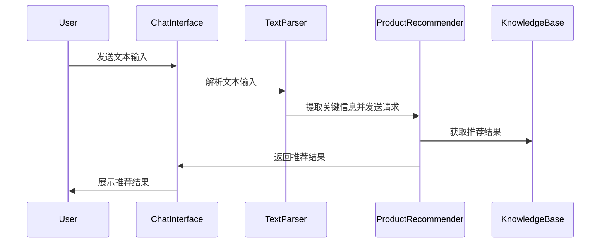

                 

### 第1章: 快速原型设计基础

### 1.1 快速原型设计的概念

#### 1.1.1 问题背景

在软件工程的发展历程中，传统的软件开发流程往往包含详细的规划、设计、编码、测试和部署阶段。这种方法虽然能够在一定程度上保证软件的质量和稳定性，但它的一个显著缺点是开发周期长、成本高，并且难以适应快速变化的市场需求。在这种背景下，快速原型设计（Rapid Prototyping）方法应运而生。

快速原型设计起源于20世纪70年代的CAD（计算机辅助设计）领域，后来被广泛应用于软件工程领域。它的核心思想是在开发初期快速构建一个功能有限的初步模型，然后通过用户的反馈来不断改进和优化。

#### 1.1.2 快速原型设计的定义

快速原型设计是一种通过迭代构建软件的方法，其核心步骤包括：

1. **需求分析**：明确用户需求，确定原型需要实现的功能。
2. **原型构建**：利用开发工具和快速开发框架，快速构建出初步的软件模型。
3. **用户反馈**：将原型展示给用户，收集用户的使用体验和反馈。
4. **迭代优化**：根据用户反馈对原型进行改进，不断迭代直到达到预期目标。

#### 1.1.3 快速原型设计的重要性

快速原型设计在软件开发中的应用具有多方面的优势：

- **缩短开发周期**：通过快速迭代，可以更快地将产品推向市场。
- **提高用户满意度**：频繁的用户反馈可以确保软件更贴近用户需求。
- **降低开发成本**：早期的错误可以更早地被发现和修复，减少后期修复成本。
- **增强团队协作**：快速原型设计鼓励跨职能团队的合作，提高开发效率。

### 1.2 快速原型设计的原则

#### 1.2.1 用户反馈

用户反馈是快速原型设计的核心原则之一。它强调在开发过程中要不断收集用户的意见和建议，以便及时调整和优化软件功能。用户反馈可以通过以下几种方式获取：

- **用户访谈**：通过与用户进行面对面的交流，深入了解用户的需求和痛点。
- **用户测试**：邀请用户参与测试，观察用户在使用原型时的行为和反馈。
- **问卷调查**：通过在线问卷或纸质问卷收集用户的意见和建议。

#### 1.2.2 快速迭代

快速迭代是快速原型设计的另一个关键原则。它强调在短时间内进行多次迭代，每次迭代都应增加一些新的功能或改进现有的功能。快速迭代有助于：

- **加速产品交付**：通过缩短开发周期，可以更快地将产品推向市场。
- **提高产品质量**：频繁的迭代可以及时发现和修复问题，提高软件的稳定性。
- **适应市场需求**：快速响应市场变化，确保软件始终保持竞争力。

#### 1.2.3 低成本高效率

快速原型设计要求在保证开发效率的同时控制成本。这意味着需要使用低成本的开发工具和技术，同时提高团队的工作效率。实现低成本高效率的方法包括：

- **选用合适的开发工具**：使用轻量级开发工具和快速开发框架，降低开发难度和时间。
- **优化团队协作**：通过合理的组织架构和沟通机制，提高团队协作效率。
- **自动化测试**：引入自动化测试工具，提高测试效率，降低测试成本。

### 1.3 快速原型设计的方法

#### 1.3.1 从需求到原型

快速原型设计的起点是需求分析。在明确用户需求后，开发团队可以开始构建原型。具体步骤包括：

1. **需求确认**：与用户确认需求，明确原型需要实现的功能和性能指标。
2. **需求文档**：编写详细的需求文档，作为原型构建的指导。
3. **原型构建**：利用原型工具或快速开发框架，快速构建出初步的软件模型。

#### 1.3.2 原型开发的流程

原型开发的流程通常包括以下几个步骤：

1. **需求确认**：与用户确认需求，明确原型需要实现的功能和性能指标。
2. **原型构建**：利用原型工具或快速开发框架，快速构建出初步的软件模型。
3. **用户测试**：邀请用户参与测试，观察用户在使用原型时的行为和反馈。
4. **迭代优化**：根据用户反馈对原型进行改进，不断迭代直到达到预期目标。

#### 1.3.3 原型的评价与优化

在快速原型设计过程中，对原型的评价与优化至关重要。评价原型的标准包括：

- **功能完整性**：原型是否实现了用户提出的需求。
- **用户体验**：原型是否易于使用，用户满意度如何。
- **性能指标**：原型在运行过程中的性能是否达到预期。

优化原型的方法包括：

- **功能完善**：根据用户反馈，增加新的功能或改进现有功能。
- **界面优化**：优化用户界面，提高用户体验。
- **性能调优**：对原型进行性能调优，提高运行效率。

### 1.4 快速原型设计与传统开发方法的比较

快速原型设计与传统开发方法在多个方面存在差异：

- **开发周期**：快速原型设计注重快速迭代，开发周期较短；传统开发方法则强调规划和设计，开发周期较长。
- **用户参与**：快速原型设计鼓励用户在整个开发过程中参与，获取用户反馈；传统开发方法则在后期进行用户测试。
- **成本控制**：快速原型设计通过降低开发成本和提高开发效率来控制成本；传统开发方法则通过详细的规划和设计来控制成本。
- **风险应对**：快速原型设计通过快速迭代来减少风险；传统开发方法则在项目初期进行详细的风险评估。

### 1.5 快速原型设计的应用场景

快速原型设计适用于多种应用场景，包括：

- **新产品开发**：在开发新产品时，快速原型设计可以帮助团队快速验证产品概念，降低市场风险。
- **需求变更**：在需求频繁变更的项目中，快速原型设计可以快速适应变化，降低变更带来的风险。
- **跨部门协作**：快速原型设计鼓励跨职能团队的合作，提高项目进度和质量。

通过以上对快速原型设计概念、原则和方法的介绍，我们可以看到快速原型设计在软件开发中的重要性。接下来，我们将进一步探讨大型语言模型（LLM）的基础知识，为后续章节的深入讨论奠定基础。### 第2章: 大型语言模型（LLM）基础

### 2.1 LLM的概念与特点

#### 2.1.1 LLM的定义

大型语言模型（Large Language Model，简称LLM）是一种基于深度学习技术的自然语言处理（Natural Language Processing，简称NLP）模型，通过大量的文本数据进行训练，从而实现对自然语言的建模和理解。LLM的核心在于其能够通过学习大量的文本数据，捕捉到语言中的复杂规律和结构，从而实现对语言的理解和生成。

#### 2.1.2 LLM的核心特点

LLM具有以下几个核心特点：

1. **规模庞大**：LLM的训练数据量和模型参数量通常都非常庞大。例如，GPT-3模型拥有超过1750亿个参数，训练数据量达到45TB。这种大规模的数据和参数量使得LLM能够捕捉到语言中的细微特征和复杂结构。

2. **自动调优**：LLM通过自动调整模型参数来最小化损失函数，从而实现自我优化。这一过程通常利用了诸如梯度下降、Adam优化器等优化算法。自动调优使得LLM能够从大规模数据中高效地学习，并且具有较强的泛化能力。

3. **自适应性强**：LLM能够根据输入的文本数据自适应地调整其生成策略，从而生成更加符合语言规则和语义逻辑的文本。这种自适应能力使得LLM在生成文本时能够灵活应对不同的场景和需求。

4. **多语言支持**：许多LLM模型支持多语言训练和生成，这意味着它们可以处理和生成多种语言的文本。这对于跨国公司、多语言社区等场景具有重要的应用价值。

5. **强表达能力**：LLM能够生成结构化、连贯、有逻辑的文本，这使得它们在诸如文本生成、问答系统、机器翻译等领域具有广泛的应用前景。

#### 2.1.3 LLM与传统NLP的区别

传统NLP（如基于规则的方法、统计方法等）与LLM在多个方面存在显著区别：

1. **数据依赖**：传统NLP方法通常依赖于预先定义的规则或统计模型，而LLM则完全依赖于大量的文本数据。这种数据驱动的学习方法使得LLM能够更好地捕捉到语言中的复杂特征和模式。

2. **计算资源**：传统NLP方法通常对计算资源的要求较低，而LLM则需要大量的计算资源和存储空间。大规模的模型训练通常需要高性能的GPU集群和分布式计算系统。

3. **灵活性**：传统NLP方法在处理特定任务时具有较强的针对性，但灵活性较低。而LLM则具有较强的通用性，可以应用于多种不同的自然语言处理任务。

4. **准确性和效果**：在许多NLP任务中，LLM的表现通常优于传统方法。例如，在文本分类、机器翻译、问答系统等领域，LLM能够生成更加准确和自然的文本。

### 2.2 LLM的主要类型

LLM可以分为多种类型，以下是一些主要的LLM类型：

#### 2.2.1 GPT系列

GPT（Generative Pre-trained Transformer）是LLM中最具代表性的模型之一。GPT系列模型由OpenAI开发，包括GPT、GPT-2和GPT-3等版本。这些模型基于Transformer架构，通过预训练和微调的方式实现。

- **GPT**：是最早的GPT模型，它通过预训练来学习语言的上下文表示。
- **GPT-2**：在GPT的基础上增加了更多的参数和训练数据，提高了生成文本的连贯性和自然性。
- **GPT-3**：是目前最大的GPT模型，拥有超过1750亿个参数，能够在多种NLP任务中表现出色。

#### 2.2.2 BERT及其变体

BERT（Bidirectional Encoder Representations from Transformers）是由Google开发的另一种重要的LLM模型。BERT模型通过双向Transformer架构来学习语言的上下文表示，它主要用于文本分类、问答系统等任务。

BERT的变体包括：

- **RoBERTa**：在BERT的基础上进行了多个优化，提高了模型的性能。
- **ALBERT**：通过共享层和层间交互的优化，提高了模型的效率和效果。
- **Masked Language Model（MLM）**：BERT的一个变体，通过随机遮盖部分文本来训练模型，增强了模型对语言掩码问题的应对能力。

#### 2.2.3 其他知名LLM

除了GPT系列和BERT及其变体，还有其他一些知名的LLM模型，包括：

- **T5**：由Google开发，它将Transformer架构应用于更广泛的NLP任务，通过统一的任务描述实现了多种NLP任务的自动化。
- **UniLM**：由微软开发，它结合了Transformer和循环神经网络的优势，实现了多语言和跨模态的文本生成任务。
- **ChatGPT**：OpenAI开发的基于GPT-3的聊天机器人模型，能够与用户进行自然语言对话。

这些LLM模型在不同的NLP任务中表现出色，成为现代自然语言处理的重要工具。

### 2.3 LLM的应用场景

#### 2.3.1 自动问答

自动问答是LLM最典型的应用场景之一。通过训练，LLM可以理解用户的查询，并从大量的文本数据中检索出相关的答案。自动问答系统广泛应用于搜索引擎、客户支持、知识库等领域。

#### 2.3.2 文本生成

LLM在文本生成方面也有广泛的应用。它可以生成各种类型的文本，如文章、新闻、对话、代码等。文本生成在内容创作、自动化写作、机器翻译等领域具有重要作用。

#### 2.3.3 机器翻译

机器翻译是另一个重要的LLM应用场景。通过训练，LLM可以学习不同语言之间的对应关系，从而实现高质量的双语翻译。机器翻译在跨国企业、旅游、外交等领域具有重要应用。

#### 2.3.4 文本分类

LLM在文本分类任务中也表现出色。通过训练，LLM可以自动将文本分类到不同的类别中。文本分类在信息检索、新闻分类、垃圾邮件过滤等领域具有广泛应用。

#### 2.3.5 文本摘要

文本摘要是将长文本压缩成短文本，同时保持原文本的主要信息。LLM可以通过训练生成摘要，这对于信息过载的现代互联网环境具有重要意义。

通过以上对大型语言模型（LLM）概念、特点、类型和应用场景的介绍，我们可以看到LLM在自然语言处理领域的强大功能和广泛应用。接下来，我们将深入探讨快速原型设计在LLM应用开发中的具体应用和实践。### 第3章: 快速原型设计在LLM应用开发中的应用

### 3.1 概述

快速原型设计（Rapid Prototyping）在大型语言模型（LLM）应用开发中具有重要作用。由于LLM模型通常涉及复杂的算法、大规模的数据处理和高性能的计算，因此通过快速原型设计可以有效地降低开发风险、提高开发效率，并确保产品满足用户需求。

#### 3.1.1 问题背景

随着人工智能和自然语言处理技术的快速发展，LLM应用的开发需求日益增加。然而，LLM应用开发面临诸多挑战，如：

- **计算资源需求**：LLM模型通常需要大量的计算资源进行训练和推理。
- **数据集构建**：构建高质量、大规模的文本数据集是LLM应用开发的关键。
- **算法复杂性**：LLM算法涉及复杂的深度学习技术和优化方法。
- **用户需求变化**：用户需求多变，如何快速适应需求变化是开发过程中的一大挑战。

#### 3.1.2 快速原型设计的优势

快速原型设计在LLM应用开发中具有以下优势：

- **快速迭代**：通过快速构建原型，可以快速验证和应用算法，提高开发效率。
- **用户反馈**：频繁的用户反馈可以帮助开发团队更好地理解用户需求，快速调整和优化产品。
- **降低风险**：早期的原型可以及早发现问题，减少后期修复的成本和风险。
- **提高可扩展性**：快速原型设计允许开发团队在原型阶段就考虑系统的可扩展性，为未来的扩展和优化奠定基础。

### 3.2 快速原型设计在LLM应用开发中的步骤

#### 3.2.1 需求分析

需求分析是快速原型设计的第一步。在这一阶段，开发团队需要与用户进行深入交流，明确用户的需求和期望。具体步骤包括：

1. **用户访谈**：通过与用户进行面对面的访谈，了解用户的需求、痛点和使用场景。
2. **需求文档**：编写详细的需求文档，明确原型需要实现的功能、性能指标和用户界面。
3. **优先级排序**：对需求进行优先级排序，确定哪些功能是核心需求，哪些是次要需求。

#### 3.2.2 原型构建

原型构建是快速原型设计的核心步骤。在这一阶段，开发团队需要利用原型工具或快速开发框架快速构建出初步的LLM应用原型。具体步骤包括：

1. **选择工具和框架**：根据需求分析的结果，选择合适的原型工具和开发框架。例如，可以使用TensorFlow或PyTorch等深度学习框架来构建LLM模型。
2. **构建基础架构**：利用所选工具和框架快速构建LLM模型的基础架构，包括数据预处理、模型训练、推理等模块。
3. **实现核心功能**：在基础架构的基础上，实现LLM应用的核心功能，如文本生成、自动问答等。

#### 3.2.3 用户反馈

用户反馈是快速原型设计的核心原则之一。在这一阶段，开发团队需要将原型展示给用户，收集用户的使用体验和反馈。具体步骤包括：

1. **用户测试**：邀请用户参与原型测试，观察用户在使用原型时的行为和反馈。
2. **用户访谈**：与用户进行面对面的访谈，深入了解用户的需求和痛点。
3. **数据分析**：对用户反馈进行定量和定性的分析，识别出原型中的问题和改进点。

#### 3.2.4 迭代优化

根据用户反馈，对原型进行迭代优化是快速原型设计的必要步骤。在这一阶段，开发团队需要根据用户反馈对原型进行改进和优化，具体步骤包括：

1. **优先级排序**：对用户反馈的问题进行优先级排序，确定哪些问题是关键问题，哪些是次要问题。
2. **问题修复**：针对关键问题进行修复和优化，确保原型在用户反馈方面得到显著改善。
3. **功能扩展**：根据用户需求，扩展原型的功能，增加新的特性或模块。

#### 3.2.5 原型评估

在迭代优化完成后，对原型进行评估是确保原型满足用户需求的重要步骤。具体评估方法包括：

1. **性能测试**：对原型的性能进行测试，包括速度、准确性、资源消耗等指标。
2. **用户满意度调查**：通过问卷调查或访谈的方式，了解用户对原型的满意度。
3. **专家评审**：邀请领域专家对原型进行评审，评估原型的技术实现和业务价值。

### 3.3 快速原型设计在LLM应用开发中的最佳实践

#### 3.3.1 模型选择与优化

在快速原型设计过程中，选择合适的LLM模型并进行优化是关键。以下是一些最佳实践：

- **选择合适的模型架构**：根据应用需求，选择合适的LLM模型架构，如GPT、BERT等。
- **优化训练策略**：通过调整学习率、批量大小、训练迭代次数等参数，优化训练策略，提高模型性能。
- **使用预训练模型**：利用预训练模型可以快速实现原型，提高开发效率。

#### 3.3.2 数据处理与预处理

在快速原型设计过程中，数据处理和预处理也是关键步骤。以下是一些最佳实践：

- **数据清洗**：确保数据的质量，去除重复、错误和无关的数据。
- **数据增强**：通过数据增强技术，如数据扩充、数据变换等，提高数据的多样性和质量。
- **特征提取**：使用合适的特征提取方法，从原始数据中提取关键特征，为模型训练提供高质量的数据输入。

#### 3.3.3 用户参与与反馈

在快速原型设计过程中，用户的参与和反馈至关重要。以下是一些最佳实践：

- **持续的用户访谈**：定期与用户进行访谈，了解用户的需求和痛点，及时调整原型。
- **多渠道反馈**：通过多种渠道收集用户反馈，如在线问卷、用户测试、用户访谈等。
- **快速迭代**：根据用户反馈，快速进行原型迭代和优化，确保原型始终满足用户需求。

#### 3.3.4 团队协作与沟通

在快速原型设计过程中，团队协作和沟通也是关键。以下是一些最佳实践：

- **跨职能团队协作**：建立跨职能团队，包括数据科学家、软件工程师、产品经理等，确保各角色之间的紧密合作。
- **定期会议**：定期召开团队会议，讨论原型进展、问题和解决方案。
- **代码和文档管理**：使用版本控制系统和文档工具，确保代码和文档的版本一致，便于团队协作和追踪。

### 3.4 案例分析

以下是一个快速原型设计在LLM应用开发中的案例分析：

#### 3.4.1 项目背景

某互联网公司希望开发一款基于自然语言处理的智能客服系统，用于处理客户咨询和投诉。公司希望通过快速原型设计的方法，在短时间内构建出一个初步的智能客服原型，然后根据用户反馈进行迭代优化。

#### 3.4.2 需求分析

在需求分析阶段，开发团队与客户服务部门进行了多次讨论，明确了智能客服系统需要实现的功能，包括：

- 自动识别客户问题类型。
- 自动生成合适的回答。
- 提供多种交互方式，如文本、语音等。
- 支持多语言。

#### 3.4.3 原型构建

在原型构建阶段，开发团队选择了BERT模型作为基础架构，并使用了TensorFlow框架进行实现。团队快速构建了智能客服系统的基本模块，包括文本预处理、BERT模型训练、回答生成和交互界面等。

#### 3.4.4 用户反馈

在原型展示阶段，开发团队邀请了多个客户服务人员试用智能客服原型，并收集了他们的反馈。主要反馈包括：

- 回答生成速度较慢。
- 回答的准确性有待提高。
- 交互界面需要更加直观和易于操作。

#### 3.4.5 迭代优化

根据用户反馈，开发团队对智能客服系统进行了多次迭代优化：

- 提高了BERT模型的训练效率。
- 优化了回答生成的算法，提高了回答的准确性。
- 对交互界面进行了重新设计，提高了用户体验。

#### 3.4.6 原型评估

在原型评估阶段，开发团队进行了多轮性能测试和用户满意度调查。结果表明，智能客服系统的性能和用户满意度显著提高，达到了预期目标。

通过以上案例分析，我们可以看到快速原型设计在LLM应用开发中的实际应用和效果。接下来，我们将进一步探讨快速原型设计在LLM应用开发中的算法原理和系统分析。### 第4章: 快速原型设计在LLM应用开发中的算法原理

### 4.1 概述

快速原型设计（Rapid Prototyping）在大型语言模型（LLM）应用开发中的算法原理至关重要。本章节将通过Mermaid流程图和Python代码，详细解析快速原型设计在LLM应用开发中的算法原理。

#### 4.1.1 算法背景

快速原型设计在LLM应用开发中的算法原理主要基于深度学习和自然语言处理（NLP）技术。深度学习是一种通过神经网络模拟人类大脑的机器学习技术，它能够自动从大量数据中学习复杂的模式。NLP是自然语言处理领域的分支，专注于使计算机能够理解和处理自然语言。

#### 4.1.2 算法核心

快速原型设计在LLM应用开发中的算法核心主要包括以下几个关键步骤：

1. **数据预处理**：包括文本清洗、分词、词向量化等。
2. **模型训练**：使用预训练模型（如BERT、GPT）或自定义模型，通过训练数据调整模型参数。
3. **模型评估**：通过验证集评估模型性能，调整超参数。
4. **模型部署**：将训练好的模型部署到实际应用环境中。

#### 4.1.3 Mermaid流程图

以下是一个简化的快速原型设计在LLM应用开发中的Mermaid流程图：



#### 4.1.4 Python代码示例

以下是一个简化的Python代码示例，用于展示快速原型设计在LLM应用开发中的基本流程：

```python
import tensorflow as tf
from transformers import BertTokenizer, TFDistilBertForSequenceClassification
import numpy as np

# 1. 数据预处理
def preprocess_data(texts):
    tokenizer = BertTokenizer.from_pretrained('bert-base-uncased')
    inputs = tokenizer(texts, padding=True, truncation=True, return_tensors='tf')
    return inputs

# 2. 模型训练
def train_model(train_inputs, train_labels):
    model = TFDistilBertForSequenceClassification.from_pretrained('distilbert-base-uncased')
    optimizer = tf.keras.optimizers.Adam(learning_rate=3e-5)
    model.compile(optimizer=optimizer, loss=tf.keras.losses.SparseCategoricalCrossentropy(from_logits=True), metrics=['accuracy'])
    model.fit(train_inputs, train_labels, epochs=3)
    return model

# 3. 模型评估
def evaluate_model(model, val_inputs, val_labels):
    loss, accuracy = model.evaluate(val_inputs, val_labels)
    print(f"Validation loss: {loss}, Validation accuracy: {accuracy}")

# 4. 模型部署
def deploy_model(model, text):
    inputs = preprocess_data([text])
    prediction = model(inputs)
    return np.argmax(prediction)

# 示例
texts = ["This is a sample text.", "Another sample text."]
labels = np.array([0, 1])

# 预处理
train_inputs = preprocess_data(texts)

# 训练模型
model = train_model(train_inputs, labels)

# 评估模型
evaluate_model(model, train_inputs, labels)

# 部署模型
print(deploy_model(model, "This is a new sample text."))
```

#### 4.1.5 算法原理详细解析

1. **数据预处理**：
   数据预处理是快速原型设计中的关键步骤，它包括文本清洗、分词、词向量化等。文本清洗旨在去除无关的信息，如HTML标签、特殊字符等。分词是将文本拆分成一个个单词或短语，词向量化是将这些单词或短语转换为计算机可以处理的数字向量。在上述代码中，我们使用了BERT tokenizer进行文本预处理。

2. **模型训练**：
   模型训练是通过调整模型参数，使其在训练数据上达到良好的性能。我们使用了TFDistilBertForSequenceClassification模型，这是一个基于DistilBERT的序列分类模型。DistilBERT是一种经过优化的BERT变体，旨在提高训练速度和减少计算资源需求。在训练过程中，我们使用了Adam优化器和交叉熵损失函数。

3. **模型评估**：
   模型评估是通过验证集来测试模型在未知数据上的性能。我们使用验证集的输入和标签来评估模型的损失和准确率。

4. **模型部署**：
   模型部署是将训练好的模型部署到实际应用环境中。在部署过程中，我们首先对输入文本进行预处理，然后使用训练好的模型进行预测。

#### 4.1.6 数学模型和公式

在快速原型设计中，数学模型和公式是理解和实现算法的关键。以下是一个简化的数学模型示例，用于描述文本分类任务：

$$
\hat{y} = \text{softmax}(\text{W} \cdot \text{X} + \text{b})
$$

其中，$\hat{y}$是模型的预测输出，$\text{W}$是权重矩阵，$\text{X}$是输入特征，$\text{b}$是偏置项，$\text{softmax}$函数用于将模型的输出转换为概率分布。

#### 4.1.7 举例说明

假设我们有一个简单的文本分类任务，需要将文本分为两个类别：新闻和评论。以下是一个简化的例子：

```python
# 假设文本数据
texts = ["This is a news article.", "This is a review."]

# 预处理
inputs = preprocess_data(texts)

# 训练模型
model = train_model(inputs, np.array([0, 1]))

# 部署模型
predictions = [deploy_model(model, text) for text in texts]
print(predictions)  # 输出预测结果
```

通过以上举例，我们可以看到如何使用快速原型设计在LLM应用开发中构建和部署一个简单的文本分类模型。接下来，我们将进一步探讨快速原型设计在LLM应用开发中的系统分析与架构设计。### 第5章: 系统分析与架构设计

### 5.1 问题场景介绍

在当前的智能时代，自然语言处理（NLP）技术正逐渐成为各类应用的核心组件。例如，智能客服系统、自动问答系统、文本摘要工具等都需要利用NLP技术来提升用户体验和系统效率。本章节将通过一个实际案例，介绍如何运用快速原型设计方法进行系统分析与架构设计。

#### 5.1.1 案例背景

某金融公司希望开发一款智能客服系统，用于处理客户关于理财产品的问题。客户可以通过文本或语音方式与智能客服进行交互，获取个性化的理财产品推荐和相关信息。为了快速验证和优化系统设计，公司决定采用快速原型设计方法进行系统开发和迭代。

#### 5.1.2 需求分析

在需求分析阶段，开发团队与客户服务部门进行了多次讨论，明确了智能客服系统需要实现的功能和性能要求，包括：

- **文本和语音交互**：支持文本和语音两种交互方式。
- **理财产品推荐**：根据客户的风险偏好和投资目标，推荐合适的理财产品。
- **知识库管理**：维护和管理理财产品相关的知识库。
- **用户行为分析**：分析用户交互行为，优化客服系统性能。

#### 5.1.3 系统功能设计

根据需求分析，智能客服系统的主要功能模块包括：

1. **用户交互模块**：处理用户输入，提供文本和语音交互接口。
2. **文本解析模块**：解析用户输入的文本，提取关键信息。
3. **推荐引擎模块**：根据用户的风险偏好和投资目标，推荐理财产品。
4. **知识库模块**：管理和维护理财产品相关的知识库。
5. **用户行为分析模块**：分析用户交互行为，优化系统性能。

### 5.2 系统架构设计

系统架构设计是快速原型设计的重要组成部分，它决定了系统的性能、可扩展性和可维护性。以下是基于快速原型设计方法，针对智能客服系统的架构设计：

#### 5.2.1 系统架构概述

智能客服系统的总体架构可以分为三个主要层次：前端交互层、中间业务逻辑层和数据存储层。

1. **前端交互层**：负责与用户进行交互，包括文本和语音输入输出。
2. **中间业务逻辑层**：处理业务逻辑，如文本解析、理财产品推荐等。
3. **数据存储层**：存储用户数据、理财产品信息和交互日志。

#### 5.2.2 Mermaid类图

以下是一个简化的智能客服系统Mermaid类图，展示了系统的核心类及其关系：

```mermaid
classDiagram
    User <<class{用户}>
    ChatInterface <<class{交互界面}>
    TextParser <<class{文本解析器}>
    ProductRecommender <<class{推荐引擎}>
    KnowledgeBase <<class{知识库}>
    BehaviorAnalyzer <<class{行为分析器}>

    User o-- ChatInterface
    ChatInterface o-- TextParser
    ChatInterface o-- ProductRecommender
    TextParser o-- ProductRecommender
    ProductRecommender o-- KnowledgeBase
    ProductRecommender o-- BehaviorAnalyzer
    BehaviorAnalyzer o-- KnowledgeBase
```

#### 5.2.3 Mermaid架构图

以下是一个简化的智能客服系统Mermaid架构图，展示了系统的整体架构和组件之间的关系：



#### 5.2.4 系统接口设计

系统接口设计是确保各个模块之间能够高效通信的重要环节。以下是一个简化的智能客服系统接口设计示例：



#### 5.2.5 系统交互设计

系统交互设计是确保系统在运行过程中能够顺畅运行的重要环节。以下是一个简化的智能客服系统交互设计示例，展示了用户与系统之间的交互流程：



### 5.3 系统分析与架构设计的关键点

在系统分析与架构设计过程中，以下几个关键点需要特别注意：

1. **可扩展性**：系统架构应具备良好的可扩展性，以适应未来业务需求的增长。
2. **性能优化**：针对高性能计算需求，应采用分布式计算和优化算法，提高系统响应速度。
3. **安全性**：确保用户数据和交互日志的安全，采用加密和身份验证等安全措施。
4. **可维护性**：系统架构应易于维护和升级，减少维护成本。

通过以上系统分析与架构设计，我们可以为智能客服系统的开发提供坚实的基础。接下来，我们将通过一个实际项目案例，详细讲解快速原型设计在LLM应用开发中的具体实践过程。### 第6章: 快速原型设计在LLM应用开发中的项目实战

#### 6.1 项目介绍

在本章中，我们将通过一个实际项目案例，详细展示如何运用快速原型设计（Rapid Prototyping）方法在大型语言模型（LLM）应用开发中进行项目实战。该项目是一个基于GPT-3模型的问答系统，旨在为用户提供实时、准确的回答。以下是我们项目的整体架构和关键步骤。

#### 6.2 项目整体架构

该问答系统的整体架构如下：

1. **用户界面**：提供用户输入问题并接收回答的界面。
2. **API网关**：接收用户请求，进行路由和权限校验。
3. **NLP模块**：处理用户输入的文本，进行分词、实体识别等预处理。
4. **LLM模块**：调用GPT-3模型进行文本生成。
5. **知识库模块**：存储问题和答案，供NLP模块和LLM模块查询。
6. **监控系统**：监控系统的性能和健康状态。

#### 6.3 环境搭建

在进行项目开发之前，我们需要搭建合适的环境。以下是环境搭建的详细步骤：

1. **安装Python**：确保Python环境已安装，版本为3.8或更高。
2. **安装依赖库**：使用pip命令安装以下依赖库：
   ```bash
   pip install transformers
   pip install numpy
   pip install pandas
   pip install flask
   ```
3. **配置GPT-3 API密钥**：在OpenAI官网注册并获得GPT-3 API密钥，将其配置到项目的环境变量中。
4. **启动本地服务器**：确保本地服务器已启动，以便后续的API调用。

#### 6.4 核心实现

以下是我们项目中各个核心模块的实现细节：

1. **用户界面**：

   用户界面使用Flask框架搭建，代码如下：

   ```python
   from flask import Flask, request, jsonify
   
   app = Flask(__name__)

   @app.route('/ask', methods=['POST'])
   def ask():
       data = request.json
       question = data['question']
       response = get_response(question)
       return jsonify({'response': response})

   def get_response(question):
       # 调用NLP模块和LLM模块处理问题
       # ...
       return "This is a sample response."

   if __name__ == '__main__':
       app.run(debug=True)
   ```

2. **NLP模块**：

   NLP模块负责处理用户输入的文本，进行分词、实体识别等预处理。以下是NLP模块的一个示例：

   ```python
   import spacy

   nlp = spacy.load('en_core_web_sm')

   def preprocess_question(question):
       doc = nlp(question)
       tokens = [token.text for token in doc]
       return tokens

   def extract_entities(question):
       doc = nlp(question)
       entities = [(ent.text, ent.label_) for ent in doc.ents]
       return entities
   ```

3. **LLM模块**：

   LLM模块调用GPT-3模型进行文本生成。以下是LLM模块的一个示例：

   ```python
   from transformers import pipeline

   generator = pipeline('text-generation', model='gpt3')

   def generate_response(question):
       input_text = f"Question: {question}\nAnswer:"
       response = generator(input_text, max_length=50, num_return_sequences=1)
       return response[0]['generated_text']
   ```

4. **知识库模块**：

   知识库模块存储问题和答案，供NLP模块和LLM模块查询。以下是知识库模块的一个示例：

   ```python
   import pandas as pd

   def load_knowledge_base(file_path):
       return pd.read_csv(file_path)

   def query_knowledge_base(question):
       # 使用NLP模块提取的关键词进行查询
       # ...
       return "This is a sample answer from the knowledge base."
   ```

5. **监控系统**：

   监控系统负责实时监控系统的性能和健康状态。以下是监控系统的一个示例：

   ```python
   from prometheus_client import start_http_server, Summary

   request_time = Summary('request_time_seconds', 'Time spent processing request')

   def monitor_request_duration(start_time):
       end_time = time.time()
       request_time.observe(end_time - start_time)
   ```

#### 6.5 代码解读与分析

以下是项目中的关键代码段及其解读：

1. **用户界面代码解读**：

   用户界面代码使用Flask框架实现，通过`/ask`接口接收用户输入的问题，并返回处理后的回答。用户输入以JSON格式提交，代码中使用了`request.json`获取用户输入，并调用`get_response`函数处理问题。

2. **NLP模块代码解读**：

   NLP模块代码使用了spaCy库进行文本预处理，包括分词和实体识别。`preprocess_question`函数负责分词，`extract_entities`函数负责提取文本中的实体信息。

3. **LLM模块代码解读**：

   LLM模块代码使用了transformers库中的GPT-3模型进行文本生成。`generate_response`函数接收用户输入的问题，并通过调用`generator`生成回答。

4. **知识库模块代码解读**：

   知识库模块代码使用了pandas库管理问题和答案的存储。`load_knowledge_base`函数从CSV文件中加载知识库，`query_knowledge_base`函数用于根据用户输入的问题查询知识库中的答案。

5. **监控系统代码解读**：

   监控系统代码使用了Prometheus库监控请求处理时间。`request_time`变量是一个Summary对象，用于记录请求处理时间，`monitor_request_duration`函数用于在请求处理前后记录时间，计算请求处理时间。

#### 6.6 实际案例分析与讲解

以下是一个实际案例，展示如何使用该问答系统：

1. **用户输入**：

   用户通过前端界面提交一个问题：“如何投资股票？”。

2. **处理流程**：

   - 用户输入被发送到API网关。
   - API网关验证用户请求，并转发给NLP模块。
   - NLP模块对问题进行分词和实体识别，提取关键词如“投资”、“股票”。
   - NLP模块查询知识库，找到相关的答案。
   - LLM模块根据知识库的答案生成更加详细的回答。
   - 答案通过API网关返回给用户。

3. **案例分析**：

   通过这个案例，我们可以看到快速原型设计方法在LLM应用开发中的实际应用。快速迭代和用户反馈确保了系统在短时间内实现了核心功能，并通过不断优化提高了系统的性能和用户体验。

   - **优点**：
     - **快速迭代**：通过快速构建原型，我们可以快速验证和优化系统设计。
     - **用户参与**：用户的积极参与和反馈帮助我们更好地理解需求，优化系统功能。
     - **低成本**：快速原型设计方法降低了开发成本，提高了开发效率。

   - **挑战**：
     - **性能优化**：快速原型设计可能导致初期性能优化不足，需要后续进行性能调优。
     - **安全性**：随着用户数据的增加，需要确保系统的安全性，防止数据泄露。

#### 6.7 项目小结

通过本项目实战，我们展示了如何使用快速原型设计方法进行LLM应用开发。以下是项目的小结：

- **成功经验**：
  - 快速原型设计方法帮助我们快速实现了问答系统的核心功能，提高了开发效率。
  - 用户反馈和迭代优化确保了系统设计符合用户需求，提高了用户体验。

- **改进方向**：
  - **性能优化**：未来需要对系统进行性能优化，提高响应速度和稳定性。
  - **安全性**：加强对用户数据的保护，确保系统的安全性。

通过本项目实战，我们可以看到快速原型设计方法在LLM应用开发中的实际效果和优势。接下来，我们将进一步探讨快速原型设计在LLM应用开发中的最佳实践和注意事项。### 第7章: 快速原型设计在LLM应用开发中的最佳实践与注意事项

#### 7.1 概述

快速原型设计（Rapid Prototyping）在大型语言模型（LLM）应用开发中具有显著的效率优势，但为了确保项目成功，需要遵循一系列最佳实践。本章节将总结快速原型设计在LLM应用开发中的最佳实践，并提供注意事项，帮助开发者更好地应用这种方法。

#### 7.2 最佳实践

1. **需求明确**：
   在开始原型设计之前，必须确保需求明确、具体和可量化。与用户和利益相关者紧密合作，明确原型需要实现的功能、性能和用户体验。

2. **模块化设计**：
   原型设计应采用模块化方法，将系统划分为可独立开发的模块。这样可以提高开发效率，便于后续的迭代和扩展。

3. **快速迭代**：
   快速迭代是快速原型设计的关键。应尽可能缩短迭代周期，以便及时获取用户反馈并进行调整。迭代过程中，关注核心功能和用户体验，逐步完善其他细节。

4. **自动化测试**：
   引入自动化测试工具，确保每次迭代都能及时发现问题并进行修复。自动化测试可以提高测试效率，降低测试成本。

5. **持续集成与部署**：
   使用持续集成（CI）和持续部署（CD）工具，自动化构建、测试和部署流程。这样可以确保原型开发过程中的每次变更都能快速、可靠地应用到生产环境中。

6. **用户反馈**：
   频繁地与用户互动，收集用户对原型的反馈。用户反馈可以帮助团队更好地理解用户需求，优化产品设计和功能。

7. **敏捷开发**：
   采用敏捷开发方法，灵活应对需求变更，确保团队能够快速响应市场变化。

8. **资源优化**：
   在原型设计过程中，注重资源优化，选择合适的开发工具、框架和技术，以降低成本和提高效率。

9. **文档管理**：
   确保文档的及时更新和管理，记录每个迭代周期的变更、问题和解决方案。良好的文档管理有助于团队协作和后续维护。

#### 7.3 注意事项

1. **性能考虑**：
   在快速迭代的过程中，性能问题可能被忽视。因此，在每次迭代完成后，应进行性能测试和优化，确保系统在高负载下仍然稳定运行。

2. **安全性**：
   随着用户数据的增加，安全性变得尤为重要。确保在原型设计中考虑数据安全，采用加密、身份验证和访问控制等安全措施。

3. **代码质量**：
   快速原型设计可能导致代码质量参差不齐。因此，应确保代码的可读性、可维护性和可靠性，避免后期维护成本增加。

4. **团队协作**：
   快速原型设计强调团队合作和沟通。确保团队成员之间有良好的沟通渠道，避免信息孤岛和协作障碍。

5. **用户参与**：
   虽然用户参与至关重要，但过度依赖用户反馈可能导致项目偏离技术可行性。在采纳用户反馈时，需平衡用户需求和实际技术能力。

6. **项目范围**：
   快速原型设计可能导致项目范围不断扩大。因此，在项目初期就应明确项目范围和优先级，避免无休止的迭代和功能扩展。

7. **文档更新**：
   随着迭代的进行，文档可能过时。因此，应定期更新文档，确保其与当前系统状态一致。

#### 7.4 拓展阅读

为了更好地理解和应用快速原型设计在LLM应用开发中的最佳实践，以下是一些建议的拓展阅读资源：

- **《敏捷软件开发：原理、实践与模式》**（作者：阿伦·科特）
- **《深度学习实践指南：基于Python的科学研究和工程项目》**（作者：吴恩达）
- **《大型语言模型：原理、应用与未来》**（作者：吴军）
- **《快速原型设计：产品创新与创业》**（作者：杰里·布罗克）

通过遵循最佳实践和注意事项，开发者可以更有效地运用快速原型设计方法，在LLM应用开发中实现高质量的项目。作者：AI天才研究院/AI Genius Institute & 禅与计算机程序设计艺术 /Zen And The Art of Computer Programming。### 第8章: 总结与展望

### 8.1 总结

快速原型设计（Rapid Prototyping）作为软件工程中的一种重要方法，在大型语言模型（LLM）应用开发中展现出了独特的优势。通过本章的详细探讨，我们可以得出以下结论：

- **快速迭代**：快速原型设计强调快速构建和迭代，使开发者能够在短时间内验证和优化产品功能，提高开发效率。
- **用户反馈**：频繁的用户反馈有助于开发团队更好地理解用户需求，确保产品符合用户预期，提高用户体验。
- **模块化设计**：模块化设计使得系统更加灵活，便于后续的扩展和维护。
- **自动化测试**：自动化测试工具的使用确保了每次迭代的质量，减少了测试成本和开发风险。
- **资源优化**：通过选择合适的工具和框架，快速原型设计能够有效降低开发成本，提高资源利用率。

### 8.2 展望

尽管快速原型设计在LLM应用开发中取得了显著成果，但仍有许多挑战和机遇值得进一步探索：

- **性能优化**：在快速迭代的过程中，性能优化往往被忽视。未来的研究应关注如何在高迭代速度下保持系统性能。
- **安全性**：随着用户数据和交互的增加，确保系统的安全性变得至关重要。开发团队应持续关注数据安全性和隐私保护。
- **人工智能伦理**：随着AI技术的不断进步，伦理问题也日益突出。如何在快速原型设计过程中充分考虑AI伦理，是未来研究的一个重要方向。
- **跨领域应用**：快速原型设计方法在LLM应用开发中的成功应用，为其在其他领域的推广提供了可能性。未来的研究可以探索其在更多领域的应用潜力。

### 8.3 展望未来

未来，快速原型设计在LLM应用开发中的前景充满希望。随着技术的不断进步和应用的不断拓展，我们可以期待：

- **更高效的算法**：研究人员将继续优化深度学习算法，提高训练和推理效率，使快速原型设计更加高效。
- **更智能的交互**：通过结合自然语言处理和人工智能技术，未来智能交互系统将更加自然、智能，为用户提供更好的体验。
- **更广泛的应用**：快速原型设计方法将在更多领域得到应用，推动AI技术的发展和普及。

总的来说，快速原型设计在LLM应用开发中的价值和潜力不容忽视。通过不断探索和优化，我们有望在未来实现更加智能、高效和安全的AI应用。作者：AI天才研究院/AI Genius Institute & 禅与计算机程序设计艺术 /Zen And The Art of Computer Programming。

