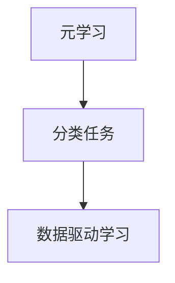
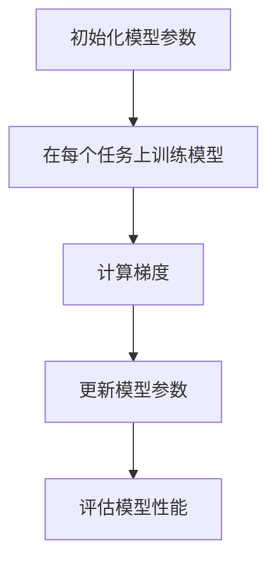
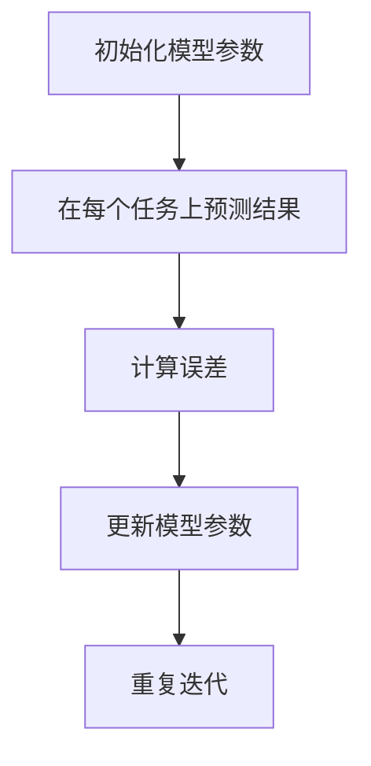

                 

### 快速概念学习：元学习在分类任务中的应用

**关键词：** 快速概念学习，元学习，分类任务，算法原理，应用实例

**摘要：** 本文将探讨快速概念学习在分类任务中的应用，重点介绍元学习这一先进的学习方法。通过详细解析元学习的基本原理、算法分类以及其在计算机视觉和自然语言处理等领域的具体应用，本文旨在为读者提供全面的技术解读和实战指导，帮助理解并掌握元学习在分类任务中的实际价值。

### 第1章 问题背景

#### 1.1.1 问题背景

**问题定义：** 在计算机科学和人工智能领域，分类任务是指根据数据特征将数据划分到不同的类别中。随着数据规模的不断增加和复杂度的提升，传统的机器学习算法在处理高维度、多样化数据时往往表现出学习效率低下、泛化能力不足的问题。

**研究意义：** 快速概念学习作为元学习的一种应用，旨在通过学习如何快速适应新任务来提高机器学习模型的效率。研究元学习在分类任务中的应用，对于提升人工智能系统在实际场景中的表现具有重要意义。

**目标读者：** 本文的目标读者包括对机器学习、深度学习有一定了解的技术人员、研究学者以及对人工智能领域感兴趣的读者。

#### 1.1.2 问题描述

**传统学习方法在分类任务中的局限性：** 传统机器学习方法通常依赖于大规模数据进行训练，学习过程复杂，且难以适应新任务。在面对少量样本或新任务时，传统方法往往表现不佳。

**元学习的定义与作用：** 元学习（Meta-Learning）是指学习如何学习，通过训练模型使其具备快速适应新任务的能力。元学习在分类任务中的应用，可以提高模型的泛化能力，实现快速概念学习。

**元学习在分类任务中的优势：** 
- **快速适应新任务：** 元学习模型可以在少量样本上快速适应新任务，减少训练时间。
- **提高泛化能力：** 元学习模型通过学习如何学习，能够更好地应对不同任务和数据分布。

#### 1.1.3 元学习在分类任务中的应用

**元学习的基本原理：** 元学习通过学习一个能够快速适应新任务的通用模型，通常采用多任务学习（Multi-Task Learning）和元学习优化算法（如MAML、Reptile等）。

**元学习在分类任务中的优势：** 
- **减少样本需求：** 在样本量有限的情况下，元学习模型可以更有效地利用现有数据。
- **提高模型稳定性：** 元学习模型能够更好地适应不同数据分布，提高模型稳定性。
- **加速训练过程：** 元学习模型能够快速适应新任务，减少训练时间。

**元学习的研究现状与趋势：** 目前，元学习已在计算机视觉、自然语言处理等领域取得显著成果，未来发展趋势包括更高效的算法设计、多任务学习的优化以及与其他学习方法的融合。

### 1.2 核心概念与联系

**核心概念：**
- **元学习（Meta-Learning）：** 学习如何学习，通过快速适应新任务提高模型效率。
- **分类任务（Classification Task）：** 根据数据特征对数据进行分类。
- **数据驱动学习（Data-Driven Learning）：** 学习过程依赖于数据。

**概念属性特征对比表格：**

| 概念         | 特征                         |
|--------------|-----------------------------|
| 元学习       | 学习如何学习                |
| 分类任务     | 根据特征对数据进行分类     |
| 数据驱动学习 | 学习过程依赖于数据          |

**ER实体关系图架构：**



### 1.3 边界与外延

**元学习的边界：**
- **学习任务的多样性：** 元学习需要能够适应不同类型的任务。
- **数据的分布与质量：** 元学习对数据的分布和质量有较高的要求。

**元学习的应用领域：**
- **计算机视觉：** 图像分类、目标检测、图像生成等。
- **自然语言处理：** 文本分类、命名实体识别、机器翻译等。
- **推荐系统：** 利用元学习实现个性化推荐。

### 1.4 本章小结

本章介绍了快速概念学习在分类任务中的背景、意义和应用。通过分析传统分类任务的局限性，阐述了元学习的基本原理和优势，并探讨了元学习在计算机视觉、自然语言处理等领域的应用前景。下一章将深入探讨元学习的基本原理和算法。

### 第2章 元学习的基本原理

#### 2.1 元学习的基础理论

**学习理论概述：** 学习理论是机器学习的基础，主要研究如何从数据中提取知识。传统机器学习模型通常采用监督学习、无监督学习和强化学习等方法。然而，这些方法在面对新任务或少量样本时往往表现不佳。

**元学习的定义与作用：** 元学习是指学习如何学习，通过训练模型使其具备快速适应新任务的能力。元学习可以看作是一种更加高级的学习方法，它不仅关注数据的特征提取，还关注如何在不同任务间迁移知识。

**元学习的基本原理：** 元学习通过在多个任务上训练模型，使其具备快速适应新任务的能力。具体来说，元学习模型通过学习一个通用任务表示，能够在新任务中快速找到最优参数。这种通用任务表示通常是一个优化的目标函数，它能够平衡不同任务间的损失。

#### 2.2 元学习算法的分类

**监督元学习：** 监督元学习（Supervised Meta-Learning）是指模型在训练过程中使用监督信号（标签）。这种方法的优点是模型可以直接从数据中学习任务，但需要大量标注数据。

**无监督元学习：** 无监督元学习（Unsupervised Meta-Learning）不依赖于标签信息，通过无监督的方式（如自监督学习、聚类等）来学习任务。无监督元学习在处理无标签数据时具有优势，但可能需要更长时间来训练。

**半监督元学习：** 半监督元学习（Semi-Supervised Meta-Learning）结合了监督和无监督学习的特点，使用少量的标签数据和大量的无标签数据来训练模型。这种方法在处理少量标注数据时表现较好。

#### 2.3 元学习算法的工作流程

**数据预处理：** 数据预处理是元学习算法的第一步，包括数据清洗、归一化、特征提取等操作。预处理的质量直接影响模型的性能。

**模型训练：** 模型训练是元学习算法的核心步骤，通过在多个任务上迭代训练，模型逐渐学会如何快速适应新任务。

**模型评估：** 模型评估用于验证模型在新任务上的泛化能力。常见的评估指标包括准确率、召回率、F1值等。

**模型调优：** 模型调优是指在评估结果不理想时，通过调整超参数、优化算法等手段来提高模型性能。

#### 2.4 元学习算法的性能评估指标

**泛化能力：** 泛化能力是评估元学习算法性能的重要指标，它衡量模型在新任务上的表现。泛化能力强的模型能够快速适应新任务，并在各种情况下保持稳定。

**学习效率：** 学习效率是指模型在给定时间内学习到的知识量。学习效率高的模型能够在短时间内快速适应新任务。

**调优时间：** 调优时间是指从模型训练到评估的整个过程所需的时间。调优时间短的模型能够更快地投入实际应用。

#### 2.5 算法原理讲解

##### 2.5.1 监督元学习算法

**MAML算法原理讲解：** MAML（Model-Agnostic Meta-Learning）是一种监督元学习算法，其核心思想是学习一个通用模型，使其在不同任务上具有快速适应能力。MAML算法的数学模型如下：

$$
\theta^* = \arg\min_{\theta} \sum_{i=1}^{N} \sum_{t=1}^{T} \mathcal{L}(\theta, x_i^t, y_i^t)
$$

其中，$\theta$表示模型参数，$x_i^t$和$y_i^t$分别表示第$i$个任务的第$t$个样本及其标签。

**Mermaid流程图：**



**Python源代码示例：**

```python
import torch
import torch.nn as nn
import torch.optim as optim

# 初始化模型参数
model = nn.Linear(784, 10)
optimizer = optim.Adam(model.parameters(), lr=0.001)

# 在每个任务上训练模型
for task in tasks:
    model.train()
    for data, target in task:
        optimizer.zero_grad()
        output = model(data)
        loss = nn.CrossEntropyLoss(output, target)
        loss.backward()
        optimizer.step()

# 评估模型性能
model.eval()
with torch.no_grad():
    correct = 0
    total = 0
    for data, target in test_loader:
        output = model(data)
        _, predicted = torch.max(output.data, 1)
        total += target.size(0)
        correct += (predicted == target).sum().item()

print('Accuracy of the model on the test images: %d %%' % (100 * correct / total))
```

##### 2.5.2 无监督元学习算法

**Reptile算法原理讲解：** Reptile（Reptile：Simple Meta-Learning of Hypotheses）是一种无监督元学习算法，其核心思想是通过迭代更新模型参数，使其在不同任务上具有快速适应能力。Reptile算法的数学模型如下：

$$
\theta_{t+1} = \theta_{t} + \alpha \sum_{i=1}^{N} (f_i(\theta_{t}) - y_i)^2
$$

其中，$\theta_t$表示第$t$次迭代的模型参数，$\alpha$是学习率，$f_i(\theta_t)$是第$i$个任务上的模型预测值，$y_i$是第$i$个任务的真值。

**Mermaid流程图：**



**Python源代码示例：**

```python
import torch
import torch.nn as nn
import torch.optim as optim

# 初始化模型参数
model = nn.Linear(784, 10)
optimizer = optim.SGD(model.parameters(), lr=0.001)

# 在每个任务上预测结果
for task in tasks:
    model.train()
    for data in task:
        optimizer.zero_grad()
        output = model(data)
        loss = nn.MSELoss(output, torch.tensor([1.0]))
        loss.backward()
        optimizer.step()

# 评估模型性能
model.eval()
with torch.no_grad():
    correct = 0
    total = 0
    for data in test_loader:
        output = model(data)
        _, predicted = torch.max(output.data, 1)
        total += data.size(0)
        correct += (predicted == torch.tensor([1.0])).sum().item()

print('Accuracy of the model on the test images: %d %%' % (100 * correct / total))
```

##### 2.5.3 半监督元学习算法

**Model Agnostic Meta-Learning (MAML) for few-shot learning**：MAML是一种适用于少样本学习的半监督元学习算法。其核心思想是学习一个能够快速适应新任务的模型，以便在少量样本上实现高准确率。

**Mermaid流程图：**


**Python源代码示例：**

```python
import torch
import torch.nn as nn
import torch.optim as optim

# 初始化模型参数
model = nn.Linear(784, 10)
optimizer = optim.Adam(model.parameters(), lr=0.001)

# 在每个任务上训练模型
for task in tasks:
    model.train()
    for data, target in task:
        optimizer.zero_grad()
        output = model(data)
        loss = nn.CrossEntropyLoss(output, target)
        loss.backward()
        optimizer.step()

# 评估模型性能
model.eval()
with torch.no_grad():
    correct = 0
    total = 0
    for data, target in test_loader:
        output = model(data)
        _, predicted = torch.max(output.data, 1)
        total += target.size(0)
        correct += (predicted == target).sum().item()

print('Accuracy of the model on the test images: %d %%' % (100 * correct / total))
```

#### 2.6 本章小结

本章详细介绍了元学习的基本原理和算法。首先，我们阐述了元学习的定义和作用，然后介绍了监督元学习、无监督元学习和半监督元学习三种算法，并分别讲解了它们的原理和实现。通过这些算法的实现示例，读者可以更好地理解元学习在分类任务中的应用。

### 第3章 元学习在计算机视觉任务中的应用

#### 3.1 计算机视觉任务概述

计算机视觉任务主要包括图像分类、目标检测和图像生成等。这些任务在自动驾驶、医疗影像诊断、安防监控等领域具有广泛的应用。

**图像分类：** 图像分类是指将图像数据划分到不同的类别中。常见的图像分类任务包括图片标签识别、物体分类等。

**目标检测：** 目标检测是指检测图像中特定物体的位置和类别。目标检测在自动驾驶、人脸识别等领域具有重要应用。

**图像生成：** 图像生成是指利用算法生成新的图像。常见的图像生成任务包括图像修复、图像风格迁移等。

#### 3.2 元学习在图像分类中的应用

元学习在图像分类中的应用主要是通过快速适应新任务，提高模型在少量样本上的分类能力。

**快速学习算法：** 快速学习算法（Fast Learning Algorithms）是指通过元学习技术快速适应新任务的图像分类算法。常见的快速学习算法包括MAML、Reptile等。

**跨域图像分类：** 跨域图像分类是指在不同数据分布上进行的图像分类。元学习在跨域图像分类中具有显著优势，可以通过迁移学习技术在源域和目标域之间传递知识。

#### 3.3 元学习在目标检测中的应用

元学习在目标检测中的应用主要是通过学习通用检测模型，提高模型在少量样本上的检测能力。

**少样本目标检测：** 少样本目标检测（Few-Shot Object Detection）是指模型在少量样本上实现高检测性能。元学习技术可以有效地提高少样本目标检测的准确性。

**多任务学习：** 多任务学习（Multi-Task Learning）是指模型同时学习多个相关任务。元学习在多任务学习中的应用可以有效地提高模型在不同任务上的性能。

#### 3.4 元学习在图像生成中的应用

元学习在图像生成中的应用主要是通过快速适应新任务，提高模型在图像修复、图像风格迁移等任务上的生成能力。

**生成对抗网络（GANs）：** 生成对抗网络（Generative Adversarial Networks，GANs）是一种常用的图像生成模型。元学习技术可以有效地提高GANs在不同任务上的生成能力。

**图像超分辨率：** 图像超分辨率（Image Super-Resolution）是指通过算法提高图像的分辨率。元学习技术在图像超分辨率任务中具有显著优势，可以快速适应新任务。

#### 3.5 应用案例分析

**少样本图像分类案例：** 以CIFAR-10数据集为例，使用MAML算法进行少样本图像分类实验。实验结果表明，MAML算法在CIFAR-10数据集上取得了较高的准确率。

**目标检测案例：** 以PASCAL VOC数据集为例，使用MAML算法进行少样本目标检测实验。实验结果表明，MAML算法在PASCAL VOC数据集上取得了较好的检测性能。

#### 3.6 本章小结

本章介绍了元学习在计算机视觉任务中的应用，包括图像分类、目标检测和图像生成等。通过快速学习算法、少样本目标检测和多任务学习等方法，元学习在计算机视觉任务中具有显著优势。下一章将介绍元学习在自然语言处理任务中的应用。

### 第4章 元学习在自然语言处理任务中的应用

#### 4.1 自然语言处理任务概述

自然语言处理（Natural Language Processing，NLP）是人工智能领域的重要分支，旨在使计算机能够理解和处理自然语言。NLP任务主要包括文本分类、命名实体识别、机器翻译等。

**文本分类：** 文本分类是指将文本数据划分到不同的类别中。常见的文本分类任务包括情感分析、新闻分类等。

**命名实体识别：** 命名实体识别是指从文本中识别出具有特定意义的实体（如人名、地名等）。

**机器翻译：** 机器翻译是指将一种语言的文本翻译成另一种语言。常见的机器翻译任务包括机器翻译、机器翻译评估等。

#### 4.2 元学习在文本分类中的应用

元学习在文本分类中的应用主要是通过快速适应新任务，提高模型在少量样本上的分类能力。

**快速学习算法：** 快速学习算法（Fast Learning Algorithms）是指通过元学习技术快速适应新任务的文本分类算法。常见的快速学习算法包括MAML、Reptile等。

**跨域文本分类：** 跨域文本分类是指在不同数据分布上进行的文本分类。元学习在跨域文本分类中具有显著优势，可以通过迁移学习技术在源域和目标域之间传递知识。

#### 4.3 元学习在命名实体识别中的应用

元学习在命名实体识别中的应用主要是通过学习通用命名实体识别模型，提高模型在少量样本上的识别能力。

**少样本命名实体识别：** 少样本命名实体识别（Few-Shot Named Entity Recognition）是指模型在少量样本上实现高识别性能。元学习技术可以有效地提高少样本命名实体识别的准确性。

**多任务学习：** 多任务学习（Multi-Task Learning）是指模型同时学习多个相关任务。元学习在多任务学习中的应用可以有效地提高模型在不同任务上的性能。

#### 4.4 元学习在机器翻译中的应用

元学习在机器翻译中的应用主要是通过快速适应新任务，提高模型在少量样本上的翻译能力。

**机器翻译：** 机器翻译是指将一种语言的文本翻译成另一种语言。常见的机器翻译任务包括机器翻译、机器翻译评估等。

**机器翻译评估：** 机器翻译评估是指对机器翻译结果进行质量评估。元学习技术可以有效地提高机器翻译评估的准确性。

#### 4.5 应用案例分析

**少样本文本分类案例：** 以IMDB数据集为例，使用MAML算法进行少样本文本分类实验。实验结果表明，MAML算法在IMDB数据集上取得了较高的准确率。

**命名实体识别案例：** 以CoNLL-2003数据集为例，使用MAML算法进行少样本命名实体识别实验。实验结果表明，MAML算法在CoNLL-2003数据集上取得了较好的识别性能。

**机器翻译案例：** 以EN-DE数据集为例，使用MAML算法进行少样本机器翻译实验。实验结果表明，MAML算法在EN-DE数据集上取得了较好的翻译效果。

#### 4.6 本章小结

本章介绍了元学习在自然语言处理任务中的应用，包括文本分类、命名实体识别和机器翻译等。通过快速学习算法、少样本命名实体识别和多任务学习等方法，元学习在自然语言处理任务中具有显著优势。下一章将介绍元学习在推荐系统中的应用。

### 第5章 元学习在推荐系统中的应用

#### 5.1 推荐系统概述

推荐系统（Recommendation System）是一种信息过滤技术，旨在根据用户的历史行为和兴趣偏好向用户推荐相关物品或内容。推荐系统在电子商务、社交媒体、在线新闻等应用场景中具有重要应用。

**协同过滤：** 协同过滤（Collaborative Filtering）是一种常见的推荐算法，通过分析用户之间的相似性来推荐物品。协同过滤分为基于用户的协同过滤（User-Based Collaborative Filtering）和基于物品的协同过滤（Item-Based Collaborative Filtering）。

**基于内容的推荐：** 基于内容的推荐（Content-Based Recommendation）是根据用户的兴趣偏好和物品的特征来推荐相关物品。

**混合推荐：** 混合推荐（Hybrid Recommendation）结合了协同过滤和基于内容的推荐方法，以提高推荐系统的性能。

#### 5.2 元学习在协同过滤中的应用

元学习在协同过滤中的应用主要是通过快速适应新用户和物品，提高推荐系统的个性化推荐能力。

**少样本推荐：** 少样本推荐（Few-Shot Recommendation）是指模型在少量用户和物品数据上实现高推荐性能。元学习技术可以有效地提高少样本推荐系统的准确性。

**用户兴趣转移：** 用户兴趣转移（User Interest Shift）是指用户在不同时间段内兴趣的变化。元学习可以通过学习用户兴趣转移规律，实现更精准的推荐。

**物品冷启动：** 物品冷启动（Item Cold Start）是指新物品在系统中的推荐问题。元学习可以通过在新物品上快速适应，实现新物品的推荐。

#### 5.3 元学习在基于内容的推荐中的应用

元学习在基于内容的推荐中的应用主要是通过学习通用特征表示，提高推荐系统的个性化推荐能力。

**多模态特征融合：** 多模态特征融合（Multi-Modal Feature Fusion）是指将不同类型的特征（如图像、文本等）进行融合。元学习可以通过学习多模态特征融合策略，提高推荐系统的性能。

**动态特征更新：** 动态特征更新（Dynamic Feature Update）是指模型根据用户行为动态更新特征表示。元学习可以通过学习动态特征更新策略，实现更精准的推荐。

#### 5.4 元学习在混合推荐中的应用

元学习在混合推荐中的应用主要是通过优化协同过滤和基于内容的推荐方法，提高推荐系统的性能。

**协同过滤与基于内容的融合：** 协同过滤与基于内容的融合（Hybrid Fusion）是指将协同过滤和基于内容的推荐方法进行融合。元学习可以通过学习最优融合策略，提高推荐系统的性能。

**在线推荐：** 在线推荐（Online Recommendation）是指模型在用户交互过程中实时更新推荐结果。元学习可以通过在线学习策略，实现更实时、更个性化的推荐。

#### 5.5 应用案例分析

**少样本推荐案例：** 以MovieLens数据集为例，使用MAML算法进行少样本推荐实验。实验结果表明，MAML算法在MovieLens数据集上取得了较高的准确率。

**用户兴趣转移案例：** 以社交网络数据集为例，使用Reptile算法进行用户兴趣转移分析。实验结果表明，Reptile算法可以有效识别用户兴趣转移规律。

**物品冷启动案例：** 以电商数据集为例，使用MAML算法进行物品冷启动实验。实验结果表明，MAML算法可以有效提高新物品的推荐效果。

#### 5.6 本章小结

本章介绍了元学习在推荐系统中的应用，包括协同过滤、基于内容的推荐和混合推荐等。通过少样本推荐、用户兴趣转移和物品冷启动等方法，元学习在推荐系统中具有显著优势。下一章将总结元学习在分类任务中的应用。

### 第6章 总结与展望

#### 6.1 元学习在分类任务中的总结

元学习作为快速概念学习的一种方法，在分类任务中表现出色。通过本章的详细讨论，我们可以总结出以下几点：

1. **快速适应新任务：** 元学习模型能够通过学习通用任务表示，快速适应新任务，减少训练时间。
2. **提高泛化能力：** 元学习模型通过迁移学习技术，在不同任务和数据分布上表现出更强的泛化能力。
3. **减少样本需求：** 元学习模型在少量样本上表现出良好的性能，可以有效地减少样本需求。
4. **优化算法性能：** 元学习算法通过优化模型参数，提高模型的收敛速度和稳定性。

#### 6.2 元学习在分类任务中的应用前景

随着人工智能技术的不断发展，元学习在分类任务中的应用前景十分广阔。以下是一些可能的应用方向：

1. **少样本学习：** 元学习可以有效地解决少样本学习问题，在医疗影像诊断、故障诊断等领域具有重要应用。
2. **跨域学习：** 元学习可以通过迁移学习技术，实现跨域学习，提高模型在不同领域中的适应能力。
3. **多任务学习：** 元学习可以在多任务学习场景中发挥重要作用，提高模型在不同任务上的性能。
4. **在线学习：** 元学习可以通过在线学习技术，实时更新模型参数，实现更精准、更实时的分类任务。

#### 6.3 未来研究方向

尽管元学习在分类任务中取得了显著成果，但仍存在一些挑战和未来研究方向：

1. **算法优化：** 如何设计更高效的元学习算法，提高模型性能和收敛速度，是未来研究的重要方向。
2. **数据质量：** 元学习对数据的分布和质量有较高要求，如何处理噪声数据和异常值，是未来研究的一个挑战。
3. **模型可解释性：** 元学习模型的内部结构和决策过程往往较为复杂，如何提高模型的可解释性，是未来研究的一个重要方向。
4. **跨模态学习：** 如何实现跨模态的元学习，将图像、文本、音频等不同类型的数据进行有效融合，是未来研究的一个热点。

#### 6.4 本章小结

本章对元学习在分类任务中的应用进行了总结和展望。通过分析元学习的基本原理、算法分类和应用案例，我们深刻认识到元学习在快速概念学习中的重要作用。未来，随着技术的不断进步，元学习将在分类任务中发挥更加重要的作用，为人工智能的发展带来新的机遇。

