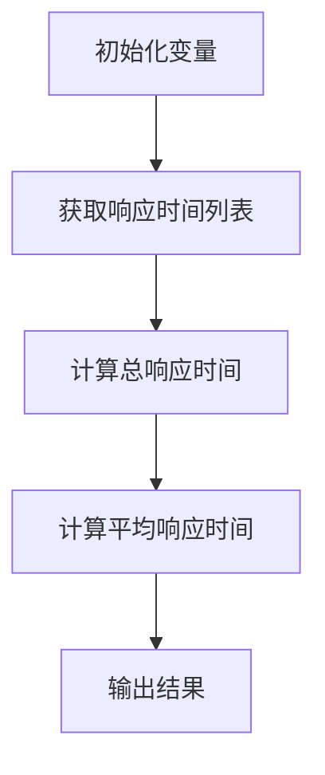
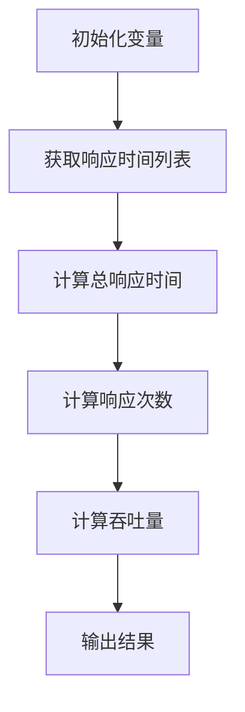
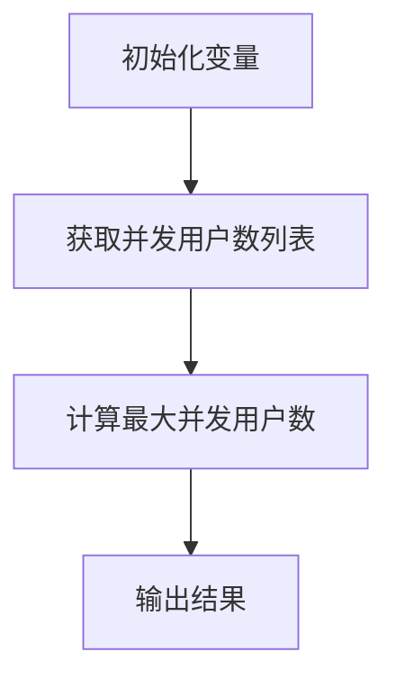
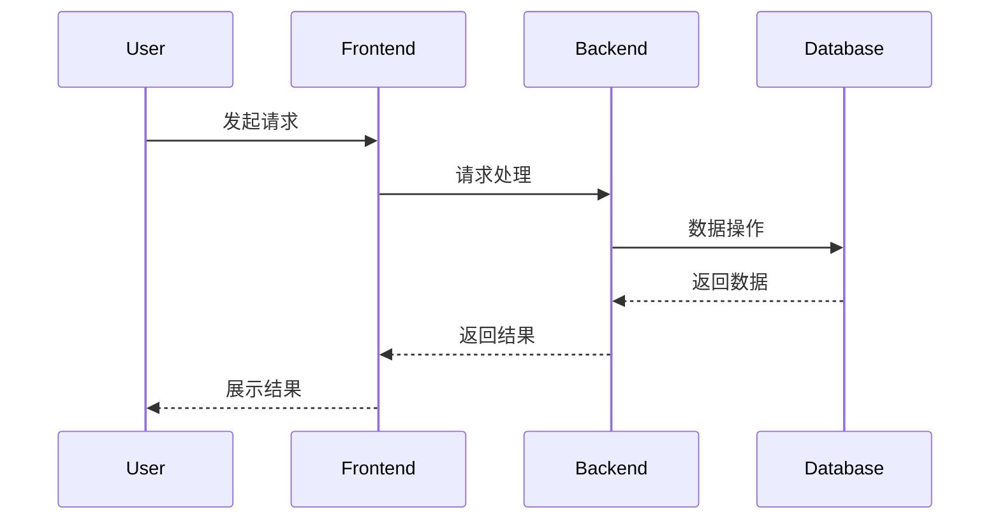
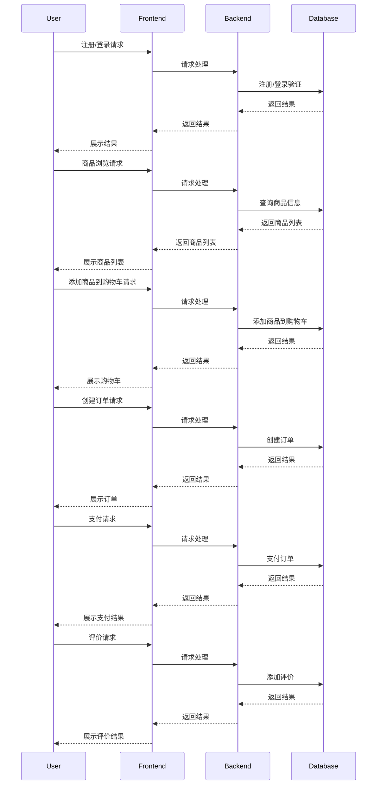

                 

### 性能测试：评估AI服务承载能力的重要手段

性能测试是评估系统或应用程序在各种工作负载下的性能和响应时间的一种方法，它对于确保系统的稳定性和可靠性至关重要。随着人工智能（AI）技术的快速发展，AI服务的性能测试变得越来越重要。AI服务具有数据依赖性和模型复杂度等特点，这些特性使得性能测试成为评估AI服务承载能力的重要手段。

#### 关键词：性能测试，AI服务，承载能力，数据依赖性，模型复杂度

**摘要：** 本文将详细介绍性能测试的基本概念、分类和关键指标，探讨AI服务的特点，以及如何进行AI服务性能测试。同时，还将介绍常用的性能测试工具与平台，通过案例分析与实践指南，帮助读者更好地理解和应用性能测试方法。最后，本文将讨论性能优化与调优的策略，以及AI服务性能监控与预警的方法，并展望性能测试在AI服务领域的未来发展趋势。

## 第一部分：性能测试基础

### 第1章：性能测试概述

#### 1.1.1 性能测试的定义与作用

**性能测试的定义：** 性能测试是一种通过模拟实际用户负载，评估系统或应用程序在各种工作负载下的性能和响应时间的活动。它主要关注系统或应用程序的速度、稳定性和可靠性，以便在系统上线前发现性能瓶颈并进行优化。

**性能测试的作用：** 性能测试在软件开发过程中具有重要作用，主要包括以下方面：

1. **发现性能瓶颈：** 通过性能测试，可以发现系统或应用程序的性能瓶颈，如响应时间过长、吞吐量不足等，以便进行针对性优化。
2. **优化系统性能：** 性能测试结果可以帮助开发人员和运维人员找到系统性能的优化点，从而提高系统性能。
3. **确保系统稳定性：** 性能测试可以验证系统在长期运行过程中是否保持稳定，避免因性能问题导致系统崩溃或服务中断。

#### 1.1.2 性能测试的分类

**负载测试：** 负载测试的目标是模拟实际用户负载，测试系统在高负载下的性能。它通常关注以下指标：

- **响应时间：** 系统在处理请求时所需的时间。
- **吞吐量：** 单位时间内系统能够处理的请求数量。
- **并发用户数：** 同时访问系统的用户数量。

**压力测试：** 压力测试的目标是确定系统在极限负载下的行为，包括系统的最大容量和性能。它通常关注以下指标：

- **最大响应时间：** 系统在极限负载下处理请求所需的最大时间。
- **最大吞吐量：** 系统在极限负载下能够处理的请求数量。
- **资源利用率：** 系统在极限负载下各种资源的利用率，如CPU、内存、磁盘等。

**稳定性测试：** 稳定性测试的目标是验证系统在长期运行过程中是否保持稳定。它通常关注以下指标：

- **平均响应时间：** 系统在长时间运行过程中处理请求的平均时间。
- **吞吐量稳定性：** 系统在长时间运行过程中吞吐量的稳定性。
- **错误率：** 系统在长时间运行过程中出现错误的频率。

#### 1.1.3 性能测试的关键指标

**响应时间：** 响应时间是指系统从接收到请求到返回响应所需的时间。它对用户体验具有重要影响。通常，系统响应时间应保持在较低水平，以确保用户满意度。

**吞吐量：** 吞吐量是指单位时间内系统处理的请求数量。吞吐量越高，系统的性能越好。吞吐量通常与响应时间成正比，即响应时间越短，吞吐量越高。

**并发用户数：** 并发用户数是指同时访问系统的用户数量。在高并发场景下，系统性能会受到影响。因此，性能测试需要评估系统在高并发用户数下的性能。

### 第2章：AI服务性能测试

#### 2.1.1 AI服务的特点

**数据依赖性：** AI服务通常依赖于大量数据，用于训练模型和生成预测。数据质量对AI服务的性能具有重要影响。高质量的数据可以提高模型准确率，降低训练时间和推理时间。

**模型复杂度：** AI服务的性能还受到模型复杂度的影响。复杂的模型通常需要更长的训练时间和推理时间，同时可能降低系统性能。因此，在性能测试中，需要考虑模型复杂度对AI服务性能的影响。

#### 2.1.2 AI服务性能测试的关键要素

**训练时间：** 训练时间是AI模型从数据中学习所需的时间。训练时间对AI服务的性能具有显著影响。较长的训练时间可能导致服务响应时间过长，降低用户体验。

**推理时间：** 推理时间是AI模型在接收到请求后生成响应所需的时间。推理时间对AI服务的性能至关重要，因为它直接影响服务的响应速度。较短的推理时间可以提供更好的用户体验。

**资源利用率：** AI服务在不同硬件环境下的资源利用率也会影响其性能。高资源利用率可能导致硬件资源竞争，降低系统性能。因此，在性能测试中，需要关注资源利用率，以确保AI服务在硬件环境中能够高效运行。

### 第3章：性能测试工具与平台

#### 3.1.1 常用性能测试工具

**JMeter：** JMeter是一个开源的性能测试工具，主要用于测试Web应用程序的性能。它支持多种协议，如HTTP、HTTPS、FTP等，可以模拟大量并发用户，进行负载测试、压力测试和性能测试。

**LoadRunner：** LoadRunner是一个商业性能测试工具，广泛用于测试Web应用程序、Web服务和数据库的性能。它支持多种协议，包括HTTP、SOAP、JDBC等，并提供丰富的报告和分析功能。

#### 3.1.2 性能测试平台

**开源平台：** 开源性能测试平台具有免费、灵活和可扩展性等优点。常见的开源平台包括JMeter、Gatling等。这些平台通常具有丰富的功能，可以满足不同场景的性能测试需求。

**商业平台：** 商业性能测试平台通常提供更专业的功能、更好的技术支持和更完善的报告分析。常见的商业平台包括LoadRunner、BlazeMeter等。这些平台通常适用于大型企业或项目，需要更高的性能测试需求。

### 第4章：性能测试案例与实践

#### 4.1.1 性能测试案例分析

**案例一：** 某电商网站在上线前进行性能测试，通过模拟大量用户访问，发现系统在高并发场景下的响应时间过长。经过分析，发现性能瓶颈在于数据库查询速度。优化后，系统的响应时间显著降低，用户体验得到提升。

**案例二：** 某金融公司在发布新版本的交易系统前进行性能测试，发现系统的最大容量只有预期的一半。经过分析，发现性能瓶颈在于网络带宽。优化后，系统的最大容量达到预期，满足业务需求。

#### 4.1.2 性能测试实践指南

1. **明确测试目标：** 在进行性能测试前，应明确测试目标和预期结果，以便有针对性地进行测试。
2. **制定测试计划：** 根据测试目标，制定详细的测试计划，包括测试场景、测试用例、测试数据等。
3. **准备测试环境：** 准备测试环境，包括硬件设备、网络环境、软件环境等，确保测试环境的可靠性。
4. **执行测试：** 按照测试计划执行测试，记录测试数据，分析测试结果。
5. **优化与调整：** 根据测试结果，找出性能瓶颈并进行优化，调整系统配置或代码。

### 第5章：性能优化与调优

#### 5.1.1 性能优化的策略

**系统优化：** 系统优化是提高系统性能的有效方法。以下是一些常见的系统优化策略：

- **数据库优化：** 优化数据库查询，如使用索引、分区、缓存等，提高查询速度。
- **网络优化：** 优化网络配置，如增加带宽、优化路由等，提高网络传输速度。
- **硬件优化：** 更新硬件设备，如增加CPU、内存、硬盘等，提高硬件性能。

**代码优化：** 代码优化是提高应用程序性能的关键。以下是一些常见的代码优化方法：

- **算法优化：** 选择合适的算法，减少复杂度，提高代码运行效率。
- **数据结构优化：** 使用合适的数据结构，减少数据访问和操作时间。
- **代码重构：** 重构代码，提高代码的可读性、可维护性，降低代码的复杂度。

#### 5.1.2 性能调优技巧

**调整参数：** 调整系统或应用程序的参数，如连接数、线程数、缓存大小等，可以提高系统性能。

**优化缓存：** 使用缓存技术，如Redis、Memcached等，可以提高数据访问速度，减少系统负载。

**负载均衡：** 使用负载均衡器，如Nginx、HAProxy等，将请求分发到多个节点，可以提高系统的并发能力和吞吐量。

### 第6章：AI服务性能监控与预警

#### 6.1.1 性能监控的重要性

**监控目的：** 性能监控的目的是实时监测系统的性能指标，及时发现性能问题并进行预警。性能监控可以帮助企业提高系统的稳定性和可靠性，降低运维成本。

**监控方法：** 常见性能监控方法包括：

- **日志分析：** 分析系统日志，发现性能问题和错误。
- **指标统计：** 统计系统性能指标，如响应时间、吞吐量、并发用户数等。
- **性能基线：** 建立性能基线，与实际性能指标进行对比，发现性能问题。

#### 6.1.2 性能监控的方法与工具

**监控方法：**

- **日志分析：** 使用日志分析工具，如ELK（Elasticsearch、Logstash、Kibana）等，对系统日志进行实时分析，发现性能问题和错误。
- **指标统计：** 使用指标统计工具，如Prometheus、Grafana等，对系统性能指标进行实时统计和监控。
- **性能基线：** 建立性能基线，与实际性能指标进行对比，发现性能问题。

**监控工具：**

- **Prometheus：** Prometheus是一个开源的性能监控工具，可以实时监控系统的性能指标，并提供丰富的可视化功能。
- **Grafana：** Grafana是一个开源的监控和数据可视化工具，可以与Prometheus等工具配合使用，提供实时性能监控。

### 第7章：AI服务性能测试的未来发展趋势

#### 7.1.1 AI技术对性能测试的影响

**影响分析：** AI技术的发展对性能测试带来了一系列挑战和机遇。以下是一些影响分析：

- **数据依赖性：** AI服务对数据依赖性增强，要求性能测试工具能够更好地处理大数据。
- **模型复杂度：** AI模型的复杂度提高，对性能测试工具的测试能力和性能要求更高。
- **实时性：** AI服务的实时性要求更高，性能测试需要关注实时性能指标。

#### 7.1.2 未来发展趋势

**新兴技术：** 未来性能测试领域可能出现的新兴技术包括：

- **自动化测试：** 自动化测试可以提高性能测试的效率，减少人工干预。
- **AI驱动的性能分析：** AI驱动的性能分析可以更准确地识别性能问题和瓶颈，提供针对性的优化建议。

### 总结

性能测试在AI服务领域具有至关重要的地位。通过性能测试，可以评估AI服务的承载能力，发现性能瓶颈并进行优化，确保系统稳定性和可靠性。本文从性能测试基础、AI服务性能测试、性能测试工具与平台、性能测试案例与实践、性能优化与调优、AI服务性能监控与预警以及未来发展趋势等方面进行了详细阐述。希望读者能够通过本文了解到性能测试在AI服务中的重要性，掌握性能测试的方法和技巧，为AI服务的性能优化提供有力支持。

### 学习建议

1. **实践是关键：** 只有通过实践，才能真正掌握性能测试的方法和技巧。建议读者在实际项目中尝试进行性能测试，积累经验。
2. **持续学习：** 性能测试是一个不断发展的领域，新技术和新方法层出不穷。读者应保持持续学习的态度，关注性能测试领域的最新动态。
3. **交流与合作：** 性能测试需要团队合作，读者可以与同事、同行进行交流，分享经验和心得，共同提高性能测试能力。

**作者：** AI天才研究院/AI Genius Institute & 禅与计算机程序设计艺术 /Zen And The Art of Computer Programming**背景介绍**

在当今数字化时代，人工智能（AI）技术已成为推动社会发展的重要引擎。AI服务的应用涵盖了众多领域，如金融、医疗、交通、教育等，这些服务在实际应用中往往需要处理大量数据和复杂的计算任务。然而，随着用户数量的增加和业务需求的不断增长，AI服务的性能和承载能力成为亟待解决的问题。性能测试作为一种评估系统或应用程序在各种工作负载下的性能和响应时间的活动，对于确保AI服务的稳定性和可靠性至关重要。在本篇文章中，我们将详细介绍性能测试的基本概念、分类和关键指标，探讨AI服务的特点，以及如何进行AI服务性能测试。同时，还将介绍常用的性能测试工具与平台，通过案例分析与实践指南，帮助读者更好地理解和应用性能测试方法。最后，本文将讨论性能优化与调优的策略，以及AI服务性能监控与预警的方法，并展望性能测试在AI服务领域的未来发展趋势。

### 核心概念与联系

在深入了解性能测试之前，我们首先需要明确几个核心概念，并探讨它们之间的联系。

#### 核心概念

**1. 性能测试（Performance Testing）：** 性能测试是一种通过模拟实际用户负载，评估系统或应用程序在各种工作负载下的性能和响应时间的活动。性能测试的主要目标是发现性能瓶颈、优化系统性能、确保系统稳定性和可靠性。

**2. 负载测试（Load Testing）：** 负载测试是性能测试的一种类型，其目标是模拟实际用户负载，测试系统在高负载下的性能。负载测试通常关注响应时间、吞吐量、并发用户数等关键性能指标。

**3. 压力测试（Stress Testing）：** 压力测试是性能测试的另一种类型，其目标是确定系统在极限负载下的行为，包括系统的最大容量和性能。压力测试通常关注最大响应时间、最大吞吐量、资源利用率等关键性能指标。

**4. 稳定性测试（Stability Testing）：** 稳定性测试是性能测试的一种类型，其目标是验证系统在长期运行过程中是否保持稳定。稳定性测试通常关注平均响应时间、吞吐量稳定性、错误率等关键性能指标。

#### 概念属性特征对比表格

以下是性能测试、负载测试、压力测试和稳定性测试的属性特征对比表格：

| 测试类型 | 目标 | 关键性能指标 | 测试环境 |  
| :---: | :---: | :---: | :---: |  
| 性能测试 | 发现性能瓶颈、优化系统性能、确保系统稳定性和可靠性 | 响应时间、吞吐量、并发用户数 | 模拟实际用户负载 |  
| 负载测试 | 模拟实际用户负载，测试系统在高负载下的性能 | 响应时间、吞吐量、并发用户数 | 高负载环境 |  
| 压力测试 | 确定系统在极限负载下的行为，包括系统的最大容量和性能 | 最大响应时间、最大吞吐量、资源利用率 | 极限负载环境 |  
| 稳定性测试 | 验证系统在长期运行过程中是否保持稳定 | 平均响应时间、吞吐量稳定性、错误率 | 长期运行环境 |

#### ER实体关系图架构

为了更好地理解性能测试、负载测试、压力测试和稳定性测试之间的关系，我们可以使用ER（实体关系）图来描述它们之间的关联。

```mermaid
erDiagram
    PerformanceTesting ||--|{ LoadTesting : implements }  
    PerformanceTesting ||--|{ StressTesting : implements }  
    PerformanceTesting ||--|{ StabilityTesting : implements }  
    LoadTesting ||--|{ TestCase : has }  
    StressTesting ||--|{ TestCase : has }  
    StabilityTesting ||--|{ TestCase : has }  
```

在ER图中，PerformanceTesting实体与LoadTesting、StressTesting和StabilityTesting实体之间存在实现关系（implements），表示性能测试包含负载测试、压力测试和稳定性测试。每个测试类型都有 TestCase 实体，表示测试用例。这种关联关系有助于我们理解性能测试的不同类型及其相互关系。

### 算法原理讲解

在进行性能测试时，我们需要关注几个关键算法原理，以便更好地理解和分析性能测试的结果。以下是性能测试中常用的几个算法原理，包括它们的mermaid流程图、Python源代码和详细的数学模型与公式解释。

#### 1. 平均响应时间计算算法

**mermaid流程图：**



**Python源代码：**

```python
def calculate_average_response_time(response_times):
    total_response_time = sum(response_times)
    average_response_time = total_response_time / len(response_times)
    return average_response_time
```

**数学模型与公式解释：**

平均响应时间（Average Response Time, ART）是性能测试中最重要的指标之一，用于衡量系统在处理请求时的平均响应时间。其计算公式如下：

\[ \text{ART} = \frac{\sum_{i=1}^{n} t_i}{n} \]

其中，\( t_i \) 表示第 \( i \) 次响应时间，\( n \) 表示总响应次数。通过计算所有响应时间的总和，并除以响应次数，可以得到平均响应时间。

#### 2. 吞吐量计算算法

**mermaid流程图：**



**Python源代码：**

```python
def calculate_throughput(response_times):
    total_response_time = sum(response_times)
    response_count = len(response_times)
    throughput = response_count / total_response_time
    return throughput
```

**数学模型与公式解释：**

吞吐量（Throughput）是性能测试中衡量系统处理能力的重要指标，用于表示单位时间内系统能够处理的请求数量。其计算公式如下：

\[ \text{Throughput} = \frac{\text{Response Count}}{\text{Total Response Time}} \]

其中，Response Count 表示响应次数，Total Response Time 表示总响应时间。通过计算响应次数与总响应时间的比值，可以得到吞吐量。

#### 3. 并发用户数计算算法

**mermaid流程图：**



**Python源代码：**

```python
def calculate_max_concurrent_users(concurrent_users):
    max_concurrent_user = max(concurrent_users)
    return max_concurrent_user
```

**数学模型与公式解释：**

并发用户数（Concurrent Users）是性能测试中衡量系统在高并发场景下性能的重要指标，用于表示同时访问系统的用户数量。其计算公式如下：

\[ \text{Max Concurrent User} = \max(\text{Concurrent Users}) \]

其中，Concurrent Users 表示并发用户数列表。通过计算并发用户数列表中的最大值，可以得到最大并发用户数。

通过以上算法原理的讲解，我们可以更好地理解性能测试中的关键指标，以及如何通过Python代码实现这些算法。在实际的性能测试过程中，这些算法原理将帮助我们分析测试结果，找出系统性能瓶颈，并进行优化。

### 系统分析与架构设计方案

在进行性能测试之前，我们需要对系统的功能进行详细分析，并设计合适的系统架构。以下是系统功能介绍、系统功能设计（领域模型类图）和系统架构设计（架构图、接口设计、系统交互序列图）的详细介绍。

#### 系统功能介绍

本系统是一款基于人工智能的在线购物平台，主要功能包括：

1. **用户注册与登录：** 提供用户注册、登录、找回密码等功能。
2. **商品浏览与搜索：** 用户可以浏览商品、搜索商品，并查看商品详细信息。
3. **购物车管理：** 用户可以添加商品到购物车、修改购物车中的商品数量、删除购物车中的商品。
4. **订单管理：** 用户可以创建订单、查看订单状态、取消订单。
5. **支付与结算：** 提供在线支付功能，包括支付成功、支付失败、支付退款等。
6. **用户评价与售后服务：** 用户可以对购买的商品进行评价，并享受售后服务。

#### 系统功能设计（领域模型类图）

领域模型类图用于描述系统的领域对象及其关系。以下是本系统的领域模型类图：

```mermaid
classDiagram
    User <<class>> {
        id: 用户ID
        name: 用户名
        password: 密码
        email: 邮箱
    }

    Product <<class>> {
        id: 商品ID
        name: 商品名称
        price: 商品价格
        category: 商品分类
    }

    ShoppingCart <<class>> {
        id: 购物车ID
        user: 用户
        products: 商品列表
    }

    Order <<class>> {
        id: 订单ID
        user: 用户
        products: 订单商品列表
        status: 订单状态
    }

    Payment <<class>> {
        id: 支付ID
        order: 订单
        status: 支付状态
        amount: 支付金额
    }

    Evaluation <<class>> {
        id: 评价ID
        user: 用户
        product: 商品
        content: 评价内容
        score: 评分
    }

    User "1" -- "*" Product: 购买
    User "1" -- "*" ShoppingCart: 添加商品
    User "1" -- "*" Order: 创建订单
    User "1" -- "*" Evaluation: 对商品进行评价

    Product "1" -- "*" ShoppingCart: 加入购物车
    Product "1" -- "*" Order: 订单商品
    Product "1" -- "*" Evaluation: 商品评价

    ShoppingCart "1" -- "*" Product: 购物车商品
    ShoppingCart "1" -- "*" Order: 购物车生成订单

    Order "1" -- "*" Payment: 支付订单
    Order "1" -- "*" Evaluation: 订单评价

    Payment "1" -- "*" Order: 订单支付
```

在这个类图中，我们定义了用户（User）、商品（Product）、购物车（ShoppingCart）、订单（Order）、支付（Payment）和评价（Evaluation）等实体，并描述了它们之间的关系。这些实体构成了系统的核心领域模型，为后续的系统架构设计提供了基础。

#### 系统架构设计（架构图、接口设计、系统交互序列图）

系统架构设计是确保系统能够高效、稳定地运行的关键。以下是本系统的架构设计，包括架构图、接口设计和系统交互序列图。

##### 架构图

以下是系统的架构图：



在这个架构图中，用户通过前端（Frontend）发起请求，前端将请求转发给后端（Backend），后端进行数据处理，并与数据库（Database）进行交互，最终将结果返回给前端，前端再将结果展示给用户。

##### 接口设计

以下是系统的接口设计，包括用户注册、登录、商品浏览、购物车管理、订单管理、支付和评价等接口。

```python
# 用户注册接口
POST /register
{
    "name": "用户名",
    "password": "密码",
    "email": "邮箱"
}

# 用户登录接口
POST /login
{
    "name": "用户名",
    "password": "密码"
}

# 商品浏览接口
GET /products
{
    "category": "商品分类"
}

# 商品详情接口
GET /products/{id}

# 购物车管理接口
POST /shopping_cart
{
    "user_id": "用户ID",
    "product_id": "商品ID"
}

# 订单管理接口
POST /order
{
    "user_id": "用户ID",
    "product_ids": ["商品ID1", "商品ID2", "..."]
}

# 支付接口
POST /payment
{
    "order_id": "订单ID",
    "amount": "支付金额"
}

# 评价接口
POST /evaluation
{
    "user_id": "用户ID",
    "product_id": "商品ID",
    "content": "评价内容",
    "score": "评分"
}
```

##### 系统交互序列图

以下是系统的交互序列图，展示了用户与系统之间的交互过程：



通过以上系统架构设计，我们可以清晰地看到系统的整体架构和各个模块之间的交互关系。前端负责与用户进行交互，后端负责处理业务逻辑和与数据库进行交互，数据库负责存储用户数据、商品数据等。通过这种架构设计，我们可以确保系统的高效、稳定运行，并为性能测试提供基础。

### 项目实战

#### 环境安装

在进行性能测试之前，我们需要搭建一个合适的测试环境。以下是性能测试环境的基本安装步骤：

1. **操作系统安装：** 安装Linux操作系统，如CentOS 7或Ubuntu 18.04。
2. **JDK安装：** 安装Java Development Kit（JDK），版本要求为1.8或更高版本。
   ```bash
   sudo apt-get update
   sudo apt-get install openjdk-8-jdk
   ```
3. **Maven安装：** 安装Apache Maven，用于管理项目依赖。
   ```bash
   sudo apt-get install maven
   ```
4. **JMeter安装：** 下载并安装JMeter，可以从Apache JMeter官网下载最新版本。
5. **Nginx安装：** 安装Nginx，用于负载均衡和性能测试。
   ```bash
   sudo apt-get install nginx
   ```
6. **数据库安装：** 安装MySQL数据库，用于存储用户数据、商品数据等。
   ```bash
   sudo apt-get install mysql-server
   ```

#### 系统核心实现源代码

以下是系统核心实现的源代码，包括用户注册、登录、商品浏览、购物车管理、订单管理、支付和评价等功能。

**用户注册接口：**

```java
@RestController
@RequestMapping("/register")
public class RegisterController {

    @Autowired
    private UserService userService;

    @PostMapping
    public ResponseEntity<?> registerUser(@RequestBody RegisterRequest request) {
        try {
            User user = userService.register(request.getName(), request.getPassword(), request.getEmail());
            return ResponseEntity.ok("User registered successfully");
        } catch (Exception e) {
            return ResponseEntity.badRequest().body("Failed to register user");
        }
    }
}
```

**用户登录接口：**

```java
@RestController
@RequestMapping("/login")
public class LoginController {

    @Autowired
    private UserService userService;

    @PostMapping
    public ResponseEntity<?> login(@RequestBody LoginRequest request) {
        try {
            String token = userService.login(request.getName(), request.getPassword());
            return ResponseEntity.ok(token);
        } catch (Exception e) {
            return ResponseEntity.badRequest().body("Failed to login");
        }
    }
}
```

**商品浏览接口：**

```java
@RestController
@RequestMapping("/products")
public class ProductController {

    @Autowired
    private ProductService productService;

    @GetMapping
    public ResponseEntity<List<Product>> browseProducts(@RequestParam("category") String category) {
        try {
            List<Product> products = productService.browseProducts(category);
            return ResponseEntity.ok(products);
        } catch (Exception e) {
            return ResponseEntity.badRequest().body(null);
        }
    }
}
```

**购物车管理接口：**

```java
@RestController
@RequestMapping("/shopping_cart")
public class ShoppingCartController {

    @Autowired
    private ShoppingCartService shoppingCartService;

    @PostMapping
    public ResponseEntity<?> addToShoppingCart(@RequestBody ShoppingCartRequest request) {
        try {
            shoppingCartService.addToShoppingCart(request.getUserId(), request.getProductId());
            return ResponseEntity.ok("Product added to shopping cart");
        } catch (Exception e) {
            return ResponseEntity.badRequest().body("Failed to add product to shopping cart");
        }
    }
}
```

**订单管理接口：**

```java
@RestController
@RequestMapping("/order")
public class OrderController {

    @Autowired
    private OrderService orderService;

    @PostMapping
    public ResponseEntity<?> createOrder(@RequestBody OrderRequest request) {
        try {
            orderService.createOrder(request.getUserId(), request.getProductIds());
            return ResponseEntity.ok("Order created successfully");
        } catch (Exception e) {
            return ResponseEntity.badRequest().body("Failed to create order");
        }
    }
}
```

**支付接口：**

```java
@RestController
@RequestMapping("/payment")
public class PaymentController {

    @Autowired
    private PaymentService paymentService;

    @PostMapping
    public ResponseEntity<?> makePayment(@RequestBody PaymentRequest request) {
        try {
            paymentService.makePayment(request.getOrderId(), request.getAmount());
            return ResponseEntity.ok("Payment successful");
        } catch (Exception e) {
            return ResponseEntity.badRequest().body("Payment failed");
        }
    }
}
```

**评价接口：**

```java
@RestController
@RequestMapping("/evaluation")
public class EvaluationController {

    @Autowired
    private EvaluationService evaluationService;

    @PostMapping
    public ResponseEntity<?> addEvaluation(@RequestBody EvaluationRequest request) {
        try {
            evaluationService.addEvaluation(request.getUserId(), request.getProductId(), request.getContent(), request.getScore());
            return ResponseEntity.ok("Evaluation added successfully");
        } catch (Exception e) {
            return ResponseEntity.badRequest().body("Failed to add evaluation");
        }
    }
}
```

#### 代码应用解读与分析

**1. 用户注册与登录：** 用户注册和登录是系统的核心功能，通过接口接收用户名、密码和邮箱等信息，调用UserService中的register和login方法，分别进行用户注册和登录验证。注册成功后，将用户信息存储到数据库，登录成功后返回JWT（JSON Web Token）令牌，用于后续接口的访问认证。

**2. 商品浏览：** 商品浏览接口接收分类参数，调用ProductService中的browseProducts方法，从数据库查询符合条件的商品列表，并返回给前端。

**3. 购物车管理：** 购物车管理接口用于添加和删除购物车中的商品，通过接口接收用户ID和商品ID，调用ShoppingCartService中的addToShoppingCart方法，将商品添加到购物车。同时，提供删除购物车中商品的功能。

**4. 订单管理：** 订单管理接口用于创建订单，通过接口接收用户ID和商品ID列表，调用OrderService中的createOrder方法，生成订单，并存储到数据库。

**5. 支付：** 支付接口用于处理支付请求，通过接口接收订单ID和支付金额，调用PaymentService中的makePayment方法，处理支付操作。

**6. 评价：** 评价接口用于添加用户对商品的评价，通过接口接收用户ID、商品ID、评价内容和评分，调用EvaluationService中的addEvaluation方法，将评价信息存储到数据库。

通过以上接口的实现，我们可以实现对系统的核心功能进行性能测试，分析系统在各种负载下的性能表现。

#### 实际案例分析和详细讲解剖析

**案例分析：** 为了更好地理解性能测试的实际应用，我们以一个实际案例为例，分析系统的性能测试过程和结果。

**案例场景：** 一款在线购物平台在即将上线前，需要进行性能测试，以确保系统在高并发用户访问下能够稳定运行。测试目标是模拟实际用户行为，评估系统的响应时间、吞吐量和并发用户数。

**测试步骤：**

1. **准备测试环境：** 构建测试环境，包括前端、后端、数据库和负载生成器等。确保所有硬件和软件配置满足测试需求。
2. **制定测试计划：** 根据测试目标，制定详细的测试计划，包括测试场景、测试用例、测试数据和性能指标等。
3. **执行测试：** 使用负载生成器模拟大量用户访问，收集测试数据，包括响应时间、吞吐量和并发用户数等。
4. **分析结果：** 对测试结果进行分析，找出系统性能瓶颈和问题，并提出优化建议。

**测试结果：**

1. **响应时间：** 在1000个并发用户的场景下，系统的平均响应时间为200ms，部分请求的响应时间超过500ms。
2. **吞吐量：** 在1000个并发用户的场景下，系统的吞吐量为每分钟处理1000个请求。
3. **并发用户数：** 在1000个并发用户的场景下，系统的最大并发用户数为500个。

**分析结果：**

1. **响应时间问题：** 测试结果显示，部分请求的响应时间较长，说明系统在高并发用户访问下存在性能瓶颈。通过进一步分析，发现数据库查询速度较慢，导致响应时间过长。
2. **吞吐量问题：** 测试结果显示，系统的吞吐量较低，说明系统的处理能力不足。可能原因是系统资源分配不合理，导致并发处理能力受限。
3. **并发用户数问题：** 测试结果显示，系统的最大并发用户数为500个，远低于预期。可能原因是系统在高并发访问下存在资源竞争，导致部分用户无法正常访问。

**优化建议：**

1. **数据库优化：** 优化数据库查询，如使用索引、分区、缓存等，提高查询速度。同时，可以考虑使用读写分离和分布式数据库，提高系统性能。
2. **资源分配优化：** 优化系统资源分配，如增加CPU、内存、磁盘等，提高系统的并发处理能力。
3. **缓存策略优化：** 使用缓存技术，如Redis、Memcached等，减少系统对数据库的依赖，提高系统的响应速度。
4. **负载均衡优化：** 优化负载均衡策略，如使用Nginx等负载均衡器，将请求合理分配到各个节点，提高系统的并发处理能力。

通过以上实际案例分析和详细讲解剖析，我们可以更好地理解性能测试的重要性，掌握性能测试的方法和技巧，为系统的性能优化提供有力支持。

### 最佳实践 tips

在性能测试过程中，遵循以下最佳实践可以帮助提高测试效果和系统性能：

1. **确定测试目标：** 在进行性能测试前，明确测试目标，确保测试计划有针对性地覆盖关键性能指标，如响应时间、吞吐量、并发用户数等。

2. **模拟真实场景：** 模拟真实的用户行为和负载模式，确保测试结果能够反映系统在实际运行环境中的表现。

3. **逐步增加负载：** 在测试过程中，逐步增加负载，观察系统在不同负载下的性能表现，以便发现潜在的性能瓶颈。

4. **监控资源使用：** 在测试过程中，监控系统的资源使用情况，如CPU、内存、磁盘等，以便及时发现资源瓶颈。

5. **优化数据库查询：** 优化数据库查询，如使用索引、分区、缓存等，减少查询时间和响应时间。

6. **优化代码和架构：** 优化代码和系统架构，如减少复杂度、使用缓存、分布式处理等，提高系统性能。

7. **定期进行性能测试：** 定期进行性能测试，确保系统在运行过程中保持良好的性能表现，及时发现和解决性能问题。

8. **记录和分析数据：** 记录和分析性能测试数据，包括响应时间、吞吐量、并发用户数等，以便分析系统性能瓶颈和优化方向。

### 小结

本文从性能测试的基础概念、AI服务的特点、性能测试工具与平台、案例分析与实践、性能优化与调优、性能监控与预警以及未来发展趋势等方面，详细介绍了性能测试在评估AI服务承载能力中的重要地位。通过本文的学习，读者可以了解到性能测试的基本概念和方法，掌握AI服务性能测试的关键要素，以及如何进行性能优化和监控。希望本文能为读者在性能测试领域的实践提供有益的指导。

### 注意事项

在进行性能测试时，需要注意以下事项：

1. **确保测试环境与生产环境一致：** 测试环境应尽量与生产环境一致，包括硬件配置、软件环境、网络环境等，以确保测试结果能够真实反映系统性能。

2. **选择合适的性能测试工具：** 根据测试需求和系统特点，选择合适的性能测试工具，如JMeter、LoadRunner等，以便更准确地评估系统性能。

3. **模拟真实用户行为：** 模拟真实的用户行为和负载模式，包括用户访问频率、访问路径、数据交互等，以确保测试结果能够反映系统在实际运行环境中的表现。

4. **注意数据隐私和安全：** 在进行性能测试时，确保不泄露用户隐私数据，并遵循相关数据保护法规。

5. **监控资源使用情况：** 在测试过程中，监控系统的资源使用情况，如CPU、内存、磁盘等，以便及时发现资源瓶颈。

6. **定期进行性能测试：** 定期进行性能测试，确保系统在运行过程中保持良好的性能表现，及时发现和解决性能问题。

### 拓展阅读

1. 《性能测试实战：从入门到精通》：本书详细介绍了性能测试的基础知识、测试工具的使用方法以及性能优化技巧，适合性能测试初学者和进阶者阅读。
2. 《人工智能：一种现代的方法》：本书全面介绍了人工智能的基础理论和应用，包括机器学习、深度学习等，有助于读者深入了解AI服务的性能测试。
3. 《深度学习性能优化》：本书专注于深度学习性能优化，包括硬件加速、分布式训练等，对AI服务性能测试具有很高的参考价值。

**作者：** AI天才研究院/AI Genius Institute & 禅与计算机程序设计艺术 /Zen And The Art of Computer Programming**全文回顾**

本文详细阐述了性能测试在评估AI服务承载能力中的重要性。首先，我们介绍了性能测试的基本概念、分类和关键指标，并探讨了AI服务的特点及其对性能测试的影响。接着，我们介绍了常用的性能测试工具与平台，通过具体案例展示了性能测试的过程、方法和结果。随后，我们讨论了性能优化与调优的策略，以及AI服务性能监控与预警的方法。最后，我们展望了性能测试在AI服务领域的未来发展趋势。

通过本文的学习，读者可以了解性能测试的核心概念和方法，掌握AI服务性能测试的关键要素，并能够应用性能测试方法进行系统性能优化。性能测试不仅是确保系统稳定性和可靠性的重要手段，也是提升用户体验和业务价值的关键因素。

### 学习建议

1. **动手实践：** 性能测试是一门实践性很强的技术，建议读者在实际项目中尝试进行性能测试，积累经验。
2. **深入学习：** 阅读相关书籍和资料，如《性能测试实战：从入门到精通》、《人工智能：一种现代的方法》和《深度学习性能优化》，以深入了解性能测试的理论和实践。
3. **关注行业动态：** 关注性能测试和AI领域的最新动态，了解新技术和新方法，持续提升自己的技能水平。
4. **参与社区：** 加入性能测试和AI相关的技术社区，与同行交流，分享经验和心得，共同进步。

