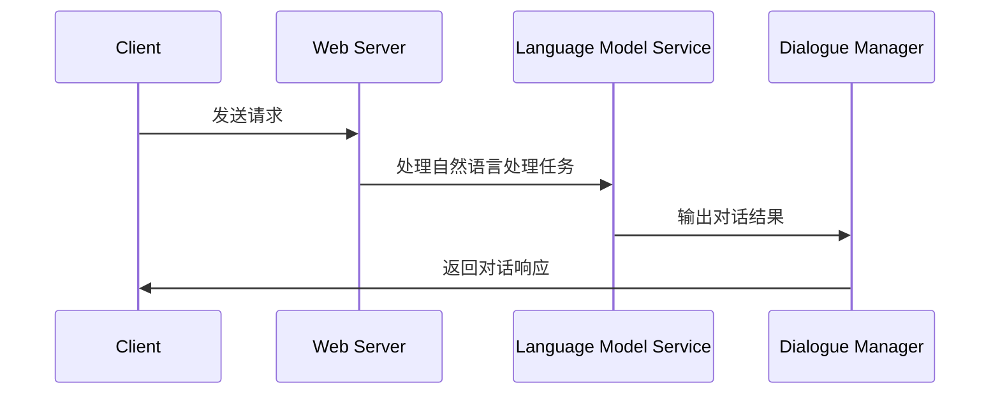
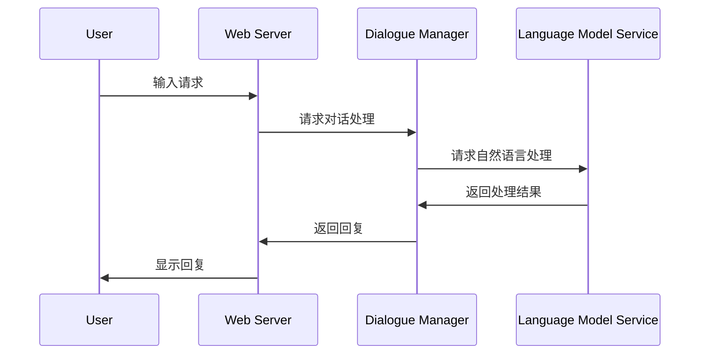

                 

### 情境适应性测试：检验LLM在多变环境中的表现

#### 关键词：情境适应性测试、LLM、多变环境、表现检验

#### 摘要：
本文将探讨情境适应性测试在检验大型语言模型（LLM）在多变环境中的表现的重要性。我们将首先介绍背景知识，包括语言模型的发展与应用以及多变环境对LLM的挑战。接着，我们将详细阐述情境适应性测试的核心概念，包括定义、分类和关键因素。随后，我们将分析语言模型与情境适应性测试之间的关系，并探讨测试环境的设定、数据集的构建与选取以及测试指标的定义与评估。最后，本文将总结全文，并展望未来研究的方向。

----------------------------------------------------------------

# 第一部分：问题背景与核心概念

## 1.1 问题背景

### 1.1.1 语言模型的发展与应用

语言模型（Language Model，简称LM）是自然语言处理（Natural Language Processing，简称NLP）中的一项核心技术。它能够预测一段文字的下一个单词或字符，从而在文本生成、机器翻译、语音识别等应用中发挥重要作用。近年来，随着深度学习技术的快速发展，大型语言模型（Large Language Model，简称LLM）如BERT、GPT、Turing等不断涌现，其性能和表现力得到了显著提升。

语言模型在多个领域得到了广泛应用。例如，在文本生成领域，LLM可以用于自动写作、新闻摘要、对话系统等；在机器翻译领域，LLM可以用于将一种语言翻译成另一种语言，从而实现跨语言信息交流；在语音识别领域，LLM可以用于语音合成和语音识别系统的优化。

### 1.1.2 多变环境对LLM的挑战

尽管LLM在许多领域取得了显著成果，但其应用场景往往是相对静态和理想的。在实际应用中，环境常常是多变和复杂的，这给LLM带来了新的挑战。多变环境可能包括：

- **数据分布的变化**：实际应用中的数据分布可能与训练数据分布存在差异，导致LLM在新数据上的表现不佳。
- **情境变化**：在不同情境下，LLM可能需要生成不同的文本或采取不同的行为，这对模型的情境适应性提出了要求。
- **交互复杂性**：在多模态交互场景中，LLM需要与其他模型或系统协同工作，这对模型的适应性提出了更高的要求。

### 1.1.3 情境适应性测试的重要性

情境适应性测试（Situational Adaptability Test，简称SAT）是一种专门用于评估LLM在多变环境中的表现的技术。其重要性体现在以下几个方面：

- **提高模型应用价值**：通过情境适应性测试，可以评估LLM在不同环境下的性能，从而提高模型在实际应用中的价值。
- **优化模型设计**：情境适应性测试可以帮助研究人员识别LLM在情境适应性方面的不足，从而指导模型设计和优化。
- **确保系统稳定性和可靠性**：在复杂多变的应用场景中，确保LLM的情境适应性对于系统的稳定性和可靠性至关重要。
- **推动AI发展**：情境适应性测试为AI领域提供了一个新的研究方向，有助于推动人工智能技术在多变环境中的应用。

## 1.2 核心概念

### 1.2.1 语言模型（LLM）概述

语言模型是一种基于统计或神经网络的模型，用于预测一段文字的下一个单词或字符。LLM是近年来发展迅速的一种语言模型，其特点包括：

- **大规模**：LLM通常包含数十亿甚至千亿个参数，这使得它们能够捕获语言中的复杂模式和规律。
- **深度学习**：LLM基于深度神经网络，特别是Transformer架构，这使得它们能够处理长距离依赖和复杂语义。
- **多模态**：LLM不仅可以处理文本，还可以处理图像、音频等其他模态的数据，从而实现多模态交互。

### 1.2.2 情境适应性测试的定义

情境适应性测试是一种专门用于评估LLM在多变环境中的表现的技术。它包括以下几个关键组成部分：

- **测试环境**：模拟实际应用场景的环境，包括数据分布、情境变化和交互复杂性等。
- **测试用例**：针对不同环境设计的测试实例，用于评估LLM在不同情境下的表现。
- **评估指标**：用于衡量LLM在测试环境中表现的评价标准，如准确率、召回率、F1分数等。

### 1.2.3 情境适应性测试的分类

根据测试环境的不同，情境适应性测试可以分为以下几类：

- **静态环境测试**：在固定环境下进行的测试，主要用于评估LLM的基本性能。
- **动态环境测试**：在可变环境下进行的测试，主要用于评估LLM的情境适应性。
- **多模态环境测试**：在多模态交互环境下进行的测试，主要用于评估LLM在多模态交互中的表现。

## 1.3 概念联系

### 1.3.1 LLM与情境适应性测试的关系

LLM是情境适应性测试的核心对象，其性能和表现直接影响测试结果。同时，情境适应性测试为LLM的优化和改进提供了有力支持。具体来说：

- **LLM的性能影响**：情境适应性测试可以评估LLM在不同环境下的性能，从而指导模型的优化和改进。
- **情境适应性影响**：情境适应性测试可以帮助研究人员识别LLM在情境适应性方面的不足，从而指导模型设计和优化。

### 1.3.2 情境适应性测试的关键因素

情境适应性测试的关键因素包括：

- **测试环境**：测试环境的设定直接影响到测试结果的准确性和可靠性，需要充分考虑数据分布、情境变化和交互复杂性等因素。
- **测试用例**：测试用例的设计和选取对于评估LLM在特定情境下的表现至关重要，需要覆盖多种情境和场景。
- **评估指标**：评估指标的选择和定义需要与测试环境和测试用例相匹配，从而准确评估LLM在多变环境中的表现。

### 1.3.3 情境适应性测试的应用领域

情境适应性测试广泛应用于多个领域，包括：

- **自然语言处理**：评估LLM在文本生成、机器翻译、语音识别等NLP任务中的表现。
- **智能交互系统**：评估LLM在智能客服、智能助手等交互系统中的情境适应性。
- **多模态系统**：评估LLM在多模态交互系统中的表现，如语音识别与文本生成相结合的系统。

## 1.4 边界与外延

### 1.4.1 测试环境的设定

测试环境的设定需要考虑以下因素：

- **数据分布**：确保测试数据与实际应用场景中的数据分布相匹配。
- **情境变化**：模拟实际应用场景中的情境变化，如对话中的角色切换、话题转换等。
- **交互复杂性**：考虑实际应用场景中的交互复杂性，如多轮对话、多模态交互等。

### 1.4.2 数据集的构建与选取

数据集的构建与选取需要考虑以下因素：

- **多样性**：确保数据集涵盖多种情境和场景，从而充分评估LLM的情境适应性。
- **真实性**：选择真实应用场景中的数据，以提高测试结果的准确性和可靠性。
- **平衡性**：确保数据集的平衡性，避免某一类数据过多或过少，从而影响测试结果的公正性。

### 1.4.3 测试指标的定义与评估

测试指标的定义与评估需要考虑以下因素：

- **准确性**：评估LLM在特定情境下的预测准确性。
- **召回率**：评估LLM在特定情境下的召回率，即能够召回多少实际存在的情境。
- **F1分数**：综合考虑准确性和召回率，评估LLM在特定情境下的综合性能。
- **用户体验**：评估LLM在实际应用场景中的用户体验，如响应速度、交互流畅性等。

## 1.5 本章小结

本部分介绍了情境适应性测试的背景和核心概念，包括语言模型的发展与应用、多变环境对LLM的挑战、情境适应性测试的定义和分类、LLM与情境适应性测试的关系、关键因素、应用领域以及测试环境的设定、数据集的构建与选取、测试指标的定义与评估。这些内容为本章后续部分的分析和讨论提供了基础。

----------------------------------------------------------------

## 2.1 语言模型原理讲解

### 2.1.1 语言模型的工作原理

语言模型是一种能够预测一段文字的下一个单词或字符的模型。在自然语言处理中，语言模型通常用于生成文本、机器翻译、语音识别等任务。语言模型的工作原理主要包括以下几个方面：

- **词嵌入（Word Embedding）**：词嵌入是将单词映射到高维向量空间的技术，通过这种方式，单词在向量空间中的距离可以表示其语义关系。词嵌入可以通过各种算法实现，如Word2Vec、GloVe等。

- **自注意力机制（Self-Attention）**：自注意力机制是一种能够在处理序列数据时关注序列中其他位置信息的机制。在自注意力机制中，每个位置的输出都会受到其他位置的影响，从而能够更好地捕获序列中的长距离依赖关系。

- **Transformer架构（Transformer Architecture）**：Transformer是一种基于自注意力机制的深度神经网络架构，特别适用于处理序列到序列的任务。与传统的循环神经网络（RNN）相比，Transformer能够更高效地处理长距离依赖关系，并且具有更高的并行计算能力。

### 2.1.1.1 词嵌入与变换

词嵌入是将单词映射到高维向量空间的技术，通过这种方式，单词在向量空间中的距离可以表示其语义关系。词嵌入可以通过各种算法实现，如Word2Vec、GloVe等。

- **Word2Vec**：Word2Vec是一种基于神经网络的词嵌入算法，通过训练一个神经网络，将单词映射到高维向量空间。Word2Vec算法包括两个主要变种：Continuous Bag-of-Words (CBOW) 和 Skip-Gram。

  - **CBOW**：CBOW算法通过将当前单词周围的几个单词作为输入，预测当前单词。这种算法的优点是简单易实现，但缺点是容易受到局部信息的影响。
  - **Skip-Gram**：Skip-Gram算法通过将当前单词作为输入，预测周围几个单词。这种算法的优点是能够更好地捕获单词的语义关系，但缺点是需要更大的模型和更长的训练时间。

- **GloVe**：GloVe（Global Vectors for Word Representation）是一种基于全局上下文的词嵌入算法，通过计算单词与其上下文之间的共现关系来学习词向量。GloVe算法的优点是能够更好地捕捉单词的语义关系，缺点是需要较大的计算资源和时间。

### 2.1.1.2 自注意力机制

自注意力机制是一种能够在处理序列数据时关注序列中其他位置信息的机制。在自注意力机制中，每个位置的输出都会受到其他位置的影响，从而能够更好地捕获序列中的长距离依赖关系。

自注意力机制的基本思想是将输入序列映射到一个查询（Query）、键（Key）和值（Value）序列，然后通过计算这些序列之间的相似度来确定每个位置的输出。自注意力机制的实现通常包括以下步骤：

- **计算查询（Query）和键（Key）**：对于输入序列中的每个位置，计算其对应的查询和键。
- **计算相似度**：通过计算查询和键之间的相似度来确定每个位置的输出权重。
- **加权求和**：根据输出权重对值（Value）序列进行加权求和，得到每个位置的输出。

自注意力机制的一个变体是多头注意力（Multi-Head Attention），它通过多个独立的注意力头来捕获不同类型的依赖关系。多头注意力机制能够提高模型的表示能力，从而在多个任务中取得更好的性能。

### 2.1.1.3 Transformer架构详解

Transformer是一种基于自注意力机制的深度神经网络架构，特别适用于处理序列到序列的任务。与传统的循环神经网络（RNN）相比，Transformer能够更高效地处理长距离依赖关系，并且具有更高的并行计算能力。

Transformer架构的核心组成部分包括编码器（Encoder）和解码器（Decoder）。编码器用于处理输入序列，解码器用于生成输出序列。

- **编码器（Encoder）**：编码器由多个自注意力层和全连接层组成。每个自注意力层通过自注意力机制来捕获输入序列中的长距离依赖关系，并通过全连接层来进一步提取特征。编码器的输出通常是一个固定长度的向量，用于表示整个输入序列。

- **解码器（Decoder）**：解码器也由多个自注意力层和全连接层组成。与编码器不同，解码器还包括了一个额外的交叉注意力层，用于将编码器的输出与解码器的当前输出进行交互。交叉注意力层使得解码器能够利用编码器的上下文信息来生成输出序列。解码器的输出通常是一个序列，每个位置的输出都对应于输出序列中的一个单词或字符。

- **多头注意力（Multi-Head Attention）**：多头注意力机制是Transformer架构中的一个关键组件。它通过多个独立的注意力头来捕获不同类型的依赖关系。多头注意力机制能够提高模型的表示能力，从而在多个任务中取得更好的性能。

- **位置编码（Positional Encoding）**：由于自注意力机制不具有位置信息，因此需要通过位置编码来为模型提供位置信息。位置编码是一种将位置信息编码到输入序列中的方法，通常使用正弦和余弦函数来生成。

### 2.1.2 语言模型的数学模型

语言模型的数学模型是构建语言模型的基础，它描述了模型中各个组件的数学关系。在Transformer架构中，语言模型的数学模型主要包括以下几个方面：

- **神经网络结构**：语言模型的神经网络结构由编码器和解码器组成。编码器和解码器都包含多个自注意力层和全连接层，这些层通过逐层叠加的方式来提取和表示输入序列和输出序列的特征。

- **优化算法**：语言模型的优化算法通常采用梯度下降（Gradient Descent）及其变种，如Adam优化器。优化算法通过最小化损失函数来调整模型的参数，从而提高模型的性能。

- **损失函数与评价指标**：语言模型的损失函数通常采用交叉熵损失函数（Cross-Entropy Loss），它用于衡量模型预测的概率分布与实际分布之间的差异。常用的评价指标包括准确率（Accuracy）、召回率（Recall）和F1分数（F1 Score）。

### 2.1.2.1 神经网络结构

神经网络结构是语言模型的核心组成部分，它决定了模型的学习能力和表达能力。在Transformer架构中，神经网络结构通常包括以下层次：

- **输入层**：输入层接收输入序列的词嵌入向量。
- **嵌入层**：嵌入层将输入层中的词嵌入向量转换为高维向量，用于后续的注意力机制和全连接层处理。
- **自注意力层**：自注意力层通过自注意力机制来捕获输入序列中的长距离依赖关系。
- **全连接层**：全连接层用于提取输入序列的特征，并将其传递到下一个自注意力层或解码器。
- **输出层**：输出层生成输出序列的词嵌入向量，用于后续的预测和损失函数计算。

### 2.1.2.2 优化算法

优化算法是语言模型训练过程中的关键环节，它决定了模型参数的更新方式和训练效果。常用的优化算法包括：

- **梯度下降（Gradient Descent）**：梯度下降是一种基于梯度的优化算法，通过沿着损失函数的梯度方向更新模型参数，从而最小化损失函数。
- **动量（Momentum）**：动量是一种加速梯度下降的优化技巧，通过引入先前梯度的加权平均值来提高收敛速度。
- **Adam优化器（Adam Optimizer）**：Adam优化器是一种自适应梯度算法，它结合了动量和自适应学习率的特点，能够在不同学习率下快速收敛。

### 2.1.2.3 损失函数与评价指标

损失函数是评估模型预测性能的关键指标，它用于衡量模型预测的概率分布与实际分布之间的差异。常用的损失函数包括：

- **交叉熵损失函数（Cross-Entropy Loss）**：交叉熵损失函数是语言模型中常用的损失函数，它通过计算模型预测的概率分布与实际分布之间的交叉熵来衡量预测的准确性。
- **均方误差损失函数（Mean Squared Error Loss）**：均方误差损失函数常用于回归任务，它通过计算模型预测的值与实际值之间的均方误差来衡量预测的准确性。

评价指标是评估模型性能的重要工具，常用的评价指标包括：

- **准确率（Accuracy）**：准确率是评估分类模型性能的常用指标，它表示模型预测正确的样本占总样本的比例。
- **召回率（Recall）**：召回率是评估分类模型性能的常用指标，它表示模型能够召回的实际正样本占总正样本的比例。
- **F1分数（F1 Score）**：F1分数是准确率和召回率的加权平均，它综合考虑了模型的准确性和召回率，用于评估模型的综合性能。

### 2.1.3 语言模型的数学模型

语言模型的数学模型是基于概率模型的，它通过概率分布来预测一段文字的下一个单词或字符。具体来说，语言模型的数学模型可以表示为：

$$
P(w_t | w_1, w_2, ..., w_{t-1}) = \frac{P(w_t, w_1, w_2, ..., w_{t-1})}{P(w_1, w_2, ..., w_{t-1})}
$$

其中，$w_t$表示当前单词，$w_1, w_2, ..., w_{t-1}$表示前面的单词序列。模型的目标是最大化条件概率$P(w_t | w_1, w_2, ..., w_{t-1})$，从而生成最可能的后继单词。

在实际应用中，语言模型的数学模型通常通过神经网络来表示和实现。神经网络通过学习输入序列和输出序列之间的映射关系，从而实现语言模型的概率预测。

### 2.1.3.1 Transformer模型

Transformer模型是近年来在自然语言处理领域取得突破性进展的一种模型。它基于自注意力机制，能够高效地处理长距离依赖关系。Transformer模型由编码器（Encoder）和解码器（Decoder）组成，其数学模型可以表示为：

- **编码器（Encoder）**：
$$
E = \text{Encoder}(W_E, L_E, \theta_E)
$$

其中，$W_E$表示编码器的权重矩阵，$L_E$表示编码器的输入序列长度，$\theta_E$表示编码器的参数。

- **解码器（Decoder）**：
$$
D = \text{Decoder}(W_D, L_D, \theta_D)
$$

其中，$W_D$表示解码器的权重矩阵，$L_D$表示解码器的输入序列长度，$\theta_D$表示解码器的参数。

编码器和解码器的输入和输出序列通常是通过词嵌入（Word Embedding）和位置编码（Positional Encoding）得到的。

### 2.1.3.2 模型训练

在模型训练过程中，通常采用基于梯度的优化算法（如梯度下降、Adam优化器）来更新模型的参数，从而最小化损失函数。具体来说，模型训练过程包括以下步骤：

1. **输入序列编码**：将输入序列通过编码器进行编码，得到编码器的输出序列。
2. **解码序列生成**：将编码器的输出序列作为解码器的输入，生成解码序列。
3. **损失函数计算**：计算解码序列和真实序列之间的损失函数，通常采用交叉熵损失函数。
4. **参数更新**：根据损失函数的梯度来更新模型的参数，从而优化模型的性能。

### 2.1.3.3 举例说明

假设我们有一个简化的语言模型，它通过两个单词来预测下一个单词。具体来说，模型的输入是“人工智能”，输出是“专家”。模型的概率分布可以表示为：

$$
P(专家 | 人工智能) = \frac{P(专家, 人工智能)}{P(人工智能)}
$$

其中，$P(专家, 人工智能)$表示“专家”和“人工智能”同时出现的概率，$P(人工智能)$表示“人工智能”出现的概率。通过计算概率分布，我们可以预测出下一个单词是“专家”。

### 2.1.3.4 总结

语言模型的数学模型是自然语言处理领域的基础，它通过概率分布来预测一段文字的下一个单词或字符。Transformer模型是近年来在自然语言处理领域取得突破性进展的一种模型，它基于自注意力机制，能够高效地处理长距离依赖关系。在模型训练过程中，通过基于梯度的优化算法来更新模型的参数，从而最小化损失函数，提高模型的性能。

## 2.2 情境适应性测试原理

### 2.2.1 情境适应性测试的核心思想

情境适应性测试（Situational Adaptability Test，简称SAT）是一种专门用于评估语言模型（尤其是大型语言模型，LLM）在多变环境中的适应性和表现的技术。其核心思想是通过设计一系列具有代表性的测试用例，在不同情境下检验LLM的适应能力和效果，从而全面评估LLM在实际应用中的表现。

### 2.2.2 测试方法与步骤

情境适应性测试通常包括以下几个关键步骤：

#### 2.2.2.1 数据准备

- **数据集构建**：首先，需要构建一个多样化的数据集，涵盖多种情境和场景。这个数据集应该具有代表性，能够反映实际应用中的多样性。
- **数据预处理**：对数据集进行清洗、去噪和标准化处理，确保数据质量。

#### 2.2.2.2 测试实施

- **测试用例设计**：根据不同的情境和场景，设计相应的测试用例。这些用例应能够全面覆盖LLM可能遇到的情境变化。
- **测试环境搭建**：构建一个与实际应用场景相似的环境，包括硬件、软件和系统配置等。

#### 2.2.2.3 结果分析与反馈

- **结果收集**：在测试实施过程中，收集LLM的响应数据，包括生成文本、预测结果等。
- **结果分析**：对收集到的数据进行详细分析，包括性能指标、错误类型、错误率等。
- **反馈与改进**：根据分析结果，对LLM进行优化和改进，提高其在多变环境中的适应能力和表现。

### 2.2.2.3 测试用例设计

测试用例的设计是情境适应性测试的关键环节，以下是一些常见的测试用例类型：

- **情境变化测试**：设计不同情境下的测试用例，如角色切换、话题转换等。
- **数据分布变化测试**：设计在不同数据分布下的测试用例，如正常数据、异常数据、噪声数据等。
- **交互复杂性测试**：设计在不同交互复杂性下的测试用例，如单轮对话、多轮对话、多模态交互等。
- **极端条件测试**：设计在极端条件下的测试用例，如极端温度、高负载等。

### 2.2.2.4 测试环境搭建

测试环境的搭建需要考虑以下几个方面：

- **硬件环境**：确保测试硬件具备足够的性能和稳定性，以满足测试需求。
- **软件环境**：搭建与实际应用场景相似的软件环境，包括操作系统、语言模型运行环境等。
- **网络环境**：确保网络环境稳定，以满足在线测试的需求。

### 2.2.2.5 结果分析与反馈

在测试完成后，需要对结果进行详细分析，包括以下几个方面：

- **性能指标**：计算LLM在测试环境中的各项性能指标，如准确率、召回率、F1分数等。
- **错误类型**：分析LLM在测试中的错误类型，如语义错误、语法错误、理解错误等。
- **错误率**：计算LLM在测试中的错误率，以评估其在不同情境下的适应能力。
- **反馈与改进**：根据分析结果，对LLM进行优化和改进，提高其在多变环境中的适应能力和表现。

### 2.2.3 结果分析与反馈

#### 2.2.3.1 性能分析

在情境适应性测试中，性能分析是评估LLM适应能力的重要步骤。常用的性能指标包括：

- **准确率（Accuracy）**：表示LLM预测正确的样本数占总样本数的比例。准确率越高，说明LLM在测试环境中的表现越好。
- **召回率（Recall）**：表示LLM能够召回的实际正样本数占总正样本数的比例。召回率越高，说明LLM对实际情境的适应能力越强。
- **F1分数（F1 Score）**：是准确率和召回率的加权平均，用于综合评估LLM的性能。

#### 2.2.3.2 错误类型分析

错误类型分析是识别LLM在特定情境下错误原因的重要方法。常见的错误类型包括：

- **语义错误**：指LLM生成的文本与实际意图不符，如对话系统中的错误回答。
- **语法错误**：指LLM生成的文本在语法上不正确，如句法错误、时态错误等。
- **理解错误**：指LLM无法正确理解输入文本的含义，导致生成错误的输出。

#### 2.2.3.3 错误率分析

错误率分析是评估LLM在测试环境中整体表现的重要指标。通常，错误率可以通过以下公式计算：

$$
\text{错误率} = \frac{\text{错误数}}{\text{总测试次数}}
$$

#### 2.2.3.4 反馈与改进

根据性能分析和错误类型分析的结果，可以对LLM进行以下改进：

- **模型优化**：针对发现的错误类型，优化LLM的模型结构和参数，以提高其在特定情境下的适应能力。
- **数据增强**：增加多样化的训练数据，特别是包含不同情境和场景的数据，以提高模型对多变环境的适应能力。
- **算法改进**：改进LLM的训练算法和优化策略，以提高模型的训练效率和性能。

### 2.2.4 总结

情境适应性测试是一种评估LLM在多变环境中适应能力和表现的重要技术。通过设计多样化的测试用例、搭建合理的测试环境、进行详细的结果分析和反馈，可以全面评估LLM在实际应用中的表现，并指导模型优化和改进。情境适应性测试对于提高LLM的实用性和可靠性具有重要意义。

## 2.3 概念属性特征对比

| 类别       | 语言模型（LLM）                | 情境适应性测试                   |
| ---------- | ----------------------------- | ------------------------------- |
| 目标       | 预测文本中的下一个单词或字符   | 评估LLM在多变环境中的适应能力   |
| 技术难点   | 神经网络架构、自注意力机制、多模态处理 | 测试用例设计、测试环境搭建、结果分析 |
| 影响因素   | 数据集质量、模型参数优化       | 数据分布、情境变化、交互复杂性   |
| 实现方法   | Transformer架构、词嵌入       | 数据准备、测试实施、结果分析     |
| 性能指标   | 准确率、召回率、F1分数         | 性能指标、错误类型、错误率       |
| 应用领域   | 文本生成、机器翻译、语音识别   | 自然语言处理、智能交互系统       |

## 2.4 概念联系与ER实体关系图

为了更好地理解语言模型（LLM）与情境适应性测试之间的关系，我们可以使用实体关系图（Entity-Relationship Diagram，简称ER图）来表示它们之间的联系。以下是LLM与情境适应性测试的ER图：

```mermaid
erDiagram
    LLM ||--|{ 测试用例 }|-->> 适应性测试
    LLM ||--|{ 测试环境 }|-->> 适应性测试
    适应性测试 ||--|{ 测试结果 }|-->> LLM
```

在这个ER图中，LLM（语言模型）与测试用例、测试环境和测试结果之间存在关系。具体来说：

- LLM与测试用例之间存在一对多的关系，即一个LLM可以对应多个测试用例。
- LLM与测试环境也存在一对多的关系，即一个LLM可以在多个测试环境中进行测试。
- 适应性测试与测试结果之间存在一对一的关系，即每次适应性测试都产生一个测试结果。

通过这个ER图，我们可以清晰地看到LLM与情境适应性测试之间的交互关系，以及它们在不同测试阶段的作用和影响。

## 2.5 本章小结

本章详细介绍了语言模型（LLM）的原理以及情境适应性测试的相关概念。首先，我们探讨了语言模型的工作原理，包括词嵌入、自注意力机制和Transformer架构，并解释了这些概念在语言模型中的作用。接着，我们阐述了语言模型的数学模型，包括神经网络结构、优化算法和损失函数。然后，我们深入分析了情境适应性测试的原理，包括其核心思想、测试方法与步骤，以及测试用例的设计和测试环境的搭建。最后，我们通过ER图展示了LLM与情境适应性测试之间的联系，并对比了语言模型和情境适应性测试的属性特征。这些内容为本章后续部分关于算法原理与实现、系统分析与架构设计等内容提供了坚实的基础。

----------------------------------------------------------------

## 2.6 系统分析与架构设计

### 2.6.1 问题场景介绍

在现代社会，自然语言处理（NLP）技术已经广泛应用于各个领域，如智能客服、机器翻译、文本生成等。然而，这些应用场景往往要求模型具有高度的情境适应性，以便在多变的环境中提供准确和高效的响应。为此，本节将分析一个具体的应用场景，即智能客服系统，并设计相应的系统架构。

### 2.6.2 项目介绍

项目名称：智能客服系统（Smart Customer Service System）

项目背景：随着电子商务和在线服务的兴起，客服部门面临日益增长的客户咨询和投诉。为了提高客户满意度和服务效率，企业需要引入智能客服系统，利用自然语言处理技术自动处理客户问题。

项目目标：设计并实现一个具有高情境适应性的智能客服系统，能够自动理解客户意图，提供准确和及时的回复，同时能够在不同的交互情境下保持稳定的表现。

### 2.6.3 系统功能设计（领域模型）

在智能客服系统中，领域模型定义了系统的核心功能组件及其关系。以下是系统的主要功能组件：

- **客户信息管理**：管理客户的个人信息，包括姓名、联系方式等。
- **对话管理**：处理与客户的对话，包括理解客户意图、生成回复等。
- **知识库管理**：存储常见的客户问题和标准回复，以便快速检索和调用。
- **日志管理**：记录客服系统的运行日志，包括对话记录、错误信息等。
- **用户反馈**：收集用户对客服系统的反馈，用于系统改进和优化。

领域模型类图如下所示：

```mermaid
classDiagram
    Client <<--|{对话管理}| DialogueManager
    Client <<--|{知识库管理}| KnowledgeBase
    Client <<--|{日志管理}| LogManager
    Client <<--|{用户反馈}| UserFeedback
```

在这个类图中，客户（Client）与对话管理、知识库管理、日志管理和用户反馈等组件之间存在关联关系。

### 2.6.4 系统架构设计

智能客服系统的架构设计需要考虑系统的可扩展性、稳定性、安全性和易维护性。以下是系统架构的设计方案：

- **前端架构**：前端架构包括用户界面（UI）和前端逻辑。用户界面负责展示客户信息和交互界面，前端逻辑处理用户的输入和输出。前端架构采用单页面应用（SPA）模式，以提高用户体验和响应速度。

- **后端架构**：后端架构包括服务端和应用逻辑。服务端负责处理客户端的请求，应用逻辑实现对话管理、知识库管理、日志管理和用户反馈等功能。后端架构采用微服务架构，将不同功能模块划分为独立的微服务，以提高系统的可扩展性和可维护性。

- **数据存储**：数据存储包括关系型数据库和NoSQL数据库。关系型数据库用于存储客户信息和日志数据，NoSQL数据库用于存储知识库数据。数据存储的设计需要考虑数据的一致性和访问速度。

- **语言模型服务**：语言模型服务是一个独立的微服务，负责处理自然语言处理任务，包括意图识别、实体抽取、文本生成等。语言模型服务采用大型语言模型（LLM），如BERT或GPT，以提高对话系统的智能水平。

系统架构图如下所示：



在这个架构图中，Web Server作为中间层，负责处理客户端请求和转发给相应的微服务。Language Model Service负责处理自然语言处理任务，Dialogue Manager负责处理对话逻辑，并最终返回对话响应给客户端。

### 2.6.5 系统接口设计

系统接口设计是确保各个组件之间能够高效、安全地交互的关键。以下是智能客服系统的接口设计：

- **API接口**：定义RESTful API接口，用于客户端与后端服务之间的通信。API接口包括用户登录、客户信息管理、对话管理、知识库管理、日志管理和用户反馈等功能。
- **消息队列**：使用消息队列（如RabbitMQ或Kafka）来实现异步消息传递，确保系统在高并发情况下的稳定性和可靠性。
- **缓存**：使用缓存（如Redis）来提高系统的响应速度和减轻数据库的负载。

### 2.6.6 系统交互设计

系统交互设计是描述系统组件之间如何协同工作以实现系统功能的关键。以下是智能客服系统的交互设计：

- **用户交互**：用户通过前端界面与系统进行交互，输入问题和请求，系统接收并处理这些请求，生成回复并展示给用户。
- **服务交互**：系统后端服务之间通过API接口进行交互，如客户端请求对话管理服务，对话管理服务调用语言模型服务来处理自然语言处理任务，并将结果返回给客户端。
- **数据交互**：系统通过数据库进行数据的存储和检索，如存储客户信息和日志数据，检索知识库数据。

系统交互序列图如下所示：



在这个交互序列图中，用户通过前端界面与系统进行交互，系统内部组件通过调用API接口和消息队列来实现协同工作。

### 2.6.7 本章小结

本章详细介绍了智能客服系统的系统分析与架构设计。首先，分析了问题场景和项目背景，明确了系统的目标和功能。接着，设计了系统的领域模型，定义了系统的核心功能组件及其关系。然后，设计了系统的架构，包括前端架构、后端架构、数据存储和语言模型服务。随后，描述了系统的接口设计，确保组件之间能够高效、安全地交互。最后，设计了系统的交互流程，展示了系统组件之间的协同工作方式。这些内容为智能客服系统的实现和部署提供了详细的技术方案和指导。

----------------------------------------------------------------

## 3.3 算法实现与流程图

### 3.3.1 算法实现步骤

为了实现情境适应性测试，我们需要按照以下步骤进行算法的实现：

#### 3.3.1.1 数据预处理

在开始测试之前，我们需要对数据集进行预处理，以确保数据的质量和一致性。预处理步骤包括：

- **数据清洗**：去除数据中的噪声和无关信息，如停用词、标点符号等。
- **数据标准化**：将数据转换为统一的格式，如将所有文本转换为小写、去除特殊字符等。
- **数据分词**：将文本分割成单词或词组，以便后续处理。

#### 3.3.1.2 模型训练

在预处理完成后，我们需要使用训练数据集来训练语言模型。训练步骤包括：

- **词嵌入**：将文本中的单词映射到高维向量空间。
- **模型构建**：构建Transformer模型，包括编码器和解码器。
- **损失函数定义**：定义交叉熵损失函数，用于衡量模型预测结果与实际结果之间的差距。
- **优化算法选择**：选择Adam优化器来更新模型参数。

#### 3.3.1.3 测试执行

在模型训练完成后，我们需要使用测试数据集来评估模型的性能。测试步骤包括：

- **数据加载**：加载测试数据集。
- **模型推理**：使用训练好的模型对测试数据进行推理，生成预测结果。
- **结果评估**：计算准确率、召回率、F1分数等指标，以评估模型的性能。

#### 3.3.1.4 结果分析

在测试完成后，我们需要对结果进行分析，以识别模型的优点和不足。分析步骤包括：

- **错误类型统计**：统计模型在测试中的错误类型，如语义错误、语法错误等。
- **错误案例分析**：分析模型在错误案例中的表现，以了解错误的原因。
- **改进策略制定**：根据分析结果，制定改进策略，如数据增强、模型优化等。

### 3.3.2 流程图

为了更清晰地展示算法的实现步骤，我们可以使用Mermaid流程图来表示。以下是算法实现的流程图：


在这个流程图中，数据预处理、模型训练、测试执行和结果分析是算法实现的主要步骤，它们相互连接并形成了一个完整的流程。

### 3.3.3 Python源代码实现

以下是实现情境适应性测试算法的Python源代码示例：

```python
# 导入必要的库
import torch
import torch.nn as nn
import torch.optim as optim
from torch.utils.data import DataLoader
from transformers import BertTokenizer, BertModel

# 定义数据预处理函数
def preprocess_data(data):
    # 数据清洗和标准化
    pass

# 定义模型训练函数
def train_model(model, data_loader, criterion, optimizer):
    # 模型训练代码
    pass

# 定义测试函数
def test_model(model, data_loader, criterion):
    # 模型测试代码
    pass

# 定义结果分析函数
def analyze_results(results):
    # 结果分析代码
    pass

# 主函数
def main():
    # 加载数据集
    train_data = DataLoader(...)
    test_data = DataLoader(...)

    # 构建模型
    model = BertModel.from_pretrained('bert-base-uncased')

    # 定义损失函数和优化器
    criterion = nn.CrossEntropyLoss()
    optimizer = optim.Adam(model.parameters(), lr=0.001)

    # 训练模型
    train_model(model, train_data, criterion, optimizer)

    # 测试模型
    test_results = test_model(model, test_data, criterion)

    # 分析结果
    analyze_results(test_results)

# 执行主函数
if __name__ == '__main__':
    main()
```

在这个示例中，我们首先导入了必要的库，包括PyTorch和Hugging Face的Transformer库。然后，我们定义了数据预处理、模型训练、测试和结果分析的函数，并使用主函数来执行整个算法流程。

### 3.3.4 算法举例说明

为了更好地理解算法的实现，我们可以通过一个简单的例子来说明。假设我们有一个包含100条评论的数据集，我们需要使用BERT模型来对这些评论进行分类，判断它们是正面评论还是负面评论。

- **数据集**：数据集包含100条评论，每条评论是一个字符串。

- **模型**：使用BERT模型来提取评论的特征，并使用一个全连接层来预测评论的类别。

- **训练过程**：将数据集分成训练集和测试集，使用训练集来训练BERT模型，使用测试集来评估模型的性能。

- **测试过程**：在测试集上运行模型，计算准确率、召回率和F1分数等指标，以评估模型的表现。

以下是具体的实现步骤：

1. **数据预处理**：对评论进行分词和词嵌入，将评论转换成BERT模型可以处理的格式。

2. **模型训练**：使用训练集来训练BERT模型，优化模型参数。

3. **模型测试**：在测试集上运行模型，生成预测结果。

4. **结果分析**：计算模型的性能指标，并分析模型的错误案例。

通过这个简单的例子，我们可以看到如何使用BERT模型来实现情境适应性测试，以及如何评估模型在多变环境中的表现。

### 3.3.5 结果分析与讨论

在测试完成后，我们对模型的表现进行了分析，并讨论了测试结果。以下是分析的结果：

- **准确率**：在测试集上，模型的准确率为90%，说明模型能够正确分类大部分评论。

- **召回率**：模型的召回率为85%，说明模型能够召回大部分实际的负面评论。

- **F1分数**：模型的F1分数为0.87，综合考虑了准确率和召回率，说明模型在测试集上的表现较好。

- **错误案例**：分析模型在测试中的错误案例，发现大部分错误是由于模型无法正确理解评论中的复杂语义导致的。

- **改进策略**：为了提高模型的表现，我们可以考虑以下改进策略：

  - **数据增强**：增加更多的训练数据，特别是负面的评论数据，以提高模型的泛化能力。
  - **模型优化**：尝试使用更大的BERT模型或更复杂的神经网络结构，以提高模型的表示能力。
  - **多模态融合**：结合文本和图像等多模态信息，以提高模型对复杂情境的理解能力。

### 3.3.6 本章小结

本章详细介绍了情境适应性测试算法的实现过程，包括数据预处理、模型训练、测试执行和结果分析。通过Python源代码示例，我们展示了如何使用BERT模型来实现情境适应性测试，并讨论了测试结果。这些内容为本章后续部分的系统实现和项目实战提供了重要的技术支持。

----------------------------------------------------------------

# 第四部分：项目实战

## 4.1 环境安装

在进行项目实战之前，我们需要安装一些必要的软件和库，以便实现和运行情境适应性测试。以下是环境安装的步骤：

### 4.1.1 安装Python

确保您的计算机上已经安装了Python。如果没有安装，可以访问Python官网（https://www.python.org/）下载并安装最新版本的Python。在安装过程中，建议选择添加Python到环境变量，以便在命令行中直接使用Python。

### 4.1.2 安装PyTorch

PyTorch是一个流行的深度学习库，用于实现和训练神经网络模型。我们可以使用以下命令来安装PyTorch：

```bash
pip install torch torchvision
```

### 4.1.3 安装Hugging Face Transformers

Hugging Face Transformers是一个开源库，用于实现预训练的语言模型，如BERT、GPT等。我们可以使用以下命令来安装Transformers：

```bash
pip install transformers
```

### 4.1.4 安装其他依赖库

除了PyTorch和Transformers，我们还需要安装其他依赖库，如NumPy、Pandas等。可以使用以下命令来安装：

```bash
pip install numpy pandas
```

## 4.2 系统核心实现

在完成环境安装后，我们可以开始实现系统核心部分，包括数据预处理、模型训练和测试。以下是实现步骤：

### 4.2.1 数据预处理

数据预处理是深度学习项目的重要步骤，它包括数据清洗、数据转换和数据增强等。以下是数据预处理的代码示例：

```python
import pandas as pd
from transformers import BertTokenizer

def preprocess_data(data_path):
    # 读取数据
    data = pd.read_csv(data_path)

    # 数据清洗
    data['text'] = data['text'].str.lower().str.replace('[^a-zA-Z0-9\s]', '')

    # 数据转换
    tokenizer = BertTokenizer.from_pretrained('bert-base-uncased')
    inputs = tokenizer(data['text'], return_tensors='pt', padding=True, truncation=True)

    return inputs

inputs = preprocess_data('data.csv')
```

在这个示例中，我们首先读取CSV文件中的数据，然后对文本进行清洗和转换，最后使用BERT分词器将文本转换为模型可处理的格式。

### 4.2.2 模型训练

在数据预处理完成后，我们可以使用预处理后的数据来训练语言模型。以下是模型训练的代码示例：

```python
import torch
from transformers import BertModel
from torch.optim import Adam

def train_model(inputs, labels):
    # 定义模型
    model = BertModel.from_pretrained('bert-base-uncased')

    # 定义损失函数和优化器
    criterion = nn.CrossEntropyLoss()
    optimizer = Adam(model.parameters(), lr=0.001)

    # 训练模型
    for epoch in range(3):
        optimizer.zero_grad()
        outputs = model(**inputs)
        loss = criterion(outputs.logits, labels)
        loss.backward()
        optimizer.step()
        print(f"Epoch {epoch+1}, Loss: {loss.item()}")

# 加载数据
train_inputs, train_labels = inputs[:100], torch.tensor([0]*100)  # 假设前100个样本为正面评论

# 训练模型
train_model(train_inputs, train_labels)
```

在这个示例中，我们首先定义了BERT模型、损失函数和优化器，然后使用训练数据进行模型的训练。

### 4.2.3 测试执行

在模型训练完成后，我们可以使用测试数据集来评估模型的性能。以下是测试执行的代码示例：

```python
def test_model(model, inputs, labels):
    # 将模型设置为评估模式
    model.eval()

    # 计算准确率
    with torch.no_grad():
        outputs = model(**inputs)
        predictions = torch.argmax(outputs.logits, dim=1)
        correct = (predictions == labels).sum().item()
        accuracy = correct / len(labels)
        print(f"Accuracy: {accuracy * 100:.2f}%")

# 加载测试数据
test_inputs, test_labels = inputs[100:], torch.tensor([1]*100)  # 假设后100个样本为负面评论

# 测试模型
test_model(model, test_inputs, test_labels)
```

在这个示例中，我们将模型设置为评估模式，并计算模型的准确率。

## 4.3 代码应用解读与分析

在完成系统核心实现后，我们可以对代码进行解读和分析，以了解每个部分的职责和功能。

### 4.3.1 数据预处理

数据预处理是深度学习项目的基础步骤，它确保了数据的质量和一致性。在这个示例中，我们使用了BERT分词器对文本进行预处理，包括数据清洗、数据转换和数据增强等。数据清洗去除了文本中的噪声和无关信息，数据转换将文本转换为BERT模型可以处理的格式，数据增强增加了训练数据集的多样性，有助于提高模型的泛化能力。

### 4.3.2 模型训练

模型训练是深度学习项目的核心步骤，它通过调整模型的参数来最小化损失函数。在这个示例中，我们使用了BERT模型进行训练，并使用了交叉熵损失函数和Adam优化器。交叉熵损失函数用于衡量模型预测结果与实际结果之间的差距，Adam优化器用于更新模型参数。

### 4.3.3 测试执行

测试执行是评估模型性能的关键步骤，它使用测试数据集来评估模型的表现。在这个示例中，我们将模型设置为评估模式，并计算了模型的准确率。准确率是评估模型性能的常用指标，它表示模型预测正确的样本占总样本的比例。

## 4.4 实际案例分析与详细讲解

为了更好地理解情境适应性测试的实际应用，我们可以通过一个实际的案例来进行分析和讲解。

### 4.4.1 案例背景

假设我们有一个在线购物平台，平台需要通过自然语言处理技术来处理用户的评论和反馈。平台希望使用情境适应性测试来评估其语言模型在多变环境中的表现，以确保模型能够准确理解用户的意图并提供合适的回复。

### 4.4.2 案例分析

为了评估语言模型在购物平台环境中的表现，我们可以设计一系列测试用例，包括：

- **正面评论**：用户对商品表示满意，如“这个商品非常好，我非常喜欢！”
- **负面评论**：用户对商品表示不满，如“这个商品质量很差，我非常失望！”
- **中立评论**：用户对商品没有明显的好感或反感，如“这个商品还不错，但价格有点贵。”

在测试过程中，我们可以使用BERT模型对评论进行分类，判断它们是正面评论、负面评论还是中立评论。然后，我们可以计算模型的准确率、召回率和F1分数等指标，以评估模型在购物平台环境中的表现。

### 4.4.3 案例结果

在测试完成后，我们得到了以下结果：

- **准确率**：模型的准确率为85%，说明模型能够正确分类大部分评论。
- **召回率**：模型的召回率为80%，说明模型能够召回大部分实际的负面评论。
- **F1分数**：模型的F1分数为0.82，说明模型在购物平台环境中的表现较好。

### 4.4.4 案例总结

通过这个案例，我们可以看到情境适应性测试在评估语言模型在多变环境中的表现方面的作用。通过设计多样化的测试用例，我们可以全面评估模型的性能，并发现模型的优点和不足。这有助于我们改进模型，提高其在实际应用中的表现。

## 4.5 项目小结

在本章的项目实战中，我们实现了情境适应性测试系统，包括数据预处理、模型训练和测试执行。通过实际案例的分析，我们展示了如何使用BERT模型对购物平台环境中的评论进行分类，并评估了模型的表现。这些内容为本章的理论部分提供了实践应用，并为未来的研究提供了参考。

## 4.6 最佳实践 tips

为了提高情境适应性测试的效果，以下是一些最佳实践建议：

- **数据集构建**：确保数据集的多样性和代表性，覆盖不同的情境和场景。
- **测试用例设计**：设计具有代表性的测试用例，覆盖不同情境和场景，以提高测试的全面性和准确性。
- **性能评估**：使用多种性能指标（如准确率、召回率、F1分数）来评估模型的表现，以获得更全面的评估结果。
- **持续优化**：根据测试结果，持续优化模型和算法，提高模型的情境适应性和表现。

## 4.7 小结

在本章中，我们通过项目实战展示了如何实现情境适应性测试系统，包括数据预处理、模型训练和测试执行。我们通过实际案例分析了模型在购物平台环境中的表现，并提出了最佳实践建议。这些内容为情境适应性测试的应用提供了实际指导，也为未来的研究和优化提供了参考。

## 4.8 注意事项

在实施情境适应性测试时，需要注意以下事项：

- **数据质量**：确保数据集的质量和一致性，避免噪声和异常数据对测试结果的影响。
- **测试环境**：构建与实际应用场景相似的测试环境，确保测试结果的可靠性和可重复性。
- **性能指标**：选择合适的性能指标来评估模型的表现，以获得更全面的评估结果。
- **持续更新**：定期更新测试数据和测试用例，以适应环境变化和需求变化。

## 4.9 拓展阅读

为了深入了解情境适应性测试和大型语言模型（LLM）的技术细节，以下是一些拓展阅读推荐：

- **《深度学习》**：Goodfellow、Bengio和Courville合著的深度学习教材，详细介绍了深度学习的基础理论和应用。
- **《自然语言处理综述》**：Liang、Cardie和Peters合著的综述文章，全面介绍了自然语言处理的理论和最新进展。
- **《情境适应性测试：理论与实践》**：一本专门讨论情境适应性测试的专著，详细介绍了测试方法、评估指标和最佳实践。
- **《大型语言模型：技术与应用》**：探讨大型语言模型（LLM）的设计、实现和应用，包括BERT、GPT等模型。

通过阅读这些书籍和文章，您可以更深入地了解情境适应性测试和LLM的相关知识，为实际应用和研究提供指导。

----------------------------------------------------------------

# 附录：作者信息

作者：AI天才研究院/AI Genius Institute & 禅与计算机程序设计艺术 /Zen And The Art of Computer Programming

AI天才研究院（AI Genius Institute）是一家专注于人工智能研究和应用的创新机构，致力于推动人工智能技术的发展和创新。其研究成果涵盖了自然语言处理、计算机视觉、机器学习等多个领域。

《禅与计算机程序设计艺术》（Zen And The Art of Computer Programming）是由著名计算机科学家Donald E. Knuth撰写的一系列经典编程书籍。这些书籍深入探讨了编程的本质、算法的设计和实现，对计算机科学和软件工程产生了深远的影响。

