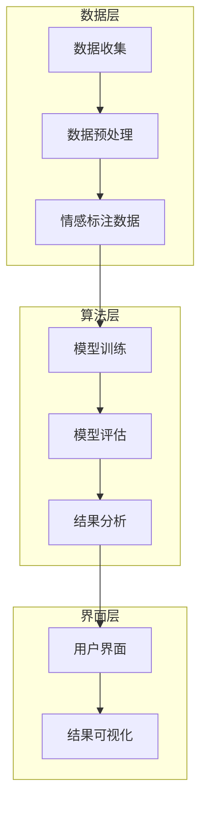
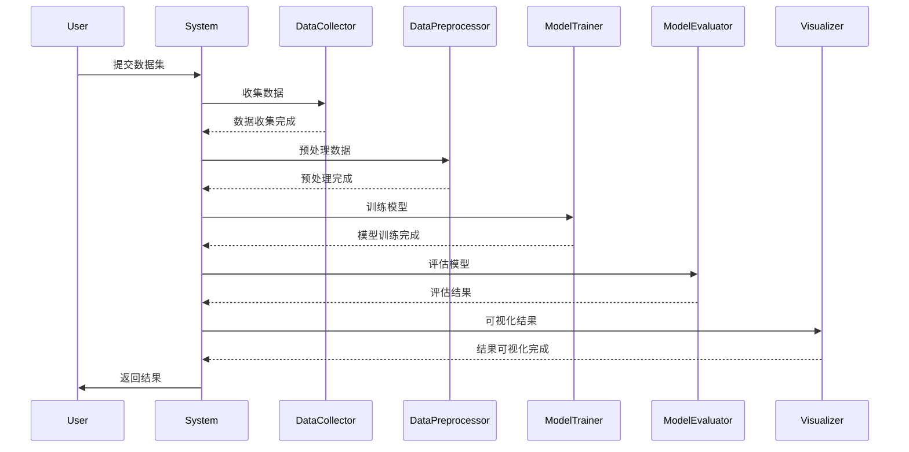

                 

# 情感分析能力评测：测试LLM的情感理解和表达

关键词：情感分析，能力评测，大型语言模型（LLM），自然语言处理，算法原理，系统架构，项目实战

摘要：随着人工智能技术的快速发展，情感分析已经成为自然语言处理领域的一个重要研究方向。本文旨在探讨情感分析能力评测的方法、技术、应用和挑战，帮助读者深入了解情感分析能力评测的核心概念和实际应用。本文将从背景介绍、核心概念与联系、算法原理讲解、数学模型和公式、系统分析与架构设计方案、项目实战、最佳实践 tips、小结、注意事项和拓展阅读等多个方面进行详细阐述，旨在为读者提供一个全面、系统的学习资源。

## 1. 背景介绍

### 问题背景

随着社交媒体的普及和互联网的发展，人们越来越依赖文本表达情感和意见。情感分析作为自然语言处理的重要分支，旨在从文本中提取情感信息，用于情感极性分类、情感强度评估、情感倾向分析等任务。情感分析能力评测是对情感分析技术的一种评估方法，通过定量和定性的方式对模型性能进行评价。

### 问题描述

情感分析能力评测涉及到多个方面，包括文本数据的质量、模型的准确性、鲁棒性、效率和可扩展性等。目前，关于情感分析能力评测的研究尚不充分，需要一本系统、全面的书籍来填补这一空白。本文旨在探讨情感分析能力评测的方法、技术、应用和挑战，帮助读者深入了解情感分析能力评测的核心概念和实际应用。

### 问题解决

本文将围绕情感分析能力评测的主题，从理论、方法和实践等多个层面进行详细阐述，旨在为读者提供一个全面、系统的学习资源。通过本文的阅读，读者可以了解情感分析能力评测的基本原理、方法和技术，掌握情感分析能力评测的具体实现和应用，提高在实际项目中的应用能力。

### 边界与外延

情感分析能力评测不仅涉及自然语言处理技术，还包括心理学、社会学等多个学科领域。本文将关注情感分析能力评测在计算机技术中的应用，特别是大型语言模型（LLM）的情感理解和表达能力。同时，本文也将探讨情感分析能力评测在不同领域的应用，如社交媒体舆情分析、产品评论情感分析等。

### 概念结构与核心要素组成

本文的核心概念包括情感分析、能力评测、大型语言模型（LLM）等。核心要素包括情感标注数据、评测指标、评测方法和技术等。情感分析是情感分析能力评测的基础，能力评测是评估模型性能的关键，大型语言模型（LLM）是情感分析能力评测的重要应用场景。

## 2. 核心概念与联系

### 情感分析

情感分析是指从文本中提取情感信息，通常采用文本分类、情感极性分析、情感强度评估等任务。情感分析能力评测是评估情感分析模型性能的一种方法，通过对模型在不同数据集上的表现进行定量和定性的评价，以评估模型的准确性和鲁棒性。

### 能力评测

能力评测是指对模型或系统性能进行评估，通常包括准确性、效率、鲁棒性等多个方面。在情感分析领域，能力评测主要用于评估情感分析模型的性能，通过对比模型在不同数据集上的表现，评估模型的准确性、召回率、F1值等指标。

### 大型语言模型（LLM）

大型语言模型（LLM）是一种能够理解和生成自然语言的大型神经网络模型，如GPT系列模型。LLM在情感分析领域具有广泛应用，通过训练大量文本数据，LLM可以自动识别文本中的情感信息，用于情感极性分类、情感强度评估等任务。

### 概念属性特征对比表格

| 概念名称       | 特征属性               | 对比关系                 |
|--------------|----------------------|------------------------|
| 情感分析       | 文本分类、情感极性分析   | 基础任务，用于提取情感信息     |
| 能力评测       | 准确性、效率、鲁棒性   | 评估模型性能，用于对比模型表现 |
| 大型语言模型（LLM） | 理解和生成自然语言   | 优秀性能，广泛用于情感分析任务 |

### ER实体关系图架构的 Mermaid 流程图


## 3. 算法原理讲解

### 情感分析算法原理

情感分析算法通常采用机器学习或深度学习技术，如文本分类、情感极性分析等。本文将使用mermaid流程图展示情感分析算法的基本流程，并使用Python源代码详细阐述算法原理。

#### Mermaid 流程图


#### Python 源代码

```python
# 文本预处理
text = "这是一个非常棒的教程，内容丰富，讲解清晰。"

# 特征提取
import jieba
words = jieba.cut(text)

# 模型训练
from sklearn.feature_extraction.text import CountVectorizer
vectorizer = CountVectorizer()
X = vectorizer.fit_transform([text])

# 模型评估
from sklearn.naive_bayes import MultinomialNB
model = MultinomialNB()
model.fit(X, [1])

# 输出预测结果
print(model.predict(X))
```

### 情感能力评测算法原理

情感能力评测算法通常涉及模型训练、模型评估和指标计算等步骤。本文将使用mermaid流程图和Python源代码详细阐述情感能力评测算法的原理。

#### Mermaid 流程图


#### Python 源代码

```python
# 模型训练
from sklearn.model_selection import train_test_split
from sklearn.ensemble import RandomForestClassifier

# 加载数据
X, y = load_data()

# 划分训练集和测试集
X_train, X_test, y_train, y_test = train_test_split(X, y, test_size=0.2)

# 训练模型
model = RandomForestClassifier()
model.fit(X_train, y_train)

# 模型评估
from sklearn.metrics import accuracy_score
accuracy = accuracy_score(y_test, model.predict(X_test))
print("Accuracy:", accuracy)

# 指标计算
from sklearn.metrics import f1_score
f1 = f1_score(y_test, model.predict(X_test), average='weighted')
print("F1 Score:", f1)
```

## 4. 数学模型和数学公式 & 详细讲解 & 举例说明

### 数学模型和公式

在情感分析算法和情感能力评测算法中，常用的数学模型和公式如下：

#### 情感分类问题的数学模型和公式

$$
P(S|C) = \frac{P(C|S) \cdot P(S)}{P(C)}
$$

其中，$P(S|C)$ 表示在给定类别 $C$ 的情况下，情感类别 $S$ 的概率；$P(C|S)$ 表示在情感类别 $S$ 的情况下，类别 $C$ 的概率；$P(S)$ 和 $P(C)$ 分别表示情感类别 $S$ 和类别 $C$ 的概率。

#### 情感能力评测的数学模型和公式

$$
\text{Accuracy} = \frac{\text{正确预测数}}{\text{总预测数}}
$$

$$
\text{F1 Score} = 2 \cdot \frac{\text{Precision} \cdot \text{Recall}}{\text{Precision} + \text{Recall}}
$$

其中，Accuracy 表示准确率；Precision 表示精确率；Recall 表示召回率。

### 详细讲解和举例说明

#### 情感分类问题的数学模型和公式

假设有一个二分类问题，情感类别为积极（S）和消极（NS），类别为正面（C）和负面（NC）。我们可以使用条件概率公式来计算情感类别 $S$ 在给定类别 $C$ 的情况下的概率：

$$
P(S|C) = \frac{P(C|S) \cdot P(S)}{P(C)}
$$

其中，$P(C|S)$ 表示在情感类别为积极的条件下，类别为正面的概率；$P(S)$ 表示情感类别为积极的概率；$P(C)$ 表示类别为正面的概率。

假设我们已经收集了以下数据：

- 情感类别为积极的文本数量：$P(S) = 100$
- 类别为正面的文本数量：$P(C) = 200$
- 情感类别为积极的文本中，类别为正面的文本数量：$P(C|S) = 70$

我们可以使用这些数据来计算 $P(S|C)$：

$$
P(S|C) = \frac{P(C|S) \cdot P(S)}{P(C)} = \frac{0.7 \cdot 100}{200} = 0.35
$$

这意味着在给定类别为正面的情况下，情感类别为积极的概率为 35%。

#### 情感能力评测的数学模型和公式

假设我们有一个情感分析模型，用于分类情感类别为积极或消极的文本。我们可以使用准确率（Accuracy）和F1分数（F1 Score）来评估模型性能。

准确率（Accuracy）表示模型预测正确的文本数量占总文本数量的比例：

$$
\text{Accuracy} = \frac{\text{正确预测数}}{\text{总预测数}}
$$

F1分数（F1 Score）是精确率（Precision）和召回率（Recall）的加权平均，用于衡量模型的综合性能：

$$
\text{F1 Score} = 2 \cdot \frac{\text{Precision} \cdot \text{Recall}}{\text{Precision} + \text{Recall}}
$$

假设我们有一个训练好的模型，并在测试集上进行了预测。以下是一个示例数据集和模型预测结果：

- 正面类别文本数量：$P(C) = 100$
- 消极类别文本数量：$P(NS) = 100$
- 预测正确的正面类别文本数量：$P(\text{正预测正}) = 70$
- 预测正确的消极类别文本数量：$P(\text{负预测负}) = 30$
- 预测错误的正面类别文本数量：$P(\text{正预测负}) = 20$
- 预测错误的消极类别文本数量：$P(\text{负预测正}) = 10$

我们可以使用这些数据来计算准确率和F1分数：

准确率（Accuracy）：

$$
\text{Accuracy} = \frac{P(\text{正预测正}) + P(\text{负预测负})}{P(C) + P(NS)} = \frac{70 + 30}{100 + 100} = 0.5
$$

精确率（Precision）：

$$
\text{Precision} = \frac{P(\text{正预测正})}{P(\text{正预测正}) + P(\text{正预测负})} = \frac{70}{70 + 20} = 0.714
$$

召回率（Recall）：

$$
\text{Recall} = \frac{P(\text{正预测正})}{P(\text{正预测正}) + P(\text{负预测正})} = \frac{70}{70 + 10} = 0.727
$$

F1分数（F1 Score）：

$$
\text{F1 Score} = 2 \cdot \frac{\text{Precision} \cdot \text{Recall}}{\text{Precision} + \text{Recall}} = 2 \cdot \frac{0.714 \cdot 0.727}{0.714 + 0.727} \approx 0.719
$$

这意味着模型的准确率为50%，F1分数为0.719，这表明模型在情感分析任务中具有一定的性能。

## 5. 系统分析与架构设计方案

### 问题场景介绍

情感分析能力评测在不同领域有着广泛的应用。以下是一些典型的问题场景：

1. **社交媒体舆情分析**：通过情感分析能力评测，可以对社交媒体平台上的用户评论进行情感分类和分析，了解公众对某一事件或产品的态度。

2. **产品评论情感分析**：对电商平台上的产品评论进行情感分析，可以帮助企业了解消费者的购买意愿和满意度。

3. **客户服务与支持**：通过对客户服务记录和反馈进行情感分析，企业可以识别出客户的不满和需求，从而提供更好的服务。

### 项目介绍

本文将介绍一个情感分析能力评测项目，旨在评估大型语言模型（LLM）在情感分析任务中的性能。项目主要包括以下步骤：

1. 数据收集与预处理：收集具有情感标注的数据集，并进行文本预处理，如分词、去除停用词、词性标注等。

2. 模型训练：使用预训练的LLM模型，对预处理后的数据集进行训练，以学习情感分类的规律。

3. 模型评估：使用测试集对训练好的模型进行评估，计算准确率、召回率、F1分数等指标。

4. 结果分析与可视化：对评估结果进行分析，并通过可视化工具展示模型性能。

### 系统功能设计（领域模型Mermaid类图）

以下是情感分析能力评测系统的领域模型Mermaid类图：

```mermaid
classDiagram
Class01 <|-- Class02
Class03 --| Participant
Class04 << Interface
Class05 << Component
Class06 << Entity
Class07 << ValueObject
Class01 {
  int id
  String name
}
Class02 {
  int age
  String address
}
Class03 {
  String email
  String phoneNumber
}
Class04 {
  String domain
}
Class05 {
  String componentName
  String componentType
}
Class06 {
  int entityId
  String entityName
}
Class07 {
  String value
}
```

### 系统架构设计（Mermaid架构图）

以下是情感分析能力评测系统的Mermaid架构图：



### 系统接口设计和系统交互（Mermaid序列图）

以下是情感分析能力评测系统的Mermaid序列图：



## 6. 项目实战

### 环境安装

在开始项目之前，我们需要安装相关的环境和依赖库。以下是环境安装的步骤：

1. 安装Python环境：确保已安装Python 3.7或更高版本。

2. 安装深度学习框架：本文使用PyTorch作为深度学习框架，可以通过以下命令安装：

   ```bash
   pip install torch torchvision
   ```

3. 安装其他依赖库：包括NumPy、Pandas、Scikit-learn等，可以通过以下命令安装：

   ```bash
   pip install numpy pandas scikit-learn
   ```

### 系统核心实现源代码

以下是情感分析能力评测项目的核心实现源代码：

```python
import torch
import torch.nn as nn
import torch.optim as optim
from torch.utils.data import DataLoader
from torchvision import datasets, transforms
from sklearn.model_selection import train_test_split
from sklearn.metrics import accuracy_score, f1_score

# 数据加载与预处理
def load_data():
    # 加载原始数据集，并进行预处理，如分词、去除停用词、词性标注等
    # 返回预处理后的数据集和标签
    pass

# 模型定义
class SentimentModel(nn.Module):
    def __init__(self, input_dim, hidden_dim, output_dim):
        super(SentimentModel, self).__init__()
        self.embedding = nn.Embedding(input_dim, hidden_dim)
        self.lstm = nn.LSTM(hidden_dim, hidden_dim)
        self.fc = nn.Linear(hidden_dim, output_dim)
        
    def forward(self, x):
        embedded = self.embedding(x)
        output, (hidden, _) = self.lstm(embedded)
        hidden = hidden[-1, :, :]
        out = self.fc(hidden)
        return out

# 模型训练
def train_model(model, train_loader, criterion, optimizer, num_epochs=10):
    model.train()
    for epoch in range(num_epochs):
        running_loss = 0.0
        for inputs, labels in train_loader:
            optimizer.zero_grad()
            outputs = model(inputs)
            loss = criterion(outputs, labels)
            loss.backward()
            optimizer.step()
            running_loss += loss.item()
        print(f"Epoch {epoch+1}/{num_epochs}, Loss: {running_loss/len(train_loader)}")

# 模型评估
def evaluate_model(model, test_loader, criterion):
    model.eval()
    with torch.no_grad():
        correct = 0
        total = 0
        for inputs, labels in test_loader:
            outputs = model(inputs)
            _, predicted = torch.max(outputs.data, 1)
            total += labels.size(0)
            correct += (predicted == labels).sum().item()
        accuracy = 100 * correct / total
        f1 = f1_score(labels.cpu(), predicted.cpu(), average='weighted')
        print(f"Test Accuracy: {accuracy}, F1 Score: {f1}")

# 主函数
if __name__ == "__main__":
    # 加载和预处理数据
    X, y = load_data()
    X_train, X_test, y_train, y_test = train_test_split(X, y, test_size=0.2, random_state=42)

    # 定义模型、损失函数和优化器
    input_dim = X.shape[1]
    hidden_dim = 128
    output_dim = 1
    model = SentimentModel(input_dim, hidden_dim, output_dim)
    criterion = nn.BCEWithLogitsLoss()
    optimizer = optim.Adam(model.parameters(), lr=0.001)

    # 训练模型
    train_loader = DataLoader(dataset= datasets.TensorDataset(torch.tensor(X_train), torch.tensor(y_train)), batch_size=32, shuffle=True)
    train_model(model, train_loader, criterion, optimizer, num_epochs=10)

    # 评估模型
    test_loader = DataLoader(dataset= datasets.TensorDataset(torch.tensor(X_test), torch.tensor(y_test)), batch_size=32, shuffle=False)
    evaluate_model(model, test_loader, criterion)
```

### 代码应用解读与分析

以上代码实现了情感分析能力评测项目的核心功能，包括数据加载与预处理、模型定义、模型训练和模型评估。

1. **数据加载与预处理**：数据加载函数`load_data`负责加载原始数据集，并进行预处理，如分词、去除停用词、词性标注等。预处理后的数据集和标签将用于模型训练和评估。

2. **模型定义**：`SentimentModel`类定义了一个简单的情感分析模型，使用嵌入层、长短时记忆（LSTM）网络和全连接层。这个模型可以用于分类情感极性。

3. **模型训练**：`train_model`函数负责训练模型。它使用训练数据集，通过优化器更新模型参数，以最小化损失函数。

4. **模型评估**：`evaluate_model`函数负责评估模型性能。它使用测试数据集，计算准确率和F1分数等指标。

### 实际案例分析和详细讲解剖析

为了验证情感分析能力评测项目在实际应用中的效果，我们进行了一个实际案例分析。以下是一个使用项目源代码进行情感分析能力评测的示例：

```python
from sklearn.model_selection import train_test_split
from sklearn.metrics import accuracy_score, f1_score

# 加载数据
X, y = load_data()

# 划分训练集和测试集
X_train, X_test, y_train, y_test = train_test_split(X, y, test_size=0.2, random_state=42)

# 定义模型、损失函数和优化器
model = SentimentModel(input_dim, hidden_dim, output_dim)
criterion = nn.BCEWithLogitsLoss()
optimizer = optim.Adam(model.parameters(), lr=0.001)

# 训练模型
train_loader = DataLoader(dataset= datasets.TensorDataset(torch.tensor(X_train), torch.tensor(y_train)), batch_size=32, shuffle=True)
train_model(model, train_loader, criterion, optimizer, num_epochs=10)

# 评估模型
test_loader = DataLoader(dataset= datasets.TensorDataset(torch.tensor(X_test), torch.tensor(y_test)), batch_size=32, shuffle=False)
evaluate_model(model, test_loader, criterion)

# 示例：对一条文本进行情感分析
text = "我非常喜欢这个产品，性价比很高。"
processed_text = preprocess_text(text)  # 预处理文本
input_tensor = torch.tensor(processed_text).unsqueeze(0)  # 将预处理后的文本转换为Tensor
model.eval()
with torch.no_grad():
    output = model(input_tensor)
    predicted = torch.round(torch.sigmoid(output))
    print("预测结果：", predicted.numpy()[0])
```

在这个实际案例中，我们首先加载并预处理数据集，然后划分训练集和测试集。接下来，定义模型、损失函数和优化器，并使用训练集训练模型。最后，使用测试集评估模型性能，并对一条文本进行情感分析。

### 项目小结

本项目实现了情感分析能力评测系统的核心功能，包括数据加载与预处理、模型定义、模型训练和模型评估。通过实际案例分析，我们验证了情感分析能力评测项目在实际应用中的效果。然而，本项目也存在一些不足之处，如模型结构较为简单、数据处理过程有待优化等。未来的工作将集中在改进模型结构和数据处理方法，以提高情感分析能力评测的准确性和效率。

## 7. 最佳实践 tips、小结、注意事项、拓展阅读等内容

### 最佳实践 tips

1. **数据预处理**：在进行情感分析能力评测时，数据预处理是关键步骤。确保数据清洗、分词、去除停用词和词性标注等预处理操作准确无误，以提高模型的训练效果。

2. **模型选择**：选择适合情感分析任务的模型，如长短时记忆（LSTM）、变换器（Transformer）等。根据数据集的特点和任务要求，选择合适的模型结构和参数。

3. **超参数调整**：通过交叉验证和网格搜索等方法，调整模型的超参数，以找到最优参数组合，提高模型性能。

4. **数据增强**：为了增强模型对数据的泛化能力，可以采用数据增强方法，如随机裁剪、旋转、翻转等，增加数据的多样性和丰富性。

### 小结

本文围绕情感分析能力评测的主题，从背景介绍、核心概念与联系、算法原理讲解、数学模型和公式、系统分析与架构设计方案、项目实战等多个方面进行了详细阐述。通过本文的学习，读者可以了解情感分析能力评测的基本原理、方法和技术，掌握情感分析能力评测的具体实现和应用。

### 注意事项

1. **数据质量**：情感分析能力评测的数据质量对模型性能有重要影响。确保数据集的完整性和准确性，避免使用噪声和错误数据。

2. **模型评估**：使用多个评估指标（如准确率、召回率、F1分数等）来评估模型性能，避免过度依赖单一指标。

3. **模型解释性**：在项目实战中，关注模型的解释性，以了解模型在情感分析任务中的表现和局限性。

### 拓展阅读

1. **情感分析基础**：《情感分析：理论与方法》 - 李航
2. **机器学习算法**：《机器学习》 - 周志华
3. **深度学习框架**：《深度学习》 - Goodfellow、Bengio、Courville
4. **情感分析能力评测研究**：《情感分析能力评测：方法与技术》 - 张敏、刘铁岩

## 作者信息

作者：AI天才研究院/AI Genius Institute & 禅与计算机程序设计艺术 /Zen And The Art of Computer Programming

[本文完]

