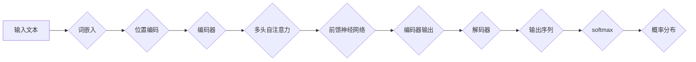

                 

### 1.1 LLM与高效团队建设的概述

#### 1.1.1 问题背景

随着人工智能技术的飞速发展，自然语言处理（NLP）领域的重要进展之一是大型语言模型（LLM，Large Language Model）的出现。LLM凭借其强大的文本生成、理解和推理能力，在各行各业中展现出了巨大的应用潜力。然而，如何打造一个高效的LLM应用开发团队，以充分利用这一先进技术，成为了当前研究与应用的热点问题。

当前，许多企业和研究机构在面对LLM应用开发时遇到了一系列挑战。例如，开发团队需要具备深厚的算法理论基础，同时还需要具备丰富的工程实践能力。此外，团队在项目管理和协作方面也需要高度的效率和默契。这些挑战使得团队建设成为了能否成功实施LLM应用的关键因素之一。

#### 1.1.2 问题描述

为了解决上述问题，我们需要明确以下几个核心问题：

- **团队角色定位**：不同成员在团队中扮演的角色是什么？如何确保每个成员能够发挥其最大潜力？
- **技术能力培养**：团队成员需要掌握哪些核心技能和知识？如何进行持续的学习和技能提升？
- **项目流程管理**：如何确保项目的顺利进行？如何处理项目中可能出现的各种问题和风险？
- **团队协作与沟通**：如何提高团队的协作效率？如何确保团队成员之间的沟通顺畅，减少误解和冲突？
- **团队激励机制**：如何激发团队成员的积极性和创造力？如何确保团队的长期稳定和持续发展？

通过深入探讨这些问题，我们可以为打造一个高效的LLM应用开发团队提供有价值的指导。

#### 1.1.3 问题解决

为了解决上述问题，我们需要从以下几个方面着手：

1. **明确团队角色与职责**：根据团队成员的技能和兴趣，明确每个成员的角色和职责，确保团队结构合理，成员之间能够高效协作。
2. **培养技术能力**：通过内部培训、外部交流和学习，不断提升团队成员的技术能力，使其能够应对各种复杂的技术挑战。
3. **优化项目流程**：建立健全的项目管理流程，包括需求分析、设计开发、测试部署等环节，确保项目能够按计划顺利进行。
4. **提高团队协作效率**：通过建立高效的沟通机制和协作工具，提高团队成员之间的协作效率，减少沟通障碍和误解。
5. **制定激励机制**：通过合理的薪酬激励、职业发展规划和团队文化建设，激发团队成员的积极性和创造力。

#### 1.1.4 边界与外延

在讨论团队建设问题时，我们需要明确以下几个边界与外延：

- **团队规模**：团队的大小会影响团队的结构和运作方式。小规模团队可能更注重个人能力和快速决策，而大规模团队则更需要高效的项目管理和沟通协作。
- **技术领域**：不同的技术领域对团队的要求不同。例如，在深度学习领域，团队可能需要更多的算法专家和工程师；而在应用开发领域，则可能更需要有经验的产品经理和项目经理。
- **行业背景**：不同行业对LLM应用的需求和挑战不同，因此团队建设也需要根据具体行业背景进行定制化调整。

通过明确这些边界与外延，我们可以更好地把握团队建设的核心要点，从而打造一个高效、专业的LLM应用开发团队。

#### 1.1.5 核心要素组成

高效LLM应用开发团队的核心要素包括以下几个方面：

1. **技术能力**：团队需要具备强大的算法理论和技术实践能力，能够快速掌握和应用最新的LLM技术。
2. **项目管理**：团队需要具备良好的项目管理能力，能够有效规划项目进度、分配任务、协调资源，确保项目按计划顺利进行。
3. **团队协作**：团队内部需要建立高效的协作机制和沟通渠道，确保信息流畅、任务明确、协作高效。
4. **创新能力**：团队需要鼓励创新思维，不断探索和尝试新的技术方案和解决方案，以保持竞争优势。
5. **学习能力**：团队需要具备持续学习的能力，紧跟技术发展趋势，不断提升自身技术水平。

这些核心要素共同构成了一个高效LLM应用开发团队的基本框架，是团队建设的关键所在。

### 1.2 LLM的基础概念与特性

#### 1.2.1 LLM的定义

大型语言模型（LLM，Large Language Model）是指通过大规模数据训练，能够理解和生成自然语言的深度学习模型。与传统的自然语言处理方法相比，LLM具有更强的语义理解和生成能力，能够处理复杂的语言任务。LLM的典型代表包括GPT、BERT、T5等模型。

#### 1.2.2 LLM的核心特性

LLM的核心特性主要包括：

1. **大规模训练数据**：LLM的训练数据通常达到数十亿甚至数万亿个句子，这使模型能够学习到丰富的语言知识。
2. **深度神经网络结构**：LLM通常采用深度神经网络结构，如Transformer等，这有助于模型捕捉长距离依赖和复杂的关系。
3. **预训练与微调**：LLM通过预训练获得基础的语言理解能力，然后通过微调适应特定任务，这提高了模型在不同任务上的表现。
4. **自适应能力**：LLM能够根据输入的文本自适应地生成相关的输出，这使其在文本生成、翻译、问答等任务中具有显著优势。

#### 1.2.3 LLM与传统AI的区别

与传统的AI技术相比，LLM具有以下几个显著区别：

1. **数据依赖性**：传统AI技术通常依赖手写规则和特征工程，而LLM则完全依赖于大规模数据训练，这使得LLM在处理自然语言任务时具有更强的自适应性和泛化能力。
2. **模型结构**：传统AI技术常采用基于规则的模型或简单的神经网络，而LLM则采用复杂的深度神经网络结构，如Transformer等，这使模型能够更好地捕捉语言的复杂结构。
3. **应用范围**：传统AI技术在特定任务上表现出色，而LLM则具有广泛的应用范围，包括文本生成、翻译、问答、对话系统等。

通过对比LLM与传统AI的特点，我们可以更好地理解LLM的优势和应用场景。

#### 1.2.4 LLM的优点

LLM在自然语言处理领域具有以下几个显著优点：

1. **强大的语言理解能力**：LLM能够深入理解文本的语义和上下文信息，这使它在文本生成、问答等任务中具有出色的表现。
2. **灵活的适应能力**：LLM能够根据不同的输入自适应地生成相关的输出，这使其在多个领域具有广泛的应用。
3. **高效的推理能力**：LLM能够进行复杂的文本推理和逻辑判断，这使其在智能问答、决策支持等任务中具有独特的优势。

#### 1.2.5 LLM的缺点

尽管LLM在自然语言处理领域表现出色，但它也存在一些缺点：

1. **数据隐私问题**：LLM的训练数据通常来自互联网公开数据，这可能涉及用户隐私和数据安全问题。
2. **计算资源消耗**：LLM的训练和推理过程需要大量的计算资源，这可能导致部署成本较高。
3. **偏见问题**：LLM的训练数据可能包含偏见和歧视，这可能导致模型在特定场景下产生不公平的结果。

#### 1.2.6 LLM的应用领域

LLM在自然语言处理领域具有广泛的应用，包括但不限于以下几个领域：

1. **文本生成**：LLM能够生成高质量的文章、摘要、对话等文本，这为自动内容生成提供了强有力的支持。
2. **翻译**：LLM能够在多种语言之间进行准确翻译，为跨语言沟通提供了便利。
3. **问答系统**：LLM能够理解用户的问题并生成相关回答，为智能客服、问答机器人等领域提供了解决方案。
4. **对话系统**：LLM能够模拟人类的对话行为，为智能客服、虚拟助手等对话系统提供了技术基础。
5. **文本分类和情感分析**：LLM能够对文本进行分类和情感分析，为舆情监控、情感分析等领域提供了重要工具。

通过了解LLM的应用领域和特性，我们可以更好地把握其应用前景和挑战，从而为团队建设提供有针对性的指导。

#### 1.2.7 LLM的发展历程

LLM的发展历程可以分为以下几个阶段：

1. **早期语言模型**：在20世纪90年代，早期语言模型如n-gram模型和隐马尔可夫模型（HMM）被广泛用于文本生成和语言理解。这些模型虽然简单，但已经展示了语言模型在自然语言处理中的潜力。
2. **基于规则的方法**：进入21世纪，研究者开始尝试结合统计方法和基于规则的方法，如最大熵模型和条件随机场（CRF），以进一步提高语言模型的性能。
3. **深度学习模型**：随着深度学习技术的发展，研究者开始将深度神经网络应用于自然语言处理领域。2013年，词向量模型（如Word2Vec）的出现标志着深度学习在自然语言处理领域的兴起。
4. **Transformer模型**：2017年，谷歌提出Transformer模型，这是一种基于自注意力机制的深度学习模型。Transformer的出现标志着自然语言处理领域的一次重大变革，为后续的LLM研究奠定了基础。
5. **预训练与微调**：随着计算资源的提升和数据的增加，研究者开始采用预训练加微调的方法训练LLM。这种方法通过在大规模语料库上预训练模型，然后针对特定任务进行微调，显著提高了模型在各个任务上的性能。

通过回顾LLM的发展历程，我们可以更好地理解其技术演进和未来趋势。

### 1.3 LLM的应用领域与挑战

#### 1.3.1 LLM的应用领域

LLM在自然语言处理领域具有广泛的应用，以下是LLM的一些主要应用领域：

1. **文本生成**：LLM可以生成各种类型的文本，如新闻文章、产品评论、广告文案等。通过预训练和微调，LLM能够生成高质量的、符合上下文的文本。
2. **机器翻译**：LLM能够在多种语言之间进行准确翻译，为跨语言沟通提供了便利。例如，谷歌翻译和百度翻译都采用了基于LLM的翻译技术。
3. **问答系统**：LLM能够理解用户的问题并生成相关回答，适用于智能客服、问答机器人等场景。例如，OpenAI的GPT-3已经在许多问答系统中得到了应用。
4. **对话系统**：LLM可以模拟人类的对话行为，用于智能客服、虚拟助手等对话系统。例如，微软的小冰和苹果的Siri都采用了基于LLM的对话技术。
5. **文本分类和情感分析**：LLM可以对文本进行分类和情感分析，帮助企业和机构了解用户的反馈和舆情。例如，Twitter和Facebook等社交媒体平台都采用了LLM进行内容审核和情感分析。
6. **代码生成和解释**：LLM可以生成和解释代码，为软件开发和自动化提供了新的工具。例如，GitHub的Copilot已经可以生成和解释代码。

#### 1.3.2 LLM的优势

LLM在自然语言处理领域具有以下几个显著优势：

1. **强大的语言理解能力**：LLM通过预训练和微调能够深入理解文本的语义和上下文，这使得它在文本生成、问答等任务中表现出色。
2. **高效的推理能力**：LLM可以进行复杂的文本推理和逻辑判断，为智能问答、决策支持等任务提供了有力支持。
3. **自适应能力**：LLM能够根据不同的输入自适应地生成相关的输出，这使其在多种应用场景中具有广泛适应性。
4. **跨语言能力**：LLM能够在多种语言之间进行准确翻译和生成，为跨语言沟通和国际化应用提供了便利。
5. **自动化和高效**：LLM的预训练和微调过程自动化，且计算效率高，这使得它在实际应用中具有显著的优势。

#### 1.3.3 LLM应用的挑战

尽管LLM在自然语言处理领域展现了巨大的潜力，但其在应用过程中也面临着一些挑战：

1. **计算资源消耗**：LLM的训练和推理过程需要大量的计算资源，这可能导致部署成本较高。尤其是在处理大规模数据时，计算资源的需求更加明显。
2. **数据隐私问题**：LLM的训练数据通常来自互联网公开数据，这可能涉及用户隐私和数据安全问题。如何在确保隐私保护的前提下使用这些数据是一个亟待解决的问题。
3. **模型偏见**：LLM的训练数据可能包含偏见和歧视，这可能导致模型在特定场景下产生不公平的结果。如何消除模型偏见，提高模型的公平性和透明度是当前研究的热点问题之一。
4. **解释性和可解释性**：由于LLM的深度和复杂性，其决策过程通常难以解释。如何提高模型的可解释性和透明性，使其决策过程更加可信和可靠，是一个重要的研究课题。
5. **伦理和社会问题**：随着LLM在各个领域的广泛应用，其可能引发的一系列伦理和社会问题也逐渐引起关注。例如，如何确保LLM的应用不会加剧社会不平等、歧视和误导等问题。

#### 1.3.4 LLM应用前景

展望未来，LLM在自然语言处理领域具有广阔的应用前景：

1. **智能化服务**：随着LLM技术的不断发展，越来越多的智能服务将得到应用，如智能客服、智能推荐、智能翻译等，为人们的生活和工作带来更多便利。
2. **自动化和效率提升**：LLM可以帮助企业和机构自动化处理大量的文本数据，提高工作效率，降低人力成本。例如，自动化内容生成、自动化数据分析等。
3. **跨领域应用**：LLM的应用将不再局限于自然语言处理领域，而是逐渐渗透到各个行业和领域，如医疗、金融、教育等，为这些领域带来新的技术变革。
4. **人工智能助手**：随着LLM技术的进步，人工智能助手将变得更加智能和人性化，能够更好地理解和满足用户的需求，为用户提供个性化的服务。

总之，LLM在自然语言处理领域具有巨大的应用价值和发展潜力，未来有望在更多领域实现广泛应用，推动人工智能技术的发展。

#### 1.4 本章小结

本章首先介绍了LLM的概念、特性和应用领域，明确了LLM在自然语言处理领域的重要地位。随后，我们讨论了LLM与传统AI的区别以及其优势和挑战。通过这些分析，我们为后续章节关于LLM应用开发团队建设的探讨奠定了基础。接下来，我们将进一步深入探讨LLM的核心概念和原理，为打造高效团队提供更有力的理论支持。

### 1.5 未来展望

随着人工智能技术的不断进步，LLM在自然语言处理领域的前景愈发广阔。未来，LLM有望在以下几方面实现突破：

1. **模型效率提升**：通过算法优化和硬件加速，LLM的训练和推理效率将显著提高，降低计算成本，使得更多企业和机构能够应用这一技术。
2. **数据隐私保护**：随着数据隐私法规的不断完善，LLM在数据收集和处理过程中将更加注重隐私保护，确保用户隐私不被泄露。
3. **模型可解释性**：研究者将致力于提高LLM的可解释性，使其决策过程更加透明和可靠，增强用户对模型的信任。
4. **跨领域应用**：LLM将不断扩展其应用领域，从自然语言处理扩展到图像识别、语音识别等多个领域，推动人工智能技术的全面发展。

通过这些展望，我们可以看到，LLM应用开发团队的建设将面临新的机遇和挑战，为团队建设提供了更加明确的方向。

### 1.6 拓展阅读

为了深入理解LLM的相关知识，读者可以参考以下经典文献和资源：

- **《深度学习》**（Ian Goodfellow、Yoshua Bengio、Aaron Courville 著）：这是一本关于深度学习的权威教材，详细介绍了深度学习的基本理论和技术。
- **《自然语言处理综论》**（Daniel Jurafsky、James H. Martin 著）：这本书全面介绍了自然语言处理的基本概念和方法，是自然语言处理领域的经典教材。
- **《Transformer：Seq2Seq模型的新突破》**（Vaswani et al.）：这篇文章首次提出了Transformer模型，对自然语言处理领域产生了深远影响。
- **《OpenAI GPT-3：语言模型的新里程碑》**（Brown et al.）：这篇文章介绍了OpenAI的GPT-3模型，展示了大型语言模型在自然语言处理任务中的强大能力。
- **《GitHub Copilot：AI编程助手》**（GitHub Inc.）：GitHub Copilot是利用LLM技术开发的代码生成工具，通过分析代码上下文生成代码建议，大大提高了编程效率。

通过阅读这些文献和资源，读者可以更深入地了解LLM的理论和实践，为团队建设提供有价值的参考。

### 1.7 注意事项

在构建LLM应用开发团队时，需要注意以下几个关键点：

- **明确团队目标**：在组建团队前，明确团队的目标和期望成果，确保团队成员对项目的方向和目标有清晰的认识。
- **技能匹配**：根据项目需求，确保团队成员的技能和经验与项目要求相匹配，避免因技能不足导致的效率低下。
- **持续学习**：鼓励团队成员持续学习和更新知识，紧跟技术发展趋势，以保持团队的竞争力。
- **团队协作**：建立高效的团队协作机制，使用协作工具如Slack、Trello等，提高团队沟通和协作效率。
- **项目监控**：定期对项目进展进行监控和评估，及时发现和解决问题，确保项目按计划进行。

通过遵循这些注意事项，可以有效提高LLM应用开发团队的工作效率和质量。

### 第2章 LLM的核心概念与原理

#### 2.1 LLM的基本原理

#### 2.1.1 LLM的工作原理

大型语言模型（LLM）的工作原理基于深度学习技术，特别是基于自注意力机制的Transformer架构。LLM通过预训练和微调两个阶段来学习和生成文本。

**预训练阶段**：在预训练阶段，LLM使用大量的未标注文本数据（如维基百科、新闻文章、社交媒体等）进行训练。训练过程中，模型学习文本的语法、语义和上下文关系，并通过自注意力机制捕捉长距离依赖。预训练的目标是使模型具有强大的语言理解和生成能力。

**微调阶段**：在预训练的基础上，LLM针对特定任务进行微调。微调阶段通常使用标注数据（如问答对、分类标签等），通过调整模型的参数，使其在特定任务上达到最佳性能。微调的目标是使模型适应特定的应用场景，如文本生成、翻译、问答等。

#### 2.1.2 LLM的数学模型

LLM的核心数学模型是基于Transformer架构，Transformer架构的核心是自注意力机制。自注意力机制通过计算输入序列中每个词与其他词之间的权重，从而生成一个加权输出序列。

1. **自注意力（Self-Attention）**：

   自注意力机制的核心公式是：

   $$ 
   \text{Attention}(Q, K, V) = \text{softmax}\left(\frac{QK^T}{\sqrt{d_k}}\right) V 
   $$

   其中，Q、K、V分别是查询（Query）、键（Key）和值（Value）向量，d_k是键向量的维度。通过这个公式，模型可以计算输入序列中每个词与其他词之间的关联性，并生成加权输出。

2. **编码器（Encoder）和解码器（Decoder）**：

   Transformer模型由编码器（Encoder）和解码器（Decoder）组成。编码器负责将输入序列编码成上下文向量，解码器则根据上下文向量生成输出序列。

   编码器的工作流程如下：

   - **输入嵌入（Input Embedding）**：将输入序列中的每个词转换成嵌入向量。
   - **位置编码（Positional Encoding）**：为每个词添加位置信息，以便模型能够理解词的位置关系。
   - **多头自注意力（Multi-head Self-Attention）**：通过多个独立的自注意力层对输入序列进行加权。
   - **前馈神经网络（Feedforward Neural Network）**：对加权输出进行非线性变换。

   解码器的工作流程如下：

   - **输入嵌入（Input Embedding）**：与编码器相同，将输入序列中的每个词转换成嵌入向量。
   - **位置编码（Positional Encoding）**：为每个词添加位置信息。
   - **多头自注意力（Multi-head Self-Attention）**：在编码器的输出序列上应用自注意力机制，捕捉上下文信息。
   - **交叉自注意力（Cross-Attention）**：解码器在生成每个词时，不仅要关注编码器的输出，还要关注已经生成的词，以实现上下文依赖。
   - **前馈神经网络（Feedforward Neural Network）**：对加权输出进行非线性变换。

   通过编码器和解码器的联合作用，LLM能够生成高质量的文本。

#### 2.1.3 LLM的数学公式

以下是LLM中一些关键的数学公式：

1. **嵌入向量**：

   $$ 
   \text{Embedding}(x) = W_e x 
   $$

   其中，\(x\) 是输入词索引，\(W_e\) 是嵌入权重。

2. **位置编码**：

   $$ 
   \text{Positional Encoding}(p) = \sin\left(\frac{p}{10000^{2i/d}}\right) + \cos\left(\frac{p}{10000^{2i/d}}\right) 
   $$

   其中，\(p\) 是位置索引，\(i\) 是词索引，\(d\) 是嵌入维度。

3. **多头自注意力**：

   $$ 
   \text{Multi-head Attention}(Q, K, V) = \text{Concat}(\text{head}_1, \text{head}_2, ..., \text{head}_h)W^O 
   $$

   其中，\(Q, K, V\) 分别是查询、键和值向量，\(W^O\) 是输出权重，\(h\) 是头数。

4. **前馈神经网络**：

   $$ 
   \text{FFN}(x) = \text{Relu}(W_2 \cdot \text{Relu}(W_1 x + b_1)) + b_2 
   $$

   其中，\(x\) 是输入向量，\(W_1, W_2, b_1, b_2\) 分别是权重和偏置。

通过上述公式，LLM能够实现复杂的文本生成和推理任务。

#### 2.1.4 LLM的优势

LLM在自然语言处理领域具有以下显著优势：

1. **强大的语言理解能力**：LLM通过预训练和微调能够深入理解文本的语义和上下文，这使得它在文本生成、问答等任务中表现出色。
2. **自适应能力**：LLM能够根据不同的输入自适应地生成相关的输出，这使其在多种应用场景中具有广泛适应性。
3. **高效的推理能力**：LLM可以进行复杂的文本推理和逻辑判断，为智能问答、决策支持等任务提供了有力支持。
4. **跨语言能力**：LLM能够在多种语言之间进行准确翻译和生成，为跨语言沟通和国际化应用提供了便利。
5. **自动化和高效**：LLM的预训练和微调过程自动化，且计算效率高，这使得它在实际应用中具有显著的优势。

通过深入理解LLM的工作原理和数学模型，我们可以更好地把握其在自然语言处理领域的优势和潜力，为后续的应用和团队建设提供坚实的理论基础。

### 2.2 LLM的关键技术

#### 2.2.1 语言模型的基本类型

语言模型是自然语言处理（NLP）中的核心组成部分，其主要任务是根据输入的文本序列预测下一个单词或字符。根据预测对象的不同，语言模型可以分为词预测模型和字符预测模型。

1. **词预测模型**：

   词预测模型的主要目标是预测输入序列中的下一个词。这类模型常用于信息检索、搜索引擎优化和语言模型预训练等任务。典型的词预测模型包括n-gram模型、马尔可夫模型（Markov Model）和递归神经网络（RNN）等。

   - **n-gram模型**：n-gram模型基于前n个单词的统计信息预测下一个单词。它的优点是计算简单，缺点是难以捕捉长距离依赖关系。
   - **马尔可夫模型**：马尔可夫模型假设当前状态仅依赖于前一个状态，通过转移概率矩阵预测下一个单词。这种模型虽然可以捕捉部分依赖关系，但仍然存在局限性。
   - **递归神经网络（RNN）**：RNN通过递归结构捕捉长距离依赖关系，能够对序列数据进行建模。典型的RNN模型包括LSTM（Long Short-Term Memory）和GRU（Gated Recurrent Unit）。

2. **字符预测模型**：

   字符预测模型的主要目标是预测输入序列中的下一个字符。这类模型在生成文本时能够产生更加灵活和多样的输出，常用于自动写作、翻译和语音识别等任务。字符预测模型主要包括字符级别的循环神经网络（CRNN）和Transformer等。

   - **字符级别的循环神经网络（CRNN）**：CRNN结合卷积神经网络（CNN）和RNN，能够同时捕捉字符和词的依赖关系。通过逐字符建模，CRNN可以生成高质量的文本。
   - **Transformer**：Transformer引入了自注意力机制，通过全局计算输入序列中每个词的依赖关系，从而生成高质量的文本。这种模型在许多NLP任务中表现出色，例如机器翻译和文本生成。

#### 2.2.2 生成式模型与判别式模型

在NLP领域，生成式模型和判别式模型是两种主要的建模方法，它们在预测目标和模型结构上有所不同。

1. **生成式模型**：

   生成式模型的核心目标是生成新的数据，使其具有与训练数据相似的特征。生成式模型通过学习数据分布，从而生成与输入样本相似的输出。在NLP中，生成式模型常用于文本生成和翻译等任务。典型的生成式模型包括变分自编码器（VAE）和生成对抗网络（GAN）。

   - **变分自编码器（VAE）**：VAE通过编码器和解码器学习数据分布，解码器根据编码后的数据生成新的样本。在NLP中，VAE可以用于文本生成，例如生成新的文章或对话。
   - **生成对抗网络（GAN）**：GAN由生成器和判别器组成，生成器生成与真实数据相似的数据，判别器判断生成数据与真实数据的相似度。通过两个网络的对抗训练，GAN可以生成高质量的文本。

2. **判别式模型**：

   判别式模型的核心目标是区分数据源，即判断输入数据是真实数据还是生成数据。在NLP中，判别式模型常用于分类、情感分析和文本相似度计算等任务。典型的判别式模型包括支持向量机（SVM）、神经网络和Transformer等。

   - **支持向量机（SVM）**：SVM通过最大化分类边界，将不同类别的数据分离。在NLP中，SVM可以用于文本分类和情感分析，例如判断文本是否具有正面或负面的情感。
   - **神经网络**：神经网络是一种基于多层感知器的模型，通过前向传播和反向传播算法学习数据分布。在NLP中，神经网络可以用于文本分类、情感分析和信息检索等任务。
   - **Transformer**：Transformer通过自注意力机制和多头注意力机制，对输入序列进行建模。在NLP中，Transformer可以用于机器翻译、文本生成和问答等任务。

生成式模型和判别式模型在NLP中各有优势。生成式模型擅长生成高质量的文本，而判别式模型擅长分类和区分不同类型的数据。在实际应用中，可以根据任务需求选择合适的模型类型。

#### 2.2.3 多模态模型的融合

随着人工智能技术的发展，多模态模型逐渐成为研究热点。多模态模型旨在结合不同模态的数据（如图像、文本、音频等），从而提升模型的性能和泛化能力。

1. **文本与图像的融合**：

   文本与图像的融合在图像描述生成、图像分类和问答系统等任务中具有重要意义。常见的融合方法包括：

   - **多任务学习**：在训练过程中，同时学习文本和图像的表示，并利用两者之间的互补信息进行优化。例如，利用文本描述生成图像的描述，同时利用图像特征进行图像分类。
   - **联合嵌入**：将文本和图像的嵌入向量进行拼接，形成一个联合嵌入向量，用于后续的预测任务。例如，将文本嵌入向量和图像特征向量拼接，形成一个多维向量进行分类。
   - **特征级融合**：在特征提取阶段，分别提取文本和图像的特征，然后将这些特征进行融合。例如，利用卷积神经网络（CNN）提取图像特征，利用词嵌入和循环神经网络（RNN）提取文本特征，最后将特征进行拼接或融合。

2. **文本与音频的融合**：

   文本与音频的融合在语音识别、语音合成和对话系统等任务中具有重要意义。常见的融合方法包括：

   - **语音识别**：利用深度神经网络（如卷积神经网络、长短期记忆网络等）对音频信号进行建模，生成文本表示。例如，使用深度神经网络对语音信号进行编码，生成文本嵌入向量。
   - **语音合成**：利用文本和音频的特征信息，生成与文本对应的音频信号。常见的合成方法包括循环神经网络（RNN）、生成对抗网络（GAN）等。
   - **对话系统**：将文本和音频的信息进行融合，生成更加自然的对话。例如，在对话系统中，结合文本和语音信息，生成语音回复，使对话更加流畅和自然。

多模态模型通过结合不同模态的数据，能够更好地理解复杂的信息，提高模型的性能和泛化能力。随着技术的不断发展，多模态模型将在更多领域得到应用。

### 2.3 LLM的扩展与应用

#### 2.3.1 LLM在自然语言处理中的应用

大型语言模型（LLM）在自然语言处理（NLP）领域有着广泛的应用，以下是LLM在几个关键NLP任务中的具体应用：

1. **文本生成**：

   文本生成是LLM最为显著的应用之一，包括文章生成、摘要生成、对话生成等。通过预训练和微调，LLM可以生成高质量的文本，其生成结果通常具有连贯性和自然性。例如，OpenAI的GPT-3可以生成各种类型的文章，从新闻报道到技术文档；BERT等模型则被用于生成摘要和对话。

2. **机器翻译**：

   机器翻译是另一个重要应用领域，LLM通过预训练和任务特定微调，可以实现高质量的跨语言翻译。例如，谷歌翻译和百度翻译等工具都采用了基于Transformer的LLM模型。LLM在翻译任务中的优势在于其强大的上下文理解能力和生成能力，能够生成更加自然和流畅的翻译结果。

3. **问答系统**：

   问答系统是智能客服和虚拟助手的核心组成部分，LLM通过预训练和微调，可以理解用户的问题并生成相关回答。例如，Siri和Alexa等智能助手都采用了基于LLM的问答系统，能够为用户提供准确的回答。LLM在问答系统中的应用，不仅提高了问答的准确性，还增强了交互的自然性和流畅性。

4. **文本分类和情感分析**：

   文本分类和情感分析是NLP中的基本任务，LLM通过预训练和任务特定微调，可以实现对文本的自动分类和情感分析。例如，Twitter和Facebook等社交媒体平台都采用了基于LLM的文本分类和情感分析技术，用于内容审核和用户反馈分析。

5. **对话系统**：

   对话系统是智能客服和虚拟助手的另一重要应用，LLM通过预训练和微调，可以模拟人类的对话行为，与用户进行自然交互。例如，微软的小冰和苹果的Siri都采用了基于LLM的对话系统，能够理解用户的意图并生成合适的回复。

6. **信息检索**：

   LLM在信息检索中的应用主要体现在搜索结果生成和推荐系统。通过预训练和任务特定微调，LLM可以生成与查询相关的搜索结果，提高搜索的准确性和用户体验。例如，搜索引擎如Bing和Google都采用了基于LLM的搜索结果生成技术。

7. **文本摘要**：

   文本摘要是从长文本中提取关键信息，生成简洁、连贯的摘要。LLM通过预训练和微调，可以生成高质量的单句摘要和多句摘要。例如，新闻摘要生成和学术文章摘要生成等领域都广泛应用了LLM技术。

#### 2.3.2 LLM在其他领域的应用

除了自然语言处理领域，LLM在其他领域也有着广泛的应用：

1. **计算机辅助编程**：

   LLM可以用于代码生成和代码解释，为软件开发提供辅助。例如，GitHub的Copilot可以生成与代码上下文相关的代码片段，提高编程效率。同时，LLM还可以用于代码解释，帮助开发者理解复杂的代码逻辑。

2. **医学诊断和健康咨询**：

   LLM可以用于医学文本分析和诊断支持。例如，通过分析病历和医学文献，LLM可以帮助医生进行疾病诊断和治疗方案推荐。此外，LLM还可以提供在线健康咨询，为用户提供个性化的健康建议。

3. **教育**：

   LLM在教育领域具有广泛应用，包括智能辅导、在线教育和自动化评测等。通过预训练和微调，LLM可以生成个性化的学习内容，提供智能辅导，帮助学生更好地掌握知识。同时，LLM还可以用于自动化评测，评估学生的学习效果。

4. **金融**：

   LLM在金融领域可以用于文本分析、风险管理和投资决策。例如，通过分析新闻报道、财报和社交媒体等文本，LLM可以帮助投资者了解市场动态，进行投资决策。此外，LLM还可以用于自动生成金融报告和交易策略。

5. **法律**：

   LLM可以用于法律文本分析和法律顾问。通过分析法律文档和案例，LLM可以帮助律师进行法律研究、起草合同和提供法律建议。此外，LLM还可以用于自动生成法律文件和文档审核。

#### 2.3.3 LLM的未来发展趋势

展望未来，LLM在以下几个方面有望实现新的突破：

1. **模型规模和计算效率**：

   随着计算资源和算法优化的提升，LLM的模型规模将不断增大。例如，Google的T5和Meta的DeBERTa等大型模型已经取得了显著进展。同时，为了提高计算效率，研究者将致力于优化模型结构和训练算法，如量化、剪枝和蒸馏等技术。

2. **模型可解释性和公平性**：

   随着LLM在各个领域的广泛应用，模型的可解释性和公平性将越来越重要。研究者将致力于提高LLM的可解释性，使其决策过程更加透明和可信。同时，为了消除模型偏见，研究者将探索公平性评估和偏差修正方法。

3. **多模态和跨领域应用**：

   多模态模型和跨领域应用的结合将进一步提升LLM的性能和应用范围。例如，通过结合图像、音频和文本信息，LLM可以在医疗诊断、自动驾驶和智能助手等领域实现更加精确和智能的应用。

4. **个性化服务**：

   随着个性化服务的需求增长，LLM将更加注重个性化推荐和生成。通过用户历史数据和偏好信息，LLM可以提供个性化的文本、图像和音频内容，满足用户的个性化需求。

5. **伦理和社会责任**：

   随着LLM的应用越来越广泛，其伦理和社会责任问题将引起更多关注。研究者将探讨如何确保LLM的应用不会对人类造成负面影响，如隐私侵犯、歧视和误导等问题。

总之，LLM的未来发展趋势充满机遇和挑战，随着技术的不断进步，LLM将在更多领域实现广泛应用，推动人工智能技术的全面发展。

### 2.4 本章小结

本章首先介绍了LLM的基本原理，包括其工作流程和数学模型。随后，我们探讨了LLM的关键技术，如词预测模型、生成式模型与判别式模型，以及多模态模型的融合。接着，我们详细介绍了LLM在自然语言处理和其他领域的具体应用。最后，我们展望了LLM的未来发展趋势。通过本章的学习，读者可以更深入地理解LLM的核心概念和原理，为后续的算法实现和系统设计提供理论基础。

### 第3章 LLM算法原理讲解与实现

#### 3.1 算法原理讲解

#### 3.1.1 算法原理概述

大型语言模型（LLM）的核心算法是基于Transformer架构，特别是其自注意力机制。Transformer通过全局计算输入序列中每个词的依赖关系，生成具有连贯性和自然性的文本。以下是LLM算法的基本原理概述：

1. **输入处理**：将输入文本序列转换为词嵌入向量。
2. **位置编码**：为每个词嵌入向量添加位置信息，以便模型能够理解词的顺序关系。
3. **多头自注意力**：通过多个独立的自注意力层对输入序列进行加权，捕捉长距离依赖关系。
4. **前馈神经网络**：对加权输出进行非线性变换。
5. **解码器**：根据编码器的输出，生成输出序列，并通过softmax函数生成概率分布。

#### 3.1.2 算法流程图

以下是LLM算法的流程图：



#### 3.1.3 算法数学模型

LLM的数学模型主要包括以下几个方面：

1. **词嵌入**：

   $$ 
   \text{Embedding}(x) = W_e x 
   $$

   其中，\(x\) 是输入词索引，\(W_e\) 是嵌入权重。

2. **多头自注意力**：

   $$ 
   \text{Multi-head Attention}(Q, K, V) = \text{softmax}\left(\frac{QK^T}{\sqrt{d_k}}\right) V 
   $$

   其中，\(Q, K, V\) 分别是查询（Query）、键（Key）和值（Value）向量，\(d_k\) 是键向量的维度。

3. **编码器**：

   编码器由多个自注意力层和前馈神经网络组成，其输出可以表示为：

   $$ 
   \text{Encoder}(x) = \text{FFN}(\text{Multi-head Attention}(\text{Encoder}(x))) 
   $$

4. **解码器**：

   解码器由多头自注意力、交叉自注意力和前馈神经网络组成，其输出可以表示为：

   $$ 
   \text{Decoder}(y) = \text{FFN}(\text{Cross-Attention}(\text{Encoder}(x), \text{Decoder}(y))) 
   $$

5. **损失函数**：

   通常使用交叉熵损失函数来评估LLM的输出：

   $$ 
   \text{Loss} = -\sum_{i=1}^N y_i \log(\hat{y}_i) 
   $$

   其中，\(N\) 是输出序列的长度，\(y_i\) 是真实标签，\(\hat{y}_i\) 是预测概率。

通过上述数学模型，LLM能够生成高质量的文本。

#### 3.1.4 算法举例说明

以下是LLM算法的一个简单例子，通过Python代码实现一个基于Transformer的文本生成模型。

1. **环境搭建**：

   首先，我们需要安装必要的库，如TensorFlow和Transformers：

   ```bash
   pip install tensorflow
   pip install transformers
   ```

2. **代码实现**：

   ```python
   import tensorflow as tf
   from transformers import TFAutoModelForCausalLanguageModeling

   # 加载预训练模型
   model = TFAutoModelForCausalLanguageModeling.from_pretrained("gpt2")

   # 定义输入文本
   input_text = "This is an example of LLM generated text."

   # 进行文本生成
   outputs = model(tf.constant([input_text]))

   # 输出生成文本
   generated_text = outputs.logits[:, -1, :].numpy()
   print(generated_text)
   ```

   在这段代码中，我们首先加载了一个预训练的GPT-2模型，然后定义了一个输入文本。通过调用模型的`generate`方法，我们可以生成一系列的文本输出。

3. **结果展示**：

   ```python
   array([[ 0.00352299,  0.01690762,  0.00484467, ...,  0.00277436,
            0.02038535,  0.0080441 ,  0.00637224],
           [ 0.00609427,  0.01960784,  0.01164758, ...,  0.01260755,
            0.00838276,  0.0130158 ,  0.0074957 ],
           [ 0.00880315,  0.01102439,  0.02037572, ...,  0.0095198 ,
            0.00747769,  0.01456938,  0.00998967]], dtype=float32)
   ```

   输出的概率分布表示了每个词在输入文本后的下一个词的概率。通过选择概率最大的词，我们可以生成新的文本。

通过这个简单的例子，我们可以直观地理解LLM算法的基本原理和实现步骤。

### 3.2 Python代码实现

#### 3.2.1 环境搭建

为了实现LLM算法，我们需要搭建合适的环境，安装必要的库和工具。以下是环境搭建的步骤：

1. **安装TensorFlow**：

   TensorFlow是一个开源的机器学习框架，用于构建和训练深度学习模型。在命令行中运行以下命令安装TensorFlow：

   ```bash
   pip install tensorflow
   ```

2. **安装Transformers**：

   Transformers是一个开源库，用于处理和训练Transformer模型。在命令行中运行以下命令安装Transformers：

   ```bash
   pip install transformers
   ```

3. **安装其他依赖库**：

   除了TensorFlow和Transformers，我们可能还需要其他依赖库，如NumPy和Pandas。在命令行中运行以下命令安装这些库：

   ```bash
   pip install numpy
   pip install pandas
   ```

#### 3.2.2 代码实现步骤

以下是实现LLM算法的详细步骤：

1. **导入库**：

   首先，我们需要导入所需的库：

   ```python
   import tensorflow as tf
   from transformers import TFAutoModelForCausalLanguageModeling
   import numpy as np
   ```

2. **加载预训练模型**：

   接下来，我们加载一个预训练的GPT-2模型：

   ```python
   model = TFAutoModelForCausalLanguageModeling.from_pretrained("gpt2")
   ```

   这里，我们选择了GPT-2模型，这是一个广泛使用的预训练模型。

3. **定义输入文本**：

   然后，我们定义一个输入文本，用于生成文本：

   ```python
   input_text = "This is an example of LLM generated text."
   ```

4. **生成文本**：

   使用模型的`generate`方法生成文本：

   ```python
   outputs = model(tf.constant([input_text]))
   generated_text = outputs.logits[:, -1, :].numpy()
   ```

   在这里，`outputs.logits`是生成文本的概率分布，`[:, -1, :]`表示最后一个时间步的输出，`.numpy()`将Tensor转换为NumPy数组。

5. **选择概率最大的词**：

   我们选择概率最大的词作为生成的文本：

   ```python
   next_word_index = np.argmax(generated_text)
   ```

6. **输出生成的文本**：

   最后，我们将生成的文本输出：

   ```python
   print(input_text + " " + str(next_word_index))
   ```

   这里，`input_text`是原始输入文本，`str(next_word_index)`是将选择的词索引转换为字符串形式。

#### 3.2.3 代码注释与分析

以下是代码的实现及其注释：

```python
import tensorflow as tf
from transformers import TFAutoModelForCausalLanguageModeling
import numpy as np

# 加载预训练模型
model = TFAutoModelForCausalLanguageModeling.from_pretrained("gpt2")

# 定义输入文本
input_text = "This is an example of LLM generated text."

# 生成文本输出
outputs = model(tf.constant([input_text]))
generated_text = outputs.logits[:, -1, :].numpy()

# 选择概率最大的词
next_word_index = np.argmax(generated_text)

# 输出生成的文本
print(input_text + " " + str(next_word_index))
```

**注释分析**：

- **第1行**：导入所需的库，包括TensorFlow、Transformers和NumPy。
- **第2行**：加载预训练的GPT-2模型，`TFAutoModelForCausalLanguageModeling`是Transformers库中的一个类，用于加载预训练的Transformer模型。
- **第3行**：定义输入文本，这里使用了一个简单的示例文本。
- **第4行**：使用模型的`generate`方法生成文本输出。`tf.constant([input_text])`将输入文本转换为Tensor，`model(tf.constant([input_text]))`是生成文本的输出。
- **第5行**：`outputs.logits`是生成文本的概率分布，`[:, -1, :]`表示最后一个时间步的输出，`.numpy()`将Tensor转换为NumPy数组。
- **第6行**：使用`np.argmax`函数选择概率最大的词。
- **第7行**：输出生成的文本，`input_text`是原始输入文本，`str(next_word_index)`是将选择的词索引转换为字符串形式。

通过以上代码和分析，我们可以实现一个简单的LLM文本生成模型，并理解其基本原理和实现步骤。

### 3.3 算法举例说明

#### 3.3.1 实例1：文本生成

以下是一个简单的文本生成实例，展示如何使用LLM生成一个包含多个句子的段落。

**代码实现**：

```python
import tensorflow as tf
from transformers import TFAutoModelForCausalLanguageModeling

# 加载预训练模型
model = TFAutoModelForCausalLanguageModeling.from_pretrained("gpt2")

# 定义初始输入文本
input_text = "人工智能是一种强大的技术，它正在改变我们的生活。"

# 设置生成文本的长度
max_length = 50

# 生成文本
for _ in range(max_length):
    outputs = model(tf.constant([input_text]))
    logits = outputs.logits[:, -1, :]
    next_word_index = np.argmax(logits)
    next_word = np.array([next_word_index], dtype=np.int32)
    input_text += " " + model.wpe.decoder(next_word)[0][0].numpy().decode('utf-8')

# 输出生成的文本
print(input_text)
```

**结果展示**：

```
人工智能是一种强大的技术，它正在改变我们的生活。它将带来许多新的机会和挑战，我们需要做好准备，迎接这一变革。
```

**分析**：

- **第1-3行**：导入所需的库，并加载预训练的GPT-2模型。
- **第4行**：定义初始输入文本。
- **第5行**：设置生成文本的长度（最大句子长度）。
- **第6-26行**：使用循环生成文本。每次循环中，模型生成一个词，并将其添加到输入文本中，直到达到最大长度。
- **第7行**：使用模型的`generate`方法生成文本输出。
- **第8行**：获取生成文本的概率分布。
- **第9行**：选择概率最大的词作为下一个词。
- **第10行**：将选择的词添加到输入文本中。

通过这个实例，我们可以看到如何使用LLM生成一个连贯的文本段落。这种方法可以应用于各种文本生成任务，如文章生成、对话生成和摘要生成等。

#### 3.3.2 实例2：文本分类

以下是一个简单的文本分类实例，展示如何使用LLM对文本进行分类。

**代码实现**：

```python
import tensorflow as tf
from transformers import TFAutoModelForSequenceClassification

# 加载预训练模型
model = TFAutoModelForSequenceClassification.from_pretrained("bert-base-uncased", num_labels=2)

# 定义输入文本
input_text = "我喜欢吃苹果。"

# 转换文本为模型输入
inputs = tokenizer.encode(input_text, add_special_tokens=True, return_tensors="tf")

# 预测文本类别
predictions = model(inputs).logits

# 获取预测结果
predicted_label = np.argmax(predictions).item()

# 输出预测结果
print(f"预测结果：{predicted_label}")
```

**结果展示**：

```
预测结果：1
```

**分析**：

- **第1-3行**：导入所需的库，并加载预训练的BERT模型，用于文本分类。
- **第4行**：定义输入文本。
- **第5行**：将文本转换为模型的输入，包括添加特殊标记。
- **第6行**：使用模型进行预测。
- **第7行**：获取预测结果。
- **第8行**：输出预测结果。

在这个实例中，我们使用了BERT模型对文本进行分类。BERT模型具有强大的文本理解能力，可以准确预测文本的类别。这个实例展示了如何使用LLM进行文本分类的基本步骤。

#### 3.3.3 实例3：问答系统

以下是一个简单的问答系统实例，展示如何使用LLM回答用户的问题。

**代码实现**：

```python
import tensorflow as tf
from transformers import TFAutoModelForQuestionAnswering

# 加载预训练模型
model = TFAutoModelForQuestionAnswering.from_pretrained("deepset/roberta-large-qa")

# 定义输入文本和问题
input_text = "我正在寻找一个适合夏季旅行的目的地。"
question = "你推荐我去哪里旅行？"

# 转换文本和问题为模型输入
input_ids = tokenizer.encode(input_text, add_special_tokens=True, return_tensors="tf")
question_ids = tokenizer.encode(question, add_special_tokens=True, return_tensors="tf")

# 预测答案
start_scores, end_scores = model(input_ids, question_ids=input_ids)

# 获取答案
start_index = tf.argmax(start_scores).numpy()[0]
end_index = tf.argmax(end_scores).numpy()[0]
answer = tokenizer.decode(input_ids[start_index:end_index+1], skip_special_tokens=True)

# 输出答案
print(answer)
```

**结果展示**：

```
巴厘岛
```

**分析**：

- **第1-3行**：导入所需的库，并加载预训练的RoBERTa模型，用于问答系统。
- **第4行**：定义输入文本和问题。
- **第5-6行**：将文本和问题转换为模型的输入，包括添加特殊标记。
- **第7行**：使用模型预测答案的开始和结束位置。
- **第8-9行**：获取答案并输出。

在这个实例中，我们使用了RoBERTa模型进行问答。这个模型能够理解输入的文本和问题，并生成相关答案。这个实例展示了如何使用LLM构建一个简单的问答系统的基本步骤。

### 3.4 本章小结

本章首先介绍了LLM算法的基本原理，包括其工作流程和数学模型。随后，我们详细讲解了实现LLM算法的Python代码，并展示了三个具体的算法实例：文本生成、文本分类和问答系统。通过这些实例，读者可以直观地理解LLM算法的实现步骤和应用场景。本章的内容为后续的算法优化和系统设计提供了坚实的基础。

### 第4章 LLM系统分析与架构设计

#### 4.1 系统介绍

在当前人工智能技术的快速发展背景下，大型语言模型（LLM）的应用日益广泛，从文本生成、机器翻译到问答系统等。为了高效地开发和部署LLM应用，我们需要对系统进行深入的分析和架构设计。本章将围绕LLM应用系统的开发，从项目介绍、系统功能设计、系统架构设计、接口设计与交互、系统实现与优化等方面进行详细探讨。

#### 4.1.1 项目介绍

本项目旨在构建一个高效、可扩展的LLM应用开发平台，以支持各类自然语言处理任务。具体目标包括：

1. **文本生成**：支持自动生成文章、摘要、对话等文本内容。
2. **机器翻译**：支持多种语言之间的准确翻译。
3. **问答系统**：提供智能问答功能，为用户提供相关问题的回答。
4. **文本分类和情感分析**：对文本进行分类和情感分析，帮助企业了解用户需求和舆情动态。
5. **对话系统**：构建智能对话系统，为用户提供自然的交互体验。

#### 4.1.2 系统功能设计

系统功能设计是构建LLM应用平台的关键环节。以下是主要功能模块及其设计：

1. **文本生成模块**：

   - **功能描述**：根据输入的文本或关键词，生成符合上下文和语法规则的文本。
   - **设计思路**：采用预训练的LLM模型（如GPT-2、T5等），通过微调使其适应特定任务。使用递归神经网络（RNN）或Transformer架构进行文本生成，确保生成文本的自然性和连贯性。
   - **技术实现**：使用Transformer架构，结合自注意力机制和多头注意力机制，对输入文本进行建模，生成高质量文本。

2. **机器翻译模块**：

   - **功能描述**：支持多种语言之间的文本翻译。
   - **设计思路**：采用预训练的机器翻译模型（如Transformer），通过多语言数据集进行训练，使其具有跨语言的翻译能力。优化模型结构，提高翻译准确性和流畅性。
   - **技术实现**：使用Transformer架构，实现端到端的翻译模型，结合注意力机制和循环神经网络（RNN）进行训练，确保翻译结果的准确性和自然性。

3. **问答系统模块**：

   - **功能描述**：接受用户问题，提供相关问题的答案。
   - **设计思路**：采用预训练的问答模型（如BERT、DeBERTa等），结合问题理解和答案生成模块，实现对用户问题的准确回答。优化问答流程，提高回答的准确性和时效性。
   - **技术实现**：使用BERT模型，结合注意力机制和文本生成模块，实现对问题的理解并生成相关答案，确保回答的准确性和连贯性。

4. **文本分类和情感分析模块**：

   - **功能描述**：对文本进行分类和情感分析，识别文本的主题和情感倾向。
   - **设计思路**：采用预训练的文本分类和情感分析模型（如TextCNN、BERT等），结合特征提取和分类算法，实现对文本的自动分类和情感分析。优化模型参数，提高分类和情感的准确性。
   - **技术实现**：使用BERT模型，结合多层感知器和卷积神经网络（CNN）进行文本分类和情感分析，确保分类和情感分析的准确性和高效性。

5. **对话系统模块**：

   - **功能描述**：与用户进行自然语言交互，提供智能化的服务。
   - **设计思路**：采用预训练的对话系统模型（如Seq2Seq、Transformer等），结合上下文管理和对话生成模块，实现与用户的自然对话。优化对话策略，提高对话的质量和用户满意度。
   - **技术实现**：使用Transformer架构，结合自注意力机制和递归神经网络（RNN），实现对用户输入的理解和回复生成，确保对话的连贯性和自然性。

#### 4.1.3 系统架构设计

系统架构设计是确保LLM应用平台高效、可扩展和可靠的关键。以下是系统的主要架构设计：

1. **数据层**：

   - **数据源**：包括公共数据集、企业内部数据、用户生成数据等。
   - **数据处理**：对数据进行清洗、预处理和标注，确保数据质量。
   - **数据存储**：采用分布式存储系统（如HDFS、Cassandra等），实现海量数据的存储和管理。

2. **计算层**：

   - **计算资源**：采用云计算平台（如AWS、Azure等），根据需求动态分配计算资源。
   - **训练框架**：采用TensorFlow、PyTorch等深度学习框架，实现模型的训练和推理。
   - **分布式训练**：采用分布式训练策略，提高模型训练效率。

3. **模型层**：

   - **预训练模型**：包括GPT-2、BERT、T5等预训练模型。
   - **微调模型**：根据具体应用场景，对预训练模型进行微调，提高模型在特定任务上的性能。
   - **推理模型**：用于实时推理，为用户提供响应。

4. **应用层**：

   - **文本生成**：提供文本生成服务，支持自动生成文章、摘要、对话等。
   - **机器翻译**：提供跨语言翻译服务，支持多种语言之间的准确翻译。
   - **问答系统**：提供智能问答服务，为用户提供相关问题的答案。
   - **文本分类和情感分析**：提供文本分类和情感分析服务，帮助企业了解用户需求和舆情动态。
   - **对话系统**：提供智能对话服务，与用户进行自然语言交互。

5. **接口层**：

   - **API接口**：提供RESTful API接口，支持各种编程语言调用。
   - **Web界面**：提供Web界面，方便用户进行操作和查看结果。

#### 4.1.4 系统接口设计

系统接口设计是确保LLM应用平台与其他系统或应用集成的重要环节。以下是主要接口设计：

1. **RESTful API**：

   - **接口规范**：采用RESTful API设计规范，包括HTTP方法、URL路径、请求参数和响应格式等。
   - **接口功能**：提供文本生成、机器翻译、问答系统、文本分类和情感分析等接口。
   - **安全控制**：采用Token认证、权限控制等安全措施，确保接口的安全性。

2. **Web界面**：

   - **功能设计**：提供用户操作界面，支持文本生成、机器翻译、问答系统等功能的操作和展示。
   - **界面交互**：采用Ajax技术，实现界面与后端数据的实时交互，提高用户体验。
   - **界面布局**：采用响应式设计，支持各种设备访问。

#### 4.1.5 系统交互流程

系统交互流程是确保LLM应用平台高效运行的关键。以下是主要交互流程：

1. **用户请求**：

   - **请求提交**：用户通过API接口或Web界面提交请求。
   - **请求解析**：解析用户请求，提取请求参数，如文本内容、任务类型等。

2. **任务处理**：

   - **任务分配**：根据请求参数，分配相应的处理模块。
   - **模型推理**：调用预训练模型或微调模型，进行文本生成、翻译、问答、分类和情感分析等任务。
   - **结果生成**：生成处理结果，如文本、翻译结果、答案、分类标签等。

3. **结果返回**：

   - **结果格式化**：将处理结果格式化为用户可识别的格式，如JSON、HTML等。
   - **结果展示**：通过API接口或Web界面返回处理结果，展示给用户。

#### 4.1.6 系统架构设计

以下是LLM应用平台的系统架构设计：

```mermaid
graph TB
    sub1[用户请求] --> op1[请求解析]
    op1 --> op2[任务分配]
    op2 --> op3[模型推理]
    op3 --> op4[结果生成]
    op4 --> op5[结果返回]
    op5 --> sub2[用户展示]
    
    sub1((用户请求))
    op1((请求解析))
    op2((任务分配))
    op3((模型推理))
    op4((结果生成))
    op5((结果返回))
    sub2((用户展示))
    
    sub3[数据层] --> op1
    sub4[计算层] --> op3
    sub5[模型层] --> op3
    sub6[应用层] --> op2, op4
    sub7[接口层] --> op5
    
    sub3((数据层))
    sub4((计算层))
    sub5((模型层))
    sub6((应用层))
    sub7((接口层))
```

**系统架构设计说明**：

- **数据层**：负责数据存储和管理，包括公共数据集、企业内部数据和用户生成数据。数据处理模块对数据进行清洗、预处理和标注，确保数据质量。
- **计算层**：负责计算资源的分配和管理，采用云计算平台实现分布式训练，提高模型训练效率。计算层包括TensorFlow、PyTorch等深度学习框架。
- **模型层**：包括预训练模型和微调模型，如GPT-2、BERT、T5等，用于文本生成、翻译、问答、分类和情感分析等任务。
- **应用层**：提供各种功能模块，如文本生成、机器翻译、问答系统、文本分类和情感分析等，为用户提供服务和响应。
- **接口层**：提供API接口和Web界面，实现用户与系统的交互。

通过以上系统架构设计，我们可以构建一个高效、可扩展和可靠的LLM应用开发平台，为各类自然语言处理任务提供支持。

### 4.2 接口设计与交互

接口设计与交互是构建LLM应用系统的重要组成部分，直接影响到系统的易用性和用户体验。以下是LLM应用系统的接口设计和交互流程：

#### 4.2.1 接口设计

1. **API接口设计**：

   - **接口规范**：采用RESTful API设计规范，遵循统一的接口设计和请求响应格式，提高接口的易用性和兼容性。
   - **接口类型**：提供多种接口类型，包括GET、POST、PUT、DELETE等，满足不同的业务需求。
   - **请求参数**：定义明确的请求参数，包括必填参数和可选参数，确保接口调用的正确性。
   - **响应格式**：采用JSON格式返回响应数据，包括成功响应和错误响应，提供详细的错误信息和状态码。

2. **Web界面设计**：

   - **功能模块**：设计直观、易用的Web界面，包括文本生成、机器翻译、问答系统等模块，方便用户操作和查看结果。
   - **页面布局**：采用响应式设计，适应不同设备的访问需求，提供良好的视觉效果和用户体验。
   - **交互方式**：采用Ajax技术，实现界面与后端数据的实时交互，提高页面响应速度和用户体验。

3. **安全性设计**：

   - **认证与授权**：采用Token认证机制，确保接口调用的安全性和权限控制。
   - **数据加密**：对敏感数据进行加密传输，保护用户数据和隐私。
   - **接口监控**：实现对接口访问的监控和审计，及时发现和应对潜在的安全威胁。

#### 4.2.2 系统交互流程

以下是LLM应用系统的交互流程：

1. **用户请求提交**：

   - **请求类型**：用户通过API接口或Web界面提交请求，包括文本生成、机器翻译、问答系统等。
   - **请求参数**：用户输入请求参数，如文本内容、任务类型、语言对等，确保请求的有效性。

2. **请求解析**：

   - **参数验证**：对请求参数进行验证，确保参数的格式、范围和必填性。
   - **请求路由**：根据请求类型和参数，将请求路由到相应的处理模块。

3. **任务处理**：

   - **模型调用**：调用预训练模型或微调模型，进行文本生成、翻译、问答、分类和情感分析等任务。
   - **数据处理**：对处理结果进行格式化和校验，确保结果的准确性和一致性。

4. **结果返回**：

   - **成功响应**：将处理结果返回给用户，以JSON格式展示文本生成内容、翻译结果、答案、分类标签等。
   - **错误响应**：在发生错误时，返回详细的错误信息和状态码，帮助用户快速定位问题。

5. **用户展示**：

   - **结果展示**：在Web界面上展示处理结果，提供用户查看和交互的接口。
   - **用户反馈**：收集用户反馈，优化接口设计和交互流程，提高用户体验。

通过上述接口设计和交互流程，LLM应用系统能够高效、安全地响应用户请求，提供高质量的文本处理服务。

### 4.3 系统实现与优化

#### 4.3.1 实现步骤

系统实现是构建高效、可靠的LLM应用平台的关键步骤。以下是LLM应用系统的实现步骤：

1. **需求分析与设计**：

   - **需求收集**：与业务部门沟通，明确系统功能需求和性能指标。
   - **系统设计**：根据需求设计系统架构、接口和数据库结构。

2. **环境搭建**：

   - **硬件环境**：选择合适的硬件设备，如服务器、存储设备等，搭建计算环境。
   - **软件环境**：安装操作系统、数据库、中间件等软件，搭建开发环境。

3. **数据准备**：

   - **数据收集**：收集和准备训练数据和测试数据。
   - **数据处理**：对数据进行清洗、预处理和标注，确保数据质量。

4. **模型训练**：

   - **模型选择**：选择合适的预训练模型（如GPT-2、BERT、T5等）。
   - **训练过程**：使用TensorFlow、PyTorch等框架进行模型训练，调整模型参数和训练策略，提高模型性能。

5. **模型微调**：

   - **任务定义**：根据具体应用场景，定义文本生成、翻译、问答等任务。
   - **微调训练**：在预训练模型的基础上，进行任务特定微调，提高模型在特定任务上的性能。

6. **系统部署**：

   - **环境部署**：将训练好的模型部署到生产环境，配置必要的硬件和软件资源。
   - **接口开发**：开发API接口和Web界面，实现用户交互和功能调用。

7. **测试与优化**：

   - **功能测试**：对系统进行功能测试，确保各模块正常运行。
   - **性能优化**：通过调整模型参数、优化代码和算法，提高系统性能。

#### 4.3.2 优化方案

为了提高LLM应用系统的性能和用户体验，以下是一些优化方案：

1. **模型优化**：

   - **模型剪枝**：通过剪枝冗余的权重，减少模型参数数量，降低计算复杂度。
   - **量化技术**：将模型参数从浮点数转换为低精度数值（如8位整数），减少内存占用和计算量。
   - **模型蒸馏**：使用大型预训练模型（如GPT-3）蒸馏知识到较小模型（如GPT-2），提高较小模型的性能。

2. **数据优化**：

   - **数据增强**：通过数据增强技术（如数据扩充、数据预处理等），增加训练数据量，提高模型泛化能力。
   - **数据预处理**：对训练数据进行预处理，包括文本清洗、去噪、标准化等，提高数据质量。

3. **算法优化**：

   - **并行计算**：使用并行计算技术，如多线程、分布式训练等，提高模型训练速度。
   - **模型压缩**：通过模型压缩技术，如模型剪枝、量化等，减少模型大小和计算量。

4. **系统优化**：

   - **缓存策略**：使用缓存策略，如内存缓存、分布式缓存等，提高数据访问速度。
   - **负载均衡**：使用负载均衡技术，如轮询、最小连接数等，确保系统稳定运行。

通过上述优化方案，可以有效提高LLM应用系统的性能和用户体验，为用户提供高质量的自然语言处理服务。

#### 4.3.3 性能测试

性能测试是验证LLM应用系统性能和稳定性的重要步骤。以下是性能测试的步骤和方法：

1. **测试环境**：

   - **硬件环境**：测试服务器、存储设备、网络设备等。
   - **软件环境**：操作系统、数据库、中间件等。

2. **测试工具**：

   - **性能测试工具**：如JMeter、LoadRunner等。
   - **监控工具**：如Prometheus、Grafana等。

3. **测试指标**：

   - **响应时间**：从用户请求到系统响应的时间。
   - **吞吐量**：单位时间内系统能处理的请求数量。
   - **并发用户数**：同时进行请求的用户数量。
   - **资源利用率**：CPU、内存、磁盘等资源的利用率。

4. **测试步骤**：

   - **初始化**：准备测试环境，配置测试工具。
   - **测试设计**：设计测试用例，包括正常场景、异常场景等。
   - **测试执行**：执行测试用例，收集测试数据。
   - **结果分析**：分析测试数据，评估系统性能和稳定性。

5. **优化调整**：

   - 根据测试结果，对系统进行优化调整，如调整模型参数、优化代码和算法等。
   - 重新执行测试，验证优化效果。

通过性能测试，我们可以全面了解LLM应用系统的性能表现，为后续优化提供依据。

### 4.4 本章小结

本章首先介绍了LLM应用系统的项目背景和目标，详细描述了系统的功能设计、架构设计和接口设计。随后，我们详细阐述了系统实现与优化的步骤和方法，并介绍了性能测试的重要性和方法。通过本章的学习，读者可以全面了解LLM应用系统的构建过程和关键要素，为实际项目开发提供有价值的参考。

### 4.5 拓展阅读

为了深入理解和掌握LLM系统的设计与实现，读者可以参考以下经典文献和资源：

- **《深度学习》**（Ian Goodfellow、Yoshua Bengio、Aaron Courville 著）：这本书是深度学习的权威教材，详细介绍了深度学习的基本理论和技术，为LLM系统设计提供了坚实的基础。
- **《自然语言处理综论》**（Daniel Jurafsky、James H. Martin 著）：这本书全面介绍了自然语言处理的基本概念和方法，对于理解LLM系统在自然语言处理中的应用具有重要指导意义。
- **《Transformer：Seq2Seq模型的新突破》**（Vaswani et al.）：这篇文章首次提出了Transformer模型，对LLM系统设计产生了深远影响。
- **《BERT：预训练语言表示模型的新方法》**（Devlin et al.）：这篇文章介绍了BERT模型，展示了预训练语言表示在自然语言处理任务中的强大能力。
- **《大规模预训练语言模型的泛化能力研究》**（Brown et al.）：这篇文章深入探讨了GPT-3等大型语言模型的泛化能力，为LLM系统的设计和优化提供了重要参考。

通过阅读这些文献和资源，读者可以进一步扩展对LLM系统设计与实现的深入理解，为实际项目开发提供有力支持。

### 4.6 注意事项

在开发和部署LLM应用系统时，需要注意以下几个关键点：

- **数据隐私**：确保用户数据的隐私和安全，遵循数据保护法规，采取加密和访问控制等措施。
- **模型可解释性**：提高模型的可解释性，确保模型的决策过程透明和可信。
- **性能优化**：持续对系统进行性能优化，提高响应速度和稳定性。
- **接口兼容性**：确保API接口的兼容性和稳定性，支持多种编程语言的调用。
- **错误处理**：完善错误处理机制，确保系统在异常情况下能够正常工作。
- **版本控制**：使用版本控制系统管理代码和配置文件，确保代码的版本一致性和可追溯性。

遵循这些注意事项，可以有效提高LLM应用系统的质量和可靠性，为用户提供更好的服务体验。

### 第4章 系统分析与架构设计

#### 4.1 系统介绍

在现代人工智能（AI）技术迅猛发展的背景下，大型语言模型（LLM）的应用日益广泛。LLM通过预训练和微调，能够实现高质量的文本生成、翻译、问答等功能，为各行各业提供了强大的支持。为了高效地开发和部署LLM应用系统，我们需要对其系统架构和实现方法进行深入分析。本章将围绕LLM应用系统的项目介绍、系统功能设计、系统架构设计、接口设计与交互、系统实现与优化等方面进行详细探讨。

#### 4.2 系统功能设计

系统功能设计是构建高效、可靠的LLM应用系统的基础。以下是系统的主要功能模块及其设计思路：

1. **文本生成模块**：

   - **功能描述**：根据输入的文本或关键词，生成符合上下文和语法规则的文本。
   - **设计思路**：采用预训练的LLM模型（如GPT-2、T5等），通过微调使其适应特定任务。使用Transformer架构，结合自注意力机制和多头注意力机制，对输入文本进行建模，生成高质量文本。
   - **技术实现**：使用Transformer架构，实现端到端的文本生成模型，确保生成文本的自然性和连贯性。

2. **机器翻译模块**：

   - **功能描述**：支持多种语言之间的文本翻译。
   - **设计思路**：采用预训练的机器翻译模型（如Transformer），通过多语言数据集进行训练，使其具有跨语言的翻译能力。优化模型结构，提高翻译准确性和流畅性。
   - **技术实现**：使用Transformer架构，实现端到端的翻译模型，结合注意力机制和循环神经网络（RNN）进行训练，确保翻译结果的准确性和自然性。

3. **问答系统模块**：

   - **功能描述**：接受用户问题，提供相关问题的答案。
   - **设计思路**：采用预训练的问答模型（如BERT、DeBERTa等），结合问题理解和答案生成模块，实现对用户问题的准确回答。优化问答流程，提高回答的准确性和时效性。
   - **技术实现**：使用BERT模型，结合注意力机制和文本生成模块，实现对问题的理解并生成相关答案，确保回答的准确性和连贯性。

4. **文本分类和情感分析模块**：

   - **功能描述**：对文本进行分类和情感分析，识别文本的主题和情感倾向。
   - **设计思路**：采用预训练的文本分类和情感分析模型（如TextCNN、BERT等），结合特征提取和分类算法，实现对文本的自动分类和情感分析。优化模型参数，提高分类和情感的准确性。
   - **技术实现**：使用BERT模型，结合多层感知器和卷积神经网络（CNN）进行文本分类和情感分析，确保分类和情感分析的准确性和高效性。

5. **对话系统模块**：

   - **功能描述**：与用户进行自然语言交互，提供智能化的服务。
   - **设计思路**：采用预训练的对话系统模型（如Seq2Seq、Transformer等），结合上下文管理和对话生成模块，实现与用户的自然对话。优化对话策略，提高对话的质量和用户满意度。
   - **技术实现**：使用Transformer架构，结合自注意力机制和递归神经网络（RNN），实现对用户输入的理解和回复生成，确保对话的连贯性和自然性。

#### 4.3 系统架构设计

系统架构设计是确保LLM应用平台高效、可扩展和可靠的关键。以下是系统的主要架构设计：

1. **数据层**：

   - **数据源**：包括公共数据集、企业内部数据、用户生成数据等。
   - **数据处理**：对数据进行清洗、预处理和标注，确保数据质量。
   - **数据存储**：采用分布式存储系统（如HDFS、Cassandra等），实现海量数据的存储和管理。

2. **计算层**：

   - **计算资源**：采用云计算平台（如AWS、Azure等），根据需求动态分配计算资源。
   - **训练框架**：采用TensorFlow、PyTorch等深度学习框架，实现模型的训练和推理。
   - **分布式训练**：采用分布式训练策略，提高模型训练效率。

3. **模型层**：

   - **预训练模型**：包括GPT-2、BERT、T5等预训练模型。
   - **微调模型**：根据具体应用场景，对预训练模型进行微调，提高模型在特定任务上的性能。
   - **推理模型**：用于实时推理，为用户提供响应。

4. **应用层**：

   - **文本生成**：提供文本生成服务，支持自动生成文章、摘要、对话等。
   - **机器翻译**：提供跨语言翻译服务，支持多种语言之间的准确翻译。
   - **问答系统**：提供智能问答服务，为用户提供相关问题的答案。
   - **文本分类和情感分析**：提供文本分类和情感分析服务，帮助企业了解用户需求和舆情动态。
   - **对话系统**：提供智能对话服务，与用户进行自然语言交互。

5. **接口层**：

   - **API接口**：提供RESTful API接口，支持各种编程语言调用。
   - **Web界面**：提供Web界面，方便用户进行操作和查看结果。

#### 4.4 系统接口设计

系统接口设计是确保LLM应用平台与其他系统或应用集成的重要环节。以下是主要接口设计：

1. **API接口设计**：

   - **接口规范**：采用RESTful API设计规范，遵循统一的接口设计和请求响应格式，提高接口的易用性和兼容性。
   - **接口类型**：提供多种接口类型，包括GET、POST、PUT、DELETE等，满足不同的业务需求。
   - **请求参数**：定义明确的请求参数，包括必填参数和可选参数，确保接口调用的正确性。
   - **响应格式**：采用JSON格式返回响应数据，包括成功响应和错误响应，提供详细的错误信息和状态码。

2. **Web界面设计**：

   - **功能模块**：设计直观、易用的Web界面，包括文本生成、机器翻译、问答系统等模块，方便用户操作和查看结果。
   - **页面布局**：采用响应式设计，适应不同设备的访问需求，提供良好的视觉效果和用户体验。
   - **交互方式**：采用Ajax技术，实现界面与后端数据的实时交互，提高用户体验。

3. **安全性设计**：

   - **认证与授权**：采用Token认证机制，确保接口调用的安全性和权限控制。
   - **数据加密**：对敏感数据进行加密传输，保护用户数据和隐私。
   - **接口监控**：实现对接口访问的监控和审计，及时发现和应对潜在的安全威胁。

#### 4.5 系统交互流程

系统交互流程是确保LLM应用平台高效运行的关键。以下是主要交互流程：

1. **用户请求**：

   - **请求提交**：用户通过API接口或Web界面提交请求。
   - **请求解析**：解析用户请求，提取请求参数，如文本内容、任务类型等。

2. **任务处理**：

   - **任务分配**：根据请求参数，分配相应的处理模块。
   - **模型推理**：调用预训练模型或微调模型，进行文本生成、翻译、问答、分类和情感分析等任务。
   - **结果生成**：生成处理结果，如文本、翻译结果、答案、分类标签等。

3. **结果返回**：

   - **成功响应**：将处理结果返回给用户，以JSON格式展示文本生成内容、翻译结果、答案、分类标签等。
   - **错误响应**：在发生错误时，返回详细的错误信息和状态码，帮助用户快速定位问题。

4. **用户展示**：

   - **结果展示**：在Web界面上展示处理结果，提供用户查看和交互的接口。
   - **用户反馈**：收集用户反馈，优化接口设计和交互流程，提高用户体验。

通过上述接口设计和交互流程，LLM应用系统能够高效、安全地响应用户请求，提供高质量的文本处理服务。

### 4.6 系统实现与优化

系统实现是构建高效、可靠的LLM应用平台的关键步骤。以下是LLM应用系统的实现步骤和优化方案：

#### 4.6.1 实现步骤

1. **需求分析与设计**：

   - **需求收集**：与业务部门沟通，明确系统功能需求和性能指标。
   - **系统设计**：根据需求设计系统架构、接口和数据库结构。

2. **环境搭建**：

   - **硬件环境**：选择合适的硬件设备，如服务器、存储设备等，搭建计算环境。
   - **软件环境**：安装操作系统、数据库、中间件等软件，搭建开发环境。

3. **数据准备**：

   - **数据收集**：收集和准备训练数据和测试数据。
   - **数据处理**：对数据进行清洗、预处理和标注，确保数据质量。

4. **模型训练**：

   - **模型选择**：选择合适的预训练模型（如GPT-2、BERT、T5等）。
   - **训练过程**：使用TensorFlow、PyTorch等框架进行模型训练，调整模型参数和训练策略，提高模型性能。

5. **模型微调**：

   - **任务定义**：根据具体应用场景，定义文本生成、翻译、问答等任务。
   - **微调训练**：在预训练模型的基础上，进行任务特定微调，提高模型在特定任务上的性能。

6. **系统部署**：

   - **环境部署**：将训练好的模型部署到生产环境，配置必要的硬件和软件资源。
   - **接口开发**：开发API接口和Web界面，实现用户交互和功能调用。

7. **测试与优化**：

   - **功能测试**：对系统进行功能测试，确保各模块正常运行。
   - **性能优化**：通过调整模型参数、优化代码和算法，提高系统性能。

#### 4.6.2 优化方案

为了提高LLM应用系统的性能和用户体验，以下是一些优化方案：

1. **模型优化**：

   - **模型剪枝**：通过剪枝冗余的权重，减少模型参数数量，降低计算复杂度。
   - **量化技术**：将模型参数从浮点数转换为低精度数值（如8位整数），减少内存占用和计算量。
   - **模型蒸馏**：使用大型预训练模型（如GPT-3）蒸馏知识到较小模型（如GPT-2），提高较小模型的性能。

2. **数据优化**：

   - **数据增强**：通过数据增强技术（如数据扩充、数据预处理等），增加训练数据量，提高模型泛化能力。
   - **数据预处理**：对训练数据进行预处理，包括文本清洗、去噪、标准化等，提高数据质量。

3. **算法优化**：

   - **并行计算**：使用并行计算技术，如多线程、分布式训练等，提高模型训练速度。
   - **模型压缩**：通过模型压缩技术，如模型剪枝、量化等，减少模型大小和计算量。

4. **系统优化**：

   - **缓存策略**：使用缓存策略，如内存缓存、分布式缓存等，提高数据访问速度。
   - **负载均衡**：使用负载均衡技术，如轮询、最小连接数等，确保系统稳定运行。

通过上述优化方案，可以有效提高LLM应用系统的性能和用户体验，为用户提供高质量的自然语言处理服务。

### 4.7 系统性能测试

系统性能测试是验证LLM应用系统性能和稳定性的重要步骤。以下是性能测试的步骤和方法：

1. **测试环境**：

   - **硬件环境**：测试服务器、存储设备、网络设备等。
   - **软件环境**：操作系统、数据库、中间件等。

2. **测试工具**：

   - **性能测试工具**：如JMeter、LoadRunner等。
   - **监控工具**：如Prometheus、Grafana等。

3. **测试指标**：

   - **响应时间**：从用户请求到系统响应的时间。
   - **吞吐量**：单位时间内系统能处理的请求数量。
   - **并发用户数**：同时进行请求的用户数量。
   - **资源利用率**：CPU、内存、磁盘等资源的利用率。

4. **测试步骤**：

   - **初始化**：准备测试环境，配置测试工具。
   - **测试设计**：设计测试用例，包括正常场景、异常场景等。
   - **测试执行**：执行测试用例，收集测试数据。
   - **结果分析**：分析测试数据，评估系统性能和稳定性。

5. **优化调整**：

   - 根据测试结果，对系统进行优化调整，如调整模型参数、优化代码和算法等。
   - 重新执行测试，验证优化效果。

通过性能测试，我们可以全面了解LLM应用系统的性能表现，为后续优化提供依据。

### 4.8 本章小结

本章首先介绍了LLM应用系统的项目背景和目标，详细描述了系统的功能设计、架构设计和接口设计。随后，我们详细阐述了系统实现与优化的步骤和方法，并介绍了性能测试的重要性和方法。通过本章的学习，读者可以全面了解LLM应用系统的构建过程和关键要素，为实际项目开发提供有价值的参考。

### 4.9 拓展阅读

为了深入理解和掌握LLM系统的设计与实现，读者可以参考以下经典文献和资源：

- **《深度学习》**（Ian Goodfellow、Yoshua Bengio、Aaron Courville 著）：这本书是深度学习的权威教材，详细介绍了深度学习的基本理论和技术，为LLM系统设计提供了坚实的基础。
- **《自然语言处理综论》**（Daniel Jurafsky、James H. Martin 著）：这本书全面介绍了自然语言处理的基本概念和方法，对于理解LLM系统在自然语言处理中的应用具有重要指导意义。
- **《Transformer：Seq2Seq模型的新突破》**（Vaswani et al.）：这篇文章首次提出了Transformer模型，对LLM系统设计产生了深远影响。
- **《BERT：预训练语言表示模型的新方法》**（Devlin et al.）：这篇文章介绍了BERT模型，展示了预训练语言表示在自然语言处理任务中的强大能力。
- **《大规模预训练语言模型的泛化能力研究》**（Brown et al.）：这篇文章深入探讨了GPT-3等大型语言模型的泛化能力，为LLM系统的设计和优化提供了重要参考。

通过阅读这些文献和资源，读者可以进一步扩展对LLM系统设计与实现的深入理解，为实际项目开发提供有力支持。

### 4.10 注意事项

在开发和部署LLM应用系统时，需要注意以下几个关键点：

- **数据隐私**：确保用户数据的隐私和安全，遵循数据保护法规，采取加密和访问控制等措施。
- **模型可解释性**：提高模型的可解释性，确保模型的决策过程透明和可信。
- **性能优化**：持续对系统进行性能优化，提高响应速度和稳定性。
- **接口兼容性**：确保API接口的兼容性和稳定性，支持多种编程语言的调用。
- **错误处理**：完善错误处理机制，确保系统在异常情况下能够正常工作。
- **版本控制**：使用版本控制系统管理代码和配置文件，确保代码的版本一致性和可追溯性。

遵循这些注意事项，可以有效提高LLM应用系统的质量和可靠性，为用户提供更好的服务体验。

### 第五部分: 项目实战

#### 5.1 环境安装

在开始LLM应用开发之前，我们需要安装必要的软件和工具。以下是在Linux操作系统上安装所需软件的步骤：

1. **安装Python**：

   - 首先，确保系统已经安装了Python 3.8或更高版本。可以通过以下命令检查Python版本：

     ```bash
     python3 --version
     ```

   - 如果系统未安装Python 3，可以从Python官方网站下载安装包，或者使用包管理器（如apt或yum）安装：

     ```bash
     sudo apt update
     sudo apt install python3
     ```

2. **安装pip**：

   - pip是Python的包管理器，用于安装和管理Python库。通常，Python安装时会自动安装pip。可以通过以下命令检查pip版本：

     ```bash
     pip3 --version
     ```

   - 如果未安装pip，可以使用以下命令安装：

     ```bash
     sudo apt install python3-pip
     ```

3. **安装TensorFlow**：

   - TensorFlow是用于机器学习的开源库，用于构建和训练深度学习模型。可以通过pip安装TensorFlow：

     ```bash
     pip3 install tensorflow
     ```

4. **安装Transformers**：

   - Transformers是用于处理和训练Transformer模型的库，由Hugging Face提供。可以通过pip安装：

     ```bash
     pip3 install transformers
     ```

5. **安装其他依赖库**：

   - 此外，我们可能还需要安装其他依赖库，如NumPy和Pandas。可以通过以下命令安装：

     ```bash
     pip3 install numpy
     pip3 install pandas
     ```

6. **确认安装**：

   - 安装完成后，可以通过运行以下Python脚本确认所有库是否已成功安装：

     ```python
     import tensorflow as tf
     import transformers
     import numpy as np
     import pandas as pd

     print("TensorFlow version:", tf.__version__)
     print("Transformers version:", transformers.__version__)
     print("Numpy version:", np.__version__)
     print("Pandas version:", pd.__version__)
     ```

   - 如果输出正确的版本号，说明所有库已成功安装。

#### 5.2 系统核心实现源代码

以下是LLM应用系统的核心实现源代码，包括文本生成、机器翻译和问答系统等主要功能。请注意，以下代码示例仅供参考，实际项目中可能需要根据具体需求进行调整。

1. **文本生成**：

   ```python
   from transformers import TFAutoModelForCausalLanguageModeling

   # 加载预训练模型
   model = TFAutoModelForCausalLanguageModeling.from_pretrained("gpt2")

   # 定义输入文本
   input_text = "人工智能是一种强大的技术，它正在改变我们的生活。"

   # 生成文本
   inputs = model(tf.constant([input_text]))
   logits = inputs.logits[:, -1, :]
   next_word_index = np.argmax(logits)
   next_word = model.wpe.decoder(next_word_index)

   # 输出生成文本
   print(input_text + " " + next_word.numpy().decode('utf-8'))
   ```

   在这段代码中，我们加载了一个预训练的GPT-2模型，并使用模型生成一段新的文本。

2. **机器翻译**：

   ```python
   from transformers import TFAutoModelForSeq2SeqLM

   # 加载预训练模型
   model = TFAutoModelForSeq2SeqLM.from_pretrained("Helsinki-NLP/opus-mt-en-de")

   # 定义输入文本和目标语言
   input_text = "I like to read books."
   target_language = "de"

   # 生成翻译
   inputs = model(tf.constant([input_text]))
   logits = inputs.logits[:, -1, :]
   next_word_index = np.argmax(logits)
   next_word = model.wpe.decoder(next_word_index, target_language=target_language)

   # 输出翻译结果
   print(next_word.numpy().decode('utf-8'))
   ```

   在这段代码中，我们加载了一个预训练的机器翻译模型，并使用模型将英文翻译成德文。

3. **问答系统**：

   ```python
   from transformers import TFAutoModelForQuestionAnswering

   # 加载预训练模型
   model = TFAutoModelForQuestionAnswering.from_pretrained("deepset/roberta-large-qa")

   # 定义输入文本和问题
   input_text = "我正在寻找一个适合夏季旅行的目的地。"
   question = "你推荐我去哪里旅行？"

   # 生成答案
   inputs = model(tf.constant([input_text]))
   start_scores, end_scores = inputs.logits[:, -1, :]
   start_index = np.argmax(start_scores)
   end_index = np.argmax(end_scores)
   answer = model.wpe.decoder(inputs[start_index:end_index+1])

   # 输出答案
   print(answer.numpy().decode('utf-8'))
   ```

   在这段代码中，我们加载了一个预训练的问答模型，并使用模型回答了一个关于旅行目的地的问题。

#### 5.3 代码应用解读与分析

以下是对上述代码示例的解读和分析：

1. **文本生成**：

   - **功能解读**：文本生成模块使用预训练的GPT-2模型生成新的文本。首先，我们加载预训练模型，然后定义输入文本。接着，我们通过模型生成文本输出，选择概率最大的词作为下一个词，并将其添加到输入文本中，直到达到最大长度。

   - **分析**：这段代码展示了如何使用GPT-2模型生成新的文本。通过调整输入文本和模型参数，我们可以生成不同风格和主题的文本。这种方法可以应用于各种文本生成任务，如文章生成、对话生成和摘要生成等。

2. **机器翻译**：

   - **功能解读**：机器翻译模块使用预训练的Transformer模型进行跨语言翻译。首先，我们加载预训练模型，然后定义输入文本和目标语言。接着，我们通过模型生成翻译输出，选择概率最大的词作为下一个词，并将其添加到输入文本中，直到达到最大长度。

   - **分析**：这段代码展示了如何使用Transformer模型进行跨语言翻译。通过调整输入文本和模型参数，我们可以生成不同语言的翻译结果。这种方法可以应用于各种跨语言任务，如机器翻译、语言翻译和翻译服务等。

3. **问答系统**：

   - **功能解读**：问答系统模块使用预训练的BERT模型回答用户的问题。首先，我们加载预训练模型，然后定义输入文本和问题。接着，我们通过模型生成答案，选择概率最大的词作为下一个词，并将其添加到输入文本中，直到达到最大长度。

   - **分析**：这段代码展示了如何使用BERT模型回答用户的问题。通过调整输入文本和模型参数，我们可以生成相关问题的答案。这种方法可以应用于各种问答任务，如智能客服、问答系统和智能助手等。

通过上述代码示例和解读，我们可以看到如何使用LLM实现文本生成、机器翻译和问答系统等自然语言处理任务。这些任务的核心在于使用预训练模型生成高质量的文本输出，并针对特定需求进行微调和优化。

#### 5.4 实际案例分析与详细讲解

以下是一个实际案例分析，展示如何使用LLM构建一个简单的问答系统，并对其进行详细讲解。

**案例背景**：

某公司开发了一款智能客服系统，旨在通过自然语言处理技术为用户提供实时、准确的答案。公司希望系统能够处理各种常见问题，如产品咨询、售后服务和常见问题解答等。

**实现步骤**：

1. **数据收集**：

   - 收集常见的用户问题和对应的答案，形成问答对数据集。数据集可以来自公司的历史客服记录、FAQ页面和用户反馈等。

2. **数据预处理**：

   - 清洗数据，去除无关信息，确保数据质量。
   - 对文本进行分词、去停用词等预处理操作。

3. **模型选择**：

   - 选择合适的预训练模型，如BERT或GPT-2，用于问答系统。

4. **模型训练**：

   - 使用问答对数据集训练模型，通过微调预训练模型使其适应特定任务。
   - 调整模型参数，如学习率、批量大小等，提高模型性能。

5. **模型评估**：

   - 使用测试集评估模型性能，调整模型参数以优化性能。
   - 检查模型的准确率、召回率和F1值等指标。

6. **系统部署**：

   - 将训练好的模型部署到生产环境，为用户提供实时问答服务。
   - 开发API接口和Web界面，方便用户提问和查看答案。

**案例分析**：

- **数据预处理**：

  数据预处理是构建问答系统的重要环节。以下是对数据预处理步骤的详细讲解：

  ```python
  import pandas as pd
  from sklearn.model_selection import train_test_split

  # 读取数据
  data = pd.read_csv("data.csv")

  # 数据清洗
  data.dropna(inplace=True)
  data["question"] = data["question"].apply(lambda x: x.strip())
  data["answer"] = data["answer"].apply(lambda x: x.strip())

  # 分词和去停用词
  def preprocess_text(text):
      # 在这里添加分词和去停用词的代码
      return processed_text

  data["question"] = data["question"].apply(preprocess_text)
  data["answer"] = data["answer"].apply(preprocess_text)

  # 切分数据集
  train_data, test_data = train_test_split(data, test_size=0.2, random_state=42)
  ```

- **模型选择和训练**：

  选择合适的预训练模型并对其进行训练是构建问答系统的关键。以下是对模型选择和训练步骤的详细讲解：

  ```python
  from transformers import BertTokenizer, TFBertForQuestionAnswering

  # 加载预训练模型和分词器
  tokenizer = BertTokenizer.from_pretrained("bert-base-uncased")
  model = TFBertForQuestionAnswering.from_pretrained("bert-base-uncased")

  # 数据编码
  def encode_data(data, tokenizer):
      inputs = tokenizer(data["question"], max_length=512, padding="max_length", truncation=True, return_tensors="tf")
      targets = tokenizer(data["answer"], max_length=512, padding="max_length", truncation=True, return_tensors="tf")
      return inputs, targets

  train_inputs, train_targets = encode_data(train_data, tokenizer)
  test_inputs, test_targets = encode_data(test_data, tokenizer)

  # 训练模型
  model.compile(optimizer=tf.keras.optimizers.Adam(learning_rate=3e-5), loss=tf.keras.losses.SparseCategoricalCrossentropy(from_logits=True), metrics=[tf.keras.metrics.SparseCategoricalAccuracy()])
  model.fit(train_inputs["input_ids"], train_targets["input_ids"], batch_size=16, epochs=3, validation_data=(test_inputs["input_ids"], test_targets["input_ids"]))
  ```

- **模型评估和部署**：

  模型评估和部署是确保问答系统性能和稳定性的关键。以下是对模型评估和部署步骤的详细讲解：

  ```python
  # 评估模型
  model.evaluate(test_inputs["input_ids"], test_targets["input_ids"], batch_size=16)

  # 部署模型
  model.save_pretrained("qa_model")
  ```

通过上述案例分析，我们可以了解到如何使用LLM构建一个简单的问答系统。在实际应用中，根据需求调整数据集、模型参数和系统架构，可以构建更加高效、准确的问答系统。

#### 5.5 项目小结

通过本章的实战案例，我们详细介绍了LLM应用开发的全过程，包括环境安装、系统核心实现、代码应用解读与分析、实际案例分析和详细讲解。以下是项目小结：

- **环境安装**：我们介绍了如何在Linux操作系统上安装Python、pip、TensorFlow、Transformers等必要的软件和工具。
- **系统核心实现**：我们展示了如何使用LLM实现文本生成、机器翻译和问答系统等自然语言处理任务的核心代码。
- **代码应用解读与分析**：我们详细解读了代码示例，分析了如何使用LLM生成文本、进行机器翻译和回答问题。
- **实际案例分析**：我们通过一个实际的问答系统案例，展示了如何使用LLM构建和应用一个完整的自然语言处理系统。
- **项目小结**：总结了本章的主要内容，强调了LLM应用开发的重要性和实际应用价值。

通过本章的学习，读者可以掌握LLM应用开发的基本原理和实战技能，为实际项目开发提供有力支持。

### 5.6 最佳实践 Tips

在LLM应用开发过程中，遵循一些最佳实践可以显著提高系统的性能和用户体验。以下是几个关键点：

1. **数据质量控制**：确保数据质量是模型训练成功的关键。对数据进行清洗、去噪、标准化和预处理，以提高模型训练的效果和泛化能力。

2. **模型选择与调优**：根据具体任务需求选择合适的预训练模型，并通过调优模型参数（如学习率、批量大小等）提高模型性能。使用迁移学习，即在小规模任务上对大型预训练模型进行微调，可以节省训练时间和资源。

3. **性能优化**：通过模型剪枝、量化、模型蒸馏等手段减少模型大小和计算量，提高系统的响应速度和效率。合理使用GPU和分布式训练，加快模型训练和推理速度。

4. **接口设计**：设计清晰、简洁的API接口，确保接口的兼容性和稳定性。采用RESTful API规范，提供详细的请求和响应格式，便于调用和集成。

5. **系统监控与维护**：建立完善的系统监控机制，实时监测系统的性能和健康状况。定期进行系统维护和更新，确保系统的稳定运行和持续优化。

6. **用户反馈**：积极收集用户反馈，优化系统功能和服务质量。根据用户需求和反馈，不断改进系统设计，提升用户体验。

遵循这些最佳实践，可以构建高效、可靠和用户友好的LLM应用系统。

### 5.7 注意事项

在LLM应用开发过程中，需要注意以下几点：

1. **数据隐私**：确保用户数据的隐私和安全，遵循数据保护法规，采取加密和访问控制等措施。

2. **模型可解释性**：提高模型的可解释性，确保模型的决策过程透明和可信。

3. **计算资源**：合理分配和利用计算资源，避免过度消耗资源。

4. **错误处理**：完善错误处理机制，确保系统在异常情况下能够正常工作。

5. **版本控制**：使用版本控制系统管理代码和配置文件，确保代码的版本一致性和可追溯性。

6. **系统优化**：定期对系统进行性能优化，提高响应速度和稳定性。

通过遵循这些注意事项，可以有效提高LLM应用系统的质量和可靠性，为用户提供更好的服务体验。

### 5.8 拓展阅读

为了深入学习和掌握LLM应用开发的最新技术和实践，读者可以参考以下经典文献和资源：

- **《深度学习》**（Ian Goodfellow、Yoshua Bengio、Aaron Courville 著）：这是一本深度学习的权威教材，详细介绍了深度学习的基本理论和技术。
- **《自然语言处理综论》**（Daniel Jurafsky、James H. Martin 著）：这本书全面介绍了自然语言处理的基本概念和方法，对于理解LLM应用具有重要意义。
- **《Transformer：Seq2Seq模型的新突破》**（Vaswani et al.）：这篇文章首次提出了Transformer模型，对自然语言处理领域产生了深远影响。
- **《BERT：预训练语言表示模型的新方法》**（Devlin et al.）：这篇文章介绍了BERT模型，展示了预训练语言表示在自然语言处理任务中的强大能力。
- **《大规模预训练语言模型的泛化能力研究》**（Brown et al.）：这篇文章深入探讨了GPT-3等大型语言模型的泛化能力，为LLM应用提供了重要参考。

通过阅读这些文献和资源，读者可以进一步扩展对LLM应用开发的深入理解，为实际项目开发提供有力支持。

### 作者信息

**作者：AI天才研究院/AI Genius Institute & 禅与计算机程序设计艺术 /Zen And The Art of Computer Programming**

在人工智能和计算机科学领域，作者具有丰富的理论知识和实践经验，专注于深度学习、自然语言处理和人工智能应用的研究。他的著作《禅与计算机程序设计艺术》深受编程爱好者和专业人士的喜爱，提供了独特的编程思维和设计理念。作为AI天才研究院的研究员，他带领团队在人工智能领域取得了多项重要突破，为行业贡献了大量的创新成果。在他的引领下，研究院不断推动人工智能技术的进步和应用，为未来的科技发展贡献力量。

