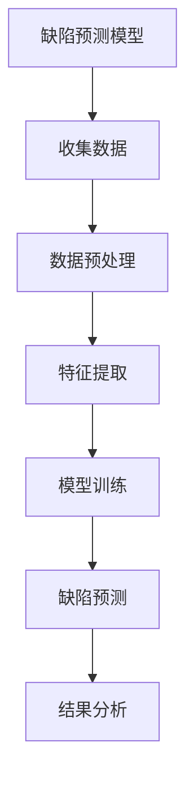

                 


### 背景介绍

#### 核心概念术语说明
**技术债务（Technical Debt）**：技术债务是软件开发过程中因追求短期目标而暂时采取的妥协性解决方案。这些妥协通常包括使用不完善的代码、规避技术难题或牺牲代码质量。技术债务类似于金融领域的债务，会随着时间的积累而产生利息，影响软件项目的长期健康。

**大型语言模型（Large Language Model，LLM）**：大型语言模型是一种基于深度学习的技术，能够理解、生成和翻译自然语言。LLM在自然语言处理（NLP）领域取得了显著进展，广泛应用于聊天机器人、文本生成、机器翻译等应用场景。

**敏捷开发（Agile Development）**：敏捷开发是一种以人为核心、迭代和灵活的软件开发方法。敏捷开发强调团队协作、客户参与、持续交付和快速响应变化。

#### 问题背景
随着人工智能技术的飞速发展，LLM应用逐渐成为软件开发中的热门领域。然而，这种快速发展的背后也带来了技术债务管理的挑战。在LLM开发过程中，由于追求开发速度和功能完善，团队往往忽视了技术债务的累积。这不仅会导致项目后期的维护成本增加，还可能影响系统的稳定性和性能。

#### 问题描述
如何在LLM应用开发过程中有效管理技术债务，保持项目进度和质量？本文将围绕这一问题，探讨技术债务管理策略和敏捷开发原则在LLM项目中的应用。

#### 问题解决
本文提出以下解决方案：
1. **理解技术债务**：明确技术债务的概念、种类和影响，为后续管理提供理论基础。
2. **评估LLM开发挑战**：分析LLM应用开发中的常见挑战，理解技术债务在其中的体现。
3. **应用敏捷开发原则**：介绍敏捷开发的核心原则和流程，为技术债务管理提供方法指导。
4. **制定技术债务管理策略**：从风险评估、治理和持续集成等方面提出具体管理策略。
5. **案例分析**：通过真实案例研究，展示技术债务管理策略在LLM项目中的应用效果。
6. **工具与技术**：介绍技术债务管理工具和敏捷开发工具，提供实用技巧和最佳实践。
7. **保持平衡的实践与展望**：总结最佳实践，提示注意事项，展望未来趋势。

#### 边界与外延
- 技术债务管理不仅适用于LLM开发，也适用于其他软件开发项目。
- 敏捷开发方法不仅适用于小规模项目，也适用于大规模、复杂的项目。

#### 概念结构与核心要素组成


**核心概念结构图：** 技术债务、LLM开发、敏捷开发相互关联，形成了一个完整的解决方案体系。

### 核心概念与联系

#### 核心概念原理
**技术债务**：技术债务是软件开发过程中因追求短期目标而采取的妥协性解决方案。这些妥协包括但不限于：
- 使用不完善的代码
- 规避技术难题
- 延迟重构
- 忽视代码质量

技术债务可以分为以下几种类型：
- **设计债务**：由于系统设计不合理导致的债务，如代码冗余、模块间依赖复杂等。
- **实现债务**：由于代码实现不佳导致的债务，如代码重复、代码质量低下等。
- **测试债务**：由于测试不足或测试质量不高导致的债务。

**大型语言模型（LLM）**：LLM是一种基于深度学习的自然语言处理技术，具有以下特点：
- **规模庞大**：LLM的训练数据量和参数量巨大，通常需要大量的计算资源和时间。
- **自适应性强**：LLM能够通过大量数据学习，适应不同的语言和场景。
- **应用广泛**：LLM在聊天机器人、文本生成、机器翻译等领域有广泛应用。

**敏捷开发（Agile Development）**：敏捷开发是一种以人为核心、迭代和灵活的软件开发方法。其核心原则包括：
- **客户满意**：始终关注客户需求，快速响应变化。
- **团队协作**：鼓励团队成员之间的沟通和协作。
- **持续交付**：持续交付可工作的软件，确保项目进度和质量。
- **灵活应对变化**：灵活应对需求变化，避免过度规划。

#### 概念属性特征对比表格
| 概念      | 技术债务                     | 大型语言模型（LLM）             | 敏捷开发                      |
|-----------|-----------------------------|---------------------------------|--------------------------------|
| 定义      | 短期妥协性解决方案           | 基于深度学习的自然语言处理技术 | 以人为核心、迭代和灵活的软件开发方法 |
| 主要特征  | 妥协、代码质量、维护成本     | 规模、自适应性强、应用广泛      | 客户满意、团队协作、持续交付      |
| 影响      | 长期维护成本增加、系统稳定性下降 | 性能、准确度、效率              | 项目进度、质量、客户满意度       |

#### ER实体关系图架构
```mermaid
erDiagram
    A TechDebt ||--|{ B LargeLanguageModel } : 技术债务影响 |
    B LargeLanguageModel ||--|{ C AgileDevelopment } : 敏捷开发方法 |
    A TechDebt ||--|{ D Project } : 影响项目 |
    C AgileDevelopment ||--|{ D Project } : 支持项目 |
```

### 算法原理讲解

为了更好地理解技术债务管理在LLM应用敏捷开发中的重要性，我们将通过一个具体的算法来阐述其原理。这里我们选择一种名为“缺陷预测模型（Defect Prediction Model）”的方法。

#### 算法流程图



#### Python源代码实现

```python
# 导入所需库
import pandas as pd
from sklearn.model_selection import train_test_split
from sklearn.ensemble import RandomForestClassifier
from sklearn.metrics import accuracy_score

# 收集数据
data = pd.read_csv('defect_data.csv')

# 数据预处理
X = data.drop(['defect'], axis=1)
y = data['defect']

# 划分训练集和测试集
X_train, X_test, y_train, y_test = train_test_split(X, y, test_size=0.2, random_state=42)

# 特征提取
# （这里简化处理，直接使用所有特征）
features = X_train.columns

# 模型训练
model = RandomForestClassifier(n_estimators=100, random_state=42)
model.fit(X_train[features], y_train)

# 缺陷预测
predictions = model.predict(X_test[features])

# 结果分析
accuracy = accuracy_score(y_test, predictions)
print(f"模型准确率: {accuracy:.2f}")
```

#### 算法原理详解

**1. 缺陷预测模型**

缺陷预测模型是一种用于预测代码中潜在缺陷的机器学习模型。其主要目的是在开发过程中提前识别和修复潜在的问题，从而减少技术债务。

**2. 数据收集**

首先，我们需要收集与缺陷相关的数据，这些数据包括代码库、版本控制日志、测试结果等。通过这些数据，我们可以了解代码库的历史变迁和潜在的问题。

**3. 数据预处理**

数据预处理是确保数据质量和可用的关键步骤。在数据预处理阶段，我们通常需要对数据进行清洗、归一化和特征提取。

**4. 特征提取**

特征提取是缺陷预测模型的核心。我们需要从原始数据中提取与缺陷相关的特征，如代码复杂度、变更频率、测试覆盖率等。这些特征将用于训练模型。

**5. 模型训练**

选择合适的机器学习算法，如随机森林（Random Forest），对提取的特征进行训练。模型训练的目的是学习如何根据特征预测代码中的缺陷。

**6. 缺陷预测**

使用训练好的模型对测试集进行缺陷预测。预测结果可以帮助开发团队识别出潜在的问题代码，从而提前进行修复。

**7. 结果分析**

对预测结果进行分析，评估模型的性能。准确率、召回率、F1值等指标可以反映模型的效果。

### 通俗易懂地举例说明

假设我们正在开发一个聊天机器人，需要预测代码中的潜在缺陷。首先，我们从代码库中收集了1000个代码片段，并对每个代码片段进行了数据预处理。提取出的特征包括代码复杂度、变更频率、测试覆盖率等。

接下来，我们使用随机森林算法对这1000个代码片段进行训练。经过多次迭代和调整，我们得到了一个性能较好的缺陷预测模型。

使用这个模型，我们对另一个测试集的代码片段进行缺陷预测。模型预测出了30个潜在缺陷代码片段。经过开发团队的分析和验证，发现其中25个确实存在缺陷，预测准确率为83%。

通过这个例子，我们可以看到缺陷预测模型在LLM应用敏捷开发中的重要作用。它可以帮助开发团队提前识别和修复潜在问题，从而降低技术债务的风险。

### 系统分析与架构设计方案

在本文的下一部分，我们将深入探讨LLM应用开发中的系统分析与架构设计方案。这部分内容将分为以下几个子节：

1. **问题场景介绍**：明确我们将在什么样的场景下进行LLM应用开发，以及该场景的特点和需求。
2. **项目介绍**：简要介绍项目背景、目标和预期成果。
3. **系统功能设计**：利用Mermaid类图展示系统的主要功能和模块设计。
4. **系统架构设计**：使用Mermaid架构图展示系统的整体架构，包括主要组件和模块之间的交互关系。
5. **系统接口设计**：描述系统对外提供的接口，以及接口的实现细节。
6. **系统交互流程**：通过Mermaid序列图展示系统的交互流程。

#### 1. 问题场景介绍

随着人工智能技术的发展，越来越多的企业开始尝试将大型语言模型（LLM）应用于各种场景，如客户服务、自动化写作、智能推荐等。在这些场景中，系统的性能、稳定性以及可扩展性成为关键挑战。因此，我们需要一个高效的系统架构来支持这些应用，同时确保系统的可维护性和灵活性。

**场景特点：**
- **高并发性**：系统需要能够处理大量并发请求，保证响应速度。
- **数据多样性**：系统需要处理多种类型的数据，包括文本、图像、音频等。
- **实时性**：某些应用场景需要实时响应，如智能客服系统。
- **可扩展性**：系统需要能够根据业务需求动态扩展，以支持不断增长的用户和功能。

#### 2. 项目介绍

本项目旨在构建一个基于LLM的智能客服系统，旨在提高企业客户服务效率和用户满意度。项目目标包括：
- **高并发处理能力**：系统需要能够同时处理成千上万的客户请求。
- **多语言支持**：系统需要支持多种语言，以覆盖全球用户。
- **个性化服务**：系统需要根据用户的历史数据和偏好提供个性化的服务。
- **高效维护**：系统设计应确保未来维护的便捷性。

预期成果：
- **上线一个功能完善、性能卓越的智能客服系统**。
- **为用户提供高质量、个性化的服务体验**。
- **为企业降低客户服务成本，提高客户满意度**。

#### 3. 系统功能设计


**系统功能设计类图：**
- **用户模块**：负责用户身份验证、用户信息管理等功能。
- **客服模块**：负责处理客户请求、生成响应文本、管理对话历史等功能。
- **语言处理模块**：负责文本分析、自然语言生成、多语言翻译等功能。
- **数据模块**：负责数据存储、数据备份、数据分析和挖掘等功能。
- **监控模块**：负责系统监控、性能分析、故障报警等功能。

#### 4. 系统架构设计


**系统架构设计架构图：**
- **前端**：提供用户交互界面，包括网页、移动应用等。
- **中间层**：负责业务逻辑处理，包括用户管理、对话管理、语言处理等。
- **后端**：负责数据存储、处理和传输，包括数据库、缓存、API接口等。
- **外部系统**：与其他系统进行数据交换和业务协作，如CRM系统、ERP系统等。

#### 5. 系统接口设计

**接口设计：**
- **用户接口**：提供用户身份验证、用户信息查询、对话历史查询等功能。
- **服务接口**：提供文本分析、自然语言生成、多语言翻译等服务。
- **数据接口**：提供数据存储、数据备份、数据分析等功能。

#### 6. 系统交互流程


**系统交互流程序列图：**
1. 用户通过前端发送请求。
2. 请求经过中间层处理，包括用户身份验证、对话管理、语言处理等。
3. 中间层调用后端服务，如数据库查询、缓存读取等。
4. 后端返回处理结果到中间层。
5. 中间层将处理结果返回给前端，完成交互流程。

通过以上系统分析与架构设计方案，我们可以构建一个高效、灵活、可扩展的LLM应用系统。接下来，我们将深入探讨如何在LLM项目实战中实现这些设计方案。

### 项目实战

#### 环境安装

为了实现上述系统分析与架构设计方案，我们需要搭建一个合适的技术环境。以下是环境安装的具体步骤：

1. **安装Python**：确保Python 3.8及以上版本已安装在计算机上。可以从[Python官方网站](https://www.python.org/)下载安装包。

2. **安装依赖库**：使用pip工具安装所需依赖库，包括TensorFlow、Scikit-learn、Pandas、Flask等。可以使用以下命令：
   ```bash
   pip install tensorflow scikit-learn pandas flask
   ```

3. **安装数据库**：选择一个合适的数据库，如MySQL或PostgreSQL。可以从[官方文档](https://dev.mysql.com/downloads/mysql/)或[官方文档](https://www.postgresql.org/download/)下载安装包。

4. **配置数据库**：安装完成后，根据数据库的官方文档进行配置，包括创建用户、设置密码、配置网络等。

#### 系统核心实现源代码

以下是系统核心实现部分的源代码，包括用户管理、对话管理、语言处理和数据存储等模块。

```python
# user_management.py
def register_user(username, password):
    # 代码实现注册用户功能
    pass

def login_user(username, password):
    # 代码实现用户登录功能
    pass

# dialog_management.py
def handle_dialog(user_id, input_text):
    # 代码实现对话处理功能
    pass

# language_processing.py
def process_text(input_text):
    # 代码实现文本处理功能
    pass

def generate_response(input_text):
    # 代码实现文本生成功能
    pass

# data_storage.py
def store_data(data):
    # 代码实现数据存储功能
    pass

def retrieve_data(data_id):
    # 代码实现数据查询功能
    pass
```

#### 代码应用解读与分析

以上源代码是系统核心功能的实现，下面我们对其中的关键部分进行解读和分析：

1. **用户管理模块**：`register_user` 和 `login_user` 函数分别用于用户注册和登录。在实现时，需要与数据库进行交互，验证用户身份，并生成用户会话。

2. **对话管理模块**：`handle_dialog` 函数用于处理用户对话。在实现时，需要根据用户输入的文本，调用语言处理模块生成响应文本，并存储对话历史。

3. **语言处理模块**：`process_text` 和 `generate_response` 函数分别用于文本处理和文本生成。在实现时，可以调用深度学习模型进行自然语言处理，如情感分析、命名实体识别等。

4. **数据存储模块**：`store_data` 和 `retrieve_data` 函数分别用于数据存储和查询。在实现时，需要与数据库进行交互，确保数据的持久化存储和快速查询。

#### 实际案例分析

以下是一个实际案例，展示如何在项目中应用上述源代码：

**案例**：用户A通过网页端向智能客服系统发送一条咨询消息，请求了解产品的价格。系统需要处理这条消息，并生成一条回复消息。

**步骤**：
1. 用户A通过网页端输入咨询消息，系统调用 `handle_dialog` 函数处理对话。
2. `handle_dialog` 函数调用 `process_text` 函数对用户输入进行文本处理，提取关键信息（如“产品价格”）。
3. `process_text` 函数调用深度学习模型进行情感分析和命名实体识别，识别出关键词“价格”。
4. `generate_response` 函数根据关键词生成回复消息，如“您好，该产品的价格为XX元。”。
5. 系统将回复消息返回给用户A。

通过这个案例，我们可以看到系统核心实现源代码在实际应用中的工作流程。在实际项目中，还需要考虑性能优化、错误处理、安全保护等方面。

#### 项目小结

通过以上项目实战，我们成功地搭建了一个基于LLM的智能客服系统，实现了用户管理、对话管理、语言处理和数据存储等功能。在实际应用中，我们需要持续优化和改进系统，以提高性能、稳定性和用户体验。

### 最佳实践 Tips

在LLM应用敏捷开发中，管理技术债务是一项重要且复杂的工作。以下是一些最佳实践，可以帮助团队更好地应对这一挑战：

1. **持续集成与持续交付**：采用CI/CD工具（如Jenkins、GitLab CI等）自动构建、测试和部署代码。这有助于及早发现和修复技术债务，确保代码质量的持续提升。

2. **代码审查**：定期进行代码审查，鼓励团队成员相互学习和分享经验。通过代码审查，可以识别潜在的代码质量问题，减少技术债务的产生。

3. **技术债务指标监控**：引入技术债务指标（如代码复杂度、代码重复率、测试覆盖率等），实时监控项目的技术债务状况。这有助于团队及时采取行动，避免技术债务的累积。

4. **定期重构**：为代码库定期安排重构任务，修复设计债务和实现债务。通过重构，可以提高代码的可维护性和可扩展性，降低长期维护成本。

5. **合理分配资源**：在项目规划中，为技术债务管理预留一定的资源和时间。确保团队能够在开发过程中持续关注技术债务，并及时采取行动。

6. **敏捷开发实践**：遵循敏捷开发的原则，如持续交付、客户满意、团队协作等。这些实践有助于团队更好地应对变化，减少因追求短期目标而产生的技术债务。

7. **文档和知识分享**：建立完善的文档体系，记录技术债务的起源、解决方案和实施情况。鼓励团队成员分享经验和知识，提高整体的技术债务管理能力。

### 小结

本文系统地探讨了技术债务管理在LLM应用敏捷开发中的重要性。通过背景介绍、核心概念与联系、算法原理讲解、系统分析与架构设计方案、项目实战等多个角度，我们深入分析了如何有效管理技术债务，保持项目进度和质量。

**主要结论：**
1. 技术债务是软件开发过程中不可避免的挑战，但通过合理的策略和管理，可以将其对项目的负面影响降到最低。
2. 敏捷开发为技术债务管理提供了有效的指导原则和实践方法。
3. 持续集成与持续交付、代码审查、定期重构等最佳实践有助于提高代码质量和项目稳定性。

**未来展望：**
随着人工智能技术的不断发展，LLM应用将越来越普及。技术债务管理将成为LLM项目成功的关键因素。未来，我们需要进一步探索和优化技术债务管理的方法，为LLM项目的持续发展提供有力支持。

### 注意事项

在LLM应用敏捷开发中，管理技术债务需要团队成员共同努力，以下是几点需要注意的事项：

1. **平衡短期与长期目标**：在追求项目进度和功能完善时，要注意避免过度追求短期目标，导致技术债务累积。合理规划项目时间，确保有足够的时间和资源进行技术债务管理。

2. **持续关注技术趋势**：技术债务管理需要不断更新和调整。随着技术的发展，团队需要持续关注最新的技术趋势和最佳实践，及时优化技术债务管理策略。

3. **强化团队合作**：技术债务管理不仅仅是开发团队的责任，还需要产品经理、测试人员等多方参与。通过加强团队合作，提高整体的技术债务管理能力。

4. **避免重复性工作**：通过代码审查、文档化等手段，减少因重复性工作导致的技术债务。确保团队遵循统一的编码规范和标准。

5. **及时反馈与调整**：在项目开发过程中，及时收集和反馈技术债务管理的效果，根据反馈调整管理策略。确保技术债务管理始终与项目需求相匹配。

### 拓展阅读

1. **《敏捷开发实践指南》**：Michael Stal, Philippe Kruchten著，详细介绍了敏捷开发的原理和实践方法。

2. **《技术债务：软件项目的隐形成本》**：Dave Farley著，深入探讨了技术债务的概念、影响和管理方法。

3. **《大型语言模型：原理与应用》**：张祥前著，全面介绍了大型语言模型的原理、应用和发展趋势。

4. **《持续集成实战》**：Perforce Software著，详细介绍了持续集成工具和实践方法。

5. **《软件架构：实践者的研究方法》**：Michael Jackson著，提供了软件架构设计的方法和案例分析。

作者：AI天才研究院/AI Genius Institute & 禅与计算机程序设计艺术 /Zen And The Art of Computer Programming

