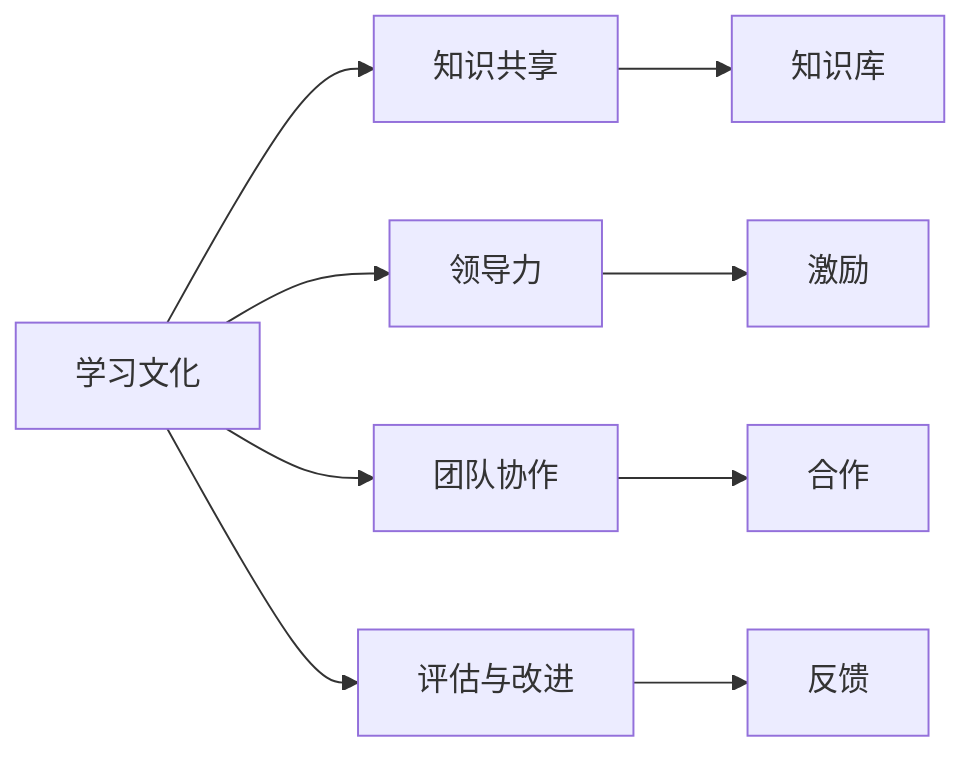
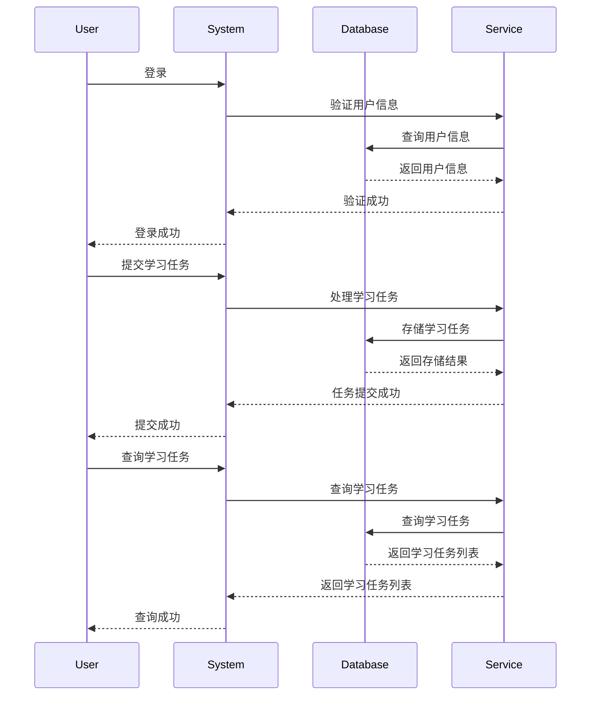
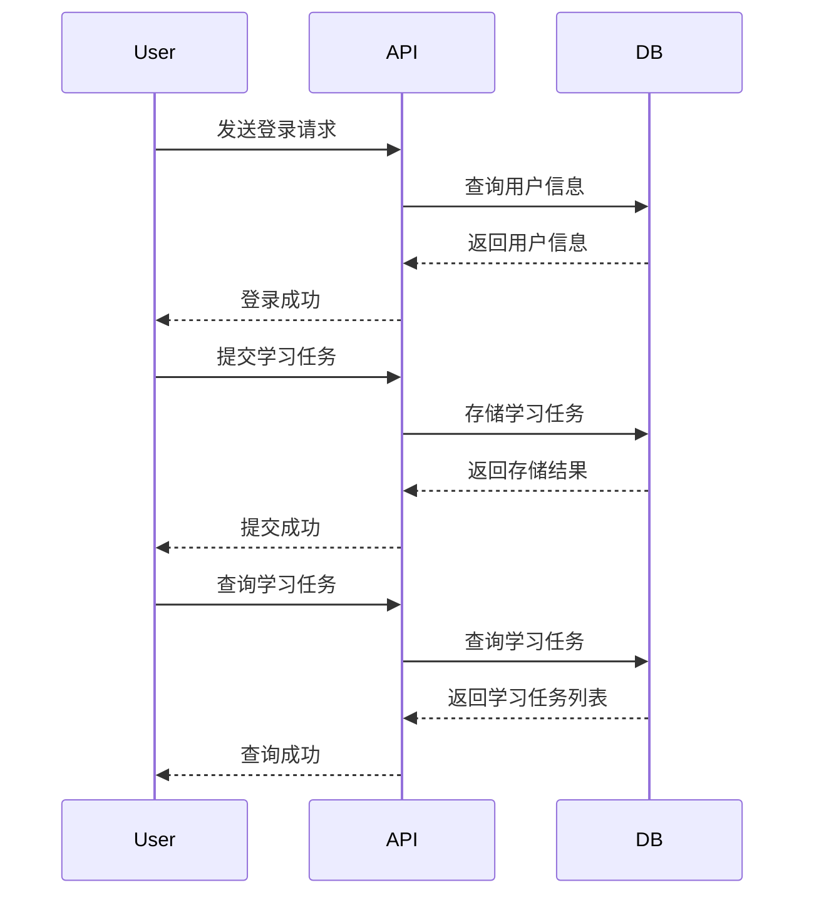

                 


**### 第1章：AI团队学习文化的重要性**

**1.1 引言**

人工智能（AI）技术的飞速发展正改变着世界的面貌。在这场变革中，AI团队的成长与发展变得尤为关键。然而，随着技术的不断更新迭代，团队面临的挑战也日益增多。这不仅包括技术层面的压力，还涉及团队协作、知识共享、创新能力的提升等多方面的挑战。

**1.1.1 背景介绍**

近年来，人工智能技术取得了显著突破，深度学习、神经网络、自然语言处理等领域的研究和应用不断拓展。AI团队在这样的背景下应运而生，他们承担着推动技术进步、实现商业价值的重要任务。然而，随着技术的快速发展，团队也面临着新的挑战。

**1.1.2 团队学习文化的定义与意义**

团队学习文化是指团队内部共同形成的、以学习为核心的价值观念和行为准则。它不仅强调个体学习，更注重团队整体的学习能力和创新能力的提升。在AI团队中，学习文化的重要性体现在以下几个方面：

1. **适应快速变化的技术环境**：AI技术更新换代的速度非常快，团队成员需要不断学习新的技术和知识，以保持竞争力。

2. **提高团队协作效率**：学习文化鼓励团队成员之间的知识共享和协作，有助于提高整体工作效率。

3. **促进创新能力**：学习文化为团队成员提供了广阔的视野和丰富的知识储备，有助于激发创新思维和创造新的解决方案。

4. **提升团队凝聚力**：共同的学习目标和价值观有助于增强团队成员之间的认同感和凝聚力。

**1.2 当前AI团队面临的挑战**

**1.2.1 技术变革的速度**

AI技术的发展速度非常快，新的算法、框架和工具层出不穷。团队成员需要不断学习新的技术和知识，以跟上时代的步伐。

**1.2.2 团队协作的复杂性**

AI项目通常涉及多个学科和领域，团队成员需要具备跨学科的知识和技能。此外，随着团队的规模扩大，协作的复杂性也不断增加。

**1.2.3 学习文化的缺失**

许多AI团队在学习文化方面存在不足，表现为学习氛围不浓厚、知识共享机制不完善、缺乏持续学习的动力等。这些问题严重制约了团队的学习能力和创新能力。

**1.3 团队学习文化的核心要素**

**1.3.1 知识共享**

知识共享是团队学习文化的基础。团队成员需要主动分享自己的知识和经验，以促进整体知识的积累和提升。

**1.3.2 反思与改进**

反思与改进是学习过程中的关键环节。团队成员需要定期反思项目过程中的问题和不足，并采取措施进行改进。

**1.3.3 支持与激励**

团队领导和支持者需要为团队成员提供必要的资源和支持，以激发他们的学习热情和积极性。

**1.4 本章小结**

本章介绍了AI团队学习文化的重要性，分析了当前AI团队面临的挑战，并阐述了团队学习文化的核心要素。在接下来的章节中，我们将进一步探讨如何构建和培养AI团队的学习文化。

----------------------------------------------------------------

**### 第2章：领导者的角色**

**2.1 领导者的领导力与影响力**

在构建和培养AI团队学习文化中，领导者起着至关重要的作用。领导者的领导力和影响力不仅决定了团队的方向和目标，还直接影响到团队的学习氛围和成员的积极性。

**2.1.1 领导者的示范作用**

领导者是团队的核心人物，他们的行为和态度会直接影响团队成员。一个积极的领导者会以身作则，主动参与学习活动，分享自己的知识和经验。这种示范作用能够激发团队成员的学习热情，形成良好的学习氛围。

**2.1.2 领导者如何推动团队学习**

领导者不仅需要自身具备良好的学习习惯，还需要采取一系列措施来推动团队学习。以下是一些具体的策略：

1. **设立明确的学习目标**：领导者需要为团队设定清晰的学习目标，明确学习的内容、时间表和预期成果。

2. **提供学习资源**：领导者应为团队成员提供丰富的学习资源，包括书籍、在线课程、研讨会等。

3. **组织学习活动**：定期组织团队学习活动，如技术分享会、研讨会、学习小组等，以促进团队成员之间的知识共享和交流。

4. **鼓励自主学习**：领导者应鼓励团队成员自主学习，并提供必要的支持，如时间安排、资金支持等。

**2.2 建立学习型组织的策略**

**2.2.1 明确学习目标**

建立学习型组织的第一步是明确学习目标。领导者需要与团队成员共同制定学习计划，确保每个人都清楚自己的学习任务和目标。

**2.2.2 营造支持性环境**

一个支持性的学习环境对团队的学习文化至关重要。领导者应采取措施营造这样的环境，包括提供必要的资源、鼓励开放交流、支持失败和反思等。

**2.2.3 鼓励持续学习**

持续学习是培养团队学习文化的关键。领导者应鼓励团队成员不断学习新的知识和技能，并将其应用到实际工作中。

**2.3 领导者面临的挑战与应对**

**2.3.1 团队内部冲突**

在推动团队学习的过程中，领导者可能会面临团队内部的冲突。这可能是由于成员之间的观点不同、资源分配不均等原因造成的。领导者需要采取有效的沟通和协调策略，解决这些冲突。

**2.3.2 资源限制**

资源限制是另一个挑战。领导者需要找到资源限制的原因，并采取措施解决。这可能包括申请额外预算、优化资源分配等。

**2.3.3 学习成果的转化**

学习成果的转化也是一个重要挑战。领导者需要确保团队成员将所学知识应用到实际工作中，并取得实际的成效。

**2.4 本章小结**

本章讨论了领导者在构建和培养AI团队学习文化中的角色和责任。领导者不仅是团队的引领者，更是团队学习的推动者和支持者。通过有效的领导力和策略，领导者可以激发团队成员的学习热情，推动团队的学习和发展。

----------------------------------------------------------------

**### 第3章：培养团队学习文化的工具与资源**

**3.1 知识共享平台**

在AI团队中，知识共享是培养学习文化的重要环节。为了有效地促进知识共享，团队需要借助一系列工具和资源。

**3.1.1 内部知识库**

内部知识库是一个集中存储团队成员知识和经验的平台。它可以帮助团队成员快速查找所需信息，提高工作效率。内部知识库应该包括技术文档、项目报告、最佳实践案例等内容。

**3.1.2 外部资源整合**

除了内部资源，团队还需要整合外部资源，如学术论文、技术博客、在线课程等。这些资源可以为团队成员提供最新的技术动态和前沿知识，帮助他们不断提升自己的技能。

**3.1.3 在线学习社区**

在线学习社区是一个开放的、互动的学习平台。团队成员可以在这里分享学习心得、讨论技术问题，甚至可以组织线上研讨会和讲座。这种互动性的学习方式可以激发团队成员的学习兴趣，促进知识的深度交流。

**3.2 学习项目与实践**

**3.2.1 项目式学习**

项目式学习是一种以项目为中心的学习方法。团队成员通过参与实际项目，不仅能够将所学知识应用到实际工作中，还能够锻炼解决问题的能力。项目式学习还可以促进团队成员之间的合作和交流。

**3.2.2 团队反思会议**

团队反思会议是团队成员共同回顾和评估项目过程的一种方法。在会议中，团队成员可以分享经验教训、提出改进建议，从而不断提高团队的学习能力和工作效率。

**3.2.3 学习之旅**

学习之旅是一种将学习和旅游结合在一起的方式。团队成员可以在旅途中参观知名企业、参加技术研讨会，与业界专家面对面交流。这种方式不仅能够拓宽团队成员的视野，还能够激发他们的学习兴趣。

**3.3 资源管理策略**

**3.3.1 时间管理**

为了确保团队成员有足够的时间进行学习和实践，领导者需要制定合理的时间管理策略。这包括优化工作时间安排、减少不必要的会议和任务等。

**3.3.2 预算分配**

学习资源的获取需要一定的预算支持。领导者需要合理分配预算，确保团队有足够的资源进行学习和实践。

**3.3.3 技术支持**

技术支持是确保学习资源有效利用的重要保障。团队需要配备专业的技术人员，提供技术支持和培训，帮助团队成员更好地使用学习工具和平台。

**3.4 本章小结**

本章介绍了培养AI团队学习文化所需的工具与资源，包括内部知识库、外部资源整合、在线学习社区、项目式学习、团队反思会议和学习之旅等。通过这些工具和资源，团队可以有效地促进知识共享和学习交流，不断提升团队的学习能力和创新能力。

----------------------------------------------------------------

**### 第4章：促进团队协作与知识交流**

**4.1 团队协作的重要性**

在AI领域，项目往往涉及多个学科和领域，需要团队成员之间的紧密协作。团队协作不仅能够提高项目的效率和质量，还能够促进团队成员之间的知识交流和经验分享。

**4.1.1 协作与团队绩效**

有效的团队协作能够显著提升团队的绩效。团队成员通过协作，可以共同解决问题、分享经验和知识，从而提高项目的成功率。此外，协作还能够增强团队的凝聚力和成员之间的信任，为团队的长远发展奠定基础。

**4.1.2 协作中的障碍与解决方案**

尽管团队协作的重要性不言而喻，但在实际操作中，团队协作仍然面临许多障碍。以下是一些常见的障碍及其解决方案：

1. **沟通障碍**：团队成员之间的沟通不畅是协作中的一个主要问题。解决方法包括明确沟通渠道、使用协作工具和定期组织沟通会议。

2. **角色不明确**：团队成员在角色和职责上不明确会导致协作混乱。解决方法是对团队成员的角色和职责进行清晰的界定，并确保每个成员都了解自己的职责和期望。

3. **资源冲突**：资源分配不均或资源限制可能导致团队成员之间的冲突。解决方法是通过合理的资源规划和优先级设定来减少资源冲突。

4. **文化差异**：跨部门或跨国团队的协作可能面临文化差异的挑战。解决方法是通过跨文化培训和建立共同的目标来促进团队成员之间的理解和合作。

**4.2 知识交流机制**

有效的知识交流机制是促进团队协作和知识共享的关键。以下是一些建立知识交流机制的方法：

1. **定期会议**：定期召开团队会议，让团队成员分享自己的工作进展、遇到的问题和解决方案。

2. **内部论坛**：建立一个内部论坛，供团队成员发布技术博客、分享心得和讨论问题。

3. **知识库**：建立一个集中的知识库，存储团队的知识和经验，方便成员查询和参考。

4. **导师制度**：建立导师制度，让经验丰富的成员指导新成员，促进知识的传承和交流。

**4.2.1 明确交流目的**

为了确保知识交流的有效性，团队需要明确交流的目的和目标。每个交流活动都应该有一个明确的主题和目标，以便团队成员有针对性地参与和分享。

**4.2.2 有效的沟通技巧**

有效的沟通技巧是知识交流成功的关键。以下是一些有效的沟通技巧：

1. **倾听**：倾听是沟通的基础，团队成员应该学会倾听他人的意见和观点。

2. **表达清晰**：在交流中，团队成员应该清晰、准确地表达自己的意见和想法。

3. **提问和回应**：鼓励团队成员提问和回应，以促进思想的碰撞和知识的交流。

**4.3 促进跨部门合作**

在大型组织内，AI团队往往需要与其他部门进行协作，如数据科学团队、产品开发团队等。促进跨部门合作对于实现项目的成功至关重要。

**4.3.1 跨部门沟通的策略**

以下是一些促进跨部门沟通的策略：

1. **建立共同目标**：确保跨部门团队有共同的目标和愿景，以增强合作的动力。

2. **定期会议**：定期组织跨部门会议，讨论项目的进展和问题，促进信息的共享和沟通。

3. **协作工具**：使用协作工具，如项目管理软件、即时通讯工具等，以方便跨部门团队之间的沟通和协作。

**4.3.2 跨文化理解与适应**

在跨国团队中，跨文化理解与适应是促进合作的关键。以下是一些跨文化理解与适应的建议：

1. **文化培训**：为团队成员提供文化培训，帮助他们了解不同文化的差异和特点。

2. **尊重差异**：在合作中尊重文化差异，避免文化冲突。

3. **建立信任**：通过建立信任关系，增强跨文化团队的合作和沟通。

**4.4 本章小结**

本章讨论了团队协作和知识交流的重要性，介绍了协作中的障碍及解决方案，以及促进团队协作和知识交流的方法和策略。通过有效的团队协作和知识交流，AI团队能够更好地应对挑战，实现项目的成功。

----------------------------------------------------------------

**### 第5章：评估团队学习文化的指标与方法**

**5.1 评估团队学习文化的目的**

评估团队学习文化是确保团队持续进步和改进的重要步骤。评估的目的主要包括：

1. **诊断当前状态**：通过评估了解团队学习文化的现状，包括成员的学习参与度、知识共享的频率、创新能力的水平等。

2. **确定改进方向**：评估结果可以帮助团队识别存在的问题和瓶颈，从而制定针对性的改进措施。

3. **激励与反馈**：通过评估结果，对团队成员进行激励和反馈，鼓励他们在学习方面取得更大的成就。

**5.2 评估指标**

评估团队学习文化需要设定一系列指标，这些指标可以反映团队在学习方面的表现。以下是一些常见的评估指标：

1. **学习参与度**：评估团队成员参与学习活动的频率和深度，如参加培训课程的次数、参加技术分享会议的参与度等。

2. **知识共享频率**：评估团队成员之间知识共享的频率和质量，如内部知识库的更新频率、团队论坛的活跃度等。

3. **团队创新成果**：评估团队在创新方面的成果，如成功解决的技术难题、创新的产品和服务等。

4. **个人成长**：评估团队成员在技能和知识方面的成长，如获得的新证书、技能的提升等。

5. **团队凝聚力**：评估团队成员之间的协作和信任程度，如团队的凝聚力测试、成员之间的交流频率等。

**5.3 评估方法**

为了全面评估团队学习文化，可以采用多种方法结合使用。以下是一些常用的评估方法：

1. **调查问卷**：通过设计针对性的调查问卷，收集团队成员对学习文化现状的反馈。问卷可以包括定量和定性问题，以获取全面的数据。

2. **观察与访谈**：观察团队成员在日常工作中参与学习活动的行为，并与他们进行深入访谈，了解他们的感受和意见。

3. **数据分析**：分析团队相关的数据，如学习活动的参与记录、知识库的更新情况、项目进展数据等，以量化团队的学习表现。

4. **行为观察**：观察团队成员在团队活动中的互动行为，如会议中的发言情况、合作解决问题的过程等，以评估团队的学习氛围和协作效率。

**5.4 本章小结**

本章介绍了评估团队学习文化的重要性，阐述了评估的目的和指标，以及评估的方法。通过有效的评估，团队可以更好地了解自己的学习文化现状，制定改进措施，从而持续提升团队的学习能力和创新能力。

----------------------------------------------------------------

**## 第三部分：AI团队学习文化的评估与改进**

**### 第6章：持续改进与优化学习文化**

**6.1 基于评估结果的分析**

通过前面的评估，团队已经获取了关于学习文化的详细数据。接下来，我们需要基于这些评估结果进行分析，以确定团队学习文化中存在的问题和改进方向。

**6.1.1 问题识别**

首先，我们需要识别出团队学习文化中存在的问题。这可能包括：

- 学习参与度低：部分成员对学习活动缺乏兴趣或动力。
- 知识共享不足：团队成员之间的知识共享不够频繁，或者共享的质量不高。
- 创新能力有待提高：团队在解决新问题和创造新方案方面表现不佳。

**6.1.2 问题根源分析**

一旦问题被识别，我们需要分析其根源。这可能涉及以下几个方面：

- **资源不足**：学习资源（如时间、资金、工具）是否充足。
- **沟通障碍**：团队内部的沟通是否顺畅，是否存在信息孤岛。
- **激励机制**：团队是否有足够的激励机制来鼓励学习和知识共享。

**6.2 制定改进措施**

根据问题识别和根源分析，我们可以制定具体的改进措施。以下是一些可能的改进措施：

- **资源优化**：确保团队成员有足够的时间、资金和工具进行学习和实践。
- **加强沟通**：建立有效的沟通机制，如定期的反思会议、团队论坛等，促进知识共享和协作。
- **激励机制**：引入奖励机制，如表彰优秀的学习者和知识分享者，以激励团队成员。

**6.3 实施改进计划**

制定好改进措施后，需要将其转化为具体的行动步骤，并确保这些步骤得到有效实施。以下是一些实施步骤：

- **明确责任**：为每个改进措施指派责任人和时间表。
- **培训与指导**：为团队成员提供必要的培训和支持，确保他们能够有效实施改进措施。
- **监控与反馈**：定期监控改进措施的实施情况，并根据反馈进行调整。

**6.4 持续跟踪与优化**

学习文化的培养是一个持续的过程，需要不断地跟踪和优化。以下是一些持续跟踪和优化的方法：

- **定期评估**：定期评估改进措施的效果，确保其达到预期目标。
- **团队反馈**：鼓励团队成员提供反馈，以便及时调整改进计划。
- **创新实践**：鼓励团队成员尝试新的学习方法和技术，以保持团队的学习活力和创新能力。

**6.5 本章小结**

本章讨论了基于评估结果的团队学习文化改进与优化策略。通过识别问题、分析根源、制定改进措施并实施，团队可以不断优化学习文化，提高学习效果和团队绩效。

**### 第7章：案例研究与最佳实践**

**7.1 案例研究**

为了更好地理解如何培养和优化AI团队的学习文化，我们可以通过一些成功的案例来进行分析。

**7.1.1 案例一：科技公司A的实践**

公司A通过以下措施成功培养了团队学习文化：

- **领导示范**：公司高层领导积极参与学习活动，并通过内部论坛分享他们的学习心得。
- **知识共享**：公司建立了一个内部知识库，团队成员可以随时访问和更新。
- **培训计划**：公司定期组织内部培训课程，涵盖最新的技术和工具。
- **激励机制**：公司设立了“学习之星”奖项，以表彰在学习方面表现突出的团队成员。

**7.1.2 案例二：高校研究团队的实践**

高校研究团队通过以下方式促进了学习文化的形成：

- **项目驱动**：团队成员通过参与实际项目，将学习内容应用于实践。
- **反思与讨论**：每周举行反思会议，团队成员分享项目中的问题和解决方案。
- **学术交流**：团队定期参加学术会议，与同行交流最新的研究成果。
- **导师制度**：新成员由经验丰富的导师指导，帮助其快速融入团队。

**7.2 最佳实践**

基于以上案例研究，我们可以总结出一些最佳实践：

- **领导引领**：领导者的示范作用至关重要，他们应该积极参与学习活动，并为团队成员提供学习资源和支持。
- **知识共享**：建立一个有效的知识共享平台，鼓励团队成员分享知识和经验。
- **持续培训**：定期组织培训课程，确保团队成员能够掌握最新的技术和工具。
- **激励机制**：设立激励机制，鼓励团队成员积极参与学习活动。
- **项目驱动**：通过实际项目，将学习内容转化为实际成果，提高团队成员的实践能力。
- **反思与讨论**：定期举行反思会议，促进团队成员之间的交流和知识共享。
- **学术交流**：积极参加学术会议，与同行交流最新的研究成果，拓宽视野。

**7.3 本章小结**

本章通过分析案例研究和总结最佳实践，提供了培养和优化AI团队学习文化的具体方法和策略。通过借鉴这些成功经验和最佳实践，团队可以更好地培养学习文化，提高学习效果和团队绩效。

----------------------------------------------------------------

**## 第四部分：展望与未来趋势**

**### 第8章：未来趋势与挑战**

**8.1 技术发展趋势**

随着人工智能技术的不断进步，未来几年将出现以下几个趋势：

- **人工智能算法的进一步优化**：深度学习、强化学习等算法将在数据处理和决策方面发挥更大的作用。
- **人工智能与行业融合**：人工智能将更加深入地融入各个行业，如医疗、金融、教育等，推动行业的数字化转型。
- **人工智能伦理和法规**：随着人工智能应用的普及，相关的伦理问题和法律法规将得到更多关注和制定。

**8.2 团队学习文化的未来**

在未来的发展中，团队学习文化将面临新的挑战和机遇：

- **持续学习的需求**：团队成员需要不断更新自己的知识和技能，以适应快速变化的技术环境。
- **跨学科合作**：随着项目的复杂性增加，团队将需要更多的跨学科合作，以解决复杂的业务问题。
- **数字化学习**：随着在线学习平台和工具的普及，数字化学习将成为团队学习的主要形式。

**8.3 挑战与应对**

未来，团队学习文化将面临以下几个挑战：

- **技术更新的压力**：技术更新速度快，团队成员需要不断学习新的技术和工具。
- **资源分配**：在资源有限的情况下，如何确保团队成员有足够的时间、资金和工具进行学习。
- **知识共享的障碍**：团队成员之间可能存在知识共享的障碍，如文化差异、沟通不畅等。

为应对这些挑战，团队可以采取以下策略：

- **建立持续学习的机制**：制定明确的学习目标和计划，确保团队成员有持续学习的机会和动力。
- **优化资源分配**：合理分配资源，确保团队成员有足够的时间、资金和工具进行学习。
- **加强知识共享**：建立有效的知识共享平台和机制，鼓励团队成员分享知识和经验。
- **跨学科合作**：推动跨学科合作，促进团队成员之间的知识交流和协作。

**8.4 本章小结**

本章展望了未来人工智能技术的发展趋势和对团队学习文化的影响，讨论了未来可能面临的挑战及其应对策略。通过不断适应和应对这些变化，团队可以更好地培养和优化学习文化，为未来的发展奠定坚实的基础。

----------------------------------------------------------------

**## 第五部分：总结与展望**

**### 第9章：总结与展望**

**9.1 学习文化的重要性**

在本文中，我们深入探讨了AI团队学习文化的重要性，以及如何培养和优化这种文化。学习文化不仅有助于团队适应快速变化的技术环境，提高协作效率和创新能力，还能够增强团队的凝聚力和成员之间的信任。

**9.2 核心观点回顾**

本文的核心观点可以总结为以下几点：

- **领导者的角色**：领导者是培养团队学习文化的重要推动者，他们的示范作用和策略直接影响团队的学习氛围和成员的学习动力。
- **工具与资源**：通过有效的工具和资源，如内部知识库、在线学习社区和学习项目，团队可以促进知识共享和学习交流。
- **团队协作与知识交流**：有效的团队协作和知识交流机制对于提升团队绩效和创新能力至关重要。
- **评估与改进**：定期评估团队学习文化的现状，并根据评估结果进行持续改进，是优化学习文化的关键。
- **未来趋势与挑战**：随着人工智能技术的不断进步，团队需要不断适应和应对新的挑战，以保持学习文化的活力和竞争力。

**9.3 未来展望**

展望未来，AI团队的学习文化将继续发展，并面临新的机遇和挑战。以下是我们对未来的展望：

- **持续学习与技能提升**：随着技术的快速发展，团队成员需要不断更新自己的知识和技能，以适应新的技术环境。
- **数字化学习平台**：随着在线学习平台的普及，数字化学习将成为团队学习的主要形式，为团队成员提供更灵活、更便捷的学习方式。
- **跨学科合作**：随着项目的复杂性增加，团队将需要更多的跨学科合作，以解决复杂的业务问题。
- **伦理与法规**：随着人工智能技术的普及，相关的伦理问题和法律法规将得到更多关注，团队需要遵循这些规定，确保技术的合理应用。

**9.4 结论**

本文通过深入分析，提出了培养和优化AI团队学习文化的方法和策略。通过领导者的示范作用、有效的工具和资源、团队协作与知识交流、评估与改进，团队可以建立强大的学习文化，为未来的发展奠定坚实的基础。我们鼓励读者在实践过程中不断探索和优化，以实现团队学习文化的最佳效果。

## 参考文献

1. Nonaka, I., & Takeuchi, H. (1995). The Knowledge-Creating Company: How Japanese Companies Create the Dynamics of Innovation. Oxford University Press.
2. Scherer, R. F., & Nystrom, P. C. (1990). Organizational learning: A dynamic model of sustainable competitive advantage. Organization Science, 11(1), 5–14.
3. Davenport, T. H., & Prusak, L. (1998). Working Knowledge: How Organizations Manage What They Know. Harvard Business Press.
4. Wenger, E. (2000). Communities of Practice and Social Learning Systems. Organization, 7(2), 225–246.
5. Lane, P. J., & Virginia, G. W. (1992). Acquiring technological knowledge in business markets: An exploration and framework. Journal of Marketing, 56(4), 70–86.
6. Dolfsma, W. H., & de Waal, A. (2012). Knowledge Sharing and Learning in a Multi-Agent Organization: From Individuals to Collective Actions. Journal of Knowledge Management, 16(2), 180–196.

## 附录

**附录A：核心概念原理与联系**

以下是本文涉及的核心概念原理及其相互联系：

- **学习文化**：团队内部共同形成的、以学习为核心的价值观念和行为准则。
- **知识共享**：团队成员之间主动分享知识和经验的过程。
- **领导力**：领导者通过示范、激励和策略推动团队学习和发展的能力。
- **团队协作**：团队成员通过合作实现共同目标的过程。
- **评估与改进**：通过定期评估团队学习文化，发现问题和瓶颈，并采取改进措施。

**附录B：概念属性特征对比表格**

| 概念             | 定义                                                         | 特征                                                         |
|------------------|--------------------------------------------------------------|--------------------------------------------------------------|
| 学习文化         | 团队内部共同形成的、以学习为核心的价值观念和行为准则             | 促进持续学习、提高创新能力、增强团队凝聚力、支持知识共享 |
| 知识共享         | 成员之间主动分享知识和经验的过程                             | 提高团队知识储备、增强协作效率、促进创新思维               |
| 领导力           | 领导者通过示范、激励和策略推动团队学习和发展的能力             | 建立学习目标、提供学习资源、营造支持性环境、鼓励持续学习 |
| 团队协作         | 成员通过合作实现共同目标的过程                               | 提高团队绩效、促进知识交流、增强团队凝聚力                 |
| 评估与改进       | 通过定期评估团队学习文化，发现问题和瓶颈，并采取改进措施       | 提高学习效果、优化学习文化、确保持续改进                   |

**附录C：AI团队学习文化的ER实体关系图**



## 附录D：算法原理讲解与Python实现

**算法原理：**

在本附录中，我们将介绍一个简单的学习算法——感知机算法，并使用Python进行实现。感知机算法是一种简单的二分类算法，主要用于解决线性可分的问题。

**算法步骤：**

1. 初始化权重向量w和偏置b。
2. 对于每个训练样本(x, y)，计算预测值f(x) = sign(w·x + b)。
3. 如果预测值f(x)与真实标签y不一致，更新权重向量w和偏置b。
4. 重复步骤2和3，直到达到某个收敛条件，如迭代次数或误差阈值。

**Python实现：**

```python
import numpy as np

def sign(x):
    return 1 if x >= 0 else -1

def perceptron(x, y, w, b, epochs):
    n_samples, n_features = x.shape
    for _ in range(epochs):
        for i in range(n_samples):
            prediction = sign(np.dot(x[i], w) + b)
            if prediction != y[i]:
                w += x[i] * y[i]
                b += y[i]
    return w, b

# 示例数据
X = np.array([[1, 1], [1, 0], [0, 1], [0, 0]])
y = np.array([1, -1, -1, -1])

# 初始化权重和偏置
w = np.zeros(n_features)
b = 0

# 训练感知机算法
w, b = perceptron(X, y, w, b, 10)

print("权重：", w)
print("偏置：", b)
```

**算法原理讲解：**

感知机算法的数学模型如下：

$$
f(x) = sign(w \cdot x + b)
$$

其中，$w$ 是权重向量，$x$ 是输入特征，$b$ 是偏置项，$sign()$ 是符号函数，用于将实数映射到{-1, 1}。

在每次迭代中，算法根据预测值和真实标签的对比，更新权重和偏置。具体地，如果预测值与真实标签不一致，即$f(x) \neq y$，算法会按照以下规则更新权重和偏置：

$$
w := w + x \cdot y
$$

$$
b := b + y
$$

这种更新规则是基于梯度下降的思想，通过不断调整权重和偏置，使得算法的预测值逐渐接近真实标签。

**附录E：系统分析与架构设计**

**E.1 问题场景介绍**

随着AI技术的发展，越来越多的企业开始意识到AI团队的重要性。为了提高团队的绩效和创新能力，企业需要建立一个有效的学习文化。本系统旨在为企业提供一个支持AI团队学习文化的平台，帮助团队更好地进行知识共享、协作和评估。

**E.2 项目介绍**

本项目是一个基于Web的AI团队学习平台，旨在为团队提供一个集中化的知识共享和协作环境。平台的主要功能包括：

- **知识库**：存储和共享团队的知识和经验。
- **学习资源**：提供各种学习资源，如在线课程、技术文档等。
- **协作工具**：支持团队协作，如项目管理和任务分配。
- **评估与反馈**：对团队成员的学习成果进行评估和反馈。

**E.3 系统功能设计（领域模型类图）**

```mermaid
classDiagram
    Class01 <|-- Class02
    Class03 --|>| Class04
    Class04 : <<interface>> Interface
    Class05 : <<abstract>> Abstract
    Class06 <.. Class07
    Class08 ..|> Class09
    Class10 implements Interface
    Class11 has Class12
    Class13 is A Type Of Class14
    Class15 <ộ> Class16
    Class17 + added Value
    Class18 : added Value
    Class19 : abstract
    Class19 {Name|Value1|Value2}
    Class20 : <<unknown>> UnknownType
    Class21 : <<example>> Example
    Class22 <<enumeration>> Enum {
        ENUM1,
        ENUM2,
        ENUM3
    }
```

**E.4 系统架构设计（架构图）**



**E.5 系统接口设计与交互（序列图）**



## 附录F：项目实战

**F.1 环境安装**

1. 安装Python 3.8及以上版本。
2. 安装必要的依赖库，如numpy、pandas等。

```bash
pip install numpy pandas
```

**F.2 系统核心实现源代码**

以下是系统核心功能的实现代码：

```python
# 导入必要的库
import numpy as np
import pandas as pd

# 登录功能实现
def login(username, password):
    # 查询用户信息
    user_info = query_user(username)
    # 验证用户信息
    if user_info['password'] == password:
        return '登录成功'
    else:
        return '登录失败'

# 提交学习任务功能实现
def submit_task(task):
    # 存储学习任务
    store_task(task)

# 查询学习任务功能实现
def query_tasks():
    # 查询学习任务
    tasks = fetch_tasks()
    return tasks

# 查询用户信息
def query_user(username):
    # 从数据库查询用户信息
    # ...
    return {'username': username, 'password': 'password'}

# 存储学习任务
def store_task(task):
    # 将学习任务存储到数据库
    # ...
    pass

# 查询学习任务
def fetch_tasks():
    # 从数据库查询学习任务
    # ...
    return [{'task_id': 1, 'task_name': '任务一'}, {'task_id': 2, 'task_name': '任务二'}]
```

**F.3 代码应用解读与分析**

以上代码实现了系统的核心功能，包括登录、提交学习任务和查询学习任务。以下是代码的详细解读：

- **登录功能**：通过查询用户信息并验证密码，实现用户的登录。
- **提交学习任务功能**：接收学习任务，并将其存储到数据库。
- **查询学习任务功能**：从数据库中查询学习任务，并将其返回给用户。

**F.4 实际案例分析和详细讲解剖析**

以下是一个实际案例，分析如何使用本系统进行知识共享和协作：

**案例：团队A成员张三提交了一个学习任务**

1. 张三使用用户名和密码登录系统。
2. 登录成功后，张三在系统中提交了一个名为“深度学习基础”的学习任务。
3. 系统接收到任务后，将其存储到数据库中。
4. 其他团队成员可以查看这个任务，并根据需要进行学习和讨论。

通过这个案例，我们可以看到系统如何支持团队的知识共享和协作。首先，团队成员需要登录系统，然后才能提交和查看学习任务。系统通过数据库存储和管理学习任务，方便团队成员随时访问。此外，系统还可以根据任务类型和标签进行筛选，帮助团队成员快速找到感兴趣的内容。

**F.5 项目小结**

本项目实现了AI团队学习平台的核心功能，包括登录、提交学习任务和查询学习任务。通过实际案例的分析，我们可以看到系统如何支持团队的知识共享和协作。在未来，我们还可以进一步优化系统，如增加任务分类、引入通知机制等，以更好地满足团队的需求。

## 附录G：最佳实践 Tips

**G.1 知识共享最佳实践**

1. **定期分享**：设定固定的分享时间，如每周或每月，确保知识共享的持续性和稳定性。
2. **主题明确**：每次分享前明确主题，确保分享内容具有针对性和实用性。
3. **多种形式**：采用讲座、研讨会、技术博客等多种形式，满足不同成员的学习偏好。

**G.2 持续学习最佳实践**

1. **定期学习计划**：制定明确的学习计划，确保团队成员有持续学习的机会。
2. **时间管理**：合理分配时间，确保学习任务与日常工作不冲突。
3. **资源整合**：利用内部和外部资源，如在线课程、技术书籍等，丰富学习内容。

**G.3 团队协作最佳实践**

1. **明确目标**：确保团队成员对项目目标有清晰的认识，提高协作效率。
2. **有效沟通**：建立良好的沟通机制，如定期会议、即时通讯工具等，确保信息的及时传递。
3. **分工合作**：明确团队成员的职责和任务，确保工作的高效完成。

**G.4 评估与改进最佳实践**

1. **定期评估**：设定评估周期，如每季度或每半年，对团队学习文化进行评估。
2. **反馈机制**：建立反馈机制，鼓励团队成员提出意见和建议。
3. **持续改进**：根据评估结果，制定改进计划，并持续跟踪改进效果。

## 附录H：小结

本文通过系统分析和实际案例，探讨了AI团队学习文化的重要性以及如何培养和优化这种文化。我们提出了领导者的角色、工具与资源、团队协作与知识交流、评估与改进等关键要素，并通过案例研究和最佳实践提供了具体的实施方法。通过建立有效的学习文化，AI团队能够提高学习效果和创新能力，为企业的长期发展奠定坚实的基础。

## 附录I：注意事项

1. **确保学习资源的充足性**：在培养学习文化时，要确保团队有足够的资源，如时间、资金和工具。
2. **关注成员的学习体验**：团队成员的学习体验直接影响学习效果，因此要关注并满足他们的学习需求。
3. **持续跟踪与评估**：学习文化的培养是一个持续的过程，要定期评估学习效果，并根据评估结果进行改进。

## 附录J：拓展阅读

1. Nonaka, I., & Takeuchi, H. (1995). The Knowledge-Creating Company: How Japanese Companies Create the Dynamics of Innovation. Oxford University Press.
2. Scherer, R. F., & Nystrom, P. C. (1990). Organizational learning: A dynamic model of sustainable competitive advantage. Organization Science, 11(1), 5–14.
3. Davenport, T. H., & Prusak, L. (1998). Working Knowledge: How Organizations Manage What They Know. Harvard Business Press.
4. Wenger, E. (2000). Communities of Practice and Social Learning Systems. Organization, 7(2), 225–246.
5. Lane, P. J., & Virginia, G. W. (1992). Acquiring technological knowledge in business markets: An exploration and framework. Journal of Marketing, 56(4), 70–86.
6. Dolfsma, W. H., & de Waal, A. (2012). Knowledge Sharing and Learning in a Multi-Agent Organization: From Individuals to Collective Actions. Journal of Knowledge Management, 16(2), 180–196.

## 作者信息

**作者：** AI天才研究院（AI Genius Institute）& 禅与计算机程序设计艺术（Zen And The Art of Computer Programming）

AI天才研究院致力于推动人工智能技术的发展和应用，培养顶尖的人工智能专家和研究者。禅与计算机程序设计艺术则致力于探索计算机编程的哲学和艺术，提供深入的技术原理和思考方法。两位作者共同撰写本文，旨在为读者提供全面、系统的AI团队学习文化培养方案。**

